# AGENTIC RSR: REAL-TO-SIM-TO-REAL THROUGH SCENE RECONSTRUCTION AND EXECUTION-GROUNDED ROBOT POLICIES

Yihan Li<sup>1,†</sup> Yating Feng<sup>2</sup> Shengjiu Sun<sup>1</sup> Jianing Chen<sup>1</sup> Hao Ren<sup>1</sup> Bowen Yang<sup>2</sup> Weisheng Xu<sup>2</sup> Qiwei Wu<sup>2</sup> Hui Cheng<sup>1</sup> Renjing Xu<sup>2,†</sup>

<sup>1</sup>Sun Yat-sen University

<sup>2</sup>The Hong Kong University of Science and Technology (Guangzhou)

liyihan.xyz@gmail.com renjingxu@hkust-gz.edu.cn

<sup>†</sup> Corresponding authors

## ABSTRACT

A simulation of a real robot workspace must preserve task-relevant interactions, while policies developed in it must operate on observations available to the real robot. Yet scene reconstruction and policy development are often treated separately. We present Agentic Real-to-Sim-to-Real (Agentic RSR), a framework that links scene reconstruction, policy development, and real-robot execution through the same manipulation task. Given a workspace video, a task description, and a known robot model, an agent recovers metric scale, iteratively refines the scene using visual feedback, and checks task-relevant interactions in MuJoCo. A coding agent then develops an executable policy, progressing from privileged object poses to visual observations and randomized simulation. The policy can interleave multiple observations and actions within one invocation, while the agent uses execution feedback to continue, retry, or revise its approach. A shared tasklevel interface carries the policy and accumulated experience to the real robot, where fresh observations and safety checks guide execution. Across 18 reconstructed scenes involving two robots, the mean four-view Depth MAE against reference depth estimates is 0.1057 m, the mean Lab $\Delta E _ { 7 6 }$ is 11.04, and the mean grayscale SSIM is 0.6990. In real-robot experiments, the aggregate task success rate reaches 80% of the simulation task success rate, indicating substantial retention of simulated performance on hardware. Code and reconstructed scene data will be made publicly available.

## 1 INTRODUCTION

Developing and evaluating robot policies through real-world trials is costly and difficult to scale. Simulation offers an alternative for policy evaluation and training (Li et al., 2025; Ranawaka et al., 2026). For a policy intended to return to a captured workspace, the simulated scene must support task-relevant interactions, and the policy must operate on observations available to the real robot.

Existing systems already bridge parts of this chain. Re<sup>3</sup>Sim reconstructs interactive scenes and demonstrates sim-to-real policy transfer (Han et al., 2025); Agentic Real2Sim uses visionlanguage agents to build physics-based episodic scenes for downstream policy evaluation and finetuning (Chen et al., 2026a); and SimFoundry turns video into interactive scenes for simulation-based evaluation and sim-to-real policy training (Ranawaka et al., 2026). In programmatic control, Code as Policies generates executable programs over perception and control APIs (Liang et al., 2023), while CaP-X studies multi-turn execution feedback and transfers code-based policies using tools shared across simulation and reality (Fu et al., 2026). This motivates a more specific question: how can agent-refined reconstruction of an observed workspace be coupled with an execution-grounded programmatic policy and a consistent task-level interface across simulation and hardware?

We present Agentic Real-to-Sim-to-Real (Agentic RSR) to study this connection. Given a workspace video, a task, and a known robot, a Codex agent (OpenAI, 2026) reconstructs a metrically aligned, interactive scene and refines it against visual and task-relevant physical checks. The same Codex agent (OpenAI, 2026) then develops an executable programmatic policy, progressing from privileged object poses to visual observations and randomized simulation. The policy may be revised during development, but its version is locked during final evaluation. A shared task-level interface carries the policy and experience memory to hardware, where fresh observations and execution feedback support verification and recovery. Real-robot experiments show that the policies retain much of their aggregate task performance after transfer from simulation.

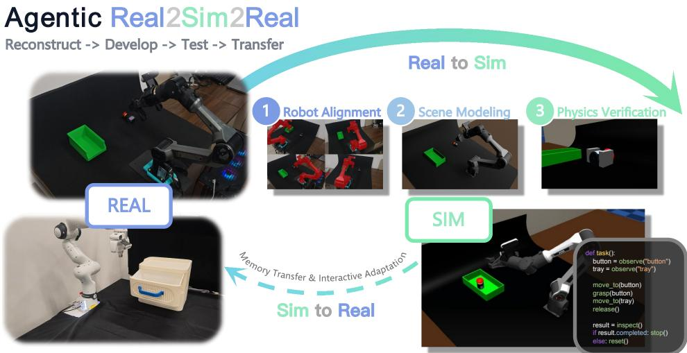  
Figure 1: Agentic RSR overview. An agent uses real observations and known robot geometry to reconstruct a metrically aligned scene and check task-relevant interactions. A policy agent develops and tests an executable policy in simulation, then transfers it with experience memory to the real robot for feedback-driven adaptation.

Our contributions are:

• Agentic Real-to-Sim scene reconstruction for executable tasks. We anchor the metric scale of a video-reconstructed workspace to known robot geometry, iteratively reconstruct the scene using reference views and depth and appearance feedback, and check taskrelevant geometric and physical interactions so that the scene supports robot execution;

• An execution-grounded programmatic policy developed by a Codex agent. The Codex agent (OpenAI, 2026) generates a policy bundle containing a complete program and reusable steps. The bundle remains locked during an episode, while the Codex agent (OpenAI, 2026) uses execution results and fresh observations to decide whether to continue, switch steps, retry, or recover;

• A unified Agentic Real-to-Sim-to-Real closed-loop framework. A consistent task-level observation and action interface connects scene reconstruction, simulation-based policy testing, and hardware execution, where execution feedback supports verification and recovery.

## 2 RELATED WORK

Real-to-Sim Scene Reconstruction for Robot Policies. RL-GSBridge and GSWorld combine high-fidelity scene representations with robot simulation, while Re<sup>3</sup>Sim and RoboSimGS couple rendering with interaction geometry for manipulation and sim-to-real learning (Wu et al., 2025; Jiang et al., 2026; Han et al., 2025; Zhao et al., 2026). RoboSnap builds simulation-ready scenes from a single RGB image (Zhang et al., 2026). Scalable Real2Sim recovers physics-aware assets through robot interaction, whereas TwinAligner addresses visual and dynamic alignment for policy transfer (Pfaff et al., 2025; Fan et al., 2025).

ACDC generates digital cousins that preserve task-relevant affordances, while SIMPLER studies how simulated evaluation relates to real-robot performance (Dai et al., 2025; Li et al., 2025). Holodeck generates prompt-conditioned environments; Gen2Sim produces 3D assets, tasks, and rewards for robot learning (Yang et al., 2024; Katara et al., 2024). SceneSmith, PhyScensis, Sim-World Studio, and Articraft respectively explore vision-language scene generation, physics-guided arrangement, coding-agent environments, and programmatic articulated assets (Pfaff et al., 2026; Wang et al., 2026b; Kang et al., 2026; Zhou et al., 2026). Closer to video-based real-to-sim, Agentic Real2Sim uses agents and simulator-in-the-loop refinement to turn recorded robot–object interactions into simulatable episodic twins, while SimFoundry generates interactive scenes and digital cousins for policy evaluation and sim-to-real training (Chen et al., 2026a; Ranawaka et al., 2026).

Programmatic Robot Policies and Execution-Grounded Agents. Code as Policies and Instruct2Act compose perception and actions into executable programs (Liang et al., 2023; Huang et al., 2023a). SayCan pairs language planning with feasible pretrained skills, while VoxPoser uses 3D value maps for closed-loop trajectory planning (ichter et al., 2023; Huang et al., 2023b). Inner Monologue incorporates environmental feedback into planning; CaP-X studies multi-turn coding agents and code-policy transfer across simulation and hardware (Huang et al., 2023c; Fu et al., 2026). ASPIRE and ENPIRE explore feedback-driven skill development; Show-Harness offers a semantic action interface, and RoboClaw orchestrates learned primitives for long-horizon tasks (Lu et al., 2026; Xiao et al., 2026; Chen et al., 2026b; Li et al., 2026).

Visual and dynamics randomization support sim-to-real transfer (Tobin et al., 2017; Peng et al., 2018), while RT-2, OpenVLA, Octo, and π<sub>0</sub> develop data-driven visuomotor rather than executable robot policies (Zitkovich et al., 2023; Kim et al., 2025; Ghosh et al., 2024; Black et al., 2025). Our focus is to connect reconstruction of a particular captured workspace with a programmatic policy for the same task, evaluated in simulation and on real robots.

Table 1: System-level capability comparison. Reported capabilities in real-scene reconstruction, agentic scene revision, code-policy generation, execution-time recovery, and sim-to-real trials. Sym bols are defined below the table.
<table><tr><td>Capability</td><td>CaP</td><td>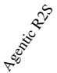</td><td>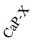</td><td>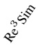</td><td>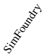</td><td>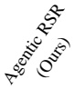</td></tr><tr><td></td><td></td><td>√</td><td></td><td>√</td><td>√</td><td></td></tr><tr><td>Real-scene reconstruction</td><td>X ×</td><td>√</td><td>X ×</td><td>×</td><td>×</td><td>√ √</td></tr><tr><td>Agentic scene revision</td><td>√</td><td>×</td><td>√</td><td>×</td><td>X</td><td>√</td></tr><tr><td>Code-policy generation</td><td>一</td><td>X</td><td>√</td><td>×</td><td>×</td><td>√</td></tr><tr><td>Runtime agent recovery Sim-to-real trials</td><td>一</td><td>一</td><td>√</td><td>√</td><td>√</td><td>√</td></tr></table>

✓: experimentally demonstrated; –: not established in the paper; ×: not part of the implemented method.

## 3 METHOD

## 3.1 REAL-TO-SIM SCENE RECONSTRUCTION FOR EXECUTABLE TASKS

Task and scene output. Given a continuous RGB video V of a workspace, a task description q, and a known robot asset U, we aim to reconstruct the particular captured workspace rather than generate a semantically similar scene variant. The resulting scene should reproduce task-relevant geometry and appearance from reference views while providing collision and physical representations that support robot–object interaction. The workflow connects robot-anchored metric registration, feedback-guided agentic scene reconstruction, and task-interaction checks in MuJoCo (Todorov et al., 2012). The robot asset U supplies both a metric geometric reference and the kinematic model used in downstream simulation.

Robot-anchored metric registration. We sample 32 frames from V and select four as fixed reference views for subsequent scene reconstruction. VGGT-Ω (Wang et al., 2026a) estimates camera intrinsics $K _ { v } ,$ world-to-camera extrinsics $E _ { v } ,$ , and depth $d _ { v }$ for sampled frame $v ,$ while SAM3 (Carion et al., 2026) supplies robot masks. Back-projecting masked depths yields a robot point cloud in the reconstruction frame. We align the known meter-scale URDF surface with this cloud using multi-scale Sim(3) registration, followed by local pose and scale refinement. Let $T _ { B  G }$ denote the similarity transform from robot-base frame $B$ to reconstruction frame $G ,$ , with scale s measured in reconstruction units per meter. Applying $T _ { B  G } ^ { - 1 }$ expresses the reconstructed scene and camera poses in the metric robot-base frame; dividing the estimated depths by s converts them to meters while preserving their relative geometry. Candidate registrations are ranked by projected-mask agreement, bidirectional point-cloud fit, coverage, and depth consistency. Appendix B specifies the objective and search settings.

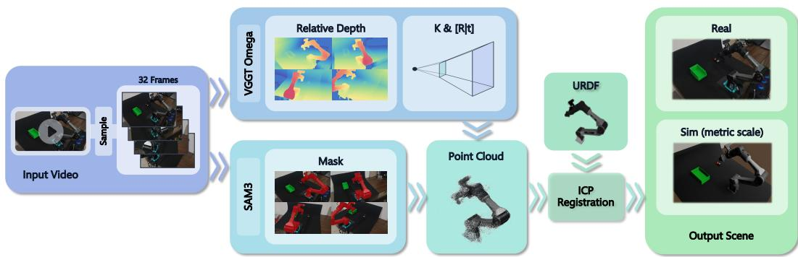  
Figure 2: Recovering metric scale from known robot geometry. Video-estimated depth, camera parameters, and robot masks are used to construct an observed robot point cloud. Aligning this point cloud with the known URDF geometry yields metric depth and camera poses expressed in the robot-base frame.

Feedback-guided agentic scene reconstruction. We invoke Codex agents (OpenAI, 2026) through a Python SDK. A planning session first receives $q$ and four real reference RGB images and produces a plan for task objects, background elements, and spatial relationships. A separate refinement session receives this plan, the initial Blender (Blender Foundation, 2026) scene, the fixed reference-camera status, the real images, and RGB previews of the current scene. Across successive rounds, it edits object geometry, relative layout, materials, and lighting. The robot and four reference cameras are frozen by the execution program and cannot be changed by the agent. The agent can use Blender (Blender Foundation, 2026) Lab MCP tools for scene editing and preview when available. In each round, the refinement agent renders and inspects the candidate before submitting a Blender (Blender Foundation, 2026) Python edit script. An external runner applies the script, checks the frozen assets, saves a separate candidate version, and renders and evaluates it from the four reference views. The agent receives scalar feedback for overall depth and appearance error; acceptance is determined by the programmatic evaluator rather than the agent’s self-assessment.

For reference view v, the evaluator records metric depth error $D _ { v }$ , Lab color difference $C _ { v }$ , and valid rendered-depth coverage $Q _ { v }$ . Equal-weight averages over the four views give $\overline { { D } }$ and $\overline { { C } } .$ . The joint visual check requires $\bar { D } < 0 . 1 5$ m and $\breve { C } < 1 5$ , together with $D _ { v } < 0 . 2 0$ m, $C _ { v } < 3 0$ , and $Q _ { v } \geq 0 . 5 0$ for every view. Otherwise, refinement continues or records failure at the iteration limit. Reaching the mean-depth threshold alone does not establish full acceptance. Since the reference depths come from the preceding video reconstruction, $D _ { v }$ measures consistency with that metric reference rather than geometric error against independently measured ground truth. Per-scene results appear in Appendix C.

MuJoCo scene and task-interaction checks. For a candidate that passes the visual check, a separate Codex session (OpenAI, 2026) receives the task description, scene plan, mesh inventory, and reference-view images. It classifies meshes as visual-only elements, static support or collision geometry, or movable or articulated task objects. These classifications are reviewable physical hypotheses, not measurements of real object properties. An exporter then combines the scene with the known robot model to generate a MuJoCo (Todorov et al., 2012) scene $\boldsymbol { \mathcal { S } } _ { M }$ with appropriate collision representations and simulated physical properties. A separate Codex physics-checking session (OpenAI,

2026) can use repository-provided inspection tools to examine task-object states and run settling, simplified grasp, or articulated-motion probes. Where justified, it tests a separate candidate with changes to collision geometry, object pose, or physical parameters. The runner records tool calls and reports and reruns the relevant probes on revised candidates; visible geometry or pose changes also trigger regression checks from the fixed reference views.

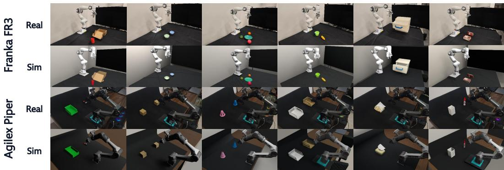  
Figure 3: Real and simulated views of a subset of task scenes.

## 3.2 SIMULATION-BASED POLICY GENERATION AND EXECUTION

Three-pass policy iteration. Policy development proceeds through three successive passes. First, ground-truth object poses are temporarily available in the nominal scene, allowing the agent to establish task decomposition and action logic. Second, this privileged access is removed: the policy must estimate object state through the visual observation interface intended for subsequent real-robot use and complete the task in the nominal scene. Third, the same visual interface is retained while bounded variation is introduced in initial object positions, camera pose and calibration, and action execution. This pass tests whether the policy adapts to new observations and execution outcomes. The agent may revise its policy within each pass; when it judges the task complete from observations, it renders a final frame as evidence before passing the policy and experience notes to a fresh agent conversation for the next pass. These passes constitute iterative development; the submitted policy version is held fixed during final evaluation, while its actions can still respond to observations.

Policy-facing interface. The simulator loads a reconstructed MuJoCo (Todorov et al., 2012) scene and provides a consistent task-level interface for Piper and Franka. State and observation interfaces provide the end-effector state, estimated wrist-camera pose, gripper state, wrist and third-person images, and object-position estimates derived from wrist RGB-D and SAM3 (Carion et al., 2026). Action interfaces support end-effector pose commands, gripper control, and sparse trajectories; control-flow interfaces support scene reset, yielding control, and stopping execution. Apart from the temporary object-pose access in the first pass, the visual policy cannot read simulator truth or rely on a built-in pick-and-place action or task-success oracle.

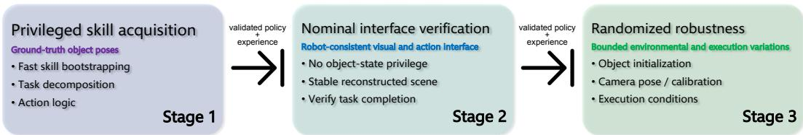  
Figure 4: Three-stage policy development. The policy progresses from privileged skill acquisition to nominal interface verification and randomized robustness, passing validated policy and experience between stages.

Execution-grounded policy loop. In each development pass, the Codex agent (OpenAI, 2026) writes a programmatic policy using the task description and public interface. A single program execution may interleave repeated observations and actions. If execution fails or yields control, the runner returns action outcomes, errors, and recent observations to the same agent conversation. The agent can then continue from the current scene, reset and retry, or revise the policy before another execution. Yielding control preserves the scene state; resetting starts a new attempt and resamples perturbations in the randomized pass. The agent decides whether the task is complete from its observations and provides a final rendered frame as evidence; it does not receive a built-in task-success oracle.

## 3.3 SIM-TO-REAL TRANSFER OF POLICY AND EXPERIENCE MEMORY

Policy and experience memory. The simulation phase transfers two complementary forms of information: the policy retains validated task steps and observation–action logic, while experience memory summarizes effective behaviors, failure causes, perception difficulties, and actions to try or avoid. This memory helps the agent adapt to the real environment; it does not provide ground-truth object poses or simulator internals. A new agent conversation begins with the policy and experience memory but must re-localize objects and assess task state from current real observations rather than reuse simulated coordinates or success claims.

Robot-side safety constraints and online verification. During transfer, a robot-side safety mechanism automatically checks coordinate frames and camera calibration, enforces action limits and a safe workspace specific to the robot and task, and gates execution accordingly. Actions that violate these constraints are not executed. In parallel, the real-robot policy instructions require the agent to observe more frequently within a single program invocation, particularly before and after consequential actions, so that it reconfirms object locations and robot state before continuing, adjusting, or stopping. Real execution outcomes may update the experience memory; the agent assesses task completion from current observations rather than relying on a built-in success signal.

## 4 EXPERIMENTS

We evaluate Agentic RSR on 18 real-world manipulation scenes and tasks across two robots, covering scene reconstruction, simulated and real-robot policy execution, and component ablations.

## 4.1 EXPERIMENTAL SETUP

Each of the 18 tasks is paired with a workspace RGB video. All scene-reconstruction methods receive the same source video and select frames according to their input requirements; methodspecific additional capture is reported separately. The camera slowly circles the workspace, with each frame showing the robot, scene, and task objects. Unless noted, Agentic RSR uses Codex agents (OpenAI, 2026) powered by GPT-6 Astra with high reasoning effort; the model-swap ablation uses the stated alternative.

We measure scene quality with depth mean absolute error (Depth MAE), CIE 1976 Lab color difference (Lab $\Delta E _ { 7 6 } )$ , and structural similarity index measure (SSIM). When object-level geometry is available, we also report symmetric Chamfer distance (CD), F1 at a 1 cm threshold (F1@1cm), and bounding-box center error.

For policy evaluation, task success rate (SR) is the fraction of completed tasks for Instruct2Act (Huang et al., 2023a) and Agentic RSR; Code as Policies (Liang et al., 2023) instead reports a task-equal average of recorded real-robot attempts. We report simulation success rate (Sim SR) and real-robot success rate (Real SR). For Code as Policies and Instruct2Act, conversion is the descriptive ratio 100×Real SR/Sim SR from unrounded rates; it is undefined when Sim SR is zero and is not paired task transfer. For Agentic RSR, conversion is the fraction of simulation-successful tasks that also succeed on the real robot. All aggregate results weight scenes or tasks equally.

Table 2: Scene reconstruction results across 18 tasks. – indicates that the method does not provide the outputs needed to compute the corresponding metric.
<table><tr><td></td><td colspan="6">Depth MAE</td><td></td></tr><tr><td>Method</td><td>Input</td><td>(m)↓</td><td></td><td></td><td></td><td></td><td>∆E76 ↓ SSIM ↑ CD (m)↓ F1@1cm↑ BBox (m)↓</td></tr><tr><td>Re³Sim (Han et al., 2025)</td><td>Multi-view</td><td></td><td>20.60</td><td>0.5835</td><td>一</td><td></td><td></td></tr><tr><td>RL-GSBridge (Wu et al., 2025)</td><td>Video</td><td></td><td>22.87</td><td>0.5568</td><td></td><td></td><td></td></tr><tr><td>RoboSimGS (Zhao et al., 2026)</td><td>Multi-view</td><td></td><td>20.43</td><td>0.5939</td><td></td><td></td><td></td></tr><tr><td>SimFoundry (Ranawaka et al., 2026)</td><td>Video</td><td>0.3916</td><td>60.48</td><td>0.4495</td><td>0.1736</td><td>0.0084</td><td>0.2355</td></tr><tr><td>Agentic RSR (Ours)</td><td>Video</td><td>0.1057</td><td>11.04</td><td>0.6990</td><td>0.0303</td><td>0.3655</td><td>0.0869</td></tr></table>

## 4.2 REAL-TO-SIM SCENE RECONSTRUCTION

We first test whether workspace videos can be converted into metric, visually consistent, taskrelevant simulation scenes. Robot segmentation and registration use VGGT-Ω (Wang et al., 2026a), SAM3 (Carion et al., 2026), and the known robot URDF to recover scale and robot–camera alignment. Scene planning and refinement construct the task scene in Blender (Blender Foundation, 2026) while keeping the registered robot and reference cameras fixed; the selected scene is converted to MuJoCo (Todorov et al., 2012) for interaction.

Across the 18 scenes, refinement reduces mean four-view Depth MAE from 0.9036 m to 0.1057 m and mean Lab $\Delta E _ { 7 6 }$ from 24.84 to 11.04, while achieving a mean full-frame grayscale SSIM of 0.6990. All scenes reach mean Depth MAE < 0.15 m by round 6; the mean first-hit and selected delivery rounds are 2.0 and 4.3. The depth threshold alone does not satisfy the complete acceptance criteria.

Across 42 measured objects, the scene-equal mean symmetric Chamfer distance is 0.0303 m, F1@1cm is 0.3655, and visible bounding-box center error is 0.0869 m. These results indicate that visual feedback improves appearance and depth consistency while recovering task-object arrangement. Per-scene results are provided in Appendix C.

We additionally evaluate Re<sup>3</sup>Sim (Han et al., 2025), RL-GSBridge (Wu et al., 2025), RoboSimGS (Zhao et al., 2026), and SimFoundry (Ranawaka et al., 2026) on the 18 task videos. All methods share the source videos, but differ in whether they process video directly or selected multi-view frames. Missing entries in Table 2 reflect output incompatibility: some methods produce images or Gaussian representations without depth or instance-level geometry directly usable here, not an inherent inability of Gaussian representations to produce depth. Among comparable metrics, Agentic RSR has the lowest depth and color errors, highest SSIM, and best available object-geometry scores, indicating preservation of task-object geometry and spatial relationships for downstream interaction. Per-scene results appear in Appendix C.

## 4.3 SIMULATION AND REAL-ROBOT POLICY EVALUATION

We report simulation and real-robot results for Code as Policies (Liang et al., 2023), Instruct2Act (Huang et al., 2023a), and Agentic RSR across the 18 tasks, retaining each method’s native policy format.

We measure success under randomized simulation conditions and recorded real-robot attempts. Table 3 reports aggregate results; task IDs are listed in Appendix A.

Code as Policies (Liang et al., 2023) reports Sim SR and task-equal real-robot success of 50.0% and 25.6%, respectively, for a descriptive conversion ratio of 51.1%. Instruct2Act (Huang et al., 2023a) succeeds on 7/18 simulation tasks and 5/18 real-robot tasks, yielding Sim SR, Real SR, and conversion of 38.9%, 27.8%, and 71.4%.

Agentic RSR completes 10/18 tasks in simulation, 8 of which also succeed on the real robot, yielding Sim SR, Real SR, and paired transfer of 55.6%, 44.4%, and 80.0%.

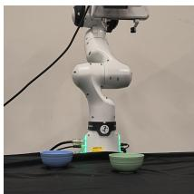  
(a)

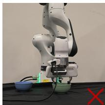  
(b)

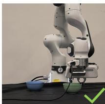  
(c)

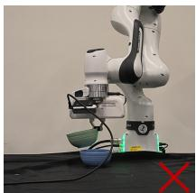  
(d)

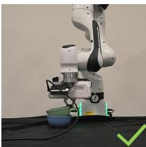  
(e)  
Figure 5: Representative real-robot execution frames. The initial scene is shown in (a); red crosses and green checks mark failed and successful placement outcomes in the subsequent trials.

Perception and manipulation technique both affect execution. A single wrist-camera view can be occluded or too narrow, and baseline records include cases where task objects were not recognized. Agentic RSR instead iterates on task steps in simulation and uses execution feedback to reobserve, adjust, or retry, responding to viewpoint changes and post-manipulation object states.

For example, bowl stacking requires stable grasp and placement contacts, not just object localization. Repeated simulation attempts let the agent encode such techniques in policy steps and experience for real-robot execution. Table 3 therefore captures revision from execution outcomes, not only one-shot action generation. Because Code as Policies (Liang et al., 2023) hardware scenarios do not fully match the indexed tasks, real-robot comparisons remain descriptive rather than paired.

Table 3: Simulation and real-robot policy results across 18 tasks. For the Code as Policies and Instruct2Act baselines, conversion is the ratio of reported real-robot to simulation success rates, not paired task transfer. For Agentic RSR, conversion measures paired transfer among tasks that succeed in simulation.
<table><tr><td>Method</td><td>Sim SR (%) ↑</td><td>Real SR (%) ↑</td><td>Conversion (%) ↑</td></tr><tr><td>Code as Policies (Liang et al., 2023)</td><td>50.0</td><td>25.6</td><td>51.1</td></tr><tr><td>Instruct2Act (Huang et al., 2023a)</td><td>38.9</td><td>27.8</td><td>71.4</td></tr><tr><td>Agentic RSR (Ours)</td><td>55.6</td><td>44.4</td><td>80.0</td></tr></table>

## 4.4 ABLATIONS

We examine model choice, scalar metric feedback, and initial calibration on the same 18 scenes. The full system passes the visual check in all scenes; replacing the refinement agent with GPT-5.6 Sol at high reasoning effort reduces this to 10/18 and raises mean Depth MAE from 0.1057 m to 0.2119 m and Lab $\bar { \Delta } E _ { 7 6 }$ from 11.04 to 13.31. In this setting, GPT-6 Astra appears to use visual feedback more effectively, although this comparison does not establish a general advantage across spatial-reasoning tasks.

Without scalar metric feedback, eight scenes still reach the depth threshold at a mean first-hit round of 2.0, but only 6/18 pass the full visual check and mean Depth MAE rises to 0.3746 m. Images enable rapid adjustment, but explicit depth and appearance metrics better guide error prioritization and acceptance.

Without initial calibration, only 3/18 scenes pass. Of the four that reach the depth threshold, the mean first-hit round rises to 6.8. Lab $\Delta E _ { 7 6 }$ remains close to the full system (11.99 versus 11.04), but Depth MAE increases to 0.2583 m. Thus, visually similar scenes can retain substantial position or scale errors; calibration provides a more reliable starting point. Table 4 summarizes these results, with per-scene data in Appendix C.2.

## 5 LIMITATIONS

In our exploratory use of GPT-6 Astra, we observed noticeable differences in agent behavior across devices and invocation interfaces, as well as between runs on the same device at different times. These observations have not been measured under a controlled, matched-input protocol, so their causes remain unclear. Such variability makes agent behavior difficult to reproduce when relying on a closed-source model service. We hope for stronger transparency and oversight of these services, including clear model versioning and stable invocation interfaces, so that researchers can access them consistently and reasonably reproduce experimental results.

Table 4: Real-to-Sim scene-refinement ablations across 18 scenes. $R _ { 0 . 1 5 }$ is the mean first-hit round among scenes reaching the depth threshold.
<table><tr><td>Variant</td><td>Pass</td><td> $R _ { 0 . 1 5 }$  →</td><td>Depth MAE (m)↓</td><td>Lab↓</td><td>SSIM ↑</td></tr><tr><td>Full system</td><td>18/18</td><td>2.0</td><td>0.1057</td><td>11.04</td><td>0.6990</td></tr><tr><td>GPT-5.6 Sol (high)</td><td>10/18</td><td>3.9</td><td>0.2119</td><td>13.31</td><td>0.6702</td></tr><tr><td>w/o metric feedback</td><td>6/18</td><td>2.0</td><td>0.3746</td><td>15.12</td><td>0.6490</td></tr><tr><td>w/o initial calibration</td><td>3/18</td><td>6.8</td><td>0.2583</td><td>11.99</td><td>0.6597</td></tr></table>

Programmatic control and agent-driven revision present different trade-offs between execution speed and adaptability. Code as Policies (CaP) turns task instructions into executable programs that can themselves contain perception-feedback loops (Liang et al., 2023). Instruct2Act likewise generates programs that compose perception, planning, and robot actions from multimodal instructions (Huang et al., 2023a). When execution encounters a case outside a program’s anticipated logic—such as perceptual confusion between similar-looking objects—a fixed program may have limited means to revise its subsequent strategy in light of the failure. Our approach allows a program to perform multiple observations and actions per invocation, while the agent uses execution feedback at checkpoints or after failures to decide how to proceed. This aims to balance execution efficiency and adaptability, but model-call latency and discrete checkpoints still limit our response to rapidly changing contacts compared with the high-frequency visuomotor control targeted by VLA policies such as $\pi _ { 0 }$ (Black et al., 2025). Future systems could combine high-level programmatic reasoning with faster low-level closed-loop control. Tools such as Jev (Almeida, 2026), designed for fast structured decisions, offer another direction to investigate, although their benefit for robot tasks remains to be established.

## 6 CONCLUSION

We present Agentic RSR, a Real-to-Sim-to-Real loop connecting reconstruction of a captured workspace, execution-grounded programmatic policy development, and real-robot execution. Robot-anchored registration establishes metric scale; reference-view depth and appearance feedback guide scene reconstruction, while MuJoCo (Todorov et al., 2012) checks task-relevant physical interactions. Policy development progresses from privileged information to visual observations and then randomized simulation. A program can observe and act repeatedly within one invocation, and the agent uses execution outcomes to decide how to continue or recover. During transfer, the pol icy and experience memory carry task knowledge into real-robot execution; the agent adapts its subsequent behavior to real observations, while robot-side safety mechanisms constrain its actions. The central contribution is a task-level loop in which scene reconstruction, executable policies, and real-world execution feedback inform one another.

## AI USE STATEMENT

Generative AI tools, including coding agents, assisted with research and evaluation planning, implementation of parts of the Real-to-Sim and simulation-policy workflows, organization of experimental records and references, and manuscript polishing and typesetting. The role of AI agents within Agentic RSR is described separately in Section 3. The authors retain responsibility for the study design, verification of reported results and citations, and the final manuscript.

## REFERENCES

Diogo Almeida. Introducing system one models & jev. TypeSafe AI Blog, 2026. URL https: //typesafe.ai/blog/introducing-system-one-models-and-jev.

Kevin Black, Noah Brown, Danny Driess, Adnan Esmail, Michael Robert Equi, Chelsea Finn, Niccolo Fusai, Lachy Groom, Karol Hausman, Brian Ichter, Szymon Jakubczak, Tim Jones, Liyiming Ke, Sergey Levine, Adrian Li-Bell, Mohith Mothukuri, Suraj Nair, Karl Pertsch, Lucy Xiaoyang Shi, Laura Smith, James Tanner, Quan Vuong, Anna Walling, Haohuan Wang, and Ury Zhilinsky. π : A vision-language-action flow model for general robot control. In Robotics: Science and Systems XXI, 2025. doi: 10.15607/RSS.2025.XXI.010. URL https: //www.roboticsproceedings.org/rss21/p010.html.

Blender Foundation. Blender: Free and open source 3d creation suite, 2026. URL https://www. blender.org/about/. Project website, accessed 2026-09-26.

Nicolas Carion, Laura Gustafson, Yuan-Ting Hu, Shoubhik Debnath, Ronghang Hu, Didac Suris Coll-Vinent, Chaitanya Ryali, Kalyan Vasudev Alwala, Haitham Khedr, Andrew Huang, Jie Lei, Tengyu Ma, Baishan Guo, Arpit Kalla, Markus Marks, Joseph Greer, Meng Wang, Peize Sun, Roman Rädle, Triantafyllos Afouras, Effrosyni Mavroudi, Katherine Xu, Tsung-Han Wu, Yu Zhou, Liliane Momeni, Rishi Hazra, Shuangrui Ding, Sagar Vaze, Francois Porcher, Feng Li, Siyuan Li, Aishwarya Kamath, Ho Kei Cheng, Piotr Dollar, Nikhila Ravi, Kate Saenko, Pengchuan Zhang, and Christoph Feichtenhofer. Sam 3: Segment anything with concepts. In The Fourteenth International Conference on Learning Representations, 2026. URL https://proceedings.iclr.cc/paper\_files/paper/2026/hash/ e0982cbc81401df3430ee1ff780dc7a2-Abstract-Conference.html.

Guanxiong Chen, Qianjun Xia, Jiawei Peng, Heng Zhang, Pengyu Jing, Bole Ma, Justin Qian, Yixian Cheng, Ziyi Jiao, Bingyang Zhou, Yiduo Qu, Luoxin Ye, Kaifeng Zhang, Kunyi Wang, Weijia Zeng, Yunuo Chen, Pengzhi Yang, Ziqiu Zeng, Siyuan Luo, Huamin Wang, Chao Liu, Alan Yuille, Fan Shi, Changxi Zheng, Yunzhu Li, Chenfanfu Jiang, and Peter Yichen Chen. Agentic real2sim: Physics-based world modeling with vision-language agents, 2026a. URL https: //arxiv.org/abs/2607.19190.

Yanzhe Chen, Zechen Bai, Zhijun Cao, Wenzheng Zeng, Kevin Qinghong Lin, Yiqi Lin, Guoqiang Liang, Kevin Yuchen Ma, Qiming Huang, and Mike Zheng Shou. Show-harness: Just a vlm agent can play robots, 2026b. URL https://arxiv.org/abs/2609.10522.

Tianyuan Dai, Josiah Wong, Yunfan Jiang, Chen Wang, Cem Gokmen, Ruohan Zhang, Jiajun Wu, and Fei-Fei Li. Automated creation of digital cousins for robust policy learning. In Proceedings of The 8th Conference on Robot Learning, volume 270, pp. 4912–4943, 2025. URL https: //proceedings.mlr.press/v270/dai25a.html.

Hongwei Fan, Hang Dai, Jiyao Zhang, Jinzhou Li, Qiyang Yan, Yujie Zhao, Mingju Gao, Jinghang Wu, Hao Tang, and Hao Dong. Twinaligner: Visual-dynamic alignment empowers physics-aware real2sim2real for robotic manipulation, 2025. URL https://arxiv.org/abs/2512. 19390.

Letian Fu, Justin Yu, Karim El-Refai, Ethan Kou, Haoru Xue, Huang Huang, Wenli Xiao, Fei-Fei Li, Guanya Shi, Jiajun Wu, S. Shankar Sastry, Yuke Zhu, Ken Goldberg, and Jim Fan. CaP-X: A framework for benchmarking and improving coding agents for robot manipulation. In Forty-third International Conference on Machine Learning, 2026. URL https://icml.cc/virtual/ 2026/poster/66369.

Dibya Ghosh, Homer Rich Walke, Karl Pertsch, Kevin Black, Oier Mees, Sudeep Dasari, Joey Hejna, Tobias Kreiman, Charles Xu, Jianlan Luo, You Liang Tan, Lawrence Yunliang Chen, Quan Vuong, Ted Xiao, Pannag R. Sanketi, Dorsa Sadigh, Chelsea Finn, and Sergey Levine. Octo: An open-source generalist robot policy. In Robotics: Science and Systems XX, 2024. doi: 10.15607/rss.2024.xx.090. URL https://doi.org/10.15607/rss.2024.xx.090.

Xiaoshen Han, Junqiu Yu, Minghuan Liu, Yilun Chen, Xiaoyang Lyu, Yang Tian, Bolun Wang, Weinan Zhang, and Jiangmiao Pang. Re<sup>3</sup>Sim: Generating high-fidelity simulation data via 3dphotorealistic real-to-sim for robotic manipulation, 2025. URL https://arxiv.org/abs/ 2502.08645.

Siyuan Huang, Zhengkai Jiang, Hao Dong, Yu Qiao, Peng Gao, and Hongsheng Li. Instruct2act: Mapping multi-modality instructions to robotic actions with large language model, 2023a. URL https://arxiv.org/abs/2305.11176.

Wenlong Huang, Chen Wang, Ruohan Zhang, Yunzhu Li, Jiajun Wu, and Li Fei-Fei. Voxposer: Composable 3d value maps for robotic manipulation with language models. In Proceedings of The 7th Conference on Robot Learning, volume 229, pp. 540–562, 2023b. URL https:// proceedings.mlr.press/v229/huang23b.html.

Wenlong Huang, Fei Xia, Ted Xiao, Harris Chan, Jacky Liang, Pete Florence, Andy Zeng, Jonathan Tompson, Igor Mordatch, Yevgen Chebotar, Pierre Sermanet, Tomas Jackson, Noah Brown, Linda Luu, Sergey Levine, Karol Hausman, and Brian Ichter. Inner monologue: Embodied reasoning through planning with language models. In Proceedings of The 6th Conference on Robot Learning, volume 205, pp. 1769–1782, 2023c. URL https://proceedings.mlr.press/ v205/huang23c.html.

brian ichter, Anthony Brohan, Yevgen Chebotar, Chelsea Finn, Karol Hausman, Alexander Herzog, Daniel Ho, Julian Ibarz, Alex Irpan, Eric Jang, Ryan Julian, Dmitry Kalashnikov, Sergey Levine, Yao Lu, Carolina Parada, Kanishka Rao, Pierre Sermanet, Alexander T Toshev, Vincent Vanhoucke, Fei Xia, Ted Xiao, Peng Xu, Mengyuan Yan, Noah Brown, Michael Ahn, Omar Cortes, Nicolas Sievers, Clayton Tan, Sichun Xu, Diego Reyes, Jarek Rettinghouse, Jornell Quiambao, Peter Pastor, Linda Luu, Kuang-Huei Lee, Yuheng Kuang, Sally Jesmonth, Nikhil J. Joshi, Kyle Jeffrey, Rosario Jauregui Ruano, Jasmine Hsu, Keerthana Gopalakrishnan, Byron David, Andy Zeng, and Chuyuan Kelly Fu. Do as i can, not as i say: Grounding language in robotic affordances. In Proceedings of The 6th Conference on Robot Learning, volume 205, pp. 287–318, 2023. URL https://proceedings.mlr.press/v205/ichter23a.html.

Guangqi Jiang, Haoran Chang, Ri-Zhao Qiu, Yutong Liang, Mazeyu Ji, Jiyue Zhu, Xueyan Zou, Zhao Dong, and Xiaolong Wang. GSWorld: Closed-loop photo-realistic simulation suite for robotic manipulation. In 2026 IEEE International Conference on Robotics and Automation (ICRA), 2026. URL https://ras.papercept.net/conferences/conferences/ ICRA26/program/ICRA26\_ContentListWeb\_3.html#tui1i\_48.

Haoqiang Kang, Xiaokang Ye, Yuhan Liu, Siddhant Hitesh Mantri, Lingjun Mao, James Fleming, Drishti Regmi, and Lianhui Qin. Simworld studio: Automatic environment generation with evolving coding agent for embodied agent learning, 2026. URL https://arxiv.org/abs/ 2605.09423.

Pushkal Katara, Zhou Xian, and Katerina Fragkiadaki. Gen2sim: Scaling up robot learning in simulation with generative models. In 2024 IEEE International Conference on Robotics and Automation (ICRA), 2024. doi: 10.1109/ICRA57147.2024.10610566. URL https://doi. org/10.1109/ICRA57147.2024.10610566.

Moo Jin Kim, Karl Pertsch, Siddharth Karamcheti, Ted Xiao, Ashwin Balakrishna, Suraj Nair, Rafael Rafailov, Ethan P. Foster, Pannag R. Sanketi, Quan Vuong, Thomas Kollar, Benjamin Burchfiel, Russ Tedrake, Dorsa Sadigh, Sergey Levine, Percy Liang, and Chelsea Finn. Openvla: An open-source vision-language-action model. In Proceedings of The 8th Conference on Robot Learning, volume 270, pp. 2679–2713, 2025. URL https://proceedings.mlr.press/ v270/kim25c.html.

Ruiying Li, Yunlang Zhou, Yuyao Zhu, Kylin Chen, Jingyuan Wang, Sukai Wang, Kongtao Hu, Minhui Yu, Bowen Jiang, Zhan Su, Jiayao Ma, Xin He, Yongjian Shen, Yang Yang, Guanghui Ren, Maoqing Yao, Wenhao Wang, and Yao Mu. Roboclaw: An agentic framework for scalable long-horizon robotic tasks, 2026. URL https://arxiv.org/abs/2603.11558.

Xuanlin Li, Kyle Hsu, Jiayuan Gu, Oier Mees, Karl Pertsch, Homer Rich Walke, Chuyuan Fu, Ishikaa Lunawat, Isabel Sieh, Sean Kirmani, Sergey Levine, Jiajun Wu, Chelsea Finn, Hao Su, Quan Vuong, and Ted Xiao. Evaluating real-world robot manipulation policies in simulation. In Proceedings of The 8th Conference on Robot Learning, volume 270, pp. 3705–3728, 2025. URL https://proceedings.mlr.press/v270/li25c.html.

Jacky Liang, Wenlong Huang, Fei Xia, Peng Xu, Karol Hausman, Brian Ichter, Pete Florence, and Andy Zeng. Code as policies: Language model programs for embodied control. In 2023 IEEE International Conference on Robotics and Automation (ICRA), 2023. doi: 10.1109/ICRA48891. 2023.10160591. URL https://doi.org/10.1109/ICRA48891.2023.10160591.

Runyu Lu, Yubo Wu, Ethan Kou, Letian Fu, Wenli Xiao, Ajay Mandlekar, Yinzhen Xu, Guanya Shi, Ken Goldberg, Ang Chen, Mosharaf Chowdhury, Yuke Zhu, Linxi Fan, and Guanzhi Wang. Aspire: Agentic /skills discovery for robotics, 2026. URL https://arxiv.org/abs/2607. 00272.

OpenAI. Openai codex python sdk, 2026. URL https://github.com/openai/codex/ blob/main/sdk/python/README.md. Official SDK documentation, accessed 2026-09- 26.

Xue Bin Peng, Marcin Andrychowicz, Wojciech Zaremba, and Pieter Abbeel. Sim-to-real transfer of robotic control with dynamics randomization. In 2018 IEEE International Conference on Robotics and Automation (ICRA), 2018. doi: 10.1109/ICRA.2018.8460528. URL https:// doi.org/10.1109/ICRA.2018.8460528.

Nicholas Pfaff, Evelyn Fu, Jeremy Binagia, Phillip Isola, and Russ Tedrake. Scalable real2sim: Physics-aware asset generation via robotic pick-and-place setups. In 2025 IEEE/RSJ International Conference on Intelligent Robots and Systems (IROS), 2025. doi: 10.1109/IROS60139.2025. 11246653. URL https://doi.org/10.1109/IROS60139.2025.11246653.

Nicholas Pfaff, Thomas Cohn, Sergey Zakharov, Rick Cory, and Russ Tedrake. Scenesmith: Agentic generation of simulation-ready indoor scenes. In Forty-third International Conference on Machine Learning, 2026. URL https://icml.cc/virtual/2026/poster/63465.

Nadun Ranawaka, Josiah Wong, Wei-Lin Pai, Wei-Teng Chu, Tianyuan Dai, Masoud Moghani, Hang Yin, Yunfan Jiang, Wesley Durbano, Brandon Huynh, Yu Fang, Danfei Xu, Ruohan Zhang, Li Fei-Fei, Linxi Fan, Bowen Wen, Ajay Mandlekar, and Yuke Zhu. Simfoundry: Modular and automated scene generation for policy learning and evaluation, 2026. URL https://arxiv. org/abs/2606.28276.

Josh Tobin, Rachel Fong, Alex Ray, Jonas Schneider, Wojciech Zaremba, and Pieter Abbeel. Domain randomization for transferring deep neural networks from simulation to the real world. In 2017 IEEE/RSJ International Conference on Intelligent Robots and Systems (IROS), 2017. doi: 10.1109/IROS.2017.8202133. URL https://doi.org/10.1109/IROS.2017. 8202133.

Emanuel Todorov, Tom Erez, and Yuval Tassa. Mujoco: A physics engine for model-based control. In IEEE/RSJ International Conference on Intelligent Robots and Systems (IROS), pp. 5026– 5033, 2012. doi: 10.1109/IROS.2012.6386109. URL https://doi.org/10.1109/IROS. 2012.6386109.

Jianyuan Wang, Minghao Chen, Shangzhan Zhang, Nikita Karaev, Johannes Schönberger, Patrick Labatut, Piotr Bojanowski, David Novotny, Andrea Vedaldi, and Christian Rupprecht. Vggtω. In Proceedings of the IEEE/CVF Conference on Computer Vision and Pattern Recognition (CVPR), pp. 21486–21499, 2026a. URL https://openaccess.thecvf.com/ content/CVPR2026/html/Wang\_VGGT-ohm\_CVPR\_2026\_paper.html.

Yian Wang, Han Yang, Minghao Guo, Xiaowen Qiu, Johnson (Tsun-Hsuan) Wang, Wojciech Matusik, Joshua B. Tenenbaum, and Chuang Gan. Physcensis: Physicsaugmented llm agents for complex physical scene arrangement. In The Fourteenth International Conference on Learning Representations, 2026b. URL https://proceedings.iclr.cc/paper\_files/paper/2026/hash/ 8797d13e5998acfab387d4bf0a5b9b00-Abstract-Conference.html.

Yuxuan Wu, Lei Pan, Wenhua Wu, Guangming Wang, Yanzi Miao, Fan Xu, and Hesheng Wang. RL-GSBridge: 3d gaussian splatting based real2sim2real method for robotic manipulation learning. In 2025 IEEE International Conference on Robotics and Automation (ICRA), 2025. doi: 10.1109/ICRA55743.2025.11128103. URL https://doi.org/10.1109/ICRA55743. 2025.11128103.

Wenli Xiao, Jia Xie, Tonghe Zhang, Haotian Lin, Letian Fu, Haoru Xue, Jalen Lu, Yi Yang, Cunxi Dai, Zi Wang, Jimmy Wu, Guanzhi Wang, S. Shankar Sastry, Ken Goldberg, Linxi Fan, Yuke Zhu, and Guanya Shi. Enpire: Agentic robot policy self-improvement in the real world, 2026. URL https://arxiv.org/abs/2606.19980.

Yue Yang, Fan-Yun Sun, Luca Weihs, Eli VanderBilt, Alvaro Herrasti, Winson Han, Jiajun Wu, Nick Haber, Ranjay Krishna, Lingjie Liu, Chris Callison-Burch, Mark Yatskar, Aniruddha Kembhavi, and Christopher Clark. Holodeck: Language guided generation of 3d embodied ai environments. In 2024 IEEE/CVF Conference on Computer Vision and Pattern Recognition (CVPR), 2024. doi: 10.1109/CVPR52733.2024.01536. URL https://openaccess. thecvf.com/content/CVPR2024/html/Yang\_Holodeck\_Language\_Guided\_ Generation\_of\_3D\_Embodied\_AI\_Environments\_CVPR\_2024\_paper.html.

Shujie Zhang, Jingkun Yi, Weipeng Zhong, Zirui Zhou, Yangkun Zhu, Hanqing Wang, Xudong Xu, Weinan Zhang, and Chunhua Shen. Robosnap: One-shot real-to-sim scene generation for generalizable robot learning and evaluation, 2026. URL https://arxiv.org/abs/2607. 06699.

Haoyu Zhao, Cheng Zeng, Linghao Zhuang, Yaxi Zhao, Shengke Xue, Hao Wang, Xingyue Zhao, Zhongyu Li, Kehan Li, Siteng Huang, Mingxiu Chen, Xin Li, Deli Zhao, and Hua Zou. High fidelity simulated data generation for real-world zero-shot robotic manipulation learning with gaussian splatting. IEEE Robotics and Automation Letters, 11(5):5310–5317, 2026. doi: 10. 1109/LRA.2026.3671535. URL https://doi.org/10.1109/LRA.2026.3671535.

Matt Zhou, Ruining Li, Xiaoyang Lyu, Zhaomou Song, Zhening Huang, Chuanxia Zheng, Christian Rupprecht, Andrea Vedaldi, and Shangzhe Wu. Articraft: An agentic system for scalable articulated 3d asset generation, 2026. URL https://arxiv.org/abs/2605.15187.

Brianna Zitkovich, Tianhe Yu, Sichun Xu, Peng Xu, Ted Xiao, Fei Xia, Jialin Wu, Paul Wohlhart, Stefan Welker, Ayzaan Wahid, Quan Vuong, Vincent Vanhoucke, Huong Tran, Radu Soricut, Anikait Singh, Jaspiar Singh, Pierre Sermanet, Pannag R. Sanketi, Grecia Salazar, Michael S. Ryoo, Krista Reymann, Kanishka Rao, Karl Pertsch, Igor Mordatch, Henryk Michalewski, Yao Lu, Sergey Levine, Lisa Lee, Tsang-Wei Edward Lee, Isabel Leal, Yuheng Kuang, Dmitry Kalashnikov, Ryan Julian, Nikhil J. Joshi, Alex Irpan, Brian Ichter, Jasmine Hsu, Alexander Herzog, Karol Hausman, Keerthana Gopalakrishnan, Chuyuan Fu, Pete Florence, Chelsea Finn, Kumar Avinava Dubey, Danny Driess, Tianli Ding, Krzysztof Marcin Choromanski, Xi Chen, Yevgen Chebotar, Justice Carbajal, Noah Brown, Anthony Brohan, Montserrat Gonzalez Arenas, and Kehang Han. Rt-2: Vision-language-action models transfer web knowledge to robotic control. In Proceedings ofThe 7th Conference on Robot Learning, volume 229, pp. 2165–2183, 2023. URL https://proceedings.mlr.press/v229/zitkovich23a.html.

## A TASK CATALOG AND ID MAPPING

The task identifiers below are used throughout the scene and policy evaluations.

Table 5: Task IDs and descriptions for the nine Franka FR3 and nine Agilex Piper tasks.
<table><tr><td>ID</td><td>Franka task</td><td>ID Piper task</td></tr><tr><td>F1</td><td>Close the drawer</td><td>P1 Close the cup lid</td></tr><tr><td>F2</td><td>Put corn in the bucket</td><td>P2 Put the brown block in the white-and- green storage box</td></tr><tr><td>F3</td><td>Put the cup in the box and close the box</td><td>P3 Put the emergency-stop button in the green storage box</td></tr><tr><td></td><td>F4 Stack the snacks</td><td>P4 Put the glue in the clear cup</td></tr><tr><td></td><td>F5 Stack two bowls</td><td>P5 Put the glue in the pen holder</td></tr><tr><td></td><td>F6 Store fruit in the bamboo tray</td><td>P6 Stack the brown blocks</td></tr><tr><td>F7 F8</td><td>Store fruit on the plate</td><td>P7 Stack the cones P8</td></tr><tr><td>F9</td><td>Store three tools</td><td>Stack the storage boxes P9</td></tr><tr><td></td><td>Store two beanbags</td><td>Take out the tissue</td></tr></table>

## B SCENE RECONSTRUCTION AND EXPERIMENT SETUP

## B.1 REGISTRATION OBJECTIVE AND SETTINGS

We align the meter-scale robot surface to the reconstructed robot point cloud by estimating a similarity transform $T ( \mathbf { x } ) = s R \mathbf { x } + \mathbf { t }$ , where s converts meters to VGGT units (Wang et al., 2026a). Candidate transforms are scored using projected robot masks, bidirectional nearest-neighbor distances, point-cloud coverage, and depth consistency. Let I and R be mean mask IoU and recall, and let r be the Euclidean distance between the componentwise 5th and 95th percentiles of the observed robot point cloud. For each direction, $\rho$ is the 60th-percentile nearest-neighbor distance divided by $r ; O$ is the smaller fraction of points whose nearest-neighbor distance is below 0.05r. Let $d _ { 5 0 } ^ { \mathrm { V G G T } }$ be the median across frames of the median absolute projected-depth residual on valid robot-mask/depth overlap. The dimensionless ranking loss is

$$
\begin{array} { r l } & { L = 0 . 5 0 ( 1 - \overline { { I } } ) + 0 . 1 2 ( 1 - \overline { { R } } ) + 0 . 1 4 \operatorname* { m i n } ( 5 \rho _ { m  o } , 1 ) + 0 . 0 8 \operatorname* { m i n } ( 5 \rho _ { o  m } , 1 ) } \\ & { \qquad + \ 0 . 0 8 ( 1 - O ) + 0 . 0 8 \operatorname* { m i n } ( d _ { 5 0 } ^ { \mathrm { V G G T } } / r , 1 ) . } \end{array}
$$

When no valid depth overlap is available, the last term uses its maximum penalty. Table 6 summarizes the registration settings.

Table 6: Settings for robot-based metric-scale registration.
<table><tr><td>Setting</td><td>Value</td></tr><tr><td>Sampled frames per capture</td><td>32</td></tr><tr><td>Rotation initialization</td><td>128 candidates; refine the top 3 and select the lowest final loss</td></tr><tr><td>Initial alignment</td><td>Multi-scale Sim(3) ICP</td></tr><tr><td>Pose refinement</td><td>Two passes over translation, rotation, and scale, followed by coarse- to-fine rotation search</td></tr></table>

## B.2 REGISTRATION SUMMARY

Table 7 summarizes registration fit across nine captures per robot. $L _ { f }$ is the final ranking loss; IoU is averaged across frames. The task-median projected-depth residual $d _ { 5 0 } = 1 0 ^ { 3 } d _ { 5 0 } ^ { \mathrm { V G G T } } / s$ is in millimeters, where s converts meters to VGGT units (Wang et al., 2026a). These fit statistics are distinct from reference-pose error and downstream scene-quality metrics.

Table 7: Robot-registration results across nine captures per robot.
<table><tr><td>Robot</td><td>n</td><td>Mean  $L _ { f }$ </td><td>Median  $L _ { f }$ </td><td> $L _ { f }$  range</td><td>Mean IoU</td><td>Task-median  $d _ { 5 0 }$  (mm)</td></tr><tr><td>Franka</td><td>9</td><td>0.11364</td><td>0.11221</td><td>0.10624–0.12115</td><td>0.8438</td><td>35.3</td></tr><tr><td>Piper</td><td>9</td><td>0.10464</td><td>0.10373</td><td>0.09997–0.11216</td><td>0.8405</td><td>21.3</td></tr></table>

## C COMPLETE QUANTITATIVE RESULTS

## C.1 PER-SCENE RECONSTRUCTION COMPARISON

Table 8 lists per-scene metrics for each method; task IDs are defined in Table 5. Lab $\Delta E _ { 7 6 }$ is loweris-better, grayscale SSIM is higher-is-better, and – denotes an unreported metric. CD is symmetric Chamfer distance in meters, F1 uses a 1 cm threshold, and BBox is visible bounding-box center error in meters.

Table 8: Per-scene reconstruction metrics for Franka and Piper. Bold indicates the best comparable result among reported methods.
<table><tr><td>Method</td><td>Metric</td><td>1</td><td>2</td><td>3</td><td>4</td><td>5</td><td>6</td><td>7</td><td></td><td></td></tr><tr><td colspan="9">Franka</td></tr><tr><td>Re³Sim</td><td>Lab</td><td>20.609</td><td>25.939</td><td>30.323</td><td>26.030</td><td>25.114</td><td>24.360</td><td>29.146</td><td>30.490</td><td>26.289</td></tr><tr><td rowspan="2">RL-GSBridge</td><td>SSIM</td><td>.5612</td><td>.5334</td><td>.4875</td><td>.5280</td><td>.5229</td><td>.5028</td><td>.4980</td><td>.4708</td><td>.5151</td></tr><tr><td>e Lab</td><td>25.854</td><td>29.812</td><td>31.825</td><td>29.304</td><td>25.436</td><td>27.795</td><td>31.520</td><td>31.740</td><td>27.745</td></tr><tr><td rowspan="2">RoboSimGS</td><td>SSIM</td><td>.5507</td><td>.5155</td><td>.4297</td><td>.4980</td><td>.5465</td><td>.5034</td><td>.4644</td><td>.4872</td><td>.5296</td></tr><tr><td>Lab</td><td>20.818</td><td>24.948</td><td>28.042</td><td>24.814</td><td>23.658</td><td>23.916</td><td>26.386</td><td>28.163</td><td>24.992</td></tr><tr><td rowspan="2">SimFoundry</td><td>SSIM</td><td>.5758</td><td>.5717</td><td>.5233</td><td>.5525</td><td>.5589</td><td>.5236</td><td>.5511</td><td>.5300</td><td>.5405</td></tr><tr><td>Lab</td><td>55.781</td><td>55.634</td><td>51.913</td><td>53.194</td><td>55.386</td><td>56.286</td><td>51.924</td><td>51.914</td><td>29.455</td></tr><tr><td rowspan="9"></td><td>SSIM</td><td>.4865</td><td>.5303</td><td>.5431</td><td>.5370</td><td>.5235</td><td>.4887</td><td>.5454</td><td>.5515</td><td>.6215</td></tr><tr><td>Depth</td><td>.4808</td><td>.4476</td><td></td><td>.8517</td><td>.5711</td><td>1.5177</td><td></td><td></td><td>.4680</td></tr><tr><td>CD</td><td>.4756</td><td>.2134</td><td>.1003</td><td>.1404</td><td>.1612</td><td>.2444</td><td>.1160</td><td>.0805</td><td>.2485</td></tr><tr><td>F1</td><td>.0032</td><td>.0000</td><td>.0462</td><td>.0027</td><td>.0000</td><td>.0000</td><td>.0000</td><td>.0578</td><td>.0132</td></tr><tr><td>BBox</td><td>.6709</td><td>.2571</td><td>.1631</td><td>.1954</td><td>.1922</td><td>.2704</td><td>.1539</td><td>.1163</td><td>.3892 8.83</td></tr><tr><td>Lab</td><td>11.80</td><td>10.23</td><td>8.27</td><td>8.42</td><td>10.41</td><td>7.98</td><td>8.69</td><td>11.69</td><td></td></tr><tr><td>SSIM</td><td>.7116 .100</td><td>.7649</td><td>.7748</td><td>.7183</td><td>.7468</td><td>.7585</td><td>.7632</td><td>.7263</td><td>.7263</td></tr><tr><td>Depth CD</td><td>.0222</td><td>.104</td><td>.100</td><td>.145</td><td>.080</td><td>.107</td><td>.097</td><td>.114</td><td>.100 .0319</td></tr><tr><td>F1</td><td>.2936</td><td>.0435 .0351</td><td>.0149</td><td>.0133 .4375</td><td>.0167 .3212</td><td>.0417 .1913</td><td>.0145 .3949</td><td>.0153 .3588</td><td></td></tr><tr><td></td><td>BBox</td><td>.0556</td><td>.0894</td><td>.4363 .0711</td><td>.0589</td><td>.0471 .1003</td><td>.0550</td><td>.0297</td><td>.1037 .0991</td></tr><tr><td colspan="10">Piper</td></tr><tr><td></td><td></td><td></td><td></td><td></td><td></td><td></td><td></td><td></td><td></td><td></td></tr><tr><td rowspan="2">Re³Sim</td><td>Lab</td><td>15.487</td><td>14.695</td><td>15.855</td><td>15.386</td><td>14.669</td><td>13.772</td><td>14.391</td><td>14.995</td><td>13.304</td></tr><tr><td>SSIM</td><td>.6420</td><td>.6501</td><td>.6538</td><td>.6516</td><td>.6565</td><td>.6715</td><td>.6565</td><td>.6319</td><td>.6688</td></tr><tr><td rowspan="2">RL-GSBridge</td><td>Lab</td><td>17.767</td><td>17.605</td><td>16.069</td><td>17.019</td><td>18.058</td><td>14.977</td><td>17.094</td><td>16.651</td><td>15.459</td></tr><tr><td>SSIM</td><td>.5863</td><td>.5993</td><td>.6421</td><td>.6168</td><td>.5498</td><td>.6440</td><td>.6081</td><td>.6116</td><td>.6404</td></tr><tr><td rowspan="2">RoboSimGS</td><td>Lab</td><td>16.638</td><td>15.982</td><td>16.747</td><td>15.649</td><td>15.688</td><td>14.792</td><td>15.766</td><td>16.181</td><td>14.583</td></tr><tr><td>SSIM</td><td>.6227</td><td>.6341</td><td>.6434</td><td>.6501</td><td>.6422</td><td>.6486</td><td>.6432</td><td>.6228</td><td>.6561</td></tr><tr><td rowspan="6">SimFoundry</td><td>Lab</td><td>73.283</td><td>70.678</td><td>74.325</td><td>72.335</td><td>73.594</td><td>65.375</td><td>74.235</td><td>69.383</td><td>73.186</td></tr><tr><td>SSIM</td><td>.3446</td><td>.3515</td><td>.3344</td><td>.3565</td><td>.3387</td><td>.3564</td><td>.3326</td><td>.3542</td><td>.3296</td></tr><tr><td>Depth</td><td>.1569</td><td>.1731</td><td>.1201</td><td>.1291</td><td>.1421</td><td>.2595</td><td>.1951</td><td>.2144</td><td>.1460 .1441</td></tr><tr><td>CD</td><td>.1778</td><td>.1665</td><td>.0589</td><td>.0545</td><td>.1151</td><td>.1069</td><td>.3370</td><td>.1835</td><td></td></tr><tr><td>F1</td><td>.0000</td><td>.0000</td><td>.0000</td><td>.0245</td><td>.0000</td><td>.0035</td><td>.0000</td><td>.0000</td><td>.0000</td></tr><tr><td>BBox Lab</td><td>.1973 12.58</td><td>.2058 14.50</td><td>.2294 11.61</td><td>.0821 12.40</td><td>.1580 11.84</td><td>.1455 11.25</td><td>.3792 13.07</td><td>.2321 12.51</td><td>.2006 12.57</td></tr><tr><td rowspan="6">Agentic RSR</td><td>SSIM</td><td>.6421</td><td></td><td>.6805</td><td>.6583</td><td>.6697</td><td>.6706</td><td>.6577</td><td>.6156</td><td>.6604</td></tr><tr><td>Depth</td><td>.084</td><td>.6358 .091</td><td>.093</td><td>.087</td><td>.124</td><td>.092</td><td>.148</td><td>.109</td><td>.129</td></tr><tr><td></td><td></td><td></td><td></td><td></td><td></td><td></td><td></td><td></td><td>.1245</td></tr><tr><td>CD</td><td>.0082</td><td>.0359</td><td>.0350</td><td>.0132</td><td>.0092</td><td>.0077</td><td>.0161</td><td>.0806</td><td></td></tr><tr><td>F1</td><td>.6817</td><td>.3730</td><td>.0809</td><td>.5571</td><td>.7296</td><td>.7146</td><td>.2658</td><td>.4905</td><td>.1131</td></tr><tr><td>BBox</td><td>.0174</td><td>.0864</td><td>.0772</td><td>.0451</td><td>.0405</td><td>.0324</td><td>.0371</td><td>.2856</td><td>.3367</td></tr></table>

## C.2 SCENE-REFINEMENT ABLATIONS

We evaluate three variants on the same 18 reconstructed scenes, each with at most 10 refinement rounds. The model-swap variant uses GPT-5.6 Sol at high reasoning effort and passes the visual check on 10 scenes. The other two retain GPT-6 Astra at high reasoning effort while removing scalar metric feedback or initial calibration. Table 9 reports the delivered-scene evaluation for accepted scenes, the last valid evaluation for unsuccessful scenes, and the round-0 baseline when no valid refinement-round evaluation was produced.

Table 9: Per-scene results for three scene-refinement ablations across 18 tasks.
<table><tr><td>Variant</td><td>Task</td><td>Pass</td><td>Last round</td><td>D (m)</td><td> $\mathrm { L a b } \Delta E _ { 7 6 }$ </td><td>SSIM</td></tr><tr><td>GPT-5.6 Sol</td><td>F1</td><td>No</td><td>10</td><td>0.2110</td><td>10.79</td><td>0.6883</td></tr><tr><td>GPT-5.6 Sol</td><td>F2</td><td>Yes</td><td>2</td><td>0.1198</td><td>10.75</td><td>0.7141</td></tr><tr><td>GPT-5.6 Sol</td><td>F3</td><td>No</td><td>10</td><td>0.4005</td><td>15.46</td><td>0.6718</td></tr><tr><td>GPT-5.6 Sol</td><td>F4</td><td>No</td><td>10</td><td>0.6543</td><td>27.77</td><td>0.5333</td></tr><tr><td>GPT-5.6 Sol</td><td>F5</td><td>Yes</td><td>9</td><td>0.1389</td><td>8.89</td><td>0.7757</td></tr><tr><td>GPT-5.6 Sol</td><td>F6</td><td>No</td><td>10</td><td>0.2516</td><td>11.46</td><td>0.7084</td></tr><tr><td>GPT-5.6 Sol</td><td>F7</td><td>No</td><td>10</td><td>0.2916</td><td>8.34</td><td>0.7622</td></tr><tr><td>GPT-5.6 Sol</td><td>F8</td><td>Yes</td><td>4</td><td>0.1479</td><td>7.62</td><td>0.7666</td></tr><tr><td>GPT-5.6 Sol</td><td>F9</td><td>No</td><td>10</td><td>0.3517</td><td>12.23</td><td>0.6830</td></tr><tr><td>GPT-5.6 Sol</td><td>P1</td><td>Yes</td><td>2</td><td>0.1209</td><td>14.55</td><td>0.6353</td></tr><tr><td>GPT-5.6 Sol</td><td>P2</td><td>Yes</td><td>10</td><td>0.1498</td><td>12.92</td><td>0.6552</td></tr><tr><td>GPT-5.6 Sol</td><td>P3</td><td>Yes</td><td>1</td><td>0.1085</td><td>14.31</td><td>0.6512</td></tr><tr><td>GPT-5.6 Sol</td><td>P4</td><td>Yes</td><td>2</td><td>0.1410</td><td>14.66</td><td>0.6266</td></tr><tr><td>GPT-5.6 Sol</td><td>P5</td><td>Yes</td><td>6</td><td>0.1394</td><td>12.77</td><td>0.6602</td></tr><tr><td>GPT-5.6 Sol</td><td>P6</td><td>No</td><td>10</td><td>0.1767</td><td>16.72</td><td>0.5963</td></tr><tr><td>GPT-5.6 Sol</td><td>P7</td><td>No</td><td>10</td><td>0.1431</td><td>14.00</td><td>0.6515</td></tr><tr><td>GPT-5.6 Sol</td><td>P8</td><td>Yes</td><td>8</td><td>0.1262</td><td>13.29</td><td>0.6260</td></tr><tr><td>GPT-5.6 Sol</td><td>P9</td><td>Yes</td><td>3</td><td>0.1415</td><td>13.07</td><td>0.6586</td></tr><tr><td>No metric feedback</td><td>F1</td><td>No</td><td>0</td><td>0.9390</td><td>29.92</td><td>0.4805</td></tr><tr><td>No metric feedback</td><td>F2</td><td>No</td><td>10</td><td>0.1938</td><td>11.06</td><td>0.7450</td></tr><tr><td>No metric feedback</td><td>F3</td><td>No</td><td>10</td><td>0.5095</td><td>26.04</td><td>0.5102</td></tr><tr><td>No metric feedback</td><td>F4</td><td>No</td><td>10</td><td>0.2596</td><td>8.41</td><td>0.7656</td></tr><tr><td>No metric feedback</td><td>F5</td><td>No</td><td>10</td><td>0.1616</td><td>7.04</td><td>0.7406</td></tr><tr><td>No metric feedback</td><td>F6</td><td>No</td><td>10</td><td>0.2577</td><td>7.37</td><td>0.7313</td></tr><tr><td>No metric feedback</td><td>F7</td><td>No</td><td>10</td><td>1.7704</td><td>14.70</td><td>0.7027</td></tr><tr><td>No metric feedback</td><td>F8</td><td>No</td><td>0</td><td>0.9501</td><td>33.34</td><td>0.4854</td></tr><tr><td>No metric feedback</td><td>F9</td><td>No</td><td>10</td><td>0.2661</td><td>10.52</td><td>0.7183</td></tr><tr><td>No metric feedback</td><td>P1</td><td>Yes</td><td>2</td><td>0.1209</td><td>11.97</td><td>0.6708</td></tr><tr><td>No metric feedback</td><td>P2</td><td>Yes</td><td>6</td><td>0.1493</td><td>12.62</td><td>0.6610</td></tr><tr><td>No metric feedback</td><td>P3</td><td>No</td><td>10</td><td>0.2154</td><td>16.49</td><td>0.6338</td></tr><tr><td>No metric feedback</td><td>P4</td><td>Yes</td><td>3</td><td>0.1348</td><td>11.60</td><td>0.6616</td></tr><tr><td>No metric feedback</td><td>P5</td><td>Yes</td><td>2</td><td>0.1251</td><td>13.76</td><td>0.6334</td></tr><tr><td>No metric feedback</td><td>P6</td><td>No</td><td>10</td><td>0.1488</td><td>16.54</td><td>0.6345</td></tr><tr><td>No metric feedback</td><td>P7</td><td>Yes</td><td>5</td><td>0.1421</td><td>11.18</td><td>0.6650</td></tr><tr><td>No metric feedback</td><td>P8</td><td>No</td><td>6</td><td>0.2630</td><td>17.30</td><td>0.5665</td></tr><tr><td>No metric feedback</td><td>P9</td><td>Yes</td><td>1</td><td>0.1350</td><td>12.25</td><td>0.6762</td></tr><tr><td>No initial calibration</td><td>F1</td><td>Yes</td><td>7</td><td>0.1388</td><td>9.54</td><td>0.5850</td></tr><tr><td>No initial calibration</td><td>F2</td><td>No</td><td>10</td><td>0.2074</td><td>10.32</td><td>0.7309</td></tr><tr><td>No initial calibration</td><td>F3</td><td>No</td><td>10</td><td>0.2830</td><td>10.71</td><td>0.7349</td></tr><tr><td>No initial calibration</td><td>F4</td><td>No</td><td>10</td><td>0.3699</td><td>10.36</td><td>0.7349</td></tr><tr><td>No initial calibration</td><td>F5</td><td>Yes</td><td>7</td><td>0.1477</td><td>9.01</td><td>0.7552</td></tr><tr><td>No initial calibration</td><td>F6</td><td>No</td><td>10</td><td>0.1599</td><td>8.65</td><td>0.6328</td></tr><tr><td>No initial calibration</td><td>F7</td><td>No</td><td>10</td><td>0.1483</td><td>8.54</td><td>0.7833</td></tr><tr><td>No initial calibration</td><td>F8</td><td>No</td><td>10</td><td>0.2331</td><td>6.83</td><td>0.7956</td></tr><tr><td>No initial calibration</td><td>F9</td><td>No</td><td>10</td><td>0.2354</td><td>8.35</td><td>0.7550</td></tr><tr><td>No initial calibration</td><td>P1</td><td>No</td><td>10</td><td>0.2061</td><td>15.24</td><td>0.5556</td></tr><tr><td>No initial calibration</td><td>P2</td><td>Yes</td><td>4</td><td>0.1467</td><td>13.41</td><td>0.6021</td></tr><tr><td>No initial calibration</td><td>P3</td><td>No</td><td>10</td><td>0.1719</td><td>13.48</td><td>0.6318</td></tr><tr><td>No initial calibration</td><td>P4</td><td>No</td><td>9</td><td>0.3461</td><td>15.16</td><td>0.6151</td></tr><tr><td>No initial calibration</td><td>P5</td><td>No</td><td>10</td><td>0.2426</td><td>15.07</td><td>0.5786</td></tr><tr><td>No initial calibration</td><td>P6</td><td>No</td><td>10</td><td>0.1725</td><td>13.65</td><td>0.6270</td></tr><tr><td>No initial calibration</td><td>P7</td><td>No</td><td>0</td><td>0.9969</td><td>18.21</td><td>0.5913</td></tr><tr><td>No initial calibration</td><td>P8</td><td>No</td><td>10</td><td>0.2573</td><td>15.05</td><td>0.5488</td></tr><tr><td>No initial calibration</td><td>P9</td><td>No</td><td>10</td><td>0.1863</td><td>14.18</td><td>0.6165</td></tr></table>

## D AGENT PROMPT TEMPLATES

This section reproduces the task-independent prompt templates, rather than one task’s fully instantiated conversation. Braced fields are runtime substitutions; local paths, private run locations, and identifying metadata have been removed. Images and public execution reports supplied alongside a prompt are described in the templates but are not reproduced here.

## D.1 REAL-TO-SIM

Stage 1: robot mask query. The only Stage 1 prompt reproduced here is the robot-mask query.

robotic arm with base and camera

Stage 2: visual planning. The planner receives four reference RGB views with the following template.  
```markdown
# Stage 2 plan agent
You are the planning-only agent for a real-to-sim reconstruction task.
## Task
{task_description}
You receive exactly four RGB reference images with this turn. Use them together
with the task description to infer the task-relevant scene structure. Do not read
or search for depth, camera JSON, masks, Stage 1 metadata, Blender files, or any
other artifact. Do not edit any file except the requested plan document.
Stage 1 uses the {robot_name} robot base as the complete scene world origin: `{robot_name}
,→ is
at `[0, 0, 0]`. Treat this as a fixed coordinate convention for all later task
objects. Do not propose translating the whole scene or changing the robot origin.
The {robot_name} arm, its camera mount, gripper, attached parts, and every other robot
or robot-mounted accessory are explicitly out of scope. Do not describe them as
task-object capabilities. The later geometry agent will preserve them without
your help.
Write only this document:
```text
{plan_path}
The document must contain exactly these sections, with useful concise content:
## Object hierarchy
List task objects and their meaningful visual subparts only.
## Approximate dimensions
For every task object in the hierarchy, estimate its visible bounding-box size as
`length × width × height`, using metres or centimetres. Include a plausible
range when the scale is uncertain, state whether the estimate is for the whole
object or a visible subpart, and give a short basis for the estimate (for
example, image proportions or a known task convention). Do not invent false
precision: use rounded values and explicitly mark low-confidence estimates.
The {robot_name} robot may be used only as a visual scale reference; it is not a task
object and must not receive a capability requirement.
## Required capabilities
State only capabilities needed by the task. For example, a button that is
grasped needs a recognizable external shape and graspable dimensions; it does
not need an internal switch mechanism unless the task explicitly requires it.
## Relative layout
Describe the visible spatial relationships between task objects, support surfaces,
containers, and background geometry.
## Necessary assumptions
Record only assumptions required to build a visually and geometrically useful
scene. Mark uncertainty instead of inventing hidden structure.
Do not create a `.blend`, script, render, evaluation, or any other output.
```

Stage 2: iterative scene refinement. The refinement agent also receives the four current renders, the approved plan, and scalar feedback. The no-metric-feedback and uncalibrated ablations modify parts of this prompt and should not be confused with the default condition.

```markdown
# Stage 2 RGB scene refinement agent
You are the single optimization agent for this real-to-sim task:
```text
{task_description}
## Fixed scene convention
Stage 1 already established the {robot_name} base as the complete scene world origin:
`{robot_name}` is at `[0, 0, 0]`. Keep this coordinate convention. Do not translate,
rebuild, or modify the {robot_name} robot, its gripper, its camera mount, or any camera.
```

```markdown
Place every task object relative to this fixed origin.
The original Stage 1 Blend is:
```text
{initial_scene}
The current working copy for this round is:
``text
{current_scene}
Never overwrite either file. The orchestrator will execute your edit script on a
copy and save the result as a new round-specific `.blend`.
The working scene is a Stage 2-only copy named
`initial_with_default_light.blend`. It contains a replaceable neutral lighting
collection named `Stage2_Lighting` with lights such as
`Stage2_DefaultLight_Key` and `Stage2_DefaultLight_Fill`. You may tune, remove,
or replace these lights and the World when matching the reference appearance.
Never modify the Stage 1 source file, the {robot_name} robot, or the four cameras.
## Plan and camera status
The approved task plan is stored at:
```text
{plan_path}
```markdown
{plan_text}
The four cameras are already installed and frozen. Their current status is:
```text
{camera_status}
Use these cameras as fixed observation views. Do not change their transforms,
lenses, clipping, resolution, scene assignment, or camera data.
## RGB inputs and final metrics
The four reference RGB images are:
{reference_rgb_paths}
The current working scene has been rendered from the same four cameras to:
{current_rgb_paths}
The only numeric feedback provided to you is the scalar final metric file:
```text
{metric_path}
It contains overall depth MAE and overall Lab ∆E76, together with their
acceptable ranges. Do not request, read, or use depth images, depth arrays,
depth error maps, camera JSON, masks, or any other Stage 1 metadata. The
programmatic evaluator is authoritative; visual inspection and scalar metrics
must be used together.
## Required optimization order
Work through these stages in order during this turn and across later turns:
1. <sub>**</sub>Geometry blockout<sub>**</sub>: create or correct the task objects, support surfaces,
containers, relative positions, scale, silhouettes, occlusion, and stable
contact. Use simple externally visible geometry first. Do not invent hidden
2. <sub>**</sub>RGB self-check<sub>**</sub>: before editing, render the current scene yourself into:
```text
{round_dir}/agent_self_render/
Use this command when available:
```

```markdown
```bash
real2sim-stage2 render-rgb --scene CURRENT_SCENE --output {round_dir}/agent_self_render
If the command is unavailable, use the repository-local Python fallback:
```bash
PYTHONPATH={repo_root}/src python -m real2sim.stage2.agent_runner render-rgb --scene
,→ CURRENT_SCENE --output {round_dir}/agent_self_render
Open and compare all four reference RGB views and all four current RGB views.
Identify the three largest visible mismatches and fix only those first.
3. <sub>**</sub>Appearance refinement<sub>**</sub>: after geometry is plausible, add task-relevant
materials, colors, roughness, and neutral scene lighting so the rendered RGB
views match the references. Do not let appearance work hide incorrect geometry.
4. <sub>**</sub>Final self-check<sub>**</sub>: render RGB again, compare all four views, and use the
latest scalar metric to decide whether another geometry or appearance change is
needed. Continue iterating until the geometry and visual metrics pass or the
round limit is reached.
## Edit contract
Write the smallest evidence-based Blender Python edit script to:
```text
{edit_script}
The orchestrator will execute it, freeze-check cameras and {robot_name}, save a new
`candidate.blend`, render all four views, and calculate the final metrics. Every
round's Blend must remain in its round directory.
If a Blender Lab MCP tool is available, prefer it. Otherwise use the repository
Blender CLI/Python fallback; never claim an MCP call that did not happen.
This repository uses Blender 5.2.x. When creating Principled materials, locate
the node by `node.type == "BSDF_PRINCIPLED"` or create a
`ShaderNodeBsdfPrincipled`; do not assume that a node named `Principled BSDF
already exists.
At the end, return JSON with exactly these fields:
```json
{{
"summary": "what changed and why",
"changed_objects": ["object names"],
"changed_categories": ["geometry", "materials", "lighting", "relative_layout"],
"next_hypothesis": "what the next four-view RGB comparison should test"
}}
Maximum rounds: {max_rounds}
```

## Stage 3: physical-role classification.

```markdown
# Stage 3 physical-entity classification
You are preparing a Stage 2 Blender scene for a MuJoCo physics simulation. Decide the
physical role of each listed non-robot mesh before scene compilation. Use the task,→
description, Stage 2 plan, inventory and four rendered views. This is a hypothesis,→
about geometry and physical contact, not a measurement of mass or friction.,→
For every mesh, choose exactly one role:
- `visual_only`: room walls, curtains, backdrops, distant decoration and labels that cannot
support or constrain task objects. They remain visible but <sub>**</sub>do not need a physical,→
body or collision<sub>**</sub>. A wall that is part of a reachable container is not a backdrop.,→
一 `static`: reachable tabletops/work surfaces, tray or container floors and walls, and any
other surface needed to support or constrain manipulated objects. They MUST retain,→
,→ collision, even if visually similar to a non-colliding room backdrop.
- `dynamic`: a graspable independent rigid object with a free joint and box collision.
`operable`: a task part with a real hinge/slide degree of freedom, only if the geometry
,→ and task make the joint plausible. Decorative pieces of the same object should be
,→ `visual_only`, not separate moving joints.
compound`: a <sub>**</sub>collidable fixed part attached to a moving entity<sub>**</sub> (basket walls/rims, a
rigid gripper-relevant handle or structural box side). It has no independent joint; its,→
,→ box collider follows the owner's body. Do NOT use `visual_only` for a wall needed to
,→ contain items or support stacked containers merely because it is a child piece. Room
,→ walls and curtains remain `visual_only`.
```

Choose \`collision\` from \`none\`, \`box\`, \`mesh\`, \`open\_container\`. Use \`none\` only for   
,→ \`visual\_only\`, use \`box\` for \`compound\`, prefer \`box\` for physical meshes with flat or   
,→ thin geometry; never use \`mesh\` for a freely movable mesh. MuJoCo treats a mesh   
,→ collider as a convex hull: for a task-relevant hollow cup, bowl, bucket, or pen holder,   
,→ use \`open\_container\` instead of a solid box or mesh, so a bottom and four wall proxies   
,→ leave an accessible interior. This is only an approximation: note its limitations in   
,→ the reason. Choose \`joint\_type\` from \`fixed\`, \`free\`, \`hinge\`, \`slide\`: it must be   
,→ \`fixed\` for \`static\`/\`visual\_only\`/\`compound\`, \`free\` for \`dynamic\`, and \`hinge\` or   
,→ \`slide\` for \`operable\`. Be conservative when uncertain: preserve appearance without   
,→ inventing physics. Do not classify the robot or any of its cameras. Return every   
,→ source\_name exactly once and a short reason for each. No physical mass or friction   
,→ measurement is available.   
For visual pieces of a moving entity (e.g. labels, decorative cap), set \`attached\_to\` to   
,→ the <sub>\*\*</sub>exact source\_name<sub>\*\*</sub> of that entity's \`dynamic\` or \`operable\` mesh. They will move   
,→ with that entity without additional collision. For structural parts that need contact   
,→ (for example open basket walls), choose \`compound\` and set \`attached\_to\` to their   
,→ owner, so they move with collision but no separate joint. Set \`attached\_to\` to null for   
,→ backdrops, room walls, standalone static support surfaces, and primary physical   
,→ entities. Do not leave visual fragments of a movable object fixed in world space.   
Task: {task\_description}   
Stage 2 plan:   
{plan}   
Meshes (dimensions and positions in metres, dimensions are approximations):   
{inventory}

Stage 3: image-only physical prior. This turn is issued only when the compiled scene contains a free-joint object.

# Stage 3 visual physical prior   
Before seeing the simulator's masses, friction or grasp trials, estimate a rough prior   
for ONE task-relevant movable object. Use only the attached third-person image, the,→   
task description and the Stage 2 visual plan below. Choose an exact body name from the,→   
,→ given list. Ignore the robot and background. Consider apparent size, possible material,   
,→ whether the item is hollow or heavy, and how a 1.0-friction, two-finger proxy might   
,→ lift it. Record broad plausible ranges rather than pretending to know the real mass or   
,→ the real gripping threshold. The same apparent object can have widely different mass   
and friction; explicitly describe that uncertainty. The per-finger actuator limit is 10,→   
,→ N; estimates outside that capability may have a high endpoint above 10 N but may not be   
,→ tested. Do not inspect the scene XML, mass values, physics reports or workspace files   
in this turn. This is not a real-world measurement or calibration.,→   
Allowed body names: {body\_names}   
Task and visual plan:   
{task\_context}

## Stage 3: physical plausibility and repair. This prompt is sent after scene compilation; a failed independent check may append a subsequent repair-feedback turn in the same conversation.

```csv
# Stage 3 physical plausibility agent
You are an independent Codex session assessing a Stage 3 MuJoCo tabletop scene <sub>**</sub>before<sub>**</sub>
any downstream manipulation task. Your objective is to find and, only when justified,,→
repair obviously implausible physics while preserving the original scene. A simulation,→
sanity check cannot establish agreement with reality: distinguish prior guesses,,→
measured real-world evidence, and simulation outputs.,→
Inputs below provide the absolute scene path, immutable prior-hypotheses JSON, and a
third-person overview. The overview is an independent free camera, not one of the,→
four reference cameras. Inspect the attached image and the observation JSON; query the,→
scene yourself. Do not assume the visual appearance proves mass or friction. If a,→
visual force prior path is given, read it before querying physical properties: it was,→
estimated in a separate turn using only the image and Stage 2 plan. Treat it as a,→
broad, uncertain hypothesis, never as a measured target.,→
```

Collision repair tools: \`python -m real2sim.stage3.physics\_probe patch --scene SCENE --patch-file OUTPUT/repair.json --output OUTPUT/candidate.xml\` accepts named task,→ ,→ bodies with \`collision\` (a dict with \`geom\`, \`mode\`: \`none\` for a non-supporting static ,→ backdrop only, or \`box\` plus \`pos\` and positive half-\`size\` in metres), ,→ \`center\_of\_mass: [x,y,z]\` in body-local coordinates, and \`mass\_kg\`. Change only a named collision geom; never remove a tabletop/container support or any moving body's,→ ,→ collider. A backdrop's visible mesh remains intact when its collision geom is removed. ,→ For a folded paper/pouch, a visual mesh can be left untouched while a flat thin contact ,→ box represents only the exposed contact area; place its mass center over actual support ,→ (not simply lower z). These are hypotheses: test one cause at a time (wrong backdrop, ,→ contact proxy, center of mass, mass) in separate candidate XMLs and static reports. A ,→ low center of mass alone cannot resolve collider penetration. Inspect initial contacts, ,→ verify that every candidate loads, then run the baseline and candidate static/grasp ,→ probes on matching settings. Grasp at modest forces including 0.2, 1, 3 N where ,→ plausible and do not assume higher always succeeds. Render the final candidate from all ,→ four reference cameras and check it against the original four views; keep the original visible geometry, camera poses, robot and accepted Stage 2 input unchanged. Save the,→ ,→ working candidate only if it passes independent static and grasp tests; otherwise ,→ explain the failure, do not claim repair.

Workflow (actually execute these tools, do not merely describe them):   
1. Read the hypotheses and observation JSON, and run \`python -m   
real2sim.stage3.physics\_probe objects --scene SCENE\`. List task objects, their pose,,→ mass, friction, mobility, and which prior is testable. Fixed bodies must not be,→ reported as dynamically validated.,→   
2. Run \`python -m real2sim.stage3.physics\_probe static --scene SCENE --seconds 3 --output OUTPUT/static\`. Check every movable task object for spontaneous translation/rotation. A,→ ,→ scene that lets an unsupported object fall or a tabletop object roll away is not ready. ,→ Inspect report.json even if the command exits 2.   
3. Probe mode: {probe\_mode}. If a <sub>\*\*</sub>free-joint<sub>\*\*</sub> object exists, test the object named in ,→ the visual prior with \`python -m real2sim.stage3.physics\_probe grasp --scene SCENE ,→ --body BODY --normal-forces 1 3 10 --output OUTPUT/grasp\_BODY\`. The two jaws are ,→ symmetrically coupled 0.025 kg pads with 1.0 sliding friction, 200-gain position servos ,→ and a hard 10 N actuator limit per jaw ; \`--normal-forces\` selects a per-jaw ,→ actuator force ceiling in (0, 10] N, not a measured contact force. Inspect actual ,→ contact forces, contact/hold/rise/slip; bracket the lowest successful tested setting ,→ using additional 2, 4, 6, etc. N trials where informative. Compare this bracket to the ,→ visual prior, including its confidence and uncertainty. Never request above 10 N or ,→ claim that this proxy proves a real Piper grasp. Failure at 1 N is normal for many ,→ objects, not a repair trigger; a higher-force success may support keeping the original ,→ parameters. Use distinct output directories for each trial and report the most ,→ informative result; a stronger trial failing does not invalidate an earlier success. If ,→ neither jaw contacts the object, or the jaws miss or slide off a container wall, ,→ diagnose geometry and try \`--grasp-axis y\` instead of the default \`x\`; if the pads ,→ shoot through thin walls, try \`--jaw-damping 100\` (default 2) before changing mass or ,→ friction. If no free-joint task object exists, DO NOT invent one or attempt \`grasp\`. ,→ Instead, test an existing hinge/slide task object: write   
,→ OUTPUT/articulation\_script.json with a time-limited \`force\` or \`torque\` action on the ,→ task body and an explicit displacement/rotation check, then run \`python -m   
,→ real2sim.stage3.physics\_probe run --scene SCENE --script   
,→ OUTPUT/articulation\_script.json --output OUTPUT/articulation\`. Choose a physically ,→ modest force, inspect actual response and stability, then adjust only with evidence. ,→ This is a simplified simulation probe, not a real robot actuator calibration.

4. Only if the original has a clear, well-supported mismatch with the broad prior or a   
,→ static/geometry failure, consider a repair; do not tune to the visual prior as though   
,→ it were ground truth. Grasp force alone cannot uniquely identify mass versus contact   
→ friction. For an initial interpenetration or unsupported object, inspect the contacts,   
,→ the four Stage 2 reference RGB images listed in the task context, and the task   
,→ geometry. If the object's initial pose is genuinely wrong, \`patch\` can change   
,→ \`position: [x,y,z]\` and/or \`quaternion: [w,x,y,z]\` on its task body; the patch also   
,→ synchronizes free-joint \`stage2\_initial\` keyframe coordinates. Test the smallest   
,→ visually defensible change as a separate candidate; render its four cameras with   
,→ \`mjpython -m real2sim.stage3.render\_overview --scene OUTPUT/candidate.xml --output   
,→ OUTPUT/candidate\_views --reference-views\`, compare against the original reference   
,→ images, and retain only if it improves physical plausibility without losing visual   
,→ alignment. Never move the robot or a correctly placed object just to make a collision   
,→ test pass: if its Stage 2 pose is correct and the backdrop, tabletop or container   
,→ collider is the cause, report that collider for geometry repair instead. Do not trade   
,→ away four-view alignment for a simulator pass. Check mass against appearance, support   
,→ and motion separately from friction/slip with bilateral contact; fix contact geometry   
,→ before attributing failure to either. For a justified mass/friction change, test one   
,→ parameter at a time using \`python -m real2sim.stage3.physics\_probe try\` in separate   
,→ directories (mass and friction are distinct candidates), compare with the unchanged   
,→ original under matched conditions, then write only the chosen change to   
,→ OUTPUT/candidate.xml via \`patch\`. Rerun \`static\` and \`grasp\` on both original and   
,→ candidate at the SAME force settings, and report contact, hold, rise and slip   
,→ before/after. Do not substitute direct upward force at the object's center for grasp   
,→ testing; \`try\` is a diagnostic, not a substitute for matched grasps. \`patch\` also   
,→ supports \`joint\_axis: [x,y,z]\` for hinge/slide task joints when observed motion   
,→ contradicts task geometry; rerun the applicable articulated \`run\` probe for a   
,→ candidate. Never modify SCENE, priors, source code, or another workspace path. If the   
,→ original is stable and its grasp bracket is plausible, <sub>\*\*</sub>retain it unchanged<sub>\*\*</sub>; do not   
,→ generate a candidate just to claim optimization. Without matched real-world   
,→ observations, neither a successful grasp nor a visual guess validates the true mass or   
,→ friction.   
Return the required JSON. \`static\_report\` must be an absolute path ending in \`report.json\`.   
,→ For free bodies, set \`grasp\_report\` to a report path and \`articulation\_report\` to null.   
,→ For joint-only scenes, set \`grasp\_report\` to null and \`articulation\_report\` to the   
,→ \`run\` report path. Do not append commentary to report paths; put findings in   
,→ \`findings\`. \`objects\_checked\` must contain body names only. Set \`candidate\_scene\` to   
,→ null if any candidate fails matched static or grasp rechecks; describe the failed   
,→ experiment in \`findings\` instead and retain the original. In particular, do not promote   
,→ a mass-only candidate while an initial collider penetration remains unresolved. Set   
,→ real\_world\_verified=false: the current runner has no independent real-world measurement   
,→ comparator, even if priors mention measurements. Set status=provisional when simulator   
,→ sanity tests pass; use needs\_repair for unresolved sanity failures. Never claim a   
,→ successful manipulation or real-world alignment based solely on these probes.   
Scene: {scene}   
Prior hypotheses: {hypotheses}   
Observation JSON: {observation}   
Pre-physics visual estimate: {visual\_prior}   
Output directory: {output}   
Task and Stage 2 scene plan (read before choosing objects to test):   
{task\_context}

Stage 3: independent-check feedback. If the candidate fails verification, the same conversation receives this repair turn with the check results substituted at runtime.  
feedback = (   
f"Independent check for turn {attempt + 1}/{MAX\_REPAIR\_TURNS}: "   
+ json.dumps(verification, ensure\_ascii=False, default=str)   
+ "\nYour previous conclusion: " +   
,→ json.dumps(record["agent\_result"], ensure\_ascii=False)   
+ "\nThe scene is NOT physically ready. Continue repairing in this   
,→ SAME session; "   
"do not accept a failed candidate. Preserve the original and use   
,→ NEW candidate filenames "   
"and unique probe directories. Inspect contact penetration and   
,→ support geometry: "   
"a non-supporting backdrop may need its collider removed, but   
,→ removing it alone may "   
"expose an oversized thin-sheet collision proxy. Repair the   
,→ contact proxy and "   
"body-local center of mass over actual support; assess mass   
,→ independently. "   
"Derive values from geometry and contacts, do not assume preset   
,→ numbers. "   
"Re-run matched static and two-pad grasp tests and render four   
,→ reference views "

```bazel
"for the final candidate. Return the full structured JSON again."
)
```

## D.2 SIM POLICY ITERATION

The three stages are privileged\_exact, visual\_exact, and visual\_randomized, in that order. They use one authoring template with a stage-specific access note and optional precedingstage policy and experience; there are not three independent fixed system prompts.

## Shared three-stage authoring template.

```python
def task_prompt(robot, task, context, names, practice_socket=None, <sub>*</sub>,
stage="visual_exact", previous_policy=None, prior_experience=None):
privileged = stage == "privileged_exact"
stage_note = (
"This stage exposes api.object_poses() and CLI object_poses()."
if privileged else
"Object ground truth is unavailable; use api.observe() only."
)
prior_policy = ("\nPRIOR STAGE POLICY\n"
+ previous_policy
+ "\nTreat this as a draft: preserve useful structure, but re-observe
,→ and "
"remove hard-coded coordinates that are not justified in this stage."
if previous_policy else "")
prior = ("\nPRIOR STAGE EXPERIENCE\n"
+ prior_experience + "\nUse this as development notes, not as simulator truth."
if prior_experience else "")
practice = f"""
Practice is available through one command per response. The harness returns JSON and both
RGB images. Use state, observe, move_pose, gripper, move_trajectory, reset, return_control,
stop{', object_poses' if privileged else ''}. Submit policy.py when ready.
""" if practice_socket is not None else ""
return f"""You are authoring policy.py for the {robot} SIM task.
TASK
name: {task}
description:
{_prompt_context(context)}
QUERY NAMES
{json.dumps(names, ensure_ascii=False)}
These are SAM3 query identifiers, not known detections or positions.
STAGE
{stage}: {stage_note}
The order is privileged exact -> visual exact -> visual randomized. Randomization starts
,→ only
in the last stage and affects object poses, camera calibration and pose execution.
{prior_policy}{prior}
OUTPUT
Return JSON with mode, command and files. Use mode="practice", command=<one CLI command>,
files=[] while exploring. Use mode="policy", command="", files=[{{"path":"policy.py",
"source":"..."}}] when revising code. policy.py must define def run(api):.
After choosing the current policy, return mode="execute", command="run_policy", files=[];
SIM will not execute a policy until you explicitly request this.
RULES
No imports, file access, simulator internals, hidden truth, private attributes, classes,
lambda, with blocks, globals, pick/place helpers, grasp helpers, joint overrides or success
oracles. Runtime has only an overall time budget; retry and reset as needed.
API
- api.state() -> EE pose, wrist camera pose, gripper width/target width, moving. No object
,→ poses.
api.observe(queries) -> SAM3+depth estimates, wrist RGB, and fixed third-person RGB. Query
names with a list or name-to-English-prompt mapping; missing/occluded objects are absent.
api.robot.move_pose(x,y,z,quaternion_wxyz): world pose, quaternion order (w,x,y,z).
api.robot.gripper(width_m): width 0..0.08; closing does not guarantee a grasp.
api.robot.move_trajectory(waypoints): sparse world waypoints with optional gripper widths.
- api.reset(): restore the current stage's initial scene and try again.
api.return_control(reason): return a checkpoint without resetting.
- api.stop(): stop motion; it is not proof of success.
EXECUTION
Start with state(), then observe. Re-observe after meaningful actions. Use only fresh
,→ runtime
```

observations for coordinates. Return status="completed" only after post-action evidence   
,→ supports   
the task. You may return status="checkpoint" with a reason when the outer Agent should   
,→ inspect   
the result and decide whether to continue, reset, revise policy, or stop. A checkpoint is   
,→ not a   
task failure. Otherwise return status="failed" with a reason. Two initial images are   
,→ attached:   
wrist first, third-person second. Do not read image files from policy.py.   
{practice}   
n n "

Practice feedback. During authoring, a single practice CLI command and its public result are returned to the same conversation before policy submission.

```python
except (ValueError, SyntaxError) as exc:
response = f"Your proposed policy.py is invalid: {type(exc).__name__}:
,→ {exc}. Repair it."
images = ()
elif payload.get("mode") == "practice":
command = payload.get("command", "")
if practice_socket is None:
response = "Practice CLI is unavailable in this visual stage. Submit
,→ policy.py."
images = ()
elif not isinstance(command, str) or len(command) > 4096:
response = "Practice command must be a string of at most 4096
,→ characters."
images = ()
else:
try:
result = request_command(practice_socket, command)
except Exception as exc:
result = {"status": "error", "error": f"{type(exc).__name__}:
,→ {exc}"}
log.write(json.dumps({"command": command, "result": result},
ensure_ascii=False) + "\n")
log.flush()
response = f"Practice CLI result for {command!r}:\n{json.dumps(result,
,→ ensure_ascii=False)}"
images = tuple(Path(result["images"][view]["path"])
for view in ("wrist", "third_person")
if result.get("images", {}).get(view, {}).get("path"))
else:
response = "Return mode=practice with one CLI command, or mode=policy with a
,→ valid policy.py."
images = ()
if time.monotonic() >= deadline:
raise TimeoutError("SIM authoring time budget exceeded")
payload = session.run(response + "\nUse the same JSON format with mode,
,→ command, files.",
```

Explicit execution request. The agent must request execution after proposing a policy.

```python
prompt = """policy.py is ready. Decide whether to run it now.
Return mode="execute", command="run_policy", files=[] to execute this exact policy.
If it needs changes, return mode="policy" with a replacement policy.py instead.
Do not use hidden state or assume execution succeeded before receiving its result."""
```

Within-stage continuation and revision. Runtime results and the public action log are substituted into this template; the wrist and third-person images may accompany the turn.

```python
def continuation_prompt(robot, task, program, actions, reset_before_run):
return f"""Continue the same SIM task-agent conversation for {robot}, task {task}.
The previous generated policy segment ended without a verified completion.
Runtime result:
{json.dumps(program, ensure_ascii=False, indent=2)}
Public action log (estimated observations only; no simulator truth):
{json.dumps(actions[-16:], ensure_ascii=False, indent=2)}
```

{"The harness reset the scene before this segment. Start a fresh attempt." if   
reset\_before\_run else "The scene was not reset. Continue from the current checkpoint,→   
and re-observe before acting."},→   
Return mode="execute", command="run\_policy", files=[] to run the same policy again, or   
,→ return   
mode="policy" with a replacement policy.py. Use only the same public Stage 3 interface. Do   
not assume any object pose from the previous segment; call observe() again. If the current   
attempt becomes unrecoverable, call api.reset() and retry. You may return   
{{"status": "checkpoint", "reason": "..."}} for the outer Agent to decide the next step   
without resetting. If visual evidence is insufficient but the scene is still usable, call   
api.return\_control(reason) so the outer Agent can inspect the next checkpoint. Only return   
{{"status": "completed"}} after fresh post-action evidence; otherwise return a concise   
,→ failed   
status. The fixed third-person image attached to this turn is for global verification and   
the wrist image is for SAM3/depth localization.   
" n "

Experience handoff between stages. After a completed stage, the agent summarizes public evidence for the next stage’s fresh conversation.

def experience\_prompt(robot, task, stage, report):   
return f"""Summarize this completed {stage} SIM development stage for the next fresh   
,→ Agent.   
Task: {task}   
Robot: {robot}   
The next stage will start a new conversation and read your summary document first.   
Runtime result:   
{json.dumps(report.get("program"), ensure\_ascii=False, indent=2)}   
Independent stage result:   
{report.get("physical\_verdict")}   
Full public action log:   
{json.dumps(report.get("actions", []), ensure\_ascii=False, indent=2)}   
Write concise Markdown covering:   
- what the task requires;   
- observations and coordinates that were useful, clearly marked as estimates;   
- successful motion, grasp, release and verification patterns;   
- failures, IK or perception problems, and what caused them;   
- what the next Agent should try or avoid.   
Do not include simulator internals, hidden object truth, private identifiers, or unsupported   
certainty. The attached images are the visual evidence; refer to what is visibly supported.   
Return JSON with one field, experience\_markdown.