# ARGOS: ADAPT RICH GEOMETRIC PRIORS FOR GEN-ERALIZABLE ONLINE SCENE-CHANGE-DETECTION

Ruihan Xu1 Jiae Yoon2 Kaichen Zhou1 Ue-Hwan Kim2 Luca Carlone1 1MIT 2Gwangju Institute of Science and Technology {multyxu, zhouk777, lcarlone}@mit.edu jiaeyoon@gm.gist.ac.kr uehwan@gist.ac.kr

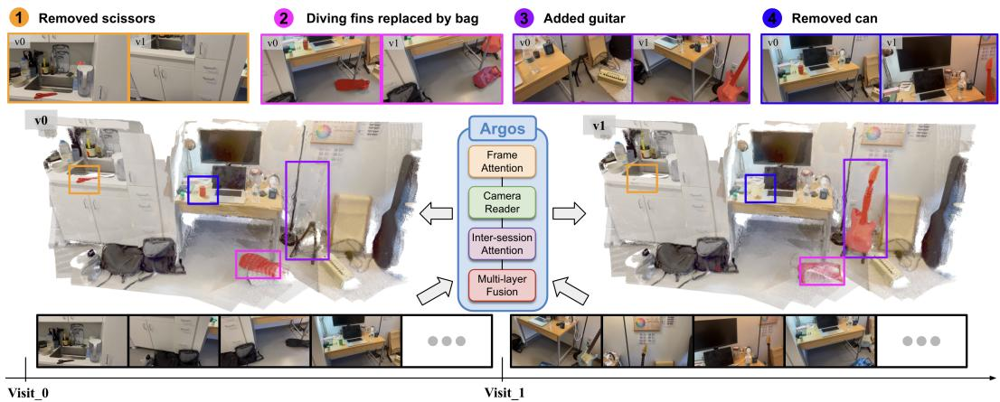  
Figure 1: We propose Argos, a feedforward model for sub-second change detection and 3D reconstruction, and integrate it into Argos-SLAM for online 4D reconstruction of change-aware pointcloud maps. The figure illustrates how Argos captures scene changes, including the added guitar (3) and removed can (4), while maintaining a consistent spatio-temporal representation across visits.

## ABSTRACT

Robots operating in dynamic environments require reliable detection of how their surroundings change over time. Existing learning-based methods largely rely on pairwise 2D image features, which struggle under large viewpoint changes and occlusions, are sensitive to noise, and show limited generalization across domains, while explicit 3D approaches typically require costly offline optimization. We show that the implicit 3D knowledge of Geometric Foundation Models (GFMs) provides a strong basis for addressing these limitations. We introduce Argos, which adapts GFM features for joint scene change detection and 3D reconstruction. To address data scarcity and take a step toward a foundation model for scene change detection, we introduce a large-scale benchmark comprising two synthetic datasets and one real-world dataset, and train jointly across diverse datasets to improve cross-domain generalization. We further introduce Argos-SLAM, a realtime system designed for robotics, which performs online change detection and change-aware 4D mapping. Across benchmarks, our framework substantially outperforms existing baselines, with gains of up to 42.01% in change IoU and 27.91% in F1, while supporting scalable deployment in changing real-world environments. Code and datasets are available at the project website.

## 1 INTRODUCTION

Long-term autonomy requires agents to continuously update their spatial knowledge in the face of a changing world. A moved tool may invalidate a planned interaction, while newly placed furniture may block a previously traversable route. For robots to operate autonomously in such environments, they must not only perceive and understand how the environment changes over time, but also maintain an accurate memory of those changes for subsequent navigation and manipulation. A map that faithfully reflects the current state of the environment is therefore a key component of long-term robot autonomy. This motivates the need for robust change detection that can operate under large viewpoint variations, occlusions, and continuous observations during real-world robot operation.

Existing approaches have progressed from image pairs to multi-view observations, but geometric ambiguity and limited generalization remain central challenges. Learned detectors predominantly compare 2D features, making large viewpoint shifts and occlusions difficult to resolve (Wang et al., 2023; Lin et al., 2025; Yoon & Kim, 2026b;a). Explicit 3D pipelines provide spatial context, but often infer change through heavy optimization with handcrafted comparison rules (Wu et al., 2025; Galappaththige et al., 2026). Meanwhile, benchmark-specific training and scarce long-sequence annotations restrict generalization across environments and observation trajectories (Kim & Kim, 2025; Yoon & Kim, 2026a).

To address these limitations, we introduce Argos (Adapt Rich Geometric Priors for Generalizable Online Scene-Change-Detection), a feedforward model that learns changes directly from the implicit representations of Geometric Foundation Models (GFMs) (Wang et al., 2025; 2026). Our key insight is that the geometric knowledge learned to associate scene content across viewpoints also provides a prior for recognizing inconsistent content across sessions. Crucially, such inconsistency requires to be interpreted through co-visibility: observing that the space previously occupied by an object is now empty provides evidence of removal, whereas simply failing to see an occluded object does not. We realize this insight through a co-visibility-aware inter-session comparator that incorporates camera information and session membership to interpret feature differences. As illustrated in Figure 1, Argos jointly predicts change masks and scene geometry from two unposed RGB image collections, retaining reconstruction capability while learning to compare different scene states.

To support learning beyond individual benchmarks, we introduce Argos-CD, which comprises two large-scale synthetic datasets with automatically generated robot traversals and a challenging real world evaluation set. Joint training on Argos-CD and existing datasets provides diverse change supervision across domains, taking a step toward a foundation model for scene change detection. Experiments demonstrate substantial gains across paired-image and video benchmarks; even with synthetic-only change supervision, Argos surpasses learned baselines fine-tuned on real data on realworld evaluations. We further integrate Argos with VGGT-SLAM (Maggio & Carlone, 2026) into Argos-SLAM. This system supports online reconstruction and change updates for change-aware 4D mapping.

Our contributions are summarized as follows:

• Geometrically grounded change detection. We introduce Argos, a model that adapts implicit 3D priors through co-visibility-aware inter-session comparison for joint change detection and reconstruction from a pair of RGB sequences.

• Large-scale dataset and generalization. We introduce the Argos-CD dataset and demonstrate that leveraging pretrained GFM features together with multi-dataset training enables strong benchmark performance and synthetic-to-real transfer.

• Online change-aware mapping. We develop Argos-SLAM, which connects learned change predictions to online reconstruction of a change-aware point-cloud map.

## 2 RELATED WORK

Geometric Foundation Model. Multi-view geometry and SLAM establish the spatial relationships needed to reconstruct scenes from visual observations (Hartley & Zisserman, 2003; Cadena et al., 2016). Geometric Foundation Models (GFMs), including VGGT and VGGT-Ω, predict camera poses and dense geometry through feedforward inference (Wang et al., 2025; 2026). D4RT and PAGE-4D extend feedforward geometric perception to dynamic scenes (Zhang et al., 2026a; Zhou et al., 2026), while WT-DiT connects spatial reconstruction with generative world modeling (Zhang et al., 2026b). Beyond reconstruction, Bratulic et al. (2026) probe VGGT’s internal representations´ to investigate the geometric information encoded by GFMs, revealing that these representations implicitly capture epipolar geometry. We study how these reconstruction-trained features can support co-visibility-aware comparison of different scene states across sessions. Rather than using only reconstruction outputs, our approach uses GFM’s latent representations and tokens to inform change detection.

Change Detection. Scene change detection (SCD) traditionally localizes changes between image pairs from similar viewpoints (Sakurada & Okatani, 2015; Alcantarilla et al., 2018; Sakurada et al., 2020; Park et al., 2021), using learned pairwise features, temporal interaction, segmentation, or cross-view matching (Varghese et al., 2018; Caye Daudt et al., 2018; Chen et al., 2021; Wang et al., 2023; Sachdeva & Zisserman, 2023b;a). Recent methods leverage pretrained representations such as DINOv2 (Oquab et al., 2023) and SAM (Kirillov et al., 2023) through task-specific adaptation (Lin et al., 2025; Yoon & Kim, 2026b) or zero-shot comparison (Cho et al., 2025; Kannan & Min, 2025; Kim & Kim, 2025). Multi-view work extends SCD to unaligned observations (Wald et al., 2019; Wu et al., 2025; Galappaththige et al., 2025): VSCD (Yoon & Kim, 2026a) learns multi-reference crossframe correspondence, SceneDiff (Wu et al., 2025) selects co-visible views using reconstructed geometry, and O-SCD (Galappaththige et al., 2026) performs self-supervised fusion over an offline Gaussian Splatting reconstruction (Kerbl et al., 2023). However, learned methods can still struggle with cross-domain transfer, while zero-shot approaches often require costly reconstruction or optimization. In contrast, Argos performs cross-session comparison directly in the latent space of a frozen GFM and improves transfer through joint training across diverse datasets.

Robot Mapping in Dynamic Environments. The literature on long-term mapping and SLAM has investigated robot operation in changing environments (Fehr et al., 2017; Fu et al., 2022; Schmid et al., 2022). Khronos (Schmid et al., 2024) constructs dense spatio-temporal maps, identifying quasi-static changes through global optimization over TSDF-based maps (Curless & Levoy, 1996). SuperMap (Zhao et al., 2026) extends this direction with a real-time online system and open-set semantic capabilities using vision foundation models (Oquab et al., 2023; Ravi et al., 2025). For LiDAR, Chamelion (Jang et al., 2026) uses a dual-head network for change classification and longterm map maintenance, while ELite (Gil et al., 2025) models ephemerality for lifelong mapping. These systems typically detect change through explicit map geometry or object associations rather than leveraging advances in learned change detection. We bridge the two with Argos-SLAM, which combines online reconstruction and change detection to maintain a change-aware point-cloud map: SLAM supplies the spatio-temporal structure for long-term deployment, while learned RGB change detection improves change identification beyond geometry alone.

## 3 PROBLEM FORMULATION

We consider a robot that revisits a scene and needs to detect changes while reconstructing the scene.

Two-visit Change Detection. The inputs are two sets of unposed RGB images from two visits, $\mathbb { I } ^ { v _ { 0 } } = \{ I _ { i } ^ { v _ { 0 } } \} _ { i = 1 } ^ { K }$ and $\mathbb { I } ^ { v _ { 1 } } = \{ I _ { j } ^ { v _ { 1 } } \} _ { j = 1 } ^ { N }$ . The visits may differ in length, trajectory, viewpoint, and overlap. The goal is to predict a binary change mask for every image,

$$
\mathbb { M } ^ { v _ { 0 } } = \{ M _ { i } ^ { v _ { 0 } } \} _ { i = 1 } ^ { K } , \qquad \mathbb { M } ^ { v _ { 1 } } = \{ M _ { j } ^ { v _ { 1 } } \} _ { j = 1 } ^ { N } , \qquad M \in \{ 0 , 1 \} ^ { H \times W } .\tag{1}
$$

Changed content is labeled in the visit where it is physically present. For instance, if a new object becomes visible in $I _ { j } ^ { v _ { 1 } }$ , the corresponding pixels are labeled in $\mathbf { \boldsymbol { M } } _ { j } ^ { v _ { 1 } }$ . Conversely, if an object visible in $I _ { i } ^ { v _ { 0 } }$ is absent from a co-visible frame $I _ { j } ^ { v _ { 1 } }$ , its pixels are labeled in $M _ { i } ^ { v _ { 0 } }$

Change-aware Point-cloud Map. Naively reconstructing the scene from both visits produces a joint point cloud P that mixes the static background with changed elements observed across visits. Instead, we seek a change-aware point-cloud map $\mathbb { P } ( v )$ , where $v \in \{ v _ { 0 } , v _ { 1 } \}$ specifies the queried visit, that disentangles these changes and faithfully represents the corresponding scene state. Specifically, $\mathbb P ( v _ { 0 } )$ removes geometry corresponding to elements present only in $v _ { 1 }$ , while retaining the shared static background and visit-specific geometry from $v _ { 0 } ; \mathbb { P } ( v _ { 1 } )$ is defined symmetrically. For example, if a cup in $v _ { 0 }$ is replaced by a bowl in $v _ { 1 }$ , the joint reconstruction may contain overlapping geometry from both objects. Querying $v _ { 0 }$ removes the bowl geometry and recovers the scene with the cup.

## 4 METHOD

This section describes Argos. We first motivate our design, then describe the architecture, training data, and finally integration with a state-of-the-art SLAM system to form Argos-SLAM.

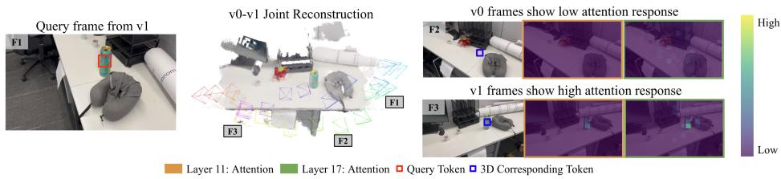  
Figure 2: Attention score visualization of selected layers. The token associated with the added green bottle in $v _ { 1 }$ shows strong attention to the corresponding bottle region across different views within the same visit, while finding no high-attention score in v , where the bottle is absent.

## 4.1 MOTIVATION

Learning-based scene change detection often compares 2D image features, making it difficult to distinguish true changes from viewpoint- or occlusion-induced appearance differences. We instead view change detection as inherently 3D: evidence for change requires both observing the same scene region across visits and finding inconsistent content there.

GFMs provide a natural representation for this reasoning. In particular, VGGT-Ω (Wang et al., 2026) is pretrained with a matching loss ${ \mathcal { L } } _ { \mathrm { m a t c h } }$ that encourages features corresponding to the same 3D location to align across views. Inspired by the attention analysis used in PAGE-4D (Zhou et al., 2026) and VGGT-SLAM 2.0 (Maggio & Carlone, 2026), we similarly probe pretrained VGGT-Ω across visits. Figure 2 shows that its intermediate features respond strongly to corresponding object locations across viewpoints, but weakly when the object is absent, suggesting useful cues for co-visibility and cross-visit consistency. Guided by this observation, Argos uses pose and session information to adapt these implicit geometric features for co-visibility-aware cross-session compar ison, jointly predicting scene changes, camera poses, and depth.

## 4.2 MODEL ARCHITECTURE

Illustrated in Figure 3, Argos is a unified model that jointly predicts change masks and scene geometry from the two visits. To enable cross-visit change reasoning, it augments VGGT-Ω with a Co-visibility-aware Spatio-Temporal Comparator comprising a Camera Reader, Inter-session Cross-Attention, and a DPT Fusion Head. We index the combined $n = K + N$ images by $r \in \{ 1 , \ldots , n \}$ with the first $K$ images from $v _ { 0 }$ and the remaining N from $v _ { 1 }$ . The model implements

$$
\begin{array} { r } { f _ { \theta } \left( \mathbb { I } ^ { v _ { 0 } } , \mathbb { I } ^ { v _ { 1 } } \right) = \left\{ \hat { M } _ { r } , \hat { D } _ { r } , \hat { g } _ { r } \right\} _ { r = 1 } ^ { n } , } \end{array}\tag{2}
$$

where $\hat { M } _ { r } \in \{ 0 , 1 \} ^ { H \times W }$ is a change mask, $\hat { D } _ { r } \in \mathbb { R } ^ { H \times W }$ is a depth map, and $\hat { g } _ { r } \in \mathbb { R } ^ { 9 }$ encodes camera extrinsics and intrinsics. Unprojecting the predicted depth using the estimated cameras and disentangle changed regions with the masks yields a change-aware point-cloud map $\mathbb { P } ( v )$

Backbone and Tokens. The frozen VGGT-Ω backbone (Wang et al., 2026) processes both visits jointly. We extract its features at layers $\mathcal { L } = \{ 4 , 1 1 , 1 7 , 2 3 \}$ and denote the patch tokens for image r at layer ℓ by $X _ { r } ^ { \ell } \in \mathbb { R } ^ { T \times d }$ , where $\dot { T }$ is the number of image patches and $d = 2 0 4 8$ is the feature width. The pretrained camera and depth heads read the original backbone features; the following modules adapt them for the change branch.

Camera Reader. To make patch tokens co-visibility aware, inspired by DPT’s readout operator (Ranftl et al., 2021), Camera Reader injects final camera features into patch tokens after selected VGGT-Ω intermediate layers. Let $c _ { r } \in \mathbb { R } ^ { d }$ denote the normalized camera-head token for image $r ,$ immediately before it is decoded into ${ \hat { g } } _ { r }$ . For each patch $q \in \{ 1 , \ldots , T \}$ and layer $\ell \in \mathcal L$ , we compute

$$
\tilde { x } _ { r , q } ^ { \ell } = x _ { r , q } ^ { \ell } + \mathrm { M L P } _ { \ell } \big ( [ c _ { r } ; x _ { r , q } ^ { \ell } ] \big ) ,\tag{3}
$$

where $x _ { r , q } ^ { \ell }$ is the q-th row of $X _ { r } ^ { \ell } , [ \cdot ; \cdot ]$ denotes channel-wise concatenation, and $\mathrm { M L P } _ { \ell } : \mathbb { R } ^ { 2 d } \to \mathbb { R } ^ { d }$ is learned separately for each layer. The same $c _ { r }$ is broadcast to every patch of image r at all selected layers. MLP implementation details are given in Appendix A.1.

Inter-session Cross-Attention. The backbone mixes information across all images without explicitly distinguishing the two visits. We therefore use visit membership to compare their features at

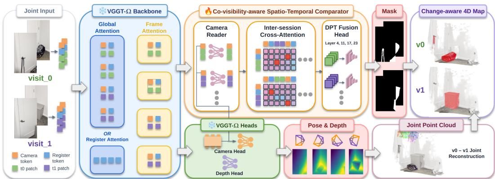  
Figure 3: Argos Architecture. Building on VGGT-Ω, we introduce a Co-visibility-aware Spatio-Temporal Comparator with three modules: a Camera Reader that injects final camera tokens into intermediate patch features, Inter-session Cross-Attention that aggregates information across visits, and a lightweight DPT Fusion Head that combines multi-layer features to predict per-visit change masks. These masks are then used to disentangle the joint reconstruction into a change-aware map.

each layer $\ell \in \mathcal L$ . Let $Z _ { v _ { 0 } } ^ { \ell }$ and $Z _ { v _ { 1 } } ^ { \ell }$ stack the camera, register, and camera-aware patch tokens from their respective visits. Each visit uses its own tokens as queries and the other visit’s tokens as context, giving the residual updates

$$
\bar { Z } _ { v _ { 0 } } ^ { \ell } = Z _ { v _ { 0 } } ^ { \ell } + \mathrm { C r o s s A t t n } _ { \ell } \bigl ( Z _ { v _ { 0 } } ^ { \ell } , Z _ { v _ { 1 } } ^ { \ell } \bigr ) , \qquad \bar { Z } _ { v _ { 1 } } ^ { \ell } = Z _ { v _ { 1 } } ^ { \ell } + \mathrm { C r o s s A t t n } _ { \ell } \bigl ( Z _ { v _ { 1 } } ^ { \ell } , Z _ { v _ { 0 } } ^ { \ell } \bigr ) ,\tag{4}
$$

where Cross $\mathrm { A t t n } _ { \ell } ( A , B )$ denotes multi-head attention with queries from A and keys and values from B, following the standard attention formulation (Vaswani et al., 2017). A feed-forward sub layer then maps each $\hat { Z } _ { v } ^ { \ell }$ to $\tilde { Z } _ { v } ^ { \ell } ,$ the features passed to the change head. Since change signal is symmetric, the two directions share attention and feed-forward weights, while each feature layer has its own block. The full block equations are given in Appendix A.1.

Intuitively, camera-augmented attention compares both co-visibility and visual appearance. Together, these learned interactions connect the co-visibility and visual inconsistency intuition in Section 4.1, enabling the change head to interpret appearance differences in their geometric context.

DPT Fusion Head. We extract the updated patch tokens $Y _ { r } ^ { \ell } \in \mathbb { R } ^ { T \times d }$ for image r from $\tilde { Z } _ { v } ^ { \ell }$ and decode them with a DPT-style head $\mathcal { H } _ { \mathrm { C D } }$ (Ranftl et al., 2021), following VGGT-Ω’s depth decoder. The head reshapes the tokens into spatial feature maps, resizes and fuses them across layers, and predicts per-pixel logits $z _ { r } \in \mathbb { R } ^ { H \times W }$

$$
z _ { r } = \mathcal { H } _ { \mathrm { C D } } \big ( \{ Y _ { r } ^ { \ell } \} _ { \ell \in \mathcal { L } } \big ) , \qquad \hat { p } _ { r } = \sigma ( z _ { r } ) , \qquad \hat { M } _ { r } = { \bf 1 } [ \hat { p } _ { r } > 0 . 5 ] ,\tag{5}
$$

where $\sigma$ is the sigmoid function and the threshold is applied independently to each pixel.

## 4.3 NEW DATASET

Video change-detection data remain scarce for long robot traversals, hindering large-scale training. Therefore, we introduce Argos-CD, a large-scale benchmark comprising two synthetic datasets, Argos-CD-HSSD and Argos-CD-SceneSmith, leveraging simulation assets from HSSD (Khanna et al., 2024) and SceneSmith (Pfaff et al., 2026), and a real-world evaluation set Argos-CD-real. Our synthetic datasets share an automated pipeline that samples scene states, plans independent trajectories to cover scene objects and navigable areas, and generates change masks from object identities. Table 1 shows that Argos-CD-HSSD covers 4× more visually distinct places on average and up to 2× longer maximum video duration than VSCD and SceneDiff. Furthermore, Argos-CD-real captures challenging real-world scenarios, including cluttered workshops and oppositedirection camera traversals. See Appendix A.2 for additional details.

Table 1: Dataset comparison. Places∗ and single-visit video length (seconds) are reported as mean / min / max. Pairs counts cross-visit comparisons and Views counts frames with change masks. ∗Approximated through appearance clustering.
<table><tr><td colspan="2">Dataset</td><td>Pairs</td><td> $\mathrm { { V i e w s } }$ </td><td>Scenes</td><td> $\mathrm { P l a c e s } ^ { * }$ </td><td>Length (s)</td><td>Modality</td><td>Viewpoint</td><td>Trajectory</td></tr><tr><td rowspan="5">Released</td><td>VL-CMU-CD</td><td>1,362</td><td>1,362</td><td>152</td><td>一</td><td>一</td><td>Real</td><td>Identical</td><td>=</td></tr><tr><td>PSCD</td><td>770</td><td>1,540</td><td>一</td><td>一</td><td>一</td><td>Real</td><td>Identical</td><td></td></tr><tr><td>ChangeSim</td><td>20</td><td>130K</td><td>10</td><td>一</td><td></td><td>Sim.</td><td>Similar</td><td>Manual</td></tr><tr><td>VSCD</td><td>1,041</td><td>1.13M</td><td>210</td><td>1.6/1/7</td><td>36.0/10.1/116.0</td><td>both</td><td>Free</td><td>Manual</td></tr><tr><td>SceneDiff Dataset</td><td>355</td><td>172K</td><td>355</td><td>1.1/1/2</td><td>8.1/2.4/26.1</td><td>Real</td><td>Free</td><td>Manual</td></tr><tr><td>Argos-CD</td><td>Argos-CD-HSSD</td><td>501</td><td>644K</td><td>167</td><td>3.8/1/11</td><td>42.8/4.0/203.6</td><td>Sim.</td><td>Free</td><td>Automatic</td></tr><tr><td rowspan="2">(Ours)</td><td>Argos-CD-SceneSmith</td><td>612</td><td>138K</td><td>204</td><td>1.5/1/5</td><td>7.5/1.2/51.7</td><td>Sim.</td><td>Free</td><td>Automatic</td></tr><tr><td>Argos-CD-real</td><td>8</td><td>5,514</td><td>8</td><td>1.0/1/1</td><td>11.5/4.8/21.7</td><td>Real</td><td>Free</td><td>Manual</td></tr></table>

## 4.4 TRAINING

Training Datasets. We train on VL-CMU-CD (Alcantarilla et al., 2018), PSCD (Sakurada et al., 2020), and ChangeSim (Park et al., 2021) from the SCD task, alongside VSCD (Yoon & Kim, 2026a), Argos-CD-HSSD, Argos-CD-SceneSmith, and SceneDiff (Wu et al., 2025) from the VSCD task. We evaluate on the held-out test sets of each benchmark, as well as on Argos-CD-real for additional out-of-distribution real-world evaluation.

Loss Function and Training Details. To handle class imbalance between sparse change pixels and dominant static regions, we apply weighted binary cross-entropy exclusively to valid (labeled) pixels. We freeze the original VGGT-Ω components and train only the three modules constituting the Co-visibility-aware Spatio-Temporal Comparator. Furthermore, we extend VGGT’s training recipe by interleaving SCD and VSCD datasets across input sequence lengths ranging from 2 to 64 frames. See Appendix A.1 for additional implementation details.

## 4.5 ONLINE ROBOT MAPPING SYSTEM

Online Reconstruction, Asynchronous Change-aware Map Updates. We introduce Argos-SLAM, an extension of VGGT-SLAM 2.0 (Maggio & Carlone, 2026) for online change detection and change-aware 4D mapping. The same Argos network serves as both (i) the geometry backbone for submap reconstruction and (ii) the change model for cross-visit comparison. Given a prior reconstruction from the first visit $v _ { 0 } .$ , the system incrementally reconstructs the scene during the second visit $v _ { 1 }$ and aligns the incoming geometry with $v _ { 0 }$ in a shared coordinate frame. Each new submap is integrated into the global reconstruction and triggers an asynchronous change-detection job. Once completed, the detected changes are incorporated into the change-aware point-cloud map P(v), which therefore reflects all geometry and changes accumulated up to that submap. To maintain online operation, each job retrieves only the most relevant prior keyframes rather than comparing against the entire prior visit. An efficient retrieval cascade combines cached SALAD descriptor matching, strided geometric reprojection filtering, and scene-centroid coverage search, while capping the combined input at 64 images for sub-second inference. Change-detection jobs run asynchronously alongside reconstruction, allowing the change-aware map to be updated incrementally as new submaps arrive. Section 5.6 reports the runtime during real-world robot deployment, while Appendix A.3 provides additional implementation details.

## 5 EXPERIMENTS

## 5.1 EXPERIMENTAL SETUP

Baselines and Benchmark. We evaluate Argos on the real and synthetic SCD and VSCD datasets described in Section 4.4. We compare against learned SCD methods (FC-EF, FC-Siam-diff, FC-Siam-conc (Caye Daudt et al., 2018), CSCDNet (Sakurada et al., 2020), DR-TANet (Chen et al., 2021), C-3PO (Wang et al., 2023), RobustSCD (Lin et al., 2025), TERDNet (Yoon & Kim, 2026b)), learned VSCD (VSCDNet (Yoon & Kim, 2026a)), zero-shot SCD (ZSSCD (Cho et al., 2025), GeSCF (Kim & Kim, 2025)) and VSCD (SceneDiff (Wu et al., 2025)) methods. We additionally evaluate the zero-shot Gaussian-splatting method O-SCD (Galappaththige et al., 2026); due to frequent failures, its results are deferred to Appendix A.5. Appendix A.4 shows more details.

Table 2: Real-world generalization study. Argos performs consistently better than learned baselines even without fine-tuning to the real-world datasets. † indicates zero-shot methods.
<table><tr><td rowspan="2"></td><td rowspan="2">Method</td><td colspan="4">SceneDiff Dataset</td><td colspan="4">Argos-CD-real</td></tr><tr><td>Static</td><td>Change</td><td>mIoU</td><td>F1</td><td>Static</td><td>Change</td><td>mIoU</td><td>F1</td></tr><tr><td rowspan="6">SCD</td><td>CSCDNet-finetune</td><td>93.33</td><td>15.25</td><td>54.29</td><td>20.23</td><td>94.75</td><td>8.88</td><td>51.81</td><td>14.20</td></tr><tr><td>C-3PO*-finetune</td><td>94.42</td><td>17.88</td><td>56.15</td><td>22.47</td><td>95.49</td><td>8.71</td><td>52.10</td><td>12.41</td></tr><tr><td>GeSCF†</td><td>69.69</td><td>5.04</td><td>37.37</td><td>15.12</td><td>63.64</td><td>2.95</td><td>33.30</td><td>11.13</td></tr><tr><td>RobustSCD-finetune</td><td>94.41</td><td>18.97</td><td>56.69</td><td>21.25</td><td>94.46</td><td>9.06</td><td>51.76</td><td>15.92</td></tr><tr><td>ZSSCD†</td><td>88.63</td><td>6.74</td><td>47.69</td><td>13.22</td><td>79.97</td><td>3.79</td><td>41.88</td><td>11.47</td></tr><tr><td>TERDNet-finetune</td><td>94.30</td><td>20.32</td><td>57.30</td><td>25.14</td><td>93.90</td><td>8.56</td><td>51.23</td><td>16.75</td></tr><tr><td rowspan="7">VSCD</td><td>VSCDNet</td><td>91.40</td><td>10.48</td><td>50.94</td><td>15.46</td><td>91.06</td><td>7.26</td><td>49.16</td><td>12.91</td></tr><tr><td>VSCDNet-finetune</td><td>95.72</td><td>20.70</td><td>58.21</td><td>23.84</td><td>96.76</td><td>11.72</td><td>54.24</td><td>17.88</td></tr><tr><td>VSCDNet-foundation</td><td>95.85</td><td>19.27</td><td>57.56</td><td>24.26</td><td>93.75</td><td>9.54</td><td>51.65</td><td>19.77</td></tr><tr><td>SceneDiff†</td><td>96.48</td><td>30.31</td><td>63.40</td><td>37.58</td><td>95.50</td><td>19.49</td><td>57.50</td><td>36.90</td></tr><tr><td>Ours-synthetic-only</td><td>97.13</td><td>39.84</td><td>68.48</td><td>37.42</td><td>95.88</td><td>20.87</td><td>58.37</td><td>34.17</td></tr><tr><td>Ours-finetune</td><td>98.62</td><td>59.91</td><td>79.27</td><td>44.73</td><td>97.69</td><td>36.29</td><td>66.99</td><td>39.38</td></tr><tr><td>Ours-foundation</td><td>98.78</td><td>62.54</td><td>80.66</td><td>45.98</td><td>97.36</td><td>29.50</td><td>63.43</td><td>39.90</td></tr></table>

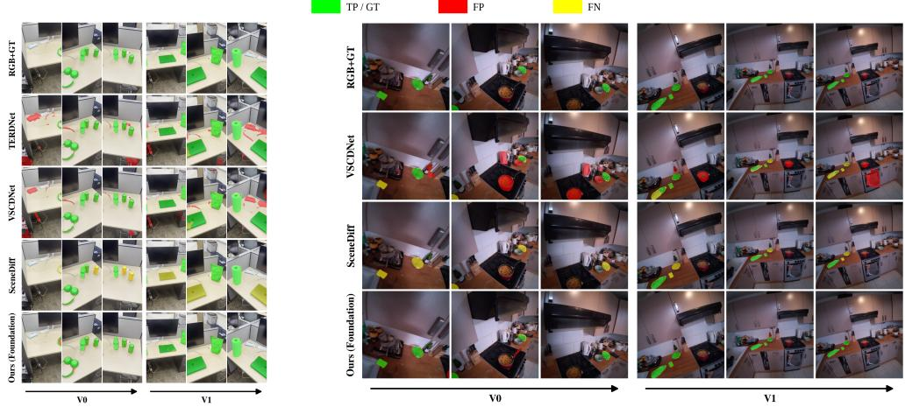  
Figure 4: Qualitative results. We show results of the best-performing models. Argos shows cleaner masks and fewer false positives or false negatives in real-world. Appendix A.7 shows more results.

Model Variants. We consider four variants: Ours, trained specifically on each evaluation dataset; Ours-synthetic-only, trained exclusively on synthetic data; Ours-finetune, obtained by fine-tuning the synthetic variant on real-world data; and Ours-foundation, trained on all available datasets.

Metrics. We treat change detection as binary segmentation and report static IoU, change IoU, their mean (mIoU), and change-class macro F1, all as percentages.

## 5.2 REAL-WORLD GENERALIZATION

Table 2 shows that Ours-synthetic-only substantially outperforms the best fine-tuned learned baselines in change IoU (39.84 vs. 20.70 on SceneDiff and 20.87 vs. 11.72 on Argos-CD-real) and also surpasses the zero-shot SceneDiff baseline. We attribute this sim-to-real generalization to the GFM’s implicit 3D prior and generalization ability, which relies less on domain-specific appearance than 2D baselines. Real-world fine-tuning further improves performance, while Ours-foundation matches or exceeds Ours-finetune, suggesting that broader training can enable near out-of-the-box deployment. Training the closest baseline, VSCDNet, with the same strategy as Ours-foundation still yields substantially lower performance (19.27 vs. 62.54 change IoU on SceneDiff), supporting the importance of our architecture rather than training data alone. Figure 4 shows qualitative results.

Table 3: Performance on Video Scene Change Detection. ∗C-3PO architecture disables the “remove” feature branch. ∗∗The VSCD dataset is modified to contain “appeared” labels in both reference and query frame.
<table><tr><td rowspan="2">Method</td><td colspan="4">Argos-CD-HSSD</td><td colspan="4">Argos-CD-SceneSmith</td><td colspan="4">VSCD**</td></tr><tr><td>Static</td><td>Change</td><td>mIoU</td><td>F1</td><td>Static</td><td>Change</td><td>mIoU</td><td>F1</td><td>Static</td><td>Change</td><td>mIoU</td><td>F1</td></tr><tr><td>CSCDNet</td><td>92.91</td><td>38.10</td><td>65.51</td><td>36.53</td><td>94.32</td><td>31.11</td><td>62.72</td><td>34.83</td><td>94.03</td><td>31.95</td><td>62.99</td><td>32.44</td></tr><tr><td>C-3PO*</td><td>91.85</td><td>37.65</td><td>64.75</td><td>37.68</td><td>94.46</td><td>38.68</td><td>66.57</td><td>40.77</td><td>93.88</td><td>32.98</td><td>63.43</td><td>32.90</td></tr><tr><td>GeSCF†</td><td>76.73</td><td>13.81</td><td>45.27</td><td>28.41</td><td>81.56</td><td>13.72</td><td>47.64</td><td>29.80</td><td>77.74</td><td>12.26</td><td>45.00</td><td>23.98</td></tr><tr><td>RobustSCD</td><td>88.86</td><td>33.18</td><td>61.02</td><td>34.76</td><td>92.70</td><td>33.92</td><td>63.30</td><td>36.85</td><td>89.54</td><td>27.18</td><td>58.36</td><td>30.59</td></tr><tr><td>ZSSCD†</td><td>90.03</td><td>16.58</td><td>53.31</td><td>16.22</td><td>91.63</td><td>15.15</td><td>53.39</td><td>15.49</td><td>93.00</td><td>15.72</td><td>54.36</td><td>16.02</td></tr><tr><td>TERDNet</td><td>93.05</td><td>42.14</td><td>67.59</td><td>40.62</td><td>95.19</td><td>38.58</td><td>66.88</td><td>40.31</td><td>90.90</td><td>27.92</td><td>59.41</td><td>30.92</td></tr><tr><td>VSCDNet</td><td>93.50</td><td>42.71</td><td>68.11</td><td>41.77</td><td>94.62</td><td>38.94</td><td>66.78</td><td>41.17</td><td>94.49</td><td>34.55</td><td>64.52</td><td>36.31</td></tr><tr><td>SceneDiff†</td><td>93.80</td><td>33.44</td><td>63.62</td><td>32.44</td><td>96.38</td><td>40.42</td><td>68.40</td><td>36.58</td><td>96.71</td><td>48.21</td><td>72.46</td><td>38.70</td></tr><tr><td>Ours</td><td>98.38</td><td>78.64</td><td>88.51</td><td>62.16</td><td>99.08</td><td>82.43</td><td>90.75</td><td>69.08</td><td>98.24</td><td>68.69</td><td>83.46</td><td>53.14</td></tr><tr><td>Ours-foundation</td><td>98.07</td><td>75.51</td><td>86.79</td><td>60.69</td><td>98.91</td><td>80.41</td><td>89.66</td><td>68.93</td><td>98.05</td><td>68.52</td><td>83.28</td><td>53.33</td></tr></table>

Table 4: Performance on paired-image Scene Change Detection. Argos outperforms all baseline methods, and the foundation variant of Argos scores closely to the dataset specific variants.
<table><tr><td rowspan="2">Method</td><td colspan="4">PSCD</td><td colspan="4">ChangeSim*</td><td colspan="4">VL-CMU-CD</td></tr><tr><td>Static</td><td>Change</td><td>mIoU</td><td>F1</td><td>Static</td><td>Change</td><td>mIoU</td><td>F1</td><td>Static</td><td>Change</td><td>mIoU</td><td>F1</td></tr><tr><td>FC-EF</td><td>84.97</td><td>37.99</td><td>61.48</td><td>48.14</td><td>66.21</td><td>12.44</td><td>39.32</td><td>20.72</td><td>91.36</td><td>36.72</td><td>64.04</td><td>45.61</td></tr><tr><td>FC-Siam-diff</td><td>89.55</td><td>43.72</td><td>66.64</td><td>52.67</td><td>85.77</td><td>21.12</td><td>53.44</td><td>33.61</td><td>96.17</td><td>55.97</td><td>76.07</td><td>64.21</td></tr><tr><td>FC-Siam-conc</td><td>86.96</td><td>41.76</td><td>64.36</td><td>52.13</td><td>81.63</td><td>19.01</td><td>50.32</td><td>29.40</td><td>94.40</td><td>50.81</td><td>72.61</td><td>58.71*</td></tr><tr><td>CSCDNet</td><td>92.57</td><td>48.84</td><td>70.70</td><td>60.81</td><td>92.77</td><td>26.48</td><td>59.62</td><td>37.64</td><td>97.57</td><td>69.17</td><td>83.37</td><td>76.90</td></tr><tr><td>DR-TANet</td><td>91.17</td><td>43.40</td><td>67.28</td><td>55.79</td><td>90.91</td><td>27.57</td><td>59.24</td><td>38.53</td><td>97.16</td><td>65.81</td><td>81.48</td><td>73.98</td></tr><tr><td>C-3PO*</td><td>92.36</td><td>50.19</td><td>71.27</td><td>60.66</td><td>93.00</td><td>28.68</td><td>60.84</td><td>38.92</td><td>97.86</td><td>72.33</td><td>85.10</td><td>80.00</td></tr><tr><td>ZSSCD†</td><td>83.41</td><td>19.94</td><td>51.67</td><td>28.94</td><td>94.55</td><td>30.03</td><td>62.29</td><td>40.51</td><td>93.12</td><td>36.14</td><td>64.63</td><td>50.14</td></tr><tr><td>RobustSCD</td><td>81.69</td><td>35.05</td><td>58.37</td><td>44.19</td><td>88.62</td><td>26.39</td><td>57.50</td><td>38.34</td><td>97.58</td><td>70.48</td><td>84.28</td><td>79.44</td></tr><tr><td>GeSCF†</td><td>81.63</td><td>26.16</td><td>53.89</td><td>41.76</td><td>90.39</td><td>16.23</td><td>53.31</td><td>27.04</td><td>96.63</td><td>58.81</td><td>77.72</td><td>75.39</td></tr><tr><td>TERDNet</td><td>93.56</td><td>55.30</td><td>74.43</td><td>65.81</td><td>93.17</td><td>35.07</td><td>64.12</td><td>46.24</td><td>98.02</td><td>73.80</td><td>85.91</td><td>83.43</td></tr><tr><td>Ours</td><td>94.61</td><td>62.83</td><td>78.72</td><td>69.65</td><td>95.02</td><td>50.03</td><td>72.52</td><td>61.73</td><td>98.28</td><td>77.80</td><td>88.03</td><td>86.3</td></tr><tr><td>Ours-foundation</td><td>93.69</td><td>58.90</td><td>76.34</td><td>66.92</td><td>95.56</td><td>46.33</td><td>70.95</td><td>54.97</td><td>97.92</td><td>73.33</td><td>85.63</td><td>81.61</td></tr></table>

## 5.3 VIDEO SCENE CHANGE DETECTION (VSCD)

Table 3 shows that Argos substantially outperforms all baselines in all metrics across all benchmark, while Ours-foundation retains a similarly strong advantage. Particularly, on Argos-CD-SceneSmith, our model increase 42.01% on change IoU and 27.91% on F1. These benchmarks are challenging due to large viewpoint changes and occlusions, where parallax and disocclusion can be mistaken for scene changes even after frame matching. By leveraging co-visibility-aware crosssession comparison and the GFM’s implicit 3D prior, Argos better distinguishes true scene changes from viewpoint-induced appearance differences. Qualitative results are shown in Appendix A.7.

## 5.4 SCENE CHANGE DETECTION (SCD) FOR PAIRED-IMAGE

Table 4 shows that, with only one image per session, Argos achieves the highest change IoU and F1 on PSCD, ChangeSim, and VL-CMU-CD. These results indicate that Argos’s advantage is not lim ited to additional video context: the GFM’s implicit 3D features provide stronger change descriptors than conventional 2D features. The same architecture therefore delivers strong performance in both video and traditional paired-image change detection.

## 5.5 ABLATION STUDIES

Table 5 ablates our architectural components. The Change Detection Head on GFM features already outperforms the baselines, while replacing the backbone with SAM features degrades performance, supporting the value of the GFM’s implicit 3D prior. On VSCD, Inter-session Cross-Attention further improves performance, with the Camera Reader providing additional gains when combined with it despite hurting performance in isolation. This suggests that pose information is most effective when used to guide cross-session comparison. The benefit is larger on video-based VSCD, where multi-view co-visibility helps resolve viewpoint and occlusion ambiguities. Additional analysis is provided in Appendix A.5.

Table 5: Architecture Ablation. Inter-session cross attention and Camera reader complement each other to achieve the best performance, while VGGT-Ω backbone provides a strong foundation.
<table><tr><td colspan="4">Architecture Variant</td><td colspan="4">VSCD**</td><td colspan="4">PSCD</td></tr><tr><td>Backbone</td><td>CDHead</td><td>CrossAttention</td><td>CameraReader</td><td>Static</td><td>Change</td><td>mIoU</td><td>F1</td><td>Static</td><td>Change</td><td>mIoU</td><td>Fl</td></tr><tr><td>SAM</td><td>√</td><td>√</td><td>√</td><td>91.92</td><td>27.89</td><td>59.90</td><td>30.64</td><td>92.05</td><td>46.08</td><td>69.07</td><td>58.59</td></tr><tr><td>VGGT-Ω</td><td>√</td><td>×</td><td>×</td><td>96.34</td><td>47.97</td><td>72.16</td><td>42.52</td><td>94.64</td><td>63.88</td><td>79.27</td><td>69.26</td></tr><tr><td>VGGT-Ω</td><td>√</td><td>√</td><td>×</td><td>97.89</td><td>63.51</td><td>80.70</td><td>50.01</td><td>94.48</td><td>62.11</td><td>78.29</td><td>69.08</td></tr><tr><td>VGGT-Ω</td><td>√</td><td>×</td><td>√</td><td>93.74</td><td>25.96</td><td>59.85</td><td>29.37</td><td>94.63</td><td>63.53</td><td>79.08</td><td>69.16</td></tr><tr><td>VGGT-Ω</td><td>√</td><td>√</td><td>√</td><td>98.24</td><td>68.69</td><td>83.46</td><td>53.14</td><td>94.80</td><td>64.56</td><td>79.68</td><td>69.89</td></tr></table>

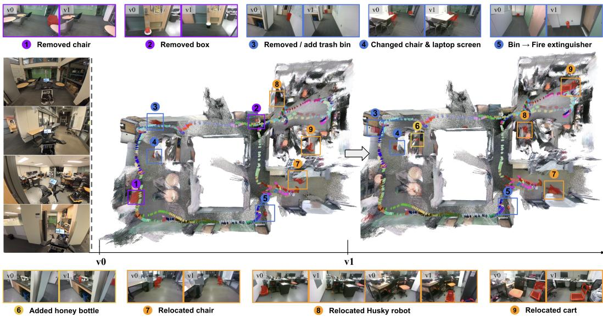  
Figure 5: Qualitative result of the online system in a multi-room scene. Argos-SLAM localizes additions and removals across object scales, such as a removed chair, an added honey bottle, and a relocated Husky robot, consistently in both 2D observations and the global 4D map.

## 5.6 REAL-WORLD EXPERIMENT

To evaluate Argos-SLAM in realistic settings, we conduct offline human-captured and online robotic experiments across small, medium, and multi-room indoor scenes with 4–10 object changes. Human trajectories use unposed iPhone videos, while robotic deployments use an Agilex mobile manipulator with an Intel RealSense D455. Both offline and online inference run on an NVIDIA RTX 5090 desktop GPU; during online deployment, the robot streams camera images to the workstation via ROS 2. As shown in Figure 5, Argos-SLAM operates under clutter, occlusion, and viewpoint changes, consistently localizing additions and removals across object scales in both image space and the reconstructed change-aware 4D map. With inputs capped at 64 images, each change-detection forward pass takes only 0.59 s. During online deployment, the SLAM loop produces a new submap every 8.2 s on average, while the corresponding asynchronous change-detection job completes in 6.9 s, allowing change updates to keep pace with reconstruction and typically finish before the next submap is produced. The accompanying video demonstrates the full on-the-fly reconstruction and map-update process; additional results on other scene scales are provided in Appendix A.6.

## 6 CONCLUSION

Detecting environmental changes and reconstructing consistent spatio-temporal maps remain critical yet challenging tasks for long-term robot autonomy. In this paper, we introduced Argos, which leverages implicit 3D knowledge from GFMs and a co-visibility-aware spatio-temporal comparator for joint scene change detection and 3D reconstruction. Training across diverse datasets, including our new benchmark, enables strong generalization across learned and zero-shot settings and takes a step toward a foundation model for scene change detection. We further introduced Argos-SLAM for online change-aware 4D mapping over long sequences, bridging change detection and long-term robot mapping. More broadly, our results demonstrate the potential of implicit geometric knowledge for change detection and encourage further research on other spatial reasoning tasks.

## REFERENCES

Pablo F. Alcantarilla, Simon Stent, German Ros, Roberto Arroyo, and Riccardo Gherardi. Street-´ view change detection with deconvolutional networks. Autonomous Robots, 42(7):1301–1322, October 2018. ISSN 1573-7527. doi: 10.1007/s10514-018-9734-5. URL https://doi. org/10.1007/s10514-018-9734-5.

Jelena Bratulic, Sudhanshu Mittal, Thomas Brox, and Christian Rupprecht. On geometric under-´ standing and learned priors in feed-forward 3d reconstruction models, 2026. URL https: //arxiv.org/abs/2512.11508.

C. Cadena, L. Carlone, H. Carrillo, Y. Latif, D. Scaramuzza, J. Neira, I. Reid, and J.J. Leonard. Past, present, and future of simultaneous localization and mapping: Toward the robust-perception age. IEEE Trans. Robotics, 32(6):1309–1332, 2016. ISSN 1552-3098. doi: 10.1109/TRO.2016. 2624754.

Rodrigo Caye Daudt, Bertrand Le Saux, and Alexandre Boulch. Fully convolutional siamese networks for change detection. In IEEE International Conference on Image Processing (ICIP), pp. 4063–4067, 2018. doi: 10.1109/ICIP.2018.8451652.

Shuo Chen, Kailun Yang, and Rainer Stiefelhagen. Dr-tanet: Dynamic receptive temporal attention network for street scene change detection. In IEEE Intelligent Vehicles Symposium (IV), pp. 502– 509, 2021. doi: 10.1109/IV48863.2021.9575362.

Kyusik Cho, Dong Yeop Kim, and Euntai Kim. Zero-shot scene change detection. In AAAI Conference on Artificial Intelligence (AAAI), volume 39, pp. 2509–2517, 2025.

Brian Curless and Marc Levoy. A volumetric method for building complex models from range images. In Annual Conference on Computer Graphics and Interactive Techniques (SIGGRAPH), pp. 303–312, New York, NY, USA, 1996. Association for Computing Machinery. ISBN 0897917464. doi: 10.1145/237170.237269. URL https://doi.org/10.1145/237170.237269.

Marius Fehr, Fadri Furrer, Ivan Dryanovski, Jurgen Sturm, Igor Gilitschenski, Roland Siegwart,¨ and Cesar Cadena. Tsdf-based change detection for consistent long-term dense reconstruction and dynamic object discovery. In IEEE International Conference on Robotics and Automation (ICRA), pp. 5237–5244, 2017. doi: 10.1109/ICRA.2017.7989614.

Jiahui Fu, Chengyuan Lin, Yuichi Taguchi, Andrea Cohen, Yifu Zhang, Stephen Mylabathula, and John J. Leonard. Planesdf-based change detection for long-term dense mapping. IEEE Robotics and Automation Letters, 7(4):9667–9674, 2022. doi: 10.1109/LRA.2022.3191794.

Chamuditha Jayanga Galappaththige, Jason Lai, Lloyd Windrim, Donald Dansereau, Niko Sunderhauf, and Dimity Miller. Multi-view pose-agnostic change localization with zero labels. In IEEE/CVF Conference on Computer Vision and Pattern Recognition (CVPR), pp. 11600–11610, 2025.

Chamuditha Jayanga Galappaththige, Jason Lai, Lloyd Windrim, Donald Dansereau, Niko Sunderhauf, and Dimity Miller. Changes in real time: Online scene change detection with multi-view fusion. In IEEE/CVF Conference on Computer Vision and Pattern Recognition (CVPR), 2026.

Hyeonjae Gil, Dongjae Lee, Giseop Kim, and Ayoung Kim. Ephemerality meets lidar-based lifelong mapping. In IEEE International Conference on Robotics and Automation (ICRA), pp. 3312–3319, 2025. doi: 10.1109/ICRA55743.2025.11127618.

Richard Hartley and Andrew Zisserman. Multiple view geometry in computer vision. Cambridge University Press, second edition, 2003.

Sergio Izquierdo and Javier Civera. Optimal transport aggregation for visual place recognition. In IEEE/CVF Conference on Computer Vision and Pattern Recognition (CVPR), June 2024.

Seoyeon Jang, Alex Junho Lee, I Made Aswin Nahrendra, and Hyun Myung. Chamelion: Reliable change detection for long-term lidar mapping in transient environments. IEEE Robotics and Automation Letters, 11(4):4361–4368, 2026. doi: 10.1109/LRA.2026.3665079.

Shyam Sundar Kannan and Byung-Cheol Min. Zeroscd: Zero-shot street scene change detection. In IEEE International Conference on Robotics and Automation (ICRA), pp. 4665–4671, 2025. doi: 10.1109/ICRA55743.2025.11128082.

Bernhard Kerbl, Georgios Kopanas, Thomas Leimkuhler, and George Drettakis. 3d gaussian splat-¨ ting for real-time radiance field rendering. ACM Transactions on Graphics, 42(4), July 2023.

Mukul Khanna, Yongsen Mao, Hanxiao Jiang, Sanjay Haresh, Brennan Shacklett, Dhruv Batra, Alexander Clegg, Eric Undersander, Angel X. Chang, and Manolis Savva. Habitat synthetic scenes dataset (hssd-200): An analysis of 3d scene scale and realism tradeoffs for objectgoal navigation. In IEEE/CVF Conference on Computer Vision and Pattern Recognition (CVPR), pp. 16384–16393, 2024. URL https://doi.org/10.1109/CVPR52733.2024.01550.

Jae-Woo Kim and Ue-Hwan Kim. Towards generalizable scene change detection. In IEEE/CVF Conference on Computer Vision and Pattern Recognition (CVPR), pp. 24463–24473, June 2025.

Alexander Kirillov, Eric Mintun, Nikhila Ravi, Hanzi Mao, Chloe Rolland, Laura Gustafson, Tete Xiao, Spencer Whitehead, Alexander C. Berg, Wan-Yen Lo, Piotr Dollar, and Ross Girshick. Segment anything. In IEEE/CVF International Conference on Computer Vision (ICCV), pp. 4015– 4026, October 2023.

Chun-Jung Lin, Sourav Garg, Tat-Jun Chin, and Feras Dayoub. Robust scene change detection using visual foundation models and cross-attention mechanisms. In IEEE International Conference on Robotics and Automation (ICRA), pp. 8337–8343, 2025. doi: 10.1109/ICRA55743.2025. 11128568.

D. Maggio and L. Carlone. VGGT-SLAM 2.0: Real-time dense feed-forward scene reconstruction. In Robotics: Science and Systems (RSS), 2026.

Maxime Oquab, Timothee Darcet, Th´ eo Moutakanni, Huy Vo, Marc Szafraniec, Vasil Khalidov,´ Pierre Fernandez, Daniel Haziza, Francisco Massa, Alaaeldin El-Nouby, et al. Dinov2: Learning robust visual features without supervision. arXiv preprint arXiv:2304.07193, 2023.

Rafael Padilla, Allan F da Silva, Eduardo AB da Silva, and Sergio L Netto. Change detection in moving-camera videos with limited samples using twin-cnn features and learnable morphological operations. Signal Processing: Image Communication, 115:116969, 2023.

Jin-Man Park, Jae-Hyuk Jang, Sahng-Min Yoo, Sun-Kyung Lee, Ue-Hwan Kim, and Jong-Hwan Kim. Changesim: Towards end-to-end online scene change detection in industrial indoor environments. In IEEE/RSJ International Conference on Intelligent Robots and Systems (IROS), pp. 8578–8585. IEEE Press, 2021. doi: 10.1109/IROS51168.2021.9636350. URL https: //doi.org/10.1109/IROS51168.2021.9636350.

Nicholas Pfaff, Thomas Cohn, Sergey Zakharov, Rick Cory, and Russ Tedrake. Scenesmith: Agentic generation of simulation-ready indoor scenes. In International Conference on Machine Learning (ICML), 2026.

R. Ranftl, A. Bochkovskiy, and V. Koltun. Vision transformers for dense prediction. In IEEE/CVF International Conference on Computer Vision (ICCV), pp. 12179–12188, 2021.

Nikhila Ravi, Valentin Gabeur, Yuan-Ting Hu, Ronghang Hu, Chaitanya Ryali, Tengyu Ma, Haitham Khedr, Roman Radle, Chloe Rolland, Laura Gustafson, et al. Sam 2: Segment anything in images¨ and videos. In International Conference on Learning Representations (ICLR), volume 2025, pp. 28085–28128, 2025.

Ragav Sachdeva and Andrew Zisserman. The change you want to see (now in 3d). In IEEE/CVF International Conference on Computer Vision (ICCV), 2023a.

Ragav Sachdeva and Andrew Zisserman. The change you want to see. In IEEE/CVF Winter Conference on Applications ofComputer Vision (WACV), 2023b.

Ken Sakurada and Takayuki Okatani. Change detection from a street image pair using cnn features and superpixel segmentation. In British Machine Vision Conference (BMVC), 2015. URL https://api.semanticscholar.org/CorpusID:5634885.

Ken Sakurada, Mikiya Shibuya, and Weimin Wang. Weakly supervised silhouette-based semantic scene change detection. In IEEE International Conference on Robotics and Automation (ICRA), pp. 6861–6867, 2020. doi: 10.1109/ICRA40945.2020.9196985.

Manolis Savva, Abhishek Kadian, Oleksandr Maksymets, Yili Zhao, Erik Wijmans, Bhavana Jain, Julian Straub, Jia Liu, Vladlen Koltun, Jitendra Malik, Devi Parikh, and Dhruv Batra. Habitat: A platform for embodied AI research. In IEEE/CVF International Conference on Computer Vision (ICCV), pp. 9339–9347, 2019.

L. Schmid, M. Abate, Y. Chang, and L. Carlone. Khronos: A unified approach for spatio-temporal metric-semantic SLAM in dynamic environments. In Robotics: Science and Systems (RSS), 2024.

Lukas Schmid, Jeffrey Delmerico, Johannes L. Schonberger, Juan Nieto, Marc Pollefeys, Roland¨ Siegwart, and Cesar Cadena. Panoptic multi-tsdfs: a flexible representation for online multiresolution volumetric mapping and long-term dynamic scene consistency. In IEEE International Conference on Robotics and Automation (ICRA), pp. 8018–8024, 2022. doi: 10.1109/ ICRA46639.2022.9811877.

Andrew Szot, Alex Clegg, Eric Undersander, Erik Wijmans, Yili Zhao, John Turner, Noah Maestre, Mustafa Mukadam, Devendra Chaplot, Oleksandr Maksymets, Aaron Gokaslan, Vladimir Vondrus, Sameer Dharur, Franziska Meier, Wojciech Galuba, Angel Chang, Zsolt Kira, Vladlen Koltun, Jitendra Malik, Manolis Savva, and Dhruv Batra. Habitat 2.0: Training home assistants to rearrange their habitat. In Advances in Neural Information Processing Systems (NeurIPS), 2021.

Luiz GC Tavares, Allan F Da Silva, Rafael Padilla, Lucas A Thomaz, Sergio L Netto, and Eduardo AB Da Silva. Pixel-based change detection in moving-camera videos using twin convolutional features on a data-constrained scenario. IEEE Access, 13:123613–123629, 2025.

Ashley Varghese, Jayavardhana Gubbi, Akshaya Ramaswamy, and P. Balamuralidhar. Changenet: A deep learning architecture for visual change detection. In European Conference on Computer Vision (ECCV) Workshops, September 2018.

Ashish Vaswani, Noam Shazeer, Niki Parmar, Jakob Uszkoreit, Llion Jones, Aidan N Gomez, Łukasz Kaiser, and Illia Polosukhin. Attention is All you Need. In Advances in Neural Information Processing Systems (NeurIPS), volume 30. Curran Associates, Inc., 2017.

Johanna Wald, Armen Avetisyan, Nassir Navab, Federico Tombari, and Matthias Nießner. Rio: 3d object instance re-localization in changing indoor environments. In IEEE/CVF International Conference on Computer Vision (ICCV), pp. 7657–7666, 2019. URL https://api. semanticscholar.org/CorpusID:201070582.

Guo-Hua Wang, Bin-Bin Gao, and Chengjie Wang. How to Reduce Change Detection to Semantic Segmentation. Pattern Recognition, 138:109384, June 2023. ISSN 00313203. doi: 10.1016/ j.patcog.2023.109384. URL https://linkinghub.elsevier.com/retrieve/pii/ S0031320323000857.

Jianyuan Wang, Minghao Chen, Nikita Karaev, Andrea Vedaldi, Christian Rupprecht, and David Novotny. Vggt: Visual geometry grounded transformer. In IEEE/CVF Conference on Computer Vision and Pattern Recognition (CVPR), 2025.

Jianyuan Wang, Minghao Chen, Shangzhan Zhang, Nikita Karaev, Johannes Schonberger, Patrick¨ Labatut, Piotr Bojanowski, David Novotny, Andrea Vedaldi, and Christian Rupprecht. VGGT-Ω. In IEEE/CVF Conference on Computer Vision and Pattern Recognition (CVPR), 2026.

Yuqun Wu, Chih-hao Lin, Henry Che, Aditi Tiwari, Chuhang Zou, Shenlong Wang, and Derek Hoiem. Scenediff: A benchmark and method for multiview object change detection. arXiv preprint arXiv:2512.16908, 2025.

Jiae Yoon and Ue-Hwan Kim. VSCD: Video-based scene change detection in unaligned scenes. In International Conference on Machine Learning (ICML), 2026a. URL https: //openreview.net/forum?id=jjYEPizDXZ.

Jiae Yoon and Ue-Hwan Kim. Terdnet: Transformer encoder-recurrent decoder network for scene change detection. In IEEE International Conference on Robotics and Automation (ICRA), June 2026b.

Chuhan Zhang, Guillaume Le Moing, Skanda Koppula, Ignacio Rocco, Liliane Momeni, Junyu Xie, Shuyang Sun, Rahul Sukthankar, Joelle K. Barral, Raia Hadsell, Zoubin Ghahramani, Andrew¨ Zisserman, Junlin Zhang, and Mehdi S. M. Sajjadi. Efficiently reconstructing dynamic scenes one d4rt at a time. In IEEE/CVF Conference on Computer Vision and Pattern Recognition (CVPR), 2026a.

Hao Zhang, Mohamed El Banani, Jen-Hao Cheng, Paul Zhang, Yi Hua, Ben Mildenhall, Christoph Lassner, Narendra Ahuja, and Gengshan Yang. World tracing: Generative pixel-aligned geometry beyond the visible, 2026b. URL https://arxiv.org/abs/2606.13652.

Shibo Zhao, Guofei Chen, Honghao Zhu, Zhiheng Li, Changwei Yao, Nader Zantout, Seungchan Kim, Wenshan Wang, Ji Zhang, and Sebastian Scherer. Supermap: A spatio-temporal slam system for visual-language navigation. In Robotics: Science and Systems (RSS), 2026.

Kaichen Zhou, Yuhan Wang, Grace Chen, Gaspard Beaudouin, Fangneng Zhan, Paul Liang, and Mengyu Wang. Page-4d: Disentangled pose and geometry estimation for vggt-4d perception. In International Conference on Learning Representations (ICLR), volume 2026, pp. 36401–36414, 2026.

## A APPENDIX

## A.1 MODEL IMPLEMENTATION DETAILS

Camera Reader. Each $\mathrm { M L P } _ { \ell }$ has two linear layers with a GELU activation between them, mapping width 2d to $d / 2$ and back to d $( 4 0 9 6  1 0 2 4  2 0 4 8 )$ . Only the patch tokens are updated; the camera and register tokens of each layer pass through unchanged.

Inter-session Cross-Attention. Each CrossAttn uses 16 heads $\left( d _ { h } \right. = \left. d / 1 6 \right)$ with prenormalization, applying separate layer normalizations to the queries and to the keys/values before the learned projections. The tokens of all frames in a visit are flattened into a single sequence, so each token attends to every token of every frame in the other visit, and both directions read the original features $Z _ { v _ { 0 } } ^ { \ell }$ and $\dot { Z } _ { v _ { 1 } } ^ { \ell }$ . The feed-forward sublayer is

$$
\tilde { Z } _ { v } ^ { \ell } = \bar { Z } _ { v } ^ { \ell } + \mathrm { F F N } _ { \ell } \bigl ( \mathrm { L N } _ { \ell } ( \bar { Z } _ { v } ^ { \ell } ) \bigr ) , \qquad v \in \{ v _ { 0 } , v _ { 1 } \} ,\tag{6}
$$

where $\mathrm { L N } _ { \ell }$ denotes layer normalization and $\mathrm { F F N } _ { \ell }$ is a two-layer network with GELU activation and hidden width 4d.

Loss Function. The weighted binary cross-entropy is computed over the valid pixels of all images in a batch,

$$
\mathcal { L } \ = \ \frac { 1 } { \sum _ { r } | \Omega _ { r } | } \sum _ { r } \sum _ { u \in \Omega _ { r } } \mathrm { B C E } _ { w ^ { + } } \big ( z _ { r } ( u ) , M _ { r } ( u ) \big ) ,\tag{7}
$$

where $\Omega _ { r } \subseteq \{ 1 , \ldots , H \} \times \{ 1 , \ldots , W \}$ is the set of valid pixels of image $r , M _ { r }$ is its ground-truth mask, and the positive (change) class is up-weighted by $w ^ { + } = 5$ . Frames without a pixel-aligned label (e.g., the unlabeled image of an SCD pair annotated in only one visit) receive $\Omega _ { r } = \emptyset$ and are excluded from the loss.

Training Details. The Change Detection Head is warm-started from the pretrained depth head, whose DPT decoder has the same architecture, and only its final output layers are re-initialized; the Camera Reader and Inter-session Cross-Attention are randomly initialized. Each batch draws its number of images from {2, 8, 16, 32, 48, 64} and an aspect ratio from [0.5, 2.0], with the batch size chosen so that each GPU processes at most 64 images at resolution 256. The paired-image and video streams are served by separate loaders and interleaved by deficit scheduling: each step draws from the stream that has consumed the smaller fraction of its epoch. This spreads both data types evenly over training, giving a balanced learning signal throughout rather than long runs of a single type, and lets both streams finish together despite variable video batch sizes. For augmentation, we apply color jitter, a horizontal flip shared by all frames of a sample, and a random swap of the visit order with probability 0.5, so the shared cross-attention weights see both directions equally. We use AdamW with weight decay 0.05 and a peak learning rate of $\mathbf { \bar { 1 0 } ^ { - 5 } }$ , with linear warm-up over the first 5% of steps followed by cosine decay, gradient clipping at norm 1.0, and bfloat16 mixed precision. We train for 50 epochs with DDP on two RTX 4090 GPUs, which takes about three days.

## A.2 DATASET GENERATION

Synthetic Dataset Generation. We build the synthetic portion of our dataset in five steps:

1. State sampling. For each scene, we generate three states by randomly removing movable objects. A support graph inferred from object geometry preserves physical plausibility by removing dependent objects together with their supports, while structural elements required for navigation are retained.

2. Coverage planning. Candidate viewpoints are sampled over the navigable space and evaluated for object visibility. We select viewpoints that jointly cover scene objects and navigable areas, then connect them with an open-path TSP to produce an independent trajectory for each state. The pipeline is illustrated in Figure 6.

3. Rendering. Each state is rendered along its trajectory at $5 1 2 \times 5 1 2$ and 30 fps, with camera orientation varying independently of travel direction to increase viewpoint diversity.

4. Change masks. Ground-truth masks are derived from object identities rather than pixel differences. For each ordered state pair, objects present in one state but absent from the

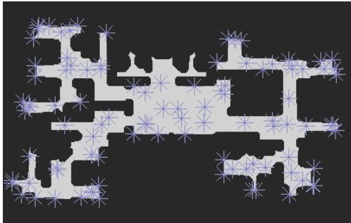  
(a) Step 1: initial viewpoint sampling.

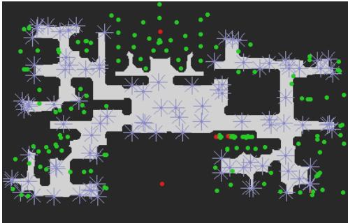  
(b) Step 2: viewpoint object coverage check.

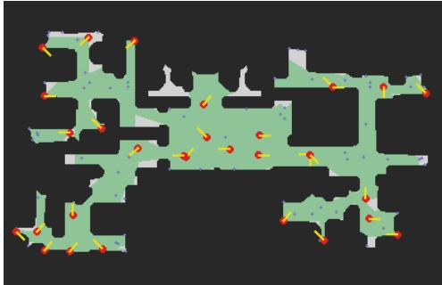  
(c) Step 3: fog-of-war viewpoints selection.

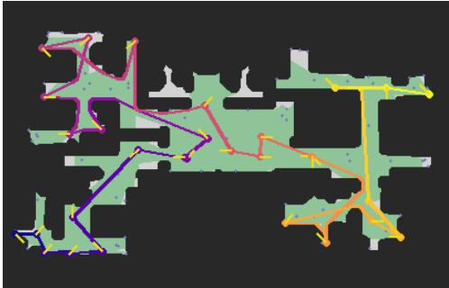  
(d) Step 4: TSP routing and trajectory generation.

Figure 6: Synthetic dataset trajectory generation process. The steps ensure maximum coverage of visible objects with a small number of viewpoints to ensure sufficient and efficient coverage of the environments.

other are marked as changed and rendered with a dedicated semantic label, yielding exact per-frame masks.

5. Cross-visit matching. Because visits follow independently generated trajectories, we match frames across states using scene overlap and pose similarity, retaining the best cross-visit correspondences for training and evaluation. Figure 7 shows that matched views share substantial visible scene geometry.

Argos-CD-HSSD and Argos-CD-SceneSmith share this generation pipeline, differing mainly in scene source and simulator. Argos-CD-HSSD uses HSSD scenes (Khanna et al., 2024) rendered in Habitat (Savva et al., 2019; Szot et al., 2021). Argos-CD-SceneSmith applies the same pipeline to procedurally generated SceneSmith scenes (Pfaff et al., 2026), using Drake’s VTK renderer and a walkable navmesh derived from scene geometry. We provide both whole-house and per-room variants.

Real-World Dataset Generation. We collect Argos-CD-real from independently captured revisits of real indoor scenes. Changes are annotated using the SceneDiff tool (Wu et al., 2025): annotators identify changed objects and

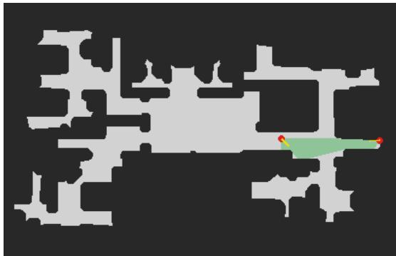  
Figure 7: Frustum overlap view match.

provide sparse point prompts, which SAM2 propagates across both videos to produce dense perframe masks. This supports real-world additions, removals, modifications, and deformable changes. We refer readers to the original paper for further details on the annotation procedure.

Dataset Statistics Comparison Protocol. Table 1 compares our datasets with prior scene change detection benchmarks. Places approximates the number of visually distinct locations visited within a trajectory. We cluster per-frame DINOv2–SALAD descriptors using a cosine-distance threshold of 0.7 and merge revisits to the same location. Length denotes the duration of a single visit, computed from its frame count at 30 fps. Both are reported as mean/minimum/maximum over visits. Pairs counts cross-visit comparisons: one pair corresponds to two images for SCD datasets or two video clips for VSCD datasets. Views counts frames with ground-truth change masks.

## A.3 ONLINE SYSTEM IMPLEMENTATION DETAILS

We retain prior visit $v _ { 0 }$ and reconstruct current visit $v _ { 1 }$ online, submap-by-submap, using VGGT-SLAM (Maggio & Carlone, 2026). Each submap triggers a bounded change-detection (CD) job that processes its keyframes with selected prior keyframes in one Argos forward pass and transfers predictions to sparse 3D points.

Cross-visit alignment. We reuse VGGT-SLAM’s SALAD-based (Izquierdo & Civera, 2024) loop closure. Once a cross-visit closure aligns $v _ { 1 }$ with the prior reconstruction from $v _ { 0 } ,$ CD jobs can use geometrically comparable prior frames. Verified loop closures receive the highest pairing confidence, $c = 2$

Coarse SALAD matching. Using cached SALAD descriptors, each current keyframe retrieves its nearest prior keyframe by $L _ { 2 }$ distance $d ,$ accepting matches with $d < \delta = 0 . 9$ . Matching is bidirectional, and accepted pairs receive $c = \operatorname* { m a x } ( \bar { 0 } , 1 - d / \delta )$ before geometric verification.

Geometric reprojection gate. Candidate pairs are verified by unprojecting depth, reprojecting across views, and computing symmetric in-frame depth-consistent overlap. We reject overlap below 0.5, use a 15% depth tolerance, and assign accepted pairs their overlap score as $c \in [ 0 , 1 ]$ . To ensure, fast compute, verification uses an $8 \times 8$ strided pixel grid $( \sim 1 / 6 4$ of pixels); world points are computed once per frame and cached across comparisons.

Scene-centroid coverage search. For unmatched frames, we index prior keyframes by the centroid of their visible world points and geometrically evaluate only the $k = 1 0$ nearest centroids using the same reprojection score. This supports large viewpoint changes while reducing search from $\mathcal { O } ( n _ { v _ { 0 } } n _ { v _ { 1 } } ) \mathrm { t o } \mathcal { O } ( n _ { v _ { 1 } } k )$

Temporal fallback. Remaining unmatched frames inherit the correspondence of the nearest matched frame within $w = 5$ frames, with confidence $c = 0 . 1 ( 1 - \Delta / ( w + 1 ) ) < 0 . 1$ for temporal distance $\Delta .$ . Frames without a correspondence are excluded from change inference and cross-visit fusion.

Asynchronous CD execution. Matching and inference run on a background worker, keeping reconstruction responsive. Jobs respect Argos’s 64-image limit by reducing the current-visit window while keeping matched pairs together.

Change-aware map fusion. Per-pixel change probabilities and pairing confidences are transferred to their corresponding sparse 3D points; for prior frames used in multiple jobs, we retain the highest confidence. After pose-graph optimization, observations within each world-space voxel are fused by a confidence-weighted mean. Pairing confidence measures correspondence quality and is distinct from the model’s unused per-pixel confidence. For a queried visit v with other visit $\dot { \mathbf { \zeta } } _ { v ^ { \prime } }$ , points from $v ^ { \prime }$ whose fused probability exceeds a threshold τ form the changed set $\mathbb { P } _ { \Delta } ^ { v ^ { \prime } } ;$ removing it from the joint reconstruction yields the change-aware point-cloud map P(v) of Section 4.5.

## A.4 EVALUATION PROTOCOL

Adapting SCD Baselines to VSCD Benchmarks. Paired-image SCD methods assume correspondence between their two inputs. To evaluate them on video benchmarks, we establish cross-visit pairs using SALAD (Izquierdo & Civera, 2024): for each frame in one visit, we retrieve its bestmatching frame from the other visit and apply the SCD model to the pair. We repeat this in both directions so that every frame in both visits receives a prediction.

Benchmark Setup. For PSCD and VL-CMU-CD, we follow the per-image protocols of Lin et al. (2025). For ChangeSim, we exclude the “removed” class from the ground-truth masks and report results under the original ChangeSim protocol in Table 8. For VSCD, we retain the original RGB videos but replace the original v -aligned labels with masks for both visits, where each mask marks content present in that visit and absent from the other. We uniformly sample 32 frames per visit and report results under the original VSCD protocol separately in Table 9. For SceneDiff and Argos CD-real, we sample 16 frames per visit. For the longer HSSD-CD and SceneSmith-CD sequences, we evaluate within fixed 48-frame temporal windows, sampling 16 frames from the current visit and selecting corresponding prior-visit frames using the cached cross-visit matches.

## A.5 ADDITIONAL EXPERIMENTS

Table 6: O-SCD pose-registration prescreen coverage. Across all 220 classic-VSCD test candidates, increasing the reference-frame budget from 32 to 128 provide enough datapoint for reliable evaluation.
<table><tr><td>Setting</td><td>#Samples</td><td>COLMAP Success</td><td>Avg. Query Frames</td><td>Full Success (32/32)</td><td>≥90% Success (29+/32)</td></tr><tr><td>32+32</td><td>220</td><td>141 (64.1%)</td><td>7.5 / 32</td><td>4 (1.8%)</td><td>4 (1.8%)</td></tr><tr><td>64+32</td><td>220</td><td>181 (82.3%)</td><td>11.9 /32</td><td>6 (2.7%)</td><td>15 (6.8%)</td></tr><tr><td>128+32</td><td>220</td><td>199 (90.5%)</td><td>13.8 / 32</td><td>7 (3.2%)</td><td>15 (6.8%)</td></tr><tr><td>256+32</td><td>220</td><td>195 (88.6%)</td><td>13.0 / 32 4</td><td>(1.8%)</td><td>9 (4.1%)</td></tr></table>

Table 7: Comparison against O-SCD on the top-12 classic-VSCD scenes O-SCD can register. When given enough reference frames, O-SCD outperforms the VSCDNet baseline but still falls short of our proposed method.
<table><tr><td>Method</td><td>Static</td><td>Change</td><td>mIoU</td><td>F1</td></tr><tr><td>O-SCD (R=32)</td><td>88.42</td><td>19.18</td><td>53.80</td><td>26.28</td></tr><tr><td>O-SCD (R=128)</td><td>90.20</td><td>28.95</td><td>59.57</td><td>40.64</td></tr><tr><td>VSCDNet</td><td>90.22</td><td>22.45</td><td>56.33</td><td>31.05</td></tr><tr><td>Ours (VSCD)</td><td>93.21</td><td>37.70</td><td>65.46</td><td>49.41</td></tr></table>

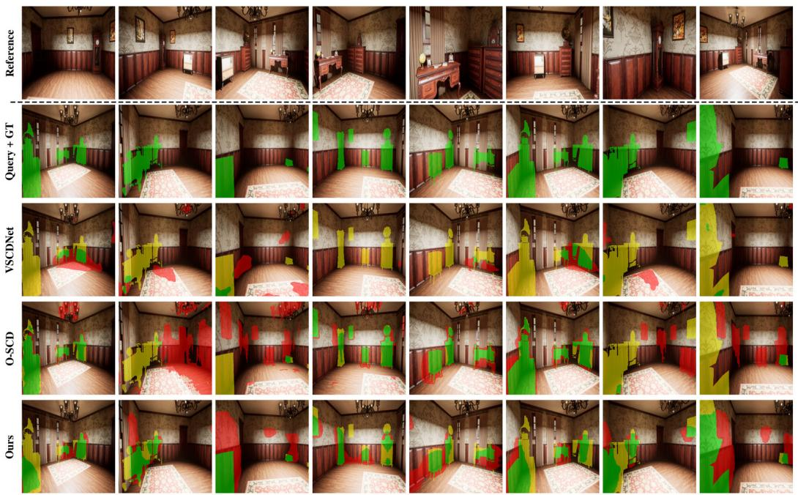  
Figure 8: Qualitative comparison between O-SCD, VSCDNet, and Argos. Even with 128 reference frames, O-SCD produces sensible predictions—particularly over removed objects—but still yields many false positives (FP) and false negatives (FN).

Comparison against O-SCD. O-SCD predicts both “appeared” and “removed” masks for maskonly query frames given a set of reference frames, a formulation that differs from ours in Section 3;

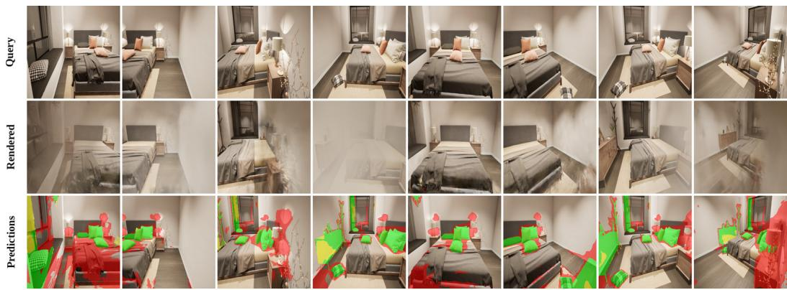

(a) Poor rendering quality from the Gaussian Splats at novel views corresponding to the query camera positions.  
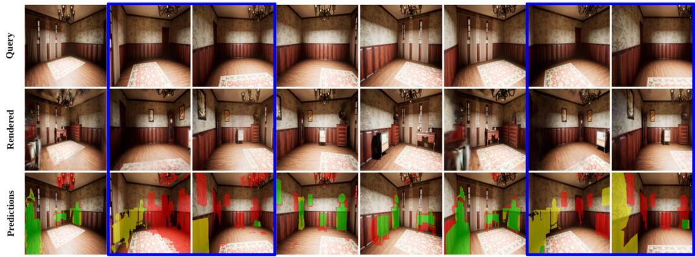  
(b) Blue boxes highlight incorrect pose estimation, which is readily identifiable from the carpet orientation.  
Figure 9: O-SCD limitation analysis. Even when COLMAP and Gaussian Splatting succeed, poor rendering quality or incorrect camera registration can still lead to noisy predictions.

we therefore evaluate on the original VSCD dataset, which is consistent with O-SCD’s output format. As shown in Table 6, under the original protocol of 32 reference and 32 query images, O-SCD frequently fails to produce results due to COLMAP or query-frame camera-pose registration failures. We thus provide 128 reference frames—a more generous setting that favors O-SCD—and select the top-12 samples on which it consistently succeeds. For this evaluation, we train our model on VSCD to predict both “appeared” and “removed” masks, and Table 7 shows that our method outperforms O-SCD even under settings that favor it. We further provide a qualitative comparison in Figure 8.

We further analyze O-SCD qualitatively (Figure 9) and identify two limitations that frequently hurt its pipeline: (1) poor rendering quality produced by noisy camera-position estimates or by query frames that fall outside the distribution of the reference frames; and (2) incorrect pose registration caused by large scene changes, e.g., when most objects are removed, which yields a well-rendered but wrong image for change detection.

Additional benchmark results. We additionally evaluate Argos under the original ChangeSim and VSCD protocols. For these experiments, Argos predicts both “appeared” and “removed” regions, which are combined into a binary change mask. For VSCD, we follow the original evaluation protocol and additionally compare against two abandoned-object detection (AOD) methods, TCF-LMO (Padilla et al., 2023) and PBCD-MC (Tavares et al., 2025).

Argos remains consistently stronger under these alternative output protocols. On ChangeSim (Ta ble 8), it improves change IoU from 34.20 to 51.75 and F1 from 46.01 to 65.13 over the strongest baseline, TERDNet. On the original VSCD benchmark (Table 9), Argos outperforms prior methods on both synthetic and real-world data and remains strong across variations in video length, graphics quality, and the number of changed objects. These results suggest that Argos learns transferable change cues that remain effective across different annotation and output conventions.

Table 8: Performance on ChangeSim under original protocol.
<table><tr><td rowspan="2">Method</td><td colspan="4">ChangeSim</td></tr><tr><td>Static</td><td>Change</td><td>mIoU</td><td>F1</td></tr><tr><td>FC-EF</td><td>65.68</td><td>16.58</td><td>41.13</td><td>27.21</td></tr><tr><td>FC-Siam-diff</td><td>84.56</td><td>25.03</td><td>54.80</td><td>38.55</td></tr><tr><td>FC-Siam-conc</td><td>80.63</td><td>23.32</td><td>51.95</td><td>35.44</td></tr><tr><td>CSCDNet</td><td>90.61</td><td>24.05</td><td>57.33</td><td>35.70</td></tr><tr><td>DR-TANet</td><td>89.14</td><td>28.02</td><td>58.59</td><td>39.71</td></tr><tr><td>C-3PO</td><td>91.16</td><td>28.67</td><td>59.99</td><td>40.17</td></tr><tr><td>ZSSCD†</td><td>92.55</td><td>28.25</td><td>60.40</td><td>39.54</td></tr><tr><td>RobustSCD</td><td>87.12</td><td>28.85</td><td>57.82</td><td>41.41</td></tr><tr><td>GeSCF†</td><td>88.82</td><td>20.27</td><td>54.54</td><td>33.28</td></tr><tr><td>TERDNet</td><td>91.37</td><td>34.20</td><td>62.78</td><td>46.01</td></tr><tr><td>Ours</td><td>93.87</td><td>51.75</td><td>72.81</td><td>65.13</td></tr></table>

Table 9: Overall performance on the original VSCD benchmark. We report frame-wise F1 score (%) on the synthetic dataset and the real-world test set, together with results stratified by video length, graphic level, and the number of changed objects.
<table><tr><td colspan="2">Method</td><td colspan="3">Video length</td><td colspan="2">Graphic level</td><td colspan="3">Object changes</td><td rowspan="2">Synthetic</td><td colspan="2">Captured by Robot Human</td><td rowspan="2">Real-world Overall</td></tr><tr><td>Task</td><td>Model</td><td>Low</td><td>Mid</td><td>High</td><td>Mid</td><td>High</td><td>Low</td><td>Mid</td><td>High</td><td>Overall</td><td></td><td></td></tr><tr><td rowspan="2">AOD</td><td>TCF-LMO</td><td>17.1</td><td>20.1</td><td>22.2</td><td>18.7</td><td>20.8</td><td></td><td>15.2</td><td>21.0</td><td>21.8</td><td>19.7</td><td>7.4</td><td>12.0</td><td>10.3</td></tr><tr><td>PBCD-MC</td><td>24.6</td><td>28.0</td><td>26.5</td><td></td><td>26.3</td><td>27.4</td><td>23.4</td><td>28.0</td><td>27.8</td><td>26.8</td><td>16.8</td><td>15.7</td><td>16.1</td></tr><tr><td rowspan="6">SCD</td><td>CSCDNet</td><td>18.8</td><td>21.4</td><td>16.9</td><td></td><td></td><td></td><td></td><td></td><td></td><td>19.8</td><td>8.2</td><td>9.6</td><td>9.1</td></tr><tr><td>DR-TANet</td><td>20.5</td><td>22.0</td><td></td><td></td><td>21.7 22.9</td><td>17.5 17.9</td><td>20.0 20.8</td><td>20.1 20.5</td><td>19.0 20.6</td><td>20.6</td><td>9.1</td><td>13.1</td><td>11.6</td></tr><tr><td>C-3PO</td><td>22.7</td><td>26.1</td><td></td><td>17.2</td><td></td><td>16.9</td><td>18.8</td><td></td><td>27.8</td><td>24.1</td><td>8.0</td><td>13.9</td><td>11.7</td></tr><tr><td>ZSSCD</td><td>0.1</td><td></td><td></td><td>20.8 0.1</td><td>30.1 0.5</td><td>0.1</td><td>0.2</td><td>25.1 0.4</td><td>0.2</td><td>0.3</td><td>2.1</td><td>0.0</td><td>0.8</td></tr><tr><td>GeSCF</td><td>26.4</td><td>0.5 30.4</td><td>31.2</td><td></td><td>29.3</td><td>29.8</td><td>28.0</td><td>29.7</td><td>30.6</td><td>29.5</td><td>25.1</td><td>12.6</td><td>17.3</td></tr><tr><td></td><td></td><td></td><td></td><td></td><td></td><td></td><td></td><td></td><td></td><td></td><td></td><td></td><td></td></tr><tr><td rowspan="2">VSCD</td><td>VSCDNet</td><td>38.1</td><td>36.9</td><td>33.9</td><td></td><td>40.7</td><td>31.7</td><td>32.1</td><td>37.7</td><td>39.0</td><td>36.6</td><td>32.0</td><td>21.5</td><td>25.4</td></tr><tr><td>Ours*</td><td>48.07</td><td>50.04</td><td>46.44</td><td>53.29</td><td></td><td>42.99</td><td>42.39</td><td>51.10</td><td>49.35</td><td>48.88</td><td>26.90</td><td>38.13</td><td>34.92</td></tr></table>

Table 10: Inference runtime vs. number of input images.
<table><tr><td>Method</td><td colspan="7">Number of input images N</td></tr><tr><td></td><td>2</td><td>4</td><td>8</td><td>16</td><td>32</td><td>64</td><td>128</td></tr><tr><td>TERDNet</td><td>0.076</td><td>0.095</td><td>0.13</td><td>0.26</td><td>0.51</td><td>1.03</td><td>2.05</td></tr><tr><td>C-3PO</td><td>0.008</td><td>0.010</td><td>0.015</td><td>0.026</td><td>0.049</td><td>0.10</td><td>0.21</td></tr><tr><td>VSCDNet</td><td>0.030</td><td>0.059</td><td>0.12</td><td>0.25</td><td>0.48</td><td>0.96</td><td>1.91</td></tr><tr><td>SceneDiff†</td><td>22.8</td><td>32.6</td><td>51.6</td><td>96.6</td><td>210</td><td>485</td><td>OOM</td></tr><tr><td>O-SCD‡</td><td>Fail</td><td>Fail</td><td>Fail</td><td>187</td><td>209</td><td>194</td><td>286</td></tr><tr><td>Ours-foundation</td><td>0.037</td><td>0.043</td><td>0.068</td><td>0.12</td><td>0.25</td><td>0.59</td><td>1.45</td></tr></table>

Runtime Comparison. We measure mean wall-clock time (seconds) of one forward pass (batch size 1, single RTX 5090) as the total number of input images N grows $( N / 2$ reference and $\dot { N } / 2$ query frames); every method predicts a change mask for all N frames. † indicates zero-shot methods; SceneDiff’s time includes loading its Pi3, SAM, and DINOv3 models due to multi-stage pipeline design and it runs out of host CPU memory (OOM, 125 GB RAM) at N=128. ‡ O-SCD reconstructs a 3D Gaussian scene from the reference session (via COLMAP structure-from-motion and 3DGS training) before online query localization, so its runtime is dominated by this offline step rather than the online inference itself; it fails (Fail) for $N { \le } 8$ because COLMAP cannot register a usable reconstruction from so few reference views.

## A.6 ADDITIONAL REAL-WORLD QUALITATIVE RESULTS

Figure 10 and Figure 11 show the mapping results from the Agilex mobile manipulator in small and medium environments. Figure 12 and Figure 13 show the offline mapping results from iPhonecaptured data in a multi-room indoor apartment and a small office.

3 Changed bottles  
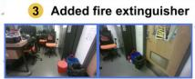  
T1

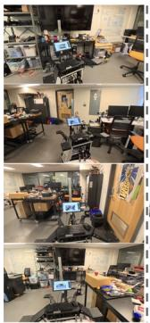

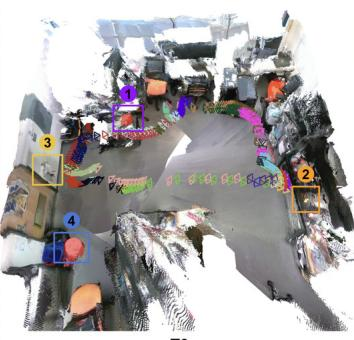

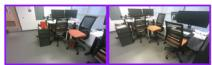  
2 Added banana

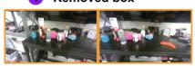

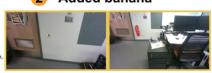  
4 Removed bucket

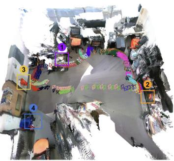  
Figure 10: Qualitative result of online robot mapping in a small-size workshop environment.

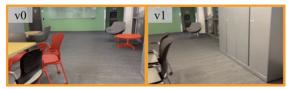  
① Removed Bin

4Added Chair  
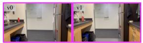

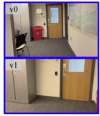

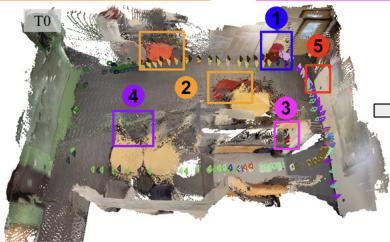  
v0

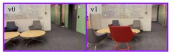

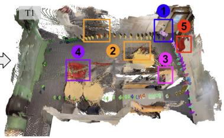  
v1

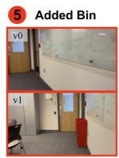

Figure 11: Qualitative result of online robot mapping in a medium-sized common space area.  
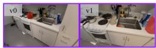

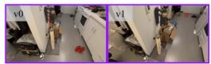  
② Removed boots

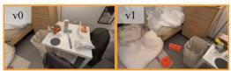

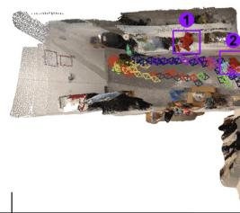

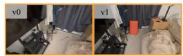  
3 Relocated amp & added toy  
4 Relocated scratchpad

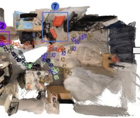  
v0

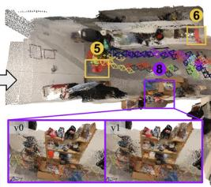  
v1

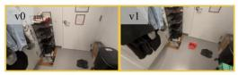

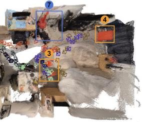  
5 Added shoes

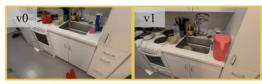  
6 Added water filter

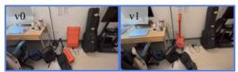  
7Moved guitar, amp, scratchpad

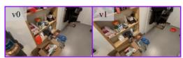  
8 Removed sanitizer

Figure 12: Qualitative result of the offline mapping from iPhone-captured video in a multiroom apartment.

## A.7 ADDITIONAL QUALITATIVE RESULTS FROM CHANGE DETECTION DATASETS

We provide additional qualitative results of sampled scenes from each dataset. SCD results are shown in Figure 14, and VSCD results are shown in Figure 15, 17, 16, 18, and 19.

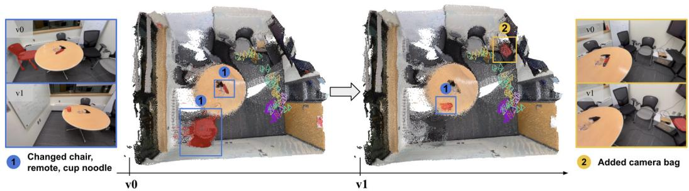  
Figure 13: Qualitative result of online robot mapping in a small-size office environment.

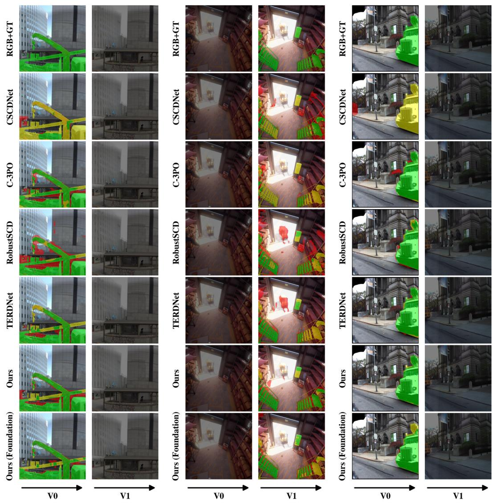  
(a) PSCD  
(b) ChangeSim  
(c) VL-CMU-CD  
Figure 14: Qualitative results of SCD datasets. SCD contains image pairs with labels only on the v0 or v1 image. Argos consistently produces predictions with less noise.

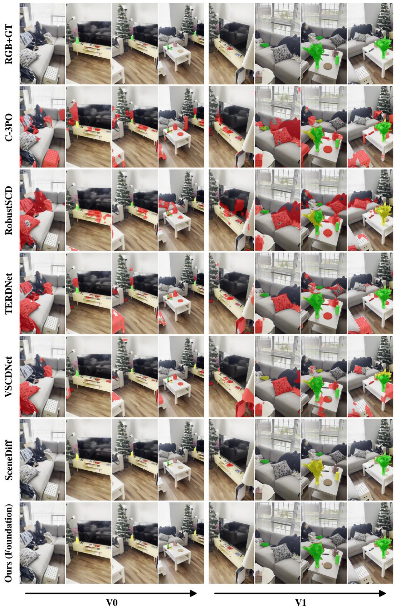  
Figure 15: Qualitative result of the SceneDiff dataset.

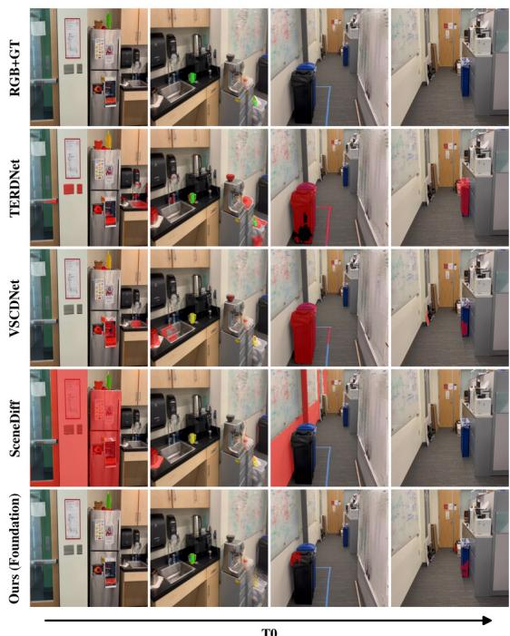  
T0

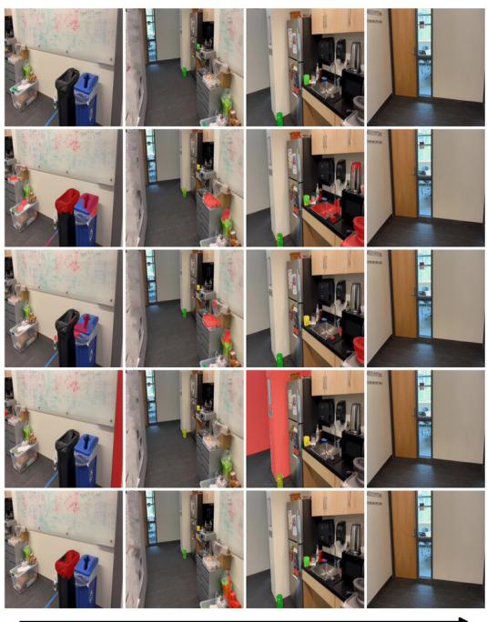  
T1  
Figure 16: Qualitative result of the Argos-CD-real dataset. Stretched vertically to provide a better view.

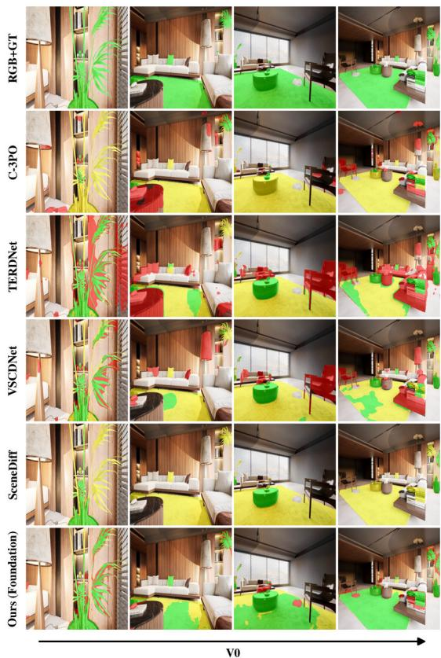  
V0

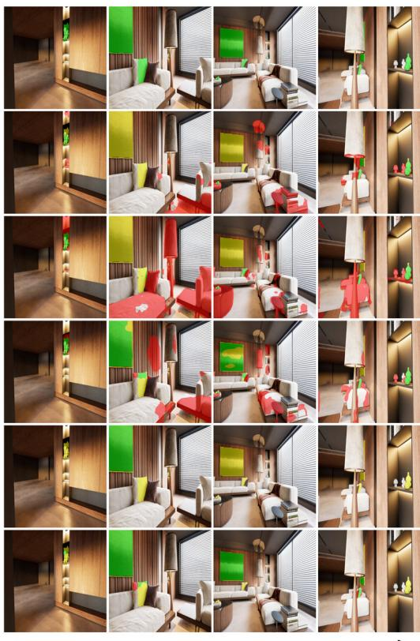  
V1  
Figure 17: Qualitative result of the VSCD dataset. Stretched vertically to provide a better view.

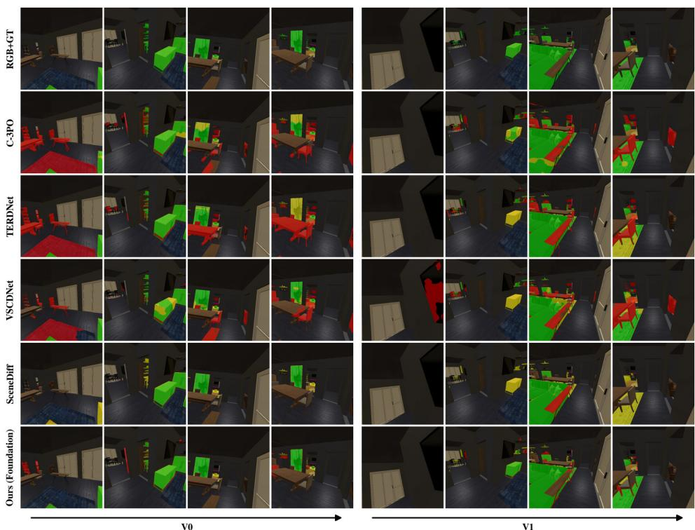  
Figure 18: Qualitative result of the Argos-CD-HSSD dataset.

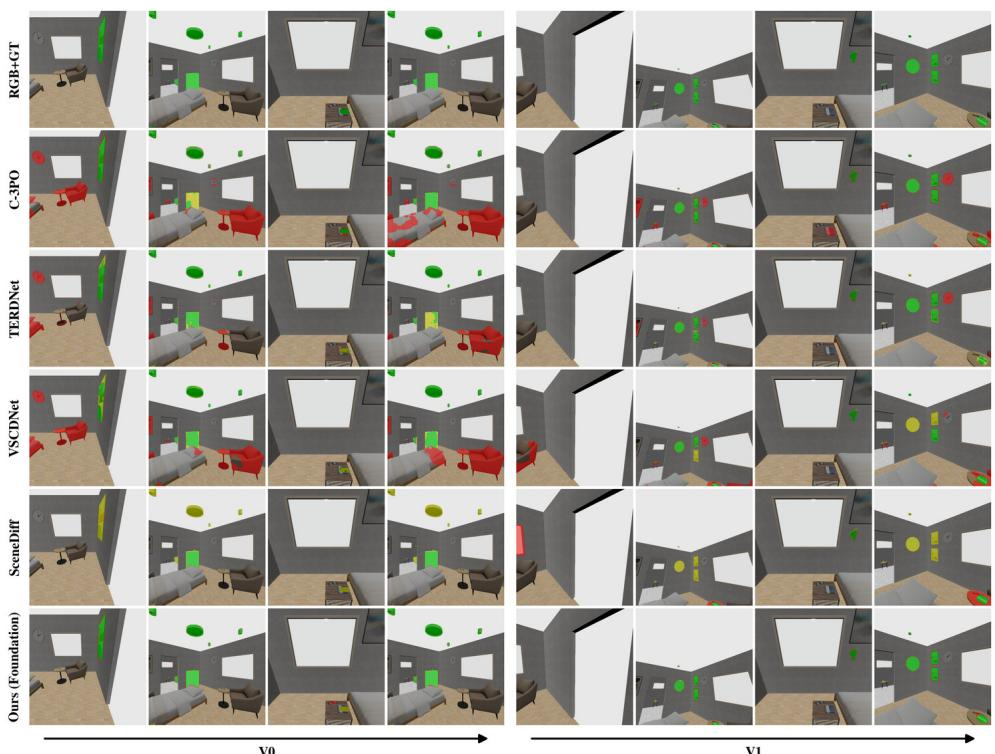  
Figure 19: Qualitative result of the Argos-CD-SceneSmith dataset.