# BEYOND ANONYMOUS CAPTIONS: GROUNDING CHARACTER IDENTITY IN VIDEO CAPTIONING AND QUESTION ANSWERING

Anas Filali Razzouki1,2 Killian Steunou1,2 Khalil Guetari2 Thomas Kling2 Mounˆım El-Yacoubi1 Yannis Tevissen1,2

1Tel´ ecom SudParis, Institut Polytechnique de Paris, France´

2Moments Lab Research, France

## ABSTRACT

Linking people’s appearance and actions to character identities is essential for understanding video narratives. We present a framework for identity-aware video captioning and person-centric question answering that combines automatic character identification, explicit spatial grounding, and task-specific adaptation. Starting from LSMDC v2 movie clips, our pipeline matches detected faces to actor reference images, tracks characters across frames, and builds inputs with identitylinked bounding boxes. A strong vision-language model generates identity-aware captions and questions, which are manually verified and filtered to create a benchmark of 750 captioned clips and 3,000 person-centric questions. We study five grounding strategies combining textual coordinates with visual face or estimated person boxes across Video-MLLM families at roughly 2B, 4B, and 8B parameters and larger frontier models. Combining visual face boxes with textual coordinates yields the most consistent performance across scales and significantly improves overall performance over coordinates alone. Smaller models tend to over-assign known identities when the queried person is not grounded, while larger models better recognize such UNIDENTIFIED cases. We introduce BAC by LoRA finetuning Qwen models at 2B, 4B, and 8B scales on about 32K identity-aware captioned clips. Across all scales, BAC outperforms every other evaluated model family of comparable size. BAC-8B reaches 93.20% overall QA accuracy, ranking behind only GPT-5.6 Sol among the frontier models evaluated in our study. Overall, explicitly communicating who is where, together with lightweight taskspecific adaptation, substantially improves identity-aware video understanding without changing the underlying architecture. We release the benchmark, training data, code, and BAC checkpoints at https://github.com/momentslab/ beyond-anonymous-captions.

## 1 INTRODUCTION

Understanding human-centered video requires more than recognizing what happens in a scene. Video-captioning models can describe events, appearances, actions, and interactions in natural language (Xu et al., 2016; Yang et al., 2023). However, these descriptions are typically identityagnostic: a model may correctly understand what each visible person is doing without determining which character that person corresponds to. In narrative videos such as movies, this distinction is important because scene understanding depends not only on recognizing actions and interactions, but also on attributing them to the correct characters.

At the same time, visual grounding has made substantial progress in associating textual references with corresponding visual regions (Kamath et al., 2021; Ma et al., 2024). Given a textual reference to a person or object, grounding models can localize the referred entity, typically through spatial regions such as bounding boxes. Video captioning therefore provides a mechanism for describing what is happening in a scene, while visual grounding provides complementary information about where a referred entity is located.

This observation motivates the central question of our work: can these two capabilities be combined to support identity-aware video understanding? More specifically, if a Video-MLLM is provided not only with the visual content of a video, but also with explicit information indicating the identity and spatial location of the people appearing in it, can it correctly associate each identity with the corresponding person in the scene? Such an association could allow the model to preserve its existing understanding of appearances, actions, spatial relations, and interactions while grounding that understanding in the correct character identities. More generally, we investigate whether explicit information about who is where can help a Video-MLLM determine more reliably who is doing what, where, and with whom.

Prior work on identity-aware visual description has approached the problem in several ways. Early movie-naming methods such as M-VAD Names (Pini et al., 2019) associate face tracks with charac ter identities and replace generic SOMEONE mentions in existing captions with the corresponding names, rather than generating identity-aware descriptions directly. A related post-processing strat egy is proposed by Tevissen et al. (Tevissen et al., 2024), who first generate a generic image caption and then use attention maps and identified face regions to replace person mentions with names. In both cases, identity is introduced after the caption content has largely been determined, so people omitted from the original caption cannot naturally be recovered. M-VAD Names indeed formulates its main task as replacing SOMEONE tags in existing captions with proper character names.

More recent work integrates identity more directly into multimodal understanding. MICap (Raajesh et al., 2024) maintains anonymous person identities across a videoset of five consecutive clips by clustering faces and jointly learning identity assignment and caption generation. IDA-VLM (Ji et al., 2025), instead, conditions a vision-language model on reference images of known identities and requires the model to recognize those identities in new scenes before performing tasks such as localization, question answering, or captioning. ISYV (Gao et al., 2026) extends this referenceconditioned setting to video, requiring the model to recognize and reason about a target person across time and shot transitions. Thus, these methods either learn identity consistency jointly with generation or require the multimodal model itself to infer the correspondence between a reference identity and its occurrence in the visual input.

A complementary line of work studies region-level multimodal grounding. Omni-RGPT (Heo et al., 2025) associates user-specified boxes or masks with language references to support region-specific reasoning over images and videos, while VideoGLaMM (Munasinghe et al., 2025) grounds language in video at the pixel level through spatio-temporally consistent segmentation masks. These approaches demonstrate that explicit links between language and visual regions can support finegrained reasoning, but they are not designed specifically to determine how known character identities should be represented to a general-purpose Video-MLLM.

Despite these advances, existing approaches do not address our central question: how should already known character identities be spatially represented to a general-purpose Video-MLLM so that it can reason about them throughout a video? We introduce this formulation by providing explicit identity-linked spatial cues whenever reliable detections and tracks are available, rather than requiring the model to recover identity solely from reference images or appearance. Importantly, these cues may be absent in some frames, requiring the Video-MLLM to propagate the available identity information across time and associate each character with their appearances, actions, locations, and interactions. We therefore investigate how different spatial representations of known identities enable identity-aware video captioning and person-centric question answering, without designing a dedicated region-aware architecture.

To study this question, we develop a pipeline on movie shots from LSMDC v2 in which detected faces are matched to actor reference images and identified characters are spatially grounded across sampled frames. We construct a manually verified benchmark of 750 captioned shots and 3,000 person-centric questions, and compare five identity-grounding representations ranging from textual coordinates to visual face or person boxes and their combinations. We evaluate them on identityaware video captioning and person-centric question answering, then use the resulting grounding formulation to introduce BAC at three model scales (2B, 4B, and 8B). We compare BAC with Video-MLLMs of similar sizes from multiple model families and extend the evaluation to frontier open-weight and proprietary video-language models. We release approximately 32K synthetically captioned training clips and a manually verified benchmark of 750 clips and 3,000 questions, all with face bounding-box annotations, plus source code and trained checkpoints.

## 2 METHODS

## 2.1 DATASET

## 2.1.1 CHARACTER IDENTIFICATION

We build our dataset from the LSMDC v2 collection (Rohrbach et al., 2017; Torabi et al., 2016; Maharaj et al., 2017), downloading 92 movies comprising 46,756 video clips. Following castsupervised character-identification approaches for movies and TV series (Xu et al., 2010; Nagrani & Zisserman, 2018; Bamman et al., 2024), we construct character-linked face tracks by combining cast information, actor reference images, face recognition, and temporal tracking.

For each movie, we retrieve actor and character names from IMDb and collect up to 50 reference images per actor from DuckDuckGo. We filter low-quality or ambiguous images using Insight-Face (Deng et al., 2019) based on image resolution, face size, detection confidence, and face dominance. The remaining face embeddings are clustered to remove identity outliers, and the 5 most representative images are retained for each actor, forming a reliable reference gallery.

Each clip is then processed frame-by-frame with InsightFace to detect faces and extract 512- dimensional embeddings. A DeepSORT-inspired online tracker (Wojke et al., 2017) links detections across consecutive frames into temporally consistent tracks. Each track is represented by a robust aggregate embedding and matched against the movie-specific reference gallery. The predicted identity is accepted when the matching confidence exceeds 0.30 and is propagated across the track together with its face bounding boxes.

Finally, because the original LSMDC clips may contain multiple camera shots with abrupt changes in scene or viewpoint, we split them into visually coherent shots using PySceneDetect. This produces 54,133 shots, with an average duration of 2.50 s, and an average of 1.7 shots per clip.

## 2.1.2 CAPTION AND QUESTION GENERATION

Given the short shot duration, averaging approximately 2.5 s at 24 fps, we uniformly sample 8 frames per shot. As illustrated in Figure 1, these frames provide sufficient temporal coverage of the main actions. From the 54,133 detected shots, we retain only those containing at least one identity-linked bounding box in at least one sampled frame. Preserving the original LSMDC v2 movie-level split, this yields 31,935 shots from 72 training movies and 6,219 shots from 12 test movies. The training set is further divided into 28,742 training and 3,193 validation shots, with the validation split used for BAC hyperparameter tuning.

For both training and test shots, the sampled frames are provided to Gemini 2.5 Flash to generate identity-aware captions. For test shots, the model is additionally instructed to generate four personcentric questions and to assess shot validity, visual and temporal coherence, and identity-grounding difficulty. We retain shots that are valid, high-quality, and challenging, with coherence scores of at least 9 and challenge scores of at least 8.5. This favors non-trivial cases involving multiple people, distractors, occlusions, interactions, or viewpoint changes, yielding 2,008 shots.

Finally, from the 2,008 retained shots, we manually review and correct the captions, questions, and answers. We remove redundant or ambiguous examples and refine overly simple questions to require more precise identity grounding. This curation produces a final evaluation benchmark of 750 captioned shots and 3,000 person-centric questions.

## 2.2 IDENTITY-GROUNDING REPRESENTATIONS

Once character identities and their locations have been established, we investigate how these identity–location associations should be represented to a general-purpose Video-MLLM. We consider five grounding strategies that differ in whether spatial information is conveyed through textual coordinates, visual annotations, or a combination of both. Each identified character is assigned an identifier $P _ { i }$ , which is consistently mapped to the same identity throughout the shot.

Face Textual Coordinates (FTC). The sampled frames are provided without visual bounding-box annotations. The prompt specifies the identity associated with each $P _ { i }$ together with the textual coordinates of its face bounding box for every frame in which the character is localized. This

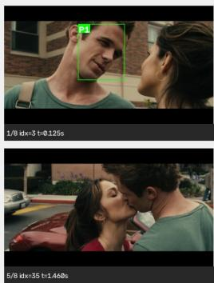

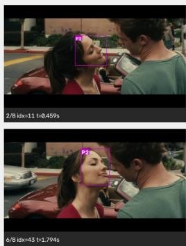  
Identity mapping: P1 ↔ Cam Gigandet; P2 ↔ Minka Kelly; P3 ↔ Leighton Meester.

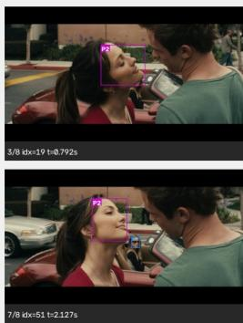

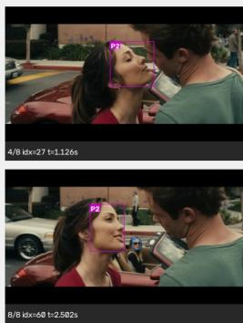  
Caption: Cam Gigandet, in a green shirt, and Minka Kelly, in a red top, stand close together and share a kiss while Leighton Meester, in the car, watches.

Person-centric QA: Who is in the car? (Position) → Leighton Meester; Who is kissing Minka Kelly? (Interaction) → Cam Gigandet; Who is wearing a green shirt? (Appearance) → Cam Gigandet; Who is wearing a red top? (Appearance) → Minka Kelly.

Figure 1: Example of identity-aware captioning and person-centric QA using character identities grounded across sampled video frames.

representation evaluates whether the Video-MLLM can establish the identity–location association using textual spatial information alone.

For strategies involving visual grounding, a bounding box is drawn around each localized character, with the corresponding Pi displayed at its upper-left corner. For a given identity, the box and label use the same color across frames, providing a consistent identity-linked visual cue. The $P _ { i }$ label size is scaled with the bounding box to remain visible while limiting occlusion. Figure 1 illustrates this visual identity-grounding process.

Face Visual Boxes (FVB). Each identified character is visually grounded using its face bounding box. No bounding-box coordinates are provided in the textual prompt, such that the identity–location association is conveyed exclusively through the visual face annotations.

Person Visual Boxes (PVB). Each identified character is visually grounded using an estimated person-level bounding box. Rather than requiring an additional person detector, we extrapolate the person box from the detected face using a lightweight anthropometric heuristic based on fixed faceto-body proportions (Jaruenpunyasak et al., 2022). Details of the estimation procedure are provided in Appendix A. In this method, no spatial coordinates are included in the prompt; identity–location associations are conveyed solely through person-level visual annotations.

Face Visual Boxes + Face Textual Coordinates (FVB+FTC). Each identified character is visually grounded using its face bounding box. In addition to the visual annotation, the prompt provides the textual coordinates of the corresponding face bounding box for each frame.

Person Visual Boxes + Person Textual Coordinates (PVB+PTC). Each identified character is visually grounded using an estimated person-level bounding box. In addition to the visual annotation, the prompt provides the textual coordinates of the corresponding estimated person bounding box for each frame.

Together, these five representations allow us to compare textual grounding, visual grounding, and their combination, while also examining whether face-level or person-level spatial cues are more effective for identity-aware video understanding.

## 2.3 EXPERIMENTAL PROTOCOL

We evaluate the proposed identity-grounding representations on two complementary tasks: identityaware video captioning and person-centric question answering. All experiments are conducted on the manually verified evaluation set of 750 video clips, comprising 3,000 identity-related questions.

We conduct three complementary sets of experiments. First, we study the effect of the grounding representation while keeping the Video-MLLM family fixed. We compare the five representations introduced above: FTC, FVB, PVB, FVB+FCT, and PVB+PTC. This comparison is performed with Qwen3 models at approximately 2B, 4B, and 8B parameters, allowing us to examine how the effectiveness of each grounding representation evolves with model scale.

Second, we investigate whether the benefits of identity grounding generalize across different Video-MLLM families. Models are grouped into three approximate parameter scales: 2B, 4B, and 8B–9B. At the 2B scale, we evaluate Qwen3, InternVL3.5; at the 4B scale, we evaluate Qwen3, InternVL3.5, MiniCPM-V, and Ovis2.5; and at the 8B–9B scale, we evaluate Qwen3, Ovis2, InternVL3.5, Eagle2.5, and Molmo2. The same clips, questions, prompts, identity annotations, and grounding representations are used across models within each comparison.

Third, we introduce BAC, obtained by fine-tuning the Qwen model family at three scales (2B, 4B, and 8B) using Low-Rank Adaptation (LoRA). The models are trained on our training split using ≈ 32K identity-aware captions generated by Gemini as supervision, as described in Section 2.1.2, and are evaluated on the manually verified evaluation set. This stage assesses whether task-specific, parameter-efficient adaptation can further improve identity-aware video understanding when combined with explicit identity grounding.

For captioning, each model receives the grounded video shot and is instructed to generate a description referring to identified characters using their corresponding $P _ { i }$ identifiers. For question answering, the model receives the same grounded shot together with one person-centric question at a time and returns the corresponding $P _ { i } ,$ or UNIDENTIFIED (UNID) when the queried person cannot be associated with any provided identity. The predicted $P _ { i }$ identifiers are subsequently mapped to their corresponding character names for evaluation and qualitative presentation.

Except for the LoRA adaptation experiments, all models are evaluated without task-specific finetuning. We use a consistent prompting protocol within each task and keep the generation configuration fixed for each model across the compared grounding representations.

## 2.4 EVALUATION METRICS

Person-centric question answering: QA predictions are compared directly with the ground-truth identity. We report QA Overall Accuracy over all 3,000 questions, of which 2,074 target a known character and 926 correspond to UNIDENTIFIED cases. QA Named Accuracy is computed over the 2,074 questions targeting a known character, while QA UNIDENTIFIED Accuracy is computed over the 926 questions referring to a person who cannot be associated with any of the provided character identities. We additionally report QA Clip-Level Accuracy, defined as the percentage of clips for which all four associated questions are answered correctly.

Identity-aware captioning: Evaluating identity accuracy against a single ground-truth caption is unreliable because two correct captions may describe different visible attributes of the same character, such as a shirt, skirt, or hat. Manual evaluation is also impractical at scale. We therefore use a VLM-as-a-judge protocol based on Qwen/Qwen3.8-27B-FP8, an open-weight 27B vision-language model achieving 94% accuracy on our person-centric QA task. The judge receives the video shot, identity grounding, and generated caption, and evaluates identity correctness, hallucination, visual faithfulness, and naturalness. We report Caption Overall, the mean quality score on a 0–10 scale; Caption Identity, the percentage of shots where every queried character is mentioned and correctly identified; and Caption Hallucination, the percentage containing an unsupported person, identity, or absent object.

## 3 RESULTS

## 3.1 EFFECT OF IDENTITY GROUNDING STRATEGIES

Table 1 shows that explicit visual grounding substantially improves person-centric QA over FTC alone. QA Overall increases from 53.87% to 68.90% at 2B, from 62.57% to 79.73% at 4B, and from 59.77% to 88.53% at 8B. Paired McNemar tests confirm that FTC is significantly worse than every visually grounded variant at all model sizes $( p < 0 . 0 0 1 )$ ). Excluding FTC, differences among the grounded variants become smaller with scale. At 2B, FVB+FTC achieves the highest accuracy and significantly outperforms PVB+PTC and PVB, while remaining statistically indistinguishable from FVB. At 4B and 8B, FVB+FTC, FVB, and PVB+PTC consistently form the top statistical group, while PVB remains significantly weaker.

For captioning, the effect of the grounding representation is most pronounced at small model scale. At 2B, FVB+FTC clearly outperforms the other strategies in identity accuracy, with all pairwise differences being statistically significant $( p < 0 . 0 0 1 )$ . As model size increases, these differences shrink substantially: at 4B, the visually grounded variants are mostly statistically indistinguishable, with only FVB+FTC outperforming FVB, while at 8B all four visually grounded strategies are statistically tied. In contrast, FTC remains significantly worse than every visually grounded variant at 4B and 8B $( p < 0 . 0 0 1 )$ .

Overall, FVB+FTC provides the most consistent captioning and QA performance across scales, particularly at 2B. We therefore analyze whether its remaining errors depend on grounded face size. For QA, face-box area correlates positively with correctness, increasing from $r _ { s } = 0 . 1 0 3$ at 2B to $r _ { s } = 0 . 2 4 5$ at 8B, while captioning shows a stronger and stable association $( r _ { s } = 0 . 2 3 8 – 0 . 2 5 6 )$ PVB+PTC is less sensitive to box size, likely because the full-person box covers a much larger visual region than the face alone.

Results grouped by size confirm this pattern. At 2B (Table 2), PVB+PTC performs better for small faces $( < 4 , \bar { 0 0 0 } \mathrm { p } \mathrm { \bar { x } } ^ { 2 } )$ , reaching 91.8% versus 80.0% for FVB+FTC $( p = 0 . 0 2 1 )$ . For medium and large faces, FVB+FTC performs better, reaching 92.8% vs. 91.3% and 96.8% vs. 91.1%, respectively. These results suggest that full-person grounding can compensate when the face is very small, whereas face-based grounding becomes more effective once the face is sufficiently visible; expanding the grounding to the full person may then introduce less precise spatial information. Qualitative examples of both cases are provided in Appendix B.

The Named and UNIDENTIFIED results further reveal how grounding affects identity assignment. At 2B and 4B, the combined visual–textual strategies favor assigning known identities: FVB+FTC and PVB+PTC achieve the highest Named accuracy, while remaining substantially weaker on UNIDENTIFIED cases. Visual-only grounding generally reduces this imbalance, improving the rejection of unidentified characters at the cost of lower Named accuracy. This asymmetry decreases markedly with model scale. At 8B, FVB+FTC achieves nearly balanced performance between Named and UNIDENTIFIED identities (88.04% and 86.93%), indicating that larger models are better able to use the grounding signal without systematically forcing a known identity when the evidence is insufficient.

Table 1: Comparison of identity-grounding strategies across Qwen3-VL model sizes. Captioning is evaluated using overall quality, identity accuracy, and hallucination rate. QA performance is reported over all questions, separately for Named and UNIDENTIFIED (UNID) identities.
<table><tr><td colspan="2"></td><td colspan="3">Captioning</td><td colspan="3">Person-Centric QA</td></tr><tr><td>Size</td><td>Grounding</td><td>Overall ↑</td><td>Identity ↑</td><td>Halluc. ↓</td><td>Overall ↑</td><td>Named ↑</td><td>UNID ↑</td></tr><tr><td rowspan="5">2B</td><td>FTC</td><td>5.74</td><td>47.47</td><td>7.60</td><td>53.87</td><td>75.60</td><td>5.18</td></tr><tr><td>FVB</td><td>5.92</td><td>36.80</td><td>10.27</td><td>68.27</td><td>86.55</td><td>27.32</td></tr><tr><td>PVB</td><td>5.52</td><td>27.54</td><td>8.28</td><td>66.13</td><td>80.71</td><td>33.48</td></tr><tr><td>FVB+FTC</td><td>7.61</td><td>76.53</td><td>3.07</td><td>68.90</td><td>92.48</td><td>16.09</td></tr><tr><td>PVB+PTC</td><td>7.29</td><td>69.87</td><td>2.67</td><td>67.13</td><td>91.27</td><td>13.07</td></tr><tr><td rowspan="5">4B</td><td>FTC</td><td>6.32</td><td>52.80</td><td>4.53</td><td>62.57</td><td>71.75</td><td>42.01</td></tr><tr><td>FVB</td><td>8.03</td><td>85.20</td><td>9.73</td><td>79.13</td><td>92.29</td><td>49.68</td></tr><tr><td>PVB</td><td>8.19</td><td>87.33</td><td>4.40</td><td>77.83</td><td>91.22</td><td>47.84</td></tr><tr><td>FVB+FTC</td><td>8.32</td><td>88.80</td><td>1.07</td><td>79.73</td><td>93.11</td><td>49.78</td></tr><tr><td>PVB+PTC</td><td>8.22</td><td>87.07</td><td>1.60</td><td>79.20</td><td>94.21</td><td>45.57</td></tr><tr><td rowspan="5">8B</td><td>FTC</td><td>6.32</td><td>54.27</td><td>3.60</td><td>59.77</td><td>51.69</td><td>77.86</td></tr><tr><td>FVB</td><td>8.45</td><td>92.00</td><td>3.87</td><td>88.53</td><td>91.85</td><td>81.10</td></tr><tr><td>PVB</td><td>8.44</td><td>91.73</td><td>1.87</td><td>85.37</td><td>90.60</td><td>73.65</td></tr><tr><td>FVB+FTC</td><td>8.45</td><td>91.60</td><td>0.93</td><td>87.70</td><td>88.04</td><td>86.93</td></tr><tr><td>PVB+PTC</td><td>8.37</td><td>90.67</td><td>1.60</td><td>87.43</td><td>92.24</td><td>76.67</td></tr></table>

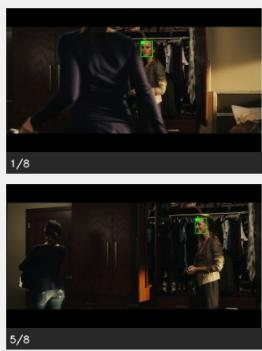

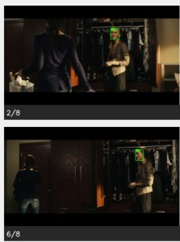  
(a) Identity mapping: P1 ↔ Leighton Meester.  
Q4 [Action]: Who walks away toward the door? GT: UNIDENTIFIED.

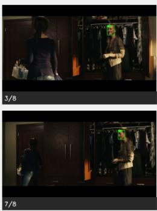

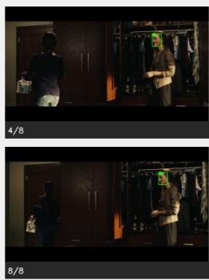

<table><tr><td>Model</td><td>Pred.</td><td>Model</td><td></td><td>Pred.</td><td>Model</td><td></td><td>Pred.</td></tr><tr><td>BAC-2B (ours) Qwen3-VL 2B</td><td>UNID. Leighton</td><td>7</td><td>BAC-4B (ours) Qwen3-VL 4B</td><td>UNID. Leighton</td><td>BAC-8B (ours) L Qwen3-VL 8B</td><td>UNID. Leighton</td><td>V X</td></tr><tr><td>GPT-5.6 Sol</td><td></td><td>X</td><td></td><td></td><td>X</td><td></td><td></td></tr><tr><td></td><td>UNID.</td><td></td><td>GPT-5.6 Sol*</td><td>UNID.</td><td>V</td><td></td><td></td></tr><tr><td></td><td></td><td></td><td></td><td></td><td>Claude Sonnet 4.6</td><td>UNID.</td><td></td></tr><tr><td>Qwen3-VL 235B</td><td>UNID.</td><td></td><td>Gemini 2.5 Flash</td><td>UNID.</td><td></td><td></td><td></td></tr></table>

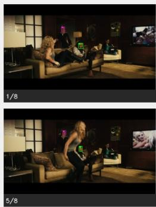

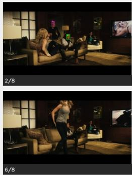

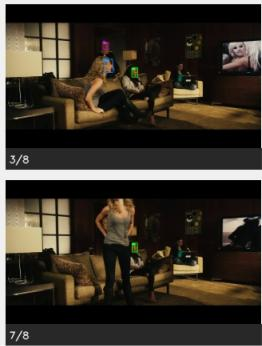

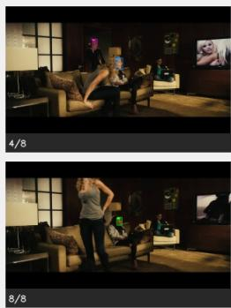

(b) Identity mapping: P1 ↔ Kat Graham; P2 ↔ Minka Kelly; P3 ↔ Aly Michalka. Q3 [Action]: Who stands upfrom the brown sofa? GT: Aly Michalka (P3).
<table><tr><td>Model</td><td>Pred.</td><td></td><td>Model</td><td>Pred.</td><td></td><td>Model</td><td>Pred.</td><td></td></tr><tr><td>BAC-2B (ours) Qwen3-VL 2B</td><td>Aly Kat</td><td>√ X</td><td>BAC-4B (ours) Qwen3-VL 4B</td><td>Aly Kat</td><td>√ X</td><td>BAC-8B (ours) Qwen3-VL 8B</td><td>Aly Minka</td><td>√ X</td></tr><tr><td>GPT-5.6 Sol</td><td></td><td>√</td><td>GPT-5.6 Sol*</td><td></td><td>√</td><td>Claude Sonnet 4.6</td><td></td><td></td></tr><tr><td></td><td>Aly</td><td></td><td></td><td>Aly</td><td></td><td></td><td>UNID.</td><td>×</td></tr><tr><td>Qwen3-VL 235B</td><td>UNID.</td><td>X</td><td>Gemini 2.5 Flash</td><td>UNID.</td><td>X</td><td></td><td></td><td></td></tr></table>

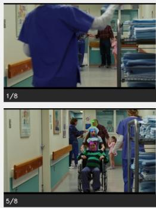

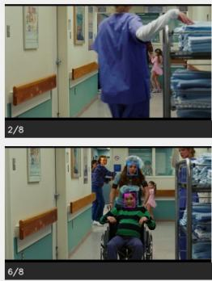

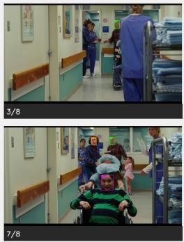

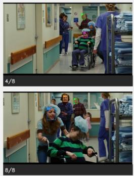

(c) Identity mapping: P1 ↔ J. K. Simmons; P2 ↔ Elliot Page; P3 ↔ Olivia Thirlby; P4 ↔ Allison Janney. Q4 [Position]: Whofollows behind Olivia Thirlby and Elliot Page? GT: Allison Janney (P4).
<table><tr><td>Model</td><td>Pred.</td><td></td><td>Model</td><td>Pred.</td><td></td><td>Model</td><td>Pred.</td></tr><tr><td>BAC-2B (ours) Qwen3-VL 2B</td><td>J. K. Elliot</td><td>X X</td><td>BAC-4B (ours) Qwen3-VL 4B</td><td>J. K. J. K.</td><td>X X</td><td>BAC-8B (ours) Qwen3-VL 8B</td><td>J. K. X UNID.</td></tr><tr><td>GPT-5.6 Sol</td><td></td><td></td><td></td><td></td><td></td><td></td><td>X</td></tr><tr><td></td><td>Allison</td><td>√</td><td>GPT-5.6 Sol*</td><td>Allison</td><td>√</td><td>Claude Sonnet 4.6</td><td>J. K. X</td></tr><tr><td></td><td></td><td></td><td></td><td></td><td></td><td></td><td></td></tr><tr><td>Qwen3-VL 235B</td><td>UNID.</td><td>X</td><td>Gemini 2.5 Flash</td><td>UNID.</td><td>×</td><td></td><td></td></tr></table>

Figure 2: Qualitative identity-aware QA examples. Identity-mapping colors match the boundingbox colors in each frame. (a) BAC correctly predicts UNIDENTIFIED; (b) BAC correctly identifies the queried named person; (c) BAC fails to identify the queried named person, while only GPT-5.6 Sol succeeds. ∗: GPT-5.6 Sol with thinking. 7

Table 2: QA accuracy of FVB+FTC and PVB+PTC grounding methods with Qwen3-2B, stratified by face bounding-box area. $\Delta$ denotes the accuracy difference between PVB+PTC and FVB+FTC.
<table><tr><td>Face-area bin</td><td>N</td><td>FVB+FTC</td><td>PVB+PTC</td><td>∆ (P-F)</td><td>p</td></tr><tr><td>Small  $< 4 , 0 0 0 \mathrm { p x } ^ { 2 }$ </td><td>85</td><td>80.0%</td><td>91.8%</td><td>+11.8</td><td>0.021</td></tr><tr><td>Medium  $\mathrm { 4 , 0 0 0 { - } 2 6 9 , 9 9 9 \ p x ^ { 2 } }$ </td><td>1,865</td><td>92.8%</td><td>91.3%</td><td>-1.5</td><td>0.009</td></tr><tr><td> $\mathbf { L a r g e } \geq 2 7 0 , 0 0 0 \mathbf { p x } ^ { 2 }$ </td><td>124</td><td>96.8%</td><td>91.1%</td><td>-5.6</td><td>0.016</td></tr></table>

## 3.2 BENCHMARKING ACROSS MODEL FAMILIES

Table 3 compares BAC with several VLM families at comparable parameter scales using the FVB+FTC grounding method. We first focus on the base models to identify the strongest backbone before examining the effect of BAC fine-tuning. Among the base models, Qwen3 provides the strongest overall balance, achieving the highest QA accuracy within each size group together with consistently strong captioning performance. Its QA advantage over the strongest competing base model is statistically significant at 2B, 4B, and 8–9B $( p < 0 . 0 0 1$ , paired McNemar tests). At 8–9B, Ovis2.5 attains higher caption identity accuracy than Qwen3 (93.73% vs. 91.60%), but the difference is not significant $( p = 0 . 0 8 9 )$ .

We then examine the effect of BAC fine-tuning on the Qwen3 backbone. The best configuration identified by our fine-tuning sweep uses a learning rate of $5 \times 1 0 ^ { - 5 }$ , LoRA rank $r = 1 6 .$ , scaling factor $\alpha = 3 2$ , and dropout 0.05. This configuration shows stable training and validation convergence across all three model scales, with full optimization details and learning curves provided in Appendix C.

BAC substantially improves the corresponding Qwen3 baseline at every scale. Although BAC is trained only on the captioning task, it generalizes strongly to person-centric QA without QA-specific supervision. QA accuracy increases from 68.90% to 80.33% at 2B, from 79.73% to 90.13% at 4B, and from 87.70% to 93.20% at 8B; all three improvements are statistically significant $( p < 0 . 0 0 1 )$ The gains are especially large for UNIDENTIFIED questions at 2B and 4B. Figure 2(a) qualitatively illustrates this improvement, with BAC correctly predicting UNIDENTIFIED across all three model scales while the corresponding Qwen3-VL baselines fail. Named accuracy also remains high, indicating that adaptation improves the model’s ability to distinguish grounded identities from people whose identity is not provided.

Captioning follows the same trend: BAC improves overall quality and identity accuracy at all three scales while maintaining a low hallucination rate. BAC-2B already slightly exceeds the strongest 4B base model in QA (80.33% vs. 79.73%), while BAC-4B surpasses all evaluated 8–9B base models (90.13% vs. 87.70% for the strongest baseline). The relative improvement decreases as model size grows, suggesting that task-specific adaptation is particularly beneficial for smaller models, where identity grounding is more challenging.

## 3.3 COMPARISON WITH FRONTIER VLMS

Table 4 compares BAC with substantially larger open-weight and proprietary frontier VLMs. GPT-5.6 Sol achieves the highest overall performance, reaching 97.07% with thinking and 96.30% without thinking; the difference between the two settings is small but statistically significant $( p = 0 . 0 0 7 )$ BAC-8B reaches 93.20% overall, with balanced performance on Named (93.88%) and UNIDEN-TIFIED (91.68%) questions. Although it remains significantly below GPT-5.6 Sol $( p \textless 0 . 0 0 1 )$ BAC-8B significantly outperforms Qwen3-VL-235B-A22B (86.10%), Gemini 2.5 Flash (82.63%), and Claude Sonnet 4.6 (76.10%), all with $p < 0 . 0 0 1$

This advantage is already visible at smaller scales. BAC-4B reaches 90.13% overall accuracy and significantly surpasses the much larger Qwen3-VL-235B-A22B by 4.03 percentage points $( p < 0 . 0 0 1 )$ , while achieving 96.38% accuracy on Named questions. BAC-2B also reaches 80.33%, significantly outperforming Claude Sonnet 4.6 $( p < 0 . 0 0 1 )$ , although it remains below Gemini 2.5 Flash and Qwen3-VL-235B-A22B. Overall, these results show that BAC substantially narrows the gap to frontier proprietary models while remaining compact, open-weight, and self-hostable. Figure 2 illustrates representative BAC successes and failures: (a) correct UNIDENTIFIED prediction, (b) correct named-person identification, and (c) a challenging failure where only GPT-5.6 Sol succeeds. Additional qualitative examples and frontier-model failures are provided in Appendix E.

Category-wise results show that BAC-8B is particularly strong on appearance and object questions, reaching 95.58% and 93.99%, respectively. Its lowest performance is observed on position questions (87.54%), followed by interaction questions (91.28%), suggesting that spatial and relational reasoning remain more challenging than attribute-based recognition. A detailed breakdown across all BAC model scales and frontier Video-MLLMs is provided in Appendix D.

Table 3: Benchmark comparison across model families and sizes with the FVB+FTC grounding method. Captioning is evaluated using overall quality, identity accuracy, and hallucination rate. QA performance is reported over all questions, separately for Named and UNIDENTIFIED (UNID).
<table><tr><td colspan="2"></td><td colspan="3">Captioning</td><td colspan="3">Person-Centric QA</td></tr><tr><td>Size</td><td>Model</td><td>Overall ↑</td><td>Identity ↑</td><td>Halluc. ↓</td><td>Overall ↑</td><td>Named ↑</td><td>UNID↑</td></tr><tr><td rowspan="3">2B</td><td>BAC (ours)</td><td>8.09</td><td>85.33</td><td>3.20</td><td>80.33</td><td>95.90</td><td>45.46</td></tr><tr><td>Qwen3</td><td>7.61</td><td>76.53</td><td>3.07</td><td>68.90</td><td>92.48</td><td>16.09</td></tr><tr><td>InternVL3.5</td><td>5.59</td><td>24.86</td><td>4.48</td><td>63.90</td><td>91.18</td><td>2.81</td></tr><tr><td rowspan="5">4B</td><td>BAC (ours)</td><td>8.48</td><td>92.40</td><td>0.80</td><td>90.13</td><td>96.38</td><td>76.13</td></tr><tr><td>Qwen3</td><td>8.32</td><td>88.80</td><td>1.07</td><td>79.73</td><td>93.11</td><td>49.78</td></tr><tr><td>InternVL3.5</td><td>7.49</td><td>76.93</td><td>6.80</td><td>74.87</td><td>70.38</td><td>84.99</td></tr><tr><td>MiniCPM-V</td><td>6.61</td><td>60.93</td><td>15.47</td><td>69.60</td><td>80.23</td><td>45.79</td></tr><tr><td>Ovis2</td><td>6.40</td><td>47.87</td><td>10.80</td><td>65.27</td><td>71.12</td><td>52.16</td></tr><tr><td rowspan="6">8-9B</td><td>BAC (ours)</td><td>8.59</td><td>94.03</td><td>1.06</td><td>93.20</td><td>93.88</td><td>91.68</td></tr><tr><td>Qwen3</td><td>8.45</td><td>91.60</td><td>0.93</td><td>87.70</td><td>88.04</td><td>86.93</td></tr><tr><td>Ovis2.5 9B</td><td>8.39</td><td>93.73</td><td>1.87</td><td>83.10</td><td>85.39</td><td>77.97</td></tr><tr><td>InternVL3.5</td><td>7.68</td><td>81.73</td><td>6.27</td><td>79.00</td><td>85.28</td><td>65.12</td></tr><tr><td>Eagle2.5</td><td>7.42</td><td>74.13</td><td>4.80</td><td>77.63</td><td>79.17</td><td>74.19</td></tr><tr><td>Molmo2</td><td>5.66</td><td>52.40</td><td>28.13</td><td>69.17</td><td>63.36</td><td>82.18</td></tr></table>

Table 4: Person-centric QA performance and model accessibility. Mean denotes the average of Named and UNIDENTIFIED (UNID) accuracy. API costs are reported in USD per million input/output tokens; All models use the FVB+FTC grounding method.
<table><tr><td>Model</td><td>Overall</td><td>Named</td><td>UNID</td><td>Mean</td><td>Clip all-correct</td><td>Open-weight</td><td>Cost ($/1M in/out)</td></tr><tr><td>GPT-5.6 Sol (think)</td><td>97.07</td><td>97.06</td><td>97.08</td><td>97.07</td><td>90.13</td><td>No</td><td>4.00 / 20.00</td></tr><tr><td>GPT-5.6 Sol (no think)</td><td>96.30</td><td>96.14</td><td>96.65</td><td>96.40</td><td>87.60</td><td>No</td><td>4.00 / 20.00</td></tr><tr><td>BAC-8B (ours)</td><td>93.20</td><td>93.88</td><td>91.68</td><td>92.78</td><td>76.93</td><td>Yes</td><td>Self-hosted</td></tr><tr><td>BAC-4B (ours)</td><td>90.13</td><td>96.38</td><td>76.13</td><td>86.26</td><td>66.40</td><td>Yes</td><td>Self-hosted</td></tr><tr><td>Qwen3-VL-235B-A22B</td><td>86.10</td><td>80.67</td><td>98.27</td><td>89.47</td><td>60.93</td><td>Yes</td><td>0.287 / 1.147</td></tr><tr><td>Gemini 2.5 Flash</td><td>82.63</td><td>75.80</td><td>97.95</td><td>86.87</td><td>51.60</td><td>No</td><td>0.30 / 2.50</td></tr><tr><td>BAC-2B (ours)</td><td>80.33</td><td>95.90</td><td>45.46</td><td>70.68</td><td>43.73</td><td>Yes</td><td>Self-hosted</td></tr><tr><td>Claude Sonnet 4.6</td><td>76.10</td><td>66.44</td><td>97.73</td><td>82.09</td><td>41.87</td><td>No</td><td>3.00 / 15.00</td></tr></table>

## 4 CONCLUSION

We introduced a framework for identity-aware video understanding that combines automatic character identification with explicit spatial grounding for video captioning and person-centric question answering. Using LSMDC v2, we constructed a manually verified benchmark of 750 captioned clips and 3,000 questions, and systematically evaluated five identity-grounding representations across multiple model scales and families. Our results show that explicit visual grounding substantially improves identity association compared with textual coordinates alone, with face-based visual grounding combined with textual coordinates providing the most consistent performance across scales. Building on this formulation, we introduced BAC through LoRA-based fine-tuning of Qwen models at 2B, 4B, and 8B scales. BAC-8B achieves 93.20% QA accuracy and remains competitive with substantially larger frontier Video-MLLMs, while maintaining strong performance across question categories. Overall, the results show that explicitly communicating who is where, together with taskspecific adaptation, provides an effective approach to improving identity-aware video understanding without requiring changes to the underlying Video-MLLM architecture.

## 5 ETHICAL CONSIDERATIONS

Our approach combines face recognition, temporal tracking, and spatial grounding to associate known identities with their appearances, actions, and interactions across video frames. Although we study this capability only in the controlled setting of movie understanding, using predefined cast identities and movie clips, similar techniques could potentially be adapted to identify and track individuals in real-world footage, raising concerns related to privacy, surveillance, and unauthorized profiling. Our work is intended to advance character-centric video understanding rather than person identification in unconstrained real-world environments, and we do not evaluate or advocate its use for surveillance or monitoring applications. We therefore encourage future applications of identityaware video understanding to consider appropriate consent, privacy protections, and restrictions on the use of biometric identity information.

## 6 ACKNOWLEDGMENTS

This project was provided with computing AI and storage resources by GENCI at IDRIS thanks to the grant 20XX-AD011017029 on the supercomputer Jean Zay’s H100 partition.

## REFERENCES

David Bamman, Rachael Samberg, Richard Jean So, and Naitian Zhou. Measuring diversity in hollywood through the large-scale computational analysis of film. Proceedings of the National Academy ofSciences, 121(46):e2409770121, 2024.

Jiankang Deng, Jia Guo, Niannan Xue, and Stefanos Zafeiriou. Arcface: Additive angular margin loss for deep face recognition. In Proceedings of the IEEE/CVF conference on computer vision and pattern recognition, pp. 4690–4699, 2019.

Shibo Gao, Chongxiao Wang, Chenglong Huang, Jie Ma, Haolin Shi, Fei Ding, Jing Li, Qiang Lyu, Yangyang Liu, Yang Liu, et al. I seek you in videos: Identity-conditioned queries for personcentric video reasoning. arXiv preprint arXiv:2608.07417, 2026.

Miran Heo, Min-Hung Chen, De-An Huang, Sifei Liu, Subhashree Radhakrishnan, Seon Joo Kim, Yu-Chiang Frank Wang, and Ryo Hachiuma. Omni-rgpt: Unifying image and video region-level understanding via token marks. In 2025 IEEE/CVF Conference on Computer Vision and Pattern Recognition (CVPR), pp. 3919–3930. IEEE, 2025.

Jermphiphut Jaruenpunyasak, Alba Garc´ıa Seco de Herrera, and Rakkrit Duangsoithong. Anthropometric ratios for lower-body detection based on deep learning and traditional methods. Applied Sciences, 12(5):2678, 2022.

Yatai Ji, Shilong Zhang, Jie Wu, Peize Sun, Weifeng Chen, Xuefeng Xiao, Sidi Yang, Yujiu Yang, and Ping Luo. Ida-vlm: towards movie understanding via id-aware large vision-language model. In International Conference on Learning Representations, volume 2025, pp. 52639–52652, 2025.

Aishwarya Kamath, Mannat Singh, Yann LeCun, Gabriel Synnaeve, Ishan Misra, and Nicolas Carion. Mdetr - modulated detection for end-to-end multi-modal understanding. In Proceedings of the IEEE/CVF International Conference on Computer Vision (ICCV), pp. 1780–1790, October 2021.

Chuofan Ma, Yi Jiang, Jiannan Wu, Zehuan Yuan, and Xiaojuan Qi. Groma: Localized visual tokenization for grounding multimodal large language models. In European Conference on Computer Vision, pp. 417–435. Springer, 2024.

Tegan Maharaj, Nicolas Ballas, Anna Rohrbach, Aaron C Courville, and Christopher Joseph Pal. A dataset and exploration of models for understanding video data through fillin-the-blank question-answering. In Computer Vision and Pattern Recognition (CVPR), 2017. URL http://openaccess.thecvf.com/content\_cvpr\_2017/papers/ Maharaj\_A\_Dataset\_and\_CVPR\_2017\_paper.pdf.

Shehan Munasinghe, Hanan Gani, Wenqi Zhu, Jiale Cao, Eric Xing, Fahad Shahbaz Khan, and Salman Khan. Videoglamm: A large multimodal model for pixel-level visual grounding in videos. In 2025 IEEE/CVF Conference on Computer Vision and Pattern Recognition (CVPR), pp. 19036– 19046. IEEE, 2025.

Arsha Nagrani and Andrew Zisserman. From benedict cumberbatch to sherlock holmes: Character identification in tv series without a script. arXiv preprint arXiv:1801.10442, 2018.

Stefano Pini, Marcella Cornia, Federico Bolelli, Lorenzo Baraldi, and Rita Cucchiara. M-vad names: a dataset for video captioning with naming. Multimedia Tools and Applications, 78(10):14007– 14027, 2019.

Haran Raajesh, Naveen Reddy Desanur, Zeeshan Khan, and Makarand Tapaswi. Micap: A unified model for identity-aware movie descriptions. In 2024 IEEE/CVF Conference on Computer Vision and Pattern Recognition (CVPR), pp. 14011–14021. IEEE, 2024.

Anna Rohrbach, Atousa Torabi, Marcus Rohrbach, Niket Tandon, Chris Pal, Hugo Larochelle, Aaron Courville, and Bernt Schiele. Movie description. International Journal of Computer Vision, 2017. URL http://link.springer.com/ article/10.1007/s11263-016-0987-1?wt\_mc=Internal.Event.1.SEM. ArticleAuthorOnlineFirst.

Yannis Tevissen, Khalil Guetari, Marine Tassel, Erwan Kerleroux, and Fred´ eric Petitpont. In-´ serting faces inside captions: image captioning with attention guided merging. arXiv preprint arXiv:2405.02305, 2024.

Atousa Torabi, Niket Tandon, and Leon Sigal. Learning language-visual embedding for movie understanding with natural-language. arXiv:1609.08124, 2016. URL http://arxiv.org/ pdf/1609.08124v1.pdf.

Nicolai Wojke, Alex Bewley, and Dietrich Paulus. Simple online and realtime tracking with a deep association metric. In 2017 IEEE international conference on image processing (ICIP), pp. 3645– 3649. IEEE, 2017.

Jun Xu, Tao Mei, Ting Yao, and Yong Rui. Msr-vtt: A large video description dataset for bridging video and language. In Proceedings of the IEEE conference on computer vision and pattern recognition, pp. 5288–5296, 2016.

Mengdi Xu, Xiaotong Yuan, Jialie Shen, and Shuicheng Yan. Cast2face: Character identification in movie with actor-character correspondence. In Proceedings of the 18th ACM international conference on Multimedia, pp. 831–834, 2010.

Antoine Yang, Arsha Nagrani, Paul Hongsuck Seo, Antoine Miech, Jordi Pont-Tuset, Ivan Laptev, Josef Sivic, and Cordelia Schmid. Vid2seq: Large-scale pretraining of a visual language model for dense video captioning. In Proceedings ofthe IEEE/CVF Conference on Computer Vision and Pattern Recognition (CVPR), pp. 10714–10726, June 2023.

## APPENDIX

## A ESTIMATING A PERSON BOUNDING BOX FROM A FACE DETECTION

To obtain person-level spatial grounding without requiring an additional person detector, we estimate a full-person bounding box directly from each detected face. Given a face bounding box $B _ { \mathrm { f a c e } } =$ $[ x _ { f } , y _ { f } , w _ { f } , h _ { f } ]$ , we exploit approximate human body proportions to construct an estimated person box $\bar { B _ { \mathrm { b o d y } } } \bar { \bf \Phi } = \bar { [ { x _ { b } , y _ { b } , w _ { b } , h _ { b } } ] }$ . Specifically, the body height and width are obtained by scaling the detected face dimensions,

$$
h _ { b } = K _ { h } h _ { f } , \qquad w _ { b } = K _ { w } w _ { f } ,
$$

where $K _ { h }$ and $K _ { w }$ control the expected body-to-face height and width ratios, respectively. We assume that the body is approximately horizontally aligned with the face. We therefore compute the horizontal center of the face,

$$
x _ { c , f } = x _ { f } + { \frac { w _ { f } } { 2 } } ,
$$

and center the estimated body box around this position,

$$
x _ { b } = x _ { c , f } - \frac { w _ { b } } { 2 } .
$$

Vertically, the person box begins slightly above the detected face in order to include the top of the head,

$$
y _ { b } = y _ { f } - K _ { \mathrm { o f f s e t } } h _ { f } ,
$$

where $K _ { \mathrm { o f f s e t } }$ controls the upward extension. The resulting box therefore preserves the spatial location of the detected face while extending it according to approximate human proportions to cover the person’s visible body. This procedure is heuristic rather than a learned body-detection method and provides the estimated person regions used in our person-box grounding representations.

Implementation parameters. We use the same fixed parameters for all experiments. Specifically, we empirically set the body-height scaling factor to $K _ { h } ~ = ~ 6 . 5$ , the body-width scaling factor to $K _ { w } = 2 . 5$ , and the vertical offset to $K _ { \mathrm { o f f s e t } } = 0 . 1 5$ . Thus, the estimated person box has a height of $6 . 5 h _ { f }$ and a width of $2 . 5 w _ { f }$ , and starts $0 . 1 5 h _ { f }$ above the detected face box. These parameters are applied uniformly to all detected faces without additional person detection or per-frame adaptation.

## B EFFECT OF FACE AND PERSON SIZE

As shown in the main results, the relative effectiveness of FVB+FTC and PVB+PTC depends partly on target size. When the face is very small, the full-person box can provide a more informative spatial cue. In Figure 3, the target face occupies only 2,222 $\mathrm { p x } ^ { 2 }$ with a height of 52 px; PVB+PTC correctly identifies the target across all Qwen3-VL sizes, whereas FVB+FTC fails.

Conversely, when the face is large and visually informative, FVB+FTC can be more reliable. In Figure 4, the face occupies $3 9 1 , { \overset { \smile } { 8 9 } } 7 ~ \mathrm { p x } ^ { 2 }$ with a height of 760.5 px; FVB+FTC succeeds across all model sizes, while PVB+PTC fails for Qwen3-VL 2B. The full-person boxes also overlap in this example, introducing visual clutter that can weaken the identity–location association.

These examples support the quantitative results: PVB+PTC is particularly useful for very small faces, whereas FVB+FTC becomes more reliable as face size increases. For already informative faces, full-person boxes may add little benefit and can even interfere with grounding when they overlap.

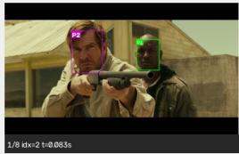

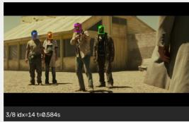

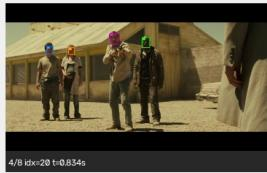

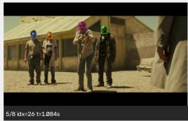

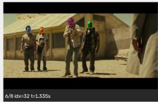

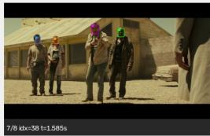  
(a) Face grounding

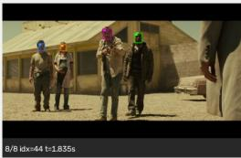

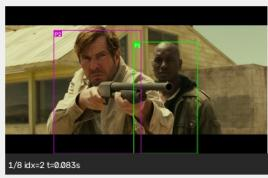

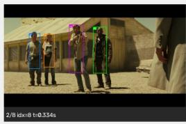

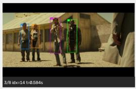

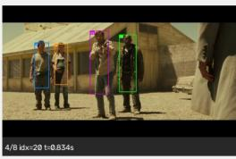

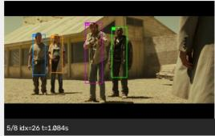

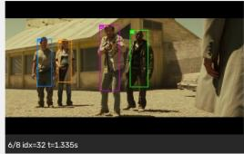

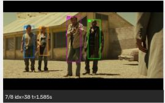  
(b) Person grounding

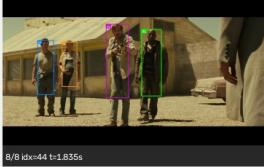

Identity mapping: P1 ↔ Tyrese Gibson; P2 ↔ Dennis Quaid; P3 ↔ Lucas Black; P4 ↔ Adrianne Palicki. Q2 [Appearance]: Who is pregnant? GT: Adrianne Palicki. P4 face size: $2 , 2 2 2 { \mathrm { p x } } ^ { 2 } ( 5 2$ px height).
<table><tr><td>Model</td><td>FVB+FTC</td><td>PVB+PTC</td></tr><tr><td>Qwen3-VL 2B</td><td>× Lucas</td><td>√Adrianne</td></tr><tr><td>Qwen3-VL 4B</td><td>× Lucas</td><td>√Adrianne</td></tr><tr><td>Qwen3-VL 8B</td><td>X UNIDENTIFIED</td><td>√Adrianne</td></tr></table>

Figure 3: Qualitative comparison of face- and person-level grounding for a small-face example. The target character P4 (Adrianne Palicki) has a very small face area of 2,222 $\mathrm { p x } ^ { 2 }$ and a face height of 52 px. PVB+PTC grounding method correctly identifies Adrianne Palicki across all model sizes, whereas FVB+FTC grounding method predicts Lucas Black at 2B and 4B and UNIDENTIFIED at 8B.

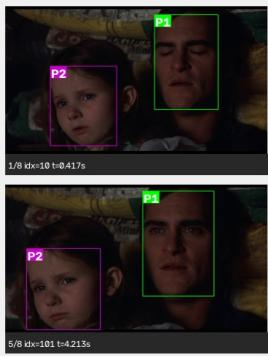

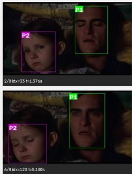

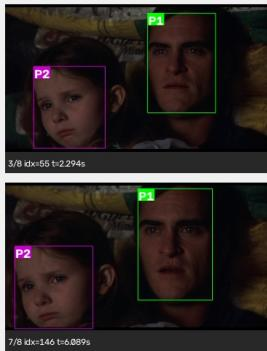  
(a) Face grounding

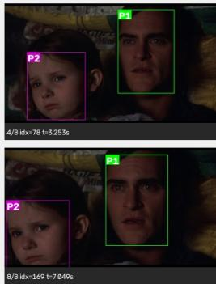

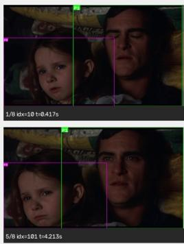

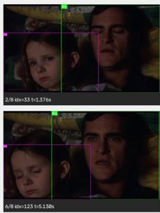

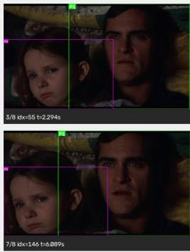  
(b) Person grounding

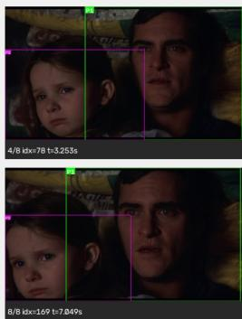

Identity mapping: P1 ↔ Joaquin; P2 ↔ Abigail.  
Q2 [Action]: Who opens their eyes with a frightened expression? GT: Joaquin. P1 face size: 391,897 px2 (760.5 px height).
<table><tr><td>Model</td><td>FVB+FTC</td><td>PVB+PTC</td></tr><tr><td>Qwen3-VL 2B</td><td>√ Joaquin</td><td>× Abigail</td></tr><tr><td>Qwen3-VL 4B</td><td>√ Joaquin</td><td>√ Joaquin</td></tr><tr><td>Qwen3-VL 8B</td><td>√ Joaquin</td><td>√ Joaquin</td></tr></table>

Figure 4: Qualitative comparison of face- and person-level grounding for an action question. The target character P1 (Joaquin) has a very large face area of $3 9 1 , 8 9 7 \mathrm { p x } ^ { 2 }$ and a face height of 760.5 px. FVB+FTC grounding method correctly identifies Joaquin across all three model sizes. PVB+PTC grounding method predicts Abigail at 2B, but correctly identifies Joaquin at 4B and 8B.

## C BAC FINE-TUNING AND MODEL SCALING

LoRA fine-tuning. Our objective is to fine-tune Qwen3-VL base models at different scales on the training data we build as described in Section 2.1.2. We consider the 2B, 4B, and 8B variants and perform parameter-efficient adaptation using LoRA. We refer to the resulting fine-tuned models as BAC-2B, BAC-4B, and BAC-8B. The adapters are applied only to the language-model projection layers, while the vision encoder and multimodal projector remain frozen.

To determine an effective LoRA configuration, we conduct a five-setting hyperparameter sweep for one epoch, varying the learning rate, LoRA rank r, scaling factor α, and dropout. The best configuration is obtained with a learning rate of $5 \times 1 0 ^ { - 5 } , r = \mathrm { \bar { 1 6 } } , \alpha = 3 2$ , and a dropout of 0.05. At this rank, LoRA introduces 17.4M trainable parameters for BAC-2B, 33.0M for BAC-4B, and 43.6M for BAC-8B. Figure 5 shows the training and validation losses for the 2B, 4B, and 8B models using the best configuration, with both curves reported together for each model size. For each BAC variant, the checkpoint achieving the lowest validation loss is used for inference.

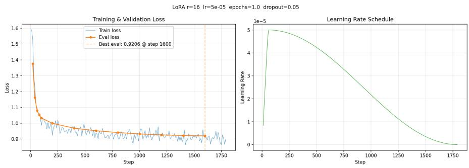  
(a) BAC-2B

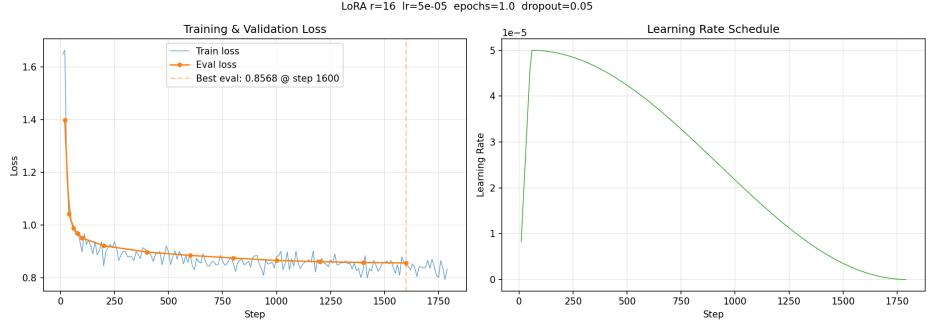  
(b) BAC-4B

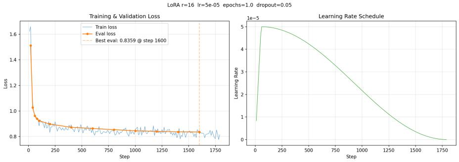  
(c) BAC-8B  
Figure 5: Training dynamics of the BAC models at three scales. For each model, we report the training loss, evaluation loss, and learning-rate schedule during LoRA fine-tuning. The dashed vertical line indicates the checkpoint with the best evaluation loss.

## D CATEGORY-WISE PERSON-CENTRIC QA PERFORMANCE

Figure 6 provides a category-wise breakdown of person-centric QA performance across both frontier and similarly sized models. Overall, BAC-8B maintains strong performance across all question types, indicating that task-specific adaptation benefits a broad range of identity-aware reasoning categories.

Among frontier models, GPT-5.6 Sol thinking achieves the highest accuracy across all categories, while BAC-8B remains competitive, with its strongest absolute results on appearance, object, and posture questions and its lowest performance on position. BAC-4B follows a similar pattern, whereas BAC-2B substantially larger variation across categories. Among 8–9B models, BAC-8B achieves the highest accuracy in every category and consistently outperforms its Qwen3-VL 8B base, with the largest gains over the base model observed for object, appearance, and posture questions.

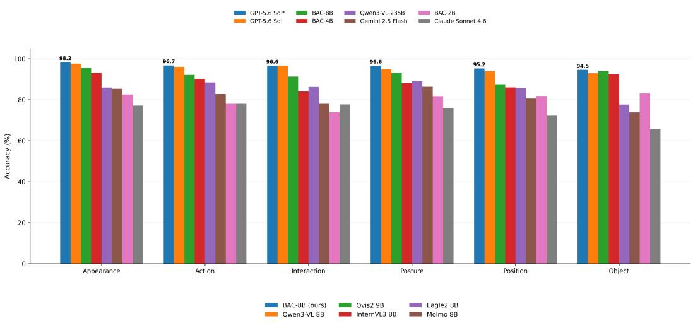

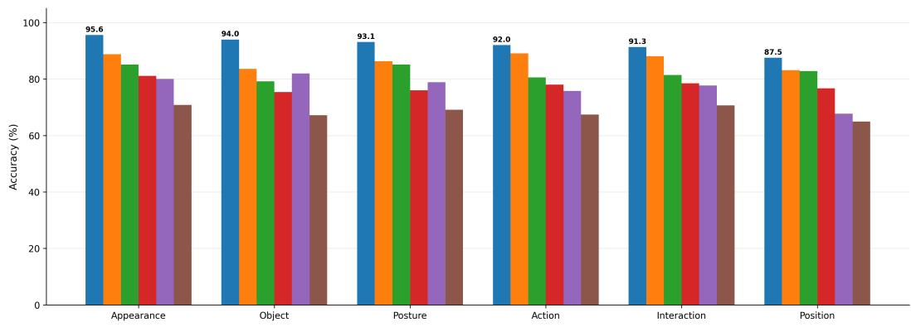  
Figure 6: Person-centric QA accuracy across question categories. Top: comparison with frontier models, with categories ordered by GPT-5.6 Sol\* performance. Bottom: comparison between BAC-8B and other 8–9B models, with categories ordered by BAC-8B performance. GPT-5.6 Sol\* denotes GPT-5.6 Sol with thinking enabled.

## E ADDITIONAL QUALITATIVE RESULTS

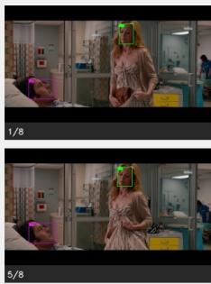

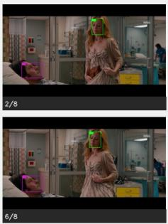  
(a) Identity mapping: P1 ↔ Leslie Mann; P2 ↔ Paul Rudd.

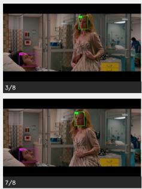

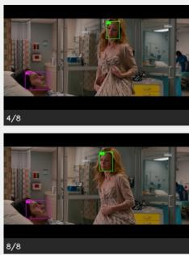

Q2 [Posture]: Who is lying in a hospital bed? GT: Paul Rudd (P2).  
Q3 [Action]: Who gathers her dress as she walks past the hospital bed? GT: Leslie Mann (P1).
<table><tr><td>Model</td><td>Q2</td><td>Q3</td><td>Model</td><td>Q2</td><td>Q3</td><td>Model</td><td>Q2</td><td>Q3</td></tr><tr><td>BAC-2B (ours)</td><td>V</td><td>V</td><td>BAC-4B (ours)</td><td>V</td><td>V</td><td>BAC-8B (ours)</td><td>V</td><td>V</td></tr><tr><td>Qwen3-VL 2B</td><td>7</td><td>5</td><td>Qwen3-VL 4B</td><td>V</td><td>V</td><td>Qwen3-VL 8B</td><td>√</td><td>V</td></tr><tr><td>GPT-5.6 Sol</td><td>Leslie X</td><td>Paul </td><td>GPT-5.6 Sol*</td><td>Leslie X</td><td>Paul ×</td><td>Claude Sonnet 4.6 Leslie × Paul ×</td><td></td><td></td></tr></table>

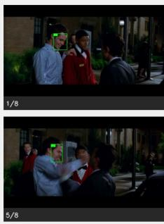

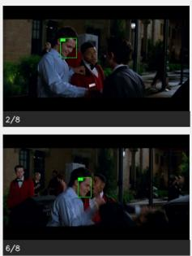  
(b) Identity mapping: P1 ↔ Chris Pine.

Q3 [Interaction]: Who is being punched in theface? GT: UNIDENTIFIED.
<table><tr><td>Model</td><td>Pred.</td><td></td><td>Model</td><td>Pred.</td><td></td><td>Model</td><td>Pred.</td><td></td></tr><tr><td>BAC-2B (ours)</td><td>Chris</td><td>×</td><td>BAC-4B (ours)</td><td>Chris</td><td>×</td><td>BAC-8B (ours)</td><td>Chris</td><td>X</td></tr><tr><td>Qwen3-VL 2B</td><td>Chris</td><td>X</td><td>Qwen3-VL 4B</td><td>Chris ×</td><td></td><td>Qwen3-VL 8B</td><td>Chris</td><td>×</td></tr><tr><td>GPT-5.6 Sol</td><td>UNID.</td><td>V</td><td>GPT-5.6 Sol*</td><td>Chris ×</td><td></td><td>Claude Sonnet 4.6 UNID. √</td><td></td><td></td></tr><tr><td>Qwen3-VL 235B</td><td>Chris</td><td>×</td><td>Gemini 2.5 Flash</td><td>Chris ×</td><td></td><td></td><td></td><td></td></tr></table>

  
(c) Identity mapping: P1 ↔ Elliot Page.

Q4 [Action]: Who holds up an ultrasound image to look at it? GT: UNIDENTIFIED.
<table><tr><td>Model</td><td>Pred.</td><td></td><td>Model</td><td>Pred.</td><td>Model</td><td>Pred.</td><td></td></tr><tr><td>BAC-2B (ours)</td><td>UNID.</td><td>V</td><td>BAC-4B (ours)</td><td>UNID.</td><td></td><td>BAC-8B (ours)</td><td>UNID.</td></tr><tr><td>Qwen3-VL 2B</td><td>Elliot</td><td>X</td><td>Qwen3-VL 4B</td><td>UNID.</td><td>y</td><td>Qwen3-VL 8B</td><td>UNID. V</td></tr><tr><td>GPT-5.6 Sol</td><td>Elliot</td><td>X</td><td>GPT-5.6 Sol*</td><td>Elliot</td><td>X Claude Sonnet 4.6</td><td>UNID.</td><td></td></tr><tr><td>Qwen3-VL 235B</td><td>UNID.</td><td>」</td><td>Gemini 2.5 Flash</td><td>UNID.</td><td>V</td><td></td><td>y</td></tr></table>

  
(a) Identity mapping: P1 ↔ Paul Bettany.

Q1 [Appearance]: Who is shirtless with blood dripping down his back? GT: Paul Bettany (P1).
<table><tr><td>Model</td><td>Pred.</td><td></td><td>Model</td><td>Pred.</td><td></td><td>Model</td><td>Pred.</td><td></td></tr><tr><td>BAC-2B (ours)</td><td>Paul</td><td>L</td><td>BAC-4B (ours)</td><td>Paul</td><td></td><td>BAC-8B (ours)</td><td>Paul</td><td></td></tr><tr><td>Qwen3-VL 2B</td><td>Paul</td><td>V</td><td>Qwen3-VL 4B</td><td>Paul</td><td></td><td>Qwen3-VL 8B</td><td>Paul</td><td>V</td></tr><tr><td>GPT-5.6 Sol</td><td>UNID.</td><td>X</td><td>GPT-5.6 Sol*</td><td>Paul</td><td>√</td><td>Claude Sonnet 4.6</td><td>UNID.</td><td>X</td></tr><tr><td>Qwen3-VL 235B</td><td>UNID.</td><td>X</td><td>Gemini 2.5 Flash</td><td>UNID.</td><td>X</td><td></td><td></td><td></td></tr></table>

(b) Identity mapping: P1 ↔ Michelle Rodriguez; P2 ↔ Bridget Moynahan; P3 ↔ Michael Pena˜ . Q1 [Posture]: Who is leaning against the refrigerator or cabinet? GT: Bridget Moynahan (P2).
<table><tr><td>Model</td><td>Pred.</td><td></td><td>Model</td><td>Pred.</td><td></td><td>Model</td><td>Pred.</td><td></td></tr><tr><td>BAC-2B (ours) Qwen3-VL 2B</td><td>Bridget Bridget</td><td>V V</td><td>BAC-4B (ours) Qwen3-VL 4B</td><td>Michael</td><td>X V</td><td>BAC-8B (ours) Qwen3-VL 8B</td><td>Bridget</td><td></td></tr><tr><td></td><td></td><td></td><td></td><td>Bridget</td><td></td><td></td><td>Bridget</td><td></td></tr><tr><td>GPT-5.6 Sol</td><td>Michael</td><td>X</td><td>GPT-5.6 Sol*</td><td>Michael</td><td>×</td><td>Claude Sonnet 4.6</td><td>Bridget</td><td></td></tr><tr><td>Qwen3-VL 235B</td><td>Bridget</td><td>V</td><td>Gemini 2.5 Flash</td><td>UNID.</td><td>X</td><td></td><td></td><td></td></tr></table>

  
(c) Identity mapping: P1 ↔ Jon Tenney; P2 ↔ Charles S. Dutton.

Q3 [Interaction]: Who tries to pull Jon back into the vehicle? GT: Charles S. Dutton (P2).
<table><tr><td>Model</td><td>Pred.</td><td></td><td>Model</td><td>Pred.</td><td>Model</td><td></td><td>Pred.</td><td></td></tr><tr><td>BAC-2B (ours) Qwen3-VL 2B</td><td>Charles Charles</td><td></td><td>BAC-4B (ours) Qwen3-VL 4B</td><td>Charles UNID.</td><td>√ X</td><td>BAC-8B (ours) Qwen3-VL 8B</td><td>Charles Charles</td><td></td></tr><tr><td></td><td></td><td></td><td></td><td></td><td></td><td></td><td></td><td></td></tr><tr><td>GPT-5.6 Sol</td><td>Charles</td><td>V</td><td>GPT-5.6 Sol*</td><td>UNID.</td><td>X</td><td>Claude Sonnet 4.6</td><td>UNID.</td><td>×</td></tr><tr><td>Qwen3-VL 235B</td><td>UNID.</td><td>X</td><td>Gemini 2.5 Flash</td><td>UNID.</td><td>X</td><td></td><td></td><td></td></tr></table>

  
(a) Identity mapping: P1 ↔ Anjali Jay; P2 ↔ Sendhil Ramamurthy.

Q2 [Appearance]: Who is wearing a red sleeveless dress? GT: Anjali Jay (P1).
<table><tr><td>Model</td><td>Pred.</td><td></td><td>Model</td><td>Pred.</td><td></td><td>Model</td><td>Pred.</td></tr><tr><td>BAC-2B (ours) Qwen3-VL 2B</td><td>Anjali</td><td>V</td><td>BAC-4B (ours)</td><td>Anjali</td><td>√</td><td>BAC-8B (ours)</td><td>UNID. X</td></tr><tr><td></td><td>Anjali</td><td>V</td><td>Qwen3-VL 4B</td><td>UNID.</td><td>X</td><td>Qwen3-VL 8B</td><td>UNID. X</td></tr><tr><td>GPT-5.6 Sol</td><td>UNID.</td><td>X</td><td>GPT-5.6 Sol*</td><td>Anjali</td><td>V</td><td>Claude Sonnet 4.6</td><td>UNID. X</td></tr><tr><td>Qwen3-VL 235B</td><td></td><td></td><td></td><td></td><td></td><td></td><td></td></tr><tr><td></td><td>UNID.</td><td>X</td><td>Gemini 2.5 Flash</td><td>UNID.</td><td>X</td><td></td><td></td></tr></table>

  
(b) Identity mapping: P1 ↔ Adrianne Palicki.

Q3 [Posture]: Who is leaning against the sink? GT: Adrianne Palicki (P1).
<table><tr><td>Model</td><td>Pred.</td><td></td><td>Model</td><td>Pred.</td><td></td><td>Model</td><td>Pred.</td><td></td></tr><tr><td>BAC-2B (ours)</td><td>Adrianne</td><td></td><td>BAC-4B (ours)</td><td>Adrianne</td><td></td><td>BAC-8B (ours)</td><td>Adrianne</td><td></td></tr><tr><td>Qwen3-VL 2B</td><td>Adrianne</td><td>V</td><td>Qwen3-VL 4B</td><td>Adrianne</td><td></td><td>Qwen3-VL 8B</td><td>Adrianne</td><td>V</td></tr><tr><td>GPT-5.6 Sol</td><td>UNID.</td><td>X</td><td>GPT-5.6 Sol*</td><td>Adrianne</td><td>V</td><td>Claude Sonnet 4.6</td><td>UNID.</td><td>×X</td></tr><tr><td>Qwen3-VL 235B</td><td>Adrianne</td><td>V</td><td>Gemini 2.5 Flash</td><td>UNID.</td><td>×</td><td></td><td></td><td></td></tr></table>

  
(c) Identity mapping: P1 ↔ Martin Lawrence; P2 ↔ Tracy Morgan.

Q4 [Interaction]: Who is holding a young man from behind, supporting him under the arms? GT: Martin Lawrence (P1).
<table><tr><td>Model</td><td>Pred.</td><td></td><td>Model</td><td>Pred.</td><td></td><td>Model</td><td>Pred.</td><td></td></tr><tr><td>BAC-2B (ours) Qwen3-VL 2B</td><td>Martin</td><td></td><td>BAC-4B (ours)</td><td>Martin</td><td></td><td>BAC-8B (ours)</td><td>Martin</td><td></td></tr><tr><td></td><td>Martin</td><td>y</td><td>Qwen3-VL 4B</td><td>Martin</td><td></td><td>Qwen3-VL 8B</td><td>Martin</td><td></td></tr><tr><td>GPT-5.6 Sol Qwen3-VL 235B</td><td>Martin UNID.</td><td>V ×</td><td>GPT-5.6 Sol* Gemini 2.5 Flash</td><td>UNID. Martin</td><td>X V</td><td>Claude Sonnet 4.6</td><td>UNID.</td><td>×</td></tr></table>

  
(a) Identity mapping: P1 ↔ Michael Cera; P2 ↔ Elliot Page.

Q2 [Appearance]: Who is wearing a light blue shirt? GT: Elliot Page (P2). Q4 [Posture]: Who rests against a pillow with closed eyes before opening them? GT: Elliot Page (P2).
<table><tr><td>Model</td><td>Q2</td><td>Q4</td><td>Model</td><td>Q2</td><td>Q4</td><td>Model</td><td>Q2</td><td>Q4</td></tr><tr><td>BAC-2B (ours)</td><td></td><td>V</td><td>BAC-4B (ours)</td><td>V</td><td>V</td><td>BAC-8B (ours)</td><td></td><td>V</td></tr><tr><td>Qwen3-VL 2B</td><td>Michael ×</td><td>V</td><td>Qwen3-VL 4B</td><td>V</td><td>V</td><td>Qwen3-VL 8B</td><td>V</td><td>V</td></tr><tr><td>GPT-5.6 Sol</td><td>Michael × Michael ×</td><td></td><td>GPT-5.6 Sol*</td><td>1</td><td></td><td>Claude Sonnet 4.6</td><td>V</td><td>Michael ×</td></tr><tr><td>Qwen3-VL 235B</td><td></td><td></td><td>Gemini 2.5 Flash UNID. ×</td><td></td><td>V</td><td></td><td></td><td></td></tr></table>

  
(b) Identity mapping: P1 ↔ Marc John Jefferies; P2 ↔ Jessica Lucas.

Q4 [Interaction]: Who turns back to look while walking away hand-in-hand with the man in the gray hoodie? GT: Jessica Lucas (P2).
<table><tr><td>Model</td><td>Pred.</td><td></td><td>Model</td><td>Pred.</td><td></td><td>Model</td><td>Pred.</td><td></td></tr><tr><td>BAC-2B (ours)</td><td>Jessica</td><td>V</td><td>BAC-4B (ours)</td><td>Jessica</td><td></td><td>BAC-8B (ours)</td><td>Jessica</td><td></td></tr><tr><td>Qwen3-VL 2B</td><td>Marc</td><td>X</td><td>Qwen3-VL 4B</td><td>Jessica</td><td></td><td>Qwen3-VL 8B</td><td>Jessica</td><td></td></tr><tr><td>GPT-5.6 Sol</td><td>UNID.</td><td>×</td><td>GPT-5.6 Sol*</td><td>Jessica</td><td>V</td><td>Claude Sonnet 4.6</td><td>Jessica</td><td></td></tr><tr><td>Qwen3-VL 235B</td><td>Jessica</td><td>L</td><td>Gemini 2.5 Flash</td><td>UNID.</td><td>X</td><td></td><td></td><td></td></tr></table>

  
(c) Identity mapping: P1 ↔ Olivia Thirlby; P2 ↔ Allison Janney; P3 ↔ Elliot Page.

Q1 [Appearance]: Who is reclining with an exposed pregnant belly? GT: Elliot Page (P3).
<table><tr><td>Model</td><td>Pred.</td><td></td><td>Model</td><td>Pred.</td><td></td><td>Model</td><td>Pred.</td><td></td></tr><tr><td>BAC-2B (ours)</td><td>Elliot</td><td></td><td>BAC-4B (ours)</td><td>Elliot</td><td>V</td><td>BAC-8B (ours)</td><td>Allison</td><td>X</td></tr><tr><td>Qwen3-VL 2B</td><td>Elliot</td><td>V</td><td>Qwen3-VL 4B</td><td>Allison</td><td>X</td><td>Qwen3-VL 8B</td><td>Allison</td><td>X</td></tr><tr><td>GPT-5.6 Sol</td><td>UNID.</td><td>X</td><td>GPT-5.6 Sol*</td><td>Elliot</td><td>L</td><td>Claude Sonnet 4.6</td><td>UNID.</td><td>×</td></tr><tr><td>Qwen3-VL 235B</td><td>Elliot</td><td>V</td><td>Gemini 2.5 Flash</td><td>Elliot</td><td></td><td></td><td></td><td></td></tr></table>