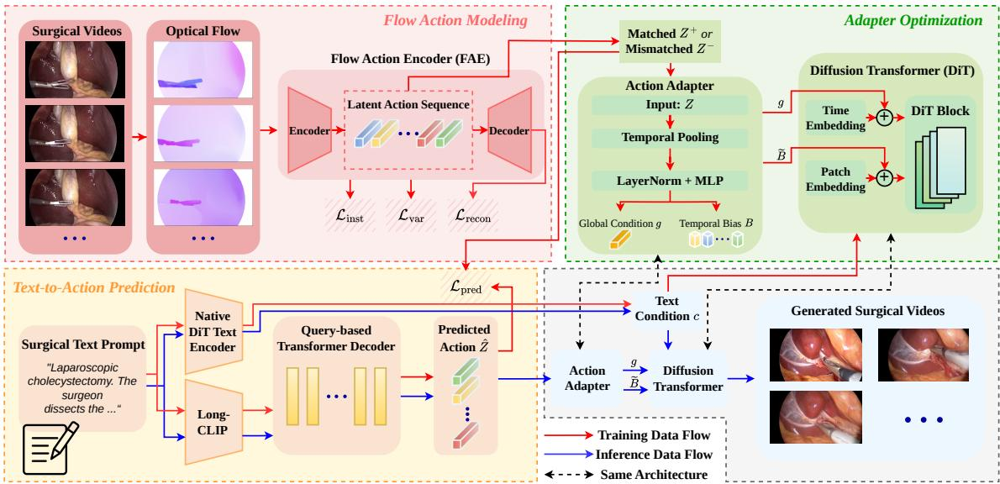
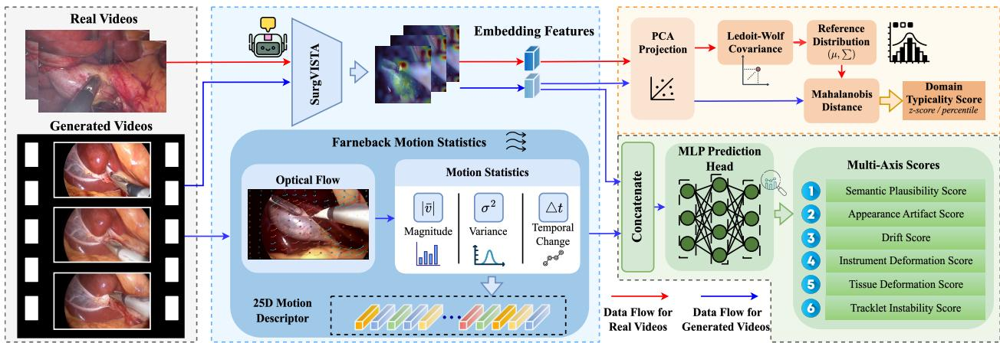
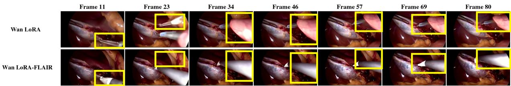
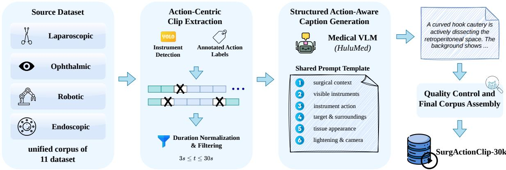
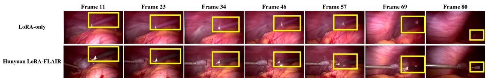
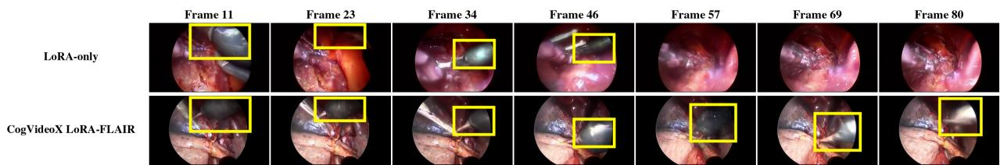
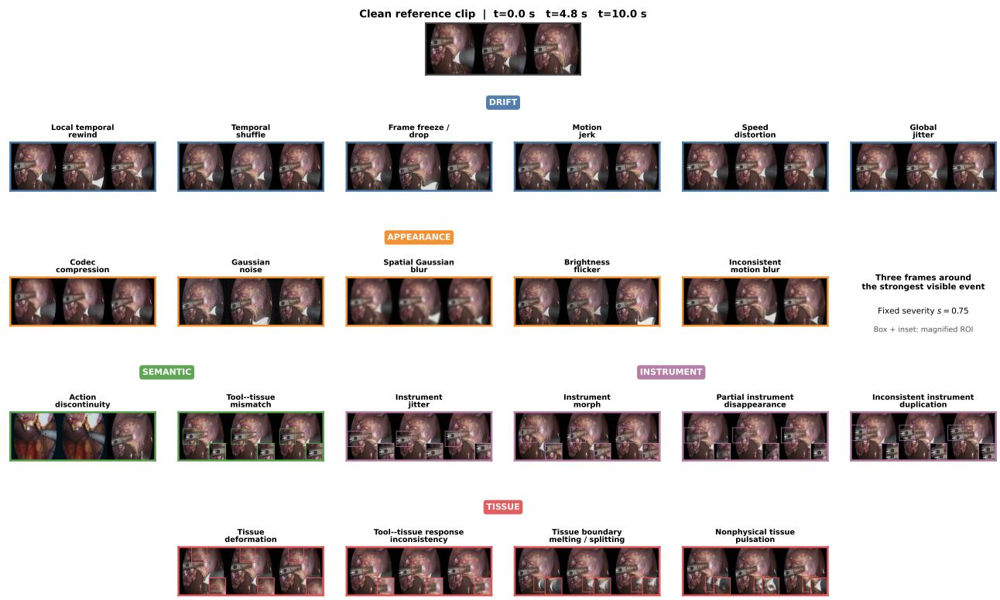

# Beyond Masks and Trajectories: Flow-Guided Latent Action Injection for Stable Surgical Video Generation

Tsz-Yui Qin\* Siyu Zhou\* Chi-Keung Tang tyqin@connect.ust.hk szhoubx@connect.ust.hk cktang@cs.ust.hk

Yuxiang Nie† Shu Yang† yuxiang.nie@connect.ust.hk syangcw@connect.ust.hk The Hong Kong University of Science and Technology

## Abstract

Surgical video generation holds substantial potential for surgical education, simulation, and data augmentation, yet generating surgical videos with realistic and clinically plausible motion remains challenging. Most existing methods rely on auxiliary conditions, such as masks, trajectories, depth, or reference videos, to achieve visually plausible synthesis. Yet, these auxiliary conditions typically require additional manual annotation or specialized acquisition, making it dificult to scale such methods beyond small, curated datasets. This motivates the need for a reference-free architecture capable of generating high-quality surgical video without requiring auxiliary visual conditions at inference time. We propose FLAIR, a Flow-guided Latent Action Injection framework for Reference-free surgical video generation. FLAIR learns action priors from optical flow of real surgical videos, dynamically predicts corresponding latent action representation from an input prompt, and injects it into a frozen base model to generate surgical videos with improved action consistency. We further construct SurgActionClip-30K, the first large-scale surgical vision dataset comprising action-centric segmented clips and structured cap tion labels, addressing the persistent lack of fine-grained, action-centric surgical datasets. Lastly, we introduce SurgMetrics, the first surgical domain-specific evaluation metrics for quantifying the quality of generated surgical videos, addressing the persistent absence of clinically grounded evaluation standards in this domain. Extensive experiments demonstrate that FLAIR enables generating high-quality surgical videos using text-only inference without auxiliary conditions, and validation in SurgMetrics demonstrates its strength in alignment with human perception compared to traditional metrics.

## 1 Introduction

Surgical videos are widely used in medical education, skill assessment, and the development of downstream surgical AI systems [8, 16, 25]. Unlike general-domain videos, they contain procedureconstrained actions and fine-grained instrument-tissue interactions in which small motion deviations can alter clinical meaning [27]. Existing recordings are mostly long and untrimmed, lacking actioncentric clips for learning motion patterns.

Recent surgical video generation methods mainly adapt general-domain generative models to surgical scenes through domain fine-tuning, text-guided difusion, or additional structural conditioning [3, 5, 7, 21, 23, 29]. While these approaches have demonstrated the feasibility of surgical video synthesis and achieved improved visual realism and controllability, their controllability is often achieved through explicit inference-time conditions, including reference frames, segmentation masks, depth maps, or tool trajectories [3, 5, 29, 32, 48], which are costly to obtain and unavailable in many low-resource educational or clinical settings [45]. This raises the need for reference-free, text-only motion guidance.

Short action-centric clips make this problem tractable. Relative to the broad motion space of general-domain videos, surgical videos occupy a substantially narrower region constrained by anatomy, instrument afordances, and procedural workflow. Within this domain, instances of a specific action concentrate further into a compact action-conditioned region, allowing text alone to select a plausible motion mode without predicting arbitrary frame-level dynamics. Text therefore only needs to identify the intended action and map it to this restricted region, while the action’s canonical execution paradigm can be learned from recurring examples in real surgical videos.

Motivated by the observation that optical flow naturally deemphasizes static background while highlighting the motion of surgical interactions in videos, we propose FLAIR, a Flow-guided Latent Action Injection framework for Reference-free surgical video generation. This framework introduces motion priors learned from real surgical videos into a text-to-video difusion model, allowing text prompts to guide surgical video generation without requiring auxiliary inference-time conditions. Specifically, FLAIR first learns compact surgical action embeddings from optical flow, then trains a text-to-action predictor to map surgical prompts into the learned latent action space. The predicted action embedding is injected into a frozen difusion Transformer through a lightweight adapter, providing motion guidance during generation without relying on masks, trajectories, depth maps, or reference videos. Experiments show that FLAIR improves motion stability and action consistency over domain-adapted baselines, demonstrating that text prompts can guide not only the appearance but also the motion of surgical video generation.

In summary, this work makes the following contributions: (1) We propose FLAIR, a framework that learns flow-derived latent action priors during training and enables reference-free, textonly inference without auxiliary conditions. (2) We construct SurgActionClip-30K, the first large-scale surgical video dataset with action-centric segmentation and template-guided captions. (3) We introduce SurgMetrics, the first objective evaluation metrics tailored for surgical video generation, which provide domain-specific measurements with six artifact-specific scores and an independent domain-typicality score. (4) Extensive experiments across standard metrics and Surg-Metrics demonstrate that FLAIR consistently improves motion stability, action consistency, and surgical-domain plausibility over existing baselines, supporting the feasibility of text-only surgical video generation.

## 2 Related Work

## 2.1 Surgical Vision Datasets

Existing surgical vision datasets can be broadly categorized into two paradigms. The first consists of raw, procedure-level datasets such as Cholec80 [35], SurgicalActions160 [30], and AutoLaparo [41], which provide long, untrimmed recordings. These datasets’ unsegmented nature renders them ill-suited for downstream generative training. A second paradigm addresses this limitation by segmenting and re-organizing raw surgical recordings into shorter, concentrated samples. Surg-396K [39] aggregates three sources into instruction-style image-text pairs, while SurgLaVi [28] curates nearly 240K narrative clip-caption pairs and organizes them hierarchically by task and step. Similar datasets, including SurgAtlas [2], SurgVLM-DB [49], and Surg-QA [22], further extend this direction by scaling up data and enriching captions. Yet, they are still either uncaptioned or segmented in ways that fail to align with discrete action boundaries, leaving none with the precision and specificity required for fine-grained, action-centric downstream training. SurgActionClip-30K addresses this gap by consolidating diverse surgical sources into a unified collection of action-centric clips with standardized textual descriptions.

## 2.2 Surgical Video Generation Models

Recent surgical video generation methods have explored a wide range of architectures and conditioning strategies in pursuit of realistic surgical video synthesis. Endora [21] and Ophora [23] establish foundations of video generation in endoscopic and ophthalmic settings, respectively. SurgSora [5] leverages initial-frame, RGB-D, and flow cues to strengthen motion and semantic control, while HieraSurg [3] uses segmentation maps and hierarchical procedure annotations to impose phase and action structure. SAW [29] further combines language with reference scenes, afordance masks, and tool-tip trajectories for controllable surgical rollouts. Yet, most existing methods rely on auxiliary conditions for controllability, and acquiring such conditions at scale is often costly or impractical, fundamentally limiting scalability. Approaching the problem diferently, FLAIR encodes opticalflow features as training-time supervision, enabling a reference-free, text-only inference architecture that generates realistic surgical videos without any auxiliary input during inference, ofering a substantially more practical and scalable alternative to existing methods.

## 2.3 Evaluation Metrics for Surgical Videos

Surgical video generation evaluation remains largely underexplored. Some existing surgical video benchmarks focus on downstream discriminative tasks, such as phase recognition, workflow analysis, and action recognition, where metrics including accuracy, F1 score, and Jaccard index are used to validate generation performance [27, 35, 41]. These metrics, however, are fundamentally unsuited for quantifying the quality of generated surgical videos. Therefore, current surgical video generation studies further adopt general-purpose video generation metrics, including FID, FVD, PSNR, Temporal IoU (TI), and Area Flicker (AF) [11, 36]. While these metrics provide useful measures of overall visual similarity or semantic correspondence, they are insensitive to surgical-specific errors such as implausible instrument-tissue interactions, instrument deformation, or domain shift. Recent eforts such as SurgVeo introduce expert-based evaluation protocols for surgical video generation, highlighting the gap between visual plausibility and surgical correctness [6]. SurgMetrics addresses this gap by introducing a multi-axis, surgical scenario-specific evaluator, with six dedicated heads each quantifying a distinct dimension of surgical video quality. These per-axis scores together form a standardized, surgery-aware metric for evaluating generated surgical videos.

## 3 Dataset Preparation

## 3.1 Cross-domain data sources

We assemble temporally compact surgical action clips from multiple domains into a unified corpus, SurgActionClip-30K, covering diverse anatomy, procedures, and actions. Guided by the crossspecialty action taxonomy of BSA-10 [44], we carefully select 11 datasets, including CholecT50 [27], AutoLaparo [41], etc., to improve coverage of surgical actions and their procedural contexts. The resulting corpus includes laparoscopic, endoscopic, and microsurgical procedures, covering representative actions such as dissection, coagulation, clipping, retraction, and aspiration. All sources are converted into a unified clip-metadata-caption schema; source-level details are provided in $\mathrm { A p \mathrm { - } }$ pendix B.1.

  
Figure 1: Overview of FLAIR. During training, the FAE extracts flow-derived latent action sequences $Z ,$ which supervise text-to-action prediction and adapter optimization. At inference, the FAE is removed, and the surgical prompt provides both the predicted motion prior $\widehat { Z }$ and the backbone-native text condition, enabling reference-free surgical video generation.

## 3.2 Action-centric clip extraction and captioning

We segment action-centric surgical clips from the original long videos using available phase, step, action, or temporal-interval annotations. Consecutive segments with consistent procedural labels are merged, while non-operative and uninformative segments are removed. For datasets without explicit instrument annotations, we employ a single-class YOLO detector [14] to estimate instrument presence and split clips when visible tool configurations change. Then, each resulting clip is paired with a structured caption following an instrument-action-target representation. We use Hulu-Med-4B [15] to generate initial descriptions, which are constrained by available annotations and verified for consistency with clip metadata. Beyond the core action triplet, we also enrich each caption with other detailed surgical annotations, including the procedure, anatomical context, tissue response, and imaging conditions to provide semantic supervision for learning surgical motion priors. Further details and examples of the filtering and captioning procedures are provided in Appendices B.2 and B.3.

## 4 Methods

## 4.1 Framework Overview

Figure 1 illustrates FLAIR. The Flow Action Encoder (FAE) first learns flow-derived latent action sequences Z from real surgical videos. The text-to-action predictor estimates the corresponding motion prior $\widehat { Z }$ from a prompt, while the action adapter injects global and temporal conditions into a frozen, domain-adapted difusion transformer. At inference, the FAE is removed and generation requires only surgical prompt.

## 4.2 Flow Action Modeling

To learn a compact representation of surgical motion, we train FAE on our SurgActionClip-30K dataset. Given a real surgical clip $V = \{ I _ { t } \} _ { t = 1 } ^ { T }$ , we first estimate the adjacent-frame optical-flow sequence $F = \{ F _ { t } \} _ { t = 1 } ^ { T - 1 }$ using RAFT [34]. Compared with RGB inputs, optical flow suppresses static appearance and emphasizes motion arising from instrument and tissue interactions. The $\mathrm { F A E } ,$ , denoted by $E _ { \phi } .$ independently maps each optical-flow representation to an ℓ -normalized latent action token:

$$
\begin{array} { r } { \mathbf { z } _ { k } = E _ { \phi } ( F _ { k } ) , \qquad Z = [ \mathbf { z } _ { 1 } , \boldsymbol { \cdot } \boldsymbol { \cdot } \boldsymbol { \cdot } , \mathbf { z } _ { K } ] , \qquad \mathbf { z } _ { k } \in \mathbb { R } ^ { d _ { z } } , } \end{array}\tag{1}
$$

where $F _ { k }$ denotes the optical-flow representation between frames $I _ { k }$ and $I _ { k + 1 } , \ \mathbf { z } _ { k } \in \mathbb { R } ^ { d _ { z } }$ is its encoded latent action token, and $Z$ is the ordered latent sequence formed by all $K = T - 1$ frame transitions. For an 81-frame clip, we obtain $K = 8 0$ ordered motion tokens with $d _ { z } = 1 2 8$ . Their temporal organization follows the order of the corresponding frame transitions, while each token is encoded independently. A lightweight decoder $D _ { \varphi }$ reconstructs the input flow representation as $\widehat { F } _ { k } = D _ { \varphi } ( \mathbf { z } _ { k } )$ , encouraging the latent space to preserve motion information without introducing RGB appearance cues.

The FAE is optimized using reconstruction and anti-collapse objectives:

$$
\mathcal { L } _ { \mathrm { F A E } } = \mathcal { L } _ { \mathrm { r e c o n } } + \lambda _ { \mathrm { i n s t } } \mathcal { L } _ { \mathrm { i n s t } } + \lambda _ { \mathrm { v a r } } \mathcal { L } _ { \mathrm { v a r } } .\tag{2}
$$

The reconstruction loss $\mathcal { L } _ { \mathrm { r e c o n } }$ preserves the information required to recover the observed motion representation. The instance-discrimination objective $\mathcal { L } _ { \mathrm { i n s t } }$ keeps distinct flow observations distinguishable in the latent space, while the variance-floor regularizer ${ \mathcal { L } } _ { \mathrm { v a r } }$ prevents dimensional collapse without encouraging unbounded latent variation. Detailed formulations and optimization settings are provided in Appendices C.2 and E.2.

## 4.3 Action Adapter and Optimization

Given a flow-derived latent action sequence $\boldsymbol { Z } \in \mathbb { R } ^ { K \times d _ { z } }$ , we introduce a lightweight action adapter $A _ { \omega }$ that converts the motion prior into global and temporally varying conditions for a frozen, domain-adapted difusion Transformer. During training, the adapter receives latent sequences extracted by the frozen FAE, whereas at inference they are replaced by the text-predicted sequence $\widehat { Z }$

The adapter first reduces the temporal resolution of the input sequence and maps the pooled tokens into a shared feature space:

$$
\begin{array} { r c l } { { } } & { { } } & { { \overline { { { Z } } } = \mathrm { P o o l } _ { K  L } ( Z ) , } } \\ { { } } & { { } } & { { } } \\ { { } } & { { } } & { { H = \mathrm { M L P } ( \mathrm { L N } ( \overline { { { Z } } } ) ) , } } \\ { { } } & { { } } & { { \bf g } = A _ { \mathrm { g l o b a l } } ( H ) , } \\ { { } } & { { } } & { { } } \\ { { } } & { { } } & { { B = A _ { \mathrm { t e m p } } ( H ) = [ { \bf b } _ { 1 } , \dots , { \bf b } _ { L } ] . } } \end{array}\tag{3}
$$

Here, $\mathrm { P o o l } _ { K  L }$ partitions the K ordered input tokens into L consecutive groups and mean-pools each group, producing $\overline { { Z } } \in \mathbb { R } ^ { L \times d _ { z } }$ . The operators LN and MLP denote layer normalization and token-wise projection through a multi-layer perceptron, respectively, getting H as the resulting adapter feature sequence. Furthermore, the global head $A _ { \mathrm { g l o b a l } }$ aggregates H into a clip-level condition $\mathbf { g } \in \mathbb { R } ^ { d _ { h } }$ , while the temporal head $A _ { \mathrm { t e m p } }$ produces $\breve { B } \in \mathbb { R } ^ { L \times d _ { h } }$ , where $\mathbf { b } _ { \ell }$ is the condition at temporal position ℓ and $d _ { h }$ is the hidden dimension of the video backbone.

  
Figure 2: Overview of SurgMetrics. During inference, SurgMetrics extracts SurgViSTA representation and Farneback statistics from input videos to predict six artifact scores: “semantic implausibility, appearance artifact, drift, instrument deformation, tissue deformation, and tracklet instability”. Then, SurgMetrics compute the Domain Distance of input video independently by comparing its SurgViSTA features with a real surgical reference distribution to compute how much a video belongs to the surgical domain. SurgMetrics incurs low computational overhead at inference time.

Secondly, in case of any diference in latent length, we resize B to obtain $\widetilde { B } = [ \widetilde { \mathbf { b } } _ { 1 } , \dots , \widetilde { \mathbf { b } } _ { L v } ]$ where $L _ { v }$ is the temporal length of the video latent. Ultimately, the global and temporal conditions are injected additively:

$$
\begin{array} { r } { \widetilde { \mathbf { e } } _ { u } = \mathbf { e } _ { u } + s \mathbf { g } , \qquad \widetilde { \mathbf { x } } _ { \ell , n } = \mathbf { x } _ { \ell , n } + s \widetilde { \mathbf { b } } _ { \ell } , } \end{array}\tag{4}
$$

where $\mathbf { e } _ { u }$ is the difusion-time embedding at denoising time u, ${ \bf x } _ { \ell , n }$ is the patch embedding at temporal index ℓ and spatial index $n ,$ and s controls the conditioning strength. The temporal condition $\widetilde { \mathbf { b } } _ { \ell }$ is shared across spatial positions at the same latent time, allowing the subsequent Transformer blocks to process a shared time-specific motion context.

We optimize the adapter through the conditioned forward pass of the frozen generator using its native flow-matching objective. To prevent the adapter from ignoring the supplied motion sequence, we compare the matched sequence $Z ^ { + }$ from the target video with a mismatched sequence $Z ^ { - }$ − from another sample:

$$
\mathcal { L } _ { \mathrm { r a n k } } = \operatorname* { m a x } ( 0 , m + \mathcal { L } _ { \mathrm { d e n } } ( Z ^ { + } ) - \mathcal { L } _ { \mathrm { d e n } } ( Z ^ { - } ) ) ,\tag{5}
$$

where ${ \mathcal { L } } _ { \mathrm { d e n } }$ is the backbone-native flow-matching loss, and m is the ranking margin. Finally, the overall objective is

$$
{ \mathcal { L } } _ { \mathrm { a d a p t e r } } = { \mathcal { L } } _ { \mathrm { d e n } } ( Z ^ { + } ) + \lambda _ { \mathrm { r a n k } } { \mathcal { L } } _ { \mathrm { r a n k } } + { \mathcal { L } } _ { \mathrm { r e g } } .\tag{6}
$$

The ranking term encourages the matched motion prior to provide more useful conditioning than an unrelated sequence, while $\mathcal { L } _ { \mathrm { r e g } }$ denotes auxiliary adapter regularization. Detailed formulations of ${ \mathcal { L } } _ { \mathrm { d e n } }$ and $\mathcal { L } _ { \mathrm { r e g } }$ , together with optimization settings, are provided in Appendices C.2 and E.4.

## 4.4 Text-to-Action Prediction

The FAE requires real-video optical flow and is therefore unavailable at inference. We instead train a text-to-action predictor to estimate a latent motion prior from the surgical prompt.

To encode the detailed descriptions in our structured surgical captions, we use a frozen Long-CLIP text encoder $E _ { \mathrm { t e x t } }$ [50]. Given a surgical prompt $p ,$ the encoder produces

$$
\mathbf h _ { p } = E _ { \mathrm { t e x t } } ( p ) , \qquad \mathbf h _ { p } \in \mathbb { R } ^ { d _ { t } } ,\tag{7}
$$

where $\mathbf { h } _ { p }$ is the pooled text feature with the dimension of $d _ { t }$ . Long-CLIP accommodates our detailed surgical captions and is used only for latent-action prediction; the difusion backbone retains its separate native text encoder.

We introduce K learnable queries $Q = [ \mathbf { q } _ { 1 } , \dots , \mathbf { q } _ { K } ]$ , where $\mathbf q _ { k }$ represents the k-th latent position. A query-based Transformer decoder predicts all tokens in parallel:

$$
\widehat { Z } = P _ { \psi } ( \mathbf { h } _ { p } , Q ) = [ \widehat { \mathbf { z } } _ { 1 } , \ldots , \widehat { \mathbf { z } } _ { K } ] \in \mathbb { R } ^ { K \times d _ { z } } ,\tag{8}
$$

where $P _ { \psi }$ is the predictor and $\widehat { \mathbf { z } } _ { k } \in \mathbb { R } ^ { d _ { z } }$ is the predicted token at position $k .$

Together, with the FAE and Long-CLIP frozen, the predictor is trained by

$$
\mathcal { L } _ { \mathrm { p r e d } } = \frac { 1 } { K } \sum _ { k = 1 } ^ { K } \left[ 1 - \cos \left( \widehat { \mathbf { z } } _ { k } , \mathbf { z } _ { k } \right) \right] + \lambda _ { z } \frac { 1 } { K } \sum _ { k = 1 } ^ { K } \left. \widehat { \mathbf { z } } _ { k } - \mathbf { z } _ { k } \right. _ { 2 } ^ { 2 } ,\tag{9}
$$

where $\mathbf { z } _ { k }$ is the FAE target token and $\lambda _ { z }$ balances cosine alignment and Euclidean regression. Since one prompt may admit multiple valid executions, $\widehat { Z }$ is treated as a text-conditioned motion prior rather than an exact trajectory. At inference, $\widehat { Z }$ replaces $Z$ as the adapter input, transferring motion knowledge learned from real surgical videos to reference-free, text-only generation while preserving the backbone’s native semantic conditioning.

## 5 SurgMetrics: Surgical Video Evaluation

Figure 2 provides an overview of SurgMetrics. Given a generated surgical video, SurgMetrics extracts visual features and motion statistics, fuses them into a shared representation, and outputs six surgical artifact scores. In parallel, an independent domain-distance branch measures the deviation of the generated clip from real laparoscopic videos, providing an estimate of its domain typicality.

## 5.1 Lightweight feature fusion and multi-axis scoring

Given a video clip V , SurgMetrics extracts two complementary feature groups. A fine-tuned SurgViSTA encoder [46] produces a representation $\phi _ { \mathrm { s v } } ( V )$ that captures surgical semantics, appearance, and coarse temporal context. Meanwhile, Farneback optical flow statistics [9] produce a compact motion descriptor $\phi _ { \mathrm { m o t } } ( V )$ characterizing motion magnitude, variation, and temporal irregularity. The two feature groups are independently projected before fusion:

$$
{ \bf f } ( V ) = \left[ P _ { \mathrm { s v } } ( \phi _ { \mathrm { s v } } ( V ) ) , P _ { \mathrm { m o t } } ( \phi _ { \mathrm { m o t } } ( V ) ) \right] .\tag{10}
$$

We first fine-tune the final blocks of SurgViSTA on controlled surgical artifacts and subsequently freeze the encoder when training the lightweight fusion network.

A shared prediction network maps $\mathbf { f } \left( V \right)$ to six artifact scores:

$$
\widehat { \mathbf { y } } = h ( \mathbf { f } ( V ) ) = [ \widehat { y } _ { \mathrm { s e m } } , \widehat { y } _ { \mathrm { a p p } } , \widehat { y } _ { \mathrm { d r i f t } } , \widehat { y } _ { \mathrm { i n s t } } , \widehat { y } _ { \mathrm { t i s s u e } } , \widehat { y } _ { \mathrm { t r k } } ] .\tag{11}
$$

The six axes measure evidence of Semantic Implausibility, Appearance Artifacts, Temporal or Global-motion Drift, Instrument Deformation, Tissue Deformation, and Local Tracklet Instability. The appearance axis includes both spatial degradation and temporally inconsistent appearance efects such as brightness flicker and excessive motion blur. Higher values indicate stronger evidence of the corresponding artifact.

Table 1: Comparison of LoRA-FLAIR on three base models with baselines and related works on general video metrics and SurgMetrics. LoRA has already achieved a greater level of TI and AF owing to the great preparation of our training datasets. LoRA-FLAIR further surpasses the result of LoRA on both general metrics and SurgMetrics. “–” denotes data not comparable or not available. “V.CLIP” denotes VideoCLIP [43].
<table><tr><td rowspan="2">Method</td><td colspan="5">General Video Metrics</td><td colspan="7">SurgMetrics</td></tr><tr><td>|V.CLIP↑ FID↓ FVD↓</td><td></td><td></td><td>TI↑</td><td>AF↓</td><td>Sem↓</td><td>App↓ Drift↓</td><td></td><td>Inst↓</td><td>Tissue↓</td><td>Track↓ Dom↓</td><td></td></tr><tr><td>Cosmos-H-Surgical</td><td></td><td></td><td></td><td>0.780</td><td>8.52</td><td></td><td></td><td></td><td></td><td></td><td></td><td></td></tr><tr><td>KVLR</td><td></td><td></td><td></td><td>0.893</td><td>4.48</td><td></td><td></td><td></td><td></td><td></td><td></td><td></td></tr><tr><td>Wan2.1 Base</td><td>8.80</td><td>246.8</td><td>3466</td><td>0.814</td><td>1.50</td><td></td><td></td><td></td><td></td><td></td><td></td><td>4.228</td></tr><tr><td>Wan2.1 LoRA Wan2.1 LoRA-FLAIR (ours)</td><td>8.82 9.08</td><td>126.3 117.2</td><td>1340 1148</td><td>0.877 0.913</td><td>0.11 0.03</td><td>0.097 0.029</td><td>0.132 0.175</td><td>0.027</td><td>0.059</td><td>0.085</td><td>0.100 -0.001</td><td>0.931 1.165</td></tr><tr><td></td><td></td><td></td><td></td><td></td><td></td><td></td><td></td><td>-0.005</td><td>0.027</td><td>-0.023</td><td></td><td></td></tr><tr><td>Hunyuan-1.5 Base</td><td>7.66</td><td>209.1</td><td>2655</td><td>0.833</td><td>3.57</td><td></td><td></td><td></td><td></td><td></td><td></td><td>4.373</td></tr><tr><td>Hunyuan-1.5 LoRA Hunyuan-1.5 LoRA-FLAIR (ours)</td><td>8.41 8.11</td><td>151.9 122.9</td><td>2533 1367</td><td>0.857 0.914</td><td>0.32 0.05</td><td>0.028 0.005</td><td>0.182 0.024 -0.013</td><td>0.024</td><td>0.054</td><td>0.238</td><td>0.193</td><td>3.388 1.771</td></tr><tr><td></td><td></td><td></td><td></td><td></td><td></td><td></td><td></td><td></td><td>0.019</td><td>0.072</td><td>0.039</td><td></td></tr><tr><td>CogVideoX-2B Base</td><td>7.11</td><td>216.3</td><td>3227</td><td>0.826</td><td>6.88</td><td></td><td></td><td></td><td></td><td></td><td></td><td>5.231</td></tr><tr><td>CogVideoX-2B LoRA CogVideoX-2B LoRA-FLAIR (ours)</td><td>8.47 8.27</td><td>219.0</td><td>1772 1592</td><td>0.944 0.964 0.83</td><td>3.94</td><td>0.081 0.164</td><td>0.525 0.487</td><td>0.009 0.001</td><td>0.063 0.061</td><td>0.168 0.094</td><td>0.120 0.070</td><td>3.446</td></tr><tr><td></td><td></td><td>202.3</td><td></td><td></td><td></td><td></td><td></td><td></td><td></td><td></td><td></td><td>3.527</td></tr></table>

## 5.2 Axis-specific artifact supervision

SurgMetrics is trained using 21 controlled degradation families designed specifically for surgica settings, which are applied to clean laparoscopic clips. These degradations cover temporal and global-motion errors, appearance corruption, semantic discontinuities, instrument failures, and tissue failures. The complete degradation definitions are provided in Appendix D.1.

Each degradation may contribute to one or more related artifact axes. Given a degradation recipe $\mathcal { D } ,$ the target for axis k is composed using a noisy-OR rule:

$$
y _ { k } = 1 - \prod _ { d \in \mathcal { D } } \left( 1 - w _ { k , d } s _ { d } \right) ,\tag{12}
$$

where $s _ { d } \in [ 0 , 1 ]$ is the severity of degradation $d ,$ and $w _ { k , d }$ specifies its contribution to axis k. This formulation allows multiple artifact signals to accumulate while keeping the target within [0, 1]. Clean clips are assigned zero-valued targets on all axes.

Because the six artifact types occur with diferent frequencies, the prediction heads are optimized with an axis-balanced Smooth L1 objective:

$$
\mathcal { L } _ { \mathrm { a r t i f a c t } } = \frac { 1 } { N } \sum _ { n = 1 } ^ { N } \sum _ { k = 1 } ^ { 6 } \alpha _ { k } ~ \mathrm { S m o o t h L 1 } \left( \hat { y } _ { n , k } , y _ { n , k } \right) ,\tag{13}
$$

where $\alpha _ { k }$ is determined from the positive prevalence of axis k in the training set. Training follows a curriculum that first emphasizes clean and single-degradation examples before introducing clips containing multiple simultaneous artifacts. Full degradation definitions and label-routing weights are provided in Appendix D.1, while network dimensions and training details are provided in Appendix E.5.

## 5.3 Surgical domain distance

Artifact severity does not by itself determine whether a video belongs to the target surgical domain. Thus, we add an extra distance score that models domain membership in SurgMetrics. SurgViSTA features extracted from clean real training videos are projected using principal component analysis

  
Figure 3: Qualitative temporal comparison between Wan2.1 LoRA and Wan2.1 LoRA-FLAIR motion conditioning, with key changes highlighted by bounding boxes. Under identical generation settings, Wan2.1 LoRA-FLAIR produces a more coherent motion trajectory and more sustained instrument–tissue interaction across the generated surgical video. Seven synchronized frames are shown from frame 0 to frame 80.

(PCA) [1], after which a Ledoit–Wolf shrinkage covariance model [19] is fitted in the projected space. For an input video V , the domain distance is

$$
d _ { \mathrm { d o m } } ( V ) = \sqrt { \left( \mathbf { z } ( V ) - { \pmb \mu } \right) ^ { \top } \pmb { \Sigma } ^ { - 1 } \left( \mathbf { z } ( V ) - { \pmb \mu } \right) } ,\tag{14}
$$

where z(V) is the PCA-projected SurgViSTA feature, and $\pmb { \mu }$ and Σ are estimated exclusively from clean real surgical training videos. We report the resulting domain z-score as the domain-typicality measure. Values near zero indicate consistency with the real surgical reference distribution, whereas large positive values indicate stronger out-of-domain deviation. This separation is important because a video may exhibit few visible artifacts while remaining out-of-domain, or may belong to the laparoscopic domain while containing severe generation errors.

## 6 Experiments

## 6.1 Quantitative and Qualitative Results

Inference Prompt Set. As no standardized surgical benchmark currently exists, we construct a 200-prompt benchmark based on the BSA-10 taxonomy [44], covering ten basic surgical actions across eight procedures. The first 180 prompts form a balanced grid of six procedures, ten actions, and three phrasing variants, while the remaining 20 extend the evaluation to VATS lobectomy and hepatectomy for external generalization. Each prompt follows a structured instrument–action– target formulation, with fine-grained vocabulary grounded in available surgical annotations and manually extended to procedures not covered by those annotations. We use the same prompt set for all experimental comparisons; its construction and full distribution are detailed in Appendix C.1.

Baselines and Comparisons. We evaluate FLAIR across three base models, Wan2.1-T2V-1.3B [38], HunyuanVideo-1.5 [42], and CogVideoX-2B [47], against two baselines: a Base-modelonly baseline and a LoRA baseline fully fine-tuned on our dataset until convergence, serving as weak and strong points of comparison, respectively. However, many existing surgical video generation methods do not release model checkpoints or generated outputs, which prevents our re-evaluation with SurgMetrics. We therefore further consider Cosmos-H-Surgical [10] and KVLR [20], but omit FID/FVD for these methods because their reference-conditioned inference settings difer from our reference-free setting, and omit CLIP/SurgMetrics scores where raw generated videos are unavailable.

Evaluation of General Metrics. As shown in Table 1, general-purpose metrics including VideoCLIP, TI and AF, show that FLAIR maintains competitive visual quality and correct execution specified by the prompt while introducing higher action consistency. However, these metrics evaluate mainly overall distribution similarity and temporal consistency, but cannot directly measure whether the generated motions are surgically plausible or ensure human alignment on surgical aspects.

Evaluation on SurgMetrics. We further evaluate the generated videos with SurgMetrics, which provides surgical-specific diagnosis through artifact axes. Compared with conventional domain fine-tuned baselines, FLAIR achieves lower artifact evidence across the majority of axes, particularly in motion-related factors such as Drift, Instrument Deformation, and Tracklet Instability. This indicates that learning action-level motion priors from optical-flow-derived representations improves procedural motion consistency beyond appearance-level adaptation. FLAIR demonstrates better execution of instrument–action–target interaction specified by the prompt.

Out of Domain. We exclude videos with domain distance above 4 from SurgMetrics comparisons because they fall outside the calibrated distribution, while values below approximately 2 are treated as in-domain. Reference values are provided in Appendix D.3.

Qualitative Results: Human Perception. Figure 3 compares Wan2.1 LoRA and Wan2.1 LoRA-FLAIR under identical generation settings across frames $t \in [ 0 - 8 1 ]$ . LoRA-only exhibits inconsistent instrument motion that escalates into structural artifacts, including a spurious second instrument and a persistent geometric fusion between instrument and tissue in later frames. In contrast, Wan2.1 LoRA-FLAIR remains stable throughout, producing a more coherent motion trajectory and sustained instrument–tissue interaction that closely aligns with real surgical dynamics. Additional qualitative results are provided in Appendix C.4.

## 6.2 Human-Alignment Validation for SurgMetrics

We conducted a human evaluation of 90 generated laparoscopic videos, with ten videos from each of nine model configurations. Four specialist surgeons with approximately 7–21 years of clinical experience independently rated each video on a five-point ordinal scale. Videos were anonymized and randomly shufled, with only the corresponding prompts shown. Evaluators assessed visible defects corresponding to the six SurgMetrics dimensions, as well as overall video quality and the correctness of the “instrument–action–target“ interaction specified by the prompt.

To evaluate whether SurgMetrics captures native generation failures beyond its synthetic training degradations, we compared each axis with the corresponding human rating. Spearman correlations ranged from 0.746 to 0.867, indicating strong agreement with human judgments. Inter-rater reliability was also high, with $\mathrm { { I C C } ( 2 , 4 ) }$ values of 0.721–0.832 across artifact axes and 0.742–0.825 for action correctness [17]. After adjusting for model identity, the correlation with overall humanrated quality remained strong, decreasing from 0.845 to 0.731, indicating that the association was not solely driven by diferences among models. FLAIR also received lower interaction-error ratings than the LoRA baseline across all three backbones, with paired confidence intervals excluding zero. Overall, these results show strong human alignment of SurgMetrics and consistent improvements in action correctness with FLAIR. The current validation is restricted to laparoscopic videos; ful validation details are provided in Appendix D.2.1.

## 6.3 Ablation Study on FAE Motion Representation

We evaluate whether the latent representation learned by the Flow Action Encoder (FAE) contains real motion information, by testing whether it is usable beyond optical-flow reconstruction. We freeze the FAE and train a one-step world-model probe to predict the next surgical frame:

$$
\begin{array} { r } { \hat { \mathbf { x } } _ { t + 1 } = \mathbf { x } _ { t } + g _ { \theta } \big ( \mathbf { x } _ { t } , \mathbf { z } _ { t } \big ) , } \end{array}\tag{15}
$$

$$
\begin{array} { r } { \mathbf z _ { t } = \mathrm { F A E } ( \mathrm { F l o w } ( \mathbf x _ { t } , \mathbf x _ { t + 1 } ) ) , } \end{array}\tag{16}
$$

where $g _ { \boldsymbol { \theta } }$ is a 128 × 128 residual U-Net. The frozen 128-dimensional motion latent $\mathbf { z } _ { t }$ is injected into the U-Net bottleneck through FiLM modulation. The probe predicts the frame residual.

Table 2 shows that FAE latent of FLAIR reduces next-frame MSE by more than 6.55% relative to the no-latent, zero-latent, and shufledlatent controls. These results demonstrate that the FAE latent preserves transition-specific motion information that can be exploited by an independently trained predictor. FAE training and checkpoint-selection details are provided in Appendix E.2.

Table 2: Next-frame prediction error under diferent FAE latent conditions. Percentages denote relative MSE changes compared with the nolatent baseline.
<table><tr><td>Latent Condition</td><td>Next-Frame MSE ↓</td></tr><tr><td>No latent</td><td>0.002521 (reference)</td></tr><tr><td>Zero latent</td><td>0.002525 (+0.15%)</td></tr><tr><td>Shuffled FAE latent</td><td>0.002601 (+3.17%)</td></tr><tr><td>FLAIR FAE latent</td><td>0.002356 (-6.55%)</td></tr></table>

## 7 Conclusion

We introduce FLAIR, a reference-free framework that encodes motion priors from optical flow into a latent action space, dynamically injecting them into a frozen video difusion model to generate surgical videos with improved motion stability and action consistency without auxiliary conditions at inference time. To support this direction, we further contribute SurgActionClip-30K and Surg-Metrics, together establishing an integrated foundation spanning modeling, data, and evaluation for scalable, action-aware surgical video generation. We hope these resources catalyze future research at the intersection of generative modeling and surgical video understanding.

## AI Use Statement

Generative AI tools were used in two parts of this work. First, Hulu-Med-4B was used during dataset construction to generate initial structured captions for surgical video clips, conditioned on available procedural and annotation metadata. These captions were subsequently constrained and checked for consistency with the corresponding clip metadata, as described in the paper. Second, a large language model was used to assist with language editing and improving the clarity of the manuscript. All methodological design, experiments, data processing, analysis, interpretation of results, and scientific conclusions were carried out and verified by the authors.

## Ethics Statement

This work uses anonymized surgical video data obtained from publicly available research datasets, and the authors had no access to personally identifiable patient information. SurgActionClip-30K is planned for public release, including metadata and processed video clips where redistribution is permitted by the corresponding source licenses. The human-alignment study involved four surgeons with specialist qualifications and 7–21 years of clinical experience; all participated with informed consent and received no financial compensation. Hulu-Med-4B was run locally for caption generation, and no surgical video data were transmitted to external services. FLAIR-generated videos are intended solely for research and education and should not be used for clinical decision-making, diagnosis, treatment planning, or intraoperative guidance.

## Reproducibility Statement

We provide detailed descriptions of the data construction pipeline, model architecture, training objectives, optimization procedure, evaluation protocol, and ablation settings in the main paper and Appendices B–E. Appendix B specifies the construction and quality-control procedures for SurgActionClip-30K; Appendix C.2 gives the complete objectives used to train the flow action encoder, text-to-action predictor, and action adapter; and Appendix E reports the training and inference configurations used for the evaluated video backbones. We also provide the construction procedure and full distribution of the 200-prompt evaluation benchmark, and release the complete prompt set to facilitate consistent cross-model evaluation. Additional details on SurgMetrics, including its controlled degradation families, supervision design, validation protocol, and ablation experiments, are provided in Appendices D.1, D.2, and D.4.

To further support reproducibility, SurgActionClip-30K and its associated metadata are intended to be released subject to the redistribution and licensing constraints of the original source datasets.

## References

[1] Herv´e Abdi and Lynne J Williams. Principal component analysis. Wiley interdisciplinary reviews: computational statistics, 2(4):433–459, 2010.

[2] Filippos Bellos, Andre S Gala-Garza, Miaowei Wang, Alyssa M Hardin, Ahmad M Hider, Yayuan Li, Jing Bi, Susan Liang, Chenliang Xu, Donald S Likosky, et al. Surgatlas: A largescale surgical video-language dataset with 2,391 hours of open and minimally invasive surgery. arXiv preprint arXiv:2606.25905, 2026.

[3] Diego Biagini, Nassir Navab, and Azade Farshad. Hierasurg: Hierarchy-aware difusion model for surgical video generation. In International Conference on Medical Image Computing and Computer-Assisted Intervention, pages 310–319. Springer, 2025.

[4] Joao Carreira and Andrew Zisserman. Quo vadis, action recognition? a new model and the kinetics dataset. In proceedings of the IEEE Conference on Computer Vision and Pattern Recognition, pages 6299–6308, 2017.

[5] Tong Chen, Shuya Yang, Junyi Wang, Long Bai, Hongliang Ren, and Luping Zhou. Surgsora: Object-aware difusion model for controllable surgical video generation. In International Conference on Medical Image Computing and Computer-Assisted Intervention, pages 521–531. Springer, 2025.

[6] Zhen Chen, Qing Xu, Jinlin Wu, Biao Yang, Yuhao Zhai, Geng Guo, Jing Zhang, Yinlu Ding, Nassir Navab, and Jiebo Luo. How far are surgeons from surgical world models? a pilot study on zero-shot surgical video generation with expert assessment. arXiv preprint arXiv:2511.01775, 2025.

[7] Joseph Cho, Samuel Schmidgall, Cyril Zakka, Mrudang Mathur, Dhamanpreet Kaur, Rohan Shad, and William Hiesinger. Surgen: Text-guided difusion model for surgical video generation. arXiv preprint arXiv:2408.14028, 2024.

[8] Jennifer A Eckhof, Guy Rosman, Maria S Altieri, Stefanie Speidel, Danail Stoyanov, Mehran Anvari, Lena Meier-Hein, Keno M¨arz, Pierre Jannin, Carla Pugh, Martin Wagner, Elan

Witkowski, Paresh Shaw, Amin Madani, Yutong Ban, Thomas Ward, Filippo Filicori, Nicolas Padoy, Mark Talamini, and Ozanan R Meireles. Sages consensus recommendations on surgical video data use, structure, and exploration (for research in artificial intelligence, clinical quality improvement, and surgical education). Surgical endoscopy, 2023.

[9] Gunnar Farneb¨ack. Two-frame motion estimation based on polynomial expansion. In Scandinavian conference on Image analysis, pages 363–370. Springer, 2003.

[10] Yufan He, Pengfei Guo, Mengya Xu, Zhaoshuo Li, Andriy Myronenko, Dillan Imans, Bingjie Liu, Dongren Yang, Mingxue Gu, Yongnan Ji, et al. Surgworld: Learning surgical robot policies from videos via world modeling. arXiv preprint arXiv:2512.23162, 2025.

[11] Martin Heusel, Hubert Ramsauer, Thomas Unterthiner, Bernhard Nessler, and Sepp Hochreiter. Gans trained by a two time-scale update rule converge to a local nash equilibrium. Advances in neural information processing systems, 30, 2017.

[12] Zhihao Hu and Dong Xu. Videocontrolnet: A motion-guided video-to-video translation framework by using difusion model with controlnet. arXiv preprint arXiv:2307.14073, 2023.

[13] Ziqi Huang, Yinan He, Jiashuo Yu, Fan Zhang, Chenyang Si, Yuming Jiang, Yuanhan Zhang, Tianxing Wu, Qingyang Jin, Nattapol Chanpaisit, Yaohui Wang, Xinyuan Chen, Limin Wang, Dahua Lin, Yu Qiao, and Ziwei Liu. Vbench: Comprehensive benchmark suite for video generative models. 2024.

[14] Nidhal Jegham, Chan Young Koh, Marwan Abdelatti, and Abdeltawab Hendawi. Yolo evolution: A comprehensive benchmark and architectural review of yolov12, yolo11, and their previous versions. arXiv preprint arXiv:2411.00201, 2024.

[15] Songtao Jiang, Yuan Wang, Sibo Song, Tianxiang Hu, Chenyi Zhou, Bin Pu, Yan Zhang, Zhibo Yang, Yang Feng, Joey Tianyi Zhou, Jin Hao, Zijian Chen, Ruijia Wu, Tao Tang, Junhui Lv, Hongxia Xu, Hongwei Wang, Jun Xiao, Bin Feng, Fudong Zhu, Kenli Li, Weidi Xie, Jimeng Sun, Jian Wu, and Zuozhu Liu. Hulu-med: A transparent generalist model towards holistic medical vision-language understanding. arXiv (Cornell University), 2025.

[16] Anni King, George E Fowler, Rhiannon C Macefield, Hamish Walker, Charlie Thomas, Sheraz Markar, Ethan Higgins, Jane M Blazeby, and Natalie S Blencowe. Use of artificial intelligence in the analysis of digital videos of invasive surgical procedures: scoping review. BJS open, 9 (4):zraf073, 2025.

[17] Terry K Koo and Mae Y Li. A guideline of selecting and reporting intraclass correlation coeficients for reliability research. Journal of chiropractic medicine, 15(2):155–163, 2016.

[18] Mathis Koroglu, Hugo Caselles-Dupr´e, Guillaume Jeanneret, and Matthieu Cord. Onlyflow: Optical flow based motion conditioning for video difusion models. In Proceedings of the Computer Vision and Pattern Recognition Conference, pages 6226–6236, 2025.

[19] Olivier Ledoit and Michael Wolf. A well-conditioned estimator for large-dimensional covariance matrices. Journal of multivariate analysis, 88(2):365–411, 2004.

[20] Bohan Li, Shuojue Yang, Baorui Peng, Xianda Guo, Erli Zhang, Youqi Tao, Junfeng Duan, Daguang Xu, Qi Dou, Xin Jin, et al. From articulated kinematics to routed visual control for action-conditioned surgical video generation. arXiv preprint arXiv:2605.08712, 2026.

[21] Chenxin Li, Hengyu Liu, Yifan Liu, Brandon Y Feng, Wuyang Li, Xinyu Liu, Zhen Chen, Jing Shao, and Yixuan Yuan. Endora: Video generation models as endoscopy simulators. In International conference on medical image computing and computer-assisted intervention, pages 230–240. Springer, 2024.

[22] Jiajie Li, Garrett Skinner, Gene Yang, Brian R Quaranto, Steven D Schwaitzberg, Peter CW Kim, and Jinjun Xiong. Llava-surg: towards multimodal surgical assistant via structured surgical video learning. arXiv preprint arXiv:2408.07981, 2024.

[23] Wei Li, Ming Hu, Guoan Wang, Lihao Liu, Kaijing Zhou, Junzhi Ning, Xin Guo, Zongyuan Ge, Lixu Gu, and Junjun He. Ophora: a large-scale data-driven text-guided ophthalmic surgical video generation model. In International Conference on Medical Image Computing and Computer-Assisted Intervention, pages 425–435. Springer, 2025.

[24] Jingyun Liang, Yuchen Fan, Kai Zhang, Radu Timofte, Luc Van Gool, and Rakesh Ranjan. Movideo: Motion-aware video generation with difusion model. In European conference on computer vision, pages 56–74. Springer, 2024.

[25] Constantinos Loukas. Video content analysis of surgical procedures. Surgical endoscopy, 32 (2):553–568, 2018.

[26] Joe Yue-Hei Ng, Jonghyun Choi, Jan Neumann, and Larry S Davis. Actionflownet: Learning motion representation for action recognition. In 2018 IEEE Winter Conference on Applications of Computer Vision (WACV), pages 1616–1624. IEEE, 2018.

[27] Chinedu Innocent Nwoye, Tong Yu, Cristians Gonzalez, Barbara Seeliger, Pietro Mascagni, Didier Mutter, Jacques Marescaux, and Nicolas Padoy. Rendezvous: Attention mechanisms for the recognition of surgical action triplets in endoscopic videos. Medical Image Analysis, 78: 102433, 2022.

[28] Alejandra Perez, Chinedu Nwoye, Ramtin Raji Kermani, Omid Mohareri, and Muhammad Abdullah Jamal. Surglavi: Large-scale hierarchical dataset for surgical vision–language representation learning. Medical Image Analysis, page 103982, 2026.

[29] Sampath Rapuri, Lalithkumar Seenivasan, Dominik Schneider, Roger Soberanis-Mukul, Yufan He, Hao Ding, Jiru Xu, Chenhao Yu, Chenyan Jing, Pengfei Guo, Daguang Xu, and Mathias Unberath. Saw: Toward a surgical action world model via controllable and scalable video generation. arXiv (Cornell University), 2026.

[30] Klaus Schoefmann, Heinrich Husslein, Sabrina Kletz, Stefan Petscharnig, Bernd M¨unzer, and Christian Beecks. Video retrieval in laparoscopic video recordings with dynamic content descriptors. Multim. Tools Appl., 77(13):16813–16832, 2018. doi: 10.1007/s11042-017-5252-2. URL https://doi.org/10.1007/s11042-017-5252-2.

[31] Karen Simonyan and Andrew Zisserman. Two-stream convolutional networks for action recognition in videos. Advances in neural information processing systems, 27, 2014.

[32] Ssharvien Kumar Sivakumar, Yannik Frisch, Ghazal Ghazaei, and Anirban Mukhopadhyay. Sg2vid: Scene graphs enable fine-grained control for video synthesis. In International Conference on Medical Image Computing and Computer-Assisted Intervention, pages 511–521. Springer, 2025.

[33] Shuyang Sun, Zhanghui Kuang, Lu Sheng, Wanli Ouyang, and Wei Zhang. Optical flow guided feature: A fast and robust motion representation for video action recognition. In Proceedings of the IEEE conference on computer vision and pattern recognition, pages 1390–1399, 2018.

[34] Zachary Teed and Jia Deng. Raft: Recurrent all-pairs field transforms for optical flow. In European conference on computer vision, pages 402–419. Springer, 2020.

[35] Andru P Twinanda, Sherif Shehata, Didier Mutter, Jacques Marescaux, Michel De Mathelin, and Nicolas Padoy. Endonet: a deep architecture for recognition tasks on laparoscopic videos. IEEE transactions on medical imaging, 36(1):86–97, 2016.

[36] Thomas Unterthiner, Sjoerd Van Steenkiste, Karol Kurach, Raphael Marinier, Marcin Michalski, and Sylvain Gelly. Towards accurate generative models of video: A new metric & challenges. arXiv preprint arXiv:1812.01717, 2018.

[37] Thomas Unterthiner, Sjoerd Van Steenkiste, Karol Kurach, Rapha¨el Marinier, Marcin Michalski, and Sylvain Gelly. Fvd: A new metric for video generation. 2019.

[38] Team Wan, Ang Wang, Baole Ai, Bin Wen, Chaojie Mao, Chen-Wei Xie, Di Chen, Feiwu Yu, Haiming Zhao, Jianxiao Yang, et al. Wan: Open and advanced large-scale video generative models. arXiv preprint arXiv:2503.20314, 2025.

[39] Guankun Wang, Long Bai, Junyi Wang, Kun Yuan, Zhen Li, Tianxu Jiang, Xiting He, Jinlin Wu, Zhen Chen, Zhen Lei, Hongbin Liu, Jiazheng Wang, Fan Zhang, Nicolas Padoy, Nassir Navab, and Hongliang Ren. Endochat: Grounded multimodal large language model for endoscopic surgery. Medical Image Analysis, page 103789, 2025.

[40] Limin Wang, Yuanjun Xiong, Zhe Wang, Yu Qiao, Dahua Lin, Xiaoou Tang, and Luc Van Gool. Temporal segment networks: Towards good practices for deep action recognition. In European conference on computer vision, pages 20–36. Springer, 2016.

[41] Ziyi Wang, Bo Lu, Yonghao Long, Fangxun Zhong, Tak-Hong Cheung, Qi Dou, and Yunhui Liu. Autolaparo: A new dataset of integrated multi-tasks for image-guided surgical automation in laparoscopic hysterectomy. In International Conference on Medical Image Computing and Computer-Assisted Intervention, pages 486–496. Springer, 2022.

[42] Bing Wu, Chang Zou, Changlin Li, Duojun Huang, Fang Yang, Hao Tan, Jack Peng, Jianbing Wu, Jiangfeng Xiong, Jie Jiang, et al. Hunyuanvideo 1.5 technical report. arXiv preprint arXiv:2511.18870, 2025.

[43] Hu Xu, Gargi Ghosh, Po-Yao Huang, Dmytro Okhonko, Armen Aghajanyan, Florian Metze, Luke Zettlemoyer, and Christoph Feichtenhofer. Videoclip: Contrastive pre-training for zeroshot video-text understanding. In Proceedings of the 2021 conference on empirical methods in natural language processing, pages 6787–6800, 2021.

[44] Mengya Xu, Daiyun Shen, Jie Zhang, Hon Chi Yip, Yujia Gao, Cheng Chen, Dillan Imans, Yonghao Long, Yiru Ye, Yixiao Liu, Rongyun Mai, Kai Chen, Hongliang Ren, Yutong Ban, Guangsuo Wang, Francis Wong, Chi-Fai Ng, Kee Yuan Ngiam, Russell H. Taylor, Daguang Xu, Yueming Jin, and Qi Dou. Generalized recognition of basic surgical actions enables skill assessment and vision-language-model-based surgical planning. arXiv preprint arXiv:2603.12787, 2026.

[45] Kunyi Yang, Qingyu Wang, Cheng Yuan, and Yutong Ban. See in depth: Training-free surgical scene segmentation with monocular depth priors. arXiv preprint arXiv:2512.05529, 2025.

[46] Shu Yang, Fengtao Zhou, Leon D. Mayer, Fuxiang Huang, Yiliang Chen, Yihui Wang, Sunan He, Yuxiang Nie, Xi Wang, Yueming Jin, Huihui Sun, Shuchang Xu, Alex Qinyang Liu, Zheng Li, Jing Qin, J. Teoh, Lena Maier-Hein, and Hao Chen. Large-scale self-supervised video foundation model for intelligent surgery. npj Digital Medicine, 2026.

[47] Zhuoyi Yang, Jiayan Teng, Wendi Zheng, Ming Ding, Shiyu Huang, Jiazheng Xu, Yuanming Yang, Wenyi Hong, Xiaohan Zhang, Guanyu Feng, et al. Cogvideox: Text-to-video difusion models with an expert transformer. In International Conference on Learning Representations, volume 2025, pages 83048–83077, 2025.

[48] Yousef Yeganeh, Rachmadio Lazuardi, Amir Shamseddin, Emine Dari, Yash Thirani, Nassir Navab, and Azade Farshad. Visage: Video synthesis using action graphs for surgery. In International Conference on Medical Image Computing and Computer-Assisted Intervention, pages 146–156. Springer, 2024.

[49] Z Zeng, Z Zhuo, X Jia, E Zhang, J Wu, J Zhang, et al. Surgvlm: a large vision-language model and systematic evaluation benchmark for surgical intelligence. arxiv [preprint].(2025). doi: 10.48550. arXiv preprint arXiv.2506.02555, 2025.

[50] Beichen Zhang, Pan Zhang, Xiaoyi Dong, Yuhang Zang, and Jiaqi Wang. Long-clip: Unlocking the long-text capability of clip. In European conference on computer vision, pages 310–325. Springer, 2024.

## A Formal Motivation

This section of the appendix provides more discussion on the main design choices underlying FLAIR and SurgMetrics.

## A.1 Why the Surgical Domain Difers Fundamentally from General Video Domains

Surgical video difers from general-domain video along two fundamental axes: semantic granularity and visual dynamics [25]. These diferences explain why many architectures and training strategies that succeed in general-domain video generation do not transfer directly to the surgical setting.

Semantic granularity. In general-domain video, an action is typically recognizable at a coarse level: whether a person is walking, jumping, or waving conveys the intended semantics even under substantial variation in speed, trajectory, or viewpoint [4, 31, 40]. Surgical actions do not enjoy this tolerance. A small deviation in instrument angle, contact depth, or approach trajectory can change the clinical meaning of a motion entirely, e.g., the diference between grasping and gripping too forcefully, or between coagulation and inadvertent tissue damage, is often a matter of a few pixels of instrument-tissue overlap rather than a qualitatively diferent motion pattern [27]. This means that surgical video generation must be evaluated and supervised at a substantially finer level of motion granularity than general-domain video, where coarse trajectory-level similarity is often suficient. Architectures designed to capture broad, semantically distinct motion categories in general-domain video are therefore not naturally suited to distinguishing these fine-grained, clinically meaningful variations, motivating our use of optical flow, rather than coarse action labels or trajectory sketches, as a supervisory signal for learning surgical motion priors.

Visual dynamics and background stability. General-domain videos are also naturally characterized by large motion magnitudes and substantial scene change: subjects move across the frame, cameras pan or cut, and backgrounds shift as the scene evolves. Surgical videos exhibit the opposite tendency. In a typical laparoscopic or endoscopic clip, the majority of the visual field, the surrounding anatomy, the camera framing, and the overall scene layout, remains largely static, with only the instrument and the immediately interacting tissue undergoing subtle, localized motion. This asymmetry between a mostly static background and a small, semantically critical region of motion is precisely what motivates our use of optical flow as the supervisory signal in FLAIR: optical flow naturally suppresses the dominant, uninformative static background and isolates exactly the small-magnitude, instrument-tissue motion that carries surgical meaning [26, 33], whereas RGBbased or trajectory-sketch-based conditioning, which are more efective when scene-level motion is itself informative, provide comparatively little additional signal in a domain where the background barely changes.

Taken together, these two properties, high semantic sensitivity to small motion deviations and a naturally low-motion, background-static visual regime, distinguish surgical video from the generaldomain videos that most existing video generation architectures and conditioning strategies are designed around [12, 18, 24], and directly motivate FLAIR’s core design choice of encoding motion priors from optical flow.

## A.2 Why FLAIR Helps

Building on this domain-level distinction, the efectiveness of FLAIR is further grounded in an observation about the structure of surgical motion itself. Relative to the broad motion space of general-domain videos, surgical videos occupy a substantially narrower region constrained by anatomy, instrument afordances, and procedural workflow: instruments can only move in ways that are mechanically feasible within the surgical field, and their trajectories are further shaped by the anatomical target and the stage of the procedure. Within this already-narrow domain, instances of a specific action concentrate further into a compact, action-conditioned region, since surgeons executing the same basic action (e.g., clipping, dissection, retraction) tend to follow similar approach angles, instrument-tissue contact patterns, and motion durations across patients and procedures. This structure means that, unlike general-domain text-to-video generation, where a prompt must implicitly resolve an enormous space of plausible motions, a surgical prompt only needs to identify the intended action and route it into this compact region; the canonical execution pattern within that region can then be learned directly from recurring examples in real surgical videos. FLAIR is designed to exploit exactly this property: the flow action encoder distills the compact, actionconditioned motion patterns present in real surgical clips into a latent space, and the text-to-action predictor learns to map a surgical prompt into this same compact region rather than predicting arbitrary frame-level dynamics from scratch. This explains why injecting a flow-derived latent action prior, rather than relying on the base difusion model’s general-purpose motion prior, yields more stable and action-consistent surgical motion at inference time.

## A.3 Why SurgMetrics is Helpful

SurgMetrics is motivated by a complementary observation about the nature of failure modes in generated surgical video. Unlike open-ended, general-domain video generation, where failure modes can be highly diverse and dificult to anticipate, the ways in which current surgical video generation models fail are comparatively enumerable: instruments intermittently disappearing or reappearing, geometric drift and structural instability across frames, implausible instrument or tissue deformation, and physically inconsistent instrument-tissue interaction recur across models and backbones [5–7, 21, 48], as also observed qualitatively in our comparisons (Appendix C.4). This enumerability suggests that, rather than requiring costly expert annotation of every generated sample, a substantial fraction of surgical-domain failure modes can instead be synthesized by deliberately applying controlled degradations to clean, real laparoscopic clips. SurgMetrics is built on this premise: by constructing 21 degradation families that emulate these recurring artifact types and training a multi-axis evaluator to detect them, we obtain a scalable and reproducible surrogate for surgical-domain video quality assessment, without depending on general-purpose metrics [11, 13, 37] that are insensitive to surgical-specific errors or on expert review for every comparison. Our human-alignment validation (Appendix D.2.1) further supports the practical value of this approach, showing that scores derived from these synthesized artifacts correlate strongly with human judgments of real generated surgical videos.

## B SurgActionClip-30K Dataset Construction

This section provides additional details on the source selection, temporal segmentation, instrumentaware refinement, caption generation, and quality control used to construct SurgActionClip-30K. The overall pipeline is shown in Figure 4, which aims to convert heterogeneous, procedure-level surgical videos into a common set of temporally compact clips, each describing a localized surgical activity and paired with action-aware textual supervision. We use the finest temporal annotation available in each source rather than assuming that all datasets provide action labels at the same granularity.

  
Figure 4: Overview of the SurgActionClip-30K construction pipeline. We first aggregate eleven surgical source datasets spanning laparoscopic, ophthalmic, robotic, and endoscopic domains. Actioncentric clips are extracted using available temporal annotations, instrument-aware refinement, and duration-based filtering. Each clip is then paired with a structured action-aware caption generated by a medical VLM using a shared prompt template covering surgical context, instruments, actions, anatomical targets, tissue response, and imaging conditions. Finally, quality control and consistency checks are applied to assemble the unified SurgActionClip-30K corpus.

## B.1 Source Datasets and Unified Representation

The source datasets span laparoscopic, robotic, rigid-endoscopic, and ophthalmic procedures. Their native annotations range from coarse surgical phases to fine-grained steps, action classes, instrument identities, and explicit temporal intervals. This diversity broadens the coverage of anatomy, procedural context, instrument appearance, and instrument–tissue interaction in the resulting corpus.

Irrespective of the source format, every retained sample is converted to a common representation containing a unique clip identifier, its source case or video, the available procedural label, instrument information when available, the clip path, and a structured caption. Source-specific labels are preserved in the metadata instead of being forcibly mapped to a single closed vocabulary. This avoids conflating diferently defined phases or actions while allowing a shared data loader to consume all sources.

## B.2 Action-Centric Clip Extraction

Annotation-driven candidate boundaries. For datasets with frame-level or second-level phase, step, or action labels, we first run-length encode consecutive identical labels. Each maximal run becomes a candidate temporal interval. Datasets that already provide localized intervals, such as OphNet, use the annotated start and end times directly. For SLAM, consecutive short parts sharing the same patient, video, camera, and action identifiers are concatenated, while the annotated looping tail is removed before concatenation. CholecT50, SurgicalActions160, and SurgVU24 retain their native action-triplet, action-class, or clip boundaries, respectively.

Table 3: Compact summary of the eleven source datasets, their temporal supervision, and the number of clips retained in SurgActionClip-30K.
<table><tr><td>Source</td><td>Procedure or domain</td><td>Boundary supervision</td><td>Retained clips</td></tr><tr><td>CholecT50</td><td>Laparoscopic cholecystectomy</td><td>Instrument-verb-target triplets</td><td>3,773</td></tr><tr><td>M2CAI16</td><td>Laparoscopic cholecystectomy</td><td>Phase labels; detector refinement</td><td>3,086</td></tr><tr><td>AutoLaparo</td><td>Laparoscopic hysterectomy</td><td>Phase labels; detector refinement</td><td>3,416</td></tr><tr><td>SLAM</td><td>Laparoscopic cholecystectomy</td><td>Native action groups</td><td>221</td></tr><tr><td>PhaKIR</td><td>Laparoscopic surgery</td><td>Joint phase and instrument labels</td><td>1,268</td></tr><tr><td>Surgical- Actions160</td><td>Laparoscopic action demonstrations</td><td>Native action classes</td><td>75</td></tr><tr><td>HeiCo</td><td>Laparoscopic colorectal surgery</td><td>Phase labels; detector refinement</td><td>4,411</td></tr><tr><td>OphNet</td><td>Ophthalmic microsurgery</td><td>Annotated temporal intervals</td><td>1,661</td></tr><tr><td>SurgVU24</td><td>Robotic surgery</td><td>Native clip and task boundaries</td><td>700</td></tr><tr><td>PitVis</td><td>Endoscopic transsphenoidal surgery</td><td>Joint step and instrument labels</td><td>6,445</td></tr><tr><td>ESD57</td><td>Endoscopic submucosal dissection</td><td>Phase labels</td><td>7,237</td></tr><tr><td>Total</td><td></td><td></td><td>32,293</td></tr></table>

Instrument-aware refinement. When instrument annotations are available, they are preferred to automatically inferred labels. PhaKIR intervals are defined by stable (phase, instrument set) pairs, and PitVis intervals are defined by stable (step, instrument set) pairs. Consequently, a clip does not silently cross an annotated instrument change.

For laparoscopic sources without instrument annotations, we apply a single-class YOLO detector [14] as a tool-presence model. The detector is evaluated at 5 frames per second with a confidence threshold of 0.25. Short detection gaps of at most 0.5 seconds are bridged to tolerate temporary occlusion and isolated false negatives. Longer tool-absent intervals create new boundaries, and sub-clips without a usable tool-present run are discarded. This refinement is restricted to visually compatible laparoscopic sources. It is not applied to ophthalmic microscopy or fisheye gastrointestinal endoscopy, where the domain gap would make detector-derived supervision unreliable.

Duration normalization and content filtering. Except for short native action units in SLAM, candidate clips shorter than 3 seconds are removed. Long intervals are divided into non-overlapping pieces of at most 30 seconds without crossing the original annotation boundary. We also remove explicitly non-operative or uninformative labels. For example, the “Others” phase is excluded from ESD57, “Undefined” intervals are excluded from PhaKIR, and “Non-functional,” “Step Interval,” and “Invalid Segment” intervals are excluded from OphNet. Audio is removed when clips are written. These operations yield temporally compact samples while retaining the procedural labe inherited from the source interval.

## B.3 Structured Action-Aware Caption Generation

Each extracted clip is captioned with Hulu-Med-4B [15] using a shared prompt template. The prompt supplies the available procedure, phase, step, action, and instrument metadata and asks the model to describe six semantic components: (1) procedural context, (2) visible instruments, (3) instrument action, (4) anatomical target and surrounding structures, (5) tissue appearance and response, and (6) lighting and camera perspective. The central semantic unit is an instrument– action–target description, while the remaining components provide contextual supervision useful for surgical video generation.

The instrument clause depends on the available supervision. If a source provides instrument identities, the prompt lists them as an exhaustive set and forbids additional instruments. If only detector-derived instrument counts are available, the prompt constrains the number of instruments mentioned but lets the model identify their types from the video. If neither identity nor a reliable count is available, the model uses open-vocabulary descriptions and is instructed to mention only instruments that are visible. Domain-appropriate instrument examples are supplied as guidance rather than as a closed label set. This tiered design reduces unsupported tool hallucination without treating cross-domain detector predictions as ground truth.

Caption examples. For a CholecT50 clip annotated with the triplet grasper–grasp–gallbladder, the generated caption states that the grasper holds and manipulates the gallbladder, then describes the surrounding liver and fatty tissue, the tissue surface, lighting, and camera stability. For a PitVis clip labeled nasal corridor creation, the caption identifies the current operative context, describes the sphenoid-region anatomy and minor bleeding, and explicitly states that no instrument is visible. For an OphNet clip labeled corneal incision creation, the caption identifies the keratome action, the corneal response, the iris and pupil in the background, and the close-up microscopic view. These examples illustrate how the same semantic template is instantiated across distinct surgical domains without forcing them into an identical vocabulary.

Prompt Engineering Template Each captioning prompt follows a fixed compositional template: procedure and surgical context + visible instruments + instrument–action–target interaction + surrounding anatomy + tissue appearance and response + lighting and camera conditions. Available procedure, phase, step, action, and instrument metadata are inserted as constraints, while Hulu-Med-4B is instructed to describe only information supported by the metadata or visible in the clip. When instrument identities are available, they are treated as an exhaustive set; when only instrument counts are available, the number of mentioned tools is constrained; otherwise, the model uses open-vocabulary descriptions restricted to clearly visible instruments.

## B.4 Quality Control and Final Corpus Assembly

We apply deterministic consistency checks after temporal extraction and captioning. Every clip must have a unique identifier, a readable video path, non-empty metadata, and a non-empty caption. The numbers of video files, metadata entries, and caption records are reconciled for every source. Captioning is checkpointed per clip and failed or empty generations are retried, allowing interrupted runs to resume without duplicating completed samples. The instrument constraints in the prompt are also derived from the same metadata record used to construct the clip, preventing cross-sample label mixing.

To prevent near-duplicate temporal content from leaking across partitions, the final training, validation, and test sets should be divided at the patient or source-video level before enumerating their clips. All clips originating from one case must remain in the same partition. The release manifest should report the final per-source retained counts and the case-level split used to obtain SurgActionClip-30K. SurgActionClip-30K will be made publicly available.

## C Additional Details on FLAIR

## C.1 Inference Prompt Set

To enable fair and reproducible cross-model comparison, we construct a 200-prompt benchmark.   
The construction of this prompt set draws on three complementary sources, described below.

Action and procedure taxonomy. The action and procedure skeleton is grounded in BSA-10 [44], which defines 10 Basic Surgical Actions (BSAs): Aspiration, Clipping, Coagulation, Dissection, Knot-tying, Needle Grasping, Needle Puncture, Packaging, Suture Pulling, and Tissue Retraction. These 10 actions are evaluated across 6 core surgical procedures (Cholecystectomy, Gastrectomy, Hysterectomy, Intestinal Resection, Nephrectomy, Prostatectomy) and 2 additional procedures reserved for external generalization testing (VATS Lobectomy, Hepatectomy).

”Instrument–verb–target” vocabulary. Fine-grained instrument–verb–target vocabulary is derived from CholecT50 triplet annotations in Cholec80 [27], comprising 5,209 clip-caption pairs. From these annotations we identify 90 unique triplets spanning 6 instrument classes, 9 verb classes, and 14 anatomical target classes (e.g., grasper → grasp → gallbladder, clipper → clip → cysticduct, hook → dissect → peritoneum, and irrigator → aspirate → fluid.). As these triplets originate exclusively from Cholec80, they provide annotation-grounded coverage only for the cholecystectomy subset; instrument–action–target combinations for the remaining procedures (e.g., gastrectomy, hysterectomy, lobectomy) are manually extended based on standard surgical practice rather than dataset-derived triplet annotations.

Prompt engineering template. Each prompt follows a fixed compositional template: subject + explicit BSA action + instrument–verb–anatomical target + surgical scene/background + visual style + aesthetic controls + optional camera language. For example: “A laparoscopic surgeon performs aspiration in a laparoscopic cholecystectomy field, using an irrigator to aspirate bile fluid pooling near the gallbladder bed after controlled perforation, tight close-up scope view, realistic surgical lighting, 4K.” Two additional constraints are enforced across all prompts: (1) every prompt includes the fixed subject phrase “A laparoscopic surgeon” to prevent video generation models from failing to recognize the endoscopic/surgical context; (2) every prompt explicitly states the BSA action label (e.g., “performs needle grasping”) rather than leaving the action implicit in natural language.

Distribution of the 200 prompts. The first 180 prompts form a strict 6×10×3 factorial grid (6 core procedures × 10 BSA actions × 3 phrasing variants per action), while the remaining 20 prompts extend coverage to two additional organs/procedures for external generalization testing and are not organized as a complete, balanced ten-action grid. Table 4 summarizes the full distribution.

The complete list of 200 prompts is released alongside this paper to support reproducibility.

## C.2 Detailed Complete Training Objectives

This section provides the complete objectives used to optimize the flow action encoder, text-toaction predictor, and action adapter. The formulations correspond to the selected FLAIR configuration used in the main experiments.

Table 4: Distribution of the 200-prompt inference benchmark across procedures. The first 180 prompts (IDs 000–179) follow a strict 6-procedure × 10-action × 3-variant factorial design; the last 20 prompts (IDs 180–199) extend coverage to two external-validation procedures.
<table><tr><td>ID</td><td>Procedure</td><td>Count</td><td>Design</td></tr><tr><td>000-029</td><td>Cholecystectomy</td><td>30</td><td>10 actions × 3 variants</td></tr><tr><td>030-059</td><td>Gastrectomy</td><td>30</td><td>10 actions × 3 variants</td></tr><tr><td>060-089</td><td>Hysterectomy</td><td>30</td><td>10 actions × 3 variants</td></tr><tr><td>090-119</td><td>Intestinal Resection</td><td>30</td><td>10 actions × 3 variants</td></tr><tr><td>120-149</td><td>Nephrectomy</td><td>30</td><td>10 actions × 3 variants</td></tr><tr><td>150-179</td><td>Prostatectomy</td><td>30</td><td>10 actions × 3 variants</td></tr><tr><td>180-189</td><td>VATS Lobectomy</td><td>10</td><td>External/generalization mix</td></tr><tr><td>190-199</td><td>Hepatectomy</td><td>10</td><td>External/generalization mix</td></tr><tr><td>Total</td><td>8 procedures</td><td>200</td><td></td></tr></table>

## C.2.1 Flow Action Encoder Objective

Let a training batch contain N optical-flow representations $\{ F _ { i } \} _ { i = 1 } ^ { N }$ . The encoder and decoder produce $\mathbf { z } _ { i } = E _ { \phi } ( F _ { i } )$ and $\widehat { F } _ { i } = D _ { \varphi } ( \mathbf { z } _ { i } )$ , where each latent token is normalized such that $\| \mathbf { z } _ { i } \| _ { 2 } = 1$ The reconstruction objective is defined as

$$
\mathcal { L } _ { \mathrm { r e c o n } } = \frac { 1 } { N } \sum _ { i = 1 } ^ { N } \left\| \widehat { F } _ { i } - F _ { i } \right\| _ { 2 } ^ { 2 } .\tag{17}
$$

The reconstruction term encourages each latent token to retain the information required to recover its corresponding flow representation.

To keep distinct flow observations separable, we apply an instance-discrimination objective. Given the pairwise similarity logits

$$
S _ { i j } = \frac { \mathbf { z } _ { i } ^ { \top } \mathbf { z } _ { j } } { \tau } ,\tag{18}
$$

the instance-discrimination loss is

$$
\mathcal { L } _ { \mathrm { i n s t } } = - \frac { 1 } { N } \sum _ { i = 1 } ^ { N } \log \frac { \exp ( S _ { i i } ) } { \sum _ { j = 1 } ^ { N } \exp ( S _ { i j } ) } ,\tag{19}
$$

where $\tau = 0 . 1$ is the similarity temperature. Each flow observation is treated as its own instance, discouraging the encoder from mapping all inputs toward a common latent direction.

We further apply a variance-floor regularizer across the latent dimensions:

$$
\mathcal { L } _ { \mathrm { v a r } } = \frac { 1 } { d _ { z } } \sum _ { r = 1 } ^ { d _ { z } } \operatorname* { m a x } \left( 0 , \gamma - \mathrm { S t d } _ { i } \left[ z _ { i , r } \right] \right) ,\tag{20}
$$

where $z _ { i , r }$ is dimension r of token $\mathbf { z } _ { i }$ and $\gamma = 0 . 0 7$ is the minimum target standard deviation. This term penalizes collapsed dimensions only when their batch-level variation falls below the specified floor and does not encourage unbounded latent variance.

The complete FAE objective is

$$
\mathcal { L } _ { \mathrm { F A E } } = \mathcal { L } _ { \mathrm { r e c o n } } + 0 . 5 \mathcal { L } _ { \mathrm { i n s t } } + 2 5 . 0 \mathcal { L } _ { \mathrm { v a r } } .\tag{21}
$$

The selected FAE configuration does not use supervised contrastive learning, domain-adversarial training, covariance penalties, or mean-direction penalties.

## C.2.2 Text-to-Action Prediction Objective

The FAE and Long-CLIP encoder [50] remain frozen while training the text-to-action predictor. For each prompt–video pair, the predictor produces $\widehat { Z } = [ \widehat { \mathbf { z } } _ { 1 } , \ldots , \widehat { \mathbf { z } } _ { K } ]$ , while the corresponding real clip provides the frozen FAE target $Z = [ { \bf z } _ { 1 } , \ldots , { \bf z } _ { K } ]$ . The predictor objective is

$$
\mathcal { L } _ { \mathrm { p r e d } } = \frac { 1 } { K } \sum _ { k = 1 } ^ { K } \left[ 1 - \cos \left( \widehat { \mathbf { z } } _ { k } , \mathbf { z } _ { k } \right) \right] + 0 . 0 5 \frac { 1 } { K } \sum _ { k = 1 } ^ { K } \left. \widehat { \mathbf { z } } _ { k } - \mathbf { z } _ { k } \right. _ { 2 } ^ { 2 } .\tag{22}
$$

The cosine term aligns the direction of the predicted and flow-derived tokens, while the Euclidean term penalizes element-wise deviations. All $K = 8 0$ positions are predicted simultaneously, and both the predicted and target tokens are ℓ2-normalized.

## C.2.3 Action Adapter Objective

The action adapter is optimized through the forward pass of the frozen, domain-adapted video generator. Given a clean video latent $x _ { 0 }$ , Gaussian noise $\epsilon \sim \mathcal { N } ( 0 , I )$ , and interpolation time $u ,$ the flow-matching path and target velocity are

$$
x _ { u } = ( 1 - u ) x _ { 0 } + u \epsilon , \qquad { \bf v } ^ { \star } = \epsilon - x _ { 0 } .\tag{23}
$$

For an action sequence $Z ,$ the denoising objective is

$$
\mathcal { L } _ { \mathrm { d e n } } ( Z ) = \| D _ { \theta } \left( x _ { u } , u , \mathbf { c } ; A _ { \omega } ( Z ) \right) - \mathbf { v } ^ { \star } \| _ { 2 } ^ { 2 } ,\tag{24}
$$

where $D _ { \theta }$ is the frozen video denoiser, c is the backbone-native text condition, and $A _ { \omega } ( Z )$ denotes the global and temporal conditions produced by the adapter. Although θ remains frozen, gradients are propagated through the denoiser to update the adapter parameters $\omega .$

To ensure that the adapter uses the supplied action sequence, we compare the matched sequence $Z ^ { + }$ from the target video with a mismatched sequence $Z ^ { - }$ from another training clip. Both forward passes share the same noisy latent $x _ { u } .$ , interpolation time $u ,$ and text condition c, leaving the action sequence as the only changed condition. The ranking loss is

$$
\mathcal { L } _ { \mathrm { r a n k } } = \operatorname* { m a x } \left( 0 , 0 . 0 2 + \mathcal { L } _ { \mathrm { d e n } } ( Z ^ { + } ) - \mathcal { L } _ { \mathrm { d e n } } ( Z ^ { - } ) \right) .\tag{25}
$$

This term encourages the matched action sequence to provide a more useful denoising condition than an unrelated motion sequence.

We apply temporal smoothness regularization to the adapter’s temporal conditions:

$$
\mathcal { L } _ { \mathrm { s m o o t h } } = \frac { 1 } { L - 1 } \sum _ { \ell = 2 } ^ { L } \left. \mathbf { b } _ { \ell } - \mathbf { b } _ { \ell - 1 } \right. _ { 2 } ^ { 2 } .\tag{26}
$$

This term discourages abrupt changes between neighboring temporal biases.

We also regularize variation in the magnitudes of the temporal conditions:

$$
\mathcal { L } _ { \mathrm { f r a m e } } = \mathrm { V a r } _ { \ell } \left( \| \mathbf { b } _ { \ell } \| _ { 2 } \right) .\tag{27}
$$

This term prevents individual temporal positions from receiving disproportionately strong injection magnitudes.

The global condition is constrained using an upper-bound penalty:

$$
\mathcal { L } _ { \mathrm { g l o b a l } } = \operatorname* { m a x } \left( 0 , \| \mathbf { g } \| _ { 2 } - 0 . 5 \right) .\tag{28}
$$

The penalty is active only when the global-condition norm exceeds 0.5, limiting disruption to the pretrained difusion-time representation.

The complete condition regularization term is

$$
\mathcal { L } _ { \mathrm { r e g } } = 0 . 0 1 \mathcal { L } _ { \mathrm { s m o o t h } } + 0 . 0 1 \mathcal { L } _ { \mathrm { f r a m e } } + 0 . 1 0 \mathcal { L } _ { \mathrm { g l o b a l } } .\tag{29}
$$

Finally, the complete action-adapter objective is

$$
{ \mathcal { L } } _ { \mathrm { a d a p t e r } } = { \mathcal { L } } _ { \mathrm { d e n } } ( Z ^ { + } ) + 0 . 2 0 { \mathcal { L } } _ { \mathrm { r a n k } } + { \mathcal { L } } _ { \mathrm { r e g } } .\tag{30}
$$

Adapter optimization uses real flow-derived sequences $Z ^ { + }$ extracted by the frozen FAE, whereas inference replaces them with the text-predicted prior ${ \widehat { Z } } .$

## C.3 Detailed FLAIR Training Setup and Procedure

Stage I: Flow-action learning. The flow action encoder is first trained on real surgical clips to learn a compact motion representation from optical-flow sequences. The decoder is optimized jointly to preserve motion information, while auxiliary objectives encourage the latent space to maintain action-discriminative structure and avoid collapse. After this stage, only the latent action encoder is retained as the motion representation module.

Stage II: Text-to-action prediction. The flow action encoder is frozen and provides target latent action sequences for paired surgical captions. The text-to-action predictor learns to map surgical prompts into the same latent action space. Since the target latent sequence remains fixed during this stage, the predictor learns the correspondence between textual descriptions and motion priors.

Stage III: Action-adapter optimization. The action adapter is trained through the frozen video difusion backbone. The backbone and surgical-domain LoRA remain unchanged, while gradients are propagated through the denoising process to update only the adapter parameters. During training, the adapter receives flow-derived latent actions, whereas inference replaces them with text-predicted latent actions.

## C.4 More Qualitative Results

To further validate the generality of FLAIR’s motion improvements across diferent video difusion backbones, we provide two additional temporal comparison examples, spanning HunyuanVideo-1.5 [42] and CogVideoX-2B [47], complementing the Wan-based [38] comparison shown in the main paper (Figure 3).

HunyuanVideo-1.5 LoRA-FLAIR As shown in Figure 5, HunyuanVideo-1.5 LoRA-FLAIR produces anatomically plausible surgical scenes with a consistently visible, stable instrument across the full 80-frame sequence. In contrast, the LoRA-only baseline exhibits drifting instrument motion and localized structural artifacts in later frames, consistent with its higher artifact-evidence scores on the drift and instrument-deformation axes reported in Main text.

  
Figure 5: Qualitative temporal comparison between HunyuanVideo-1.5 LoRA and HunyuanVideo-1.5 LoRA-FLAIR, with key changes highlighted by bounding boxes. Under identical generation settings, HunyuanVideo-1.5 LoRA-FLAIR produces visually and anatomically more plausible surgical scenes with a consistently visible, stable instrument throughout the sequence, whereas the LoRA-only baseline exhibits drifting instrument motion and localized structural artifacts in later frames. Seven synchronized frames are shown from frame 0 to frame 80.

  
Figure 6: Qualitative temporal comparison between CogVideoX-2B LoRA and CogVideoX-2B LoRA-FLAIR, with key changes highlighted by bounding boxes. CogVideoX-2B LoRA-FLAIR maintains a grounded, physically anchored instrument with consistent visibility and a more stable camera view throughout the sequence, while the LoRA-only baseline shows the instrument intermittently disappearing, floating detached from tissue, and increasing viewpoint instability as generation progresses. Seven synchronized frames are shown from frame 0 to frame 80.

CogVideoX-2B LoRA-FLAIR Figure 6 shows a similar pattern for CogVideoX-2B. CogVideoX-2B LoRA-FLAIR maintains a grounded, physically anchored instrument with consistent visibility and a more stable camera view throughout the sequence, whereas the LoRA-only baseline shows the instrument intermittently disappearing, floating detached from tissue, and increasing viewpoint instability as generation progresses. These additional examples reinforce the main paper’s finding that injecting flow-derived latent action priors improves motion stability and action consistency across multiple base video difusion architectures, rather than being specific to a single backbone.

## D Additional Details on SurgMetrics

This section provides additional details on the degradation design, axis-level supervision, empirical validation, and ablation studies used to construct and validate SurgMetrics. The overall objective is to convert a small set of clean, real laparoscopic clips into a broad and systematically controlled space of surgical-domain failure modes, each targeting one or more clinically meaningful artifact axes, without relying on costly expert annotation of generated video. We first summarize the 21 controlled degradation families and their mapping onto the six prediction heads, then present validation evidence linking SurgMetrics scores to human judgments of generated surgical video quality, and finally report ablation studies examining the contribution of individual design components, including the role of optical-flow-derived motion statistics, to overall evaluator performance.

## D.1 Twenty-one Controlled Degradation Families

To construct axis-specific supervision without relying on expert annotation of generated video, SurgMetrics is trained on 21 controlled synthetic degradation families applied to clean, real laparoscopic clips. Each family’s severity is routed, with a family-specific weight, to one or more of the six artifact-specific heads (Semantic, Appearance, Drift, Instrument, Tissue, Tracklet).

Table 11 summarizes the meaning and construction of each family, grouped by its primary target axis. Intuitively, the six axes target the recurring, enumerable failure modes of surgical video generation. Semantic Implausibility and Appearance Artifacts capture whether video remains visually and actionally plausible. Drift and Tracklet instability capture whether instruments and tissue remain temporally coherent across frames. Instrument and Tissue Deformation capture whether their local geometry stays physically consistent and assess the cross-frame stability of surgical motion.

Table 12 reports the full routing-weight matrix from each family to the six heads. As shown in the mapping, most families are routed primarily to a single head, while a subset also contributes secondary supervision to related axes, e.g., the Instrument and Tissue families additionally inform the Tracklet head, reflecting how local instrument or tissue instability naturally manifests as tracklet-level artifacts. When designing the Drift-related families, we deliberately avoided any degradation that penalizes motion purely based on its overall speed, such as treating slower motion as higher quality or faster motion as lower quality. Real surgical videos naturally vary in pacing across surgeons, procedures, and camera viewpoints, so a fixed notion of ”correct” speed would not generalize across this variation. Instead, our temporal families (e.g., speed distortion, motion jerk) specifically target non-uniform, erratic, or discontinuous changes in speed within a clip, rather than penalizing any particular absolute pace.

Figure 7 visualizes the qualitative efect of each of the 21 degradation families applied to a single clean reference frame, illustrating the range of surgical-specific failure modes that SurgMetrics is trained to detect.

## D.2 Validation of SurgMetrics

We validate SurgMetrics along three complementary dimensions: sensitivity to controlled artifacts, generalization beyond the training distribution, and alignment with human perception. SurgMetrics is trained using 100,000 unique source windows sampled from five real surgical datasets, totaling 20,000 real surgical clips, and 21 controlled degradation families (Section D.1). All data are divided at the complete-case level, such that clips from the same surgical procedure cannot appear across training and evaluation splits.

For severity evaluation, we report paired-∆ Spearman correlation $\rho _ { \Delta }$ and clean-versus-degraded AUC. Paired-∆ correlation measures whether the score increase between a clean clip and its degraded counterpart follows the target degradation severity, thereby reducing variation caused by the original video content.

Artifact sensitivity and external generalization. As shown in Table 5, SurgMetrics reliably distinguishes clean clips from clips containing multiple simultaneous artifacts on previously unseen surgical cases. The high external single-artifact correlation and AUC further show that the learned axes generalize across acquisition conditions and surgical datasets. Performance remains positive for unseen combinations of multiple artifacts, although this setting is more dificult than isolated degradation. The low variation across seeds indicates that these conclusions are not determined by a particular initialization. Complementary results on domain typicality and human-alignment

  
Figure 7: Qualitative visualization of the 21 controlled degradation families applied to a representative clean laparoscopic clip, grouped by their primary supervision axis (Drift, Appearance, Semantic, Instrument, and Tissue). Each tile shows three temporally ordered frames rendered at a fixed within-family severity of s = 0.75. Localized instrument and tissue degradations are shown with magnified regions of interest, while semantic action discontinuity uses a color-matched donor segment. Tracklet is not shown as a separate group because it receives auxiliary supervision from the instrument and tissue families rather than an exclusive degradation family.

validation are reported in later sections.

## D.2.1 Human-Alignment Validation

The evaluation set contains 90 generated laparoscopic videos from nine model configurations, with ten videos per configuration. The same ten prompts are used across all configurations to enable matched comparisons. All videos are anonymized and randomly shufled, with only the corresponding prompts shown to the evaluators. Four surgeons with specialist qualifications and approximately 7–21 years of clinical experience independently rate each video on a five-point ordinal scale. The evaluation covers visible defects corresponding to the six SurgMetrics artifact dimensions, over all video quality, and the correctness of the instrument–action–target interaction specified by the prompt.

Axis-Level Metric–Human Alignment. To evaluate whether SurgMetrics captures native generation failures beyond the synthetic degradations used for training, we compare each Surg-Metrics artifact axis directly with the corresponding human rating rather than constructing an aggregate score across heterogeneous axes. Spearman rank correlations range from 0.746 to 0.867 across the six axes, indicating strong positive rank agreement between SurgMetrics and the corresponding human judgments.

Table 5: Artifact sensitivity and external generalization of SurgMetrics. Values report mean±std over three seeds. External evaluation pools SLAM and PhaKIR; single and multi denote one and multiple simultaneous degradation families.
<table><tr><td>Evaluation setting</td><td>ρ∆ ↑</td><td>AUC↑</td></tr><tr><td>Held-out cases (multi) 0.566±0.004</td><td></td><td> $0 . 9 1 4 { \pm } 0 . 0 0 4$ </td></tr><tr><td>External (single)</td><td> $0 . 7 3 1 { \pm } 0 . 0 0 0$ </td><td> $0 . 9 2 4 { \pm } 0 . 0 0 1$ </td></tr><tr><td>External (multi)</td><td> $0 . 3 3 6 { \pm } 0 . 0 0 2$ </td><td> $0 . 7 4 3 { \pm } 0 . 0 0 6$ </td></tr></table>

Inter-Rater Reliability and Model Dependence. We assess the consistency of the human ratings using a two-way random-efects, absolute-agreement ICC for the mean of four raters (ICC(2,4)) [17]. Reliability ranges from 0.721 to 0.832 across the artifact axes, while ICC values for action correctness range from 0.742 to 0.825, indicating generally good inter-rater reliability. We further examine the efect of model identity. The correlation with overall human-rated quality decreases from 0.845 to 0.731 after adjustment, while remaining strong, indicating that the observed association is not solely explained by diferences among model configurations.

Action Correctness. Action correctness is assessed independently from SurgMetrics by asking the surgeons to evaluate whether the instrument–action–target interaction specified by each prompt is correctly executed. Across all three video backbones, FLAIR receives lower mean interactionerror ratings than the corresponding LoRA baseline, with paired confidence intervals excluding zero. This direct human assessment complements the artifact-oriented SurgMetrics evaluation and supports consistent improvements in action execution across the three backbones.

## D.3 Domain Distance Reference Values

To provide practical reference points for interpreting the domain-typicality score, we evaluate the domain-distance branch of SurgMetrics on five datasets spanning a deliberate spectrum from indomain laparoscopic video to fully out-of-domain general video, using 100 clips per dataset. Table 6 reports the mean robust z-score and the AUROC of separating each dataset from in-domain unseen test clips.

These results order datasets exactly as expected given their surgical relatedness. PhaKIR and SLAM, both near-domain laparoscopic datasets, remain closest to the training distribution (robust z of 1.85 and 1.96, still separable from in-domain unseen test but far below the datasets that follow). OphNet, a semi-related surgical domain (ophthalmic surgery, sharing instrument-tissue interaction structure but difering anatomy and imaging setup), sits at an intermediate distance (3.60). SurgVU24, a robotic-surgery dataset with substantially diferent visual and platform characteristics, and UCF101, a fully unrelated general-domain action-recognition dataset, are pushed furthest from the training distribution (4.99 and 5.82, respectively), confirming that the domaindistance branch correctly separates genuinely out-of-surgical-domain content from surgical video that merely difers in sub-specialty.

Based on this progression and consistent with the domain-distance threshold of 4 used in the main paper to exclude out-of-domain clips from SurgMetrics comparisons, we suggest the following coarse interpretation bands: values below approximately 2 indicate in-domain or near-domain laparoscopic content (e.g., PhaKIR, SLAM); values in the intermediate range (roughly 2–4) indicate semi-related surgical domains that are typologically surgical but visually or anatomically distinct (e.g., OphNet); and values above 4 indicate content that has departed the surgical laparoscopic distribution to a degree where SurgMetrics artifact scores are no longer meaningful for comparison (e.g., SurgVU24, UCF101), consistent with our exclusion criterion in the main paper.

Table 6: Domain-distance reference values across datasets spanning in-domain, semi-in-domain, and out-of-domain video, using 100 clips per dataset. Higher values indicate greater deviation from the training laparoscopic distribution.
<table><tr><td></td><td>Dataset</td><td>Mean robust z ↓</td><td>AUROC vs. in-domain ↑</td><td></td><td></td></tr><tr><td>PhaKIR</td><td>In-domain unseen test</td><td>0.5614</td><td></td><td>0.5000</td><td></td></tr><tr><td></td><td></td><td>1.8538</td><td></td><td>0.7646</td><td></td></tr><tr><td>SLAM</td><td></td><td>1.9552</td><td></td><td>0.7933</td><td></td></tr><tr><td>OphNet</td><td></td><td>3.6019</td><td></td><td>0.9547</td><td></td></tr><tr><td>SurgVU24 UCF101</td><td></td><td>4.9917</td><td></td><td>0.9923</td><td></td></tr><tr><td></td><td></td><td>5.8199</td><td></td><td>0.9957</td><td></td></tr><tr><td>Configuration</td><td>Params</td><td>Test Acc ↑ Internalρ↑</td><td>multiρ↑</td><td>AUC ↑</td><td>singleρ↑</td><td>single AUC ↑</td></tr><tr><td>Full</td><td>354,502</td><td>0.8250</td><td>0.5436</td><td>0.5661</td><td>0.9144</td><td>0.7307</td></tr><tr><td>SurgViSTA-only</td><td>345,478</td><td>0.7917</td><td>0.5144</td><td>0.5278</td><td>0.9029</td><td>0.9243</td></tr><tr><td>Optical-only</td><td>92,102</td><td>0.6569</td><td>0.2779</td><td>0.2452</td><td>0.6376</td><td>0.8556 0.7729</td></tr></table>

Table 7: Ablation over SurgMetrics input branches across adapter test, internal, held-out, and external evaluation cohorts. All values are averaged over seeds 42/43/44.

It is important to emphasize that a higher robust z-score reflects greater distributional distance from the training domain, not more severe generation artifacts; domain typicality and the six artifact-specific heads are deliberately reported as independent, non-substitutable signals. A clip can be domain-typical while still exhibiting severe artifacts, or domain-atypical while visually clean, and conflating the two would misrepresent what each score is designed to measure.

## D.4 Ablation Study on SurgMetrics

SurgMetrics fuses two input branches before predicting the six artifact heads: a SurgViSTA [46] visual-feature leg and a 25-dimensional Farneback optical-flow leg [9]. To isolate each branch’s contribution, we compare Full (both legs fused), SurgViSTA-only, and Optical-only, all trained under identical data splits, epochs, seeds (42/43/44), and evaluation cohorts (1,500 held-out multidegradation records, 1,122 external records, 1,200 clean validation records for threshold calibration).

As shown in Table 7, full achieves the best score on every aggregate metric. Relative to SurgViSTA-only, adding the optical-flow leg costs only 9,024 extra parameters yet yields consistent gains across all aggregate metrics, most notably +0.1373 Spearman on the external single-family cohort, while relative to Optical-only, adding the SurgViSTA leg yields substantially larger gains (e.g., +0.3209 held-out multi Spearman, +0.2768 held-out AUC), confirming SurgViSTA as the primary semantic/visual backbone that the optical leg alone cannot replace.

Table 8 isolates the clearest per-axis signal, Drift. SurgViSTA-only trails Full by 0.2250 in adapter test accuracy and 0.1731 in internal Spearman, while Optical-only alone retains a comparatively strong Drift correlation (0.5235) despite far fewer parameters and no visual semantics. This indicates that optical features primarily complement SurgViSTA by supplying temporal-motion evidence, with the strongest gain concentrated in drift-related evaluation, whereas SurgViSTA alone cannot fully capture motion-timing artifacts and optical features alone cannot sustain full six-axis evaluation capability.

Table 8: Drift-axis performance under each ablation configuration, the axis most afected by the optical-flow leg.
<table><tr><td>Configuration</td><td>Adapter test Drift Acc</td><td>Internal Drift ρ</td></tr><tr><td>Full</td><td>0.9500</td><td>0.6106</td></tr><tr><td>SurgViSTA-only</td><td>0.7250</td><td>0.4375</td></tr><tr><td>Optical-only</td><td>0.5333</td><td>0.5235</td></tr></table>

## E Detailed Training Setup

## E.1 Detailed LoRA training Setup

We adapted three pretrained text-to-video models—Wan2.1-T2V-1.3B [38], HunyuanVideo-1.5 T2V (8.3B) [42], and CogVideoX-2B [47]—using low-rank adaptation (LoRA). For a frozen linear projection W, LoRA parameterizes the update as $\begin{array} { r } { W ^ { \prime } = W + ( \alpha / r ) B A } \end{array}$ , where r is the rank. Only the LoRA parameters were optimized, while the pretrained video backbone, VAE, and text encoders remained frozen. We used a LoRA rank of r = 32 and scaling parameter α = 1 for all three models. The training videos were paired with detailed English captions describing the surgical instruments, actions, anatomy, and visual context.

Wan2.1. We fine-tuned the Wan2.1-T2V-1.3B model using the Wan LoRA architecture provided by Musubi Tuner. The LoRA parameters were randomly initialized and trained directly from scratch on top of the pretrained Wan backbone; no previously trained adapter or optimizer state was used. LoRA layers were applied to the linear projections in the transformer’s attention blocks. Training was performed for four epochs using six GPUs with data parallelism, a per-GPU batch size of 1, and gradient accumulation over two steps, resulting in an efective batch size of 12. We used 8- bit AdamW with a constant learning rate of $2 \times 1 0 ^ { - 4 }$ , a maximum gradient norm of 1.0, and random seed 42. The majority of training samples contained 81 frames at 480 × 832 pixels, while short clips contained 33 frames. Shifted timestep sampling with a discrete flow shift of 3.0 was used. Training was conducted with BF16 mixed precision, FP8 backbone weights, scaled-dot-product attention, and gradient checkpointing.

HunyuanVideo-1.5. We fine-tuned the 720p T2V variant of HunyuanVideo 1.5 using its dedicated LoRA architecture in Musubi Tuner. This model employs a multimodal difusion transformer together with a video VAE and Qwen2.5-VL and ByT5 text-conditioning branches. The LoRA parameters were initialized from scratch and inserted into the model’s multimodal transformer blocks. Training was performed for three epochs using six-GPU data parallelism, a per-GPU batch size of 1, and two-step gradient accumulation, giving an efective batch size of 12. We used 8-bit AdamW with a constant learning rate of $1 \times 1 0 ^ { - 4 }$ , gradient clipping at 1.0, and seed 42. Videos were trained primarily as 81-frame clips at $3 2 0 \times 5 7 6$ pixels, with 33-frame windows used for shorter clips. We adopted shifted timestep sampling without additional loss weighting and used a discrete flow shift of 2.0. BF16 mixed precision, scaled FP8 backbone weights, scaled-dot-product attention, and gradient checkpointing were enabled during training.

CogVideoX. We fine-tuned CogVideoX-2B using the Hugging Face FineTrainers architecture, which integrates the Difusers implementation of CogVideoX with PEFT-based LoRA training. CogVideoX uses a latent video transformer conditioned on T5 text features and a 3D VAE for video encoding and decoding. LoRA was applied to the query, key, value, and output projections of the transformer attention layers. Training used six-GPU data parallelism with a per-GPU batch size of 1 and two-step gradient accumulation, yielding an efective batch size of 12. The videos were resampled to 16 fps and organized into 81-frame and 33-frame resolution buckets. We used AdamW with a constant learning rate of $2 \times 1 0 ^ { - 4 }$ , gradient clipping at 1.0, and seed 42. The model was trained in BF16 with gradient checkpointing, and the 6,500-step LoRA checkpoint was selected for evaluation.

## E.2 Detailed FAE Training Setup

The final Flow Action Encoder (FAE) uses checkpoint step 10,000, with a 128-dimensional latent and 128×128 training resolution. Input flow images are stored as $3 { \times } 2 5 6 { \times } 2 5 6$ uint8, normalized to $[ - 0 . 5 , 0 . 5 ]$ , and bilinearly resized to 3×128×128. Each 80-position flow window is sampled as a pair of positions 40 apart, i ∼ Uniform $\{ 0 , \ldots , 3 9 \}$ and i + 40, per training step.

Architecture. The encoder is a convolutional stack $( 3 \times 1 2 8 \times 1 2 8 \to 2 4 \to 2 4 \to 4 8 \to 9 6 \to 1 9 2 \to 3 8 4 \to 7 6 8$ channels, halving spatial resolution at each stage down to 1×1) followed by a linear projection to 128 dimensions and L2 normalization; the decoder mirrors this structure in reverse, ending with a 3 × 3 convolution and a tanh $/ 2$ output. The full model has 7,399,103 parameters, and encoding a full window yields $Z \in \mathbb { R } ^ { 8 0 \times 1 \dot { 2 } 8 }$

Optimization. We train for 10,000 steps on 4 GPUs (DDP) with AdamW (lr 1e-4, weight decay 0.01, BF16 precision, gradient clipping 20), 32 windows per GPU (128 global windows / 256 flow images per step), seed 42, validating every 1,000 steps. Training uses hierarchical sampling (dataset → action → case → window) across five surgical datasets, with dataset sampling probabilities of 0.306 (Cholec80 [35]), 0.252 (M2CAI16), 0.206 (AutoLaparo [41]), 0.211 (HeiCo), and 0.024 (SurgicalActions160 [30]), over 43,013 training / 8,256 validation / 7,266 held-out test windows. Checkpoint step 10,000 is selected based on downstream motion utility measured by a frozen worldmodel probe, rather than reconstruction error alone.

## E.3 Detailed Predictor Training Setup

The text-to-action predictor pairs a frozen Long-CLIP-L text encoder with a non-autoregressive Transformer decoder, trained to regress the frozen FAE latent sequence. Input captions are tokenized (max 248 tokens) and pooled by frozen Long-CLIP-L into a 768-dim embedding; the target is the frozen FAE z sequence [80, 128]. Only the predictor is trained; Long-CLIP remains entirely frozen.

Architecture. The pooled text embedding is projected (768→256) into a single context token, which conditions 80 learned temporal queries through a 4-layer Transformer decoder (hidden dim 256, 4 heads, FFN dim 1024, dropout 0.1); a final linear layer (256→128) with per-position L2 normalization produces the predicted sequence $\hat { Z } \in \mathbb { R } ^ { 8 0 \times 1 2 \bar { 8 } }$ . All 80 positions are predicted in parallel, not autoregressively.

Optimization. We train on a single GPU with AdamW (fixed lr 3e-4, weight decay 1e-4), batch size 64 (validation batch 128), for up to 10,000 steps (gradient clipping 1.0, seed 42), validating and saving every 500 steps using the same train/validation/test window split as the FAE (43,013 $/ \ 8 , 2 5 6 \ / \ 7 , 2 6 6 )$ . Model selection uses validation frame-level cosine similarity; the best checkpoint occurs at step 500.

## E.4 Detailed Adapter Training Setup

All three backbones (Wan2.1-T2V-1.3B, HunyuanVideo 1.5, CogVideoX-2B) share a common motion-side interface: the FAE/predictor latent [B, 80, 128] is mean-pooled every 4 positions to [B, 20, 128], followed by LayerNorm and a SiLU MLP (128→512→512) producing a global condition and a temporal frame bias. Adapters are trained using real z extracted from real optical flow, but at inference use predicted z generated from the caption; the video backbone and surgical LoRA are frozen throughout, with only the adapter updated. All three adapters inject conditioning at the input level (global/time-bias addition), rather than through per-block cross-attention.

Shared optimization settings. All adapters are trained with AdamW (lr 1e-4, weight decay 1e-4), per-GPU batch size 1, gradient clipping 1.0, BF16 precision, and seed 42, using 1,024 training samples (128 validation samples for Hunyuan/CogVideoX).

Backbone-specific configurations. Table 9 summarizes the injection dimensionality, trainable parameters, training budget, and deployment settings for each backbone. The Wan adapter (1.9M parameters) injects a 1536-dim global condition and [B, 20, 1536] temporal bias into the time embedding and patch-embedding features, trained for 1,000 steps on a single GPU at 480×832 resolution; step 500 is selected over step 1,000 for deployment (scale 0.30). The Hunyuan adapter (2.4M parameters) injects a 2048-dim condition into transformer.time in and transformer.img in, with the 20-position temporal bias linearly interpolated to the 21 VAE latent time positions; it is trained on 4 GPUs (DDP) at 320×576 resolution for the full 1,000 steps (deployment scale 0.50). The CogVideoX adapter (1.6M parameters) injects a 512-dim global condition and [B, 20, 1920] temporal bias into the video-token portion of the patch embedding only (excluding text tokens); the final paper-facing branch pairs the adapter with a surgical LoRA (rank 32, efective scale 1/32), trained on 8 GPUs (DDP) at 480×832 resolution, with the final deployed checkpoint at step 400 (scale 0.50).

## E.5 Detailed SurgMetrics Training Setup

SurgMetrics is trained in two stages: a SurgViSTA backbone adaptation stage, followed by a lightweight fusion model trained on frozen, cached features. The system is not trained end-to-end; SurgViSTA is first adapted and frozen before the fusion MLP is trained on top of its cached outputs.

Table 9: Summary of adapter configurations and deployment settings across the three video backbones.
<table><tr><td>Backbone</td><td>Params</td><td>Training budget</td><td>Resolution</td><td>Selected step</td><td>Adapter scale</td></tr><tr><td>Wan2.1-T2V-1.3B</td><td>1,904,896</td><td>1k / 1 GPU</td><td>480×832</td><td>500</td><td>0.30</td></tr><tr><td>HunyuanVideo 1.5</td><td>2,430,208</td><td>1k / 4 GPU (DDP)</td><td> $3 2 0 \times 5 7 6$ </td><td>1,000</td><td>0.50</td></tr><tr><td>CogVideoX-2B</td><td>1,576,576</td><td>1k / 8 GPU (DDP)</td><td>480×832</td><td>400</td><td>0.50 (LoRA 1/32)</td></tr></table>

Stage 1: SurgViSTA backbone fine-tune. Starting from the pretrained SurgViSTA backbone, we fine-tune only the last 4 Transformer blocks and fc norm, keeping earlier blocks frozen, with a temporary 768→256→6 prediction head (GELU, dropout 0.2) used solely for adaptation. Training uses AdamW with a backbone learning rate of 1e-5 and head learning rate of 3e-4 (no scheduler), weight decay 1e-4, BF16 autocast, gradient clipping 1.0, and Smooth L1 loss $( \beta \mathrm { = } 0 . 1 )$ , for 6 epochs at seed 42. Training follows a curriculum: the first 2 epochs use only clean and singledegradation records (20,400 total), after which all 30,000 training records (clean, single, double, triple degradations) are used from epoch 3 onward. Efective batch size varies with available GPUs (5 for epoch 1, 8 for epochs 2–6, via PyTorch DDP/NCCL), with total training time of approximately 11.5 hours. Model selection uses mean-axis Spearman correlation across the six heads on a fixed 6,000-record validation set; epoch 5 (0.5066) is selected as the best checkpoint, narrowly outperforming epoch 3 (0.4983) and epoch 6 (0.4999).

Stage 2: Fusion model training. The fusion model takes frozen 768-dim SurgViSTA features and 25-dim Farneback optical-flow features as input, projecting each through a small branch (SurgViSTA: 768→256; Optical: 25→32, both with GELU) before concatenation (288-dim) and a shared MLP (288→256→128, GELU, dropout 0.2), followed by six independent heads (128→64→1, GELU, dropout 0.1) producing raw, unbounded scores for Semantic, Appearance, Drift, Instrument, Tissue, and Tracklet. With only 354,502 trainable parameters, training is fast (10–14 seconds/epoch) using cached features. We train for 30 epochs with AdamW, initial learning rate 3e-4 with cosine annealing to 0, weight decay 1e-4, batch size 256, and gradient clipping 5.0; ranking loss is disabled (weight 0). A curriculum similarly restricts the first 5 epochs to clean and singledegradation records (68,000) before introducing the full 100,000-record set (including double and triple degradations) from epoch 6 onward. The primary model uses seed 42, with seeds 43 and 44 used for reproducibility checks; early stopping (patience 6) is used during development but disabled for the final release run to guarantee all 30 epochs complete.

Axis-balanced loss. Since positive prevalence varies substantially across heads (from 16.5% for Semantic to 37.4% for Tracklet), we apply inverse-positive-frequency weighting, $w _ { a } \propto 1 / \operatorname* { m a x } ( \mathrm { p r e v a l e n c e } _ { a } , 0 . 0 5 )$ normalized to a mean of 1 and clipped to [0.5, 3.0], computed using training-set statistics only. The overall objective is

$$
\mathcal { L } = \frac { 1 } { N A } \sum _ { n = 1 } ^ { N } \sum _ { a = 1 } ^ { A } w _ { a } \operatorname { S m o o t h L 1 } ( p _ { n , a } , y _ { n , a } ; \beta = 0 . 1 ) .
$$

Data and severity. All splits are performed at the case level (split seed 43) across five source datasets (Cholec80 action, AutoLaparo, M2CAI16, SurgicalActions160, HeiCo), ensuring no procedure appears across train/validation/test. From 20,000 unique real source windows, each augmented with 5 degradation variants, we obtain 100,000 training records. Training severity is sampled continuously, $s \sim \mathcal { U } ( 0 . 1 5 , 1 . 0 0 )$ , while validation uses fixed severity levels (0.00, 0.25, 0.50, 0.75, 1.00) over 1,200 unique source windows (6,000 records total). When multiple degradations co-occur, per-axis labels are aggregated via noisy-OR, $\begin{array} { r } { y _ { a } = 1 - \prod _ { i } ( 1 - s _ { i } w _ { i , a } ) } \end{array}$ , consistent with the routing weights in Table 11.

Table 10: Inference configuration for the 200-prompt evaluation set across the three video backbones. Prompt set, frame count, and seed are shared; all other settings follow each backbone’s validated native configuration.
<table><tr><td>Parameter</td><td>Wan2.1-1.3B</td><td>HunyuanVideo 1.5</td><td>CogVideoX-2B</td></tr><tr><td>Resolution (W×H)</td><td>832×480</td><td>576×320</td><td>832×480</td></tr><tr><td>Frames</td><td>81</td><td>81</td><td>81</td></tr><tr><td>FPS</td><td>16</td><td>24</td><td>16</td></tr><tr><td>Denoising steps</td><td>20</td><td>30</td><td>50</td></tr><tr><td>Guidance scale</td><td>5.0</td><td>6.0</td><td>6.0</td></tr><tr><td>Flow shift</td><td>5.0</td><td>2.0</td><td></td></tr><tr><td>Scheduler</td><td>Flow UniPC</td><td>Native flow-matching sampler</td><td>DDIM</td></tr><tr><td>Seed</td><td>42</td><td>42</td><td>42</td></tr><tr><td>LoRA scale</td><td>1.0</td><td>1.0</td><td>1/32</td></tr><tr><td>Adapter checkpoint</td><td>Step 500</td><td>Step 1,000</td><td>Step 400</td></tr><tr><td>Adapter scale</td><td>0.30</td><td>0.50</td><td>0.50</td></tr><tr><td>Backbone precision</td><td>FP8</td><td>FP8-scaled</td><td>BF16</td></tr><tr><td>Prompt-z source</td><td></td><td>Shared [80, 128] cache from Long-CLIP predictor</td><td></td></tr></table>

## E.6 Detailed Inference Setup

All quantitative results are generated using a shared prompt set of 200 surgical prompts (prompt set with every video generated at 81 frames and seed 42. Across all three backbones, the three FLAIR variants (Base-only, LoRA-only, LoRA-FLAIR) share identical resolution, frame count, FPS, denoising steps, guidance scale, seed, and LoRA weights within each backbone; the only diference introduced by LoRA-FLAIR relative to LoRA-only is the addition of the action adapter and the predicted motion latent. All three backbones further condition on the same cached [80, 128] promptz produced by the shared Long-CLIP predictor. Backbone-native settings such as resolution, FPS, denoising steps, guidance scale, scheduler, LoRA scale, and adapter scale otherwise follow each backbone’s own validated configuration, summarized in Table 10.

Wan2.1-1.3B. We use Wan2.1-T2V-1.3B with the FlowUniPCMultistepScheduler, 20 denoising steps, guidance scale 5.0, and flow shift 5.0, at 832×480 resolution with torch attention and FP8 backbone precision; the surgical LoRA is applied at multiplier 1.0, and the trained adapter (step 500) is applied at scale 0.30. No explicit negative prompt is passed, so the backbone’s default negative prompt is used.

HunyuanVideo-1.5. We use HunyuanVideo-1.5 720p T2V at 576×320 resolution, 24 FPS, 30 denoising steps, guidance scale 6.0, and flow shift 2.0, with torch attention, FP8-scaled backbone precision, and inference block swap disabled (block swapping is used only during training for memory management, not at inference). The surgical LoRA is applied at multiplier 1.0, the trained adapter (step 1,000) at scale 0.50, and the negative prompt is left empty.

CogVideoX-2B. We use CogVideoX-2B with the CogVideoXDDIMScheduler, 50 denoising steps, guidance scale 6.0, and BF16 pipeline precision, at 832×480 resolution and 16 FPS, with dynamic CFG disabled and no negative prompt. The epoch-3 surgical LoRA is applied at scale 1/32, and the trained adapter (step 400) is applied at scale 0.50.

## E.7 Detailed implementation of general metrics

We evaluate the generated videos using five general metrics: VideoCLIP score, Fr´echet Inception Distance (FID) [11], Fr´echet Video Distance (FVD) [37], temporal intersection over union (TI), and area fluctuation (AF). The same frozen preprocessing, model checkpoints, and reference distribution are used for all generation methods.

VideoCLIP score. VideoCLIP evaluates the semantic alignment between a generated video and its conditioning prompt. Each video is decoded at 30 frames per second, resized while preserving its aspect ratio, and center-cropped to $2 2 4 \times 2 2 4$ . The oficial VideoCLIP video and text encoders are then used to obtain pooled representations $\mathbf { v } _ { i }$ and $\mathbf { t } _ { i }$ . The score for video i is the native VideoCLIP retrieval score

$$
s _ { i } ^ { \mathrm { V C } } = { \mathbf { v } } _ { i } ^ { \top } { \mathbf { t } } _ { i } .\tag{31}
$$

We report the mean score over all videos. A higher VideoCLIP score indicates better semantic consistency between the generated content and the input prompt.

FID and FVD. FID and FVD compare the generated-video distribution with a fixed real surgical-video distribution. We construct a unified reference containing 400 held-out real surgi cal clips, each with 81 frames, and use the same reference statistics for every generator. Both distances follow the Fr´echet distance between the real and generated feature distributions:

$$
d _ { \mathrm { F } } = \Vert \pmb { \mu _ { r } } - \pmb { \mu _ { g } } \Vert _ { 2 } ^ { 2 } + \operatorname { T r } \left( \pmb { \Sigma _ { r } } + \pmb { \Sigma _ { g } } - 2 ( \pmb { \Sigma _ { r } } \pmb { \Sigma _ { g } } ) ^ { 1 / 2 } \right) ,\tag{32}
$$

where $\pmb { \mu }$ and Σ denote the feature mean and covariance.

FID is computed using pytorch-fid==0.3.0 and 2048-dimensional Inception-v3 pool3 features. We uniformly sample six frames at indices {0, 16, 32, 48, 64, 80} from each video. FID primarily measures frame-level visual fidelity and diversity, such as the realism of anatomy, instruments, texture, and color. FVD is computed using cd-fvd==0.1.1 and a Kinetics-400 pretrained I3D encoder [4], with all 81 frames used jointly. It therefore measures both visual realism and temporal dynamics. Lower FID and FVD values indicate that the generated distribution is closer to the real surgical-video distribution.

Temporal intersection over union. TI measures the frame-to-frame spatial consistency of surgical instruments. Given the unioned binary instrument mask $M _ { t }$ at frame t, TI is defined as

$$
\mathrm { T I } ( V ) = \frac { 1 } { | \mathcal { P } | } \sum _ { t \in \mathcal { P } } \frac { | M _ { t - 1 } \cap M _ { t } | } { | M _ { t - 1 } \cup M _ { t } | } ,\tag{33}
$$

where $\mathcal { P }$ contains adjacent frame pairs for which at least one mask is non-empty. Pairs with two empty masks are excluded. A higher TI indicates better temporal continuity, while a lower value suggests abrupt displacement, deformation, disappearance, or temporal flickering of instruments.

Area fluctuation. AF measures abrupt changes in the visible instrument area. Let $A _ { t } \ =$ $\textstyle \sum _ { x } M _ { t } ( x )$ denote the number of foreground pixels at frame t. AF is computed as

$$
\operatorname { A F } ( V ) = { \frac { 1 } { T - 1 } } \sum _ { t = 1 } ^ { T - 1 } { \frac { | A _ { t } - A _ { t - 1 } | } { \operatorname* { m a x } ( A _ { t - 1 } , 1 ) } } .\tag{34}
$$

A lower AF indicates smoother and more stable temporal evolution of instrument size, whereas a higher AF reflects sudden scale changes, shape instability, or instrument appearance and disappearance. Notably, in the comparison of FLAIR models with the LoRA-only models and the base models, CogVideoX-2B LoRA showed a significantly abnormal AF value even when a certain surgical environment and instruments were already apparent. This illustrates the inadequacy of general metrics in the surgical field and further emphasizes the importance of Surgmetrics.

## F Discussion on Limitations and Broader Impact

Limited trajectory-level action control FLAIR is designed as a reference-free framework that infers a plausible, text-conditioned motion prior rather than enforcing a single, user-specified action trajectory. Since a surgical prompt can admit multiple clinically valid motion realizations (e.g., varying grasp angles or interaction durations for the same instrument–action–target triplet), our text-to-action predictor is explicitly formulated to output a distributional prior $\bar { \hat { Z } }$ that cap tures the canonical execution pattern learned from real surgical videos, rather than committing to an arbitrary frame-level trajectory (Eq. 9 in main paper). This design choice is intentional: by constraining generation to the compact, action-conditioned region observed in real data, FLAIR already substantially narrows the space of plausible outputs compared to unconstrained text-to-video generation, as reflected in its improved motion stability and action consistency (Table 1, Table 2 in main paper). Nonetheless, ofering more explicit, trajectory- or keyframe-level steering on top of this learned prior, while preserving the reference-free inference setting, remains a natural extension for future work.

Coverage constrained by the BSA-10 action taxonomy and source datasets. SurgActionClip 30K is built by consolidating 11 diverse surgical datasets under the cross-specialty BSA-10 taxonomy [44], which was deliberately chosen for its broad coverage across laparoscopic, endoscopic, and microsurgical procedures and its validated use in cross-specialty action and skill assessment. This already provides substantially wider procedural and anatomical coverage than prior action-centric surgical datasets, spanning 6 core procedures plus 2 held-out procedures used explicitly to test generalization beyond the training taxonomy (Table 1). As with any taxonomy-driven dataset construction, motion priors learned within this scope may transfer less directly to action types or surgical modalities not represented in the source data; extending coverage to additional taxonomies and modalities is a straightforward and complementary direction, facilitated by FLAIR’s modular design in which new action priors can be learned without modifying the frozen video backbone.

Broader impact. FLAIR and SurgActionClip-30K are intended to support surgical education, simulation, and data augmentation in settings where real annotated surgical video is scarce or costly to obtain [8, 16], while SurgMetrics aims to give the community a standardized, surgery-aware way to evaluate progress in this emerging area. Together, these three contributions point toward a future in which surgical video generation can scale beyond small, curated datasets and manually inspected results, lowering the barrier for institutions with limited resources to build simulation and training pipelines. We emphasize that FLAIR-generated videos and their SurgMetrics scores are intended as research and educational tools rather than validated clinical resources, and any real-world deployment should include expert oversight and clear labeling of synthetic content.

Table 11: Definitions of the 21 controlled degradation families used to construct SurgMetrics training supervision, grouped by primary target axis.
<table><tr><td>Degradation</td><td>Description</td><td>Head</td></tr><tr><td colspan="3">A. Drift: temporal and global-motion degradations</td></tr><tr><td>local temporal rewind</td><td>Reverses or loops a local temporal segment (8%–38% of the clip), producing action rewind or repetition.</td><td>Drift</td></tr><tr><td>temporal shuffle</td><td>Swaps adjacent short temporal blocks while preserving intra-block motion order, disrupting local event ordering.</td><td>Drift</td></tr><tr><td>frame freeze drop</td><td>Replaces random frames with the preceding frame, producing freezing, duplica- tion, and discontinuous jumps after drops.</td><td>Drift</td></tr><tr><td>motion jerk</td><td>Applies stride-and-hold sampling within a short segment, producing sudden ac- celeration, pauses, and jerks.</td><td>Drift</td></tr><tr><td>speed distortion</td><td>Applies non-linear temporal resampling across the clip, causing gradual speed-up or slow-down instead of uniform playback.</td><td>Drift</td></tr><tr><td>global jitter</td><td>Applies frame-wise random translation and rotation to the entire frame, simu- lating non-physical global camera shake (distinct from local instrument jitter).</td><td>Drift</td></tr><tr><td colspan="3">B. Appearance: visual rendering degradations</td></tr><tr><td>codec compression</td><td>Re-encodes the clip with H.264 at increasing CRF and shortened GOP, producing blocking artifacts and detail loss.</td><td>Appearance</td></tr><tr><td>gaussian noise</td><td>Adds pixel-wise Gaussian noise to RGB frames (standard deviation approxi- mately 4–40).</td><td>Appearance</td></tr><tr><td>spatial gaussian blur</td><td>Applies isotropic Gaussian blur per frame, simulating defocus or spatial detail loss (distinct from directional motion blur).</td><td>Appearance</td></tr><tr><td>brightness flicker</td><td>Perturbs per-frame brightness using smooth random and periodic terms, pro- ducing unstable exposure/illumination across frames.</td><td>Appearance</td></tr><tr><td>excessive or inconsistent motion blur</td><td>Applies directional motion blur to a subset of frames with varying direction and intensity, simulating excessive or temporally inconsistent blur.</td><td>Appearance</td></tr><tr><td colspan="3">C. Semantic: action and interaction degradations</td></tr><tr><td>semantic action discontinuity</td><td>Replaces a local segment (8%-43% of the clip) with a color-matched donor seg- ment from another surgical clip, producing abrupt action/scene change.</td><td>Semantic</td></tr><tr><td>semantic tool tissue interaction mismatch</td><td>Uses an instrument mask to relocate the instrument away from its original contact point while inpainting the vacated region, producing an implausible</td><td>Semantic</td></tr><tr><td></td><td>instrument-tissue relationship.</td><td></td></tr><tr><td colspan="3">D. Instrument: instrument-level degradations</td></tr><tr><td>instrument jitter</td><td>Moves only the masked instrument region with random local jitter while inpaint- ing the original location, keeping the background stable.</td><td>Instrument</td></tr><tr><td>instrument morph</td><td>Applies time-varying scaling, shearing, and non-rigid affine transforms centered on the instrument, periodically distorting its length, width, or contour.</td><td>Instrument</td></tr><tr><td>instrument partial disappearance</td><td>Inpaints part or all of the instrument over a continuous interval with fade in/out intensity, causing local disappearance and reappearance.</td><td>Instrument</td></tr><tr><td>temporally inconsistent instrument duplication</td><td>Creates an offset, wobbling duplicate of the instrument that appears, moves, and vanishes briefly.</td><td>Instrument</td></tr><tr><td colspan="3">E. Tissue: tissue-level degradations</td></tr><tr><td>tissue deformation</td><td>Generates a temporally correlated local deformation field on tissue regions away from the instrument, producing sustained non-physical warping while preserving</td><td>Tissue</td></tr><tr><td>physical tool tissue</td><td>the instrument region. Estimates the contact region from instrument-tip motion but drives tissue re- sponse in an incorrect or opposite direction, simulating physically inconsistent</td><td>Tissue</td></tr><tr><td>response inconsistency tissue boundary melting or</td><td>tool-tissue reaction. Separates or compresses a salient non-instrument tissue boundary along its nor-</td><td>Tissue</td></tr><tr><td>splitting</td><td>mal direction and reconnects it, producing melting, splitting, or discontinuous boundary evolution.</td><td></td></tr><tr><td>nonphysical tissue pulsation</td><td>Applies radial expansion/contraction on tissue regions away from the instrument without contact or physiological basis, producing periodic pulsation.</td><td>Tissue</td></tr></table>

Table 12: Routing-weight matrix from the 21 degradation families to the six SurgMetrics artifact heads. Weights denote label-routing strength used in the noisy-OR aggregation (Eq. 12 in the main paper).
<table><tr><td>Family</td><td>Sem.</td><td>App.</td><td>Drift</td><td>Instr.</td><td>Tissue</td><td>Track.</td></tr><tr><td>local temporal rewind</td><td>0.35</td><td></td><td>1.00</td><td></td><td></td><td></td></tr><tr><td>temporal shuffle</td><td></td><td></td><td>0.75</td><td></td><td></td><td></td></tr><tr><td>frame freeze drop</td><td></td><td></td><td>0.80</td><td></td><td></td><td></td></tr><tr><td>motion jerk</td><td></td><td></td><td>0.80</td><td></td><td></td><td></td></tr><tr><td>speed distortion</td><td></td><td></td><td>0.80</td><td></td><td></td><td></td></tr><tr><td>global jitter</td><td></td><td></td><td>0.90</td><td></td><td></td><td></td></tr><tr><td>codec compression</td><td></td><td>1.00</td><td></td><td></td><td></td><td></td></tr><tr><td>gaussian noise</td><td></td><td>1.00</td><td></td><td></td><td></td><td></td></tr><tr><td>spatial gaussian blur</td><td></td><td>1.00</td><td></td><td></td><td></td><td></td></tr><tr><td>brightness flicker</td><td></td><td>1.00</td><td></td><td></td><td></td><td></td></tr><tr><td>excessive or inconsistent</td><td></td><td>1.00</td><td></td><td></td><td></td><td></td></tr><tr><td>motion blur semantic action discontinuity</td><td>1.00</td><td></td><td>0.35</td><td></td><td></td><td></td></tr><tr><td>semantic tool tissue</td><td>1.00</td><td></td><td></td><td>0.25</td><td></td><td></td></tr><tr><td>interaction mismatch</td><td></td><td></td><td></td><td></td><td></td><td></td></tr><tr><td>instrument jitter</td><td></td><td></td><td></td><td>1.00</td><td></td><td>0.70</td></tr><tr><td>instrument morph</td><td></td><td></td><td></td><td>1.00</td><td></td><td>0.55</td></tr><tr><td>instrument partial disappearance</td><td></td><td></td><td></td><td>1.00</td><td></td><td>0.65</td></tr><tr><td>temporally inconsistent instrument duplication</td><td></td><td></td><td></td><td>1.00</td><td></td><td>0.60</td></tr><tr><td>tissue deformation</td><td></td><td></td><td></td><td></td><td>1.00</td><td>0.55</td></tr><tr><td>physical tool tissue response</td><td></td><td></td><td></td><td></td><td>1.00</td><td>0.35</td></tr><tr><td>inconsistency tissue boundary melting or</td><td></td><td></td><td></td><td></td><td>1.00</td><td>0.55</td></tr><tr><td>splitting</td><td></td><td></td><td></td><td></td><td></td><td></td></tr><tr><td>nonphysical tissue pulsation</td><td></td><td></td><td></td><td></td><td>1.00</td><td>0.55</td></tr></table>