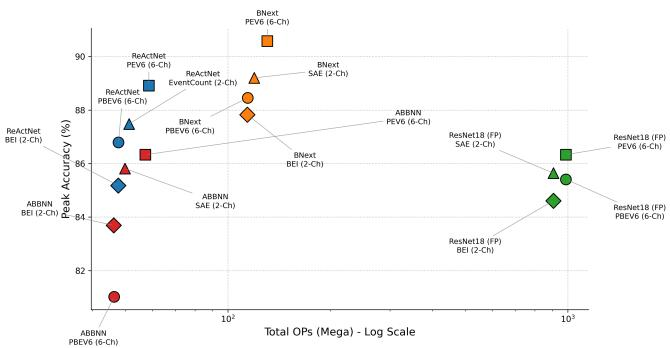
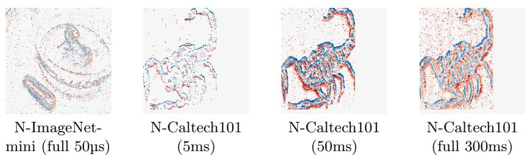
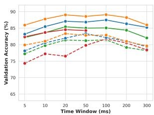
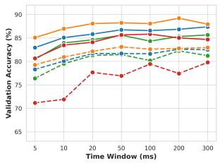
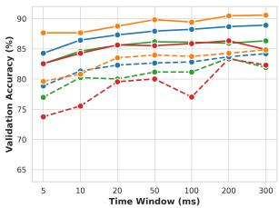
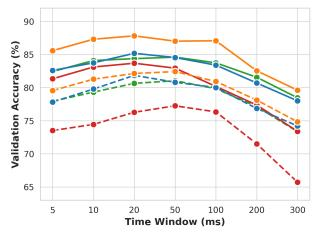
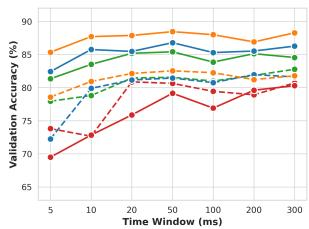

# Bringing BNNs to Fast Event Processing

Paul Longour1, Julien Moreau1 , and Franck Davoine2

1 Université de technologie de Compiègne, CNRS, Heudiasyc, Compiègne, France

{paul.longour, julien.moreau}@hds.utc.fr

2 CNRS, INSA Lyon, LIRIS, UMR5205, Villeurbanne, France franck.davoine@cnrs.fr

Abstract. Binary Neural Networks (BNNs) enable eficient deep learning deployment on resource constrained devices with weights and activations compressed to one bit, substantially reducing model size and inference cost. Event cameras ofer complementary advantages, including low latency, high dynamic range, and low power consumption, by capturing asynchronous streams of events rather than dense image frames. Despite their shared emphasis on eficiency, the combination of these technologies remains largely unexplored. This work aims at adapting and evaluating modern deep BNN architectures on event data. We also show that cross-modal pretraining from RGB data can improve the classification accuracy of BNNs on neuromorphic datasets. We introduce the Polarwise Binary Event Volume (PBEV), a binary representation that enables event-camera data to be processed directly by BNNs and represents a step toward fully binarized event-based vision systems. Best evaluated BNN on N-Caltech101 classification benchmarks shows 90.58% accuracy with 7.5× less operations than their full-precision counterparts.

Keywords: Binary neural network · Neuromorphic vision · Classification · Network quantization.

## 1 Introduction

Event cameras, also known as neuromorphic cameras, enable new vision capabilities by producing asynchronous, sparse streams of events rather than dense image frames captured at fixed rates. Ofering an ultra-low latency and a high dynamic range, event cameras show robustness in scenes with varying lighting conditions while requiring lower power consumption by avoiding redundant data [6]. Currently, there are two main ways to implement neural networks for event data. First are Spiking Neural Networks (SNN), which address the asynchronous and spike nature of the event flow but require specific neuromorphic hardware for deployment. Second are classic artificial and Convolutional Neural Networks (CNN), which rely on pseudo-frame generation from event accumulation, reducing the inherent ultra-low latency of the camera. Binary Neural Networks (BNN) ofer lighter models and lower power consumption, suiting embedded inference speeds and better preserving the events’ low-latency benefit. While progress has been made on BNNs, it remains unclear how they perform compared to classical

CNNs and SNNs on neuromorphic data. We evaluate accuracy and computational load of state-of-the-art binary and full precision architectures on event camera classification datasets across a range of accumulation windows and event representations (summarized in Figure 1).

  
Fig. 1: Classification accuracy on N-Caltech101 [29] vs. Total Operations. Markers for input representations: Best non-bin. 2-Ch (SAE / EventCount), PEV6 (non-bin. 6-Ch), BEI (bin. 2-Ch), and PBEV6 (bin. 6-Ch). Colors for model architectures: blue for ReActNet, orange for BNext, green for ResNet-18, and red for A&B BNN.

Our contributions can be listed as follows:

– We introduce a novel Polar-wise Binary Event Volume (PBEV) representation for events. It is an eficient way to represent an accumulation of events into a binary tensor for direct processing with binary models.

– We benchmark state-of-the-art deep convolutional BNNs on event-based classification through an extensive evaluation against a full-precision CNN baseline across multiple event representations and accumulation schemes, and position the results against literature CNN, SNN and transformer results on two datasets, N-Caltech101 [29] and N-ImageNet-mini [16].

– We analyse how representation, accumulation time, and cross-modal pretraining impact learning and generalization.

– We highlight how all tested BNN architectures can equal and surpass the full-precision CNN baseline ResNet-18 on event dataset, while requiring from 7× up to 21× less operations.

## 2 Related Work

## 2.1 Advances in Deep Binary Neural Networks

The primary appeal of these extremely compressed networks lies in their deployment eficiency and hardware compatibility, with real implementation on FPGA. A practical application of the state-of-the-art BNext model was deployed on an FPGA, achieving 72.6 FPS [40] inference for its small variant and an energy consumption below 19W (on ZCU102 FPGA).

Deep BNNs To scale BNNs to complex classification datasets, modern architectures have relied on the same core breakthroughs that advanced standard CNNs. For instance, residual connections [24] can propagate real-valued activations around binary convolution blocks, thereby mitigating the loss of representational capacity caused by binarization. Batch normalization [3,36] can improve optimization stability and control activation distributions during BNN training. By adapting these classical deep learning techniques, along with BNN-specific refinements like learnable threshold optimization [19, 22, 23] and knowledge distillation methods tuned to reduce BNNs overfitting [9], binary networks can now converge efectively on large-scale tasks.

Binarization has also been extended to transformer backbones, where the central dificulty is finding an accurate 1-bit encoding for the queries, keys and values inside attention [12, 18]. Binarization has even reached language processing, with BiBERT [32] yielding a fully binarized BERT, and complete Large Language Models built on binary operations [41].

Training BNN A major bottleneck remains training: most BNNs require substantially longer training to converge. BNNs usually rely on a 2 steps training protocol [24], the first one is to binarize only activations, then both activations and weights. [22] explain why Adam optimizer outperforms stochastic gradient descent on BNNs. The authors also study how training strategies afect the retention of the initial weight signs, using a correlation-to-initialization metric. Knowledge distillation [13] is a training strategy for a smaller student network to match a larger teacher’s soft output distribution rather than only the hard ground-truth labels, used in many BNN training pipelines. While 1-bit activations limit feature map expressivity, they also act as implicit regularization [9].

## 2.2 Deep Learning Models to process Events

Table 1 reports state-of-the-art classification results from events on N-Caltech101 and N-ImageNet datasets across various architecture types, namely CNN, Transformer, SNN, and Graph Convolutional Networks (GCN).

Neuromorphic Learning On suitable event-driven hardware, SNNs can replace many dense multiply–accumulate (MAC) operations with conditional synap tic accumulations triggered by spikes. Deep spiking CNNs like TMC [44] adds temporal calibration to increase temporal gradient diversity. SpiLiFormer [46] introduces a lateral inhibition mechanism into spiking transformers to reduce attention distraction towards irrelevant tokens.

To benefit from the huge quantity of static RGB images, many SNNs rely on transfer learning strategies. Works like [11] apply domain sliding training: training the spiking backbone initially on RGB data then progressively shifting the input distribution toward events, so that RGB learned representations carry over into the event data domain. Building on this mechanism, CKD [45] additionally distills logits from an RGB teacher. TMKT [43] interpolates RGB and event inputs as a curriculum to bridge the modality gap for domain alignment.

Table 1: State-of-the-Art Classification Performance on N-Caltech101 [29] and N-ImageNet [16]. For reported accuracy, Train/Val sets used by authors are not consistent.
<table><tr><td rowspan="2">Architecture type</td><td rowspan="2">Method / Model</td><td colspan="2">Accuracy (%)</td><td colspan="4">Timesteps Processing Resolution</td><td rowspan="2">Special training procedure</td></tr><tr><td>N-Caltech101</td><td>N-ImageNet</td><td></td><td>N-Caltech101 N-ImageNet</td><td></td><td>Backbone</td></tr><tr><td rowspan="3">CNN</td><td>EventDrop [8]</td><td>87.14</td><td></td><td></td><td>180 × 240</td><td></td><td>MobileNet-V2</td><td>Data augmentation</td></tr><tr><td>EventDrop [8]</td><td>85.15</td><td></td><td></td><td>180 × 240</td><td></td><td>ResNet-34</td><td>Data augmentation</td></tr><tr><td>ResNet-34 [16]</td><td>80.88</td><td>86.81 48.43 / - / -</td><td></td><td>240 × 304</td><td>224 × 224</td><td>ResNet-34</td><td>− / ImageNet pretrain / N-ImageNet pre.</td></tr><tr><td rowspan="6">Transformer</td><td>MEM [17]</td><td>85.60</td><td>57.89</td><td></td><td>224 × 224</td><td>224 × 224</td><td>ViT</td><td>Self supervised encoder</td></tr><tr><td>MEM-NImNet [17]</td><td>90.10</td><td></td><td></td><td>224 × 224</td><td></td><td>ViT</td><td>Self supervised after N-ImageNet pretrain</td></tr><tr><td>EventBind [47]</td><td>95.29</td><td>63.54</td><td></td><td>224 × 224</td><td>224 × 224</td><td>ViT-L/14</td><td>RGB-text-event CLIP contrastive learning</td></tr><tr><td>STP [21]</td><td>94.74</td><td>68.87</td><td></td><td>224 × 224</td><td>224 × 224</td><td>ViT-S/16</td><td>Event to RGB domain alignment</td></tr><tr><td>GEP [2]</td><td>93.05</td><td>65.11</td><td></td><td>224 × 224</td><td>224 × 224</td><td>ViT-S/16</td><td>DINOv2 contrastive learning and datasets fusion</td></tr><tr><td>GEP [2]</td><td>96.47</td><td>75.20</td><td></td><td>224 × 224</td><td>224 × 224</td><td>ViT-B/16</td><td>DINOv2 contrastive learning and datasets fusion</td></tr><tr><td rowspan="8">Spiking CNN</td><td>NDA [20]</td><td>83.70</td><td></td><td>10</td><td>128 × 128</td><td></td><td>VGG-SNN</td><td>Data augmentation</td></tr><tr><td>EventMix [39]</td><td>79.47</td><td></td><td>10</td><td>48 × 48</td><td></td><td></td><td>ResNet-18 SNN Data augmentation</td></tr><tr><td>Knowledge Transfer [11]</td><td>93.45</td><td></td><td>10</td><td>48 × 48</td><td></td><td>VGG-SNN</td><td>RGB to event sliding training</td></tr><tr><td>SMA-AZO-VGG [38]</td><td>84.60</td><td></td><td>14</td><td>180 × 240</td><td></td><td>VGG-SNN</td><td></td></tr><tr><td>CKD [45]</td><td>97.13</td><td></td><td>10</td><td>48 × 48</td><td></td><td>VGG-SNN</td><td>RGB to event sliding training</td></tr><tr><td>TMC [44]</td><td>86.03  / 88.24</td><td></td><td>10 / 16</td><td></td><td></td><td>VGG-SNN</td><td></td></tr><tr><td>TMKT [43]</td><td>97.93</td><td></td><td>10</td><td>48 × 48</td><td></td><td>VGG-SNN</td><td>Mixed RGB-event for domain alignment</td></tr><tr><td>Spiking Transformer SpiLiFormer [46]</td><td>89.18</td><td></td><td>16</td><td>128 × 128</td><td></td><td>Spiking ViT</td><td></td></tr><tr><td></td><td></td><td></td><td></td><td></td><td></td><td></td><td></td><td></td></tr><tr><td>GCN</td><td>AEGNN [37] EFGCN [15]</td><td>64.30 62.80</td><td></td><td>50 ms</td><td>2563 2563</td><td></td><td>SplineConv PointNetConv</td><td></td></tr></table>

Whether trained purely on events or from RGB, all of these networks remain spiking at inference and share the same bottleneck: the evaluated configurations commonly use 10–16 timesteps [20, 39, 44, 46], which increases the number of sequential updates and may raise latency and computational cost.

Full precision models To compensate for the scarcity of large-scale event datasets, the most performing methods adapt vision transformers with feature alignment from reference models trained on internet scale image data. Event-Bind [47] binds event, image and text embeddings for contrastive learning into a shared CLIP [33] space. EventBind reliance on a large CLIP ViT backbones may limit its suitability for resource constrained deployment. With even more compute resources, GEP [2] uses a similar technique to align an event encoder to a RGB foundation model (DINOv2) before training on the Event-1.8M, a dataset with 1.8M event-image pairs drawn from various representative neuromorphic datasets. These methods report among the highest published accuracies under their respective evaluation protocols (Table 1), but largely by inheriting the parameter count and pretraining cost of large RGB foundation models.

Other methods apply transfer learning, through simple weights pretraining, or domain alignment technique. Pretraining is used in [16, 17], with [16] applying also cross-modal pretraining from RGB. Domain alignment is adopted by STP [21], who freezes a RGB pretrained backbone and adds modules specialized for events to make the features compatible.

In addition, MEM [17] trains a variational autoencoder and employs a masked patches technique to self-supervise a ViT backbone for events from unlabeled data, before fine-tuning for classification.

GCNs have also been proposed to process events [15, 37]. They process the sparse flow in a spatio-temporal graph where each event is a vertex, avoiding a lossy compression to a pseudo-frame. Despite this advantage, processing a graph is heavier than classic networks layers, and GCNs are not as deep as CNNs.

## 2.3 Bridging BNNs and Event Vision

Despite the potential compatibility between binarized event representations and 1-bit neural architectures, the application of BNNs to neuromorphic vision is largely unexplored. Existing literature is limited to low-power applications such as 3-class parking lot monitoring [34] and denoising for pedestrian detection [4]. Prior binary event representations such as the Binary Event Image (BEI) [5] and the Binary Event History Image (BEHI) [42] binarize the input representation, but the subsequent neural processing is not necessarily fully binarized. We hypothesize that because event data natively represents event/no event per pixel and polarity, it can be encoded directly into dense binary formats. This lets a BNN ingest space-time event volumes natively, enabling the convolutional core to rely predominantly on XNOR–popcount operations.

## 3 Methodology

## 3.1 Datasets

Event datasets originate either from live recordings (unbiased but rare and taskspecific), from frame-to-event simulation (limited by the source camera’s dynamic range and frame interpolation noise), or from pan-tilt recordings of static images, which conveniently produce large annotated datasets with a real sensor at the cost of true object dynamics.

Here we use pan-tilt recordings that reproduce large and influent computer vision datasets. N-Caltech101 [29] is the event-based translation of Caltech101 [7] while N-ImageNet [16] is from ImageNet [35], N-ImageNet-mini is a 100-class subset from it. Datasets used in our benchmark are detailed in Table 2.

Table 2: Summary of used datasets. Occupancy ratio is defined as the average ratio of pixels triggering at least once during the full sequence over the number of pixels.
<table><tr><td>Dataset</td><td>Sample length Resolution # Classes # Train # Val Occupancy Mean # events</td><td></td><td></td><td></td><td></td><td></td><td></td></tr><tr><td>N-ImageNet-mini [16]</td><td>50 µs</td><td>640 × 480</td><td>100</td><td>129,496</td><td>5,101</td><td>0.22</td><td>103,911</td></tr><tr><td>N-Caltech101 [29]</td><td>300ms</td><td>240 × 180</td><td>101</td><td>7,000</td><td>1,709</td><td>0.41</td><td>115,610</td></tr></table>

These datasets have diferent characteristics. Although they contain approximately the same mean total number of events, N-ImageNet’s sensor has roughly seven times more pixels and samples are approximately 6,000 times shorter than N-Caltech101 ones, resulting in a lower occupancy ratio. N-Caltech101 is made to be processed with long accumulation times, it empirically provides too few events to be processed with durations below 5 ms. When observing accumulated pseudo-frames, N-ImageNet presents sparse and thin edges due to its very short sample length while N-Caltech101 provides denser renderings 2. The very short duration of N-ImageNet samples makes this dataset very challenging, but also a step to solve for low latency events processing with few aggregated events.

P. Longour et al.

  
Fig. 2: SAE representation (positive/negative channels merged into red/blue) of sameclass “scorpion” samples from N-ImageNet-mini and N-Caltech101.

## 3.2 Evaluated Architectures

We select three state-of-the-art deep convolutional BNNs originally applied to images and one full-precision CNN baseline for our comparisons. Following the knowledge distillation procedure to train BNNs (see section 2.1), we adopt Event-Bind [47], a state-of-the-art full-precision transformer, as the teacher. The networks are listed as follows and their complexity is reported in section 3.4.

ReActNet [22]: Built on the MobileNetV1 [14] pattern (without depthwise separable convolutions), it matches ResNet-18 on ImageNet (70.5%) at 22× fewer operations.

A&B BNN [25]: Designed strictly for hardware supporting only bitwise operations, attaining on ImageNet 66.89% accuracy. It builds upon BNN-BN [3] to fix bottlenecks related to heavy batch normalization.

BNext Small [9]: A more recent BNN reaching 76.1% accuracy on ImageNet. This model has been deployed into a FPGA at 72.6 FPS [40].

– ResNet-18 [10]: Evaluated as a standard, lightweight full-precision CNN baseline with 69.8 % accuracy on ImageNet.

– EventBind [47]: We employ ViT-L/14 backbone, used as the teacher model for knowledge distillation. As authors weights are not available, we trained it ourself and achieve 94.08% accuracy on the N-Caltech101 and 63.54% on N-ImageNet-mini validation split.

## 3.3 Polar-wise Binary Event Volume Representation

In recent BNN architectures, the first layer is kept in full precision. As a result, the number of floating-point operations (FLOPs) increases with the number of input channels. We adapt both the input representation and the network architectures by replacing this real-valued first layer with a binary layer, yielding binary-input variants of each network. This reduces computational overhead while leaving the remainder of the architecture unchanged. This design limits the increase in computational cost associated with higher-dimensional inputs.

To enable this fully binary input processing, we introduce the Polar-wise Binary Event Volume (PBEV) encoding. It consists of a stack of short timeslices formed into a 3D tensor with each polarity considered separately, similar to the polar-wise variant [31] of Event Volume [48] (PEV). In PBEV, each slice is coded strictly as a binary channel representing the presence or absence of events at a given position. Unlike a 2D BEI, the PBEV sub-samples the accumulation time window and preserves most of the temporal density of the event flow.

Let T be the full accumulation time, C the total number of channels, and $e ( x , y , t , p )$ the definition of an event at pixel coordinates $( x , y )$ . Event’s timestamp t is expressed relative to the observation window, such that $t \in [ 0 , T ]$ , while $p \in \{ - 1 , + 1 \}$ denotes event’s polarity. For $i \in [ [ 0 , \frac { C } { 2 } - 1 ] ]$ , the $i ^ { \mathrm { t h } }$ channel I and $( i + \frac { C } { 2 } ) ^ { \mathrm { t h } }$ channel J of the PBEV are defined as:

$$
\begin{array} { l } { \displaystyle \forall ( x , y ) \in I , I ( x , y ) { = } \left( \sum _ { t = i \cdot \frac { 2 T } { C } } ^ { ( i + 1 ) \cdot \frac { 2 T } { C } } e ( x , y , t , p = + 1 ) \right) > 0 , } \\ { \displaystyle \forall ( x , y ) \in J , J ( x , y ) { = } \left( \sum _ { t = i \cdot \frac { 2 T } { C } } ^ { ( i + 1 ) \cdot \frac { 2 T } { C } } e ( x , y , t , p = - 1 ) \right) > 0 } \end{array}
$$

## 3.4 Complexity Computation

Table 3: Comparison of network architectures in terms of parameters and operations, at 160 × 160 input resolution. All quantities are reported in Mega (M). Bin. input means binary input together with binarized convolutional layers.
<table><tr><td>Architecture</td><td colspan="9">Layers Channels Params (M)</td></tr><tr><td>EventBind (ViT-L/14)</td><td>36</td><td>3</td><td></td><td>902.26</td><td>I</td><td colspan="2">10,416,360</td><td colspan="2">10,416,360</td></tr><tr><td>ResNet-18</td><td>18</td><td>2 /6</td><td>11.23</td><td>11.24</td><td>-</td><td>907.32</td><td>987.60</td><td>907.32</td><td>987.60</td></tr><tr><td>BNext Small</td><td>28</td><td>2 /6</td><td>67.21</td><td>67.21</td><td>5,530</td><td>33.17</td><td>44.23</td><td>119.57</td><td>130.63</td></tr><tr><td>ReActNet</td><td>28</td><td>2/6</td><td>28.42</td><td>28.42</td><td>2,460</td><td>12.77</td><td>20.14</td><td>51.17</td><td>58.54</td></tr><tr><td>A&amp;B BNN</td><td>28</td><td>2/6</td><td>28.41</td><td>28.41</td><td>2,460</td><td>11.38</td><td>18.75</td><td>49.78</td><td>57.15</td></tr><tr><td>BNext Small (bin. input)</td><td>28</td><td>2 / 6</td><td>67.21</td><td>67.21</td><td>5,540</td><td>/5,550</td><td>27.64</td><td>114.13</td><td>114.30</td></tr><tr><td>ReActNet (bin. input)</td><td>28</td><td>2/6</td><td>28.42</td><td>28.42</td><td>2,460</td><td>2,470</td><td>9.08</td><td>47.54</td><td>47.66</td></tr><tr><td>A&amp;B BNN (bin. input)</td><td>28</td><td>2/6</td><td>28.41</td><td></td><td>28.41 2,460</td><td>/2,470</td><td>7.69</td><td>46.15</td><td>46.27</td></tr></table>

Network complexity is linked to the quantity of parameters and of operations. Operations OPs [27] combine binary and floating-point operations (FLOPs) following this formula: $\begin{array} { r } { O P s = B O P s / 6 4 + F L O P s } \end{array}$ . As shown in Table 3, binarizing the input layer makes a 6-channel binary-input variant cheaper than its own 2- channel full-precision-input counterpart (e.g. 48 vs. 51 M OPs for ReActNet), leaving the final linear layer as the only remaining source of real multiplications.

A&B BNN is built on top of ReActNet, having approximately the same number of parameters but replaces the multiplication operations with more eficient bit operations [25]: it drops batch normalization in favor of scaled weight standardization, absorbs the scaling activation multiplications into the sign function at inference, and constrains its PReLU slopes to integer powers of 2. For comparability, Table 3 counts these shift and addition operations as regular FLOPs, so the reported A&B BNN totals are a loose upper bound.

BNNs eficiency stands in contrast to state-of-the-art full-precision models like EventBind ViT-L/14, which demands over 902 M parameters and a staggering 10.4 TFLOPs. Even compared to advanced binary networks like BNext Small, which requires 67.21 M parameters and 120 M OPs.

We do not compare BNNs to SNNs complexity in this work, as most SNN reduce drastically the input resolution (see Table 1), lowering the number of parameters and operations. Also, the theoretical Synaptic Operations (SOP) proposed in [28] depends on the neurons firing rate, which is time-dependent.

## 4 Experiments

To assess the efectiveness of BNNs on event data, we benchmarked on the N-Caltech101 [29] and N-Imagenet-mini [16] classification datasets against the several architectures of Section 3.2 representing diferent eficiency and capability tradeofs. Beyond raw accuracy, our experiments aim to evaluate the adaptability of these models across varying event representations and accumulation times.

## 4.1 Evaluation metrics

We use the top-1 accuracy results to compare performance and compute the correlation-to-initialization (C2I) ratio for measuring the dependency between trained parameters and initialization as in [22]. The C2I ratio is defined as:

$$
\mathrm { C 2 I } = 1 - \frac { \sum _ { l = 1 } ^ { L } \sum _ { w \in W _ { l } } \mathrm { I _ { C 2 I } } } { N _ { \mathrm { t o t a l } } } , \mathrm { w i t h ~ I _ { C 2 I } } = \frac { | \mathrm { S i g n } ( w _ { \mathrm { f i n a l } } ) - \mathrm { S i g n } ( w _ { \mathrm { i n i t } } ) | _ { a b s } } { 2 }
$$

where $N _ { \mathrm { t o t a l } }$ is the total number of binary weights, and $w _ { \mathrm { f i n a l } } , w _ { \mathrm { i n i t } }$ the final and initial weights, respectively.

## 4.2 Event Representations

We compare four families of event encoders: density-based 2D histograms [26], time-based Surfaces of Active Events [1,30], 3D Event Volumes (or Voxels) [31], and binary representations as Binary Events presence Image [5] and proposed Polar-wise Binary Event Volume. The specific representations and configurations compared in our experiments are detailed in Table 4. Since binary convolutions are far cheaper than real-valued ones (Section 3.4), PBEV’s channel count can be scaled at minimal compute cost, enabling wide inputs with fast inference, whereas real-valued inputs scale poorly. We use 6 channels as a representative multi-bin setting, matched by the non-binary PEV6 for a direct comparison.

## 4.3 Implementation details

Data temporal sampling N-Caltech101 samples are 300 ms long. To probe the accuracy–latency trade-of we accumulate events over windows of 5, 10, 20, 50, 100, 200 and the full 300 ms. For a window shorter than the sample, events are taken from a sliding temporal window: at training time its start is sampled uniformly around the sample centre, providing an extra layer of temporal augmentation, whereas at test time the window is centered on the middle timestamp. The dataset is resized to 160×160 following [49]. We use the 8:2 train/validation split released by EventBind [47], which also serves as the test set as the dataset provides no separate test partition.

Table 4: Comparison of Event Data Representations and Settings. Binary representations are boldened. P, T, and D denote the encoding of Polarity, Time, and Density, respectively. Parentheses $( \checkmark )$ indicate partial or discretized encoding. A PBEV formulated with 2 channels is equivalent to the Binary Event Image.
<table><tr><td>Name</td><td colspan="2">Channels Description</td><td> $\overline { { \textbf { P textsubscript { T } } \textbf { D } } }$ </td><td></td></tr><tr><td>2D Histogram (EventCount) [26]</td><td>2</td><td>2D histogram of event counts, + and - separated</td><td> $\checkmark \quad \checkmark$ </td><td></td></tr><tr><td>Surface of Active Events  $\mathrm { ( S A \bar { E } ) \bar { \left[ 1 \right] } }$ </td><td>2</td><td>Time surface retaining most recent timestamps, + and - separated</td><td> $\checkmark ( \check { \mathbf { \zeta } } )$ </td><td></td></tr><tr><td>Polar-wise Event Volume  $\mathrm { { ( P E V ) } \phantom { \left[ 3 1 \right] } }$ </td><td>6</td><td>Time decayed events in 3D voxels, + and - separated</td><td> $\checkmark \checkmark ( \checkmark )$ </td><td></td></tr><tr><td>Binary Event Image (BEI) [5]</td><td>2</td><td>Boolean presence of events, + and - separated</td><td></td><td></td></tr><tr><td>Polar-wise Binary Event Volume (PBEV)</td><td>6</td><td>Event presence in 3D voxels, + and - separated (Section 3.3)</td><td> $\checkmark ( \check { \mathbf { \zeta } } )$ </td><td></td></tr></table>

For N-ImageNet-mini, we use the full $5 0 \mu s$ samples, resized to 224 × 224, with the authors’ train/validation splits. Validation used as test set.

Data augmentation Event data augmentation follows [20] with temporal flipping, 2D spatial rolling (up to ±20 px), rotation (up to ±30◦), horizontal shear (up to ±0.2 factor) and cutout (up to 16 px side length), applied on N-Caltech101 with a probability of 0.3, and spatial horizontal flipping and 2D spatial rolling (up to ±20 px) applied on the larger N-ImageNet-mini with a probability of 0.5.

Full-precision baseline training Training settings are chosen empirically using a grid search strategy, to optimize accuracy and avoid overfitting. The ResNet-18 baseline is trained for 200 epochs (100 on N-ImageNet-mini) with cross-entropy on the labels and Adam optimizer, a learning rate of $3 \times 1 0 ^ { - 3 }$ , a weight decay of $1 0 ^ { - 4 }$ and batch size of 128. We use a cosine-annealed learning rate with a 5-epoch linear warmup.

BNNs two-step training and knowledge distillation Each BNN follows a two-step schedule [27]. We run 200 epochs per step on N-Caltech101 and 100 epochs per step on N-ImageNet-mini to reduce computation time, at an initial learning rate of $1 0 ^ { - 2 }$ . Learning rate is instead set to $1 0 ^ { - 3 }$ for A&B BNN’s pretrained runs to limit optimization collapse. We did not use Adaptive Gradient Clipping from A&B BNN throughout: enabling it lowered accuracy on the representations and did not resolve the collapse. Following [22], ReActNet and A&B BNN use Adam with a step-1 weight decay of $5 \times 1 0 ^ { - 6 }$ , BNext Small uses AdamW with a diferentiated decay $( 1 0 ^ { - 3 }$ for real-valued and $1 0 ^ { - 8 }$ for binary parameters). The three BNNs are trained with knowledge distillation from an EventBind teacher [47] we trained ourselves (Section 3.2). We followed the distillation technique [13] with temperature scaling setting of $T ^ { 2 } = 2$ , without mixing ground-truth labels. All runs use a cosine-annealed learning rate with a 5-epoch linear warmup. All models are trained with a batch size of 128, except BNext for N-ImageNet-mini, where we used 64 to fit within the same 32GB memory.

Cross-modal Pretraining We adopt a direct weight warm-start initialization from RGB pretraining as experienced in [16] rather than feature alignment or distillation. Hence, models then skip the two-step schedule and train in a single binary stage (100 epochs) warm-started from RGB ImageNet weights: for 2- channel inputs we drop the first convolution’s green channel, and for 6-channel inputs we duplicate the three RGB channels. ResNet-18 is likewise initialized from ImageNet and trained for 100 epochs.

## 4.4 Classification results

Table 5: Classification accuracy (%) on N-Caltech101 validation set and Optimal Time Window (ms) Across all architectures and representations, from scratch and pretrained (ImageNet-initialised). Bold values indicate each model’s best-performing representation (scratch and pretrained considered separately). ∆ = pretrained − scratch, each at its own optimal time window.
<table><tr><td colspan="4">Binary Architectures</td><td rowspan="2">Full Precision Baseline ResNet-18 (FP)</td></tr><tr><td>Representation</td><td></td><td>A&amp;B BNN</td><td>BNext ReActNet</td></tr><tr><td rowspan="3">EventCount</td><td>scratch</td><td>81.73 (100 ms)</td><td>83.34 (20 ms)</td><td>83.34 (50 ms)</td></tr><tr><td>pretrained</td><td>84.55 (20 ms)</td><td>89.09 (100 ms)</td><td>81.45 (100 ms) 87.48 (100 ms) 85.41 (20 ms)</td></tr><tr><td>+2.82</td><td>+5.74</td><td>+4.14</td><td>+3.96</td></tr><tr><td rowspan="3">SAE</td><td>scratch</td><td>79.78 (300 ms)</td><td>83.11 (50 ms) 82.60 (200 ms)</td><td>82.25 (200 ms)</td></tr><tr><td>pretrained Δ</td><td>85.81 (100 ms)</td><td>89.20 (200 ms)</td><td>87.36 (300 ms) 85.64 (300 ms)</td></tr><tr><td>+6.03</td><td>+6.09</td><td>+4.77</td><td>+3.39</td></tr><tr><td rowspan="3">PEV6</td><td>scratch</td><td>83.34 (200 ms)</td><td>84.84 (300 ms) 84.20 (300 ms)</td><td>83.46 (200 ms)</td></tr><tr><td></td><td>pretrained 86.33 (200 ms)</td><td>90.58 (300 ms)</td><td>88.91 (300 ms)</td><td>86.33 (300 ms)</td></tr><tr><td>Δ</td><td>+2.99</td><td>+5.74</td><td>+4.71</td><td>+2.87</td></tr><tr><td rowspan="3">BEI (binary)</td><td>scratch</td><td>77.25 (50 ms)</td><td>82.42 (50 ms)</td><td>81.85 (20 ms)</td><td>81.05 (50 ms)</td></tr><tr><td>pretrained</td><td>83.69 (20 ms)</td><td>87.82 (20 ms)</td><td>85.18 (20 ms)</td><td>84.61 (50 ms)</td></tr><tr><td>Δ</td><td>+6.44</td><td>+5.40</td><td>+3.33</td><td>+3.56</td></tr><tr><td rowspan="3">PBEV6 (binary) pretrained</td><td>scratch</td><td>80.87 (20 ms)</td><td>82.54 (50 ms)</td><td>81.96 (200 ms)</td><td>82.77 (300 ms)</td></tr><tr><td></td><td>80.30 (300 ms)</td><td>88.45 (50 ms)</td><td>86.79 (50 ms)</td><td>85.41 (50 ms)</td></tr><tr><td>Δ</td><td>-0.57</td><td>+5.92</td><td>+4.82</td><td>+2.64</td></tr></table>

Results for chosen architectures (Section 3.2) and event representations (Section 4.2) are given in Table 5 (N-Caltech101) and Table 6 (N-ImageNet-mini). To simplify, they show only the best accuracy across accumulation times for each setup, that would be elected for deployment without latency consideration. As a complement, Fig. 3 illustrates the full N-Caltech101 performance trajectories.

Accuracy when trained from scratch As the accumulation window increases, the models ingest more contextual information, often leading to higher classification accuracy on N-Caltech101 (Table 5), but representations difer in efectively using that extra time, as illustrated in Figure 3. The BEI, that discards events timing and density, saturates early: it peaks at short windows (best 82.42% at 50 ms with BNext, and as early as 20 ms for ReActNet) and then degrades. But overall, it ofers the lowest accuracies. Conversely, the 6 bins temporal volume PEV6, able to keep most of events timing and density, keeps improving up to the full extract, reaching the overall best result for every backbone (84.84% at 300 ms with BNext). EventCount, PBEV6 and SAE, all dropping either the events density or timing, sit between these extremes, each within roughly two points of the PEV6 optimum at their own best time window (83.34% at 20ms, 82.54% at 50ms and 83.11% at 50ms respectively, all with BNext). Unlike PEV6, the related PBEV6 representation stops improving with the longest accumulation times. For a single shot, end-to-end latency is the accumulation window plus one forward pass, so this window choice sets the latency.

  
(a) Event Count

  
(b) SAE

  
(c) PEV6

  
(d) BEI (binary)

  
(e) PBEV6 (binary)

<table><tr><td colspan="8">Architecture (dashed = scratch, solid = pretrained)</td></tr><tr><td>---- ResNet18 (FP) — scratch</td><td></td><td>--- ABBNN (Binary) — scratch</td><td></td><td>---- ReactNet (Binary) — scratch</td><td></td><td></td><td> --- BNext (Binary) — scratch</td></tr><tr><td> ResNet18 (FP) — pretrained</td><td></td><td>ABBNN (Binary) — pretrained</td><td></td><td>—— ReactNet (Binary) — pretrained</td><td></td><td></td><td> BNext (Binary) — pretrained</td></tr></table>

Fig. 3: Validation N-Caltech101 set accuracy vs. time window for various event representations. The colour mapping denotes the diferent network architectures.

Comparing N-Caltech101 and N-ImageNet-mini (Table 6), this ranking inverts. For the N-ImageNet-mini very short samples duration, the 6 bins representations not only loose their advantages in time encoding, they also drastically reduce the final accuracies. PEV6, while being the best encoder for every backbone on N-Caltech101, collapses on N-ImageNet-mini, most severely for ResNet-18 whose accuracy falls to 28.14% (the worst of all). The dense two-channels EventCount and SAE are the strongest representations for N-ImageNet-mini, achieving respectively 47.86% and 43.62% accuracy with BNext, again the best backbone. This shows that for ultra short accumulation times (i.e. sparse samples as sown in Figure 2), we shall consider to simplify the input representation and drop events timing or density, allowing for denser channels. Compared to N-Caltech101, the lower best scratch accuracies illustrate how N-ImageNet-mini is harder to process. Distilled binary networks already match or exceed the fullprecision baseline from scratch on both datasets, with BNext leading on both.

Table 6: N-ImageNet-mini validation accuracy (%), from scratch and pretrained (ImageNet-initialised) models. Bold values indicate best representation per architecture (scratch and pretrained considered separately). ∆ = pretrained − scratch. † denotes a failed training.
<table><tr><td colspan="2">Representation</td><td colspan="3">Binary Architectures A&amp;B BNN BNext ReActNet</td><td>Full Precision Baseline ResNet-18 (FP)</td></tr><tr><td rowspan="3">EventCount</td><td>scratch</td><td>39.62</td><td>47.86</td><td>40.02</td><td>43.96</td></tr><tr><td>pretrained</td><td>1.00†</td><td>50.16</td><td>48.38</td><td>46.94</td></tr><tr><td>Δ</td><td>-38.62</td><td>+2.30</td><td>+8.36</td><td>+2.98</td></tr><tr><td rowspan="3">SAE</td><td>scratch</td><td>44.74</td><td>43.62</td><td>39.74</td><td>41.32</td></tr><tr><td>pretrained</td><td>46.20</td><td>48.62</td><td>46.84</td><td>45.64</td></tr><tr><td>Δ</td><td>+1.46</td><td>+5.00</td><td>+7.10</td><td>+4.32</td></tr><tr><td rowspan="3">PEV6</td><td>scratch</td><td>37.06</td><td>36.96</td><td>35.36</td><td>28.14</td></tr><tr><td>pretrained</td><td>41.24</td><td>49.78</td><td>48.06</td><td>36.82</td></tr><tr><td> $\varDelta$ </td><td>+4.18</td><td>+12.82</td><td>+12.70</td><td>+8.68</td></tr><tr><td rowspan="3">BEI (binary)</td><td>scratch</td><td>35.04</td><td>41.00</td><td>36.20</td><td>39.74</td></tr><tr><td>pretrained</td><td>41.86</td><td>45.50</td><td>44.54</td><td>43.16</td></tr><tr><td> $\varDelta$ </td><td>+6.82</td><td>+4.50</td><td>+8.34</td><td>+3.42</td></tr><tr><td rowspan="3">PBEV6 (binary) pretrained</td><td>scratch</td><td>36.80</td><td>37.70</td><td>36.30</td><td>29.32</td></tr><tr><td></td><td>40.90</td><td>45.22</td><td>46.20</td><td>33.10</td></tr><tr><td> $\varDelta$ </td><td>+4.10</td><td>+7.52</td><td>+9.90</td><td>+3.78</td></tr></table>

Efect of cross-modal pretraining Fig. 3 shows pretrained models surpass scratch training for every time window, representation and architecture except A&B BNN with PBEV6. Tables 5 and 6 report the gain ∆ per representation and architecture, each at its own optimal window: binary networks exploit the pretrained initialization more than the full-precision baseline does. On N-Caltech101, BNext benefits the most and most consistently (+5.40 to +6.09), ahead of ReActNet (+3.33 to +4.82), itself ahead of the full-precision ResNet-18 baseline (+2.64 to +3.96). A&B BNN pretrained on EventCount is the exception: it collapses at long accumulation windows, falling to 27.63% and below from 100ms. Its architecture uses scaled weight standardization rather than batch normalization, so once pretrained it has no activation normalization to absorb EventCount’s raw magnitude, which grows with the accumulation window.

N-ImageNet-mini shows similar gains, with a bigger step up for PEV6 and PBEV6, and higher relative benefits for ReActNet than BNext. A&B BNN gains are lower and it collapses again with EventCount. These rankings are consistent with the architectures’ designs. Binarization lets all three BNNs aford deeper networks than ResNet-18 at a fraction of its cost (Table 3). Among BNNs, BNext extends and invests over twice ReActNet’s parameters and operations, while A&B BNN trades accuracy and training stability for hardware-oriented simplifications, notably the removal of batch normalization.

Binary representations: accuracy and eficiency Binary inputs are competitive with most state-of-the-art methods on N-Caltech101 (Table 1), with the proposed PBEV6 slightly ahead of BEI (Table 5). PBEV6 with BNext (88.45%) or ReActNet (86.79%) surpasses the best full-precision ResNet-18 result (best at

86.33% with PEV6) at an 8.6× eficiency gain. PBEV6 does not behave exactly as PEV6 on longer time windows, preventing it to reach as good accuracies (in Figure 3, PBEV6 looses accuracy from 100ms). Despite this, from 10 to 50 ms accumulation times, PBEV6 results are equivalent to SAE and Event-Count and closer to PEV6, while allowing for binary input layers, making it the best choice when shorter latencies are required. On N-ImageNet-mini, however, the very short samples coded as PBEV6 do not carry enough information to match the best representations (SAE and EventCount). Binary inputs remain attractive because they are extremely cheap to generate, let the binary networks themselves stay lighter and eficient with short time windows, even lighter than the 2-channels non-binary representations such as SAE and Event-Count (Table 3). They suit constrained hardware and gives a favorable accuracy/complexity trade-of (Fig. 1).

## 4.5 Initialization retention analysis

From scratch, each binary network’s final signs are uncorrelated with its own random initialization. Table 7 shows every architecture sitting at the 0.5 floor on both datasets. Training therefore fully discards and is independent from the random starting point. With RGB pretraining, final signs remain correlated with the initialization. Table 7 shows C2I rising to 0.73–0.88 for every architecture on both datasets, well above the scratch floor. A&B BNN’s collapsed N-Caltech101 cells depart from this range instead, reaching 0.995: training there leaves the backbone frozen at its pretrained starting point rather than adjusting it.

Table 7: C2I ratio of the binary weights, (mean±std over the run grid). A&B BNN’s N-ImageNet-mini pretrained mean excludes EventCount (failed run).
<table><tr><td rowspan="2">Architecture</td><td colspan="2">N-ImageNet-mini</td><td colspan="2">N-Caltech101</td></tr><tr><td>scratch</td><td>pretrained</td><td>scratch</td><td>pretrained</td></tr><tr><td>A&amp;B BNN</td><td></td><td>0.500 ±0.000 0.726 ±0.002 0.500 ±0.0040.875 ±0.004</td><td></td><td></td></tr><tr><td>BNext</td><td></td><td>0.504 ±0.002 0.768 ±0.002 0.508 ±0.002 0.830 ±0.002</td><td></td><td></td></tr><tr><td>ReActNet</td><td>0.500 ±0.000 0.780 ±0.000 0.500 ±0.000 0.774 ±0.002</td><td></td><td></td><td></td></tr></table>

## 4.6 Theoretical computation time

We do not measure on-device latency in this work, but we report the existing Xilinx ZCU 102 FPGA board implementation of BNext that sustains 72.6 FPS [40], that is an estimated ≈14 ms per inference. According to Table 3, BNext Small is the heaviest BNN compared in our benchmark, so we can expect even faster inference for ReActNet and A&B BNN.

We report also the GCN EFGCN [15], which processes events as point clouds and measures between 4.4 to 9.3 ms per inference on a ZCU104 SoC FPGA. This performance comes at a real accuracy cost, reaching between 62.8 to 64.1% accuracy on N-Caltech101, 20 points below the BNNs at similar 50 ms accumulation windows. For real implementations, pseudo-frame representations competitive at short time windows are attractive for low latency neuromorphic vision systems.

## 5 Conclusion

We show that modern Binary Neural Networks can match or exceed full-precision accuracy on event-camera data while substantially cutting computational cost, when trained with knowledge distillation from a strong teacher and cross-modal pretraining. Under this regime, BNNs outperform ResNet-18 on N-Caltech101 (90.58% accuracy with a non-binary 6-channel input at 7.5× fewer operations, up to 21× fewer for our binary-input configurations) and likewise outperform the full-precision baseline on the harder N-ImageNet-mini. Our Polar-wise Binary Event Volume and fully binary input blocks extend binarization to the input layer, letting a six-channel representation require fewer operations than a conventional two-channel input on an unmodified BNN. We further find that the best event representation depends primarily on the sensor’s event-density and accumulation regime rather than on architecture alone, and that RGB-pretrained weights ofer a useful prior that binary networks retain and exploit.

However, our evaluation is limited to classification on pan-tilt recordings of static scenes, with complexity estimated theoretically rather than measured on target hardware. Future work should focus on natural event recordings, measure on-device latency and energy consumption, further explore the capabilities of binary input representations, improve the robustness and generalization of binary models, and extend the approach to tasks such as object detection. Together, these are steps toward low-latency, resource-eficient neuromorphic vision.

## Acknowledgment

This research is part of the REVE-BNN project, funded by the French National Agency (ANR-24-CE33-4001), and was provided with computing HPC and storage resources by GENCI at IDRIS thanks to the grant 2025-AD011014065R2 on the supercomputer Jean Zay’s V100 partition.

## References

1. Alzugaray, I., Chli, M.: ACE: an eficient asynchronous corner tracker for event cameras. In: 3DV. pp. 653–661. IEEE Computer Society (2018)

2. Cao, J., Xing, J., Messikommer, N., Scaramuzza, D.: Generative event pretraining with foundation model alignment. In: Proceedings of the IEEE/CVF Conference on Computer Vision and Pattern Recognition (2026)

3. Chen, T., Zhang, Z., Ouyang, X., Liu, Z., Shen, Z., Wang, Z.: "BNN - BN = ?": Training binary neural networks without batch normalization. In: IEEE Conference on Computer Vision and Pattern Recognition Workshops, CVPR

Workshops 2021, virtual, June 19-25, 2021. pp. 4619–4629. Computer Vision Foundation / IEEE (2021). https://doi.org/10.1109/CVPRW53098.2021.00520, https://openaccess.thecvf.com/content/CVPR2021W/BiVision/html/Chen BNN\_-\_BN Training\_Binary\_Neural\_Networks\_Without\_CVPRW 2021\_paper.html

4. Cladera, F., Bisulco, A., Kepple, D., Isler, V., Lee, D.D.: On-device event filtering with binary neural networks for pedestrian detection using neuromorphic vision sensors. In: 2020 IEEE International Conference on Image Processing (ICIP). pp. 3084–3088 (2020). https://doi.org/10.1109/ICIP40778.2020.9191148

5. Cohen, G., Afshar, S., Orchard, G., Tapson, J., Benosman, R., van Schaik, A.: Spatial and temporal downsampling in event-based visual classification. IEEE Transactions on Neural Networks and Learning Systems 29(10), 5030–5044 (2018). https://doi.org/10.1109/TNNLS.2017.2785272

6. Falanga, D., Kleber, K., Scaramuzza, D.: Dynamic obstacle avoidance for quadrotors with event cameras. Science Robotics 5(40), eaaz9712 (2020). https://doi. org/10.1126/scirobotics.aaz9712, https://www.science.org/doi/abs/10.1126/ scirobotics.aaz9712

7. Fei-Fei, L., Fergus, R., Perona, P.: Learning generative visual models from few training examples: An incremental bayesian approach tested on 101 object categories. Computer Vision and Image Understanding 106(1), 59–70 (2007). https: //doi.org/10.1016/j.cviu.2005.09.012, https://www.sciencedirect.com/science/ article/pii/S1077314206001688, special issue on Generative Model Based Vision

8. Gu, F., Sng, W., Hu, X., Yu, F.: EventDrop: data augmentation for event-based learning. In: Zhou, Z.H. (ed.) Proceedings of the Thirtieth International Joint Conference on Artificial Intelligence, IJCAI-21. pp. 700–707. International Joint Conferences on Artificial Intelligence Organization (8 2021). https://doi.org/10. 24963/ijcai.2021/97

9. Guo, N., Bethge, J., Meinel, C., Yang, H.: Join the high accuracy club on ImageNet with A binary neural network ticket. CoRR abs/2211.12933 (2022). https://doi. org/10.48550/ARXIV.2211.12933

10. He, K., Zhang, X., Ren, S., Sun, J.: Deep residual learning for image recognition. In: 2016 IEEE Conference on Computer Vision and Pattern Recognition, CVPR 2016, Las Vegas, NV, USA, June 27-30, 2016. pp. 770–778. IEEE Computer Society (2016). https://doi.org/10.1109/CVPR.2016.90

11. He, X., Dongcheng, Z., Li, Y., Shen, G., Kong, Q., Zeng, Y.: An eficient knowledge transfer strategy for spiking neural networks from static to event domain. Proceedings of the AAAI Conference on Artificial Intelligence 38, 512–520 (03 2024). https://doi.org/10.1609/aaai.v38i1.27806

12. He, Y., Lou, Z., Zhang, L., Liu, J., Wu, W., Zhou, H., Zhuang, B.: BiViT: Extremely compressed binary vision transformers. In: IEEE/CVF International Conference on Computer Vision, ICCV 2023, Paris, France, October 1-6, 2023. pp. 5628–5640. IEEE (2023). https://doi.org/10.1109/ICCV51070.2023.00520

13. Hinton, G., Vinyals, O., Dean, J.: Distilling the knowledge in a neural network (2015), https://arxiv.org/abs/1503.02531

14. Howard, A.G., Zhu, M., Chen, B., Kalenichenko, D., Wang, W., Weyand, T., Andreetto, M., Adam, H.: MobileNets: eficient convolutional neural networks for mobile vision applications (2017), https://arxiv.org/abs/1704.04861

15. Jeziorek, K., Wzorek, P., Błachut, K., Pinna, A., Kryjak, T.: Embedded graph convolutional networks for real-time event data processing on SoC FPGAs. Journal of Systems Architecture 177, 103850 (2026). https://doi.org/10.1016/j.sysarc.2026. 103850, https://www.sciencedirect.com/science/article/pii/S1383762126001682

16. Kim, J., Bae, J., Park, G., Zhang, D., Kim, Y.M.: N-ImageNet: Towards robust, fine-grained object recognition with event cameras. In: 2021 IEEE/CVF International Conference on Computer Vision, ICCV 2021, Montreal, QC, Canada, October 10-17, 2021. pp. 2126–2136. IEEE (2021). https://doi.org/10.1109/ICCV48922. 2021.00215

17. Klenk, S., Bonello, D., Koestler, L., Araslanov, N., Cremers, D.: Masked event modeling: Self-supervised pretraining for event cameras. In: 2024 IEEE/CVF Winter Conference on Applications of Computer Vision (WACV). pp. 2367–2377 (2024). https://doi.org/10.1109/WACV57701.2024.00237

18. Le, P.C., Li, X.: BinaryViT: Pushing binary vision transformers towards convolutional models. In: IEEE/CVF Conference on Computer Vision and Pattern Recognition, CVPR 2023 - Workshops, Vancouver, BC, Canada, June 17-24, 2023. pp. 4665–4674. IEEE (2023). https://doi.org/10.1109/CVPRW59228.2023.00492

19. Lee, C., Kim, H., Park, E., Kim, J.: INSTA-BNN: binary neural network with instance-aware threshold. In: IEEE/CVF International Conference on Computer Vision, ICCV 2023, Paris, France, October 1-6, 2023. pp. 17279–17288. IEEE (2023). https://doi.org/10.1109/ICCV51070.2023.01589

20. Li, Y., Kim, Y., Park, H., Geller, T., Panda, P.: Neuromorphic data augmentation for training spiking neural networks. In: Avidan, S., Brostow, G.J., Cissé, M., Farinella, G.M., Hassner, T. (eds.) Computer Vision - ECCV 2022 - 17th European Conference, Tel Aviv, Israel, October 23-27, 2022, Proceedings, Part VII. Lecture Notes in Computer Science, vol. 13667, pp. 631–649. Springer (2022). https://doi. org/10.1007/978-3-031-20071-7\_37

21. Liang, Q., Li, Q., Liu, S., Cao, X., Lu, J., Yang, F., Zhang, W., Huang, K., Tian, Y.: Eficient event camera data pretraining with adaptive prompt fusion. In: Proceedings of the IEEE/CVF International Conference on Computer Vision (ICCV). pp. 8656–8667 (October 2025)

22. Liu, Z., Shen, Z., Li, S., Helwegen, K., Huang, D., Cheng, K.: How do Adam and training strategies help BNNs optimization. In: Meila, M., Zhang, T. (eds.) Proceedings of the 38th International Conference on Machine Learning, ICML 2021, 18-24 July 2021, Virtual Event. Proceedings of Machine Learning Research, vol. 139, pp. 6936–6946. PMLR (2021), http://proceedings.mlr.press/v139/liu21t. html

23. Liu, Z., Shen, Z., Savvides, M., Cheng, K.: ReActNet: Towards precise binary neural network with generalized activation functions. In: Vedaldi, A., Bischof, H., Brox, T., Frahm, J. (eds.) Computer Vision - ECCV 2020 - 16th European Conference, Glasgow, UK, August 23-28, 2020, Proceedings, Part XIV. Lecture Notes in Computer Science, vol. 12359, pp. 143–159. Springer (2020). https://doi.org/10.1007/978-3-030-58568-6\_9

24. Liu, Z., Wu, B., Luo, W., Yang, X., Liu, W., Cheng, K.: Bi-Real Net: Enhancing the performance of 1-bit CNNs with improved representational capability and advanced training algorithm. In: Ferrari, V., Hebert, M., Sminchisescu, C., Weiss, Y. (eds.) Computer Vision - ECCV 2018 - 15th European Conference, Munich, Germany, September 8-14, 2018, Proceedings, Part XV. Lecture Notes in Computer Science, vol. 11219, pp. 747–763. Springer (2018). https://doi.org/10.1007/978-3- 030-01267-0\_44

25. Ma, R., Qiao, G., Liu, Y., Meng, L., Ning, N., Liu, Y., Hu, S.: A&B BNN: add&bitoperation-only hardware-friendly binary neural network. In: IEEE/CVF Conference on Computer Vision and Pattern Recognition, CVPR 2024, Seattle, WA,

USA, June 16-22, 2024. pp. 5704–5713. IEEE (2024). https://doi.org/10.1109/ CVPR52733.2024.00545

26. Maqueda, A.I., Loquercio, A., Gallego, G., Garcia, N., Scaramuzza, D.: Eventbased vision meets deep learning on steering prediction for self-driving cars. In: 2018 IEEE/CVF Conference on Computer Vision and Pattern Recognition. p. 5419–5427. IEEE (Jun 2018). https://doi.org/10.1109/cvpr.2018.00568

27. Martínez, B., Yang, J., Bulat, A., Tzimiropoulos, G.: Training binary neural networks with real-to-binary convolutions. In: 8th International Conference on Learning Representations, ICLR 2020, Addis Ababa, Ethiopia, April 26-30, 2020. Open-Review.net (2020), https://openreview.net/forum?id=BJg4NgBKvH

28. Merolla, P.A., Arthur, J.V., Alvarez-Icaza, R., Cassidy, A.S., Sawada, J., Akopyan, F., Jackson, B.L., Imam, N., Guo, C., Nakamura, Y., Brezzo, B., Vo, I., Esser, S.K., Appuswamy, R., Taba, B., Amir, A., Flickner, M.D., Risk, W.P., Manohar, R., Modha, D.S.: A million spiking-neuron integrated circuit with a scalable communication network and interface. Science 345(6197), 668–673 (2014). https: //doi.org/10.1126/science.1254642, https://www.science.org/doi/abs/10.1126/ science.1254642

29. Orchard, G., Jayawant, A., Cohen, G.K., Thakor, N.: Converting static image datasets to spiking neuromorphic datasets using saccades. Frontiers in Neuroscience 9 (2015). https://doi.org/10.3389/fnins.2015.00437, https://www. frontiersin.org/journals/neuroscience/articles/10.3389/fnins.2015.00437

30. Park, P.K.J., Cho, B.H., Park, J.M., Lee, K., Kim, H.Y., Kang, H.A., Lee, H.G., Woo, J., Roh, Y., Lee, W.J., Shin, C.W., Wang, Q., Ryu, H.: Performance improvement of deep learning based gesture recognition using spatiotemporal demosaicing technique. In: 2016 IEEE International Conference on Image Processing (ICIP). pp. 1624–1628 (2016). https://doi.org/10.1109/ICIP.2016.7532633

31. Perot, E., de Tournemire, P., Nitti, D., Masci, J., Sironi, A.: Learning to detect objects with a 1 megapixel event camera. In: Larochelle, H., Ranzato, M., Hadsell, R., Balcan, M., Lin, H. (eds.) Advances in Neural Information Processing Systems. vol. 33, pp. 16639–16652. Curran Associates, Inc. (2020), https : / / proceedings . neurips . cc / paper \_ files / paper / 2020 / file / c213877427b46fa96cf6c39e837ccee-Paper.pdf

32. Qin, H., Ding, Y., Zhang, M., Yan, Q., Liu, A., Dang, Q., Liu, Z., Liu, X.: BiBERT: Accurate fully binarized BERT. In: The Tenth International Conference on Learning Representations, ICLR 2022, Virtual Event, April 25-29, 2022. OpenReview.net (2022), https://openreview.net/forum?id=5xEgrl\_5FAJ

33. Radford, A., Kim, J.W., Hallacy, C., Ramesh, A., Goh, G., Agarwal, S., Sastry, G., Askell, A., Mishkin, P., Clark, J., Krueger, G., Sutskever, I.: Learning transferable visual models from natural language supervision. In: Meila, M., Zhang, T. (eds.) Proceedings of the 38th International Conference on Machine Learning. Proceedings of Machine Learning Research, vol. 139, pp. 8748–8763. PMLR (18–24 Jul 2021), https://proceedings.mlr.press/v139/radford21a.html

34. Rusci, M., Rossi, D., Flamand, E., Gottardi, M., Farella, E., Benini, L.: Always-ON visual node with a hardware-software event-based binarized neural network inference engine. In: Proceedings of the 15th ACM International Conference on Computing Frontiers. p. 314–319. CF ’18, Association for Computing Machinery, New York, NY, USA (2018). https://doi.org/10.1145/3203217.3204463

35. Russakovsky, O., Deng, J., Su, H., Krause, J., Satheesh, S., Ma, S., Huang, Z., Karpathy, A., Khosla, A., Bernstein, M., Berg, A.C., Fei-Fei, L.: ImageNet Large

Scale Visual Recognition Challenge. International Journal of Computer Vision (IJCV) 115(3), 211–252 (2015). https://doi.org/10.1007/s11263-015-0816-y

36. Sari, E., Belbahri, M., Nia, V.P.: How does batch normalization help binary training? (2020), https://arxiv.org/abs/1909.09139

37. Schaefer, S., Gehrig, D., Scaramuzza, D.: AEGNN: asynchronous event-based graph neural networks. In: 2022 IEEE/CVF Conference on Computer Vision and Pattern Recognition (CVPR). pp. 12361–12371 (2022). https://doi.org/10.1109/ CVPR52688.2022.01205

38. Shan, Y., Zhang, M., Zhu, R., Qiu, X., Eshraghian, J.K., Qu, H.: Advancing spiking neural networks towards multiscale spatiotemporal interaction learning. In: Walsh, T., Shah, J., Kolter, Z. (eds.) Thirty-Ninth AAAI Conference on Artificial Intelligence, Thirty-Seventh Conference on Innovative Applications of Artificial Intelligence, Fifteenth Symposium on Educational Advances in Artificial Intelligence, AAAI 2025, Philadelphia, PA, USA, February 25 - March 4, 2025. pp. 1501–1509. AAAI Press (2025). https://doi.org/10.1609/AAAI.V39I2.32141

39. Shen, G., Zhao, D., Zeng, Y.: EventMix: an eficient data augmentation strategy for event-based learning. Information Sciences 644, 119170 (2023). https://doi. org/10.1016/j.ins.2023.119170, https://www.sciencedirect.com/science/article/ pii/S0020025523007557

40. Wan, R., Cen, R., Zhang, D., Wang, D.: LDF-BNN: a real-time and high-accuracy binary neural network accelerator based on the improved BNext. Micromachines 15, 1265 (10 2024). https://doi.org/10.3390/mi15101265

41. Wang, H., Ma, S., Ma, L., Wang, L., Wang, W., Dong, L., Huang, S., Wang, H., Xue, J., Wang, R., Wu, Y., Wei, F.: BitNet: 1-bit pre-training for large language models. Journal of Machine Learning Research 26(125), 1–29 (2025), http://jmlr. org/papers/v26/24-2050.html

42. Wang, Z., Cladera, F., Bisulco, A., Lee, D., Taylor, C.J., Daniilidis, K., Hsieh, M.A., Lee, D.D., Isler, V.: EV-Catcher: High-speed object catching using lowlatency event-based neural networks. IEEE Robotics and Automation Letters 7(4), 8737–8744 (2022). https://doi.org/10.1109/LRA.2022.3188400

43. Xie, Y., Ye, S., Yu, Y., Wang, C., Zhang, Q., Xu, J., Shen, L., Qian, Y., Qian, J., Li, G.: Breaking the modality wall: Time-step mixup for eficient spiking knowledge transfer from static to event domain. CoRR abs/2511.12150 (2025). https://doi. org/10.48550/ARXIV.2511.12150

44. Yan, J., Wang, C., Ma, D., Tang, H., Zheng, Q., Pan, G.: Training high performance spiking neural network by temporal model calibration. In: Singh, A., Fazel, M., Hsu, D., Lacoste-Julien, S., Berkenkamp, F., Maharaj, T., Wagstaf, K., Zhu, J. (eds.) Proceedings of the 42nd International Conference on Machine Learning. Proceedings of Machine Learning Research, vol. 267, pp. 70289–70308. PMLR (13– 19 Jul 2025), https://proceedings.mlr.press/v267/yan25c.html

45. Ye, S., Qian, Y., Wang, C., Lin, S., Xu, J., Qian, J., Li, Y.: Cross knowledge distillation between artificial and spiking neural networks. In: 2025 IEEE International Conference on Multimedia and Expo (ICME). pp. 1–6 (2025). https: //doi.org/10.1109/ICME59968.2025.11209488

46. Zheng, Z., Huang, Y., Yu, Y., Zhu, Z., Tang, J., Yu, Z., Jin, Y.: SpiLiFormer: enhancing spiking transformers with lateral inhibition. In: Proceedings of the IEEE/CVF International Conference on Computer Vision. pp. 24539–24548 (2025)

47. Zhou, J., Zheng, X., Lyu, Y., Wang, L.: EventBind: Learning a unified representation to bind them all for event-based open-world understanding. In: Leonardis, A., Ricci, E., Roth, S., Russakovsky, O., Sattler, T., Varol, G. (eds.) Computer Vision

- ECCV 2024 - 18th European Conference, Milan, Italy, September 29-October 4, 2024, Proceedings, Part LXX. Lecture Notes in Computer Science, vol. 15128, pp. 477–494. Springer (2024). https://doi.org/10.1007/978-3-031-72897-6\_27

48. Zhu, A.Z., Yuan, L., Chaney, K., Daniilidis, K.: Unsupervised event-based learning of optical flow, depth, and egomotion. In: 2019 IEEE/CVF Conference on Computer Vision and Pattern Recognition (CVPR). pp. 989–997 (2019). https: //doi.org/10.1109/CVPR.2019.00108

49. Zubić, N., Gehrig, D., Gehrig, M., Scaramuzza, D.: From chaos comes order: Ordering event representations for object recognition and detection. In: 2023 IEEE/CVF International Conference on Computer Vision (ICCV). pp. 12800–12810 (2023). https://doi.org/10.1109/ICCV51070.2023.01180