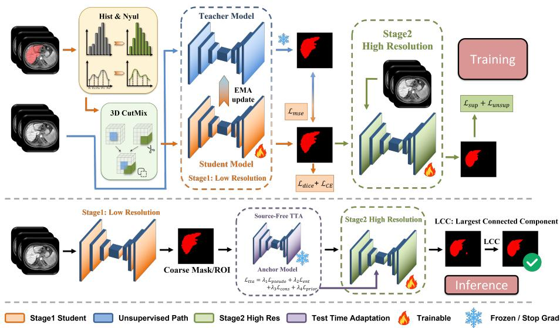
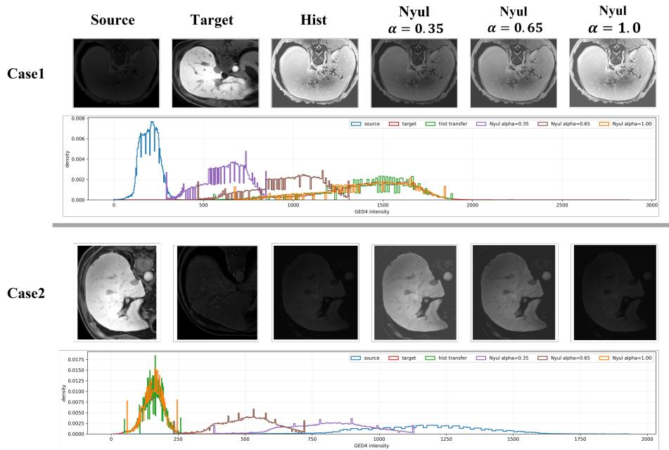
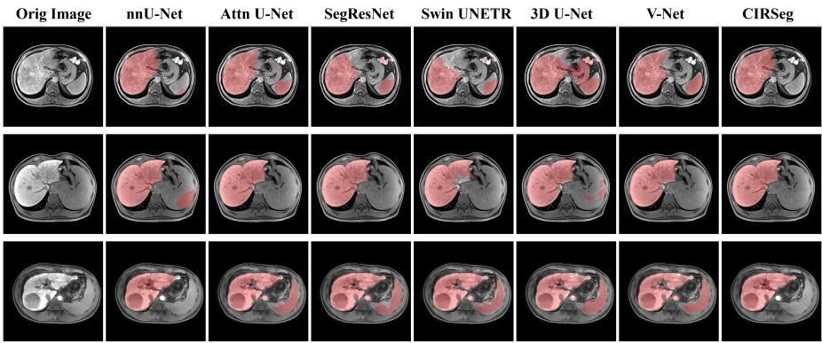

# CIRSeg: Coarse-to-Fine Intensity-Robust Liver Segmentation with Source-Free Continual Test-Time Adaptation

Ruoshi Xu2, Mingqi Gao3, Shengda Luo2\*, and Jingkun Chen1\*

School of Automation, Northwestern Polytechnical University, Xi’an, China1 jingkunchen@nwpu.edu.cn

Chinese Medicine Guangdong Laboratory, Zhuhai, China xuruoshi2003@gmail.com, luoshengda@hqcmlab.cn School of Computer Science, University of Shefield, Shefield, UK3 m.gao@sheffield.ac.uk

Abstract. Reliable liver segmentation in contrast-enhanced MRI is essential for quantitative hepatic assessment, treatment planning, and longitudinal disease monitoring. However, limited annotated data and scanner- or vendor-dependent intensity variations can cause overfitting and poor generalization to unseen acquisition domains. Moreover, simultaneously achieving robust global localization and precise boundary delineation remains challenging, while predictions may contain isolated false-positive regions outside the main liver component. To address these challenges, we propose CIRSeg, a coarse-to-fine, intensity-robust liver segmentation framework based on nnU-Netv2. CIRSeg combines 3D CutMix with stochastic intensity transfer using either Nyul augmentation or histogram matching to improve robustness to heterogeneous MRI intensities. Its cascaded architecture decouples low-resolution anatomical localization from full-resolution boundary refinement. At inference, source-free test-time adaptation based on confidence-filtered predictions and probability-prior regularization further improves robustness to out-of-distribution inputs. As a final deterministic post-processing step, largest connected component filtering removes isolated false-positive regions. On the CARE 2026 test set, CIRSeg achieves Dice scores of 97.13% and 97.93% on the in-domain and unseen-domain subsets, with corresponding HD95 values of 20.18 mm and 11.30 mm, respectively. These results demonstrate consistently accurate segmentation across both in-domain and unseen acquisition settings. The code is available at https://github.com/jingkunchen/MICCAI\_CARE\_2026

Keywords: Liver Segmentation · Test Time Adaptation · Data Augmentation · Semi-Supervised Learning

## 1 Introduction

Contrast-enhanced magnetic resonance imaging (MRI) is widely used for quantitative liver assessment, treatment planning, surgical navigation, and longitudinal disease monitoring. However, manual delineation of the liver in three-dimensional MRI volumes is labor-intensive and requires substantial expert knowledge. Reliable automated segmentation remains challenging because annotated training volumes are limited, while abdominal MRI intensities vary considerably across scanner vendors, acquisition protocols, reconstruction settings, contrast enhancement patterns, and patients. Such variations can cause models to overfit to cohort-specific appearances and compromise generalization to unseen acquisition domains. In addition, liver segmentation requires both robust global localization and precise boundary delineation, which rely on diferent spatial contexts, while predicted masks may contain small disconnected false-positive regions outside the dominant liver structure.

Recent medical image segmentation studies have addressed these challenges from complementary perspectives. Report-supervised, weakly-supervised, and pseudo-labeling methods reduce dependence on dense annotations [1, 10, 3, 4], while foundation-model studies investigate the transferability of general-purpose segmentation priors to medical images [9]. Other approaches focus on domain generalization [6] and test-time adaptation [5, 12] to improve robustness when deployment data difer from the labeled training distribution. Nevertheless, these directions are often investigated independently, whereas robust liver segmentation under heterogeneous acquisition conditions requires coordinated treatment of limited training diversity, intensity-domain variation, multi-scale anatomical modeling, and inference-time distribution shift.

To address these challenges, we propose CIRSeg, a coarse-to-fine, intensityrobust liver segmentation framework built upon nnU-Netv2 [11]. At the data level, CIRSeg introduces 3D CutMix [20] to improve regularization and increase spatial diversity under limited labeled data. We further design a composite intensity-domain augmentation strategy that probabilistically applies either Nyul augmentation [16] or histogram matching [8]. For histogram matching, the reference volume is randomly sampled from the training set, allowing the model to encounter a broader range of plausible intensity distributions during training. Together, these augmentations reduce sensitivity to acquisition-specific appearance patterns and improve generalization to heterogeneous domains.

At the model level, CIRSeg adopts cascaded nnU-Netv2. A low-resolution network first performs coarse liver localization, and a subsequent full-resolution network refines local structures and boundaries. This coarse-to-fine formulation separates global anatomical localization from fine-grained segmentation refinement. During full-resolution inference, CIRSeg incorporates a source-free continual test-time adaptation strategy inspired by SicTTA [19]. The model is continually updated across test cases using confidence-filtered anchor predictions and probability-prior regularization, improving robustness to out-of-distribution inputs while limiting adaptation drift. Finally, a deterministic three-dimensional largest connected component post-processing step removes isolated false-positive regions and retains the dominant liver component.

Our contributions are threefold: 1. We develop an intensity-robust training data augmentation recipe that combines 3D CutMix with probabilistic Nyul augmentation and histogram matching to increase spatial and intensity diversity and improve generalization under limited annotations. 2. We construct a coarseto-fine liver segmentation framework based on cascaded nnU-Netv2 and integrate it with source-free continual test-time adaptation to improve cross-domain robustness while limiting adaptation drift. 3. CIRSeg achieves strong performance on the CARE 2026 test set, demonstrating accurate liver segmentation and robust generalization to unseen acquisition domains.

## 2 Method

Figure 1 shows the overall architecture of CIRSeg.

  
Fig. 1. Overall architecture of CIRSeg.

## 2.1 Baseline

We build our baseline upon CoSSeg-TTA [15], the first-place solution of the CARE Liver 2025 challenge. It employs nnU-Netv2 [11] as the segmentation backbone and incorporates mean-teacher semi-supervised learning [17] and histogram matching transfer. We retain these components and focus on improving data diversity, coarse-to-fine segmentation, and inference-time robustness.

## 2.2 Composite Data Augmentation

The CARE 2026 training set contains only a limited number of annotated volumes, while MRI appearances vary substantially across scanners, vendors, and acquisition protocols. We therefore combine 3D CutMix with probabilistic intensity-domain augmentation. Unlabeled training volumes are used for semisupervised consistency learning and may also serve as reference volumes for intensity transfer.

3D CutMix. To improve regularization under limited annotations, we apply 3D CutMix during supervised training. Given two labeled samples $( x _ { a } , y _ { a } )$ and $\left( x _ { b } , y _ { b } \right)$ , a 3D cuboid B is randomly sampled. Let $M _ { B }$ be a binary mask whose value is one inside B. The mixed image and label are defined as

$$
x _ { \mathrm { m i x } } = \left( 1 - M _ { B } \right) \odot x _ { a } + M _ { B } \odot x _ { b } ,\tag{1}
$$

$$
y _ { \mathrm { m i x } } = \left( 1 - M _ { B } \right) \odot y _ { a } + M _ { B } \odot y _ { b } ,\tag{2}
$$

where $\odot$ denotes element-wise multiplication. Applying the same cuboid to the image and label preserves voxel-wise supervision while increasing local appearance and boundary diversity.

Histogram matching and Nyul augmentation. For intensity-domain robustness, we combine histogram matching with Nyul augmentation. For each selected source volume, either transformation is applied probabilistically, and the reference volume is randomly sampled from the entire CARE 2026 training set, including both labeled and unlabeled cases. Both transformations modify only the image intensities and leave the segmentation label unchanged.

A body foreground mask is first obtained by intensity thresholding, and all intensity statistics are computed within this region. Given the foreground voxels of a source volume $S$ and a reference volume $R ,$ their percentile landmarks are defined as

$$
S _ { \cal Q } = [ \mathcal { Q } _ { q _ { 1 } } ( S ) , \mathcal { Q } _ { q _ { 2 } } ( S ) , \ldots , \mathcal { Q } _ { q _ { K } } ( S ) ] ,\tag{3}
$$

$$
R _ { Q } = [ \mathcal { Q } _ { q _ { 1 } } ( R ) , \mathcal { Q } _ { q _ { 2 } } ( R ) , \ldots , \mathcal { Q } _ { q _ { K } } ( R ) ] ,\tag{4}
$$

where $\mathcal { Q } _ { q _ { k } } ( \cdot )$ denotes the ${ q } _ { k } \mathrm { - t h }$ foreground intensity percentile. The Nyul mapping function $g ( \cdot )$ is defined by piecewise-linear interpolation between corresponding landmarks. For $z \in [ S _ { Q } [ k ] , S _ { Q } [ k + 1 ] ]$ ,

$$
g ( z ) = R _ { Q } [ k ] + \frac { z - S _ { Q } [ k ] } { S _ { Q } [ k + 1 ] - S _ { Q } [ k ] } \left( R _ { Q } [ k + 1 ] - R _ { Q } [ k ] \right) .\tag{5}
$$

Values outside the landmark range are clipped to the nearest boundary landmark. The mapped volume is blended with the original source volume:

$$
S _ { \mathrm { a u g } } = ( 1 - \alpha ) S + \alpha g ( S ) ,\tag{6}
$$

where α controls the transfer strength. Histogram matching directly transfers the source intensity distribution toward that of the sampled reference, whereas Nyul augmentation generates intermediate appearances by varying α. This composite strategy broadens the sampled intensity-domain space and improves robustness to heterogeneous acquisitions. Figure 2 visualizes the resulting intensity variations.

  
Fig. 2. Visualization of histogram matching and Nyul augmentation. Each row shows a source volume, a randomly sampled reference volume, the histogram-matched result, and Nyul-augmented results with diferent transfer strengths α, together with their foreground intensity distributions.

## 2.3 Cascaded Training

Global liver localization and fine-grained boundary delineation require diferent spatial contexts. We therefore adopt the standard cascaded nnU-Netv2 training strategy. A low-resolution model first predicts the coarse liver extent:

$$
p _ { \mathrm { l o w } } = f _ { \mathrm { l o w } } ( x _ { \mathrm { d o w n } } ) ,\tag{7}
$$

where $x _ { \mathrm { d o w n } }$ denotes the resampled low-resolution volume. The prediction is then resampled to the original image space and provided to the full-resolution cascade:

$$
p _ { \mathrm { c a s } } = f _ { \mathrm { c a s } } ( [ x , \mathrm { u p } ( p _ { \mathrm { l o w } } ) ] ) ,\tag{8}
$$

where [·, ·] denotes channel-wise concatenation. The low-resolution prediction provides a coarse anatomical prior, allowing the full-resolution model to focus on local structures and liver boundaries.

## 2.4 Inference-Time Adaptation and Refinement

Source-free continual test-time adaptation. During inference, the low-resolution model first produces a coarse liver prediction without adaptation. Source-free continual test-time adaptation, inspired by SicTTA [19], is then applied to the full-resolution cascade. A frozen anchor $f _ { a }$ and an adaptive student $f _ { s }$ are initialized from the trained cascade model. For each test batch, the anchor produces $p _ { a } = \operatorname { s o f t m a x } ( f _ { a } ( x ) )$ . This is a binary segmentation task with $C = 2$ classes, background and liver foreground; $p _ { a } ^ { k } ( v )$ denotes the probability of class $k \in \{ 1 , 2 \}$ at voxel v. The anchor pseudo-label is $\hat { y } _ { a } ( v ) = \arg \operatorname* { m a x } _ { k } p _ { a } ^ { k } ( v )$ , and its voxel-wise confidence is $\begin{array} { r } { c ( v ) = p _ { a } ^ { \hat { y } _ { a } ( v ) } ( v ) = \operatorname* { m a x } _ { k \in \{ 1 , 2 \} } p _ { a } ^ { k } ( v ) } \end{array}$

To filter unreliable updates, we compute a confidence-consistency (CC) score from at most 2048 randomly sampled anchor probability vectors. Specifically, let $\varOmega$ denote the set of all voxels in the current test batch and let $v _ { 1 } , \dotsc , v _ { N } \in \varOmega$ be the sampled voxels, with $N \leq \operatorname* { m i n } ( 2 0 4 8 , | \varOmega | )$ . Then $P \in R ^ { N \times C }$ stacks $p _ { a } ( v _ { n } )$ as rows and $\tilde { P }$ is obtained by row-wise $\ell _ { 2 }$ normalization. Their class-correlation matrix is then $R = \tilde { P } ^ { \top } \tilde { P }$ , and

$$
s _ { \mathrm { C C } } = - \frac { 1 } { C } \sum _ { i , j } \pi _ { i j } \log ( \pi _ { i j } + \epsilon ) , \qquad \pi = \mathrm { s o f t m a x } ( R ) ,\tag{9}
$$

where softmax is applied row-wise, so each row of $\pi$ is a distribution over classes. Thus, $s _ { \mathrm { C C } }$ is the mean entropy of the row-wise class-correlation distributions; a lower value indicates a more concentrated and consistent correlation pattern. We maintain the most recent 32 CC scores. For the first four batches, reliability requires mean confidence $\bar { c } \ge 0 . 8 5 ;$ afterwards, a batch is reliable if either its CC score falls below the low-tail cutof of the history or $\bar { c } \geq 0 . 8 5$ . Only batches passing the criteria are used for adaptation.

The prior bank is updated only for batches satisfying both reliability and minimum high-confidence-mask-ratio criteria, by appending the mean high-confidence anchor probability and retaining the most recent 32 entries in FIFO order. Let q¯ denote the mean bank distribution and $\begin{array} { r } { q _ { s } = | \varOmega | ^ { - 1 } \sum _ { v \in \varOmega } p _ { s } ( v ) } \end{array}$ the mean student distribution. We define

$$
\mathcal { L } _ { \mathrm { p r i o r } } = \| q _ { s } - \bar { q } \| _ { 2 } ^ { 2 } ,\tag{10}
$$

which constrains global class proportions rather than providing voxel-wise supervision. The student is optimized with

$$
\mathcal { L } _ { \mathrm { t t a } } = \lambda _ { \mathrm { p s e u d o } } \mathcal { L } _ { \mathrm { p s e u d o } } + \lambda _ { \mathrm { e n t } } \mathcal { L } _ { \mathrm { e n t } } + \lambda _ { \mathrm { c o n s } } \mathcal { L } _ { \mathrm { c o n s } } + \lambda _ { \mathrm { p r i o r } } \mathcal { L } _ { \mathrm { p r i o r } } ,\tag{11}
$$

where the first three terms denote high-confidence pseudo-label cross-entropy, entropy minimization, and anchor–student KL consistency, respectively. The student is not reset between test volumes; its adapted parameters are carried forward throughout the test stream, while the anchor remains frozen.

3D largest connected component filtering. Post-processing is implemented as standard, deterministic three-dimensional largest connected component filtering. The adapted cascade prediction is converted into a binary liver mask. Given its connected components $\{ C _ { k } \} _ { k = 1 } ^ { K }$ , the final prediction is

$$
M _ { \mathrm { p p } } = C _ { \mathrm { a r g m a x } _ { k } | C _ { k } | } .\tag{12}
$$

If the prediction contains at most one foreground component, it is left unchanged. This operation removes isolated false-positive regions and improves anatomical plausibility, particularly for surface-distance metrics such as HD95.

## 3 Experiments

## 3.1 Dataset and Evaluation Metrics

We participate in the GED4 Contrast-Enhanced LiSeg Subtask of the CARE 2026 Liver Track and use the oficial dataset released for this subtask [2, 14, 13, 7, 18]. Following the oficial challenge protocol and dataset splits, we use the provided training, validation, and test sets for model development and evaluation. No additional public or private datasets are used.

The oficial evaluation metrics are Dice score and the 95th-percentile Hausdorf distance (HD95). Higher Dice and lower HD95 indicate better segmentation performance.

## 3.2 Implementation Setup

All experiments are conducted on one NVIDIA RTX 6000 24GB GPU. Both Stages of nnU-Netv2 (stage1 low-resolution and Stage2 high-resolution) are optimized using SGD with the same mean-teacher objective

$$
\begin{array} { r } { \mathcal { L } _ { \mathrm { t r a i n } } ^ { ( s ) } = \mathcal { L } _ { \mathrm { s u p } } ^ { ( s ) } + \lambda _ { \mathrm { u } } ( t ) \mathcal { L } _ { \mathrm { u n s u p } } ^ { ( s ) } , \quad s \in \{ \mathrm { l o w } , \mathrm { c a s } \} , } \end{array}\tag{13}
$$

where ${ \lambda _ { \mathrm { u } } ( t ) }$ controls the consistency weight. The two stages difer in input resolution and cascade conditioning but use identical loss definitions. The supervised term is the combined Dice and cross-entropy loss

$$
\mathcal { L } _ { \mathrm { s u p } } = \mathcal { L } _ { \mathrm { D i c e } } + \mathcal { L } _ { \mathrm { C E } } ,\tag{14}
$$

where

$$
\mathcal { L } _ { \mathrm { { D i c e } } } = 1 - \frac { 2 \sum _ { i = 1 } ^ { N } p _ { i } y _ { i } + \epsilon } { \sum _ { i = 1 } ^ { N } p _ { i } + \sum _ { i = 1 } ^ { N } y _ { i } + \epsilon } ,\tag{15}
$$

$$
\mathcal { L } _ { \mathrm { C E } } = - \frac { 1 } { N } \sum _ { i = 1 } ^ { N } \left[ y _ { i } \log p _ { i } + ( 1 - y _ { i } ) \log ( 1 - p _ { i } ) \right] .\tag{16}
$$

The unsupervised term is the mean-squared consistency loss between student and EMA-teacher predictions on unlabeled data:

$$
\mathcal { L } _ { \mathrm { u n s u p } } ^ { ( s ) } = \frac { 1 } { N } \sum _ { i = 1 } ^ { N } \left\| p _ { i , s } ^ { \mathrm { s t u } } - p _ { i , s } ^ { \mathrm { t e a } } \right\| _ { 2 } ^ { 2 } .\tag{17}
$$

Here, $p _ { i }$ denotes the predicted foreground probability at voxel i, $y _ { i }$ is the corresponding binary ground-truth label, N is the number of voxels, and ϵ is a smoothing constant. The initial learning rate is $1 0 ^ { - 2 }$ , the weight decay is $3 \times 1 0 ^ { - 5 }$ and training runs for 150 epochs with 250 iterations per epoch. The consistency term is activated after epoch 40 with an 80-epoch sigmoid ramp-up, and the teacher EMA decay is set to 0.95.

For augmentation, 3D CutMix is applied with probability 0.5. The mixing ratio is sampled from Beta(1.0, 1.0), and the CutMix box side ratio is clipped to [0.20, 0.55]. Histogram matching and Nyul augmentation are selected with probabilities 0.7 and 0.3, respectively. The Nyul branch uses 17 foreground quantile landmarks from the 0.5th to 99.5th percentiles and samples the blending coeficient from $\alpha \in [ 0 . 2 , 0 . 8 ]$

The cascade follows the nnU-Netv2 3d\_lowres and 3d\_cascade\_fullres configurations. During inference, source-free continual test-time adaptation is disabled for the low-resolution stage and enabled for the full-resolution cascade stage. The TTA optimizer uses a learning rate of $1 0 ^ { - 5 }$ , and the loss weights are set as

$$
\mathcal { L } _ { t t a } = 1 . 0 \mathcal { L } _ { p s e u d o } + 0 . 1 \mathcal { L } _ { e n t } + 0 . 2 \mathcal { L } _ { c o n s } + 0 . 0 5 \mathcal { L } _ { p r i o r } .\tag{18}
$$

The confidence threshold is 0.85, the consistency confidence threshold is 0.90, the minimum foreground fraction is 0.0005, and the memory bank size is 32. Largest connected component filtering uses 3D connectivity.

## 3.3 Main Experiment

Table 1 compares CIRSeg with representative 3D medical image segmentation methods using five-fold cross-validation on the 30 annotated training cases. For a fair comparison, all methods are trained exclusively on the oficial training set without pretrained models. CoSSeg-TTA and CIRSeg use both labeled and unlabeled cases through their semi-supervised learning components, whereas the other methods are trained only on labeled cases because their original designs do not provide a mechanism for learning from unlabeled data. CIRSeg achieves the best overall performance among the evaluated methods, obtaining the highest Dice score and the lowest HD95. The reproduced CoSSeg-TTA [15] framework is used as the baseline for further ablation analysis.

Qualitative Analysis. Figure 3 presents qualitative comparisons on representative cases from the CARE 2026 validation set. Since the validation annotations are not publicly available, we focus on visual comparison of the predicted liver masks. CIRSeg produces more complete and anatomically consistent liver regions compared with previous approaches. In particular, the final predictions preserve smoother boundaries, better capture irregular liver contours, and reduce disconnected false-positive regions.

## 3.4 Ablation Study

Table 2 presents the cumulative ablation results obtained by submitting validation and test predictions to the oficial CARE 2026 evaluation website. The baseline already achieves strong Dice performance, while the relatively high HD95 indicates that boundary errors and isolated false-positive regions remain important failure modes.

Table 1. Main experimental comparison using five-fold cross-validation on the oficial training set.
<table><tr><td colspan="3">Method Dice ↑ HD95↓</td></tr><tr><td>CIRSeg (ours)</td><td>0.9595</td><td>5.29</td></tr><tr><td>CoSSeg-TTA Baseline 0.9445</td><td></td><td>7.74</td></tr><tr><td>nnU-Netv2</td><td>0.8973</td><td>26.95</td></tr><tr><td>Attention U-Net</td><td>0.8713</td><td>46.21</td></tr><tr><td>SegResNet</td><td>0.8704</td><td>32.19</td></tr><tr><td>3D U-Net</td><td>0.8537</td><td>37.07</td></tr><tr><td>Swin UNETR</td><td>0.8499</td><td></td></tr><tr><td></td><td></td><td>34.48</td></tr><tr><td>V-Net</td><td>0.8484</td><td>28.26</td></tr></table>

  
Fig. 3. Qualitative comparison on representative CARE 2026 validation cases. The last column shows CIRSeg predictions, which provide more complete liver coverage and no disconnected false-positive regions compared with previous methods.

Adding largest connected component filtering reduces HD95 from 24.69 to 20.61, demonstrating that anatomical connectivity constraints efectively remove distant false-positive components. Introducing 3D CutMix further improves boundary robustness and reduces HD95 to 19.18. The composite intensity augmentation strategy, combining histogram matching and Nyul augmentation, achieves additional improvement, indicating that expanding the sampled intensity-domain space improves robustness against heterogeneous MRI appearances.

The cascaded nnU-Netv2 architecture further reduces HD95 to 18.31 by providing a coarse anatomical localization prior for full-resolution refinement. The source-free continual test-time adaptation module does not improve validation performance, whose cases are mainly in-domain. TTA-enabled predictions are lower on ID Test1/2 but higher on OOD, suggesting domain-dependent utility.

Table 2. Cumulative ablation results obtained through the oficial CARE 2026 evaluation website. The baseline is the reproduced CoSSeg-TTA framework described in Section 3.3. LCC: largest connected component filtering; Composite Aug: composite intensity augmentation using histogram matching and Nyul augmentation; Cascade: cascaded nnU-Netv2 architecture; TTA: source-free continual test-time adaptation.
<table><tr><td>Exp</td><td>LCC</td><td>CutMix</td><td>Composite Aug</td><td>Cascade</td><td>TTA</td><td>Dice ↑</td><td>HD95↓</td></tr><tr><td>Baseline</td><td></td><td></td><td></td><td></td><td></td><td>0.9693</td><td>24.69</td></tr><tr><td>A</td><td>√</td><td></td><td></td><td></td><td></td><td>0.9708</td><td>20.61</td></tr><tr><td>B</td><td>√</td><td>√</td><td></td><td></td><td></td><td>0.9702</td><td>19.18</td></tr><tr><td>C</td><td>√</td><td>√</td><td>√</td><td></td><td></td><td>0.9715</td><td>18.93</td></tr><tr><td>D</td><td>√</td><td>√</td><td>√</td><td>√</td><td></td><td>0.9713</td><td>18.31</td></tr><tr><td>E</td><td>√</td><td>√</td><td>√</td><td>√</td><td>√</td><td>0.9713</td><td>18.31</td></tr><tr><td>ID Test1</td><td>√</td><td>√</td><td>√</td><td>√</td><td></td><td>0.9713</td><td>20.18</td></tr><tr><td>ID Test2</td><td>√</td><td>√</td><td>√</td><td>√</td><td>√</td><td>0.9709</td><td>20.85</td></tr><tr><td>OOD Test</td><td>√</td><td>√</td><td>√</td><td>√</td><td>√</td><td>0.9797</td><td>11.36</td></tr></table>

Because all test submissions used TTA, no paired no-TTA predictions were available for causal comparison. The oficial test-set evaluation, including case ordering, was performed by the organizers after model submission and was outside our control; therefore, the ordering sensitivity of continual TTA could not be evaluated.

## 4 Conclusion

In this work, we present CIRSeg, an intensity-robust coarse-to-fine liver segmentation framework for the CARE 2026 Liver Segmentation Track. CIRSeg addresses the challenges of limited annotated data and heterogeneous MRI appearance variations through a composite augmentation strategy combining 3D CutMix, histogram matching, and Nyul augmentation. It further integrates a cascaded nnU-Netv2 architecture for separating coarse anatomical localization from fine boundary refinement, together with source-free continual test-time adaptation to improve robustness under distribution shifts. A deterministic three-dimensional largest connected component filter is applied as the final post-processing step to remove isolated false positives. Extensive experiments on the CARE 2026 dataset demonstrate that CIRSeg achieves accurate segmentation performance on both in-domain and unseen-domain test subsets, validating the efectiveness of the proposed training and inference strategies for robust liver segmentation across heterogeneous MRI acquisitions.

## Acknowledgements

This work was supported by the National Natural Science Foundation of China (Grant No. 82505358), Innovation Team and Talents Cultivation Program of

National Administration of Traditional Chinese Medicine. (No: ZYYCXTD-D-202403), and the Scientifc Research Start-up Funds of the Chinese Medicine Guangdong Laboratory (Grant No. HQL2025SU011).

## References

1. Bassi, P.R.A.S., Li, W., Chen, J., Zhu, Z., Lin, T., Decherchi, S., Cavalli, A., Wang, K., Yang, Y., Yuille, A.L., Zhou, Z.: Learning segmentation from radiology reports. In: Medical Image Computing and Computer-Assisted Intervention – MICCAI 2025. Lecture Notes in Computer Science, vol. 15964, pp. 305–315. Springer (2025). https://doi.org/10.1007/978-3-032-04971-1\_29

2. CARE 2026 Organizers: CARE 2026: Comprehensive analysis of REal-world medical images – heart and liver. https://www.zmic.org.cn/care\_2026/ (2026), accessed: 2026-07-21

3. Chen, J., Duan, H., Zhang, X., Gao, B., Grau, V., Han, J.: From gaze to insight: Bridging human visual attention and vision language model explanation for weaklysupervised medical image segmentation. IEEE Transactions on Medical Imaging (2025)

4. Chen, J., Huang, W., Zhang, J., Debattista, K., Han, J.: Addressing inconsistent labeling with cross image matching for scribble-based medical image segmentation. IEEE Transactions on Image Processing 34, 842–853 (2025)

5. Chen, Z., Ye, Y., Pan, Y., Xia, Y.: Gradient alignment improves testtime adaptation for medical image segmentation. In: Proceedings of the AAAI Conference on Artificial Intelligence. vol. 39, pp. 2429–2437 (2025). https://doi.org/10.1609/aaai.v39i3.32244

6. Cheng, Z., Liu, M., Yan, C., Wang, S.: Dynamic domain generalization for medical image segmentation. Neural Networks 184, 107073 (2025). https://doi.org/10.1016/j.neunet.2024.107073

7. Gao, Z., Liu, Y., Wu, F., Shi, N., Shi, Y., Zhuang, X.: A reliable and interpretable framework of multi-view learning for liver fibrosis staging. In: Medical Image Computing and Computer-Assisted Intervention – MICCAI 2023. pp. 178–188. Springer (2023)

8. Gonzalez, R.C., Woods, R.E.: Digital Image Processing. Pearson, New York, 4 edn. (2018)

9. Gu, H., Dong, H., Yang, J., Mazurowski, M.A.: How to build the best medical image segmentation algorithm using foundation models: A comprehensive empirical study with segment anything model. Machine Learning for Biomedical Imaging 3, 88–120 (2025). https://doi.org/10.59275/j.melba.2025-86a6

10. Hu, L., Meng, Z., Tan, C., Zhou, Y.: Better pseudo-labeling for semi-supervised domain generalization in medical magnetic resonance image segmentation. International Journal of Computational Intelligence Systems 18(1), 71 (2025). https://doi.org/10.1007/s44196-025-00786-8

11. Isensee, F., Jaeger, P.F., Kohl, S.A.A., Petersen, J., Maier-Hein, K.H.: nnU-Net: A self-configuring method for deep learning-based biomedical image segmentation. Nature Methods 18(2), 203–211 (2021). https://doi.org/10.1038/s41592-020-01008-z

12. Ji, J., Cheng, Z., Zhao, J., Ma, B., Chen, H., Gao, Y., Zhang, L., Ying, Z., Wang, S.: Wake the sleeping weights: Sparsely-activated continual test-time adaptation for medical image segmentation. In: Proceedings of the IEEE/CVF Conference on Computer Vision and Pattern Recognition Findings. pp. 7799–7809 (2026)

13. Liu, Y., Gao, Z., Shi, N., Wu, F., Shi, Y., Chen, Q., Zhuang, X.: MERIT: Multi-view evidential learning for reliable and interpretable liver fibrosis staging. Medical Image Analysis 102, 103507 (2025)

14. Liu, Y., Shi, N., Zhang, Z., Zhang, H., Wang, B., Yu, D., Wang, N., Jin, Y., Zhou, Y., Yuan, K., Wang, S., Yang, L., Qiao, X., Liu, W., He, X., Hong, X., Zheng, G., Chen, X., Yang, G.Z., Zhang, L., Li, L., Shi, Y., Zhuang, X.: How far has AI come in liver fibrosis staging? a large-scale real-world dataset and benchmark (2026), https://arxiv.org/abs/2605.25595

15. Lou, J., Chen, J., Li, H., Li, H., Huang, W., Chen, W., Wang, F., Zhang, J.: CoSSeg-TTA: Contrast-aware semi-supervised segmentation with domain generalization and test-time adaptation. In: MICCAI Challenge on Comprehensive Analysis and Computing of Real-World Medical Images. pp. 57–67. Springer (2026)

16. Nyul, L.G., Udupa, J.K., Zhang, X.: New variants of a method of MRI scale standardization. IEEE Transactions on Medical Imaging 19(2), 143–150 (2000). https://doi.org/10.1109/42.836373

17. Tarvainen, A., Valpola, H.: Mean teachers are better role models: Weight-averaged consistency targets improve semi-supervised deep learning results. In: Advances in Neural Information Processing Systems. vol. 30 (2017)

18. Wu, F., Zhuang, X.: Minimizing estimated risks on unlabeled data: A new formulation for semi-supervised medical image segmentation. IEEE Transactions on Pattern Analysis and Machine Intelligence 45(5), 6021–6036 (2023)

19. Wu, J., Liu, X., Wang, G., Zhang, S.: SicTTA: Single image continual test time adaptation for medical image segmentation. Medical Image Analysis 108, 103859 (2026). https://doi.org/10.1016/j.media.2025.103859

20. Yun, S., Han, D., Oh, S.J., Chun, S., Choe, J., Yoo, Y.: CutMix: Regularization strategy to train strong classifiers with localizable features. In: Proceedings of the IEEE/CVF International Conference on Computer Vision. pp. 6023–6032 (2019). https://doi.org/10.1109/ICCV.2019.00612