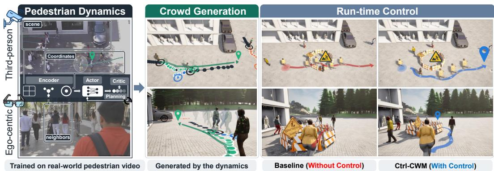
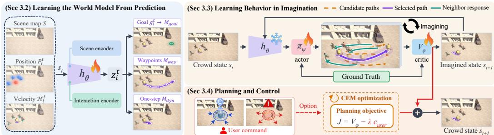
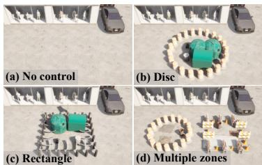
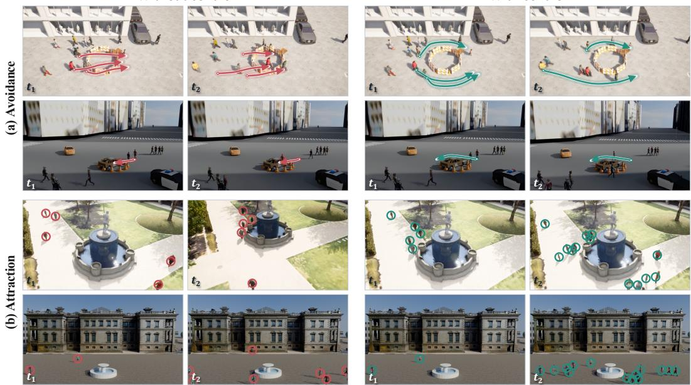
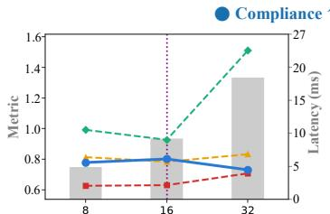
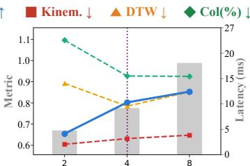
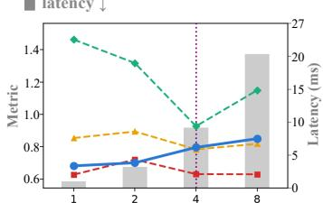
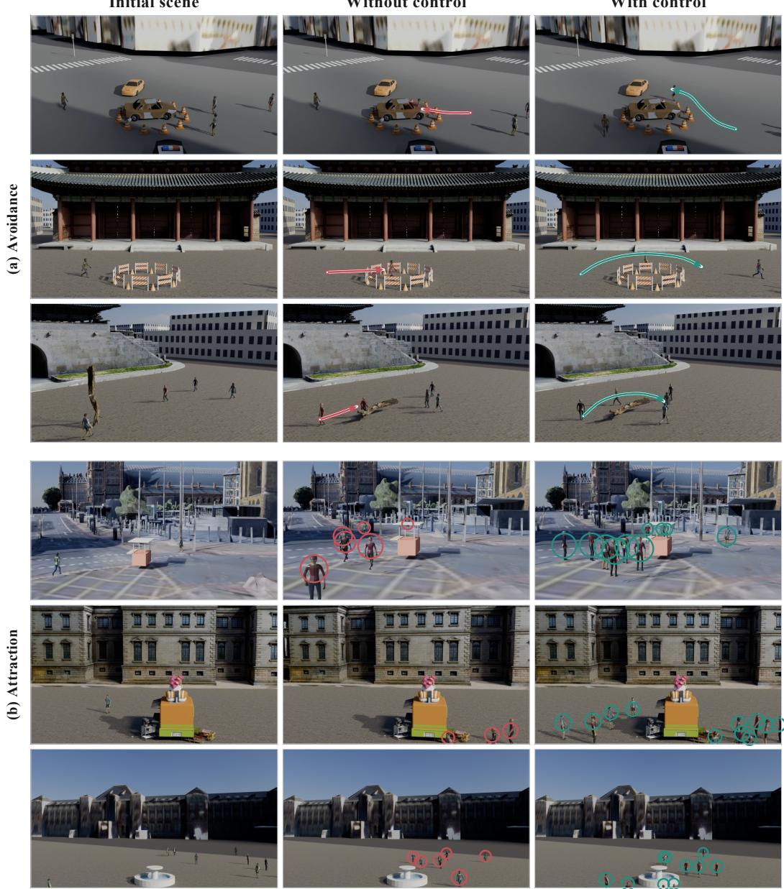

# CONTROLLABLE CROWD GENERATION THROUGHWORLD-MODEL PLANNING

JunGyu Lee1 Jisu Shin2 Seunghyun Shin2 Hae-Gon Jeon1∗ 1Yonsei University 2GIST

  
Figure 1: Ctrl-CWM. Human dynamics learned from real-world pedestrian video (left) are used for continuous crowd generation (center) and runtime crowd control (right). User-defined objectives can be introduced at run time without retraining the model.

## ABSTRACT

Crowd simulation plays a central role in robot navigation, autonomous driving, and urban planning. For these applications, realistic simulation requires crowds to adapt their behavior to environmental changes and user objectives. However, existing methods that rely on predefined control settings have limited flexibility in accommodating new user-specified objectives. To address this limitation, we propose Ctrl-CWM, a multi-agent Controllable Crowd World Model that integrates crowd generation and run-time control. Our key idea is to adapt the world-model principle of planning using imagined futures to crowd simulation. To this end, Ctrl-CWM consists of an encoder that learns a representation of human motion dynamics, an actor that proposes pedestrian displacements, a critic that evaluates imagined crowd trajectories, and a planner that selects actions. We first learn human motion dynamics through trajectory prediction on real-world pedestrian videos and then freeze the encoder to preserve them. Using this representation, the actor generates imagined crowd trajectories through repeated state updates, and the planner combines the critic’s scores with user costs to select actions. Repeated planning advances the simulated crowd, while additional user costs introduce new control objectives without retraining. We extensively evaluate crowd generation under varied agent arrival conditions and run-time control across avoidance and attraction scenarios. Ctrl-CWM outperforms the state-of-the-art method on most crowd realism and collision metrics, and adapts crowd behaviors to userspecified objectives introduced during simulation. The project page is available at https://jungyu0413.github.io/Ctrl-CWM

## 1 INTRODUCTION

Crowd simulation is important for urban planning as well as for developing autonomous vehicles and social robots. Training robots to navigate reliably and evaluating urban designs require simulations that reproduce human crowd behaviors, not just scenes populated with moving pedestrians. In the real world, the environment changes over time and people adjust their motions in response. For example, when a construction site blocks a walkway, pedestrians take another route rather than continue along their original paths. Therefore, a realistic crowd simulator should capture not only how people move but also how they adjust their motion when conditions change. To this end, we aim to generate run-time controllable crowd motion that responds to user-specified objectives while preserving human motion dynamics.

Traditional crowd simulators use hand-designed rules for navigation and interactions (Reynolds, 1987; Helbing & Molnar, 1995; Van Den Berg et al., 2010). These rules make control straightforward, but they do not directly learn human motion dynamics from real-world pedestrian videos. Learning-based approaches capture human motion dynamics from pedestrian data (Charalambous et al., 2023; Rempe et al., 2023; Bae et al., 2025) and support control over generated crowd motion (Rempe et al., 2023; Bae et al., 2025). However, their control is limited to a predefined population and agent parameters (Bae et al., 2025) or to gradient guidance and sample filtering (Rempe et al., 2023). TRACE (Rempe et al., 2023) also reports trajectory sampling times of 1 ∼ 3 seconds for a single pedestrian, which can delay responses to control during simulation. We aim to develop a crowd model that retains learned human motion dynamics while supporting run-time control.

Recent advances in world models (Hafner et al., 2025; Hansen et al., 2024) have shown promise for learning and controlling behavior across different tasks. In approaches such as Dreamer (Hafner et al., 2019a), an encoder maps observations to latent states and an actor proposes actions. A dynamics model predicts the next state and reward from the current state and action, producing imagined futures through repeated prediction. A critic estimates the expected return, and both the actor and critic can learn from imagined experience. For planning, a planner can evaluate candidate action sequences using predicted rewards and a terminal value from the critic (Hansen et al., 2022; 2024). The planner iteratively refines the sampling distribution toward higher-scoring candidates, executes only the first action, and replans from the updated state. These ideas motivate our use of learned pedestrian dynamics to imagine and evaluate crowd futures for generation and run-time control.

We propose Ctrl-CWM, a multi-agent Controllable Crowd World Model for crowd generation and run-time control (Fig. 1). Tasks where world models have been applied, such as video games and robot control, specify the observations and the available actions, and use rewards or goals to evaluate outcomes. Pedestrian videos instead record how people moved but do not define actions or specify which actions meet new user objectives. Therefore, we must define the crowd state and pedestrian actions and train a critic that evaluates the resulting motion for planning. In this paper, we define the state as the scene and each pedestrian’s position, recent motion, and local goal, and an action as a pedestrian’s next-step displacement. Human trajectory prediction provides a basis for learning how pedestrians move and interact with their surroundings (Alahi et al., 2016; Gupta et al., 2018; Sadeghian et al., 2019). We learn a shared representation through trajectory prediction and then freeze the encoder to preserve the learned human motion dynamics. A single actor shared across all pedestrians learns to propose each pedestrian’s next action from this representation.

Applying these actions updates the explicit crowd state, and repeating these updates generates imagined crowd trajectories. Our critic learns to rank these imagined crowd trajectories using supervision derived from ground-truth trajectories.

At run time, the actor proposes displacements as during training. For a controlled pedestrian, the model imagines the crowd trajectories that follow several candidate displacements, while the actor generates the actions of all other pedestrians. The critic ranks these trajectories by their quality, and a user cost measures how well they satisfy the current user-specified objective, such as avoiding or approaching a specified region. A planner combines the critic’s ranking with the user cost and selects the displacement to execute. Repeating this process advances the crowd, and the critic keeps the motion realistic while the user cost steers it toward the objective. By planning with the critic in imagination, Ctrl-CWM performs crowd generation and run-time control with a single model.

To demonstrate the effectiveness of Ctrl-CWM, we construct run-time control scenarios with objectives introduced during simulation. Generated crowds are directed away from an avoidance area such as construction or toward an attraction such as a fountain. As a crowd generator, Ctrl-CWM outperforms the state-of-the-art method on most crowd realism and collision metrics. For avoidance objectives, it achieves the highest average compliance among the related methods across the tested region configurations. Additionally, qualitative results demonstrate run-time control in reconstructed real-world scenes beyond the benchmark. Finally, competitive trajectory prediction results indicate that the shared representation preserves human motion dynamics.

## 2 RELATED WORK

## 2.1 HUMAN TRAJECTORY PREDICTION

Human trajectory prediction has evolved to capture social interaction, scene context, destination intent, and uncertainty in future motion. Social-LSTM (Alahi et al., 2016) captures dependencies among neighboring pedestrians, whereas Social-GAN (Gupta et al., 2018) introduces multimodal forecasting. Subsequent methods encode social structure through graphs (Mohamed et al., 2020; Shi et al., 2021), groups (Sun et al., 2020; Zhou et al., 2022), hypergraphs (Xu et al., 2022), and agentaware attention (Yuan et al., 2021; Shi et al., 2023), while other approaches incorporate learnable social-physics formulations (Yue et al., 2022). Environmental context is represented through visual features (Sadeghian et al., 2019) or semantic maps (Mangalam et al., 2021), with intent captured by sampled endpoints (Mangalam et al., 2020), expert examples (Zhao & Wildes, 2021), or goal and waypoint heatmaps (Mangalam et al., 2021). Future uncertainty has also been addressed using conditional VAEs (Salzmann et al., 2020), diffusion (Gu et al., 2022; Mao et al., 2023; Li et al., 2023), flow-based methods (Maeda & Ukita, 2023; Fu et al., 2025), and, more recently, language models (Bae et al., 2024; Kim et al., 2025; Xu et al., 2026). We build on these advances to learn an agent-centric representation through trajectory prediction and use it within a world model for crowd generation and runtime control.

## 2.2 CROWD SIMULATION AND GENERATION

Classical crowd simulators model local interactions through flocking (Reynolds, 1987), social forces (Helbing & Molnar, 1995), and reciprocal collision avoidance (Van Den Berg et al., 2010). Continuum methods (Treuille et al., 2006) combine global navigation with crowd flow. Data-driven approaches (Lee et al., 2007; Lerner et al., 2007; Ju et al., 2010) select or blend observed motions. Later methods (Lee et al., 2018) learn navigation policies through reinforcement learning. GREIL-Crowds (Charalambous et al., 2023) derives rewards from real crowd examples to learn pedestrian behaviors. SPDiff (Chen et al., 2024) combines social-physics information with diffusion and rollout training for crowd simulation. CEDRL (Panayiotou et al., 2025) learns diverse behaviors from multiple crowd datasets and provides control over behavioral complexity.

User control has also been studied through interactive editing of existing crowd animations (Kim et al., 2014). TRACE (Rempe et al., 2023) supports diffusion guidance and replanning and can use values learned by a physics-based animation controller. Its filtering variant selects among unguided samples using a guidance loss. CrowdES (Bae et al., 2025) combines continuous agent emission with learned behavior switching and exposes population and agent controls. Text-guided methods (Ji et al., 2024) generate crowd distribution and velocity fields from descriptions.

## 2.3 WORLD MODELS AND PLANNING

World models (Ha & Schmidhuber, 2018; Hafner et al., 2019a; 2025) learn environment dynamics for policy learning and online planning (Hafner et al., 2019b; Hansen et al., 2022). Planning may operate in a learned latent space (Hansen et al., 2022; 2024) or over explicit states (Chua et al., 2018), commonly through sampling-based model predictive control. Short model rollouts (Janner et al., 2019) help reduce accumulated prediction errors. Learned value estimates (Hansen et al., 2022) can account for outcomes beyond the planning horizon. Recent world models (Zhou et al., 2024; Assran et al., 2025) use pretrained representations and offline trajectories to support visualgoal planning without task-specific rewards. Multi-agent extensions (Egorov & Shpilman, 2022) also model interactions among decision-making agents.

Ctrl-CWM builds an action-conditioned crowd transition on a representation learned through trajectory prediction. A critic trained from ground-truth behavior evaluates imagined futures for generation. Adding user costs to the same planner enables runtime control.

  
Figure 2: Overview of Ctrl-CWM. Trajectory prediction trains the state encoder $h _ { \theta }$ on real-world pedestrian data, which is then frozen. The actor $\pi _ { \psi }$ and critic $V _ { \phi }$ are learned over imagined rollouts on this representation, and CEM adds a user cost to the critic score for run-time control.

## 3 METHOD

## 3.1 PROBLEM FORMULATION

Building on human dynamics learned through trajectory prediction, we formulate a multi-agent world model for controllable crowd generation. We define its state, actions, and model components, which enable imagination-based planning and runtime control.

Each pedestrian is an agent. At time t, the crowd state is $s _ { t } = \big ( S , \{ ( p _ { i } ^ { t } , \mathcal { H } _ { i } ^ { t } , g _ { i } ^ { t } ) \} _ { i \in \mathcal { A } _ { t } } \big )$ , where S represents the static scene representation and $\boldsymbol { A } _ { t }$ denotes the set of agents present at time $t .$ For agent $i , p _ { i } ^ { t } \in \mathbb { R } ^ { 2 }$ is its position, $\mathcal { H } _ { i } ^ { t }$ is its recent velocity history, and $\boldsymbol { g } _ { i } ^ { t } \in \mathbb { R } ^ { 2 }$ denotes its local navigation goal. All positions are expressed in scene-grid coordinates. An action $a _ { i } ^ { t } \in \mathbb { R } ^ { 2 }$ specifies a one-step displacement. Goals remain fixed within each L-step window and are updated for the next window. We use $L = 1 2$ as the prediction and behavior-learning horizon.

Let $\hat { s } _ { t + 1 : t + H }$ denote a sequence of H imagined future crowd states, where $H < L$ is the planning horizon. Ctrl-CWM uses a feature extractor $h _ { \theta }$ , an actor $\pi _ { \psi }$ , and a critic $V _ { \phi } .$ , with parameters $\theta , \psi ,$ and ϕ, respectively:

$$
\begin{array} { l l l } { { \mathrm { F e a t u r e ~ e x t r a c t o r } } } & { { z _ { i } ^ { t } = h _ { \theta } ( s _ { t } ) _ { i } } } & { { \mathrm { > a g e n t - c e n t r i c ~ r e p r e s e n t a t i o n } } } \\ { { \mathrm { A c t o r } } } & { { \pi _ { \psi } ( z _ { i } ^ { t } , g _ { i } ^ { t } , v _ { i } ^ { t } ) } } & { { \mathrm { > o n e - s t e p ~ d i s p l a c e m e n t ~ p r o p o s a l } } } \\ { { \mathrm { C r i t i c } } } & { { V _ { \phi } ( \hat { s } _ { t + 1 : t + H } , i ) } } & { { \mathrm { > a g e n t - l e v e l ~ r o l l o u t ~ s c o r e } } } \end{array}\tag{1}
$$

The critic scores agent $i \ ' s$ motion within the imagined crowd-state sequence. The actor and critic are shared across agents.

At each transition, $\mathcal { C } _ { t } \subseteq \mathcal { A } _ { t }$ denotes the agents whose actions are selected by the planner, collected as $a _ { \mathcal { C } _ { t } } ^ { t } = \{ a _ { i } ^ { t } \} _ { i \in \mathcal { C } _ { t } }$ . All remaining agents follow the actor proposal $\bar { a } _ { i } ^ { t } = \bar { \pi _ { \psi } } ( z _ { i } ^ { t } , \bar { g } _ { i } ^ { t } , v _ { i } ^ { t } )$ . The planner selects $a _ { i } ^ { t }$ by evaluating candidate displacements through imagined rollouts and optimizing the planning objective (Sec. 3.4).

The crowd transition T updates each agent’s position using its assigned displacement:

$$
s _ { t + 1 } = \mathcal T ( s _ { t } , a _ { \mathcal C _ { t } } ^ { t } ) , \qquad p _ { i } ^ { t + 1 } = p _ { i } ^ { t } + \left\{ \begin{array} { l l } { a _ { i } ^ { t } , } & { i \in \mathcal C _ { t } , } \\ { \bar { a } _ { i } ^ { t } , } & { i \notin \mathcal C _ { t } . } \end{array} \right.\tag{2}
$$

Velocity histories are updated from the resulting positions.

## 3.2 LEARNING THE WORLD MODEL FROM PREDICTION

Crowd simulation requires modeling how pedestrians move and interact with the scene and nearby agents. We learn these human motion dynamics through trajectory prediction on real-world data. We adopt the scene-aware, goal-conditioned design of Y-Net (Mangalam et al., 2021) to provide spatial features and local goal predictions for simulation.

Agent-centric representation. The feature extractor $h _ { \theta }$ combines scene and interaction cues to form the agent-centric representation $z _ { i } ^ { t } \left( \mathrm { F i g } . 2 , \mathrm { l e f t } \right)$ . The scene encoder adopts a U-Net architecture to extract features from the scene map $S$ together with Gaussian heatmaps of the target agent and its neighbors on a $G \times G$ grid, where $G$ is the grid side length.

In parallel, the interaction encoder captures social and motion context using an attention module and a gated recurrent unit (GRU) (Cho et al., 2014). The attention module models interactions among agents using position embeddings and pairwise-displacement biases, while the GRU encodes each agent’s velocity history $\mathcal { H } _ { i } ^ { t }$ . Their outputs are concatenated and projected into an interaction embedding. This embedding modulates the U-Net bottleneck through feature-wise linear modulation (FiLM) (Perez et al., 2018). The modulated bottleneck, U-Net skip features, and interaction embedding together form the representation $z _ { i } ^ { t }$

Prediction heads. To capture both navigation intent and local motion dynamics, we use three prediction heads: goal, waypoint, and dynamics. The goal decoder predicts the endpoint of the $L _ { - }$ step prediction window as a local navigation goal using a goal heatmap $M _ { \mathrm { g o a l } }$ . This goal represents the target for the current window rather than the pedestrian’s final destination.

Conditioned on the ground-truth goal during training and the predicted goal at inference, a shared decoder predicts $L$ waypoint heatmaps $\{ M _ { \mathrm { w a y } , j } \} _ { j = 1 } ^ { L }$ . An auxiliary head predicts the next-position heatmap $M _ { \mathrm { d y n } }$ for one-step supervision but does not advance rollouts.

During training, the waypoint and dynamics heads are conditioned on the ground-truth goal, while the waypoint decoder uses the predicted goal at inference time. For crowd simulation, a coordinate extracted from the predicted goal heatmap serves as the local navigation goal $g _ { i } ^ { t }$

Objective. We jointly train $h _ { \theta }$ and the prediction heads using three prediction objectives. Let $p _ { i } ^ { * }$ denote the ground-truth position at future step $j ,$ where $j = 1 , \dots , L$ . The target heatmaps $M _ { \mathrm { g o a l } } ^ { * } ,$ $M _ { \mathrm { w a y } , j } ^ { * }$ , and $M _ { \mathrm { d y n } } ^ { * }$ are Gaussians centered at $p _ { L } ^ { * } , p _ { j } ^ { * }$ , and $p _ { 1 } ^ { * }$ , respectively. The training objective is

$$
\begin{array} { r l } & { \mathcal { L } _ { \mathrm { w m } } = \mathrm { B C E } ( M _ { \mathrm { g o a l } } , M _ { \mathrm { g o a l } } ^ { * } ) + \left\| \mathrm { s o f t a r g m a x } ( M _ { \mathrm { g o a l } } ) - p _ { L } ^ { * } \right\| _ { 2 } } \\ & { \qquad + \frac { \lambda _ { \mathrm { w a y } } } { L } \displaystyle \sum _ { j = 1 } ^ { L } \Bigl [ \mathrm { B C E } ( M _ { \mathrm { w a y } , j } , M _ { \mathrm { w a y } , j } ^ { * } ) + \left\| \mathrm { s o f t a r g m a x } ( M _ { \mathrm { w a y } , j } ) - p _ { j } ^ { * } \right\| _ { 2 } \Bigr ] } \\ & { \qquad + \lambda _ { \mathrm { d y n } } \mathrm { B C E } ( M _ { \mathrm { d y n } } , M _ { \mathrm { d y n } } ^ { * } ) . } \end{array}\tag{3}
$$

Here, BCE denotes binary cross-entropy with positive-class weighting, and softargmax extracts a coordinate from a predicted heatmap. We empirically set the loss weights to $\lambda _ { \mathrm { w a y } } ~ = ~ 1 . 0$ and $\lambda _ { \mathrm { d y n } } = 0 . 5$

## 3.3 LEARNING BEHAVIOR IN IMAGINATION

After prediction training, we freeze $h _ { \theta }$ to preserve the learned human motion dynamics. The actor learns to generate crowd motion by predicting pedestrian actions within the learned dynamics model. The critic learns to rank imagined crowd trajectories based on their motion quality for planning.

Actor. The actor uses a multilayer perceptron (MLP) with two hidden layers to predict each pedestrian’s next displacement from the agent-centric representation $z _ { i } ^ { t } ,$ , the goal direction, and the current velocity normalized by G. We train it through L-step rollouts of $\tau$ , with all agents following the actor. At each step, predicted positions update the crowd state, which is re-encoded for the next prediction. Training goals are nearby waypoints sampled from ground-truth trajectories.

Let $\tau = ( \hat { p } _ { 1 } , \dotsc , \hat { p } _ { L } )$ and $\tau ^ { * } = ( p _ { 1 } ^ { * } , . . . , p _ { L } ^ { * } )$ denote an agent’s generated and ground-truth trajectories. The imitation loss combines pointwise position error with soft-DTW (Cuturi & Blondel, 2017):

$$
\mathcal { L } _ { \mathrm { i m i t } } ( \tau , \tau ^ { * } ) = \lambda _ { \mathrm { p o s } } \frac { 1 } { L G } \sum _ { j = 1 } ^ { L } \Vert \hat { p } _ { j } - p _ { j } ^ { * } \Vert _ { 2 } + \lambda _ { \mathrm { d t w } } \mathrm { s o f t } \mathrm { - } \mathrm { D T W } _ { \gamma } ( \tau , \tau ^ { * } ) .\tag{4}
$$

Here, $\gamma > 0$ is the soft-DTW smoothing parameter. The weights $\lambda _ { \mathrm { p o s } }$ and $\lambda _ { \mathrm { d t w } }$ control the pointwise position and soft-DTW terms, respectively.

The actor additionally matches speed profiles and their successive changes to the ground-truth trajectory. Let $v _ { j }$ and $\hat { v } _ { j }$ denote ground-truth and generated speeds, respectively.

$$
\mathcal { L } _ { \mathrm { k i n } } = \frac { 1 } { L - 1 } \sum _ { j = 1 } ^ { L - 1 } | \hat { v } _ { j } - v _ { j } | + \frac { 1 } { L - 2 } \sum _ { j = 1 } ^ { L - 2 } | ( \hat { v } _ { j + 1 } - \hat { v } _ { j } ) - ( v _ { j + 1 } - v _ { j } ) | ,\tag{5}
$$

where $v _ { j } = \| p _ { j + 1 } ^ { * } - p _ { j } ^ { * } \| _ { 2 } / G$ and $\begin{array} { r } { \hat { v } _ { j } = \| \hat { p } _ { j + 1 } - \hat { p } _ { j } \| _ { 2 } / G . } \end{array}$

Let $\Delta \tau$ and $\Delta \tau ^ { * }$ denote the corresponding velocity sequences. A GRU discriminator D distinguishes generated velocity sequences from ground-truth velocity sequences. The actor and discriminator are optimized with least-squares adversarial objectives (Mao et al., 2017):

$$
\begin{array} { r l } & { \mathcal { L } _ { \mathrm { a c t } } = \mathcal { L } _ { \mathrm { i m i t } } ( \tau , \tau ^ { * } ) + \lambda _ { \mathrm { k i n } } \mathcal { L } _ { \mathrm { k i n } } + \lambda _ { \mathrm { a d v } } ( D ( \Delta \tau ) - 1 ) ^ { 2 } , } \\ & { \quad \mathcal { L } _ { D } = ( D ( \Delta \tau ^ { * } ) - 1 ) ^ { 2 } + D ( \Delta \tau ) ^ { 2 } . } \end{array}\tag{6}
$$

Here, $\mathcal { L } _ { D }$ denotes the discriminator objective, while $\lambda _ { \mathrm { k i n } }$ and $\lambda _ { \mathrm { a d v } }$ weight the kinematic and adversarial terms in the actor objective, respectively.

Critic. The critic learns to rank imagined crowd trajectories generated by candidate actions. For each training state and agent i, we sample K candidate displacements around the actor proposal. Each candidate replaces agent $i \gamma _ { \mathrm { s } }$ first-step displacement, while the actor supplies all remaining actions throughout the L-step rollout.

For candidate $k ,$ let $\tau _ { i } ^ { ( k ) }$ denote agent i’s trajectory and $\hat { s } _ { t + 1 : t + H } ^ { ( k ) }$ denote the first H imagined crowd states. We define a cost for each candidate:

$$
\begin{array} { r } { y _ { i } ^ { ( k ) } = \mathcal { L } _ { \mathrm { i m i t } } ( \tau _ { i } ^ { ( k ) } , \tau _ { i } ^ { * } ) + \lambda _ { \mathrm { k i n } } ^ { T } \mathcal { L } _ { \mathrm { k i n } } ( \tau _ { i } ^ { ( k ) } , \tau _ { i } ^ { * } ) + \lambda _ { \mathrm { c o l l } } C _ { i } ^ { ( k ) } . } \end{array}\tag{7}
$$

The collision term is computed as:

$$
C _ { i } ^ { ( k ) } = \frac { 1 } { L } \sum _ { t = 1 } ^ { L } \sum _ { j \neq i } \mathbf { 1 } [ \| \hat { p } _ { i , t } ^ { ( k ) } - \hat { p } _ { j , t } ^ { ( k ) } \| _ { 2 } < r ] .\tag{8}
$$

The weights $\lambda _ { \mathrm { k i n } } ^ { T }$ and $\lambda _ { \mathrm { c o l l } }$ control the kinematic and collision penalties, respectively.

A GRU followed by an MLP processes agent i’s velocity, speed, nearest-neighbor distance, goal distance, and velocity-goal alignment over the first H steps to estimate $V _ { \phi } \big ( \hat { s } _ { t + 1 : t + H } ^ { ( k ) } , i \big )$ . Let $\mathbf { y }$ and q denote candidate costs and critic scores. The critic is trained to assign higher scores to lower-cost candidates using a listwise objective:

$$
\mathcal { L } _ { \mathrm { c r i t i c } } = - \sum _ { k = 1 } ^ { K } \mathrm { s o f t m a x } _ { k } ( - \mathbf { y } / \tau _ { c } ) \log \mathrm { s o f t m a x } _ { k } ( \mathbf { q } / \tau _ { c } ) .\tag{9}
$$

At inference, the critic evaluates imagined rollouts without future ground-truth trajectories.

## 3.4 PLANNING AND CONTROL

At each simulation step, the planner selects the next displacement for each controlled agent $i \in \mathcal { C } _ { t }$ using the cross-entropy method (CEM) (Fig. 2, lower right). CEM initially samples $K$ candidate displacements from $\dot { \mathcal { N } } ( \bar { a } _ { i } ^ { t } , \sigma _ { \mathrm { p l a n } } ^ { 2 } \dot { \mathbf { I } _ { 2 } } )$ . Each candidate is evaluated through an H-step imagined rollout.

Each candidate k is scored by

$$
J ^ { ( k ) } = V _ { \phi } ( \hat { s } _ { t + 1 : t + H } ^ { ( k ) } , i ) - \lambda _ { \mathrm { u s e r } } c _ { \mathrm { u s e r } } ( \hat { s } _ { t + 1 : t + H } ^ { ( k ) } ) ,\tag{10}
$$

where the critic evaluates behavioral quality and $c _ { \mathrm { u s e r } }$ specifies a task-dependent spatial objective.   
The avoidance and attraction costs used in our experiments are defined in Appendix D.

CEM iteratively refines the sampling distribution toward higher-scoring candidates. After I iterations, its final mean is selected as $a _ { i } ^ { t } .$ Once actions are selected for all controlled agents, the crowd advances according to Eq. 2, and planning repeats from the updated state. Setting $\bar { \lambda } _ { \mathrm { u s e r } } = 0$ yields critic-guided crowd generation.

Table 1: Crowd behavior generation under shared arrivals. Results use identical replayed random-surface (left) and diffusion (right) arrivals across methods. AVG averages five ETH–UCY folds, SDD, and GCS. Lower is better except Div.; Col. is in %. Bold/underline: best/second-best.
<table><tr><td colspan="10">Arrivals from the RS emitter</td></tr><tr><td rowspan="2" colspan="2">Dataset/Fold Model</td><td colspan="4">Scene-Level Realism</td><td colspan="4">Agent-Level Accuracy</td></tr><tr><td>Dens.↓ Freq.↓ Cov.↓ Pop.↓</td><td></td><td></td><td></td><td></td><td></td><td></td><td>Kinem.↓ DTW↓ Div.↑ Col.(%)↓</td></tr><tr><td rowspan="3">ETH</td><td>ORCA</td><td>0.019</td><td>0.016</td><td>0.016</td><td>0.205</td><td>0.839</td><td>2.848</td><td>0.092</td><td>0.004</td></tr><tr><td>CrowdES</td><td>0.044</td><td>0.025</td><td>0.025</td><td>0.461</td><td>1.138</td><td>2.608</td><td>0.240</td><td>2.660</td></tr><tr><td>Ours</td><td>0.034</td><td>0.016</td><td>0.016</td><td>0.398</td><td>0.358</td><td>1.511</td><td>0.171</td><td>0.265</td></tr><tr><td rowspan="3">HOTEL</td><td>ORCA</td><td>0.044</td><td>0.017</td><td>0.017</td><td>0.396</td><td>0.623</td><td>1.094</td><td>0.179</td><td>0.015</td></tr><tr><td>CrowdES</td><td>0.015</td><td>0.016</td><td>0.016</td><td>0.130</td><td>0.524</td><td>0.907</td><td>0.184</td><td>2.471</td></tr><tr><td>Ours</td><td>0.012</td><td>0.012</td><td>0.012</td><td>0.098</td><td>0.419</td><td>0.746</td><td>0.224</td><td>0.828</td></tr><tr><td rowspan="3">UNIV</td><td>ORCA</td><td>0.311</td><td></td><td>0.210 0.210</td><td>0.658</td><td>0.357</td><td>1.878</td><td>0.221</td><td>0.007</td></tr><tr><td>CrowdES</td><td>0.365</td><td></td><td>0.2300.230</td><td>0.771</td><td>0.457</td><td>1.394</td><td>0.249</td><td>2.758</td></tr><tr><td>Ours</td><td>0.362</td><td></td><td>0.216 0.216</td><td>0.765</td><td>0.543</td><td>1.184</td><td>0.327</td><td>0.733</td></tr><tr><td rowspan="3">ZARA1</td><td>ORCA</td><td>0.063</td><td>0.027</td><td>0.027</td><td>0.953</td><td>1.435</td><td>2.530</td><td>0.181</td><td>0.002</td></tr><tr><td>CrowdES</td><td>0.011</td><td>0.009</td><td>0.009</td><td>0.167</td><td>0.358</td><td>0.706</td><td>0.283</td><td>2.010</td></tr><tr><td>Ours</td><td>0.010</td><td>0.008</td><td>0.008</td><td>0.137</td><td>0.691</td><td>0.703</td><td>0.258</td><td>1.015</td></tr><tr><td rowspan="3">ZARA2</td><td>ORCA</td><td>0.023</td><td>0.010</td><td>0.010</td><td>0.247</td><td>0.742</td><td>1.358</td><td>0.110</td><td>0.015</td></tr><tr><td>CrowdES</td><td>0.020</td><td>0.008</td><td>0.008</td><td>0.191</td><td>0.340</td><td>0.580</td><td>0.333</td><td>2.983</td></tr><tr><td>Ours</td><td>0.026</td><td></td><td>0.012 0.012</td><td>0.258</td><td>0.581</td><td>0.569</td><td>0.306</td><td>1.457</td></tr><tr><td rowspan="3">SDD</td><td>ORCA</td><td>0.061</td><td></td><td>0.045 0.043</td><td>0.472</td><td>0.684</td><td>5.168</td><td>0.360</td><td>0.011</td></tr><tr><td>CrowdES</td><td>0.043</td><td>0.034</td><td>0.033</td><td>0.458</td><td>0.662</td><td>6.303</td><td>0.375</td><td>1.643</td></tr><tr><td>Ours</td><td>0.046</td><td>0.033</td><td>0.031</td><td>0.476</td><td>0.718</td><td>5.511</td><td>0.383</td><td>0.227</td></tr><tr><td rowspan="3">GCS</td><td>ORCA</td><td>6.787</td><td>0.369</td><td></td><td>0.369 15.683</td><td>2.423</td><td>5.120</td><td>0.232</td><td>0.011</td></tr><tr><td>CrowdES</td><td>4.726</td><td></td><td>0.573 0.573</td><td>10.921</td><td>0.755</td><td>2.928</td><td>0.397</td><td>9.613</td></tr><tr><td>Ours</td><td>2.847</td><td>0.483</td><td>0.483</td><td>6.578</td><td>0.503</td><td>1.766</td><td>0.327</td><td>7.645</td></tr><tr><td rowspan="3">AVG</td><td>ORCA</td><td>1.044</td><td>0.099</td><td>0.099</td><td>2.659</td><td>1.015</td><td>2.857</td><td>0.196</td><td>0.009</td></tr><tr><td>CrowdES</td><td>0.746</td><td>0.128</td><td>0.128</td><td>1.871</td><td>0.605</td><td>2.204</td><td>0.294</td><td>3.448</td></tr><tr><td>Ours</td><td>0.477</td><td>0.111</td><td>0.111</td><td>1.244</td><td>0.545</td><td>1.713</td><td>0.285</td><td>1.739</td></tr></table>

<table><tr><td colspan="9">Arrivals from the diffusion emitter</td></tr><tr><td rowspan="2" colspan="2">Dataset/Fold Model</td><td colspan="3">Scene-Level Realism</td><td colspan="4">Agent-Level Accuracy</td></tr><tr><td></td><td>Dens.↓ Freq.↓ Cov.↓</td><td>Pop.↓</td><td></td><td></td><td>Kinem.↓ DTW↓ Div.↑ Col.(%)↓</td><td></td></tr><tr><td rowspan="3">ETH</td><td>ORCA</td><td>0.026</td><td>0.013</td><td>0.013 0.265</td><td>0.867</td><td>3.794</td><td>0.096</td><td>0.006</td></tr><tr><td>CrowdES</td><td>0.020</td><td>0.020</td><td>0.020 0.208</td><td>0.377</td><td>1.649</td><td>0.203</td><td>0.697</td></tr><tr><td>Ours</td><td>0.017</td><td>0.006 0.006</td><td>0.193</td><td>0.214</td><td></td><td>1.458 0.181</td><td>0.620</td></tr><tr><td rowspan="3">HOTEL</td><td>ORCA</td><td>0.022</td><td>0.010</td><td>0.010 0.199</td><td>1.052</td><td>1.588</td><td>0.112</td><td>0.013</td></tr><tr><td>CrowdES</td><td>0.013</td><td>0.009</td><td>0.009 0.117</td><td>0.336</td><td>0.643</td><td>0.242</td><td>1.197</td></tr><tr><td>Ours</td><td>0.011</td><td>0.009</td><td>0.009 0.087</td><td>0.305</td><td>0.548</td><td>0.259</td><td>1.046</td></tr><tr><td rowspan="3">UNIV</td><td>ORCA</td><td>0.348</td><td>0.214 0.214</td><td>0.738</td><td>0.732</td><td>1.884</td><td>0.221</td><td>0.014</td></tr><tr><td>CrowdES</td><td>0.347</td><td>0.204</td><td>0.204 0.734</td><td>0.420</td><td>1.121</td><td>0.340</td><td>0.645</td></tr><tr><td>Ours</td><td>0.339</td><td>0.196 0.196</td><td>0.717</td><td>0.436</td><td>1.121</td><td>0.349</td><td>0.609</td></tr><tr><td rowspan="3">ZARA1</td><td>ORCA</td><td>0.064</td><td>0.024 0.024</td><td>0.974</td><td>1.950</td><td>2.594</td><td>0.181</td><td>0.002</td></tr><tr><td>CrowdES</td><td>0.018</td><td>0.017 0.017</td><td>0.254</td><td>0.327</td><td>0.675</td><td>0.304</td><td>1.018</td></tr><tr><td>Ours</td><td>0.010</td><td>0.012 0.012</td><td>0.150</td><td>0.866</td><td>0.822</td><td>0.304</td><td>0.506</td></tr><tr><td rowspan="3">ZARA2</td><td>ORCA</td><td>0.013</td><td>0.007</td><td>0.007 0.136</td><td>1.017</td><td>2.501</td><td>0.101</td><td>0.025</td></tr><tr><td>CrowdES</td><td>0.009</td><td>0.013 0.013</td><td>0.100</td><td>0.227</td><td>0.579</td><td>0.355</td><td>1.021</td></tr><tr><td>Ours</td><td>0.012</td><td>0.011 0.011</td><td>0.124</td><td>0.505</td><td>0.675</td><td>0.334</td><td>1.000</td></tr><tr><td rowspan="3">SDD</td><td>ORCA</td><td>0.052</td><td>0.036 0.032</td><td>0.421</td><td>0.674</td><td></td><td>5.674 0.311</td><td>0.392</td></tr><tr><td>CrowdES</td><td>0.038</td><td>0.033</td><td>0.030 0.463</td><td>0.650</td><td>6.352</td><td>0.354</td><td>0.411</td></tr><tr><td>Ours</td><td>0.044</td><td>0.031 0.030</td><td>0.462</td><td>0.971</td><td>5.993</td><td>0.326</td><td>1.140</td></tr><tr><td rowspan="3">GCS</td><td>ORCA</td><td>6.677</td><td>0.439 0.439 15.429</td><td></td><td>2.097</td><td>4.558</td><td>0.240</td><td>0.004</td></tr><tr><td>CrowdES</td><td>0.584</td><td>0.066</td><td>0.066 0.329</td><td>1.341</td><td>3.864</td><td>0.279</td><td>8.519</td></tr><tr><td>Ours</td><td>0.340</td><td>0.056 0.056</td><td>0.870</td><td>1.325</td><td>1.547</td><td>0.414</td><td>6.080</td></tr><tr><td rowspan="3">AVG</td><td>ORCA</td><td>1.029</td><td>0.106 0.106</td><td></td><td>2.595 1.198</td><td></td><td>3.228 0.180</td><td>0.065</td></tr><tr><td>CrowdES</td><td>0.147</td><td>0.052</td><td>0.051 0.315</td><td>0.525</td><td>2.126</td><td>0.297</td><td>1.930</td></tr><tr><td>Ours</td><td>0.110</td><td>0.046 0.046</td><td>0.372</td><td>0.660</td><td>1.738</td><td>0.310</td><td>1.572</td></tr></table>

## 4 EXPERIMENTS

We evaluate generation and region control on ETH–UCY (Pellegrini et al., 2009; Lerner et al., 2007), SDD (Robicquet et al., 2016), and GCS (Yi et al., 2015). The main comparisons average seven benchmark entries: five ETH–UCY folds, SDD, and GCS. Component and planning analyses use the five ETH–UCY folds. Prediction-head evaluation separately assesses the pretrained representation. Appendix B.2 distinguishes training costs, generation metrics, and control compliance.

## 4.1 CROWD BEHAVIOR GENERATION

We compare ORCA (Van Den Berg et al., 2010), CrowdES (Bae et al., 2025), and Ctrl-CWM on the CrowdES benchmark for scene-level realism and agent-level accuracy. Here, an emitter determines when and where pedestrians enter. We use random-surface and diffusion emitters, replaying identical entries across methods to isolate motion generation.

As shown in Table 1, ORCA explicitly optimizes collision avoidance and attains the lowest average collision rate, but the highest average density error and DTW under both protocols. This contrast shows that collision minimization alone does not ensure realistic crowd behavior. CrowdES improves density error and DTW over ORCA, but its average DTW and collision rate remain higher than Ctrl-CWM.

Ctrl-CWM ranks first on nine of sixteen average scores and second on the remaining seven, with the lowest average density error and DTW under both protocols. Relative to CrowdES, average DTW falls by 22% and 18% under random-surface and diffusion arrivals, respectively, while collision rates also decrease. On GCS under diffusion arrivals, DTW drops from 3.864 to 1.547. Overall, these gains suggest that learning motion dynamics from real-world trajectories helps preserve realistic pedestrian behavior, while planning over imagined futures accounts for interactions and collisions.

## 4.2 RUN-TIME CONTROL

Protocol and compliance. We introduce avoidance and attraction through the user cost in Eq. 10. We design the avoidance zones in Fig. 3 and encode them as obstacles for ORCA and CrowdES. For avoidance, the first third of each Ctrl-CWM episode is shared, after which we compare runs with $\lambda _ { \mathrm { u s e r } } ~ = ~ 1 0$ and without the user objective $( \bar { \lambda } _ { \mathrm { u s e r } } = 0 )$ . Baselines use the obstacles from initialization. All methods use identical arrivals, with 10 trials per scene evaluated over the final two thirds.

Table 2: Run-time avoidance control. Ctrl-CWM receives objectives online, whereas baseline obstacles are fixed from initialization. Higher compliance is better.
<table><tr><td>Zone</td><td>Method</td><td>ETH</td><td>HOTEL</td><td>UNIV</td><td>ZARA1</td><td>ZARA2</td><td>SDD</td><td>GCS</td><td>AVG</td></tr><tr><td rowspan="3">Disc</td><td>ORCA + obstacle</td><td>1.000</td><td>-1.154</td><td>0.530</td><td>0.428</td><td>1.000</td><td>0.344</td><td>0.999</td><td>0.450</td></tr><tr><td>CrowdES + map</td><td>0.599</td><td>0.546</td><td>0.727</td><td>0.469</td><td>0.598</td><td>0.317</td><td>0.436</td><td>0.527</td></tr><tr><td>Ctrl-CWM (ours)</td><td>0.837</td><td>0.988</td><td>0.831</td><td>0.752</td><td>0.714</td><td>0.877</td><td>0.827</td><td>0.832</td></tr><tr><td rowspan="3">Rect</td><td>ORCA + obstacle</td><td>1.000</td><td>-1.484</td><td>0.526</td><td>-0.049</td><td>1.000</td><td>-1.827</td><td>0.595</td><td>-0.034</td></tr><tr><td>CrowdES + map</td><td>0.883</td><td>0.808</td><td>0.779</td><td>0.790</td><td>0.824</td><td>0.114</td><td>0.301</td><td>0.643</td></tr><tr><td>Ctrl-CWM (ours)</td><td>0.896</td><td>0.881</td><td>0.683</td><td>0.988</td><td>0.912</td><td>0.934</td><td>0.932</td><td>0.889</td></tr><tr><td rowspan="3">Multi</td><td>ORCA + obstacle</td><td>0.973</td><td>0.999</td><td>0.601</td><td>-1.952</td><td>-0.304</td><td>-0.473</td><td>0.768</td><td>0.087</td></tr><tr><td>CrowdES + map</td><td>0.479</td><td>0.542</td><td>0.549</td><td>0.781</td><td>0.751</td><td>0.525</td><td>0.424</td><td>0.579</td></tr><tr><td>Ctrl-CWM (ours)</td><td>0.992</td><td>0.997</td><td>0.993</td><td>0.983</td><td>0.971</td><td>0.908</td><td>0.808</td><td>0.950</td></tr></table>

Without control

  
Figure 3: Control zones. (a) No control. (b∼d) Disc, rectangle, and multiple avoidance regions.

With control  
  
Figure 4: Run-time control. The left and right pairs show uncontrolled (red) and controlled (green) rollouts, respectively, at $t _ { 1 }$ and $t _ { 2 } .$ . (a) An avoidance objective redirects pedestrians away from the hazardous zone. (b) An attraction objective guides them toward the fountain.

Let $\mathrm { o c c } _ { \mathrm { c m d } }$ and $_ \mathrm { o c c } _ { \mathrm { f r e e } }$ denote the fractions of agent steps inside the avoidance region with and without control. Avoidance compliance is $C _ { \mathrm { a v o i d } } = 1 - \mathrm { o c c } _ { \mathrm { c m d } } / \mathrm { o c c } _ { \mathrm { f r e e } }$ for $\mathrm { o c c } _ { \mathrm { f r e e } } > 0 . \mathrm { ~ A ~ }$ value of one corresponds to zero controlled occupancy, zero denotes no reduction, and negative values indicate increased occupancy. Ctrl-CWM achieves the highest average $C _ { \mathrm { a v o i d } }$ for every tested zone configuration (Table 2). For multiple disjoint zones, compliance is 0.950, versus 0.579 for CrowdES and 0.087 for ORCA. Figure 4 shows avoidance of the hazardous zone and attraction toward the fountain. Quantitative attraction results and the compliance–realism trade-off appear in Appendix D.2.

## 4.3 ANALYSIS

We analyze the shared representation and planning, with further ablations in Appendix C.

Prediction pretraining. Table 3 evaluates prediction pretraining by replacing the pretrained encoder with a randomly initialized one while retaining the same behavior-learning procedure. Pretraining reduces kinematic error from 1.205 to 0.465 and increases diversity from 0.157 to 0.285. The trajectory-prediction heads also achieve 0.21/0.31 m average ADE/FDE on ETH–UCY and 5.89/10.26 px on GCS under best-of-20 evaluation (Appendix E). These results indicate that human motion dynamics learned from real-world data transfer effectively to subsequent behavior learning.

Planning and learned ranking. Critic-guided planning reduces DTW from 0.970 to 0.925 and collisions from 0.931% to 0.756% relative to actor-only generation, with a small increase in kinematic error from 0.432 to 0.465. Under the same control protocol, user-cost only achieves higher compliance than Ctrl-CWM (0.858 vs. 0.824) but performs worse on all eight realism and accuracy metrics. This indicates that the user cost drives the control objective, while the learned critic helps preserve realistic behavior during planning. Removing collision or kinematic supervision lowers compliance to 0.645 and 0.772, respectively, and degrades the related motion metrics.

Table 3: Component ablations under diffusion arrivals. Metrics are averaged over five ETH– UCY folds. User-cost only retains the actor, imagined rollouts, and CEM procedure but ranks candidates using only the user cost. Comp. reports avoidance compliance $C _ { \mathrm { a v o i d } }$ under the same protocol. N/A denotes generation-only evaluation. Bold/underline: best/second-best.
<table><tr><td rowspan="2">Variant</td><td colspan="4">Scene-level realism</td><td colspan="4">Agent-level accuracy</td><td>Control</td></tr><tr><td>Dens.↓</td><td>Freq.↓</td><td>Cov.↓</td><td>Pop.↓</td><td>Kinem.↓</td><td>DTW↓</td><td>Div.↑</td><td>Col.(%)↓</td><td>Comp.↑</td></tr><tr><td>Random encoder</td><td>0.101</td><td>0.067</td><td>0.067</td><td>0.304</td><td>1.205</td><td>1.031</td><td>0.157</td><td>1.101</td><td>N/A</td></tr><tr><td>Actor only</td><td>0.077</td><td>0.047</td><td>0.047</td><td>0.271</td><td>0.432</td><td>0.970</td><td>0.280</td><td>0.931</td><td>N/A</td></tr><tr><td>User-cost only</td><td>0.089</td><td>0.075</td><td>0.075</td><td>0.294</td><td>0.812</td><td>1.178</td><td>0.078</td><td>2.398</td><td>0.858</td></tr><tr><td>Ctrl-CWM (full)</td><td>0.078</td><td>0.047</td><td>0.047</td><td>0.254</td><td>0.465</td><td>0.925</td><td>0.285</td><td>0.756</td><td>0.824</td></tr><tr><td>w/o soft-DTW</td><td>0.082</td><td>0.051</td><td>0.051</td><td>0.275</td><td>0.846</td><td>0.989</td><td>0.182</td><td>0.838</td><td>N/A</td></tr><tr><td>w/o collision term</td><td>0.088</td><td>0.049</td><td>0.049</td><td>0.266</td><td>0.472</td><td>0.965</td><td>0.283</td><td>0.919</td><td>0.645</td></tr><tr><td>w/o kinematic loss</td><td>0.081</td><td>0.053</td><td>0.053</td><td>0.271</td><td>0.502</td><td>0.933</td><td>0.281</td><td>0.817</td><td>0.772</td></tr></table>

  
(a) CEM candidates K (I=4, H=4)

  
(b) CEM iterations I (K=16, H=4)

  
(c) Imagination horizon H (K=16, I=4)  
Figure 5: Ablation of planning parameters. Lines show compliance and trajectory metrics over the post-activation control window. Gray bars report call latency in milliseconds on the right axes. Dotted lines mark the default settings.

Training objectives. The loss ablations show complementary contributions to motion quality. Removing soft-DTW increases DTW to 0.989 and kinematic error to 0.846 while reducing diversity to 0.182. Removing collision supervision raises collisions to 0.919%, while removing the kinematic loss increases kinematic error to 0.502. These results support complementary roles in trajectory matching, collision avoidance, and motion dynamics.

Effect of planning parameters. Figure 5 varies candidate count K, CEM iterations I, and horizon H individually. Among tested counts, K = 16 maximizes compliance and minimizes DTW and collisions. Increasing I or H from 4 to 8 raises compliance, latency, and DTW. At H = 8, collisions also increase relative to H = 4. At H = 1, latency decreases, but compliance drops and collisions increase. Thus, our default K = 16, I = 4, H = 4 balances these criteria at about 10 ms per call.

## 5 CONCLUSION

We introduce Ctrl-CWM, a crowd world model that unifies generation and run-time control through a representation learned from real-world pedestrian videos. An actor proposes motion, while a critic ranks imagined futures to guide planning. User-defined costs steer behavior without retraining or gradient-based guidance. Extensive experiments demonstrate realistic crowd generation and adaptation to avoidance and attraction objectives introduced during simulation.

Limitations and future work. Our current framework requires user objectives to be specified as explicit spatial costs rather than high-level semantic commands. Future work will ground languagebased instructions into planning objectives to enable semantically grounded control while preserving human-like crowd behavior.

## AI USE STATEMENT

In this work, we did not use generative AI tools for any of the tasks with required disclosure, such as generating synthetic data, developing theoretical models, formulating or proving mathematical claims, designing research methodology, implementing methods, or interpreting results. All text was drafted by the authors. We used generative AI tools only to edit the text for readability. The authors reviewed all edited text and take responsibility for the final content of this work.

## ETHICS STATEMENT

This work uses publicly available datasets and 3D scenes constructed using open-source resources or purchased assets. The generated crowd behaviors may reflect biases in the source data and limitations of the simulated environments, and should not be assumed to represent human behavior across all populations or settings. Results obtained in simulation do not establish the safety of real-world applications, which would require additional validation and appropriate safeguards. Any materials released with this work will be subject to the applicable licenses and redistribution restrictions of the source datasets, software, and third-party assets.

## REPRODUCIBILITY STATEMENT

For reproducibility, we describe the model formulation and learning objectives in the main paper and provide network architectures and key training and planning settings in Appendix A. Evaluation protocols and metrics are detailed in Appendix B, while run-time control costs and sensitivity analyses are provided in Appendix D. Our code is available at the project page.

## REFERENCES

Alexandre Alahi, Kratarth Goel, Vignesh Ramanathan, Alexandre Robicquet, Li Fei-Fei, and Silvio Savarese. Social lstm: Human trajectory prediction in crowded spaces. In Proceedings of the IEEE/CVF Conference on Computer Vision and Pattern Recognition (CVPR), 2016.

Mido Assran, Adrien Bardes, David Fan, Quentin Garrido, Russell Howes, Matthew Muckley, Ammar Rizvi, Claire Roberts, Koustuv Sinha, Artem Zholus, et al. V-jepa 2: Self-supervised video models enable understanding, prediction and planning. arXiv preprint arXiv:2506.09985, 2025.

Inhwan Bae, Junoh Lee, and Hae-Gon Jeon. Can language beat numerical regression? languagebased multimodal trajectory prediction. In Proceedings of the IEEE/CVF Conference on Computer Vision and Pattern Recognition (CVPR), 2024.

Inhwan Bae, Junoh Lee, and Hae-Gon Jeon. Continuous and locomotive crowd behavior generation. In Proceedings of the IEEE/CVF Conference on Computer Vision and Pattern Recognition (CVPR), 2025.

Panayiotis Charalambous, Julien Pettre, Vassilis Vassiliades, Yiorgos Chrysanthou, and Nuria Pelechano. Greil-crowds: Crowd simulation with deep reinforcement learning and examples. ACM Transactions on Graphics (TOG), 2023.

Hongyi Chen, Jingtao Ding, Yong Li, Yue Wang, and Xiao-Ping Zhang. Social physics informed diffusion model for crowd simulation. In Proceedings ofthe AAAI Conference on Artificial Intelligence (AAAI), 2024.

Kyunghyun Cho, Bart Van Merrienboer, C¸ a ¨ glar Gulc¸ehre, Dzmitry Bahdanau, Fethi Bougares, Hol-˘ ger Schwenk, and Yoshua Bengio. Learning phrase representations using rnn encoder–decoder for statistical machine translation. In EMNLP, 2014.

Kurtland Chua, Roberto Calandra, Rowan McAllister, and Sergey Levine. Deep reinforcement learning in a handful of trials using probabilistic dynamics models. Proceedings of the Neural Information Processing Systems (NeurIPS), 2018.

Marco Cuturi and Mathieu Blondel. Soft-dtw: a differentiable loss function for time-series. In Proceedings of the International Conference on Machine Learning (ICML), 2017.

Vladimir Egorov and Aleksei Shpilman. Scalable multi-agent model-based reinforcement learning. arXiv preprint arXiv:2205.15023, 2022.

Yuxiang Fu, Qi Yan, Lele Wang, Ke Li, and Renjie Liao. Moflow: One-step flow matching for human trajectory forecasting via implicit maximum likelihood estimation based distillation. In Proceedings ofthe IEEE/CVF Conference on Computer Vision and Pattern Recognition (CVPR), 2025.

Tianpei Gu, Guangyi Chen, Junlong Li, Chunze Lin, Yongming Rao, Jie Zhou, and Jiwen Lu. Stochastic trajectory prediction via motion indeterminacy diffusion. In Proceedings of the IEEE/CVF Conference on Computer Vision and Pattern Recognition (CVPR), 2022.

Agrim Gupta, Justin Johnson, Li Fei-Fei, Silvio Savarese, and Alexandre Alahi. Social gan: Socially acceptable trajectories with generative adversarial networks. In Proceedings of the IEEE/CVF Conference on Computer Vision and Pattern Recognition (CVPR), 2018.

David Ha and Jurgen Schmidhuber. World models. ¨ arXiv preprint arXiv:1803.10122, 2(3):440, 2018.

Danijar Hafner, Timothy Lillicrap, Jimmy Ba, and Mohammad Norouzi. Dream to control: Learning behaviors by latent imagination. arXiv preprint arXiv:1912.01603, 2019a.

Danijar Hafner, Timothy Lillicrap, Ian Fischer, Ruben Villegas, David Ha, Honglak Lee, and James Davidson. Learning latent dynamics for planning from pixels. In Proceedings of the International Conference on Machine Learning (ICML), 2019b.

Danijar Hafner, Jurgis Pasukonis, Jimmy Ba, and Timothy Lillicrap. Mastering diverse control tasks through world models. Nature, 2025.

Nick Hansen, Hao Su, and Xiaolong Wang. Td-mpc2: Scalable, robust world models for continuous control. In Proceedings of the International Conference on Learning Representations (ICLR), 2024.

Nicklas Hansen, Xiaolong Wang, and Hao Su. Temporal difference learning for model predictive control. arXiv preprint arXiv:2203.04955, 2022.

Dirk Helbing and Peter Molnar. Social force model for pedestrian dynamics. Physical review E, 1995.

Michael Janner, Justin Fu, Marvin Zhang, and Sergey Levine. When to trust your model: Modelbased policy optimization. Proceedings of the Neural Information Processing Systems (NeurIPS), 2019.

Xuebo Ji, Zherong Pan, Xifeng Gao, and Jia Pan. Text-guided synthesis of crowd animation. In Proceedings of ACM SIGGRAPH, 2024.

Eunjung Ju, Myung Geol Choi, Minji Park, Jehee Lee, Kang Hoon Lee, and Shigeo Takahashi. Morphable crowds. ACM Transactions on Graphics (TOG), 2010.

Jongmin Kim, Yeongho Seol, Taesoo Kwon, and Jehee Lee. Interactive manipulation of large-scale crowd animation. ACM Transactions on Graphics (TOG), 2014.

Sungsik Kim, Janghyun Baek, Jinkyu Kim, and Jaekoo Lee. Guide-cot: Goal-driven and userinformed dynamic estimation for pedestrian trajectory using chain-of-thought. Autonomous Agents and Multiagent Systems (AAMAS), 2025.

Jaedong Lee, Jungdam Won, and Jehee Lee. Crowd simulation by deep reinforcement learning. In Proceedings ofACM SIGGRAPH, 2018.

Kang Hoon Lee, Myung Geol Choi, Qyoun Hong, and Jehee Lee. Group behavior from video: a data-driven approach to crowd simulation. In Proceedings of the 2007 ACM SIG-GRAPH/Eurographics symposium on Computer animation, pp. 109–118, 2007.

Seongju Lee, Junseok Lee, Yeonguk Yu, Taeri Kim, and Kyoobin Lee. Mart: Multiscale relational transformer networks for multi-agent trajectory prediction. In Proceedings of the European Conference on Computer Vision (ECCV), 2024.

Alon Lerner, Yiorgos Chrysanthou, and Dani Lischinski. Crowds by example. In Computer graphics forum, 2007.

Rongqing Li, Changsheng Li, Dongchun Ren, Guangyi Chen, Ye Yuan, and Guoren Wang. Bcdiff: Bidirectional consistent diffusion for instantaneous trajectory prediction. Proceedings of the Neural Information Processing Systems (NeurIPS), 2023.

Ruochen Li, Zhanxing Zhu, Tanqiu Qiao, and Hubert PH Shum. Vite: Virtual graph trajectory expert router for pedestrian trajectory prediction. In Proceedings of the AAAI Conference on Artificial Intelligence (AAAI), 2026.

Takahiro Maeda and Norimichi Ukita. Fast inference and update of probabilistic density estimation on trajectory prediction. In Proceedings of the IEEE/CVF International Conference on Computer Vision (ICCV), 2023.

Karttikeya Mangalam, Harshayu Girase, Shreyas Agarwal, Kuan-Hui Lee, Ehsan Adeli, Jitendra Malik, and Adrien Gaidon. It is not the journey but the destination: Endpoint conditioned trajectory prediction. In Proceedings of the European Conference on Computer Vision (ECCV), 2020.

Karttikeya Mangalam, Yang An, Harshayu Girase, and Jitendra Malik. From goals, waypoints & paths to long term human trajectory forecasting. In Proceedings of the IEEE/CVF International Conference on Computer Vision (ICCV), 2021.

Weibo Mao, Chenxin Xu, Qi Zhu, Siheng Chen, and Yanfeng Wang. Leapfrog diffusion model for stochastic trajectory prediction. In Proceedings ofthe IEEE/CVF Conference on Computer Vision and Pattern Recognition (CVPR), 2023.

Xudong Mao, Qing Li, Haoran Xie, Raymond YK Lau, Zhen Wang, and Stephen Paul Smolley. Least squares generative adversarial networks. In Proceedings of the IEEE/CVF International Conference on Computer Vision (ICCV), 2017.

Abduallah Mohamed, Kun Qian, Mohamed Elhoseiny, and Christian Claudel. Social-stgcnn: A social spatio-temporal graph convolutional neural network for human trajectory prediction. In Proceedings of the IEEE/CVF Conference on Computer Vision and Pattern Recognition (CVPR), 2020.

Andreas Panayiotou, Andreas Aristidou, and Panayiotis Charalambous. Cedrl: Simulating diverse crowds with example-driven deep reinforcement learning. In Computer Graphics Forum, vol ume 44, pp. e70015. Wiley Online Library, 2025.

Stefano Pellegrini, Andreas Ess, Konrad Schindler, and Luc Van Gool. You’ll never walk alone: Modeling social behavior for multi-target tracking. In Proceedings ofthe IEEE/CVF International Conference on Computer Vision (ICCV), 2009.

Ethan Perez, Florian Strub, Harm De Vries, Vincent Dumoulin, and Aaron Courville. Film: Visual reasoning with a general conditioning layer. In Proceedings ofthe AAAI Conference on Artificial Intelligence (AAAI), 2018.

Davis Rempe, Zhengyi Luo, Xue Bin Peng, Ye Yuan, Kris Kitani, Karsten Kreis, Sanja Fidler, and Or Litany. Trace and pace: Controllable pedestrian animation via guided trajectory diffusion. In Proceedings of the IEEE/CVF Conference on Computer Vision and Pattern Recognition (CVPR), 2023.

Craig W Reynolds. Flocks, herds and schools: A distributed behavioral model. In Proceedings of ACM SIGGRAPH, 1987.

Alexandre Robicquet, Amir Sadeghian, Alexandre Alahi, and Silvio Savarese. Learning social etiquette: Human trajectory understanding in crowded scenes. In Proceedings of the European Conference on Computer Vision (ECCV), 2016.

Amir Sadeghian, Vineet Kosaraju, Ali Sadeghian, Noriaki Hirose, Hamid Rezatofighi, and Silvio Savarese. Sophie: An attentive gan for predicting paths compliant to social and physical constraints. In Proceedings of the IEEE/CVF Conference on Computer Vision and Pattern Recognition (CVPR), 2019.

Tim Salzmann, Boris Ivanovic, Punarjay Chakravarty, and Marco Pavone. Trajectron++: Dynamically-feasible trajectory forecasting with heterogeneous data. In Proceedings of the Eu ropean Conference on Computer Vision (ECCV), 2020.

Liushuai Shi, Le Wang, Chengjiang Long, Sanping Zhou, Mo Zhou, Zhenxing Niu, and Gang Hua. Sgcn: Sparse graph convolution network for pedestrian trajectory prediction. In Proceedings of the IEEE/CVF Conference on Computer Vision and Pattern Recognition (CVPR), 2021.

Liushuai Shi, Le Wang, Sanping Zhou, and Gang Hua. Trajectory unified transformer for pedestrian trajectory prediction. In Proceedings of the IEEE/CVF International Conference on Computer Vision (ICCV), 2023.

Jianhua Sun, Qinhong Jiang, and Cewu Lu. Recursive social behavior graph for trajectory prediction. In Proceedings of the IEEE/CVF Conference on Computer Vision and Pattern Recognition (CVPR), 2020.

Adrien Treuille, Seth Cooper, and Zoran Popovic. Continuum crowds. ´ ACM Transactions on Graphics (TOG), 2006.

Jur Van Den Berg, Stephen J Guy, Ming Lin, and Dinesh Manocha. Optimal reciprocal collision avoidance for multi-agent navigation. In Proc. ofthe IEEE International Conference on Robotics and Automation, Anchorage (AK), USA, 2010.

Chenxin Xu, Maosen Li, Zhenyang Ni, Ya Zhang, and Siheng Chen. Groupnet: Multiscale hypergraph neural networks for trajectory prediction with relational reasoning. In Proceedings of the IEEE/CVF Conference on Computer Vision and Pattern Recognition (CVPR), 2022.

Chenxin Xu, Robby T Tan, Yuhong Tan, Siheng Chen, Yu Guang Wang, Xinchao Wang, and Yanfeng Wang. Eqmotion: Equivariant multi-agent motion prediction with invariant interaction reasoning. In Proceedings of the IEEE/CVF Conference on Computer Vision and Pattern Recognition (CVPR), 2023.

Zirui Xu, Biao Yang, Rongrong Ni, Zhongkai Zhou, and Shaobo Shen. W2w: Language-modelbased trajectory prediction with reinforcement learning. In Proceedings of the IEEE/CVF Conference on Computer Vision and Pattern Recognition (CVPR), 2026.

Shuai Yi, Hongsheng Li, and Xiaogang Wang. Understanding pedestrian behaviors from stationary crowd groups. In Proceedings of the IEEE/CVF Conference on Computer Vision and Pattern Recognition (CVPR), 2015.

Ye Yuan, Xinshuo Weng, Yanglan Ou, and Kris M Kitani. Agentformer: Agent-aware transformers for socio-temporal multi-agent forecasting. In Proceedings of the IEEE/CVF International Conference on Computer Vision (ICCV), 2021.

Jiangbei Yue, Dinesh Manocha, and He Wang. Human trajectory prediction via neural social physics. In Proceedings ofthe European Conference on Computer Vision (ECCV), 2022.

He Zhao and Richard P Wildes. Where are you heading? dynamic trajectory prediction with expert goal examples. In Proceedings of the IEEE/CVF International Conference on Computer Vision (ICCV), 2021.

Gaoyue Zhou, Hengkai Pan, Yann LeCun, and Lerrel Pinto. Dino-wm: World models on pre-trained visual features enable zero-shot planning. arXiv preprint arXiv:2411.04983, 2024.

Rui Zhou, Hongyu Zhou, Huidong Gao, Masayoshi Tomizuka, Jiachen Li, and Zhuo Xu. Grouptron: Dynamic multi-scale graph convolutional networks for group-aware dense crowd trajectory forecasting. In Proceedings of the IEEE International Conference on Robotics and Automation (ICRA), 2022.

## A IMPLEMENTATION DETAILS

This appendix describes the model architecture, training, and planning used by Ctrl-CWM. Appendix B separates the evaluation protocols and metrics. Appendices C and D report component and control analyses. Appendices E and F provide prediction-head results and additional visualizations. Detailed per-benchmark results are provided in Appendix G.

## A.1 MODEL ARCHITECTURE

Scene representation. A per-scene similarity transform maps scene geometry and agent positions to a $G \times G$ grid with $G = 1 9 2$ . Distances are in grid pixels unless explicitly normalized by $G .$ The static representation S contains a binary walkability mask and eight semantic channels for background, building, structure, bush, grass, tree, sidewalk, and road, following the CrowdES categories with background added (Bae et al., 2025). Two additional channels encode the focal agent and the co-present crowd as Gaussian heatmaps with standard deviation 5 grid pixels. The focal channel contains one agent, and the crowd channel accumulates co-present agents. The resulting input has eleven channels.

Scene and interaction encoders. At width multiplier $w = 0 . 2 5$ , the U-Net has four skip levels with 8/16/32/64 channels. Four pooling stages produce a $6 4 \times 1 2 \times 1 2$ bottleneck. The actor samples an eight-dimensional local scene feature $\ell _ { i } ^ { t }$ from the full-resolution skip feature at $p _ { i } ^ { t }$ . The interaction encoder embeds positions with a $2 $ 64 linear layer. Attention uses pairwise-displacement biases from a $2  1 6 \stackrel { \cdot } {  } 1 \mathrm { M L P } ,$ while $\mathrm { ~ a ~ 2 ~ }  \mathrm { ~ 6 4 ~ }$ GRU encodes the velocity history $\mathcal { \\hat { H } } _ { i } ^ { t }$ . The attention output and GRU state are concatenated and projected through $1 2 8  9 6  9 6$ layers to obtain $c _ { i } ^ { t } \in \mathbb { R } ^ { 9 6 }$ . A FiLM layer maps $c _ { i } ^ { t }$ to channel-wise scales and shifts for the scene bottleneck. The modulated bottleneck, skip features, and interaction embedding constitute $z _ { i } ^ { t }$ . Table 4 lists the layer interfaces.

Prediction heads. The goal decoder predicts $M _ { \mathrm { g o a l } }$ from the modulated bottleneck and scene skips. Its target is the endpoint of the L-step prediction window, not necessarily the final destination. The waypoint and auxiliary dynamics heads share a goal-conditioned decoder trunk with separate $1 \times 1$ output layers. A four-level module extracts goal features with 16/32/64/128 channels. Each decoder level upsamples its input and concatenates the corresponding scene and goal features before a $3 \times 3$ convolution, GroupNorm with eight groups, and SiLU activation. The outputs are $L = 1 2$ waypoint heatmaps and one next-position heatmap $M _ { \mathrm { d y n } } .$ . Conditioning uses the ground-truth goal heatmap during prediction training and the predicted goal during forecasting. The auxiliary head provides one-step supervision and is not used to advance rollout states.

## Actor. The actor receives

$$
\begin{array} { r } { [ \ell _ { i } ^ { t } \parallel c _ { i } ^ { t } \parallel u _ { i } ^ { t } \parallel v _ { i } ^ { t } / G ] \in \mathbb { R } ^ { 1 0 8 } , } \end{array}
$$

where $u _ { i } ^ { t } \in \mathbb { R } ^ { 2 }$ is the unit direction to the local goal and $\boldsymbol { v } _ { i } ^ { t } \in \mathbb { R } ^ { 2 }$ is the current velocity. Two 128-unit hidden layers with ReLU activations precede a two-dimensional displacement output. The MLP has approximately 31K parameters, and its output-layer weights use an initialization scale of 0.01. The vector $\boldsymbol { v } _ { i } ^ { t }$ differs from the scalar speeds in Eq. 5.

Critic and discriminator. For each imagined step, the critic processes six geometric features,

$$
[ v _ { x } / G , v _ { y } / G , d _ { \mathrm { n b r } } / G , d _ { \mathrm { g o a l } } / G , \cos ( v , g - p ) , \ | | v | | _ { 2 } / G ] ,
$$

where $d _ { \mathrm { n b r } }$ and $d _ { \mathrm { g o a l } }$ are the nearest-neighbor and goal distances. $\mathrm { ~ A ~ 6 ~ }  \mathrm { ~ 1 2 8 ~ }$ GRU followed by a $1 2 8  1 2 8  1$ MLP produces a scalar score from the final hidden state. This network has approximately 69K parameters. The critic receives geometric features of imagined states rather than encoder features directly. The discriminator uses a 2 → 128 GRU and a $\bar { 1 2 8 }  1 2 8  1$ MLP with LeakyReLU(0.2). It produces a scalar score for an L-step velocity sequence, including the first displacement from the observed starting position. The actor and discriminator objectives are defined together in Eq. 6. Table 5 summarizes these networks.

Table 4: Encoder and prediction-head interfaces. Spatial dimensions are per focal agent, with batch axes omitted. A is the number of co-present agents and $T _ { h }$ is the velocity-history length. Widths use $w = 0 . 2 5$ . GN(8) denotes GroupNorm with eight groups.
<table><tr><td>ID</td><td>Operation</td><td>Input</td><td>Output</td></tr><tr><td colspan="4">Inputs and scene encoder</td></tr><tr><td>1-1</td><td>Similarity transform</td><td>Scene, trajectories</td><td> ${ \mathrm { G r i d } } , G = 1 9 2$ </td></tr><tr><td>1-2</td><td>Walkability and semantic channels</td><td>Transformed scene</td><td> $9 \times 1 9 2 \times 1 9 2$ </td></tr><tr><td>1-3</td><td>Focal-agent Gaussian,  $\sigma = 5$ </td><td>Agent position</td><td> $1 \times 1 9 2 \times 1 9 2$ </td></tr><tr><td>1-4</td><td>Crowd Gaussian accumulation</td><td>Crowd positions</td><td> $1 \times 1 9 2 \times 1 9 2$ </td></tr><tr><td>1-5</td><td>Channel concatenation</td><td>1-2, 1-3, 1-4</td><td> $1 1 \times 1 9 2 \times 1 9 2$ </td></tr><tr><td>2-1</td><td>Encoder block, 8 channels</td><td>1-5</td><td> $8 \times 1 9 2 \times 1 9 2$ </td></tr><tr><td>2-2</td><td>Pool  $2 \times ,$  encoder block</td><td>2-1</td><td> $1 6 \times 9 6 \times 9 6$ </td></tr><tr><td>2-3</td><td>Pool  $2 \times ,$  encoder block</td><td>2-2</td><td> $3 2 \times 4 8 \times 4 8$ </td></tr><tr><td>2-4</td><td>Pool 2×, encoder block</td><td>2-3</td><td> $6 4 \times 2 4 \times 2 4$ </td></tr><tr><td>2-5</td><td>Pool 2×, bottleneck</td><td>2-4</td><td> $6 4 \times 1 2 \times 1 2$ </td></tr><tr><td>2-6</td><td>Local sampling at  $p _ { i } ^ { t }$ </td><td>2-1, position</td><td> $\boldsymbol { \ell } _ { i } ^ { t } \in \mathbb { R } ^ { 8 }$ </td></tr><tr><td colspan="4">Interaction encoder</td></tr><tr><td>3-1</td><td>Position embedding, linear  $2  6 4$ </td><td>Positions</td><td> $A \times 6 4$ </td></tr><tr><td>3-2</td><td>Pairwise bias,  $\mathrm { M L P 2 }  1 6  1$ </td><td>Displacements</td><td> $A \times A \times 1$ </td></tr><tr><td>3-3</td><td>Attention with pairwise biases</td><td>3-1, 3-2</td><td> $A \times 6 4$ </td></tr><tr><td>3-4</td><td>History GRU 2 → 64</td><td> $A \times T _ { h } \times 2$ </td><td> $A \times 6 4$ </td></tr><tr><td>3-5</td><td>Concatenation</td><td>3-3, 3-4</td><td> $A \times 1 2 8$ </td></tr><tr><td>3-6</td><td>Projection  $1 2 8 \to 9 6 \to 9 6$ </td><td>3-5</td><td> $c _ { i } ^ { t } \in \mathbb { R } ^ { 9 6 }$ </td></tr><tr><td>3-7</td><td>FiLM scale and shift</td><td>3-6</td><td>Two 64-vectors</td></tr><tr><td>3-8</td><td>Bottleneck modulation</td><td>2-5, 3-7</td><td> $6 4 \times 1 2 \times 1 2$ </td></tr><tr><td colspan="4">Goal features and prediction heads</td></tr><tr><td>4-1</td><td>Goal decoder</td><td>3-8, scene skips</td><td> $M _ { \mathrm { g o a l } }$ </td></tr><tr><td>4-2</td><td>Goal feature level 1</td><td>Goal heatmap</td><td> $1 6 \times 1 9 2 \times 1 9 2$ </td></tr><tr><td>4-3</td><td>Goal feature level 2</td><td>4-2</td><td> $3 2 \times 9 6 \times 9 6$ </td></tr><tr><td>4-4</td><td>Goal feature level 3</td><td>4-3</td><td> $6 4 \times 4 8 \times 4 8$ </td></tr><tr><td>4-5</td><td>Goal feature level 4</td><td>4-4</td><td> $1 2 8 \times 2 4 \times 2 4$ </td></tr><tr><td>4-6</td><td>Upsample, concatenate, conv, GN(8), SiLU 3-8, 2-4, 4-5</td><td></td><td> $6 4 \times 2 4 \times 2 4$ </td></tr><tr><td>4-7</td><td>Upsample, concatenate, conv, GN(8), SiLU 4-6, 2-3, 4-4</td><td></td><td> $3 2 \times 4 8 \times 4 8$ </td></tr><tr><td>4-8</td><td>Upsample, concatenate, conv, GN(8), SiLU 4-7, 2-2, 4-3</td><td></td><td> $1 6 \times 9 6 \times 9 6$ </td></tr><tr><td>4-9</td><td>Upsample, concatenate, conv, GN(8), SiLU 4-8, 2-1, 4-2</td><td></td><td> $8 \times 1 9 2 \times 1 9 2$ </td></tr><tr><td>4-10</td><td>Waypoint output, conv  $1 \times 1$ </td><td>4-9</td><td> $L \times 1 9 2 \times 1 9 2$ </td></tr><tr><td></td><td>4-11 Auxiliary output, conv  $1 \times 1$ </td><td>4-9</td><td> $1 \times 1 9 2 \times 1 9 2$ </td></tr></table>

Table 5: Behavior-learning networks. The actor receives frozen encoder features in the full model. The critic uses H imagined steps, while its training targets use L steps. The discriminator uses L displacement vectors.
<table><tr><td>Module</td><td>Layers or input</td><td>Output</td></tr><tr><td>Actor input</td><td> $\textstyle [ \ell _ { i } ^ { t } ] | c _ { i } ^ { t } | | u _ { i } ^ { t } | | v _ { i } ^ { t } / G ]$ </td><td>108 features</td></tr><tr><td>Actor hidden</td><td>Linear 108 → 128 → 128, ReLU</td><td>128 features</td></tr><tr><td>Actor output</td><td>Linear 128 → 2</td><td>Displacement</td></tr><tr><td>Critic input</td><td>Six geometric features at each imagined step</td><td> $H \times 6$ </td></tr><tr><td>Critic recurrent</td><td>GRU 6 → 128, final hidden state</td><td>128 features</td></tr><tr><td>Critic output</td><td>MLP 128 → 128 → 1</td><td>Rollout score</td></tr><tr><td>Discriminator input</td><td>Normalized displacement sequence</td><td> $L \times 2$ </td></tr><tr><td>Discriminator recurrent</td><td>GRU 2 → 128, final hidden state</td><td>128 features</td></tr><tr><td>Discriminator output</td><td>MLP 128 → 128 → 1, LeakyReLU(0.2)</td><td>Sequence score</td></tr></table>

## A.2 TRAINING PROCEDURE

Prediction pretraining. We jointly optimize $h _ { \theta }$ and the prediction heads with Eq. 3 for 80 epochs. Training uses AdamW with learning rate $3 \times 1 0 ^ { - 4 }$ , weight decay $1 0 ^ { - 5 }$ , cosine annealing, and gradient-norm clipping at 1.0. A single RTX 3090 GPU processes three scenes per optimizer update using batch size one and three gradient-accumulation steps. The heatmap BCE terms use positiveclass weight 50. The full model freezes $h _ { \theta }$ after pretraining.

Actor and discriminator. Behavior learning uses four trajectory windows per batch, 40 epochs, and $L = 1 2$ rollout steps. All agents follow the actor during actor training. Predicted positions update both the crowd state and velocity histories, and scene and interaction features are recomputed at each step. Future ground-truth positions do not replace the generated states. Gradients pass through position updates, while the rasterization and feature-extraction branches are detached. The actor uses nearby waypoints sampled from ground-truth trajectories as training goals. Its objective combines imitation, kinematic matching, and adversarial supervision, with no direct collision penalty, critic score, or run-time user cost. Actor and discriminator losses are averaged over valid agents.

The kinematic loss in Eq. 5 compares normalized scalar speeds and successive changes in speed. It does not compare two-dimensional acceleration vectors. Its L predicted positions give $L - 1$ speeds and $L - 2$ speed differences. The discriminator instead receives L normalized displacement vectors, including the displacement from the observed starting position to the first prediction. These two temporal conventions should not be interchanged.

Critic. For each training state and focal agent, K candidate displacements are sampled around the actor proposal. Each candidate changes only the focal agent’s first action, and the actor supplies every other action over the L-step rollout. The candidate cost in Eq. 7 uses all L steps, while the critic observes geometric features from only the first H steps. The listwise objective in Eq. 9 assigns larger scores to lower-cost candidates. Its softmax is over candidates for the same state and agent. The temperature is $\tau _ { c } = 1$ . The critic is trained from trajectory-derived costs rather than a bootstrapped return target. Neither prediction targets nor future ground-truth trajectories are needed for planning at inference.

The collision target is the number of neighbors within $r \ = \ 4$ grid pixels, averaged over the L imagined steps. Repeated proximity at multiple steps contributes multiple times before temporal averaging. This term supervises the critic and is distinct from the benchmark’s collision-rate metric.

Calibrated loss weights. The actor weight $\lambda _ { \mathrm { k i n } }$ and critic-target weights $\lambda _ { \mathrm { k i n } } ^ { T }$ and $\lambda _ { \mathrm { c o l l } }$ use separate calibration rules. During an initial eight-epoch calibration period, the actor kinematic term is inactive. Its eventual weight is 0.3 times the ratio of the mean actor-gradient norm of imitation-plusadversarial loss to that of the kinematic loss. For each critic-target term, the weight is 0.3 times the ratio of the mean candidate standard deviation of the imitation cost to that of the corresponding term. Thus, 0.3 is a calibration ratio, not any of the three realized loss weights. These weights are also distinct from $\lambda _ { \mathrm { u s e r } }$ . Table 6 separates fixed settings from calibrated quantities.

## A.3 PLANNING, GOAL UPDATES, AND EXECUTION

At the start of each L-step navigation window, the goal decoder predicts a heatmap from the current state. An extracted coordinate defines $g _ { i } ^ { t }$ and remains fixed within that window. This goal-update interval is distinct from the shorter planning horizon H. The actor uses ground-truth waypoints during behavior learning and predicted local goals during simulation.

At each simulation step, CEM initializes its sampling distribution at the actor proposal with isotropic standard deviation $\sigma _ { \mathrm { p l a n } }$ . Each iteration draws K candidates, scores their imagined rollouts, and refits the mean and standard deviation to the highest-scoring quarter. The final mean after I iterations is executed. The refit adapts the distribution to selected samples and does not imply that its spread decreases monotonically. Algorithm 1 states which actions are replaced in each imagined crowd rollout.

The reported planning experiments use $\mathcal { C } _ { t } = \mathcal { A } _ { t }$ . Each agent’s next displacement is optimized independently with other agents following the actor inside that candidate rollout. The resulting displacements are then executed simultaneously. This is an approximation to joint multi-agent planning, not a jointly optimized action sequence. Actor-only generation sets $\mathcal { C } _ { t } ~ = ~ \mathcal { D }$ . Full-model generation retains CEM with $\lambda _ { \mathrm { u s e r } } = 0$ , and control adds the user cost to the same score.

Table 6: Training and planning settings. The three calibrated weights are not fixed to the calibration ratio. User-cost weights are reported with each control protocol.
<table><tr><td>Setting</td><td>Value</td></tr><tr><td colspan="2">Prediction pretraining</td></tr><tr><td>Optimizer</td><td>AdamW</td></tr><tr><td>Learning rate / weight decay</td><td> $3 \times 1 0 ^ { - 4 } / 1 0 ^ { - 5 }$ </td></tr><tr><td>Learning-rate schedule / gradient clipping</td><td>Cosine / 1.0</td></tr><tr><td>Epochs / scenes per optimizer update</td><td>80 / 3</td></tr><tr><td>Batch size / accumulation steps</td><td>1/3</td></tr><tr><td>Prediction horizon L</td><td>12</td></tr><tr><td>Waypoint / auxiliary weights</td><td> $\lambda _ { \mathrm { w a y } } = 1 , \lambda _ { \mathrm { d y n } } = 0 . 5$ </td></tr><tr><td>Heatmap positive-class weight</td><td>50</td></tr><tr><td colspan="2">Behavior learning</td></tr><tr><td>Epochs / trajectory windows per batch</td><td>40/4</td></tr><tr><td>Rollout length</td><td> $L = 1 2$ </td></tr><tr><td>Actor and critic optimizer</td><td>AdamW</td></tr><tr><td>Actor/critic learning rate / weight decay</td><td> $3 \times 1 0 ^ { - 4 } / 1 0 ^ { - 5 }$ </td></tr><tr><td>Discriminator optimizer</td><td>Adam</td></tr><tr><td>Discriminator learning rate  $I \left( { \beta _ { 1 } , \beta _ { 2 } } \right)$ </td><td> $2 \times 1 0 ^ { - 4 } / \left( 0 . 5 , 0 . 9 \right)$ </td></tr><tr><td>Gradient clipping / critic updates per actor update</td><td> $1 . 0 / 2$ </td></tr><tr><td>Position / soft-DTW weights</td><td> $\lambda _ { \mathrm { p o s } } = 1 , \lambda _ { \mathrm { d t w } } = 0 . 5$ </td></tr><tr><td>Soft-DTW smoothing / adversarial weight</td><td> $\gamma = 1 , \lambda _ { \mathrm { a d v } } = 0 . 3$ </td></tr><tr><td>Actor kinematic weight  $\lambda _ { \mathrm { k i n } }$ </td><td>Gradient-norm calibrated</td></tr><tr><td>Actor calibration period / ratio</td><td>8 epochs / 0.3</td></tr><tr><td>Critic-target weights  $\lambda _ { \mathrm { k i n } } ^ { T } , \lambda _ { \mathrm { c o l l } }$ </td><td>Candidate-spread calibrated</td></tr><tr><td>Critic-target calibration ratio</td><td>0.3 for each term</td></tr><tr><td>Collision threshold / listwise temperature</td><td>r = 4 grid pixels  $/ \tau _ { c } = 1$ </td></tr><tr><td colspan="2">CEM planning</td></tr><tr><td>Candidates / iterations / horizon</td><td> $K = 1 6 , I = 4 , H = 4$ </td></tr><tr><td>Elite fraction</td><td>Highest-scoring quarter</td></tr><tr><td>Initial standard deviation</td><td> $\sigma _ { \mathrm { p l a n } } = 1 . 5$  grid pixels</td></tr></table>

Algorithm 1 One simulation step of Ctrl-CWM   
Require: State $s _ { t } ,$ selected agents $\mathcal { C } _ { t } ,$ , user cost cuser, weight $\lambda _ { \mathrm { u s e r } } ,$ , and $K , I , H , \sigma _ { \mathrm { p l a n } }$   
1: Compute $z _ { i } ^ { t } = h _ { \theta } ( s _ { t } ) ,$ i and $\bar { a } _ { i } ^ { t } = \pi _ { \psi } ( z _ { i } ^ { t } , g _ { i } ^ { t } , v _ { i } ^ { t } )$ for all agents   
2: for each $i \in \mathcal { C } _ { t }$ in parallel do   
3: Initialize a Gaussian at $\bar { a } _ { i } ^ { t }$ with isotropic standard deviation $\sigma _ { \mathrm { p l a n } }$   
4: for $j = 1 , \dots , I$ do   
5: Draw K candidate displacements $a _ { i } ^ { t , ( k ) }$   
6: for $k = 1 , \ldots , K$ do   
7: Copy st and replace only agent $i \mathrm { { } s }$ first action with $a _ { i } ^ { t , ( k ) }$   
8: Imagine H steps, using the actor for all other actions   
9: Update interaction features and sample cached scene features at each step   
10: Score $\hat { s } _ { t + 1 : t + H } ^ { ( k ) }$ using Eq. 10   
11: end for   
12: Refit the Gaussian mean and standard deviation to the highest-scoring quarter   
13: end for   
14: Set at to the final mean   
15: end for   
16: Apply all selected displacements simultaneously using Eq. 2   
17: Use actor proposals for agents outside $\scriptstyle { \mathcal { C } } _ { t }$ and update velocity histories

For efficiency, planning caches the U-Net maps computed from the scene and agent-position heatmaps at the start of an imagined rollout. The maps remain fixed for H steps, while interac tion embeddings and local sampling locations are updated at every step. Because the raster includes agent positions, this cache approximates the transition used during behavior learning, where both scene and interaction features are recomputed.

## A.4 CHECKPOINT SELECTION

The actor and critic are selected as a pair using held-out checkpoint-selection data. Actor quality is measured by full-rollout position error. Critic quality is measured by Spearman correlation between critic scores and negative candidate costs, so larger values indicate better motion in both quantities. Among checkpoints within 5% of the lowest selection error, the pair with the highest ranking correlation is selected. The reported correlations range from 0.60 to 0.76 across folds.

## B EVALUATION PROTOCOLS AND METRICS

## B.1 EVALUATION SCOPE

Table 7 distinguishes generation, control, and prediction evaluations. A shared model configuration does not imply an identical evaluation window or aggregation rule. In particular, the generation columns of Table 3 and the post-activation metrics in Fig. 5 evaluate different conditions. Their values should not be combined as if they came from the same controlled rollout.

Table 7: Evaluation protocols. Repeat counts are shown where reported. The generation and control columns of Table 3 use separate evaluations.
<table><tr><td>Evaluation</td><td>Setting and aggregation</td><td>Repeats and window</td></tr><tr><td>Generation, Table 1</td><td>Two replayed arrival protocols. Mean of five Full episodes. ETH-UCY folds, SDD, and GCS.</td><td></td></tr><tr><td>Avoidance, Table 2</td><td>Disc, rectangle, multiple zones.  $\lambda _ { \mathrm { u s e r } } ~ = ~ 1 0 .$  Same seven-entry mean.</td><td>10 trials per scene. Final two thirds.</td></tr><tr><td>Components, Table 3</td><td>Diffusion arrivals over five folds. Generation Full episodes for genera- ablations use full episodes; the user-cost-only tion; post-activation win- comparison uses the same avoidance-control dow for control. protocol as the full model.</td><td></td></tr><tr><td>Planning, Fig. 5 Additional</td><td>Five folds. K, I, and H varied individually. components, Five folds. Disc avoidance,  $\lambda _ { \mathrm { u s e r } } = 1 0 .$ </td><td>Post-activation window. 20 trials per scene. Final</td></tr><tr><td>Appendix C</td><td>Weight/population sweeps, Five folds. Weights and emitter multipliers var- One trial per configura-</td><td>two thirds.</td></tr><tr><td>Appendix D</td><td>ied as reported.</td><td>tion. Post-activation win- dow.</td></tr><tr><td>Prediction heads,  $\mathsf { A p - }$  pendix E</td><td>Eight observed, twelve predicted steps. Best- Prediction of-20 ADE/FDE.</td><td>windows, not controlled crowd episodes.</td></tr></table>

Shared arrivals. An emitter determines pedestrian entries into the scene. Within each generation protocol, all compared methods receive identical replayed entries from the random-surface or diffusion emitter. This controls for the arrival process when comparing motion generation. The seven-entry main average gives equal weight to each ETH–UCY fold, SDD, and GCS rather than equal weight to the three dataset families.

Run-time avoidance. For Ctrl-CWM, runs with and without the objective share the first third of the episode. After that point, the controlled run uses $\lambda _ { \mathrm { u s e r } } = 1 0$ , while the run without the objective retains critic-guided planning with $\lambda _ { \mathrm { u s e r } } = 0 .$ . ORCA and CrowdES are evaluated with or without the corresponding obstacles from initialization. All methods use identical arrivals, and the main avoidance comparison uses 10 trials per scene evaluated over the final two thirds. The baseline comparison therefore has different intervention times and is not a matched comparison of online objective activation. The weight and repeat settings of this main avoidance experiment do not apply to the attraction sweeps.

## B.2 GENERATION METRICS

We use the eight CrowdES generation metrics (Bae et al., 2025). Distributional metrics compare generated and ground-truth statistics using Earth Mover’s Distance (EMD). Density (Dens.), frequency (Freq.), and coverage (Cov.) use quadrat sampling on a $1 0 \times 1 0$ evaluation grid, with statistics collected every second. Population (Pop.) compares histograms of concurrent agent counts at the same interval. This grid is distinct from the 192 × 192 model-input grid.

Kinematics (Kinem.) averages EMDs for travel velocities, accelerations, travel distances, and travel times. DTW averages the minimum pairwise Dynamic Time Warping distance between generated and ground-truth trajectories under the benchmark’s coordinate conversion. Diversity (Div.) mea sures coverage of ground-truth trajectories by the matched pairs. Collision rate (Col.) is the benchmark’s inter-agent collision percentage. Lower is better except for diversity.

Freq. and Cov. are computed with respect to agent categories. They coincide on the single-category ETH–UCY and GCS data, but can differ on SDD. Consequently, ranks across the displayed metrics are not independent measurements. The main generation mean uses seven benchmark entries, whereas component and sensitivity means use five ETH–UCY folds.

Training losses versus evaluation metrics. The training loss $\mathcal { L } _ { \mathrm { k i n } }$ matches scalar speed profiles and their successive differences. It is not the distributional Kinem. metric. Likewise, the candidate collision cost $C _ { i } ^ { ( k ) }$ counts nearby neighbors over imagined steps and is not the benchmark Col. percentage. The soft-DTW training term is also distinct from the trajectory-matching DTW evaluation. These quantities should retain separate names and units. Control costs and compliance measures are defined in Appendix D.

## C ADDITIONAL COMPONENT ANALYSIS

## C.1 INTERPRETATION OF THE MAIN ABLATIONS

Table 3 evaluates prediction pretraining, planning, learned ranking, and selected training terms. The no-pretraining variant starts from a randomly initialized encoder, rather than the predictionpretrained initialization. The full model uses a frozen prediction-pretrained encoder. The comparison does not by itself establish that freezing is preferable to fine-tuning.

Actor-only generation bypasses CEM. The user-cost-only planner retains the actor, imagined roll outs, and CEM procedure but removes the critic score, ranking candidates solely by $- \lambda _ { \mathrm { u s e r } } c _ { \mathrm { u s e r } } .$ Its comparison with the full model uses the same avoidance protocol and post-activation evaluation window. User-cost only achieves higher compliance (0.858 vs. 0.824), while the full model performs better on all eight motion metrics.

The loss-removal variants retain the planner and critic. Collision supervision refers to the collision term in the critic target, not a direct actor collision loss. The reported decreases in compliance to 0.645 and 0.772 are from a separate control evaluation, whereas the associated motion columns report generation performance. They do not establish the control–realism trade-off within a single set of controlled trajectories.

## C.2 INTERACTION AND AUXILIARY SUPERVISION

The additional component experiments use five ETH–UCY folds, diffusion arrivals, disc avoidance, $\lambda _ { \mathrm { u s e r } } = 1 0$ , and 20 trials per scene. Each disc covers 7.5% of the fold’s walkable area, with radii between 18.9 and 28.5 grid pixels. Runs share the first third of each episode, replayed arrivals, and region geometry. Only the controlled run receives the user cost, and evaluation uses the postactivation window. These results are separate from the main component table and the one-trial sweeps.

The interaction encoder improves compliance on four of five folds, increasing the mean from 0.578 to 0.880 (Table 8). Collision effects are not uniform. The ablated model has fewer collisions on HOTEL, ZARA1, and ZARA2, but lower compliance on those folds. The large ETH collision increase without interaction contributes strongly to the mean difference.

The auxiliary dynamics head also improves compliance on four folds (Table 9). Mean compliance changes from 0.584 without the head to 0.880 with it. The largest decreases occur on HOTEL and UNIV, while ZARA1 improves without the head. Because this head is unused for state updates, this ablation concerns training supervision rather than an inference-time transition module.

Table 8: Interaction-encoder ablation. Disc avoidance with $\lambda _ { \mathrm { u s e r } } = 1 0$ and 20 trials per scene. AVG is calculated from the displayed fold values.
<table><tr><td></td><td colspan="2">Full model</td><td colspan="2">w/o interaction</td></tr><tr><td>Fold</td><td>Col. (%) ↓</td><td>Comp. ↑</td><td>Col. (%) ↓</td><td>Comp. ↑</td></tr><tr><td>ETH</td><td>0.458</td><td>0.932</td><td>20.32</td><td>0.950</td></tr><tr><td>HOTEL</td><td>1.522</td><td>0.992</td><td>1.292</td><td>0.497</td></tr><tr><td>UNIV</td><td>0.766</td><td>0.882</td><td>1.133</td><td>0.468</td></tr><tr><td>ZARA1</td><td>3.508</td><td>0.839</td><td>0.868</td><td>0.466</td></tr><tr><td>ZARA2</td><td>2.033</td><td>0.754</td><td>1.062</td><td>0.510</td></tr><tr><td>AVG</td><td>1.657</td><td>0.880</td><td>4.935</td><td>0.578</td></tr></table>

Table 9: Auxiliary dynamics-head ablation. Avoidance compliance under the same disc-control protocol. AVG is calculated from the displayed fold values.
<table><tr><td>Fold</td><td>Full model</td><td>w/o dynamics head</td></tr><tr><td>ETH</td><td>0.932</td><td>0.880</td></tr><tr><td>HOTEL</td><td>0.992</td><td>0.215</td></tr><tr><td>UNIV</td><td>0.882</td><td>0.245</td></tr><tr><td>ZARA1</td><td>0.839</td><td>0.880</td></tr><tr><td>ZARA2</td><td>0.754</td><td>0.699</td></tr><tr><td>AVG</td><td>0.880</td><td>0.584</td></tr></table>

## C.3 CRITIC TRAINING OBJECTIVE

The listwise critic has lower mean kinematic error, DTW, and collision rate, and higher compliance than pointwise regression (Table 10). The listwise soft targets depend on both the ordering and differences of candidate costs. The collision improvement is concentrated in ETH, with 0.458% for the listwise critic and 7.874% for pointwise regression. This comparison evaluates the critic’s training objective, not removal of the critic.

Table 10: Critic-objective comparison. Five-fold means under the 20-trial disc-control protocol.
<table><tr><td>Variant</td><td>Kinem. ↓</td><td>DTW↓</td><td>Col. (%) ↓</td><td>Comp. ↑</td></tr><tr><td>Pointwise critic</td><td>0.433</td><td>0.994</td><td>2.454</td><td>0.870</td></tr><tr><td>Full model (listwise)</td><td>0.404</td><td>0.985</td><td>1.657</td><td>0.880</td></tr></table>

## D RUN-TIME CONTROL COSTS AND SENSITIVITY

## D.1 SPATIAL COSTS AND COMPLIANCE

Planning costs. For a disc, let $Z = \{ p : \| p - z _ { c } \| _ { 2 } \leq r _ { Z } \}$ , where $z _ { c }$ and $r _ { Z }$ are its center and radius. The zone radius differs from the inter-agent collision threshold $r .$ For candidate k, $\hat { p } _ { b } ^ { t + h , ( k ) }$ is agent b’s position at imagined step h. With $\boldsymbol { A } _ { t }$ fixed over the short rollout, the costs are

$$
c _ { \mathrm { a v o i d } } \big ( \hat { s } ^ { ( k ) } \big ) = \frac { 1 } { H | \mathcal { A } _ { t } | } \sum _ { h = 1 } ^ { H } \sum _ { b \in \mathcal { A } _ { t } } \mathbf { 1 } [ \hat { p } _ { b } ^ { t + h , ( k ) } \in Z ] ,\tag{11}
$$

$$
c _ { \mathrm { a t t r a c t } } \big ( \hat { s } ^ { ( k ) } \big ) = \frac { 1 } { H | \mathcal { A } _ { t } | } \sum _ { h = 1 } ^ { H } \sum _ { b \in \mathcal { A } _ { t } } \frac { \| \hat { p } _ { b } ^ { t + h , ( k ) } - z _ { c } \| _ { 2 } } { G } .\tag{12}
$$

Avoidance penalizes the fraction of imagined agent steps inside the zone. For a rectangle or multiple zones, Z is the corresponding rectangle or union. Attraction penalizes mean distance to the target center. Its region radius is used for occupancy evaluation but not in the distance cost. Changing the target or zone changes the planning objective without retraining the model or changing the static scene map.

Evaluation measures. Let $\mathrm { O C C } _ { \mathrm { C m d } }$ and $_ \mathrm { o c c } _ { \mathrm { f r e e } }$ be the fractions of agent steps inside Z during the evaluation window, with and without the user objective. Compliance is

$$
C _ { \mathrm { a v o i d } } = 1 - \frac { \mathrm { o c c } _ { \mathrm { c m d } } } { \mathrm { o c c } _ { \mathrm { f r e e } } } , \qquad C _ { \mathrm { a t t r a c t } } = \frac { \mathrm { o c c } _ { \mathrm { c m d } } - \mathrm { o c c } _ { \mathrm { f r e e } } } { 1 - \mathrm { o c c } _ { \mathrm { f r e e } } } .\tag{13}
$$

Avoidance requires $\mathrm { o c c } _ { \mathrm { f r e e } } > 0$ , and attraction requires $\mathrm { o c c } _ { \mathrm { f r e e } } < 1$ . For avoidance, one means zero controlled occupancy and zero means no reduction. Negative values mean increased occupancy for avoidance or decreased occupancy for attraction. These measures quantify relative occupancy changes, not route completion or the percentage of agents obeying a command.

Paired sweep protocol. The weight and population sweeps compare runs that share the first third of the episode and identical arrivals. After activation, only one run receives the user cost. The other continues critic-guided generation with $\lambda _ { \mathrm { u s e r } } = 0$ . Each configuration uses one trial unless stated otherwise. All reported changes use the post-activation window and are computed as controlled minus uncontrolled values. Collision-rate changes are in percentage points (pp). The supplied sweeps do not provide variability estimates, so their trends are descriptive rather than statistical significance claims.

## D.2 EFFECT OF THE USER-COST WEIGHT

Avoidance and attraction use costs with different scales. Their numerical weights should therefore not be compared directly. Tables 11–13 report the corresponding results and changes in motion statistics.

Avoidance. Mean compliance increases from 0.607 at weight 5 to 0.863 at 10 and 0.985 at 25. Between weights 25 and 100, it stays between 0.968 and 0.985 without improving monotonically. The largest mean increase in windowed kinematic error is 0.099. At weights of at least 25, some rollouts on ETH, HOTEL, and UNIV slow or stop near the region. Thus, high compliance can reflect reduced motion rather than successful rerouting.

Attraction. Mean compliance increases from 0.381 at $\lambda _ { \mathrm { u s e r } } = 1 . 5$ to 0.645 at 3.0 and 0.951 at 5.0. At 3.0, the mean changes in kinematic error and collision rate are +6.44 and +2.8 pp. At 5.0, these changes reach +7.76 and +26.5 pp. Stronger attraction therefore increases target occupancy but can substantially increase collisions and change crowd statistics. The high-compliance setting should not be interpreted as preserving realism or safety.

Table 11: Avoidance weight sweep. Five folds, one trial per configuration, post-activation evaluation. Kinematic changes are controlled minus uncontrolled. λ is $\lambda _ { \mathrm { u s e r } }$
<table><tr><td colspan="6">Avoidance compliance ↑</td></tr><tr><td>Fold</td><td>λ = 5</td><td>λ = 10</td><td>λ = 25</td><td>λ= 50</td><td>λ = 100</td></tr><tr><td>ETH</td><td>0.657</td><td>0.949</td><td>0.987</td><td>0.955</td><td>0.997</td></tr><tr><td>HOTEL</td><td>0.661</td><td>0.823</td><td>0.990</td><td>0.964</td><td>0.992</td></tr><tr><td>UNIV</td><td>0.694</td><td>0.931</td><td>1.000</td><td>1.000</td><td>1.000</td></tr><tr><td>ZARA1</td><td>0.422</td><td>0.759</td><td>0.963</td><td>0.973</td><td>0.938</td></tr><tr><td>ZARA2</td><td>0.600</td><td>0.855</td><td>0.986</td><td>0.949</td><td>0.967</td></tr><tr><td>AVG</td><td>0.607</td><td>0.863</td><td>0.985</td><td>0.968</td><td>0.979</td></tr><tr><td colspan="6">∆Kinem. (controlled minus uncontrolled)</td></tr><tr><td>Fold</td><td>λ = 5</td><td>λ = 10</td><td>λ = 25</td><td>λ = 50</td><td>λ = 100</td></tr><tr><td>ETH</td><td>+0.006</td><td>+0.058</td><td>+0.042</td><td>+0.040</td><td>+0.032</td></tr><tr><td>HOTEL</td><td>+0.143</td><td>+0.165</td><td>+0.157</td><td>+0.157</td><td>+0.158</td></tr><tr><td>UNIV</td><td>-0.017</td><td>-0.029</td><td>-0.013</td><td>+0.000</td><td>-0.018</td></tr><tr><td>ZARA1</td><td>+0.037</td><td>+0.032</td><td>+0.173</td><td>+0.186</td><td>+0.127</td></tr><tr><td>ZARA2</td><td>+0.074</td><td>+0.090</td><td>+0.117</td><td>+0.113</td><td>+0.127</td></tr><tr><td>AVG</td><td>+0.049</td><td>+0.063</td><td>+0.095</td><td>+0.099</td><td>+0.085</td></tr></table>

Table 12: Attraction weight sweep. Avoidance and attraction weights have different cost scales. One trial is used per configuration. AVG is calculated from the displayed fold values.
<table><tr><td>Fold</td><td> $\lambda _ { \mathrm { u s e r } } = 1 . 5$ </td><td> $\lambda _ { \mathrm { u s e r } } = 3 . 0$ </td><td> $\lambda _ { \mathrm { u s e r } } = 5 . 0$ </td></tr><tr><td>ETH</td><td>0.480</td><td>0.674</td><td>0.977</td></tr><tr><td>HOTEL</td><td>0.406</td><td>0.580</td><td>0.907</td></tr><tr><td>UNIV</td><td>0.244</td><td>0.670</td><td>0.960</td></tr><tr><td>ZARA1</td><td>0.390</td><td>0.572</td><td>0.930</td></tr><tr><td>ZARA2</td><td>0.386</td><td>0.727</td><td>0.983</td></tr><tr><td>AVG</td><td>0.381</td><td>0.645</td><td>0.951</td></tr></table>

Table 13: Motion changes under attraction. Post-activation controlled minus uncontrolled values from the supplied sweeps. Collision changes are percentage points (pp), not relative percentages.
<table><tr><td></td><td colspan="2"> $\lambda _ { \mathrm { u s e r } } = 3 . 0$ </td><td colspan="2"> $\lambda _ { \mathrm { u s e r } } = 5 . 0$ </td></tr><tr><td>Fold</td><td>∆Kinem.</td><td>∆Col. (pp)</td><td>∆Kinem.</td><td>∆Col. (pp)</td></tr><tr><td>ETH</td><td>+13.92</td><td>+11.2</td><td>+13.78</td><td>+37.9</td></tr><tr><td>HOTEL</td><td>+5.41</td><td>-0.4</td><td>+10.66</td><td>+22.2</td></tr><tr><td>UNIV</td><td>+3.14</td><td>+3.0</td><td>+3.45</td><td>+32.8</td></tr><tr><td>ZARA1</td><td>+4.09</td><td>-0.5</td><td>+4.98</td><td>+15.6</td></tr><tr><td>ZARA2</td><td>+5.63</td><td>+0.7</td><td>+5.93</td><td>+24.1</td></tr><tr><td>AVG</td><td>+6.44</td><td>+2.8</td><td>+7.76</td><td>+26.5</td></tr></table>

## D.3 SENSITIVITY TO THE EMITTER POPULATION

We vary the emitter population multiplier over 0.5, 1, and 2 at avoidance weights 10 and 25. This is a fourfold range of emitter settings, not a measurement of a fourfold change in realized crowd density. At weight 25, mean compliance is between 0.928 and 0.985, the lowest per-fold compliance is 0.847, and collision changes have magnitude at most 0.6 pp. At weight 10, mean compliance decreases from 0.863 at multiplier 1 to 0.701 at multiplier 2. Collision changes are within 0.5 pp except on ETH at multiplier 0.5, where the increase is 9.5 pp. Both control strength and the emission setting therefore affect the observed trade-off.

Table 14: Emitter-population sensitivity. Compliance and post-activation collision-rate changes at each emission multiplier. One trial is used per configuration. All signs, including rounded zero changes, follow the source.
<table><tr><td>λuser = 10</td><td colspan="2"></td><td colspan="2"></td><td colspan="2"></td></tr><tr><td></td><td colspan="2">×0.5</td><td colspan="2">x1</td><td colspan="2">×2</td></tr><tr><td>Fold</td><td>Comp. ↑</td><td>∆Col. (pp)</td><td>Comp. ↑</td><td>∆Col. (pp)</td><td>Comp. ↑</td><td>∆Col. (pp)</td></tr><tr><td>ETH</td><td>0.928</td><td>+9.5</td><td>0.949</td><td>-0.0</td><td>0.836</td><td>-0.1</td></tr><tr><td>HOTEL</td><td>0.843</td><td>+0.0</td><td>0.823</td><td>+0.0</td><td>0.632</td><td>+0.0</td></tr><tr><td>UNIV</td><td>1.000</td><td>-0.0</td><td>0.931</td><td>-0.0</td><td>0.732</td><td>+0.0</td></tr><tr><td>ZARA1</td><td>0.651</td><td>-0.2</td><td>0.759</td><td>-0.2</td><td>0.744</td><td>+0.5</td></tr><tr><td>ZARA2</td><td>0.683</td><td>-0.1</td><td>0.855</td><td>-0.1</td><td>0.563</td><td>-0.1</td></tr><tr><td>AVG</td><td>0.821</td><td>+1.8</td><td>0.863</td><td>-0.1</td><td>0.701</td><td>+0.1</td></tr><tr><td colspan="7">λuser = 25</td></tr><tr><td></td><td colspan="2">×0.5</td><td colspan="2">x1</td><td colspan="2">×2</td></tr><tr><td>Fold</td><td>Comp. ↑</td><td>∆Col. (pp)</td><td>Comp. ↑</td><td>∆Col. (pp)</td><td>Comp. ↑</td><td>∆Col. (pp)</td></tr><tr><td>ETH</td><td>0.964</td><td>+0.1</td><td>0.987</td><td>+0.1</td><td>0.976</td><td>-0.1</td></tr><tr><td>HOTEL</td><td>0.931</td><td>-0.1</td><td>0.990</td><td>+0.0</td><td>0.896</td><td>+0.1</td></tr><tr><td>UNIV</td><td>1.000</td><td>+0.2</td><td>1.000</td><td>-0.0</td><td>1.000</td><td>+0.2</td></tr><tr><td>ZARA1</td><td>0.943</td><td>-0.2</td><td>0.963</td><td>-0.1</td><td>0.920</td><td>+0.6</td></tr><tr><td>ZARA2</td><td>0.913</td><td>-0.1</td><td>0.986</td><td>-0.1</td><td>0.847</td><td>-0.0</td></tr><tr><td>AVG</td><td>0.950</td><td>-0.0</td><td>0.985</td><td>-0.0</td><td>0.928</td><td>+0.2</td></tr></table>

## E TRAJECTORY PREDICTION

This evaluation uses the prediction heads trained jointly with $h _ { \theta } .$ not newly fitted heads or the run-time planner. Eight observed steps are used to predict L = 12 future steps, with best-of-20 ADE/FDE. ETH–UCY errors are in meters, while SDD and GCS errors are in pixels. The ETH– UCY result averages the five folds. Table 15 compares prediction accuracy across these benchmarks. These results assess the predictive information learned during pretraining and complement, rather than replace, closed-loop generation and control evaluation.

Scope of the pretraining comparison. Table 3 shows lower generation kinematic error and higher diversity with prediction pretraining than with random initialization. This supports the usefulness of the learned representation in the evaluated system. It does not determine whether freezing outperforms fine-tuning, and forecasting accuracy alone does not establish the accuracy of all counterfactual crowd responses encountered during control.

Table 15: Trajectory prediction on ETH–UCY, SDD, and GCS. Best-of-20 ADE/FDE is reported in meters for ETH–UCY and pixels for SDD and GCS. AVG is the mean over the five ETH–UCY folds. Bold/underline: best/second-best. N/A denotes unreported results.
<table><tr><td>Model</td><td>Year</td><td>ETH</td><td>HOTEL</td><td>UNIV</td><td>ZARA1</td><td>ZARA2</td><td>AVG</td><td>SDD</td><td>GCS</td></tr><tr><td>AgentFormer Yuan et al. (2021)</td><td>2021</td><td>0.46/0.80</td><td>0.14/0.22</td><td>0.25/0.45</td><td>0.18/0.30</td><td>0.14/0.24</td><td>0.23/0.40</td><td>8.7/14.9</td><td>10.2/16.9</td></tr><tr><td>MID Gu et al. (2022)</td><td>2022</td><td>0.57/0.93</td><td>0.21/0.33</td><td>0.29/0.55</td><td>0.28/0.50</td><td>0.20/0.37</td><td>0.31/0.54</td><td>7.6/14.3</td><td>10.7/18.2</td></tr><tr><td>EqMotion Xu et al. (2023)</td><td>2023</td><td>0.40/0.61</td><td>0.12/0.18</td><td>0.23/0.43</td><td>0.18/0.32</td><td>0.13/0.23</td><td>0.21/0.35</td><td>7.9/11.9</td><td>7.6/13.1</td></tr><tr><td>MART Lee et al. (2024)</td><td>2024</td><td>0.35/0.47</td><td>0.14/0.22</td><td>0.25/0.45</td><td>0.17/0.29</td><td>0.13/0.22</td><td>0.21/0.33</td><td>7.4/11.8</td><td>10.6/14.1</td></tr><tr><td>LMTraj Bae et al. (2024)</td><td>2024</td><td>0.41/0.51</td><td>0.12/0.16</td><td>0.22/0.34</td><td>0.20/0.32</td><td>0.17/0.27</td><td>0.22/0.32</td><td>7.8/10.1</td><td>7.1/9.6</td></tr><tr><td>MoFlow Fu et al. (2025)</td><td>2025</td><td>0.40/0.57</td><td>0.11/0.17</td><td>0.23/0.39</td><td>0.15/0.26</td><td>0.12/0.22</td><td>0.20/0.32</td><td>7.5/12.0</td><td>9.1/11.6</td></tr><tr><td>GUIDE-CoT Kim et al. (2025)</td><td>2025</td><td>0.38/0.43</td><td>0.13/0.15</td><td>0.34/0.48</td><td>0.19/0.29</td><td>0.17/0.21</td><td>0.24/0.31</td><td>N/A</td><td>N/A</td></tr><tr><td>ViTE Li et al. (2026)</td><td>2026</td><td>0.35/0.49</td><td>0.11/0.17</td><td>0.23/0.42</td><td>0.18/0.30</td><td>0.13/0.22</td><td>0.20/0.32</td><td>7.4/11.9</td><td>N/A</td></tr><tr><td>W2W Xu et al. (2026)</td><td>2026</td><td>0.35/0.41</td><td>0.12/0.15</td><td>0.20/0.32</td><td>0.19/0.29</td><td>0.17/0.26</td><td>0.21/0.29</td><td>7.4/10.1</td><td>N/A</td></tr><tr><td>Ours</td><td></td><td>0.34/0.42</td><td>0.15/0.20</td><td>0.26/0.43</td><td>0.16/0.26</td><td>0.14/0.24</td><td>0.21/0.31</td><td>7.8/11.9</td><td>5.9/10.3</td></tr></table>

Initial scene

## F ADDITIONAL QUALITATIVE RESULTS

Figure 6 extends the main visualizations with three reconstructed scenes for each objective. The left column shows the initial scene, while the middle and right columns compare motion without and with control. Avoidance redirects motion away from a specified region, and attraction draws motion toward a target. These visualizations illustrate the spatial objectives but do not independently establish quantitative transfer performance or collision-free operation.

Without control  
With control  
  
Figure 6: Run-time control in additional reconstructed scenes. Columns show the initial scene, motion without control (red), and motion with control (green). Each objective is illustrated in three scenes. (a) Avoidance redirects pedestrians away from a hazardous region. (b) Attraction guides them toward a specified target.

## G DETAILED BENCHMARK RESULTS

Tables 16 and 17 reproduce the complete generation values from Table 1 at a larger scale. Shared arrivals control the emission process, while the measured outcomes still depend on the generated motion. The aggregate improvements are not uniform across datasets or metrics. For example, diffusion-arrival kinematic error is higher than CrowdES on several entries, and the SDD collision rate is also higher. Table 18 provides the per-benchmark avoidance results from Table 2. The different intervention times described in Appendix B apply to these results.

Table 16: Random-surface-arrival generation results. Complete values from Table 1. Col. is a percentage. Bold/underline identify the best/second-best distinct displayed values within each benchmark entry.
<table><tr><td>Data</td><td>Method</td><td>Dens.↓</td><td>Freq.↓</td><td>Cov.↓</td><td>Pop.↓</td><td>Kin.↓</td><td>DTW↓</td><td>Div.↑</td><td>Col.↓</td></tr><tr><td>ETH</td><td>ORCA</td><td>0.019</td><td>0.016</td><td>0.016</td><td>0.205</td><td>0.839</td><td>2.848</td><td>0.092</td><td>0.004</td></tr><tr><td></td><td>CrowdES</td><td>0.044</td><td>0.025</td><td>0.025</td><td>0.461</td><td>1.138</td><td>2.608</td><td>0.240</td><td>2.660</td></tr><tr><td></td><td>Ctrl-CWM</td><td>0.034</td><td>0.016</td><td>0.016</td><td>0.398</td><td>0.358</td><td>1.511</td><td>0.171</td><td>0.265</td></tr><tr><td>HOTEL</td><td>ORCA</td><td>0.044</td><td>0.017</td><td>0.017</td><td>0.396</td><td>0.623</td><td>1.094</td><td>0.179</td><td>0.015</td></tr><tr><td></td><td>CrowdES</td><td>0.015</td><td>0.016</td><td>0.016</td><td>0.130</td><td>0.524</td><td>0.907</td><td>0.184</td><td>2.471</td></tr><tr><td></td><td>Ctrl-CWM</td><td>0.012</td><td>0.012</td><td>0.012</td><td>0.098</td><td>0.419</td><td>0.746</td><td>0.224</td><td>0.828</td></tr><tr><td>UNIV</td><td>ORCA</td><td>0.311</td><td>0.210</td><td>0.210</td><td>0.658</td><td>0.357</td><td>1.878</td><td>0.221</td><td>0.007</td></tr><tr><td></td><td>CrowdES</td><td>0.365</td><td>0.230</td><td>0.230</td><td>0.771</td><td>0.457</td><td>1.394</td><td>0.249</td><td>2.758</td></tr><tr><td></td><td>Ctrl-CWM</td><td>0.362</td><td>0.216</td><td>0.216</td><td>0.765</td><td>0.543</td><td>1.184</td><td>0.327</td><td>0.733</td></tr><tr><td>ZARA1</td><td>ORCA</td><td>0.063</td><td>0.027</td><td>0.027</td><td>0.953</td><td>1.435</td><td>2.530</td><td>0.181</td><td>0.002</td></tr><tr><td></td><td>CrowdES</td><td>0.011</td><td>0.009</td><td>0.009</td><td>0.167</td><td>0.358</td><td>0.706</td><td>0.283</td><td>2.010</td></tr><tr><td></td><td>Ctrl-CWM</td><td>0.010</td><td>0.008</td><td>0.008</td><td>0.137</td><td>0.691</td><td>0.703</td><td>0.258</td><td>1.015</td></tr><tr><td>ZARA2</td><td>ORCA</td><td>0.023</td><td>0.010</td><td>0.010</td><td>0.247</td><td>0.742</td><td>1.358</td><td>0.110</td><td>0.015</td></tr><tr><td></td><td>CrowdES</td><td>0.020</td><td>0.008</td><td>0.008</td><td>0.191</td><td>0.340</td><td>0.580</td><td>0.333</td><td>2.983</td></tr><tr><td></td><td>Ctrl-CWM</td><td>0.026</td><td>0.012</td><td>0.012</td><td>0.258</td><td>0.581</td><td>0.569</td><td>0.306</td><td>1.457</td></tr><tr><td>SDD</td><td>ORCA</td><td>0.061</td><td>0.045</td><td>0.043</td><td>0.472</td><td>0.684</td><td>5.168</td><td>0.360</td><td>0.011</td></tr><tr><td></td><td>CrowdES</td><td>0.043</td><td>0.034</td><td>0.033</td><td>0.458</td><td>0.662</td><td>6.303</td><td>0.375</td><td>1.643</td></tr><tr><td></td><td>Ctrl-CWM</td><td>0.046</td><td>0.033</td><td>0.031</td><td>0.476</td><td>0.718</td><td>5.511</td><td>0.383</td><td>0.227</td></tr><tr><td>GCS</td><td>ORCA</td><td>6.787</td><td>0.369</td><td>0.369</td><td>15.683</td><td>2.423</td><td>5.120</td><td>0.232</td><td>0.011</td></tr><tr><td></td><td>CrowdES</td><td>4.726</td><td>0.573</td><td>0.573</td><td>10.921</td><td>0.755</td><td>2.928</td><td>0.397</td><td>9.613</td></tr><tr><td></td><td>Ctrl-CWM</td><td>2.847</td><td>0.483</td><td>0.483</td><td>6.578</td><td>0.503</td><td>1.766</td><td>0.327</td><td>7.645</td></tr><tr><td>AVG</td><td>ORCA</td><td>1.044</td><td>0.099</td><td>0.099</td><td>2.659</td><td>1.015</td><td>2.857</td><td>0.196</td><td>0.009</td></tr><tr><td></td><td>CrowdES</td><td>0.746</td><td>0.128</td><td>0.128</td><td>1.871</td><td>0.605</td><td>2.204</td><td>0.294</td><td>3.448</td></tr><tr><td></td><td>Ctrl-CWM</td><td>0.477</td><td>0.111</td><td>0.111</td><td>1.244</td><td>0.545</td><td>1.713</td><td>0.285</td><td>1.739</td></tr></table>

Table 17: Diffusion-arrival generation results. Complete values from Table 1. Col. is a percentage. Bold/underline identify the best/second-best distinct displayed values within each benchmark entry.
<table><tr><td>Data</td><td>Method</td><td>Dens.↓</td><td>Freq.↓</td><td>Cov.↓</td><td>Pop.↓</td><td>Kin.↓</td><td>DTW↓</td><td>Div.↑</td><td>Col.↓</td></tr><tr><td>ETH</td><td>ORCA</td><td>0.026</td><td>0.013</td><td>0.013</td><td>0.265</td><td>0.867</td><td>3.794</td><td>0.096</td><td>0.006</td></tr><tr><td></td><td>CrowdES</td><td>0.020</td><td>0.020</td><td>0.020</td><td>0.208</td><td>0.377</td><td>1.649</td><td>0.203</td><td>0.697</td></tr><tr><td></td><td>Ctrl-CWM</td><td>0.017</td><td>0.006</td><td>0.006</td><td>0.193</td><td>0.214</td><td>1.458</td><td>0.181</td><td>0.620</td></tr><tr><td>HOTEL</td><td>ORCA</td><td>0.022</td><td>0.010</td><td>0.010</td><td>0.199</td><td>1.052</td><td>1.588</td><td>0.112</td><td>0.013</td></tr><tr><td></td><td>CrowdES</td><td>0.013</td><td>0.009</td><td>0.009</td><td>0.117</td><td>0.336</td><td>0.643</td><td>0.242</td><td>1.197</td></tr><tr><td></td><td>Ctrl-CWM</td><td>0.011</td><td>0.009</td><td>0.009</td><td>0.087</td><td>0.305</td><td>0.548</td><td>0.259</td><td>1.046</td></tr><tr><td>UNIV</td><td>ORCA</td><td>0.348</td><td>0.214</td><td>0.214</td><td>0.738</td><td>0.732</td><td>1.884</td><td>0.221</td><td>0.014</td></tr><tr><td></td><td>CrowdES</td><td>0.347</td><td>0.204</td><td>0.204</td><td>0.734</td><td>0.420</td><td>1.121</td><td>0.340</td><td>0.645</td></tr><tr><td></td><td>Ctrl-CWM</td><td>0.339</td><td>0.196</td><td>0.196</td><td>0.717</td><td>0.436</td><td>1.121</td><td>0.349</td><td>0.609</td></tr><tr><td>ZARA1</td><td>ORCA</td><td>0.064</td><td>0.024</td><td>0.024</td><td>0.974</td><td>1.950</td><td>2.594</td><td>0.181</td><td>0.002</td></tr><tr><td></td><td>CrowdES</td><td>0.018</td><td>0.017</td><td>0.017</td><td>0.254</td><td>0.327</td><td>0.675</td><td>0.304</td><td>1.018</td></tr><tr><td></td><td>Ctrl-CWM</td><td>0.010</td><td>0.012</td><td>0.012</td><td>0.150</td><td>0.866</td><td>0.822</td><td>0.304</td><td>0.506</td></tr><tr><td>ZARA2</td><td>ORCA</td><td>0.013</td><td>0.007</td><td>0.007</td><td>0.136</td><td>1.017</td><td>2.501</td><td>0.101</td><td>0.025</td></tr><tr><td></td><td>CrowdES</td><td>0.009</td><td>0.013</td><td>0.013</td><td>0.100</td><td>0.227</td><td>0.579</td><td>0.355</td><td>1.021</td></tr><tr><td></td><td>Ctrl-CWM</td><td>0.012</td><td>0.011</td><td>0.011</td><td>0.124</td><td>0.505</td><td>0.675</td><td>0.334</td><td>1.000</td></tr><tr><td>SDD</td><td>ORCA</td><td>0.052</td><td>0.036</td><td>0.032</td><td>0.421</td><td>0.674</td><td>5.674</td><td>0.311</td><td>0.392</td></tr><tr><td></td><td>CrowdES</td><td>0.038</td><td>0.033</td><td>0.030</td><td>0.463</td><td>0.650</td><td>6.352</td><td>0.354</td><td>0.411</td></tr><tr><td></td><td>Ctrl-CWM</td><td>0.044</td><td>0.031</td><td>0.030</td><td>0.462</td><td>0.971</td><td>5.993</td><td>0.326</td><td>1.140</td></tr><tr><td>GCS</td><td>ORCA</td><td>6.677</td><td>0.439</td><td>0.439</td><td>15.429</td><td>2.097</td><td>4.558</td><td>0.240</td><td>0.004</td></tr><tr><td></td><td>CrowdES</td><td>0.584</td><td>0.066</td><td>0.066</td><td>0.329</td><td>1.341</td><td>3.864</td><td>0.279</td><td>8.519</td></tr><tr><td></td><td>Ctrl-CWM</td><td>0.340</td><td>0.056</td><td>0.056</td><td>0.870</td><td>1.325</td><td>1.547</td><td>0.414</td><td>6.080</td></tr><tr><td>AVG</td><td>ORCA</td><td>1.029</td><td>0.106</td><td>0.106</td><td>2.595</td><td>1.198</td><td>3.228</td><td>0.180</td><td>0.065</td></tr><tr><td></td><td>CrowdES</td><td>0.147</td><td>0.052</td><td>0.051</td><td>0.315</td><td>0.525</td><td>2.126</td><td>0.297</td><td>1.930</td></tr><tr><td></td><td>Ctrl-CWM</td><td>0.110</td><td>0.046</td><td>0.046</td><td>0.372</td><td>0.660</td><td>1.738</td><td>0.310</td><td>1.572</td></tr></table>

Table 18: Full avoidance-control results. Each zone block reports $C _ { \mathrm { a v o i d } }$ . Baseline obstacles are present from initialization, while Ctrl-CWM activates the objective after a shared first third. AVG is the unweighted mean of the seven entries.
<table><tr><td colspan="4">Disc</td></tr><tr><td>Data</td><td>ORCA + obstacle</td><td>CrowdES + map</td><td>Ctrl-CWM</td></tr><tr><td>ETH</td><td>1.000</td><td>0.599</td><td>0.837</td></tr><tr><td>HOTEL</td><td>-1.154</td><td>0.546</td><td>0.988</td></tr><tr><td>UNIV</td><td>0.530</td><td>0.727</td><td>0.831</td></tr><tr><td>ZARA1</td><td>0.428</td><td>0.469</td><td>0.752</td></tr><tr><td>ZARA2</td><td>1.000</td><td>0.598</td><td>0.714</td></tr><tr><td>SDD</td><td>0.344</td><td>0.317</td><td>0.877</td></tr><tr><td>GCS</td><td>0.999</td><td>0.436</td><td>0.827</td></tr><tr><td>AVG</td><td>0.450</td><td>0.527</td><td>0.832</td></tr><tr><td colspan="4"></td></tr><tr><td>Rectangle Data</td><td>ORCA + obstacle</td><td>CrowdES + map</td><td>Ctrl-CWM</td></tr><tr><td>ETH</td><td></td><td></td><td>0.896</td></tr><tr><td>HOTEL</td><td>1.000 -1.484</td><td>0.883 0.808</td><td>0.881</td></tr><tr><td>UNIV</td><td>0.526</td><td>0.779</td><td>0.683</td></tr><tr><td>ZARA1</td><td>-0.049</td><td>0.790</td><td>0.988</td></tr><tr><td>ZARA2</td><td>1.000</td><td>0.824</td><td>0.912</td></tr><tr><td>SDD</td><td>-1.827</td><td>0.114</td><td>0.934</td></tr><tr><td>GCS</td><td>0.595</td><td>0.301</td><td>0.932</td></tr><tr><td>AVG</td><td>-0.034</td><td>0.643</td><td>0.889</td></tr><tr><td colspan="4"></td></tr><tr><td>Multiple zones Data</td><td>ORCA + obstacle</td><td>CrowdES + map</td><td>Ctrl-CWM</td></tr><tr><td>ETH</td><td>0.973</td><td>0.479</td><td>0.992</td></tr><tr><td>HOTEL</td><td>0.999</td><td>0.542</td><td>0.997</td></tr><tr><td>UNIV</td><td>0.601</td><td>0.549</td><td>0.993</td></tr><tr><td>ZARA1</td><td>-1.952</td><td>0.781</td><td>0.983</td></tr><tr><td>ZARA2</td><td>-0.304</td><td>0.751</td><td>0.971</td></tr><tr><td></td><td></td><td></td><td></td></tr><tr><td>SDD</td><td>-0.473</td><td>0.525</td><td>0.908</td></tr><tr><td>GCS</td><td>0.768</td><td>0.424</td><td>0.808</td></tr><tr><td>AVG</td><td>0.087</td><td>0.579</td><td>0.950</td></tr></table>