# COUNTERFACTUAL ROUTE OPTIMIZATION FOR GAUS-SIAN HEAD AVATAR MODELING

Shikun Zhang1, Yong Li2, Yiqun Wang2, Qiuhong Ke1, Cunjian Chen1,∗

1Department of Data Science and AI, Monash University, Australia

2College of Computer Science, Chongqing University, China

∗Corresponding author

## ABSTRACT

Head avatar modeling requires jointly optimizing multiple objectives with different dominant effects on geometry, appearance, and cross-view consistency. However, their relative effectiveness varies across training states, while existing pipelines typically rely on fixed loss weights or handcrafted stage-wise schedules. A central challenge is therefore to identify which optimization direction is more beneficial at each training state. We propose a counterfactual route optimization framework for Gaussian head avatar modeling, which characterizes state-dependent optimization preference from the realized effects of alternative updates rather than predefined heuristic weighting. Starting from the same training state, we perform short-horizon route-restricted lookahead over geometry, appearance, and joint update routes and evaluate their outcomes under a unified utility. The resulting counterfactual evidence is factorized into a geometry–appearance preference and a residual joint advantage, separately capturing the relative preference between individual update directions and the additional benefit of coordinated optimization. We further amortize this offline evidence into a lightweight controller that directly estimates the current optimization preference and applies bounded modulation to the training objectives during full avatar optimization. Experiments on the NeRSemble dataset validate the effectiveness of the proposed design, consistently outperforming existing methods while preserving clearer local facial structures and finer details.

## 1 INTRODUCTION

Animatable head avatars aim to faithfully reproduce identity-specific appearance and fine-grained facial dynamics while supporting controllable rendering under novel expressions, poses, and viewpoints. Such capability is important for applications including teleconferencing, immersive communication, digital entertainment, and AR/VR (Grassal et al., 2022; Zheng et al., 2023). Recent advances in neural rendering have significantly broadened the representation space for head avatar modeling, progressing from implicit neural fields (Zheng et al., 2022) to explicit point- and Gaussian-based representations (Zheng et al., 2023; Qian et al., 2024; Xu et al., 2024), and more recently to hybrid mesh–Gaussian formulations (Wang et al., 2025a; Cai et al., 2025). These developments have substantially improved rendering fidelity, animation controllability, and representation efficiency. However, as avatar representations become increasingly expressive, reconstruction quality depends not only on the representation itself, but also on how the underlying optimization process is organized.

Modern head avatar training typically involves multiple objectives with different dominant effects on geometry, appearance, fine-scale details, and cross-view consistency. Importantly, the relative benefit of these optimization directions is not constant throughout training: different states may favor different update directions, while supervision that is effective at one stage may become less beneficial as the reconstruction evolves. Existing avatar methods often organize such objectives through manually designed stage-wise schedules or coarse-to-fine curricula, with their relative emphasis largely predetermined before training (Zhang et al., 2026; Ren et al., 2026). Although these strategies provide useful global priors and have proven effective for stabilizing avatar reconstruction, they cannot explicitly adapt the optimization preference to the actual needs of each individual training state. A central challenge is therefore to determine which optimization direction is most beneficial for the current state of avatar training.

Adaptive optimization provides a natural direction for addressing this problem. Adaptive optimization has remained an active topic in multi-task learning and related multi-objective settings. Beyond early uncertainty-based weighting and gradient balancing (Kendall et al., 2018; Chen et al., 2018), recent methods have continued to estimate task importance from loss scales, gradient characteristics, parameter-level contributions, or multi-objective optimization criteria (Thakur et al., 2025; Ji et al., 2025; Lin et al., 2026; Wu & Wu, 2026). These methods demonstrate that optimization priorities can be adjusted dynamically rather than being entirely prescribed by hand. However, they still typically infer the importance of different objectives from indirect statistics or optimization signals, such as current losses, gradients, parameter contributions, or relationships among objectives. These signals characterize the local optimization condition, but do not directly reveal what would happen if the model were actually updated along different directions. This distinction is particularly important in head avatar modeling, where geometry-, appearance-, and consistency-related objectives interact through a tightly coupled representation. A larger loss or stronger gradient does not necessarily imply that emphasizing the corresponding direction will yield the greatest subsequent improvement.

To address this problem, we propose a counterfactual route optimization framework for Gaussian head avatar modeling, which evaluates alternative short-horizon updates from the same training state to estimate the relative utility of different optimization routes. Rather than adjusting optimization emphasis through predefined heuristics or proxy statistics, we first evaluate several short-horizon candidate optimization routes from the same training state and use their actual outcomes to obtain route-level optimization evidence. We then organize the resulting counterfactual evidence into a factorized representation that separately captures the relative preference between geometry- and appearance-oriented optimization and the additional benefit of joint optimization. Finally, we amortize this state-dependent route evidence into a lightweight route controller, which directly predicts the current optimization tendency during full training and applies bounded modulation to the corresponding training objectives. In this way, our method enables dynamic optimization coordination while preserving the underlying avatar representation and training framework.

Our main contributions are summarized as follows:

• We introduce counterfactual route optimization for head avatar training, enabling statedependent optimization preference estimation based on the realized outcomes of alternative updates.

• A factorized representation of counterfactual route evidence is introduced to separately capture geometry–appearance preference and the additional benefit of joint optimization, providing a richer description of optimization demand than hard route selection.

• We amortize the resulting state-dependent route evidence into a lightweight controller for bounded modulation of the training objectives during full training, enabling adaptive optimization coordination with low online overhead while preserving the original avatar representation and training framework.

## 2 RELATED WORK

## 2.1 ANIMATABLE HEAD AVATAR REPRESENTATIONS

Animatable head avatars have evolved from implicit neural fields to explicit Gaussian and hybrid representations. Implicit approaches model geometry and appearance in continuous neural fields, while recent Gaussian-based methods improve rendering efficiency and deformation flexibility through surface binding, learned deformation, and more expressive Gaussian parameterizations (Zheng et al., 2022; Qian et al., 2024; Xiang et al., 2024; Zhang et al., 2025a; Feng et al., 2025). Hybrid formulations further combine structured facial geometry with flexible appearance primitives, as explored in MeGA, SVG-Head, and PhysHead (Wang et al., 2025a; Sun et al., 2025; Kabadayi et al., 2026). As these representations incorporate increasingly heterogeneous geometry, appearance, and deformation components, reconstruction quality depends not only on representation capacity, but also on how different optimization objectives are coordinated during training.

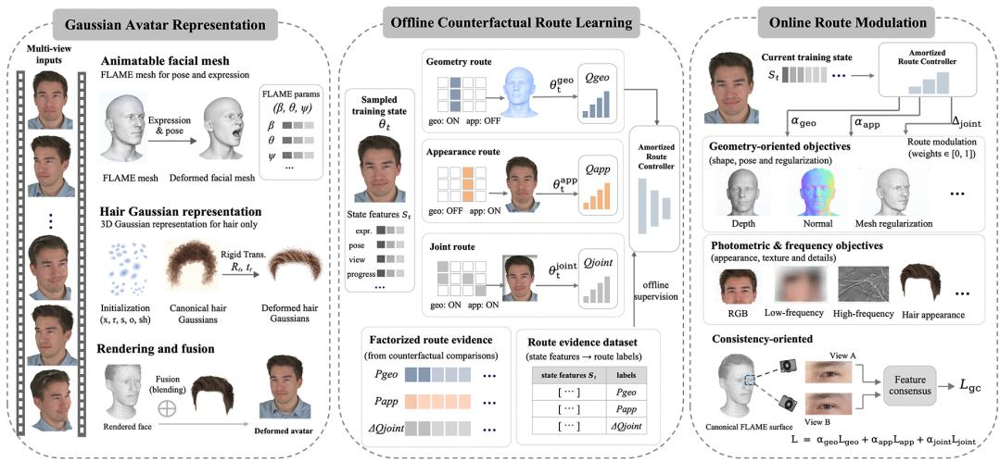  
Figure 1: Overview of the proposed framework. Multi-view observations are first integrated into a hybrid head avatar, with the face modeled by an animatable FLAME mesh and the hair represented by 3D Gaussians, which are jointly rendered to produce the final avatar. In the offline counterfactual route learning stage, geometry, appearance, and joint routes are instantiated from the same sampled training state and evaluated through route-restricted lookahead updates. Their realized utilities are then factorized into geometry–appearance preference and residual joint advantage, forming route evidence that is paired with the corresponding state features to supervise an amortized route controller. During online route modulation, the controller infers the current optimization preference from the training state and accordingly modulates geometry-oriented, photometric and frequency, and consistency-oriented objectives during training.

## 2.2 OPTIMIZATION STRATEGIES FOR AVATAR RECONSTRUCTION

Recent avatar methods increasingly organize reconstruction through progressive or structured optimization instead of maintaining an unchanged optimization emphasis throughout training. TetGS separates geometry and appearance optimization into different stages, Fresco progressively shifts supervision from low-frequency stabilization toward high-frequency refinement, and ProgressiveAvatars gradually expands representation capacity (Liu et al., 2025; Zhang et al., 2026; Song et al., 2026). Other methods introduce hierarchical refinement or structured consistency constraints to improve reconstruction stability, such as SVG-Head and MVCHead (Sun et al., 2025; Chharia & De la Torre, 2026). These approaches demonstrate the importance of coordinating heterogeneous objectives over the course of training. However, their optimization schedules, activation patterns, or relative emphasis are largely specified in advance, rather than determined according to the optimization demand of each individual training state.

## 2.3 ADAPTIVE AND MULTI-OBJECTIVE OPTIMIZATION

Adaptive optimization has been widely studied in multi-task and multi-objective learning, where optimization priorities are adjusted according to the current learning state rather than remaining fixed. Recent methods estimate task importance from parameter contributions, task-specific updates, bi-level objectives, or inter-task interactions (Jeong & Yoon, 2024; Hervella et al., 2024; Qin et al., 2025; Phan et al., 2025), while other studies analyze the trade-offs of dynamic objective balancing and aligned multi-objective settings (Chen et al., 2024; Efroni et al., 2025).

Such adaptive coordination is also relevant to head avatar reconstruction. However, existing methods typically infer optimization preference from instantaneous losses, gradients, parameter contributions, or meta-objectives. These signals describe the current optimization condition, but do not directly measure the effect of taking different update directions from the same training state. Determining state-dependent optimization preference from the realized outcomes of alternative updates therefore remains underexplored in head avatar modeling.

## 3 METHOD

Our method introduces state-dependent route coordination into head avatar optimization. $\mathbf { A } s$ illustrated in Fig. 1, starting from the same training state, we evaluate short-horizon geometry-oriented, appearance-oriented, and joint update routes, convert their realized outcomes into factorized route evidence, and amortize this evidence into a lightweight controller for low-cost modulation during full training. In the following, we first introduce the underlying avatar representation and baseline optimization, and then describe the counterfactual route evaluation, factorized route evidence, and amortized route optimization.

## 3.1 AVATAR REPRESENTATION AND BASELINE OPTIMIZATION

We adopt an animatable head representation (Wang et al., 2025a) that models the facial region with an explicit parametric surface and the hair region with 3D Gaussian primitives. At frame t, we represent the complete avatar as:

$$
\mathcal { A } _ { t } = \{ \mathcal { M } _ { t } , \mathcal { G } _ { t } \} ,\tag{1}
$$

where $\mathcal { M } _ { t }$ is the posed facial mesh and $\mathcal { G } _ { t }$ represents the corresponding hair Gaussian field. The facial geometry is parameterized by FLAME as:

$$
\mathcal { M } _ { t } = \mathcal { M } ( \beta , \psi _ { t } , \phi _ { t } ) ,\tag{2}
$$

where $\beta$ denotes the identity-dependent shape, and $\psi _ { t }$ and $\phi _ { t }$ denote the expression and pose at frame t, respectively. The hair region is represented by a set of anisotropic Gaussian primitives:

$$
\mathcal { G } _ { t } = \{ ( \pmb { \mu _ { i } } , \pmb { \Sigma _ { i } } , \mathbf { c } _ { i } , \alpha _ { i } ) \} _ { i = 1 } ^ { N } ,\tag{3}
$$

where $\mu _ { i } \in \mathbb { R } ^ { 3 }$ is the Gaussian center, $\Sigma _ { i }$ is the anisotropic covariance, $\mathbf { c } _ { i }$ denotes the appearance attributes, and $\alpha _ { i }$ is the opacity. The Gaussian field is deformed together with the current head state, allowing the hair representation to follow the animated avatar across different expressions and poses.

Given camera parameters $\Pi _ { t } ^ { v }$ for view $v ,$ the facial surface and hair field are rendered through mesh rasterization and Gaussian splatting, respectively, and are subsequently composited to form the final rendering:

$$
\hat { \bf \cal I } _ { t } ^ { v } = \mathcal { B } ( \mathcal { R } _ { \mathrm { m e s h } } ( \mathcal { M } _ { t } , \Pi _ { t } ^ { v } ) , \mathcal { R } _ { \mathrm { g s } } ( \mathcal { G } _ { t } , \Pi _ { t } ^ { v } ) ) ,\tag{4}
$$

where $\mathcal { R } _ { \mathrm { m e s h } }$ and ${ \mathcal { R } } _ { \mathrm { g s } }$ denote the differentiable renderers for the mesh and Gaussian components, and B denotes their compositing operation.

Training follows the reconstruction objective and optimization schedule of the underlying avatar framework. The supervision jointly constrains the rendered appearance, facial geometry, and representation regularity, while stage-dependent auxiliary terms may be activated as training proceeds. We denote all optimizable avatar parameters by Θ and the resulting training state at iteration t by $\Theta _ { t } .$ . This state summarizes the current solution reached under the baseline optimization and serves as the common starting point for the alternative parameter updates considered in the following counterfactual analysis.

## 3.2 COUNTERFACTUAL ROUTE EVALUATION

Given the current optimization state $\Theta _ { t } .$ , we seek to determine which update direction is locally more effective at this point of training. Rather than inferring such preference from pre-update statistics, such as loss magnitude or gradient strength, we directly compare the outcomes induced by alternative parameter updates.

We divide the optimizable parameters into two functional subsets, $S _ { g }$ and $S _ { a } ,$ according to their dominant roles in reconstruction. $S _ { g }$ mainly contains parameters associated with geometric structure and deformation, including facial shape and deformation variables, Gaussian spatial parameters, and hair deformation parameters. $S _ { a }$ contains parameters primarily responsible for appearance modeling, such as neural textures, appearance decoders, and Gaussian color coefficients. This partition is introduced only to instantiate controlled update directions, and we do not assume strict geometry– appearance disentanglement. For a route r, the trainable parameter subset is defined as:

$$
S _ { r } = \left\{ { \begin{array} { l l } { S _ { g } , } & { r = g , } \\ { S _ { a } , } & { r = a , } \\ { S _ { g } \cup S _ { a } , } & { r = j , } \end{array} } \right.\tag{5}
$$

where $g , a ,$ , and j denote the geometry, appearance, and joint routes, respectively. Parameters outside $S _ { r }$ are held fixed during the corresponding update.

We evaluate each route through a lookahead operation. Starting from the same state $\Theta _ { t } , \mathbf { a }$ lookahead temporarily applies a small number of optimization steps to the parameter subset $S _ { r }$ using the same mini-batch $B _ { t }$ and training objective $L _ { t } \mathbf { : }$

$$
\Theta _ { t } ^ { r } = U ^ { ( m ) } ( \Theta _ { t } , B _ { t } , L _ { t } ; S _ { r } ) ,\tag{6}
$$

where $U ^ { ( m ) }$ denotes an m-step route-restricted update and $\Theta _ { t } ^ { r }$ is the temporary state obtained under route r. In our implementation, we use a single-step lookahead, $\mathbf { i . e . , } m = 1$ . The resulting state is used only for route evaluation and is not retained in the main optimization trajectory.

This construction provides the counterfactual comparison used in our method. From the same training state $\Theta _ { t } .$ , we separately apply geometry-, appearance-, and joint-oriented updates and examine the outcomes that each update would produce. Since these alternative updates are evaluated from an identical starting point but are not simultaneously committed to the actual training trajectory, their resulting states provide counterfactual evidence about the local effect of different optimization directions.

To assess these outcomes, we consider the individual loss terms used by the current training objective and denote their set by $\textstyle { \mathcal { K } } _ { t }$ . Depending on the training stage, $\textstyle { \mathcal { K } } _ { t }$ may include photometric, geometric, regularization, frequency, and consistency terms. Let $l _ { k }$ denote the k-th loss term in $\textstyle { \mathcal { K } } _ { t }$ . Its relative improvement under route r is defined as:

$$
\Delta _ { k } ^ { r } = \frac { l _ { k } ( \Theta _ { t } ) - l _ { k } ( \Theta _ { t } ^ { r } ) } { | l _ { k } ( \Theta _ { t } ) | + \epsilon } , \qquad k \in \mathcal { K } _ { t } ,\tag{7}
$$

where ϵ is a small constant for numerical stability. A positive $\Delta _ { k } ^ { r }$ indicates an improvement in the corresponding loss term. Since different loss terms can have substantially different scales and response ranges, their relative improvements are normalized independently before aggregation.

Reducing some loss terms may still be accompanied by degradation of geometric structure. We therefore define a subset $\mathcal { H } _ { t } \subseteq \mathcal { K } _ { t }$ containing the geometric terms that directly reflect structural quality, including depth, normal, and mesh regularization terms. For each $k \in \dot { \mathcal { H } } _ { t }$ , we measure the adverse change as:

$$
D _ { k } ^ { r } = \operatorname* { m a x } \left( 0 , \frac { l _ { k } ( \Theta _ { t } ^ { r } ) - l _ { k } ( \Theta _ { t } ) } { \vert l _ { k } ( \Theta _ { t } ) \vert + \epsilon } \right) , \qquad k \in \mathcal { H } _ { t } .\tag{8}
$$

Thus, $D _ { k } ^ { r }$ is zero when the corresponding geometric term is preserved or improved, and becomes positive only when the route causes structural degradation. After component-wise normalization, the utility of route r is defined as:

$$
Q _ { r } = \sum _ { k \in \mathcal { K } _ { t } } w _ { k } \widetilde { \Delta } _ { k } ^ { r } - \lambda _ { h } \sum _ { k \in \mathcal { H } _ { t } } w _ { k } \widetilde { D } _ { k } ^ { r } ,\tag{9}
$$

where $\widetilde { \Delta } _ { k } ^ { r }$ and $\widetilde { D } _ { k } ^ { r }$ denote the normalized improvement and degradation, $w _ { k }$ is the weight of the corresponding loss term, and $\lambda _ { h }$ controls the penalty on structural degradation. The first term rewards routes that yield improvements across the current reconstruction objectives, while the second penalizes routes whose gains are accompanied by deterioration in geometry-sensitive terms. Thus, $Q _ { r }$ provides a balanced measure for comparing the realized local effects of different routes at the current training state.

Applying the above evaluation to the three routes yields $Q _ { g } , \ Q _ { a }$ , and $Q _ { j }$ , which provide statedependent evidence grounded in the realized outcomes of alternative updates. These utilities play different roles in characterizing the current optimization demand. While $Q _ { g }$ and $Q _ { a }$ describe the relative preference between geometry- and appearance-oriented updates, $Q _ { j }$ provides the reference for assessing whether coordinated optimization offers additional benefit beyond either individual route. This asymmetric interpretation motivates the factorized route evidence introduced in the next section.

## 3.3 FACTORIZED ROUTE EVIDENCE

A direct three-way interpretation of $Q _ { g } , Q _ { a }$ , and $Q _ { j }$ would obscure an important asymmetry among the candidate routes. The geometry and appearance routes represent two alternative directional updates, whereas the joint route serves a different role: it reveals whether coordinating both parameter subsets provides value beyond committing to either individual direction. Treating all three routes as equivalent alternatives would therefore entangle directional preference with collaborative benefit. To preserve this distinction, we factorize the counterfactual evidence into a geometry–appearance preference and a residual joint advantage.

We first convert the geometry and appearance utilities into a pair of normalized preference scores, $P _ { g }$ and $P _ { a } ,$ representing the relative preference for geometry- and appearance-oriented updates, respectively:

$$
P _ { g } = \frac { \exp ( Q _ { g } / \tau ) } { \exp ( Q _ { g } / \tau ) + \exp ( Q _ { a } / \tau ) } , \qquad P _ { a } = 1 - P _ { g } ,\tag{10}
$$

where τ controls the sharpness of the preference distribution. Rather than reducing the comparison to a hard route selection, $( P _ { g } , P _ { a } )$ provides a continuous characterization of the relative optimization preference between the two update directions. We then isolate the benefit that cannot be explained by either individual route alone. Specifically, we define the residual joint advantage as:

$$
\Delta Q _ { j } = Q _ { j } - \operatorname* { m a x } ( Q _ { g } , Q _ { a } ) .\tag{11}
$$

By referencing the stronger individual route, $\Delta Q _ { j }$ measures the additional benefit of coordinated optimization rather than the absolute quality of the joint update. A positive value indicates that jointly adapting the two parameter subsets provides additional utility beyond the better individual route, whereas a non-positive value indicates no such advantage at the current state. We denote the geometry–appearance preference by:

$$
{ \bf P } _ { t } ^ { g a } = ( P _ { g } , P _ { a } ) ,\tag{12}
$$

and summarize the factorized route evidence at state $\Theta _ { t }$ as:

$$
E _ { t } = ( \mathbf { P } _ { t } ^ { g a } , \Delta Q _ { j } ) .\tag{13}
$$

This representation explicitly separates directional preference from collaborative gain, providing a compact and interpretable characterization of the optimization demand at the current state. More importantly, it avoids forcing qualitatively different route effects into a single categorical decision, and provides the supervision through which counterfactual route evidence is amortized into the online optimization process.

## 3.4 AMORTIZED ROUTE OPTIMIZATION

Although counterfactual evaluation provides informative state-dependent route evidence, repeatedly executing multiple route-restricted updates during full training would introduce substantial compu tational overhead. We therefore amortize the offline evidence into a lightweight controller $f _ { \phi }$

$$
( \hat { P } _ { g } , \hat { P } _ { a } , \widehat { \Delta Q } _ { j } ) = f _ { \phi } ( \mathbf { x } _ { t } ) ,\tag{14}
$$

where $\mathbf { x } _ { t }$ denotes a compact descriptor of the current optimization state. The controller is supervised by the factorized evidence defined in Sec. 3.3, replacing explicit counterfactual evaluation during full training with a single forward prediction.

The offline and online stages use route evidence differently. During counterfactual evaluation, each route is isolated by updating only its associated parameter subset while keeping the remaining parameters fixed. During online training, parameter updates are no longer restricted. Instead, the predicted route evidence modulates the corresponding training objectives within a bounded range.

To realize this modulation, we organize the training objectives according to their dominant optimization effects into geometry-oriented, appearance-oriented, and consistency-oriented groups. This grouping is not intended to imply mutually exclusive effects; instead, it provides a low-dimensional optimization abstraction for regulating the relative emphasis among different update directions. The detailed objective assignment is provided in the supplementary material.

The factorized route evidence induces two complementary levels of control. The geometry– appearance preference first determines the relative emphasis between the two update directions:

$$
s _ { g } = \mathrm { c l i p } \left( 1 + \gamma ( \hat { P } _ { g } - \hat { P } _ { a } ) , s _ { \operatorname* { m i n } } , s _ { \operatorname* { m a x } } \right) , \qquad s _ { a } = \mathrm { c l i p } \left( 1 + \gamma ( \hat { P } _ { a } - \hat { P } _ { g } ) , s _ { \operatorname* { m i n } } , s _ { \operatorname* { m a x } } \right) ,\tag{15}
$$

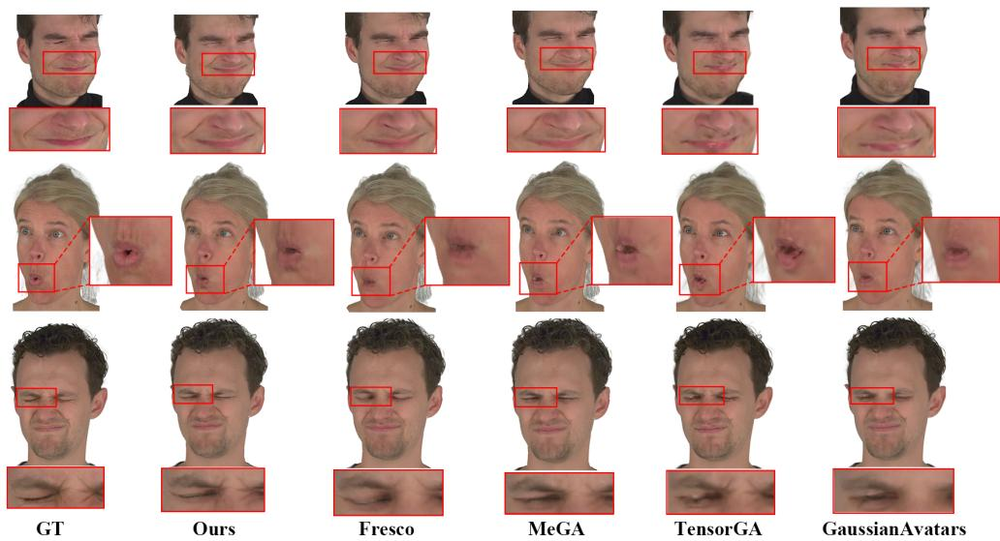  
Figure 2: Qualitative comparison on self-reenactment of head avatars. Our results preserve more accurate mouth shapes and eye structures under expression changes.

while the residual joint advantage provides an additional coordinated amplification:

$$
s _ { j } = \mathrm { c l i p } \left( 1 + \gamma \operatorname* { m a x } ( 0 , \widehat { \Delta Q _ { j } } ) , s _ { \mathrm { m i n } } , s _ { \mathrm { m a x } } \right) .\tag{16}
$$

Here, γ controls the modulation strength, and $s _ { \mathrm { m i n } }$ and $s _ { \mathrm { m a x } }$ denote the lower and upper bounds of the modulation factors, respectively. The first level determines the relative preference between geometry- and appearance-oriented updates, whereas the second determines whether both directions should receive additional coordinated amplification.

Let $L _ { g } , L _ { a }$ , and $L _ { c }$ denote the geometry-oriented, appearance-oriented, and consistency-oriented objective groups, respectively. The final training objective is written as:

$$
L _ { \mathrm { m o d } } = L _ { \mathrm { b a s e } } + ( s _ { g } s _ { j } - 1 ) L _ { g } + ( s _ { a } s _ { j } - 1 ) L _ { a } + ( s _ { j } - 1 ) L _ { c } ,\tag{17}
$$

where $L _ { \mathrm { b a s e } }$ denotes the original training objective. This formulation treats the baseline optimization as the reference and applies only bounded state-dependent corrections. The geometry–appearance preference controls the relative balance between the two directions, while the joint factor modulates their shared optimization strength.

For the consistency-oriented objective, we employ group-level cross-view consistency to associate corresponding local observations through the canonical facial structure and encourage consistent feature responses across synchronized views. Together with the directional and coordinated modulation above, the offline counterfactual evidence is thereby translated into efficient state-dependent optimization without requiring online route rollouts during full training.

## 4 EXPERIMENTS

## 4.1 EXPERIMENTAL SETUP

Dataset. We conduct experiments on the NeRSemble dataset, which provides synchronized multiview recordings of multiple subjects captured in a controlled studio using 16 calibrated cameras. Following the evaluation protocols adopted by GaussianAvatars (Qian et al., 2024) and MeGA (Wang et al., 2025a), we select 8 subjects for evaluation. Each subject contains eleven sequences, including ten sequences with predefined expressions or emotions and one free-form sequence. All frames are resized to 802×550, with foreground masks generated for each view. We additionally obtain semantic facial parsing maps and reconstruct per-frame depth maps using Metashape. For each subject, 9 predefined sequences and 15 camera views are used for training, while one predefined sequence and the remaining camera view are reserved for evaluation.

Table 1: Quantitative comparison on novel-view synthesis and self-reenactment. Results are averaged over 8 subjects.
<table><tr><td rowspan="2">Method</td><td colspan="3">Novel-View</td><td colspan="3">Self-Reenactment</td></tr><tr><td>PSNR↑</td><td>SSIM↑</td><td>LPIPS↓</td><td>PSNR↑</td><td>SSIM↑</td><td>LPIPS↓</td></tr><tr><td>Gaussian Head Avatar (Xu et al., 2024)</td><td>29.84</td><td>0.895</td><td>0.083</td><td>22.34</td><td>0.851</td><td>0.145</td></tr><tr><td>EAvatar (Zhang et al., 2025b)</td><td>30.16</td><td>0.898</td><td>0.082</td><td>22.56</td><td>0.852</td><td>0.145</td></tr><tr><td>GaussianAvatars (Qian et al., 2024)</td><td>31.50</td><td>0.935</td><td>0.060</td><td>29.75</td><td>0.930</td><td>0.066</td></tr><tr><td>MeGA (Wang et al., 2025a)</td><td>30.79</td><td>0.932</td><td>0.066</td><td>29.62</td><td>0.926</td><td>0.071</td></tr><tr><td>TensorGA (Wang et al., 2025b)</td><td>31.28</td><td>0.931</td><td>0.067</td><td>29.90</td><td>0.931</td><td>0.071</td></tr><tr><td>Fresco (Zhang et al., 2026)</td><td>31.80</td><td>0.938</td><td>0.058</td><td>30.30</td><td>0.929</td><td>0.064</td></tr><tr><td>Ours</td><td>31.90</td><td>0.939</td><td>0.058</td><td>30.49</td><td>0.931</td><td>0.063</td></tr></table>

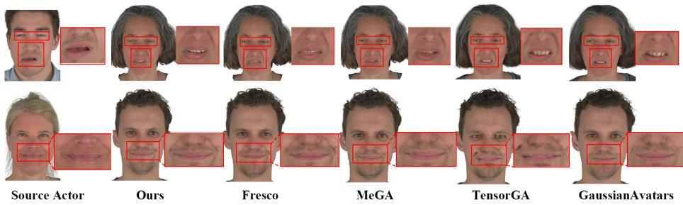  
Figure 3: Qualitative comparison on cross-reenactment of head avatars. Our results show cleaner lip boundaries and more coherent mouth structures under cross-identity expression transfer.

Settings. We evaluate the reconstructed avatars under novel-view synthesis, self-reenactment, and cross-reenactment. For novel-view synthesis, we render the avatar from the camera view excluded during training and compare the results with the corresponding ground-truth images. For selfreenactment, the avatar is driven by poses and expressions from the held-out sequence of the same subject and rendered across all 16 camera views. For cross-reenactment, the target avatar is driven using poses and expressions extracted from another subject, and the results are evaluated qualitatively due to the absence of paired ground truth. For quantitative evaluation, we report PSNR, SSIM, and LPIPS, with all metrics computed within the same foreground region to exclude the influence of background pixels.

## 4.2 COMPARISONS WITH STATE-OF-THE-ART METHODS

We compare our method with representative state-of-the-art animatable head-avatar approaches, including Gaussian Head Avatar (Xu et al., 2024), EAvatar (Zhang et al., 2025b), GaussianAvatars (Qian et al., 2024), MeGA (Wang et al., 2025a), TensorGA (Wang et al., 2025b), and Fresco (Zhang et al., 2026). These methods cover implicit, Gaussian-based, and hybrid avatar representations with different optimization strategies. All methods are evaluated under the same data split and evaluation protocol described above for fair comparison. As shown in Table 1, our method achieves consistent performance advantages across both novel-view synthesis and self-reenactment. Compared with Fresco, the two methods achieve relatively close quantitative performance, while our method shows more consistent advantages across the two evaluation settings. The subsequent qualitative comparisons further show that these improvements are also reflected in the preservation of local facial structures and fine details. Figures 2 and 3 show the qualitative comparisons on self-reenactment and cross-reenactment. Our method preserves clearer local structures and finer details, especially around the mouth, teeth, and eye regions, while competing methods more often exhibit blurred boundaries or incomplete local structures. Additional qualitative comparisons on novel-view synthesis and local reconstruction error visualizations are provided in the supplementary material (Figs. 5 and 6).

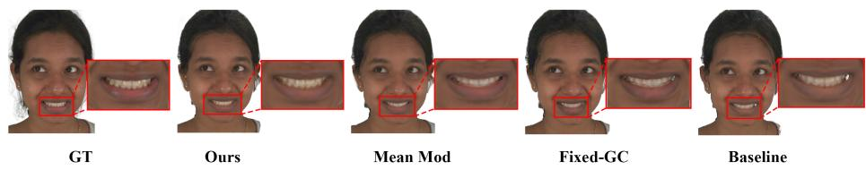  
Figure 4: Qualitative ablation of the route modulation strategy. The enlarged mouth regions show progressively reduced artifacts, with the full model recovering more complete teeth and cleaner lip boundaries.

Table 2: Ablation study of the route modulation strategy on novel-view synthesis and selfreenactment.
<table><tr><td rowspan="2">Method</td><td colspan="3">Novel-View</td><td colspan="3">Self-Reenactment</td></tr><tr><td>PSNR↑</td><td>SSIM↑</td><td>LPIPS↓</td><td>PSNR↑</td><td>SSIM↑</td><td>LPIPS↓</td></tr><tr><td rowspan="4">Baseline Fixed-GC Mean Mod.</td><td>30.36</td><td>0.952</td><td>0.066</td><td>29.60</td><td>0.948</td><td>0.067</td></tr><tr><td>30.98</td><td>0.954</td><td>0.060</td><td>30.04</td><td>0.950</td><td>0.064</td></tr><tr><td>31.33</td><td>0.954</td><td>0.061</td><td>30.19</td><td>0.952</td><td>0.062</td></tr><tr><td>31.71</td><td>0.956</td><td>0.057</td><td>30.98</td><td>0.954</td><td>0.060</td></tr></table>

## 4.3 ABLATION STUDY

Effect of Route Modulation. We first analyze the contribution of the proposed route modulation strategy to the final reconstruction quality on subject 264. Starting from the baseline, we introduce fixed-weight group consistency (Fixed-GC) to isolate the effect of additional cross-view supervision. We further construct a static Mean Mod. variant by averaging the modulation factors produced by the full controller over training and using these averages as fixed scaling factors in a separate retraining run. This provides a direct control for examining whether the improvement of the full model can be attributed simply to a better fixed weighting configuration. Detailed weight settings and training configurations are provided in the supplementary material.

As shown in Table 2, Fixed-GC improves over the baseline, confirming that cross-view consistency itself is beneficial. Mean Mod. further improves the overall reconstruction quality, indicating that the modulation learned by the controller also captures a more favorable global weighting than the original fixed configuration. However, the full model still achieves the strongest performance. Since Mean Mod. uses the average modulation of the full controller but removes its temporal variation, the remaining gap shows that a better fixed weighting alone is insufficient to account for the full gain. The state-dependent adjustment of optimization emphasis therefore provides an additional contribution during training.

The qualitative results in Fig. 4 exhibit a similar progression. The Baseline still contains noticeable local artifacts around the mouth region. These artifacts are reduced in Fixed-GC and further alleviated by Mean Mod. The full model recovers more complete tooth structures and cleaner lip boundaries, with local details that are closer to the ground truth.

## 5 CONCLUSION

This work approaches head avatar reconstruction from an optimization perspective, focusing on how different update directions should be coordinated as training evolves. Instead of relying on a fixed optimization configuration, we use the realized effects of alternative updates to characterize the current optimization preference and further translate this information into efficient state-dependent modulation. In this way, the proposed framework adapts the optimization emphasis during training while preserving the underlying avatar representation and reconstruction pipeline. Experiments on the NeRSemble dataset demonstrate improved reconstruction quality on novel-view synthesis and reenactment tasks, showing the effectiveness of state-dependent route coordination for high-fidelity head avatar modeling.

## AI USE STATEMENT

In this work, we used generative AI tools primarily for language editing and grammatical refinement of the manuscript. We also used generative AI tools to assist with reference verification, provide limited feedback on research methodology and experimental design, and conduct preliminary manuscript review and readability checks. All AI-assisted edits and suggestions were manually reviewed by the authors, and all references were verified against their corresponding official publication records. We take responsibility for the final content of this work, including text, claims, and artifacts produced with the aid of generative AI.

## REPRODUCIBILITY STATEMENT

We provide detailed implementation and training configurations in the supplementary material, including the counterfactual route evaluation, route-evidence construction, controller training, and online modulation settings. The data preprocessing procedure, evaluation protocol, ablation settings, and computational cost are also documented to facilitate reproduction of the reported results.

## ETHICS STATEMENT

This work uses publicly available human face data from the NeRSemble dataset and does not involve additional collection of personal data. All experiments are conducted for research purposes following the dataset’s established usage protocol.

## REFERENCES

Hongrui Cai, Yuting Xiao, Xuan Wang, Jiafei Li, Yudong Guo, Yanbo Fan, Shenghua Gao, and Juyong Zhang. Hera: Hybrid explicit representation for ultra-realistic head avatars. In Proceedings of the IEEE/CVF Conference on Computer Vision and Pattern Recognition (CVPR), pp. 260–270, June 2025.

Lisha Chen, Heshan Fernando, Yiming Ying, and Tianyi Chen. Three-way trade-off in multiobjective learning: Optimization, generalization and conflict-avoidance. Journal of Machine Learning Research, 25(193):1–53, 2024.

Zhao Chen, Vijay Badrinarayanan, Chen-Yu Lee, and Andrew Rabinovich. GradNorm: Gradient normalization for adaptive loss balancing in deep multitask networks. In Proceedings of the 35th International Conference on Machine Learning, volume 80 of Proceedings of Machine Learning Research, pp. 794–803. PMLR, 2018.

Aviral Chharia and Fernando De la Torre. Multi-view consistent 3d gaussian head avatars ’without’ multi-view generation. In Proceedings of the IEEE/CVF Conference on Computer Vision and Pattern Recognition (CVPR), pp. 40163–40174, June 2026.

Yonathan Efroni, Ben Kretzu, Daniel R. Jiang, Jalaj Bhandari, Zheqing Zhu, and Karen Ullrich. Aligned multi objective optimization. In Proceedings of the 42nd International Conference on Machine Learning, volume 267 of Proceedings of Machine Learning Research, pp. 14989–15017. PMLR, 2025.

Wei-Qi Feng, Dong Han, Ze-Kang Zhou, Shunkai Li, Xiaoqiang Liu, Pengfei Wan, Di Zhang, and Miao Wang. Gpavatar: High-fidelity head avatars by learning efficient gaussian projections. In 2025 IEEE/CVF Conference on Computer Vision and Pattern Recognition (CVPR), pp. 250–259. IEEE, 2025.

Philip-William Grassal, Malte Prinzler, Titus Leistner, Carsten Rother, Matthias Nießner, and Justus Thies. Neural head avatars from monocular rgb videos. In Proceedings of the IEEE/CVF Conference on Computer Vision and Pattern Recognition (CVPR), pp. 18653–18664, June 2022.

Alvaro S. Hervella, Jos ´ e Rouco, Jorge Novo, and Marcos Ortega. Multi-adaptive optimization for ´ multi-task learning with deep neural networks. Neural Networks, 170:254–265, 2024. doi: 10. 1016/j.neunet.2023.11.038.

Wooseong Jeong and Kuk-Jin Yoon. Quantifying task priority for multi-task optimization. In 2024 IEEE/CVF Conference on Computer Vision and Pattern Recognition (CVPR), pp. 363–372. IEEE, 2024.

Naihua Ji, Yongqiang Sun, Fanyun Meng, Liping Pang, and Yuzhu Tian. Variable multi-scale attention fusion network and adaptive correcting gradient optimization for multi-task learning. Pattern Recognition, 162:111423, 2025. doi: 10.1016/j.patcog.2025.111423.

Berna Kabadayi, Vanessa Sklyarova, Wojciech Zielonka, Justus Thies, and Gerard Pons-Moll. Physhead: Simulation-ready gaussian head avatars. In Proceedings of the IEEE/CVF Conference on Computer Vision and Pattern Recognition (CVPR), pp. 4109–4121, June 2026.

Alex Kendall, Yarin Gal, and Roberto Cipolla. Multi-task learning using uncertainty to weigh losses for scene geometry and semantics. In Proceedings of the IEEE conference on computer vision and pattern recognition, pp. 7482–7491, 2018.

Baijiong Lin, Weisen Jiang, Feiyang Ye, Yu Zhang, Pengguang Chen, Ying-Cong Chen, Shu Liu, Ivor W. Tsang, and James T. Kwok. Dual-balancing for multi-task learning. Neural Networks, 195:108317, 2026. doi: 10.1016/j.neunet.2025.108317.

Hanxi Liu, Yifang Men, and Zhouhui Lian. Creating your editable 3d photorealistic avatar with tetrahedron-constrained gaussian splatting. In 2025 IEEE/CVF Conference on Computer Vision and Pattern Recognition (CVPR), pp. 15976–15986. IEEE, 2025.

Hoang Phan, Lam Tran, Quyen Tran, Ngoc Tran, Tuan Truong, Qi Lei, Nhat Ho, Dinh Phung, and Trung Le. Beyond losses reweighting: Empowering multi-task learning via the generalization perspective. In 2025 IEEE/CVF International Conference on Computer Vision (ICCV), pp. 2440– 2450. IEEE, 2025.

Shenhan Qian, Tobias Kirschstein, Liam Schoneveld, Davide Davoli, Simon Giebenhain, and Matthias Nießner. Gaussianavatars: Photorealistic head avatars with rigged 3d gaussians. In Proceedings of the IEEE/CVF Conference on Computer Vision and Pattern Recognition (CVPR), pp. 20299–20309, June 2024.

Xiaohan Qin, Xiaoxing Wang, and Junchi Yan. Towards consistent multi-task learning: Unlocking the potential of task-specific parameters. In 2025 IEEE/CVF Conference on Computer Vision and Pattern Recognition (CVPR), pp. 10067–10076. IEEE, 2025.

Jianqiang Ren, Lin Liu, and Steven Hoi. Omg-avatar: One-shot multi-lod gaussian head avatar. In Proceedings ofthe IEEE/CVF Conference on Computer Vision and Pattern Recognition (CVPR), pp. 11017–11028, June 2026.

Kaiwen Song, Jinkai Cui, and Juyong Zhang. Progressiveavatars: Progressive animatable 3d gaussian avatars. In Proceedings of the IEEE/CVF Conference on Computer Vision and Pattern Recognition (CVPR), pp. 32518–32527, June 2026.

Heyi Sun, Cong Wang, Tian-Xing Xu, Jingwei Huang, Di Kang, Chunchao Guo, and Song-Hai Zhang. Svg-head: Hybrid surface-volumetric gaussians for high-fidelity head reconstruction and real-time editing. In 2025 IEEE/CVF International Conference on Computer Vision (ICCV), pp. 13326–13335. IEEE, 2025.

Anshul Thakur, Elena Gal, Soheila Molaei, Xiao Gu, Patrick Schwab, Danielle Belgrave, Kim Branson, and David A. Clifton. Information transfer across clinical tasks via adaptive parameter optimisation. In Proceedings of The 28th International Conference on Artificial Intelligence and Statistics, volume 258 of Proceedings of Machine Learning Research, pp. 3367–3375. PMLR, 2025.

Cong Wang, Di Kang, Heyi Sun, Shenhan Qian, Zixuan Wang, Linchao Bao, and Song-Hai Zhang. Mega: Hybrid mesh-gaussian head avatar for high-fidelity rendering and head editing. In Proceedings of the IEEE/CVF Conference on Computer Vision and Pattern Recognition (CVPR), pp. 26274–26284, June 2025a.

Yating Wang, Xuan Wang, Ran Yi, Yanbo Fan, Jichen Hu, Jingcheng Zhu, and Lizhuang Ma. 3d gaussian head avatars with expressive dynamic appearances by compact tensorial representations. In 2025 IEEE/CVF Conference on Computer Vision and Pattern Recognition (CVPR), pp. 21117– 21126. IEEE, 2025b.

Guoquan Wu and Zhe Wu. A multi-objective optimization framework for adaptive weighting in physics-informed machine learning. Proceedings of the AAAI Conference on Artificial Intelligence, 40(32):26885–26893, 2026. doi: 10.1609/aaai.v40i32.39900.

Jun Xiang, Xuan Gao, Yudong Guo, and Juyong Zhang. Flashavatar: High-fidelity head avatar with efficient gaussian embedding. In Proceedings of the IEEE/CVF Conference on Computer Vision and Pattern Recognition (CVPR), pp. 1802–1812, June 2024.

Yuelang Xu, Benwang Chen, Zhe Li, Hongwen Zhang, Lizhen Wang, Zerong Zheng, and Yebin Liu. Gaussian head avatar: Ultra high-fidelity head avatar via dynamic gaussians. In Proceedings of the IEEE/CVF Conference on Computer Vision and Pattern Recognition (CVPR), pp. 1931–1941, June 2024.

Dongbin Zhang, Yunfei Liu, Lijian Lin, Ye Zhu, Kangjie Chen, Minghan Qin, Yu Li, and Haoqian Wang. Hravatar: High-quality and relightable gaussian head avatar. In Proceedings of the IEEE/CVF Conference on Computer Vision and Pattern Recognition (CVPR), pp. 26285–26296, June 2025a.

Shikun Zhang, Cunjian Chen, Yiqun Wang, Qiuhong Ke, and Yong Li. Eavatar: Expression-aware head avatar reconstruction with generative geometry priors. arXiv preprint arXiv:2508.13537, 2025b.

Shikun Zhang, Yong Li, Yiqun Wang, Qiuhong Ke, and Cunjian Chen. Fresco: Frequency-spatial consistent optimization for fine-grained head avatar modeling. In Proceedings of the IEEE/CVF Conference on Computer Vision and Pattern Recognition (CVPR), pp. 40130–40139, June 2026.

Yufeng Zheng, Victoria Fernandez Abrevaya, Marcel C. B´ uhler, Xu Chen, Michael J. Black, and¨ Otmar Hilliges. I m avatar: Implicit morphable head avatars from videos. In Proceedings of the IEEE/CVF Conference on Computer Vision and Pattern Recognition (CVPR), pp. 13545–13555, June 2022.

Yufeng Zheng, Wang Yifan, Gordon Wetzstein, Michael J. Black, and Otmar Hilliges. Pointavatar: Deformable point-based head avatars from videos. In Proceedings of the IEEE/CVF Conference on Computer Vision and Pattern Recognition (CVPR), pp. 21057–21067, June 2023.

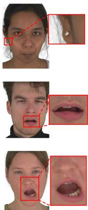  
GT

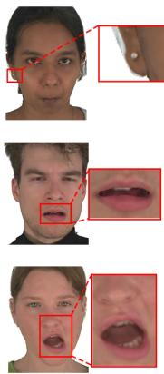  
Ours

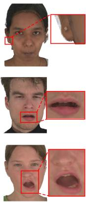  
Fresco

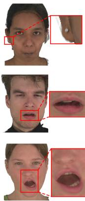  
MeGA

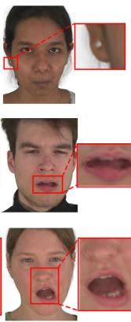  
TensorGA

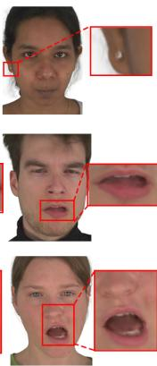  
GaussianAvatars

Figure 5: Qualitative comparison on novel-view synthesis of head avatars. Our results preserve cleaner local boundaries and more complete mouth and tooth structures across viewpoints, with fewer local artifacts than competing methods.

## A IMPLEMENTATION DETAILS

Training Configuration. All experiments are run on a single NVIDIA RTX A6000 GPU with 48 GB of memory. MeGA, Fresco, and our method are trained for 100 epochs per subject using a batch size of 16 and an initial learning rate of $1 \times 1 0 ^ { - 3 }$ . GaussianAvatars and TensorGA are optimized for 600K iterations according to their official training protocols.

Ablation Settings. The Baseline follows the original MeGA reconstruction objectives and their corresponding loss weights. For Fixed-GC, the consistency weight is empirically set to 0.002. We use synchronized two-view supervision with a relative view-angle range of 25◦–55◦ and a fallback target of 40◦. Each sample uses 512 candidate anchors and 16 valid local groups with a $4 1 \times 4 1$ patch size. The minimum foreground coverage is set to 0.8, the normal-visibility threshold to 0.2, and the two GT views are equally weighted when forming the consensus target.

Counterfactual Evidence and Route Controller. Offline route labels are generated from checkpoints sampled within the first 10% of the training trajectory. At each sampled state, geometry, appearance, and joint routes share the same training batch and perform a single lookahead update. Route improvements are normalized component-wise using percentile normalization, with $\epsilon = 1 0 ^ { - 8 } , \lambda _ { h } = 1$ , and a softmax temperature of τ = 1. The residual joint target is defined as $Q _ { j } - \operatorname* { m a x } ( Q _ { g } , Q _ { a } )$

The resulting state–label pairs are used to train a lightweight route controller with a 30-dimensional input descriptor and a hidden dimension of 64. The controller is fixed during subsequent avatar optimization. Online modulation starts after 20K iterations, with modulation strength set to 0.1 and all scaling factors clipped to [0.9, 1.1]. The controller is evaluated once per training iteration without additional online lookahead updates.

## B COMPUTATIONAL COST

We report the training and inference efficiency of different head avatar methods in Table 3. All timings are measured under the same hardware setting using a single NVIDIA RTX A6000 GPU.

Additional Offline Cost. The counterfactual evidence is generated from training states sampled within the first 10% of the training trajectory. The complete offline label-generation process takes approximately 1 h 46 min per subject, while training the lightweight route controller requires only about 3 minutes. Both stages are performed once before full avatar optimization.

Despite the additional training-time optimization, our method preserves nearly the same inference efficiency as MeGA and Fresco, requiring 57 ms per frame compared with 55 ms for both methods. This is because the route controller is only used during training and does not alter the avatar rendering pipeline at inference time.

Table 3: Training and inference efficiency of different head avatar methods.
<table><tr><td>Method</td><td>Training Time (h)↓</td><td>Inference Time (ms)↓</td></tr><tr><td>Gaussian Head Avatar</td><td>45</td><td>79</td></tr><tr><td>GaussianAvatars</td><td>7</td><td>17</td></tr><tr><td>TensorGA</td><td>10</td><td>21</td></tr><tr><td>MeGA</td><td>14</td><td>55</td></tr><tr><td>Fresco</td><td>17</td><td>55</td></tr><tr><td>Ours</td><td>17</td><td>57</td></tr></table>

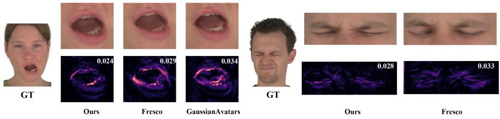  
Figure 6: Local reconstruction error visualization on novel-view synthesis and self-reenactment. The left example shows the mouth region for novel-view synthesis, while the right example shows the eye region for self-reenactment. Lower MAE values indicate smaller reconstruction errors.

## C ADDITIONAL RESULTS AND ANALYSIS

We also provide additional video results covering novel-view synthesis, self-reenactment, and crossreenactment in the supplementary files.

Novel-View Synthesis. Figure 5 presents additional qualitative comparisons on novel-view synthesis. Our method preserves clearer local structures and finer facial details across unseen viewpoints, particularly around the mouth and teeth regions. Compared with competing methods, it produces sharper local boundaries and more complete facial structures with fewer view-dependent artifacts.

Local Error Visualization. To better reveal fine-grained differences that are difficult to observe directly from RGB comparisons, we additionally visualize local reconstruction errors for one representative novel-view synthesis example and one representative self-reenactment example in Fig. 6. The left example focuses on the mouth region under novel-view synthesis, while the right example focuses on the eye region under self-reenactment. For each displayed region, we compute the mean absolute RGB error (MAE) between the rendered result and the corresponding ground truth, where a lower value indicates a closer local reconstruction. The error maps further make the spatial distri bution of the local reconstruction errors explicit. Compared with the displayed competing methods, our method shows lower local errors in both examples, particularly around the lip boundaries, innermouth structures, and eye contours.

Route-Evidence Ablation. We conduct the route-evidence ablation on subject 460 to analyze the two signals used by the route controller. The geometry–appearance signal determines whether the current training state should place relatively more emphasis on geometry or appearance optimization, whereas the joint signal determines whether both directions should be strengthened together.

Accordingly, GA-only retains only the geometry–appearance preference and disables joint amplification. In Joint-only, the geometry and appearance scales are both fixed to their neutral value, while the controller predicts only the joint scale, which modulates the two optimization directions together. We additionally construct a Parallel-Route variant that directly treats the geometry, appearance, and joint route utilities as three parallel preferences. The full model combines the geometry–appearance preference with the joint signal using the proposed factorized formulation.

Table 4: Ablation study of the route-evidence formulation on novel-view synthesis and selfreenactment.
<table><tr><td rowspan="2">Variant</td><td colspan="3">Novel-View</td><td colspan="3">Self-Reenactment</td></tr><tr><td>PSNR↑</td><td>SSIM↑</td><td>LPIPS↓</td><td>PSNR↑</td><td>SSIM↑</td><td>LPIPS↓</td></tr><tr><td>GA-only</td><td>34.13</td><td>0.966</td><td>0.030</td><td>32.80</td><td>0.959</td><td>0.038</td></tr><tr><td>Joint-only</td><td>33.89</td><td>0.966</td><td>0.030</td><td>32.84</td><td>0.960</td><td>0.038</td></tr><tr><td>Parallel-Route</td><td>34.78</td><td>0.967</td><td>0.027</td><td>32.92</td><td>0.960</td><td>0.036</td></tr><tr><td>Ours</td><td>35.38</td><td>0.967</td><td>0.025</td><td>33.14</td><td>0.961</td><td>0.035</td></tr></table>

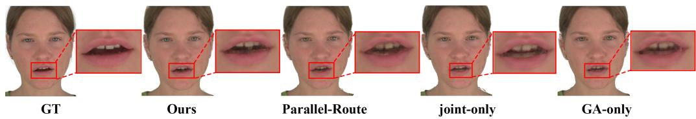  
Figure 7: Qualitative comparison of the route-evidence ablation on self-reenactment. The full model alleviates artifacts around the lower teeth and produces a cleaner local mouth structure than the ablation variants.

As shown in Table 4, using either signal alone results in lower overall performance, indicating that the geometry–appearance preference and joint modulation provide complementary information. The Parallel-Route variant further improves over the two single-signal variants, showing the benefit of retaining all three route utilities. However, treating the joint route as a parallel preference still underperforms our proposed factorized formulation, since it mixes directional preference with the additional benefit of coordinated optimization. The full model therefore achieves the strongest overall reconstruction quality, with the best PSNR and LPIPS under both evaluation settings while maintaining comparable SSIM.

As shown in Fig. 7, the ablation variants exhibit more pronounced artifacts around the lower teeth under self-reenactment, while the full model alleviates these artifacts and produces a cleaner local mouth structure.