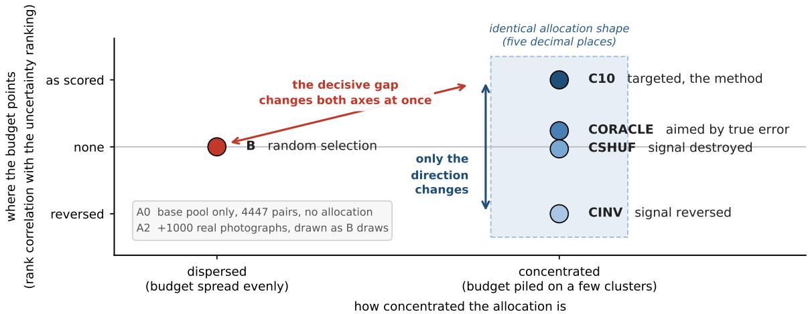
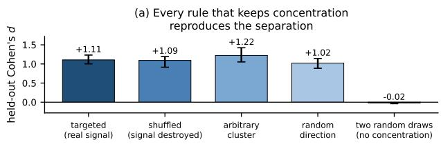
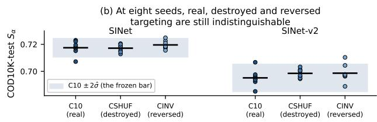
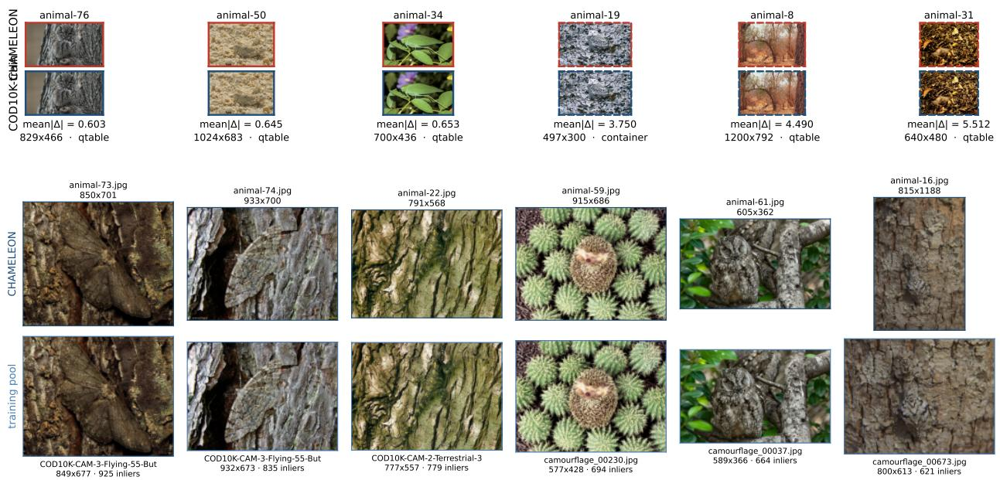

# Concentration, Not Uncertainty: Why Targeted Synthetic Data Doesn’t Help Camouflaged Object Detection

Akshat Dobhal Sanjay Singh

Manipal Institute of Technology, Manipal Academy of Higher Education, Manipal, India

akshat.dobhal@learner.manipal.edu, sanjay.singh@manipal.edu

October 2026

## Abstract

Camouflaged object detection requires pixel-accurate masks, but obtaining such annotations is slow and costly, making synthetic training images an attractive alternative. Under a fixed generation budget, however, it remains unclear which real-image regions to target for synthetic data generation. We study an uncertainty-guided generation strategy that clusters the unlabelled real images, identifies clusters on which the model is least certain, allocates synthetic generation toward those clusters, and iteratively retrains the model. Across 103 training runs, uncertainty-based targeting does not outperform random allocation. Five independent controls further show that this null result is not an artifact: targeted training sets are measurably different from random sets, but the diference is explained by concentrating the generation budget rather than by where uncertainty is concentrated, as every concentration rule we test reproduces the efect and, on boundary accuracy, so does aiming at the clusters the model was most certain about. Separately, we find substantial data contamination in CHAMELEON, with 50 of its 76 images duplicated from training data despite the standard overlap check reporting zero overlap. Together, these results show that, under a fixed synthetic-data budget, budget concentration, not uncertainty-based targeting, accounts for the observed training-set efects.

## 1 Introduction

Camouflaged object detection is a task aimed at generating an accurate pixel-level outline of an animal that evolved to blend into its surroundings. Its training masks are unusually expensive for exactly that reason: an annotator must decide where a boundary lies when the point of the object is to conceal its boundary. One standard response to the resulting scarcity is to manufacture more data. A generator takes a real cutout object and paints a fresh background around it, producing a new labeled pair at no annotation cost.

Generation is not free either, and every generated image has to be trained on. So if you generate a thousand of them, which thousand? Our answer is to let the model guide its own data generation: After initial training, we evaluate the model on unlabelled real images, identify the regions where highest uncertainty is observed, and target our synthetic data generation toward those regions. The methods of that loop are Standard and uses uncertainty sampling from active learning [33], a student–teacher disagreement score [37], clustering over self-supervised features [27] so the budget spreads rather than piling onto near-duplicates. The composition is ours, and we failed to make it function.

A targeted training set really is measurably diferent from a random one of the same size: a classifier, shown images from each, learns to tell which set an image came from even images it never saw. But it is picking up concentration, not aim. Targeting piles the budget onto a few clusters, and any rule that piles it the same way works just as well: point the same lopsided budget at the wrong clusters and the classifier still wins. Only removing the unevenness itself defeats it. What looked like the efect of targeting was the efect of concentrating, the comparison that settles it is not a random set, but one with the same lopsided shape aimed at nothing in particular.

In terms of trained accuracy, modifying the direction of the uncertainty signal shows no measurable efect that this design can resolve. That null is bounded rather than absolute, and a positive control confirms that the measurement detects a real efect. Substituting a perfect score using a test-set error for ours changes nothing. Extending training to accommodate extra images without reducing steps on real data shows no improvement. Moreover, re-running the decisive comparison at eight seeds per scenario leaves the gap smaller than it was at three. Separately, we expose a major flaw in the standard CHAMELEON test set, where 50 of its 76 images are direct copies from COD10K and CAMO training sets. Standard duplicate checks fail to flag these because they were re-saved in diferent formats, eliminating byte-level matches. The main contributions of this paper are:

• A control that separates aiming a generation budget from merely concentrating it. Because a steered selection difers from random in two ways at once where it points and how unevenly it is spread a random baseline conflates them. Ours fixes the shape and scrambles only the signal; our own method does not survive it.

• A bounded null on the direction, defended by five independent controls: a positive control, a perfect-score oracle, an unpinned optimization schedule, a same-shape shufle, and a seed expansion rather than asserted once.

• Three checks run before any training and precede any cluster-wise acquisition policy: whether the target data clusters at all, what the funded clusters are made of, and how much of the endpoint’s error sits between clusters rather than within them.

• CHAMELEON is 50 of 76 images (65.8%) training data for models trained on COD10K, while exact hashing reports 0 overlap; we release a re-encode-tolerant detector, the confirmed pair list and a clean evaluation protocol.

## 1.1 Related Work

This paper asks whether an acquisition policy, a rule for deciding which synthetic images to generate under a fixed budget can improve a pipeline that is otherwise held fixed. The task it does that on is camouflaged object detection, which asks for a pixel-accurate outline of an object whose color and texture are built to defeat exactly that; [10] surveys its architectures, datasets, and evaluation conventions.

A prediction is scored by how well its mask matches the true one. Our primary measure is the S-measure S [6], which rewards getting an object’s shape right rather than counting correct pixels, and which runs from 0 to 1 with higher being better. The scale matters for reading everything that follows. Every camouflaged object detector in this paper scores near 0.70, so the diferences the paper turns on are small fractions of the range these models actually occupy. Three words then recur. An arm is one training condition; all arms share a base pool of labeled images and difer only in which images are appended to it. A seed is one training run of one arm, repeat runs of the same arm do not return the same score, and the size of that seed-to-seed spread is what any real diference has to beat. An endpoint is a held-out test set from which a verdict is read. Finally, the reference efect is the improvement this repository reproduced for the published method it builds on, $0 . 7 0 3 0  0 . 7 1 7 2 , 0 \mathrm { r } + 0 . 0 1 4 2$ . That is the size of efect this design had to be able to resolve, and the yardstick every sensitivity claim in this paper is measured against. The closest are LAKE-RED [41], whose background generation and compositing we use unchanged, and S2R-COD [24], whose synthetic-to-real self-training protocol we follow. Relative to both, the only thing we add is an allocation layer that chooses which generated images to append; the generator, the budget, and the training procedure are left alone. Synthetic-augmentation methods such as DatasetDM [39] address how to construct labeled data at all, which is a diferent question from how to spend a fixed amount of it.

Every part of it is standard. Uncertainty sampling comes from active learning [33], except that our query is answered by a generator rather than by a human annotator; the uncertainty is studentteacher disagreement of the kind mean-teacher training already minimises [37]; and k-means over frozen self-supervised features [27, 30] keeps the budget from piling onto near-duplicates, in the spirit of core-set selection [32]. Other constructions exist: deep ensembles [20], MC-dropout [12], BADGE [1], and Section 3.3 measures an ensemble and predictive entropy alongside ours, but we propose none. What is contributed here is a controlled test of the composition.

Three recent systems share the premise that a generation budget should be steered rather than spent uniformly. GAUDA [11] conditions a latent difusion model on the classes a Bayesian mode is least certain about; DisCL [23] steers image-guidance strength along a curriculum; SynQuE [3] ranks whole synthetic datasets using only unannotated real data. None of the three runs a control that holds the allocation’s shape fixed while destroying the signal inside it, and that turns out to be the control that decides the question, because a steered selection difers from a random one in two ways at once, where the budget points, and how unevenly it is spread. Appendix A places these systems side by side and covers benchmark definitions and generative alternatives. Section 2 specifies the loop we built and the arms that separate those two things.

## 2 Methods

In this section, we introduce our approach of uncertainty guided generation in the loop. We train a model on a labeled set of images, evaluate on the unlabeled real images, and find the ones it handles least confidently. Then we ask a generator for new images resembling those, add them to the training set, and train again. What follows is our instantiation of that idea, specified exactly, because a null result is only as informative as the thing it tested.

We train on a synthetic data source pool of 4447 labelled image and mask pairs and want the model to work on a target pool of 4040 unlabelled real images, with verdicts read from two held-out endpoints: COD10K-test decides, and NC4K is reported. The target pool is not one distribution but a mixture of 3040 COD10K images and 1000 from CAMO, which matters later (Section 3.3). Training runs in two rounds: a student trains alongside a teacher that is a slowly updated running average of its own weights, target images that the two already agree on are appended between rounds with the teacher’s prediction as their label, and round two retrains from scratch on the enlarged pool. Two properties the phrase “closed loop” hides both bound what follows; the round count is a fixed constant, not a convergence criterion, and the generator renders its pool once, ofline, and is never invoked during training.

A fixed generation budget has to be spent somewhere, and our rule spends it where the model is weakest. (i) Group the target images, so that “weak” can name a region of the data rather than a single image: k-means into $k = 7 5$ clusters over L2-normalized self-supervised embeddings, fitted once and never refitted. (ii) Score each image for uncertainty. We need a number, computable without labels, that says how unsure the model is; the natural candidate is how far the student and its own running average disagree, which is available precisely because the consistency loss is already trying to reduce it:

Table 1: Every arm shares one base pool and difers only in what is appended to it. The last two columns are the axes of Figure 1: how concentrated the allocation is, and where it points. The C-family are permutations of a single allocation, so they hold concentration fixed and difer only in direction; the digits in C10 record the allocation temperature, $\tau = 1 . 0$ . None of A0, A2 and MT has an allocation to place.
<table><tr><td>Arm</td><td>What it appends</td><td>Concentration</td><td>Direction</td></tr><tr><td>A0</td><td>nothing</td><td></td><td></td></tr><tr><td>A2</td><td>1000 real photographs</td><td></td><td></td></tr><tr><td>B</td><td>1000 renders drawn uniformly at random</td><td>dispersed</td><td>none</td></tr><tr><td>C10</td><td>the 1000 the allocation selects</td><td>concentrated</td><td>as scored</td></tr><tr><td>CSHUF</td><td>C10&#x27;s quotas, cluster scores permuted</td><td>fixed, same shape destroyed</td><td></td></tr><tr><td>CINV</td><td>C10&#x27;s quotas, their rank reversed</td><td>fixed, same shape reversed</td><td></td></tr><tr><td>CORACLE</td><td>C10&#x27;s quotas, reassigned by true endpoint error</td><td>fixed, same shape true error</td><td></td></tr><tr><td>MT</td><td>A0FX, BFX, C10FX A0, B, C10 with the optimisation budget unpinned as A0, B, C10 nothing; A0&#x27;s pool run single-round</td><td></td><td>as A0, B, C10</td></tr></table>

$$
\mathrm { E S } ( { \boldsymbol { x } } ) = a \left\| \nabla \sigma ( s ( { \boldsymbol { x } } ) ) - \nabla \sigma ( t ( { \boldsymbol { x } } ) ) \right\| _ { 1 } + b \mathrm { B C E } { \big ( } \sigma ( s ( { \boldsymbol { x } } ) ) , \sigma ( t ( { \boldsymbol { x } } ) ) { \big ) } ,\tag{1}
$$

with student and teacher logits $s , t ,$ sigmoid $\sigma ,$ Sobel gradient magnitude ∇, binary cross-entropy BCE, and configured weights a, b in Appendix B. What this buys is a score needing no ground truth, computable on exactly the images the model will be judged on; a cluster’s score is the mean over its members. Its dominant term is the distance between gradient magnitudes, which makes it a boundary-focused signal; a fact Section 3.2 returns to. (iii) Turn scores into a budget split. The budget is spread by a softmax over the cluster scores in units of their across-cluster standard deviation, at temperature $\tau = 1 . 0$ (Appendix B); τ sets how sharply the budget piles onto the worst clusters. (iv) Fill each quota by drawing the foregrounds whose masked cutouts sit closest to the funded cluster’s centroid.

All arms (Table 1) share the same base pool and difer only in which 1000 images are appended to it, so any diference between two of them is attributable to that choice and nothing else. A0 appends nothing. A2 appends 1000 real photographs, which separates the efect of a larger pool from the efect of generated content. B appends 1000 renders drawn uniformly at random, redrawn per seed. C10 appends the 1000 that the allocation above selects. A2, B and C10 all hold 5447 pairs, and the comparison this paper turns on is C10 against B.

That comparison cannot settle the question on its own, and Figure 1 is why: a targeted allocation difers from a random one along two axes at once, it is more concentrated, and it points somewhere, so a diference between C10 and B is attributable to neither. Three further arms hold concentration exactly fixed and vary only where the budget points. CSHUF permutes the cluster scores, destroying the signal while preserving the allocation’s shape; CINV reverses their rank; CORACLE reassigns the quotas based on each cluster’s true endpoint error.

  
Figure 1: What each arm holds fixed and what it varies. The horizontal axis is how concentrated an allocation is; the vertical axis is where it points, measured as rank correlation with the committed uncertainty ranking. Because the C-family are permutations of one allocation, they reproduce its shape to five decimal places and difer only vertically, which is what makes the vertical contrast clean and the diagonal one ambiguous. A0 and A2 append nothing and no generated content, respectively, so neither has an allocation to place. Sources: abc pools.json; T2 RESULTS.md; results.md §5.2.

Write $\hat { \sigma }$ for the seed-to-seed wobble, the pooled within-arm standard deviation of $S _ { \alpha }$ , taken at the conventional α = 0.5. A gap is a real effect only if it exceeds twice that wobble and every seed agrees on its sign; a smaller gap is within noise; one that clears the bar without agreeing in sign is inconclusive, and is reported as such rather than resolved by adding seeds. The rule applies per architecture, and a disagreement between them is reported as a disagreement. We report no $p -$ values at three seeds. Appendix B records the rule’s provenance, the seeds, and the gates each campaign passed before launching.

## 3 Results

Four analyses follow, each measured independently of the others: whether the targeted allocation beats a random one on trained accuracy, what makes a targeted set measurably diferent, regardless of that null, the mechanism behind the null, and a separate finding about the benchmark used to read all of the above.

## 3.1 Does Targeting Beat Random

The loop is specified, so the first question is the one it was built to answer. Aiming the budget by uncertainty did not beat spending it at random. On the primary endpoint at eight seeds per arm, the gap between the targeted allocation and a random one is +0.0024, about a third of the spread it would have had to clear, and every one of the sixteen gaps that campaign decides returns the same verdict.

A null is only as good as the objections it survives, so the rest of this section is those objections and what each one was answered with. Table 2 is the whole trained record: four campaigns that return nothing, and one that returns something, which is how we know the four nulls mean anything at all.

Table 2: Trained comparison on the primary architecture and endpoint. A gap must exceed its own campaign’s bar and agree in sign across seeds to count. Four campaigns attack the decisive gap from diferent directions and none of them moves it; the positive control, which compares against a method we expected to be clearly worse, clears its bar more than threefold. Per-cell tables for both architectures and both endpoints are in Appendix C. Sources: abc verdict.json and its or/, fx/, se/ variants; pc verdict.json.
<table><tr><td></td><td>What it tests</td><td>n</td><td>Gap</td><td>∆</td><td>2ô</td><td>× bar</td><td>Verdict</td></tr><tr><td>ABC</td><td>targeting vs. random, as committed</td><td>3</td><td>C10-B</td><td>+0.0050</td><td>0.0179</td><td>0.28</td><td>WITHIN NOISE</td></tr><tr><td>SE</td><td>the same gap at eight seeds</td><td>8</td><td>C10-B</td><td>+0.0024</td><td>0.0069</td><td>0.34</td><td>WITHIN NOISE</td></tr><tr><td>OR</td><td>a perfect score in place of ours</td><td>3</td><td>CORACLE-B</td><td>+0.0008</td><td>0.0061</td><td>0.14</td><td>WITHIN NOISE</td></tr><tr><td>FX</td><td>the optimisation budget unpinned</td><td>3</td><td>C10FX-BFX</td><td>+0.0014</td><td>0.0116</td><td>0.12</td><td>WITHIN NOISE</td></tr><tr><td>PC</td><td>can this design see anything?</td><td>3</td><td>C10-MT</td><td>+0.0197</td><td>0.0060</td><td>3.31</td><td>DETECTED</td></tr></table>

That is the plain form of what the seed expansion returned, and it is worth stating before the arithmetic, because the arithmetic looks backward. Eight seeds per arm give a truer estimate of the seed-to-seed spread than three did: the real spread is larger than the optimistic three-seed guess, while the gap itself halved, from +0.0050 to +0.0024. So the bar sits at 0.0069 on 28 degrees of freedom, not the 0.0034 the pre-registration projected: ˆσ is a per-run spread and does not shrink with seeds, so that projection was an error. The gap now sits inside even the tightest bar measured on this cell, 0.0055. Appendix C gives the per-arm spreads.

Each of the following is a reason the null might be an artifact rather than a result, and each has a campaign attached rather than a concession.

Perhaps we chose a bad uncertainty estimator. The oracle campaign replaces the score with each cluster’s true error on the endpoint, information no real method could have, and nothing moves. All eight of its gaps are within noise, and not one is even directionally stable. The substitution was not a small one, either. Our score and the truth it stands in for agree at a rank correlation of +0.2372, so we replaced the signal with something several times better aimed, and the trained result did not notice. This converts our score did not help into the stronger no score of any quality helped here.

Perhaps the added images were never really trained on. They were not, under the committed schedule: steps per epoch are set by the shorter of two data loaders, so appended images displace base-pool exposure instead of adding to it. The FX campaign removes that pin, which raises steps per epoch from 253 to 341 on one architecture and 127 to 171 on the other. The decisive gap stays within noise in all four cells and shrinks to +0.0014. Growing the budget did not reveal the efect the pin was hiding.

Perhaps three seeds are too few. It was, and that is what the seed expansion above measures. It is a separate campaign with its own arms, noise estimate, and verdicts rather than extra seeds bolted onto a finished one, because adding seeds after seeing a result is how a null gets talked into existence.

The instrument is not blind. A null is only worth reading if the same measurement can detect something real, so we trained an arm we expected to be clearly worse, a mean-teacher baseline, same architecture, same seeds, same scorer, same rule, and asked whether this design would see the diference. It did, comfortably and with every seed agreeing. And that control does not close the gap that matters most. It shows an efect of roughly the reference magnitude is visible; it does not show that an efect the size of our nulls would be. The control’s own bar, 0.0060, is itself larger than the decisive gap it is meant to reassure us about, so a positive control at 0.02 licenses the instrument works, not it would have seen the efect we are nulling.

The decisive statement is the pre-registered one above: no efect on the primary cell larger than the bar the seed expansion measured. A post-hoc interval on the two arms actually compared is tighter still, placing the gap in [−0.0020, +0.0067], which excludes the reference efect by more than a factor of two while admitting efects a few times smaller. That interval decides nothing, the frozen rule admits no interval but it is a stronger honest statement than “we could not have seen it”. Section 3.2 reports the eight-seed equivalence tests.

## 3.2 Concentration, Not Targeting

The null hypothesis states that the direction of the signal did not move the endpoint. It does not say that targeting changes nothing, and it plainly does change something, because a targeted training set is easy to tell apart from a random one. What makes it diferent is that the budget is concentrated on a few clusters, not that it is aimed at the right ones. The geometry of the selected set shows it; trained accuracy at eight seeds is consistent with it, and the one family of metrics on which concentration is large enough to resolve supports it, post hoc and on one architecture.

Aim a generation budget at the clusters where the model is least confident and the training set you get really does look diferent from a randomly chosen one of the same size, train a probe to tell the two apart. It succeeds easily, on images it has never seen. However, re-run the selection with the uncertainty scores shufled between clusters, so the budget is spread exactly as unevenly while pointing at the wrong places, and the separation survives. Aim at an arbitrary cluster instead: it survives again. Only removing the unevenness itself, by drawing two random sets of equal size, collapses it (Figure 2a). The probe was detecting the concentration the whole time.

Paired across twenty cells of budget and configuration, the real signal contributes +0.0073 of a Cohen’s d over its own shufle, and against an arbitrary cluster it is negative, at −0.0649. On the strongest directional evidence we have, aiming does slightly worse than not aiming. What targeting buys is narrowness rather than reach: its embedding covariance has a lower efective rank than a random draw’s in all twenty cells (mean ratio 0.634), and covers no more of the target manifold.

Geometry is not performance, so we trained it. The falsification arms hold the allocation’s shape fixed to five decimal places and vary only where the budget points, and at eight seeds per arm the arm that reverses the uncertainty signal, aiming the budget at the clusters the score calls easiest has the highest mean score in four of the four architecture–endpoint cells (Figure 2b). This is not a claim that reversal helps, every one of those diferences is within noise. It is the absence of an ordering: if direction were what mattered, reversing it would cost something, and nothing is paid. Even the destroyed-against-reversed contrast, which carries the strongest sign agreement in the campaign at 8/8 on one cell, does not reach two-thirds of its bar.

At eight seeds, a formal equivalence test becomes informative. However, it adds no asymmetry: five of sixteen gaps are equivalent within ±0.005, four direction contrasts and one targeting-versusrandom gap, on NC4K (Table 6). On the primary cell, targeting against its own shufle is equivalent $( p = 0 . 0 1 9 )$ and targeting against random is not $( p = 0 . 1 0 1 )$ ). These tests are post-hoc and decide nothing.

The acquisition signal of Equation 1 is boundary-focused, but $S _ { \alpha }$ is structure-aware rather than boundary-specific, so the campaign never measured the quantity the signal was built to move. Rescoring every run’s committed predictions with two boundary metrics closes that gap (Table 3), and on SINet, the concentration efect finally clears its bar. So does the anti-targeted arm, at 1.34× against targeted selection’s 1.37×, the same efect to within a tenth of a bar, while the two direction contrasts stay far inside it. This is the strongest form of the result we have, because it is the one place where the same instrument resolves concentration and fails to resolve direction in the same cells: the null on direction is not simply an absence of sensitivity.

Table 3: Arm diferences on boundary metrics, COD10K-test, same pooled-ˆσ rule. Post-hoc: not pre-registered, and no verdict is re-decided. On SINet the concentration gap C10 − B clears its bar — and so does the anti-targeted CINV − B, by as much — while both direction contrasts stay within noise. SINet-v2 resolves none of it. Source: diag subgroups.json.
<table><tr><td>Arch.</td><td>Metric</td><td>2ô</td><td>C10-B</td><td>CINV-B</td><td>C10-CSHUF</td><td>C10-CINV</td></tr><tr><td>SINet</td><td>Boundary IoU</td><td>0.0101</td><td>+0.0138 3/3</td><td>+0.0135 3/3</td><td>+0.0038 2/3</td><td>+0.0004 2/3</td></tr><tr><td>SINet</td><td>Boundary F</td><td>0.0151</td><td>+0.0190 3/3</td><td>+0.0173 3/3</td><td>+0.0045 2/3</td><td>+0.0017 2/3</td></tr><tr><td>SINet</td><td>IoU</td><td>0.0109</td><td>+0.0112 3/3</td><td>+0.0127 3/3</td><td>+0.0019 2/3</td><td>-0.0016 2/3</td></tr><tr><td>SINet-v2</td><td>Boundary IoU</td><td>0.0062</td><td>+0.0010 2/3</td><td>+0.0025 2/3</td><td>-0.0002 2/3</td><td>-0.0015 3/3</td></tr><tr><td>SINet-v2</td><td>Boundary F</td><td>0.0065</td><td>+0.0026 2/3</td><td>+0.0050 3/3</td><td>-0.0002 2/3</td><td>-0.0025 3/3</td></tr><tr><td>SINet-v2</td><td>IoU</td><td>0.0100</td><td>-0.0003 2/3</td><td>+0.0006 2/3</td><td>-0.0013 2/3</td><td>-0.0010 2/3</td></tr></table>

Bold marks a gap exceeding 2ˆσ with $3 / 3$ sign consistency; counts after each ∆ are sign-consistency across the three seeds. The pattern is not an artifact of where predictions are binarised — Appendix C gives the threshold sweep.

  
Figure 2: (a) How far a selected set sits from a random set of the same size, in held-out Cohen’s d. Every rule that keeps the allocation’s concentration reproduces the separation; only destroying concentration collapses it. Bars are means across the four cells at a budget of $N = 2 5 0$ ; whiskers show the range. (b) Trained $S _ { \alpha }$ at eight seeds for the three arms that hold concentration fixed and vary only direction; points are seeds, rules are arm means, the band is the $\pm 2 \hat { \sigma }$ bar. Sources: c1 attribution.csv; out/se/abc metrics.csv.

These metrics were not pre-registered and re-decide no verdict; Table 2 stands. They binarise predictions where $S _ { \alpha }$ does not, though the pattern survives every binarisation threshold we swept. Moreover, SINet-v2 resolves none of it, which we report rather than leading with the architecture that cooperates.

## 3.3 Why It Fails

Concentration explains why targeting looks the way it does. It does not explain why this loop could never have delivered the thing it promised, and that has a mechanism, one chain, measured end-to-end before any of the training runs above were scored.

Under every embedding we tried, k-means separation peaks at a silhouette of 0.1600 and is lower in the other two spaces, far below any conventional threshold for calling a partition real. So a cluster-wise policy is drawing lines that the data does not support; and even where those lines are real, the error does not sit between them. Only about a fifth of the endpoint’s structural-error variance is between-cluster at all, so four fifths of what a targeted policy would have to fix is invisible to any cluster-level allocation, however well aimed.

CAMO images are 24.8% of the target pool, and the allocation is not neutral between the two components: 51.5% of the budget lands on them, while the two largest quotas together hold 7 of the 2026 images the paper is scored on (Table 12). “Allocate by uncertainty” turns out to be, in substantial part, “allocate to CAMO,” and the quantity doing the allocating is itself the wrong one. The uncertainty score tracks per-pixel error about twice as strongly as it tracks the structural error the endpoint measures (+0.8553 against +0.4276), and under whole-image aggregation, that ordering holds for three families of uncertainty estimators on both architectures, so it is a property of uncertainty-guided allocation here rather than a quirk of our particular score. Partialling out object area, the most plausible mechanical explanation, raises the structural correlation in every row, the opposite of what the confound predicts. It paints backgrounds and copies objects: the render set is a bijection onto the base foregrounds, and not one of 8885 traced objects shows any sign of having been regenerated. The distribution it produces is narrower than its own input, synthetic images cover 0.13 to 0.54 of the real target manifold (k-NN recall, Appendix E), while the generator’s own source photographs, real pictures of an entirely diferent genre, cover 0.71 to 0.75. A policy allocating over that pool is choosing among copies.

One pattern points the other way, and we report it. Pool size may matter where pool content does not: A0, which appends nothing, trails the other arms consistently, reaching a real effect on the secondary endpoint and two inconclusive verdicts once the schedule is unpinned. No single step clears its bar, and we claim nothing from it, but it points away from our conclusion, which is why it is here. Separately, we withdrew one of our own candidate causes: we suspected the generator’s conditioning channel was too narrow to act on a detailed instruction, read the released source, and found four routes carrying foreground information, with the dominant one bypassing the bottleneck we had blamed; so the explanation was wrong and is retired rather than left standing. Appendix D gives the full clustering sweep, the signal-generality table, and the area control.

## 3.4 CHAMELEON Is Mostly Training Data

The causes above are about our loop. This one is about the benchmark everyone uses, and it holds whether or not our loop worked. Fifty of CHAMELEON’s 76 images, 65.8% are the same photographs as images in the COD10K-train and CAMO training pools, re-encoded, rescaled, or cropped. Forty-four have their partner in the public COD10K-train split. A model trained on that split has therefore already seen most of CHAMELEON before being evaluated on it. The standard check does not notice: hashing the files returns zero overlap, and it is not wrong, the copies were re-saved in a diferent format, so not one byte matches while every pixel does. Sixteen images resolve neither way and are reported unchecked rather than clean, so 50 is a floor rather than an estimate.

The count is measured in two tiers (Figure 3). The floor is what a released same-dimension detector reproduces on any machine: 41 images whose partner shares their exact pixel dimensions and difers only by re-encoding. A rescaled or cropped copy leaves its dimension group and is invisible to that detector, so we recover those by matching keypoints under a geometric model and then because agreeing on a homography is not the same as being one photograph, warping each candidate into the CHAMELEON frame and measuring the residual. Nine survive that test; one cleared the keypoint threshold, failed the residual, and is excluded. Thresholds are calibrated on pairs whose answer is already committed, the finding is verified against a byte-identical authorsourced release, and the same detector pointed at NC4K flags 0 of 120 (Appendix F).

  
Figure 3: Two tiers of the same finding. Top: six of the 41 same-dimension re-encodes the CHAMELEON image above, its training-pool partner below. Bottom: six of the 9 recovered by geometric adjudication, which the same-dimension detector reports unchecked because a rescale or a crop moves an image out of its dimension group; note the difering pixel dimensions in each pair’s labels.

We expected the contamination to flatter CHAMELEON scores, measured it, and did not find it: all eight dificulty percentiles for the leaked subset fall between 0.448 and 0.559. A protocol violation does not need a score advantage to disqualify a benchmark. Nor do we recommend reporting CHAMELEON on its uncontaminated subset, because that subset is now 10 images, one of which is byte-identical to an image in the split we select checkpoints on. A ten-image endpoint is not an endpoint: report COD10K-test and NC4K instead, and disclose the unchecked share.1 The detector, the pair list, and the clean protocol are released and run without any of our data.

## 4 Discussion

Two kinds of evidence sit underneath this paper and should not be run together. The geometric result is positive, and we state it without hedging: concentration, not the direction of the uncertainty signal, produces the separation that makes targeted selection look like it works. The downstream result is a null under stated sensitivity, it does not show that uncertainty guidance cannot work, and we have named the size at which it would have. Four things transfer beyond this setup. Three checks cost no training and should precede any cluster-wise allocation: whether the data separates into clusters at all, what the funded clusters are made of relative to the pool they are drawn from, and how much of the endpoint’s error sits between clusters rather than within them. The discriminating control is not a random baseline but a same-shape allocation with the signal destroyed inside it, because random selection difers from targeting in two ways at once. A null on the endpoint metric does not license a null on the quantity the acquisition signal was built to move. And a real-versus-synthetic AUC near 1.0 is near-vacuous evidence , a lossy re-save of the identical images separates at 0.9928 (Appendix E).

The idea still seems reasonable. For it to have a chance, you would need an optimization budget that grows with the pool rather than one under which added images displace real ones, a foreground supply not already exhausted, a generator wider than its own input, and a target pool that is not a mixture whose components the signal can tell apart. Nothing here says closed-loop generation cannot work, only that this build could not have shown that it does. One pattern runs through the method and the benchmark alike: a control that returns zero is informative only if it could have returned something else.

## 5 Conclusion

Under a fixed synthetic-data budget, aiming generation at the clusters a model finds hardest did not beat spending it at random. Across 103 trained runs and five controls that each close a diferent route to an artifactual null, the gap stays within noise. Targeting does change the training set, but through concentration rather than aim, which only a same-shape control exposes. Independently, 50 of CHAMELEON’s 76 images are altered copies of COD10K and CAMO training images, which exact hashing misses. Both findings argue for one practice: before crediting an acquisition rule or trusting a duplicate check, run the version of the test that could have failed.

## References

[1] Jordan T. Ash, Chicheng Zhang, Akshay Krishnamurthy, John Langford, and Alekh Agarwal. Deep batch active learning by diverse, uncertain gradient lower bounds. In International Conference on Learning Representations, 2020.

[2] Bj¨orn Barz and Joachim Denzler. Do we train on test data? Purging CIFAR of near-duplicates. Journal of Imaging, 6(6):41, 2020. doi: 10.3390/jimaging6060041.

[3] Arthur Chen and Victor Zhong. SynQuE: Estimating synthetic dataset quality without annotations. Transactions on Machine Learning Research, 2026.

[4] Chunyuan Chen, Yunuo Cai, Shujuan Li, Weiyun Liang, Bin Wang, and Jing Xu. RealCamo: Boosting real camouflage synthesis with layout controls and textual-visual guidance, 2025.

[5] Bowen Cheng, Ross Girshick, Piotr Doll´ar, Alexander C. Berg, and Alexander Kirillov. Boundary IoU: Improving object-centric image segmentation evaluation. In Proceedings of the IEEE/CVF Conference on Computer Vision and Pattern Recognition (CVPR), 2021.

[6] Deng-Ping Fan, Ming-Ming Cheng, Yun Liu, Tao Li, and Ali Borji. Structure-measure: A new way to evaluate foreground maps. In Proceedings of the IEEE International Conference on Computer Vision, 2017.

[7] Deng-Ping Fan, Cheng Gong, Yang Cao, Bo Ren, Ming-Ming Cheng, and Ali Borji. Enhancedalignment measure for binary foreground map evaluation. In Proceedings of the 27th International Joint Conference on Artificial Intelligence, 2018.

[8] Deng-Ping Fan, Ge-Peng Ji, Guolei Sun, Ming-Ming Cheng, Jianbing Shen, and Ling Shao. Camouflaged object detection. In Proceedings of the IEEE/CVF Conference on Computer Vision and Pattern Recognition, 2020. doi: 10.1109/CVPR42600.2020.00285.

[9] Deng-Ping Fan, Ge-Peng Ji, Ming-Ming Cheng, and Ling Shao. Concealed object detection. IEEE Transactions on Pattern Analysis and Machine Intelligence, 44(10):6024–6042, 2022. doi: 10.1109/TPAMI.2021.3085766.

[10] Deng-Ping Fan, Ge-Peng Ji, Peng Xu, Ming-Ming Cheng, Christos Sakaridis, and Luc Van Gool. Advances in deep concealed scene understanding. Visual Intelligence, 1:16, 2023. doi: 10.1007/s44267-023-00019-6.

[11] Yannik Frisch, Christina Bornberg, Moritz Fuchs, and Anirban Mukhopadhyay. GAUDA: Generative adaptive uncertainty-guided difusion-based augmentation for surgical segmentation. In IEEE/CVF Winter Conference on Applications of Computer Vision (WACV), 2025.

[12] Yarin Gal and Zoubin Ghahramani. Dropout as a Bayesian approximation: Representing model uncertainty in deep learning. In Proceedings of the 33rd International Conference on Machine Learning, 2016.

[13] Golnaz Ghiasi, Yin Cui, Aravind Srinivas, Rui Qian, Tsung-Yi Lin, Ekin D. Cubuk, Quoc V. Le, and Barret Zoph. Simple copy-paste is a strong data augmentation method for instance segmentation. In Proceedings of the IEEE/CVF Conference on Computer Vision and Pattern Recognition, 2021.

[14] Judy Hofman, Eric Tzeng, Taesung Park, Jun-Yan Zhu, Phillip Isola, Kate Saenko, Alexei A. Efros, and Trevor Darrell. CyCADA: Cycle-consistent adversarial domain adaptation. In Proceedings of the 35th International Conference on Machine Learning, 2018.

[15] Sadeep Jayasumana, Srikumar Ramalingam, Andreas Veit, Daniel Glasner, Ayan Chakrabarti, and Sanjiv Kumar. Rethinking FID: Towards a better evaluation metric for image generation. In Proceedings of the IEEE/CVF Conference on Computer Vision and Pattern Recognition, pages 9307–9315, 2024. doi: 10.1109/CVPR52733.2024.00889.

[16] Qi Jia, Shuilian Yao, Yu Liu, Xin Fan, Risheng Liu, and Zhongxuan Luo. Segment, magnify and reiterate: Detecting camouflaged objects the hard way. In Proceedings of the IEEE/CVF Conference on Computer Vision and Pattern Recognition, 2022. doi: 10.1109/CVPR52688. 2022.00467.

[17] Florian Karl, Malte Kemeter, Gabriel Dax, and Paulina Sierak. Position: Embracing negative results in machine learning. In Proceedings of the 41st International Conference on Machine Learning, volume 235 of Proceedings of Machine Learning Research, pages 23256–23265, 2024.

[18] Tuomas Kynk¨a¨anniemi, Tero Karras, Samuli Laine, Jaakko Lehtinen, and Timo Aila. Improved precision and recall metric for assessing generative models. In Advances in Neural Information Processing Systems, 2019.

[19] Dani¨el Lakens. Equivalence tests: A practical primer for t tests, correlations, and metaanalyses. Social Psychological and Personality Science, 8(4):355–362, 2017. doi: 10.1177/ 1948550617697177.

[20] Balaji Lakshminarayanan, Alexander Pritzel, and Charles Blundell. Simple and scalable predictive uncertainty estimation using deep ensembles. In Advances in Neural Information Processing Systems, volume 30, 2017.

[21] Trung-Nghia Le, Tam V. Nguyen, Zhongliang Nie, Minh-Triet Tran, and Akihiro Sugimoto. Anabranch network for camouflaged object segmentation. Computer Vision and Image Understanding, 184:45–56, 2019. doi: 10.1016/j.cviu.2019.04.006.

[22] Dong-Hyun Lee. Pseudo-label: The simple and eficient semi-supervised learning method for deep neural networks. In ICML Workshop on Challenges in Representation Learning, 2013.

[23] Yijun Liang, Shweta Bhardwaj, and Tianyi Zhou. Difusion curriculum: Synthetic-to-real data curriculum via image-guided difusion. In IEEE/CVF International Conference on Computer Vision (ICCV), 2025.

[24] Zhihao Luo, Luojun Lin, and Zheng Lin. Synthetic-to-real camouflaged object detection. In Proceedings of the 33rd ACM International Conference on Multimedia, pages 8369–8378, 2025. doi: 10.1145/3746027.3755461.

[25] Yunqiu Lv, Jing Zhang, Yuchao Dai, Aixuan Li, Bowen Liu, Nick Barnes, and Deng-Ping Fan. Simultaneously localize, segment and rank the camouflaged objects. In Proceedings of the IEEE/CVF Conference on Computer Vision and Pattern Recognition, 2021.

[26] Ran Margolin, Lihi Zelnik-Manor, and Ayellet Tal. How to evaluate foreground maps? In Proceedings of the IEEE Conference on Computer Vision and Pattern Recognition, pages 248– 255, 2014.

[27] Maxime Oquab, Timoth´ee Darcet, Th´eo Moutakanni, Huy Vo, Marc Szafraniec, Vasil Khalidov, Pierre Fernandez, Daniel Haziza, Francisco Massa, Alaaeldin El-Nouby, Mahmoud Assran, Nicolas Ballas, Wojciech Galuba, Russell Howes, Po-Yao Huang, Shang-Wen Li, Ishan Misra, Michael Rabbat, Vasu Sharma, Gabriel Synnaeve, Hu Xu, Herv´e J´egou, Julien Mairal, Patrick Labatut, Armand Joulin, and Piotr Bojanowski. DINOv2: Learning robust visual features without supervision. Transactions on Machine Learning Research, 2024.

[28] Gaurav Parmar, Richard Zhang, and Jun-Yan Zhu. On aliased resizing and surprising subtleties in GAN evaluation. In Proceedings of the IEEE/CVF Conference on Computer Vision and Pattern Recognition, pages 11410–11420, 2022.

[29] Joelle Pineau, Philippe Vincent-Lamarre, Koustuv Sinha, Vincent Larivi\`ere, Alina Beygelzimer, Florence d’Alch´e-Buc, Emily Fox, and Hugo Larochelle. Improving reproducibility in machine learning research. Journal of Machine Learning Research, 22(164):1–20, 2021.

[30] Alec Radford, Jong Wook Kim, Chris Hallacy, Aditya Ramesh, Gabriel Goh, Sandhini Agarwal, Girish Sastry, Amanda Askell, Pamela Mishkin, Jack Clark, Gretchen Krueger, and Ilya Sutskever. Learning transferable visual models from natural language supervision. In Proceedings of the 38th International Conference on Machine Learning, 2021.

[31] Robin Rombach, Andreas Blattmann, Dominik Lorenz, Patrick Esser, and Bj¨orn Ommer. High-resolution image synthesis with latent difusion models. In Proceedings of the IEEE/CVF Conference on Computer Vision and Pattern Recognition, 2022.

[32] Ozan Sener and Silvio Savarese. Active learning for convolutional neural networks: A core-set approach. In International Conference on Learning Representations, 2018.

[33] Burr Settles. Active learning literature survey. Technical Report 1648, University of Wisconsin-Madison, Department of Computer Sciences, 2009.

[34] P. Skurowski, H. Abdulameer, J. B laszczyk, T. Depta, A. Kornacki, and P. Kozie l. Animal camouflage analysis: CHAMELEON database. Unpublished manuscript, 2018.

[35] Kihyuk Sohn, David Berthelot, Nicholas Carlini, Zizhao Zhang, Han Zhang, Colin A. Raffel, Ekin Dogus Cubuk, Alexey Kurakin, and Chun-Liang Li. FixMatch: Simplifying semisupervised learning with consistency and confidence. In Advances in Neural Information Processing Systems, volume 33, 2020.

[36] Jiaming Song, Chenlin Meng, and Stefano Ermon. Denoising difusion implicit models. In International Conference on Learning Representations, 2021.

[37] Antti Tarvainen and Harri Valpola. Mean teachers are better role models: Weight-averaged consistency targets improve semi-supervised deep learning results. In Advances in Neural Information Processing Systems, volume 30, 2017.

[38] Antonio Torralba and Alexei A. Efros. Unbiased look at dataset bias. In Proceedings of the IEEE Conference on Computer Vision and Pattern Recognition, pages 1521–1528, 2011.

[39] Weijia Wu, Yuzhong Zhao, Hao Chen, Yuchao Gu, Rui Zhao, Yefei He, Hong Zhou, Mike Zheng Shou, and Chunhua Shen. DatasetDM: Synthesizing data with perception annotations using difusion models. In Advances in Neural Information Processing Systems, volume 36, 2023.

[40] Xiaobao Wu, Liangming Pan, Yuxi Xie, Ruiwen Zhou, Shuai Zhao, Yubo Ma, Mingzhe Du, Rui Mao, Anh Tuan Luu, and William Yang Wang. AntiLeakBench: Preventing data contamination by automatically constructing benchmarks with updated real-world knowledge. In Proceedings of the 63rd Annual Meeting of the Association for Computational Linguistics (Volume 1: Long Papers), pages 18403–18419, 2025. doi: 10.18653/v1/2025.acl-long.901.

[41] Pancheng Zhao, Peng Xu, Pengda Qin, Deng-Ping Fan, Zhicheng Zhang, Guoli Jia, Bowen Zhou, and Jufeng Yang. LAKE-RED: Camouflaged images generation by latent background knowledge retrieval-augmented difusion. In Proceedings of the IEEE/CVF Conference on Computer Vision and Pattern Recognition, pages 4092–4101, 2024. doi: 10.1109/CVPR52733. 2024.00392.

## A Additional Related Work

COD benchmarks and detectors. The standard camouflaged object detection (COD) evaluation suite comprises COD10K [9], a large benchmark with ten camouflage categories and pixelaccurate masks; CAMO [21], which focuses on man-made camouflage and occlusion; NC4K [25], received from verified source; and CHAMELEON [34], an earlier unpublished collection that has become a de facto standard. The continued use of all four matters for Section 3.4: an image shared by a training set and any reported test set contaminates the evaluation for methods using the full suite. SINet [8] decomposes COD into search and identification branches, while SINet-v2 [9] adds a neighbour connection decoder for boundary refinement; we use both of-the-shelf. SegMaR [16] iteratively magnifies and re-processes ambiguous regions, representing architectural progress outside our allocation experiment. We report the structure-aware S-measure [6], enhanced-alignmen E-measure [7], and weighted $F _ { \beta } ^ { w }$ [26] for comparability with S2R-COD.

Synthetic generation and domain adaptation. Latent difusion [31] and DDIM [36] provide the high-resolution generator and a deterministic sampling schedule inherited by our pipeline. Copypaste augmentation [13] similarly composes object cutouts with varied backgrounds; LAKE-RED applies this compositional idea while retrieving background patches. CyCADA [14], in contrast, aligns source and target feature distributions with cycle-consistent adversarial training; our loop does not operate at the feature level and instead feeds generator output into a self-training objective. Other camouflage-image generators exist [4], but they are outside the experiment, so the reported null is bound to LAKE-RED.

Uncertainty-guided acquisition and self-training. FixMatch [35] couples confidence thresholding with consistency regularisation; our pseudo-labels likewise arise in an inter-round consistency step, but drive a second training round rather than an online update. Pseudo-labelling [22] supplies the hard-target view of this step. DINOv2 [27] and CLIP [30] provide the frozen representations used for clustering. These choices complement core-set selection [32]: the clusters spread the budget, while the disagreement scores determine which clusters receive more of it. BADGE [1] jointly uses uncertainty and diversity in gradient-embedding space; our same-shape shufle in Section 3.2 is a direct control for the corresponding entanglement in this allocation.

Benchmark integrity and negative results. Dataset-collection procedures can induce shared statistical bias [38], and near-duplicate analyses of CIFAR show that visually identical images can cross split boundaries [2]. Related contamination concerns appear in language-model evaluation [40]; the mechanism difers here, but the need for explicit auditing is shared. Our pre-registration follows reproducibility guidance [29] and the case for publishing disconfirming results [17]. Finally, criticisms of learned comparison measures under resizing and representation choices [15, 28] motivate treating encoding-sensitive probes as diagnostics rather than as clear perceptual evidence.

Where this work sits among budget-steering systems. Table 4 places the three systems discussed in Section 1.1 beside this one. The last column is the point: it records whether a signaldestroying or same-shape control is run, which is what separates an efect of aiming a budget from an efect of concentrating it. It is not a claim of superiority, our own entry records a null.

## B Detailed Method Specification

Training. SINet [8] at batch 16 for 40 epochs and SINet-v2 [9] at batch 32 for 100 epochs, Adam at $1 0 ^ { - 4 }$ , images at 352×352 with ImageNet normalisation. The exponential-moving-average (EMA) teacher uses momentum 0.996 under this task setting. The consistency weights in Equation 1 are the configured $a = 0 . 9 , b = 0 . 3$ with the unweighted cross-entropy variant, these are the values the trainer sets for this task, not the loss class’s own defaults. ES abbreviates the edge-aware saliency loss of the protocol we build on; both of its terms are per-pixel means (the $\ell _ { 1 }$ norm is averaged over pixels), and BCE takes the teacher’s output as its target. The acquisition score uses exactly this unweighted form; the training consistency loss uses the same two terms with a saliency-weighted BCE (per-pixel weight equal to the teacher’s output plus c = 0.5). Strong views add random autocontrast and Gaussian blur to the weak view. cudnn.deterministic is enabled and cudnn.benchmark disabled, which reduces, and is not claimed to eliminate, kernel nondeterminism.

Table 4: Where this work sits among systems that steer a synthetic-data budget. Acquisition signal is what decides where the budget goes; generator control is what the method can actually vary in the generated image; diversity control is what stops the budget piling onto near-duplicates; closedloop means the downstream model’s state feeds back into generation; abstention/control is whether a signal-destroying or same-shape control is run, which is what separates an efect of aiming from an efect of concentrating. The last column is the one this paper argues is missing from the literature, not a claim of superiority; our own entry records a null.
<table><tr><td>Work</td><td>Task</td><td>signal</td><td>Acquisition</td><td>Generator control</td><td>Closed- loop</td><td>Abstention/ control</td></tr><tr><td>LAKE-RED [41] COD</td><td>thesis</td><td>syn- none form)</td><td>(uni- background only</td><td>no</td><td></td><td></td></tr><tr><td>S2R-COD [24]</td><td>COD adap- none tation</td><td>form)</td><td></td><td>(uni- background pseudo- only</td><td>labels</td><td></td></tr><tr><td>GAUDA [11]</td><td>surgical seg. epistemic,</td><td>per class</td><td></td><td>image mask</td><td>+ yes, on- none line</td><td>re- ported</td></tr><tr><td>DisCL [23]</td><td></td><td>long-tail cls. hardness, per guidance sample</td><td>strength</td><td></td><td>curriculumnone ported</td><td>re-</td></tr><tr><td>SynQuE [3]</td><td>dataset ranking</td><td>per set</td><td>sets)</td><td>proxy score, n/a (picks no</td><td>none</td><td>re- ported</td></tr><tr><td>This work</td><td>tation</td><td>COD adap- disagreement, background pseudo- per cluster</td><td>only</td><td>labels</td><td>shuffle,</td><td>same-shape rank rever-</td></tr></table>

Seeds and what was held constant. The committed seeds are {42, 43, 45}; the seed expansion of Section 3.1 adds {46, 47, 48, 49, 50}, fixed in writing before its first run. Across the four-arm campaign’s 24 runs, the base pool is asserted byte-identical against a hash manifest with 0 mismatches, both rounds read the unfiltered 4040-image target set, and every run shares one trainer invocation, checkpoint rule, endpoint set, and deterministic-kernel setting.

Optimization budget. Steps per epoch are set by the shorter of the source and target loaders, which pins them at 253 (SINet) and 127 (SINet-v2) in both rounds of every committed run regardless of pool size, so appended images displace base-pool exposure rather than adding to it. This is measured per run and asserted rather than assumed. It is not an asymmetry between the arms that matter: B and C10 hold identical pool sizes and therefore receive identical step counts; and Section 3.1 reports the campaign that removes the pin and re-runs the comparison without it.

Constructing the falsification arms. CSHUF’s permutation is the first of 64 pre-declared draws satisfying zero fixed points and $| \rho | \leq 0 . 1 0 $ , chosen by a rule fixed before the draw and never by inspecting its consequences; its realized rank correlation with the true score vector is −0.03351, against CINV’s exact −1.0. CINV’s single fixed point is mathematically necessary: at odd k the median-ranked cluster is its own mirror. Because equality is the supporting outcome for these arms, two near-identical arms would manufacture it, so set distinctness was gated before any GPU time at a Jaccard bound of 0.50: between 452 and 511 of each pair’s 1000 injected images difer, at 2.2–2.4× chance overlap.

Allocation rule. Write $e _ { j }$ for cluster j’s score (the mean of Equation 1 over its target members), $s _ { e }$ for the population standard deviation of $e _ { 1 } , \ldots , e _ { k }$ , and N for the generation budget. Cluster j receives the share

$$
p _ { j } ~ { = } ~ { \frac { \exp \bigl ( ( e _ { j } - \operatorname* { m a x } _ { i } e _ { i } ) / ( \tau s _ { e } ) \bigr ) } { \sum _ { l = 1 } ^ { k } \exp \bigl ( ( e _ { l } - \operatorname* { m a x } _ { i } e _ { i } ) / ( \tau s _ { e } ) \bigr ) } } ,\tag{2}
$$

and the integer quotas are $\lfloor N p _ { j } \rfloor$ plus one unit to each of the $\begin{array} { r } { N - \sum _ { j } \lfloor N p _ { j } \rfloor } \end{array}$ clusters with the largest remainders (ties to the lower index). Dividing by $s _ { e }$ makes τ scale-free: on the committed scores $s _ { e } = 0 . 0 1 0 1$ , and Equation 2 at $\tau = 1 . 0 , N = 1 0 0 0$ reproduces all 75 committed quotas exactly (the ten largest are in Table 12).

Allocation sweeps. Stage (iv) matches against a grey-masked cutout rather than a render, because at selection time, the foreground exists and the render does not. The budget grid is $N \ \in \ \{ 2 5 0 , 5 0 0 , 1 0 0 0 , 2 0 0 0 , 3 0 0 0 , 4 4 4 7 \}$ and the temperature grid over τ is extended until both degenerate ends are reached, concentrated when $\operatorname* { m a x } _ { j } p _ { j } \ge 0 . 9 5$ , uniform when total variation from uniform falls below 0.01 with caps at $\tau \in [ 1 0 ^ { - 4 } , 1 0 ^ { 3 } ]$ . The campaign uses $\tau = 1 . 0 , N = 1 0 0 0$

Metrics. $S _ { \alpha }$ at $\alpha = 0 . 5$ is the primary endpoint metric; mean absolute error (MAE) on CAMO-250 is the checkpoint-selection metric; $F _ { \beta } ^ { w }$ and the E-measure $E _ { \phi }$ are computed and reported, but they decide nothing. The F-measures apply $\beta$ in the non-squared form, so the metric name rather than a formula is what identifies them.

Degrees of freedom. Each campaign’s ˆσ is pooled within-arm across that campaign’s own arms, at $\mathrm { d f } = \mathrm { ( a r m s ) } \times \mathrm { ( s e e d s - 1 ) }$ : 8 for the three-seed campaigns over four arms, 6 for the three-arm controls, 4 for the two-arm positive control (C10 and MT), and 28 for the eight-seed expansion. A campaign’s bar is never swapped for another campaign’s in either direction.

Campaign codes and verdicts. Table 2 labels campaigns ABC (the committed four-arm campaign: A0, A2, B, C10), SE (seed expansion), OR (oracle, arm CORACLE), FX (unpinned optimization schedule, arms A0FX, BFX, C10FX), and PC (positive control against a mean-teacher arm, MT); T2 is the falsification campaign (CSHUF, CINV). Every campaign but PC uses the three bands of Section 2. PC’s pre-registration names its outcomes detected $( \Delta > 2 \hat { \sigma }$ with all seeds agreeing in sign) and not detected $( | \Delta | \leq 2 \hat { \sigma } )$

A2 controls one confound. A2 pairs the authors’ original photographs with the authors’ masks, whose mean foreground fraction difers from the raw masks by 0.0058 on 1000 of 5447 images. This afects $\Delta ( \mathrm { B } - \mathrm { A } 2 )$ and is disclosed; it does not touch $\Delta ( \mathrm { C 1 0 - B } )$ , the decisive gap, since B and C10 share mask provenance, pool size and render pool.

Pre-registration commits and amendments. Every decision rule was committed before the runs it governs. The four-arm rule is recorded at 065dac6, the commit carrying that campaign’s first log block; the falsification campaign’s at 617a2e1; the signal-generality check’s at 6efde9f; the area control’s and the positive control’s at c2114af; the seed expansion’s at b755aa9, dated 2026-09-18. The oracle and optimization schedule campaigns carry their own pre-registrations, each committed before that campaign’s first training run. Three amendments exist, all appendonly and dated. Two are reference-tolerance defects of the same kind: a frozen clause requiring reproduction to better than $1 0 ^ { - 9 }$ against a file recording six decimal places, and in the area control, written by the same author who had just documented the first, the identical mistake against a file recording four. Both were replaced by exact agreement at the recorded precision, which is the strictest satisfiable form, and neither altered a decision threshold. The third marks one verification gate not applicable in scope after it was found to compare two architectures’ signals.

## C Decisive Gap in Every Cell, and the Bars It Is Read Against

Table 2 reports the primary cell. Table 5 reports all four for each campaign that attacks the decisive gap. Sixteen of sixteen are within noise, and not one reaches half of its bar.

Table 5: The decisive gap in all four architectures-endpoint cells, per campaign. Each campaign is read against its own pre-registered bar, never another’s. Source: abc verdict.json and its se/, or/, fx/ variants.
<table><tr><td></td><td>Cell</td><td>n</td><td>Gap</td><td>∆</td><td>2ô</td><td>× bar</td><td>sign</td></tr><tr><td>ABC</td><td>SINet· COD10K</td><td>3</td><td>C10-B</td><td>+0.0050</td><td>0.0179</td><td>0.28</td><td>3/3</td></tr><tr><td></td><td>SINet · NC4K</td><td></td><td></td><td>+0.0021</td><td>0.0083</td><td>0.25</td><td>3/3</td></tr><tr><td></td><td>SINet-v2 · COD10K</td><td></td><td></td><td>-0.0004</td><td>0.0123</td><td>0.03</td><td>2/3</td></tr><tr><td></td><td>SINet-v2 · NC4K</td><td></td><td></td><td>+0.0009</td><td>0.0105</td><td>0.09</td><td>2/3</td></tr><tr><td>SE</td><td>SINet· COD10K</td><td>8</td><td>C10-B</td><td>+0.0024</td><td>0.0069</td><td>0.34</td><td>6/8</td></tr><tr><td></td><td>SINet · NC4K</td><td></td><td></td><td>+0.0003</td><td>0.0059</td><td>0.06</td><td>4/8</td></tr><tr><td></td><td>SINet-v2 · COD10K</td><td></td><td></td><td>-0.0011</td><td>0.0101</td><td>0.11</td><td>5/8</td></tr><tr><td></td><td>SINet-v2 · NC4K</td><td></td><td></td><td>-0.0009</td><td>0.0093</td><td>0.10</td><td>4/8</td></tr><tr><td>OR</td><td>SINet· COD10K</td><td>3</td><td>CORACLE-B</td><td>+0.0008</td><td>0.0061</td><td>0.14</td><td>2/3</td></tr><tr><td></td><td>SINet · NC4K</td><td></td><td></td><td>-0.0012</td><td>0.0047</td><td>0.26</td><td>2/3</td></tr><tr><td></td><td>SINet-v2· COD10K</td><td></td><td></td><td>+0.0023</td><td>0.0093</td><td>0.25</td><td>2/3</td></tr><tr><td></td><td>SINet-v2 · NC4K</td><td></td><td></td><td>+0.0020</td><td>0.0080</td><td>0.25</td><td>2/3</td></tr><tr><td>FX</td><td>SINet·COD10K</td><td>3</td><td>C10FX-BFX</td><td>+0.0014</td><td>0.0116</td><td>0.12</td><td>2/3</td></tr><tr><td></td><td>SINet · NC4K</td><td></td><td></td><td>+0.0023</td><td>0.0107</td><td>0.21</td><td>2/3</td></tr><tr><td></td><td>SINet-v2 · COD10K</td><td></td><td></td><td>-0.0007</td><td>0.0100</td><td>0.07</td><td>1/3</td></tr><tr><td></td><td>SINet-v2 · NC4K</td><td></td><td></td><td>-0.0003</td><td>0.0122</td><td>0.03</td><td>1/3</td></tr></table>

Why the committed bar is so wide, and why we did not narrow it. The four-arm campaign pools its within-arm spread across all four of its arms, and one of them dominates. On the primary cell the per-arm standard deviations are A0 0.01727, A2 0.00193, B 0.00181 and C10 0.00406: A0 alone contributes 92.7% of the pooled variance, and A0 appears in the decisive comparison not at all. Its instability is unexplained and is reported rather than excluded, because the bar was pre-registered as a pooled quantity, and re-deriving it after seeing the result is precisely the move the pre-registration exists to prevent. What we do instead is report the tighter bars that later campaigns measured on their own arms, and let the reader see all of them.

Three bars, and what each is good for. Three estimates of the same wobble exist, and they are not interchangeable. The committed four-arm bar is 0.0179 and is inflated by A0 as above. The falsification campaign, pooling over B, C10, CSHUF, and CINV; the arms that actually appear in a decisive gap, yields a measure of 0.0055 at the same degrees of freedom. The seed expansion measures 0.0069 over the same four arms at 28 degrees of freedom instead of 8. The asymmetry that matters is this: where equality is the supporting outcome, a tighter bar is conservative, but here the claim and the null coincide, so a looser bar flatters us. That is why the paper reads the gap against the tightest defensible bar rather than the widest, and why the seed expansion’s bar, not the committed one, is the sensitivity statement in Section 3.1.

Bar widened when the seeds grew, and the projection it replaced was wrong. The seed expansion’s pre-registration projected that eight seeds would tighten the bar by ${ \sqrt { 8 / 3 } } \approx 1 . 6 3 \times { \mathrm { ~ i f ~ } }$ the per-arm spreads stayed as measured. That projection was an error in the pre-registration: ˆσ is a pooled per-run standard deviation, whose expected value does not depend on the number of seeds, so at unchanged spreads the bar would have stayed at 0.0055; a $\sqrt { 8 / 3 }$ reduction applies to the standard error of a diference of means, which the verdict rule does not use. The spreads did not stay put, either. Everyone grew: on the primary cell, B went $0 . 0 0 1 8 1  0 . 0 0 2 5 1$ , C10 $0 . 0 0 4 0 6 \to 0 . 0 0 4 8 9$ , CSHUF $0 . 0 0 1 6 6 \to 0 . 0 0 2 7 8$ and CINV $0 . 0 0 2 8 5  0 . 0 0 3 0 2$ . A pooled standard deviation on eight degrees of freedom is a noisy estimate that lands low as often as high; on twentyeight, it is far steadier. So the expansion could never have bought a smaller bar; it bought a trustworthy one, and showed the three-seed bars to have been optimistic rather than conservative.

The interval at three seeds, and why it was left out of the main text. A Welch interval on the two arms actually compared, at the committed three seeds, places the decisive gap in $[ - 0 . 0 0 3 5 , + 0 . 0 1 3 6 ]$ and excludes the reference efect. The eight-seed interval supersedes it reported in Section 3.1 and is recorded here only for continuity with the committed account: at roughly 2.8 degrees of freedom, its exclusion held by a margin too thin to lean on, which is exactly the weakness the seed expansion removes.

Boundary metrics: the binarisation sweep in full. Boundary metrics binarise a prediction where $S _ { \alpha }$ does not, so the result in Section 3.2 could in principle be an artifact of where the threshold sits. It is not. Swept over thresholds $0 . 4 / 0 . 5 / 0 . 6$ on SINet Boundary-IoU [5], $\Delta ( \mathrm { C 1 0 - B } )$ holds at $1 . 3 9 / 1 . 3 7 / 1 . 2 3 \times$ its bar and $\Delta ( \mathrm { C I N V - B } )$ at $1 . 2 5 / 1 . 3 4 / 1 . 2 6 \times$ , both 3/3 sign-consistent at every threshold, while the two direction contrasts never exceed 0.52× and 0.14× anywhere in the sweep. Concentration resolves at every threshold; direction resolves at none.

How much the trained comparison is attenuated. The trained half of the concentration result is diluted three times over, and we disclose it because the attenuation biases toward the null we report. Injected images are 1000 of 5447 pairs, or 18.4% of the pool; under the committed schedule, the pinned step count dilutes their exposure further; and only about 48% of injected images difer between any two arms, giving an efective contrast near 8.8%. Two of the three are now measured rather than argued: the optimization-schedule campaign removes the pin and the decisive gap shrinks, and the seed expansion raises the degrees of freedom behind the bar from 8 to

Table 6: Post-hoc interval estimates at eight seeds per arm, $S _ { \alpha }$ on both endpoints. These decide nothing: verdicts remain the pre-registered 2ˆσ rule of Section 2. Intervals are Welch on the two arms actually compared, so they are not inflated by an arm outside the comparison. TOST (two one-sided tests; [19]) is run at $\delta = 0 . 0 0 5 ;$ bold marks the comparisons that reject, and the final column gives the smallest δ at which each comparison could have concluded equivalence. Source: out/se/abc metrics.csv, via figs/make tost table.py using make results.py’s welch tost.
<table><tr><td>Arch.</td><td>Endpoint</td><td>Gap</td><td>∆</td><td>95%CI</td><td>TOST p</td><td>smallest δ</td></tr><tr><td>SINet</td><td>COD10K</td><td>C10 - B</td><td>+0.0024</td><td> $[ - 0 . 0 0 2 0 , + 0 . 0 0 6 7 ]$ </td><td>0.1009</td><td>0.0059</td></tr><tr><td>SINet</td><td>COD10K</td><td>C10 – CSHUF</td><td>+0.0003</td><td> $[ - 0 . 0 0 4 1 , + 0 . 0 0 4 7 ]$ </td><td>0.0189</td><td>0.0039</td></tr><tr><td>SINet</td><td>COD10K</td><td> $\mathrm { C 1 0 - C I N V }$ </td><td>-0.0021</td><td> $\left[ - 0 . 0 0 6 6 , + 0 . 0 0 2 3 \right]$ </td><td>0.0905</td><td>0.0057</td></tr><tr><td>SINet</td><td>COD10K</td><td> $\mathrm { C S H U F - C I N V }$ </td><td>-0.0024</td><td> $[ - 0 . 0 0 5 5 , + 0 . 0 0 0 7 ]$ </td><td>0.0486</td><td>0.0050</td></tr><tr><td>SINet</td><td>NC4K</td><td>C10 - B</td><td>+0.0003</td><td> $[ - 0 . 0 0 3 3 , + 0 . 0 0 4 0 ]$ </td><td>0.0084</td><td>0.0033</td></tr><tr><td>SINet</td><td>NC4K</td><td>C10 – CSHUF</td><td>+0.0007</td><td> $[ - 0 . 0 0 2 9 , + 0 . 0 0 4 2 ]$ </td><td>0.0106</td><td>0.0036</td></tr><tr><td>SINet</td><td>NC4K</td><td>C10 – CINV</td><td>-0.0031</td><td> $[ - 0 . 0 0 6 7 , + 0 . 0 0 0 6 ]$ </td><td>0.1314</td><td>0.0060</td></tr><tr><td>SINet</td><td>NC4K</td><td>CSHUF – CINV</td><td>-0.0037</td><td> $[ - 0 . 0 0 6 4 , - 0 . 0 0 1 1 ]$ </td><td>0.1622</td><td>0.0059</td></tr><tr><td>SINet-v2</td><td>COD10K</td><td>C10 - B</td><td>-0.0011</td><td> $[ - 0 . 0 0 6 7 , + 0 . 0 0 4 5 ]$ </td><td>0.0764</td><td>0.0057</td></tr><tr><td>SINet-v2</td><td>COD10K</td><td>C10 – CSHUF</td><td>-0.0033</td><td> $[ - 0 . 0 0 8 7 , + 0 . 0 0 2 0 ]$ </td><td>0.2516</td><td>0.0077</td></tr><tr><td>SINet-v2</td><td>COD10K</td><td>C10 – CINV</td><td>-0.0035</td><td> $[ - 0 . 0 1 0 1 , + 0 . 0 0 3 1 ]$ </td><td>0.3143</td><td>0.0089</td></tr><tr><td>SINet-v2</td><td>COD10K</td><td>CSHUF – CINV</td><td>-0.0001</td><td> $[ - 0 . 0 0 5 7 , + 0 . 0 0 5 4 ]$ </td><td>0.0402</td><td>0.0047</td></tr><tr><td>SINet-v2</td><td>NC4K</td><td>C10 - B</td><td>-0.0009</td><td> $\left[ - 0 . 0 0 6 8 , + 0 . 0 0 4 9 \right]$ </td><td>0.0790</td><td>0.0057</td></tr><tr><td>SINet-v2</td><td>NC4K</td><td>C10 – CSHUF</td><td>-0.0023</td><td> $[ - 0 . 0 0 7 8 , + 0 . 0 0 3 1 ]$ </td><td>0.1534</td><td>0.0068</td></tr><tr><td> $\mathrm { S I N e t { - } v 2 }$ </td><td>NC4K</td><td>C10 – CINV</td><td>-0.0043</td><td> $[ - 0 . 0 1 0 2 , + 0 . 0 0 1 6 ]$ </td><td>0.3945</td><td>0.0091</td></tr><tr><td> $\mathrm { S I N e t { - } v 2 }$ </td><td>NC4K</td><td>CSHUF – CINV</td><td>-0.0019</td><td> $[ - 0 . 0 0 6 1 , + 0 . 0 0 2 2 ]$ </td><td>0.0655</td><td>0.0053</td></tr></table>

At three seeds no comparison reached equivalence at $\delta = 0 . 0 0 5$ . At eight, five of sixteen do: four direction contrasts and the targeting-versus-random gap on $\mathrm { S I N e t / N C 4 K }$ . The targeting-versus-random gap on the primary cell does not.

## D Supplementary Tables

28. What remains is the third, which is a property of comparing two arms that share their whole base pool and roughly half of their injected images by construction.

Table 7: Full clustering sweep over the target set: silhouette (mean over 10 k-means seeds), bootstrap ARI and seed ARI, for every k in the declared grid and all three embedding spaces. The principled k per space is bold. No k in any space reaches a silhouette conventionally regarded as well-separated structure, and clipL224 falls almost monotonically, so its selection criterion returns the grid edge rather than an interior maximum — recorded as a FAIL of the declared guard. Source: b1 k sweep \*.csv; block EXP B1 #3 @ results/REBUILD LOG.txt:922.
<table><tr><td rowspan="2">k</td><td colspan="3">dinoL224</td><td colspan="3">dinoL518</td><td colspan="3">clipL224</td></tr><tr><td>sil.</td><td>bs.ARI</td><td>sd.ARI</td><td>sil.</td><td>bs.ARI</td><td>sd.ARI</td><td>sil.</td><td>bs.ARI</td><td>sd.ARI</td></tr><tr><td>5</td><td>0.0538</td><td>0.712</td><td>0.795</td><td>0.0566</td><td>0.624</td><td>0.732</td><td>0.0568</td><td>0.953</td><td>0.983</td></tr><tr><td>10</td><td>0.0868</td><td>0.676</td><td>0.709</td><td>0.0923</td><td>0.598</td><td>0.770</td><td>0.0550</td><td>0.692</td><td>0.805</td></tr><tr><td>15</td><td>0.1053</td><td>0.608</td><td>0.714</td><td>0.1152</td><td>0.573</td><td>0.592</td><td>0.0486</td><td>0.575</td><td>0.670</td></tr><tr><td>20</td><td>0.1180</td><td>0.629</td><td>0.693</td><td>0.1326</td><td>0.506</td><td>0.524</td><td>0.0486</td><td>0.635</td><td>0.646</td></tr><tr><td>30</td><td>0.1378</td><td>0.596</td><td>0.642</td><td>0.1527</td><td>0.539</td><td>0.617</td><td>0.0488</td><td>0.609</td><td>0.631</td></tr><tr><td>50</td><td>0.1465</td><td>0.610</td><td>0.615</td><td>0.1556</td><td>0.579</td><td>0.600</td><td>0.0448</td><td>0.498</td><td>0.549</td></tr><tr><td>75</td><td>0.1457</td><td>0.588</td><td>0.627</td><td>0.1600</td><td>0.579</td><td>0.616</td><td>0.0396</td><td>0.463</td><td>0.477</td></tr><tr><td>100</td><td>0.1419</td><td>0.608</td><td>0.637</td><td>0.1557</td><td>0.583</td><td>0.601</td><td>0.0382</td><td>0.419</td><td>0.452</td></tr><tr><td>150</td><td>0.1367</td><td>0.630</td><td>0.636</td><td>0.1507</td><td>0.618</td><td>0.625</td><td>0.0357</td><td>0.380</td><td>0.409</td></tr></table>

Table 8: Full signal-generality measurement, all 16 rows: four signal variants across three signal families, two architectures, two aggregations. ρ at the committed seed, ± sd over 10 k-means seeds. The whole-image block passes the pre-registered ordering $8 / 8 ;$ the boundary block passes $2 / 8$ with four rows going negative, an outcome outside the pre-registered interpretation space, reported as it fell. Source: rebuild/T2C/out/t2c table.csv; block EXP T2C @ results/REBUILD LOG.txt:2550.
<table><tr><td>arch signal</td><td>agg.</td><td>ρ(MAE)</td><td></td><td> $\rho ( 1 - S _ { \alpha } )$ </td><td> $\rho ( 1 - \mathrm { I o U } )$ </td><td>order seeds</td></tr><tr><td>SINet-v2 ES</td><td></td><td></td><td></td><td> ${ \mathrm { w h o l e ~ + 0 . 7 0 7 0 \pm 0 . 0 4 0 4 + 0 . 5 6 2 8 \pm 0 . 0 3 5 9 + 0 . 4 5 9 1 \pm 0 . 0 3 1 5 ~ P A S S } }$ </td><td></td><td> $1 0 / 1 0$ </td></tr><tr><td>SINet-v2 ensemble A0</td><td></td><td>whole</td><td></td><td> $+ 0 . 6 1 9 1 \pm 0 . 0 6 7 5 + 0 . 5 4 8 3 \pm 0 . 0 4 0 9 + 0 . 4 5 4 0 \pm 0 . 0 4 5 1$ </td><td></td><td>PASS 9/10</td></tr><tr><td></td><td>SINet-v2 ensemble CSHUF whole</td><td></td><td></td><td> $+ 0 . 5 5 7 6 \pm 0 . 0 6 9 0 + 0 . 4 4 8 8 \pm 0 . 0 5 8 0 + 0 . 3 3 7 0 \pm 0 . 0 5 7 7$ </td><td></td><td>PASS 10/10</td></tr><tr><td>SINet-v2 entropy</td><td></td><td>whole</td><td></td><td> $+ 0 . 7 3 9 3 \pm 0 . 0 3 0 9 + 0 . 5 4 0 4 \pm 0 . 0 4 0 8 + 0 . 4 0 7 0 \pm 0 . 0 3 9 5$ </td><td></td><td>PASS 10/10</td></tr><tr><td>SINet-v2 ES</td><td></td><td>bound</td><td></td><td> $- 0 . 5 4 8 5 \pm 0 . 0 7 4 5 - 0 . 1 1 4 6 \pm 0 . 0 6 7 5 + 0 . 0 5 3 7 \pm 0 . 0 5 5 8$ </td><td></td><td>FAIL  $0 / 1 0$ </td></tr><tr><td>SINet-v2 ensemble A0</td><td></td><td></td><td></td><td> $\mathrm { b o u n d ~ - 0 . 1 9 6 0 \pm 0 . 0 5 2 4 + 0 . 0 4 2 5 \pm 0 . 0 4 1 0 ~ + 0 . 0 9 3 3 \pm 0 . 0 3 9 6 }$ </td><td></td><td>FAIL 0/10</td></tr><tr><td></td><td></td><td></td><td></td><td>SINet-v2 ensemble CSHUF bound −0.2527 ± 0.0668 −0.0591 ± 0.0609 −0.0011 ± 0.0579 FAIL 0/10</td><td></td><td></td></tr><tr><td>SINet-v2 entropy</td><td></td><td></td><td></td><td> $\mathrm { b o u n d } + 0 . 4 2 0 8 \pm 0 . 0 3 5 6 + 0 . 4 1 8 2 \pm 0 . 0 4 5 5 + 0 . 3 6 0 5 \pm 0 . 0 4 7 0$ </td><td></td><td>PASS 8/10</td></tr><tr><td>SINet</td><td>ES</td><td>whole</td><td></td><td> $+ 0 . 6 2 8 4 \pm 0 . 0 3 8 1 + 0 . 3 4 3 3 \pm 0 . 0 3 0 1 + 0 . 2 6 1 3 \pm 0 . 0 3 8 3$ </td><td></td><td>PASS 10/10</td></tr><tr><td>SINet</td><td>ensemble A0</td><td></td><td></td><td> ${ \mathrm { w h o l e ~ } } + 0 . 6 0 2 8 \pm 0 . 0 4 6 6 + 0 . 2 6 9 8 \pm 0 . 0 4 8 7 + 0 . 1 4 9 1 \pm 0 . 0 5 6 0$ </td><td></td><td>PASS 10/10</td></tr><tr><td>SINet</td><td>ensemble CSHUF whole</td><td></td><td></td><td> $+ 0 . 5 2 1 2 \pm 0 . 0 5 6 4 + 0 . 4 0 0 6 \pm 0 . 0 4 5 9 + 0 . 3 3 6 1 \pm 0 . 0 4 4 7$ </td><td></td><td>PASS 10/10</td></tr><tr><td>SINet</td><td>entropy</td><td>whole</td><td></td><td> $+ 0 . 5 8 9 2 \pm 0 . 0 3 6 8 + 0 . 4 2 6 7 \pm 0 . 0 2 7 7 + 0 . 3 5 8 8 \pm 0 . 0 3 5 1$ </td><td></td><td>PASS 10/10</td></tr><tr><td>SINet</td><td>ES</td><td>bound</td><td></td><td> $- 0 . 0 0 1 2 \pm 0 . 0 4 8 1 - 0 . 0 5 6 7 \pm 0 . 0 5 0 0 - 0 . 0 5 5 4 \pm 0 . 0 4 7 9$ </td><td></td><td>FAIL 8/10</td></tr><tr><td>SINet</td><td>ensemble A0</td><td>bound</td><td></td><td> $+ 0 . 3 6 3 3 \pm 0 . 0 6 0 5 + 0 . 2 9 1 0 \pm 0 . 0 5 0 9 + 0 . 2 2 1 5 \pm 0 . 0 5 1 3$ </td><td></td><td>PASS 10/10</td></tr><tr><td>SINet</td><td>ensemble CSHUF bound</td><td></td><td></td><td> $+ 0 . 3 1 7 5 \pm 0 . 0 6 3 7 + 0 . 3 8 5 7 \pm 0 . 0 3 8 1 + 0 . 3 7 7 0 \pm 0 . 0 3 2 2 \mathrm { \ F A I I }$ </td><td></td><td>2/10</td></tr><tr><td>SINet</td><td>entropy</td><td>bound</td><td></td><td> $+ 0 . 2 4 3 4 \pm 0 . 0 4 1 4 + 0 . 2 4 9 2 \pm 0 . 0 5 4 0 + 0 . 2 4 3 2 \pm 0 . 0 5 6 3 \ \mathrm { F A I L }$ </td><td></td><td>6/10</td></tr></table>

Table 9: The area control (EXP AC). First-order partial Spearman on the same cluster partition and floors as the committed measurement. $z _ { \mathrm { o b j } } = \mathrm { p e r - c l u s t e r }$ mean object area on the endpoint side; $z _ { \mathrm { u n c } } = \mathrm { p e r - c l u s t e r }$ mean uncertain-region area on the target side. Ordering survives $7 / 8$ and $6 / 8$ against a floor of $6 / 8$ declared before the run. Note that partialling object area raises $\rho ( 1 - S _ { \alpha } )$ in every row — the opposite of the confound’s prediction. Source: rebuild/AC/out/ac table.csv; block EXP AC @ results/REBUILD LOG.txt:2612.
<table><tr><td rowspan="2">arch</td><td rowspan="2">signal</td><td colspan="2">raw</td><td colspan="2">一  $z _ { \mathrm { o b j } }$ </td><td colspan="2">一  $z _ { \mathrm { u n c } }$ </td></tr><tr><td>MAE</td><td> $1 - S _ { \alpha }$ </td><td>MAE</td><td> $1 - S _ { \alpha }$ </td><td>MAE</td><td> $1 - S _ { \alpha }$ </td></tr><tr><td>SINet</td><td>ES</td><td>+0.6284</td><td>+0.3433</td><td>+0.5761</td><td>+0.4988</td><td>+0.5518</td><td>+0.3897</td></tr><tr><td>SINet</td><td>entropy</td><td>+0.5892</td><td>+0.4267</td><td>+0.5505</td><td>+0.5517</td><td>+0.5060</td><td>+0.4426</td></tr><tr><td>SINet</td><td>ensemble A0</td><td>+0.6028</td><td>+0.2698</td><td>+0.5411</td><td>+0.4301</td><td>+0.5603</td><td>+0.2583</td></tr><tr><td>SINet</td><td>ensemble CSHUF</td><td>+0.5212</td><td>+0.4006</td><td>+0.5002</td><td>+0.4857</td><td>+0.4857</td><td>+0.3937</td></tr><tr><td>SINet-v2</td><td>ES</td><td>+0.7070</td><td>+0.5628</td><td>+0.7062</td><td>+0.6272</td><td>+0.4457</td><td>+0.4744</td></tr><tr><td>SINet-v2</td><td>entropy</td><td>+0.7393</td><td>+0.5404</td><td>+0.7134</td><td>+0.6546</td><td>+0.5369</td><td>+0.4266</td></tr><tr><td>SINet-v2</td><td>ensemble A0</td><td>+0.6191</td><td>+0.5483</td><td>+0.6245</td><td>+0.5969</td><td>+0.4355</td><td>+0.4488</td></tr><tr><td>SINet-v2</td><td>ensemble CSHUF</td><td>+0.5576</td><td>+0.4488</td><td>+0.5344</td><td>+0.5209</td><td>+0.4482</td><td>+0.3615</td></tr><tr><td colspan="2">ordering holds</td><td colspan="2">8/8</td><td colspan="2">7/8</td><td colspan="2">6/8</td></tr></table>

Table 10: Per-run metrics at full recorded precision, COD10K-test endpoint, for every run of the two frozen campaigns and the mean-teacher positive control — 39 of the 103 training runs in this work; Table 11 gives the same runs on NC4K. Arms B and C10 appear once; they were re-scored, not re-trained, for the falsification campaign and reproduced their committed values exactly at six decimal places. Source: rebuild/ABC/out/abc metrics.csv, out/t2/abc metrics.csv and rebuild/PC/out/pc metrics.csv; blocks EXP ABC #3 and EXP T2 #3.
<table><tr><td>arch</td><td>arm</td><td>seed</td><td>endpoint</td><td> $S _ { \alpha }$ </td><td>MAE</td></tr><tr><td>SINet</td><td>A0</td><td>42</td><td>COD10K</td><td>0.715086</td><td>0.074960</td></tr><tr><td>SINet</td><td>A0</td><td>43</td><td>COD10K</td><td>0.681706</td><td>0.077044</td></tr><tr><td>SINet</td><td>A0</td><td>45</td><td>COD10K</td><td>0.706058</td><td>0.077347</td></tr><tr><td>SINet</td><td>A2</td><td>42</td><td>COD10K</td><td>0.705507</td><td>0.075994</td></tr><tr><td>SINet</td><td>A2</td><td>43</td><td>COD10K</td><td>0.708334</td><td>0.078489</td></tr><tr><td>SINet</td><td>A2</td><td>45</td><td>COD10K</td><td>0.709196</td><td>0.080858</td></tr><tr><td>SINet</td><td>B</td><td>42</td><td>COD10K</td><td>0.711554</td><td>0.076085</td></tr><tr><td>SINet</td><td>B</td><td>43</td><td>COD10K</td><td>0.713632</td><td>0.076278</td></tr><tr><td>SINet</td><td>B</td><td>45</td><td>COD10K</td><td>0.715155</td><td>0.075917</td></tr><tr><td>SINet</td><td>C10</td><td>42</td><td>COD10K</td><td>0.717165</td><td>0.073184</td></tr><tr><td>SINet</td><td>C10</td><td>43</td><td>COD10K</td><td>0.723034</td><td>0.075136</td></tr><tr><td>SINet</td><td>C10</td><td>45</td><td>COD10K</td><td>0.715243</td><td>0.078355</td></tr><tr><td>SINet</td><td>CINV</td><td>42</td><td>COD10K</td><td>0.722612</td><td>0.073910</td></tr><tr><td>SINet</td><td>CINV</td><td>43</td><td>COD10K</td><td>0.717343</td><td>0.077323</td></tr><tr><td>SINet</td><td>CINV</td><td>45</td><td>COD10K</td><td>0.718084</td><td>0.073607</td></tr><tr><td>SINet</td><td>CSHUF</td><td>42</td><td>COD10K</td><td>0.718602</td><td>0.074840</td></tr><tr><td>SINet</td><td>CSHUF</td><td>43</td><td>COD10K</td><td>0.716974</td><td>0.077678</td></tr><tr><td>SINet</td><td>CSHUF</td><td>45</td><td>COD10K</td><td>0.715291</td><td>0.079340</td></tr><tr><td>SINet</td><td>MT</td><td>42</td><td>COD10K</td><td>0.699633</td><td>0.093377</td></tr><tr><td>SINet</td><td>MT</td><td>43</td><td>COD10K</td><td>0.699167</td><td>0.087571</td></tr><tr><td>SINet</td><td>MT</td><td>45</td><td>COD10K</td><td>0.697503</td><td>0.091322</td></tr><tr><td>SINetv2</td><td>A0</td><td>42</td><td>COD10K</td><td>0.688813</td><td>0.091691</td></tr><tr><td>SINetv2</td><td>A0</td><td>43</td><td>COD10K</td><td>0.678740</td><td>0.095147</td></tr><tr><td>SINetv2</td><td>A0</td><td>45</td><td>COD10K</td><td>0.699883</td><td>0.085756</td></tr><tr><td>SINetv2</td><td>A2</td><td>42</td><td>COD10K</td><td>0.691914</td><td>0.089186</td></tr><tr><td>SINetv2</td><td>A2</td><td>43</td><td>COD10K</td><td>0.688977</td><td>0.094524</td></tr><tr><td>SINetv2</td><td>A2</td><td>45</td><td>COD10K</td><td>0.695414</td><td>0.087455</td></tr><tr><td>SINetv2</td><td>B</td><td>42</td><td>COD10K</td><td>0.698340</td><td>0.092242</td></tr><tr><td>SINetv2</td><td>B</td><td>43</td><td>COD10K</td><td>0.689481</td><td>0.089883</td></tr><tr><td>SINetv2</td><td>B</td><td>45</td><td>COD10K</td><td>0.697385</td><td>0.087132</td></tr><tr><td>SINetv2</td><td>C10</td><td>42</td><td>COD10K</td><td>0.692321</td><td>0.093395</td></tr><tr><td>SINetv2</td><td>C10</td><td>43</td><td>COD10K</td><td>0.696328</td><td>0.090749</td></tr><tr><td>SINetv2</td><td>C10</td><td>45</td><td>COD10K</td><td>0.695360</td><td>0.089182</td></tr><tr><td>SINetv2</td><td>CINV</td><td>42</td><td>COD10K</td><td>0.697008</td><td>0.088438</td></tr><tr><td>SINetv2</td><td>CINV</td><td>43</td><td>COD10K</td><td>0.696331</td><td>0.087293</td></tr><tr><td>SINetv2</td><td>CINV</td><td>45</td><td>COD10K</td><td>0.697605</td><td>0.090189</td></tr><tr><td>SINetv2</td><td>CSHUF</td><td>42</td><td>COD10K</td><td>0.701269</td><td>0.087506</td></tr><tr><td>SINetv2</td><td>CSHUF</td><td>43</td><td>COD10K</td><td>0.694490</td><td>0.087305</td></tr><tr><td>SINetv2</td><td>CSHUF</td><td>45</td><td>COD10K</td><td>0.696218</td><td>0.089485</td></tr></table>

Table 11: Per-run metrics at full recorded precision, NC4K endpoint, for the same 39 runs as Table 10. Source: as Table 10.
<table><tr><td>arch</td><td>arm</td><td>seed</td><td>endpoint</td><td> $S _ { \alpha }$ </td><td>MAE</td></tr><tr><td>SINet</td><td>A0</td><td>42</td><td>NC4K</td><td>0.765121</td><td>0.085752</td></tr><tr><td>SINet</td><td>A0</td><td>43</td><td>NC4K</td><td>0.751545</td><td>0.088874</td></tr><tr><td>SINet</td><td>A0</td><td>45</td><td>NC4K</td><td>0.757700</td><td>0.090228</td></tr><tr><td>SINet</td><td>A2</td><td>42</td><td>NC4K</td><td>0.760908</td><td>0.088385</td></tr><tr><td>SINet</td><td>A2</td><td>43</td><td>NC4K</td><td>0.762933</td><td>0.087466</td></tr><tr><td>SINet</td><td>A2</td><td>45</td><td>NC4K</td><td>0.765789</td><td>0.090892</td></tr><tr><td>SINet</td><td>B</td><td>42</td><td>NC4K</td><td>0.764108</td><td>0.087897</td></tr><tr><td>SINet</td><td>B</td><td>43</td><td>NC4K</td><td>0.768972</td><td>0.085001</td></tr><tr><td>SINet</td><td>B</td><td>45</td><td>NC4K</td><td>0.767632</td><td>0.088175</td></tr><tr><td>SINet</td><td>C10</td><td>42</td><td>NC4K</td><td>0.765296</td><td>0.086273</td></tr><tr><td>SINet</td><td>C10</td><td>43</td><td>NC4K</td><td>0.771241</td><td>0.085305</td></tr><tr><td>SINet</td><td>C10</td><td>45</td><td>NC4K</td><td>0.770503</td><td>0.086622</td></tr><tr><td>SINet</td><td>CINV</td><td>42</td><td>NC4K</td><td>0.774697</td><td>0.083144</td></tr><tr><td>SINet</td><td>CINV</td><td>43</td><td>NC4K</td><td>0.774114</td><td>0.084030</td></tr><tr><td>SINet</td><td>CINV</td><td>45</td><td>NC4K</td><td>0.768136</td><td>0.084570</td></tr><tr><td>SINet</td><td>CSHUF</td><td>42</td><td>NC4K</td><td>0.766713</td><td>0.085734</td></tr><tr><td>SINet</td><td>CSHUF</td><td>43</td><td>NC4K</td><td>0.767983</td><td>0.085825</td></tr><tr><td>SINet</td><td>CSHUF</td><td>45</td><td>NC4K</td><td>0.767229</td><td>0.089734</td></tr><tr><td>SINet</td><td>MT</td><td>42</td><td>NC4K</td><td>0.752869</td><td>0.108067</td></tr><tr><td>SINet</td><td>MT</td><td>43</td><td>NC4K</td><td>0.746708</td><td>0.101192</td></tr><tr><td>SINet</td><td>MT</td><td>45</td><td>NC4K</td><td>0.749400</td><td>0.104323</td></tr><tr><td>SINetv2</td><td>A0</td><td>42</td><td>NC4K</td><td>0.745691</td><td>0.092348</td></tr><tr><td>SINetv2</td><td>A0</td><td>43</td><td>NC4K</td><td>0.736067</td><td>0.099838</td></tr><tr><td>SINetv2</td><td>A0</td><td>45</td><td>NC4K</td><td>0.751473</td><td>0.092634</td></tr><tr><td>SINetv2</td><td>A2</td><td>42</td><td>NC4K</td><td>0.747102</td><td>0.093372</td></tr><tr><td>SINetv2</td><td>A2</td><td>43</td><td>NC4K</td><td>0.743257</td><td>0.097429</td></tr><tr><td>SINetv2</td><td>A2</td><td>45</td><td>NC4K</td><td>0.753292</td><td>0.090255</td></tr><tr><td>SINetv2</td><td>B</td><td>42</td><td>NC4K</td><td>0.753317</td><td>0.097475</td></tr><tr><td>SINetv2</td><td>B</td><td>43</td><td>NC4K</td><td>0.743653</td><td>0.095901</td></tr><tr><td>SINetv2</td><td>B</td><td>45</td><td>NC4K</td><td>0.748868</td><td>0.091476</td></tr><tr><td>SINetv2</td><td>C10</td><td>42</td><td>NC4K</td><td>0.748534</td><td>0.096669</td></tr><tr><td>SINetv2</td><td>C10</td><td>43</td><td>NC4K</td><td>0.750839</td><td>0.097324</td></tr><tr><td>SINetv2</td><td>C10</td><td>45</td><td>NC4K</td><td>0.749305</td><td>0.092402</td></tr><tr><td>SINetv2</td><td>CINV</td><td>42</td><td>NC4K</td><td>0.752956</td><td>0.095453</td></tr><tr><td>SINetv2</td><td>CINV</td><td>43</td><td>NC4K</td><td>0.753600</td><td>0.089466</td></tr><tr><td>SINetv2</td><td>CINV</td><td>45</td><td>NC4K</td><td>0.753833</td><td>0.094549</td></tr><tr><td>SINetv2</td><td>CSHUF</td><td>42</td><td>NC4K</td><td>0.754154</td><td>0.093821</td></tr><tr><td>SINetv2</td><td>CSHUF</td><td>43</td><td>NC4K</td><td>0.750543</td><td>0.094270</td></tr><tr><td>SINetv2</td><td>CSHUF</td><td>45</td><td>NC4K</td><td>0.749500</td><td>0.095273</td></tr></table>

Table 12: The ten most-funded clusters under Equation 2 $( N = 1 0 0 0 , \tau = 1 . 0 )$ , and what the budget is actually aimed at. The target pool is 24.8% CAMO, but 51.5% of the generation budget lands on CAMO images — a 2.08× enrichment (2.14× under the committed assignment). The two largest quotas take 33.5% of the budget, are 90.2% CAMO, and between them hold 7 of the 2026 primary-endpoint images. Source: rebuild/DIAG/out/diag clusters.json.
<table><tr><td>Cluster</td><td>Budget</td><td>% of N</td><td> $n _ { \mathrm { t a r g e t } }$ </td><td>CAMO %</td><td> $n _ { \mathrm { t e s t } }$ </td><td> $e _ { j }$ </td></tr><tr><td>30</td><td>194</td><td>19.4</td><td>21</td><td>95.2</td><td>2</td><td>0.0707</td></tr><tr><td>34</td><td>141</td><td>14.1</td><td>81</td><td>85.2</td><td>5</td><td>0.0674</td></tr><tr><td>63</td><td>74</td><td>7.4</td><td>18</td><td>66.7</td><td>3</td><td>0.0609</td></tr><tr><td>13</td><td>67</td><td>6.7</td><td>57</td><td>17.5</td><td>24</td><td>0.0599</td></tr><tr><td>23</td><td>29</td><td>2.9</td><td>43</td><td>41.9</td><td>20</td><td>0.0515</td></tr><tr><td>73</td><td>26</td><td>2.6</td><td>39</td><td>46.2</td><td>16</td><td>0.0505</td></tr><tr><td>65</td><td>24</td><td>2.4</td><td>64</td><td>51.6</td><td>23</td><td>0.0496</td></tr><tr><td>19</td><td>23</td><td>2.3</td><td>93</td><td>8.6</td><td>66</td><td>0.0490</td></tr><tr><td>0</td><td>22</td><td>2.2</td><td>57</td><td>1.8</td><td>31</td><td>0.0485</td></tr><tr><td>64</td><td>19</td><td>1.9</td><td>141</td><td>29.1</td><td>74</td><td>0.0471</td></tr><tr><td colspan="5">Budget-weighted totals against the pool they are drawn from</td><td></td><td></td></tr><tr><td colspan="6">CAMO share of the target pool</td><td>0.248</td></tr><tr><td colspan="6">CAMO share of the budget</td><td>0.515</td></tr><tr><td colspan="5">Endpoint images per unit budget, against uniform</td><td></td><td>0.722</td></tr></table>

## E Coverage of the Target Manifold, and Why AUC Is Not Used

Section 3.3 measures how much of the real target manifold a set covers as k-NN recall at k = 5 [18]: the fraction of the 4040 target images that fall inside the k-NN balls of the compared set, in each of the three embedding spaces of Table 7. Every real set covers the target near its own ceiling; both synthetic pools collapse, most sharply in clipL224.

<table><tr><td>Compared set</td><td>dinoL224</td><td>dinoL518</td><td>clipL224</td></tr><tr><td>target against itself (random halves)</td><td>0.9332</td><td>0.9431</td><td>0.8931</td></tr><tr><td>COD10K part vs CAMO part of the target</td><td>0.8898</td><td>0.9003</td><td>0.8730</td></tr><tr><td>NC4K, a different real set</td><td>0.8874</td><td>0.8995</td><td>0.7921</td></tr><tr><td>raw HKU-IS, the generator&#x27;s input</td><td>0.7473</td><td>0.7097</td><td>0.7470</td></tr><tr><td>authors&#x27; synthetic pool</td><td>0.4829</td><td>0.4834</td><td>0.1277</td></tr><tr><td>our synthetic renders</td><td>0.4668</td><td>0.5421</td><td>0.1349</td></tr></table>

A real-versus-synthetic classifier is not used as evidence, because it cannot distinguish a distributional gap from a re-encoding artifact: re-saving the identical target images at JPEG quality 30 already separates them from themselves at AUC 0.9928 in clipL224, against 0.9993 and 0.9995 for the two synthetic pools. Source: rebuild/A3/out/a3 coverage.csv, a3 probe table.csv.

## F CHAMELEON Contamination: Calibration, Controls and Adjudication

Tier A–the released same-dimension detector. Images are grouped by exact pixel dimensions, since a re-encode preserves them. Within a group, each image is reduced to a $3 2 \times 3 2$ greyscale descriptor, pairs are shortlisted by descriptor RMS distance at 14.0, and survivors are decoded at full resolution and confirmed when the mean absolute diference over RGB falls below 6/255. We deliberately do not contrast-normalize the descriptor: normalizing destroys the scale that separates a re-encode from a merely similar photograph, and it is what made our own first pass report 10 of 76 rather than 41. Sweeping the tolerance over 1, 2, 3, 5, 6 gives 11, 26, 37, 40 and 41, the count saturates. The detector passes an eight-assertion synthetic known-answer test that uses no repository data.

Tier B– calibration of the geometric extension. SIFT correspondences, Lowe ratio 0.75, filtered by a RANSAC homography at 4 px. Thresholds are fixed on data whose answer is already committed, before the unchecked images are scored: positives are the 41 Tier-A pairs, negatives 4000 random CHAMELEON×training pairs.
<table><tr><td>Inliers on the 41 confirmed pairs Inliers on 4000 random pairs</td><td>525–1174 (median 1129) max 8</td></tr><tr><td>Inliers anywhere in the NC4K control Operating point</td><td>max 19 20</td></tr><tr><td>Recall on the knowns at that point</td><td>41/41</td></tr><tr><td>NC4K flagged at that point</td><td>0 of 120</td></tr></table>

The operating point is one inlier above the largest count any negative set produced, which is the NC4K maximum of 19 rather than the random-pair maximum of 8. We also ran resolutionnormalized global matching as a second instrument; no unchecked image passed it (lowest normalized RMS 16.7 against a calibrated threshold of 1.02), so every Tier-B match rests on the keypoint stage alone.

Adjudication from “the keypoints agree” to “the same photograph”. An inlier count shows that local patches agree on a geometric model. Two exposures of one static scene agree on a homography as well, so the inlier count alone cannot carry the claim that these files are the same photograph. For each candidate, we recover the homography, warp the partner into the CHAMELEON frame, measure the residual over the valid overlap, and we decompose the homography into scale, rotation, shear, and perspective. Run on 8 of the 41 known pairs, the instrument returns their recorded mean absolute diference to within 0.002 (0.603 → 0.603, 5.512 → 5.514) at H = I, which is what licenses reading its output on the rest.

<table><tr><td>CHAMELEON</td><td>Inliers</td><td>Residual</td><td>Corr.</td><td>Scale</td><td>Partner pool</td></tr><tr><td>animal-16</td><td>2015</td><td>3.76</td><td>0.99</td><td>1.02</td><td>CAMO</td></tr><tr><td>animal-73</td><td>3332</td><td>3.93</td><td>1.00</td><td>1.00 (crop)</td><td>COD10K-train</td></tr><tr><td>animal-74</td><td>3403</td><td>4.17</td><td>1.00</td><td>1.00 (crop)</td><td>COD10K-train</td></tr><tr><td>animal-22</td><td>3097</td><td>5.84</td><td>1.00</td><td>1.00 (crop)</td><td>COD10K-train</td></tr><tr><td>animal-72</td><td>396</td><td>6.60</td><td>0.99</td><td>6.36</td><td>CAMO</td></tr><tr><td>animal-61</td><td>1456</td><td>8.92</td><td>0.97</td><td>0.98</td><td>CAMO</td></tr><tr><td>animal-43</td><td>263</td><td>9.54</td><td>0.96</td><td>0.53</td><td>CAMO</td></tr><tr><td>animal-66</td><td>860</td><td>10.72</td><td>0.97</td><td>0.51/0.39</td><td>COD10K-train</td></tr><tr><td>animal-59</td><td>1017</td><td>12.11</td><td>0.97</td><td>1.52</td><td>CAMO</td></tr><tr><td>animal-7</td><td>25</td><td></td><td></td><td></td><td>rejected; shear -86.5°, scale 0.24 vs 1.24; no homography at full resolution</td></tr></table>

Residual is mean |·| over the overlap on a 0–255 scale. Shear and perspective are indistinguishable from zero for all nine. The 525–1174 band describes same-dimension Tier-A positives and is not an acceptance rule: rescaled or cropped copies naturally yield fewer inliers (animal-72 and animal-43, at scales 6.36 and 0.53, have 396 and 263). animal-7 was the only candidate near the operating point, clearing it by 5 while the NC4K negatives reached 19; its homography collapses the frame towards a line, and it is excluded.

Scope of the exact-hash zero. The 0 we report is measured against the training pool. Across benchmarks it is not zero: animal-17, animal-25 and animal-60 are byte-identical to CAMO-250 images. Those files are absent from the training pool and so do not enter the contamination count, but CAMO-250 is the split that this repository selects checkpoints on.

What remains uncounted. Sixteen images have no partner at either tier and are reported unchecked, not clean. Diferent photographs of one specimen, montages, and heavy color edits are not detected and are not claimed. Every figure here is a lower bound.

## G CHAMELEON Mask Releases and Detector Validation

The two circulating CHAMELEON ground-truth releases are diferent annotations, unrelated to contamination or to any method. They disagree in polarity, giving a mean IoU of 0.0 as stored and 0.6932 after polarity alignment; only 27 of 76 masks are exactly identical after alignment and 40 of 76 reach IoU ≥ 0.9. On identical predictions, the choice of release alone moves the MAE by 2.7× (0.2196 against the author-sourced masks, 0.0816 against the repackaged ground truth). Any CHAMELEON column is therefore not comparable across papers unless the release is named.

Detector self-test. The released detector passes an eight-assertion synthetic known-answer test using no repository data, reproduces the canonical 41 pairs and 41 names exactly, and surfaced one additional pair, the second partner of the one image that has two.

## H Three Controls: Execution Records and Disclosures

Section 3.1 closes three objections with three campaigns. Each carries a disclosure that belongs with it.

The oracle campaign uses test labels, deliberately. CORACLE takes the committed allocation’s shape and re-assigns it across clusters by the rank of each cluster’s true error on the endpoint. That is information no real method could have, and the pre-registration says so before the first run: it is a diagnostic upper bound and never a method, and a pre-flight gate that would forbid this for any real arm is passed on a technicality, which we disclose rather than claim as cleanliness. One further limitation: the oracle is derived from one architecture’s errors and applied to both. The two architectures’ per-cluster errors agree at a rank correlation of 0.9211, so the second architecture receives a near-oracle rather than a perfect one.

The schedule campaign bundles four changes, not one. Unpinning the optimization budget does not isolate a single variable. It raises steps per epoch from 253 to 341 (SINet) and 127 to 171 (SINet-v2); it re-uses the same 4040 target images more often, so each is seen about 1.35 times per epoch instead of once; it leaves the learning-rate schedule unrescaled, because rescaling would re-impose a fixed budget and defeat the control; and it therefore changes total optimization as well as its distribution. Growing the budget by roughly a third made every arm slightly worse, 11 of 12 cross-schedule comparisons are negative, most plausibly because the learning rate decays per epoch and was deliberately left alone. A gate declared in advance that any run whose step count stayed at the old pinned value was a halt rather than a result.

The seed expansion is a separate campaign, and survived a power loss. It is not the committed campaign with more seeds: adding seeds after seeing a result is optional stopping, and it would invalidate every verdict the original campaign reports. SE has its own four arms, its own noise estimate, its own bar, and its own verdicts, and its eight seeds were fixed in writing before its first run. The twenty-four runs at the committed seeds (twelve per architecture) are re-scored rather than re-trained, and must reproduce their committed values to six decimal places or the campaign halts.

A host power loss on 2026-09-20 interrupted training. Two runs were killed partway through their first round; the driver’s own pre-launch check discarded both and re-ran them from scratch, and they are the only two entries in the discard record. No partially trained model entered the scoring pool, no seed was added or dropped, and no SE number existed at the moment resumption was decided; the metrics file was absent, so nothing had been computed and nothing seen. The campaign cost 75.9 GPU-hours across its 40 trained runs.

What difers between arms beyond the injected images. The pseudo-labeling step between rounds selects target images using each arm’s own first-round model, so each arm appends a diferent number of diferently-labeled images. Across the seed expansion, the means are 1977 (B), 2025 (C10), 1990 (CSHUF) and 1979 (CINV), with per-run values spanning 1817 to 2259. This is legitimately part of “closed loop” and is reported rather than absorbed: it is a second place where the arms difer beyond the injection, and it is high-variance. The step count stays pinned regardless, which is asserted per run.