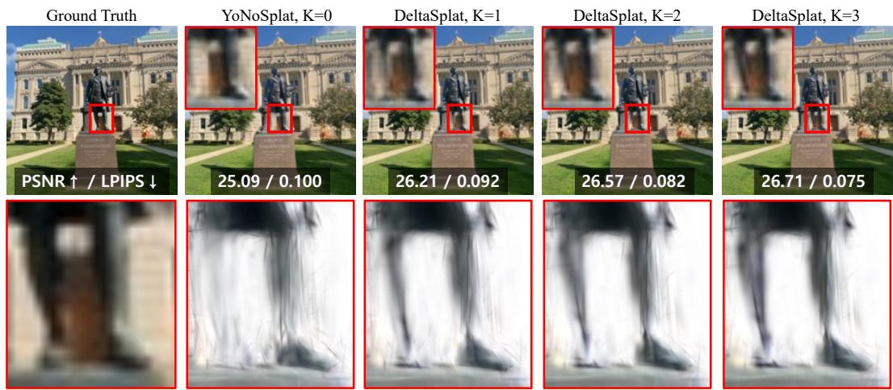
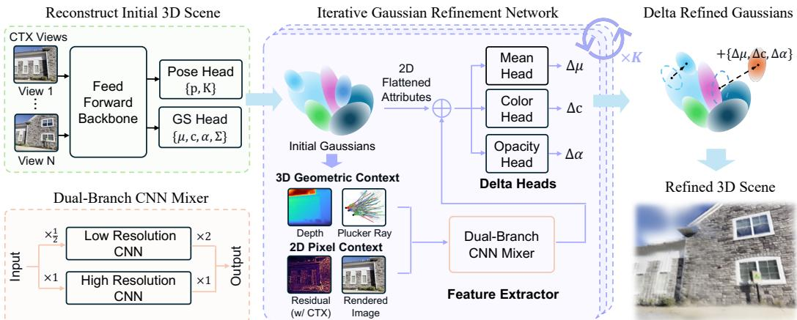
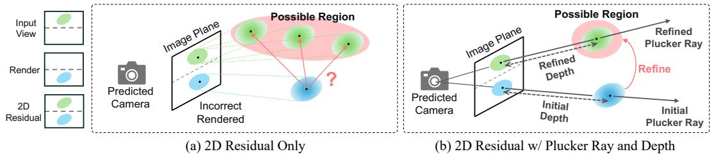
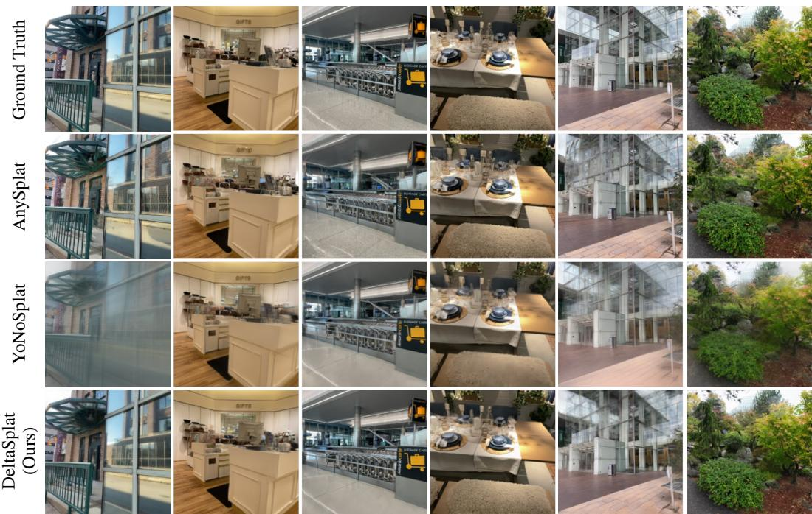
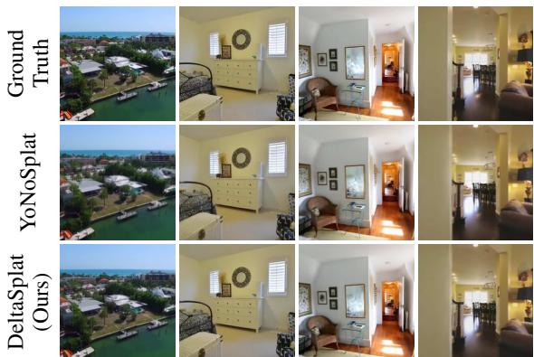
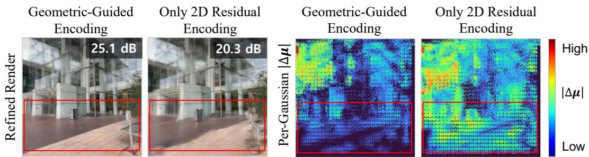

# DELTASPLAT: ITERATIVE GAUSSIAN REFINEMENT FOR POSE-FREE FEED-FORWARD 3D GAUSSIAN SPLATTING

Chanung Park1, Seunghyeon Song1, Joo Chan Lee2, Eunbyung Park3,∗, Jong Hwan Ko1,∗   
1Department of Electrical and Computer Engineering, Sungkyunkwan University   
2Department of Artificial Intelligence, Sungkyunkwan University   
3Department of Artificial Intelligence, Yonsei University

  
Figure 1: Iterative Gaussian refinement on a DL3DV scene in the pose-free setting. K denotes the number of refinement iterations applied. Starting from the feed-forward output of the YoNoSplat backbone (K=0), each DeltaSplat iteration progressively recovers structures missing from the initial prediction: the statue’s legs, absent at K=0, gradually emerge in both the rendered views (top, red box) and the underlying Gaussian geometry (bottom, with the ground-truth image crop as reference), with monotonic gains in PSNR and LPIPS.

## ABSTRACT

Pose-free feed-forward 3D Gaussian Splatting (3DGS) reconstructs a scene from sparse, unposed images in a single network pass, removing the need for camera calibration and per-scene optimization. However, camera estimation errors propagate into the predicted Gaussians and compound the geometric and photometric inaccuracies of single-pass prediction. To correct these errors, we introduce DeltaSplat, a lightweight Gaussian refinement module for pose-free feed-forward 3DGS. It iteratively renders the current Gaussians at the input context views and predicts per-Gaussian updates from the resulting residuals. A 2D residual alone, however, underdetermines the 3D correction. DeltaSplat therefore conditions each update on per-pixel Plucker rays and rendered depth as a soft geometric prior. A¨ dual-branch convolutional mixer efficiently encodes these inputs, and per-attribute heads decode the fused features into position, opacity, and color updates. The module adds only ∼2.2% parameters to the backbone and remains fully feedforward at inference. On DL3DV, DeltaSplat reaches 26.64 dB PSNR in the posefree setting, improving its state-of-the-art backbone by 1.75 dB and surpassing even baselines supplied with ground-truth cameras; consistent gains hold across 6–24 views and all camera regimes.

## 1 INTRODUCTION

3D Gaussian Splatting (3DGS) (Kerbl et al., 2023) has rapidly emerged as a powerful representation for novel-view synthesis, combining an explicit set of anisotropic Gaussian primitives with differentiable rasterization to achieve high-quality, real-time rendering. Despite its rendering efficiency, conventional 3DGS requires accurate camera calibration and thousands of per-scene optimization steps to reconstruct every new scene. Feed-forward 3DGS (Charatan et al., 2024; Chen et al., 2024; Xu et al., 2025b; Ye et al., 2025; 2026) addresses this reconstruction bottleneck by amortizing scenespecific optimization into a learned model that directly predicts 3D Gaussians from a sparse set of input images in a single network pass. This paradigm substantially reduces reconstruction time while leveraging learned geometric and appearance priors to handle sparse observations.

Despite removing per-scene optimization, most early feed-forward 3DGS models (Chen et al., 2024; Xu et al., 2025a; Kang et al., 2026) still assume that accurate camera parameters are available. However, the dependence on accurate camera poses substantially limits the practical applicability of feed-forward reconstruction. Although calibrated rigs and controlled capture systems can provide reliable camera parameters, casually captured image collections generally contain neither known extrinsics nor precise intrinsics. Camera poses can be recovered using external sensors or SfM and SLAM pipelines, but these procedures introduce additional preprocessing cost and can be unreliable for sparse, weakly overlapping, or unstructured observations. Moreover, even small pose errors perturb the multi-view correspondences and projection geometry used to construct the Gaussians, leading to noticeable degradation in reconstruction quality. When pose estimation becomes the dominant computational cost or failure point, it also undermines the primary efficiency advantage of feed-forward 3DGS.

To address the aforementioned issue, recent pose-free feed-forward approaches jointly recover a scene representation and its camera geometry from unposed images. AnySplat (Jiang et al., 2025) employs a geometry transformer to predict 3D Gaussian primitives together with the camera intrinsics and extrinsics of all input views in a single forward pass. NoPoSplat (Ye et al., 2025) anchors one input camera coordinate system as a canonical frame and directly predicts the Gaussians of all views in this shared space, avoiding explicit transformations based on externally estimated poses. YoNoSplat (Ye et al., 2026) predicts local Gaussians and camera parameters for each view and aggregates them into a global representation using either predicted or provided poses, while its mixedpose training strategy enables a single model to support posed, unposed, calibrated, and uncalibrated inputs.

Pose-free reconstruction, however, does not eliminate camera uncertainty; it internalizes camera estimation within the reconstruction model. Errors in the predicted cameras perturb the rays and coordinate transformations used to place the Gaussians, producing the systematic geometric displacement, ghosting, and blurred appearance seen in the unrefined prediction of Figure 1. These errors interact with the geometric and photometric inaccuracies of single-pass Gaussian prediction, which provides no explicit feedback mechanism for assessing and revising its output. Refining the predicted Gaussian representation is therefore necessary, but deriving a geometrically reliable correction from unposed observations remains challenging.

Rendering residuals provide a potentially useful correction signal, as they directly expose discrepancies between the current reconstruction and the observed context images. ReSplat (Xu et al., 2025a), for example, exploits pixel- and feature-space rendering errors to recurrently refine Gaussians under calibrated cameras. In the pose-free setting, however, uncertainty in the predicted camera geometry corrupts the correspondence between image-space residuals and individual Gaussians, thereby destabilizing the inferred 3D updates. Reliable Gaussian refinement under such camera uncertainty therefore requires additional geometric cues to disambiguate the residual-to-Gaussian mapping.

To address this challenge, we introduce DeltaSplat, a lightweight residual refinement module for pose-free feed-forward 3DGS. DeltaSplat iteratively compares the current renderings with the input context images and predicts Gaussian updates from the resulting 2D residuals. To lift these image-space errors into reliable 3D corrections, it jointly incorporates the Plucker rays (Pl ¨ ucker, ¨ 1865) and rendered depth associated with each Gaussian, providing a soft geometric prior for refining its position and appearance. Furthermore, a dual-branch convolutional mixer encodes those fine-grained full-resolution features while processing most features at reduced resolution, enabling more precise refinement with lower computational complexity. The encoded features are processed by parameter-specific heads to predict residual updates, which are then mapped back to the corresponding Gaussians to refine their position, opacity, and color. Repeating this process for three shared-weight iterations progressively improves the Gaussian representation. DeltaSplat adds only ∼2.2% to the backbone parameters and requires no per-scene optimization at inference time.

  
Figure 2: Method overview. The backbone predicts cameras and initial Gaussians; at each iteration, the refinement module encodes the render residual with the Plucker rays and the rendered depth, and¨ decodes the per-Gaussian update $\{ \Delta \mu , \Delta c , \Delta \alpha \}$ , repeated K=3 times with shared weights.

Experiments on DL3DV (Ling et al., 2024) demonstrate that DeltaSplat substantially outperforms YoNoSplat (Ye et al., 2026), a state-of-the-art pose-free feed-forward 3DGS method. With six context views, predicted poses, and known intrinsics, DeltaSplat achieves 26.64 dB PSNR, improving YoNoSplat by +1.75 dB under the same evaluation protocol, and surpassing every baseline evaluated with ground-truth cameras. The margins persist at 12 and 24 views and in the fully uncalibrated setting, and DeltaSplat likewise improves the backbone by about 2 dB when ground-truth cameras are supplied. These results demonstrate the effectiveness of geometrically guided residual refinement for high-quality pose-free reconstruction without per-scene optimization.

## 2 RELATED WORK

## 2.1 FEED-FORWARD 3DGS

3D Gaussian Splatting (3DGS) (Kerbl et al., 2023) models 3D scenes as explicit, anisotropic Gaussians optimized on hundreds of calibrated images, whose camera poses are estimated via Structurefrom-Motion (Schonberger & Frahm, 2016) (SfM). Although it yields high-fidelity renderings, ob-¨ taining them requires accurate camera poses and thousands of per-scene optimization steps. Subsequent efforts improve both training and rendering efficiency (Mallick et al., 2024; Hanson et al., 2025; Fang & Wang, 2024; Lee et al., 2025; Chen et al., 2025a; Ren et al., 2026; Dong et al., 2026), yet optimizing each scene from scratch remains inherently time-consuming. To overcome this bottleneck, feed-forward (FF) 3DGS amortizes per-scene optimization into a single forward pass, predicting Gaussians directly from sparse context images (typically 2–12 views). Recent architectures inject specialized inductive biases into this feed-forward prediction: pixelSplat (Charatan et al., 2024) utilizes epipolar attention, MVSplat (Chen et al., 2024) and MVSGaussian (Liu et al., 2024) incorporates cost volumes, and DepthSplat (Xu et al., 2025b) leverages pre-trained depth priors. While these approaches achieve sub-second inference, they address only the optimization overhead and remain strictly dependent on ground-truth camera poses.

## 2.2 POSE-FREE FEED-FORWARD 3DGS

To eliminate the reliance on ground-truth cameras, pose-free FF 3DGS leverage geometric foundation models (Wang et al., 2024; Leroy et al., 2024; Wang et al., 2025; 2026) to construct 3D representations directly from uncalibrated images. Specifically, early methods map Gaussians onto explicit 3D points (Smart et al., 2024) or relative canonical frames (Ye et al., 2025; Huang et al.,

2025). Although these methods eliminate extrinsic pose supervision, they still require known camera intrinsics. Recent frameworks achieve high reconstruction fidelity even in fully uncalibrated settings. For instance, AnySplat (Jiang et al., 2025) voxelizes pixel-wise primitives for dense captures, YoNoSplat (Ye et al., 2026) aggregates per-view local Gaussians to improve scalability with intrinsic conditioning module, and 2Xplat (Jeong et al., 2026) decouples camera estimation and Gaussian synthesis into specialized experts. However, predicting full camera geometry together with Gaussian attributes inevitably compounds pose inaccuracies with feed-forward synthesis limits, resulting in suboptimal 3D representations.

## 2.3 REFINING FEED-FORWARD GAUSSIANS

Standard feed-forward models operate open-loop, leaving a quality gap relative to per-scene optimization. InstantSplat (Fan et al., 2024) reduces this gap with test-time optimization, but its iterative fitting incurs substantial latency. Diff3R (Liu et al., 2026) instead trains the network to predict an initialization that downstream test-time optimization can refine efficiently, yet it too relies on this iterative optimization at inference. Learned refiners avoid this overhead by directly predicting parameter updates: SplatFormer (Chen et al., 2025b) and ReSplat (Xu et al., 2025a) refine Gaussians using rendering residuals, yet both strictly assume ground-truth poses to establish exact 2D to 3D correspondences.

In pose-free settings, camera inaccuracies distort rays and decouple 2D residuals from true 3D locations. While concurrent work GIFSplat (Chen et al., 2026) addresses this spatial ambiguity using generative diffusion priors, we aim to resolve it geometrically by leveraging per-pixel ray directions and rendered depth alongside color residuals to guide Gaussian updates, effectively compensating for pose errors and enhancing visual fidelity.

## 3 METHOD

## 3.1 PRELIMINARIES

Given a set of N images $\{ I _ { i } ~ \in ~ \mathbb { R } ^ { H \times W \times 3 } \} _ { i = 1 } ^ { N }$ , we partition them into context views ${ \mathcal { C } } =$ $\{ 1 , \ldots , N _ { \mathrm { c t x } } \}$ and target views $\mathcal { T } = \{ N _ { \mathrm { c t x } } + \mathrm { \bar { 1 } } , \ldots , N \}$ . A pose-free feed-forward predictor $f _ { \theta }$ directly maps the context images to a global 3D scene representation and its associated camera geometry:

$$
\begin{array} { r } { \left( \mathcal { G } _ { \mathrm { f f } } , \ \{ p _ { i } \} _ { i \in \mathcal { C } } \right) = f _ { \theta } \left( \{ I _ { i } \} _ { i \in \mathcal { C } } \right) , } \end{array}\tag{1}
$$

$$
\mathcal { G } _ { \mathrm { f f } } = \left\{ ( \mu _ { g } , \alpha _ { g } , q _ { g } , s _ { g } , c _ { g } ^ { ( 0 ) } ) \right\} _ { g = 1 } ^ { G } .\tag{2}
$$

The predicted collection $\mathcal { G } _ { \mathrm { f f } }$ comprises G 3D Gaussians, where each primitive g is characterized by its spatial mean $\mu _ { q } \in \mathbb { R } ^ { 3 }$ , opacity $\alpha _ { g } \in ( 0 , 1 )$ , and anisotropic shape defined via rotation $q _ { g } \in \mathbb { S } ^ { 3 }$ and scale $s _ { g } \in \mathbb { R } _ { + } ^ { 3 }$ . Additionally, each Gaussian carries a degree-0 spherical harmonic (SH) coefficient $c _ { g } ^ { ( 0 ) }$ to capture its view-independent color. These primitives are pixel-aligned with each context view, resulting in a total count of $G = N _ { \mathrm { { c t x } } } H W$ . Each camera $p _ { i } = [ K _ { i } , R _ { i } , t _ { i } ]$ encapsulates the intrinsics $K _ { i } \in \mathbb { R } ^ { 3 \times 3 }$ and the extrinsic pose composed of a rotation $\bar { R _ { i } } \in \mathrm { S O } ( 3 ) \bar { }$ and a translation $t _ { i } \in \mathbb { R } ^ { 3 }$ ; both the intrinsics and the pose are predicted by $f _ { \theta }$ , though either may instead be supplied when calibration is available.

To synthesize a novel view, a differentiable rasterizer R renders the Gaussian collection $\mathcal { G }$ at a target camera $p _ { i }$ expressed in the coordinate frame of the prediction:

$$
\hat { I } _ { i } = \mathcal { R } \big ( \mathcal { G } ; p _ { i } \big ) \qquad \mathrm { f o r } i \in \mathcal { T } .\tag{3}
$$

## 3.2 ITERATIVE GAUSSIAN REFINEMENT

To bridge the quality gap caused by single-pass prediction and camera estimation errors, we introduce a refinement module $h _ { \phi }$ that progressively improves the Gaussian representation, as illustrated in Figure 2. We define $\mathcal { G } ^ { ( k ) }$ as the Gaussian set at the k-th refinement step, initializing the process with the backbone’s feed-forward output, $\mathcal { G } ^ { ( 0 ) } = \mathcal { G } _ { \mathrm { f f } }$

  
Figure 3: Geometry-guided residual encoding. (a) The 2D residual alone underdetermines the position update $\Delta \mu :$ displacements along the viewing ray yield identical residuals, leaving a large possible region (red). (b) The per-pixel Plucker ray and rendered depth encode the line of sight and¨ the current prediction’s position along it, a prior on the current geometry under which the possible region contracts.

At each iteration $k \in \{ 0 , \ldots , K { - } 1 \}$ , the current state $\mathcal { G } ^ { ( k ) }$ is rendered from the predicted context cameras $p _ { i } ,$ yielding a rendering residual $r _ { i } ^ { ( k ) }$ that captures the pixel-wise discrepancy between the current rendered image $\hat { I } _ { i } ^ { ( k ) }$ and the input context image $I _ { i } { \mathrm { : } }$

$$
\hat { I } _ { i } ^ { ( k ) } = \mathcal { R } \big ( \mathcal { G } ^ { ( k ) } ; p _ { i } \big ) ,\tag{4}
$$

$$
r _ { i } ^ { ( k ) } = I _ { i } - \hat { I } _ { i } ^ { ( k ) } .\tag{5}
$$

Conditioned on the residual $r _ { i } ^ { ( k ) } \in \mathbb { R } ^ { H \times W \times 3 }$ , the renderings $\hat { I } _ { i } ^ { ( k ) } \in \mathbb { R } ^ { H \times W \times 3 }$ , the rendered depths $d _ { i } ^ { ( k ) } \in \mathbb { R } ^ { H \times W }$ , and the Plucker ray maps (Pl¨ ucker, 1865)¨ $\ell _ { i } \in \mathbb { R } ^ { H \times W \times 6 }$ of the context cameras, together with the current Gaussian state, the module predicts one update per Gaussian:

$$
\begin{array} { r } { \Delta ^ { ( k ) } = h _ { \phi } \big ( \big \{ r _ { i } ^ { ( k ) } , \hat { I } _ { i } ^ { ( k ) } , d _ { i } ^ { ( k ) } , \ell _ { i } \big \} _ { i \in \mathcal { C } } , \mathcal { G } ^ { ( k ) } \big ) , } \end{array}\tag{6}
$$

where each per-Gaussian update $\Delta _ { g } ^ { ( k ) } \in \mathbb { R } ^ { 7 }$ consists of a 3D position shift $\Delta \mu _ { g } \in \mathbb { R } ^ { 3 }$ , an opacity adjustment $\Delta \alpha _ { g } \in \mathbb { R }$ , and a color correction $\Delta c _ { g } ^ { ( 0 ) } \in \mathbb { R } ^ { 3 }$ . The Gaussian state is then updated as

$$
\mathcal { G } ^ { ( k + 1 ) } = \mathcal { G } ^ { ( k ) } \oplus \Delta ^ { ( k ) } ,\tag{7}
$$

where ⊕ adds each predicted increment to its respective attribute, while the scales $s _ { g }$ and rotations $q _ { g }$ remain fixed throughout the refinement, preserving the local structure established by the backbone. As in prior iterative estimation methods (Teed & Deng, 2020), the module weights are shared across all K iterations, and repeating this process K times yields the refined set $\mathcal { G } ^ { ( K ) }$

## 3.3 GEOMETRY-GUIDED RESIDUAL ENCODING

Inferring a 3D positional update from 2D image-space residuals is inherently underdetermined. Because a 2D residual constrains corrections only within the image plane, displacing a Gaussian along its viewing ray yields an identical 2D projection, leaving the residual unchanged regardless of 3D spatial displacement (Figure 3 (a)). To resolve this spatial ambiguity, we explicitly condition the refinement on the 3D geometry of the current prediction by incorporating per-pixel Plucker rays¨ and rendered depth, which describe the line of sight and the current prediction’s position along it (Figure 3 (b)). This geometric context acts as a soft prior that regulates the direction and scale of the predicted corrections.

For each context view, we construct a 13-channel feature map by concatenating the image residual $r _ { i } .$ , the current rendering $\hat { I } _ { i }$ , the Plucker-ray map ¨ $\ell _ { i }$ , and the depth map $d _ { i }$ rendered alongside $\hat { I } _ { i }$ by the same rasterizer. The entry $\ell _ { i , u }$ of $\ell _ { i }$ at pixel $\boldsymbol { u } = ( x , y )$ is given by

$$
\ell _ { i , u } = \left( \mathbf { d } _ { i , u } , \ \mathbf { o } _ { i } \times \mathbf { d } _ { i , u } \right) \in \mathbb { R } ^ { 6 } ,\tag{8}
$$

where ${ \bf o } _ { i } \in \mathbb { R } ^ { 3 }$ is the center of camera p and $p _ { i }$ $\mathbf { d } _ { i , u } \in \mathbb { R } ^ { 3 }$ the unit direction of the ray from $\mathbf { o } _ { i }$ through pixel u.

Each input carries distinct information: the residual $r _ { i }$ measures the per-pixel photometric discrepancy, $\ell _ { i }$ specifies for each pixel the line of sight along which the positional correction is ambiguous, and $d _ { i }$ locates the current prediction along this line. Conditioning on $\ell _ { i }$ and $d _ { i }$ thus exposes the geometric structure of the ambiguity directly in the input, rather than requiring the network to recover it from appearance. Furthermore, the rays and the depth are computed from exactly the cameras used to place and render the Gaussians. Whether these cameras are externally calibrated or estimated by the backbone, all inputs to $h _ { \phi }$ are thus expressed in the coordinate frame of the current prediction: an error in the estimated cameras displaces the residual and the geometric channels together, leaving them mutually consistent. Refinement therefore remains well-defined in the pose-free setting, where no ground-truth cameras are available.

Table 1: Main results on the DL3DV testset (140 scenes, $2 2 4 ^ { 2 } )$ at 6 / 12 / 24 context views. p, K: ✓ means the ground-truth pose / intrinsics are supplied, blank means predicted by the model.
<table><tr><td></td><td></td><td></td><td colspan="3">6 views</td><td colspan="3">12 views</td><td colspan="3">24 views</td></tr><tr><td>Method</td><td>p</td><td>K</td><td>PSNR↑</td><td>SSIM↑</td><td>LPIPS↓</td><td>PSNR↑</td><td>SSIM↑</td><td>LPIPS↓</td><td>PSNR↑</td><td>SSIM↑</td><td>LPIPS↓</td></tr><tr><td>MVSplat (Chen et al., 2024)</td><td>√</td><td>V</td><td>22.66</td><td>0.760</td><td>0.173</td><td>21.29</td><td>0.709</td><td>0.224</td><td>19.98</td><td>0.662</td><td>0.269</td></tr><tr><td>DepthSplat (Xu et al., 2025b)</td><td></td><td></td><td>23.42</td><td>0.797</td><td>0.136</td><td>21.91</td><td>0.753</td><td>0.179</td><td>20.09</td><td>0.690</td><td>0.240</td></tr><tr><td>YoNoSplat (Ye et al., 2026)</td><td>√</td><td>√</td><td>24.72</td><td>0.817</td><td>0.139</td><td>23.29</td><td>0.773</td><td>0.177</td><td>22.67</td><td>0.758</td><td>0.192</td></tr><tr><td>DeltaSplat</td><td>√</td><td>√</td><td>26.70</td><td>0.866</td><td>0.113</td><td>25.33</td><td>0.833</td><td>0.142</td><td>24.72</td><td>0.824</td><td>0.151</td></tr><tr><td>NoPoSplat (Ye et al., 2025)</td><td></td><td>√</td><td>22.77</td><td>0.743</td><td>0.179</td><td>19.38</td><td>0.563</td><td>0.318</td><td>17.86</td><td>0.495</td><td>0.397</td></tr><tr><td>YoNoSplat (Ye et al., 2026)</td><td></td><td>√</td><td>24.89</td><td>0.819</td><td>0.138</td><td>23.15</td><td>0.758</td><td>0.183</td><td>22.35</td><td>0.731</td><td>0.205</td></tr><tr><td>DeltaSplat</td><td></td><td>√</td><td>26.64</td><td>0.862</td><td>0.115</td><td>25.05</td><td>0.820</td><td>0.148</td><td>24.21</td><td>0.795</td><td>0.167</td></tr><tr><td>AnySplat (Jiang et al., 2025)</td><td></td><td></td><td>19.03</td><td>0.554</td><td>0.235</td><td>18.94</td><td>0.549</td><td>0.262</td><td>19.70</td><td>0.596</td><td>0.249</td></tr><tr><td>YoNoSplat (Ye et al., 2026)</td><td></td><td></td><td>24.53</td><td>0.804</td><td>0.142</td><td>22.93</td><td>0.746</td><td>0.187</td><td>22.17</td><td>0.720</td><td>0.209</td></tr><tr><td>DeltaSplat</td><td></td><td></td><td>25.69</td><td>0.831</td><td>0.126</td><td>24.34</td><td>0.791</td><td>0.159</td><td>23.66</td><td>0.771</td><td>0.177</td></tr></table>

## 3.4 DELTA DECODER

The decoder transforms the geometry-guided features into per-Gaussian updates in two stages: an image-space dual-branch mixer followed by per-attribute heads.

Dual-branch mixer. The update requires spatial context at two scales: per-pixel detail at full resolution and broader structure that only a wide receptive field provides. The mixer must also remain fast, because it runs at every refinement iteration and its cost enters the total inference time K times. It therefore processes the encoding through two branches operating at different resolutions. The coarse branch rearranges the input from $H \times \mathbf { \breve { W } } \times C \mathbf { \mathop { t o } } \frac { H } { 2 } \times \frac { \dot { W } } { 2 } \times 4 \dot { C }$ via pixel-unshuffle (Shi et al., 2016), a lossless space-to-depth reshaping, and applies dilated convolutions (Yu & Koltun, 2016) at this half resolution; the number of spatial positions drops to a quarter while dilation further enlarges the receptive field, so the branch covers broad structural context at a fraction of the fullresolution cost. The detail branch instead stays at the full $H \times W$ resolution and applies a few lightweight convolutions, preserving the high-frequency residual signal. The two branch outputs are fused additively into a single feature map, from which the per-Gaussian features of the next stage are sampled. The resulting mixer surpasses a full-resolution single-branch variant in quality at 1.84× lower time overhead, since most of its computation runs on the quarter-area grid.

Per-attribute head. To map the image-space features to Gaussian updates, each Gaussian samples the fused feature map at its projected mean in each context view, and the per-view samples are aggregated by an average weighted by the Gaussian’s rasterizer blending weights. The aggregated feature is concatenated with the Gaussian’s current parameters and decoded into the update. The position, opacity, and color updates differ substantially in numerical scale, so decoding them with a single shared MLP lets the largest signal dominate the others; we therefore employ three parallel MLPs, one per attribute. All output layers are zero-initialized so that refinement starts exactly at ∆ = 0 (Zhang et al., 2023).

## 3.5 TRAINING AND INFERENCE

The backbone $f _ { \theta }$ and the refinement module $h _ { \phi }$ are trained jointly in an end-to-end manner by supervising the output of the final refinement iteration: the loss is computed after all K refinement iterations, and its gradients propagate through the rasterizer and the entire unrolled sequence of updates. The objective combines a pixel-wise mean squared error with a perceptual

Table 2: Cross-dataset generalization to ScanNet++ (Yeshwanth et al., 2023) at $2 2 4 ^ { 2 }$ with 32 / 64 / 128 context views and known intrinsics. All models are trained on DL3DV.
<table><tr><td></td><td colspan="3">32 views</td><td colspan="3">64 views</td><td colspan="3">128 views</td></tr><tr><td>Method</td><td>PSNR↑</td><td>SSIM↑</td><td>LPIPS↓</td><td>PSNR↑</td><td>SSIM↑</td><td>LPIPS↓</td><td>PSNR↑</td><td>SSIM↑</td><td>LPIPS↓</td></tr><tr><td>YoNoSplat</td><td>17.94</td><td>0.659</td><td>0.380</td><td>18.83</td><td>0.688</td><td>0.342</td><td>19.28</td><td>0.701</td><td>0.325</td></tr><tr><td>DeltaSplat</td><td>18.62</td><td>0.670</td><td>0.371</td><td>19.76</td><td>0.711</td><td>0.328</td><td>20.62</td><td>0.741</td><td>0.298</td></tr></table>

LPIPS (Zhang et al., 2018) term over all rendered views:

$$
\mathcal { L } = \sum _ { i \in \mathcal { C } \cup \mathcal { T } } \Big ( \big \| \hat { I } _ { i } ^ { ( K ) } - I _ { i } \big \| _ { 2 } ^ { 2 } + \lambda _ { \mathrm { l p } } \mathrm { L P I P S } \big ( \hat { I } _ { i } ^ { ( K ) } , I _ { i } \big ) \Big ) ,\tag{9}
$$

where $\hat { I } _ { i } ^ { ( K ) }$ is the rendering of the final Gaussian set $\mathcal { G } ^ { ( K ) }$ at camera $p _ { i }$ and $\| \cdot \| _ { 2 } ^ { 2 }$ denotes the mean squared error over pixels. The context terms anchor the refined Gaussians to the observed input images, whereas the target terms supervise generalization to novel viewpoints. We set $\lambda _ { \mathrm { l p } } = \bar { 0 } . 1$ with the VGG backbone.

Training runs for 50 k steps with K=3 and shared weights across iterations. At test time, $h _ { \phi }$ i applied K=3 times to its own output, consistent with training.

## 4 EXPERIMENTS

## 4.1 EXPERIMENTAL SETUP

Dataset. We train on the DL3DV-10K (Ling et al., 2024) trainset and evaluate on 140-scene testset. All images are processed at a resolution of $2 2 4 \times 2 2 4$ , and experiments are conducted with 6, 12, and 24 context views.

Model configuration. We use YoNoSplat (Ye et al., 2026), pre-trained from $\textrm { a } \pi ^ { 3 }$ model (Wang et al., 2026), as the backbone. Our model is initialized from its official DL3DV-trained checkpoint and trained for 50 k steps with a batch size of one scene per step on a single NVIDIA RTX PRO 6000 GPU.

Evaluation metrics. We report PSNR, SSIM (Wang et al., 2004), and LPIPS (Zhang et al., 2018) (VGG), averaged over the test scenes. We follow the evaluation protocol of YoNoSplat (Ye et al., 2026), where target camera poses in the pose-free settings are estimated by photometric optimization before rendering. Unless otherwise specified, results use the refined Gaussians after K=3 iterations.

## 4.2 MAIN RESULTS

Pose-free comparison. Table 1 summarizes the main results. In the pose-free setting with known intrinsics, DeltaSplat reaches 26.64 dB PSNR at 6 views, improving its feed-forward backbone by +1.75 dB, with consistent margins of +1.90 and +1.86 dB at 12 and 24 views; SSIM and LPIPS improve accordingly. Notably, DeltaSplat also surpasses every baseline supplied with ground-truth cameras (26.64 vs. at best 24.72 dB at 6 views): the gain from refinement exceeds what the backbone gains from access to exact cameras.

Fully uncalibrated setting. When the intrinsics are also predicted, DeltaSplat attains 25.69 dB at 6 views, again above every baseline supplied with ground-truth cameras, and the margin over the backbone widens with more views (+1.16 to +1.49 dB).

Qualitative results. Figure 4 compares DeltaSplat with the baselines on DL3DV scenes.

Efficiency. The refinement module adds ${ \sim } 2 . 2 \%$ to the backbone parameters, and the K=3 refinement iterations add ∼0.11 s per scene on top of the backbone forward pass. By contrast, the optional post-optimization of YoNoSplat (Ye et al., 2026) requires 17.7–165 s per scene depending on the view count, while DeltaSplat remains entirely feed-forward.

  
Figure 4: Qualitative results on DL3DV scenes.

  
Figure 5: Qualitative results on RE10K (6 context views, pose-free).

Table 3: Generalization to RE10K (Zhou et al., 2018) $( 2 2 4 ^ { 2 }$ , 6 context views). Baselines are trained on RE10K, whereas DeltaSplat is transferred zero-shot from DL3DV. p, K: ✓ means the ground-truth pose / intrinsics are supplied.

<table><tr><td>Method</td><td>p</td><td>K</td><td>PSNR↑</td><td>SSIM↑</td><td>LPIPS↓</td></tr><tr><td>DepthSplat</td><td>√</td><td>√</td><td>24.16</td><td>0.846</td><td>0.145</td></tr><tr><td>YoNoSplat</td><td>√</td><td>√</td><td>25.04</td><td>0.848</td><td>0.134</td></tr><tr><td>NoPoSplat</td><td></td><td>√</td><td>22.18</td><td>0.750</td><td>0.207</td></tr><tr><td>YoNoSplat</td><td></td><td>√</td><td>25.40</td><td>0.857</td><td>0.131</td></tr><tr><td>DeltaSplat</td><td></td><td>V</td><td>26.30</td><td>0.865</td><td>0.129</td></tr><tr><td>YoNoSplat</td><td></td><td></td><td>24.57</td><td>0.823</td><td>0.144</td></tr><tr><td>DeltaSplat</td><td></td><td></td><td>24.87</td><td>0.830</td><td>0.142</td></tr></table>

## 4.3 ABLATION STUDY

Geometric conditioning. Omitting the Plucker-ray and depth channels forces the network to infer¨ 3D corrections solely from 2D features, with two consequences shown in Table 4(a). First, overall visual quality degrades: removing the geometric channels reduces PSNR by 1.37 dB, canceling about three quarters of the 1.84 dB gain that refinement provides over the unrefined backbone output. Second, positional updates lose spatial directionality: the magnitude of spatial corrections |∆µ| becomes substantially larger and more dispersed (Figure 6), indicating that corrections applied without explicit geometric frames lack directional precision. The geometric channels thus supply exactly the information that the 2D residual underdetermines: the line of sight of each pixel and the current prediction’s position along it.

Mixer and head design. Table 4(a) also compares the dual-branch mixer against a single-branch variant that processes the encoding entirely at full resolution, and the per-attribute heads against a single shared MLP. Removing the dual-branch design costs 0.59 dB, as broad structural context must then be gathered entirely at full resolution. Collapsing the per-attribute heads into a single

  
Figure 6: Effect of the 3D geometry prior. Each pair compares the geometry-aimed encoding with an encoding built from the 2D residual alone; the left pair shows the refined render and the right pair the per-Gaussian $| \Delta \mu |$ . Without the Plucker-ray and depth channels the same residual drives larger¨ and more scattered position updates, and PSNR falls from 25.1 to 20.3 dB.

Table 4: Ablations on the DL3DV test set in the pose-free setting with known intrinsics (6 context views). (a) Each row removes a single component from the full model. (b) Effect of the number of refinement iterations K applied at test time, with per-scene refinement time; K=0 denotes the unrefined backbone output, and the model is trained with K=3.  
(a) Component ablations
<table><tr><td>Variant</td><td colspan="3">PSNR↑ SSIM↑ LPIPS↓</td></tr><tr><td>Full model</td><td>26.64</td><td>0.862</td><td>0.115</td></tr><tr><td>w/o geometric conditioning</td><td>25.27</td><td>0.823</td><td>0.146</td></tr><tr><td>w/o dual-branch mixer (single-branch mixer)</td><td>26.05</td><td>0.846</td><td>0.132</td></tr><tr><td>w/o per-attribute MLP (single MLP)</td><td>26.22</td><td>0.851</td><td>0.127</td></tr></table>

(b) Number of refinement iterations K
<table><tr><td rowspan="2">K</td><td rowspan="2">Backbone</td><td colspan="6">Refinement iterations</td></tr><tr><td>0</td><td>1 2</td><td>3</td><td>4</td><td>5</td><td>6</td></tr><tr><td>PSNR↑</td><td>24.80</td><td>26.02</td><td>26.45</td><td>26.64</td><td>26.48</td><td>26.32</td><td>26.17</td></tr><tr><td>SSIM↑</td><td>0.818</td><td>0.847</td><td>0.857</td><td>0.862</td><td>0.858</td><td>0.853</td><td>0.848</td></tr><tr><td>LPIPS↓</td><td>0.140</td><td>0.126</td><td>0.118</td><td>0.115</td><td>0.119</td><td>0.124</td><td>0.130</td></tr><tr><td>Time (ms)↓</td><td>54</td><td>90</td><td>125</td><td>160</td><td>194</td><td>230</td><td>266</td></tr></table>

MLP reduces PSNR by 0.42 dB, since the update channels differ in numerical scale and a shared decoder lets the largest signal dominate.

Refinement iterations. Table 4(b) varies the number of refinement iterations applied at test time. Quality improves monotonically over the first three iterations and peaks at the training setting K=3, while the refinement time grows linearly from 54 ms for the unrefined backbone output to 266 ms at K=6. Iterating beyond the training horizon degrades quality only gradually without destabilizing the prediction, and yields no further gains, so K=3 offers the best quality–cost trade-off.

Cross-dataset generalization. Tables 2 and 3 evaluate DeltaSplat beyond the DL3DV training distribution. On ScanNet++ (Yeshwanth et al., 2023), the DL3DV-trained models are evaluated without any fine-tuning, using 32, 64, and 128 context views with known intrinsics. DeltaSplat outperforms the backbone at every view count, and the margin grows from +0.68 dB at 32 views to +1.34 dB at 128 views, following the same trend as on DL3DV. On RE10K (Zhou et al., 2018) with 6 context views, the baselines are trained on RE10K while DeltaSplat is transferred zero-shot from DL3DV. DeltaSplat attains 26.30 dB with known intrinsics and 24.87 dB in the fully uncalibrated setting, surpassing the backbone in both settings (Figure 5). The refinement thus transfers to unseen datasets without any adaptation.

## 5 CONCLUSION

We introduced DeltaSplat, a lightweight Gaussian refinement module for pose-free feed-forward 3DGS. Conditioning image-space residuals on per-pixel Plucker rays and rendered depth, it lifts 2D¨ evidence into 3D updates that progressively refine the position, opacity, and color of the predicted Gaussians. With ∼2.2% additional parameters and a fully feed-forward inference path, DeltaSplat consistently improves a state-of-the-art backbone across camera regimes, view counts, and datasets, offering a general plug-in quality stage for pose-free feed-forward reconstruction. A natural next step is to extend the refinement to higher resolutions and to other feed-forward backbones.

## REFERENCES

David Charatan, Sizhe Lester Li, Andrea Tagliasacchi, and Vincent Sitzmann. pixelSplat: 3D Gaussian splats from image pairs for scalable generalizable 3D reconstruction. In CVPR, 2024.

Tianyu Chen, Wei Xiang, Kang Han, Yu Lu, Di Wu, Gaowen Liu, and Ramana Rao Kompella. GIF-Splat: Generative prior-guided iterative feed-forward 3D Gaussian splatting from sparse views. In CVPR, 2026.

Youyu Chen, Junjun Jiang, Kui Jiang, Xiao Tang, Zhihao Li, Xianming Liu, and Yinyu Nie. Dash-Gaussian: Optimizing 3D Gaussian splatting in 200 seconds. In CVPR, 2025a.

Yuedong Chen, Haofei Xu, Chuanxia Zheng, Bohan Zhuang, Marc Pollefeys, Andreas Geiger, Tat-Jen Cham, and Jianfei Cai. MVSplat: Efficient 3D Gaussian splatting from sparse multi-view images. In ECCV, 2024.

Yutong Chen, Marko Mihajlovic, Xiyi Chen, Yiming Wang, Sergey Prokudin, and Siyu Tang. Splat-Former: Point transformer for robust 3D Gaussian splatting. In ICLR, 2025b.

Zheng Dong, Daifei Qiu, Pinxuan Dai, Ke Xu, Jiamin Xu, Lili He, Rynson WH Lau, and Weiwei Xu. TurboGS: Accelerating 3D Gaussian splatting via error-guided sparse pixel sampling and optimization. In ICML, 2026.

Zhiwen Fan, Wenyan Cong, Kairun Wen, Kevin Wang, Jian Zhang, Xinghao Ding, Danfei Xu, Boris Ivanovic, Marco Pavone, Georgios Pavlakos, Zhangyang Wang, and Yue Wang. InstantSplat: Unbounded sparse-view pose-free Gaussian splatting in 40 seconds, 2024.

Guangchi Fang and Bing Wang. Mini-Splatting: Representing scenes with a constrained number of Gaussians. In ECCV, 2024.

Alex Hanson, Allen Tu, Geng Lin, Vasu Singla, Matthias Zwicker, and Tom Goldstein. Speedy-Splat: Fast 3D Gaussian splatting with sparse pixels and sparse primitives. In CVPR, 2025.

Ranran Huang et al. No pose at all: Self-supervised pose-free 3D Gaussian splatting from sparse views, 2025.

Hwasik Jeong, Seungryong Lee, Gyeongjin Kang, Seungkwon Yang, Xiangyu Sun, Seungtae Nam, and Eunbyung Park. 2Xplat: Decoupling geometry and appearance modeling for feed-forward 3D Gaussian splatting, 2026.

Lihan Jiang, Yucheng Mao, Linning Xu, Tao Lu, Kerui Ren, Yichen Jin, Xudong Xu, Mulin Yu, Jiangmiao Pang, Feng Zhao, et al. AnySplat: Feed-forward 3D Gaussian splatting from unconstrained views. ACM Transactions on Graphics, 44(6), 2025.

Gyeongjin Kang, Seungkwon Yang, Seungtae Nam, Younggeun Lee, Jungwoo Kim, and Eunbyung Park. Multi-view pyramid transformer: Look coarser to see broader. In CVPR, 2026.

Bernhard Kerbl, Georgios Kopanas, Thomas Leimkuhler, and George Drettakis. 3D Gaussian splat-¨ ting for real-time radiance field rendering. ACM Transactions on Graphics, 42(4), 2023.

Joo Chan Lee, Jong Hwan Ko, and Eunbyung Park. Optimized minimal 3D Gaussian splatting. In NeurIPS, 2025.

Vincent Leroy, Yohann Cabon, and Jer´ ome Revaud. Grounding image matching in 3D withˆ MASt3R. In ECCV, 2024.

Lu Ling, Yichen Sheng, Zhi Tu, Wentian Zhao, Cheng Xin, Kun Wan, Lantao Yu, Qianyu Guo, Zixun Yu, Yawen Lu, et al. DL3DV-10K: A large-scale scene dataset for deep learning-based 3D vision. In CVPR, 2024.

Tianqi Liu, Guangcong Wang, Shoukang Hu, Liao Shen, Xinyi Ye, Yuhang Zang, Zhiguo Cao, Wei Li, and Ziwei Liu. MVSGaussian: Fast generalizable Gaussian splatting reconstruction from multi-view stereo. In ECCV, 2024.

Yueh-Cheng Liu, Jozef Hladky, Matthias Nießner, and Angela Dai. Diff3R: Feed-forward 3D Gaus-´ sian splatting with uncertainty-aware differentiable optimization, 2026.

Saswat Subhajyoti Mallick, Rahul Goel, Bernhard Kerbl, Markus Steinberger, Francisco Vicente Carrasco, and Fernando De La Torre. Taming 3DGS: High-quality radiance fields with limited resources. In SIGGRAPH Asia, 2024.

Julius Plucker. XVII. On a new geometry of space. ¨ Philosophical Transactions of the Royal Society ofLondon, 155:725–791, 1865.

Shiwei Ren, Tianci Wen, Yongchun Fang, and Biao Lu. FastGS: Training 3D Gaussian splatting in 100 seconds. In CVPR, 2026.

Johannes L. Schonberger and Jan-Michael Frahm. Structure-from-motion revisited. In¨ CVPR, 2016.

Wenzhe Shi, Jose Caballero, Ferenc Huszar, Johannes Totz, Andrew P. Aitken, Rob Bishop, Daniel´ Rueckert, and Zehan Wang. Real-time single image and video super-resolution using an efficient sub-pixel convolutional neural network. In CVPR, 2016.

Brandon Smart, Chuanxia Zheng, Iro Laina, and Victor Adrian Prisacariu. Splatt3R: Zero-shot Gaussian splatting from uncalibrated image pairs, 2024.

Zachary Teed and Jia Deng. RAFT: Recurrent all-pairs field transforms for optical flow. In ECCV, 2020.

Jianyuan Wang, Minghao Chen, Nikita Karaev, Andrea Vedaldi, Christian Rupprecht, and David Novotny. VGGT: Visual geometry grounded transformer. In CVPR, 2025.

Shuzhe Wang, Vincent Leroy, Yohann Cabon, Boris Chidlovskii, and Jerome Revaud. DUSt3R: Geometric 3D vision made easy. In CVPR, 2024.

Yifan Wang, Jianjun Zhou, Haoyi Zhu, et al. π3: Scalable permutation-equivariant visual geometry learning. In ICLR, 2026.

Zhou Wang, Alan C. Bovik, Hamid R. Sheikh, and Eero P. Simoncelli. Image quality assessment: From error visibility to structural similarity. IEEE Transactions on Image Processing, 13(4): 600–612, 2004.

Haofei Xu, Daniel Barath, Andreas Geiger, and Marc Pollefeys. ReSplat: Learning recurrent Gaussian splatting, 2025a.

Haofei Xu, Songyou Peng, Fangjinhua Wang, Hermann Blum, Daniel Barath, Andreas Geiger, and Marc Pollefeys. DepthSplat: Connecting Gaussian splatting and depth. In CVPR, 2025b.

Botao Ye, Sifei Liu, Haofei Xu, Xueting Li, Marc Pollefeys, Ming-Hsuan Yang, and Songyou Peng. No pose, no problem: Surprisingly simple 3D Gaussian splats from sparse unposed images. In ICLR, 2025.

Botao Ye, Boqi Chen, Haofei Xu, Daniel Barath, and Marc Pollefeys. YoNoSplat: You only need one model for feedforward 3D Gaussian splatting. In ICLR, 2026.

Chandan Yeshwanth, Yueh-Cheng Liu, Matthias Nießner, and Angela Dai. ScanNet++: A highfidelity dataset of 3D indoor scenes. In ICCV, 2023.

Fisher Yu and Vladlen Koltun. Multi-scale context aggregation by dilated convolutions. In ICLR, 2016.

Lvmin Zhang, Anyi Rao, and Maneesh Agrawala. Adding conditional control to text-to-image diffusion models. In ICCV, 2023.

Richard Zhang, Phillip Isola, Alexei A. Efros, Eli Shechtman, and Oliver Wang. The unreasonable effectiveness of deep features as a perceptual metric. In CVPR, 2018.

Tinghui Zhou, Richard Tucker, John Flynn, Graham Fyffe, and Noah Snavely. Stereo magnification: Learning view synthesis using multiplane images. In SIGGRAPH, 2018.