# DO GENERATIVE PRIORS ALIGN WITH HUMAN NATURALNESS PERCEPTION?

Taiki Fukiage

Communication Science Laboratories, NTT, Inc.

t.fukiage@gmail.com

## ABSTRACT

Visual generative models are trained to capture the probability distributions of natural images, yet whether their native priors reflect the regularities governing human perception of image naturalness remains an open question. Here, we probe these priors through native prediction errors across 25 open image and video generators. Because raw single-image losses are dominated by scene content and visual complexity, we evaluate directional loss differences using content-preserving, paired relational interventions that selectively disrupt facial configurations or physical illumination consistency while limiting changes in low-level image statistics. Across both domains, these loss differences reproduce human-like selective sensitivities and tolerances, capturing the classic Thatcher effect on faces and shape-dependent responses to illumination inconsistencies. Notably, these loss differences reliably track continuous gradations of human naturalness judgments across individual stimulus pairs (peaking at r = .84 on faces and .64 on physical scenes) and retain unique human-aligned signals even after controlling for feature distances from frozen vision encoders and standard image quality metrics. We also find that while overall sensitivity to these violations broadly covaries with human alignment across models, the two systematically decouple along denoising schedules, with alignment peaking earlier than sensitivity, revealing that human-like naturalness judgments dissociate from generic violation detection. Together, these findings demonstrate that learning visual distributions yields generative loss landscapes that capture distinct aspects of human naturalness perception.

## 1 INTRODUCTION

Human perception of image naturalness draws heavily on sensitivity to the statistical regularities of natural visual environments: cognitive theories formalize this as inference against internal distributional priors acquired through visual experience (Yuille & Kersten, 2006). Just as human vision relies on approximate statistical expectations rather than exact physical simulation, visual generative models produce strikingly realistic images from learned image distributions while frequently violating strict physical and geometric constraints (Farid, 2022; Sarkar et al., 2024). This parallel raises the possibility that generative priors, learned from visual distributions rather than explicit physica simulation, naturally capture the selective sensitivities and tolerances of human vision.

Prior studies utilizing generative models for perceptual assessment have largely treated them as feature extractors, training supervised regressors on internal activations (Fu et al., 2024; Raviv & Chechik, 2024) or engineering tuning-free attention-based metrics (Song et al., 2025). To test whether generative models naturally internalize human-aligned perceptual regularities without relying on such task-specific readouts, we turn directly to their native prediction objectives. In diffusion and flow architectures, denoising and velocity losses relate to score matching and variational bounds on data log-likelihood (Ho et al., 2020; Kingma & Gao, 2023; Esser et al., 2024), providing an empirical surrogate for negative log-likelihood that reflects an image’s plausibility under the learned distribution (Clark & Jaini, 2023). We therefore evaluate whether these native prediction errors directly track human naturalness ratings in a zero-shot manner, probing the perceptual sensitivities captured by native generative prediction objectives.

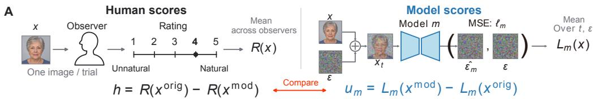

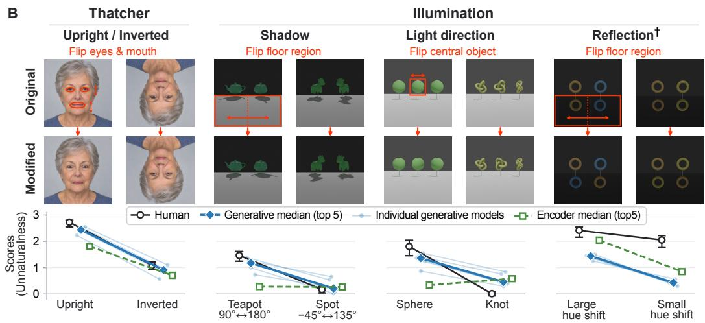  
Figure 1: Overview of experimental paradigm and paired response profiles. (A) Measurement pipelines. Left: human naturalness ratings are averaged across observers to define the paired percep tual effect h. Right: native prediction errors from frozen models are averaged over matched timesteps and noise to obtain image losses and the paired directional loss difference $u _ { m }$ (schematic shows a noise-predicting diffusion model; prediction targets vary across architectures). (B) Controlled stimu lus pairs and representative response profiles. Content-preserving relational interventions flip local elements (eyes/mouth, floor, or central objects; red boxes), leaving overall scene composition intact. Thatcher: both humans and generative models penalize facial distortions far more strongly in upright than in inverted faces. Illumination: factor-level contrasts across cast shadows, light directions, and reflections; generative models mirror human sensitivities to shadows and lighting. †Reflection color is a representative divergence, where humans remain sensitive to small hue mismatches while generative responses decrease. Markers indicate human means with 95% bootstrap intervals (Appendix E), top-five generative models (median and individuals), and top-five vision encoders (median). Complete profiles: Appendix J. Face images depict a synthetic person for illustration and were not used in experiments.

Evaluating native loss directly, however, faces a known obstacle: high-dimensional density estimates and unconditioned prediction errors are sensitive to low-level image complexity, background statistics, and data geometry, which can decouple density from perceived plausibility (Nalisnick et al., 2019; Serrà et al., 2020; Ren et al., 2019; Kamkari et al., 2024). Consistent with these concerns, in our control evaluation on a standard distortion benchmark (CSIQ (Larson & Chandler, 2010)), native prediction errors fail to track human quality judgments across distortion types, and removing visual elements like cast shadows can lower loss even though the scene becomes physically unnatural (Appendix F). To separate relational plausibility from low-level statistical shifts, we adopt psychophysical paradigms based on content-preserving relational interventions (Thompson, 1980; Ostrovsky et al., 2005; Nightingale et al., 2019). Instead of adding or deleting objects, our manipulations alter spatial or physical configurations by reflecting existing image elements, which leaves coarse image statistics largely intact. The paired directional loss difference $( L _ { \mathrm { m o d i f i e d } } - L _ { \mathrm { o r i g i n a l } } )$ then controls for shared scene composition, focusing evaluation on whether the model penalizes the relational violations that reduce human-perceived naturalness.

We evaluate this approach across two controlled domains: the Thatcher face task (feature inversions in upright and inverted faces) and the Illumination task (shadow, reflection, and light-direction interventions in rendered scenes; Figure 1). In representative response profiles, paired generative loss differences capture characteristic human perceptual patterns, including the classic Thatcher effect and shape-dependent shadow sensitivities, while also revealing specific divergences (Figure 1B). To test whether these correspondences reflect systematic perceptual alignment, we evaluate 25 open image and video generators on individual stimulus pairs, comparing native loss differences against human naturalness ratings, 12 frozen vision and multimodal encoders, and ten standard image quality metrics.

Our investigation yields three primary findings. First, zero-shot directional loss differences reproduce human-like selective sensitivities and tolerances across representative physical and face conditions. Across individual items, these loss differences reliably track continuous human ratings (peaking at r = .84 on faces and .64 on physical scenes) and concentrate spatially within manipulated scene regions. Second, top generative models achieve higher human alignment than standard image quality metrics and frozen vision encoders, and retain non-redundant perceptual signals in bidirectional partial correlation analyses. Third, while coarse violation sensitivity broadly covaries with perceptual alignment across models, the two systematically decouple along denoising schedules, with alignment peaking earlier than sensitivity. Together, our work provides empirical evidence for a functional convergence between visual generative priors and human perception, showing that modern generative loss landscapes capture key aspects of the selective sensitivities and tolerances of human naturalness judgments.

## 2 RELATED WORK

## 2.1 GENERATIVE MODELS AS PERCEPTUAL PRIORS

Evaluating departures from natural image statistics is a long-standing approach in perceptual assessment. Classical no-reference image quality assessment (NR-IQA) measures distortions as deviations from parametric models of natural scene statistics (Mittal et al., 2012; 2013; Saad et al., 2012). From a Bayesian perspective, visual quality assessment formalizes this principle as statistical inference against learned priors of natural visual environments (Duanmu et al., 2021), echoing cognitive theories of biological vision as Bayesian inference or inverse graphics (Yuille & Kersten, 2006; Yildirim et al., 2020). Modern deep generative models scale this principle by fitting high-dimensional distributions directly on large image corpora. However, raw density estimates and unconditioned prediction errors do not directly track perceptual quality. Likelihood-based deep models frequently assign higher likelihoods to out-of-distribution inputs than to in-distribution training data (Nalisnick et al., 2019; Kirichenko et al., 2020), reflecting sensitivity to input complexity (Serrà et al., 2020), background statistics (Ren et al., 2019), and manifold geometry (Kamkari et al., 2024).

To bypass these density confounds, recent approaches treat generative models as feature extractors, using supervised regressors on internal activations (Fu et al., 2024; Raviv & Chechik, 2024) or tuning-free attention correspondences (Song et al., 2025). While effective for metric engineering, these feature-derived methods do not evaluate whether the model’s learned distribution itself aligns with human naturalness perception. Rather than engineering an applied IQA metric, our goal is a scientific inquiry: testing whether human perceptual priors are reflected directly within the native loss landscapes of generative models, using content-preserving relational interventions to probe prediction errors without intermediate readouts.

## 2.2 PHYSICAL WORLD MODELS VS. PERCEPTUAL NATURALNESS

Several recent benchmarks evaluate whether generative models learn physical and causal regularities as predictive world models. While VideoPhy evaluates physical commonsense in video generation (Bansal et al., 2025) and Physics-IQ tests real-world physical continuation (Motamed et al., 2026), LikePhys (Yuan et al., 2026) and YoCausal (Xie et al., 2026) use paired denoising-loss contrasts to test model preferences for physically valid or temporally plausible sequences, verifying their benchmarks against aggregate human model rankings. However, adherence to objective physical laws does not directly imply alignment with human perceptual naturalness. Psychophysical studies demonstrate that human observers frequently fail to detect or tolerate substantial physical inconsistencies in lighting, shadows, and reflections (Mamassian, 2004; Ostrovsky et al., 2005; Cavanagh, 2005; Wilder et al., 2019; Nightingale et al., 2019). A model that strictly penalizes all physical departures may therefore diverge from human naturalness judgments. Rather than evaluating whether models act as strict physical simulators, our Illumination task examines whether generative loss landscapes mirror the selective tolerances that characterize human perception, testing item-level correspondence with continuous human naturalness ratings under controlled physical interventions.

## 2.3 VISUAL ILLUSIONS IN DEEP NETWORKS

Visual illusions and perceptual biases provide a classic benchmark for testing whether artificial neural networks reproduce biological visual phenomena (Gómez-Villa et al., 2020; Jacob et al., 2021; Shahgir et al., 2024). Prior computational studies have investigated these effects across several paradigms: convolutional filters adapt to natural statistics to reproduce low-level brightness illusions (Gómez-Villa et al., 2020), networks trained on edge-based image reconstruction replicate surface filling-in illusions (Saha et al., 2026), and diffusion models reveal human-like brightness shifts along their DDIM inversion trajectories (Gómez-Villa et al., 2025). In higher-level perception, configural phenomena such as the Thatcher illusion have been investigated in feedforward neural networks (Jacob et al., 2021), while structured inverse graphics models have captured other face-perception illusions such as the hollow-face effect (Yildirim et al., 2020). In addition, multimodal benchmarks probe illusions via linguistic question answering (Shahgir et al., 2024). Extending this line of inquiry, we test whether characteristic human perceptual biases are expressed directly within the native loss landscapes of visual generative models.

## 3 METHODS

## 3.1 STIMULUS DESIGN AND PSYCHOPHYSICAL EXPERIMENTS

Probing human naturalness perception across two domains. To investigate whether generative priors reflect human naturalness perception, we examine two distinct visual domains: face configura tions and physical scene illumination. In face perception, observers exhibit pronounced orientation dependence: in the Thatcher illusion, inverted eyes and mouth appear grotesque in an upright face, but this distortion becomes difficult to detect when the entire face is inverted (Thompson, 1980; de Haas & Schwarzkopf, 2018). Testing Thatcherized faces evaluates whether generative models detect these localized feature inversions and whether their sensitivity exhibits orientation dependence. In physical scenes, observers can fail to detect substantial inconsistencies in illumination, shadows, and reflections (Mamassian, 2004; Ostrovsky et al., 2005; Cavanagh, 2005; Wilder et al., 2019; Nightingale et al., 2019). Testing illumination interventions determines whether models identify physical inconsistencies at all, and whether their responses reflect physical mechanics strictly or follow human perceptual tolerances and naturalness ratings.

Content-preserving relational interventions. To probe relational regularities while limiting lowlevel statistical shifts, we design two tasks using content-preserving relational interventions. Existing image content is rearranged while depicted objects remain in place, avoiding object deletion or insertion. This design largely preserves color distributions and edge content, reducing the density confounds observed in evaluation of raw native losses. The Thatcher task contains 140 publicdomain face scenes from FFHQ (Karras et al., 2019), modified by in-place landmark-guided vertical reflection of the eye and mouth regions (Alimohammadi, 2020) using dlib-based facial landmark detection (King, 2009; Kazemi & Sullivan, 2014) and presented upright and inverted (280 original– modified pairs; Appendix A). The Illumination task contains 96 scenes rendered in Kubric (Greff et al., 2022) each for cast-shadow, reflection, and light-direction interventions (288 pairs): for shadow and reflection conditions, the rendered floor region was mirrored to exchange shadows or reflections while objects remained fixed; for the light-direction condition, the central object was horizontally mirrored while the flanking objects and floor, including any cast shadows, remained unchanged. To produce graded item difficulty, we varied object geometry, orientation or color, height, material, and lighting parameters across scenes (Appendix A).

Human psychophysical experiments. Human observers rated the naturalness of each image on a 5-point scale (1: very unnatural to 5: natural) in online psychophysical experiments. Each trial presented a single image (Figure 1A). In the Thatcher task, each observer viewed upright and inverted faces from different identity sets, whereas illumination conditions were tested between subjects. In both tasks, original and modified versions of each scene were evaluated by the same observer across separate, randomized trials (Appendix B). Following response-consistency screening (143 observers retained for Thatcher, 105 for Illumination), each item received an average of 35.8 ratings in Thatcher and 26.2 in Illumination. Item-mean ratings $R ( x )$ define two measures: single-image unnaturalness $a ( x ) = 5 - R ( x )$ and the paired unnaturalness effect $h _ { i } = R ( x _ { i } ^ { \mathrm { o r i g } } ) - R ( x _ { i } ^ { \mathrm { m o d } } )$ , which quantifies the perceived unnaturalness introduced by each modification (i indexes stimulus pairs). Only item-level aggregates enter subsequent model analyses.

## 3.2 GENERATIVE MODELS AND NATIVE LOSS PROBING

We evaluate 25 open generative models (16 image, 9 video) across 11 families: (i) pixel-space image models (JiT, PixelGen, HiDream-O1-Image) (Li & He, 2026; Ma et al., 2026; Cai et al., 2026); (ii) latent-space image models (Stable Diffusion v1.5/XL/3, FLUX.1/2, Qwen-Image) (Rombach et al., 2022; Podell et al., 2024; Esser et al., 2024; Black Forest Labs, 2024; 2025; Wu et al., 2025); and (iii) spatiotemporal video models (CogVideoX, LTX-Video, Wan2.1/2.2, HunyuanVideo) (Yang et al., 2025; HaCohen et al., 2024; Team Wan et al., 2025; Kong et al., 2024). Static images are repeated as 17-frame clips, with 21 frames for CogVideoX1.5 to satisfy its temporal patching constraint. Textconditioned models use the neutral or empty-prompt single-pass convention without classifier-free guidance; a control evaluation on a text-conditioned subset confirms that adding descriptive prompts does not alter our findings (Appendix O). Model checkpoints, schedules, and evaluation details appear in Appendix C.

Let $\ell _ { m } ( x , t , \epsilon )$ denote model m’s native prediction loss (e.g., squared denoising error or flow-matching velocity loss) for input x, timestep t, and noise $\epsilon \sim \mathcal { N } ( 0 , \bar { I } )$ . We aggregate over stored timesteps $T _ { m } ^ { - }$ (100 for image, 50 for video) and noise realizations $E _ { m }$ (20 draws):

$$
L _ { m } ( x ) = \frac { 1 } { | T _ { m } | | E _ { m } | } \sum _ { t \in T _ { m } } \sum _ { \epsilon \in E _ { m } } \ell _ { m } ( x , t , \epsilon ) .
$$

We use the average native prediction loss $L _ { m } ( x )$ as an empirical surrogate for negative log-likelihood. Because loss formulations, target spaces (pixel vs. latent), and latent dimensions differ across architectures, raw loss magnitudes $L _ { m } ( x )$ are not comparable across models. We evaluate two scores corresponding to human judgments: (i) the unconditioned single-image loss $L _ { m } ( x )$ , compared against single-image unnaturalness $a ( x )$ as a baseline control, and (ii) the controlled paired loss change $u _ { m , i } = L _ { m } ( x _ { i } ^ { \mathrm { m o d } } ) - L _ { m } ( x _ { i } ^ { \mathrm { o r i g } } )$ , evaluated against the paired human unnaturalness effect $h _ { i }$ A positive value $( u _ { m , i } > 0 )$ indicates that the relational violation increased native denoising loss, consistent with human ratings where modifications reduce perceived naturalness $( h _ { i } > 0 )$ . Paired subtraction controls for shared scene content, evaluating model sensitivity to targeted relational violations.

## 3.3 PERCEPTUAL EVALUATION METRICS

Standardized unnaturalness and condition profiles (Section 4.1). Because raw loss scales differ across models and share no common units with human perceptual ratings, raw paired differences $( { u } _ { m , i } = L _ { m } ( x _ { i } ^ { \mathrm { m o d } } ) - L _ { m } ( x _ { i } ^ { \mathrm { o r i g } } )$ for models, $h _ { i }$ for humans) cannot be directly compared across models or against human judgments. To place models and human ratings on a common scale for condition- and factor-level comparisons, we define the standardized unnaturalness score for each stimulus pair i as the paired difference divided by the task-wide sample standard deviation: $\tilde { u } _ { m , i } = u _ { m , i } / s _ { m , \mathrm { t a s k } }$ and $\tilde { h } _ { i } = h _ { i } / s _ { h , \mathrm { t a s k } }$ , where $s _ { m , \mathrm { t a s k } }$ and $s _ { h , \mathrm { t a s k } }$ are computed across all $N$ pairs within the task $( N = 2 8 0$ for Thatcher, $N = 2 8 8$ for Illumination, using $N - 1$ degrees of freedom). Averaging $\tilde { u } _ { m , i }$ across specific stimulus factor levels yields the paired response profiles that probe selective sensitivities and tolerances (e.g., face orientation, object geometry, or lighting shifts; Figure 1B). Human sensitivity profiles are defined analogously from $\ddot { h } _ { i }$ . To examine where loss penalties arise, we compute pixel-level paired prediction error maps (Figure 2).

Item-level human alignment (Section 4.2). To determine whether this perceptual correspondence generalizes beyond condition-level averages to continuous scene-by-scene judgments, human alignment measures whether graded model penalties track continuous human naturalness ratings across individual items, quantified by the item-level Pearson correlation $r _ { m } = \mathrm { c o r r } _ { i } ( u _ { m , i } , h _ { i } )$ within each task. Furthermore, to test whether this correspondence reflects unique perceptual structure beyond standard visual features, we evaluate generative models alongside standard quality metrics and frozen vision encoders, using bidirectional partial correlations to isolate non-redundant signals (Section 3.4).

Coupling and dissociation of sensitivity and alignment (Section 4.3). Finally, to test whether violation detection and perceptual naturalness represent unified or dissociable properties, we contrast human alignment against coarse violation sensitivity. Task-level sensitivity $S _ { m }$ is defined as the mean standardized score across all pairs in the task $\begin{array} { r } { ( S _ { m } = N ^ { - 1 } \sum _ { i } \tilde { u } _ { m , i } ) } \end{array}$ , and condition-level sensitivity $S _ { m , c }$ averages over the pairs $I _ { c }$ within condition $c ( S _ { m , c } = | \dot { I } _ { c } | ^ { - 1 } \sum _ { i \in I _ { c } } \tilde { u } _ { m , i } )$ . We then evaluate how this coarse violation sensitivity relates to fine-grained human alignment across model architectures and along denoising schedules.

Uncertainty estimation. Confidence intervals for human-dependent estimates use 10,000 participant and-scene bootstrap resamples, whereas those for generative-model sensitivities use scene resampling alone. For cross-model sensitivity–alignment correlations, we additionally perform cluster bootstrap resampling over model families (Appendix E). To verify that associations between sensitivity and alignment are not driven by shared Monte Carlo sampling error, we estimated the two metrics from independent noise draws and observed closely matching results (Appendix P).

## 3.4 BASELINE MODELS

We compare generative scores with a prespecified pool of 12 frozen image encoders (24M–8.1B parameters) and two five-metric IQA batteries (Appendix D). The encoder panel includes ResNet-50 (He et al., 2016), CLIP (Radford et al., 2021), DINOv2/v3 (Oquab et al., 2024; Siméoni et al., 2026), SigLIP 2 (Tschannen et al., 2025), PE-Core (Bolya et al., 2025), Qwen3-VL-Embedding (Li et al., 2026), and Jina CLIP v2 (Koukounas et al., 2024). Encoder scores use cosine distances between global vectors, or the mean distance between corresponding spatial patches for DINOv2/v3, capturing representational divergence across paired images. We evaluate representations across all intermediate blocks alongside each model’s default final output, extracting features via fixed architecture-specific pooling (Appendix D). For each encoder and task, we select the candidate with the highest Pearson correlation with human judgments. While this post-hoc layer selection deliberately favors the encoder baselines over zero-shot generative scores, fixed feature distances measure the magnitude of change rather than the direction of degradation. Thus, they serve as a diagnostic baseline rather than an upper bound on encoder representations. The IQA batteries comprise FR-IQA (PSNR, SSIM, VIF, LPIPS, DISTS; Wang et al., 2004; Sheikh & Bovik, 2006; Zhang et al., 2018; Ding et al., 2022) and NR-IQA (NIQE, BRISQUE, HyperIQA, MUSIQ, LIQE; Mittal et al., 2013; 2012; Su et al., 2020; Ke et al., 2021; Zhang et al., 2023).

To test whether generative loss differences capture human-aligned naturalness judgments that provide non-redundant information relative to standard image quality metrics and high-level visual encoders, we evaluate human alignment and bidirectional partial correlations against top-performing baselines. After selecting each encoder’s best-performing layer, we assess human alignment across candidate models, retaining the top five Generative models and top five Encoders alongside all five metrics from each prespecified IQA battery. For every selected generative–encoder pair (G, X), we compute $r ( h , G \mid { \bar { X ( ) } }$ and $r ( h , X \mid G )$ , summarizing each $5 \times 5$ comparison by its medians. Top-five models are selected over each entire task and retained, together with the selected encoder layers, across its conditions (Appendix I). To account for selection uncertainty, confidence intervals are estimated via 10,000 participant-and-scene bootstrap resamples, repeating layer selection followed by model selection within each draw (Appendix E.3).

## 4 RESULTS

## 4.1 QUALITATIVE VALIDATION OF GENERATIVE LOSSES

We first examined standardized unnaturalness profiles across representative stimulus manipulations (Figure 1B). In the Thatcher task, humans and top generative models strongly penalized upright facial feature inversions, with sensitivity dropping sharply under inversion (Figure 1B; top-five generative median: 2.44 upright vs. 0.91 inverted; across all 25 models, median sensitivity was 2.24 vs. 0.84; humans: 2.73 vs. 1.09; Appendix G). In the Illumination task, generative model losses tracked human unnaturalness across scene geometry: for cast shadows, both humans and models showed pronounced sensitivity to shadow rotations for objects with distinctive directional landmarks (e.g., teapot), but remained tolerant for shapes lacking prominent in-plane asymmetries (e.g., Spot; Figure 1B). Crucially, top vision encoders failed to capture this selective sensitivity, showing uniformly low responses across both objects (0.28 vs. 0.27), and similarly missed human sensitivity to light-direction changes on simple spheres (Figure 1B). Conversely, human and model responses diverged on reflection color: whereas humans strongly penalized subtle hue mismatches, generative models showed relatively weak sensitivity.

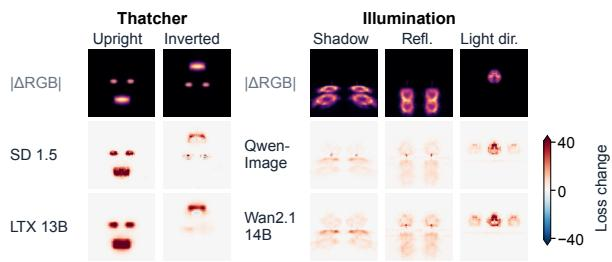  
Figure 2: Spatial loss changes. Mean paired loss maps for two high-alignment models per task. Top-row pixel differences identify the modified regions. Complete 25-model maps: Appendix M.

Spatial loss-difference maps reveal where violation penalties arise across the scene (Figure 2). For upright Thatcher faces, loss increases concentrated around the inverted eyes and mouth, with marked attenuation under face inversion. For illumination interventions, loss increases were not confined to manipulated regions, extending from floor surfaces to objects directly above altered shadows or reflections, and from the central object to unmodified flanking objects under light-direction shifts. These maps indicate that generative models evaluate contextual relationships across the scene rather than isolated local modifications.

## 4.2 ITEM-LEVEL HUMAN ALIGNMENT

Item-level agreement across generative models. We next tested whether these selective sensitivities generalize to continuous, item-level agreement across the full 25-model benchmark. Across individual stimulus pairs, directional loss changes $( u _ { m , i } = L _ { m } ( x _ { i } ^ { \mathrm { m o d } } ) - L _ { m } ( x _ { i } ^ { \mathrm { o r i g } } ) )$ ) reliably tracked continuous human unnaturalness ratings $( h _ { i } )$ , with median Pearson correlations of .747 on Thatcher (peaking at .841) and .334 on Illumination (peaking at .639; Figure 3A). This alignment was not driven merely by coarse mean differences across conditions: after condition centering (subtracting condition-specific means from both model losses and human ratings to isolate item-level rankings within each condition), correlations remained positive for all 25 models on both tasks (medians of .411 and $. 2 7 1 ;$ peaking at .534 and .619; condition breakdowns in Appendix H). In sharp contrast, unconditioned single-image losses $( L _ { m } ( x ) )$ showed little correlation with human ratings (25-model medians $\mathrm { o f \ - . 2 0 }$ to .24; Appendix F.2), confirming that paired differencing is essential to separate relational naturalness from shared scene composition.

Notably, human alignment was observed across diverse generative formulations (diffusion versus flow), modeling spaces (pixel versus latent), and modalities (image versus video), with substantial within-category variation (model-wise breakdowns across conditions in Figure S12; model specifica tions in Table S1). Furthermore, high alignment emerged in models whose training recipes include no explicit preference optimization (e.g., RLHF or DPO). On Thatcher, class-conditional JiT models (Li & He, 2026) trained solely on ImageNet exhibited alignment that scaled systematically with model capacity (reaching $r = . 5 7 7$ for JiT-H/32), alongside strong agreement in SD v1.5 $( r = . 8 2 5 )$ . On Illumination, Wan2.1 14B (Team Wan et al., 2025) achieved the highest overall correlation $( r = . 6 3 9 $ remaining .619 after condition centering), with solid alignment also sustained in video models such as CogVideoX (Yang et al., 2025). These findings indicate that perceptual alignment with human naturalness judgments emerges directly from learning visual data distributions.

Comparison with visual encoder and IQA baselines. Across both tasks, top generative models achieved higher human alignment than all evaluated baselines (Figure 3A), even after selecting each encoder’s best-performing layer (top-five median $r = . 8 1 6 \ \mathrm { v s }$ . .660 on Thatcher; .602 vs. .492 on Illumination). In contrast, standard image quality metrics showed substantially weaker correspondence: NR-IQA correlations remained near zero throughout (.087 on Thatcher, .009 on Illumination), arguing against generic degradation or manipulation artifacts, while weak FR-IQA results (.103 and .254) indicate that alignment is not driven merely by low-level change magnitude.

Bidirectional partial correlations with baselines. Generative scores also retained robust positive residual associations after controlling for baseline metrics in bidirectional partial correlation analyses (Figure 3B). Controlling for standard IQA metrics had little effect on generative alignment (medians of $r ( h , G \mid \mathrm { I Q A } ) = . 8 0 9 \mathrm { - . 8 2 5 }$ on Thatcher and .535–.602 on Illumination), while IQA residual associations remained near or below zero $\left( - . 1 6 0 \ \mathrm { t o } \ . 1 0 6 \right)$ , confirming that generative signals do not simply reflect low-level degradation or distortion magnitude. When evaluated alongside frozen vision encoders, generative scores likewise preserved positive residual associations. On Thatcher, generative scores retained strong incremental explanatory power (median partial correlation of .676, 95% CI [.612, .701] vs. .130, [.054, .228] for encoders), whereas on Illumination, both representations retained substantial non-redundant associations (.510 for generative models vs. .375 for encoders), demonstrating complementary perceptual structure. Broken down by condition, generative scores contributed distinct variance for upright faces, cast shadows, and light direction, while encoders retained larger associations for surface reflections (Figure S14, Appendix I). Together, these results indicate that native generative loss landscapes capture human-aligned perceptual regularities that are distinct from standard quality metrics and complementary to discriminative visual encoders.

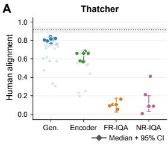

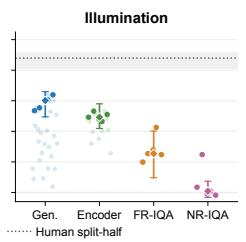

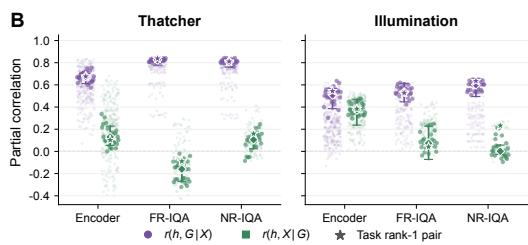  
Figure 3: Item-level human alignment and comparison with baselines. (A) Model–human Pearson correlations on individual stimulus pairs. Saturated points mark top-five Generative and Encoder models and all IQA metrics; diamonds show medians. Dotted lines and bands show mean human split-half reliability and its 95% interval. (B) Bidirectional partial correlations $( r ( h , G \mid X )$ , purple circles; $r ( h , X \mid \dot { G } )$ , green circles). Faint points show all pairs; saturated points show the selected 5 $\times 5$ model pairs; stars mark the rank-1 pair. Large markers and bars in all panels show medians and 95% bootstrap CIs (Section 3.4, Appendix E.3).

## 4.3 COUPLING AND DISSOCIATION OF SENSITIVITY AND ALIGNMENT

Cross-model association. To test whether human alignment simply reflects stronger violation detection, we examined whether models with greater violation sensitivity also showed closer human alignment, evaluating this relationship both across each task as a whole and within individual stimulus conditions (Figure 4). Across the full benchmark, violation sensitivity exhibited an overall positive association with item-level human alignment (Figure 4A; Thatcher: $r = . 6 6 3 , 9 5 \%$ CI [.086, .905]; Illumination: $r = . 8 2 1 , [ . 5 4 2 , . 9 2 2 ] \rangle$ , with larger models generally clustering toward the upper right (Appendix K, Figure S19). Within individual conditions (Figure 4B), positive associations were robust for cast shadows $( r = . 8 1 0 , 9 5 \% \mathrm { C I } [ . 4 2 4 , . 9 6 0 ] )$ and inverted faces $( r = . 7 2 3 , [ . 1 1 8 , . 9 2 3 ] )$ . For upright faces, the point estimate remained positive but carried wide estimation uncertainty $( r = . 6 6 7$ $[ - . 2 1 5 , . 9 0 4 ] )$ , whereas associations were near zero for light direction $( r = . 0 5 1 , [ - . 4 1 \dot { 7 } , . 5 7 0 ] )$ and negative for surface reflections $( r = - . 3 7 1 , [ - . 7 0 4 , . 3 6 4 ]$ ; Appendix H). Thus, while sensitivity and alignment covary across each task as a whole, this coupling is not uniform across individual stimulus conditions.

Dissociation along denoising schedules. Within individual models, violation sensitivity and human alignment systematically peak at different stages of the denoising schedule (Figure 5A,B). Across normalized schedules $( [ \dot { 0 } , \bar { 1 } ] )$ , sensitivity peaked later (at cleaner noise levels) than human alignment in 20 of 25 models on Thatcher and in all 25 models on Illumination, with median within-model peak shifts of 0.141 and 0.444 (condition breakdowns in Appendix N). This separation is consistent with the coarse-to-fine dynamics of generative diffusion (Sclocchi et al., 2025; Tınaz et al., 2025; Görgün et al., 2026): human alignment on relational tasks may peak at intermediate noise levels where global layout and contextual consistency are resolved, whereas later stages emphasize fine details that inflate loss penalties without refining perceptual agreement.

Connection to practical generation performance. Finally, as an exploratory analysis, we investigated whether loss-based perceptual alignment connects to practical generative capabilities

B Sensitivity–alignment

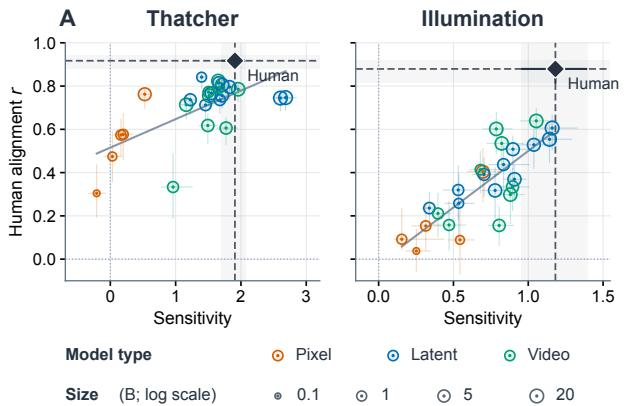

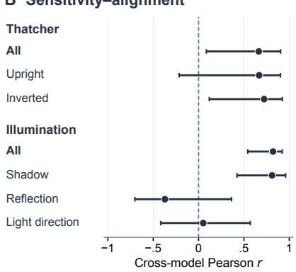  
Figure 4: Cross-model association between sensitivity and human alignment. (A) Violation sensitivity versus human alignment (r) for 25 generative models on Thatcher and Illumination. Solid lines show linear fits; black diamonds and dashed crosshairs mark human sensitivity and split-half reliability. Marker colors indicate model types (pixel, latent, video); sizes scale with parameter count (bottom legend). (B) Cross-model Pearson correlations (r) between sensitivity and alignment for each task as a whole (All) and within individual conditions. Error bars denote 95% bootstrap CIs.

(Appendix L). We matched 11 image models to human-preference Elo (Artificial Analysis, 2026) and seven video models to VBench Quality (Huang et al., 2024) (Table S4). Model-level Spearman correlations between generation benchmarks and human alignment were positive on Illumination for image models $( \rho = . 8 2 7 )$ and across both tasks for video models $( \rho = . 9 2 9$ on Thatcher, $\rho = . 8 2 1$ on Illumination; Table S5), and these associations remained positive after controlling for violation sensitivity (partial $\rho = . 6 7 0$ for image models; .900 and .778 for video models). In contrast, the association on Thatcher images was weak both before and after adjustment $( \rho = . 1 9 1$ and .182), which may reflect ceiling effects as many models approach human-level agreement on faces (Figure 4A). Conversely, reciprocal associations between generation benchmarks and violation sensitivity after controlling for alignment were uniformly weak across all four comparisons $( \rho = - . 0 4 5$ to .218). While based on modest sample sizes, these exploratory associations suggest that loss-based perceptual alignment may reflect visual regularities that support practical generation quality.

## 5 DISCUSSION

This study evaluated whether the native prediction losses of visual generative models reflect human naturalness perception under controlled relational modifications. Across diverse architectures, zeroshot loss differences track continuous human ratings and retain complementary perceptual structure beyond standard vision encoders and image quality metrics. While coarse violation sensitivity broadly covaries with perceptual alignment across models, sensitivity and fine-grained alignment systematically dissociate along denoising schedules and vary across visual domains. These findings suggest that current generative models internalize structured relational regularities that partially mirror the selective sensitivities and tolerances of human naturalness perception, rather than merely signaling physical violations or generic visual divergence. Beyond characterizing existing architectures, this diagnostic framework provides a foundation to track how generative representations converge toward or diverge from biological perception as models scale.

Orientation dependence in face perception. Human sensitivity to relational facial distortions deteriorates sharply under inversion, a hallmark effect exemplified by the Thatcher illusion (Thompson, 1980; de Haas & Schwarzkopf, 2018). While this orientation dependence is known to emerge in feedforward networks (Jacob et al., 2021) and was observed in our encoder baselines (Figure 1B), generative models capture human judgments far more closely. Top generative models markedly outperform even layer-optimized encoders in human alignment on Thatcher, and bidirectional partial correlations confirm that they retain substantial explanatory power that encoder representations cannot account for (Figure 3). Notably, the ImageNet-trained JiT models (Li & He, 2026) demonstrate that this orientation penalty can arise without training on a dedicated face dataset, scaling systematically with model capacity (Appendix G). Generative losses also track naturalness variations within upright faces alone (median r = .493), echoing findings that generative evidence tracks human facial attractiveness (López & Triesch, 2026). These results demonstrate that key characteristics of human face perception can emerge directly from statistical generative modeling of 2D images.

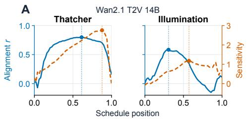

B  
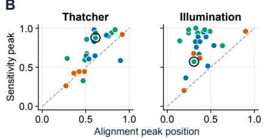  
Figure 5: Dissociation of sensitivity and human alignment along denoising schedules. (A) Representative schedule dynamics (Wan2.1 T2V 14B) on Thatcher and Illumination: human alignment r (blue, solid) and sensitivity (orange, dashed) across normalized schedule positions (0 → 1); solid dots mark peak positions. (B) Peak locations for all 25 models on Thatcher and Illumination across normalized schedules ([0, 1]); the dashed diagonal marks equal timing. Dots are colored by model category following Figure 4; open black rings identify Wan2.1 T2V 14B.

Physical scene illumination. In our Illumination experiments, human sensitivity to shadow and reflection inconsistencies depended strongly on scene geometry (Figure 1B): observers readily detected violations for objects with distinctive directional landmarks (e.g., teapot), but tolerated errors for shapes lacking prominent spatial asymmetries (e.g., Spot). This selective sensitivity aligns with psychophysical accounts where directional landmarks facilitate spatial feature matching (Casati, 2008; Farid & Bravo, 2010; Nightingale et al., 2019; Norman et al., 2009). Generative losses systematically tracked this geometric selectivity across shadow and reflection rotations as well as lighting directions (Figure 1B, Appendix J), suggesting that rather than acting as objective detectors of physical violations, models rely on statistical correspondence cues that mirror human perceptual heuristics. However, models show a much weaker response to reflection hue shifts than humans do (Figure 1B). While humans treat an impossible reflection color as a decisive physical violation, generative losses appear to penalize it only as a modest color difference relative to geometric misalignments. This divergence suggests that native loss landscapes may internalize relevant relational cues without weighting them in line with human perception.

Model scaling and perceptual alignment. One might expect that scaling model capacity would steadily resolve such discrepancies, bringing models closer to an ideal observer of physical violations that automatically aligns with human perception. In exploratory comparisons, whole-task alignment did scale positively with model size (Appendix K, Figure S19), but this relationship did not uniformly extend to judgments within individual conditions. Most notably, for surface reflections, larger models grew steadily more sensitive to violations without showing any improvement in human alignment (Figure S21). This dissociation suggests that heightened sensitivity to visual perturbations does not guarantee alignment with the selective tolerances and weightings of human perception.

Limitations. Several limitations qualify these conclusions. First, our psychophysical intervention framework isolates relational regularities by minimizing low-level confounds, but this comes at the expense of scene diversity; extending controlled manipulations to unconstrained natural imagery without introducing low-level artifacts remains challenging. Second, because we evaluate off-theshelf models, our comparisons cannot fully isolate core generative objectives from differences in model scale, architecture, or post-training recipes, nor can they disentangle generic visual statistics from human-curated preferences in modern training corpora. Finally, our analyses linking perceptual alignment to downstream generation benchmarks are observational, leaving open whether directly optimizing for human-aligned relational priors causally improves generation quality.

## AI USE STATEMENT

Generative AI tools were used at several stages of the research and writing process. They were used to identify potentially relevant prior work and related studies; to discuss and obtain feedback on aspects of research methodology, analysis strategy, and interpretation of results; to assist with data analysis and plotting code; and to draft, revise, and polish portions of the manuscript, including LATEX formatting. Candidate references and related work identified with AI assistance were checked against the original sources, and AI-assisted code and analyses were inspected and verified by the author.

In addition, an image generation model was used to create the synthetic face image shown in Figures 1 and S1 solely for illustrative purposes to depict the stimulus manipulation. This synthetic image was not used in the human experiments or model analyses.

All research decisions, analyses, interpretations, and claims were made and verified by the author. All AI-assisted text, code, and other outputs were reviewed and edited as appropriate, and the author takes full responsibility for the contents of this work.

## ETHICS STATEMENT

The human behavioral experiments were approved by the Institutional Review Board (Ethics Committee) of the author’s institution. All participants were adults and provided informed consent via an electronic consent form prior to participation. Detailed participant demographics, experimental procedures, and task instructions are provided in Appendix B.

## REPRODUCIBILITY STATEMENT

Code, data, and stimulus materials are available at https://github.com/t-fukiage/generative-p riors-naturalness. The repository provides precomputed model scores, anonymized participant ratings, stimulus images and generation scripts, and reproduction code for model scoring, participant screening, and statistical analyses. Model specifications and experimental and statistical procedures are described in Section 3 and Appendices A–E.

## ACKNOWLEDGMENTS

We thank Zitang Sun for his work on preliminary analyses in the early stage of this project and for helpful discussions that contributed to its subsequent development. This work was supported by JSPS KAKENHI Grant Number JP24H00721.

## REFERENCES

Erfan Alimohammadi. Thatcher Effect Dataset Generator. https://github.com/Erfaniaa/thatcher-effe ct-dataset-generator, 2020. Open-source software under GNU General Public License v3.0.

Artificial Analysis. Image generation benchmarking methodology. https://artificialanalysis.ai/image /methodology, 2026. Accessed September 12, 2026.

Hritik Bansal, Zongyu Lin, Tianyi Xie, Zeshun Zong, Michal Yarom, Yonatan Bitton, Chenfanfu Jiang, Yizhou Sun, Kai-Wei Chang, and Aditya Grover. VideoPhy: Evaluating physical commonsense for video generation. In International Conference on Learning Representations, 2025.

Black Forest Labs. FLUX. https://github.com/black-forest-labs/flux, 2024.

Black Forest Labs. FLUX.2: Frontier visual intelligence. https://bfl.ai/blog/flux-2, 2025.

Daniel Bolya, Po-Yao Huang, Peize Sun, Jang Hyun Cho, Andrea Madotto, Chen Wei, Tengyu Ma, Jiale Zhi, Jathushan Rajasegaran, Hanoona Bangalath, Junke Wang, Marco Monteiro, Hu Xu, Shiyu Dong, Nikhila Ravi, Shang-Wen Li, Piotr Dollár, and Christoph Feichtenhofer. Perception encoder: The best visual embeddings are not at the output of the network. In Advances in Neural Information Processing Systems, volume 38, 2025.

Qi Cai et al. HiDream-O1-Image: A natively unified image generative foundation model with pixel-level unified transformer. arXiv preprint arXiv:2605.11061, 2026.

Roberto Casati. The copycat solution to the shadow correspondence problem. Perception, 37(4): 495–503, 2008. doi: 10.1068/p5588.

Patrick Cavanagh. The artist as neuroscientist. Nature, 434(7031):301–307, 2005.

Chaofeng Chen and Jiadi Mo. IQA-PyTorch: PyTorch toolbox for image quality assessment. https://github.com/chaofengc/IQA-PyTorch, 2022.

Kevin Clark and Priyank Jaini. Text-to-image diffusion models are zero-shot classifiers. In Advances in Neural Information Processing Systems, volume 36, pp. 46433–46449, 2023.

Benjamin de Haas and D. Samuel Schwarzkopf. Feature-location effects in the Thatcher illusion. Journal of Vision, 18(4):16, 2018.

Joshua R. de Leeuw, Rebecca A. Gilbert, and Björn Luchterhandt. jsPsych: Enabling an open-source collaborative ecosystem of behavioral experiments. Journal of Open Source Software, 8(85):5351, 2023.

Keyan Ding, Kede Ma, Shiqi Wang, and Eero P Simoncelli. Image quality assessment: Unifying structure and texture similarity. IEEE Transactions on Pattern Analysis and Machine Intelligence, 44(5):2567–2581, 2022. doi: 10.1109/TPAMI.2020.3045810.

Zhengfang Duanmu, Wentao Liu, Zhongling Wang, and Zhou Wang. Quantifying visual image quality: A Bayesian view. Annual Review ofVision Science, 7:437–464, 2021.

Patrick Esser, Sumith Kulal, Andreas Blattmann, Rahim Entezari, Jonas Müller, Harry Saini, Yam Levi, Dominik Lorenz, Axel Sauer, Frederic Boesel, Dustin Podell, Tim Dockhorn, Zion English, and Robin Rombach. Scaling rectified flow transformers for high-resolution image synthesis. In Proceedings ofthe 41st International Conference on Machine Learning, volume 235 of Proceedings ofMachine Learning Research, pp. 12606–12633, 2024.

Hany Farid. Lighting (in)consistency of paint by text. arXiv preprint arXiv:2207.13744, 2022. URL https://arxiv.org/abs/2207.13744.

Hany Farid and Mary J Bravo. Image forensic analyses that elude the human visual system. In Nasir D Memon, Jana Dittmann, Adnan M Alattar, and Edward J Delp, III (eds.), Media Forensics and Security II, volume 7541, pp. 52–61. SPIE, 4 February 2010. doi: 10.1117/12.837788.

Honghao Fu, Yufei Wang, Wenhan Yang, Alex C. Kot, and Bihan Wen. DP-IQA: Utilizing diffusion prior for blind image quality assessment in the wild. arXiv preprint arXiv:2405.19996, 2024.

Alexandra Gómez-Villa, Adrián Martín, Javier Vazquez-Corral, Marcelo Bertalmío, and Jesús Malo. Color illusions also deceive CNNs for low-level vision tasks: Analysis and implications. Vision Research, 176:156–174, 2020.

Alexandra Gómez-Villa, Kai Wang, C. Alejandro Párraga, Bartłomiej Twardowski, Jesús Malo, Javier Vazquez-Corral, and Joost van de Weijer. The art of deception: Color visual illusions and diffusion models. In Proceedings ofthe IEEE/CVF Conference on Computer Vision and Pattern Recognition, pp. 18642–18652, 2025.

Ada Görgün, Fawaz Sammani, Nikos Deligiannis, Bernt Schiele, and Jonas Fischer. Temporal concept dynamics in diffusion models via prompt-conditioned interventions. In International Conference on Learning Representations, 2026.

Klaus Greff, Francois Belletti, Lucas Beyer, Carl Doersch, Yilun Du, Daniel Duckworth, David J. Fleet, Dan Gnanapragasam, Florian Golemo, Charles Herrmann, Thomas Kipf, Abhijit Kundu, Dmitry Lagun, Issam Laradji, Hsueh-Ti (Derek) Liu, Henning Meyer, Yishu Miao, Derek Nowrouzezahrai, Cengiz Oztireli, Etienne Pot, Noha Radwan, Daniel Rebain, Sara Sabour, Mehdi S. M. Sajjadi, Matan Sela, Vincent Sitzmann, Austin Stone, Deqing Sun, Suhani Vora, Ziyu Wang, Tianhao Wu, Kwang Moo Yi, Fangcheng Zhong, and Andrea Tagliasacchi. Kubric: A scalable dataset generator. In IEEE/CVF Conference on Computer Vision and Pattern Recognition, pp. 3749–3761, 2022.

Yoav HaCohen et al. LTX-Video: Realtime video latent diffusion. arXiv preprint arXiv:2501.00103, 2024.

Kaiming He, Xiangyu Zhang, Shaoqing Ren, and Jian Sun. Deep residual learning for image recognition. In Proceedings of the IEEE Conference on Computer Vision and Pattern Recognition, pp. 770–778, 2016.

Jonathan Ho, Ajay Jain, and Pieter Abbeel. Denoising diffusion probabilistic models. In NeurIPS 2020, 2020.

Ziqi Huang, Yinan He, Jiashuo Yu, Fan Zhang, Chenyang Si, Yuming Jiang, Yuanhan Zhang, Tianxing Wu, Qingyang Jin, Nattapol Chanpaisit, Yaohui Wang, Xinyuan Chen, Limin Wang, Dahua Lin, Yu Qiao, and Ziwei Liu. VBench: Comprehensive benchmark suite for video generative models. In Proceedings ofthe IEEE/CVF Conference on Computer Vision and Pattern Recognition, pp. 21807– 21818, 2024. URL https://openaccess.thecvf.com/content/CVPR2024/html/Huang\_VBench\_Com prehensive\_Benchmark\_Suite\_for\_Video\_Generative\_Models\_CVPR\_2024\_paper.html.

Georgin Jacob, R T Pramod, Harish Katti, and S P Arun. Qualitative similarities and differences in visual object representations between brains and deep networks. Nature Communications, 12(1): 1872, 25 March 2021. ISSN 2041-1723. doi: 10.1038/s41467-021-22078-3.

Hamidreza Kamkari, Brendan Leigh Ross, Jesse C. Cresswell, Anthony L. Caterini, Rahul Krishnan, and Gabriel Loaiza-Ganem. A geometric explanation of the likelihood OOD detection paradox. In Proceedings ofthe 41st International Conference on Machine Learning, volume 235 of Proceedings ofMachine Learning Research, pp. 22908–22935, 2024.

Tero Karras, Samuli Laine, and Timo Aila. A style-based generator architecture for generative adversarial networks. In IEEE/CVF Conference on Computer Vision and Pattern Recognition, 2019.

Vahid Kazemi and Josephine Sullivan. One millisecond face alignment with an ensemble of regression trees. In IEEE Conference on Computer Vision and Pattern Recognition, pp. 1867–1874, 2014.

Junjie Ke, Qifei Wang, Yilin Wang, Peyman Milanfar, and Feng Yang. MUSIQ: Multi-scale image quality transformer. In IEEE/CVF International Conference on Computer Vision, 2021.

Davis E King. Dlib-ml: A machine learning toolkit. Journal ofMachine Learning Research, 10: 1755–1758, 2009.

Diederik P. Kingma and Ruiqi Gao. Understanding diffusion objectives as the ELBO with simple data augmentation. In Advances in Neural Information Processing Systems, volume 36, pp. 70932–70956, 2023.

Polina Kirichenko, Pavel Izmailov, and Andrew Gordon Wilson. Why normalizing flows fail to detect out-of-distribution data. In Advances in Neural Information Processing Systems, volume 33, pp. 20578–20589, 2020.

Weijie Kong et al. HunyuanVideo: A systematic framework for large video generative models. arXiv preprint arXiv:2412.03603, 2024.

Andreas Koukounas et al. jina-clip-v2: Multilingual multimodal embeddings for text and images. arXiv preprint arXiv:2412.08802, 2024.

Eric Cooper Larson and Damon Michael Chandler. Most apparent distortion: full-reference image quality assessment and the role of strategy. Journal ofElectronic Imaging, 19(1):011006, January 2010. ISSN 1017-9909,1560-229X. doi: 10.1117/1.3267105.

Mingxin Li et al. Qwen3-VL-Embedding and Qwen3-VL-Reranker: A unified framework for state-of-the-art multimodal retrieval and ranking. arXiv preprint arXiv:2601.04720, 2026.

Tianhong Li and Kaiming He. Back to basics: Let denoising generative models denoise. In Proceedings of the IEEE/CVF Conference on Computer Vision and Pattern Recognition, pp. 36115–36125, 2026.

Francisco M. López and Jochen Triesch. Beauty is in the ELBO of the beholder: A variational account of processing fluency in face perception. arXiv preprint arXiv:2608.24219, 2026.

Zehong Ma, Ruihan Xu, and Shiliang Zhang. PixelGen: Improving pixel diffusion with perceptual supervision. arXiv preprint arXiv:2602.02493, 2026.

Pascal Mamassian. Impossible shadows and the shadow correspondence problem. Perception, 33 (11):1279–1290, 1 November 2004. ISSN 0301-0066,1468-4233. doi: 10.1068/p5280.

Anish Mittal, Anush Krishna Moorthy, and Alan Conrad Bovik. No-reference image quality assessment in the spatial domain. IEEE Transactions on Image Processing, 21(12):4695–4708, 2012.

Anish Mittal, Rajiv Soundararajan, and Alan Conrad Bovik. Making a “completely blind” image quality analyzer. IEEE Signal Processing Letters, 20(3):209–212, 2013.

Saman Motamed, Laura Culp, Kevin Swersky, Priyank Jaini, and Robert Geirhos. Do generative video models understand physical principles? In Proceedings of the IEEE/CVF Winter Conference on Applications of Computer Vision, pp. 948–958, 2026.

Eric Nalisnick, Akihiro Matsukawa, Yee Whye Teh, Dilan Gorur, and Balaji Lakshminarayanan. Do deep generative models know what they don’t know? In International Conference on Learning Representations, 2019.

Sophie J Nightingale, Kimberley A Wade, Hany Farid, and Derrick G Watson. Can people detect errors in shadows and reflections? Attention, Perception, & Psychophysics, 81(8):2917–2943, 28 November 2019. ISSN 1943-3921,1943-393X. doi: 10.3758/s13414-019-01773-w.

J Farley Norman, Young-lim Lee, Flip Phillips, Hideko F Norman, L RaShae Jennings, and T Ryan McBride. The perception of 3-D shape from shadows cast onto curved surfaces. Acta Psychologica, 131(1):1–11, 2009. doi: 10.1016/j.actpsy.2009.01.007.

Maxime Oquab, Timothée Darcet, Théo Moutakanni, Huy V. Vo, Marc Szafraniec, Vasil Khalidov, Pierre Fernandez, Daniel Haziza, Francisco Massa, Alaaeldin El-Nouby, et al. DINOv2: Learning robust visual features without supervision. Transactions on Machine Learning Research, 2024.

Yuri Ostrovsky, Patrick Cavanagh, and Pawan Sinha. Perceiving illumination inconsistencies in scenes. Perception, 34(11):1301–1314, 2005. ISSN 0301-0066. doi: 10.1068/p5418.

Dustin Podell, Zion English, Kyle Lacey, Andreas Blattmann, Tim Dockhorn, Jonas Müller, Joe Penna, and Robin Rombach. SDXL: Improving latent diffusion models for high-resolution image synthesis. In International Conference on Learning Representations, 2024.

Alec Radford, Jong Wook Kim, Chris Hallacy, Aditya Ramesh, Gabriel Goh, Sandhini Agarwal, Girish Sastry, Amanda Askell, Pamela Mishkin, Jack Clark, Gretchen Krueger, and Ilya Sutskever. Learning transferable visual models from natural language supervision. In Proceedings of the 38th International Conference on Machine Learning, volume 139, pp. 8748–8763. PMLR, 2021.

Simon Raviv and Gal Chechik. Assessing image quality using a simple generative representation. arXiv preprint arXiv:2404.18178, 2024.

Jie Ren, Peter J. Liu, Emily Fertig, Jasper Snoek, Ryan Poplin, Mark A. DePristo, Joshua V. Dillon, and Balaji Lakshminarayanan. Likelihood ratios for out-of-distribution detection. In Advances in Neural Information Processing Systems, volume 32, 2019. URL https://proceedings.neurips.cc/pap er/2019/hash/1e79596878b2320cac26dd792a6c51c9-Abstract.html.

Robin Rombach, Andreas Blattmann, Dominik Lorenz, Patrick Esser, and Björn Ommer. Highresolution image synthesis with latent diffusion models. In IEEE/CVF Conference on Computer Vision and Pattern Recognition, 2022.

Michele A Saad, Alan Conrad Bovik, and Christophe Charrier. Blind image quality assessment: A natural scene statistics approach in the DCT domain. IEEE Transactions on Image Processing, 21 (8):3339–3352, 2012.

Srijani Saha, Talia Konkle, and George A Alvarez. A unified account of lightness illusions via edgebased reconstruction of natural images. bioRxiv preprint, 2026. doi: 10.64898/2026.04.07.716245. URL https://www.biorxiv.org/content/10.64898/2026.04.07.716245v2.

Ayush Sarkar, Hanlin Mai, Amitabh Mahapatra, Svetlana Lazebnik, David A. Forsyth, and Anand Bhattad. Shadows don’t lie and lines can’t bend! generative models don’t know projective geometry... for now. In Proceedings of the IEEE/CVF Conference on Computer Vision and Pattern Recognition, pp. 28140–28149, 2024.

Antonio Sclocchi, Alessandro Favero, and Matthieu Wyart. A phase transition in diffusion models reveals the hierarchical nature of data. Proceedings ofthe National Academy ofSciences, 122(1): e2408799121, 2025.

Joan Serrà, David Àlvarez, Vicenç Gómez, Olga Slizovskaia, José F. Núñez, and Jordi Luque. Input complexity and out-of-distribution detection with likelihood-based generative models. In International Conference on Learning Representations, 2020. URL https://openreview.net/forum ?id=SyxIWpVYvr.

Haz Sameen Shahgir, Khondker Salman Sayeed, Abhik Bhattacharjee, Wasi Uddin Ahmad, Yue Dong, and Rifat Shahriyar. IllusionVQA: A challenging optical illusion dataset for vision language models. In Conference on Language Modeling, 2024.

Hamid R Sheikh and Alan C Bovik. Image information and visual quality. IEEE Transactions on Image Processing, 15(2):430–444, 2006. doi: 10.1109/TIP.2005.859378.

B. W. Silverman. Density Estimationfor Statistics and Data Analysis. Chapman and Hall, London, 1986.

Oriane Siméoni, Huy V. Vo, Maximilian Seitzer, Federico Baldassarre, Maxime Oquab, Cijo Jose, Vasil Khalidov, Marc Szafraniec, Seung Eun Yi, Michael Ramamonjisoa, Francisco Massa, Daniel Haziza, Luca Wehrstedt, Jianyuan Wang, Timothée Darcet, Théo Moutakanni, Leonel Sentana, Claire Roberts, Andrea Vedaldi, Jamie Tolan, John Brandt, Camille Couprie, Julien Mairal, Hervé Jégou, Patrick Labatut, and Piotr Bojanowski. DINOv3. Transactions on Machine Learning Research, 2026.

Yiren Song, Xiaokang Liu, and Mike Zheng Shou. DiffSim: Taming diffusion models for evaluating visual similarity. In Proceedings of the IEEE/CVF International Conference on Computer Vision, pp. 16904–16915, 2025.

Shaolin Su, Qingsen Yan, Yu Zhu, Cheng Zhang, Xin Ge, Jinqiu Sun, and Yanning Zhang. Blindly assess image quality in the wild guided by a self-adaptive hyper network. In IEEE/CVF Conference on Computer Vision and Pattern Recognition, 2020.

Team Wan et al. Wan: Open and advanced large-scale video generative models. arXiv preprint arXiv:2503.20314, 2025.

Peter Gage Thompson. Margaret Thatcher: A new illusion. Perception, 9(4):483–484, 1980. doi: 10.1068/p090483.

Berk Tınaz, Zalan Fabian, and Mahdi Soltanolkotabi. Emergence and evolution of interpretable concepts in diffusion models. In Advances in Neural Information Processing Systems, volume 38, pp. 166943–166986, 2025.

Michael Tschannen et al. SigLIP 2: Multilingual vision-language encoders with improved semantic understanding, localization, and dense features. arXiv preprint arXiv:2502.14786, 2025.

Zhou Wang, Alan C Bovik, Hamid R Sheikh, and Eero P Simoncelli. Image quality assessment: From error visibility to structural similarity. IEEE Transactions on Image Processing, 13(4):600–612, 2004. doi: 10.1109/TIP.2003.819861.

John D Wilder, Wendy J Adams, and Richard F Murray. Shape from shading under inconsistent illumination. Journal ofVision, 19(6):2, 3 June 2019. ISSN 1534-7362. doi: 10.1167/19.6.2.

Chenfei Wu et al. Qwen-Image technical report. arXiv preprint arXiv:2508.02324, 2025.

You-Zhe Xie, Yu-Hsuan Li, Jie-Ying Lee, Kaipeng Zhang, Yu-Lun Liu, and Zhixiang Wang. YoCausal: How far is video generation from world model? a causality perspective. arXiv preprint arXiv:2605.30346, 2026. URL https://arxiv.org/abs/2605.30346.

Zhuoyi Yang, Jiayan Teng, Wendi Zheng, Ming Ding, Shiyu Huang, Jiazheng Xu, Yuanming Yang, Wenyi Hong, Xiaohan Zhang, Guanyu Feng, Da Yin, Yuxuan Zhang, Weihan Wang, Yean Cheng, Bin Xu, Xiaotao Gu, Yuxiao Dong, and Jie Tang. CogVideoX: Text-to-video diffusion models with an expert transformer. In International Conference on Learning Representations, 2025.

Ilker Yildirim, Mario Belledonne, Winrich Freiwald, and Josh Tenenbaum. Efficient inverse graphics in biological face processing. Science Advances, 6(10):eaax5979, 2020.

Jianhao Yuan, Fabio Pizzati, Francesco Pinto, Lars Kunze, Ivan Laptev, Paul Newman, Philip Torr, and Daniele De Martini. LikePhys: Evaluating intuitive physics understanding in video diffusion models via likelihood preference. In International Conference on Learning Representations, 2026. URL https://openreview.net/forum?id=6UJf6B8RZ8.

Alan Yuille and Daniel Kersten. Vision as Bayesian inference: analysis by synthesis? Trends in Cognitive Sciences, 10(7):301–308, 2006.

Richard Zhang, Phillip Isola, Alexei A. Efros, Eli Shechtman, and Oliver Wang. The unreasonable effectiveness of deep features as a perceptual metric. In Proceedings of the IEEE Conference on Computer Vision and Pattern Recognition, pp. 586–595, 2018.

Weixia Zhang, Guangtao Zhai, Ying Wei, Xiaokang Yang, and Kede Ma. Blind image quality assessment via vision-language correspondence: A multitask learning perspective. In IEEE/CVF Conference on Computer Vision and Pattern Recognition, 2023.

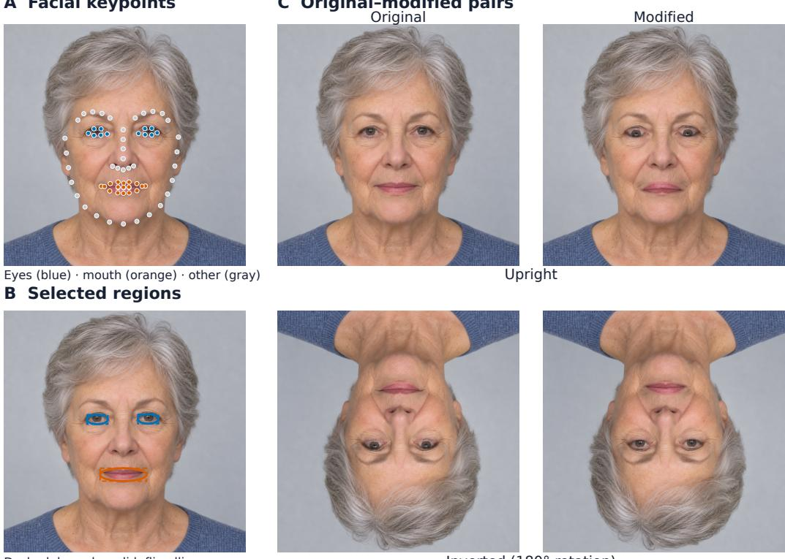

A Facial keypoints

C Original–modified pairs Original

Dashed: bounds; solid: flip ellipse

Inverted (180° rotation)

Figure S1: Thatcher stimulus construction. (A) The 68 facial landmarks detected on an AIgenerated fictional face (eyes: blue; mouth: orange; remaining points: gray). (B) Selected regions for feature inversion. Dashed rectangles indicate padded landmark bounds; solid ellipses delimit vertically inverted regions feathered along their boundaries. (C) Original (left) and Thatcherized (right) versions in upright (top) and inverted (bottom; exact 180◦ rotation) orientations. The face is used only to illustrate the procedure and was not included in the human experiments or model analyses.

## A STIMULUS CONSTRUCTION

## A.1 THATCHER FACES.

The stimulus set comprises 140 aligned 1024 × 1024 face identities, each evaluated across four conditions: original upright, Thatcherized upright, original inverted, and Thatcherized inverted (560 images total; construction procedure illustrated in Figure S1).

Source dataset and license filtering. Source face images were sampled from the Flickr-Faces-HQ (FFHQ) dataset (Karras et al., 2019), which provides aligned 1024 × 1024 portraits. Source images were restricted to entries marked CC0 1.0 or Public Domain Mark 1.0 in the official FFHQ metadata (ffhq-dataset-v2.json). From this pool, we chose 140 distinct public-domain face identities for the experimental stimuli, and an additional 5 disjoint identities for practice trials (10 practice trials presenting original and modified pairs across orientations).

Feature inversion and boundary blending. To generate Thatcherized faces, we adapted the open-source pipeline by Alimohammadi (2020) (released under the GNU General Public License v3.0). For each face image, 68 facial landmarks were detected using dlib (King, 2009) with its pre-trained shape predictor (Kazemi & Sullivan, 2014) (Figure S1A). Landmarks corresponding to the left eye (points 36–41), right eye (points 42–47), and mouth (points 48–67) were used to define bounding regions with modest padding offsets around each feature (Figure S1B, dashed rectangles). Within each feature region, pixels inside an elliptical mask were vertically inverted in place across the feature’s horizontal midline (Figure S1B, solid ellipses). To minimize high-contrast seam artifacts and artificial edges, Gaussian blending feathered the transition along the elliptical perimeter into the surrounding skin. Inverted stimuli were generated by rotating both the original and Thatcherized images by 180◦ (Figure S1C).

## A.2 ILLUMINATION SCENES.

We generated synthetic $1 0 2 4 \times 1 0 2 4$ stimuli using Kubric (Greff et al., 2022) across three physical operations: cast shadows (Shadow), surface reflections (Reflection), and lighting direction (Light direction). Each operation comprised 48 base configurations. Horizontally mirroring each base pair produced another 48 pairs, yielding 96 pairs per operation and 288 pairs in total.

Horizontal-flip manipulations. In Shadow and Reflection, we horizontally flipped the floor region while leaving the objects unchanged, exchanging their shadows or reflections (Figure S2). The two objects were placed symmetrically about the image’s vertical midline, so the flip mapped their positions onto one another without introducing a positional offset. Additionally, objects were elevated above the floor (see below) to ensure a spatial gap; if objects contacted the ground, swapping the floor would alter contact contours or introduce spurious edge discontinuities at the object base, confounding loss differences with low-level edge artifacts. In Light direction, we horizontally flipped the central object while leaving the floor and flanking objects unchanged. This reversed its shading relative to the flanking objects and, in low-height scenes, disrupted the correspondence between its shading and its unchanged cast shadow. Every intervention rearranged existing pixels without adding newly rendered visual content.

Scene factors. Figures S3–S8 illustrate the stimuli across all 44 analysis levels evaluated in Appendix J. To present these levels concisely without displaying every factorial combination, object variations (shape, rotation, and color) are shown under shared baseline settings, while separate pairwise panels show both levels of each environmental factor (such as height, shadow softness, or surface roughness).

For Shadow, six Shape pair cases (S1) and six Rotation cases (S2) were each crossed with Height (S3: low, 0.1; high, 0.3) and Shadow softness (S4: soft or hard), giving $( 6 + 6 ) \times 2 \times 2 = 4 8$ base configurations. Soft shadows have blurred edges and were produced by a large area light; hard shadows have sharp edges and were produced by a small, point-like light source.

For Reflection, four Shape pair cases (R1), four Rotation cases (R2), and four Color cases (R3) were each crossed with Height (R4: low, 0.1; high, 0.3) and Floor roughness (R5: smooth, 0.0; rough, 0.3), giving $( 4 + 4 + 4 ) \times 2 \times 2 = 4 8$ configurations. The four Color cases combine two shapes, cube and torus, with a small or large hue shift (0.05 or 0.5 turns on the hue circle). Smooth floors produce mirror-like reflections; rough floors blur them. Shape pair, Rotation, and Color are separate sets of cases, not mutually crossed factors.

For Light direction, six levels of Shape (L1: cube, cylinder, sphere, Spot, teapot, and torus knot) were fully crossed with Material (L2: diffuse or metal), Height (L3: low, 0.2; high, 2.0), and Light angle (L4: 15◦ or 30◦), giving $6 \times 2 \times 2 \times 2 = 4 8$ configurations. Cast shadows were disabled in the high condition. Heights are expressed in renderer scene units.

Three operations  
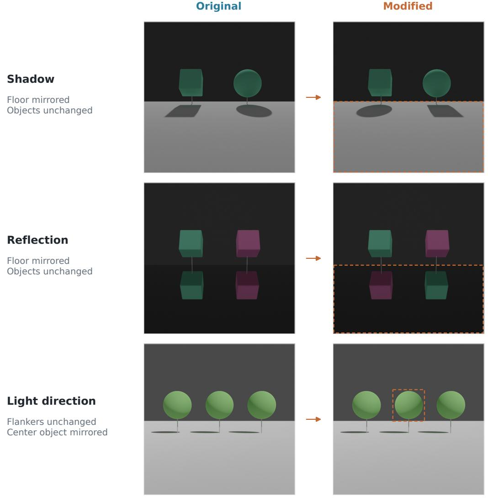  
Figure S2: Illumination stimulus construction. Original (left) and modified (right) images for the three operations. The floor region is horizontally flipped in Shadow and Reflection, and the central object in Light direction. Orange outlines indicate the affected regions.

## Shadow · shape pairs and height

Each pair:

Original (left)

Modified (right)

## S1 Shape pair

All 6 pairs · Height: low (0.1) · Shadow softness: hard

Cube ↔ sphere  
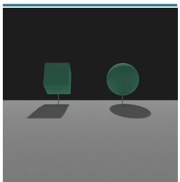

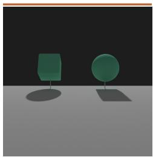  
Cylinder ↔ cone

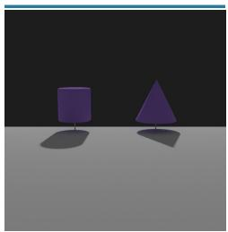

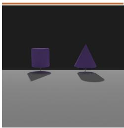  
Sphere ↔ Suzanne  
Torus ↔ gear

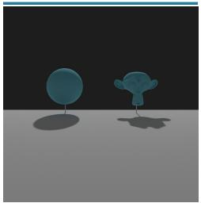

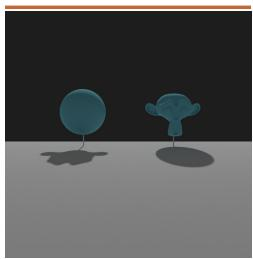

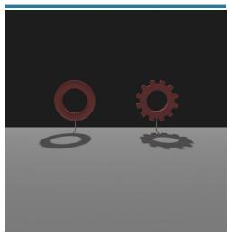

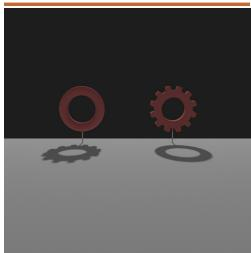  
Spot ↔ torus knot  
Teapot ↔ spot

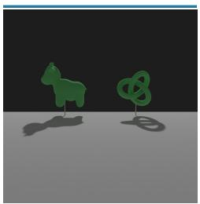

## S3 Height

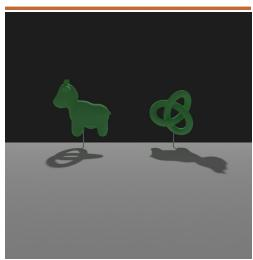

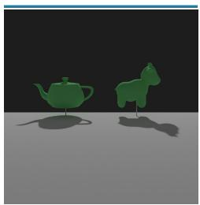

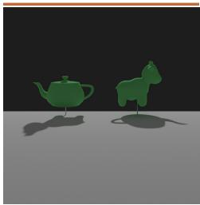  
Both levels · Cube ↔ sphere · Shadow softness: hard

Low (0.1)  
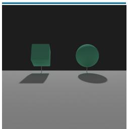

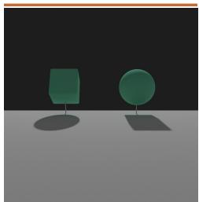

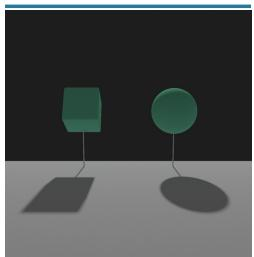  
High (0.3)

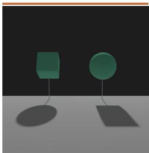  
Figure S3: Shadow: shape pairs and height. Each example pairs the full original image (left, blue rule) with its modification (right, orange rule). S1 exchanges shadows between distinct object shapes to introduce salient, categorical geometric violations. S3 compares both object heights for the cube–sphere pair, testing whether elevating objects above the floor reduces the salience of shadow inconsistencies.

# Shadow · rotation and shadow softness

Each pair: Original (left)

Modified (right)

## S2 Rotation

All 6 cases · Height: low (0.1) · Shadow softness: hard

Torus knot 90° ↔ −90°

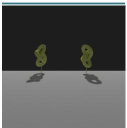

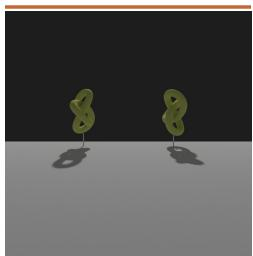  
Torus knot 0° ↔ 180°

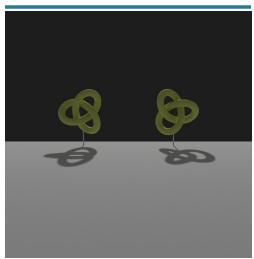

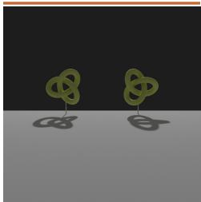  
Torus 0° ↔ 45°  
Spot −45° ↔ 135°

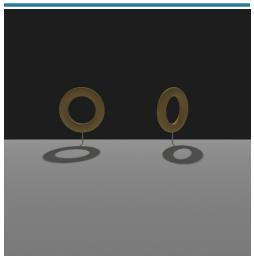

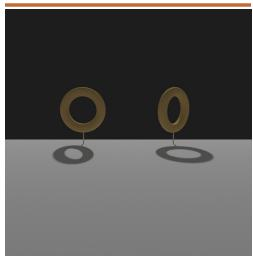

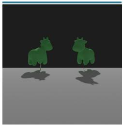

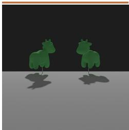  
Spot 45° ↔ 90°  
Teapot 90° ↔ 180°

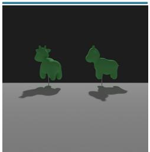  
S4 Shadow softness

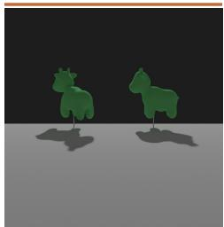

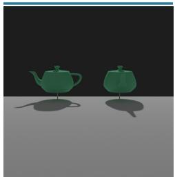

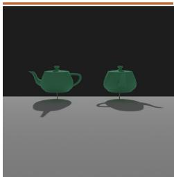  
Both levels · Cube ↔ sphere · Height: low (0.1)  
Soft

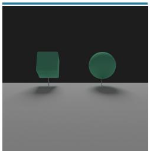

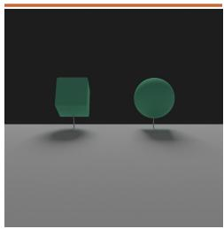

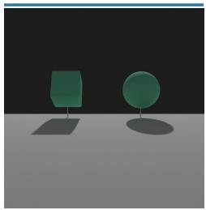  
Hard

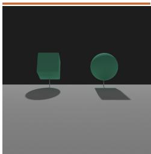  
Figure S4: Shadow: rotations and shadow softness. S2 shows all six orientation pairs, with angles indicating object orientations. In modified images, exchanging shadows alters directional correspondence: this inconsistency is subtle for shapes lacking distinct landmarks (e.g., torus knot) or pairs with near-symmetric 2D silhouettes despite 3D depth asymmetry (e.g., $\mathrm { S p o t - \bar { 4 } 5 ^ { \circ }  1 3 5 ^ { \circ } ) }$ requiring observers to scrutinize depth relationships, whereas prominent directional features (e.g., teapot spout) make it immediately obvious. S4 compares soft and hard shadows, testing whether blurred boundaries increase tolerance to discrepancies.

## Reflection · shape pairs and rotation

Each pair:

Original (left)

Modified (right)

## R1 Shape pair

All 4 pairs · Height: low (0.1) · Floor roughness: smooth (0.0)

Cube ↔ sphere

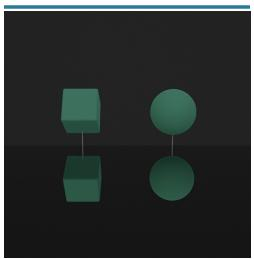

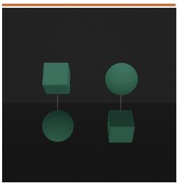  
Cylinder ↔ cone

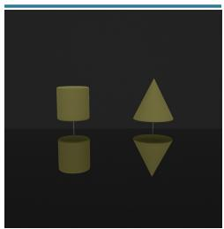

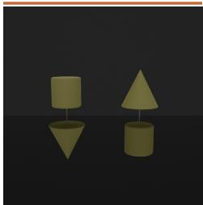  
Torus knot ↔ torus  
Teapot ↔ spot

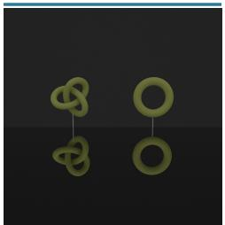

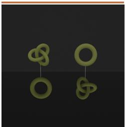  
R2 Rotation

  
All 4 cases · Height: low (0.1) · Floor roughness: smooth (0.0)  
Torus knot 90° ↔ −90°

  
Torus knot 0° ↔ 180°

  
Spot −45° ↔ 135°  
Spot 45° ↔ 90°

  
Figure S5: Reflection: shape pairs and rotations. R1 shows all four shape pairs and R2 all four orientation pairs, with height and floor roughness held at the baseline settings. R1 introduces categorical shape discrepancies between objects and their reflections, whereas R2 tests sensitivity to mirror-reflection symmetry across 3D orientations. In R2, inconsistencies are subtle and difficult to detect for shapes lacking distinctive landmarks (e.g., torus knot) or pairs appearing near-symmetric in 2D (e.g., Spot −45◦ ↔ 135◦), whereas salient directional asymmetry (e.g., Spot $4 5 ^ { \circ }  9 0 ^ { \circ } )$ makes violations apparent.

# Reflection · color, height, and floor roughness

Each pair:

Original (left)

Modified (right)

## R3 Color

All 4 cases · Height: low (0.1) · Floor roughness: smooth (0.0)

Cube: small hue shift

  
Cube: large hue shift

  
Torus: small hue shift  
Torus: large hue shift

  
R4 Height

  
Both levels · Cube ↔ sphere · Floor roughness: smooth (0.0)  
Low (0.1)

  
R5 Floor roughness

  
High (0.3)

  
Both levels · Cube ↔ sphere · Height: low (0.1)  
Smooth (0.0)

  
Rough (0.3)

  
Figure S6: Reflection: color, height, and floor roughness. R3 introduces chromatic mismatches without altering geometry, testing sensitivity to color differences. R4 and R5 compare heights and surface roughness, examining how spatial proximity and blur modulate the salience of reflection anomalies.

Cube  
  
Cylinder  
Figure S7: Light direction: shapes. L1 shows every shape at shared baseline settings. Horizontally mirroring only the central object reverses its shading relative to the flanking objects and unchanged cast shadows. This tests how object geometry affects lighting consistency, contrasting simple shapes (e.g., sphere) where illumination direction is unambiguous with complex shapes where lighting discrepancies are easily overlooked.

## Light direction · shape

Each pair:

Original (left)

Modified (right)

## L1 Shape

All 6 shapes · Material: diffuse · Height: low (0.2) · Light angle: 15°

## Light direction · material, height, and light angle

Each pair:

Original (left)

Modified (right)

## L2 Material

Both levels · Sphere · Height: low (0.2) · Light angle: 15°

Diffuse  

Metal  

## L3 Height

Both levels · Sphere · Material: diffuse · Light angle: 15°

Low (0.2)  

  
High (2.0)

  
L4 Light angle  
Both levels · Sphere · Material: diffuse · Height: low (0.2)

15°  

  
30°

  
Figure S8: Light direction: material, height, and light angle. Each factor is illustrated at both levels using spheres, holding other factors fixed. L2 tests how surface material properties modulate lighting perception (diffuse shading gradients vs. specular highlights). L3 examines whether the presence of a consistent cast shadow strengthens the perceived lighting conflict compared to floating objects without shadows. L4 tests the effect of illumination inclination $( 1 5 ^ { \circ } \ \mathrm { v s . 3 0 ^ { \circ } } )$

## B HUMAN EXPERIMENT DETAILS

## B.1 APPARATUS AND DISPLAY INTERFACE

Online psychophysical experiments were developed using jsPsych (v7) (de Leeuw et al., 2023) and hosted on a dedicated web server. Prior to starting the experiment, participants were required to switch their browsers to full-screen mode, and automated checks verified compatible rendering environments. Stimuli were displayed in the center of the screen at 512 × 512 pixels against a neutral background.

Participants provided naturalness ratings on a discrete 5-point horizontal slider with text labels: 1 (Very unnatural), 2 (Unnatural), 3 (Slightly unnatural), 4 (Moderately natural), and 5 (Natural). To avoid anchoring effects, the slider handle was initialized to a random integer position (1–5) on every trial. Participants had to click or move the handle before the continue button was enabled, so that retaining the initial position required an active response. Stimuli remained on screen without time limits until submitted, followed by a 500 ms blank inter-trial interval (ITI).

## B.2 TASK INSTRUCTIONS

Because the stimulus manipulations introduced subtle violations of configural or physical regularities within otherwise realistic scenes, relying solely on an unguided, generic query of “naturalness” risks inattentive oversights or idiosyncratic evaluation criteria (e.g., judging superficial photographic aesthetics rather than physical plausibility). To ensure that participants attended to the critical structural attributes and to calibrate rating criteria across observers, participants were familiarized with the candidate manipulation types through illustrated instructions and visual examples prior to the experiment:

Thatcher task: Participants were instructed: “Rate the naturalness ofthefacial appearance on a 5-point scale. Internal facial parts (eyes and mouth) may have artificial image manipulations applied. If you perceive a natural face without manipulation, select 5 (Natural). If you feel unnaturalness due to manipulation, select 1–4 according to the degree of unnaturalness. Faces may also appear upside down; please evaluate them using the same criteria, and refrainfrom physically tilting your head or rotating your display.”

– Shadow swap: Participants were instructed: “Rate the naturalness of the shadow shape formed on the floor surface on a 5-point scale. If the shadow shape appears consistent with the object shape, select 5 (Natural). Ifthe shadow shape appears inconsistent with the object shape, select 1–4 according to the perceived unnaturalness.”

– Reflection swap: Participants were instructed: “Rate the naturalness of the reflection on the floor surface on a 5-point scale. If the appearance of the reflected image matches the physical object, select 5 (Natural); if it does not match, select 1–4 according to the degree ofunnaturalness.”

– Light-direction swap: Participants were instructed: “In an image depicting three objects illuminated from above, rate the naturalness of the lighting on the central object on a 5-point scale,focusing on whether the lighting direction on the central object is consistent with the surrounding objects and the floor shadows. If the lighting direction is mutually consistent, select 5 (Natural); if it appears contradictory, select 1–4 according to the degree of unnaturalness.”

## B.3 EXPERIMENTAL DESIGN AND TRIAL STRUCTURE

Thatcher task. The 140 base face scenes (140 × 2 orientations = 280 pairs; 560 images) were divided into four disjoint sets of 35 (A–D). The four observer groups viewed A upright and B inverted, B upright and C inverted, C upright and D inverted, or D upright and A inverted. Each participant therefore viewed 35 upright faces and 35 different inverted faces, with each identity presented in only one orientation. Both original and modified versions of each scene were evaluated by the same participant, providing within-subject paired perceptual differences $h _ { i } = R ( x _ { i } ^ { \mathrm { o r i g } } ) - R ( x _ { i } ^ { \mathrm { m o d } } )$ . Each main block contained 140 trials (35 upright faces plus 35 different inverted faces, each shown in original and modified versions) and 6 repeated trials for reliability checking (146 trials total). In data processing, repeated trials were deduplicated by retaining the first presentation.

Illumination task. The three illumination interventions (Shadow, Reflection, Light direction; 96 scenes each, 288 pairs total) were evaluated in a between-subjects design: each participant evaluated only one intervention type. Within each intervention, the 96 scenes were randomly divided into four disjoint subsets of 24. Each of four observer groups evaluated a different combination of three subsets (72 scenes), so each scene was evaluated by three of the four groups. Both original and modified versions of each assigned scene were evaluated within-subject. Each main block contained 144 trials (72 scenes × 2 versions) and 6 repeated trials (150 trials total; first presentation retained).

Procedure. Each session progressed through: full-screen switch → illustrated instructions → a practice block (10 trials for Thatcher; condition-specific practice for Illumination) → an option to re-read instructions → the main block with trials presented in randomized order → data submission.

## B.4 PARTICIPANT DEMOGRAPHICS, SCREENING, AND RESPONSE COUNTS

Participants were adults aged 20–49 years, with balanced representation across age groups (20s, 30s, and 40s) and sexes. A total of 162 participant submissions were collected for the Thatcher task and 167 for the Illumination task. Since two Illumination submissions came from duplicate participant identities, we retained each participant’s first submission while discarding the latter, leaving 165 participants before response-consistency screening. Although the experiment included 6 repeated trials originally intended for intra-subject test–retest screening, strict consistency filtering on these few trials proved overly conservative due to normal perceptual rating jitter on the 5-point scale, excluding an unnecessarily large fraction of otherwise attentive participants. We therefore adopted a global response-consistency screening criterion. Repeated trials were deduplicated by retaining the first presentation, and for each participant, we computed the Pearson correlation r between their ratings across unique images and the corresponding image-wise mean ratings of all other participants who rated those images.

We estimated a Gaussian kernel density for each task using Silverman’s rule-of-thumb bandwidth (Silverman, 1986), $b = 0 . 9 \operatorname* { m i n } ( s , \mathrm { I Q R } / 1 . 3 4 ) n ^ { - 1 / 5 }$ , where $s , \mathrm { I Q R } .$ , and n are the sample standard deviation, interquartile range, and number of finite correlations. We selected the deepest trough relative to its flanking peaks (Figure S9), yielding cutoffs of $r = . 2 4 8 1$ for Thatcher and $r = . 3 2 3 6$ for Illumination. Retaining participants who met or exceeded these thresholds left 143 participants for Thatcher (88.3%) and 105 for Illumination (63.6%).

After screening, image items received the following numbers of independent human ratings:

– Thatcher task: Mean 35.8 responses per item (range: 29–44 responses; upright mean: 35.8, inverted mean: 35.8).

– Illumination task: Overall mean 26.2 responses per item (range: 9–43). By condition, Shadow swap averaged 40.5 responses (range: 38–43; 54 participants retained), Reflection swap averaged 26.2 responses (range: 22–29; 35 participants), and Light-direction swap averaged 12.0 responses (range: 9–14; 16 participants).

The variation in sample size across Illumination conditions stemmed primarily from differences in exclusion rates during screening: before screening, the Shadow, Reflection, and Light-direction conditions enrolled 69, 44, and 52 participants, of whom 15 (21.7%), 9 (20.5%), and 36 (69.2%), respectively, were excluded. In participant-disjoint split-half analyses (10,000 group-stratified random splits), split-half reliability in the Light-direction condition was r = .144 among excluded participants, compared with $r = . 6 6 8$ among retained participants (and .960 for Shadow, .932 for Reflection). The excluded Light-direction group showed little average separation between original and modified ratings: the mean original-minus-modified difference across the 96 pairs was 0.051 points, compared with 0.996 points in the retained group.

Filtering robustness. To verify that our findings do not depend on the specific screening threshold, we recomputed all item-level aggregates without any participant exclusions. The unfiltered item aggregates correlated closely with the screened aggregates $( r = . 9 8 6$ for Thatcher, $r = . 9 4 2$ for

Illumination), and the cross-model sensitivity–alignment association was preserved $( r = . 6 6 3$ with and without screening on Thatcher; .821 with screening and .847 without screening on Illumination). Because Light direction had the highest exclusion rate, we checked whether screening affected model–human correspondence in this condition. Across the 96 image pairs, the mean original– modified rating differences calculated from all 52 participants closely tracked those from the 16 retained participants $( r = . 8 9 1 )$ ). Model–human correlations were also similar (median across all 25 generative models: .277 with screening and .255 without).

  
Figure S9: Participant response consistency and task-specific screening cutoffs. Distributions of leave-one-out Pearson correlations r for (A) Thatcher $( n = 1 6 2 )$ and (B) Illumination $( n = 1 6 5 )$ , after duplicate submissions and repeated presentations were reduced by retaining the first occurrence. Each participant’s ratings are correlated with the image-wise means of the other participants. Red and blue bars denote excluded and retained participants, respectively; histogram bins have width .04. Solid curves show Gaussian kernel density estimates with Silverman’s bandwidths $\left( b = . 0 3 8 3 6 \right.$ and .11157), scaled to histogram counts. Dashed lines mark the task-specific cutoffs $( r = . 2 4 8 1$ and .3236). Undefined correlations (2 for Thatcher, 1 for Illumination) are excluded from the plots and counted among excluded participants.

## C MODEL DETAILS AND EVALUATION SPECIFICATIONS

This section summarizes the common loss probing setup and specifications for all 25 evaluated generative models (Table S1). Model-specific schedulers, identifiers, and environment configurations are archived with the accompanying code and configuration files.

## C.1 GENERATIVE LOSS PROBING

For each generative model m and test image x, the model-native loss $L _ { m } ( x )$ is computed by averaging its squared prediction error across a fixed grid of timesteps $T _ { m }$ and noise realizations $E _ { m }$

$$
L _ { m } ( x ) = \frac { 1 } { | T _ { m } | | E _ { m } | } \sum _ { t \in T _ { m } } \sum _ { \epsilon \in E _ { m } } \ell _ { m } ( x , t , \epsilon ) .\tag{1}
$$

Here, $\ell _ { m }$ is the mean squared error in the parameterization of the model’s denoising objective (noise, velocity, or flow), averaged over channel, spatial, and, where applicable, temporal dimensions. For latent-space models, losses are evaluated on encoded inputs and do not include an imagereconstruction term. JiT and PixelGen (Li & He, 2026; Ma et al., 2026) predict clean images and compute their denoising losses in velocity space. We follow this definition, using the residual $( \hat { x } - x ) / \operatorname* { m a x } ( 1 - t , 0 . 0 5 )$ , where xˆ is the predicted clean image, t is the clean-image interpolation coefficient, and the denominator floor follows the original implementations.

Timestep grids $( T _ { m } )$ . Image models were evaluated at 100 scheduler-defined timesteps and video models at 50. The grids followed each model’s implemented variance-preserving or shifted-flow schedule and were averaged with equal weight; their numerical timestep coordinates are modelspecific and not directly comparable across architectures.

Noise realizations $( E _ { m } ) .$ . Each model evaluation used a fixed bank of 20 standard Gaussian noise tensors. This bank was instantiated once and shared across all stimuli and both members of each pair, isolating content-dependent differences under matched noise draws.

Conditioning and guidance. Unconditional models used their native null-class or unconditional branch. Text-conditioned models used an empty or neutral prompt in a single forward pass without classifier-free guidance (CFG) branch mixing. The embedded guidance scale was set to 1.0 for both FLUX.1 dev and HunyuanVideo.

Image preprocessing. All 16 image models received RGB inputs resized to 512 × 512 pixels before model-specific normalization or latent encoding.

Video preprocessing. Each source RGB image was resized by bilinear interpolation to fit the model’s input resolution (Table S1), preserving aspect ratio, then center-padded with a constant value of .5. The padded frame was repeated to form a static clip. CogVideoX1.5 uses 21 repeats to yield six latent frames, satisfying its two-frame temporal patch size; the other eight models use 17.

Compute environment and numerical precision. Model probing was executed within isolated container environments on NVIDIA RTX A6000 (48 GB) and A100 (40 GB) GPUs, using native bfloat16, float16, or float32 precision compatible with each model. Full software dependencies and configuration files are provided in the supplementary material.

Table S1: Evaluated open generative models. Specifications of the 25 generative models across 11 families, grouped by architectural domain: pixel-space image models, latent-space image models, and spatiotemporal video models. Superscripts T and I mark the top five generative models selected by overall human alignment in Thatcher and Illumination, respectively; these selections are held fixed across conditions (Section I).
<table><tr><td>Family</td><td>Model</td><td>Identifier / Source Repository</td><td>Architecture</td><td>Evaluated Resolution</td><td>Steps (|Tm |)</td><td>Noise (|Em|)</td></tr><tr><td colspan="7">Pixel-space image models</td></tr><tr><td>JiT</td><td>JiT-B/32</td><td>LTH14/JiT::jit-b-32/checkpoint-last.pth</td><td>Pixel DiT (ImageNet)</td><td>512 × 512</td><td>100</td><td>20</td></tr><tr><td>JiT</td><td>JiT-L/32</td><td>LTH14/JiT::jit-1-32/checkpoint-last.pth</td><td>Pixel DiT (ImageNet)</td><td>512 × 512</td><td>100</td><td>20</td></tr><tr><td>JiT</td><td>JiT-H/32</td><td>LTH14/JiT::jit-h-32/checkpoint-last.pth</td><td>Pixel DiT (ImageNet)</td><td>512 × 512</td><td>100</td><td>20</td></tr><tr><td>PixelGen</td><td>PixelGen 512</td><td>zehongma/PixelGen::PixelGen_XXL_T2I.ckpt</td><td>Pixel DiT / Flow</td><td>512 × 512</td><td>100</td><td>20</td></tr><tr><td>HiDream</td><td>HiDream-O1-Image</td><td>HiDream-ai/HiDream-O1-Image</td><td>Pixel-space UiT / Flow</td><td>512 × 512</td><td>100</td><td>20</td></tr><tr><td colspan="7">Latent-space image models</td></tr><tr><td>Stable Diffusion</td><td>SD v1.5T</td><td>sd-legacy/stable-diffusion-v1-5</td><td>Latent U-Net (DDPM)</td><td>512 × 512</td><td>100</td><td>20</td></tr><tr><td>Stable Diffusion</td><td>SDXL Base 1.0</td><td>stabiiityai/stable-diffusion-xl-base-1.0</td><td>Latent U-Net (DDPM)</td><td>512 × 512</td><td>100</td><td>20</td></tr><tr><td>Stable Diffusion</td><td>SD 3 Medium</td><td>stabilityai/stable-diffusion-3-medium-diffusers</td><td>Latent MMDiT (Flow)</td><td>512 × 512</td><td>100</td><td>20</td></tr><tr><td>FLUX.1</td><td>FLUX.1 dev</td><td>black-forest-labs/FLUX.1-dev</td><td>Latent MMDiT (Flow)</td><td>512 × 512</td><td>100</td><td>20</td></tr><tr><td>FLUX.1</td><td>FLUX.1 schnellT</td><td>black-forest-labs/FLUX.1-schnell</td><td>Latent MMDiT (Distilled)</td><td>512 × 512</td><td>100</td><td>20</td></tr><tr><td>FLUX.2</td><td>FLUX.2 klein base 4B</td><td>black-forest-labs/FLUX.2-klein-base-4B</td><td>Latent MMDiT (Flow)</td><td>512 × 512</td><td>100</td><td>20</td></tr><tr><td>FLUX.2</td><td>FLUX.2 klein 4BT</td><td>black-forest-labs/FLUX.2-klein-4B</td><td>Latent MMDiT (Flow)</td><td>512 × 512</td><td>100</td><td>20</td></tr><tr><td>FLUX.2 FLUX.2</td><td>FLUX.2 klein base 9B</td><td>black-forest-labs/FLUX.2-klein-base-9B</td><td>Latent MMDiT (Flow)</td><td>512 × 512</td><td>100 100</td><td>20</td></tr><tr><td></td><td>FLUX.2 klein 9BT</td><td>black-forest-labs/FLUX.2-klein-9B</td><td>Latent MMDiT (Flow)</td><td>512 × 512</td><td>100</td><td>20 20</td></tr><tr><td>Qwen-Image Qwen-Image</td><td>Qwen-Image1</td><td>Qwen/Qwen-Image</td><td>Latent MMDiT (Flow)</td><td>512 × 512</td><td>100</td><td>20</td></tr><tr><td></td><td>Qwen-Image-25121</td><td>Qwen/Qwen-Image-2512</td><td>Latent MMDiT (Flow)</td><td>512 × 512</td><td></td><td></td></tr><tr><td colspan="7">Spatiotemporal video models (17 frames; CogVideoX1.5: 21)</td></tr><tr><td colspan="7"></td></tr><tr><td>CogVideoX</td><td>CogVideoX-2B</td><td>THUDM/CogVideoX-2b</td><td>3D VAE Latent DiT</td><td>720 × 480</td><td>50</td><td>20</td></tr><tr><td>CogVideoX</td><td>CogVideoX-5B</td><td>THUDM/CogVideoX-5b</td><td>3D VAE Latent DiT</td><td>720 × 480</td><td>50</td><td></td></tr><tr><td>CogVideoX</td><td>CogVideoX1.5-5B</td><td>THUDM/CogVideoX1.5-5B</td><td>3D VAE Latent DiT</td><td>1360 × 768</td><td>50</td><td>20</td></tr><tr><td>LTX-Video</td><td>LTX-Video 2B v0.9.0</td><td>Lightricks/LTX-Video</td><td>3D VAE Latent DiT</td><td>768 × 512</td><td>50</td><td>20</td></tr><tr><td>LTX-Video</td><td>LTX-Video 13B devT</td><td>Lightricks/LTX-Video-0.9.7-dev</td><td>3D VAE Latent DiT</td><td>768 × 512</td><td>50</td><td>20</td></tr><tr><td>Wan</td><td>Wan2.1 T2V 1.3B</td><td>Wan-AI/Wan2.1-T2V-1.3B-Diffusers</td><td>3D VAE Latent DiT</td><td>832 × 480</td><td>50</td><td>20</td></tr><tr><td>Wan</td><td>Wan2.1 T2V 14B1</td><td>Wan-AI/Wan2.1-T2V-14B-Diffusers</td><td>3D VAE Latent DiT</td><td>832 × 480</td><td>50</td><td>20</td></tr><tr><td>Wan</td><td>Wan2.2 T2V A14B1</td><td>Wan-AI/Wan2.2-T2V-A14B-Diffusers</td><td>3D VAE Latent DiT (MoE)</td><td>832 × 480</td><td>50</td><td>20</td></tr><tr><td>HunyuanVideo</td><td>HunyuanVideo1</td><td></td><td>3D VAE Latent DiT</td><td></td><td></td><td></td></tr><tr><td></td><td></td><td>hunyuanvideo-community/HunyuanVideo</td><td></td><td>960 × 544</td><td>50</td><td>20</td></tr></table>

HiDream-O1 in figure labels abbreviates HiDream-O1-Image. LTX-Video 2B uses the initial v0.9.0 checkpoint in Diffusers format.

## D NON-GENERATIVE BASELINE DETAILS AND SCORING METHODS

To benchmark generative loss against non-generative alternatives, we evaluate a heterogeneous pool of 12 frozen image encoders alongside two prespecified five-metric IQA batteries (full-reference and no-reference; Table S3). All model weights and scoring protocols are held fixed without task-specific fine-tuning.

Encoders were selected by predefined criteria independent of observed human alignment to represent standard anchors (ResNet-50, CLIP, and DINOv2), diverse pretraining objectives, varying model scales (0.024B–8.145B parameters), and within-family scaling pairs (e.g., Qwen3-VL-Embedding 2B vs. 8B, PE-Core B/16 vs. G/14). The resulting pool consists of 12 frozen encoders spanning supervised classification (ResNet-50; He et al., 2016), self-supervised visual representation learning (DINOv2, DINOv3; Oquab et al., 2024; Siméoni et al., 2026), and contrastive image–language alignment (CLIP, SigLIP 2, PE-Core, Jina CLIP v2; Radford et al., 2021; Tschannen et al., 2025; Bolya et al., 2025;

Koukounas et al., 2024). Qwen3-VL-Embedding provides a multimodal embedding baseline trained for representation extraction, using the representation of the last valid input token (Li et al., 2026).

## D.1 FROZEN ENCODER DISTANCES

For model m and block ℓ, let $\phi _ { m \ell } ( x )$ denote the feature obtained by applying a fixed model-specific readout to that block’s output. For global image representations, the pair score is the unsigned cosine distance between independently extracted representations of the original and modified images:

$$
d _ { \mathrm { e n c } } ( x _ { i } ^ { \mathrm { o r i g } } , x _ { i } ^ { \mathrm { m o d } } ) = 1 - \frac { \phi ( x _ { i } ^ { \mathrm { o r i g } } ) ^ { \top } \phi ( x _ { i } ^ { \mathrm { m o d } } ) } { \| \phi ( x _ { i } ^ { \mathrm { o r i g } } ) \| _ { 2 } \| \phi ( x _ { i } ^ { \mathrm { m o d } } ) \| _ { 2 } } .\tag{2}
$$

Here $\phi = \phi _ { m \ell }$ for the candidate being evaluated. No classifier or readout is fitted to human judgments.

Because the 12 encoders differ in their internal architectures (spanning convolutional feature maps, Vision Transformers with or without class tokens, and multimodal language decoders), extracting comparable representations $\phi _ { m \ell } ( x )$ requires architecture-specific readout rules. We hold these readout rules fixed across all blocks and tasks. Below, we specify how representations are extracted across three structural groups: models using direct global pooling or unprojected class tokens (ResNet-50, CLIP, and PE-Core); models evaluated via spatially matched patch-token distances (DINOv2 and DINOv3); and models using terminal pooling, projection, or normalization transformations (SigLIP 2, Jina CLIP v2, and Qwen3-VL-Embedding).

ResNet, CLIP, and PE-Core. ResNet-50 uses spatial global average pooling after each of its 16 bottleneck blocks, without the classification head. CLIP uses the block’s unprojected [CLS] token, without the terminal LayerNorm or projection. This choice follows the default unnormalized intermediate-feature convention in OpenCLIP, while retaining the original OpenAI CLIP checkpoint. PE-Core uses the spatial mean of block tokens after excluding prefix tokens, without terminal normalization or attention pooling. The PE feature API exposes unnormalized intermediate tokens; their spatial averaging is our fixed aggregation choice. Pooling rules therefore follow the native token structure of each architecture.

DINOv2/v3 spatial distances. For DINOv2 and DINOv3, we apply the pretrained terminal Layer-Norm to each candidate block, following the normalized intermediate-feature convention. We then exclude the leading [CLS] token and, for DINOv3, four register tokens. The score is the mean one-minus-cosine distance between corresponding spatial patch tokens. Tokens are not averaged before computing cosine distance, and no self-supervised projection head is used. This preserves a spatially matched comparison under the controlled original–modified pairing.

SigLIP, Jina, and Qwen output transformations. SigLIP 2 applies its pretrained terminal Layer-Norm and learned attention pooling to each block. Jina CLIP v2 applies its terminal normalization, [CLS] extraction, and projection. Qwen3-VL-Embedding processes images through its full visual tower into a multimodal language decoder (28 blocks for 2B, 36 for 8B). Following its official representation extraction protocol, we apply terminal RMSNorm and $\ell _ { 2 }$ normalization to the representation of the last valid input token at each decoder block. Both Qwen models use the fixed default instruction “Represent the user’s input.” without task-specific prompting. These transformations are applied directly to intermediate blocks without retraining.

Candidate layer evaluation. To identify the strongest representations achievable by each architecture, we evaluated pair distances across all 314 intermediate backbone blocks alongside each model’s default final output (e.g., CLIP’s projected embedding or PE-Core’s attention-pooled vector). For each task, the representative layer reported in Table S2 was selected by maximizing the signed Pearson correlation with human judgment differences across all stimulus pairs. The downstream protocol for incorporating these selected layers and top-performing models into partial correlation analyses is described in Appendix E.3.

## D.2 FULL-REFERENCE IQA (FR-IQA)

Full-reference metrics evaluate the distortion of $x _ { i } ^ { \mathrm { m o d } }$ relative to the pristine original reference $x _ { i } ^ { \mathrm { o r i g } }$ To align all FR-IQA metrics along a consistent degradation / distance axis where larger values

Table S2: Selected encoder layers. Entries indicate the selected layer index and total model depth for each task. Entries marked “(output)” use the model’s default final embedding rather than intermediate block readouts (Section D.1). For Qwen, indices denote language-decoder blocks. Selected layers remain fixed across all condition-specific comparisons within each task.
<table><tr><td>Encoder</td><td>Thatcher</td><td>Illumination</td></tr><tr><td>ResNet-50</td><td>7/16</td><td>16/16 (output)</td></tr><tr><td>CLIP ViT-B/16</td><td>12/12</td><td>9/12</td></tr><tr><td>DINOv2-Base</td><td>2/12</td><td>12/12 (output)</td></tr><tr><td>DINOv2-g/14</td><td>10/40</td><td>8/40</td></tr><tr><td>DINOv3-H+/16</td><td>32/32 (output)</td><td>1/32</td></tr><tr><td>DINOv3-7B/16</td><td>36/40</td><td>5/40</td></tr><tr><td>SigLIP 2 Base/16</td><td>9/12</td><td>7/12</td></tr><tr><td>PE-Core B/16</td><td>12/12 (output)</td><td>11/12</td></tr><tr><td>PE-Core G/14</td><td>50/50 (output)</td><td>33/50</td></tr><tr><td>Jina CLIP v2</td><td>23/24</td><td>22/24</td></tr><tr><td>Qwen3-VL-Embedding 2B</td><td>22/28</td><td>28/28 (output)</td></tr><tr><td>Qwen3-VL-Embedding 8B</td><td>31/36</td><td>35/36</td></tr></table>

indicate greater unnaturalness or perceptual difference:

$$
u _ { \mathrm { F R } } ( x _ { i } ^ { \mathrm { o r i g } } , x _ { i } ^ { \mathrm { m o d } } ) = \left\{ \begin{array} { l l } { \mathrm { - M e t r i c } ( x _ { i } ^ { \mathrm { m o d } } , x _ { i } ^ { \mathrm { o r i g } } ) } & { \mathrm { i f ~ h i g h e r ~ i s ~ b e t t e r ~ } ( \mathrm { P S N R } , \mathrm { S S I M } , \mathrm { V I F } ) , } \\ { \mathrm { M e t r i c } ( x _ { i } ^ { \mathrm { m o d } } , x _ { i } ^ { \mathrm { o r i g } } ) } & { \mathrm { i f ~ l o w e r ~ i s ~ b e t t e r ~ } ( \mathrm { L P I P S - V G G } , \mathrm { D I S T S } ) . } \end{array} \right.\tag{3}
$$

Specifically, PSNR is computed from pixel-level mean squared error; SSIM evaluates local luminance, contrast, and structure over sliding windows; VIF models visual information fidelity in the wavelet domain; LPIPS-VGG computes $\ell _ { 2 } \cdot$ -distance across five intermediate VGG-16 feature activation layers weighted by BAPPS perceptual judgments; and DISTS evaluates multi-scale structural and texture similarities using spatial deep features.

## D.3 NO-REFERENCE IQA (NR-IQA)

No-reference metrics score each image independently without access to a reference image: $q ( x )$ To measure directional quality changes on original–modified pairs, scores are differenced strictly according to each metric’s published valence:

$$
u _ { \mathrm { N R } } ( x _ { i } ^ { \mathrm { o r i g } } , x _ { i } ^ { \mathrm { m o d } } ) = \left\{ \begin{array} { l l } { q ( x _ { i } ^ { \mathrm { o r i g } } ) - q ( x _ { i } ^ { \mathrm { m o d } } ) } & { \mathrm { i f ~ h i g h e r ~ i s ~ b e t t e r ~ ( H y p e r I Q A , M U S I Q , L I Q E ) , } } \\ { q ( x _ { i } ^ { \mathrm { m o d } } ) - q ( x _ { i } ^ { \mathrm { o r i g } } ) } & { \mathrm { i f ~ l o w e r ~ i s ~ b e t t e r ~ ( N I Q E , B R I S Q U E ) . } } \end{array} \right.\tag{4}
$$

Under this definition, positive values $( u _ { \mathrm { N R } } \ > \ 0 )$ consistently signify that the original image is evaluated as higher quality than the modified image. The battery spans NIQE, an opinion-unaware natural-scene-statistics (NSS) model fitted to pristine luminance images; BRISQUE, spatial NSS features paired with an opinion-trained support vector regressor; HyperIQA, a CNN hypernetwork predicting content-adaptive quality weights; MUSIQ, a multi-scale Vision Transformer trained on KonIQ-10k; and LIQE, a multimodal quality evaluator using CLIP semantic prompts trained on KonIQ.

## D.4 PREPROCESSING AND EXECUTION ENVIRONMENT

All input images were resized to $5 1 2 \times 5 1 2$ pixels without cropping, followed by model-specific channel normalization. IQA metrics used their default processors from PyIQA (v0.1.9) (Chen & Mo, 2022). Probing was executed on NVIDIA RTX A6000 GPUs, with dependencies and configurations provided in the supplementary material.

Table S3: Evaluated non-generative baseline suite. Specifications of the 12 frozen vision encoders alongside five full-reference (FR-IQA) and five no-reference (NR-IQA) metrics. Parameter counts (B) report total network parameters in billions. Superscripts T and I mark the top five encoders selected by overall human alignment on Thatcher and Illumination, respectively; these selections are held fixed across conditions (Section I).
<table><tr><td>Pool</td><td>Predictor</td><td>Identifier / checkpoint</td><td>Training objective</td><td>Params. (B)</td><td>Readout / score</td></tr><tr><td>Encoder</td><td>ResNet-50 (ImageNet-1K,</td><td>torchvision:: IMAGENET1K_V2</td><td>ImageNet supervision</td><td>.024</td><td>Block spatial mean; cosine distance</td></tr><tr><td>Encoder</td><td>torchvision V2) CLIP ViT-B/16T,1</td><td>openai/clip-vit-bas</td><td>Image-text contrastive</td><td>.086</td><td>Unprojected block CLS;</td></tr><tr><td>Encoder</td><td>DINOv2-Base</td><td>e-patch16 facebook/dinov2-base</td><td>Vision-only</td><td>.087</td><td>cosine distance Corresponding patch-token</td></tr><tr><td>Encoder</td><td>SigLIP 2 Base/161</td><td>google/siglip2-base-p</td><td>self-supervision Image-text sigmoid</td><td>.093</td><td>distance LayerNorm, attention pooling;</td></tr><tr><td>Encoder</td><td>(224) PE-Core B/161 (224)</td><td>atch16-224 facebook/PE-Core-B16</td><td>contrastive Vision-language</td><td></td><td>cosine distance Block spatial mean; cosine</td></tr><tr><td>Encoder</td><td>DINOv2-g/14 spatial</td><td>-224  $\mathtt { f a c e b o o k } / \mathtt { d i n o v } 2 \mathrm { - g i a n t }$ </td><td>representation Vision-only</td><td>.094 1.136</td><td>distance Corresponding patch-token</td></tr><tr><td>Encoder</td><td>PE-Core G/14T,I</td><td> $\mathtt { t i m m / v i t \_ p e \_ c o r e \_ g i g }$ </td><td>self-supervision Vision-language</td><td></td><td>distance Block spatial mean; cosine</td></tr><tr><td>Encoder</td><td>(448) DINOv3-H+/16</td><td>antic_patch14_448.fb facebook/dinov3-vith1</td><td>representation Vision-only</td><td>1.882 .840</td><td>distance Corresponding patch-token</td></tr><tr><td>Encoder</td><td>spatialT DINOv3-7B/16</td><td>6plus-pretrain-lvd16 89m  $\mathtt { f a c e b o o k } / \mathtt { d i n o v 3 - v i t 7 b }$ </td><td>self-supervision Vision-only</td><td></td><td>distance Corresponding patch-token</td></tr><tr><td>Encoder</td><td>spatialT Qwen3-VL-</td><td>16-pretrain-lvd1689m Qwen/Qwen3-VL-Embeddi</td><td>self-supervision Multimodal embedding</td><td>2.128</td><td>distance RMSNorm, last valid token;</td></tr><tr><td>Encoder</td><td>Embedding 2B Qwen3-VL-</td><td>ng-2B Qwen/Qwen3-VL-Embeddi</td><td>Multimodal embedding</td><td>8.145</td><td>cosine distance RMSNorm, last valid token;</td></tr><tr><td>Encoder</td><td> $\dot { \mathrm { E m b e d d i n g } } 8 \mathbf { B } ^ { \mathrm { T } }$  Jina  $\mathrm { C L I P ~ v } 2 ^ { \mathrm { I } }$ </td><td>ng-8B jinaai/jina-clip-v2</td><td>Multilingual image-text</td><td></td><td>cosine distance Terminal norm, CLS</td></tr><tr><td></td><td></td><td></td><td>contrastive</td><td></td><td>projection; cosine distance</td></tr><tr><td colspan="6">Full-reference IQA</td></tr><tr><td>FR-IQA</td><td></td><td></td><td></td><td></td><td></td></tr><tr><td>FR-IQA</td><td>PSNR SSIM</td><td>pyiqa::psnr pyiqa::ssim</td><td>Pixel error Structural similarity</td><td></td><td> $- \mathrm { P S N R } ( x ^ { \mathrm { m o d } } , x ^ { \mathrm { o r i g } } )$   $- \mathrm {  ~ \Gamma ~ } - \mathrm { S S I M } ( x ^ { \mathrm { m o d } } , x ^ { \mathrm { o r i g } } )$ </td></tr><tr><td>FR-IQA</td><td>VIF</td><td>pyiqa::vif</td><td>Visual information</td><td></td><td> $- \mathrm { V I F } ( x ^ { \mathrm { m o d } } , x ^ { \mathrm { o r i g } } )$ </td></tr><tr><td>FR-IQA</td><td>LPIPS-VGG</td><td> ${ \tt p y i q a } : : { \tt l p i p s - v g q }$ </td><td>fidelity Learned perceptual</td><td></td><td> $\mathrm { L P I P S } ( x ^ { \mathrm { m o d } } , x ^ { \mathrm { o r i g } } )$ </td></tr><tr><td>FR-IQA</td><td>DISTS</td><td>pyiqa::dists</td><td>distance Structure and texture</td><td></td><td> $\mathrm { D I S T S } ( x ^ { \mathrm { m o d } } , x ^ { \mathrm { o r i g } } )$ </td></tr><tr><td colspan="6">No-reference IQA</td></tr><tr><td>NR-IQA</td><td>NIQE</td><td>pyiqa::niqe</td><td>Natural scene statistics</td><td></td><td></td></tr><tr><td>NR-IQA</td><td>BRISQUE</td><td>pyiqa::brisque</td><td>Natural scene statistics +</td><td></td><td> $\begin{array} { r l } & { q ( x ^ { \mathrm { m o d } } ) - q ( x ^ { \mathrm { o r i g } } ) } \\ & { q ( x ^ { \mathrm { m o d } } ) - q ( x ^ { \mathrm { o r i g } } ) } \end{array}$ </td></tr><tr><td>NR-IQA</td><td>HyperIQA</td><td>pyiqa::hyperiqa</td><td>SVR CNN hypernetwork</td><td></td><td> $q ( x ^ { \mathrm { o r i g } } ) - q ( x ^ { \mathrm { m o d } } )$ </td></tr><tr><td>NR-IQA</td><td>MUSIQ</td><td>pyiqa:: musiq(koniq10k)</td><td>Multi-scale Transformer</td><td></td><td> $q ( x ^ { \mathrm { o r i g } } ) - q ( x ^ { \mathrm { m o d } } )$ </td></tr><tr><td>NR-IQA</td><td>LIQE</td><td>pyiqa::liqe(koniq)</td><td>Language-prompted IQA</td><td></td><td> $q ( x ^ { \mathrm { o r i g } } ) - q ( x ^ { \mathrm { m o d } } )$ </td></tr></table>

## E STATISTICAL PROCEDURES AND ANALYSIS DETAILS

This section provides methodological details for the statistical inference, reliability estimation, and baseline partial correlation analysis reported in the main text.

## E.1 BOOTSTRAP RESAMPLING AND STATISTICAL UNCERTAINTY

To account for sampling uncertainty across both observers and stimuli, primary human-dependent estimates (such as model–human alignment and human violation sensitivity) are evaluated via a non parametric two-factor bootstrap (10,000 draws with fixed random seeds), independently resampling participants and base scenes with replacement. Participants are sampled within each stimulusassignment group at their original sample sizes. Stimuli are sampled at the level of base scenes: Thatcher stimuli were resampled across the 140 face identities (keeping upright and inverted pairs together); Illumination stimuli were resampled at the level of the 48 base configurations within each operation, keeping horizontally mirrored variants together. Generative-model sensitivities do not depend on human ratings and are evaluated using base-scene resampling alone. In each iteration, condition means and the task-wide standard deviation denominator $( s _ { m , \mathrm { t a s k } } )$ are recomputed dynamically, propagating scaling uncertainty into the resulting estimates. Identical bootstrap draws are shared across all models, conditions, and paired comparisons within each task. Pointwise 95% confidence intervals correspond to the empirical 2.5th and 97.5th percentiles across draws, summarizing sampling variability across observers and stimuli.

Human factor-profile intervals. The error bars for human profile means in Figure 1B and Appendix J evaluate observer sampling variability conditional on the fixed stimulus set. These pointwise 95% intervals are constructed from 10,000 participant-bootstrap iterations within each stimulusassignment group, recomputing image-wise means and task-scaled effects within each draw.

Cross-model associations. To evaluate uncertainty in cross-model sensitivity–alignment correlations while accounting for dependence among related models, we combine the participant-and-scene resampling above with a cluster bootstrap over 11 model families (CogVideoX, FLUX.1, FLUX.2, HiDream, HunyuanVideo, JiT, LTX-Video, PixelGen, Qwen-Image, Stable Diffusion, and Wan). In each of 10,000 iterations, 11 families are sampled with replacement, retaining all models within each selected family to recompute the cross-model correlation. Resampled family draws are held consistent across tasks and conditions. Reported 95% confidence intervals correspond to the pointwise 2.5th–97.5th percentiles across iterations, summarizing joint sampling variability across observers, stimuli, and model families.

## E.2 HUMAN SPLIT-HALF RELIABILITY ESTIMATION

To establish an empirical reference for human rating consistency, we evaluate split-half reliability across 10,000 random participant partitions. Within each stimulus-assignment group, participants are randomly divided into two disjoint halves (A and B) of equal (or near-equal) size, holding partitions consistent across experimental conditions. For each partition, item-level mean unnaturalness effect $( h _ { A , i }$ and $h _ { B , i } )$ are computed independently for each half, and split-half reliability is evaluated as their Pearson correlation:

$$
r _ { \mathrm { h a l f } } = \mathrm { c o r r } _ { i } ( h _ { A , i } , h _ { B , i } ) .\tag{5}
$$

In Figures 4 and 3 (and their condition breakdowns, Figures S13 and S14), reference lines and markers indicate the mean split-half correlation across partitions on the complete stimulus set. To reflect variability from both rater partitioning and stimulus sampling, each partition is paired with a synchronized base-scene bootstrap draw, with the 2.5th and 97.5th percentiles defining the 95% resampling intervals (shown as shaded bands and error bars).

## E.3 BIDIRECTIONAL PARTIAL CORRELATION ANALYSIS

To test whether Generative scores retain human-aligned variation beyond strong frozen encoders and quality metrics, we compare the 25 Generative scores with the 12-encoder pool and the two prespecified five-metric IQA batteries described in Section 3.4 and Appendix D.

Model and layer selection. To compare generative models against the strongest non-generative baselines, top-performing models are selected in two steps. First, for each of the 12 frozen encoders, we identify the layer that achieves the highest Pearson correlation with human unnaturalness ratings across the full task (Table S2). Second, from the 25 generative models and the 12 selected-layer encoders, we rank models by their correlation with human ratings and retain the top five from each pool. All five metrics in each IQA battery are retained without selection. These selected top-five models and encoder layers are held constant across all analyses within each task, including the condition breakdowns and factor profiles (Appendix I), ensuring that differences across conditions reflect stimulus properties rather than shifts in model composition.

Bidirectional partial correlations. For every selected Generative–comparator pair $( G , X )$ , we compute

$$
r ( h , G \mid X ) = { \frac { r _ { h G } - r _ { h X } r _ { G X } } { \sqrt { ( 1 - r _ { h X } ^ { 2 } ) ( 1 - r _ { G X } ^ { 2 } ) } } } , \qquad r ( h , X \mid G ) = { \frac { r _ { h X } - r _ { h G } r _ { G X } } { \sqrt { ( 1 - r _ { h G } ^ { 2 } ) ( 1 - r _ { G X } ^ { 2 } ) } } } .\tag{6}
$$

The two directional summaries are the medians of the 25 values in the selected $5 \times 5$ grid.

Accounting for selection uncertainty in bootstrap intervals. To include participant, stimulus, and selection variation, confidence intervals use the same 10,000 participant-and-scene bootstrap draws. On each draw, the two-step selection process is repeated on the resampled full-task data: identifying the best-performing layer for each encoder, and then ranking models to select the top five generative models and encoders. These selections are applied consistently across the overall task and condition breakdowns for that draw. For each comparison, 95% confidence intervals for the directional partial correlations are obtained from the 2.5th and 97.5th percentiles across the bootstrap distribution.

## F DIAGNOSTIC CONTROLS ON NATIVE GENERATIVE LOSS

Generative model loss is heavily sensitive to low-level image complexity and high-frequency statistics (Nalisnick et al., 2019; Serrà et al., 2020). Consequently, paired loss differences $( L _ { \mathrm { m o d i f i e d } } - L _ { \mathrm { o r i g i n a l } } )$ fail to track perceptual naturalness whenever an intervention alters these low-level properties, and unconditioned standalone losses fail to reflect human ratings across differing visual compositions. To evaluate the necessity of content-preserving relational manipulations and paired score differencing, we conducted two diagnostic evaluations: generic low-level distortions alongside element deletion, and standalone single-image loss evaluations.

## F.1 GENERIC DISTORTIONS ON CSIQ AND ELEMENT DELETION

To test these limitations, we evaluated paired model loss under two scenarios: generic low-level distortions on the CSIQ benchmark (Larson & Chandler, 2010) and element deletion in synthetic 3D scenes (Figure S10).

Generic distortions on CSIQ. First, we tested whether loss differences relative to the reference image $( L _ { \mathrm { d i s t o r t e d } } - L _ { \mathrm { r e f e r e n c e } } )$ track human quality judgments across standard corruptions using the CSIQ benchmark (Larson & Chandler, 2010) (Figure S10A). We restricted this evaluation to pixel-space diffusion models (three JiT variants, PixelGen 512, and HiDream-O1-Image) to avoid confounding generative priors with VAE compression characteristics. Evaluating loss–DMOS correlations within each distortion type reveals a severe statistical bias (Figure S10B). For distortions that add high-frequency variance (AWGN and pink noise), model loss correlates positively with perceived degradation. In contrast, for distortions that smooth textures or attenuate contrast (blur, JPEG, JPEG 2000, and contrast reduction), the correlation systematically reverses to negative. Because denoising objectives naturally penalize high-frequency variance while favoring smoother images, paired loss differences cannot overcome unconstrained shifts in low-level statistics, rendering native loss ineffective as a general-purpose quality metric.

Element deletion versus relational relocation. Second, we examined whether altering image content undermines the evaluation of physical consistency. Using 96 rendered 3D scenes, we compared model responses under two shadow manipulations (Figure S10C): (1) one-shadow deletion, which removes a cast shadow entirely, introducing a physical anomaly while reducing overall image complexity; and (2) shadow swap (our main paradigm), which relocates shadows between objects, creating physical inconsistency while preserving low-level image statistics.

A CSIQ distortion examples  

  
B CSIQ alignment

  
Reference + maximum severity

JiT-B/32 JiT-L/32 JiT-H/32 PixelGen 512 HiDream-O  

C Shadow interventions  

D Model response  
  
Figure S10: Impact of low-level image statistics on native generative loss. (A) Illustrative CSIQ reference image alongside corrupted examples at maximum severity across six distortion types. (B) Paired loss difference $( L _ { \mathrm { d i s t o r t e d } } - L _ { \mathrm { r e f e r e n c e } } ) – \mathrm { D M O S }$ Pearson correlations within each CSIQ distortion type across five pixel-space diffusion models. (C) Example synthetic scenes: original baseline, one-shadow deletion, and shadow swap (relocation). (D) Mean loss changes $\begin{array} { r l } {  } & { { } ( L _ { \mathrm { m o d i f i e d } } - } \end{array}$ $L _ { \mathrm { o r i g i n a l } } )$ , divided by their sample standard deviation over the 96 pairs of each manipulation, for one-shadow deletion (filled circles) versus shadow swap (open circles). Error bars denote percentile 95% intervals from 10,000 resamples of the 48 base scenes.

Standardized loss differences (defined for this control as the mean paired loss difference divided by the sample standard deviation over the 96 pairs) show distinct patterns between the two manipulations (Figure S10D). For one-shadow deletion, loss changes were uniformly negative across all models: although removing a shadow makes the scene physically unnatural, the reduced image complexity dominates the loss landscape, causing the model to evaluate the corrupted scene as more probable. In contrast, under shadow swap, preserving low-level statistics mitigates this negative artifact, allowing more capable architectures to exhibit positive loss penalties that reflect sensitivity to the physical inconsistency.

## F.2 SINGLE-IMAGE ABSOLUTE SCORE ANALYSIS

Raw single-image model losses $( L _ { m } ( x )$ evaluated without reference-image subtraction) do not show consistently positive alignment with human unnaturalness judgments $( a ( x ) = 5 - R ( x ) )$ across image variants and tasks (Figure S11). Across 280 Thatcher and 288 Illumination pairs, we correlated each original- or modified-image loss with the rating of that same image. The 25-model median Pearson correlations were .236 (original) and −.090 (modified) on Thatcher faces, and −.145 (original) and −.203 (modified) on Illumination scenes. Paired score differences $( u _ { m , i } = L _ { m } ( x _ { i } ^ { \mathrm { m o d } } ) - L _ { m } ( x _ { i } ^ { \mathrm { o r i g } } ) )$ correlated positively with human paired differences $( h _ { i } = R ( x _ { i } ^ { \mathrm { o r i g } } ) - R ( x _ { i } ^ { \mathrm { m o d } } ) )$ for all 25 models in both tasks, with median correlations of .747 on Thatcher and .334 on Illumination.

  
Figure S11: Single-image losses and paired loss changes in relation to human judgments. Itemlevel Pearson correlations for all 25 generative models, pooled across conditions within (A) Thatcher and (B) Illumination. Original- and modified-image losses are correlated with the corresponding image’s mean unnaturalness, $5 - R ( x )$ ; paired loss changes are correlated with $R ( x ^ { \mathrm { o r i g } } ) - \dot { R } ( x ^ { \mathrm { m o d } } )$ Faint lines and small points show individual models, with each line connecting estimates from the same model. Thick lines, diamonds, and numeric labels indicate the median across all 25 models.

## G MODEL-WISE SENSITIVITY AND HUMAN ALIGNMENT

Figure S12 shows violation sensitivity and human alignment for all 25 generative models across the five stimulus conditions. Appendix H shows the relationship between these two measures as condition-specific scatter plots.

A Directional sensitivity  
B Human alignment
<table><tr><td rowspan=1 colspan=14>Thatcher         Illumination            Thatcher         IlluminationLight                                        LightUprightInverted Shadow Reflection direction    UprightInverted Shadow Reflection direction</td></tr><tr><td rowspan=1 colspan=1>Human reference</td><td rowspan=1 colspan=1>2.73</td><td rowspan=1 colspan=1>1.09</td><td></td><td rowspan=1 colspan=1>1.07</td><td rowspan=1 colspan=1>1.61</td><td rowspan=1 colspan=1>0.87</td><td rowspan=1 colspan=1></td><td rowspan=1 colspan=1>0.82</td><td rowspan=1 colspan=2>0.72</td><td rowspan=1 colspan=2>0.96  0.93</td><td rowspan=1 colspan=1>0.67</td></tr><tr><td rowspan=3 colspan=1>Model medianJiT-B/32</td><td rowspan=1 colspan=1>2.24</td><td rowspan=1 colspan=1>0.84</td><td></td><td rowspan=1 colspan=1>0.36</td><td rowspan=1 colspan=1>1.17</td><td rowspan=1 colspan=1>0.60</td><td rowspan=1 colspan=1></td><td rowspan=1 colspan=1>0.49</td><td rowspan=1 colspan=2>0.31</td><td rowspan=1 colspan=1>0.26</td><td rowspan=1 colspan=1>0.38</td><td rowspan=1 colspan=1>0.28</td></tr><tr><td rowspan=1 colspan=1></td><td rowspan=1 colspan=1></td><td rowspan=1 colspan=2></td><td rowspan=1 colspan=1></td><td rowspan=1 colspan=1></td><td rowspan=1 colspan=1></td><td rowspan=1 colspan=1></td><td rowspan=1 colspan=2></td><td rowspan=1 colspan=1></td><td rowspan=1 colspan=1></td><td rowspan=1 colspan=1></td></tr><tr><td rowspan=1 colspan=1>0.05</td><td rowspan=1 colspan=1>-0.47</td><td></td><td rowspan=1 colspan=1>-0.05</td><td rowspan=1 colspan=1>0.23</td><td rowspan=1 colspan=1>0.57</td><td rowspan=1 colspan=1></td><td rowspan=1 colspan=1>0.25</td><td rowspan=1 colspan=2>0.08</td><td rowspan=1 colspan=1>0.04</td><td rowspan=1 colspan=1>0.68</td><td rowspan=1 colspan=1>-0.23</td></tr><tr><td rowspan=1 colspan=1>JiT-L/32</td><td rowspan=1 colspan=1>0.48</td><td rowspan=1 colspan=1>-0.42</td><td></td><td rowspan=1 colspan=1>-0.07</td><td rowspan=1 colspan=1>0.61</td><td rowspan=1 colspan=1>1.09</td><td rowspan=1 colspan=1></td><td rowspan=1 colspan=1>0.35</td><td rowspan=1 colspan=2>0.06</td><td rowspan=1 colspan=1>0.19</td><td rowspan=1 colspan=1>0.61</td><td rowspan=1 colspan=1>-0.31</td></tr><tr><td rowspan=1 colspan=1>JiT-H/32</td><td rowspan=1 colspan=1>0.75</td><td rowspan=1 colspan=1>-0.35</td><td></td><td rowspan=1 colspan=1>-0.02</td><td rowspan=1 colspan=1>0.24</td><td rowspan=1 colspan=1>0.25</td><td rowspan=1 colspan=1></td><td rowspan=1 colspan=1>0.42</td><td rowspan=1 colspan=2>0.09</td><td rowspan=1 colspan=1>0.02</td><td rowspan=1 colspan=1>0.58</td><td rowspan=1 colspan=1>0.22</td></tr><tr><td rowspan=1 colspan=1>PixelGen 512</td><td rowspan=1 colspan=1>0.75</td><td rowspan=1 colspan=1>-0.42</td><td></td><td rowspan=1 colspan=1>-0.10</td><td rowspan=1 colspan=1>0.45</td><td rowspan=1 colspan=1>0.60</td><td rowspan=1 colspan=1></td><td rowspan=1 colspan=1>0.43</td><td rowspan=1 colspan=2>0.00</td><td rowspan=1 colspan=1>0.05</td><td rowspan=1 colspan=1>0.47</td><td rowspan=1 colspan=1>0.13</td></tr><tr><td rowspan=1 colspan=1>HiDream-01</td><td rowspan=1 colspan=1>1.27</td><td rowspan=1 colspan=1>-0.22</td><td></td><td rowspan=1 colspan=1>0.05</td><td rowspan=1 colspan=1>0.97</td><td rowspan=1 colspan=1>1.07</td><td rowspan=1 colspan=1></td><td rowspan=1 colspan=1>0.51</td><td rowspan=1 colspan=2>0.21</td><td rowspan=1 colspan=1>0.16</td><td rowspan=1 colspan=1>0.65</td><td rowspan=1 colspan=1>0.50</td></tr><tr><td rowspan=1 colspan=1>SD v1.5</td><td rowspan=1 colspan=1>2.23</td><td rowspan=1 colspan=1>0.57</td><td></td><td rowspan=1 colspan=1>0.00</td><td rowspan=1 colspan=1>0.96</td><td rowspan=1 colspan=1>0.65</td><td rowspan=1 colspan=1></td><td rowspan=1 colspan=1>0.57</td><td rowspan=1 colspan=1>0.43</td><td></td><td rowspan=1 colspan=1>0.17</td><td rowspan=1 colspan=1>0.35</td><td rowspan=1 colspan=1>0.11</td></tr><tr><td rowspan=1 colspan=1>SDXL</td><td rowspan=1 colspan=1>2.08</td><td rowspan=1 colspan=1>0.84</td><td></td><td rowspan=1 colspan=1>0.10</td><td rowspan=1 colspan=1>0.63</td><td rowspan=1 colspan=1>0.28</td><td rowspan=1 colspan=1></td><td rowspan=1 colspan=1>0.53</td><td rowspan=1 colspan=1>0.36</td><td></td><td rowspan=1 colspan=1>0.18</td><td rowspan=1 colspan=1>0.23</td><td rowspan=1 colspan=1>0.18</td></tr><tr><td rowspan=1 colspan=1>SD3 Medium</td><td rowspan=1 colspan=1>2.42</td><td rowspan=1 colspan=1>0.94</td><td rowspan=1 colspan=2>0.06</td><td rowspan=1 colspan=1>0.99</td><td rowspan=1 colspan=1>0.55</td><td rowspan=1 colspan=1></td><td rowspan=1 colspan=1>0.44</td><td rowspan=1 colspan=2>0.16</td><td rowspan=1 colspan=1>0.06</td><td rowspan=1 colspan=1>0.44</td><td rowspan=1 colspan=1>0.19</td></tr><tr><td rowspan=2 colspan=1>FLUX.1 devFLUX.1 schnell</td><td rowspan=1 colspan=1>2.43</td><td rowspan=1 colspan=1>0.98</td><td rowspan=1 colspan=2>0.72</td><td rowspan=1 colspan=1>1.52</td><td rowspan=1 colspan=1>0.48</td><td rowspan=1 colspan=1></td><td rowspan=1 colspan=1>0.49</td><td rowspan=1 colspan=2>0.29</td><td rowspan=1 colspan=1>0.27</td><td rowspan=1 colspan=1>0.29</td><td rowspan=1 colspan=1>0.25</td></tr><tr><td rowspan=1 colspan=1>2.50</td><td rowspan=1 colspan=1>0.93</td><td rowspan=1 colspan=2>0.67</td><td rowspan=1 colspan=1>1.10</td><td rowspan=1 colspan=1>0.57</td><td rowspan=1 colspan=1></td><td rowspan=1 colspan=1>0.50</td><td rowspan=1 colspan=2>0.41</td><td rowspan=1 colspan=1>0.40</td><td rowspan=1 colspan=1>0.29</td><td rowspan=1 colspan=1>-0.11</td></tr><tr><td rowspan=1 colspan=1>Qwen-Image</td><td rowspan=1 colspan=1>3.33</td><td rowspan=1 colspan=1>2.04</td><td rowspan=1 colspan=2>1.00</td><td rowspan=1 colspan=1>1.48</td><td rowspan=1 colspan=1>0.99</td><td rowspan=1 colspan=1></td><td rowspan=1 colspan=1>0.51</td><td rowspan=1 colspan=2>0.49</td><td rowspan=1 colspan=1>0.76</td><td rowspan=1 colspan=1>0.52</td><td rowspan=1 colspan=1>0.38</td></tr><tr><td rowspan=1 colspan=1>Qwen-Image-2512</td><td rowspan=1 colspan=1>3.26</td><td rowspan=1 colspan=1>1.95</td><td rowspan=1 colspan=2>1.09</td><td rowspan=1 colspan=1>1.25</td><td rowspan=1 colspan=1>1.09</td><td rowspan=1 colspan=1></td><td rowspan=1 colspan=1>0.51</td><td rowspan=1 colspan=2>0.45</td><td rowspan=1 colspan=1>0.78</td><td rowspan=1 colspan=1>0.47</td><td rowspan=1 colspan=1>0.28</td></tr><tr><td rowspan=1 colspan=1>FLUX.2 klein base 4B</td><td rowspan=1 colspan=1>1.97</td><td rowspan=1 colspan=1>0.48</td><td rowspan=1 colspan=2>0.36</td><td rowspan=1 colspan=1>1.20</td><td rowspan=1 colspan=1>0.55</td><td rowspan=1 colspan=1></td><td rowspan=1 colspan=1>0.45</td><td rowspan=1 colspan=2>0.16</td><td rowspan=1 colspan=1>0.28</td><td rowspan=1 colspan=1>0.35</td><td rowspan=1 colspan=1>0.40</td></tr><tr><td rowspan=1 colspan=1>FLUX.2 klein 4B</td><td rowspan=1 colspan=1>2.41</td><td rowspan=1 colspan=1>0.91</td><td rowspan=1 colspan=2>0.74</td><td rowspan=1 colspan=1>1.23</td><td rowspan=1 colspan=1>0.54</td><td rowspan=1 colspan=1></td><td rowspan=1 colspan=1>0.57</td><td rowspan=1 colspan=2>0.50</td><td rowspan=1 colspan=1>0.63</td><td rowspan=1 colspan=1>0.29</td><td rowspan=1 colspan=1>0.34</td></tr><tr><td rowspan=1 colspan=1>FLUX.2 klein base 9B</td><td rowspan=1 colspan=1>2.29</td><td rowspan=1 colspan=1>0.81</td><td rowspan=1 colspan=2>0.70</td><td rowspan=1 colspan=1>1.42</td><td rowspan=1 colspan=1>0.57</td><td rowspan=1 colspan=1></td><td rowspan=1 colspan=1>0.49</td><td rowspan=1 colspan=2>0.31</td><td rowspan=1 colspan=1>0.55</td><td rowspan=1 colspan=1>0.38</td><td rowspan=1 colspan=1>0.41</td></tr><tr><td rowspan=1 colspan=1>FLUX.2 klein 9B</td><td rowspan=1 colspan=1>2.55</td><td rowspan=1 colspan=1>1.10</td><td rowspan=1 colspan=2>0.98</td><td rowspan=1 colspan=1>1.57</td><td rowspan=1 colspan=1>0.56</td><td rowspan=1 colspan=1></td><td rowspan=1 colspan=1>0.53</td><td rowspan=1 colspan=2>0.50</td><td rowspan=1 colspan=1>0.69</td><td rowspan=1 colspan=1>0.32</td><td rowspan=1 colspan=1>0.43</td></tr><tr><td rowspan=1 colspan=1>CogVideoX 2B</td><td rowspan=1 colspan=1>1.28</td><td rowspan=1 colspan=1>0.64</td><td rowspan=1 colspan=2>0.12</td><td rowspan=1 colspan=1>0.59</td><td rowspan=1 colspan=1>0.71</td><td rowspan=1 colspan=1></td><td rowspan=1 colspan=1>0.22</td><td rowspan=1 colspan=2>0.05</td><td rowspan=1 colspan=1>0.00</td><td rowspan=1 colspan=1>0.31</td><td rowspan=1 colspan=1>0.20</td></tr><tr><td rowspan=1 colspan=1>CogVideoX 5B</td><td rowspan=1 colspan=1>2.05</td><td rowspan=1 colspan=1>0.94</td><td rowspan=1 colspan=2>0.45</td><td rowspan=1 colspan=1>1.54</td><td rowspan=1 colspan=1>0.69</td><td rowspan=1 colspan=1></td><td rowspan=1 colspan=1>0.44</td><td rowspan=1 colspan=2>0.22</td><td rowspan=1 colspan=1>0.03</td><td rowspan=1 colspan=1>0.35</td><td rowspan=1 colspan=1>0.30</td></tr><tr><td rowspan=1 colspan=1>CogVideoX1.5 5B</td><td rowspan=1 colspan=1>2.35</td><td rowspan=1 colspan=1>1.19</td><td rowspan=1 colspan=2>0.65</td><td rowspan=1 colspan=1>1.39</td><td rowspan=1 colspan=1>0.38</td><td rowspan=1 colspan=1></td><td rowspan=1 colspan=1>0.39</td><td rowspan=1 colspan=2>0.15</td><td rowspan=1 colspan=1>-0.03</td><td rowspan=1 colspan=1>0.06</td><td rowspan=1 colspan=1>0.05</td></tr><tr><td rowspan=1 colspan=1>LTX-Video 2B</td><td rowspan=1 colspan=1>2.21</td><td rowspan=1 colspan=1>0.79</td><td rowspan=1 colspan=2>0.00</td><td rowspan=1 colspan=1>0.46</td><td rowspan=1 colspan=1>0.73</td><td rowspan=1 colspan=1></td><td rowspan=1 colspan=1>0.56</td><td rowspan=1 colspan=2>0.35</td><td rowspan=1 colspan=1>0.06</td><td rowspan=1 colspan=1>0.33</td><td rowspan=1 colspan=1>0.39</td></tr><tr><td rowspan=1 colspan=1>LTX-Video 13B dev</td><td rowspan=1 colspan=1>2.44</td><td rowspan=1 colspan=1>0.87</td><td></td><td rowspan=1 colspan=1>0.29</td><td rowspan=1 colspan=1>1.35</td><td rowspan=1 colspan=1>1.00</td><td rowspan=1 colspan=1></td><td rowspan=1 colspan=1>0.58</td><td rowspan=1 colspan=2>0.41</td><td rowspan=1 colspan=1>0.26</td><td rowspan=1 colspan=1>0.32</td><td rowspan=1 colspan=1>0.19</td></tr><tr><td rowspan=1 colspan=1>HunyuanVideo</td><td rowspan=1 colspan=1>1.85</td><td rowspan=1 colspan=1>0.48</td><td></td><td rowspan=1 colspan=1>0.43</td><td rowspan=1 colspan=1>1.30</td><td rowspan=1 colspan=1>0.73</td><td rowspan=1 colspan=1></td><td rowspan=1 colspan=1>0.45</td><td rowspan=1 colspan=2>0.25</td><td rowspan=1 colspan=1>0.55</td><td rowspan=1 colspan=1>0.53</td><td rowspan=1 colspan=1>0.55</td></tr><tr><td rowspan=1 colspan=1>Wan2.1 T2V 1.3B</td><td rowspan=1 colspan=1>2.43</td><td rowspan=1 colspan=1>0.91</td><td></td><td rowspan=1 colspan=1>0.24</td><td rowspan=1 colspan=1>1.16</td><td rowspan=1 colspan=1>0.64</td><td rowspan=1 colspan=1></td><td rowspan=1 colspan=1>0.50</td><td rowspan=1 colspan=2>0.42</td><td rowspan=1 colspan=1>0.44</td><td rowspan=1 colspan=1>0.43</td><td rowspan=1 colspan=1>0.40</td></tr><tr><td rowspan=1 colspan=1>Wan2.1 T2V 14B</td><td rowspan=1 colspan=1>2.68</td><td rowspan=1 colspan=1>1.24</td><td></td><td rowspan=1 colspan=1>1.00</td><td rowspan=1 colspan=1>1.32</td><td rowspan=1 colspan=1>0.84</td><td rowspan=1 colspan=1></td><td rowspan=1 colspan=1>0.50</td><td rowspan=1 colspan=2>0.51</td><td rowspan=1 colspan=1>0.80</td><td rowspan=1 colspan=1>0.51</td><td rowspan=1 colspan=1>0.47</td></tr><tr><td rowspan=1 colspan=14>Wan2.2 T2V A14B-3.5     -2         0         2     3.5-1      -0.5      0      0.5      iTask-scaled sensitivity Sm,c                Human alignment (Pearson r)</td></tr></table>

Figure S12: Model-wise sensitivity and human alignment across conditions. (A) Violation sensitivity, $S _ { m , c } = \bar { u } _ { m , c } / s _ { m , \mathrm { t a s k } } ;$ the condition mean loss difference divided by the model’s sample SD over the full task. (B) Human alignment: Pearson correlation between model loss differences and human paired rating differences within each condition. The top rows show human references and the median across all 25 models; human alignment is the mean raw split-half correlation across 10,000 disjoint participant splits.

## H SENSITIVITY AND HUMAN ALIGNMENT ACROSS INDIVIDUAL CONDITIONS

Figure S13 shows sensitivity–alignment associations across the 25 models for each stimulus condition.   
Pointwise 95% intervals combine family, participant, and scene resampling (Appendix E).

  
Figure S13: Sensitivity and human alignment across stimulus conditions. Violation sensitivity versus human alignment (r) for 25 generative models across individual conditions: upright Thatcher (A), inverted Thatcher (B), cast shadow (C), surface reflection (D), and light direction (E). Error bars and shaded bands indicate 95% bootstrap intervals (Appendix E). Black diamonds and dashed crosshairs mark human sensitivity and mean split-half reliability. Solid gray lines show linear fits across models.

Cross-model sensitivity–alignment associations varied across stimulus conditions (Figure S13). Positive associations were robust for inverted faces $( r = . 7 2 3 , 9 5 \% \mathrm { C I } [ . 1 1 8 , . 9 2 3 ] )$ and cast shadows $( r = . 8 1 0 , [ . 4 2 4 , . 9 6 0 ] )$ , where models with greater violation sensitivity also exhibited closer alignment with continuous human ratings. In contrast, this relationship became weak or inconsistent in the remaining conditions: while upright faces showed a positive point estimate $( r = . 6 6 7 , [ - . 2 1 5 , . 9 0 4 ] )$ its confidence interval was wide, and associations were absent or negative for light direction $( r = . 0 5 1$ $[ - . 4 1 7 , . 5 7 0 ] )$ and surface reflections $( r = - . 3 7 1 , [ - . 7 0 4 , . 3 6 4 ] )$ ).

## I CONDITION-SPECIFIC EVALUATION AGAINST NON-GENERATIVE BASELINES

We evaluate baseline comparisons separately within each stimulus condition. To facilitate direct comparison without confusing model shifts across conditions, we retain the models selected over each entire task: the top five generative models, top five encoders, and all IQA metrics. Figure S14 displays the resulting human alignment and bidirectional partial correlations.

Across individual conditions, generative models consistently retained positive residual correlations with human judgments $( r ( h , { \tilde { G } } \mid X ) )$ after controlling for each non-generative baseline (Figure S14, bottom panels). For upright faces, cast shadows, and light direction, generative scores accounted for substantial human-aligned variance beyond visual encoders and standard quality metrics, whereas baseline residual associations were comparatively low. Under face inversion, residual correlations were attenuated for both generative models and baselines, consistent with the overall reduction in perceptual sensitivity. For surface reflections, both generative models and visual encoders retained positive residual associations $( r ( h , G )$ Encoder) ≈ .346, r(h, Encoder $\mid G ) \approx . 5 8 4 )$ , indicating that both representations capture distinct aspects of reflection naturalness.

Because condition-level aggregates combine multiple scene properties, they do not isolate which factors drive these agreements and discrepancies. In Appendix J, we break down the Illumination stimuli into specific scene factors (including object shape, orientation, and surface roughness) to examine differences across model classes.

  
Figure S14: Condition-level alignment and partial correlation with baseline models. Panels show Thatcher (A, upright; B, inverted) and Illumination (C, shadow; D, reflection; E, light direction), evaluated with the top-five models and encoder layers selected over each full task. Top panels show human alignment (faint points: all candidates; saturated points: selected models; diamonds and error bars: selected median and 95% bootstrap CI; dotted lines and bands: mean human split-half reliability and its 95% interval). Bottom panels show bidirectional partial correlations (faint points: all pairs; saturated points: selected $5 \times 5$ pairs; stars: rank-1 pair; diamonds and bars: selected median and 95% CI). Purple circles show $r ( \bar { h } , G \mid X )$ and green circles show $r ( h , X \mid G )$ . Bootstrap intervals account for task-level layer and model reselection (Appendix E.3).

## J FACTOR-LEVEL STRUCTURE OF ILLUMINATION JUDGMENTS

While overall evaluations measure aggregate alignment across the full stimulus set, they obscure which specific scene properties accompany human–model consistency or divergence. We therefore examined how perceived unnaturalness and model predictions vary across the object shapes, rotations, colors, and physical parameters of the Illumination stimuli (Appendix A). We evaluate the task-pooled top-five models (Section 3.4): generative models Wan2.1 T2V 14B, Qwen-Image, Wan2.2 T2V A14B, Qwen-Image-2512, and HunyuanVideo (Table S1); and encoders PE-Core B/16, PE-Core G/14, CLIP ViT-B/16, SigLIP 2 Base/16, and Jina CLIP v2 (Table S3). All five metrics from each IQA battery are also retained. The same model sets are used in the condition-level comparison in Figure S14.

## J.1 FACTOR PROFILES AND COMPARISON METRIC

For each of the 13 scene factors (Appendix A), a profile plots the mean paired response at each factor level, marginalizing over other scene parameters. Each human or model score is divided by its own sample standard deviation across all 288 Illumination pairs (ddof = 1), without subtracting its mean; factor-level means therefore retain the original zero point $( S = \bar { u } / s _ { \mathrm { t a s k } }$ , Section 3.3). FR-IQA metrics are converted to distance forms before task-SD scaling: PSNR becomes unit-range pixel MSE $( 1 0 ^ { - \mathrm { P S N R / 1 0 } } )$ , SSIM and VIF become 1 − SSIM and 1 − VIF, and LPIPS and DISTS retain their native distance values. To quantify human–model agreement, we compute the mean squared error (MSE) between model and human profiles:

$$
\mathrm { M S E } _ { m f } = \frac { 1 } { K _ { f } } \sum _ { \ell = 1 } ^ { K _ { f } } ( y _ { m f \ell } - y _ { h f \ell } ) ^ { 2 } , \qquad \mathrm { M S E } _ { m } = \sum _ { f } v _ { f } \mathrm { M S E } _ { m f } ,\tag{7}
$$

where $y _ { m f \ell }$ and $y _ { h f } \ell$ are the scaled model and human means at level $\ell , K _ { f }$ is the number of levels in factor $f ,$ and weights $v _ { f }$ weight each of the three operations equally $( 1 / 3$ per operation, divided evenly among its factors). Figures S16–S18 display the level-wise profiles, and Figure S15 summarizes the resulting MSE scores. Human profile means include 95% participant bootstrap intervals (Appendix E), while category summaries show medians across the five models in each class, displaying model spread rather than confidence intervals.

## J.2 HUMAN PERCEPTUAL STRUCTURE AND MODEL ALIGNMENT ACROSS SCENE FACTORS

Geometric transformations and rotation across shadow and reflection (S2, R2, L1). Human sensitivity to inconsistencies was strongly modulated by object geometry. In both cast shadows and surface reflections, rotating objects with distinct, familiar axes produced highly salient unnaturalness: Shadow scores reached 0.714 for the torus and 1.462 for the teapot (S2), while Spot cow rotations in Reflection elicited similarly marked unnaturalness (1.145 and 1.540; R2). In Shadow, unnaturalness for the Spot cow was much higher when rotations introduced salient 2D contour asymmetry (45◦ ↔ 90◦: 0.973) than when the 2D silhouette was near mirror-symmetric $( - 4 5 ^ { \circ }  \mathrm { \bar { 1 } 3 5 ^ { \circ } } ; 0 . 1 7 0 )$ . In contrast, rotating the complex torus knot produced negligible perceived unnaturalness in both Shadow (−0.077 and 0.013) and Reflection (0.018 and 0.089). Similarly, in Light direction (L1), mirroring the central sphere elicited strong unnaturalness (1.805), whereas the same manipulation on the torus knot was virtually unnoticed (0.014). Generative models closely tracked this selective sensitivity across both shadows and reflections (median MSE = 0.061 in Shadow rotation, 0.324 in Reflection rotation, and 0.170 in Light direction; Figure S15). As shown in Figures S16–S18, generative scores reproduced the distinction between subtle torus-knot rotations and conspicuous teapot or Spot rotations in both shadow and reflection, as well as the difference between the symmetric and asymmetric Spot shadow configurations. Visual encoders $( \mathrm { M S E } = 0 . 4 1 8  – 0 . 6 3 2 )$ and FR-IQA metrics (0.645–1.058), by contrast, showed larger discrepancies, responding strongly to torus-knot rotations and lighting changes despite human judgments being near baseline.

Shape swaps and reflection color shifts (S1, R1, R3). In contrast to rotation, human judgments of shape swaps showed consistently salient unnaturalness across all tested pairs in both Shadow (S1: 1.261–1.913) and Reflection (R1: 1.784–2.155). Generative models failed to capture this uniform human intolerance: rather than remaining consistently high, median generative scores varied widely across object geometries in both Shadow (0.711 for Torus ↔ gear to 2.597 for Teapot ↔

Spot) and Reflection (0.761 for Cube ↔ sphere to 2.789 for Teapot ↔ Spot; Figures S16–S17). A distinct profile divergence also appeared for reflection color shifts (R3). Whereas human observers judged subtle hue discrepancies as already markedly unnatural (1.730 on Cube, 2.052 on Torus) with only modest increases for large shifts (2.247 and 2.416), generative models scaled strongly with the magnitude of chromatic discrepancy—remaining largely insensitive to subtle hue deviations (0.480 and 0.431) but surging for large shifts (reaching 2.479 on Cube). This contrast between threshold-like human sensitivity and continuous, magnitude-scaling generative losses produced the largest generative profile error across all factors (median $\mathrm { M S E } \stackrel { - } { = } \mathrm { 1 } . 2 9 2$ vs. encoder 1.037). In Reflection shape swaps (R1) as well, encoders aligned more closely with uniform human elevations $( \mathrm { M S E } = 0 . 4 5 \bar { 6 }$ vs. generative 0.753). These factor-level discrepancies suggest why visual encoders retained substantial residual predictive power specifically for surface reflections (Figure S14).

Physical scene parameters (S3–S4, R4–R5, L2–L4). Physical scene parameters also systematically affected human judgments and model predictions. In cast shadows, human perceived unnaturalness was higher for hard than soft shadows (S4: 1.731 vs. 0.400) and when objects were placed near the ground (S3: 1.224 vs. 0.908). Generative models closely tracked both contrasts (median $\mathrm { M S E } = 0 . 0 4 3$ for softness and 0.011 for height), whereas visual encoders exhibited larger errors (0.922 and 0.530). Similarly, in surface reflections, human ratings decreased from smooth to rough floors (R5: 2.166 vs. 1.054) and from low to high object positions (R4: 1.773 vs. 1.447). All model classes captured these reductions with comparable accuracy (MSE ≈ 0.09–0.18). In Light direction, human perceived unnaturalness for lighting inconsistencies was higher on diffuse than metallic surfaces (L2: 1.063 vs. 0.675) and higher for lateral lighting (30◦) than overhead lighting (15◦; L4: 1.001 vs. 0.736), contrasts that generative models matched with low error $( \mathrm { M S E } \le \bar { 0 } . 0 3 5 )$ Finally, for object height in Light direction (L3), height also determined whether floor cast shadows were rendered as a reference cue (present at low height, disabled at high height; Appendix A). In this condition, human ratings showed little difference between heights (0.850 vs. 0.887), whereas generative models scored higher when cast shadows were present (1.070 vs. 0.615, median $\mathrm { M S E } = \mathbf { \bar { 0 } } . 1 0 4 ;$ Figure S18).

Illumination: factor-level model–human MSE Dots: individual models. Diamonds: median of five models.  
  
S: Shadow; R: Reflection; L: Light direction. Overall: three operations weighted equally per model.

Figure S15: Factor-profile errors across model categories. Columns separate categories and rows separate factors. Dots show individual models (five per category: generative models, visual encoders, FR-IQA, and NR-IQA); diamonds indicate category medians. Models and encoder layers are fixed by task-pooled alignment. The spread describes model variation, not confidence intervals. Overall displays the aggregate MSE across all 13 factor profiles $( \mathrm { M S E } _ { m } , \mathrm { E q . } 7 )$ for each model. Factor codes correspond to the detailed profiles in Figures S16–S18.

Shadow: factor-level profiles  

Figure S16: Shadow: factor profiles and model error. Columns separate the four model categories (generative models, visual encoders, FR-IQA, and NR-IQA). Black open circles and horizontal bars show human means and 95% bootstrap intervals (Appendix E), repeated across columns. Colored dots show individual models, faint lines connect the same model across factor levels, and filled diamonds denote category medians. Gray strips show corresponding factor MSEs. Responses are scaled by task standard deviation without centering (encoder distances are unsigned), with model sets and encoder layers held constant across factors.

Reflection: factor-level profiles  
  
Figure S17: Reflection: factor profiles and model error. Plot conventions match Figure S16.

Human bars: participant-bootstrap 95% CIs. Grey strips: MSE. Model spread is descriptive

Light direction: factor-level profiles  
  
Figure S18: Light direction: factor profiles and model error. Plot conventions match Figure S16.

## K EFFECTS OF MODEL CAPACITY ON SENSITIVITY AND HUMAN ALIGNMENT

We evaluated how violation sensitivity and human alignment relate to model capacity across the 25 generative models (Figure S19). For generative models, model size is defined as the parameter count of the denoising or flow backbone network used to compute native scores (ranging from 0.14B to 20B parameters).

Larger generators generally tended to show both stronger violation sensitivity and closer human alignment, though these associations varied across tasks and metrics. Log parameter count correlated positively with violation sensitivity (Thatcher: Pearson $r = . 7 4 1$ , Spearman $\rho = . 6 8 5 ;$ Illumination: $r = . 8 3 1 , \rho = . 8 4 1 )$ and human alignment (Thatcher: $r = . 6 2 7 , \rho = . 3 7 5 \colon$ ; Illumination: $r = . 8 0 3$ $\rho = . 7 9 6 )$ . The weaker rank correlation for Thatcher alignment $( \rho = . 3 7 5 )$ suggests that while larger models were generally more sensitive, human alignment did not follow model size equally closely across all evaluated models.

To provide an empirical reference over an overlapping parameter range, we also evaluated all 12 frozen vision and multimodal encoders at the layer selected for each task (Table S2; 0.02B to 8.1B parameters; Figure S19, open green diamonds). Encoder size denotes the full scoring network, not the prefix ending at the selected layer. The same standardization (mean feature distance divided by its standard deviation across the task) was applied to unsigned distances, which measure representational divergence rather than directional unnaturalness. At the selected layers, encoder sensitivity was moderately negatively associated with log parameter count on Thatcher and weakly associated on Illumination (Thatcher: $r = - . 3 0 8 , \rho = - . 3 9 9$ ; Illumination: $r = . 0 9 0 , \rho = . 0 2 8 )$ . Encoder human alignment was positively associated with size on Thatcher $( r = . 3 8 0 , \rho = . 3 2 2 )$ , but weakly associated on Illumination $( r = - . 1 1 0 , \rho = - . 0 9 8 )$ . Thus, whereas larger generators show both stronger violation sensitivity and closer human alignment, scaling encoder size does not automatically improve either metric, particularly on Illumination.

Condition-specific scaling trajectories. Decomposing this relationship by stimulus condition (Figures S20 and S21) reveals that model capacity affects violation sensitivity and human alignment through distinct trajectories. Violation sensitivity scaled positively with parameter count across nearly all conditions (Thatcher upright: Pearson $r = . 7 6 0 , \rho = . 6 9 4$ ; inverted: $r = . 6 9 7 , \rho =$ .641; cast shadow: $r = . 7 9 0 , \rho = . 8 4 6 ;$ surface reflection: $r = . 7 8 3 , \rho = . 7 2 9 $ ; light direction: $r = . 2 4 4 , \rho = . 1 9 1 )$ , indicating that larger backbones systematically acquire stronger penalties for relational alterations across diverse visual domains. In contrast, human alignment exhibited pronounced domain selectivity: while alignment scaled with capacity for cast shadows $( r = . 6 4 9 , \rho =$ .688) and light direction $( r = . 6 1 0 , \rho = . 5 2 6 )$ , it showed no positive association with model size for surface reflections $( r = - . 2 5 6 , \rho = - . 1 0 4 )$ and saturated early for upright faces $( r = . 5 1 6 , \rho =$ .378).

Crucially, the absence of alignment scaling for surface reflections cannot be attributed to human rating noise, as participants exhibited high split-half reliability in this condition $( r = . 9 3 2 ; \mathrm { A p p e n d i x } \mathrm { E } . 2 )$ Instead, it reflects a genuine divergence between the statistical features captured by generative loss minimization (which readily penalizes surface modifications) and the physical or perceptual criteria humans employ to judge reflection naturalness.

## Model size, sensitivity, and human alignment

A Thatcher  
  
C Thatcher

B Illumination  

D Illumination  
  
Bars: 95% bootstrap CIs (participants + scenes; generator sensitivity: scenes). Lines: fits by group.

Figure S19: Model size, sensitivity, and human alignment. (A, B) Violation sensitivity and (C, D) human alignment (r) versus scoring parameter count for 25 generators and 12 encoders. Solid and dashed lines show linear fits against log parameter count for generators and encoders, respectively; annotations report Pearson r and Spearman ρ. Error bars indicate 95% bootstrap intervals (Appendix E). Colors and markers match Figure 4 and the bottom legend.

B Inverted  
A Upright  
Thatcher: model size by condition 25 generative models: 16 image + 9 video  
  
C Upright

D Inverted  
  
Bars: existing 95% CIs. Black line and r / ρ: descriptive associations across all 25 models.

Figure S20: Model size and condition-specific metrics in the Thatcher task. (A, B) Violation sensitivity and (C, D) human alignment (r) versus scoring parameter count for upright and inverted faces across 25 generators. Solid lines show linear fits against log parameter count; annotations report Pearson r and Spearman ρ. Error bars indicate 95% bootstrap intervals (Appendix E). Colors and markers match Figure 4 and the bottom legend.

Swap / Illumination: model size by condition 25 generative models: 16 image + 9 video

  
Figure S21: Model size and condition-specific metrics in the Illumination task. (A–C) Violation sensitivity and (D–F) human alignment (r) versus scoring parameter count for cast shadow, surface reflection, and light direction across 25 generators. Solid lines show linear fits against log parameter count; annotations report Pearson r and Spearman ρ. Error bars indicate 95% bootstrap intervals (Appendix E). Colors and markers match Figure S20 and the bottom legend.

## L PUBLISHED GENERATION EVALUATIONS AND HUMAN ALIGNMENT

We conducted a post-hoc comparison with published generation evaluations to ask whether models’ human alignment in our tasks is associated with broader generation performance, beyond what can be explained by overall violation sensitivity.

## L.1 EVALUATION CHOICE AND MODEL MATCHING

We evaluated a subset of 11 image and seven video models from our primary sample for which corresponding public benchmark records were available (Table S4). Image models are evaluated on Artificial Analysis text-to-image Elo (Artificial Analysis, 2026), derived from blinded pairwise human judgments across shared prompts. Video models are evaluated on the automated VBench Quality score (Huang et al., 2024), which assesses visual and temporal fidelity using pretrained vision models and motion algorithms (spanning consistency, flickering, smoothness, aesthetics, and imaging quality).1 Model correspondence was established from published model names and official checkpoint links; models without corresponding public evaluation records (e.g., JiT, PixelGen, LTX) were excluded.

Table S4: Models matched to public generation evaluations. Parameters refer to the scoring backbone in billions. The same IDs, colors, and markers identify models in Figures S22 and S23. Published names do not guarantee identical checkpoint revisions or generation pipelines.
<table><tr><td>ID Evaluated model</td><td>B Published entry</td><td></td><td>Score</td></tr><tr><td colspan="4">Image models: Artificial Analysis human-preference Elo</td></tr><tr><td>P05 HiDream-O1-Image</td><td></td><td>8.805 HiDream-O1-Image</td><td>979</td></tr><tr><td>L01 Stable Diffusion v1.5</td><td></td><td>0.86 Stable Diffusion 1.5</td><td>468</td></tr><tr><td>L02 SDXL Base 1.0</td><td></td><td>2.6 Stable Diffusion XL 1.0</td><td>688</td></tr><tr><td>L03</td><td>Stable Diffusion 3 Medium</td><td>2 Stable Diffusion 3 Medium</td><td>726</td></tr><tr><td>L04 FLUX.1 dev</td><td></td><td>12 FLUX.1 [dev]</td><td>842</td></tr><tr><td>L05 FLUX.1 schnell</td><td></td><td>12 FLUX.1 [schnell]</td><td>807</td></tr><tr><td>L06 Qwen-Image</td><td></td><td>20 Qwen Image</td><td>883</td></tr><tr><td>L08</td><td>FLUX.2 klein base 4B</td><td>4 FLUX.2 [klein] Base 4B</td><td>776</td></tr><tr><td>L09 FLUX.2 klein 4B</td><td></td><td>4 FLUX.2 [klein] 4B</td><td>864</td></tr><tr><td>L10</td><td>FLUX.2 klein base 9B</td><td>9 FLUX.2 [klein] Base 9B</td><td>902</td></tr><tr><td>L11 FLUX.2 klein 9B</td><td></td><td>9 FLUX.2 [klein] 9B</td><td>947</td></tr><tr><td colspan="4">Video models: VBench Quality (%)</td></tr><tr><td>V01 CogVideoX-2B</td><td></td><td>2 CogVideoX-2B (Diffusers)</td><td>82.480</td></tr><tr><td>V02 CogVideoX-5B</td><td></td><td>5 CogVideoX-5B (Diffusers)</td><td>83.050</td></tr><tr><td>V03 CogVideoX1.5-5B</td><td></td><td>5 CogVideoX1.5-5B</td><td>82.720</td></tr><tr><td>V06 HunyuanVideo</td><td></td><td>13 HunyuanVideo (Open-Source</td><td>85.090</td></tr><tr><td></td><td></td><td>Version)</td><td></td></tr><tr><td>V07 Wan2.1 T2V 1.3B</td><td></td><td>1.3 Wan2.1-T2V-1.3B (2025-05-03)</td><td>85.230</td></tr><tr><td></td><td>V08 Wan2.1 T2V 14B</td><td>14 Wan2.1-T2V-14B</td><td>85.590</td></tr><tr><td></td><td>V09 Wan2.2 T2V A14B</td><td>14 Wan2.2-T2V-A14B (w/o</td><td>85.030</td></tr><tr><td></td><td></td><td>prompt-optimized)</td><td></td></tr></table>

## L.2 ASSOCIATIONS BEFORE AND AFTER SENSITIVITY ADJUSTMENT

We retained the same 11 image and seven video models for both tasks. Let Q denote the public generation score, A the model’s human alignment $( A _ { m } = r _ { m } )$ , and S violation sensitivity (Sm). Before adjustment, the model-level Spearman correlations between Q and A were .191 and .827 for image models on Thatcher and Illumination, respectively, and .929 and .821 for video models (Figure S22; Table S5).

<table><tr><td>Models (n)</td><td>Task</td><td> $\rho ( Q , A )$ </td><td> $\rho ( Q , A \mid S )$ </td><td> $\rho ( Q , S \mid A )$ </td></tr><tr><td rowspan="2">Image (11)</td><td>Thatcher</td><td>.191</td><td>.182</td><td>.201</td></tr><tr><td>Illumination</td><td>.827</td><td>.670</td><td>-.045</td></tr><tr><td rowspan="2">Video (7)</td><td>Thatcher</td><td>.929</td><td>.900</td><td>.122</td></tr><tr><td>Illumination</td><td>.821</td><td>.778</td><td>.218</td></tr></table>

Table S5: Generation evaluations and human alignment. Spearman associations of generation evaluations Q, alignment A, and sensitivity S; variables after | are controlled. Scatter plots are in Figures S22–S24.

  
Figure S22: Published generation evaluations and human alignment before adjustment. Image models $( \mathbf { A } , \mathbf { B } ; n = 1 1 )$ and video models $( \mathrm { C } , \mathrm { D } ; n = 7 )$ , with Thatcher on the left and Illumination on the right. Each point represents one model; IDs, colors, and markers match Figure S23. The vertical axis is human alignment (r). Vertical bars show 95% participant-and-scene bootstrap CIs for each model; horizontal bars in A and B show published Elo intervals.

To control for sensitivity, we transformed Q, A, and S to average ranks within each image/video task panel, separately regressed the ranks of Q and A on an intercept and the rank of S, and correlated the two residuals using Pearson correlation, without reranking them. The resulting partial Spearman coefficients were .182 and .670 for image models and .900 and .778 for video models (Figure S23). Thus, positive associations remained on Illumination for image models and both tasks for video models, whereas the association on Thatcher for image models was weak.

  
Figure S23: Generation evaluations and human alignment after controlling for violation sensitivity. The same models and panel arrangement as Figure S22. Both axes show residuals from regressing the corresponding model ranks on sensitivity rank, divided by their own sample standard deviations. Zero denotes agreement with the sensitivity-based regression prediction. Gray lines show least-squares fits, whose slope equals the annotated partial Spearman correlation. These are the sensitivity-adjusted values in Table S5.

  
Figure S24: Generation evaluations and sensitivity after controlling for human alignment. Same format, models, and conventions as Figure S23, showing standardized rank residuals of generation evaluations (horizontal) and violation sensitivity (vertical) after regressing out human alignment rank. These are the alignment-adjusted values in Table S5.

## L.3 SENSITIVITY AFTER ACCOUNTING FOR HUMAN ALIGNMENT

We also examined the reciprocal association by separately regressing the ranks of Q and S on an intercept and the rank of A, using the same matched models and residual-correlation procedure. Partial Spearman correlations were .201 and −.045 for image models on Thatcher and Illumination, respectively, and .122 and .218 for video models (Table S5; Figure S24). These weak residual associations are consistent with the possibility that generation evaluations relate more to item-level human alignment than to overall violation sensitivity alone, although given the modest sample sizes, these observations should be viewed as preliminary.

## L.4 ADDITIONAL SIZE ADJUSTMENT AND INTERPRETATION

As a supplementary check, we added scoring-backbone parameter count P (Table S4) to the sensitivity adjustment. Partial Spearman correlations controlled for the ranks of both S and P. Positive associations remained on Illumination for image models and both tasks for video models, while the image-Thatcher association remained weak (Table S6). Controlling for parameter count did not attenuate these associations, suggesting that the correspondence between perceptual alignment and practical generation quality persists beyond simple scaling effects.

Table S6: Generation-evaluation associations with sensitivity and size adjustment. All coefficients relate generation evaluation Q to human alignment A. S is violation sensitivity and P is scoringbackbone parameter count. Partial Spearman coefficients control ranks of the indicated covariates.
<table><tr><td colspan="3"></td><td colspan="2">Partial Spearman</td></tr><tr><td>Models</td><td>Task</td><td>n</td><td>S</td><td>S, P</td></tr><tr><td>Image</td><td>Thatcher</td><td>11</td><td>.182</td><td>.222</td></tr><tr><td rowspan="3">Video</td><td>Illumination</td><td>11</td><td>.670</td><td>.783</td></tr><tr><td>Thatcher</td><td>7</td><td>.900</td><td>.913</td></tr><tr><td>Illumination</td><td>7</td><td>.778</td><td>.914</td></tr></table>

## M SPATIAL LOSS-DIFFERENCE MAPS ACROSS GENERATIVE MODELS

Figures S25–S27 display condition-averaged loss-difference maps across all 25 generative models (16 image and 9 video models). At each native spatial position, we compute the paired difference by subtracting original-image loss from modified-image loss, averaged uniformly across timesteps and noise draws (and latent frames for video models). For model m, task d, and condition c, the mean loss-change map is defined as:

$$
\overline { { M } } _ { m , d , c } ( x , y ) = \frac { 1 } { N _ { d , c } s _ { m , \mathrm { t a s k } } } \sum _ { i \in I _ { d , c } } \left[ L _ { m , i } ^ { \mathrm { m o d } } ( x , y ) - L _ { m , i } ^ { \mathrm { o r i g } } ( x , y ) \right] ,\tag{8}
$$

where $I _ { d , c }$ is the set of stimulus pairs in task $d$ and condition $c , N _ { d , c } = | I _ { d , c } | ,$ and $s _ { m , \mathrm { t a s k } }$ is the sample standard deviation of $u _ { m , i }$ across all pairs in task $d ,$ as defined in Section $3 . 3 \ : ( N = 2 8 0$ for Thatcher, $N = 2 8 8$ for Illumination, using N − 1 degrees of freedom). Here, $L _ { m , i } ^ { \mathrm { m o d } } ( x , y )$ and $L _ { m , i } ^ { \mathrm { o r i g } } ( x , y )$ denote the spatial loss maps for the modified and original images of pair i, respectively (averaged across timesteps and noise realizations). For visualization in the figures, maps are cropped to remove video padding and resized to a common 96 × 96 square grid by bilinear interpolation, retaining each stimulus’s presented orientation. All panels share a common symmetric color scale (the 99.5th percentile of absolute display-cell values across all 125 maps, ±50.69), where warm colors denote loss increases, cool colors denote loss decreases, and white indicates zero change.

  
Figure S25: Mean loss-change maps for image models (Part 1 of 2).

  
Figure S26: Mean loss-change maps for image models (Part 2 of 2).

  
Figure S27: Mean loss-change maps for video models.

## N TIMESTEP PROFILES AND PEAK LOCATIONS

In the main text (Section 4, Figure 5), we observed that sensitivity tended to peak later than human perceptual alignment along diffusion denoising schedules. This section provides the underlying evaluation details and complete model-wise data: (1) formal definitions of the profile metrics and schedule coordinates, (2) condition-specific peak comparisons across all 25 models (Figure S28), and (3) complete profiles for all evaluated models across conditions (Figures S29 and S30).

Metric definitions and schedule coordinates. To compare trajectories across heterogeneous model architectures and noise schedulers, we define:

• Normalized schedule coordinate: For a model with |T| stored timesteps, discrete index $j \in \{ 0 , \ldots , | T | - 1 \}$ is mapped to $t _ { \mathrm { n o r m } } = j / ( | T | - 1 ) \stackrel { \cdot } { \in } [ 0 , 1 ]$ , where 0 denotes the earliest (maximum noise) step and 1 the final (minimum noise) step.

• Standardized sensitivity: For condition c at timestep t, sensitivity is the mean loss difference $( L _ { \mathrm { m o d i f i e d } } - L _ { \mathrm { o r i g i n a l } } )$ divided by the sample SD $( n - 1$ denominator) pooled over all items in the task at that timestep. Sharing this task-wide denominator preserves relative response magnitudes across conditions.

• Human alignment: Item-level Pearson correlation r between model loss differences and human naturalness ratings, computed either pooled across the task or within each condition.

• Peak locations: Peaks are defined as signed maxima on each model’s native discrete grid without smoothing or interpolation (exact ties break by the first stored index)

Condition-specific peak separation. Figure S28 presents within-model peak positions evaluated separately for each experimental condition. The extent of peak separation varied across interventions:

• Thatcher task: Sensitivity peaked later than alignment in 20 of 25 models for upright faces (median shift $\Delta = + 0 . 1 8 4 )$ and 18 of 25 for inverted faces (median $\Delta = + 0 . 1 \bar { 9 } 2 )$ .

• Illumination task: Sensitivity peaked later in 21 of 25 models for light direction $( \Delta =$ +0.204), 22 of 25 for reflection $( \bar { \Delta } = + 0 . 5 7 6 )$ , and 15 of 25 for cast shadow $( \Delta = + 0 . 0 5 1 )$ .

These condition-level breakdowns show that sensitivity generally peaks later than alignment across visual manipulations. The magnitude of this shift varies across physical cues: it is largest for surface reflections and lighting direction, and smaller for cast shadows.

  
Figure S28: Condition-specific alignment and sensitivity peak positions. Each panel displays all 25 models (dots colored by model type: pixel, latent, and video, following Figure 4). Horizontal and vertical axes show condition-specific alignment and sensitivity peak positions, respectively, on each model’s normalized schedule ([0, 1]). Points above the diagonal indicate a later sensitivity peak (counts printed below each panel).

Individual model profiles. Figures S29 and S30 display the complete condition-specific alignment (solid curves, left axis) and sensitivity (dashed curves, right axis) trajectories for each of the 25 models. Raw axis limits are held constant across all panels within each task, with vertical origins aligned at zero without within-model rescaling. Filled and open circles mark the discrete alignment and sensitivity maxima, respectively, matching the coordinates plotted in Figure S28.

Shared raw axis limits and aligned zeros within each task. Circles mark discrete peaks; no smoothing or interpolation.  
Thatcher: condition-specific timestep profiles for all 25 models  
  
Figure S29: Condition-specific Thatcher timestep profiles for all 25 models. Panels show individual models (top bar colored as in Figure 4). Blue and orange curves denote upright and inverted faces; solid curves show item-level Pearson alignment (left axis) and dashed curves show task-scaled sensitivity (right axis). Filled and open circles mark alignment and sensitivity maxima, respectively. The horizontal axis indicates normalized schedule position ([0, 1]).

Illumination: condition-specific timestep profiles for all 25 models  
  
Shared raw axis limits and aligned zeros within each task. Circles mark discrete peaks; no smoothing or interpolation.

Figure S30: Condition-specific Illumination timestep profiles for all 25 models. Panels show individual models (top bar colored as in Figure 4). Blue, purple, and green curves denote shadow, reflection, and light-direction interventions; solid curves show item-level Pearson alignment (left axis) and dashed curves show task-scaled sensitivity (right axis). Filled and open circles mark alignment and sensitivity maxima, respectively. The horizontal axis indicates normalized schedule position ([0, 1]).

## O CONTROL FOR TEXT CONDITIONING

To test whether our findings depend on empty text conditioning, we compared empty prompts with fixed descriptions of the stimulus content in a representative nine-model panel spanning diverse architectures (Stable Diffusion v1.5, SDXL, SD3, FLUX.1 dev, PixelGen, Qwen-Image, Wan2.1 T2V 1.3B, CogVideoX-2B, and LTX-Video 2B v0.9.0). Prompts described stimulus content (face orientation or a tabletop scene) without mentioning the visual manipulation or judging naturalness, and were identical for both the original and modified images within each pair (Table S7). Both prompt conditions were evaluated without classifier-free guidance, using the same timestep grids and noise draws (20 timesteps for image models, 10 for video models; five draws per timestep).

Table S7: Fixed descriptive prompts for text conditioning. Prompts used in the conditional evaluation. Each prompt was identical for the original and modified images within each pair and did not mention the visual manipulation or judge naturalness. The baseline condition used an empty string.
<table><tr><td>Condition</td><td>Image models</td><td>Video models</td></tr><tr><td>Thatcher (upright)</td><td>A close-up frontal photograph of a per- son&#x27;s face, shown upright.</td><td>A static camera shot showing a close-up frontal view of a person&#x27;s face, shown upright.</td></tr><tr><td>Thatcher (inverted)</td><td>An upside-down close-up frontal photo- graph of a person&#x27;s face.</td><td>A static camera shot showing an upside- down close-up frontal view of a person&#x27;s face.</td></tr><tr><td>ditions)</td><td>Illumination (all con- A computer-generated 3D scene of mul- A static camera shot of a computer- tiple geometric objects on a flat tabletop against a dark background.</td><td>generated 3D scene with multiple geomet- ric objects on a flat tabletop against a dark background.</td></tr></table>

Changes in human alignment (conditional minus empty Pearson r) ranged from −.034 to .014 on Thatcher and from −.021 to .041 on Illumination; Table S8 reports the paired estimates and 95% bootstrap confidence intervals for each model. Because the Thatcher prompts specified face orientation, we also assessed alignment within conditions: after removing orientation-specific means, correlations remained positive for all nine models under both prompt conditions. Across these nine models, human-alignment rankings had Spearman correlations of .967 on Thatcher and .983 on Illumination between prompt conditions. The sensitivity–alignment correlation changed from .659 to .594 on Thatcher and from .947 to .954 on Illumination. These results suggest that the observed differences in human alignment across models are largely preserved when simple descriptions of the stimulus content replace empty prompts.

Table S8: Paired text-conditioning control. Human alignment (Pearson r) under empty and descriptive (Desc.) prompts, with $\Delta r = r _ { \mathrm { D e s c . } } - r _ { \mathrm { E m p t y } }$ . Brackets give paired percentile 95% bootstrap confidence intervals for ∆r from 10,000 participant-and-scene draws (140 face identities in Thatcher or the 48 base configurations within each operation in Illumination), shared between empty and descriptive prompts.
<table><tr><td></td><td colspan="4">Thatcher</td><td colspan="4">Illumination</td></tr><tr><td>Model</td><td>Empty</td><td>Desc.</td><td></td><td>∆r [95% CI]</td><td>Empty</td><td>Desc.</td><td></td><td>∆r [95% CI]</td></tr><tr><td>SD v1.5</td><td>.825</td><td>.822</td><td>-.003</td><td>[−.006, .000]</td><td>.234</td><td>.268</td><td></td><td>+.033 [.017, .050]</td></tr><tr><td>SDXL</td><td>.660</td><td>.662</td><td>+.002</td><td>[−.028, .033]</td><td>.226</td><td>.233</td><td></td><td>+.007 [−.011, .025]</td></tr><tr><td>SD3</td><td>.730</td><td>.744</td><td>+.014</td><td>[−.002, .031]</td><td>.263</td><td>.267</td><td>+.004</td><td>[−.034, .044]</td></tr><tr><td>FLUX.1 dev</td><td>.751</td><td>.752</td><td>+.001</td><td>[−.007, .009]</td><td>.353</td><td>.364</td><td>+.011</td><td>[−.012, .031]</td></tr><tr><td>PixelGen</td><td>.485</td><td>.493</td><td>+.008 [</td><td>[−.044, .060]</td><td>.101</td><td>.117</td><td>+.016</td><td>[−.067, .091]</td></tr><tr><td>Qwen-Image</td><td>.743</td><td>.709</td><td></td><td>−.034 [−.049, −.018]</td><td>.576</td><td>.555</td><td>-.021</td><td>[−.060, .015]</td></tr><tr><td>Wan2.1 T2V 1.3B</td><td>.784</td><td>.779</td><td></td><td>-.004 [−.017, .008]</td><td>.365</td><td>.406</td><td></td><td>+.041 [.004, .083]</td></tr><tr><td>CogVideoX-2B</td><td>.387</td><td>.379</td><td></td><td>−.007 [−.014, −.001]</td><td>.221</td><td>.215</td><td></td><td>-.006 [−.044, .030]</td></tr><tr><td>LTX-Video 2B</td><td>.753</td><td>.747</td><td></td><td>-.006 [−.015, .003]</td><td>.100</td><td>.109</td><td></td><td>+.010 [−.031, .047]</td></tr></table>

## P CONTROL FOR SHARED SAMPLING NOISE

Violation sensitivity and human alignment are both functions of the same estimated paired scores. Computing both metrics from the same finite noise draws can therefore introduce correlated sampling errors, potentially inflating their cross-model association. Testing this control requires individual per-draw losses. While all 16 image models preserved per-draw losses across 100 timesteps in the primary evaluation, the primary 50-timestep video evaluation did not retain per-draw outputs. We therefore sampled three representative video models (Wan2.1 T2V 1.3B, CogVideoX-2B, and LTX-Video 2B v0.9.0) from a separate 10-timestep evaluation where per-draw losses were recorded, forming a combined panel of 19 models. Both subsets retained 20 draws and all stimulus pairs (280 Thatcher and 288 Illumination).

Within each model, we divided draws into fixed even/odd halves A and B of 10, using the same split across all items and timesteps, and recomputed sensitivity S and human alignment r in each half. The same-half estimate averages cor $\mathfrak { c } _ { m } ( S _ { A } , r _ { A } )$ and $\mathrm { c o r r } _ { m } ( S _ { B } , r _ { B } ) ;$ ; the cross-half estimate averages $\mathrm { c o r r } _ { m } ( S _ { A } , r _ { B } )$ and $\mathrm { c o r r } _ { m } ( S _ { B } , r _ { A } )$ . As a result, the same-half and cross-half associations differed by less than .001 in both tasks (Table S9), indicating that the relationship between violation sensitivity and human alignment is not driven by shared sampling noise.

Table S9: Shared sampling noise control across 19 models. Cross-model correlations between violation sensitivity and human alignment under same-half and cross-half draw splits, with $\Delta r =$ $r _ { \mathrm { C r o s s } } - r _ { \mathrm { S a m e } } .$
<table><tr><td>Task</td><td>Same-half</td><td>Cross-half</td><td> $\Delta r$ </td></tr><tr><td>Thatcher</td><td>.6962</td><td>.6971</td><td>+.0009</td></tr><tr><td>Illumination</td><td>.9242</td><td>.9238</td><td>-.0005</td></tr></table>