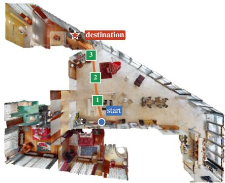
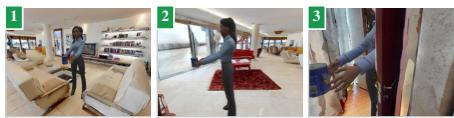
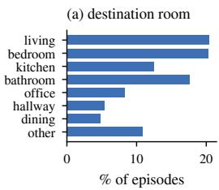
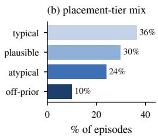
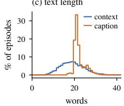
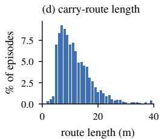
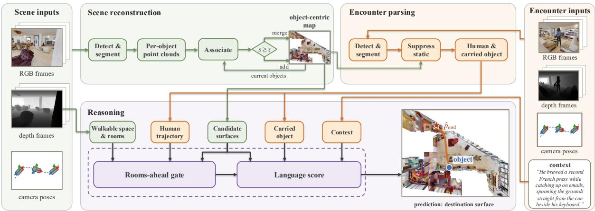
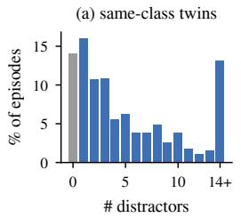
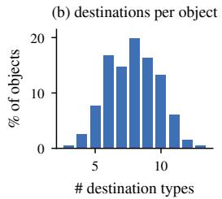
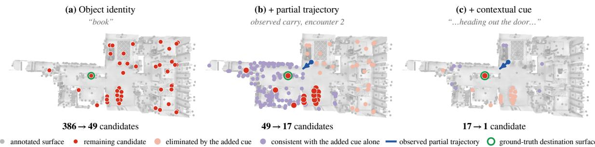

# ECHO: Embodied Camera Observations of Human Object Carrying

Xuefei Sun1, Lorin Achey1, Kali Hamilton1, Alberto Speranzon2, Gregory Grebe2, Yonatan Bisk3, Christoffer Heckman1

Abstract— Embodied and assistive agents must do more than recognize objects: they must reason about where an object belongs given the layout of an environment and the habits of the people who live in it. However, there has been limited progress on problems like this. One explanation is the lack of a dedicated benchmark or dataset for defining and evaluating the problem. Existing RGB-D scan datasets reconstruct static rooms but contain no human activity, while human-objectinteraction datasets capture motion without a navigable, fully reconstructed scene or a ground-truth notion of an object’s natural destination. We introduce contextual object placement as a benchmark task for predicting an object’s destination during an observed object carrying episode. To support this task, we present Embodied Camera observations of Human Object carrying (ECHO), a large-scale synthetic dataset that pairs dense RGB-D scans of indoor scenes with recordings of an embodied human carrying everyday objects to contextappropriate destinations. ECHO is the first publicly available dataset to combine reconstructed scenes, human activity, natural language, and contextual-placement annotations. ECHO comprises 3,805 human-annotated episodes across 159 floors of 115 HM3D scenes, carrying 198 distinct objects. Each floor includes a complete RGB-D scan with human-annotated room labels and a surface list. Each episode provides synchronized RGB-D encounter clips, 6-DoF camera, human, and object trajectories, start and destination surfaces, an action caption and a human-written context: a single sentence describing the inhabitant’s routine that implies the destination without explicitly naming it. We evaluate contextual object placement using input-masked probes and an end-to-end baseline. Results show that no single input modality is sufficient, highlighting the need to jointly reason over scene structure, human activity, and contextual knowledge.

## I. INTRODUCTION

A service robot that operates in a home alongside a person must repeatedly answer a question that object recognition alone cannot resolve: where does this object belong? The answer determines whether a tidying robot returns a mug to the drying rack its owner uses every morning or to a cupboard nobody opens, whether a robotic assistant can anticipate where a person carrying a book is headed, and whether it can act without being explicitly instructed.

The difficulty is that object semantics alone does not determine the answer. A home offers many plausible locations for a given object to be placed or, when carried, many possible

  
carried object coffee can  
context “He brewed a second French press while catching up on emails, spooning the grounds straight from the can beside his keyboard.”

  
action caption “A person picks up the coffee can from the living room and sets it on top of the desk in the bedroom.”  
Fig. 1: One ECHO episode. The information available to the agent includes the RGB-D floor scan and three encounter clips along the carrying route (left). The context provides a hint about the destination surface (right). The dataset additionally provides the carried object name, action caption, and ground-truth destination.

destination → the desk

destinations; a book could reasonably belong on a shelf, a desk, a coffee table, or a nightstand. General knowledge about where books are usually seen cannot distinguish among these alternatives. What breaks the tie is the inhabitant’s routine: the book belongs on their nightstand because they read before sleeping. That preference is almost never stated explicitly. Instead, it must be inferred from indirect evidence about the inhabitant’s routine, what we call context, and grounded in the home’s geometry, where multiple surfaces may be plausible destinations for the object.

We pose this inference as contextual object placement (Sec. III). Given a dense RGB-D scan of the environment, an embodied observation of a person mid-carry, and personspecific contextual information, the agent must predict the surface on which the carry will end. The destination depends on two kinds of evidence. Object semantics together with the person’s habits indicate what kind of surface is appropriate for the carried object, while the observed motion and scene geometry indicate which instance of that surface the person is approaching. The observation covers only part of the carry, so the destination remains a prediction: context and object type narrows the set of plausible surfaces, and the partially observed trajectory grounds that prediction to a specific surface among many candidates in the home. Despite its importance, no existing benchmark jointly provides the scene geometry, human behavior, and contextual information

needed to study this problem.

We supply the data for this task with ECHO, a large-scale synthetic dataset collected in Habitat [1] over HM3D [2] scenes. In each episode, an embodied human avatar carries an everyday object while a robot agent records both a scene sweep and the carrying interaction (Fig. 1). Expert annotators wrote or revised the context for every episode and reviewed each episode through a two-stage quality-control process. The resulting dataset captures placements that cannot be explained by common object-location associations alone and often require distinguishing among multiple plausible destination surfaces. These properties make ECHO a challenging benchmark for studying contextual object placement.

Our contributions are:

• The ECHO dataset: 3,805 human-annotated carry episodes across 159 floors of 115 HM3D scenes, carrying 198 objects from five corpora. Each floor includes an RGB-D scan with human-annotated room labels, a list of candidate surfaces, and spawned objects. Each episode provides synchronized RGB-D encounter clips; 6-DoF camera, human, and object trajectories; start and destination surfaces; an action caption; a humanwritten context; and placement and context-difficulty labels (Table II).

• The contextual object-placement task: an applicationgrounded formalization (Sec. III) with an evaluation protocol that scores the destination location in terms of room, as well as surface category and instance.

• Baseline evaluation: input-masked probes show that no single input channel resolves the destination, and an end-to-end baseline shows that imperfect perception costs accuracy mainly in grounding the prediction to a surface instance, not in choosing the kind of surface.

## II. RELATED WORKS

3D scene-understanding datasets. ScanNet [3], Matterport3D [4], Gibson [5], and HM3D [2], [6] provide largescale RGB-D reconstructions of real interiors, but capture only static geometry, appearance, and semantics. They do not capture dynamic changes in the environment, including changes involving movable objects or human activities. ECHO builds on HM3D and draws its carried objects from ReplicaCAD [7], YCB [8], and the GSO [9], ABO [10], and HSSD [11] subsets of the OVMM [12] object set. It extends the static scene representation with human objectcarrying episodes, contextual descriptions, and destination annotations.

Embodied-AI benchmarks. Simulators such as Habitat [1], [7], [13], AI2-THOR/ProcTHOR [14], [15], and iGibson/BEHAVIOR [16], [17] support a range of placementrelated tasks. Object-goal navigation [18] specifies a target category and rearrangement [19], [20] a target goal state. Housekeep [21], TIDEE [22], and PARSEC [23] instead infer where objects belong from commonsense or user preference, but the system chooses the placement itself, drawing on category-level knowledge learned from training scenes or crowdsourced arrangements without observing a human. In

TABLE I: Comparison of ECHO with related scene, embodied-AI, and human-activity datasets. Scan = a navigable RGB-D reconstruction of the full environment released with the dataset; Place. = supervision of an object’s destination placement. $\checkmark ^ { \dagger }$ denotes a partial property.
<table><tr><td>Dataset</td><td>Scan</td><td>Hum. traj. Obj. traj.</td><td></td><td>Lang.</td><td>Place.</td><td>Scale</td></tr><tr><td>ScanNet [3]</td><td></td><td>X</td><td>X</td><td>X</td><td>X</td><td>1,513 scans</td></tr><tr><td>Matterport3D [4]</td><td></td><td>x</td><td>x</td><td>x</td><td>x</td><td>90 buildings</td></tr><tr><td>HM3D [2]</td><td></td><td>x</td><td>x</td><td>x</td><td>x</td><td>1,000 scenes</td></tr><tr><td>ScanRefer [34]</td><td></td><td>x</td><td>x</td><td>V</td><td>x</td><td>51.6K descr.</td></tr><tr><td>REVERIE [31]</td><td></td><td>x</td><td>x</td><td>√</td><td>x</td><td>21.7K instr.</td></tr><tr><td>Rearrange. [19]</td><td>x</td><td>x</td><td>x</td><td>x</td><td>J</td><td></td></tr><tr><td>LP2 [33]</td><td>X</td><td>V</td><td>x</td><td>√</td><td>x</td><td>2 envs</td></tr><tr><td>SIF [32]</td><td>X</td><td>J</td><td>x</td><td>√</td><td>√</td><td>480 tasks</td></tr><tr><td>HOI4D [24]</td><td>x</td><td></td><td></td><td>x</td><td>x</td><td>4.0K seq</td></tr><tr><td>BEHAVE [25]</td><td>x</td><td></td><td></td><td>x</td><td>x</td><td>321 seq</td></tr><tr><td>CORE4D [26]</td><td>x</td><td></td><td></td><td>x</td><td>x</td><td>1K real seq</td></tr><tr><td>Ego-Exo4D [27]</td><td>x</td><td></td><td>x</td><td></td><td>x</td><td>1,286 h</td></tr><tr><td>EPIC-KITCHENS [28]</td><td>x</td><td></td><td></td><td></td><td>x</td><td>90K actions</td></tr><tr><td>BEHAVIOR-1K [29]</td><td>x</td><td>x</td><td></td><td></td><td>J</td><td>1K activities</td></tr><tr><td>ECHO (ours)</td><td></td><td></td><td></td><td></td><td></td><td>3,805 eps</td></tr></table>

ECHO, the signal comes from an observed human: models watch the carry in dense RGB-D and predict the destination implied by the person’s routine, rather than an explicitly specified goal or a population-level prior.

Human activity and goal inference. Existing work on human activity and goal inference includes datasets that capture human manipulation, motion, and task execution in indoor environments. HOI4D [24], BEHAVE [25], CORE4D [26], Ego-Exo4D [27], and EPIC-KITCHENS [28] capture real manipulation but without navigable scene scans; BEHAVIOR-1K [29] simulates a thousand activities toward defined goal states; and HUMANISE [30] aligns motion capture with ScanNet rooms for language-conditioned motion generation. As summarized in Table I, these datasets provide subsets of the signals required for contextual object placement, but none pair human activity in navigable environments with annotations of a carried object’s contextdependent destination. In language-guided embodied tasks, REVERIE [31] and SIF [32] provide instructions that name the goal or follow fixed templates, whereas ECHO provides lexically diverse free-form contextual descriptions from which the destination must be inferred (Table III). Most closely related, $\mathrm { L P ^ { 2 } }$ [33] forecasts human trajectories by prompting an LLM over a privileged symbolic scene graph, and notes that habit cues could sharpen its predictions. ECHO instead grounds human-object carrying behavior in contextual habits, combining human motion, scene structure, language, and destination annotations at scale. To our knowledge, ECHO is the first dataset to combine reconstructed scenes, human activities, natural language, and contextualplacement annotations(Table I).

## III. PROBLEM DEFINITION

## A. Task definition

We define contextual object placement as the task of placing an object based on contextual cues. Abstractly such tasks may present with a range of contextual information. On one end of the spectrum, the context is empty and placement relies only on commonsense knowledge; at the other, the goal location is stated directly through an instruction. ECHO focuses on the intermediate case, where the intended destination must be inferred from trajectory observations and contextual information that do not explicitly state goal locations. Overall, ECHO covers a wide subset of these tasks, specifically focused on domestic object placement problems.

Formally, the agent observes a scene scan $\mathcal { O } _ { \mathrm { s c a n } }$ (Sec. IV-A) consisting of posed RGB-D frames collected throughout the environment. The scan defines a set of candidate placement surfaces $\mathcal { P } = \{ p _ { m } \}$ , where each surface $p _ { m }$ has a room label $r ( p _ { m } )$ and location $\mathbf { x } ( p _ { m } )$ . The agent then encounters a person carrying an object through a second observation stream, $\mathcal { O } _ { \mathrm { e n c } } ,$ , collected along the agent’s own camera trajectory and covering only part of the carrying activity. The agent also receives a human-written contextual description c associated with the episode. The agent’s contextual object placement problem may be formulated as:

Given the sweep $\mathcal { O } _ { \mathrm { s c a n } } .$ , the encounter $\mathcal { O } _ { \mathrm { e n c } } ,$ and a context $^ { c , }$   
predict the destination surface $\hat { p } _ { \mathrm { e n d } } \in \mathcal { P }$ on which the carried   
object will be placed.

Because the encounter happened before the placement, predicting $\hat { p } _ { \mathrm { e n d } }$ is genuine prediction from two complementary cues: the perceived motion, which constrains where the carrier is headed, and the context, which enables downselecting candidate destination surfaces.

## B. Evaluation protocol

We evaluate performance through destination prediction. To distinguish between partially correct predictions, we measure accuracy at three levels of granularity: (i) room accuracy $( \mathrm { A c c } _ { \mathrm { r o o m } } )$ , which measures whether $r ( \hat { p } _ { \mathrm { e n d } } )$ matches the annotated destination room; (ii) category accuracy $( \mathrm { A c c } _ { \mathrm { c a t } } )$ which measures whether the predicted surface category matches the annotated destination category; and (iii) instance accuracy $( \mathrm { A c c } _ { \mathrm { i n s t } } )$ , which measures whether $\hat { p } _ { \mathrm { e n d } }$ corresponds to the exact annotated destination surface instance. The gap between category and instance accuracy reflects the benchmark’s geometry gap: cases in which a method identifies the correct type of surface but fails to localize the correct physical instance.

As a secondary, geometry-aware measure we report placement error, the Euclidean distance $\| \mathbf { x } ( \hat { p } _ { \mathrm { e n d } } ) \ - \ \mathbf { x } ( p _ { \mathrm { e n d } } ) |$ ∥2 between the predicted and annotated placement locations, which credits near-misses that land on the wrong surface instance but in the correct region of the environment.

## IV. THE ECHO DATASET

We first describe the released dataset contents, then the collection pipeline, the placement-difficulty controls used during generation, and the resulting dataset statistics.

## A. The ECHO dataset

Under the task definition of Sec. III an agent receives two types of input images: a scene scan, which provides observations of the environment, and the encounter clips of each episode, which capture a person carrying an object.

TABLE II: What ECHO releases, per floor and per episode. Role marks whether an artifact is an input under the task definition of Sec. III or ground-truth supervision (GT) only.
<table><tr><td>Artifact</td><td>Content</td><td>Role</td></tr><tr><td> $\mathcal { O } _ { \mathrm { { s c a n } } }$ </td><td>Per floor — 159 floors of 115 HM3D scenes RGB-D frames with poses and intrinsics; 640×480, 90°HFOV, 30 fps; 563 frames on</td><td>input</td></tr><tr><td>Room labels</td><td>average human-assigned room type for every region</td><td>GT</td></tr><tr><td>Surface list P</td><td>scene objects with class, center, extent, and</td><td>GT</td></tr><tr><td>Objects</td><td>room label spawned objects with label, start surface, and frozen start pose</td><td>GT</td></tr><tr><td>Per episode — 3,805 accepted episodes, 198 objects</td><td></td><td></td></tr><tr><td> $\mathcal { O } _ { \mathrm { e n c } }$ </td><td>3 clips of 30 RGB-D frames, with camera, human, and object 6-DoF per frame</td><td>input</td></tr><tr><td>Context c</td><td>human-written sentence of the inhabitant&#x27;s routine</td><td>input</td></tr><tr><td>Action caption</td><td>templated sentence naming object, origin, destination</td><td>GT</td></tr><tr><td>Human track</td><td>full-carry 6-DoF trajectory of the avatar</td><td>GT</td></tr><tr><td>Carried object</td><td>label and start surface</td><td>GT</td></tr><tr><td>Destination</td><td>surface instance, class, room, placement position</td><td>GT</td></tr><tr><td>Placement tier</td><td>typical / plausible / atypical destination</td><td>GT</td></tr><tr><td>Context level</td><td>explicit / implicit single-hop / implicit multi-hop</td><td>GT</td></tr><tr><td>Split</td><td>scene-disjoint train / test (80/20)</td><td></td></tr></table>

Additionally, we provide human annotations beyond those available in HM3D [2], [6]. Room labels are assigned by annotators because HM3D defines room boundaries but does not provide semantic room names. The surface list corresponds to the candidate placement set P introduced in Sec. III, containing every valid destination surface on the floor.

Each episode contains two language annotations with distinct roles. The action caption explicitly names the carried object, origin, and destination in templated form, whereas the context is a free-form description of the inhabitant’s routine that implies the destination without stating it directly. We also provide two difficulty labels: the placement tier, which measures how much the destination departs from the object’s typical placement prior (Sec. IV-C), and the context reasoning difficulty level, which measures the number of reasoning steps required to infer the destination from the provided context (Sec. IV-D).

## B. Collection pipeline

Scenes and objects. Scenes are drawn from HM3D and processed per floor, since one building reconstruction may span several floors with disconnected navigable areas; floors with very limited room or surface diversity, such as an empty basement level, are discarded by hand. The pool of carriable objects combines assets from five sources: the hand-authored ReplicaCAD [7] household assets, the YCB benchmark [8], and curated subsets of Google Scanned Objects (GSO) [9], Amazon Berkeley Objects (ABO) [10], and HSSD [11]. For each floor, a subset of the 198 curated objects is spawned based on the floor’s size and room count. The carrying human model is sampled from a set of eight rigged avatars [35]. Candidate placement surfaces are extracted from

(c) text length

HM3D semantics and annotated room labels. Together, these surfaces and the spawned objects define the scene state used throughout the episode generation process.

Episode planning. Episode generation is divided into a floor-level and an episode-level. The floor-level determines where each object begins, while the episode-level determines where it will be placed after the carry. This separation allows multiple episodes to share the same initial scene configuration while varying the destination.

For each floor, we use Qwen3-8B to assign spawned objects to initial surfaces using a scene summary and the placement priors described in Sec. IV-C. Objects are then physically instantiated and settled with Bullet onto the available free space of the assigned surface, after which their poses are frozen. As a result, all episodes on this floor, as well as the scene scan, share the same object configuration. Starting from this shared configuration, episode-level planning generates three episodes for each object and fixed start surface by assigning distinct destination surfaces according to the target distribution of placement-difficulty tiers. Once the object and destination are fixed, the human trajectory, action caption, and contextual description are generated and grounded to the selected geometry.

Human review. A context must imply the object’s destination through routine without naming the destination surface or room which makes the task challenging for untrained annotators[36]. We therefore hired three expert annotators and paired them with four draft-generating LLMs: Claude Sonnet 5, Claude Opus 5, Claude Haiku 4.5, and DeepSeek V4 Flash. This resulted in twelve annotator–model pairings and reduced reliance on any single annotator or model.

Every episode undergoes two stages of expert review. First, annotators verify the floor-level scene configuration, inspecting object initial poses from eye-level and top-down renderings and revising implausible placements when necessary. Second, annotators review each episode’s trajectory, caption, and context draft, ensuring that the context provides a precise description of the intended destination without naming the surface directly, and correcting any mislabeled or inconsistent annotations.

Two-phase recording. Each floor is first recorded through a scene scan, in which an autonomous explorer traverses all reachable areas and collects RGB-D observations of the environment. In addition to the recorded observations, we provide the object meshes and poses used in each scene. Together with the corresponding HM3D assets, these annotations allow users to reconstruct the start state and render arbitrary observations in Habitat. For each episode, the carried object is placed at its fixed start pose and an avatar carries it along the planned route. Encounter clips are recorded from the agent’s viewpoint along the trajectory, providing partial observations of the carrying activity while keeping the carried object visible to the camera.

## C. Controlling placement difficulty

Contextual object placement is most challenging when the destination cannot be inferred from common objectplacement patterns alone. A model that relies only on object semantics can often ignore the context and default to the most typical destination: a mug goes to the kitchen, a book goes to a shelf. ECHO therefore controls placement difficulty during episode generation by varying how strongly the destination agrees with these priors. For each carried object, we estimate object–room and object–surface priors from large-scale annotated indoor datasets. The object–room prior is derived from HM3D and Matterport3D while the object–surface prior is estimated from ScanNet. To improve coverage for sparsely observed objects, counts are pooled across functionally similar categories using ConceptNet Numberbatch [37]. Both priors are restricted to the rooms and surface classes present on the current floor and renormalized.

  
Fig. 2: Dataset distributions: (a) destination rooms, (b) placementtier mix, (c) caption and context length, (d) carry-route length.

Using both priors, each episode is assigned to one of three placement tiers: typical, where the destination is the object’s most common location; plausible, where the destination is not the most likely choice; and atypical, where the destination is rare and must be justified by the context. To ensure coverage across a range of placement difficulty, episodes are generated to target an equal distribution across the three tiers. The final dataset contains approximately 36%/30%/24% typical, plausible, and atypical placements, respectively, with 10% off-prior destinations; deviations from the target arise when particular placement tiers are infeasible in scenes that lack suitable destination surfaces (Fig. 2b).

## D. Dataset analysis

Spatial structure. Each floor offers on average 5.6 room types. 96% of episodes cross a room boundary, with carry routes averaging 12.3 m (Fig. 2d). Destinations spread over 23 surface classes and 157 start→end room pairs (Fig. 2a), resulting in 1,704 distinct surface instances at 1.9 episodes per instance; Across the dataset, we have 2,886 distinct combinations of carried object, destination surface class, and destination room, so surface reuse adds contrast rather than repetition.

Destinations are context and instance dependent. Object identity alone does not determine where an object belongs. Among objects appearing in at least five episodes, each reaches 7.9 destination-surface classes on average, corresponding to a conditional entropy of 2.65 bits, or about six equally likely destination choices (Fig. 4b). Even after identifying the correct category, multiple surface instances often remain: among non-floor destinations, 86% share their floor with another surface of the same class, with a median of 4 competitors, while 52% have a same-class twin in the destination room (Fig. 4a). Thus, identifying the destination requires both contextual information and geometric grounding, motivating the task and the distinction between $\operatorname { A c c } _ { \operatorname { c a t } }$ and $\operatorname { A c c } _ { \operatorname { i n s t } }$ in Sec. III-B.

  
Fig. 3: ECHO end-to-end baseline. Scene-scan observations (green) are reconstructed into an object-centric map from which candidate surfaces are extracted, while the depth frames provide the walkable space and its rooms. Encounter observations (orange) recover the human trajectory and the carried object. The reasoning stage (purple) applies a rooms-ahead gate from the observed trajectory on the walkable space, followed by a language score conditioned on the carried object and the context, to predict the destination surface.

  
Fig. 4: Why contextual object placement is difficult. (a) Most destinations have several same-class competitors on their floor, so class-level reasoning cannot identify the instance. (b) Destination classes reached per object: no object is tied to a single class, motivating the use of context.

Language. ECHO provides two types of language annotations: context and caption. Table III compares their lexical diversity with language-paired 3D datasets using a common word tokenizer and size-normalized statistics. Vocabulary and distinct-n are computed on equal-size 1,500-token subsamples averaged over 20 random draws, while MATTR-50, HD-D, and MTLD use standard length-robust measures. The contexts are highly diverse: 99.8% of contexts are globally unique and lead all diversity measures, with an MTLD of 72.8, at least 2.5× that of Nr3D, REVERIE, and ScanRefer.

Context reasoning difficulty. Predicting a destination from context can require different amounts of reasoning. We therefore assign each context one of three reasoningdifficulty levels. A context is explicit if it directly mentions the destination room or surface, implicit single-hop if it names a landmark within 2m of the destination or a concept that is one ConceptNet [37] relation away from the destination, and implicit multi-hop if its stated concepts reach the destination only through two or more relations, or through no relation found by the search. For example, “she puts the cup on the sink” is explicit, “she brushes her teeth” is single-hop, and “she gets ready for work” is multi-hop. The three levels account for 37%, 34%, and 28% of contexts, respectively.

TABLE III: Language diversity of the free-form layer, measured uniformly across the released corpora as described in Sec. IV-D.
<table><tr><td>Corpus</td><td>Vocab↑</td><td>D-2↑</td><td>D-3↑</td><td>MATTR-50↑</td><td>HD-D↑</td><td>MTLD↑</td></tr><tr><td>SIF [32]</td><td>67</td><td>.09</td><td>.14</td><td>.46</td><td>.48</td><td>21.8</td></tr><tr><td>Sr3D [38]</td><td>116</td><td>.16</td><td>.34</td><td>.50</td><td>.52</td><td>13.5</td></tr><tr><td>REVERIE [31]</td><td>223</td><td>.45</td><td>.74</td><td>.62</td><td>.66</td><td>26.2</td></tr><tr><td>ScanRefer [34]</td><td>266</td><td>.51</td><td>.75</td><td>.61</td><td>.65</td><td>21.8</td></tr><tr><td>Nr3D [38]</td><td>298</td><td>.57</td><td>.83</td><td>.66</td><td>.69</td><td>28.5</td></tr><tr><td>LP2 [33]</td><td>388</td><td>.69</td><td>.88</td><td>.70</td><td>.78</td><td>27.4</td></tr><tr><td>ECHO captions</td><td>102</td><td>.13</td><td>.21</td><td>.48</td><td>.49</td><td>26.5</td></tr><tr><td>ECHO contexts</td><td>551</td><td>.82</td><td>.96</td><td>.80</td><td>.81</td><td>72.8</td></tr></table>

## V. BENCHMARK, BASELINE, AND EXPERIMENTS

We instantiate the contextual object-placement benchmark of Sec. III on ECHO and evaluate methods using the room, surface category, and instance metrics defined there. We first analyze the benchmark with input-masked probes that isolate individual sources of information, then report an end-to-end baseline that replaces oracle inputs with perceived scene and trajectory information.

Episodes are split scene-disjointly into train and test sets at an 80/20 ratio. All floors of the same HM3D scene belong to the same split.

TABLE IV: Input-masked probe accuracy on the 400-episode test sample at early, mid, and late encounters. Results are reported at the room, category, and instance levels; bold denotes the best result per column, and shading marks results within 0.05 of the best.
<table><tr><td></td><td colspan="3">early</td><td colspan="3">mid</td><td colspan="3">late</td></tr><tr><td>Probe</td><td>room</td><td>cat.</td><td>inst.</td><td>room</td><td>cat.</td><td>inst.</td><td>room</td><td>cat.</td><td>inst.</td></tr><tr><td>PRIOR-FREQ</td><td>0.235</td><td>0.065</td><td>0.047</td><td>0.233</td><td>0.063</td><td>0.046</td><td>0.234</td><td>0.065</td><td>0.048</td></tr><tr><td>OBJECT</td><td>0.200</td><td>0.111</td><td>0.034</td><td>0.199</td><td>0.108</td><td>0.033</td><td>0.200</td><td>0.110</td><td>0.034</td></tr><tr><td>CONTEXT</td><td>0.592</td><td>0.192</td><td>0.113</td><td>0.591</td><td>0.190</td><td>0.110</td><td>0.587</td><td>0.191</td><td>0.111</td></tr><tr><td>TRAJECTORY</td><td>0.333</td><td>0.010</td><td>0.000</td><td>0.491</td><td>0.023</td><td>0.012</td><td>0.667</td><td>0.049</td><td>0.052</td></tr><tr><td>CONTEXT+OBJECT</td><td>0.576</td><td>0.204</td><td>0.115</td><td>0.575</td><td>0.202</td><td>0.112</td><td>0.571</td><td>0.200</td><td>0.112</td></tr><tr><td>TRAJ+OBJECT</td><td>0.296</td><td>0.123</td><td>0.056</td><td>0.450</td><td>0.133</td><td>0.062</td><td>0.650</td><td>0.215</td><td>0.180</td></tr><tr><td>TRAJ+CONTEXT</td><td>0.650</td><td>0.207</td><td>0.127</td><td>0.712</td><td>0.201</td><td>0.147</td><td>0.774</td><td>0.249</td><td>0.189</td></tr><tr><td>TRAJ+CONTEXT+OBJECT</td><td>0.627</td><td>0.226</td><td>0.135</td><td>0.692</td><td>0.237</td><td>0.161</td><td>0.755</td><td>0.290</td><td>0.234</td></tr></table>

## A. Input-masked probes

Probes definition: We use input-masked probes to measure how much information each input provides. Every probe receives the ground-truth surface list, including the class and room label of each candidate object, together with one or more additional inputs: trainsplit destination frequencies (PRIOR-FREQ), the carriedobject label (OBJECT), the context (CONTEXT), the carrier trajectory during the encounter (TRAJECTORY), or their combinations (CONTEXT+OBJECT, TRAJ+OBJECT, TRAJ+CONTEXT, and TRAJ+CONTEXT+OBJECT). Singleinput probes measure the information available from each channel alone, while combined probes measure the information gained by adding one channel to another.

PRIOR-FREQ uses destination frequencies from the training split. OBJECT and CONTEXT ask an LLM to score each (class, room) group given the carried object or context, respectively, while CONTEXT+OBJECT provides both inputs together. TRAJECTORY fits a heading to the tracked human positions during the encounter and scores candidate surfaces by their bearing from that heading. TRAJ+CONTEXT instead uses a geodesic rooms-ahead gate on the floor’s walkable grid. Groups along the carrier’s route through the floor’s door topology receive higher scores, while receding or unreachable groups are downweighted. TRAJ+OBJECT and TRAJ+CONTEXT+OBJECT use the same geometry gate with their respective language scores.

Probe results: Table IV reports probe accuracy on a 400-episode sample of the test split at early, mid, and late encounters. Context is the strongest static signal, whereas trajectory becomes increasingly informative as the encounter progresses along the route. Combining both sources of information produces the strongest performance throughout the carry.

The gap between room and instance accuracy remains large, indicating that identifying the destination type is substantially easier than grounding the correct surface instance. Adding the carried-object label contributes little beyond context alone, suggesting that contextual information already captures much of the object’s semantic signal.

All LLM-backed probes use DeepSeek V4 Flash. We compared six different LLMs on the OBJECT and CON-TEXT+OBJECT probes over the same sample: adding context improved every model, and the models did not differ significantly from one another.

TABLE V: Probe accuracy by context-difficulty level on the 400- episode test sample at the mid-route encounter.
<table><tr><td></td><td></td><td colspan="3">CONTEXT</td><td colspan="3">TRAJ+CONTEXT</td><td colspan="3">PRIOR-FREQ</td></tr><tr><td>Level</td><td></td><td>n room</td><td>cat.</td><td>inst.</td><td>room</td><td>cat.</td><td>inst.</td><td>room</td><td>cat.</td><td>inst.</td></tr><tr><td>explicit</td><td>148</td><td>0.694</td><td>0.261</td><td>0.129</td><td>0.813</td><td>0.272</td><td>0.172</td><td>0.253</td><td>0.047</td><td>0.031</td></tr><tr><td>implicit single-hop 138 0.549</td><td></td><td></td><td>90.206</td><td>60.132</td><td>0.649</td><td></td><td></td><td>0.184 0.154 0.234 0.0720.051</td><td></td><td></td></tr><tr><td>implicit multi-hop</td><td></td><td></td><td></td><td></td><td>113 0.506 0.077 0.065 0.655 0.130 0.110 0.206 0.071 0.058</td><td></td><td></td><td></td><td></td><td></td></tr></table>

Table V shows that context difficulty affects prediction as intended. Context-only accuracy drops from explicit to implicit contexts, especially at the instance level, while the frequency prior remains low across all levels. The two implicit levels have similar room accuracy but differ more clearly at the class and instance levels. Adding trajectory recovers part of the loss, particularly for multi-hop contexts. Figure 5 illustrates one episode at the mid-route encounter.

## B. End-to-end baseline

Our end-to-end baseline (Fig. 3) implements the TRAJ+CONTEXT probe using a scene reconstructed from RGB-D observations rather than ground-truth geometry. The scene is built using an open-vocabulary object mapping pipeline following ConceptGraphs [39]. YOLO-World [40] detections are segmented with SAM [41], back-projected using depth, and fused across frames using geometric overlap and DINOv2 [42] features. The resulting map provides candidate surfaces and their classes, while the depth observations provide the walkable space used for the trajectory-based geodesic gate. Rooms are inferred from the reconstructed walkable space and assigned to candidate surfaces. During the encounter, detections are projected into the same world frame, and moving evidence is linked across frames by nearest-centroid association to obtain person and carriedobject tracks. Table VI repeats the eight probes of Table IV with every oracle replaced by the baseline’s perception, on the same 400-episode test sample and encounters. Comparing a cell against its oracle counterpart isolates the cost of perceiving that channel.

Trajectory is the easiest signal to recover. The tracker detects the person in 98.6% and the carried object in 89.0% of encounters, with median horizontal errors of 0.13 and 0.05 m, respectively. Consequently, the perceived TRAJEC-TORY probe matches the oracle’s placement error and stays within 0.03 of its room accuracy at every encounter point.

Surface reconstruction is the primary bottleneck. Although 97% of reconstructed points lie within 10 cm of the HM3D mesh, only 57% of annotated placement surfaces receive any reconstructed geometry and only 23% receive a class that we would accept compared to the ground-truth label. Some of this gap may arise because surfaces that are visible in the RGB-D observations, particularly those farther from the camera, receive low detection confidence and are filtered out by the ConceptGraph pipeline. As a result, the perceived TRAJ+CONTEXT probe retains only 0.047 of the oracle’s 0.189 late-encounter instance accuracy and 0.098 of its 0.249 surface-category accuracy.

Semantic errors add further loss. The perceived room layer correctly identifies the room for 55% of matched

Context “He always sets down whatever he's reading right as he's heading out the door, so he won'tforget it later.”

  
Fig. 5: Each cue alone is ambiguous; together they identify the surface. In this test episode at the mid-route encounter, object identity narrows 386 candidate surfaces to 49, the observed trajectory reduces those to 17, and the contextual cue reduces the candidate set to a single surface.

TABLE VI: End-to-end baseline on the same 400-episode test sample and encounters as Table IV. Each probe is evaluated using perceived inputs from the pipeline in Fig. 3: reconstructed candidate surfaces and room labels, detected object classes, and tracked human and object trajectories. Columns report destination room, category, and instance accuracy. Reconstructed predictions are matched and grounded to annotated objects on the same floor.

<table><tr><td></td><td colspan="3">early</td><td colspan="3">mid</td><td colspan="3">late</td></tr><tr><td>Head</td><td>room</td><td>cat.</td><td>inst.</td><td>room</td><td>cat.</td><td>inst.</td><td>room</td><td>cat.</td><td>inst.</td></tr><tr><td>PRIOR-FREQ</td><td>0.233</td><td>0.028</td><td>0.000</td><td>0.233</td><td>0.028</td><td>0.000</td><td>0.236</td><td>0.028</td><td>0.000</td></tr><tr><td>OBJECT</td><td>0.206</td><td>0.042</td><td>0.012</td><td>0.201</td><td>0.038</td><td>0.010</td><td>0.237</td><td>0.032</td><td>0.008</td></tr><tr><td>CONTEXT</td><td>0.341</td><td>0.070</td><td>0.025</td><td>0.342</td><td>0.070</td><td>0.025</td><td>0.347</td><td>0.072</td><td>0.026</td></tr><tr><td>TRAJECTORY</td><td>0.358</td><td>0.027</td><td>0.006</td><td>0.475</td><td>0.034</td><td>0.015</td><td>0.641</td><td>0.062</td><td>0.043</td></tr><tr><td>CONTEXT+OBJECT</td><td>0.318</td><td>0.058</td><td>0.024</td><td>0.335</td><td>0.059</td><td>0.024</td><td>0.345</td><td>0.055</td><td>0.020</td></tr><tr><td>TRAJ+OBJECT</td><td>0.280</td><td>0.056</td><td>0.016</td><td>0.388</td><td>0.072</td><td>0.020</td><td>0.574</td><td>0.074</td><td>0.035</td></tr><tr><td>TRAJ+CONTEXT</td><td>0.406</td><td>0.084</td><td>0.033</td><td>0.480</td><td>0.087</td><td>0.035</td><td>0.534</td><td>0.098</td><td>0.047</td></tr><tr><td>TRAJ+CONTEXT+OBJECT 0.392</td><td></td><td>0.069</td><td>0.034</td><td>0.484</td><td>0.076</td><td>0.034</td><td>0.551</td><td>0.094</td><td>0.054</td></tr></table>

surfaces, while object detection fails to recover a track in 11% of encounters. Overall, the largest gap between oracle and perceived performance comes from reconstructing and predicting surface labels rather than estimating motion, highlighting scene understanding as a key challenge for contextual object placement. Overall, the benchmark remains challenging when considering realistic perception pipelines. Closing this gap requires more reliable scene understanding as well as contextual reasoning. ECHO provides a benchmark for measuring both.

## VI. CONCLUSIONS AND FUTURE WORK

We introduced ECHO, a large-scale synthetic dataset for contextual object placement, pairing reconstructed indoor scenes with embodied observations of humans carrying everyday objects to context-appropriate destinations. ECHO provides synchronized RGB-D observations, motion trajectories, scene structure, and natural-language context, together with explicit placement and context difficulty labels. We formalized contextual object placement as a benchmark task and evaluated it with input-masked probes and an end-to-end baseline. Our experiments show that no single input channel is sufficient: context provides a strong static signal, trajectory becomes increasingly informative during the carry, and their combination performs best. Under realistic perception, however, reconstructing and predicting candidate surface labels is a larger source of error than recovering motion, highlighting the importance of both scene understanding and contextual reasoning.

Future work. We will evaluate learned contextualplacement methods and human performance, providing both algorithmic baselines and a human reference. We plan to expand ECHO to more scenes and objects, support multiobject carrying, and extend single-sentence contexts toward persistent inhabitant routines and behaviors. Finally, we will study transfer from ECHO to real RGB-D observations and physical embodied agents, narrowing the gap between synthetic benchmark evaluation and deployment.

## ACKNOWLEDGMENT

This work was supported by Lockheed Martin, by the National Science Foundation (NSF) under CAREER Award 2339328, and by the Army Research Laboratory (ARL) Distributed and Collaborative Intelligent Systems and Technology (DCIST) program under Cooperative Agreement W911NF-17-2-0181.

## REFERENCES

[1] M. Savva, A. Kadian, O. Maksymets, Y. Zhao, E. Wijmans, B. Jain, J. Straub, J. Liu, V. Koltun, J. Malik, D. Parikh, and D. Batra, “Habitat: A platform for embodied AI research,” in IEEE/CVF International Conference on Computer Vision (ICCV), 2019.

[2] S. K. Ramakrishnan, A. Gokaslan, E. Wijmans, O. Maksymets, A. Clegg, J. M. Turner, E. Undersander, W. Galuba, A. Westbury, A. X. Chang, M. Savva, Y. Zhao, and D. Batra, “Habitat-matterport 3d dataset (HM3d): 1000 large-scale 3d environments for embodied AI,” in Thirty-fifth Conference on Neural Information Processing Systems Datasets and Benchmarks Track, 2021. [Online]. Available: https://arxiv.org/abs/2109.08238

[3] A. Dai, A. X. Chang, M. Savva, M. Halber, T. Funkhouser, and M. Nießner, “Scannet: Richly-annotated 3d reconstructions of indoor scenes,” in Proc. Computer Vision and Pattern Recognition (CVPR), IEEE, 2017.

[4] A. Chang, A. Dai, T. Funkhouser, M. Halber, M. Niessner, M. Savva, S. Song, A. Zeng, and Y. Zhang, “Matterport3d: Learning from RGB-D data in indoor environments,” in International Conference on 3D Vision (3DV), 2017.

[5] F. Xia, A. R. Zamir, Z. He, A. Sax, J. Malik, and S. Savarese, “Gibson env: Real-world perception for embodied agents,” in IEEE Conference on Computer Vision and Pattern Recognition (CVPR), 2018.

[6] K. Yadav, R. Ramrakhya, S. K. Ramakrishnan, T. Gervet, J. Turner, A. Gokaslan, N. Maestre, A. X. Chang, D. Batra, M. Savva, A. W. Clegg, and D. S. Chaplot, “Habitat-matterport 3d semantics dataset,” in IEEE/CVF Conference on Computer Vision and Pattern Recognition (CVPR), 2023.

[7] A. Szot, A. Clegg, E. Undersander, E. Wijmans, Y. Zhao, J. Turner, N. Maestre, M. Mukadam, D. Chaplot, O. Maksymets et al., “Habitat 2.0: Training home assistants to rearrange their habitat,” in Advances in Neural Information Processing Systems (NeurIPS), 2021.

[8] B. Calli, A. Singh, A. Walsman, S. Srinivasa, P. Abbeel, and A. M. Dollar, “The YCB object and model set: Towards common benchmarks for manipulation research,” in IEEE International Conference on Advanced Robotics (ICAR), 2015, pp. 510–517.

[9] L. Downs, A. Francis, N. Koenig, B. Kinman, R. Hickman, K. Reymann, T. B. McHugh, and V. Vanhoucke, “Google scanned objects: A high-quality dataset of 3d scanned household items,” in IEEE International Conference on Robotics and Automation (ICRA), 2022.

[10] J. Collins, S. Goel, K. Deng, A. Luthra, L. Xu, E. Gundogdu et al., “ABO: Dataset and benchmarks for real-world 3D object understanding,” in IEEE/CVF Conference on Computer Vision and Pattern Recognition (CVPR), 2022.

[11] M. Khanna, Y. Mao, H. Jiang, S. Haresh, B. Shacklett, D. Batra, A. Clegg, E. Undersander, A. X. Chang, and M. Savva, “Habitat synthetic scenes dataset (HSSD-200): An analysis of 3D scene scale and realism tradeoffs for ObjectGoal navigation,” in IEEE/CVF Conference on Computer Vision and Pattern Recognition (CVPR), 2024.

[12] S. Yenamandra, A. Ramachandran, K. Yadav, A. Wang, M. Khanna, T. Gervet et al., “HomeRobot: Open-vocabulary mobile manipulation,” in Conference on Robot Learning (CoRL), 2023.

[13] X. Puig, E. Undersander, A. Szot, M. D. Cote, R. Partsey, J. Yang, R. Desai, A. W. Clegg, M. Hlavac, T. Min, T. Gervet, V. Vondrus, V.-P.ˇ Berges, J. Turner, O. Maksymets, Z. Kira, M. Kalakrishnan, J. Malik, D. S. Chaplot, U. Jain, D. Batra, A. Rai, and R. Mottaghi, “Habitat 3.0: A co-habitat for humans, avatars, and robots,” in International Conference on Learning Representations (ICLR), 2024.

[14] E. Kolve, R. Mottaghi, W. Han, E. VanderBilt, L. Weihs, A. Herrasti, M. Deitke, K. Ehsani, D. Gordon, Y. Zhu, A. Kembhavi, A. Gupta, and A. Farhadi, “AI2-THOR: An interactive 3d environment for visual AI,” arXiv preprint arXiv:1712.05474, 2017.

[15] M. Deitke, E. VanderBilt, A. Herrasti, L. Weihs, J. Salvador, K. Ehsani, W. Han, E. Kolve, A. Farhadi, A. Kembhavi, and R. Mottaghi, “ProcTHOR: Large-scale embodied AI using procedural generation,” in Advances in Neural Information Processing Systems (NeurIPS), 2022.

[16] B. Shen, F. Xia, C. Li, R. Mart´ın-Mart´ın, L. Fan, G. Wang, C. Perez-´ D’Arpino, S. Buch, S. Srivastava, L. Tchapmi, M. Tchapmi, K. Vainio, J. Wong, L. Fei-Fei, and S. Savarese, “iGibson 1.0: A simulation environment for interactive tasks in large realistic scenes,” in IEEE/RSJ International Conference on Intelligent Robots and Systems (IROS), 2021.

[17] S. Srivastava, C. Li, M. Lingelbach, R. Mart´ın-Mart´ın, F. Xia, K. E. Vainio, Z. Lian, C. Gokmen, S. Buch, K. Liu et al., “BEHAVIOR: Benchmark for everyday household activities in virtual, interactive, and ecological environments,” in Conference on Robot Learning (CoRL), 2021.

[18] D. Batra, A. Gokaslan, A. Kembhavi, O. Maksymets, R. Mottaghi, M. Savva, A. Toshev, and E. Wijmans, “ObjectNav revisited: On evaluation of embodied agents navigating to objects,” arXiv preprint arXiv:2006.13171, 2020.

[19] D. Batra, A. X. Chang, S. Chernova, A. J. Davison, J. Deng, V. Koltun, S. Levine, J. Malik, I. Mordatch, R. Mottaghi, M. Savva, and H. Su, “Rearrangement: A challenge for embodied AI,” arXiv preprint arXiv:2011.01975, 2020.

[20] L. Weihs, M. Deitke, A. Kembhavi, and R. Mottaghi, “Visual room rearrangement,” in IEEE/CVF Conference on Computer Vision and Pattern Recognition (CVPR), 2021.

[21] Y. Kant, A. Ramachandran, S. Yenamandra, I. Gilitschenski, D. Batra, A. Szot, and H. Agrawal, “Housekeep: Tidying virtual households using commonsense reasoning,” in European Conference on Computer Vision (ECCV), 2022.

[22] G. Sarch, Z. Fang, A. W. Harley, P. Schydlo, M. J. Tarr, S. Gupta, and K. Fragkiadaki, “TIDEE: Tidying up novel rooms using visuosemantic commonsense priors,” in European Conference on Computer Vision (ECCV), 2022.

[23] K. Ramachandruni and S. Chernova, “Personalized robotic object rearrangement from scene context,” in IEEE International Conference on Robot and Human Interactive Communication (RO-MAN), 2025.

[24] Y. Liu, Y. Liu, C. Jiang, K. Lyu, W. Wan, H. Shen, B. Liang, Z. Fu, H. Wang, and L. Yi, “HOI4D: A 4D egocentric dataset for

category-level human-object interaction,” in IEEE/CVF Conference on Computer Vision and Pattern Recognition (CVPR), 2022.

[25] B. L. Bhatnagar, X. Xie, I. A. Petrov, C. Sminchisescu, C. Theobalt, and G. Pons-Moll, “BEHAVE: Dataset and method for tracking human object interactions,” in IEEE/CVF Conference on Computer Vision and Pattern Recognition (CVPR), 2022.

[26] Y. Liu, C. Zhang, R. Xing, B. Tang, B. Yang, and L. Yi, “CORE4D: A 4D human-object-human interaction dataset for collaborative object rearrangement,” in IEEE/CVF Conference on Computer Vision and Pattern Recognition (CVPR), 2025.

[27] K. Grauman, A. Westbury, L. Torresani, K. Kitani, J. Malik, T. Afouras et al., “Ego-Exo4D: Understanding skilled human activity from firstand third-person perspectives,” in IEEE/CVF Conference on Computer Vision and Pattern Recognition (CVPR), 2024.

[28] D. Damen, H. Doughty, G. M. Farinella, A. Furnari, E. Kazakos, J. Ma, D. Moltisanti, J. Munro, T. Perrett, W. Price, and M. Wray, “Rescaling egocentric vision: Collection, pipeline and challenges for EPIC-KITCHENS-100,” International Journal of Computer Vision (IJCV), vol. 130, pp. 33–55, 2022.

[29] C. Li, R. Zhang, J. Wong, C. Gokmen, S. Srivastava, R. Mart´ın-Mart´ın, C. Wang, G. Levine, M. Lingelbach, J. Sun et al., “BEHAVIOR-1K: A benchmark for embodied AI with 1,000 everyday activities and realistic simulation,” in Conference on Robot Learning (CoRL), 2022.

[30] Z. Wang, Y. Chen, T. Liu, Y. Zhu, W. Liang, and S. Huang, “HUMAN-ISE: Language-conditioned human motion generation in 3D scenes,” in Advances in Neural Information Processing Systems (NeurIPS), 2022.

[31] Y. Qi, Q. Wu, P. Anderson, X. Wang, W. Y. Wang, C. Shen, and A. van den Hengel, “REVERIE: Remote embodied visual referring expression in real indoor environments,” in IEEE/CVF Conference on Computer Vision and Pattern Recognition (CVPR), 2020.

[32] S. Y. Min, X. Puig, D. S. Chaplot, T.-Y. Yang, A. Rai, P. Parashar, R. Salakhutdinov, Y. Bisk, and R. Mottaghi, “Situated instruction following,” in European Conference on Computer Vision (ECCV), 2024.

[33] N. Gorlo, L. Schmid, and L. Carlone, “Long-term human trajectory prediction using 3D dynamic scene graphs,” IEEE Robotics and Automation Letters, vol. 9, no. 12, pp. 10 978–10 985, 2024.

[34] D. Z. Chen, A. X. Chang, and M. Nießner, “ScanRefer: 3d object localization in RGB-D scans using natural language,” in European Conference on Computer Vision (ECCV), 2020.

[35] T. Hoang-Minh, “3d-human-model: 3D human model with animation using Three.js,” https://github.com/hmthanh/3d-human-model, 2022, GitHub repository.

[36] C. Mauceri, M. Palmer, and C. Heckman, “Sun-spot: An rgb-d dataset with spatial referring expressions,” in 2019 IEEE/CVF International Conference on Computer Vision Workshop (ICCVW). IEEE, 2019, pp. 1883–1886.

[37] R. Speer, J. Chin, and C. Havasi, “ConceptNet 5.5: An open multilingual graph of general knowledge,” in AAAI Conference on Artificial Intelligence, 2017.

[38] P. Achlioptas, A. Abdelreheem, F. Xia, M. Elhoseiny, and L. Guibas, “ReferIt3D: Neural listeners for fine-grained 3d object identification in real-world scenes,” in European Conference on Computer Vision (ECCV), 2020.

[39] Q. Gu, A. Kuwajerwala, S. Morin, K. M. Jatavallabhula, B. Sen, A. Agarwal, C. Rivera, W. Paul, K. Ellis, R. Chellappa, C. Gan, C. M. de Melo, J. B. Tenenbaum, A. Torralba, F. Shkurti, and L. Paull, “ConceptGraphs: Open-vocabulary 3D scene graphs for perception and planning,” in IEEE International Conference on Robotics and Automation (ICRA), 2024.

[40] T. Cheng, L. Song, Y. Ge, W. Liu, X. Wang, and Y. Shan, “YOLO-World: Real-time open-vocabulary object detection,” in Proc. Computer Vision and Pattern Recognition (CVPR), IEEE, 2024.

[41] A. Kirillov, E. Mintun, N. Ravi, H. Mao, C. Rolland, L. Gustafson, T. Xiao, S. Whitehead, A. C. Berg, W.-Y. Lo, P. Dollar, and R. Gir-´ shick, “Segment anything,” in Proc. International Conference on Computer Vision (ICCV), IEEE, 2023.

[42] M. Oquab, T. Darcet, T. Moutakanni, H. Vo, M. Szafraniec, V. Khalidov et al., “DINOv2: Learning robust visual features without supervision,” Transactions on Machine Learning Research (TMLR), 2024.