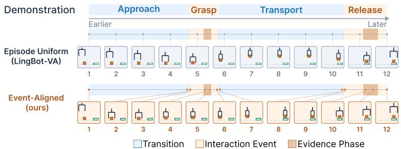
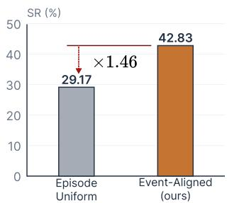
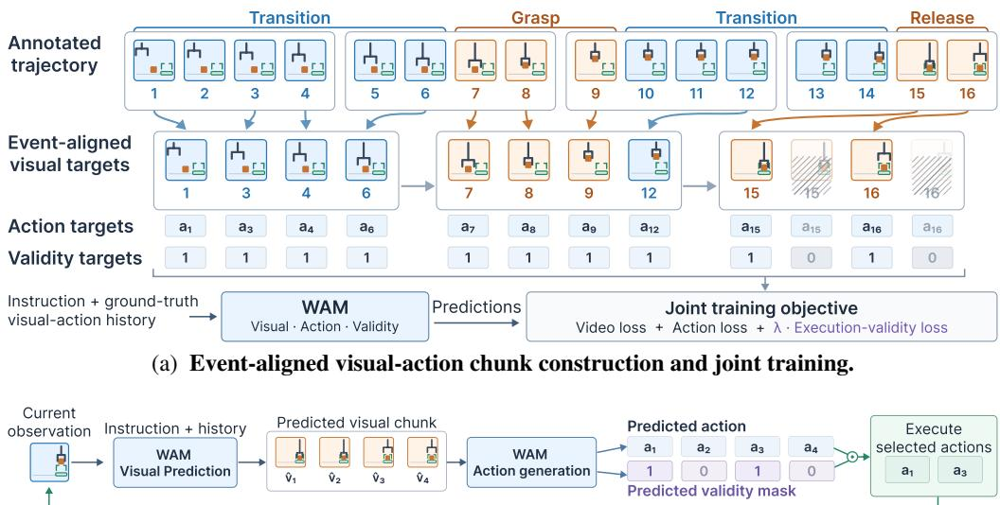
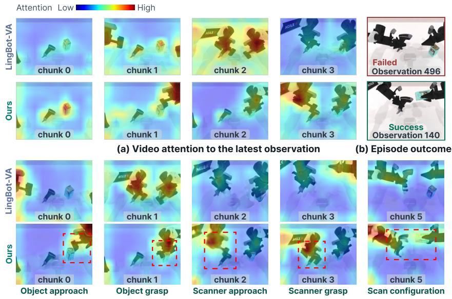
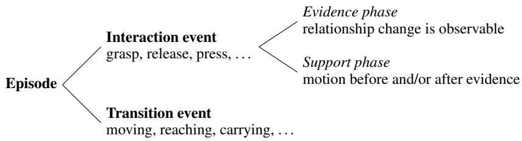
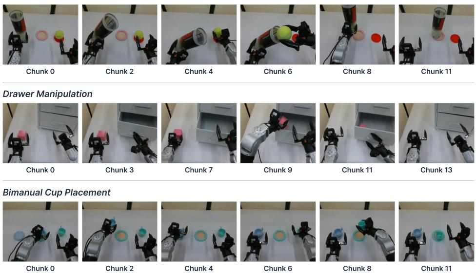
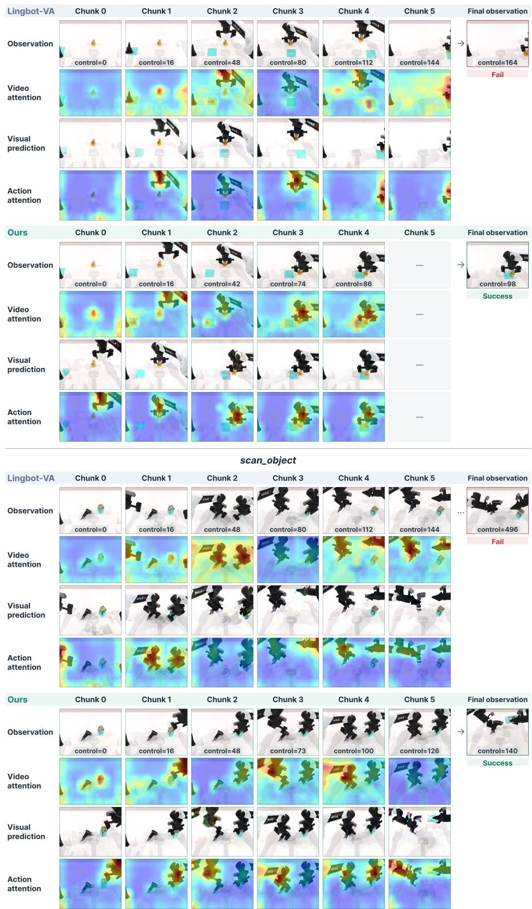
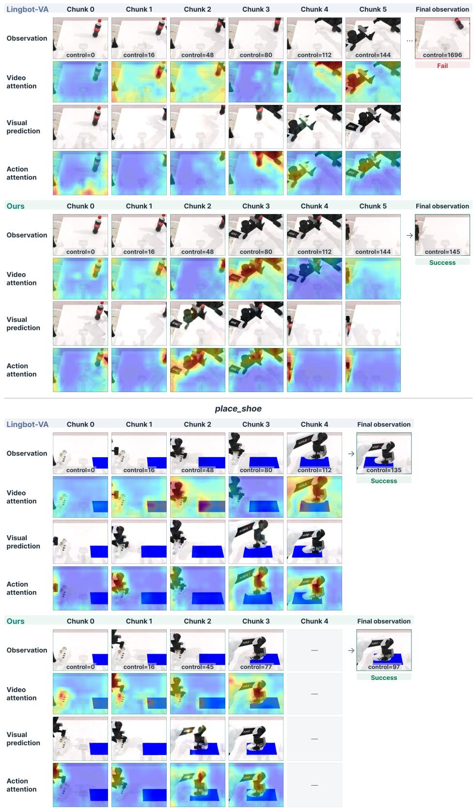
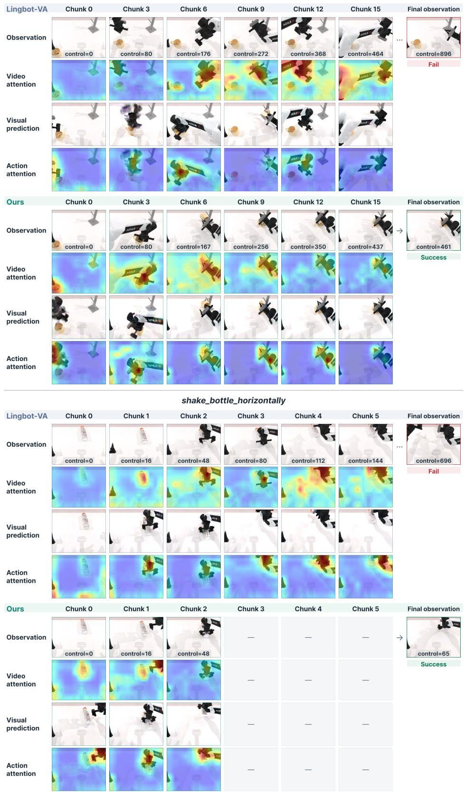

# EVENT-ALIGNED VISUAL ACTION REASONING FOR WORLD ACTION MODELS

Xiaomeng Yang Yushu Wu Yi Gao Yuhao Lei Xuan Zhang Pu Zhao Yanzhi Wang   
Northeastern University   
Project Page

## ABSTRACT

World-Action Models (WAMs) utilize future visual prediction as an intermediate reasoning process to guide action generation. However, existing WAMs typically structure visual imagination according to predefined temporal intervals, without explicitly accounting for the different roles of task-critical interactions and connecting transitions. We argue that effective visual foresight should align directly with task-relevant interactions and their corresponding reasoning demands. To this end, we introduce an event-aligned visual action reasoning framework that organizes visual-action prediction around interaction events. Through event-aligned visual-action supervision, WAM learns to generate event-aligned visual context in each imagined rollout, placing greater emphasis on critical state changes that inform action generation. This shapes the visual reasoning granularity according to the underlying interaction dynamics, with detailed reasoning around task-critical events and coarser progression through connecting transitions. Furthermore, we introduce an execution validity head that identifies the valid portion of each predicted action sequence, avoiding redundant actions during chunked inference. Experiments demonstrate a 10.26 percentage point improvement in DOMINO success rate over baseline and competitive performance on RoboTwin 2.0. It also transfers from DOMINO Level 1 to Levels 2 and 3 without target-level adaptation.

## 1 INTRODUCTION

Recent World Action Models (WAMs) have emerged as a promising paradigm for robot manipulation by coupling action generation with future visual prediction (Li et al., 2026a; Aditi et al., 2026; Ye et al., 2026). Unlike conventional vision-language-action (VLA) policies that map current observations and instructions directly to actions (Kim et al., 2025; Black et al., 2026; Bjorck et al., 2025; Black et al., 2025; Team, 2025; Zheng et al., 2025), WAMs additionally model how the scene may evolve and leverage the predicted future for action generation. Such visual prediction can be viewed as an intermediate reasoning process that simulates future scene evolution and grounds action generation in predicted visual states. From this perspective, a fundamental question is how a WAM should structure its visual imagination to best inform action generation.

A key observation is that visual states along a manipulation trajectory contribute differently to action generation. Consider grasping an object: physical contact between the gripper and the object provides direct evidence of the interaction, while the preceding gripper closure and the subsequent lift provide the local context for how the grasp begins and proceeds. Meanwhile, the initial reach serves as a connective phase linking earlier task stages to the grasp itself. These phases serve distinct functions: The core interaction (grasp) evidence confirms whether the intended robot–object state transition has occurred; the surrounding motion (closing and lifting) provides the context of this change; and the connecting motion (approaching) determines how the robot transitions to it. However, the manipulation trajectory rarely reflects these functional task stages. Informative interaction events often span only a few frames, while connecting motions can take up the majority of the trajectory. Therefore, visual imagination based on fixed temporal intervals may risk fragmenting critical, fine-grained interactions across distinct prediction horizons.

  
(a) Visual-Action Chunks Granularity

  
(b) DOMINO success rate  
Figure 1: Interaction-dependent temporal granularity of visual reasoning. (a) Our event-aligned visual action reasoning framework organizes visual-action targets around interaction events and transitions. (b) DOMINO success rates under a matched sequence budget of training visual-action slots.

Despite rapid progress in WAMs, current paradigms largely overlook this functional gap. Existing works predominantly focus on how visual predictions should be integrated with actions. Li et al. (2026a) explicitly interleaves future visual prediction and action generation, Yuan et al. (2026) retains video modeling only during training, and Zhang et al. (2026) replaces dense future videos with task-relevant visual transformations. However, as shown in Fig. 1a, these methods universally structure visual-action horizons uniformly across the demonstration timeline (denoted as Episode Uniform). They largely inherit the sampled trajectory structure from training data, without adapting visual imagination to different interaction events.

To address the above limitations, we propose an event-aligned visual action reasoning framework that organizes visual imagination around task-critical interactions, rather than directly following the sampled trajectory structure. The key idea is to shape the temporal progression of imagined states according to the underlying interaction dynamics. We construct event-aligned visual-action supervision by first segmenting training trajectories according to interaction events and then building visual-action prediction chunks from the resulting event boundaries. Within this event-aligned organization, we reorganize training trajectories such that task-critical events preserve fine-grained visual-action evolution, while transitions toward the relevant states are represented with fewer in termediate states, as shown in Fig. 1. Through this supervision, the model learns to advance its visual imagination in alignment with interaction progress, generating visual context that captures how critical interactions unfold under actions and supports action generation.

However, event-aligned visual action reasoning also introduces a practical challenge for action execution. Since interaction segments may span different durations, their corresponding action sequences can have different valid lengths. When mapped to fixed-size action chunks following Li et al. (2026a), short segments use repeated or padded actions to fill the remaining prediction slots during training. Executing these padding-induced actions can unnecessarily prolong the segment before the next prediction. To address this issue, we further introduce an execution validity head that identifies the valid portion of each predicted action sequence. At inference time, the validity head determines which portion to execute, avoiding redundant actions while retaining actual actions associated with interactions.

Experiments on DOMINO (Fang et al., 2026) and RoboTwin 2.0 (Chen et al., 2025) demonstrate improved manipulation performance, including a 10.26% gain in DOMINO success rate over LingBot-VA (Li et al., 2026a) and competitive performance on RoboTwin 2.0. The framework also demonstrates successful transfer from DOMINO Level 1 to Level 2/3 without target-level adaptation. Our contributions are summarized as below,

• We proposed an event-aligned visual action reasoning framework that organizes future prediction with task-critical interactions as focus to reason more carefully over crucial state changes. Instead of inheriting a predefined temporal structure from sampled trajectories, our formulation enables the reasoning process to adapt its granularity to the interaction dynamics.

• We further introduce an execution validity head to identify the valid portion of each predicted action sequence under event-aligned reasoning. By avoiding the execution of redundant actions, it improves action continuity and leads to smoother action execution.

• Our comprehensive experiments demonstrate that our method achieves superior performance, especially on the more challenging dynamic manipulation dataset DOMINO, with significantly better success rate and outstanding transfer performance.

## 2 RELATED WORKS

Vision-Language-Action Models. VLA models transfer knowledge from pretrained VLMs to robot control by generating actions conditioned on vision observations and language instructions. Open-VLA (Kim et al., 2025) formulates control as action-token prediction, while $\pi _ { 0 }$ (Black et al., 2026) and GR00T N1 (Bjorck et al., 2025) combine pretrained VLM representations with generative action models. Recent works further improve generalization across tasks and embodiments through hetero geneous data and scalable adaptation, as in $\pi _ { 0 . 5 }$ (Black et al., 2025), Gemini Robotics (Team, 2025), and X-VLA (Zheng et al., 2025). Other works investigate how pretrained representations should be adapted for action generation, including explicit spatial modeling Qu et al. (2025), lightweight feature adaptation Wang et al. (2026), representation insulation Driess et al. (2025), and persis tent object-centric representations Ren et al. (2026). Despite their strong generalization, these approaches primarily map current observations and instructions directly to actions. Recent methods such as MEM (Torne et al., 2026) and LingBot-VLA 2.0 (Wu et al., 2026) begin to move beyond this formulation by incorporating temporal memory and future prediction, respectively.

World-Action Models. Beyond directly mapping observations to actions, recent WAMs leverage video generative models to jointly model future visual dynamics and robot actions. Ye et al. (2026); Li et al. (2026a); Aditi et al. (2026); Xu et al. (2026) couple visual prediction with action generation, using predicted future observations as an intermediate representation for reasoning. These approaches demonstrate that modeling the evolution of the visual world can provide richer structure than direct action prediction. Recent works further explore whether dense video prediction is necessary. Fast-WAM (Yuan et al., 2026) reduces explicit visual generation at inference, while ImageWAM (Zhang et al., 2026) focuses on single target-image prediction instead of video rollout, suggesting that uniformly predicting every intermediate frame introduces substantial redundancy. In parallel, approaches explore temporal representation in world modeling. Li et al. (2026b) models trajectories around action-relevant events, while He et al. (2026); Yang et al. (2025) use sparse keyframes or subgoals to represent long-horizon dynamics. These methods highlight the importance of selecting task-relevant temporal information rather than modeling all future states uniformly.

## 3 INTERACTION-STRUCTURED VISUAL REASONING FOR WAM

We propose an event-aligned visual action reasoning framework that organizes visual prediction according to the reasoning demands of robot manipulation. Rather than treating visual prediction as a uniform continuation of the sampled trajectory, we structure visual reasoning around task-relevant interactions and the visual context needed to support their corresponding actions. Our framework consists of event-aligned visual-action reasoning and execution validity prediction.

## 3.1 WORLD-ACTION MODELS

Problem Formulation. We build on autoregressive latent-diffusion World-Action Models (WAMs) (Li et al., 2026a), which represents the episode as a sequence of visual-action chunks $\{ ( \mathcal { V } _ { n } , \mathcal { A } _ { n } ) \} _ { n = 1 } ^ { N }$ . Visual observations are encoded by a causal video VAE (Wan et al., 2025), where each latent visual frame is temporally aligned with a group of τ actions, following Li et al. (2026a) sampling scheme.

Given the initial visual context $\mathcal { V } _ { 0 }$ encoded from $o _ { 0 }$ and the instruction l, the model is trained to autoregressively generate the interleaved sequence $\mathcal { V } _ { 1 } , \mathcal { A } _ { 1 } , \ldots , \mathcal { V } _ { N } , \mathcal { A } _ { N }$ , producing each visual or action chunk through iterative denoising conditioned on its preceding context in the sequence. It is optimized with teacher forcing, conditioning each prediction on ground-truth visual-action history.

At inference time, the model first predicts a visual chunk and then generates its associated action chunk conditioned on the imagined scene evolution. Therefore, visual predictions act as a form of reasoning for action. The imagined scene provides the context where the action is derived. As execution proceeds, the latest observations will replace their corresponding predicted visual states in the context history, grounding subsequent generation in the observed environment.

  
(b) Visual-guided action generation with execution validity prediction.  
Figure 2: Interaction-Structured Visual Reasoning framework. Event-aligned chunks allocate visual reasoning according to interaction structure, while execution validity prediction identifies which generated actions to execute.

Trajectory-Based Visual Reasoning. Under the standard WAM sampling scheme, visual-action prediction inherits the temporal organization of the demonstration episode. For a chunk containing K latent visual states,

$$
\mathcal { V } _ { n } = ( z _ { n , 1 } , . . . , z _ { n , K } ) , \qquad \mathcal { A } _ { n } = ( \mathbf { a } _ { n , 1 _ { \tau } } , . . . , \mathbf { a } _ { n , K _ { \tau } } ) ,\tag{1}
$$

where $z _ { n , k }$ denotes the k-th latent visual state and $\mathbf { a } _ { n , k _ { \tau } }$ its temporally aligned group of τ actions. These visual-action pairs are determined by the sampled trajectory, and the chunks with fixed size are unaware of interaction boundaries. Consequently, a task-relevant interaction may be split into neighboring chunks, or a chunk may contain multiple scattered events. This information presented to the action model may lead to potential performance loss. We therefore seek a structure that organizes visual reasoning according to task-relevant interactions rather than trajectory position alone.

## 3.2 EVENT-ALIGNED VISUAL REASONING

A manipulation task progresses through interactions (such as grasping, releasing, or pressing), connected by transitions (such as reaching and carrying), with different demands on visual prediction. Interactions contain the state changes that decide task success and call for detailed reasoning, while transitions follow regular observation–action dynamics. Inspired by human perception and motor control, which adapt processing to the demands of the current task state (Todorov & Jordan, 2002; Zacks et al., 2007), we organize visual reasoning structured by interaction. We first define it as a taxonomy over the events of a demonstration, and then build visual action chunks from it.

Interaction Taxonomy. A demonstration is represented as a sequence of contiguous events, where each event corresponds to a recognizable unit of behavior with a clear beginning and end. Formally, events $E _ { 0 } , \dots , E _ { M }$ partition the episode, where the i-th event covers frames $s _ { i }$ through ei:

$$
E _ { i } = \left\{ \left( o _ { t } , a _ { t } \right) \right\} _ { t = s _ { i } } ^ { e _ { i } } , \quad e _ { M } = T .\tag{2}
$$

Each event has a type $c _ { i } \in$ {interaction, transition}. An interaction event changes a robot– object or robot–environment relationship that matters for task success. A transition event moves the robot between interactions and leaves these relationships unchanged. Two interaction events may be adjacent with no transition in between them.

Algorithm 1 Event-aligned visual-action chunk construction   
Require: Events $\{ ( E _ { i } , c _ { i } ) \} _ { i = 0 } ^ { M }$ with evidence boundaries of interaction events; chunk length K   
Ensure: Sequence of visual-action chunks C   
1: $\mathcal { C }  [ ]$   
2: for $i \stackrel {  } { = } 0 , \dotsc , M$ do   
3: if $c _ { i } =$ transition then   
4: $\mathcal { C } . \mathrm { a p p e n d } ( S _ { K } ( E _ { i } ) )$ ▷ One chunk per transition, endpoints not anchored   
5: else   
6: P, $V , Q \gets$ leading support, evidence, trailing support of $E _ { i }$   
7: $F \gets \bar { \lceil } V \rceil / K \rceil \cdot \bar { K } - \bar { \lvert } V \rvert$ ▷ Slots the evidence leaves free   
8: if $F = 0$ then ▷ Evidence fills whole chunks; Support phases standalone   
9: if $P \neq \emptyset$ then   
10: $\mathcal { C } . \mathrm { a p p e n d } ( \bar { S } _ { K } ( P ) )$   
11: end if   
12: C.extend $( \mathrm { S p l i t } _ { K } ( V ) )$   
13: if $Q \neq \emptyset$ then   
14: C.append $( \bar { \cal S } _ { K } ( Q ) )$   
15: end if   
16: else ▷ Support fills the free slots around the evidence   
17: $( n _ { P } , n _ { Q } ) \gets \mathrm { A l l o c a t e } ( F , P , Q ) \qquad \triangleright \bar { \ge 1 }$ slot per non-empty side, rest split evenly   
18: C.extend $\left( \mathrm { S p l i t } _ { K } ( \bar { S } _ { n _ { P } } ( P ) \oplus V \oplus \bar { S } _ { n _ { Q } } ( Q ) ) \right)$   
19: end if   
20: end if   
21: end for   
22: return C

Within an interaction event, we further distinguish two phases as shown in Fig. A1. The evidence phase is the part in which the relationship change becomes visually observable, providing direct visual evidence of task progress. The support phase is the remaining motion within the same event that occurs before, after, or on both sides of the evidence phase. The first and last frame of the evidence phase are its evidence boundaries $s _ { i } ^ { \mathrm { e v } }$ and $e _ { i } ^ { \mathrm { { e v } } }$ , with $s _ { i } \leq s _ { i } ^ { \mathrm { e v } } < e _ { i } ^ { \mathrm { e v } } \leq e _ { i } ,$ . The support phase is the complement $\left[ s _ { i } , s _ { i } ^ { \mathrm { e v } } \right) \bigcup ( e _ { i } ^ { \mathrm { e v } } , e _ { i } ]$ . Transition events contain no task-progress evidence and are therefore not further divided. 1 Event and evidence boundaries come from the event annotation of the source demonstration and are fixed offline as shown in Sec. D.

Event-Aligned Interaction Structure. We now build the visual-action chunk of Sec. 3.1 structured from events instead of fixed temporal positions. Three rules connect the taxonomy to the chunks.

RULE 1. Event Boundaries: A chunk never crosses an event boundary. Each transition event is resampled into exactly one chunk, while an interaction event produces one or more chunks.

RULE 2. Phase-dependent density: Within an interaction event, the evidence phase keeps its native temporal resolution and is never subsampled. The support phase is resampled into slots that the evidence leaves free in its chunks. If the evidence leaves no slot, the support before or after it forms a chunk of its own.

RULE 3. Interaction Boundaries: The first and last frame of an interaction event are always kept.   
Where a support phase lies on the side, its resampling anchors the boundary frame.

Therefore, both levels of the taxonomy enter the construction. Event boundaries decide where a chunk may start and end, and phases decide which frames inside an interaction are kept densely. Support can be compressed while keeping its boundaries, indicating how the event begins and ends around the evidence. Sec. 4.3 shows that reducing it hurts even when evidence itself is protected. Algorithm 1 shows the construction algorithm. It uses three operators: $S _ { r } ( \cdot )$ resamples a segment to r frames, $\bar { \cal S } _ { r } ( \cdot )$ does the same while keeping the first and last frame of the segment, and $\mathrm { S p l i t } _ { K } ( \cdot )$ cuts a sequence into consecutive chunks of K frames. Each action chunk consists of the actions paired with the selected frames. If a segment is shorter than its allocated slot count, frames are repeated as needed. These repeated frames carry no new observation and are exactly the positions that the execution validity head of Sec. 3.3 learns to skip. More details are discuss in Sec. A.

Aligning chunk boundaries with events also matters at inference time. Because a chunk never mixes two events, an interaction that does not complete as expected is revisited by the next prediction rather than averaged into a chunk that already contains the following motion, so prediction drift is corrected where it arises instead of propagating across interactions.

## 3.3 EXECUTION VALIDITY PREDICTION

Event-aligned chunks have a fixed length K, but the segments they encode do not. A segment shorter than its slots is padded by repeating frames before VAE encoding (Sec. 3.2), and each repeated frame carries a copy of the action group of the frame it repeats. At inference, the event boundaries are unknown, so the model can not know how many of the K slots of a chunk carry new observations. Executing the copies would make the robot pause at the same target, which we call a stall. Therefore, for every generated action group, we let the model predict whether it should be executed.

Joint Action and Validity Prediction. Let $h _ { n }$ denote the context available before predicting chunk n, including the instruction l, initial context $\mathcal { V } _ { 0 }$ , and all previous visual-action chunks. Conditioned on predicted visual chunk $\widehat { \mathcal { V } } _ { n }$ and $h _ { n } .$ , the model generates action chunk $\widehat { \mathcal { A } } _ { n } = ( \widehat { a } _ { n , 1 } , \ldots , \widehat { a } _ { n , K _ { \tau } } )$ together with a validity probabilities $p _ { n } = ( p _ { n , 1 } , . . . , p _ { n , K } )$

$$
\big ( \widehat { \mathcal { A } } _ { n } , \widehat { \mathbf { p } } _ { n } \big ) = f _ { \theta } \big ( \widehat { \mathcal { V } } _ { n } , h _ { n } \big ) ,\tag{3}
$$

where $\widehat { \mathbf { p } } _ { n } = ( \widehat { p } _ { n , 1 } , \ldots , \widehat { p } _ { n , K _ { \tau } } )$ ) denotes the probabilities that each action should be executed. The probabilities are predicted by a projection layer $g _ { \phi }$ applied to the action-stream features of each of the K positions after the final transformer block, which outputs a logit $\ell _ { n _ { k } }$ with $p _ { n , k } = \sigma ( \ell _ { n , k } )$ The head is trained jointly with the backbone. The ground-truth mask ${ \bf m } _ { n }$ comes from chunk construction, where $m _ { n , k } ~ = ~ 1$ if the k-th frame of action is the first occurrence of an observation frame, and $m _ { n , k } = 0$ if it is a repeated copy. Validity is defined per frame and shared by the τ actions aligned with it. The head is supervised with cross-entropy over all chunks and positions, $\begin{array} { r } { \mathcal { L } _ { \mathrm { v a l } } = - \frac { 1 } { K \tau } \sum _ { j = 1 } ^ { K \tau } [ m _ { n , j } \log p _ { n , j } + ( 1 - m _ { n , j } ) \log ( 1 - p _ { n , j } ) ] } \end{array}$

Stall-Free Execution. At inference time, we set $\widehat { m } _ { n , j } = \mathbf { 1 } [ \sigma ( \ell _ { n , j } ) > 0 . 5 ]$ and execute only the valid action groups, in their original order,

$$
\begin{array} { r } { \widehat { \mathcal { A } } _ { n } ^ { \mathrm { e x e c } } = \left( \widehat { a } _ { n , j } \right) _ { 1 \leq j \leq K , \widehat { m } _ { n , j } = 1 } . } \end{array}\tag{4}
$$

This mechanism allows the executed action sequence to adapt to the interaction represented by each chunk while the model keeps a fixed-length output structure.

## 3.4 TRAINING OBJECTIVE

Following Li et al. (2026a), we train the visual and action streams on the event-aligned chunks using flow-matching losses $\mathcal { L } _ { \mathrm { d y n } }$ and ${ \mathcal { L } } _ { \mathrm { i n v } }$ for visual and action prediction, respectively. $\mathcal { L } _ { \mathrm { d y n } }$ is applied to all frames, including repeated frames, so the visual stream learns to reproduce the padded chunk structure. ${ \mathcal { L } } _ { \mathrm { i n v } }$ is restricted and averaged only over valid positions, and invalid action loss is zeroed out. The overall objective is $\mathcal { L } = \mathcal { L } _ { \mathrm { d y n } } + \mathcal { L } _ { \mathrm { i n v } } + 0 . 1 \mathcal { L } _ { \mathrm { v a l } }$

## 4 EXPERIMENTS

## 4.1 EXPERIMENTAL SETUP

Benchmarks and baselines. We evaluate on DOMINO (Fang et al., 2026) and RoboTwin 2.0 (Chen et al., 2025). DOMINO contains 35 dynamic-manipulation tasks. We use clean Level 1 scenes with the Aloha-AgileX embodiment and a motion coefficient of 0.1, evaluating 100 episodes per task. RoboTwin 2.0 contains 50 bimanual-manipulation tasks, which we evaluate separately in clean and randomized environments. We compare against LingBot-VA (Li et al., 2026a), Fast-WAM (Yuan et al., 2026), and ImageWAM (Zhang et al., 2026). We retain each baseline’s original architecture and preprocessing pipeline and train all baselines for a comparable number of epochs.

Table 1: Evaluation on DOMINO and RoboTwin 2.0. For LingBot-VA on RoboTwin, the upper row reports published results, while the lower row (†) reports our re-evaluation of the released checkpoint (3 steps for video tokens to s = 0.6, 10 steps for action tokens to s = 1.0).
<table><tr><td rowspan="2">Methods</td><td colspan="2">DOMINO</td><td colspan="3">RoboTwin 2.0</td></tr><tr><td>SR↑</td><td>MS↑</td><td>Clean SR↑</td><td>Rand. SR↑</td><td>Avg. SR↑</td></tr><tr><td> $\pi _ { 0 }$  (Black et al., 2026)</td><td>8.17</td><td>23.96</td><td>65.92</td><td>58.40</td><td>62.16</td></tr><tr><td>π0.5 (Black et al., 2025)</td><td>9.63</td><td>26.17</td><td>82.74</td><td>76.76</td><td>79.75</td></tr><tr><td>PUMA (Fang et al., 2026)</td><td>17.20</td><td>34.97</td><td></td><td></td><td></td></tr><tr><td>DynamicWAM1 (Lou et al., 2026)</td><td>38.20</td><td>53.20</td><td></td><td></td><td></td></tr><tr><td>ABot-M0 (Yang et al., 2026)</td><td>一</td><td>一</td><td>81.20</td><td>80.40</td><td>80.80</td></tr><tr><td>Motus (Bi et al., 2026)</td><td>一</td><td></td><td>88.66</td><td>87.02</td><td>87.80</td></tr><tr><td>ImageWAM (Zhang et al., 2026)</td><td>18.86</td><td>35.47</td><td>93.20</td><td>93.56</td><td>93.38</td></tr><tr><td>Fast-WAM (Yuan et al., 2026)</td><td>19.09</td><td>35.33</td><td>91.88</td><td>91.78</td><td>91.83</td></tr><tr><td>LingBot-VA† (Li et al., 2026a)</td><td>32.57</td><td>45.55</td><td>92.93  $9 2 . 1 8 ^ { \dagger }$ </td><td>91.55  $9 0 . 2 4 ^ { \dagger }$ </td><td>92.24  $9 1 . 2 1 ^ { \dagger }$ </td></tr><tr><td>Ours</td><td>42.83</td><td>55.92</td><td>93.02</td><td>91.58</td><td>92.30</td></tr></table>

Table 2: Cross-level transfer on the 10-task subset of DOMINO.
<table><tr><td rowspan="2">Method</td><td colspan="2">L2 transfer</td><td colspan="2">L3 transfer</td></tr><tr><td>SR↑</td><td>MS↑</td><td>SR↑</td><td>MS↑</td></tr><tr><td>PUMA</td><td>10.5</td><td>30.28</td><td>4.6</td><td>20.16</td></tr><tr><td>ImageWAM</td><td>13.3</td><td>30.44</td><td>2.8</td><td>15.09</td></tr><tr><td>Fast-WAM</td><td>13.5</td><td>31.56</td><td>2.4</td><td>15.34</td></tr><tr><td>LingBot-VA</td><td>16.9</td><td>30.37</td><td>6.8</td><td>19.36</td></tr><tr><td>Ours</td><td>29.4</td><td>45.42</td><td>9.7</td><td>24.23</td></tr></table>

Table 3: Execution behavior on DOMINO. $N _ { \mathrm { e x e c } }$ and $N _ { \mathrm { r o l l } }$ are the average number of action commands issued and visual rollouts requested per episode, measured only on episodes where both LingBot-VA and our model succeed.
<table><tr><td>Method</td><td>SR↑</td><td> $N _ { \mathbf { e x e c } } \downarrow$ </td><td> $N _ { \mathbf { r o l l } } \downarrow$ </td></tr><tr><td>LingBot-VA</td><td>32.57</td><td>167.18</td><td>6.22</td></tr><tr><td>Ours</td><td>42.83</td><td>106.46</td><td>4.49</td></tr></table>

We additionally evaluate our framework on real-world manipulation tasks, with the experimental setup and results provided in Sec. C.1.

Implementation and metrics. Our model is initialized from pretrained LingBot-VA (Li et al., 2026a). We report Success Rate (SR) and Manipulation Score (MS) on DOMINO, and SR under clean and random settings on RoboTwin 2.0. MS measures terminal spatial progress toward the target with penalties for workspace violations and clutter collisions. We implement the execution head as a zero-initialized token-wise linear projection, with an execution-loss weight of $\lambda _ { \mathrm { e x e c } } = 0 . 1$ and an inference threshold of $\tau _ { \mathrm { e x e c } } = 0 . 5 .$ Dataset preparation, model-specific hyperparameters, and evaluation details are provided in Sec. B.

## 4.2 BENCHMARK PERFORMANCE

DOMINO. As shown in Tab. 1, on DOMINO, our method achieves 42.83% SR and 55.92 MS, outperforming the LingBot-VA backbone (32.57% SR and 45.55 MS) with non-marginal improvements of 10.26 in SR and 10.37 in MS. Note that although Fast-WAM and ImageWAM can achieve above 90% SR on RoboTwin 2.0, their SR on DOMINO are below 20%, highlighting the challenges of dynamic manipulation on DOMINO. Our method can significantly improve performance on dynamic manipulation, demonstrating the effectiveness of event-aligned visual reasoning. Complete task-level results are provided in Sec. C.2.

RoboTwin 2.0. As shown in Tab. 1, on RoboTwin 2.0, our method obtains 93.02% SR in clean scenes and 91.58% in randomized scenes, with an average of 92.30%, outperforming the corresponding LingBot-VA backbone. Compared with ImageWAM and Fast-WAM, our method leads to competitive performance, while performing much better than $\pi _ { 0 . 5 }$ and ABot-M0.

Table 4: Ablations of temporal sampling scheme and execution validity prediction on DOMINO. Action slots count all sampled positions, including repetitions, across all retained demonstrations. All variants except the backbone reference and the no-head ablation use the execution validity head during training and inference. Full sampling statistics are reported in Tab. C5.
<table><tr><td>Sampling</td><td>Granularity</td><td>Placement</td><td>Slots</td><td>SR↑</td><td>MS↑</td></tr><tr><td>LingBot-VA (reference)</td><td>Episode</td><td>Uniform</td><td>291,296</td><td>32.57</td><td>45.55</td></tr><tr><td>Episode Uniform</td><td>Episode</td><td>Uniform</td><td>211,664</td><td>29.17</td><td>41.32</td></tr><tr><td>Event Uniform</td><td>Event</td><td>Uniform</td><td>211,664</td><td>39.60</td><td>52.26</td></tr><tr><td>Reduced Evidence</td><td>Event</td><td>Transition-Protected</td><td>268,592</td><td>36.17</td><td>48.36</td></tr><tr><td>Reduced Context</td><td>Event</td><td>Evidence-protected</td><td>173,216</td><td>37.83</td><td>52.99</td></tr><tr><td>Event-aligned (Ours)</td><td>Event</td><td>Evidence-protected</td><td>211,664</td><td>42.83</td><td>55.92</td></tr><tr><td colspan="4">Event-aligned w/o execution validity head</td><td></td><td></td></tr><tr><td colspan="4"></td><td>211,664 211,664</td><td></td></tr><tr><td colspan="4">Event-aligned w/ execution validity head</td><td>39.11 42.83</td><td>52.33 55.92</td></tr></table>

Transfer across DOMINO levels. We further evaluate the transfer performance where the model is trained on the Level 1 data of DOMINO and evaluated on the ten-task Level 2/3 subset without target-level additional adaptation. As shown in Tab. 2, our method achieves the best SR and MS performance with non-marginal improvements, such as our 45.42 MS vs. 31.56 MS from Fast-WAM on L2, and our 24.23 MS vs. 20.16 MS from PUMA on L3. Note that our zero-shot model performs much better than PUMA, which finetunes the L1 model with LoRA for L2/L3, demonstrating our outstanding generalization and robustness performance. The detailed results are shown in Sec. C.2.

## 4.3 ANALYSIS OF EVENT-ALIGNED VISUAL ACTION REASONING

We examine how the temporal organization of supervision affects event-aligned visual action reasoning, considering visual reasoning granularity, the placement ofinteraction evidence, and the surrounding context. Our Event-aligned sampling serves as the reference scheme: it organizes demonstrations into event-aligned granularity, explicitly preserves interaction evidence, and retains slots from the surrounding non-evidence context. The sampling variants in Tab. 4 use the same 1,693 retained DOMINO demonstrations and share the same training and execution head configuration. We additionally assess the execution validity head through a separate comparison of models trained with and without the head. LingBot-VA without the head is included as a backbone reference. The composition of sampled sequences relative to evidence phases is detailed in Sec. C.4.

Event alignment at a matched sequence budget. Episode Uniform samples uniformly across each demonstration’s initial-to-final range, preserving the endpoints and total action-slot budget of Event-aligned. Event Uniform instead preserves its event boundaries and per-event budgets, while sampling uniformly within each event without explicitly reserving interaction evidence. Event Uniform reaches 39.60% SR, much higher than 29.17% from Episode Uniform, under exactly the same slot budget. It demonstrates that event-aligned granularity and their associated budget allocation provide a more effective temporal organization than episode-wide uniform sampling.

Interaction evidence placement. Explicitly preserving interaction evidence further improves SR from 39.60% with Event Uniform to 42.83% with Event-aligned, while maintaining the same event boundaries and per-event budgets. To further examine the role of evidence placement, Reduced Evidence retains the event boundaries but shifts sampling toward transition event and support phase, away from interaction evidence. Despite using 268,592 action slots (26.9% more than Eventaligned), it achieves only 36.17% SR, demonstrating the importance of preserving fine-grained interaction evidence.

Context surrounding protected interaction evidence. Reduced Context preserves the same protected interaction evidence as Event-aligned while decreasing the sampling budget for surrounding non-evidence context, resulting in less action slots. It reaches 37.83% SR, lower than Event-aligned, indicating the effectiveness of additional context around protected interaction evidence. Our framework benefits from both evidence and surrounding support.

  
(c) Predicted visual futures with action attention  
Figure 3: Visual predictions and attention on a Scan Object demonstration episode. (a) Video attention to the latest observation. (b) Episode outcomes. (c) The last predicted frame of each displayed chunk, overlaid with action attention. Red boxes highlight interaction regions. Both methods start from the same initial observation. Later chunks follow each policy’s own rollout, so frames in the same column can differ.

Execution validity prediction. We assess the execution validity head under Event-aligned sampling by comparing separately trained models with and without the head. The model without the head directly executes the complete predicted action sequence. As shown in Tab. 4, the model with the head improves SR from 39.11% to 42.83%, showing the effectiveness of distinguishing action validity with the proposed execution validity head.

Visualization of event-aligned visual reasoning. Fig. 3 compares LingBot-VA and our method on a Scan Object episode, exhibiting video attention to the previous observation (Fig. 3a), and action attention to the visual prediction (Fig. 3c). Both methods start from the same initial observation, and later chunks follow each policy’s own rollout. At chunk 0, our method’s video attention already focuses on the moving object, while LingBot-VA’s is largely diffuse. Our predicted visual futures in Fig. 3c depict an ordered interaction sequence: approaching and grasping the moving object (chunks 0–1), approaching and grasping the scanner (chunks 2–3), and reaching a scanning configuration (chunk 5). Action attention shifts toward the corresponding interaction regions, highlighted by the red boxes. In contrast, LingBot-VA splits its attention across both arms and attempts to grasp both objects simultaneously, missing the moving target. Our method completes the task at observation 140, while LingBot-VA remains unsuccessful at observation 496 (Fig. 3b). These observations are consistent with our finding that task-critical events demand detailed reasoning and suggest that organizing visual prediction around interaction events benefits task completion. Additional visualization cases are given in Sec. C.6.

## 4.4 EXECUTION BEHAVIOR

We examine the number of action commands and visual-rollout requests under our policy and the original LingBot-VA, on identical episodes where both can succeed. As demonstrated in Tab. 3, across 738 identical successful episodes spanning all 35 tasks, the average issued command count decreases from 167.18 to 106.46, while the average visual-rollout request count drops from 6.22 to 4.49. These results together show our method is not only more effective with higher SR, but also more efficient with less commands and visual predictions. Task-level breakdowns and the scope of this comparison are given in Sec. C.5.

## 5 CONCLUSION

We presented an event-aligned visual action reasoning framework that structures visual imagination around task-relevant interactions and their corresponding reasoning demands. Through eventaligned visual-action supervision, our model learns to generate visual context for action generation with detailed state evolution around interaction events and coarser progression through connecting transitions, adapting visual reasoning granularity to the underlying interaction dynamics. An ex ecution validity head identifies the valid portion of predicted action sequences to avoid redundant commands. Experiments demonstrate state-of-the-art success rate on DOMINO and competitive performance on RoboTwin. On shared successful episodes, it also reduces the average number of issued action commands and imagination requests compared with the baseline. These findings highlight interaction structure as an effective organizing principle for visual imagination in WAMs.

## REFERENCES

Aditi, Niket Agarwal, Arslan Ali, Jon Allen, Martin Antolini, Adeline Aubame, Alisson G. Azzolini, Junjie Bai, Maciej Bala, Yogesh Balaji, Josh Bapst, Aarti Basant, Mukesh Beladiya, Mohammad Qazim Bhat, Zaid Pervaiz Bhat, Dan Blick, Vanni Brighella, Han Cai, Tiffany Cai, Eric Cameracci, Jiaxin Cao, Yulong Cao, Mark Carlson, Carlos Casanova, Ting-Yun Chang, Yan Chang, Yu-Wei Chao, Prithvijit Chattopadhyay, Roshan Chaudhari, Chieh-Yun Chen, Junyu Chen, Ke Chen, Qizhi Chen, Wenkai Chen, Xiaotong Chen, Yu Chen, An-Chieh Cheng, Click Cheng, Xiu Chia, Jeana Choi, Chaeyeon Chung, Wenyan Cong, Yin Cui, Magdalena Dadela, Nalin Dadhich, Wenliang Dai, Joyjit Daw, Alperen Degirmenci, Rodrigo Vieira Del Monte, Robert Denomme, Sameer Dharur, Marco Di Lucca, Ke Ding, Wenhao Ding, Yifan Ding, Yuzhu Dong, Nicole Drumheller, Yilun Du, Aigul Dzhumamuratova, Aleksandr Efitorov, Hamid Eghbalzadeh, Naomi Eigbe, Imad El Hanafi, Hassan Eslami, Benedikt Falk, Jiaojiao Fan, Jim Fan, Amol Fasale, Sergiy Fefilatyev, Liang Feng, Francesco Ferroni, Sanja Fidler, Xiao Fu, Vikram Fugro, Prashant Gaikwad, TJ Galda, Katelyn Gao, Yihuai Gao, Wenhang Ge, Sreyan Ghosh, Arushi Goel, Vivek Goel, Akash Gokul, Rama Govindaraju, Jinwei Gu, Miguel Guerrero, Elfie Guo, Aryaman Gupta, Siddharth Gururani, Hugo Hadfield, Song Han, Ankur Handa, Zekun Hao, Mohammad Harrim, Ali Hassani, Nathan Hayes-Roth, Yufan He, Chris Helvig, and Cyrus Hogg. Cosmos 3: Omnimodal world models for physical AI. CoRR, abs/2606.02800, 2026. doi: 10. 48550/ARXIV.2606.02800. URL https://doi.org/10.48550/arXiv.2606.02800.

Hongzhe Bi, Hengkai Tan, Shenghao Xie, Zeyuan Wang, Shuhe Huang, Haitian Liu, Ruowen Zhao, Yao Feng, Chendong Xiang, Yinze Rong, et al. Motus: A unified latent action world model. In Proceedings of the IEEE/CVF Conference on Computer Vision and Pattern Recognition, pp. 35101–35113, 2026.

Johan Bjorck, Fernando Castaneda, Nikita Cherniadev, Xingye Da, Runyu Ding, Linxi Fan,˜ Yu Fang, Dieter Fox, Fengyuan Hu, Spencer Huang, Joel Jang, Zhenyu Jiang, Jan Kautz, Kaushil Kundalia, Lawrence Lao, Zhiqi Li, Zongyu Lin, Kevin Lin, Guilin Liu, Edith LLontop, Loic Magne, Ajay Mandlekar, Avnish Narayan, Soroush Nasiriany, Scott Reed, You Liang Tan, Guanzhi Wang, Zu Wang, Jing Wang, Qi Wang, Jiannan Xiang, Yuqi Xie, Yinzhen Xu, Zhenjia Xu, Seonghyeon Ye, Zhiding Yu, Ao Zhang, Hao Zhang, Yizhou Zhao, Ruijie Zheng, and Yuke Zhu. GR00T N1: an open foundation model for generalist humanoid robots. CoRR, abs/2503.14734, 2025. doi: 10.48550/ARXIV.2503.14734. URL https://doi.org/10. 48550/arXiv.2503.14734.

Kevin Black, Noah Brown, James Darpinian, Karan Dhabalia, Danny Driess, Adnan Esmail, Michael Robert Equi, Chelsea Finn, Niccolo Fusai, Manuel Y. Galliker, Dibya Ghosh, Lachy Groom, Karol Hausman, brian ichter, Szymon Jakubczak, Tim Jones, Liyiming Ke, Devin LeBlanc, Sergey Levine, Adrian Li-Bell, Mohith Mothukuri, Suraj Nair, Karl Pertsch, Allen Z. Ren, Lucy Xiaoyang Shi, Laura Smith, Jost Tobias Springenberg, Kyle Stachowicz, James Tanner, Quan Vuong, Homer Walke, Anna Walling, Haohuan Wang, Lili Yu, and Ury Zhilinsky. π : a vision-language-action model with open-world generalization. In Joseph Lim, Shuran Song, and Hae-Won Park (eds.), Proceedings of The 9th Conference on Robot Learning, volume 305 of Proceedings of Machine Learning Research, pp. 17–40. PMLR, 27–30 Sep 2025. URL https://proceedings.mlr.press/v305/black25a.html.

Kevin Black, Noah Brown, Danny Driess, Adnan Esmail, Michael Equi, Chelsea Finn, Niccolo Fusai, Lachy Groom, Karol Hausman, Brian Ichter, Szymon Jakubczak, Tim Jones, Liyiming Ke, Sergey Levine, Adrian Li-Bell, Mohith Mothukuri, Suraj Nair, Karl Pertsch, Lucy Xiaoyang Shi, James Tanner, Quan Vuong, Anna Walling, Haohuan Wang, and Ury Zhilinsky. π0: A visionlanguage-action flow model for general robot control, 2026. URL https://arxiv.org/ abs/2410.24164.

Black Forest Labs. FLUX.2: Frontier Visual Intelligence. https://bfl.ai/blog/flux-2, 2025.

Tianxing Chen, Zanxin Chen, Baijun Chen, Zijian Cai, Yibin Liu, Zixuan Li, Qiwei Liang, Xianliang Lin, Yiheng Ge, Zhenyu Gu, et al. Robotwin 2.0: A scalable data generator and benchmark with strong domain randomization for robust bimanual robotic manipulation. arXiv preprint arXiv:2506.18088, 2025.

Danny Driess, Jost Springenberg, Brian Ichter, LILI YU, Adrian Li-Bell, Karl Pertsch, Allen Ren, Homer Walke, Quan Vuong, Lucy Xiaoyang Shi, and Sergey Levine. Knowledge insulating vision-language-action models: Train fast, run fast, generalize better. In D. Belgrave, C. Zhang, H. Lin, R. Pascanu, P. Koniusz, M. Ghassemi, and N. Chen (eds.), Advances in Neural Information Processing Systems, volume 38, Main Conference, pp. 102867–102888. Curran Associates, Inc., 2025. doi: 10.52202/ 085713-3439. URL https://proceedings.neurips.cc/paper\_files/paper/ 2025/file/94e936034d12bcd04834ec2773f02aff-Paper-Conference.pdf.

Heng Fang, Shangru Li, Shuhan Wang, Xuanyang Xi, Dingkang Liang, and Xiang Bai. Towards generalizable robotic manipulation in dynamic environments. In European Conference on Com puter Vision (ECCV), 2026.

Ziheng He, Yixiang Chen, Ning Yang, Zhanqian Wu, Qisen Ma, Yuan Xu, Jiabing Yang, Peiyan Li, Xiangnan Wu, Xiaofeng Wang, Zheng Zhu, Jing Liu, Nianfeng Liu, and Yan Huang. Skip: Sparse keyframe interpolation paradigm for efficient embodied world models, 2026. URL https: //arxiv.org/abs/2606.00664.

Moo Jin Kim, Karl Pertsch, Siddharth Karamcheti, Ted Xiao, Ashwin Balakrishna, Suraj Nair, Rafael Rafailov, Ethan P Foster, Pannag R Sanketi, Quan Vuong, Thomas Kollar, Benjamin Burchfiel, Russ Tedrake, Dorsa Sadigh, Sergey Levine, Percy Liang, and Chelsea Finn. Openvla: An open-source vision-language-action model. In Pulkit Agrawal, Oliver Kroemer, and Wolfram Burgard (eds.), Proceedings of The 8th Conference on Robot Learning, volume 270 of Proceedings of Machine Learning Research, pp. 2679–2713. PMLR, 06–09 Nov 2025. URL https://proceedings.mlr.press/v270/kim25c.html.

Lin Li, Qihang Zhang, Yiming Luo, Shuai Yang, Ruilin Wang, Fei Han, Mingrui Yu, Zelin Gao, Nan Xue, Xing Zhu, Yujun Shen, and Yinghao Xu. Causal world modeling for robot control, 2026a. URL https://arxiv.org/abs/2601.21998.

Shalfun Li, Victor Yao, Charles Yang, Truth Qu, Regis Cheng, Ryan Yu, Howard Lu, Newton Von, Vincent Chen, Yohann Tang, Maeve Zhang, Ellie Ma, Gody Li, Starrick Liu, Sage Yang, Lorien Shu, J. W. Gao, Ethan Chen, Colin Ye, Yu Sun, Elise Mon, PS Zhang, Neo Li, Lily Li, James Wang, Ping Yang, Chris Pan, Lucy Liang, Hang Su, Roy Gan, Hao Wang, and Qian Wang. Wallwm: Carving world action modeling at the event joints, 2026b. URL https://arxiv.org/ abs/2606.01955.

Yunfan Lou, Hewen Gao, Xiyu Zhu, Zhuoran Qiao, Xuan Han, Yifan Yang, Yifan Ye, Boxian Yao, and Zhibo Pang. Dynamicwam: Dual-path motion conditioning for world-action models in dynamic manipulation, 2026. URL https://arxiv.org/abs/2608.00793.

Delin Qu, Haoming Song, Qizhi Chen, Yuanqi Yao, Xinyi Ye, Yan Ding, Zhigang Wang, JiaYuan Gu, Bin Zhao, Dong Wang, and Xuelong Li. Spatialvla: Exploring spatial representations for visual-language-action model, 2025. URL https://arxiv.org/abs/2501.15830.

Peng Ren, Haoyang Ge, Jiang Zhao, Cong Huang, Yukun Shi, Pei Chi, and Kai Chen. Closing the loop in humanoid vla: Persistent 3d object tokens for verifiable loco-manipulation, 2026. URL https://arxiv.org/abs/2607.18016.

Gemini Robotics Team. Gemini robotics: Bringing AI into the physical world. CoRR, abs/2503.20020, 2025. doi: 10.48550/ARXIV.2503.20020. URL https://doi.org/10. 48550/arXiv.2503.20020.

Emanuel Todorov and Michael I. Jordan. Optimal feedback control as a theory of motor coordination. Nature Neuroscience, 5(11):1226–1235, November 2002. ISSN 1546-1726. doi: 10.1038/nn963. URL https://doi.org/10.1038/nn963.

Marcel Torne, Karl Pertsch, Homer Walke, Kyle Vedder, Suraj Nair, Brian Ichter, Allen Z. Ren, Haohuan Wang, Jiaming Tang, Kyle Stachowicz, Karan Dhabalia, Michael Equi, Quan Vuong, Jost Tobias Springenberg, Sergey Levine, Chelsea Finn, and Danny Driess. Mem: Multi-scale embodied memory for vision language action models, 2026. URL https://arxiv.org/ abs/2603.03596.

Team Wan, Ang Wang, Baole Ai, Bin Wen, Chaojie Mao, Chen-Wei Xie, Di Chen, Feiwu Yu, Haiming Zhao, Jianxiao Yang, et al. Wan: Open and advanced large-scale video generative models. arXiv preprint arXiv:2503.20314, 2025.

Yihao Wang, Pengxiang Ding, Lingxiao Li, Can Cui, Zirui Ge, Xinyang Tong, Wenxuan Song, Han Zhao, Wei Zhao, Pengxu Hou, Siteng Huang, Yifan Tang, Wenhui Wang, Ru Zhang, Jianyi Liu, and Donglin Wang. Vla-adapter: an effective paradigm for tiny-scale vision-language-action model. In Proceedings of the Fortieth AAAI Conference on Artificial Intelligence and Thirty-Eighth Conference on Innovative Applications ofArtificial Intelligence and Sixteenth Symposium on Educational Advances in Artificial Intelligence, AAAI’26/IAAI’26/EAAI’26. AAAI Press, 2026. ISBN 978-1-57735-906-7. doi: 10.1609/aaai.v40i22.38931. URL https://doi.org/ 10.1609/aaai.v40i22.38931.

Wei Wu, Fangjing Wang, Fan Lu, He Sun, Shi Liu, Yunnan Wang, Yibin Yan, Yong Wang, Shuailei Ma, Xinyang Wang, Yibin Liu, Shuai Yang, Tianxiang Zhou, Kejia Zhang, Lei Zhou, Cheng Su, Nan Xue, Bin Tan, Han Zhang, Youchao Zhang, Fei Liao, Xing Zhu, Yujun Shen, and Kecheng Zheng. From foundation to application: Improving vla models in practice, 2026. URL https: //arxiv.org/abs/2607.06403.

Gangwei Xu, Qihang Zhang, Jiaming Zhou, Xing Zhu, Yujun Shen, Xin Yang, and Yinghao Xu. Next forcing: Causal world modeling with multi-chunk prediction, 2026. URL https: //arxiv.org/abs/2606.11187.

Liudi Yang, Yang Bai, George Eskandar, Fengyi Shen, Mohammad Altillawi, Dong Chen, Soumajit Majumder, Ziyuan Liu, Gitta Kutyniok, and Abhinav Valada. Roboenvision: A longhorizon video generation model for multi-task robot manipulation. In 2025 IEEE/RSJ International Conference on Intelligent Robots and Systems (IROS), pp. 21281–21288, 2025. doi: 10.1109/IROS60139.2025.11246352.

Yandan Yang, Shuang Zeng, Tong Lin, Xinyuan Chang, Dekang Qi, Junjin Xiao, Haoyun Liu, Ronghan Chen, Yuzhi Chen, Dongjie Huo, et al. Abot-m0: Vla foundation model for robotic manipulation with action manifold learning. arXiv preprint arXiv:2602.11236, 2026.

Seonghyeon Ye, Yunhao Ge, Kaiyuan Zheng, Shenyuan Gao, Sihyun Yu, George Kurian, Suneel Indupuru, You Liang Tan, Chuning Zhu, Jiannan Xiang, Ayaan Malik, Kyungmin Lee, William Liang, Nadun Ranawaka, Jiasheng Gu, Yinzhen Xu, Guanzhi Wang, Fengyuan Hu, Avnish Narayan, Johan Bjorck, Jing Wang, Gwanghyun Kim, Dantong Niu, Ruijie Zheng, Yuqi Xie, Jimmy Wu, Qi Wang, Ryan Julian, Danfei Xu, Yilun Du, Yevgen Chebotar, Scott Reed, Jan Kautz, Yuke Zhu, Linxi ”Jim” Fan, and Joel Jang. World action models are zero-shot policies, 2026. URL https://arxiv.org/abs/2602.15922.

Tianyuan Yuan, Zibin Dong, Yicheng Liu, and Hang Zhao. Fast-wam: Do world action models need test-time future imagination?, 2026. URL https://arxiv.org/abs/2603.16666.

Jeffrey M. Zacks, Nicole K. Speer, Khena M. Swallow, Todd Samuel Braver, and Jeremy R. Reynolds. Event perception: a mind-brain perspective. Psychological bulletin, 133 2:273–93, 2007. URL https://api.semanticscholar.org/CorpusID:10494362.

Yuyang Zhang, Wenyao Zhang, Zekun Qi, He Zhang, Haitao Lin, Jingbo Zhang, Yao Mu, Xiaokang Yang, Wenjun Zeng, and Xin Jin. Imagewam: Do world action models really need video generation, or just image editing?, 2026. URL https://arxiv.org/abs/2606.19531.

Jinliang Zheng, Jianxiong Li, Zhihao Wang, Dongxiu Liu, Xirui Kang, Yuchun Feng, Yinan Zheng, Jiayin Zou, Yilun Chen, Jia Zeng, Ya-Qin Zhang, Jiangmiao Pang, Jingjing Liu, Tai Wang, and Xianyuan Zhan. X-vla: Soft-prompted transformer as scalable cross-embodiment vision-languageaction model, 2025. URL https://arxiv.org/abs/2510.10274.

## A DETAILS OF EVENT-ALIGNED CHUNK CONSTRUCTION

This section completes Algorithm 1 with the definitions and cases omitted from Sec. 3.2. Throughout, a segment is a contiguous run of frames, each paired with its group of τ actions (Sec. 3.1), and K is the chunk length.

Taxonomy. Fig. A1 shows how we break a demonstration into parts, with a few examples at each level. At the top is the episode, which we split into a sequence of events. In an interaction event, the robot changes its relationship with an object or with the environment. A transition event covers the motion in between. We split each interaction event further into two phases. The evidence phase consists of the frames that show the change happening. The support phase is the motion leading into or out of the evidence.

  
Figure A1: Interaction taxonomy of a demonstration. An episode is partitioned into interaction and transition events. Interaction events are further structured into evidence and support phases.

Operators. For a segment $X = ( x _ { 1 } , \dots , x _ { | X | } )$ and a target length $r \geq 1$ , the resampler $S _ { r } ( X )$ returns r frames taken at uniformly spaced positions of $X .$ , so that frames repeat when $| X | < r ;$ $S _ { 0 } ( X ) = \varnothing .$ The anchored resampler $\bar { \cal S } _ { r } ( \dot { X } )$ keeps $x _ { 1 }$ and $x _ { | X | }$ and fills the remaining $r \mathrm { ~ - ~ } 2$ positions with $S _ { r - 2 }$ applied to the interior $( x _ { 2 } , \dots , x _ { | X | - 1 } )$ ; for $r = 1$ it keeps the frame at the event boundary, so that Rule 3 holds. $\operatorname { S p l i t } _ { K } ( X )$ cuts $\dot { X }$ into consecutive chunks of K frames; if $| X |$ is not a multiple of $K ,$ the final chunk is filled to $K$ frames by repetition. Repeated frames carry no new observation; they are the positions that the execution validity head (Sec. 3.3) marks as invalid.

Transition events. A transition event $E _ { i }$ becomes the single chunk $S _ { K } ( E _ { i } )$ . Its first and last frame are not anchored.

Interaction events. Let $P , V ,$ , and Q be the leading support, the evidence, and the trailing support of an interaction event, with $| V | \geq 1$ and either support possibly empty. The evidence keeps every frame and occupies $\lceil \lvert V \rvert / K \rceil$ chunks, leaving $F = \mathsf { \bar { f } } | V | / \langle K \rceil K \stackrel { \cdot } { - } | V | \stackrel { \cdot } { \in } \{ 0 , \dotsc , K - 1 \}$ free slots.

Case $F > 0 .$ . The free slots are given to the support, $( n _ { P } , n _ { Q } ) = \mathrm { A l l o c a t e } ( F , P , Q )$ with $n _ { P } + n _ { Q } =$ $F \colon$ if only one support is non-empty, it receives all $F$ slots; if both are non-empty, each receives one slot and the remaining $F - 2$ are split evenly, $( n _ { P } , n _ { Q } ) = ( \lfloor F / 2 \rfloor , F - \lfloor \bar { F } / 2 \rfloor )$ for $F \geq 2 ;$ if neither exists, $( n _ { P } , n _ { Q } ) = ( 0 , 0 )$ and $\operatorname { S p l i t } _ { K }$ fills the free slots by repetition. The sequence $\bar { S } _ { n _ { P } } ( P ) \oplus V \oplus \bar { S } _ { n _ { Q } } ( Q )$ then has exactly $\lceil \lvert V \rvert / K \rceil K$ frames and is cut by $\operatorname { S p l i t } _ { K }$

Case $F = 0 .$ . The evidence fills its chunks exactly. Each non-empty support becomes a standalone chunk, $\bar { \cal S } _ { K } ( P )$ placed before the evidence chunks and $\bar { \cal S } _ { K } ( Q )$ after them.

Worked example. Let $K = 4$ and consider a grasp with $\lvert P \rvert = 6 , \lvert V \rvert = 1 0$ , and $| Q | = 4 ,$ , preceded by a reach of 30 frames. The reach is a transition event and becomes one chunk of four frames sampled from its interior. The evidence needs $\lceil 1 0 / 4 \rceil = 3$ chunks and leaves $F = 2$ free slots, so $( n _ { P } , n _ { Q } ) = ( 1 , 1 ) \colon$ the first frame of the grasp, the ten evidence frames, and the last frame of the grasp form a 12-frame sequence, cut into three chunks. If instead $| V | = 1 2$ , then $ { \boldsymbol { F } } = 0 :  { \boldsymbol { P } }$ becomes the standalone chunk $\bar { \mathcal { S } } _ { 4 } ( \stackrel { . } { P } )$ (its first and last frame and two interior frames), the evidence fills three chunks, and $Q ,$ already four frames long, is kept as is. In both cases the first and last frame of the grasp appear in its chunks (Rule 3), and no chunk contains frames from both the reach and the grasp (Rule 1).

## B EXPERIMENTAL DETAILS

## B.1 BENCHMARKS AND TRAINING DATA

Implementation and metrics. Our model is initialized from pretrained LingBot-VA (Li et al., 2026a). Event-based preparation retains 1,693 of the 1,750 source demonstrations on DOMINO and 24,844 of the 27,500 source demonstrations on RoboTwin 2.0. The training schedules use 10k and 50k optimizer updates, respectively, with a learning rate of $1 0 ^ { - 5 }$ and an effective batch size of 32. We report Success Rate (SR) and Manipulation Score (MS) on DOMINO, and SR under clean and random settings on RoboTwin 2.0. MS measures terminal spatial progress toward the target with penalties for workspace violations and clutter collisions. We implement the execution head as a zero-initialized token-wise linear projection, with an execution-loss weight of $\lambda _ { \mathrm { e x e c } } = 0 . 1$ and an inference threshold of $\tau _ { \mathrm { e x e c } } = 0 . 5 .$ All inference, following LingBot-VA, use Euler solver with 3 steps for video tokens (integrating $\mathrm { t o ~ s } = 0 . 6 )$ and 10 steps for action tokens (integrating to s = 1.0). Execution cost is measured by the number of action vectors issued to the controller.

Benchmark settings. Tab. B1 summarizes the benchmark settings and our training schedules. DOMINO evaluation uses clean Level 1. RoboTwin 2.0 evaluation covers both clean and randomized environments.

Table B1: Benchmark settings and training schedules for our model.
<table><tr><td>Setting</td><td>DOMINO</td><td>RoboTwin 2.0</td></tr><tr><td>Tasks</td><td>35</td><td>50</td></tr><tr><td>Source demonstrations</td><td>1,750 clean Level 1</td><td>2,500 clean + 25,000 randomized</td></tr><tr><td>Retained demonstrations</td><td>1,693</td><td>2,465 clean + 22,379 randomized</td></tr><tr><td>Optimizer updates</td><td>10,000</td><td>50,000</td></tr><tr><td>Learning rate</td><td>10-5</td><td> $1 0 ^ { - 5 }$ </td></tr><tr><td>Effective batch size</td><td>32</td><td>64</td></tr><tr><td>Evaluation condition</td><td>Clean Level 1</td><td>Clean / randomized</td></tr><tr><td>Evaluation episodes per task</td><td>100</td><td>100</td></tr></table>

Dataset preparation. All event-based models use the same retained demonstration dataset for each benchmark. DOMINO demonstrations come from the benchmark release of Fang et al. (2026): 50 clean Level 1 demonstrations for each of the 35 tasks, 1,750 in total. Simulator replay of the released trajectory fails for 57 of them, which are excluded, while the remaining 1,693 are retained. On RoboTwin 2.0, the 27,500 source demonstrations have two origins. The 25,000 randomized demonstrations (500 per task) and the 50 clean demonstrations of put bottles dustbin are the same source episodes as the released LingBot-VA post-training data (Li et al., 2026a). The released clean demonstrations of the other 49 tasks do not have source trajectories for simulator replay, so we collected 2,450 clean demonstrations (50 per task) ourselves with the RoboTwin 2.0 data generator (Chen et al., 2025). We use 24,844 demonstrations with successful event annotations (2,465 clean and 22,379 randomized). The remaining 2,656 source demonstrations are excluded from this pool because replay failures. Sec. D specifies the event annotation process.

## B.2 MODEL IMPLEMENTATION

Initialization and optimization. Our model is initialized from the pretrained LingBot-VA base checkpoint. For DOMINO, we use bf16 training with 8 GPUs, a per-gpu batch size of 1, and 4 gradient-accumulation steps, giving an effective batch size of 32. The learning rate is $1 0 ^ { - 5 }$ , the optimizer moment coefficients are $( \beta _ { 1 } , \beta _ { 2 } ) \ : = \ : ( 0 . 9 , 0 . 9 5 )$ , weight decay is 0.1, and the warm-up lasts 10 updates. The DOMINO schedule comprises 10,000 updates and the RoboTwin schedule uses 50,000 updates and 64 effective batch size with the same learning rate. We follow LingBot-VA to use three RGB views: one high-mounted camera and two wrist cameras, with configured image dimensions of $2 5 6 \times 3 2 0 ~ ( \mathrm { h e i g h t } \times \mathrm { w i d t h } )$ . We retain the backbone’s 30-channel action representation and quantile-based normalization.

Execution head. The execution head operates on the normalized, timestep-modulated final actiontoken features shared with the action output projection. It applies a single linear layer from d features to one execution logit, with parameters shared across all action slots. For $d = 3 0 7 2$ , the head introduces only $d + \mathbf { \bar { 1 } } = 3 { , } 0 7 \bar { 3 }$ parameters and no additional Transformer blocks.

Table B2: DOMINO baseline training budgets. The last column reports the estimated total number of non-padding training action target occurrences during training, in millions.
<table><tr><td>Method</td><td>Updates</td><td>Global batch</td><td>Sampling unit</td><td>Action targets (M)</td></tr><tr><td>LingBot-VA</td><td>10,000</td><td>32</td><td>Episode segment</td><td>≈ 55.21</td></tr><tr><td>Fast-WAM</td><td>15,000</td><td>128</td><td>32-action window</td><td>≈56.19</td></tr><tr><td>ImageWAM</td><td>10,000</td><td>384</td><td>16-action window</td><td>≈58.90</td></tr></table>

Temporal grouping. During training, the number of latent temporal groups per chunk is randomized over $C \in \{ 1 , 2 , 3 , 4 \}$ . During inference, we follow LingBot-VA to use $\bar { C } = 2$ for fair comparison. Each future latent temporal group corresponds to 16 action slots. The first inference request has a nominal capacity of 16 future action slots, and subsequent requests have 32.

Noise augmentation and inference. Following the training setup described in the main experiment, we apply noise augmentation with probability $p = 0 . 5$ and $s _ { \mathrm { a u g } } \sim \mathcal { U } [ 0 . 5 , 1 . 0 ]$ . The video and action SNR shifts are 5.0 and 1.0, respectively. For evaluation, we use Euler solver with 3 steps for video tokens (integrating to $\mathrm { s } = 0 . 6 )$ and 10 steps for action tokens (integrating to $s = 1 . 0 )$ , following the paper statement of LingBot-VA. The classifier-free guidance scales are 5.0 for video and 1.0 for actions.

## B.3 BASELINES TRAINING CONFIGURATIONS

Training configurations. Tab. B2 reports the DOMINO training budgets of the WAM baselines. ImageWAM and Fast-WAM both use a learning rate of $1 0 ^ { - 4 }$ with a cosine schedule, weight decay of 0.01, a maximum gradient norm of 1.0, bf16 mixed precision, and random seed 42. ImageWAM uses a per-worker batch size of 12 with four accumulation steps; Fast-WAM uses a per-worker batch size of 16 without gradient accumulation. With eight workers, their effective batch sizes are 384 and 128, respectively.

ImageWAM. We follow the official ImageWAM setting with the FLUX.2-klein-base-4B (Black Forest Labs, 2025) backbone. Training uses 16-action windows with endpoint-frame visual supervision. The three camera views are packed into a $2 8 8 \times 2 5 6$ input, and action/state vectors are 14-dimensional with z-score normalization. The visual and action loss weights are 0.5 and 1.0, respectively. Both flow schedulers use a shift of 5.0 during training and inference.

Fast-WAM. We follow the official Fast-WAM setting with the Wan2.2-TI2V-5B (Wan et al., 2025) backbone. Training uses 32-action windows with an action–video sampling ratio of 4:1. The three camera views are packed into a 384 × 320 input, and action/state vectors are 14-dimensional with z-score normalization. The video and action flow schedulers use shifts of 5.0 and 1.0, respectively, during both training and inference.

## C ADDITIONAL RESULTS

This appendix reports real-world experiments, task-level results, cost breakdowns, and qualitative examples.

## C.1 REAL WORLD EXPERIMENTS

We conduct simulation to real-world experiments on a Unitree G1 humanoid robot equipped with Unitree Dex1-1 grippers. We consider three complex manipulation tasks requiring bimanual coordination: (1) Tennis Ball Insertion, where the robot holds a tube with one arm, inserts a tennis ball with the other, and places the tube upright on a coaster; (2) Bimanual Cup Placement, where the robot sequentially places blue and green cups on their corresponding coasters; and (3) Drawer Manipulation, where the robot opens a drawer, places a cube inside, and closes the drawer. The policy uses three RGB camera views and predicts 16-dimensional actions comprising 14 arm joint targets and two gripper commands.

Table C1: SR(%) on three real world tasks.
<table><tr><td>Method</td><td>Tennis</td><td>Cup</td><td>Drawer</td></tr><tr><td>LingBot-VA</td><td>44%</td><td>24%</td><td>64%</td></tr><tr><td>Ours</td><td>52%</td><td>28%</td><td>56%</td></tr></table>

Tennis Ball Insertion  
  
Figure C1: Real world task exmaples.

We collect 45, 44, and 90 teleoperated demonstrations for the three tasks, respectively. We fine-tune a separate policy for each task for 4k steps, using a learning rate of $1 0 ^ { - 4 }$ and a global batch size of 8. The LingBot-VA baseline is initialized from the official RoboTwin-posttrained checkpoint. Our method uses event-aligned sampling and is initialized from our 50k-step RoboTwin checkpoint, including its execution head. We maintain the same 3-step video (integrating to $\scriptstyle \mathbf { S } = 0 . 6 )$ and 10-step action (integrating to s=1.0) and $C = 2$ for inference. The evaluation for each method covers 25 independent real-robot rollouts per task.

## C.2 COMPLETE TASK-LEVEL RESULTS

DOMINO task-level performance. Tab. C2 reports SR and MS for all 35 DOMINO tasks under the Level 1 setting used in the main evaluation. It provides the task-level breakdown of Tab. 1, where our method achieves 42.83% SR and 55.92 MS, compared with 32.57% and 45.55 for LingBot-VA.

Zero-shot transfer across dynamic levels. Tab. C3 provides the individual-task results on the ten-task Level 2/3 subset. The policies are trained on Level 1 and evaluated without target-level adaptation. At Level 2, our method improves SR from 16.9% to 29.4% and MS from 30.37 to 45.42. At Level 3, SR increases from 6.8% to 9.7% and MS increases from 19.36 to 24.23. The gains of our method generalize beyond the training level, although the low absolute SR at Level 3 show tha task completion under these dynamics remains challenging.

## C.3 WITHOUT ROBOT PRETRAINING

We further evaluate our method and LingBot-VA initialized directly from pretrained Wan2.2-TI2V-5B (Wan et al., 2025) weights, without using LingBot-VA-Base. As shown in Tab. C4, our method achieves 37.43% SR and 52.07 MS, compared with 20.83% SR and 36.57 MS for LingBot-VA, improving SR by 16.60 percentage points and MS by 15.50 points. Our method also outperforms Fast-WAM and ImageWAM on both metrics, showing that the gains from event-aligned visual action reasoning persist without any robot pretraining.

Table C2: Detailed per-task performance comparison on DOMINO Clean Level 1.
<table><tr><td rowspan="2">Task</td><td colspan="2">ImageWAM</td><td colspan="2">Fast-WAM</td><td colspan="2">LingBot-VA</td><td colspan="2">Ours</td></tr><tr><td>SR</td><td>MS</td><td>SR</td><td>MS</td><td>SR</td><td>MS</td><td>SR</td><td>MS</td></tr><tr><td>Adjust Bottle</td><td>71</td><td>80.09</td><td>63</td><td>77.53</td><td>81</td><td>87.51</td><td>48</td><td>62.78</td></tr><tr><td>Beat Block Hammer</td><td>18</td><td>31.89</td><td>12</td><td>25.45</td><td>33</td><td>45.56</td><td>49</td><td>57.98</td></tr><tr><td>Click Alarmclock</td><td>11</td><td>16.77</td><td>9</td><td>13.74</td><td>9</td><td>15.24</td><td>22</td><td>29.51</td></tr><tr><td>Click Bell</td><td>2</td><td>11.65</td><td>2</td><td>10.62</td><td>3</td><td>14.20</td><td>7</td><td>18.03</td></tr><tr><td>Dump Bin Bigbin</td><td>36</td><td>45.86</td><td>36</td><td>44.27</td><td>33</td><td>47.48</td><td>32</td><td>38.67</td></tr><tr><td>Grab Roller</td><td>48</td><td>62.63</td><td>49</td><td>64.77</td><td>59</td><td>68.55</td><td>65</td><td>77.02</td></tr><tr><td>Handover Block</td><td>0</td><td>38.37</td><td>9</td><td>51.90</td><td>19</td><td>56.44</td><td>13</td><td>59.65</td></tr><tr><td>Handover Mic</td><td>17</td><td>42.80</td><td>37</td><td>52.83</td><td>48</td><td>60.06</td><td>38</td><td>52.45</td></tr><tr><td>Hanging Mug</td><td>7</td><td>37.74</td><td>14</td><td>44.07</td><td>39</td><td>61.24</td><td>27</td><td>58.35</td></tr><tr><td>Move Can Pot</td><td>31</td><td>54.89</td><td>45</td><td>68.03</td><td>48</td><td>63.07</td><td>32</td><td>56.99</td></tr><tr><td>Move Pillbottle Pad</td><td>17</td><td>26.41</td><td>10</td><td>18.79</td><td>40</td><td>45.92</td><td>72</td><td>75.14</td></tr><tr><td>Move Playingcard Away</td><td>6</td><td>27.27</td><td>11</td><td>27.08</td><td>30</td><td>41.55</td><td>21</td><td>32.75</td></tr><tr><td>Move Stapler Pad</td><td>3</td><td>15.31</td><td>1</td><td>12.44</td><td>10</td><td>21.12</td><td>20</td><td>33.49</td></tr><tr><td>Place A2B Left</td><td>5</td><td>33.23</td><td>8</td><td>34.05</td><td>16</td><td>38.18</td><td>13</td><td>34.35</td></tr><tr><td>Place A2B Right</td><td>7</td><td>33.12</td><td>10</td><td>37.72</td><td>24</td><td>46.17</td><td>21</td><td>41.24</td></tr><tr><td>Place Bread Basket</td><td>22</td><td>31.35</td><td>13</td><td>23.43</td><td>41</td><td>47.67</td><td>91</td><td>91.76</td></tr><tr><td>Place Bread Skillet</td><td>15</td><td>31.32</td><td>11</td><td>27.78</td><td>11</td><td>27.75</td><td>26</td><td>47.85</td></tr><tr><td>Place Can Basket</td><td>15</td><td>40.64</td><td>17</td><td>47.06</td><td>37</td><td>52.66</td><td>24</td><td>46.63</td></tr><tr><td>Place Container Plate</td><td>37</td><td>42.19</td><td>34</td><td>38.62</td><td>60</td><td>63.31</td><td>91</td><td>91.56</td></tr><tr><td>Place Empty Cup</td><td>9</td><td>19.37</td><td>5</td><td>15.03</td><td>37</td><td>42.65</td><td>62</td><td>65.51</td></tr><tr><td>Place Fan</td><td>6</td><td>13.30</td><td>0</td><td>9.24</td><td>14</td><td>19.88</td><td>50</td><td>54.90</td></tr><tr><td>Place Mouse Pad</td><td>7</td><td>21.35</td><td>2</td><td>17.11</td><td>19</td><td>34.00</td><td>64</td><td>70.19</td></tr><tr><td>Place Object Basket</td><td>15</td><td>39.62</td><td>18</td><td>39.53</td><td>40</td><td>51.36</td><td>72</td><td>77.49</td></tr><tr><td>Place Object Scale</td><td>7</td><td>19.57</td><td>2</td><td>14.26</td><td>21</td><td>30.90</td><td>28</td><td>39.24</td></tr><tr><td>Place Object Stand</td><td>2</td><td>11.93</td><td>3</td><td>13.37</td><td>17</td><td>23.45</td><td>48</td><td>52.42</td></tr><tr><td>Place Phone Stand</td><td>9</td><td>23.94</td><td>8</td><td>24.62</td><td>14</td><td>29.03</td><td>31</td><td>41.45</td></tr><tr><td>Place Shoe</td><td>26</td><td>35.40</td><td>27</td><td>36.95</td><td>27</td><td>39.71</td><td>54</td><td>63.36</td></tr><tr><td>Press Stapler</td><td>9</td><td>18.41</td><td>8</td><td>15.62</td><td>13</td><td>22.19</td><td>47</td><td>52.56</td></tr><tr><td>Put Bottles Dustbin</td><td>22</td><td>36.46</td><td>35</td><td>45.53</td><td>47</td><td>56.99</td><td>35</td><td>45.35</td></tr><tr><td>Put Object Cabinet</td><td>29</td><td>59.05</td><td>36</td><td>63.87</td><td>26</td><td>53.05</td><td>36</td><td>64.03</td></tr><tr><td>Rotate QRcode</td><td>20</td><td>37.49</td><td>15</td><td>32.17</td><td>26</td><td>36.60</td><td>34</td><td>44.34</td></tr><tr><td>Scan Object</td><td>3</td><td>29.36</td><td>4</td><td>28.99</td><td>11</td><td>34.77</td><td>22</td><td>46.08</td></tr><tr><td>Shake Bottle</td><td>52</td><td>67.45</td><td>53</td><td>67.06</td><td>72</td><td>79.56</td><td>73</td><td>80.79</td></tr><tr><td>Shake Bottle Horizontally</td><td>63</td><td>78.28</td><td>55</td><td>71.69</td><td>71</td><td>82.85</td><td>68</td><td>83.44</td></tr><tr><td>Stamp Seal</td><td>13</td><td>26.93</td><td>6</td><td>21.49</td><td>44</td><td>53.51</td><td>63</td><td>70.00</td></tr><tr><td>Average</td><td>18.86</td><td>35.47</td><td>19.09</td><td>35.33</td><td>32.57</td><td>45.55</td><td>42.83</td><td>55.92</td></tr></table>

## C.4 TRAINING-SEQUENCE COMPOSITION

Tab. C5 characterizes the prepared training sequences for the sampling variants in Tab. 4. An action slot is counted each time a position of the demonstration trajectory is sampled, including repetitions. Slots are classified as inside or outside according to whether their source positions fall within any evidence phase within the interaction event, and percentages use each row’s own total.

Table C3: Zero-shot transfer to unseen DOMINO dynamic levels.
<table><tr><td rowspan="2">Task</td><td colspan="2">ImageWAM</td><td colspan="2">Fast-WAM</td><td colspan="2">LingBot-VA</td><td colspan="2">Ours</td></tr><tr><td>SR</td><td>MS</td><td>SR</td><td>MS</td><td>SR</td><td>MS</td><td>SR</td><td>MS</td></tr><tr><td colspan="9">Level 2</td></tr><tr><td>Beat Block Hammer</td><td>2</td><td>13.52</td><td>1</td><td>13.29</td><td>2</td><td>13.40</td><td>8</td><td>20.13</td></tr><tr><td>Grab Roller</td><td>40</td><td>56.81</td><td>43</td><td>59.28</td><td>37</td><td>50.30</td><td>47</td><td>65.30</td></tr><tr><td>Handover Block</td><td>0</td><td>36.83</td><td>8</td><td>50.49</td><td>30</td><td>54.91</td><td>3</td><td>51.36</td></tr><tr><td>Move Pillbottle Pad</td><td>10</td><td>19.01</td><td>4</td><td>13.68</td><td>10</td><td>18.52</td><td>14</td><td>22.34</td></tr><tr><td>Place A2B Left</td><td>1</td><td>30.47</td><td>1</td><td>27.48</td><td>14</td><td>32.53</td><td>14</td><td>32.66</td></tr><tr><td>Place Bread Basket</td><td>4</td><td>16.37</td><td>3</td><td>15.87</td><td>5</td><td>15.68</td><td>41</td><td>47.11</td></tr><tr><td>Place Can Basket</td><td>13</td><td>36.96</td><td>14</td><td>43.48</td><td>8</td><td>26.91</td><td>6</td><td>32.25</td></tr><tr><td>Place Container Plate</td><td>16</td><td>22.81</td><td>14</td><td>20.32</td><td>13</td><td>19.60</td><td>79</td><td>81.03</td></tr><tr><td>Press Stapler</td><td>1</td><td>12.76</td><td>1</td><td>12.48</td><td>3</td><td>14.18</td><td>25</td><td>34.06</td></tr><tr><td>Shake Bottle</td><td>46</td><td>58.90</td><td>46</td><td>59.23</td><td>47</td><td>57.67</td><td>57</td><td>67.98</td></tr><tr><td>Average</td><td>13.3</td><td>30.44</td><td>13.5</td><td>31.56</td><td>16.9</td><td>30.37</td><td>29.4</td><td>45.42</td></tr><tr><td colspan="9">Level 3</td></tr><tr><td>Beat Block Hammer</td><td>2</td><td>8.03</td><td>1</td><td>7.78</td><td>2</td><td>10.20</td><td>3</td><td>12.81</td></tr><tr><td>Grab Roller</td><td>9</td><td>23.70</td><td>7</td><td>23.14</td><td>8</td><td>23.50</td><td>18</td><td>33.82</td></tr><tr><td>Handover Block</td><td>0</td><td>28.38</td><td>4</td><td>31.09</td><td>9</td><td>36.64</td><td>4</td><td>41.16</td></tr><tr><td>Move Pillbottle Pad</td><td>0</td><td>5.57</td><td>0</td><td>5.88</td><td>4</td><td>10.47</td><td>9</td><td>17.75</td></tr><tr><td>Place A2B Left</td><td>3</td><td>17.00</td><td>2</td><td>16.65</td><td>5</td><td>18.23</td><td>4</td><td>20.82</td></tr><tr><td>Place Bread Basket</td><td>2</td><td>17.59</td><td>0</td><td>16.51</td><td>6</td><td>21.64</td><td>12</td><td>26.62</td></tr><tr><td>Place Can Basket</td><td>1</td><td>16.34</td><td>2</td><td>19.43</td><td>2</td><td>17.65</td><td>7</td><td>25.07</td></tr><tr><td>Place Container Plate</td><td>4</td><td>9.23</td><td>3</td><td>9.00</td><td>11</td><td>16.61</td><td>17</td><td>23.84</td></tr><tr><td>Press Stapler</td><td>0</td><td>8.41</td><td>0</td><td>8.41</td><td>3</td><td>11.57</td><td>3</td><td>12.81</td></tr><tr><td>Shake Bottle</td><td>7</td><td>16.63</td><td>5</td><td>15.52</td><td>18</td><td>27.07</td><td>20</td><td>27.55</td></tr><tr><td>Average</td><td>2.8</td><td>15.09</td><td>2.4</td><td>15.34</td><td>6.8</td><td>19.36</td><td>9.7</td><td>24.23</td></tr></table>

Table C4: Comparison on DOMINO without robot pretraining. Ours and LingBot-VA are initialized directly from Wan2.2-TI2V-5B, without using LingBot-VA-Base.
<table><tr><td>Method</td><td>Initialization</td><td>SR (%) ↑</td><td>MS ↑</td></tr><tr><td>ImageWAM</td><td>FLUX.2-klein-base-4B</td><td>18.86</td><td>35.47</td></tr><tr><td>Fast-WAM</td><td>Wan2.2-TI2V-5B</td><td>19.09</td><td>35.33</td></tr><tr><td>LingBot-VA</td><td>Wan2.2-TI2V-5B</td><td>20.83</td><td>36.57</td></tr><tr><td>Ours</td><td>Wan2.2-TI2V-5B</td><td>37.43</td><td>52.07</td></tr></table>

## C.5 EXECUTION COST BREAKDOWN

Tab. C6 expands the execution comparison in Tab. 3. For each task, we use the same evaluation episodes on which both LingBot-VA and our model succeed. $N _ { \mathrm { e x e c } }$ counts complete action commands actually issued to the controller. $N _ { \mathrm { r o l l } }$ counts completed future visual-rollout requests. The paired set contains 738 episodes across all 35 tasks. For each task, we compute each method’s mean number of issued action commands over these episodes and the percentage reduction relative to the baseline using these means.

## C.6 ADDITIONAL VISUALIZATIONS OF EVENT-ALIGNED VISUAL REASONING

Additional visual prediction and attention visualizations in Fig. C2, Fig. C3 and Fig. C4 show how visual prediction and executed behavior evolve through manipulation. For visualization of the visual prediction, we integrate to s=1.0 for video tokens here. Predicted visual states describe the model’s anticipated scene evolution, while real observations show the interaction realized during

Table C5: Slot composition of sampling configurations in Tab. 4.
<table><tr><td>Sampling</td><td>Granularity</td><td>Slots</td><td>Inside evidence phases</td><td>Outside evidence phases</td></tr><tr><td>LingBot-VA (reference)</td><td>Episode</td><td>291,296</td><td>94,233 (32.35%)</td><td>197,063 (67.65%)</td></tr><tr><td>Episode Uniform</td><td>Episode</td><td>211,664</td><td>80,953 (38.25%)</td><td>130,711 (61.75%)</td></tr><tr><td>Event Uniform</td><td>Event</td><td>211,664</td><td>100,653 (47.55%)</td><td>111,011 (52.45%)</td></tr><tr><td>Reduced Evidence</td><td>Event</td><td>268,592</td><td>61,913 (23.05%)</td><td>206,679 (76.95%)</td></tr><tr><td>Reduced Context</td><td>Event</td><td>173,216</td><td>116,114 (67.03%)</td><td>57,102 (32.97%)</td></tr><tr><td>Event-aligned (Ours)</td><td>Event</td><td>211,664</td><td>116,114 (54.86%)</td><td>95,550 (45.14%)</td></tr></table>

Table C6: Execution and visual-rollout requests on common successes.
<table><tr><td>Task</td><td>Paired n</td><td> $N _ { \mathrm { e x e c } } ^ { \mathbf { b a s e } }$ </td><td>Nours exec</td><td>Reduction (%)</td><td> $\mathbf { N _ { r o l l } ^ { b a s e } }$ </td><td> $N _ { \mathrm { r o l l } } ^ { \mathbf { o u r s } }$ </td></tr><tr><td>adjust_bottle</td><td>42</td><td>114.40</td><td>86.02</td><td>24.81</td><td>4.83</td><td>3.50</td></tr><tr><td>beat_block_hammer</td><td>27</td><td>111.44</td><td>77.26</td><td>30.67</td><td>4.19</td><td>3.26</td></tr><tr><td>click_alarmclock</td><td>6</td><td>68.33</td><td>75.17</td><td>-10.00</td><td>3.00</td><td>3.17</td></tr><tr><td>click_bell</td><td>1</td><td>216.00</td><td>77.00</td><td>64.35</td><td>8.00</td><td>3.00</td></tr><tr><td>dump_bin_bigbin</td><td>13</td><td>196.85</td><td>123.38</td><td>37.32</td><td>7.15</td><td>4.85</td></tr><tr><td>grab_roller</td><td>45</td><td>110.64</td><td>62.60</td><td>43.42</td><td>4.69</td><td>3.09</td></tr><tr><td>handover_block</td><td>8</td><td>276.50</td><td>138.00</td><td>50.09</td><td>9.25</td><td>5.00</td></tr><tr><td>handover_mic</td><td>25</td><td>243.84</td><td>119.56</td><td>50.97</td><td>8.56</td><td>4.56</td></tr><tr><td>hanging_mug</td><td>12</td><td>312.92</td><td>205.67</td><td>34.27</td><td>11.00</td><td>7.92</td></tr><tr><td>move_can_pot</td><td>13</td><td>157.46</td><td>90.15</td><td>42.75</td><td>5.92</td><td>4.00</td></tr><tr><td>move_pillbottle_pad</td><td>37</td><td>139.43</td><td>92.11</td><td>33.94</td><td>5.22</td><td>4.00</td></tr><tr><td>move_playingcard_away</td><td>13</td><td>164.46</td><td>91.54</td><td>44.34</td><td>5.92</td><td>4.00</td></tr><tr><td>move_stapler_pad</td><td>4</td><td>143.50</td><td>94.75</td><td>33.97</td><td>5.50</td><td>4.25</td></tr><tr><td>place_a2b_left</td><td>5</td><td>171.40</td><td>89.80</td><td>47.61</td><td>6.20</td><td>4.00</td></tr><tr><td>place_a2b_right</td><td>11</td><td>156.45</td><td>102.18</td><td>34.69</td><td>5.73</td><td>4.45</td></tr><tr><td>place_bread_basket</td><td>35</td><td>128.54</td><td>85.97</td><td>33.12</td><td>5.00</td><td>4.00</td></tr><tr><td>place_bread_skillet</td><td>5</td><td>126.20</td><td>86.20</td><td>31.70</td><td>5.00</td><td>4.00</td></tr><tr><td>place_can_basket</td><td>7</td><td>361.57</td><td>216.00</td><td>40.26</td><td>12.57</td><td>8.00</td></tr><tr><td>place_container_plate</td><td>57</td><td>135.65</td><td>88.42</td><td>34.82</td><td>5.14</td><td>4.07</td></tr><tr><td>place_empty_cup</td><td>33</td><td>149.21</td><td>87.52</td><td>41.35</td><td>5.85</td><td>4.09</td></tr><tr><td>place_fan</td><td>9</td><td>154.89</td><td>93.89</td><td>39.38</td><td>6.00</td><td>4.00</td></tr><tr><td>place_mouse_pad</td><td>15</td><td>165.07</td><td>129.60</td><td>21.49</td><td>6.07</td><td>5.40</td></tr><tr><td>place_object_basket</td><td>30</td><td>282.87</td><td>182.53</td><td>35.47</td><td>9.57</td><td>7.50</td></tr><tr><td>place_object_scale</td><td>14</td><td>136.36</td><td>97.64</td><td>28.39</td><td>5.00</td><td>4.36</td></tr><tr><td>place_object_stand</td><td>16</td><td>130.88</td><td>87.69</td><td>33.00</td><td>5.00</td><td>4.00</td></tr><tr><td>place_phone_stand</td><td>12</td><td>119.25</td><td>91.92</td><td>22.92</td><td>5.00</td><td>4.00</td></tr><tr><td>place_shoe</td><td>16</td><td>140.81</td><td>93.50</td><td>33.60</td><td>5.19</td><td>4.00</td></tr><tr><td>press_stapler</td><td>11</td><td>92.73</td><td>61.55</td><td>33.63</td><td>3.91</td><td>2.64</td></tr><tr><td>put_bottles_dustbin</td><td>24</td><td>170.21</td><td>111.58</td><td>34.44</td><td>6.25</td><td>4.54</td></tr><tr><td>put_object_cabinet</td><td>14</td><td>256.36</td><td>254.79</td><td>0.61</td><td>9.00</td><td>9.86</td></tr><tr><td>rotate_qrcode</td><td>15</td><td>182.60</td><td>90.27</td><td>50.57</td><td>6.80</td><td>4.00</td></tr><tr><td>scan_object</td><td>6</td><td>201.00</td><td>117.17</td><td>41.71</td><td>7.33</td><td>5.17</td></tr><tr><td>shake_bottle</td><td>62</td><td>90.05</td><td>67.34</td><td>25.22</td><td>3.97</td><td>3.16</td></tr><tr><td>shake_bottle_horizontally</td><td>56</td><td>92.00</td><td>67.96</td><td>26.13</td><td>4.02</td><td>3.29</td></tr><tr><td>stamp_seal</td><td>39</td><td>151.59</td><td>89.36</td><td>41.05</td><td>5.92</td><td>4.18</td></tr><tr><td>Task mean</td><td>738</td><td>167.18</td><td>106.46</td><td>34.63</td><td>6.22</td><td>4.49</td></tr></table>

execution. As shown in the predicted visual states, which are the last frame for each chunk, our method proceed the visual reasoning following the interaction dynamics. For each chunk, its visual imagination focuses on one transition or interaction event, which is benefit for action prediction and task completion.

stamp\_seal  
  
Figure C2: Visual prediction and attention during task execution on stamp seal and scan object.

put\_bottles\_dustbin  
  
Figure C3: Visual prediction and attention during task execution on put bottle dustbin and place shoe.

hanging\_mug  
  
Figure C4: Visual prediction and attention during task execution on hanging mug and shake bottle horizontally.

Table D1: Inputs to the event annotation pipeline. Reviewed task specifications select the entities and detection rules. Measurements and recorded execution determine the times for each demonstration.
<table><tr><td>Input</td><td>Provenance</td><td>Use in annotation</td></tr><tr><td>Physical states and contacts</td><td>Recorded robot values and replayed simulator state</td><td>Identify gripper changes, object contact and motion, relative-pose stability, and articulation changes.</td></tr><tr><td>Task-success predicates</td><td>Native check_success () in benchmark task code</td><td>Localize task-specific state changes using the original predicate and our temporal confirmation rule.</td></tr><tr><td>Expert execution intervals</td><td>Recorded execution of benchmark expert routines</td><td>Localize designated task motions, such as the DOMINO shaking routines.</td></tr><tr><td>Task specifications and detection rules</td><td>Our annotation protocol, with LLM-assisted specifications reviewed task by task</td><td>Select actors, contact pairs, detector mappings, and the rules used to localize and verify interactions.</td></tr></table>

## D EVENT ANNOTATION FOR EVENT-ALIGNED VISUAL REASONING

This appendix describes the offline annotation pipeline for the event-aligned visual action reasoning framework in Sec. 3.2. The pipeline first applies reviewed task specifications to each demonstration to localize task-relevant interactions and record their temporal evidence. The resulting event and phase annotations then provide the inputs to event-aligned visual-action chunk construction. We describe this process in the order of task specifications, episode-level temporal annotation, and the interface to chunk construction.

## D.1 TASK SPECIFICATIONS AND ANNOTATION INPUTS

Task specifications. We used an LLM (Claude-Opus 5) to draft task-level event specifications from simulator source code, including scene construction, expert execution procedures, and success predicates. Each draft was manually inspected and corrected before use. The reviewed specifications cover 35 DOMINO and 50 RoboTwin 2.0 tasks and identify the relevant objects and arms, nativepredicate mappings, and applicable detection rules, with functional contact pairs specified where applicable. Each specification is reused across demonstrations of the same task. Episode-specific event timestamps were subsequently extracted during simulator replay by applying event detectors configured using the reviewed specifications. The prompt template used to draft the specifications is provided in Sec. D.5.

Annotation inputs. The simulator supplies physical states and contact reports, and the benchmark task implementations supply native success predicates and expert routines. Our annotation protocol defines the derived contact and hold conditions, detector labels, and temporal confirmation rules applied to these inputs. Native success predicates retain the conditions specified by each benchmark. Tab. D1 summarizes the provenance and use of these inputs.

## D.2 EVENT LOCALIZATION AND TEMPORAL ANNOTATION

Source timeline. Let $L _ { \mathrm { s r c } }$ denote the number of observations in a raw demonstration, indexed by $t \in \{ 0 , \ldots , L _ { \mathrm { s r c } } - 1 \}$ . Replay records robot and scene states at the original observation-capture boundaries and evaluates the native task-success predicate on the same timeline. All annotation times and temporal windows refer to these source observations, before resampling or VAE encoding.

Localizing interactions. The reviewed specification selects the detectors applied to each demon stration. Their inputs and outputs are summarized below:

• Acquisition and release. Shared rules use recorded gripper values, replayed contacts, relative poses, and object motion to identify object grasps and releases. Handover and bimanual records combine the corresponding arm-specific detections.

Table D2: Detector evidence windows in DOMINO. Windows retain the source observations used for verification. Their relation to the method’s event and phase annotations is described in Sec. D.3.
<table><tr><td>Detector source</td><td>Temporal evidence retained</td></tr><tr><td>Stable closed contact</td><td>From onset through the saved post-evidence end, including the complete qualifying stability window.</td></tr><tr><td>Merged bimanual grasp</td><td>From onset through the latest of the merged confirmation row and both component post-evidence windows.</td></tr><tr><td>Handover receive; object</td><td> $[ t _ { \mathrm { o n } } , t _ { \mathrm { c o n f } } + 1 )$  , including the detector&#x27;s stability or release-confirmation</td></tr><tr><td>release / handover give Task-specific body-pair contact</td><td>observations. From contact onset through confirmation and the associated task-success</td></tr><tr><td></td><td>or object-release effect, as specified by the detector.</td></tr><tr><td>Handle hold and drawer motion</td><td>The linked drawer record supplies the held-run window for handle verification; drawer-motion evidence spans the saved</td></tr><tr><td>Native success or expert motion</td><td>baseline-to-peak-search interval.  $[ t _ { \mathrm { o n } } , t _ { \mathrm { c o n f } } + 1 )$  , using the predicate-confirmation interval or the designated expert-method record.</td></tr></table>

• Functional contact. Contacts between configured body pairs localize interactions such as placement, hanging, and stacking. Native task predicates can also be mapped to this detector category. Each record retains its source.

• Task-specific state changes. Native task predicates identify conditions such as reaching a target region or satisfying an orientation requirement. Articulated-object detections additionally use contact, pose, and joint-state measurements.

• Recorded task motions. Designated expert-execution intervals provide temporal anchors for motions such as DOMINO’s vertical and horizontal shaking routines.

The configured detector subtypes for each task are listed in Sec. D.6.

Event times. Each detector record identifies the detected change, its participating objects and arms, and three temporal anchors: onset $t _ { \mathrm { o n } } ,$ effect $t _ { \mathrm { e f f } }$ , and confirmation $t _ { \mathrm { c o n f } } .$ , with

$$
0 \leq t _ { \mathrm { o n } } \leq t _ { \mathrm { e f f } } \leq t _ { \mathrm { c o n f } } < L _ { \mathrm { s r c } } .\tag{5}
$$

Onset marks the beginning of the qualifying condition, effect anchors the detector-specific change, and confirmation records its verification anchor. For ordinary and handle grasps, the saved confirmation time marks the start of a qualifying stability window. For releases, handover receives, contacts, and success predicates, it marks the final confirmation row. The record therefore also retains the complete verification window and the measurements used by the detector.

Detector evidence windows. For a detector record $\eta ,$ we recover a half-open window $[ u _ { \eta } , v _ { \eta } )$ containing the source observations used to verify the detected interaction. These windows follow the saved contact, stability, motion, or expert-execution records, rather than a fixed-radius neighborhood around the effect time. In particular, grasp verification can extend beyond the saved confirmation anchor. Tab. D2 summarizes the window sources in the DOMINO annotation protocol.

## D.3 FROM TEMPORAL ANNOTATIONS TO CHUNK CONSTRUCTION

Event and phase annotations. Detector times provide temporal anchors for the event annotations in Sec. 3.2. Gripper opening and closing starts provide additional anchors for the surrounding manipulation motion. Records can overlap or describe different aspects of the same interaction, so detector records are distinct from the contiguous event partition used by the method. In particular, an effect time alone does not specify both boundaries of an interaction event.

The annotation interface to chunk construction consists of the events $( E _ { i } , c _ { i } )$ with boundaries $( s _ { i } , e _ { i } )$ , together with evidence boundaries $( s _ { i } ^ { \mathrm { e v } } , e _ { i } ^ { \mathrm { e v } } )$ for each interaction event. The detector windows retain the measurements used to verify a change, while the evidence and support phases specify the temporal organization of visual states within the interaction. The chunk constructor receives these event and phase boundaries as fixed annotations on the source timeline, following the interaction taxonomy in Sec. 3.2.

Retained trajectory. In the DOMINO sampling protocol, the retained trajectory includes the last event anchor and any later observations required by the saved detector evidence. Extending this final sampling range preserves the original annotation times. Row 0 remains the initial observation, and unused trailing observations are omitted. The method and its matched uniform sampling controls use the same retained endpoint. The final retained frame is T in the notation of Sec. 3.2; $L _ { \mathrm { s r c } }$ denotes the raw observation count.

Visual-action targets. The annotated events and evidence boundaries are passed to Algorithm 1 to construct the visual-action training targets. Event boundaries determine chunk membership, and the evidence and support phases determine the temporal sampling within an interaction. Actions remain paired with their selected visual frames, and repeated positions provide supervision for the execution validity head in Sec. 3.3. The construction operators and cases are detailed in Sec. A.

## D.4 ANNOTATION CHECKS AND DATASET SELECTION

Consistency checks. We check replay alignment with the source demonstration and verify that detector labels and temporal records are consistent with the reviewed task specification and recorded execution. Replay failures and insufficient evidence are recorded explicitly. The annotation manifest retains episode status and any replay discrepancies used in downstream data selection.

DOMINO data selection. The audited DOMINO manifest contains 35 × 50 = 1,750 source demonstrations, of which 1,693 are retained. These include 1,364 with successful canonical annotations, 328 with recorded end-effector replay discrepancies, and one with an explicitly recorded short-confirmation exception using two terminal true observations instead of the default three. The remaining 57 demonstrations have replay failures and are excluded.

Use of annotation inputs. Simulator states, contacts, native task predicates, and expert-method markers are used offline to construct supervision. Their role is to localize interactions in the source demonstrations. Inference uses the learned visual-action model and execution validity predictions described in the main text.

## D.5 PROMPT FOR TASK-LEVEL EVENT SPECIFICATIONS

We used the following prompt with Claude Opus 5 to draft the task-level event specifications.

Prompt for drafting task-level event specifications   
You are assisting in constructing task-level event specifications for   
robotic manipulation datasets. Your task is to draft a structured   
specification from the supplied simulator source code.   
INPUTS   
- Platform: {DOMINO or RoboTwin 2.0}   
- Task source files: {envs/<task\_name>.py}   
Supported specification schema and event-detector conventions:   
{schema\_and\_detector\_contract}   
SOURCE ANALYSIS   
For each task, inspect:   
1. Scene construction, such as load\_actors(), to identify actor   
attributes and their meanings.   
2. The expert execution procedure, such as play\_once(), including   
conditional branches, handovers, regrasps, and bimanual actions.   
3. check\_success() and any helper functions it calls to determine the   
actual success conditions.   
SPECIFICATION RULES   
1. Use exact environment attribute names for:   
- grasp\_actor\_attributes: candidate actors for grasp detection;   
- primary\_actor\_attributes: actors associated with the main event.   
2. Set expected\_grasp\_min using the expert procedure and the supplied   
detector conventions.

3. Define primary\_event using the supported event vocabulary:   
- type: event category;   
- subtype: a concise description of the transition or interaction;   
- role: its semantic role in task execution;   
- predicate\_definition: a faithful English summary of   
check\_success().   
4. Preserve the predicate’s actual logic, including thresholds,   
coordinate frames, logical operators, branch conditions, and   
persistent or latched state. Do not add contact, release, stability,   
orientation, or displacement requirements unless the source checks   
them.   
5. Add optional fields, such as functional\_pairs, grasp\_mode,   
handover, or branch-specific requirements, only when supported by   
both the source and the supplied detector contract.   
6. Do not invent event timestamps or infer rules from task names   
alone.   
OUTPUT EXAMPLE   
{   
"source": {   
"platform": "RoboTwin 2.0",   
"task\_module\_root": "envs"   
},   
"event\_contract": {   
"index\_space": "episode-local source observation row",   
"model\_independent": true   
},   
"tasks": {   
"adjust\_bottle": {   
"source\_file": "envs/adjust\_bottle.py",   
"grasp\_actor\_attributes": ["bottle"],   
"primary\_actor\_attributes": ["bottle"],   
"expected\_grasp\_min": 1,   
"primary\_event": {   
"type": "state\_transition",   
"subtype": "high\_at\_instructed\_side",   
"role": "COMPLETE",   
"predicate\_definition": "Bottle functional point 0 is above   
world Z 0.9 and is left of world X -0.15 for qpose\_tag 0 or right of   
world X 0.15 for qpose\_tag 1; gripper state, contact, and   
displacement are not checked."   
}   
}   
}   
}

## D.6 TASK-SPECIFIC DETECTOR INVENTORY

Tab. D3 lists the DOMINO task mappings, and Tabs. D4 and D5 list the RoboTwin 2.0 mappings. Prefixes S, F, and G denote detector categories: state transition, functional contact, and grasp, respectively. These categories identify detected changes. The method uses the interaction and transition event types defined in Sec. 3.2. In particular, the detector label state transition can mark a task-relevant interaction. Generic object-grasp, release, and gripper-change labels are shared across tasks and are omitted from individual rows. Additional G entries specify bimanual, handle, or handover-receive detections, with receives paired with release/handover release. The inventory lists configured subtypes.

Table D3: DOMINO task-to-detector-subtype mapping. Prefixes S, F, and G identify detector categories.
<table><tr><td>Task(s)</td><td>Configured detector subtype(s) and interpretation</td></tr><tr><td>adjust_bottle</td><td>S:high_at_side Bottle reaches the required side and height.</td></tr><tr><td>beat_block_hammer</td><td>F: hit Hammer satisfies the task-specific hit condition.</td></tr><tr><td>click_alarmclock,click_bell,</td><td>F:press</td></tr><tr><td>press_stapler dump_bin_bigbin</td><td>Gripper satisfies the task-specific press condition. S: contents_height_band</td></tr><tr><td></td><td>Bin reaches the required height; waste enters the height band. S:lifted_bimanually;G: bimanual_grasp</td></tr><tr><td>grab_roller</td><td>Two-arm acquisition and the roller-lift predicate. S:placed_at_target;G: handover_receive</td></tr><tr><td>handover_block</td><td>Handover followed by placement at the target. S: handover_terminal_configuration;G:</td></tr><tr><td></td><td>handover_receive Handover reaches the required terminal configuration.</td></tr><tr><td>hanging_mug</td><td>S: hung; F: hang-contact Mug reaches the rack, is released, and contacts it.</td></tr><tr><td>move_can_pot,place_a2b_left, place_a2b_right move-pillbottle-pad,place_</td><td>S:placed_relative Relative-position and release conditions hold.</td></tr><tr><td>container-plate,place_empty- cup,place_object_scale,place.</td><td>S:placed; F: place_contact Placement succeeds with contact at the designated target.</td></tr><tr><td>object_stand, place-phone_ stand, stamp_seal</td><td></td></tr><tr><td>move-playingcard_away</td><td>S: moved_away Card leaves the central X band and satisfies release and applicable displacement conditions.</td></tr><tr><td>move_stapler-pad, place_fan, place_mouse-pad,place_shoe</td><td>S:placed_oriented;F:place_contact Placement satisfies position, orientation, and contact conditions.</td></tr><tr><td>place_bread_basket</td><td>S: contacting-target_region;F:place_contact Bread satisfies basket-region, contact, and release conditions.</td></tr><tr><td>place_bread_skillet</td><td>S:positioned_at_target;F:place_contact Bread reaches the skillet target region; the primary predicate does not require release.</td></tr><tr><td>place_can_basket,place_ object_basket</td><td>S: contacting-lifted_target;F:place_contact Object and lifted basket satisfy spatial and contact conditions.</td></tr><tr><td>put_bottles_dustbin</td><td>S: fixed_region_entry; G: handover_receive Bottle enters the target region; handover depends on the source</td></tr><tr><td>put_object_cabinet</td><td>branch. S: target_region_entry; S: drawer_opened; G:</td></tr><tr><td></td><td></td></tr><tr><td></td><td></td></tr><tr><td></td><td></td></tr><tr><td></td><td>Lift proxy plus the recorded completion of the expert</td></tr><tr><td></td><td></td></tr><tr><td></td><td></td></tr><tr><td></td><td></td></tr><tr><td></td><td></td></tr><tr><td></td><td></td></tr><tr><td></td><td>handle_grasp</td></tr><tr><td></td><td></td></tr><tr><td></td><td>Drawer motion followed by entry into the cabinet target region.</td></tr><tr><td>rotate_qrcode</td><td></td></tr><tr><td></td><td>S: oriented</td></tr><tr><td></td><td>QR-code object meets orientation, height, and applicable</td></tr><tr><td>scan_object</td><td>position conditions.</td></tr><tr><td></td><td>S: aligned</td></tr><tr><td></td><td></td></tr><tr><td></td><td>Object satisfies scanner-axis alignment and distance conditions.</td></tr><tr><td>shake_bottle</td><td></td></tr><tr><td></td><td>S: lift-proxy;S: shaken</td></tr><tr><td></td><td></td></tr><tr><td></td><td></td></tr><tr><td></td><td></td></tr><tr><td></td><td></td></tr><tr><td></td><td></td></tr><tr><td></td><td></td></tr><tr><td></td><td></td></tr><tr><td></td><td></td></tr><tr><td></td><td></td></tr><tr><td></td><td></td></tr><tr><td></td><td></td></tr><tr><td></td><td></td></tr><tr><td></td><td></td></tr><tr><td></td><td></td></tr><tr><td></td><td></td></tr><tr><td></td><td></td></tr><tr><td></td><td></td></tr><tr><td></td><td></td></tr><tr><td></td><td>vertical-shake method.</td></tr><tr><td>shake_bottle_horizontally</td><td></td></tr></table>

Table D4: RoboTwin 2.0 task-to-detector-subtype mapping (1/2). Prefixes S, F, and G identify detector categories.
<table><tr><td>Task(s)</td><td>Configured detector subtype(s)</td></tr><tr><td>adjust_bottle</td><td>S:high_at_instructed_side</td></tr><tr><td>beat_block_hammer</td><td>F:hit;F:hit_contact</td></tr><tr><td>blocks_ranking-rgb</td><td>S: ordered_red_green_blue</td></tr><tr><td>blocks_ranking-size</td><td>S:ordered_large_medium_small</td></tr><tr><td>click_alarmclock,click_bell,</td><td>F: press</td></tr><tr><td>press_stapler dump_bin_bigbin</td><td>S: contents_height_band</td></tr><tr><td>grab_roller</td><td>S:lifted_with_closed_grippers;G:bimanual_</td></tr><tr><td>handover_block</td><td>grasp S: placed_at_target;F: support_contact; G:</td></tr><tr><td>handover_mic</td><td>handover_receive S: handover_terminal_configuration;G:</td></tr><tr><td>hanging-mug</td><td>handover_receive S: hung-geometry;F: hang-contact</td></tr><tr><td>lift-pot</td><td>S: lifted_upright_between_tcps;G: bimanual_</td></tr><tr><td>move_can-pot</td><td>grasp S:placed_relative</td></tr><tr><td>move-pillbottle-pad</td><td>S: placed_on_pad_geometry;F: support_contact</td></tr><tr><td>move-playingcard_away</td><td>S: outside_center_x_band</td></tr><tr><td>move_stapler-pad, place_fan,</td><td>S: placed_on-pad_oriented; F: support_contact</td></tr><tr><td>place_mouse-pad</td><td>S:joint_threshold_with_tcp-proximity</td></tr><tr><td>open_laptop open_microwave</td><td>S:joint_threshold</td></tr><tr><td>pick_diverse_bottles,pick_</td><td>S:dual_bottles_at_lift_targets</td></tr><tr><td>dual_bottles</td><td></td></tr><tr><td>place_a2b_left</td><td>S:placed_relative_left</td></tr><tr><td>place_a2b_right place_bread_basket</td><td>S:placed_relative_right S: all_bread_in_basket_region;F: containment_</td></tr><tr><td></td><td>contact</td></tr><tr><td>place_bread_skillet</td><td>S:positioned_over_lifted_skillet;F: support_ contact</td></tr></table>

Table D5: RoboTwin 2.0 task-to-detector-subtype mapping (2/2). Prefixes S, F, and G identify detector categories.
<table><tr><td>Task(s)</td><td>Configured detector subtype(s)</td></tr><tr><td>place_burger_fries</td><td>S:both_items_at_tray-regions;F: support_contact</td></tr><tr><td>place_can_basket,place_</td><td>S: contacting_lifted_basket;F: containment_</td></tr><tr><td>object_basket place_cans-plasticbox</td><td>contact S:both_cans_in_box_regions;F: containment_</td></tr><tr><td>place_container-plate</td><td>contact S:placed_on-plate-geometry;F: support_contact</td></tr><tr><td>place_dual_shoes</td><td>S:paired_shoes_in_box;F: containment_contact</td></tr><tr><td>place_empty-cup</td><td>S:placed_on_coaster-geometry;F: support_</td></tr><tr><td></td><td>contact</td></tr><tr><td>place_object_scale place_object_stand</td><td>S:placed_on_scale_geometry; F: support_contact</td></tr><tr><td>place-phone_stand</td><td>S: placed_on_stand_geometry; F: support_contact S: placed_on_phone_stand_geometry; F: support_</td></tr><tr><td></td><td>contact</td></tr><tr><td>place_shoe put_bottles_dustbin</td><td>S:placed_at_fixed_target_oriented; F: support_ contact S: all_bottles_in_fixed_region;G: handover-</td></tr><tr><td>put_object_cabinet</td><td>receive S: cabinet_target_region_entry;S: expert_</td></tr><tr><td>rotate_qrcode</td><td>drawer-pull;G: handle-grasp S:oriented_below_height</td></tr><tr><td>scan_object</td><td>S: scanner_axis_alignment</td></tr><tr><td>shake_bottle,shake_bottle_</td><td>S:lift_height-proxy</td></tr><tr><td>horizontally</td><td></td></tr><tr><td>stack_blocks_three</td><td>S:three_block_stack_geometry;F: stack_contact</td></tr><tr><td>stack_blocks_two</td><td>S:two_block_stack_geometry;F: stack_contact</td></tr><tr><td>stack_bowls_three</td><td>S:three_bowl_stack_geometry;F: stack_contact</td></tr><tr><td>stack_bowls_two</td><td>S:two_bowl_stack_geometry;F: stack_contact</td></tr><tr><td>stamp-seal</td><td>S:seal_at_visual_target_xy</td></tr><tr><td>turn_switch</td><td>S: joint_near_upper_limit</td></tr></table>