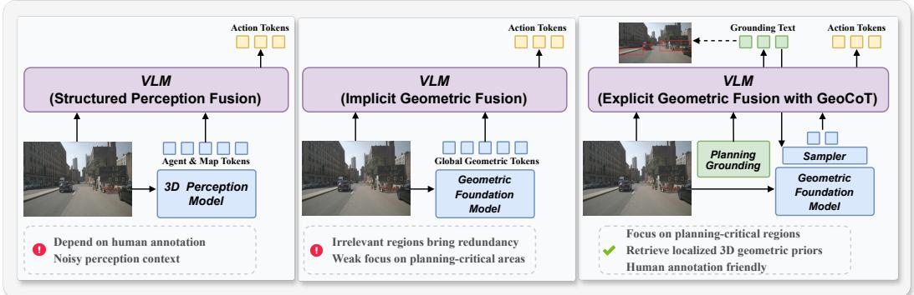
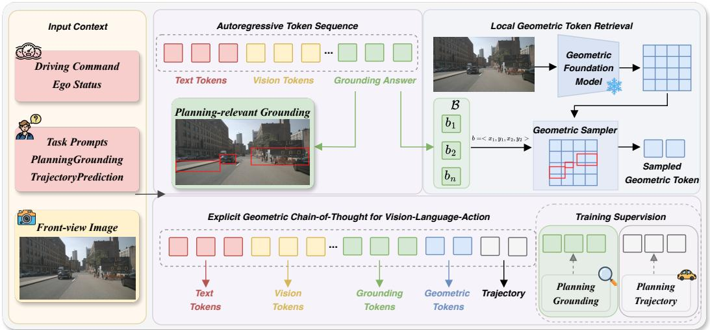
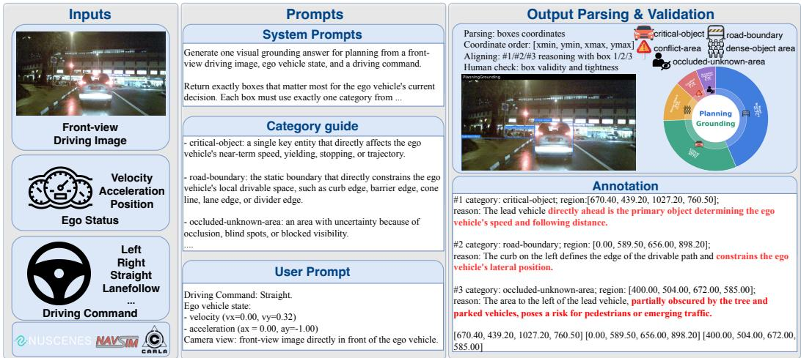
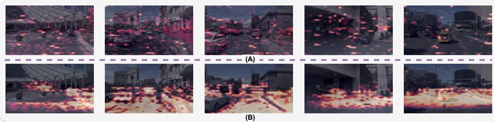
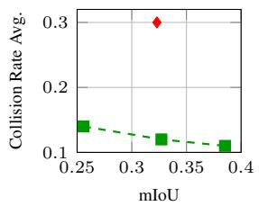
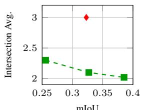
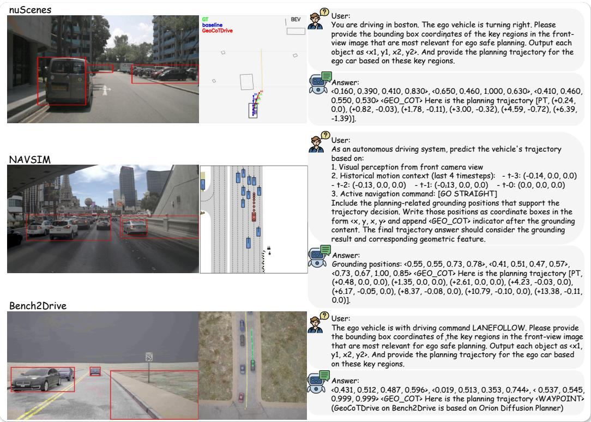
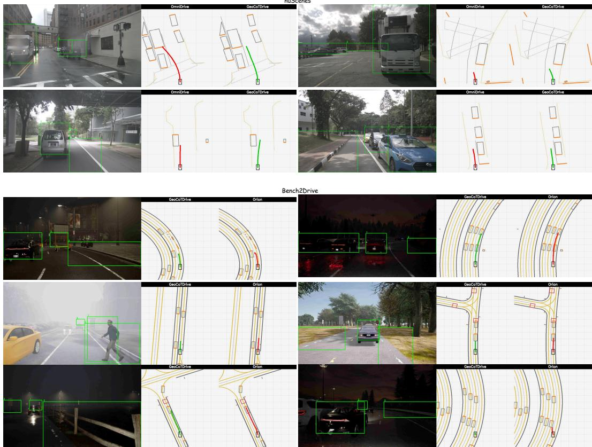
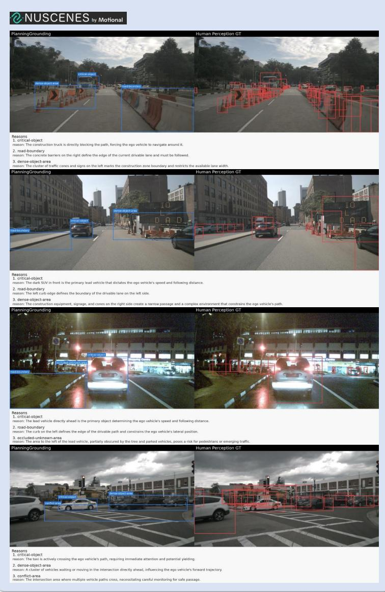
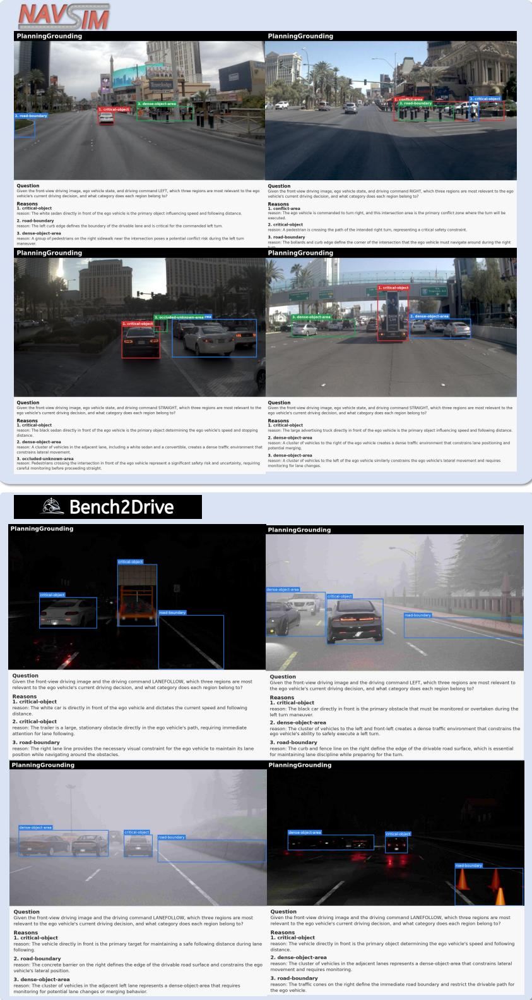

# Explicit Geometric Chain-of-Thought for Vision-Language-Action in Autonomous Driving

Xingtai Gui1 Yucheng Zhou1 Dongqian Guo1 Jiahao Gong2 Feiyang Tan2 Jianbing Shen1∗

1SKL-IOTSC, Department of AI, University of Macau 2Afari Intelligent Drive

## Abstract

Vision-language-action (VLA) models have emerged as a promising paradigm for autonomous driving. However, existing VLA models still suffer from a fundamental mismatch: driving actions require precise 3D geometric cues, while visual-language understanding and reasoning are largely conducted in a 2D semantic space. In this paper, we propose GeoCoTDrive, an explicit geometric chain-of-thought framework that grounds geometry in a planning-oriented manner. GeoCoTDrive follows a “think with 2D first, drive with dedicated 3D priors" paradigm. It first grounds 2D regions corresponding to decision-critical cues, and then retrieves localized 3D priors by sampling features from a geometric foundation model within the grounded regions. These localized geometric features are interleaved into the autoregressive context to support the trajectory generation. To supervise this process, we introduce planning-relevant grounding, a new region-level grounding task that focuses on local spatial cues directly affecting ego planning decisions, and construct the PlanningGrounding dataset to endow VLAs with planning-oriented grounding capability. Experiments across multiple end-to-end autonomous driving benchmarks show that GeoCoTDrive consistently improves safety-critical planning performance, demonstrating the effectiveness of the explicit geometric chain-ofthought process for VLA-based planning. Code is available at https://github. com/TabGuigui/GeoCoTDrive.

## 1 Introduction

Vision-language models (VLMs) have been increasingly adopted in autonomous driving for question answering [67, 19, 46, 49, 44], scene understanding [24, 60, 8, 53, 10], and end-to-end planning [56, 11, 30, 15, 31, 75]. These efforts collectively demonstrate that natural language can provide an effective interface for structured supervision, interpretable decision making, and planning-oriented reasoning. However, a fundamental mismatch remains in VLM-based end-to-end autonomous driving: the target action space is inherently geometric, whereas the intermediate reasoning space of VLMs is largely semantic and lacks explicit geometric cues.

This mismatch becomes especially problematic in scenarios that require fine-grained local spatial reasoning, where planning decisions are governed by localized spatial constraints. Prior works have explored several strategies to mitigate this gap. Perception-based methods[56, 11, 73] introduce 3D structural representations [51, 25, 4] or BEV-style query features [21, 36, 13] to strengthen perception and planning relying on 3D perception supervision such as object detection or online mapping. Another line, motivated by recent advances in spatial intelligence [70, 27, 20], incorporates geometric priors into VLA models, either through explicit geometric inputs [40, 30] or multimodal representation alignment [55, 41]. However, these approaches primarily introduce geometry as global scene-level representations, rather than explicitly local and decision-critical spatial cues that directly govern planning.

  
Figure 1: Comparison of geometry integration paradigms for VLA. (a) Structure-perception fusion injects agent and map tokens. (b) Geometric fusion incorporates global geometric tokens. (c) GeoCoTDrive introduces an explicit geometric chain-of-thought pipeline: VLM first grounds planning-relevant regions, then retrieves localized 3D geometric priors, and finally interleaves the grounding text with geometry tokens to condition trajectory generation.

Unlike prior methods that inject global geometric representations through implicit feature fusion, we propose GeoCoTDrive, an explicit geometric chain-of-thought framework that grounds geometry in a planning-oriented manner. As shown in Fig. 1, GeoCoTDrive follows a “think with 2D first, drive with dedicated 3D priors” paradigm. It first leverages the reasoning capability of VLMs to identify sparse 2D regions corresponding to local decision-critical cues, then retrieves dedicated 3D geometric priors by sampling features from a geometric foundation model within the grounded regions. These geometry tokens are interleaved into the autoregressive context to support the trajectory generation.

To enable explicit planning-oriented geometry grounding, we introduce planning-relevant grounding, a new task for end-to-end planning. Unlike conventional object-level grounding, which is typically built upon human-annotated objects with explicit semantic categories, planning-relevant grounding aims to identify region-level cues that directly affect the ego vehicle’s future behavior. These cues go beyond foreground objects and include lane boundaries, conflict regions, occluded areas, and other local spatial constraints that govern planning. By shifting the grounding target from semantically defined objects to decision-critical regions, this task encourages the model to focus on the regions that are relevant to ego planning. Based on this formulation, we construct a semi-automatic annotation pipeline, yielding PlanningGrounding, a VQA-style grounding dataset containing 146K planningrelevant grounding annotations.

Given a front-view image, a driving command, and the ego status, GeoCoTDrive first autoregressively generates planning-relevant grounding results, localizing 2D regions that capture decision-critical cues. Meanwhile, the same image is encoded by a frozen geometric foundation model to produce dense geometric features. The generated grounding coordinates are then used to sample region-level geometric features, which are projected into the language-token space and interleaved back into the autoregressive context as localized geometry tokens. Conditioned on both the 2D reasoning trace and the retrieved 3D priors, GeoCoTDrive continues autoregressive decoding to output the future ego trajectory. During training, the grounding stage is supervised by PlanningGrounding annotations, while the planning stage is supervised by expert trajectories. During inference, both stages are executed sequentially in the same autoregressive pipeline.

Extensive experiments show that GeoCoTDrive consistently improves performance across multiple end-to-end autonomous driving benchmarks. By explicitly grounding planning-relevant regions and retrieving dedicated local 3D features, GeoCoTDrive enhances both trajectory accuracy and safety-critical planning metrics.

Our main contributions are summarized as follows:

• We propose GeoCoTDrive, an explicit geometric chain-of-thought framework for VLAbased end-to-end autonomous driving. It follows a “think with 2D first, drive with dedicated 3D priors” paradigm to bridge semantic reasoning and planning.

• We formulate planning-relevant grounding, a new region-level grounding task that focuses on local decision-critical cues directly affecting ego planning, and construct PlanningGrounding, a VQA-style grounding dataset with 146K annotations.

• We introduce an autoregressive geometry retrieval mechanism that samples localized 3D features from a geometric foundation model according to predicted grounding regions and interleaves them into the generation context for trajectory prediction.

## 2 Related Work

## 2.1 VLAs for Autonomous Driving

Recent progress in VLMs [38, 1, 6, 63] for autonomous driving has been largely driven by languageannotated driving datasets and dedicated model designs [67, 74, 8, 19]. Early efforts formulate driving scene understanding as visual question answering or instruction following [46, 53, 49, 44, 24, 10, 56, 43, 72, 62, 42]. Building on these language-supervised tasks, recent works extend VLMs toward vision-language-action modeling. Some methods directly formulate planning as autoregressive language generation, where the model predicts high-level decisions or textual future trajectories from multimodal driving inputs [15, 56, 48, 22, 75]. Other methods avoid using language models to generate precise trajectories directly, and leverage VLMs to provide high-level reasoning contexts for dedicated planning modules or action decoders [24, 31, 66, 11, 5, 29].

## 2.2 Spatial-aware VLAs for Autonomous Driving

Spatial awareness is increasingly recognized as a critical capability for VLMs/VLAs when downstream tasks require precise spatial decisions [3, 64, 39, 47]. Recent studies enhance spatial reasoning by incorporating geometric foundation models or geometry-aware representations through explicit geometric inputs [16, 61, 50, 26] or representation alignment [68, 27, 20, 70, 28]. These works validate the effectiveness of geometric priors in improving spatial understanding and action generation.

In autonomous driving, spatial representation is fundamental to scene understanding [10, 49], perception [57, 34, 58], prediction [69, 12, 71], and planning [21, 4, 65]. Recent VLA-based driving methods introduce human-annotated 3D supervision to learn structured scene representations [56, 11, 73, 32]. These 3D-structured representations provide important contextual cues for VLA reasoning and trajectory generation. Meanwhile, emerging methods further integrate geometry priors from pretrained foundation models [17, 54, 45, 37] into VLA-based driving systems. VGGDrive [55] injects cross-view VGGT [54] features into VLM hidden states through a hierarchical adaptive enabler. SpaceDrive [30] converts UniDepth-derived 3D coordinates [45] into universal positional encodings for spatially aware visual and coordinate tokens. LaST-VLA [41] distills geometric priors from VGGT into continuous latent CoT states for physically grounded planning. Despite their effectiveness, these methods primarily introduce global geometry priors without 2D reasoning derivation. In contrast, GeoCoTDrive explicitly constructs a planning-oriented reasoning path from identifying 2D decision-critical regions to retrieving localized 3D geometry.

## 3 Method

## 3.1 Preliminaries

Vision-Language-Action Model. In vision-language-action for autonomous driving, the core objective is to predict future ego trajectories from multimodal driving contexts based on pretrained VLMs. Given visual observations I and language contexts X including driving command, ego status, and textual prompts, the model predicts a future ego trajectory $\tau = \{ ( x _ { t } , \dot { y _ { t } } , h _ { t } ) \} _ { t = 1 } ^ { T }$ where $t \in \{ 1 , \ldots , T \}$ denotes the prediction step within the future horizon, and $\tau _ { t } = ( x _ { t } , y _ { t } , h _ { t } )$ denotes the trajectory state at step t. A driving VLA models the planning distribution as:

$$
P _ { \theta } ( \tau \mid X , I ) = \prod _ { t = 1 } ^ { T } P _ { \theta } ( \tau _ { t } \mid \tau _ { < t } , X , I ) ,\tag{1}
$$

  
Figure 2: Overview of GeoCoTDrive. The model first grounds planning-critical 2D regions, retrieves localized geometry tokens from a geometric foundation model, and then interleaves them into the autoregressive context for trajectory generation.

Geometric Foundation Model. Geometric foundation models provide dense spatial representations learned from large-scale geometry-aware pretraining, offering complementary geometric priors. We instantiate the geometric feature extractor $f _ { \mathrm { g e o } }$ with two foundation models: Depth Anything V3 [37] and VGGT [54]. DepthAnythingV3 provides dense monocular geometry cues with strong robustness across diverse visual conditions, while VGGT offers 3D-aware latent representations learned from large-scale geometric pretraining. We use the intermediate backbone features from these frozen geometry models as geometric priors for geometric chain-of-thought. Specifically, we sample region-level geometric tokens from the feature map $G = f _ { \mathrm { g e o } } ( I )$

## 3.2 GeoCoTDrive

GeoCoTDrive models VLA as an explicit geometric chain-of-thought process. Given the textual prompt X and the front-view image $\dot { I } \in \mathbb { R } ^ { \breve { H } \times W \times 3 }$ , the model first leverages the reasoning ability inherited from pretrained VLMs to generate a set of planning-relevant regions:

$$
B = \{ b _ { i } \} _ { i = 1 } ^ { N } \sim P _ { \theta } ( B \mid X , I ) ,\tag{2}
$$

where each region $b _ { i }$ corresponds to a local decision-critical cue. The generated regions provide an explicit intermediate reasoning trace that specifies where geometry should be retrieved. GeoCoTDrive then samples a set of localized geometric tokens from the dense geometric feature map:

$$
{ \mathcal { Z } } _ { B } = { \mathrm { S a m p l e } } ( G , B ) ,\tag{3}
$$

where G denotes the geometric feature map extracted from the same image. After the grounding output, the geometric tokens are interleaved into the autoregressive context, enabling GeoCoTDrive to continue decoding the trajectory conditioned on both 2D grounding and retrieved 3D priors:

$$
P _ { \theta } ( \tau \mid X , I , \mathcal { B } , \mathcal { Z } _ { \mathcal { B } } ) = \prod _ { t = 1 } ^ { T } P _ { \theta } ( \tau _ { t } \mid \tau _ { < t } , X , I , \mathcal { B } , \mathcal { Z } _ { \mathcal { B } } ) .\tag{4}
$$

Concretely, the grounding output is a set of 2D bounding boxes, where each box is represented by normalized coordinates:

$$
b _ { i } = ( x _ { i } ^ { \operatorname* { m i n } } , y _ { i } ^ { \operatorname* { m i n } } , x _ { i } ^ { \operatorname* { m a x } } , y _ { i } ^ { \operatorname* { m a x } } ) , \quad \quad i = 1 , \dots , N .\tag{5}
$$

Given the dense geometric feature map $G \in \mathbb { R } ^ { H _ { g } \times W _ { g } \times C _ { g } }$ extracted by the geometric foundation model, GeoCoTDrive samples geometric features from each grounding box. A regular grid with K sampling points is constructed inside each box, and bilinear interpolation is applied over G:

$$
\tilde { \mathbf { Z } } _ { i } = \boldsymbol { S } ( G , b _ { i } ) \in \mathbb { R } ^ { K \times C _ { g } } ,\tag{6}
$$

  
Figure 3: Overview of the PlanningGrounding data construction pipeline. The pipeline generates planning-oriented region annotations from driving scenes by identifying decision-critical visual cues. An annotation example and the overall category distribution of the dataset are provided.

where $S ( \cdot )$ denotes the region-based sampler. The resulting $\tilde { \mathbf { Z } } _ { i }$ contains K localized geometric features from the i-th planning-relevant region.

The sampled features are then projected into the LLM space through a lightweight alignment head:

$$
\mathbf { Z } _ { i } = f _ { \mathrm { a l i g n } } ( \tilde { \mathbf { Z } } _ { i } ) \in \mathbb { R } ^ { K \times d } ,\tag{7}
$$

where $f _ { \mathrm { a l i g n } }$ is implemented as a MLP projection head and d is the hidden dimension of the pretrained VLM. The geometry tokens from all grounded regions are concatenated as:

$$
\mathcal { Z } _ { B } = [ \mathbf { Z } _ { 1 } ; \mathbf { Z } _ { 2 } ; \cdot \cdot \cdot ; \mathbf { Z } _ { N } ] \in \mathbb { R } ^ { ( N \times K ) \times d } .\tag{8}
$$

The concatenated geometry tokens $\mathcal { Z } _ { B }$ are interleaved into the autoregressive context after the grounding output. This enables the model to continue generation with explicit access to localized 3D evidence corresponding to the planning-critical regions it has just identified.

## 3.3 Training Objective

GeoCoTDrive is optimized with a standard autoregressive language modeling objective under teacher forcing. For each training sample, we construct a multimodal sequence by placing the grounding response, inserted geometry tokens, and trajectory response within the same autoregressive context. Let $\mathbf { s } = \{ s _ { l } \} _ { l = 1 } ^ { L }$ denote the resulting sequence, the training objective is defined as:

$$
\mathcal { L } _ { \mathrm { A R } } = - \frac { 1 } { \left| \mathcal { M } \right| } \sum _ { l \in \mathcal { M } } \log P _ { \theta } ( s _ { l } \mid s _ { < l } ) ,\tag{9}
$$

where M denotes the set of supervised token positions, including both grounding and trajectory responses. Tokens corresponding to user prompts, image placeholders, and inserted geometry features are masked in the loss function.

## 4 Planning-oriented Grounding Dataset

End-to-end driving requires models to identify not only semantic objects, but also local regions that directly affect ego planning. Conventional object-level grounding is category-driven and may overlook planning-critical spatial cues such as conflict areas, occluded regions, and dense agent clusters. To address this limitation, we formulate planning-relevant grounding, which aims to localize a compact set of decision-critical regions conditioned on the driving scene.

As shown in Fig. 3, each annotation sample is constructed from a front-view driving image, ego status, and a high-level driving command. A planning-oriented prompt is used to guide Gemini-3.1 [52] to identify the regions most relevant to the ego decision and assign each region to a planning-related category. The generated outputs are parsed into bounding boxes and category-reasoning pairs, followed by automatic format validation and human verification to ensure box validity and planning relevance. To cover diverse driving scenarios and benchmark settings, the raw driving data is collected from nuScenes [2], NAVSIM [9], and Bench2Drive [23].

Table 1: Planning results on nuScenes valset. Best and second-best results among VLM/VLA-based methods are highlighted. The result follows the evaluation protocol of OmniDrive [56].
<table><tr><td rowspan="2">Method</td><td colspan="2">Ego Status</td><td colspan="4">L2 (m) ↓</td><td colspan="4">Collision (%) ↓</td><td colspan="4">Intersection (%) ↓</td></tr><tr><td>BEV</td><td>Planner</td><td>1s</td><td>2s</td><td>3s</td><td>Avg.</td><td>1s</td><td>2s</td><td>3s</td><td>Avg.</td><td>1s</td><td>2s</td><td>3s</td><td>Avg.</td></tr><tr><td colspan="10">Traditional / modular paradigm</td><td colspan="7"></td></tr><tr><td>ST-P3[18]</td><td></td><td></td><td>1.59</td><td>2.64</td><td>3.73</td><td>2.65</td><td>0.69</td><td>3.62</td><td>8.39</td><td>4.23</td><td>2.53</td><td>8.17</td><td>14.40</td><td>8.37</td></tr><tr><td>UniAD[21]</td><td>√</td><td>√</td><td>0.20</td><td>0.42</td><td>0.75</td><td>0.46</td><td>0.02</td><td>0.25</td><td>0.84</td><td>0.37</td><td>0.20</td><td>1.33</td><td>3.24</td><td>1.59</td></tr><tr><td>VAD-Base[25]</td><td>√</td><td>√</td><td>0.17</td><td>0.34</td><td>0.60</td><td>0.37</td><td>0.04</td><td>0.27</td><td>0.67</td><td>0.33</td><td>0.21</td><td>2.13</td><td>5.06</td><td>2.47</td></tr><tr><td>AD-MLP[35]</td><td>1</td><td>√</td><td>0.15</td><td>0.32</td><td>0.59</td><td>0.35</td><td>0.00</td><td>0.27</td><td>0.85</td><td>0.37</td><td>0.27</td><td>2.52</td><td>6.60</td><td>2.93</td></tr><tr><td>BEV-Planner++[35]</td><td>√</td><td>√</td><td>0.16</td><td>0.32</td><td>0.57</td><td>0.35</td><td>0.00</td><td>0.29</td><td>0.73</td><td>0.34</td><td>0.35</td><td>2.62</td><td>6.51</td><td>3.16</td></tr><tr><td>UAD[14]</td><td>√</td><td>√</td><td>0.13</td><td>0.28</td><td>0.48</td><td>0.30</td><td>0.00</td><td>0.12</td><td>0.55</td><td>0.22</td><td>0.10</td><td>0.80</td><td>2.38</td><td>1.13</td></tr><tr><td colspan="10">VLM / VLA-based paradigm</td><td colspan="7"></td></tr><tr><td>RDA-Driver[22]</td><td>√</td><td>√</td><td>0.23</td><td>0.73</td><td>1.54</td><td>0.80</td><td>0.00</td><td>0.13</td><td>0.83</td><td>0.32</td><td></td><td></td><td></td><td></td></tr><tr><td>OmniDrive[56]</td><td>√</td><td>√</td><td>0.14</td><td>0.29</td><td>0.55</td><td>0.33</td><td>0.00</td><td>0.13</td><td>0.78</td><td>0.30</td><td>0.56</td><td>2.48</td><td>5.96</td><td>3.00</td></tr><tr><td>ORION[11]</td><td>√</td><td>一</td><td>0.17</td><td>0.31</td><td>0.55</td><td>0.34</td><td>0.05</td><td>0.25</td><td>0.80</td><td>0.37</td><td></td><td></td><td></td><td></td></tr><tr><td>VGGDrive[55]</td><td>1</td><td>√</td><td>0.14</td><td>0.28</td><td>0.51</td><td>0.31</td><td>0.02</td><td>0.10</td><td>0.55</td><td>0.22</td><td>0.63</td><td>2.27</td><td>4.02</td><td>2.31</td></tr><tr><td>LaST-VLA[41]</td><td>一</td><td>√</td><td>0.17</td><td>0.33</td><td>0.64</td><td>0.38</td><td>0.00</td><td>0.11</td><td>0.42</td><td>0.18</td><td></td><td></td><td></td><td></td></tr><tr><td>SpaceDrive[30]</td><td></td><td>√</td><td>0.15</td><td>0.29</td><td>0.51</td><td>0.32</td><td>0.04</td><td>0.18</td><td>0.49</td><td>0.23</td><td>0.22</td><td>0.80</td><td>2.79</td><td>1.27</td></tr><tr><td>GeoCoTDrive</td><td></td><td>√</td><td>0.14</td><td>0.29</td><td>0.53</td><td>0.32</td><td>0.00</td><td>0.07</td><td>0.27</td><td>0.11</td><td>0.37</td><td>1.44</td><td>4.25</td><td>2.02</td></tr></table>

Following this semi-automatic annotation pipeline, we construct PlanningGrounding, a VQA-style grounding dataset with 146K annotations. The annotations cover five planning-related categories: critical-object, road-boundary, conflict-area, occluded-unknown-area, and dense-object-area. The first two categories are closely related to object- and map-centric annotations commonly used in existing driving VLM/VLA datasets [56, 11], and therefore constitute a large proportion of the dataset. Beyond these conventional cues, PlanningGrounding further provides region-level annotations for planning-critical structures, including conflict-area, dense-object-area, and occluded-unknown-area. In addition, 0.6K manually refined samples are provided as the test set of the PlanningGrounding benchmark. For more information about this dataset, please refer to the Appendix.

## 5 Experiments

## 5.1 Experimental setup

Evaluation metrics. We evaluate the end-to-end planning performance on three autonomous driving benchmarks: nuScenes [2], NAVSIM [9] and Bench2Drive [23]. For nuScenes, we report open-loop planning performance using L2 distance error, collision rate, and intersection rate. For NAVSIM, we adopt the Predictive Driver Model Score (PDMS) as the closed-loop planning metric, which consists of five sub-scores: no-at-fault collisions (NC), drivable area compliance (DAC), timeto-collision (TTC), comfort (Comf.), and ego progress (EP). For Bench2Drive, we follow the official closed-loop evaluation protocol and report driving score (DS), success rate (SR). Together, these metrics provide a comprehensive assessment of planning accuracy, safety, comfort, and progress.

For planning-relevant grounding, we further evaluate GeoCoTDrive on the manually refined PlanningGrounding test set, which contains 0.6K samples and measures the model’s ability to localize decision-critical regions before trajectory generation. The grounding performance is evaluated using Recall@N, average precision (AP), and mean intersection-over-union (mIoU).

Training details. GeoCoTDrive is instantiated with different base VLMs across benchmarks to follow the standard configurations of prior baseline methods. For nuScenes and Bench2Drive, we adopt LLaVA-1.5-7B as the base VLM, following OmniDrive [56] and ORION [11]. For NAVSIM, we use Qwen2.5-VL as the base VLM to align with recent VLA-based planning methods [31, 41]. For the trajectory decoder, nuScenes and NAVSIM use autoregressive text decoding, where future trajectory coordinates are generated as language action tokens. On Bench2Drive, we follow the diffusion planner design in ORION [11] to produce executable trajectories. This heterogeneous setup demonstrates that GeoCoTDrive can be integrated with different VLM backbones and trajectorygeneration heads, highlighting its generality across diverse autonomous driving benchmarks.

Table 2: Planning results on NAVSIM navtest split. The result follows the evaluation protocol of official NAVSIMv1[9] with non-reactive simulation.
<table><tr><td rowspan="2">Method</td><td rowspan="2">Base Model</td><td rowspan="2">Sensor</td><td colspan="6">Closed-loop Metrics (↑)</td></tr><tr><td>NC</td><td>DAC</td><td>EP</td><td>TTC</td><td>Comf.</td><td>PDMS</td></tr><tr><td>Traditional / modular paradigm</td><td></td><td></td><td></td><td></td><td></td><td></td><td></td><td></td></tr><tr><td>TransFuser [7]</td><td></td><td>Image+LiDAR</td><td>97.8</td><td>92.6</td><td>78.9</td><td>92.0</td><td>99.9</td><td>83.8</td></tr><tr><td>PARA-Drive [59]</td><td></td><td>Image</td><td>97.9</td><td>92.4</td><td>79.3</td><td>93.0</td><td>99.8</td><td>84.0</td></tr><tr><td>Hydra-MDP [33]</td><td></td><td>Image+LiDAR</td><td>98.3</td><td>96.0</td><td>78.7</td><td>94.6</td><td>100.0</td><td>86.5</td></tr><tr><td>DiffusionDrive [36]</td><td></td><td>Image+LiDAR</td><td>98.2</td><td>96.2</td><td>82.2</td><td>94.7</td><td>100.0</td><td>88.1</td></tr><tr><td colspan="9">VLM / VLA-based paradigm</td></tr><tr><td>Baseline (Qwen)</td><td>Qwen2.5-VL-3B</td><td>Image</td><td>98.0</td><td>94.0</td><td>80.4</td><td>94.4</td><td>99.9</td><td>85.9</td></tr><tr><td>AutoVLA [75]</td><td>Qwen2.5-VL-3B</td><td>Image</td><td>96.9</td><td>92.4</td><td>75.8</td><td>88.1</td><td>99.9</td><td>80.5</td></tr><tr><td>ReCogDrive [31]</td><td>InternVL3-8B</td><td>Image</td><td>98.3</td><td>95.1</td><td>81.1</td><td>94.3</td><td>100.0</td><td>86.8</td></tr><tr><td>LaST-VLA [41]</td><td>InternVL3-8B</td><td>Image</td><td>98.7</td><td>95.4</td><td>80.5</td><td>95.6</td><td>100.0</td><td>87.3</td></tr><tr><td>GeoCoTDrive</td><td>Qwen2.5-VL-3B</td><td>Image</td><td>98.4</td><td>95.6</td><td>81.6</td><td>95.0</td><td>100.0</td><td>87.6</td></tr></table>

Table 4: Grounding results on the PlanningGrounding test set. We report Recall at different IoU thresholds, AP, and mIoU.

Table 3: Closed-loop Planning results on Bench2Drive. Driving Score (DS) and Success Rate (SR) are reported.
<table><tr><td rowspan="2">Method</td><td colspan="2">Closed-loop Metrics (↑)</td></tr><tr><td>DS</td><td>SR</td></tr><tr><td>ORION [11]</td><td>77.74</td><td>54.62</td></tr><tr><td>SpaceDrive [30]</td><td>78.02</td><td>55.11</td></tr><tr><td>GeoCoTDrive</td><td>78.68</td><td>55.42</td></tr></table>

<table><tr><td>Method</td><td>R@0.3↑</td><td>R@0.5↑</td><td>R@0.7↑</td><td>AP↑</td><td>mIoU↑</td></tr><tr><td>LLaVA1.5-7B</td><td>41.39</td><td>24.49</td><td>9.25</td><td>25.04</td><td>27.98</td></tr><tr><td>Qwen2.5-VL-3B</td><td>46.27</td><td>33.86</td><td>9.84</td><td>30.61</td><td>30.46</td></tr><tr><td>OmniDrive</td><td>52.56</td><td>41.03</td><td>10.90</td><td>34.83</td><td>32.30</td></tr><tr><td>GeoCoTDrive</td><td>56.82</td><td>42.73</td><td>21.04</td><td>39.89</td><td>38.93</td></tr></table>

For geometric feature extraction, we evaluate DepthAnythingV3 [37] and VGGT [54], which provide dense depth-aware and 3D-aware feature maps for localized geometry retrieval. The geometric foundation model is kept frozen. GeoCoTDrive is trained in two stages. In Stage I, we update the vision encoder and LLM with full QA training to adapt the VLM to autonomous-driving scenarios. In Stage II, we freeze the vision encoder and optimize the LLM together with the geometric alignment head, enabling localized geometric features to be aligned with the language space and interleaved into the planning context. More training details are provided in the Appendix.

## 5.2 Main results

Planning. Table 1 reports the open-loop planning results on nuScenes. GeoCoTDrive achieves competitive performance among VLA-based methods and shows favorable safety-related performance. Table 2 further evaluates GeoCoTDrive on the NAVSIM navtest set. Compared with the Qwen2.5-VL baseline, GeoCoTDrive achieves a modest PDMS improvement and improves safety-related submetrics. Among recent VLA-based planners, GeoCoTDrive remains competitive despite using a smaller VLM backbone. Table 3 shows that GeoCoTDrive improves over both the perception-centric and the global geometry fusion method with the Bench2Drive closed-loop evaluation.

Grounding. We evaluate grounding performance on the PlanningGrounding test set shown in Table 4. Driving-specialized models outperform general VLM baselines, suggesting that autonomousdriving instruction tuning helps localize planning-relevant cues. GeoCoTDrive achieves the best results across all metrics, with particularly clear gains under stricter IoU thresholds. These improvements indicate that GeoCoTDrive benefits from the PlanningGrounding dataset to localize decision-critical regions more precisely, providing more reliable spatial anchors for localized geometry retrieval and trajectory generation.

Table 5: Ablation study on geometry integration strategies. We compare the vanilla baseline, global geometry fusion, and the proposed GeoCoT.
<table><tr><td rowspan="2">Method</td><td colspan="5">NAVSIM</td><td colspan="3">nuScenes</td></tr><tr><td>NC</td><td>DAC</td><td>TTC</td><td>EP</td><td>PDMS</td><td>L2</td><td>CR</td><td>Intersection</td></tr><tr><td>Baseline</td><td>98.0</td><td>94.0</td><td>94.4</td><td>80.4</td><td>85.9</td><td>0.16 / 0.32 / 0.58</td><td>0.04 / 0.11 / 0.52</td><td>0.64 / 2.46 / 5.31</td></tr><tr><td>Global</td><td>97.9</td><td>94.1</td><td>94.2</td><td>80.2</td><td>85.8</td><td>0.16 / 0.31 / 0.57</td><td>0.02 / 0.17 / 0.56</td><td>0.48 / 2.34 / 4.90</td></tr><tr><td>GeoCoT</td><td>98.4</td><td>95.6</td><td>95.0</td><td>81.6</td><td>87.6</td><td>0.14 / 0.29 / 0.53</td><td>0.00 / 0.07 / 0.27</td><td>0.37 / 1.44 / 4.25</td></tr></table>

  
Figure 4: Visualization of geometry token response with different fusion strategies. (A) Global geometry tokens interleaved (B) GeoCoT retrieved geometric tokens interleaved.

## 5.3 Ablation study

Ablation on geometry integration. Table 5 compares different strategies for incorporating geometric information. Directly interleaving global geometry tokens yields limited gains, suggesting that indiscriminate geometry injection may introduce redundant or weakly relevant spatial cues. In contrast, GeoCoTDrive achieves more consistent improvements by retrieving localized geometric priors from planning-relevant grounded regions. These results indicate that geometry is more effective when conditioned on decision-critical regions, rather than injected as a global auxiliary stream.

We provide a qualitative comparison of geometric responses under different geometry insertion strategies. We calculated the attention output of the action token and geometric token. As shown in Fig. 4 (A), directly inserting global geometry tokens fails to focus on regions that are truly relevant to the driving decision. In contrast, Fig. 4 shows that GeoCoTDrive retrieves geometry tokens from planning-grounded regions and yields responses that are more aligned with decision-critical cues. This visualization further supports the advantage of planning-oriented geometry retrieval over indiscriminate global geometry injection.

Effect of grounding annotation source. Table 6 compares different grounding annotation sources for GeoCoTDrive. Perception labels provide comprehensive human-annotated scene elements, but they are primarily designed for general perception and are not necessarily aligned with planning. In contrast, PlanningGrounding focuses on regions that are directly relevant to driving decisions. The consistent improvements, especially on safety-related metrics, indicate that GeoCoTDrive benefits from localized geometry retrieval guided by planning-relevant grounding.

Effect of grounding quality on downstream planning. We perturb the generated grounding results during Geo-CoT to analyze their impact on planning. As shown in Fig. 5, higher grounding mIoU consistently improves safetyrelated metrics, indicating that accurate planning-relevant grounding retrieves more reliable localized geometry. Although OmniDrive achieves comparable grounding mIoU to an intermediate GeoCoTDrive setting, its downstream safety metrics remain worse, suggesting

  
mIoU  
Figure 5: Effect of grounding quality on downstream driving behavior. Lower values indicate better safety performance. denotes GeoCoTDrive with perturbed grounding quality, and denotes OmniDrive.  
that the gains come from explicitly coupling 2D grounding evidence with localized 3D priors.

Table 6: Comparison of different grounding annotation sources for GeoCoTDrive. “Perception label” uses the human-annotated perception boxes.
<table><tr><td>Method</td><td>L2</td><td>CR</td><td>Intersection</td></tr><tr><td>GeoCoTDrive w/ Perception Label</td><td>0.17 / 0.30 / 0.55</td><td>0.02 / 0.12 / 0.39</td><td>0.50 / 2.20 / 4.98</td></tr><tr><td>GeoCoTDrive w/ PlanningGrounding</td><td>0.14 / 0.29 / 0.53</td><td>0.00 / 0.07 / 0.27</td><td>0.37 / 1.44 / 4.25</td></tr></table>

Table 7: Effect of geometric foundation model. Models are loaded from official checkpoints.
<table><tr><td>Method</td><td>Geometric Model</td><td>NC</td><td>DAC</td><td>TTC</td><td>EP</td><td>PDMS</td></tr><tr><td>Baseline</td><td></td><td>98.0</td><td>94.0</td><td>94.4</td><td>80.4</td><td>85.9</td></tr><tr><td>GeoCoTDrive</td><td>VGGT</td><td>98.3</td><td>95.3</td><td>94.6</td><td>81.7</td><td>87.2</td></tr><tr><td>GeoCoTDrive</td><td>DA3-LARGE</td><td>98.4</td><td>95.6</td><td>95.0</td><td>81.6</td><td>87.6</td></tr></table>

  
Figure 6: Qualitative planning results of GeoCoTDrive on nuScenes, NAVSIM and Bench2Drive.

Effect of geometric foundation model. Table 7 studies the impact of different geometric foundation models. Both VGGT and DA3-LARGE improve over the baseline, suggesting that localized geometry is generally beneficial for planning. DA3-LARGE achieves slightly better overall performance, while VGGT obtains a marginally higher EP. These results indicate that GeoCoTDrive is not tied to a specific geometry backbone and can benefit from diverse pretrained geometric priors.

## 5.4 Qualitative Results

Fig. 6 visualizes the qualitative planning results of GeoCoTDrive on nuScenes, NAVSIM, and Bench2Drive. Compared with the baseline, GeoCoTDrive shows stronger geometry-aware safety behavior. The visualization results across nuScenes, NAVSIM, and Bench2Drive further show that the proposed GeoCoT pipeline is consistently effective under evaluation protocols and driving scenarios. Additional qualitative results are provided in the Appendix.

## 6 Conclusion

We present GeoCoTDrive, an explicit geometric chain-of-thought framework for VLA-based end-to end autonomous driving. GeoCoTDrive first grounds planning-relevant 2D regions, retrieves localized 3D geometric priors from a frozen geometric foundation model, and interleaves these geometry tokens into the autoregressive context for trajectory generation. We further introduce PlanningGrounding, a VQA-style grounding dataset that provides region-level supervision for decision-critical spatial cues. Experiments on nuScenes, NAVSIM, and Bench2Drive demonstrate that GeoCoTDrive improves planning performance, highlighting the importance of coupling planning-oriented 2D reasoning with localized 3D geometric priors for safer autonomous driving.

## References

[1] Jinze Bai, Shuai Bai, Yunfei Chu, Zeyu Cui, Kai Dang, Xiaodong Deng, Yang Fan, Wenbin Ge, Yu Han, Fei Huang, et al. Qwen technical report. arXiv preprint arXiv:2309.16609, 2023.

[2] Holger Caesar, Varun Bankiti, Alex H Lang, Sourabh Vora, Venice Erin Liong, Qiang Xu, Anush Krishnan, Yu Pan, Giancarlo Baldan, and Oscar Beijbom. nuscenes: A multimodal dataset for autonomous driving. In Proceedings of the IEEE/CVF conference on computer vision and pattern recognition, pages 11621–11631, 2020.

[3] Boyuan Chen, Zhuo Xu, Sean Kirmani, Brain Ichter, Dorsa Sadigh, Leonidas Guibas, and Fei Xia. Spatialvlm: Endowing vision-language models with spatial reasoning capabilities. In Proceedings of the IEEE/CVF Conference on Computer Vision and Pattern Recognition, pages 14455–14465, 2024.

[4] Shaoyu Chen, Bo Jiang, Hao Gao, Bencheng Liao, Qing Xu, Qian Zhang, Chang Huang, Wenyu Liu, and Xinggang Wang. Vadv2: End-to-end vectorized autonomous driving via probabilistic planning. arXiv preprint arXiv:2402.13243, 2024.

[5] Xuesong Chen, Linjiang Huang, Tao Ma, Rongyao Fang, Shaoshuai Shi, and Hongsheng Li. Solve: Synergy of language-vision and end-to-end networks for autonomous driving. In Proceedings of the Computer Vision and Pattern Recognition Conference, pages 12068–12077, 2025.

[6] Zhe Chen, Jiannan Wu, Wenhai Wang, Weijie Su, Guo Chen, Sen Xing, Muyan Zhong, Qinglong Zhang, Xizhou Zhu, Lewei Lu, et al. Internvl: Scaling up vision foundation models and aligning for generic visual-linguistic tasks. In Proceedings ofthe IEEE/CVF conference on computer vision and pattern recognition, pages 24185–24198, 2024.

[7] Kashyap Chitta, Aditya Prakash, Bernhard Jaeger, Zehao Yu, Katrin Renz, and Andreas Geiger. Transfuser: Imitation with transformer-based sensor fusion for autonomous driving. IEEE transactions on pattern analysis and machine intelligence, 45(11):12878–12895, 2022.

[8] Yixin Cui, Haotian Lin, Shuo Yang, Yixiao Wang, Yanjun Huang, and Hong Chen. Chain-ofthought for autonomous driving: A comprehensive survey and future prospects. arXiv preprint arXiv:2505.20223, 2025.

[9] Daniel Dauner, Marcel Hallgarten, Tianyu Li, Xinshuo Weng, Zhiyu Huang, Zetong Yang, Hongyang Li, Igor Gilitschenski, Boris Ivanovic, Marco Pavone, et al. Navsim: Data-driven nonreactive autonomous vehicle simulation and benchmarking. Advances in Neural Information Processing Systems, 37:28706–28719, 2024.

[10] Xinpeng Ding, Jianhua Han, Hang Xu, Xiaodan Liang, Wei Zhang, and Xiaomeng Li. Holistic autonomous driving understanding by bird’s-eye-view injected multi-modal large models. In Proceedings of the IEEE/CVF Conference on Computer Vision and Pattern Recognition, pages 13668–13677, 2024.

[11] Haoyu Fu, Diankun Zhang, Zongchuang Zhao, Jianfeng Cui, Dingkang Liang, Chong Zhang, Dingyuan Zhang, Hongwei Xie, Bing Wang, and Xiang Bai. Orion: A holistic end-to-end autonomous driving framework by vision-language instructed action generation. In Proceedings ofthe IEEE/CVF International Conference on Computer Vision, pages 24823–24834, 2025.

[12] Xingtai Gui, Tengteng Huang, Haonan Shao, Haotian Yao, and Chi Zhang. Fiptr: A simple yet effective transformer framework for future instance prediction in autonomous driving. In European conference on computer vision, pages 19–35. Springer, 2024.

[13] Xingtai Gui, Jianbo Zhao, Wencheng Han, Jikai Wang, Jiahao Gong, Feiyang Tan, Cheng-zhong Xu, and Jianbing Shen. Trajdiff: End-to-end autonomous driving without perception annotation. arXiv preprint arXiv:2512.00723, 2025.

[14] Mingzhe Guo, Zhipeng Zhang, Yuan He, Ke Wang, Liping Jing, and Haibin Ling. Endto-end autonomous driving without costly modularization and 3d manual annotation. IEEE Transactions on Pattern Analysis and Machine Intelligence, 2025.

[15] Wencheng Han, Dongqian Guo, Cheng-Zhong Xu, and Jianbing Shen. Dme-driver: Integrating human decision logic and 3d scene perception in autonomous driving. In Proceedings of the AAAI Conference on Artificial Intelligence, volume 39, pages 3347–3355, 2025.

[16] Yining Hong, Haoyu Zhen, Peihao Chen, Shuhong Zheng, Yilun Du, Zhenfang Chen, and Chuang Gan. 3d-llm: Injecting the 3d world into large language models. Advances in Neural Information Processing Systems, 36:20482–20494, 2023.

[17] Mu Hu, Wei Yin, Chi Zhang, Zhipeng Cai, Xiaoxiao Long, Hao Chen, Kaixuan Wang, Gang Yu, Chunhua Shen, and Shaojie Shen. Metric3d v2: A versatile monocular geometric foundation model for zero-shot metric depth and surface normal estimation. IEEE Transactions on Pattern Analysis and Machine Intelligence, 46(12):10579–10596, 2024.

[18] Shengchao Hu, Li Chen, Penghao Wu, Hongyang Li, Junchi Yan, and Dacheng Tao. St-p3: End-to-end vision-based autonomous driving via spatial-temporal feature learning. In European Conference on Computer Vision, pages 533–549. Springer, 2022.

[19] Tianshuai Hu, Xiaolu Liu, Song Wang, Yiyao Zhu, Ao Liang, Lingdong Kong, Guoyang Zhao, Zeying Gong, Jun Cen, Zhiyu Huang, et al. Vision-language-action models for autonomous driving: Past, present, and future. arXiv preprint arXiv:2512.16760, 2025.

[20] Wenbo Hu, Jingli Lin, Yilin Long, Yunlong Ran, Lihan Jiang, Yifan Wang, Chenming Zhu, Runsen Xu, Tai Wang, and Jiangmiao Pang. G2vlm: Geometry grounded vision language model with unified 3d reconstruction and spatial reasoning. arXiv preprint arXiv:2511.21688, 2025.

[21] Yihan Hu, Jiazhi Yang, Li Chen, Keyu Li, Chonghao Sima, Xizhou Zhu, Siqi Chai, Senyao Du, Tianwei Lin, Wenhai Wang, et al. Planning-oriented autonomous driving. In Proceedings of the IEEE/CVF conference on computer vision and pattern recognition, pages 17853–17862, 2023.

[22] Zhijian Huang, Tao Tang, Shaoxiang Chen, Sihao Lin, Zequn Jie, Lin Ma, Guangrun Wang, and Xiaodan Liang. Making large language models better planners with reasoning-decision alignment. In European Conference on Computer Vision, pages 73–90. Springer, 2024.

[23] Xiaosong Jia, Zhenjie Yang, Qifeng Li, Zhiyuan Zhang, and Junchi Yan. Bench2drive: Towards multi-ability benchmarking of closed-loop end-to-end autonomous driving. Advances in Neural Information Processing Systems, 37:819–844, 2024.

[24] Bo Jiang, Shaoyu Chen, Bencheng Liao, Xingyu Zhang, Wei Yin, Qian Zhang, Chang Huang, Wenyu Liu, and Xinggang Wang. Senna: Bridging large vision-language models and end-to-end autonomous driving. arXiv preprint arXiv:2410.22313, 2024.

[25] Bo Jiang, Shaoyu Chen, Qing Xu, Bencheng Liao, Jiajie Chen, Helong Zhou, Qian Zhang, Wenyu Liu, Chang Huang, and Xinggang Wang. Vad: Vectorized scene representation for efficient autonomous driving. In Proceedings of the IEEE/CVF International Conference on Computer Vision, pages 8340–8350, 2023.

[26] Chengmeng Li, Junjie Wen, Yaxin Peng, Yan Peng, and Yichen Zhu. Pointvla: Injecting the 3d world into vision-language-action models. IEEE Robotics and Automation Letters, 11(3):2506–2513, 2026.

[27] Fuhao Li, Wenxuan Song, Han Zhao, Jingbo Wang, Pengxiang Ding, Donglin Wang, Long Zeng, and Haoang Li. Spatial forcing: Implicit spatial representation alignment for visionlanguage-action model. arXiv preprint arXiv:2510.12276, 2025.

[28] Haoyuan Li, Qihang Cao, Tao Tang, Kun Xiang, Zihan Guo, Jianhua Han, Hang Xu, and Xiaodan Liang. Thinking with geometry: Active geometry integration for spatial reasoning. arXiv preprint arXiv:2602.06037, 2026.

[29] Jingyu Li, Junjie Wu, Dongnan Hu, Xiangkai Huang, Bin Sun, Zhihui Hao, Xianpeng Lang, Xiatian Zhu, and Li Zhang. Sgdrive: Scene-to-goal hierarchical world cognition for autonomous driving. arXiv preprint arXiv:2601.05640, 2026.

[30] Peizheng Li, Zhenghao Zhang, David Holtz, Hang Yu, Yutong Yang, Yuzhi Lai, Rui Song, Andreas Geiger, and Andreas Zell. Spacedrive: Infusing spatial awareness into vlm-based autonomous driving. arXiv preprint arXiv:2512.10719, 2, 2025.

[31] Yongkang Li, Kaixin Xiong, Xiangyu Guo, Fang Li, Sixu Yan, Gangwei Xu, Lijun Zhou, Long Chen, Haiyang Sun, Bing Wang, et al. Recogdrive: A reinforced cognitive framework for end-to-end autonomous driving. arXiv preprint arXiv:2506.08052, 2025.

[32] Yongkang Li, Lijun Zhou, Sixu Yan, Bencheng Liao, Tianyi Yan, Kaixin Xiong, Long Chen, Hongwei Xie, Bing Wang, Guang Chen, et al. Unidrivevla: Unifying understanding, perception, and action planning for autonomous driving. arXiv preprint arXiv:2604.02190, 2026.

[33] Zhenxin Li, Kailin Li, Shihao Wang, Shiyi Lan, Zhiding Yu, Yishen Ji, Zhiqi Li, Ziyue Zhu, Jan Kautz, Zuxuan Wu, et al. Hydra-mdp: End-to-end multimodal planning with multi-target hydra-distillation. arXiv preprint arXiv:2406.06978, 2024.

[34] Zhiqi Li, Wenhai Wang, Hongyang Li, Enze Xie, Chonghao Sima, Tong Lu, Qiao Yu, and Jifeng Dai. Bevformer: learning bird’s-eye-view representation from lidar-camera via spatiotemporal transformers. IEEE Transactions on Pattern Analysis and Machine Intelligence, 47(3):2020– 2036, 2024.

[35] Zhiqi Li, Zhiding Yu, Shiyi Lan, Jiahan Li, Jan Kautz, Tong Lu, and Jose M Alvarez. Is ego status all you need for open-loop end-to-end autonomous driving? In Proceedings of the IEEE/CVF Conference on Computer Vision and Pattern Recognition, pages 14864–14873, 2024.

[36] Bencheng Liao, Shaoyu Chen, Haoran Yin, Bo Jiang, Cheng Wang, Sixu Yan, Xinbang Zhang, Xiangyu Li, Ying Zhang, Qian Zhang, et al. Diffusiondrive: Truncated diffusion model for end-to-end autonomous driving. In Proceedings ofthe Computer Vision and Pattern Recognition Conference, pages 12037–12047, 2025.

[37] Haotong Lin, Sili Chen, Junhao Liew, Donny Y Chen, Zhenyu Li, Guang Shi, Jiashi Feng, and Bingyi Kang. Depth anything 3: Recovering the visual space from any views. arXiv preprint arXiv:2511.10647, 2025.

[38] Haotian Liu, Chunyuan Li, Qingyang Wu, and Yong Jae Lee. Visual instruction tuning. Advances in neural information processing systems, 36:34892–34916, 2023.

[39] Weichen Liu, Qiyao Xue, Haoming Wang, Xiangyu Yin, Boyuan Yang, and Wei Gao. Spatial reasoning in multimodal large language models: A survey of tasks, benchmarks and methods. arXiv preprint arXiv:2511.15722, 2025.

[40] Zhe Liu, Runhui Huang, Rui Yang, Siming Yan, Zining Wang, Lu Hou, Di Lin, Xiang Bai, and Hengshuang Zhao. Drivepi: Spatial-aware 4d mllm for unified autonomous driving understanding, perception, prediction and planning. arXiv preprint arXiv:2512.12799, 2025.

[41] Yuechen Luo, Fang Li, Shaoqing Xu, Yang Ji, Zehan Zhang, Bing Wang, Yuannan Shen, Jianwei Cui, Long Chen, Guang Chen, et al. Last-vla: Thinking in latent spatio-temporal space for vision-language-action in autonomous driving. arXiv preprint arXiv:2603.01928, 2026.

[42] Yuechen Luo, Fang Li, Shaoqing Xu, Zhiyi Lai, Lei Yang, Qimao Chen, Ziang Luo, Zixun Xie, Shengyin Jiang, Jiaxin Liu, et al. Adathinkdrive: Adaptive thinking via reinforcement learning for autonomous driving. arXiv preprint arXiv:2509.13769, 2025.

[43] Yingzi Ma, Yulong Cao, Jiachen Sun, Marco Pavone, and Chaowei Xiao. Dolphins: Multimodal language model for driving. In European Conference on Computer Vision, pages 403–420. Springer, 2024.

[44] Ana-Maria Marcu, Long Chen, Jan Hünermann, Alice Karnsund, Benoit Hanotte, Prajwal Chidananda, Saurabh Nair, Vijay Badrinarayanan, Alex Kendall, Jamie Shotton, et al. Lingoqa: Visual question answering for autonomous driving. In European Conference on Computer Vision, pages 252–269. Springer, 2024.

[45] Luigi Piccinelli, Christos Sakaridis, Yung-Hsu Yang, Mattia Segu, Siyuan Li, Wim Abbeloos, and Luc Van Gool. Unidepthv2: Universal monocular metric depth estimation made simpler. IEEE Transactions on Pattern Analysis and Machine Intelligence, 2025.

[46] Tianwen Qian, Jingjing Chen, Linhai Zhuo, Yang Jiao, and Yu-Gang Jiang. Nuscenes-qa: A multi-modal visual question answering benchmark for autonomous driving scenario. In Proceedings ofthe AAAI Conference on Artificial Intelligence, volume 38, pages 4542–4550, 2024.

[47] Delin Qu, Haoming Song, Qizhi Chen, Yuanqi Yao, Xinyi Ye, Yan Ding, Zhigang Wang, JiaYuan Gu, Bin Zhao, Dong Wang, et al. Spatialvla: Exploring spatial representations for visual-language-action model. arXiv preprint arXiv:2501.15830, 2025.

[48] Hao Shao, Yuxuan Hu, Letian Wang, Guanglu Song, Steven L Waslander, Yu Liu, and Hongsheng Li. Lmdrive: Closed-loop end-to-end driving with large language models. In Proceedings ofthe IEEE/CVF conference on computer vision and pattern recognition, pages 15120–15130, 2024.

[49] Chonghao Sima, Katrin Renz, Kashyap Chitta, Li Chen, Hanxue Zhang, Chengen Xie, Jens Beißwenger, Ping Luo, Andreas Geiger, and Hongyang Li. Drivelm: Driving with graph visual question answering. In European conference on computer vision, pages 256–274. Springer, 2024.

[50] Lin Sun, Bin Xie, Yingfei Liu, Hao Shi, Tiancai Wang, and Jiale Cao. Geovla: Empowering 3d representations in vision-language-action models. arXiv preprint arXiv:2508.09071, 2025.

[51] Wenchao Sun, Xuewu Lin, Yining Shi, Chuang Zhang, Haoran Wu, and Sifa Zheng. Sparsedrive: End-to-end autonomous driving via sparse scene representation. In 2025 IEEE International Conference on Robotics and Automation (ICRA), pages 8795–8801. IEEE, 2025.

[52] Gemini Team, Rohan Anil, Sebastian Borgeaud, Jean-Baptiste Alayrac, Jiahui Yu, Radu Soricut, Johan Schalkwyk, Andrew M Dai, Anja Hauth, Katie Millican, et al. Gemini: a family of highly capable multimodal models. arXiv preprint arXiv:2312.11805, 2023.

[53] Kexin Tian, Jingrui Mao, Yunlong Zhang, Jiwan Jiang, Yang Zhou, and Zhengzhong Tu. Nuscenes-spatialqa: A spatial understanding and reasoning benchmark for vision-language models in autonomous driving. In Proceedings of the IEEE/CVF International Conference on Computer Vision, pages 4567–4576, 2025.

[54] Jianyuan Wang, Minghao Chen, Nikita Karaev, Andrea Vedaldi, Christian Rupprecht, and David Novotny. Vggt: Visual geometry grounded transformer. In Proceedings of the Computer Vision and Pattern Recognition Conference, pages 5294–5306, 2025.

[55] Jie Wang, Guang Li, Zhijian Huang, Chenxu Dang, Hangjun Ye, Yahong Han, and Long Chen. Vggdrive: Empowering vision-language models with cross-view geometric grounding for autonomous driving. arXiv preprint arXiv:2602.20794, 2026.

[56] Shihao Wang, Zhiding Yu, Xiaohui Jiang, Shiyi Lan, Min Shi, Nadine Chang, Jan Kautz, Ying Li, and Jose M Alvarez. Omnidrive: A holistic vision-language dataset for autonomous driving with counterfactual reasoning. In Proceedings of the computer vision and pattern recognition conference, pages 22442–22452, 2025.

[57] Yue Wang, Vitor Campagnolo Guizilini, Tianyuan Zhang, Yilun Wang, Hang Zhao, and Justin Solomon. Detr3d: 3d object detection from multi-view images via 3d-to-2d queries. In Conference on robot learning, pages 180–191. PMLR, 2022.

[58] Yi Wei, Linqing Zhao, Wenzhao Zheng, Zheng Zhu, Jie Zhou, and Jiwen Lu. Surroundocc: Multi-camera 3d occupancy prediction for autonomous driving. In Proceedings ofthe IEEE/CVF International Conference on Computer Vision, pages 21729–21740, 2023.

[59] Xinshuo Weng, Boris Ivanovic, Yan Wang, Yue Wang, and Marco Pavone. Para-drive: Parallelized architecture for real-time autonomous driving. In Proceedings of the IEEE/CVF Conference on Computer Vision and Pattern Recognition, pages 15449–15458, 2024.

[60] Shaoyuan Xie, Lingdong Kong, Yuhao Dong, Chonghao Sima, Wenwei Zhang, Qi Alfred Chen, Ziwei Liu, and Liang Pan. Are vlms ready for autonomous driving? an empirical study from the reliability, data and metric perspectives. In Proceedings of the IEEE/CVF International Conference on Computer Vision, pages 6585–6597, 2025.

[61] Runsen Xu, Xiaolong Wang, Tai Wang, Yilun Chen, Jiangmiao Pang, and Dahua Lin. Pointllm: Empowering large language models to understand point clouds. In European Conference on Computer Vision, pages 131–147. Springer, 2024.

[62] Zhenhua Xu, Yujia Zhang, Enze Xie, Zhen Zhao, Yong Guo, Kwan-Yee K Wong, Zhenguo Li, and Hengshuang Zhao. Drivegpt4: Interpretable end-to-end autonomous driving via large language model. IEEE Robotics and Automation Letters, 9(10):8186–8193, 2024.

[63] An Yang, Anfeng Li, Baosong Yang, Beichen Zhang, Binyuan Hui, Bo Zheng, Bowen Yu, Chang Gao, Chengen Huang, Chenxu Lv, et al. Qwen3 technical report. arXiv preprint arXiv:2505.09388, 2025.

[64] Jihan Yang, Shusheng Yang, Anjali W Gupta, Rilyn Han, Li Fei-Fei, and Saining Xie. Thinking in space: How multimodal large language models see, remember, and recall spaces. In Proceedings of the Computer Vision and Pattern Recognition Conference, pages 10632–10643, 2025.

[65] Yu Yang, Jianbiao Mei, Yukai Ma, Siliang Du, Wenqing Chen, Yijie Qian, Yuxiang Feng, and Yong Liu. Driving in the occupancy world: Vision-centric 4d occupancy forecasting and planning via world models for autonomous driving. In Proceedings ofthe AAAI Conference on Artificial Intelligence, volume 39, pages 9327–9335, 2025.

[66] Zhenjie Yang, Yilin Chai, Xiaosong Jia, Qifeng Li, Yuqian Shao, Xuekai Zhu, Haisheng Su, and Junchi Yan. Drivemoe: Mixture-of-experts for vision-language-action model in end-to-end autonomous driving. arXiv preprint arXiv:2505.16278, 2025.

[67] Zhenjie Yang, Xiaosong Jia, Hongyang Li, and Junchi Yan. Llm4drive: A survey of large language models for autonomous driving. arXiv preprint arXiv:2311.01043, 2023.

[68] Tianyuan Yuan, Yicheng Liu, Chenhao Lu, Zhuoguang Chen, Tao Jiang, and Hang Zhao. Depthvla: Enhancing vision-language-action models with depth-aware spatial reasoning. arXiv preprint arXiv:2510.13375, 2025.

[69] Yunpeng Zhang, Zheng Zhu, Wenzhao Zheng, Junjie Huang, Guan Huang, Jie Zhou, and Jiwen Lu. Beverse: Unified perception and prediction in birds-eye-view for vision-centric autonomous driving. arXiv preprint arXiv:2205.09743, 2022.

[70] Duo Zheng, Shijia Huang, Yanyang Li, and Liwei Wang. Learning from videos for 3d world: Enhancing mllms with 3d vision geometry priors. arXiv preprint arXiv:2505.24625, 2025.

[71] Wenzhao Zheng, Weiliang Chen, Yuanhui Huang, Borui Zhang, Yueqi Duan, and Jiwen Lu. Occworld: Learning a 3d occupancy world model for autonomous driving. In European conference on computer vision, pages 55–72. Springer, 2024.

[72] Xin Zhou, Dingkang Liang, Sifan Tu, Xiwu Chen, Yikang Ding, Dingyuan Zhang, Feiyang Tan, Hengshuang Zhao, and Xiang Bai. Hermes: A unified self-driving world model for simultaneous 3d scene understanding and generation. In Proceedings of the IEEE/CVF International Conference on Computer Vision, pages 27817–27827, 2025.

[73] Xingcheng Zhou, Xuyuan Han, Feng Yang, Yunpu Ma, and Alois C Knoll. Opendrivevla: Towards end-to-end autonomous driving with large vision language action model. arXiv preprint arXiv:2503.23463, 2025.

[74] Xingcheng Zhou, Mingyu Liu, Ekim Yurtsever, Bare Luka Zagar, Walter Zimmer, Hu Cao, and Alois C Knoll. Vision language models in autonomous driving: A survey and outlook. IEEE Transactions on Intelligent Vehicles, 2024.

[75] Zewei Zhou, Tianhui Cai, Seth Z Zhao, Yun Zhang, Zhiyu Huang, Bolei Zhou, and Jiaqi Ma. Autovla: A vision-language-action model for end-to-end autonomous driving with adaptive reasoning and reinforcement fine-tuning. arXiv preprint arXiv:2506.13757, 2025.

## Appendix

The Appendix is organized as follows:

• Sec. A: comparison with existing driving VQA datasets on grounding supervision.

• Sec. B: detailed analysis of the proposed PlanningGrounding dataset.

• Sec. C: detailed training and inference implementation of GeoCoTDrive.

• Sec. D: more ablation studies.

• Sec. E: more qualitative results.

• Sec. F: limitations of GeoCoTDrive.

## A Autonomous Driving VQA

Table 8: Comparison with existing driving VQA datasets on grounding supervision.
<table><tr><td>Dataset</td><td>Main supervision</td><td>Grounding granularity</td></tr><tr><td>NuScenes-QA [46]</td><td>Template-based VQA from structured scene graphs.</td><td>Object-level attributes and rela- tions derived from 3D detection an- notations.</td></tr><tr><td>DriveLM [49]</td><td>Graph Visual Question Answering for percep- tion, prediction, planning, behavior, and mo- tion.</td><td>Object-level graph nodes and interaction-level reasoning.</td></tr><tr><td>LingoQA [44]</td><td>Video-based driving QA with natural-language answers and explanations.</td><td>Mainly language-level supervision without explicit box-level ground- ing.</td></tr><tr><td>OmniDrive [56]</td><td>Counterfactual QA using simulated trajecto- ries, expert trajectories, 3D objects, and map elements.</td><td>3D object/map-centric detection and trajectory-level consequence reasoning.</td></tr><tr><td>PlanningGrounding</td><td>Command-conditioned grounding of planning- relevant visual regions.</td><td>Region-level 2D boxes cover- ing objects, boundaries, conflict zones, occlusions, and dense ob- ject groups.</td></tr></table>

Recent autonomous-driving VQA datasets have significantly advanced language-based scene understanding, reasoning, and planning. However, the grounding supervision of these datasets is usually designed around object-level perception annotations, rather than explicit region-level cues related to the ego vehicle’s planning demand. We summarize the main differences in Table 8.

Unlike conventional object-centric grounding, PlanningGrounding is designed to identify the regions that most directly affect the ego vehicle’s planning decision. This distinction is important because the planning decisions are often constrained not only by individual traffic participants, but also by local road boundaries, conflict driving zones, or uncertain regions. Therefore, PlanningGrounding complements existing driving VQA resources by providing explicit, command-aware grounding supervision for planning-oriented reasoning.

## B Analysis of PlanningGrounding

PlanningGrounding is constructed to supervise explicit planning-oriented visual grounding. Given a front-view driving image, driving command, and optional ego status, the task is to localize the most decision-critical regions that affect the planning decision. Each grounding region is assigned one of five categories: critical-object, road-boundary, conflict-area, occluded-unknown-area, and dense-object-area. These categories cover both object-level and region-level spatial cues required for safe trajectory generation.

• Critical object denotes a single key entity that directly affects the ego vehicle’s near-term speed, yielding behavior, stopping decision, or trajectory selection. Typical examples include a leading vehicle requiring deceleration, a pedestrian near the ego path, a cyclist around the turning area, a traffic cone blocking the lane, or a traffic light/sign that immediately constrains the maneuver. An object is annotated as critical only when its influence is directly tied to the current command and local planning decision.

• Road boundary refers to an immediate static boundary that constrains the ego vehicle’s local drivable space. This category includes lane edges, curbs, barriers, dividers, cone lines, road edges, and other visible structures that define the lateral feasible region.

• Conflict area denotes a compact local region where the ego vehicle’s intended path may interact with other traffic flows or potential agent motions, such as a merge point, crossing zone, or turn conflict entrance. Unlike critical object, this category describes a spatial zone rather than a single entity, encouraging the model to reason about where potential interactions may occur.

• Occluded unknown area denotes a region with meaningful uncertainty caused by occlusion, blind spots, or blocked visibility. Such regions commonly appear behind parked vehicles, large trucks, roadside buildings, vegetation, or sharp turns. Although no explicit object may be visible, these regions can still require conservative planning, such as slowing down before entering a blind spot or preparing to yield.

• Dense object area represents a compact cluster of objects whose collective presence affects planning. Examples include a group of pedestrians, a queue of vehicles, a cluster of cones, or multiple parked vehicles narrowing the drivable corridor. This category is used when the planning-relevant cue is better represented by a region containing multiple nearby entities rather than by a single object.

The above categories are not intended to provide exhaustive perception labels. Instead, they define a sparse set of command-relevant regions that directly influence near-term planning. Unlike generic object detection or visual grounding, PlanningGrounding selects annotation targets according to planning relevance, covering not only salient objects but also road boundaries, conflict zones, occluded areas, and dense object regions that constrain safe trajectory generation.

Table 9: Dataset composition of PlanningGrounding. The table summarizes the number of grounding QA samples from each source dataset and the distribution of five planning-oriented grounding categories. “K” denotes thousands of samples.
<table><tr><td rowspan="2">Source Dataset # Samples</td><td rowspan="2"></td><td colspan="5">Category Distribution (%)</td></tr><tr><td>Critical Object</td><td>Road Boundary</td><td>Conflict</td><td>Occluded Unknown</td><td>Dense Object</td></tr><tr><td>nuScenes</td><td>28K</td><td>30.68</td><td>43.65</td><td>7.05</td><td>6.14</td><td>12.45</td></tr><tr><td>NAVSIM</td><td>102K</td><td>34.47</td><td>34.05</td><td>6.86</td><td>3.99</td><td>20.60</td></tr><tr><td>Bench2Drive</td><td>16K</td><td>38.31</td><td>47.16</td><td>2.99</td><td>3.48</td><td>8.05</td></tr><tr><td>Total</td><td>146K</td><td>34.16</td><td>37.33</td><td>6.47</td><td>4.35</td><td>17.66</td></tr></table>

Table 9 summarizes the source composition and category distribution of PlanningGrounding. Considering the diversity of driving scenarios, data sources, and evaluation protocols, PlanningGrounding is constructed from three widely studied autonomous-driving planning benchmarks: nuScenes, NAVSIM, and Bench2Drive. This combination enables PlanningGrounding to cover a broad range of planning-relevant cues.

In Fig. 8, we show examples from PlanningGrounding-nuScenes and compare the original humanannotated perception labels with our planning-relevant grounding annotations. Fig. 9 further provides examples from PlanningGrounding-NAVSIM and PlanningGrounding-Bench2Drive.

## C Implementation Details

VLM backbone. GeoCoTDrive adopts different VLM backbones according to the benchmark setting. For nuScenes and Bench2Drive, LLaVA-1.5-7B is used as the base VLM, while Qwen2.5-

Table 10: Two-stage training structure of GeoCoTDrive. Stage-I adapts the vision-language backbone to autonomous-driving QA and planning knowledge, while Stage-II trains GeoCoT planning.
<table><tr><td>Stage</td><td>Trainable Modules</td><td>Objective</td><td>Epochs</td><td>Peak LR</td></tr><tr><td>Stage-I</td><td> $\mathrm { V i s i o n + L L M }$ </td><td>Full QA training</td><td>3</td><td> $4 \times 1 0 ^ { - 5 }$ </td></tr><tr><td>Stage-II</td><td>LLM + Geometric Aligner</td><td>GeoCoT</td><td>3</td><td> $2 \times 1 0 ^ { - 5 }$ </td></tr></table>

Table 11: Ablation on the sampling grid size for localized geometry retrieval. The grid size denotes the number of sampled geometric features within each grounded region.
<table><tr><td>Grid Size</td><td>Geo. Tokens</td><td>NC</td><td>DAC</td><td>TTC</td><td>PDMS</td></tr><tr><td>1 × 1</td><td>1</td><td>98.2</td><td>94.6</td><td>94.5</td><td>86.4</td></tr><tr><td>2 × 2</td><td>4</td><td>98.3</td><td>95.1</td><td>94.6</td><td>87.0</td></tr><tr><td>4× 4</td><td>16</td><td>98.5</td><td>95.4</td><td>95.0</td><td>87.3</td></tr><tr><td>5×5</td><td>25</td><td>98.5</td><td>95.4</td><td>95.0</td><td>87.3</td></tr></table>

VL-3B is used for NAVSIM. Across all settings, the model takes the front-view image, ego status, and high-level navigation command as input, and autoregressively generates planning-relevant grounding results followed by the planning answer.

Geometric foundation model. Two geometric foundation models are used to extract geometric priors: Depth Anything V3 with the METRIC-LARGE configuration and the vanilla version of VGGT. Both models are kept frozen. For each model, the feature map from the last backbone layer is used as the source of geometric tokens. Given a grounding region, localized geometric features are sampled from this feature map and projected into the language embedding space.

Two-stage training. The training process contains two stages. The first stage performs full QA training to adapt the VLM to autonomous-driving knowledge. Specifically, nuScenes uses OmniDrive together with PlanningGrounding, NAVSIM uses NAVSIM-Traj together with PlanningGrounding, and Bench2Drive uses B2D-Chat together with PlanningGrounding. In this stage, both the vision encoder and the LLM are updated, allowing the model to acquire driving-related visual understanding and planning knowledge. The model is trained for 3 epochs with a cosine learning-rate scheduler, where the peak learning rate is set to $4 \times 1 0 ^ { - 5 }$

The second stage performs geometry-interleaved planning training. Planning answers and grounding annotations are merged into a single-turn conversation, where the model is required to first generate planning-relevant grounding results and then predict the planning trajectory. A special token <GEO\_COT> is inserted after the grounding output as a placeholder for geometric reasoning. During training, the ground-truth grounding boxes are used as the sampler input to retrieve localized geomet ric features. The sampled geometric tokens are then interleaved into the autoregressive sequence at the <GEO\_COT> position, enabling subsequent trajectory prediction to condition on localized 3D priors. This stage is also trained for 3 epochs with a cosine learning-rate scheduler, where the peak learning rate is set to $2 \times 1 0 ^ { - 5 }$ . For the Bench2Drive benchmark, we follow the planner implementation of ORION. We remove the detection and mapping head, and use the VLM tokens and localized geometric tokens from the front-view image as conditions for the planner. All experiments are conducted with 8 A800 GPUs.

Inference. The inference process follows the same question format as training. The model first autoregressively generates grounding results. Once the <GEO\_COT> token is generated, the predicted grounding boxes are parsed and used to sample localized geometric features from the geometric foundation model. These resulting geometric tokens are interleaved into the context, after which the model continues autoregressive decoding to generate the final trajectory prediction.

## D Additional Ablation Studies

Effect of sampling grid size. Table 11 studies the sampling grid size for localized geometry retrieval. A small grid may miss local structures, while an overly dense grid introduces redundancy. The results show that a moderate grid size achieves the best trade-off between geometric detail and token efficiency.

Table 12: Ablation on training stages. Stage-I denotes full QA training, and Stage-II denotes geometry-interleaved planning training.
<table><tr><td>Stage-I QA</td><td>Stage-II GeoCoT</td><td>NC</td><td>DAC</td><td>TTC</td><td>PDMS</td></tr><tr><td>√</td><td>X</td><td>98.0</td><td>94.0</td><td>94.4</td><td>85.9</td></tr><tr><td>X</td><td>√</td><td>98.3</td><td>94.7</td><td>94.5</td><td>86.6</td></tr><tr><td>√</td><td>√</td><td>98.5</td><td>95.4</td><td>95.0</td><td>87.3</td></tr></table>

Table 13: Performance on turning scenarios in NAVSIM. Values in parentheses indicate absolute gains over the baseline.
<table><tr><td>Scenario</td><td>Method</td><td>PDMS</td><td>NC</td><td>DAC</td><td>EP</td></tr><tr><td>Left turn</td><td>Baseline GeoCoTDrive</td><td>83.96 86.66 (+2.70)</td><td>98.34 99.04 (+0.70)</td><td>91.04 93.80 (+2.76)</td><td>78.63 80.78 (+2.15)</td></tr><tr><td>Right turn</td><td>Baseline GeoCoTDrive</td><td>80.10 82.32 (+2.22)</td><td>97.30 97.61 (+0.31)</td><td>89.84 91.80 (+1.96)</td><td>73.23 74.35 (+1.12)</td></tr></table>

  
Figure 7: Qualitative planning results on nuScenes and Bench2Drive. GeoCoTDrive is compared with the corresponding baseline methods.

Effect of training stages. Table 12 studies the contribution of the two-stage training strategy. Stage-I alone provides basic autonomous-driving QA and planning knowledge, while Stage-II alone enables geometry-interleaved planning. Combining both training stages achieves the best planning performance across all metrics, indicating that driving knowledge adaptation and localized geometry conditioning are complementary for end-to-end planning.

Scenario-wise Analysis We evaluate GeoCoTDrive on NAVSIM turning scenarios, where planning requires reasoning about road geometry and surrounding agents. As shown in Table 13, GeoCoTDrive improves PDMS for both left and right turns, with gains across NC, DAC, and EP. These results support the effectiveness of grounded geometric priors in planning under local spatial constraints.

  
Figure 8: PlanningGrounding-nuScenes dataset. Human annotations are shown for comparison.

## E Additional Qualitative Results

Fig. 7 presents additional qualitative planning comparison. Each example pairs a front-view image with BEV visualizations of the road layout, surrounding agents, and predicted trajectories. The examples span curved roads, dynamic intersections, and low-visibility conditions. GeoCoTDrive first grounds regions that influence driving decisions, such as nearby vehicles, pedestrians, and drivable areas. It then incorporates geometric priors from these regions into planning to generate safety-aware trajectories that account for road boundaries and potential conflicts with surrounding agents.

## F Limitations

GeoCoTDrive primarily relies on front-view images without explicit multi-view or temporal modeling, limiting its ability to account for side and rear traffic, prolonged occlusions, and interaction histories. Localized geometry retrieval also depends on grounding accuracy. The incorrect or incomplete regions may yield less relevant geometric cues and impair trajectory prediction. Future work will extend GeoCoTDrive to multi-view and temporal settings and improve grounding robustness.

  
Figure 9: PlanningGrounding-NAVSIM and PlanningGrounding-Bench2Drive dataset examples.