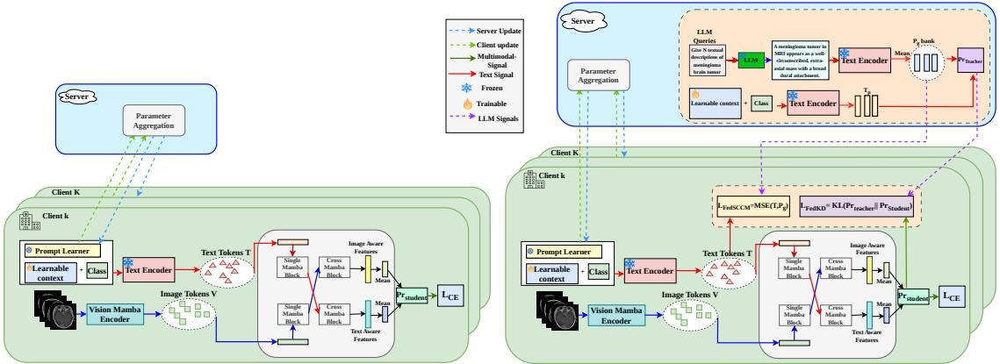
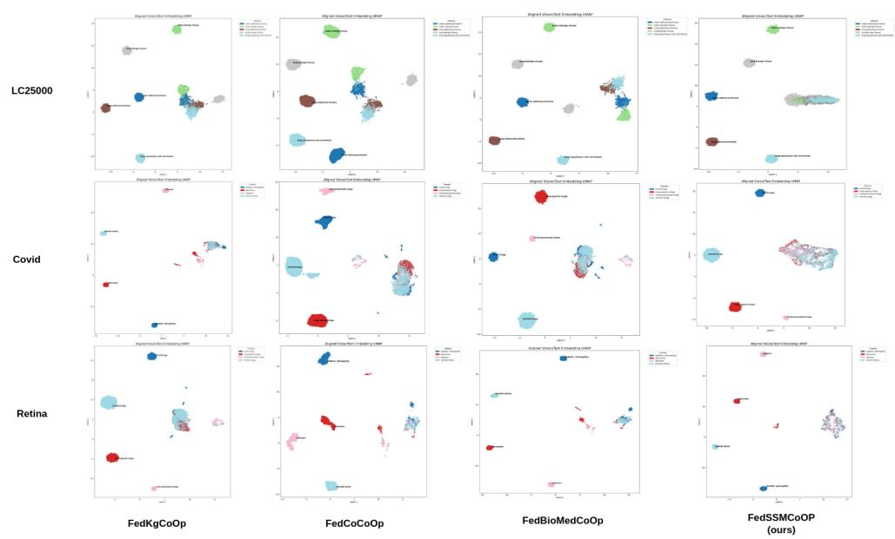
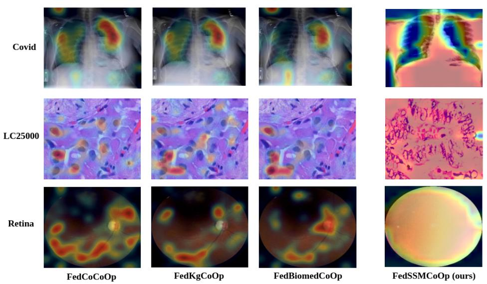

# FedSSMCoOp: SSM Encoders for light-weight Federated Prompt Learning for Few-shot Classification

Ankita Das Department of Computer Science and Engineering Indian Institute of Technology Hyderabad

Ambarish Parthasarathy Department of Artificial Intelligence Indian Institute of Technology Hyderabad

Sumohana S. Channappayya Department of Electrical Engineering Indian Institute of Technology Hyderabad

C. Krishna Mohan Department of Computer Science and Engineering Indian Institute of Technology Hyderabad

cs23resch01003@iith.ac.in

ai23resch01001@iith.ac.in

sumohana@ee.iith.ac.in

ckm@cse.iith.ac.in

## Abstract

Vision-Language Models (VLMs) have shown strong performance across a wide range of downstream vision tasks, thanks to the complementary information contained in the respective domains. Despite the performance gains, most of these approaches rely on aligning these domains using the cosine similarity metric, which fails to capture token-level structure and cross-modal interactions prior to the classification stage. This is especially critical in biomedical applications under federated constraints, where data sharing is restricted, labeled data is scarce at each site, and it difers widely across institutions, leading to substantial statistical heterogeneity. To overcome this issue, we propose FedSSMCoOp, a federated few-shot image classification framework that enables multimodal learning while preserving data privacy. With the help of the SSM-based Vision Mamba and Cross Mamba blocks, and by optimizing only the soft-prompt and communication-prompt updates in the federated setting, the framework prioritizes both computation and performance. Importantly, this eliminates the need to use an external Large Language Model (LLM) for feature alignment. The framework is further trained and evaluated on various biomedical image datasets, and its performance is assessed. The proposed framework delivers stable performance relative to the baselines and is, on average, 1.96 times lighter. The corresponding script will be made available soon.

## 1 Introduction

The VLMs are a performance-oriented framework where information is processed using one or more complementary modalities. One of the most commonly used modalities is vision and text, where either of them can aid the other. The features from each of the modalities are either combined in a common space or processed by a dedicated encoder Tan & Bansal (2019). Commonly used encoders are attention-based transformers that prioritize performance. The Contrastive Language Image Pretraining (CLIP) is one such VLM that uses this approach in the vision and text domain, respectively Radford et al. (2021). The features from both modalities are aligned by means of a contrastive learning approach inspired by InfoNCE Oord et al. (2018). This is the foundational template for most of the present-day VLMs. On the other hand, the Bootstrapped Language Image Pretraining (BLIP), the second variant of the prior CLIP model, is designed for both retrieval and generative applications Li et al. (2022). Further, the BLIP introduces a filtering mechanism called CaptFilt that filters out noisy captions, thereby making it more robust to perturbations. The SigLIP Zhai et al. (2023) is another variant of the CLIP model in which the contrastive approach is replaced with a sigmoid objective, which is simple but has proven quite efective in terms of performance and stability. Biomedical imaging is an important application domain for VLMs because the data is typically distributed across multiple healthcare institutions and cannot be directly shared due to privacy constraints. In addition, biomedical images can difer substantially across institutions due to variations in imaging devices, acquisition protocols, and patient populations. These characteristics make biomedical imaging a challenging and highly heterogeneous setting for VLM adaptation, particularly when only a small number of labeled samples are available.

Despite the advancements, the transformer-based VLMs are computationally ineficient due to the presence of an attention mechanism. The State Space Modeling (SSMs) of Mamba Gu & Dao (2023) was efective in reducing the computation complexity from quadratic in attention to almost linear. This helped to curb the computational complexity while simultaneously maintaining performance, and is widely used in most of the applications in Biomedical and Satellite Imaging, respectively. The Vision Mamba Zhu et al. (2024) is an extension of this approach in the vision domain, using a bidirectional state-space approach for an efective scanning mechanism. The VMamba Liu et al. (2024), on the other hand, used an unidirectional stage-wise approach, mimicking an SSM-based mixer model.

However, every advancement comes at a cost. The Mamba variants, despite being lightweight, weren’t as efective as attention-based models. This is because the attention mechanism was efective at extracting fine-grained features, whereas Mamba focuses more on the global perspective of features Parthasarathy & Channappayya (2026). These factors are also crucial in the federated environments, where the performance and the latency between the client and the server must be jointly optimized. Given that the data across participating clients are typically non-independent and identically distributed (non-IID), each client’s data is drawn from a diferent underlying distribution, which further increases the dificulty of achieving stable convergence. These characteristics create a unique trade-of in federated biomedical VLMs: the mode should be computationally eficient enough to communicate across clients, while still being capable of capturing both global and fine-grained features from heterogeneous medical images. Therefore, the choice of the visual encoder and the strategy for adapting it are particularly important in this setting. The computational eficiency of SSM-based models is particularly attractive here, where both local computation and communication between clients and the server are important. Therefore, we propose FedSSMCoOp, a federated framework that integrates Vision Mamba with the Cross-Mamba Interaction block Liu et al. (2026); Zhu et al. (2024), balancing performance and computational complexity. The integrated design is further stitched into a Federated Learning (FL) setup that communicates only with the soft prompt deltas. This reduces the per-round communication cost between the client and the server. We demonstrate gains and on-par performance across several datasets while significantly reducing computational cost. Further, this approach is trained and validated across biomedical imaging datasets and compared over the baselines under the non-IID data distributions.

## 2 Related Works

Most previous work focused on either the Federated Learning or the Prompt Learning. Recent approaches use LLMs to leverage their performance and report few-shot results for better generalization. A similar trend was also observed for the SSMs, where the results were reported mainly for unimodal, application-oriented approaches. Federated learning is quite efective for most tasks, enabling collaborative training without explicitly sharing information. Keeping the regulations like HIPAA and GDPR into consideration, the FedAvg McMahan et al. (2017) focuses on a decentralized mechanism across sequential models, particularly on mobile devices. On the other hand, FedProx Li et al. (2020) and SCAFFOLD Karimireddy et al. (2020) address non-IID heterogeneity and share full model updates within the server. But this approach increases per-round communication costs and leads to unstable gradient inversion.

Further, in the domain of Prompt Learning, CoOp Zhou et al. (2022b) helps to address the issue of communication cost by optimizing the learnable context tokens, which can be adapted from a frozen CLIP encoder. Works like CoCoOp Zhou et al. (2022a) and KgCoOp Yao et al. (2023) use probabilistic conditioning and further compute the cosine similarity between the soft and hard prompts through an external knowledge mechanism. Further, PromptFL Guo et al. (2023a), aggregates only the soft prompts, and the BiomedCoOp

Table 1: Comparison of related methods with FedSSMCoOp. FL: Federated Learning, PL: Prompt Learning, Vim: Vision Mamba encoder, MIB: Mamba Interaction Block. ✓: supported, ✗: not supported, ∼: partially supported.
<table><tr><td>Method</td><td>FL</td><td>PL</td><td>Vim</td><td>MIB</td><td>Medical</td><td>Few-shot</td></tr><tr><td colspan="7">Federated Learning</td></tr><tr><td>FedAvgMcMahan et al. (2017)</td><td></td><td>X</td><td>X</td><td>x</td><td>2</td><td>X</td></tr><tr><td>FedProxLi et al. (2020)</td><td>√</td><td>x</td><td>x</td><td>x</td><td>2</td><td>X</td></tr><tr><td>SCAFFOLDKarimireddy et al. (2020)</td><td>√</td><td>x</td><td>x</td><td>X</td><td>X</td><td>x</td></tr><tr><td colspan="7">Prompt Learning</td></tr><tr><td>CoOpZhou et al. (2022b)</td><td>X</td><td></td><td>X</td><td>X</td><td>X</td><td>√</td></tr><tr><td>CoCoOpZhou et al. (2022a)</td><td>X</td><td></td><td>X</td><td>X</td><td>x</td><td>√</td></tr><tr><td>KgCoOpYao et al. (2023)</td><td>X</td><td></td><td>x</td><td>x</td><td>X</td><td>√</td></tr><tr><td>ProDALu et al. (2022)</td><td>X</td><td></td><td>x</td><td>x</td><td>X</td><td></td></tr><tr><td>PromptFLGuo et al. (2023b)</td><td>√</td><td></td><td>x</td><td>x</td><td>X</td><td></td></tr><tr><td>BiomedCoOpKoleilat et al. (2025)</td><td>x</td><td></td><td>x</td><td>X</td><td>√</td><td>V</td></tr><tr><td>FedTPGQiu et al. (2024)</td><td>√</td><td></td><td>X</td><td>x</td><td>X</td><td>V</td></tr><tr><td>FedMVPSingha et al. (2025)</td><td>V</td><td></td><td>x</td><td>x</td><td>X</td><td>V</td></tr><tr><td>FedMPTWang et al. (2026)</td><td>√</td><td></td><td>x</td><td>x</td><td>x</td><td>√</td></tr><tr><td>BioVLMSingha et al. (2026)</td><td>x</td><td></td><td>X</td><td>x</td><td>√</td><td>√</td></tr><tr><td colspan="7">State Space Models</td></tr><tr><td>MambaGu &amp; Dao (2023)</td><td>X</td><td>X</td><td>X</td><td>X</td><td>X</td><td>X</td></tr><tr><td>Vision MambaZhu et al. (2024)</td><td>X</td><td>X</td><td>√</td><td>x</td><td>X</td><td>x</td></tr><tr><td>VMambaLiu et al. (2024)</td><td>X</td><td>X</td><td>√</td><td>x</td><td>X</td><td>X</td></tr><tr><td>MedMambaYue &amp; Li (2024)</td><td>X</td><td>X</td><td>√</td><td>x</td><td>√</td><td>X</td></tr><tr><td>MambaDFuseLi et al. (2024)</td><td>X</td><td>X</td><td>√</td><td>√</td><td>X</td><td>X</td></tr><tr><td>COMOLiu et al. (2026)</td><td>X</td><td>X</td><td>√</td><td>√</td><td>X</td><td>X</td></tr><tr><td>FedSSMCoOp (ours)</td><td>√</td><td></td><td>√</td><td>√</td><td>√</td><td>√</td></tr></table>

Koleilat et al. (2025) builds on top of this approach through an LLM-generated class descriptions and semantic prototypes. FedTPG Qiu et al. (2024) implemented a shared text-conditioned prompt generator in this framework. To better understand and learn the multimodal prompts, FedMVP Singha et al. (2025) combines the vision features with LLM-derived class attributes. As an extension of this the FedMPT Wang et al. (2026) uses this LLM-based class attributes to improve federated multi-label recognition. In biomedical domain BioVLM Singha et al. (2026) learns a dynamic prompt bank by distilling LLM-derived attributes for few-shot biomedical classification.

The introduction of SSMs such as Mamba Gu & Dao (2023) provides a lightweight alternative to the bulky transformer-based models. The Vision Mamba Zhu et al. (2024) adapts a similar mechanism to the vision domain by serializing patches into a bidirectional SSMs approach, one for the forward pass and the other for the backward pass. The VMambaLiu et al. (2024) incorporates a stage-wise scanning approach similar to a Mixer model. The MedMamba Yue & Li (2024) uses the strengths both the Vision Mamba and convolution blocks for medical image classification. On the other hand, MambaDFuse Li et al. (2024) and COMO Liu et al. (2026) introduce dual-stream Mamba architectures that fuse two feature streams and serve as an alternative to the bulky cross attention mechanism.

However, these existing prompt learning methods mainly operate in centralized setting or on the cosine similarity between the two modalities don’t necessarily capture the cross-modal interaction. Further, most of the Mamba-based methods mainly rely on unimodal setups, and fewer works contribute to multimodal and federated setups. To the best of our knowledge, the proposed FedSSMCoOp is a work that addresses these issues, integrating the federated setup with SSM approaches of Vision Mamba and Cross Mamba block (COMO), capturing cross-modal cues for efective alignment. This eliminates the use of bulky LLMs, as the COMO already solves this. The comparison of the diferent approaches with reference to the proposed framework is shown in Table 1.

## 3 Preliminaries

## 3.1 State Space Models (SSMs)

Given an input image $\boldsymbol { x } \in \mathbb { R } ^ { H \times W \times 3 }$ , it is first divided into N non-overlapping patches, similar to that of the transformer model. Now, each patch is linearly projected to a $d _ { v } .$ -dimensional embedding, along with learnable positional embeddings in order to preserve spatial ordering. Vision Mamba models the patch sequence as a selective state space model (SSM) with the following recurrent formulation:

$$
h _ { t } = \mathbf { A } _ { t } h _ { t - 1 } + \mathbf { B } _ { t } e _ { t }\tag{1}
$$

$$
o _ { t } = \mathbf { C } _ { t } h _ { t }\tag{2}
$$

where $\boldsymbol { e } _ { t } \in \mathbb { R } ^ { d _ { v } }$ is the embedding of the t-th patch, $h _ { t } \in \mathbb { R } ^ { d _ { s } }$ is hidden state capturing context from all previously seen patches, and $\mathbf { A } _ { t } , \mathbf { B } _ { t } , \mathbf { C } _ { t }$ are input-dependent projection matrices that implement selective gating. Importantly, the matrices $\mathbf { B } _ { t }$ and $\mathbf { C } _ { t }$ are functions of input $\mathbf { } _ { e _ { t } , }$ allowing the model to selectively absorb informative patches into memory while suppressing background patches. Importantly, with reference to Equation 1, it can be observed that it clearly operates in the continuous domain. Since the Mamba operates in the discrete domain, an intermediate parameter $\Delta$ is used to convert the above variables in the discrete space.

$$
\begin{array} { r l } & { \bar { A } = \exp ( \Delta A ) , } \\ & { \bar { B } = ( \Delta A ) ^ { - 1 } \left( \exp ( \Delta A ) - I \right) \Delta B , } \\ & { h _ { t } = \bar { A } h _ { t - 1 } + \bar { B } e _ { t } , } \\ & { y _ { t } = C h _ { t } . } \\ & { y = \left( \overline { { C B } } , \overline { { C A B } } , . . . , \overline { { C } } \overline { { A } } ^ { M - 1 } \overline { { B } } \right) e _ { t } , } \\ & { y = K \ast e . } \end{array}\tag{3}
$$

(4)

The output is then computed using the convolution and the sequential mode, helping in both optimized training and inference. Here, M is the sequence length of the input, and K is the corresponding kerne having a dimension of $\overline { { K } } \in \mathbb { R } ^ { M }$

Further, in the case of the cross-modal mechanism, the COMO Liu et al. (2026) is a much lighter alternative to the attention-based mechanism. It gets its inspiration from the dual-streamed architecture and combines the spatial features from the two modalities by means of a Cross mamba Block Liu et al. (2026). Firstly, the high-level features, a combination of both average and max pooling, are applied along with deep feature mapping in order to make the model more adaptive. These processed features $S _ { i n } \in \overset { \smile } { \mathbb { R } } ^ { H W X C }$ are further flattened, and are incorporated with a learning position embedding $P \in \mathbb { R } ^ { H W X C }$ , providing the necessary positional encodings. Now, the $S _ { i n }$ is scanned across the four directions $( C R S c a n _ { i } )$ , helping in the expansion of the serialization approach. The results of this, goes across the SSM structure (S6), further resulting in four separate outputs.

$$
\left\{ \begin{array} { r l } { x _ { i } } & { = \mathrm { C R S c a n _ { i } } \left( S _ { i n } \right) , } \\ { y _ { i } } & { = \mathbf { S 6 } _ { i } \left( x _ { i } \right) , } \\ { S _ { \mathrm { o u t } } } & { = \sum _ { i = 1 } ^ { 4 } \mathrm { r e v e r s e s c a n } _ { i } \left( y _ { i } \right) . } \end{array} \right. \ i = 1 , 2 , 3 , 4 .\tag{5}
$$

Similarly, for the Cross-mamba block, the inputs from both modalities are processed. The governing expression is very similar to that of the Equation 5.

$$
\left\{ \begin{array} { r l } { x _ { i } ^ { 1 } , x _ { i } ^ { 2 } } & { = \mathrm { C R S c a n } _ { i } \left( S _ { \mathrm { i n } } ^ { 1 } , S _ { \mathrm { i n } } ^ { 2 } \right) , } \\ { y _ { i } } & { = \mathbf { C S 6 } _ { i } \left( x _ { i } ^ { 1 } , x _ { i } ^ { 2 } \right) , } \\ { S _ { \mathrm { o u t } } } & { = \sum _ { i = 1 } ^ { 4 } \mathrm { r e v e r s e \_ s c a n } _ { i } \left( y _ { i } \right) . } \end{array} \right. \qquad i = 1 , 2 , 3 , 4 .\tag{6}
$$

where, $S _ { i n } ^ { 1 } , S _ { i n } ^ { 2 }$ are the multimodal inputs for the Cross mamba block, with the CS6 being the main structure of the cross mamba, and $x _ { i } ^ { 1 } , x _ { i } ^ { 2 }$ are the serialized inputs from the two modalities.

## 3.2 Federated Learning

Federated Learning McMahan et al. (2017) is a distributed machine learning paradigm in which multiple clients collaboratively train a shared model without exchanging their private data. Considering K clients, where each client $k \in \{ 1 , \ldots , K \}$ has a local dataset $\mathcal { D } _ { k } = \{ ( x _ { i } , y _ { i } ) \} _ { i = 1 } ^ { n _ { k } }$ which remains private. The objective is to learn a global model with parameter θ that minimizes the local objectives:

$$
\operatorname* { m i n } _ { \theta } \mathcal { L } ( \theta ) = \sum _ { k = 1 } ^ { K } \frac { n _ { k } } { n } \mathcal { L } _ { k } ( \theta ) , \quad n = \sum _ { k = 1 } ^ { K } n _ { k }\tag{7}
$$

where $\mathcal { L } _ { k } ( \theta ) = \mathbb { E } _ { ( x , y ) \sim \mathcal { D } _ { k } } [ \ell ( \theta ; x , y ) ]$ is the local loss on client k. The FedAvg McMahan et al. (2017) algorithm proceeds in synchronous rounds. At each round the server broadcasts the current global parameters $\boldsymbol { \theta } ^ { ( t ) }$ to all the clients and each client k performs E local epochs of stochastic gradient descent on its own private data and obtains updated parameters $\theta _ { k } ^ { ( t + 1 ) }$ . Then the server aggregates client updates using weighted averaging:

$$
\theta ^ { ( t + 1 ) } = \sum _ { k = 1 } ^ { K } \frac { n _ { k } } { n } \theta _ { k } ^ { ( t + 1 ) }\tag{8}
$$

Because of this, the raw data never leaves the clients, preserving privacy. Another challenge in FL is data heterogeneity, where datasets in clients follow diferent data distributions $( \mathcal { D } _ { k } \not \sim \mathcal { D } _ { j }$ for $k \neq j$ a setting known as non-IID). To simulate this in medical imaging, class labels are partitioned across clients using Dirichlet distribution, Dir(α), where a smaller α induces greater heterogeneity. Communication cost with the server is another challenge, as full model weights for vision encoders can be heavy, making each communication round expensive, especially on bandwidth-constrained hospital networks. Prompt-based federated learning (FL) Guo et al. (2023b) addresses this by sharing only a small set of learnable parameters, reducing communication cost while keeping all encoder weights frozen and local.

## 4 Proposed Approach

In this work, we introduce the FedSSMCoOp framework, a federated approach to zero-shot and few-shot image classification that exploits a decentralized Prompt Learning objective to optimize communication cost between clients and the server. Further, to optimize the computational complexity of the attention mechanism, we first bring in the Vision Mamba Zhu et al. (2024) at the vision encoder end. Further, to capture the inter-modality cues, we incorporate the Cross Mamba interaction block Liu et al. (2026), importantly, to the vision and the text modality, respectively. Since this interaction block already captures and aligns the corresponding modal features, we believe that this can substitute the role of the LLM. The corresponding architecture and the algorithm of the proposed framework is shown in Figure 1 and Algorithm 1

We consider a federated framework with K clients, where each client $k \in \{ 1 , \ldots , K \}$ holds a private dataset $\mathcal { D } _ { k } = \{ ( x _ { i } , y _ { i } ) \} _ { i = 1 } ^ { n _ { k } }$ of medical images $\boldsymbol { x } _ { i } \in \mathbb { R } ^ { H \times W \times \dot { 3 } }$ and class labels $y _ { i } \in \{ 1 , \ldots , C \}$ . The data remains loca and is never shared across the clients or with the central server at any point during training. In the federated few-shot setting, each client trains on at most K-shot samples per class, giving a total of $N _ { \mathrm { t o t a l } } = K \times C$ training images distributed across all clients. The data is partitioned using Dirichlet distribution Dir(α) to simulate realistic non-IID clinical distributions, where smaller α induces greater heterogeneity across clients. The goal is to learn a classifier that generalizes to all C classes, including classes unseen at individual clients, through T global communication rounds of federated training. Each client maintains a set of learnable soft prompt context tokens $X _ { p } ^ { k } \in \mathbb { R } ^ { M \times d }$ , where the subscript p denotes the prompt parameters, the superscript k indexes the client, M is the number of context tokens and d is the embedding dimension. Importantly, the server maintains only the global prompt $\bar { P } \in \mathbb { R } ^ { M \times d }$ from which each client initializes its local $X _ { p } ^ { k }$ at the start of every round. Each round, every client uploads only the prompt delta $\Delta X _ { p } ^ { k } = X _ { p } ^ { k , \mathrm { a f t e r } } - \bar { P }$ , ensuring that communication cost scales with the prompt size.

Each client computes its predictions using the Vim Zhu et al. (2024) encoder for image branch and text encoder with learnable soft prompt $X _ { p } ^ { k }$ for text branch. The input image x is processed through Vim Zhu

Figure 1: The architecture of the proposed FedSSMCoOp framework. On each client, a frozen Vison Mamba encoder produces image tokens V while the text encoder produces text tokens $T .$ The COMO block fuses both the streams bidirectionally into text-aware and image-aware features, which are mean-pooled to form $ { \mathrm { P r } } _ { s t u d e n t }$ which is optimized using the cross-entropy loss $\mathcal { L } _ { C E }$ . Only the prompt parameters are sent to the server for aggregation.

Algorithm 1: FedSSMCoOp Federated Training   
Data: Number of clients $K ,$ local epochs $E ,$ global rounds T, learning rate η, and client datasets $\{ \mathcal { D } _ { k } \} _ { k = 1 } ^ { K } .$   
Data: Frozen Vision Mamba encoder $\mathcal { E } _ { v }$ and BiomedCLIP text encoder $\mathcal { E } _ { t }$   
Result: Trained global prompt $\bar { P } ^ { ( T ) }$ and per-client MIB parameters $\{ \Theta _ { \mathrm { M I B } } ^ { k } \} _ { k = 1 } ^ { K } .$   
$\nearrow$ Server initialization $^ * /$   
Initialize global prompt $\bar { P } ^ { ( 0 ) } \in \mathbb { R } ^ { M \times d }$ from $^ { 6 6 } \mathrm { a }$ photo of $\mathbf { a } ^ { \mathfrak { n } }$   
for each client $\bar { k } \in \{ 1 , \ldots , K \}$ do   
Initialize MIB parameters $\Theta _ { \mathrm { M I B } } ^ { k }$ and text projection $W _ { \mathrm { t x t } } ^ { k }$ locally   
for round $t = 0 , 1 , \ldots , T - 1$ do   
$\big / { } ^ { * }$ Server broadcasts the global prompt $^ * /$   
Broadcast global prompt P¯(t) to all clients   
for each client $k \in \{ 1 , \ldots , K \}$ in parallel do   
$X _ { p } ^ { k } \gets \bar { P } ^ { ( t ) }$   
for local epoch $e = 1 , \ldots , E$ do   
for mini-batch $( x , y ) \in \mathcal { D } _ { k }$ do   
$V  \mathcal { E } _ { v } ( x )$ $\nearrow$ frozen image encoder $^ * /$   
$T \gets \xi _ { t } ( [ X _ { p } ^ { k } ; \mathsf { c l s } _ { c } ] ) , \quad \forall c \in \{ 1 , \ldots , C \}$   
$T _ { \mathrm { p r o j } }  W _ { \mathrm { t x t } } ^ { k } T$ $\nearrow$ local projection $^ * /$   
$V ^ { \prime } , T _ { \mathrm { p r o j } } ^ { \prime }  \mathrm { M I B } ( V , T _ { \mathrm { p r o j } } ; \Theta _ { \mathrm { M I B } } ^ { k } )$ $\nearrow$ local MIB \*/   
logits $ \tau \cdot \mathrm { m e a n } ( V ^ { \prime } ) \cdot T _ { \mathrm { p r o j } } ^ { \prime }$ ⊤   
$\mathrm { P r _ { s } }$ tudent ← softmax(logits)   
$\mathcal { L } _ { \mathrm { C E } }  - \textstyle \sum _ { c }$ yc log $\mathrm { P r } _ { \mathfrak { s } }$ tudent,c   
Update $X _ { p } ^ { k } , \bar { W } _ { \mathrm { t x t } } ^ { k } ,$ and $\Theta _ { \mathrm { M I B } } ^ { k }$ via SGD on $\mathcal { L } _ { \mathrm { C E } }$   
$\nearrow$ Compute local prompt update $^ * /$   
$\Delta X _ { p } ^ { k } \gets X _ { p } ^ { k } - { \bar { P } } ^ { ( t ) }$   
Upload $\Delta \dot { X } _ { p } ^ { k }$ and $n _ { k }$ $\nearrow$ only prompt delta is uploaded $^ * /$   
$\big / { } ^ { * }$ Server-side FedAvg aggregation $^ * /$   
$\bar { P } ^ { ( t + 1 ) } \gets \bar { P } ^ { ( t ) } + \sum _ { k = 1 } ^ { \Lambda } \frac { n _ { k } } { n } \Delta X _ { p } ^ { k }$   
return $\bar { P } ^ { ( T ) }$ and $\{ \Theta _ { \mathrm { M I B } } ^ { k } \} _ { k = 1 } ^ { K }$

et al. (2024) to obtain the patch tokens $V \in \mathbb { R } ^ { N \times d _ { v } }$ , while the text encoder produces class tokens $T \in \mathbb { R } ^ { C \times 5 1 2 }$ from the concatenation $[ \bar { X } _ { p } ^ { k } ; \mathsf { c l } \mathsf { s } _ { c } ]$ for each class c. the text tokens are projected via a learnable linear layer, giving $T _ { \mathrm { p r o j } } \in \mathbb { R } ^ { C \times d _ { v } }$ . The Mamba Interaction Block (MIB) Liu et al. (2026) as mentioned in Section 3.1, fuses the image and text tokens bidirectionally, producing text-aware image patches $V ^ { \prime }$ and image-aware class tokens $T _ { \mathrm { p r o j } } ^ { \prime }$ . The class logits are computed by mean-pooling $V ^ { \prime }$ and taking the inner product with $T _ { \mathrm { p r o j } } ^ { \prime } .$ During the local training each client minimizes the standard cross-entropy loss. Only the soft prompt $X _ { p } ^ { k } ;$ the text projection matrix $W _ { \mathrm { t x t } }$ , and the MIB parameters receive the gradient updates. The Vision Mamba and BiomedCLIP text encoders remain frozen throughout the training process, as shown in Algorithm 1.

At each round t, the server broadcasts the current global prompt $\bar { P } ^ { ( t ) }$ to all K clients. Each client k initializes $X _ { p } ^ { k }  \bar { P } ^ { ( t ) }$ , performs E local epochs using SGD on ${ \mathcal { L } } _ { \mathrm { C E } } ,$ and uploads only the prompt delta $\Delta X _ { p } ^ { k } = X _ { p } ^ { k , \mathrm { a f t e r } } - \bar { P } ^ { ( t ) }$ along with its local sample count $n _ { k }$ . The server aggregates client updates via weighted averaging McMahan et al. (2017):

$$
\bar { P } ^ { ( t + 1 ) } = \bar { P } ^ { ( t ) } + \sum _ { k = 1 } ^ { K } \frac { n _ { k } } { n } \Delta X _ { p } ^ { k }\tag{9}
$$

This process follows the prompt-based federated paradigm introduced by PromptFL Guo et al. (2023a), in which only the lightweight prompt parameters are communicated between clients and the server. Since ${ \Delta X _ { p } ^ { k } }$ is soft weight the per-round communication cost is reduced compared to full Vision Mamba weight sharing. As the raw data never leave clients and only prompt deltas are transmitted to the server, preserving privacy. It is important to note that only the soft prompts p¯ are aggregated at the server. The text projection matrix $W _ { \mathrm { t x t } } ^ { k }$ and the MIB parameters $\Theta _ { \mathrm { M I B } } ^ { k }$ are optimized locally and remain client-specific throughout both training and inference; they are never uploaded or aggregated. The shared prompt $\bar { P }$ captures knowledge across clients, while the client-specific $W _ { \mathrm { t x t } } ^ { k }$ and $\Theta _ { \mathrm { M I B } } ^ { k }$ adapt the model to each client’s non-IID data distribution. During inference time client k performs prediction using the aggregated global prompt $\bar { P } ^ { ( T ) }$ together with its locally learned $W _ { \mathrm { t x t } } ^ { k }$ and $\Theta _ { \mathrm { M I B } } ^ { k } .$ , and we report the mean performance across clients. By aggregating only the soft prompt, FedSSMCoOp substantially reduces communication overhead as reported in Section 9.

## 5 Experiments

In the case of the experimental setup, the models such as BiomedCoOp Koleilat et al. (2025), CoCoOP Zhou et al. (2022a), KgCoOp Yao et al. (2023) models respectively, were adopted for the Prompt Learning objective. In this work, we extend these models to the federated setting and keep this as the baseline, and compare our proposed FedSSMCoOp framework. In order to evaluate the performance of our framework, we evaluate on 11 diverse biomedical datasets, including Magnetic Resonance Imaging (MRI), Ultrasound, histopathology, X-ray Imaging, Optical Coherence Tomography (OCT), gastrointestinal endoscopy, dermatoscopy, fundus imaging, and computed tomography (CT). The descriptions of the dataset are shown in Table 2. These datasets are particularly chosen, as they exhibit properties that make the federated prompt-learning setup particularly challenging.

Table 2: Overview of the eleven biomedical imaging datasets used in our evaluation.
<table><tr><td>Dataset</td><td>Modality</td><td>Organ</td><td>#Cls</td><td>Classes</td><td>Train Test Val</td></tr><tr><td>BTMRI¹</td><td>Brain MRI</td><td>Brain</td><td>4</td><td>Glioma, Meningioma, Normal, Pituitary</td><td>2854 /1717 / 1141</td></tr><tr><td>BUSI Al-Dhabyani et al. (2020)</td><td>Breast US</td><td>Breast</td><td>3</td><td>Benign, Malignant, Normal</td><td>389 /236 155</td></tr><tr><td>CHMNIST Kather et al. (2016)</td><td>Histopathology</td><td>Colon</td><td>8</td><td>Adipose, Complex Stroma, Debris, Empty, Im- mune, Normal Mucosa, Simple Stroma, Tumor Ep-</td><td>2496/ 1504 / 1000</td></tr><tr><td>COVID Tahir et al. (2021)</td><td>Chest X-ray</td><td>Lungs</td><td>4</td><td>ithelium COVID-19, Lung Opacity, Normal, Viral Pneumo- nia</td><td>10582 / 6351 / 4232</td></tr><tr><td>LC25000 Borkowski et al. (1912)</td><td>Histopathology</td><td>Lung &amp; Colon</td><td>5</td><td>Colon Adeno., Colon Benign, Lung Adeno., Lung</td><td>12500 / 7500 /5000</td></tr><tr><td>OCTMNIST Kermany et al. (2018)</td><td>Retinal OCT</td><td>Retina</td><td>4</td><td>Benign, Lung SCC CNV, Drusen, DME, Normal</td><td>97477 1000 10832</td></tr><tr><td>Kvasir Pogorelov et al. (2017)</td><td>GI Endoscopy</td><td>GI Tract</td><td>8</td><td>Dyed Lifted Polyps, Cecum, Esophagitis, Dyed Re- section, Pylorus, Z-Line, Polyps, Ulcerative Colitis</td><td>2000 / 1200 800</td></tr><tr><td>DermaMNIST Codella et al. (2019); Tschandl et al. (2018)</td><td>Dermatoscopy</td><td>Skin</td><td>7</td><td>Actinic Keratosis, BCC, Benign Keratosis, Der- matofibroma, Nevus, Melanoma, Vascular Lesion</td><td>7007 / 2005 / 1003</td></tr><tr><td>RetinaMNIST Köhler et al. (2013)</td><td>Fundus</td><td>Retina</td><td>4</td><td>Cataract, Diabetic Retinopathy, Glaucoma, Nor- mal</td><td>2108 / 1268 / 841</td></tr><tr><td>CTKidney Islam et al. (2022)</td><td>CT Scan</td><td>Kidney</td><td>4</td><td>Cyst, Stone, Tumor, Normal</td><td>6221 3738 2487</td></tr><tr><td>KneeXray Chen (2018)</td><td>X-ray</td><td>Knee</td><td>5</td><td>None, Doubtful, Minimal, Moderate, Severe (OA grade)</td><td>5778  /  1656 826</td></tr></table>

In this framework, we simulate the federated learning setup with clients {4, 8, 16} under non-IID data distributions, and with a Dirichlet partitioning strategy, α ∈ {0.1, 0.5, 1.0}, where smaller α induces higher heterogeneity. For all experiments, training was performed for 100 communication rounds, with 5 local epochs per communication round. In this paper, we report results with 8 clients and α = 0.5, representing a moderate heterogeneity setting. The few-shot classification performance is reported here, while the results of the zero-shot classification are provided in the Appendix. The results are reported on the test set and averaged over three random seed values. Importantly, at the time of training, only the lightweight soft prompts are updates and communicated between clients and the server. The server aggregates the updates from the clients using the weighted average technique, while prototype updates are combined using the trimmed mean for robustness.

Table 3: The corresponding modality-wise parameters of the models. Note that the PromptFL framework makes use of a ResNet-based model in the vision modality.
<table><tr><td rowspan=1 colspan=1>Model/Modality</td><td rowspan=1 colspan=1>BioMedCLIP</td><td rowspan=1 colspan=1>CoCoOp</td><td rowspan=1 colspan=1>KgCoOp</td><td rowspan=1 colspan=1>PromptFL</td><td rowspan=1 colspan=1>PromptFL+FedProx</td><td rowspan=1 colspan=1>FedOTP</td><td rowspan=1 colspan=1>BioMedCoOp</td><td rowspan=1 colspan=1>FedSSMCoOp</td></tr><tr><td rowspan=1 colspan=1>Vision Modality</td><td rowspan=1 colspan=1>86M</td><td rowspan=1 colspan=1>86M</td><td rowspan=1 colspan=1>86M</td><td rowspan=1 colspan=1>38M</td><td rowspan=1 colspan=1>38M</td><td rowspan=1 colspan=1>38M</td><td rowspan=1 colspan=1>86M</td><td rowspan=1 colspan=1>26M</td></tr><tr><td rowspan=1 colspan=1>Text Modality</td><td rowspan=1 colspan=1>110M</td><td rowspan=1 colspan=1>38M</td><td rowspan=1 colspan=1>38M</td><td rowspan=1 colspan=1>38M</td><td rowspan=1 colspan=1>38M</td><td rowspan=1 colspan=1>38M</td><td rowspan=1 colspan=1>38M</td><td rowspan=1 colspan=1>38M</td></tr><tr><td rowspan=1 colspan=1>Others</td><td rowspan=1 colspan=1></td><td rowspan=1 colspan=1>Prompt (35k)</td><td rowspan=1 colspan=1>Prompt (659k)</td><td rowspan=1 colspan=1>Prompt (2k)</td><td rowspan=1 colspan=1>Prompt (2k)</td><td rowspan=1 colspan=1>Prompt (4k)</td><td rowspan=1 colspan=1>Prompt (86M)</td><td rowspan=1 colspan=1>Cross-Mamba (5M)</td></tr><tr><td rowspan=1 colspan=1>Total Parameters</td><td rowspan=1 colspan=1>196M</td><td rowspan=1 colspan=1>124M</td><td rowspan=1 colspan=1>125M</td><td rowspan=1 colspan=1>77M</td><td rowspan=1 colspan=1>77M</td><td rowspan=1 colspan=1>77M</td><td rowspan=1 colspan=1>210M</td><td rowspan=1 colspan=1>69M</td></tr></table>

Table 4: The quantitative few-shot classification accuracy (k = 1) results on the respective baselines and the proposed framework on diferent datasets. For each dataset, best-performing and second-best performing models are reported.
<table><tr><td>Dataset</td><td>FedBiomedCLIP</td><td>FedCoCoOp</td><td>FedKgCoOp</td><td>PromptFL</td><td>PromptFL+FedProx</td><td>FedOTP</td><td>FedTPG</td><td>FedMVP</td><td>FedMPT</td><td></td><td>FedBiomedCoOp ∥FedSSMCoOp (Ours)</td></tr><tr><td>BTMRI</td><td>57.08±0.00</td><td>48.86±7.92</td><td>51.19±4.62</td><td>41.60±3.29</td><td>36.93±5.44</td><td>31.43±3.93</td><td>47.13±10.10</td><td>44.321</td><td>23.12</td><td>50.67±4.74</td><td>53.64±1.78</td></tr><tr><td>BUSI</td><td>51.27±0.00</td><td>43.22±6.27</td><td>39.69±473</td><td>43.30±12.72</td><td>37.43±12.65</td><td>33.33±6.91</td><td>37.57±795</td><td>40.678</td><td>55.93</td><td>46.61±7.79</td><td>40.11±6.75</td></tr><tr><td>CHMNIST</td><td>29.06±0.00</td><td>49.53±1.90</td><td>45.48±253</td><td>30.57±6.17</td><td>33.60±3.78</td><td>34.06±9.48</td><td>50.82±5.69</td><td>50.931</td><td>12.50</td><td>52.87±2.3</td><td>53.39±1.67</td></tr><tr><td>COVID</td><td>45.84±0.00</td><td>44.69±1.03</td><td>43.52±11.06</td><td>42.35±8.13</td><td>42.30±8.20</td><td>37.50±2.70</td><td>46.31±8.46</td><td>41.474</td><td>17.08</td><td>43.59±16.49</td><td>46.71±10.13</td></tr><tr><td></td><td>51.20±0.00</td><td>58.72±2.63</td><td>55.99±7.84</td><td></td><td>55.50±5.33</td><td>26.25±8.40</td><td></td><td>37.840</td><td>20.00</td><td>61.88±2.90</td><td>68.61±4.67</td></tr><tr><td>LC25000</td><td></td><td></td><td></td><td>42.90±5.52</td><td></td><td></td><td>64.97±424</td><td></td><td></td><td>32.57±9.67</td><td></td></tr><tr><td>OCTMNIST</td><td>35.00±0.00</td><td>43.30±2.18</td><td>32.43±200</td><td>41.80±9.72</td><td>40.65±9.55</td><td>26.25±8.0</td><td>35.23±4.45</td><td>22.100</td><td>25.00</td><td></td><td>34.93±5.76 22.72±3.00</td></tr><tr><td>DermaMNIST RetinaMNIST</td><td>30.87±0.00</td><td>19.63±3.27</td><td>16.99±1.25</td><td>21.20±15.79</td><td>18.20±7.34</td><td>14.66±3.00</td><td>25.95±4.37</td><td>14.214</td><td>13.29</td><td>15.73±1.71</td><td></td></tr><tr><td></td><td>27.68±0.00</td><td>33.81±5.17</td><td>39.36±6.29</td><td>28.43±1.81</td><td>30.60±4.06</td><td>28.75±4.53</td><td>40.30±2.71</td><td>35.489</td><td>26.03</td><td>40.25±6.32</td><td>42.98±2.25</td></tr><tr><td>Kvasir</td><td>55.50±0.00</td><td>42.97±1.12</td><td>39.72±2.19</td><td>28.90±6.37</td><td>26.33±2990</td><td>19.97±2.53</td><td>43.25±1.94</td><td>42.833</td><td>12.50</td><td>42.94±3.95</td><td>46.80±2.79</td></tr><tr><td>CTKidney</td><td>36.73±0.00</td><td>31.96±4.00</td><td>37.46±7.72</td><td>42.98±2.25</td><td>32.19±382</td><td>27.56±13.87</td><td>34.30±9.48</td><td>27.127</td><td>29.80</td><td>32.75±3.17</td><td>29.03±6.35</td></tr><tr><td>KneeXray</td><td>27.48±0.00</td><td>31.62±5.73</td><td>34.42±292</td><td>24.83±7.42</td><td>30.25±9.78</td><td>19.10±6.73</td><td>26.59±1.75</td><td>25.543</td><td>38.59</td><td>38.30±1.18</td><td>26.67±2.30</td></tr></table>

Coming to the models, we use a Vision Mamba small variant (Vim-S) in the vision encoder and the transformer equivalent encoder at the text modality end. Further, the image resolution is resized to 224 × 224. Similar to the CoOp Zhou et al. (2022a) model, 4 learnable context tokens are initialized. Importantly, the prompts and Cross Mamba Interaction block that consists of a combination of single and cross stacked mamba layers are kept trainable, and the remaining are kept frozen. The Stochastic Gradient Descent (SGD) is used with a momentum of 0.9 along with a cosine learning rate decay. A constant batch size of 16 is used across all the dataset and trained 100 epochs. The mean classification accuracy (top-1) is the primary metric reported here. As a comparison of performance and the complexity, we also report the model’s GFLOP information. Furthermore, we also conduct a set of ablation study with reference to the presence and the absence of the LLM model on the above mentioned datasets. All the experiments here are reported on the workstation powered with 2 NVIDIA Tesla V-100 with 32 GB of GPU.

## 5.1 Comparison with Baselines

The corresponding quantitative results of the baselines and the proposed works are shown in Table 12. The results of the BiomedCLIP, CoCoOP, KgCoOp, and BiomedCoOp models, respectively, were not reported on the federated setting. Therefore, the above models were evaluated on the federated settings and further, this serves as the baseline.

It can observed with reference to the above models under the federated system, our proposed lightweight approach, in fact perform consistently in par or sometimes better than the baselines in some of the datasets. For instance, in the case of CHMNIST Kather et al. (2016), COVID, LC25000, there was approximate improvement in performance of roughly 4%. On the other hand, in some instances, the proposed framework underperforms, particular in the case of BUSI and CTKidney datasets respectively. One of the reasons attributed to this could be due to the SSM’s inability to capture fine-grained representations as compared to the attention-based framework which is efective in capturing this representation. In order to explain this, we use the UMAPs McInnes et al. (2018) and demonstrate the model’s ability of capturing the features. The UMAPs of the proposed framework along with the baselines are shown in Figure 2.

  
Figure 2: The UMAP plots of the proposed model against the baselines on diferent dataset. Observe that the proposed FedSSMCoOp framework has compact and well-separated embeddings in the text domain and a relatively looser cluster in the vision domain. This explains its ability of capturing discriminative features.

Furthermore, in order to qualitative analysis the performance of the models, we plot the activation maps for the models under the three datasets, as shown in Figure 3.

  
Figure 3: Visualization of activation maps of diferent models. The visualizations of baselines; $\mathrm { F e d C o C o O p } .$ FedKgCoOp and FedBiomedCoOp are reported on 16 shot and the proposed FedSSMCoOp on 1 shot.

The models such as $\mathrm { F e d C o C o O P } .$ $\mathrm { F e d K g C o O p }$ and the FedBiomedCoOp respectively, perform good and concentrate on localized and fine features. For instance, in the case of the COVID dataset, most of the models particularly concentrate on the main part of the lungs. A similar scenario is observed in the case of the LC25000 dataset, where the model focuses more on the tissues. Importantly, in the Retina Dataset, the focus is not only around the cornea, but across the various other locations. Given the ability of these models to extract fine-grained features, these are ideal for detecting the abnormalities, especially in the terminal medical stages.

Furthermore, in the case of the FedSSMCoOp, a global perspective of attention is observed. Particularly in the case of the Covid dataset, the model focuses from the throat portion to almost the entire diaphragm section of the chest. But it is also to be noted, it doesn’t focus on the localized portion. Similarly, in the case of the Retina dataset, the entire eyeball is attended by the model. This is vital especially in the scenario of cataract, where a global focus is necessary. Given this global focus ability of the model, this is ideal for an early-staged detection. On the other hand, a lower performance is observed on BUSI and CTKidney, where diagnosis relies on subtle lesion boundaries and highly localized pathological patterns. This behavior primarily reflects the global contextual modeling bias of the Vision Mamba backbone rather than the proposed federated prompt learning strategy. Despite this limitation, FedSSMCoOp provides an efective accuracy-eficiency trade-of across a diverse set of biomedical imaging modalities, reducing computational complexity by nearly 1.96× while remaining competitive on most datasets. To investigate whether external

Table 5: Architectural and training-objective diferences across the four ablation configurations. The LLM prototype bank $P _ { g }$ is precomputed ofline and never used during federated training; only the soft prompt is communicated.
<table><tr><td>Component / Objective</td><td>No-LLM (FedSSMCoOp)</td><td>LLM-Server</td><td>LLM-Client</td><td>LLM-Client+Server</td></tr><tr><td>LLM prototype bank  $P _ { g }$ </td><td>x</td><td>Server-side</td><td>Client-side</td><td>Both</td></tr><tr><td>Client text branch</td><td>Prompt only</td><td>Prompt only</td><td>Dual (prompt+  $P _ { g } )$ </td><td>Dual (prompt+Pg)</td></tr><tr><td>Prompt-prototype fusion</td><td>x</td><td>X</td><td>Learnable α</td><td>Learnable α</td></tr><tr><td>Classification loss  $\mathcal { L } _ { C E }$ </td><td>√</td><td>√</td><td>√</td><td>√</td></tr><tr><td>Alignment loss LFedsCCM</td><td>x</td><td>√</td><td>x</td><td>√</td></tr><tr><td>Distillation loss  $\mathcal { L } _ { F e d K D }$ </td><td>x</td><td>x</td><td>x</td><td>√</td></tr><tr><td>Total client objective</td><td> $\mathcal { L } _ { C E }$ </td><td> $\mathcal { L } _ { C E } + \lambda _ { S } \mathcal { L } _ { F e d S C C M }$ </td><td> $\mathcal { L } _ { C E }$ </td><td> $\mathcal { L } _ { C E } + \lambda _ { S } \mathcal { L } _ { F e d S C C M } + \lambda _ { K } \mathcal { L } _ { F e d K D }$ </td></tr><tr><td>Federated communication LLM used during training</td><td>Prompt only x</td><td>Prompt only X (offline)</td><td>Prompt only X (offline)</td><td>Prompt only X (offline)</td></tr></table>

semantic knowledge can further improve federated few-shot biomedical image classification, we conduct an ablation study by using a LLM into training pipeline. It is important to note that the proposed FedSSMCoOp framework is entirely LLM-free during both training and inference. The LLM is introduced solely for this ablation study and is not part of the final proposed method. Specifically, prior to federated training, GPT-4 generates multiple textual descriptions for each disease class. These descriptions are then encoded using frozen BiomedCLIP text encoder, which is PubMedBERT-based, and averaged to obtain fixed-class semantic prototypes. Since these prototypes are computed only once before training, the LLM is never invoked during the communication round. Only the learnable prompt updates continue to be exchanged between the clients and the server. We evaluate on three strategies (Table 5): LLM-Server, where clients align prompt features to the global prototypes via $\mathcal { L } _ { F e d S C C M } = \mathrm { M S E } ( T , P _ { g } )$ ; LLM-Client, where each client fuses prompt and prototype features through a learnable coeficient; and LLM-Client+Server, which combines both and adds a distillation loss $\mathcal { L } _ { F e d K D } = \mathrm { K L } ( \operatorname* { P r } _ { t e a c h e r } \Vert \operatorname* { P r } _ { s t u d e n t } )$

Firstly, we conduct an ablation analysis depicting the impact of having on LLM either in server, client end or at both the ends. The results of the same are shown in Table 6. Despite the introduction of the LLM, there is only a minor improvement in the performance. It is worth noting, the performance is in-par and some cases better, when there is no LLM presence at the client and the server end respectively. We also conduct an ablation study reported in Table 7, with the diferent combinations of either attention mechanism of ViT and the SSM mechanism of Vision Mamba (Vim) integrated with the LLM. This is then also compared with the proposed framework of FedSSMCoOp. In particular the Small variant of Vision Mamba (Vim-S) is chosen and the Base variant of Vision Transformer (ViT-B) was compared as used by Koleilat et al. (2025). Importantly the Gpt4 Achiam et al. (2023) is used as the LLM here, and is integrated at the server side of the federated setup.

One of the main observations is that, the propose framework with Vision mamba and COMO based crossmodal interaction without the use of LLM in the server performs consistently in-par or sometimes better than the baselines. For instance, there is a good improvement observed in the case of the COVID, LC25000, and

Table 6: Ablation study on the proposed framework with inclusion of LLMs at the server and client ends across all datasets. For each of the datasets, Best performing and second best performing models are reported.
<table><tr><td>Dataset</td><td>No-LLM</td><td> $\mathbf { L L M - S e r v e r }$ </td><td>LLM-Client</td><td>LLM-Client+Server</td></tr><tr><td>BTMRI</td><td> $\mathbf { 5 3 . 6 4 } _ { \pm 1 . 7 8 }$ </td><td> $4 4 . 0 5 { \scriptstyle \pm 7 . 5 5 }$ </td><td> $5 0 . 5 5 { \scriptstyle \pm 2 . 6 4 }$ </td><td> $4 6 . 1 1 { \scriptstyle \pm 6 . 8 1 }$ </td></tr><tr><td>BUSI</td><td> $\mathbf { 4 0 . 1 1 _ { \pm 6 . 7 5 } }$ </td><td> $3 9 . 5 5 { \scriptstyle \pm 2 . 8 3 }$ </td><td> $\overline { { 3 9 . 4 1 \pm 9 . 3 2 } }$ </td><td> $3 7 . 7 1 { \scriptstyle \pm 1 . 8 4 }$ </td></tr><tr><td>CHMNIST</td><td> $5 3 . 3 9 { \scriptstyle \pm 1 . 6 7 }$ </td><td> $5 2 . 2 4 { \scriptstyle \pm 1 . 2 5 }$ </td><td> $\mathbf { 5 4 . 0 1 } _ { \pm 2 . 2 5 }$ </td><td> $5 2 . 2 2 { \scriptstyle \pm 1 . 4 7 }$ </td></tr><tr><td>COVID</td><td> $\mathbf { 4 6 . 7 1 { \scriptstyle \pm 1 0 . 1 3 } }$ </td><td> $4 1 . 9 0 { \scriptstyle \pm 8 . 9 4 }$ </td><td> $4 5 . 5 9 { \scriptstyle \pm 1 1 . 2 9 }$ </td><td> $4 1 . 9 9 \pm 1 1 . 2 7$ </td></tr><tr><td>LC25000</td><td> $6 8 . 6 1 \pm 4 . 6 7$ </td><td> $6 4 . 3 8 { \scriptstyle \pm 6 . 3 9 }$ </td><td> $\mathbf { 7 1 . 7 8 { \scriptstyle \pm 4 . 1 5 } }$ </td><td> $6 4 . 6 7 { \scriptstyle \pm 6 . 3 9 }$ </td></tr><tr><td>OCTMNIST</td><td> $\mathbf { 3 4 . 9 3 } \pm \mathbf { 5 . 7 6 }$ </td><td> $3 1 . 1 3 { \scriptstyle \pm 5 . 9 2 }$ </td><td> $3 2 . 7 3 { \scriptstyle \pm 6 . 2 2 }$ </td><td> $3 1 . 6 0 { \scriptstyle \pm 6 . 9 8 }$ </td></tr><tr><td>DermaMNIST</td><td> $2 2 . 7 2 { \scriptstyle \pm 3 . 0 0 }$ </td><td> $1 7 . 0 6 { \scriptstyle \pm 5 . 3 9 }$ </td><td> $\mathbf { 2 4 . 6 4 } \substack { \pm 7 . 4 9 }$ </td><td> $1 8 . 8 3 { \scriptstyle \pm 7 . 4 3 }$ </td></tr><tr><td>RetinaMNIST</td><td> $\overline { { 4 2 . 9 8 \pm 2 . 2 5 } }$ </td><td> $\mathbf { 6 7 . 0 6 } \pm \mathbf { 1 . 2 0 }$ </td><td> $4 1 . 0 5 { \scriptstyle \pm 1 . 2 9 }$ </td><td> $3 9 . 8 3 { \scriptstyle \pm 6 . 1 6 }$ </td></tr><tr><td>Kvasir</td><td> $\overline { { 4 6 . 8 0 { \pm 2 . 7 9 } } }$ </td><td> $\mathbf { 7 8 . 0 8 _ { \pm 0 . 6 0 } }$ </td><td> $4 6 . 5 0 { \scriptstyle \pm 0 . 2 4 }$ </td><td> $4 1 . 6 1 { \scriptstyle \pm 2 . 0 6 }$ </td></tr><tr><td>CTKidney</td><td> $2 9 . 0 3 { \scriptstyle \pm 6 . 3 5 }$ </td><td> $\mathbf { 2 9 . 3 6 } _ { \pm 2 . 3 7 }$ </td><td> $2 7 . 8 0 { \scriptstyle \pm 3 . 7 9 }$ </td><td> $2 9 . 0 4 { \scriptstyle \pm 1 . 4 7 }$ </td></tr><tr><td>KneeXray</td><td> $\mathbf { 2 6 . 6 7 { \scriptstyle \pm 2 . 3 0 } }$ </td><td> $2 1 . 4 6 { \scriptstyle \pm 2 . 5 4 }$ </td><td> $\underline { { 2 3 . 7 1 \pm 3 . 1 2 } }$ </td><td> $2 2 . 1 2 { \scriptstyle \pm 5 . 5 7 }$ </td></tr></table>

Table 7: Ablation study (% accuracy) across diferent model variants under 1-shot setting for all biomedical datasets. For each of the datasets, Best performing and second best performing models are reported.
<table><tr><td>Dataset</td><td>ViT + no LLM</td><td> $\mathbf { V i T } + \mathbf { L L M }$ </td><td> $\mathbf { V i m } + \mathbf { n o } \ \mathbf { L L M }$ </td><td> $\mathbf { V i m } + \mathbf { L L M }$ </td><td>Ours (w/o LLM)</td><td>Ours (with LLM)</td></tr><tr><td>BTMRI</td><td> $\mathbf { 5 8 . 3 3 { \scriptstyle \pm 1 1 . 7 9 } }$ </td><td> $5 0 . 6 7 { \scriptstyle \pm 4 . 7 4 }$ </td><td> $4 9 . 7 9 { \scriptstyle \pm 2 . 4 5 }$ </td><td> $4 7 . 2 0 { \scriptstyle \pm 5 . 7 7 }$ </td><td> $5 3 . 6 4 { \scriptstyle \pm 1 . 7 8 }$ </td><td> $4 4 . 0 5 { \scriptstyle \pm 7 . 5 5 }$ </td></tr><tr><td>BUSI</td><td> $4 1 . 2 4 \substack { \pm 2 . 0 4 }$ </td><td> $\mathbf { 4 6 . 6 1 } \substack { \pm 7 . 7 9 }$ </td><td> $3 9 . 5 5 { \scriptstyle \pm 1 0 . 5 1 }$ </td><td> $3 7 . 1 5 { \scriptstyle \pm 9 . 9 1 }$ </td><td> $4 0 . 1 1 { \scriptstyle \pm 6 . 7 5 }$ </td><td> $3 9 . 5 5 { \scriptstyle \pm 2 . 8 3 }$ </td></tr><tr><td>CHMNIST</td><td> $4 2 . 7 5 { \scriptstyle \pm 2 . 3 8 }$ </td><td> ${ \bf 5 7 . 8 7 { \scriptstyle \pm 2 . 4 3 } }$ </td><td> $4 7 . 7 2 \substack { \pm 2 . 0 1 }$ </td><td> $3 9 . 0 7 { \scriptstyle \pm 1 . 8 5 }$ </td><td> $5 3 . 3 9 { \scriptstyle \pm 1 . 6 7 }$ </td><td> $5 2 . 2 4 { \scriptstyle \pm 1 . 2 5 }$ </td></tr><tr><td>COVID</td><td> $4 5 . 3 7 { \scriptstyle \pm 7 . 7 5 }$ </td><td> $4 3 . 5 9 { \scriptstyle \pm 1 6 . 4 9 }$ </td><td> $4 1 . 1 1 { \scriptstyle \pm 3 . 1 0 }$ </td><td> $3 7 . 6 0 { \scriptstyle \pm 6 . 2 1 }$ </td><td> $\mathbf { 4 6 . 7 1 { \scriptstyle \pm 1 0 . 1 3 } }$ </td><td> $4 1 . 9 0 { \scriptstyle \pm 8 . 9 4 }$ </td></tr><tr><td>LC25000</td><td> $6 0 . 9 4 { \scriptstyle \pm 5 . 6 1 }$ </td><td> $6 1 . 8 8 \pm 2 . 9 9$ </td><td> $\underline { { 6 5 . 4 9 \pm 2 . 2 5 } }$ </td><td> $5 1 . 4 8 { \scriptstyle \pm 2 . 7 8 }$ </td><td> ${ \bf 6 8 . 6 1 { \scriptstyle \pm 4 . 6 7 } }$ </td><td> $6 4 . 3 8 { \scriptstyle \pm 6 . 3 9 }$ </td></tr><tr><td>OCTMNIST</td><td> $3 3 . 8 3 { \scriptstyle \pm 5 . 8 8 }$ </td><td> $3 1 . 5 7 { \scriptstyle \pm 9 . 6 7 }$ </td><td> $\mathbf { 3 5 . 4 7 _ { \pm 3 . 5 1 } }$ </td><td> $2 8 . 9 0 { \scriptstyle \pm 4 . 5 3 }$ </td><td> $3 4 . 9 3 { \scriptstyle \pm 5 . 7 6 }$ </td><td> $3 1 . 1 3 { \scriptstyle \pm 5 . 9 2 }$ </td></tr><tr><td>DermaMNIST</td><td> $1 7 . 1 2 { \scriptstyle \pm 4 . 7 8 }$ </td><td> $1 5 . 7 3 { \scriptstyle \pm 1 . 7 1 }$ </td><td> $2 2 . 9 4 { \scriptstyle \pm 8 . 1 7 }$ </td><td> $\mathbf { 2 5 . 2 3 { \scriptstyle \pm 6 . 4 7 } }$ </td><td> $2 2 . 7 2 { \scriptstyle \pm 3 . 0 0 }$ </td><td> $1 7 . 0 6 { \scriptstyle \pm 5 . 3 9 }$ </td></tr><tr><td>RetinaMNIST</td><td> $4 5 . 5 6 { \scriptstyle \pm 2 . 2 4 }$ </td><td> $4 0 . 2 5 { \scriptstyle \pm 6 . 3 2 }$ </td><td> $3 9 . 2 0 { \scriptstyle \pm 3 . 8 3 }$ </td><td> $3 8 . 0 3 { \scriptstyle \pm 2 . 9 6 }$ </td><td> $4 2 . 9 8 { \scriptstyle \pm 2 . 2 5 }$ </td><td> $\mathbf { 6 7 . 0 6 } _ { \pm 1 . 2 0 }$ </td></tr><tr><td>Kvasir</td><td> $3 9 . 4 7 _ { \pm 3 . 1 4 }$ </td><td> $4 2 . 9 4 { \scriptstyle \pm 3 . 9 5 }$ </td><td> $3 9 . 4 1 { \scriptstyle \pm 4 . 6 2 }$ </td><td> $3 8 . 0 3 { \scriptstyle \pm 2 . 9 6 }$ </td><td> $\underline { { 4 6 . 8 0 \pm 2 . 7 9 } }$ </td><td> $\mathbf { 7 8 . 0 8 _ { \pm 0 . 6 0 } }$ </td></tr><tr><td>CTKidney</td><td> $3 0 . 8 3 { \scriptstyle \pm 5 . 4 5 }$ </td><td> $\mathbf { 3 2 . 7 5 } \pm \mathbf { 3 . 1 7 }$ </td><td> $2 5 . 7 0 { \scriptstyle \pm 2 . 7 5 }$ </td><td> $2 8 . 7 9 { \scriptstyle \pm 3 . 0 9 }$ </td><td> $2 9 . 0 3 { \scriptstyle \pm 6 . 3 5 }$ </td><td> $2 9 . 3 6 { \scriptstyle \pm 2 . 3 7 }$ </td></tr><tr><td>KneeXray</td><td> $2 4 . 4 0 { \scriptstyle \pm 2 . 3 8 }$ </td><td> $\mathbf { 3 8 . 3 0 { \scriptstyle \pm 1 . 1 8 } }$ </td><td> $2 7 . 4 2 \substack { \pm 3 . 4 2 }$ </td><td> $2 4 . 1 6 { \scriptstyle \pm 3 . 6 2 }$ </td><td> $2 6 . 6 7 { \scriptstyle \pm 2 . 3 0 }$ </td><td> $2 1 . 4 6 { \scriptstyle \pm 2 . 5 4 }$ </td></tr></table>

Kvasir datasets. Further with RetinaMNIST, OCTMNIST and CHMNIST datasets, despite the presence of LLM helped improving the accuracy, the proposed approach was also within 5% range of the prior approach.

## 5.2 Efect of Client Participation

In the further extension, another ablation study was performed on the proposed $\mathrm { F e d S S M C o O p } .$ , with the efect of the number of clients under three Dirichlet values (α) 0.1, 0.5 and 1 respectively, thereby giving an indication on how the model performs under the non-IID scenarios. The results on the corresponding datasets are reported in Table 8. It can be observed that the model performance gap between the lowest Dirichlet value as compared to the highest Dirichlet value is quite less. This indicates that the model on average is relative stable under non-IID conditions when analysed across most of the datasets.

In particular the highest stability was observed with the 4-client system, where the deviation across diferent α values was less than 2%. A similar scenario is observed in the case of the reported 8-client system, with a minor spike in the gap especially in the case of BTMRI and KVASIR datasets respectively. Generalizing it to a compute intensive 16-client system, a similar pattern followed up, with minimal fluctuations in the gap. In addition, the ablation corresponding to diferent shots from 2, 4, 8 and 16 respectively is performed and the performances are reported in the Appendix.

Table 8: Efect of client count and data heterogeneity on FedSSMCoOp accuracy (%) at 1-shot, averaged over 3 seeds. For each of the datasets, Best performing and second best performing models are reported.
<table><tr><td rowspan="2">Dataset</td><td colspan="3">4 Clients</td><td colspan="3">8 Clients</td><td colspan="3">16 Clients</td></tr><tr><td> $\alpha { = } 0 . 1$ </td><td> $\alpha { = } 0 . 5$ </td><td> $\alpha { = } 1 . 0$ </td><td> $\alpha { = } 0 . 1$ </td><td> $\alpha { = } 0 . 5$ </td><td> $\alpha { = } 1 . 0$ </td><td> $\alpha { = } 0 . 1$ </td><td> $\alpha { = } 0 . 5$ </td><td> $\alpha { = } 1 . 0$ </td></tr><tr><td>BTMRI</td><td> $3 1 . 5 9 { \scriptstyle \pm 1 2 . 9 6 }$ </td><td> $3 2 . 1 7 { \scriptstyle \pm 1 2 . 9 0 }$ </td><td> $3 2 . 8 1 { \scriptstyle \pm 1 5 . 4 3 }$ </td><td> $3 3 . 7 2 { \scriptstyle \pm 1 5 . 9 2 }$ </td><td> $5 3 . 6 4 { \scriptstyle \pm 1 . 7 8 }$ </td><td> $\underline { { 4 2 . 4 6 { \scriptstyle \pm 6 . 2 0 } } }$ </td><td> $3 4 . 5 0 { \scriptstyle \pm 1 5 . 5 0 }$ </td><td> $\mathbf { 5 2 . 2 1 } _ { \pm 7 . 9 4 }$ </td><td> $3 3 . 5 9 { \scriptstyle \pm 1 6 . 1 3 }$ </td></tr><tr><td>BUSI</td><td> $4 0 . 5 3 { \scriptstyle \pm 1 0 . 8 1 }$ </td><td> $4 0 . 9 6 { \scriptstyle \pm 9 . 7 6 }$ </td><td> $4 1 . 2 4 { \scriptstyle \pm 1 0 . 8 1 }$ </td><td> $4 0 . 8 2 { \scriptstyle \pm 1 1 . 7 1 }$ </td><td> $4 0 . 1 1 { \scriptstyle \pm 6 . 7 5 }$ </td><td> $4 0 . 1 1 { \scriptstyle \pm 1 0 . 1 7 }$ </td><td> $4 1 . 0 0 { \scriptstyle \pm 1 1 . 2 0 }$ </td><td> $\underline { { 4 2 . 3 0 \pm 1 1 . 0 0 } }$ </td><td> $3 8 . 7 2 { \scriptstyle \pm 5 . 6 3 }$ </td></tr><tr><td>CHMNIST</td><td> $3 6 . 3 7 { \scriptstyle \pm 3 . 8 0 }$ </td><td> $3 6 . 3 0 { \scriptstyle \pm 4 . 8 4 }$ </td><td> $3 6 . 1 9 { \scriptstyle \pm 4 . 3 7 }$ </td><td> $3 3 . 3 8 { \scriptstyle \pm 4 . 9 1 }$ </td><td> $\mathbf { 5 3 . 3 9 2 1 . 6 7 }$ </td><td> $\underline { { 3 6 . 3 9 \pm 3 . 8 2 } }$ </td><td> $3 4 . 2 2 { \scriptstyle \pm 4 . 8 2 }$ </td><td> $3 5 . 1 8 { \scriptstyle \pm 4 . 1 5 }$ </td><td> $\mathbf { 3 7 . 2 0 { \scriptstyle \pm 5 . 9 4 } }$ </td></tr><tr><td>COVID</td><td> $3 4 . 8 4 \substack { \pm 6 . 6 5 }$ </td><td> $3 4 . 8 2 { \scriptstyle \pm 6 . 4 9 }$ </td><td> $3 4 . 5 6 { \scriptstyle \pm 7 . 4 9 }$ </td><td> $3 4 . 1 0 { \scriptstyle \pm 7 . 2 0 }$ </td><td> $\mathbf { 4 6 . 7 1 { \scriptstyle \pm 1 0 . 1 3 } }$ </td><td> $\underline { { 3 4 . 8 8 \pm 6 . 6 2 } }$ </td><td> $3 3 . 6 8 { \scriptstyle \pm 6 . 9 9 }$ </td><td> $3 4 . 2 9 { \scriptstyle \pm 6 . 5 8 }$ </td><td> $\mathbf { 3 4 . 8 4 } \substack { \pm 7 . 1 2 }$ </td></tr><tr><td>LC25000</td><td> $4 8 . 5 6 { \scriptstyle \pm 3 . 6 3 }$ </td><td> $4 8 . 7 7 { \scriptstyle \pm 3 . 7 2 }$ </td><td> $4 9 . 1 7 _ { \pm 3 . 4 1 }$ </td><td> $4 8 . 4 9 { \scriptstyle \pm 2 . 7 9 }$ </td><td> ${ \bf 6 8 . 6 1 } _ { \pm 4 . 6 7 }$ </td><td> $4 8 . 6 7 { \scriptstyle \pm 3 . 4 1 }$ </td><td> $4 8 . 5 4 { \scriptstyle \pm 3 . 0 7 }$ </td><td> $4 8 . 7 2 { \scriptstyle \pm 3 . 3 1 }$ </td><td> $\mathbf { 4 8 . 9 2 } _ { \pm 2 . 9 2 }$ </td></tr><tr><td>OCTMNIST</td><td> $2 5 . 7 0 { \scriptstyle \pm 6 . 1 7 }$ </td><td> $2 5 . 8 7 { \scriptstyle \pm 5 . 7 2 }$ </td><td> $\underline { { 2 6 . 0 7 \pm 5 . 1 0 } }$ </td><td> $2 5 . 2 7 { \scriptstyle \pm 5 . 3 4 }$ </td><td> $3 4 . 9 3 { \scriptstyle \pm 5 . 7 6 }$ </td><td> $\mathbf { 2 6 . 2 0 { \scriptstyle \pm 5 . 4 5 } }$ </td><td> $2 5 . 2 7 { \scriptstyle \pm 5 . 8 5 }$ </td><td> $2 4 . 9 0 { \scriptstyle \pm 1 . 4 4 }$ </td><td> $2 5 . 6 0 { \scriptstyle \pm 5 . 3 7 }$ </td></tr><tr><td>DermaMNIST</td><td> $2 1 . 7 3 { \scriptstyle \pm 1 6 . 3 7 }$ </td><td> $2 2 . 0 1 { \scriptstyle \pm 1 6 . 4 3 }$ </td><td> $2 2 . 4 3 { \scriptstyle \pm 1 6 . 2 9 }$ </td><td> $2 2 . 4 4 { \scriptstyle \pm 1 7 . 0 1 }$ </td><td> $2 2 . 7 2 { \scriptstyle \pm 3 . 0 0 }$ </td><td> $2 2 . 4 3 { \scriptstyle \pm 1 6 . 3 3 }$ </td><td> $2 1 . 8 0 { \scriptstyle \pm 1 6 . 5 0 }$ </td><td> $\mathbf { 4 5 . 6 5 } \pm \mathbf { 4 . 7 2 }$ </td><td> $2 1 . 1 0 { \scriptstyle \pm 1 6 . 9 7 }$ </td></tr><tr><td>RetinaMNIST</td><td> $2 6 . 0 3 { \scriptstyle \pm 1 . 8 9 }$ </td><td> $2 6 . 4 2 { \scriptstyle \pm 1 . 7 0 } $ </td><td> $2 6 . 7 9 { \scriptstyle \pm 2 . 0 6 }$ </td><td> $2 6 . 4 2 { \scriptstyle \pm 1 . 7 9 }$ </td><td> $\mathbf { 4 2 . 9 8 { \scriptstyle \pm 2 . 2 5 } }$ </td><td> $2 6 . 3 4 { \scriptstyle \pm 1 . 3 6 }$ </td><td> $2 6 . 3 1 { \scriptstyle \pm 1 . 7 3 }$ </td><td> $\mathbf { 2 9 . 6 0 } \pm \mathbf { 1 . 2 5 }$ </td><td> $2 6 . 4 2 { \scriptstyle \pm 1 . 7 9 }$ </td></tr><tr><td>Kvasir</td><td> $3 8 . 3 1 { \scriptstyle \pm 6 . 3 0 }$ </td><td> $3 8 . 5 9 { \scriptstyle \pm 5 . 1 3 }$ </td><td> $3 8 . 6 7 { \scriptstyle \pm 5 . 5 5 }$ </td><td> $\mathbf { 4 8 . 7 7 { \scriptstyle \pm 3 . 7 2 } }$ </td><td> $4 6 . 8 0 { \scriptstyle \pm 2 . 7 9 }$ </td><td> $3 8 . 0 9 { \scriptstyle \pm 4 . 8 8 }$ </td><td> $3 8 . 6 2 { \scriptstyle \pm 5 . 2 4 }$ </td><td> $\underline { { 3 9 . 4 2 \pm 4 . 1 9 } }$ </td><td> $3 7 . 5 0 { \scriptstyle \pm 5 . 3 5 }$ </td></tr><tr><td>CTKidney</td><td> $3 9 . 0 5 { \scriptstyle \pm 5 . 9 5 }$ </td><td> $\mathbf { 4 3 . 7 7 { \scriptstyle \pm 2 . 5 5 } }$ </td><td> $3 9 . 5 3 { \scriptstyle \pm 2 . 5 1 }$ </td><td> $3 8 . 3 4 { \scriptstyle \pm 5 . 1 2 }$ </td><td> $2 9 . 0 3 { \scriptstyle \pm 6 . 3 5 }$ </td><td> $3 8 . 6 5 { \scriptstyle \pm 5 . 5 5 }$ </td><td> $3 9 . 1 4 { \scriptstyle \pm 5 . 0 2 }$ </td><td> $\underline { { 4 3 . 3 1 \pm 3 . 8 2 } }$ </td><td> $3 8 . 4 0 { \scriptstyle \pm 5 . 1 5 }$ </td></tr><tr><td>KneeXray</td><td> $1 9 . 6 6 { \scriptstyle \pm 5 . 6 2 }$ </td><td> $1 9 . 4 6 { \scriptstyle \pm 4 . 9 1 }$ </td><td> $\mathbf { 2 0 . 6 1 } \pm \mathbf { 5 . 1 6 }$ </td><td> $1 8 . 9 8 \substack { \pm 6 . 0 0 }$ </td><td> $2 6 . 6 7 { \scriptstyle \pm 2 . 3 0 }$ </td><td> $2 0 . 0 7 { \scriptstyle \pm 6 . 5 7 }$ </td><td> $1 9 . 3 7 { \scriptstyle \pm 5 . 9 8 }$ </td><td> $2 0 . 5 3 { \scriptstyle \pm 5 . 6 6 }$ </td><td> $1 8 . 8 2 \substack { \pm 6 . 4 0 }$ </td></tr></table>

## 5.3 Eficiency Analysis

We then made an analysis of the computation complexity in terms of GFLOPs for each of the models as shown in Table 9. Given the diferent training strategies amongst the respective datasets, a variation can be observed here. The FedBioMedCLIP and the FedBioMedCoOp model make use of the BERT and the ViT-B

Table 9: The corresponding computational complexity (GFLOPs) with respect to the baselines and the proposed framework across all biomedical datasets.
<table><tr><td>Model</td><td>BTMRI</td><td>BUSI</td><td>CHMNIST</td><td>COVID</td><td>LC25000</td><td>OCTMNIST</td><td>DermaMNIST</td><td>RetinaMNIST</td><td>Kvasir</td><td>CTKidney</td><td>KneeXray</td></tr><tr><td>FedBiomedCLIP</td><td>33.70G</td><td>33.70G</td><td>33.70G</td><td>33.70G</td><td>33.70G</td><td>33.70G</td><td>33.70G</td><td>33.70G</td><td>33.70G</td><td>33.70G</td><td>33.70G</td></tr><tr><td>FedCoCoOp</td><td>38.04G</td><td>34.17G</td><td>53.55G</td><td>38.04G</td><td>38.04G</td><td>49.67G</td><td>41.92G</td><td>53.55G</td><td>41.92G</td><td>38.04G</td><td>38.04G</td></tr><tr><td>FedKgCoOp</td><td>38.04G</td><td>34.17G</td><td>53.55G</td><td>38.04G</td><td>38.04G</td><td>49.67G</td><td>41.61G</td><td>53.55G</td><td>41.92G</td><td>38.04G</td><td>38.04G</td></tr><tr><td>PromptFL</td><td>26.33G</td><td>22.46G</td><td>41.84G</td><td>26.33G</td><td>30.21G</td><td>26.33G</td><td>37.96G</td><td>26.33G</td><td>41.84G</td><td>26.33G</td><td>30.21G</td></tr><tr><td>PromptFL + FedProx</td><td>26.33G</td><td>22.46G</td><td>41.84G</td><td>26.33G</td><td>30.21G</td><td>26.33G</td><td>37.96G</td><td>26.33G</td><td>41.84G</td><td>26.33G</td><td>30.21G</td></tr><tr><td>FedOTP</td><td>41.94G</td><td>34.13G</td><td>73.14G</td><td>41.94G</td><td>49.74G</td><td>41.94G</td><td>65.34G</td><td>49.74G</td><td>73.14G</td><td>41.94G</td><td>41.94G</td></tr><tr><td>FedBiomedCoOp</td><td>38.04G</td><td>34.16G</td><td>53.54G</td><td>38.04G</td><td>41.91G</td><td>38.04G</td><td>49.66G</td><td>38.04G</td><td>53.54G</td><td>38.04G</td><td>41.91G</td></tr><tr><td>FedSSMCoOp (Ours)</td><td>15.81G</td><td>11.95G</td><td>31.33G</td><td>15.81G</td><td>15.81G</td><td>27.45G</td><td>19.69G</td><td>31.32G</td><td>19.69G</td><td>15.81G</td><td>15.81G</td></tr></table>

for the text and image encodings respectively, which make them heavy from the computational perspective. The FedCoCop and the FedKgCoOp introduce the concept of learnable prompts in addition to the ViT based vision encoderand transformer equivalent text encoder respectively. Despite being heavy, these are relatively less bulky than the prior models. On the other hand, the PromptFL and FedOTP variant frameworks exploit ResNet based vision encoder additionally with learnable prompts, thus making the system relatively light. However, our proposed FedSSMCoop makes use of vision mamba for the vision encoding with an introduction of a learnable Cross Mamba block for better cross modal interaction. The computational complexity (GFLOPs) reported in this work was measured as the number of floating-point operations required for a single forward pass using an input image of size $2 2 4 \times 2 2 4$ . The reported values include the inference pipeline consisting of the frozen visual encoder, text encoder, prompt-learning modules, and the proposed Mamba Interaction Block (MIB). Despite an increase in the total parameter count, the overall GFLOPs are actually quite lower than most of the baselines used above. This makes it an apt candidate for edge-device deployment.

## 6 Conclusion & Future Directions

We introduce FedSSMCoOp, an SSM-based federated few-shot framework for biomedical image classification that uses Vision Mamba and the Mamba interaction block for cross-modal interaction. This helps in capturing the cross-modal information between the two modalities, unlike the prior works, which usually rely on the cosine similarity between the pooled modality features. Since, the mamba interaction block already captures the cross-modal information and alignments of the modality features, the LLM presence, which performed the same task can be removed. Further, by communicating with just the soft prompt deltas between clients and server, the model is optimized for computation and performance. The FedSSMCoOp is trained and analyzed on diferent biomedical datasets, and the performances are quite consistent and stable against the baselines, given that the proposed approach is roughly 1.96 times lighter than other models. From the UMAPs and the activation maps, the $\mathrm { F e d S S M C o O p }$ is a suitable model for early detection and at the inference stage. Despite the positives, there are a few drawbacks and future directions that can be carried out.

The Mamba-based approach fails to capture the fine-grained representations, unlike the attention-based approach. Despite the high computation factor, the attention-based approaches are still dominant even today. Thus, the future directions can look at a hybrid approach of Attention and State space mechanism Hatamizadeh & Kautz (2025).

Secondly, there were instances where the LLM presence in the server side of the federated learning aided in the performance especially in Kvasir and RetinaMNIST dataset due to their presence of localized detections. The forthcoming works can also focus more on whether to what extent the LLM help to aid these alignments.

## References

Josh Achiam, Steven Adler, Sandhini Agarwal, Lama Ahmad, Ilge Akkaya, Florencia Leoni Aleman, Diogo Almeida, Janko Altenschmidt, Sam Altman, Shyamal Anadkat, et al. Gpt-4 technical report. arXiv preprint arXiv:2303.08774, 2023.

Walid Al-Dhabyani, Mohammed Gomaa, Hussien Khaled, and Aly Fahmy. Dataset of breast ultrasound images. Data in brief, 28:104863, 2020.

Andrew A Borkowski, Marilyn M Bui, L Brannon Thomas, Catherine P Wilson, Lauren A DeLand, and Stephen M Mastorides. Lung and colon cancer histopathological image dataset (lc25000)(2019). arXiv preprint arXiv:1912.12142, 1912.

Pingjun Chen. Knee osteoarthritis severity grading dataset. Mendeley Data, 1(10.17632):30784984, 2018.

Noel Codella, Veronica Rotemberg, Philipp Tschandl, M Emre Celebi, Stephen Dusza, David Gutman, Brian Helba, Aadi Kalloo, Konstantinos Liopyris, Michael Marchetti, et al. Skin lesion analysis toward melanoma detection 2018: A challenge hosted by the international skin imaging collaboration (isic). arXiv preprint arXiv:1902.03368, 2019.

Albert Gu and Tri Dao. Mamba: Linear-time sequence modeling with selective state spaces. arXiv preprint arXiv:2312.00752, 2023.

Tao Guo, Song Guo, and Junxiao Wang. Pfedprompt: Learning personalized prompt for vision-language models in federated learning. In Proceedings of the ACM Web Conference 2023, pp. 1364–1374, 2023a.

Tao Guo, Song Guo, Junxiao Wang, Xueyang Tang, and Wenchao Xu. Promptfl: Let federated participants cooperatively learn prompts instead of models–federated learning in age of foundation model. IEEE Transactions on Mobile Computing, 23(5):5179–5194, 2023b.

Ali Hatamizadeh and Jan Kautz. Mambavision: A hybrid mamba-transformer vision backbone. In Proceedings of the Computer Vision and Pattern Recognition Conference, pp. 25261–25270, 2025.

Md Nazmul Islam, Mehedi Hasan, Md Kabir Hossain, Md Golam Rabiul Alam, Md Zia Uddin, and Ahmet Soylu. Vision transformer and explainable transfer learning models for auto detection of kidney cyst, stone and tumor from ct-radiography. Scientific Reports, 12(1):11440, 2022.

Sai Praneeth Karimireddy, Satyen Kale, Mehryar Mohri, Sashank Reddi, Sebastian Stich, and Ananda Theertha Suresh. Scafold: Stochastic controlled averaging for federated learning. In International conference on machine learning, pp. 5132–5143. PMLR, 2020.

Jakob Nikolas Kather, Cleo-Aron Weis, Francesco Bianconi, Susanne M Melchers, Lothar R Schad, Timo Gaiser, Alexander Marx, and Frank Gerrit Zöllner. Multi-class texture analysis in colorectal cancer his tology sci. Rep, 6(1):1–11, 2016.

Daniel S Kermany, Michael Goldbaum, Wenjia Cai, Carolina CS Valentim, Huiying Liang, Sally L Baxter, Alex McKeown, Ge Yang, Xiaokang Wu, Fangbing Yan, et al. Identifying medical diagnoses and treatable diseases by image-based deep learning. cell, 172(5):1122–1131, 2018.

Thomas Köhler, Attila Budai, Martin F Kraus, Jan Odstrčilik, Georg Michelson, and Joachim Hornegger. Automatic no-reference quality assessment for retinal fundus images using vessel segmentation. In Proceedings of the 26th IEEE international symposium on computer-based medical systems, pp. 95–100. IEEE, 2013.

Taha Koleilat, Hojat Asgariandehkordi, Hassan Rivaz, and Yiming Xiao. Biomedcoop: Learning to prompt for biomedical vision-language models. In Proceedings of the Computer Vision and Pattern Recognition Conference, pp. 14766–14776, 2025.

Junnan Li, Dongxu Li, Caiming Xiong, and Steven Hoi. Blip: Bootstrapping language-image pre-training for unified vision-language understanding and generation. In International conference on machine learning, pp. 12888–12900. PMLR, 2022.

Tian Li, Anit Kumar Sahu, Manzil Zaheer, Maziar Sanjabi, Ameet Talwalkar, and Virginia Smith. Federated optimization in heterogeneous networks. Proceedings of Machine learning and systems, 2:429–450, 2020.

Zhe Li, Haiwei Pan, Kejia Zhang, Yuhua Wang, and Fengming Yu. Mambadfuse: A mamba-based dual-phase model for multi-modality image fusion. arXiv preprint arXiv:2404.08406, 2024.

Chang Liu, Xin Ma, Xiaochen Yang, Yuxiang Zhang, and Yanni Dong. Como: Cross-mamba interaction and ofset-guided fusion for multimodal object detection. Information Fusion, 125:103414, 2026.

Yue Liu, Yunjie Tian, Yuzhong Zhao, Hongtian Yu, Lingxi Xie, Yaowei Wang, Qixiang Ye, Jianbin Jiao, and Yunfan Liu. Vmamba: Visual state space model. Advances in neural information processing systems, 37: 103031–103063, 2024.

Yuning Lu, Jianzhuang Liu, Yonggang Zhang, Yajing Liu, and Xinmei Tian. Prompt distribution learning. In Proceedings of the IEEE/CVF conference on computer vision and pattern recognition, pp. 5206–5215, 2022.

Leland McInnes, John Healy, and James Melville. Umap: Uniform manifold approximation and projection. Journal of Open Source Software, 3(29):861, 2018. doi: 10.21105/joss.00861. URL https://doi.org.

Brendan McMahan, Eider Moore, Daniel Ramage, Seth Hampson, and Blaise Aguera y Arcas. Communication-eficient learning of deep networks from decentralized data. In Artificial intelligence and statistics, pp. 1273–1282. PMLR, 2017.

Aaron van den Oord, Yazhe Li, and Oriol Vinyals. Representation learning with contrastive predictive coding. arXiv preprint arXiv:1807.03748, 2018.

Ambarish Parthasarathy and Sumohana Channappayya. Vimclip: A vision mamba based multimodal approach for retrieval and zero-shot classification tasks. In 2026 National Conference on Communications (NCC), pp. 460–465. IEEE, 2026.

Konstantin Pogorelov, Kristin Ranheim Randel, Carsten Griwodz, Sigrun Losada Eskeland, Thomas de Lange, Dag Johansen, Concetto Spampinato, Duc-Tien Dang-Nguyen, Mathias Lux, Peter Thelin Schmidt, et al. Kvasir: A multi-class image dataset for computer aided gastrointestinal disease detection. In Proceedings of the 8th ACM on Multimedia Systems Conference, pp. 164–169, 2017.

Chen Qiu, Xingyu Li, Chaithanya Kumar Mummadi, Madan Ganesh, Zhenzhen Li, Lu Peng, and Wan-Yi Lin. Federated text-driven prompt generation for vision-language models. In International conference on learning representations, volume 2024, pp. 12997–13012, 2024.

Alec Radford, Jong Wook Kim, Chris Hallacy, Aditya Ramesh, Gabriel Goh, Sandhini Agarwal, Girish Sastry, Amanda Askell, Pamela Mishkin, Jack Clark, et al. Learning transferable visual models from natural language supervision. In International conference on machine learning, pp. 8748–8763. PmLR, 2021.

Mainak Singha, Subhankar Roy, Sarthak Mehrotra, Ankit Jha, Moloud Abdar, Biplab Banerjee, and Elisa Ricci. Fedmvp: Federated multimodal visual prompt tuning for vision-language models. In Proceedings of the IEEE/CVF International Conference on Computer Vision, pp. 17869–17878, 2025.

Mainak Singha, Tanisha Gupta, Ankit Jha, Muhammad Haris Khan, Sayantani Ghosh, and Biplab Banerjee. Biovlm: Routing prompts, not parameters, for cross-modality generalization in biomedical vlms. In Findings of the Association for Computational Linguistics: ACL 2026, pp. 40986–41005, 2026.

Anas M Tahir, Muhammad EH Chowdhury, Amith Khandakar, Tawsifur Rahman, Yazan Qiblawey, Uzair Khurshid, Serkan Kiranyaz, Nabil Ibtehaz, M Sohel Rahman, Somaya Al-Maadeed, et al. Covid-19 infection localization and severity grading from chest x-ray images. Computers in biology and medicine, 139: 105002, 2021.

Hao Tan and Mohit Bansal. LXMERT: Learning cross-modality encoder representations from transformers. In Proceedings of the 2019 Conference on Empirical Methods in Natural Language Processing and the 9th International Joint Conference on Natural Language Processing (EMNLP-IJCNLP), pp. 5100–5111, 2019. URL https://aclanthology.org/D19-1514.

Philipp Tschandl, Clif Rosendahl, and Harald Kittler. The ham10000 dataset, a large collection of multisource dermatoscopic images of common pigmented skin lesions. Scientific data, 5(1):180161, 2018.

Xucong Wang, Pengkun Wang, Zhe Zhao, Liheng Yu, Shuang Wang, and Yang Wang. Fedmpt: Federated multi-label prompt tuning of vision-language models. In Proceedings of the IEEE/CVF Conference on Computer Vision and Pattern Recognition, pp. 17226–17236, 2026.

Hantao Yao, Rui Zhang, and Changsheng Xu. Visual-language prompt tuning with knowledge-guided context optimization. In Proceedings of the IEEE/CVF conference on computer vision and pattern recognition, pp. 6757–6767, 2023.

Yubiao Yue and Zhenzhang Li. Medmamba: Vision mamba for medical image classification. arXiv preprint arXiv:2403.03849, 2024.

Xiaohua Zhai, Basil Mustafa, Alexander Kolesnikov, and Lucas Beyer. Sigmoid loss for language image pretraining. In Proceedings of the IEEE/CVF international conference on computer vision, pp. 11975–11986, 2023.

Kaiyang Zhou, Jingkang Yang, Chen Change Loy, and Ziwei Liu. Conditional prompt learning for visionlanguage models. In Proceedings of the IEEE/CVF conference on computer vision and pattern recognition, pp. 16816–16825, 2022a.

Kaiyang Zhou, Jingkang Yang, Chen Change Loy, and Ziwei Liu. Learning to prompt for vision-language models. International journal of computer vision, 130(9):2337–2348, 2022b.

Lianghui Zhu, Bencheng Liao, Qian Zhang, Xinlong Wang, Wenyu Liu, and Xinggang Wang. Vision mamba: Eficient visual representation learning with bidirectional state space model. arXiv preprint arXiv:2401.09417, 2024.

## A Appendix

## B Notation

Table 10 summarizes the notation used throughout the paper.

Table 10: Summary of notation used in FedSSMCoOp.
<table><tr><td>Symbol</td><td>Description</td></tr><tr><td colspan="2">Federated setup</td></tr><tr><td> $K$ </td><td>Number of clients (hospitals)</td></tr><tr><td> $k$ </td><td>Client index,  $k \in \{ 1 , \ldots , K \}$ </td></tr><tr><td> $t$ </td><td>Communication round index</td></tr><tr><td> $_ T$ </td><td>Total number of communication rounds</td></tr><tr><td> $E$ </td><td>Number of local epochs per round</td></tr><tr><td> $\mathcal { D } _ { k }$ </td><td>Local dataset of client  $k$ </td></tr><tr><td></td><td>Number of training samples at client k</td></tr><tr><td> $n _ { k }$ </td><td>Dirichlet concentration parameter (data heterogeneity)</td></tr><tr><td> $_ \alpha$   $C$ </td><td></td></tr><tr><td> $k$ </td><td>Number of classes in the dataset Number of shots per class (few-shot setting)</td></tr><tr><td colspan="2">Prompt learning</td></tr><tr><td> $X _ { p }$ </td><td></td></tr><tr><td> $X _ { n } ^ { k }$ </td><td>Learnable soft prompt (context tokens) Client k&#x27;s prompt after local training</td></tr><tr><td> $\bar { P } ^ { ( t ) }$ </td><td>Global prompt at round t (server)</td></tr><tr><td></td><td> $\mathrm { \dot { X } } _ { v } ^ { k } - \mathrm { \dot { \bar { P } } ^ { ( t ) } }$ </td></tr><tr><td> ${ \Delta X _ { p } ^ { k } }$   $M$ </td><td>Client k&#x27;s prompt update, Number of context tokens  $( \dot { M } = 4 )$ </td></tr><tr><td> $d$ </td><td>Embedding dimension of a prompt token (d=512)</td></tr><tr><td> $_ y$ </td><td>Ground-truth class label</td></tr><tr><td colspan="2">Encoders and features</td></tr><tr><td> $\mathcal { E } _ { v }$ </td><td>Frozen Vision Mamba image encoder (Vim-S)</td></tr><tr><td> $\mathcal { E } _ { t }$ </td><td>Frozen BiomedCLIP text encoder</td></tr><tr><td> $_ x$ </td><td>Input image</td></tr><tr><td> $V$ </td><td>Image tokens from  $\mathcal { E } _ { v }$ </td></tr><tr><td> $_ T$ </td><td>Text tokens from  $\mathcal { E } _ { t }$ </td></tr><tr><td> $V ^ { \prime }$ </td><td>Text-aware image features (MIB output)</td></tr><tr><td> $T ^ { \prime }$ </td><td>Image-aware text features (MIB output)</td></tr><tr><td> $\bar { V } ^ { \prime }$ </td><td>Mean-pooled image features</td></tr><tr><td> $W _ { t x t }$ </td><td></td></tr><tr><td> $\tau$ </td><td>Learnable text projection</td></tr><tr><td></td><td>Temperature scaling parameter</td></tr><tr><td colspan="2">Mamba Interaction Block (MIB)</td></tr><tr><td> $L$ </td><td>Number of MIB layers</td></tr><tr><td> $r$ </td><td>Low-rank ratio in the MIB</td></tr><tr><td> $d _ { v }$ </td><td>Image feature dimension in the MIB (dv=384)</td></tr><tr><td colspan="2">Objectives</td></tr><tr><td> $\mathrm { P r }$ </td><td>Predicted class probability distribution</td></tr><tr><td> $\mathcal { L } _ { C E }$ </td><td>Cross-entropy classification loss</td></tr><tr><td colspan="2">LLM ablation only (not in the main method)</td></tr><tr><td></td><td>LLM-derived class prototype bank</td></tr><tr><td> $P _ { g }$ </td><td>Semantic alignment loss,  $\mathrm { M S E } ( T , P _ { g } )$ </td></tr><tr><td> $\mathcal { L } _ { F e d S C C M }$ </td><td>Distillation loss,</td></tr><tr><td> $\mathcal { L } _ { F e d K D }$   $\lambda _ { S }$ </td><td> $\mathrm { K L } ( \mathrm { P r } _ { t e a c h e r } \parallel \mathrm { P r } _ { s t u d e n t } )$  Weight of the alignment loss</td></tr><tr><td> $\lambda _ { K }$ </td><td>Weight of the distillation loss</td></tr><tr><td> $\alpha _ { f u s e }$ </td><td>Learnable prompt-prototype fusion coefficient</td></tr></table>

## B.1 Few-shot Results Across Shot Settings

We report the complete per-dataset few-shot accuracy for k ∈ {1, 2, 4, 8, 16} shots in Tables 12–16, and the zero-shot results in Table 11. The results reveal a clear improvement in the performance of FedSSMCoOp as the number of labeled examples increases. At 1-shot, FedSSMCoOp achieves the best performance on 4 of the 11 datasets. This increases to 7 datasets at both 2- and 4-shot, 8 datasets at 8-shot, and 10 datasets at 16-shot. These results indicate that the proposed approach benefits consistently from additional labeled examples and performs particularly well when more supervision is available.

FedSSMCoOp achieves the best performance across all shot settings on CHMNIST, COVID, and LungColon. These datasets involve visual patterns that can benefit from capturing broader image-level context, which is consistent with the global feature modeling capability of the Vision Mamba encoder. For example, on LungColon, the accuracy improves from 68.6% at 1-shot to 92.4% at 8-shot.

However, the performance is less consistent on datasets that require fine-grained or localized visual discrimination. In particular, KneeXray does not achieve the best performance at any shot level, while BUSI, CTKidney, and DermaMNIST show larger performance gaps at lower shot levels. These results suggest that the global feature modeling of the SSM-based encoder may be less advantageous for tasks where subtle local diferences or lesion-level details are important.

Table 11: Top-1 accuracy (%) across all datasets and methods for zero-shot evaluation. Best and second-best results are highlighted for each dataset.
<table><tr><td>Dataset</td><td>FedBiomedCLIP</td><td>FedCoCoOp</td><td>FedKgCoOp</td><td>FedBiomedCoOp</td><td>FedSSMCoOp (Ours)</td></tr><tr><td>BTMRI</td><td>57.08</td><td>26.42±4.40</td><td>23.30</td><td>31.00</td><td>23.74±2.67</td></tr><tr><td>BUSI</td><td>51.27</td><td>37.85±13.23</td><td>17.37</td><td>22.10</td><td>36.44±13.15</td></tr><tr><td>CHMNIST</td><td>29.06</td><td>22.07±1.95</td><td>23.14</td><td>22.85</td><td>17.87±1.75</td></tr><tr><td>COVID</td><td>45.84</td><td>25.29±7.30</td><td>31.29</td><td>29.40</td><td>30.23±8.98</td></tr><tr><td>LungColon</td><td>51.20</td><td>22.97±3.69</td><td>28.80</td><td>26.15</td><td>20.80±6.52</td></tr><tr><td>OCTMNIST</td><td>35.00</td><td>25.40±0.86</td><td>21.80</td><td>22.45</td><td>19.03±5.72</td></tr><tr><td>DermaMNIST</td><td>30.87</td><td>11.20±6.87</td><td>12.87</td><td>12.10</td><td>43.71±13.78</td></tr><tr><td>RetinaMNIST</td><td>27.68</td><td>24.92±3.97</td><td>26.10</td><td>25.50</td><td>24.92±3.97</td></tr><tr><td>Kvasir</td><td>55.50</td><td>16.19±3.79</td><td>18.25</td><td>17.40</td><td>18.03±1.84</td></tr><tr><td>CTKidney KneeXray</td><td>36.73 27.48</td><td>21.87±5.30</td><td>40.40</td><td>34.80</td><td>21.33±5.98</td></tr><tr><td></td><td></td><td>20.21±6.42</td><td>25.60</td><td>23.10</td><td>19.51±5.16</td></tr></table>

Table 12: The quantitative few-shot classification accuracy (k = 1) results on the respective baselines and the proposed framework on diferent datasets. For each of the datasets, Best performing and second best performing models are reported.
<table><tr><td>Dataset</td><td>FedBiomedCLIP</td><td>FedCoCoOp</td><td>FedKgCoOp</td><td>PromptFL</td><td>PromptFL+FedProx</td><td>FedOTP</td><td>FedBiomedCoOp</td><td>FedSSMCoOp (Ours)</td></tr><tr><td>BTMRI</td><td>57.08±0.00</td><td>48.86±7.92</td><td>51.19±4.62</td><td>41.60±3.29</td><td>36.93±5.44</td><td>31.43±3.93</td><td>50.67±4.74</td><td>53.64±1.78</td></tr><tr><td>BUSI Al-Dhabyani et al. (2020)</td><td>51.27±0.00</td><td>43.22±6.27</td><td>39.69±4.73</td><td>43.30±12.72</td><td>37.43±12.65</td><td>33.33±6.91</td><td>46.61±7.79</td><td>40.11±6.75</td></tr><tr><td>CHMNIST Kather et al. (2016)</td><td>29.06±0.00</td><td>49.53±1.90</td><td>45.48±2.53</td><td>30.57±6.17</td><td>33.60±3.78</td><td>34.06±0.48</td><td>52.87±2.43</td><td>53.39±1.67</td></tr><tr><td>COVID Tahir et al. (2021)</td><td>45.84±0.00</td><td>44.69±1.03</td><td>43.52±11.06</td><td>42.35±8.13</td><td>42.30±s.20</td><td>37.50±2.70</td><td>43.59±16.49</td><td>46.71±10.13</td></tr><tr><td></td><td></td><td></td><td>55.99±7.84</td><td></td><td>55.50±5.33</td><td></td><td></td><td></td></tr><tr><td>LC25000</td><td>51.20±0.00</td><td>58.72±2.63</td><td></td><td>42.90±5.52</td><td></td><td>26.25±8.40</td><td>61.88±2.99</td><td>68.61±4.67</td></tr><tr><td>OCTMNIST</td><td>35.00±0.00</td><td>43.30±2.18</td><td>32.43±2.00</td><td>41.80±9.72</td><td>40.65±9.55</td><td>26.25±s.40</td><td>32.57±9.67</td><td>34.93±5.76</td></tr><tr><td>DermaMNIST</td><td>30.87±0.00</td><td>19.63±1.27</td><td>16.99±1.25</td><td>21.20±15.79</td><td>18.20±7.34</td><td>14.66±3.09</td><td>15.73±1.71</td><td>22.72±3.00</td></tr><tr><td>RetinaMNIST</td><td>27.68±0.00</td><td>33.81±5.17</td><td>39.36±6.29</td><td>28.43±1.81</td><td>30.60±4.05</td><td>28.75±4.53</td><td>40.25±6.32</td><td>42.98±2.25</td></tr><tr><td>Kvasir</td><td>55.50±0.00</td><td>42.97±1.12</td><td>39.72±2.19</td><td>28.90±6.37</td><td>26.33±2.99</td><td>19.97±2.53</td><td>42.94±3.95</td><td>46.80±2.79</td></tr><tr><td>CTKidney KneeXray Chen (2018)</td><td>36.73±0.00 27.48±0.00</td><td>31.96±4.00 31.62±5.73</td><td>37.46±7.72 34.42±2.92</td><td>42.98±2.25 24.83±7.42</td><td>32.19±3.82 30.25±9.78</td><td>27.56±13.87 19.10±6.73</td><td>32.75±3.17 38.30±1.18</td><td>29.03±.35 26.67±2.30</td></tr></table>

## B.2 Dataset Characteristics

The results in Tables 13 16 show that backbone performance varies with the characteristics of a dataset. Datasets characterized by global morphology or whole image context, such as CHMNIST, COVID, LC25000, and RetinaMNIST, generally favour Vision Mamba, with FedSSMCoOp performing best across most shot settings. In contrast, datasets requiring fine-grained or localized discrimination, such as BUSI and KneeXray, favor attention-based backbones. These observations are summarized in Table 17

Table 13: Few-shot classification accuracy (%) under the 2-shot setting across biomedical datasets.For each of the datasets, Best performing and second best performing models are reported.
<table><tr><td>Dataset</td><td> $\mathbf { F e d C o C o O p }$ </td><td> $\mathbf { F e d K g C o O p }$ </td><td> $\mathbf { P r o m p t F L }$ </td><td> $\mathbf { P r o m p t F L + F e d P r o x }$ </td><td>FedOTP</td><td> $\mathbf { F e d S S M C o O p } \ ( \mathbf { O u r s } )$ </td></tr><tr><td>BTMRI</td><td> $4 9 . 8 0 { \scriptstyle \pm 3 . 5 6 }$ </td><td> ${ \underline { { 5 3 . 3 7 \pm 6 . 6 7 } } }$ </td><td> $3 7 . 2 0 { \scriptstyle \pm 6 . 4 1 }$ </td><td> $3 4 . 2 0 { \scriptstyle \pm 5 . 3 8 }$ </td><td> $3 9 . 4 2 { \scriptstyle \pm 1 1 . 9 9 }$ </td><td> $\mathbf { 5 7 . 4 0 } _ { \pm 4 . 5 9 }$ </td></tr><tr><td>BUSI</td><td> $4 8 . 3 1 { \scriptstyle \pm 3 . 0 0 }$ </td><td> $\overline { { 4 2 . 6 6 \pm 7 . 5 0 } }$ </td><td> $3 2 . 4 3 { \scriptstyle \pm 7 . 0 2 }$ </td><td> $_ { 2 6 . 8 0 }$ </td><td> $\mathbf { 5 7 . 7 3 } \pm \mathbf { 0 . 2 4 }$ </td><td> $4 5 . 4 8 { \scriptstyle \pm 3 . 2 1 }$ </td></tr><tr><td>CHMNIST</td><td> $\underline { { 5 3 . 0 8 \pm 1 . 5 1 } }$ </td><td> $4 4 . 9 9 \substack { \pm 3 . 1 0 }$ </td><td> $2 6 . 2 7 { \scriptstyle \pm 1 2 . 5 5 }$ </td><td> $3 2 . 9 3 { \scriptstyle \pm 5 . 6 0 }$ </td><td> $2 3 . 4 0 { \scriptstyle \pm 5 . 1 5 }$ </td><td> $\mathbf { 6 0 . 6 1 } _ { \pm 2 . 6 8 }$ </td></tr><tr><td>COVID</td><td> $\underline { { 4 1 . 7 8 \pm 1 1 . 4 9 } }$ </td><td> $2 8 . 7 2 { \scriptstyle \pm 6 . 3 4 }$ </td><td> $2 0 . 9 0 { \scriptstyle \pm 7 . 7 9 }$ </td><td> $3 7 . 6 3 { \scriptstyle \pm 1 8 . 3 9 }$ </td><td> $2 6 . 3 2 { \scriptstyle \pm 1 4 . 1 2 }$ </td><td> $\mathbf { 5 4 . 1 7 _ { \pm 7 . 2 2 } }$ </td></tr><tr><td>LungColon</td><td> $\underline { { 5 3 . 1 7 \pm 1 2 . 0 4 } }$ </td><td> $4 6 . 4 4 { \scriptstyle \pm 6 . 8 9 }$ </td><td> $4 6 . 4 4 { \scriptstyle \pm 6 . 8 9 }$ </td><td> $4 5 . 9 0 { \scriptstyle \pm 4 . 9 2 }$ </td><td> $4 0 . 8 1 \pm 1 6 . 3 0$ </td><td> $\mathbf { 7 9 . 0 9 } \pm \mathbf { 6 . 2 0 }$ </td></tr><tr><td>OCTMNIST</td><td> $3 7 . 3 3 { \scriptstyle \pm 5 . 0 0 }$ </td><td> $3 3 . 1 0 { \scriptstyle \pm 2 . 4 5 }$ </td><td> $3 1 . 4 0 { \scriptstyle \pm 6 . 1 0 }$ </td><td> $3 1 . 5 7 { \scriptstyle \pm 9 . 6 7 }$ </td><td> $\mathbf { 4 0 . 0 0 } \mathbf { \pm } \mathbf { 4 . 8 1 }$ </td><td> $3 2 . 5 0 { \scriptstyle \pm 5 . 8 0 }$ </td></tr><tr><td>DermaMNIST</td><td> $1 9 . 8 2 { \scriptstyle \pm 2 . 9 4 }$ </td><td> $\underline { { 2 4 . 3 2 \pm 1 8 . 5 2 } }$ </td><td> $2 3 . 4 3 { \scriptstyle \pm 1 2 . 3 9 }$ </td><td> $1 5 . 4 0 { \scriptstyle \pm 1 4 . 5 4 }$ </td><td> $9 . 1 4 { \scriptstyle \pm 4 . 0 3 }$ </td><td> $\mathbf { 2 9 . 9 6 } _ { \pm 6 . 1 5 }$ </td></tr><tr><td>RetinaMNIST</td><td>43.77±2.86</td><td>46.01±4.78</td><td>27.27±6.69</td><td> $3 1 . 4 3 { \scriptstyle \pm 2 . 4 8 }$ </td><td>34.89±9.83</td><td>45.19±6.56</td></tr><tr><td>Kvasir CTKidney</td><td> $\underline { { 4 4 . 3 3 \pm 5 . 7 2 } }$ </td><td> $3 0 . 0 8 { \scriptstyle \pm 1 . 8 9 }$ </td><td> $2 8 . 9 0 { \scriptstyle \pm 1 . 0 4 }$ </td><td> $2 7 . 4 7 { \scriptstyle \pm 1 . 2 3 }$ </td><td> $2 4 . 7 3 { \scriptstyle \pm 4 . 0 7 }$ </td><td> $\overline { { { \bf 5 7 . 3 9 } _ { \pm 3 . 5 0 } } }$ </td></tr><tr><td></td><td> $\overline { { 3 9 . 4 9 _ { \pm 7 . 3 1 } } }$ </td><td> $\underline { { 4 3 . 0 1 \pm 3 . 2 0 } }$ </td><td> $4 0 . 0 0 { \scriptstyle \pm 5 . 2 9 }$ </td><td> $4 0 . 0 0 { \scriptstyle \pm 4 . 3 2 }$ </td><td> $2 3 . 4 6 { \scriptstyle \pm 6 . 3 1 }$ </td><td> $\mathbf { 4 4 . 1 1 } _ { \pm 4 . 4 4 }$ </td></tr><tr><td>KneeXray</td><td> $\mathbf { 3 7 . 7 8 { \scriptstyle \pm 0 . 5 1 } }$ </td><td> $\underline { { 2 9 . 4 3 \pm 5 . 0 4 } }$ </td><td> $2 4 . 7 0 { \scriptstyle \pm 7 . 2 8 }$ </td><td>28.90±8.20</td><td> $2 4 . 2 0 { \scriptstyle \pm 3 . 4 8 }$ </td><td> $2 2 . 1 6 { \scriptstyle \pm 2 . 2 7 }$ </td></tr></table>

Table 14: Few-shot classification accuracy (%) under the 4-shot setting across biomedical datasets. For each of the datasets, Best performing and second best performing models are reported.
<table><tr><td>Dataset</td><td>FedCoCoOp</td><td> $\mathbf { F e d K g C o O p }$ </td><td>PromptFL</td><td> $\mathbf { P r o m p t F L + F e d P r o x }$ </td><td>FedOTP</td><td>FedSSMCoOp (Ours)</td></tr><tr><td>BTMRI</td><td> $\underline { { 5 1 . 2 0 \pm 4 . 1 0 } }$ </td><td> $4 8 . 7 1 { \scriptstyle \pm 0 . 3 2 }$ </td><td> $4 6 . 8 0 \pm 4 . 0 0$ </td><td> $3 2 . 2 3 { \scriptstyle \pm 5 . 8 6 }$ </td><td> $4 6 . 6 7 { \scriptstyle \pm 1 2 . 0 4 }$ </td><td> $\mathbf { 6 0 . 1 2 _ { \pm 2 . 0 7 } }$ </td></tr><tr><td>BUSI</td><td>47.46±15.16</td><td> $4 6 . 3 3 { \scriptstyle \pm 2 . 3 4 }$ </td><td> $\mathbf { 5 6 . 4 3 _ { \pm 0 . 7 1 } }$ </td><td> $5 5 . 5 5 { \scriptstyle \pm 2 . 7 5 }$ </td><td> $3 9 . 3 0 { \scriptstyle \pm 1 2 . 1 0 }$ </td><td> $5 5 . 0 8 { \scriptstyle \pm 5 . 9 6 }$ </td></tr><tr><td>CHMNIST</td><td> $4 6 . 6 5 { \scriptstyle \pm 9 . 2 6 }$ </td><td>40.43±6.76</td><td>36.33±3.68</td><td>33.70±0.86</td><td> $3 7 . 3 3 { \scriptstyle \pm 3 . 0 7 }$ </td><td> $\mathbf { 7 1 . 2 3 } _ { \pm 2 . 8 4 }$ </td></tr><tr><td>COVID</td><td> $3 7 . 1 4 \pm 5 . 3 1$ </td><td> $4 0 . 5 6 { \scriptstyle \pm 1 3 . 4 4 }$ </td><td> $\underline { { 4 8 . 4 0 \pm 0 . 7 1 } }$ </td><td> $4 8 . 1 0 { \scriptstyle \pm 1 . 6 6 }$ </td><td> $2 7 . 1 0 { \scriptstyle \pm 8 . 4 9 }$ </td><td> $\mathbf { 5 3 . 8 1 } _ { \pm 8 . 9 6 }$ </td></tr><tr><td>LungColon</td><td> $\underline { { 5 5 . 0 0 \pm 2 . 8 8 } }$ </td><td> $4 4 . 6 5 \substack { \pm 6 . 8 8 }$ </td><td> $4 8 . 2 7 { \scriptstyle \pm 0 . 8 8 }$ </td><td> $4 6 . 5 0 { \scriptstyle \pm 4 . 1 5 }$ </td><td> $5 2 . 8 0 { \scriptstyle \pm 2 . 4 9 }$ </td><td> $\mathbf { 8 8 . 2 4 } _ { \pm 1 . 6 7 }$ </td></tr><tr><td>OCTMNIST</td><td> $\overline { { 4 7 . 2 7 \pm 7 . 4 5 } }$ </td><td> $4 1 . 3 5 { \scriptstyle \pm 3 . 1 0 }$ </td><td> $3 8 . 3 7 { \scriptstyle \pm 5 . 6 8 }$ </td><td> $3 1 . 2 3 { \scriptstyle \pm 1 4 . 2 0 }$ </td><td> $3 6 . 5 3 { \scriptstyle \pm 1 4 . 4 8 }$ </td><td> $\mathbf { 4 8 . 0 3 _ { \pm 1 . 9 0 } }$ </td></tr><tr><td>DermaMNIST</td><td> $2 3 . 6 6 { \scriptstyle \pm 6 . 2 5 }$ </td><td> $1 5 . 6 9 { \scriptstyle \pm 4 . 3 2 }$ </td><td> $\mathbf { 4 2 . 9 0 { \scriptstyle \pm 1 1 . 3 0 } }$ </td><td> $8 . 4 0 { \scriptstyle \pm 4 . 1 9 }$ </td><td> $1 8 . 5 1 { \scriptstyle \pm 1 3 . 8 1 }$ </td><td> $\underline { { 3 9 . 5 4 \pm 1 0 . 6 8 } }$ </td></tr><tr><td>RetinaMNIST</td><td> $4 1 . 9 0 { \scriptstyle \pm 5 . 7 0 }$ </td><td> $3 9 . 3 6 { \scriptstyle \pm 6 . 2 9 }$ </td><td> $3 2 . 1 3 { \scriptstyle \pm 5 . 3 9 }$ </td><td> $3 2 . 3 7 { \scriptstyle \pm 4 . 9 2 }$ </td><td> $3 8 . 3 0 { \scriptstyle \pm 8 . 5 6 }$ </td><td> $\mathbf { 5 3 . 2 9 } _ { \pm 3 . 1 3 }$ </td></tr><tr><td>Kvasir</td><td> $\overline { { 4 5 . 2 8 \pm 1 . 4 1 } }$ </td><td> $3 5 . 0 8 { \scriptstyle \pm 0 . 9 8 }$ </td><td> $3 0 . 3 3 { \scriptstyle \pm 5 . 6 4 }$ </td><td> $2 8 . 9 5 { \scriptstyle \pm 4 . 3 0 }$ </td><td> $4 1 . 1 4 \pm 1 0 . 8 2 $ </td><td> $\mathbf { 6 7 . 3 3 { \scriptstyle \pm 1 . 0 6 } }$ </td></tr><tr><td>CTKidney</td><td> $\overline { { 4 0 . 3 6 \pm 7 . 5 6 } }$ </td><td> $4 0 . 6 2 { \scriptstyle \pm 1 . 8 0 }$ </td><td> $\mathbf { 4 8 . 5 8 } \pm \mathbf { 2 . 8 8 }$ </td><td> $4 2 . 1 0 { \scriptstyle \pm 3 . 2 5 }$ </td><td> $3 4 . 6 4 \substack { \pm 7 . 8 8 }$ </td><td> $4 4 . 1 3 { \scriptstyle \pm 3 . 3 8 }$ </td></tr><tr><td>KneeXray</td><td> $2 9 . 8 3 { \scriptstyle \pm 3 . 8 8 }$ </td><td> $\overline { { 3 5 . 3 0 \pm 3 . 5 4 } }$ </td><td> $\underline { { 3 3 . 3 3 \pm 8 . 0 2 } }$ </td><td> $2 7 . 1 5 { \scriptstyle \pm 5 . 4 0 }$ </td><td> $2 4 . 2 0 { \scriptstyle \pm 3 . 4 8 }$ </td><td> $2 7 . 5 7 { \scriptstyle \pm 1 . 1 3 }$ </td></tr></table>

Table 15: Few-shot classification accuracy (%) under the 8-shot setting across biomedical datasets. For each of the datasets, Best performing and second best performing models are reported.
<table><tr><td>Dataset</td><td> $\mathbf { F e d C o C o O p }$ </td><td> $\mathbf { F e d K g C o O p }$ </td><td>PromptFL</td><td> $\mathbf { P r o m p t F L + F e d P r o x }$ </td><td>FedOTP</td><td> $\mathbf { F e d S S M C o O p } \ ( \mathbf { O u r s } )$ </td></tr><tr><td>BTMRI</td><td> ${ \underline { { 5 5 . 1 2 \pm 4 . 2 0 } } } $ </td><td> $5 2 . 2 8 { \scriptstyle \pm 4 . 1 4 }$ </td><td> $4 8 . 0 0 { \scriptstyle \pm 3 . 7 7 }$ </td><td> $3 0 . 0 3 { \scriptstyle \pm 5 . 9 5 }$ </td><td> $4 1 . 8 3 { \scriptstyle \pm 4 . 1 0 }$ </td><td> $\mathbf { 7 3 . 6 2 _ { \pm 1 . 6 4 } }$ </td></tr><tr><td>BUSI</td><td> $\overline { { 4 9 . 4 3 \pm 1 1 . 5 3 } }$ </td><td> $4 0 . 6 8 { \scriptstyle \pm 1 4 . 5 6 }$ </td><td> $4 6 . 5 0 { \scriptstyle \pm 8 . 2 0 }$ </td><td> $4 3 . 1 0 { \scriptstyle \pm 6 . 4 5 }$ </td><td> $3 6 . 4 7 { \scriptstyle \pm 8 . 7 3 }$ </td><td> $\mathbf { 6 1 . 3 0 } \pm \mathbf { s . 8 6 }$ </td></tr><tr><td>CHMNIST</td><td> $\overline { { 5 7 . 4 5 { \scriptstyle \pm 5 . 0 8 } } }$ </td><td> $4 1 . 2 9 \pm 1 . 0 5$ </td><td> $4 2 . 1 0 { \scriptstyle \pm 4 . 9 0 }$ </td><td> $3 9 . 2 5 { \scriptstyle \pm 3 . 1 0 }$ </td><td> $4 2 . 4 7 { \scriptstyle \pm 7 . 7 7 }$ </td><td> $\mathbf { 7 8 . 0 1 } _ { \pm 0 . 6 0 }$ </td></tr><tr><td>COVID</td><td> $\overline { { 5 2 . 6 9 \pm 6 . 4 3 } }$ </td><td> $4 2 . 5 9 \pm \mathrm { s . 9 1 }$ </td><td> $4 6 . 8 0 { \scriptstyle \pm 5 . 1 5 }$ </td><td> $4 4 . 2 0 { \scriptstyle \pm 2 . 8 0 }$ </td><td> $3 1 . 9 7 { \scriptstyle \pm 1 2 . 5 4 }$ </td><td> $\mathbf { 6 4 . 0 3 } \pm \mathbf { 4 . 1 8 }$ </td></tr><tr><td>LungColon</td><td> $\overline { { 6 5 . 0 1 \pm 4 . 5 4 } }$ </td><td> $5 0 . 3 2 { \scriptstyle \pm 4 . 1 1 }$ </td><td> $5 1 . 1 5 { \scriptstyle \pm 3 . 2 0 }$ </td><td> $4 8 . 4 0 { \scriptstyle \pm 4 . 1 0 }$ </td><td> $4 4 . 7 7 { \scriptstyle \pm 4 . 9 8 }$ </td><td> $\mathbf { 9 2 . 4 0 { \scriptstyle \pm 1 . 1 0 } }$ </td></tr><tr><td>OCTMNIST</td><td> $\frac { 4 7 . 4 7 \pm 3 . 4 0 } { 4 7 . 4 7 \pm 3 . 4 0 }$ </td><td> $4 4 . 2 5 \substack { \pm 2 . 9 0 }$ </td><td> $4 0 . 1 0 { \scriptstyle \pm 5 . 1 0 }$ </td><td> $3 4 . 8 0 { \scriptstyle \pm 9 . 1 5 }$ </td><td> $3 2 . 8 0 { \scriptstyle \pm 1 2 . 9 5 }$ </td><td> $\mathbf { 6 1 . 2 0 } \pm \mathbf { 1 . 7 0 }$ </td></tr><tr><td>DermaMNIST</td><td> $2 8 . 3 0 { \scriptstyle \pm 4 . 4 0 }$ </td><td> $1 2 . 8 0 { \scriptstyle \pm 1 . 1 4 }$ </td><td> $\mathbf { 5 0 . 7 0 } { \scriptstyle \pm 2 . 7 8 }$ </td><td> $2 4 . 1 0 { \scriptstyle \pm 1 6 . 2 3 }$ </td><td> $2 3 . 6 0 { \scriptstyle \pm 2 0 . 5 0 }$ </td><td> $4 2 . 9 3 { \scriptstyle \pm 6 . 3 1 }$ </td></tr><tr><td>RetinaMNIST</td><td> $4 8 . 2 6 { \scriptstyle \pm 7 . 5 5 }$ </td><td> $4 6 . 6 4 \substack { \pm 1 . 6 5 }$ </td><td> $3 5 . 3 7 { \scriptstyle \pm 0 . 9 5 }$ </td><td> $4 3 . 3 0 { \scriptstyle \pm 5 . 4 0 }$ </td><td> $4 3 . 3 3 \substack { \pm 6 . 0 3 }$ </td><td> $\overline { { 6 2 . 1 5 _ { \pm 3 . 0 4 } } }$ </td></tr><tr><td>Kvasir</td><td> $\overline { { 5 3 . 5 0 { \scriptstyle \pm 4 . 1 9 } } }$ </td><td> $3 4 . 3 6 { \scriptstyle \pm 2 . 9 6 }$ </td><td> $3 2 . 2 3 { \scriptstyle \pm 6 . 2 9 }$ </td><td> $3 1 . 5 0 { \scriptstyle \pm 4 . 8 5 }$ </td><td> $4 0 . 9 7 { \scriptstyle \pm 9 . 1 9 }$ </td><td> $\underline { { 4 3 . 0 3 \pm 8 . 4 0 } }$ </td></tr><tr><td>CTKidney KneeXray</td><td> $3 9 . 7 2 { \scriptstyle \pm 3 . 9 9 }$ </td><td> $3 8 . 5 8 { \scriptstyle \pm 2 . 2 7 }$ </td><td> $\underline { { 3 8 . 3 5 \pm 1 0 . 3 5 } }$ </td><td> $3 5 . 1 0 { \scriptstyle \pm 6 . 2 0 }$ </td><td> $4 1 . 2 8 { \scriptstyle \pm 5 . 5 1 }$ </td><td> $\frac { 1 } { 5 3 . 9 0 \pm 3 . 8 0 }$ </td></tr><tr><td></td><td> $2 6 . 8 7 { \scriptstyle \pm 1 3 . 4 9 }$ </td><td> $\mathbf { 3 2 . 4 5 } \pm \mathbf { 5 . 4 6 }$ </td><td> $2 6 . 7 7 { \scriptstyle \pm 9 . 0 8 }$ </td><td> $2 5 . 2 0 { \scriptstyle \pm 6 . 9 0 }$ </td><td> $2 8 . 7 0 { \scriptstyle \pm 8 . 0 3 }$ </td><td> $\underline { { 3 2 . 2 0 \pm 3 . 7 0 } }$ </td></tr></table>

Table 16: Few-shot classification accuracy (%) under the 16-shot setting across biomedical datasets. For each of the datasets, Best performing and second best performing models are reported.
<table><tr><td>Dataset</td><td>FedCoCoOp</td><td>FedKgCoOp</td><td>PromptFL</td><td>PromptFL+FedProx</td><td>FedOTP</td><td>FedSSMCoOp (Ours)</td></tr><tr><td>BTMRI</td><td> $6 0 . 8 6 { \scriptstyle \pm 5 . 0 0 }$ </td><td> $5 3 . 2 1 { \scriptstyle \pm 3 . 1 4 }$ </td><td> $5 2 . 6 0 { \scriptstyle \pm 5 . 1 1 }$ </td><td> $3 7 . 0 0 { \scriptstyle \pm 8 . 6 5 }$ </td><td> $4 8 . 2 3 { \scriptstyle \pm 6 . 4 9 }$ </td><td> $\mathbf { 7 6 . 0 6 _ { \pm 1 . 3 1 } }$ </td></tr><tr><td>BUSI BUSI</td><td> $\overline { { 6 0 . 8 7 \pm 6 . 2 0 } }$ </td><td> $5 1 . 7 0 { \scriptstyle \pm 5 . 3 4 }$ </td><td> $5 0 . 1 5 { \scriptstyle \pm 7 . 4 0 }$ </td><td> $4 7 . 5 0 { \scriptstyle \pm 5 . 1 0 }$ </td><td> $4 0 . 3 0 { \scriptstyle \pm 1 0 . 2 8 }$ </td><td> $\mathbf { 6 9 . 2 1 } _ { \pm 5 . 0 4 }$ </td></tr><tr><td>CHMNIST</td><td> $\overline { { 6 2 . 1 7 \pm 3 . 3 5 } }$ </td><td> $4 8 . 2 3 { \scriptstyle \pm 0 . 7 9 }$ </td><td> $4 6 . 4 0 { \scriptstyle \pm 4 . 3 0 }$ </td><td> $4 3 . 1 0 { \scriptstyle \pm 2 . 8 5 }$ </td><td> $4 9 . 9 3 { \scriptstyle \pm 8 . 5 8 }$ </td><td> $\mathbf { 8 1 . 5 1 } _ { \pm 1 . 7 1 }$ </td></tr><tr><td>COVID</td><td> $\overline { { 4 4 . 5 4 \pm 2 . 5 0 } }$ </td><td> $2 9 . 5 9 { \scriptstyle \pm 9 . 4 1 }$ </td><td> $4 1 . 2 0 { \scriptstyle \pm 5 . 9 0 }$ </td><td> $3 9 . 8 0 { \scriptstyle \pm 3 . 4 0 }$ </td><td> $2 3 . 2 0 { \scriptstyle \pm 1 1 . 1 5 }$ </td><td> $\mathbf { 7 2 . 5 2 _ { \pm 1 . 6 2 } }$ </td></tr><tr><td>LungColon</td><td> $\frac { 7 3 . 7 1 \pm 4 . 0 1 } { 7 3 . 7 1 \pm 4 . 0 1 }$ </td><td> $5 2 . 3 0 { \scriptstyle \pm 3 . 9 0 }$ </td><td> $5 4 . 8 0 { \scriptstyle \pm 2 . 1 5 }$ </td><td> $5 1 . 2 0 { \scriptstyle \pm 3 . 5 0 }$ </td><td> $5 5 . 6 7 { \scriptstyle \pm 5 . 0 9 }$ </td><td> $\mathbf { 9 2 . 9 7 } _ { \pm 1 . 3 2 }$ </td></tr><tr><td>OCTMNIST</td><td> $\underline { { 5 7 . 1 3 \pm 8 . 0 4 } }$ </td><td> $4 7 . 1 0 { \scriptstyle \pm 3 . 1 5 }$ </td><td> $4 3 . 4 0 \pm 5 . 2 5$ </td><td> $3 8 . 5 0 { \scriptstyle \pm 8 . 6 0 }$ </td><td> $3 9 . 8 7 { \scriptstyle \pm 1 6 . 3 4 }$ </td><td> $\mathbf { 5 7 . 6 0 } { \scriptstyle \pm 3 . 9 5 }$ </td></tr><tr><td>DermaMNIST</td><td> $3 4 . 2 0 { \scriptstyle \pm 5 . 1 0 }$ </td><td> $1 5 . 9 1 { \scriptstyle \pm 1 . 3 8 }$ </td><td> $2 0 . 1 0 { \scriptstyle \pm 1 8 . 6 5 }$ </td><td> $\underline { { 3 7 . 1 3 \pm 2 5 . 8 7 } }$ </td><td> $1 9 . 9 7 _ { \pm 1 . 1 3 }$ </td><td> $\mathbf { 4 5 . 0 2 _ { \pm 6 . 1 5 } }$ </td></tr><tr><td>RetinaMNIST</td><td> $5 5 . 4 7 { \scriptstyle \pm 3 . 7 0 }$ </td><td> $5 1 . 0 2 { \scriptstyle \pm 6 . 3 6 }$ </td><td> $3 8 . 8 0 { \scriptstyle \pm 0 . 0 0 }$ </td><td> $\overline { { 4 5 . 2 0 \pm 5 . 1 0 } }$ </td><td> $4 4 . 5 0 { \scriptstyle \pm 7 . 4 1 }$ </td><td> $\mathbf { 6 6 . 4 0 } \pm \mathbf { 0 . 9 0 }$ </td></tr><tr><td>Kvasir</td><td> $\overline { { 6 5 . 0 8 \pm 1 . 7 1 } }$ </td><td> $3 7 . 0 3 { \scriptstyle \pm 5 . 0 4 }$ </td><td> $3 5 . 1 0 { \scriptstyle \pm 6 . 3 0 }$ </td><td> $3 3 . 8 0 { \scriptstyle \pm 4 . 2 5 }$ </td><td> $4 7 . 6 0 { \scriptstyle \pm 5 . 9 0 }$ </td><td> $\mathbf { 7 9 . 9 0 _ { \pm 1 . 1 5 } }$ </td></tr><tr><td>CTKidney</td><td>46.34±6.10</td><td> $3 8 . 1 7 { \scriptstyle \pm 2 . 0 1 }$ </td><td> $4 1 . 5 0 { \scriptstyle \pm 8 . 9 0 }$ </td><td> $3 8 . 2 0 { \scriptstyle \pm 4 . 6 0 }$ </td><td> $4 3 . 1 5 { \scriptstyle \pm 5 . 2 0 }$ </td><td>58.12±2.95</td></tr><tr><td>KneeXray</td><td> $\overline { { 2 9 . 1 0 \pm 8 . 4 5 } }$ </td><td> $2 6 . 4 9 { \scriptstyle \pm 4 . 8 5 }$ </td><td> $\mathbf { 3 3 . 0 3 } \pm \mathbf { 5 . 3 5 }$ </td><td> $2 8 . 4 0 { \scriptstyle \pm 6 . 1 0 }$ </td><td> $2 2 . 9 3 { \scriptstyle \pm 5 . 7 6 }$ </td><td> $\underline { { 3 1 . 4 5 \pm 3 . 1 0 } }$ </td></tr></table>

Table 17: Observed relationship between dataset characteristics and best-performing backbone family, based on the few-shot results across shot settings.
<table><tr><td>Dataset</td><td>Discriminative signal</td><td>Favoured backbone</td></tr><tr><td>CHMNIST</td><td>Global morphology</td><td>Vision Mamba</td></tr><tr><td>COVID</td><td>Global context</td><td>Vision Mamba</td></tr><tr><td>LC25000</td><td>Tissue context</td><td>Vision Mamba</td></tr><tr><td>RetinaMNIST</td><td>Global structures</td><td>Vision Mamba</td></tr><tr><td>CTKidney</td><td>Fine details</td><td>Shot-dependent</td></tr><tr><td>BUSI</td><td>Local lesions</td><td>Attention</td></tr><tr><td>KneeXray</td><td>Fine-grained grading</td><td>Attention</td></tr></table>