# AutoAdapt: Reliable Few-Shot Adaptation under Clinical Distribution Shifts

Song Wang, Jie Peng, Davis Hobley, Zachary Plotkin, Tianlong Chen Foci

Large pretrained clinical models provide a practical way to reuse learned prior knowledge across hospitals by adapting models to them. In practice, a target hospital may only have a small labeled patient cohort, a setting commonly referred to as few-shot adaptation. This requires making multiple decisions, such as which pretrained model to adapt, how much of the model to update, and which patients to use. Nevertheless, this process faces two primary challenges. First, the best adaptation strategy varies across clinical tasks. Second, evaluating and comparing candidate strategies becomes unreliable due to the small patient cohort. In this work, we introduce AutoAdapt with two core designs to deal with these challenges. The Adapter defines an extensible space of adaptation recipes, and the Automator forms a weighted recipe combination from evidence within the adaptation patients. We propose a reliability rule to ensure that only the most efective strategy on most available patients will be selected. These selected strategies then form a combination for efective few-shot adaptation. We conduct extensive experiments across critical care, emergency care, and diagnostic datasets, and the results show that AutoAdapt consistently achieves state-of-the-art performance using only a few patients for adaptation.

Email: song@fo.ci, jie@fo.ci, davis@fo.ci, zach@fo.ci, tianlong@fo.ci Project: https://fo.ci/

## 1 Introduction

Clinical models often face distribution shifts when deployed to new hospitals, where diferences in patient data can degrade model performance. Although adapting models trained on other datasets to the target hospital can mitigate such shifts, labeled data from the new target distribution are often scarce. Particularly, clinical outcomes can be costly to annotate or unavailable for many patients, leaving only a small labeled cohort for adaptation. This limitation persists even in large clinical datasets, as many outcomes (e.g., acute kidney injury or vasopressor initiation) provide only one independent label per patient (Johnson et al., 2016; 2023; Moody et al., 2022). As an example, in the MIMIC-IV cohorts in Figure 1, only 8–30 positive patients are available per task.

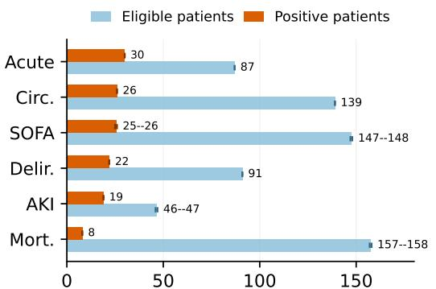  
Independent patients after waveform matching Figure 1: Independent patient support in the MIMIC-IV cohorts.

Pretrained physiological models provide a possible way for adaptation by transferring knowledge learned from large source datasets (Kiyasseh et al., 2021; Gopal et al., 2021). However, how to adapt a pretrained model to a new target distribution remains an important and complex decision. For example, it requires choosing which source checkpoint to transfer and how much of the model to update, which ranges from using a fixed encoder to partial or full parameter fine-tuning. The efectiveness of these choices can vary substantially across target tasks and distributions. Particularly, a specialized checkpoint may transfer well to a related outcome but poorly to another, while aggressive updating may help when suficient labeled data is available but overfit when labels are scarce. Thus, there is no universally efective adaptation strategy for a new clinical target.

This creates two challenges. The first is adaptation heterogeneity: the appropriate checkpoint and update rule can vary with the target clinical task and distribution. As a result, an adaptation strategy that works well for one target may perform poorly on another, making a fixed adaptation choice unreliable across diferent distributions. The second is selection uncertainty: determining which strategy to use requires comparing candidates using a small cohort for adaptation. With only a few labeled patients, these comparisons can be highly unstable, and the apparent advantage of one strategy may be driven by only a small number of patients. Together, these challenges make reliable adaptation dificult when target data is limited (Ben-David et al., 2010; Zhang et al., 2021; Guo et al., 2022).

In this work, we introduce AutoAdapt to address these challenges. It consists of two components: (1) The Adapter addresses adaptation heterogeneity by jointly composing choices of checkpoint, update, data, and input into complete recipes, capturing their interactions. (2) The Automator addresses selection uncertainty by comparing recipes based on the limited target data, while removing unreliable choices when the evidence is insuficient. Together, AutoAdapt enables task-specific adaptation under scarce labels. Our main contributions are summarized as follows:

• We introduce an extensible Adapter that represents adaptation strategies as complete recipes, jointly specifying the source checkpoint, update rule, target data policy, and input route. This allows diferent adaptation choices to be considered together rather than optimized independently.

• We develop a reliability-aware Automator that uses held-out patient predictions, task information, and label-free shift measures to construct a task-specific weighted recipe combination.

• We evaluated AutoAdapt across the ICU transfer, emergency care, and diagnostic ECG datasets. The results demonstrate improvements over fixed and existing adaptation strategies, including in settings with only one to six positive adaptation patients.

## 2 Related Work

Clinical time-series benchmarks made ICU prediction reproducible by fixing cohorts, observation windows, and outcomes (Harutyunyan et al., 2019). Physiological pretraining asks a complementary question: whether structure learned without target labels can support new tasks. CLOCS and 3KG exploit cross-view or temporal agreement in biosignals (Kiyasseh et al., 2021; Gopal et al., 2021), while general time-series models seek one representation that transfers broadly (Goswami et al., 2024). These methods make source knowledge available. They do not determine which source checkpoint should be trusted for a particular target outcome.

Domain adaptation studies distinguish a change in observed inputs from a change in the relation between inputs and labels (Ben-David et al., 2010). This distinction is especially important in medicine because performance can vary with site, time, and care process (Zhang et al., 2021; Guo et al., 2022). Frozen transfer, partial fine-tuning, LoRA, and full fine-tuning make diferent assumptions about how much of that relation remains stable (Hu et al., 2022). They are candidate responses to shift rather than a rule for deciding which response is supported by a small target cohort.

Several lines of work address parts of this decision. PRAM retrieves related local patients (Jeong et al., 2026), and OTTEHR transports structured EHR features across domains (Li et al., 2026). LEEP, LogME, and TransRate score the transferability of a representation (Nguyen et al., 2020; You et al., 2021; Huang et al., 2022). AutoPEFT searches over parameter-eficient updates (Zhou et al., 2024), while TEMPLATE ranks pretrained time-series models (Zhang et al., 2025). These approaches typically optimize one component of transfer or presume that the observed ranking is reliable. AutoAdapt instead compares complete recipes and treats the reliability of that comparison as part of the adaptation problem. It can use a specialist, update the model, or add a modality when the patient-level evidence supports that choice, and otherwise retain a predefined default recipe.

## 3 Problem Setting

We consider a target clinical prediction task t at a new site. Let V denote physiological waveforms, Z denote optional structured EHR variables, and $Y _ { t }$ denote the target outcome. The available source assets are a finite library $\mathcal { C } = \{ c _ { 1 } , \ldots , c _ { K } \}$ of pretrained checkpoints. A checkpoint may be a general

waveform encoder or an encoder later specialized for a source outcome. Checkpoint $c _ { k }$ was learned under source distribution $P _ { s _ { k } } ( V , Z , Y _ { k } )$ , whereas the target follows $P _ { t } ( V , Z , Y _ { t } )$ . Transfer may therefore involve both input shift and a change in the clinical prediction target:

$$
P _ { s _ { k } } ( V , Z ) \neq P _ { t } ( V , Z ) , \qquad P _ { s _ { k } } ( Y _ { k } \mid V , Z ) \neq P _ { t } ( Y _ { t } \mid V , Z ) .\tag{3.1}
$$

The first inequality captures changes in population, sensors, and acquisition. The second captures the fact that a source outcome may only be partially related to $Y _ { t } .$ AutoAdapt measures these two forms of compatibility separately.

Each target task specifies an index time $\tau ,$ observation length $O _ { t } ,$ gap $G _ { t } ,$ and prediction horizon $H _ { t }$ For patient $i ,$ the input contains waveform windows $X _ { i } = \big ( x _ { i j } \big ) _ { j = } ^ { m _ { i } } .$ and optional structured context $z _ { i }$ observed in $[ \tau - O _ { t } , \tau ]$ . The binary label $y _ { i }$ records whether the target event occurs in $\left( \tau + G _ { t } , \tau + G _ { t } + H _ { t } \right]$ The model outputs one patient risk $\widehat { p _ { i } } = \widehat { f _ { t } } ( X _ { i } , z _ { i } )$ after aggregating repeated-window scores. Taskspecific values of $O _ { t } , G _ { t } ,$ and $H _ { t }$ are reported in Appendix Table 4.

The target patients are divided into a small labeled adaptation cohort $\boldsymbol { A } _ { t }$ and a patient-disjoint evaluation cohort $\mathcal { E } _ { t }$ . All patient-specific model fitting and numerical combination-weight estimation use $\boldsymbol { A } _ { t }$ . Higher-level structural choices are treated separately, and their selection scope is stated in the experimental protocol. Because windows from one patient are correlated, the patient is the evidence unit for fitting, internal validation, and uncertainty. Evaluation labels do not fit candidate predictors or numerical combination weights.

## 4 Method

AutoAdapt separates two responsibilities that ordinary fine-tuning treats as one decision. The Adapter defines and executes a finite library of adaptation recipes. The Automator uses the small adaptation cohort to weight complete recipes for the current task. Figure 2 shows this interface. The separation allows the recipe library to grow without assuming that a larger search space can be ranked reliably from a few patients.

## 4.1 Adapter

Four candidate spaces. The Adapter starts from four finite, explicitly enumerated spaces:

$\mathcal { C } _ { t } \subseteq \mathcal { C }$ is the checkpoint space. It contains source representations compatible with the target signal geometry, including the general pretrained encoder, task-specialized encoders, and declared fixed checkpoint combinations.

$\mathcal { U } _ { t }$ is the update space. Its choices are source-head reuse, a new head on a frozen encoder, partial fine-tuning, LoRA, and full fine-tuning. Each choice specifies exactly which parameters may change.

$\mathcal { D } _ { t }$ is the target-data-policy space. A policy fixes class or patient weighting, the number and type of waveform windows sampled per patient, and the rule used to aggregate window predictions.

$\mathcal { M } _ { t }$ is the input-route space. Depending on data availability, it contains waveform only, EHR only, early fusion of waveform and EHR representations, and late fusion of their predictions.

These are spaces of concrete executable choices, not learned embedding spaces. Unavailable or incompatible choices are removed before adaptation. The valid recipe library for task t is therefore

$$
\begin{array} { r } { \mathcal { R } _ { t } = \{ ( c , u , d , m ) \in \mathcal { C } _ { t } \times \mathcal { U } _ { t } \times \mathcal { D } _ { t } \times \mathcal { M } _ { t } : \mathrm { v a l i d } _ { t } ( c , u , d , m ) = 1 \} . } \end{array}\tag{4.1}
$$

Here $r = ( c , u , d , m )$ is one complete recipe. The validity function checks, for example, that a waveform checkpoint receives the required channels and that a fusion route is proposed only when both modalities are present. The four choices are kept together because their efects interact. A specialist may work when frozen but overfit after full updating, and the useful waveform checkpoint may change when EHR context is added.

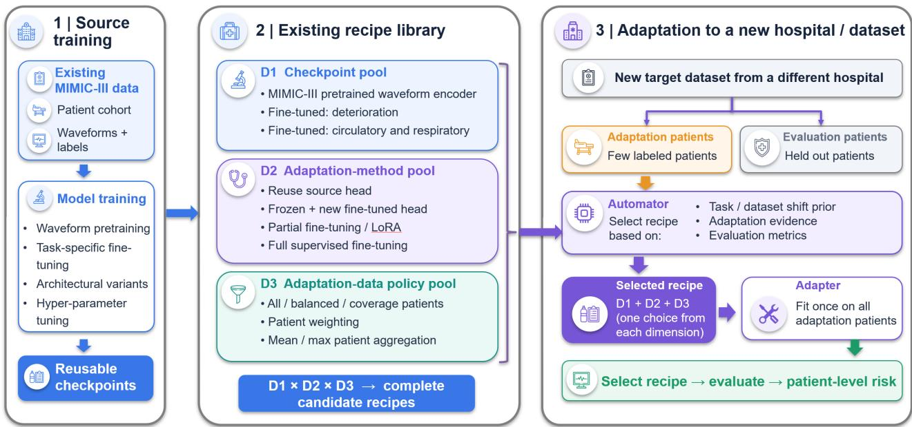  
Figure 2: Overview of AutoAdapt. The Adapter defines a recipe through its source representation, update capacity, target data policy, and input route. The Automator scores complete recipes using held-out adaptation patients. A shared evidence map forms a compact weighted combination, while the reliability check protects a predefined default recipe when the comparison is uncertain. Participating recipes are refit on the adaptation cohort before evaluation begins.

Executing a recipe. For recipe $^ { r , }$ let $S _ { d } ( i )$ be the waveform windows selected for patient i, $w _ { d } ( y _ { i } )$ its class weight, and $A _ { d }$ its patient-level aggregation rule. The route m determines whether the predictor consumes $x _ { i j } , z _ { i } ,$ or both. For an EHR-only route, waveform windows are ignored and $A _ { d }$ is the identity. The Adapter fits only the parameter set $\check { \Omega } _ { u } ( c , m )$ permitted by update choice u:

$$
\widehat { \omega } _ { t } ^ { r } = \arg \operatorname* { m i n } _ { \omega \in \Omega _ { u } ( c , m ) } \frac { 1 } { | \mathcal { A } _ { t } | } \sum _ { i \in \mathcal { A } _ { t } } w _ { d } ( y _ { i } ) \ell ( y _ { i } , A _ { d } ( \{ f _ { c , m } ( x _ { i j } , z _ { i } ; \omega ) : j \in S _ { d } ( i ) \} ) ) .\tag{4.2}
$$

Here $f _ { c , m }$ is the predictor assembled from checkpoint c and input route $m ,$ and ℓ is the supervised target loss (binary cross-entropy for the binary tasks studied here). The loss is averaged over patients rather than windows, so a long recording does not contribute more independent evidence. Equation 4.2 produces one fitted patient-risk predictor $\widehat { f } _ { t } ^ { r }$ for every valid recipe.

## 4.2 Automator

The Automator runs separately for every target task and returns weights over $\mathcal { R } _ { t }$ . It uses three inputs: a task and shift prior, internal evidence from the adaptation cohort, and an estimate of how reliable that evidence is. The same Automator parameters are shared across tasks; only its inputs change.

Task and shift prior. For each valid recipe $r = ( c , u , d , m )$ , the prior combines the clinical relation between source checkpoint c and target task t with label-free compatibility between the source and target representations produced by route m:

$$
\pi _ { t } ( r ) = \alpha \sin _ { \mathrm { c l i n i c a l } } ( t , c ) + ( 1 - \alpha ) \left[ 1 - \Delta _ { \mathrm { i n p u t } } ( t , c , m ) \right] .\tag{4.3}
$$

Here $\alpha \in [ 0 , 1 ]$ is a global mixing coeficient and $\mathrm { s i m } _ { \mathrm { c l i n i c a l } } ( t , c ) \in [ 0 , 1 ]$ is the Jaccard overlap between fixed source- and target-task concept sets. Thus it is one when the two sets match and zero when they share no concept. The quantity $\Delta _ { \mathrm { i n p u t } } ( t , c , m ) \in [ 0 , 1 ]$ measures how easily unlabeled source patients can be distinguished from target adaptation patients under checkpoint c and route m; zero means indistinguishable and one means completely separated. Fixed checkpoint combinations average their component priors. Neither term uses clinical outcome labels.

Evidence from adaptation patients. No additional patient cohort is reserved for this step. Instead, $\boldsymbol { A } _ { t }$ is partitioned into patient-level internal folds. For each fold, recipe r is fitted on the other folds and predicts the patients in the held-out fold. Let $\widetilde { p } _ { i , r } ^ { \prime }$ denote the resulting prediction for patient $i ;$ the prime indicates that patient i was excluded from the corresponding fit. Repeating this process yields exactly one internally held-out prediction for every patient in $\boldsymbol { A } _ { t } ,$ without using $\breve { \mathcal { E } } _ { t } .$ . Let $S _ { t }$ denote the task-appropriate selection score, oriented so that larger is better. The adaptation utility is

$$
Q _ { t } ( r ) = S _ { t } \big ( \{ ( y _ { i } ,  { \widetilde { p } } _ { i , r } ^ { \prime } ) : i \in  { \mathcal { A } } _ { t } \} \big ) .\tag{4.4}
$$

The score $S _ { t }$ may be any prespecified validation utility appropriate to the task. Crucially, $Q _ { t }$ scores the complete tuple $( c , u , d , \mathbf { \bar { \ m } } ) ,$ ; the four dimensions are not ranked independently.

Combining recipes from adaptation evidence. A high $Q _ { t } ( r )$ from a few patients does not by itself justify replacing the predefined default recipe. The recipe feature vector $\bar { \phi _ { t } } ( r )$ contains its internally held-out utility, the fraction of leave-one-positive-patient recomputations that preserve its advantage, its prior $\pi _ { t } ( r )$ , its average prediction disagreement with other recipes, its number of updated parameters, and one-hot indicators of $( c , u , d , m )$ . The task evidence vector $h _ { t }$ contains the numbers of positive and negative adaptation patients, adaptation prevalence, and the fraction of recipes with identifiable internal scores. A linear scoring map with coeficients θ produces

$$
\begin{array} { r } { \boldsymbol { a } _ { t } ( \boldsymbol { r } ) = \boldsymbol { \theta } ^ { \top } \left[ \phi _ { t } ( \boldsymbol { r } ) ; \phi _ { t } ( \boldsymbol { r } ) \otimes h _ { t } \right] , \qquad \widetilde { \boldsymbol { w } } _ { t } = \mathcal { N } _ { \lambda } ( ( \boldsymbol { a } _ { t } ( \boldsymbol { r } ) ) _ { \boldsymbol { r } \in \mathcal { R } _ { t } } ) , } \end{array}\tag{4.5}
$$

where $\mathcal { N } _ { \lambda }$ is the globally fixed regularized map from recipe scores to recipe-combination weights. The coeficients $\theta ,$ the choice between nonnegative weights and a regularized signed correction, and the regularization λ are system-level structural choices. Their selection scope is reported in Section $5 ;$ once a configuration is chosen, these values remain fixed while its numerical task-specific weights are estimated from $\boldsymbol { \mathcal { A } } _ { t } .$ A one-hot vector is the special case of selecting one recipe.

Finally, a fixed reliability rule maps positive-patient support, the bootstrap probability that the weighted combination improves over the default, and the leave-one-positive-patient stability defined above to $\rho _ { t } \in [ 0 , 1 ]$ . The reference recipe ${ \boldsymbol { r } } _ { 0 , t }$ is a simple valid recipe declared as the default before target evaluation. Let $e _ { r _ { 0 , t } }$ be its one-hot weight vector. The final weights and prediction are

$$
w _ { t } = \rho _ { t } \widetilde { w } _ { t } + ( 1 - \rho _ { t } ) e _ { r _ { 0 , t } } , \qquad \widehat { f } _ { t } ( X _ { i } , z _ { i } ) = \sum _ { r \in \mathcal { R } _ { t } } w _ { t } ( r ) \widehat { f } _ { t } ^ { r } ( X _ { i } , z _ { i } ) .\tag{4.6}
$$

If the adaptation comparison is not identifiable, $\rho _ { t } = 0$ and the default recipe is preserved. Otherwise, the Adapter refits every recipe with nonzero weight on all of $\boldsymbol { A } _ { t }$ . The weights, fitted recipes, and patient aggregation rules are then locked before $\mathcal { E } _ { t }$ is scored. Adding a checkpoint, update rule, data policy, or modality route expands $\mathcal { R } _ { t }$ without changing the Automator interface.

## 5 Experimental Setup

## 5.1 Datasets And Baselines

The evaluation separates hospital transfer from more distant changes in care setting and acquisition. MIMIC-III supplies the source waveform checkpoints (Johnson et al., 2016; Goldberger et al., 2000). ALOTT is the primary method-development target because it changes the hospital while preserving the ICU setting. It tests whether AutoAdapt can reuse source physiology for new outcomes without conflating the result with a completely diferent acquisition protocol (Lawrence et al., 2025). MIMIC-IV is a second development benchmark and provides the sharper scarcity test through its much smaller EHR and waveform cohort (Johnson et al., 2023; Moody et al., 2022). The remaining datasets test where the same decision rule remains useful. MC-MED changes the setting from intensive care to emergency care (Kansal et al., 2025). CPSC 2018 and Ningbo replace continuous bedside monitoring with diagnostic ECGs acquired under diferent protocols (Liu et al., 2018; Zheng et al., 2020). We report results by dataset because these outcomes and evidence regimes are not interchangeable. Every included task has a reproducible prediction time and a patient-level outcome. We consider the following baselines: (1) standard few-shot baselines, including a logistic, prototype, or 5-NN head on a frozen encoder, partial fine-tuning, LoRA, or full fine-tuning (Hu et al., 2022), (2) existing few-shot adaptation baselines: PRAM, PRAM-MI, and OTTEHR (Jeong et al., 2026; Li et al., 2026), and (3) recent automatic composition rules. LoraHub learns convex candidate weights from adaptation predictions (Huang et al., 2024); AdaMerging estimates weights by entropy minimization on unlabeled target predictions (Yang et al., 2024); and HOSO selects the blend between the source route and a target-updated route using held-out adaptation evidence (Vorster et al., 2026).

## 5.2 Adaptation Protocol

We convert each waveform into a five-minute, 125-Hz input on the masked channel grid used by the source model. EHR features use only measurements available before the prediction time. Patients are disjoint across splits whenever patient identifiers are available. For the binary experiments, the generic score $S _ { t }$ is instantiated as patient-level AUROC. We instantiate $\Delta _ { \mathrm { i n p u t } }$ as $2 | A _ { \mathrm { d o m a i n } } ^ { \bullet } - 1 / 2 |$ , where Adomain is the cross-validated discrimination score of a balanced linear classifier that separates source from adaptation-patient embeddings. The clinical concept sets used in the Jaccard term are fixed before task evaluation.

Each ALOTT task uses the same 64 adaptation patients for every method, with 32 positive and 32 negative patients. Training is capped at eight waveform windows per patient so that recording duration cannot substitute for patient support. Recipe heads and task-specific evidence are learned only from these adaptation patients. The EHR baseline follows the same label budget. For the reported ALOTT analysis, combination weights and calibration are fitted on adaptation patients.

The available input-route space depends on the dataset. ALOTT exposes EHR-only, waveform-only, early-fusion, and late-fusion recipes; the selected combinations contain a fusion route in four of the six tasks in Table 1. MC-MED likewise allows EHR, waveform, and fusion, with EHR as the declared default recipe. The primary MIMIC-IV comparison fixes the route to waveform-only, while its EHR model is reported as a separate target-site baseline. CPSC and Ningbo contain no structured EHR route, so their recipe libraries are waveform-only. Thus $\mathcal { M } _ { t }$ is selected where multiple modalities are available and becomes a singleton where they are not.

## 6 Experimental Results

## 6.1 Main Results on ALOTT ICU Transfer

The ALOTT registry supplies twenty duration-qualified monitor-event tasks at a new ICU. Table 1 presents six clinically central tasks, and Appendix Table 3 reports the remaining fourteen. Every method receives the same 64 adaptation patients for each task. The comparison therefore measures how the same small cohort is used.

The strongest displayed baseline is LoraHub at .656 mean AUROC. In contrast, AutoAdapt uses adaptation evidence to construct a task-specific weighted combination.

AutoAdapt uses one shared evidence map across the six reported tasks and achieves a mean AUROC of .701. It leads the displayed baselines on five of six tasks, while OTTEHR is stronger on oxygenation crisis. Across the full twenty-task roster, AutoAdapt reaches .686 mean AUROC versus .652 for the previous same-cohort reference. The consistent gains support the main mechanism: adaptation evidence is more useful when it controls a regularized combination than when it makes a winner-take-all choice. ALOTT is used for method development; the later datasets test the same selection principle under larger acquisition changes.

## 6.2 Extreme Few-Shot Selection On MIMIC-IV

MIMIC-IV tests the selector where adaptation evidence is most fragile: across five fixed patient partitions and six tasks, each adaptation split contains only one to six positive patients, and every recipe is selected using only those adaptation patients. Table 2 shows that AutoAdapt leads the displayed baselines on every task. Its shared evidence map combines patient-held-out adaptation performance with task similarity, distribution shift, target prediction geometry, and positive-patient support, without learning task- or fold-specific coeficients. This structure keeps weak evidence from dominating merely because many correlated waveform windows are available. The main finding is that reliable task-specific combinations can still be selected when independent positive patients, rather than raw window count, are the limiting resource.

Table 1: MIMIC-III→ALOTT few-shot comparison on six clinically central tasks selected for clinical relevance, patient support, waveform coverage, and task dificulty. Values are patient-level AUROC. Every method uses the same 32 positive and 32 negative adaptation patients per task.
<table><tr><td>Method</td><td>Ventr.</td><td>Crit. rhythm</td><td>Oxy. crisis</td><td>Short VT asystole ST shift</td><td>Pause/</td><td></td><td>Mean</td></tr><tr><td>Fixed recipe baselines Frozen source encoder + target</td><td>.512</td><td></td><td></td><td></td><td></td><td></td><td></td></tr><tr><td>head</td><td></td><td>.556</td><td>.515</td><td>.516</td><td>.567</td><td>.622</td><td>.548</td></tr><tr><td>Full fine-tuning LoRA</td><td>.642</td><td>.663</td><td>.560</td><td>.677</td><td>.654</td><td>.731</td><td>.655</td></tr><tr><td></td><td>.640</td><td>.662</td><td>.557</td><td>.672</td><td>.656</td><td>.716</td><td>.651</td></tr><tr><td>Existing adaptation methods</td><td></td><td></td><td></td><td></td><td></td><td></td><td></td></tr><tr><td>PRAM (Jeong et al., 2026)</td><td>.517</td><td>.515</td><td>.516</td><td>.545</td><td>.487</td><td>.518</td><td>.516</td></tr><tr><td>PRAM-MI (Jeong et al., 2026)</td><td>.527</td><td>.514</td><td>.524</td><td>.545</td><td>.487</td><td>.526</td><td>.520</td></tr><tr><td>OTTEHR (Li et al., 2026)</td><td>.552</td><td>.478</td><td>.629</td><td>.530</td><td>.581</td><td>.547</td><td>.553</td></tr><tr><td>LoraHub (Huang et al., 2024)</td><td>.634</td><td>.661</td><td>.514</td><td>.700</td><td>.657</td><td>.770</td><td>.656</td></tr><tr><td>AdaMerging (Yang et al., 2024) HOSO (Vorster et al., 2026)</td><td>.549 .636</td><td>.627 .662</td><td>.514 .515</td><td>.600 .668</td><td>.642 .654</td><td>.716</td><td>.608</td></tr><tr><td></td><td></td><td></td><td></td><td></td><td></td><td>.753</td><td>.648</td></tr><tr><td>AUTOADAPT</td><td>.677</td><td>.684</td><td>.612</td><td>.729</td><td>.692</td><td>.810</td><td>.701</td></tr></table>

Table 2: MIMIC-IV scarce-label stress test using patient-level AUROC averaged over five evaluation runs. Every method uses the same adaptation and evaluation patients in each run. Underlining marks the strongest non-AutoAdapt result and boldface marks the highest result.

<table><tr><td>Method</td><td>Acute</td><td>Circ.</td><td>SOFA</td><td>Delir.</td><td>AKI</td><td>Mort.</td><td>Mean</td></tr><tr><td>Fixed recipe baselines</td><td></td><td></td><td>.640</td><td></td><td></td><td></td><td></td></tr><tr><td>Frozen source encoder + target head</td><td>.545</td><td>.596</td><td></td><td>.547</td><td>.434</td><td>.637</td><td>.567</td></tr><tr><td>Full fine-tuning</td><td>.538</td><td>.585</td><td>.591</td><td>.519</td><td>.465</td><td>.665</td><td>.560</td></tr><tr><td>LoRA</td><td>.564</td><td>.586</td><td>.606</td><td>.513</td><td>.477</td><td>.685</td><td>.572</td></tr><tr><td>Existing-work baselines</td><td></td><td></td><td></td><td></td><td></td><td></td><td></td></tr><tr><td>PRAM (Jeong et al., 2026)</td><td>.574</td><td>.605</td><td>.669</td><td>.548</td><td>.468</td><td>.649</td><td>.585</td></tr><tr><td>PRAM-MI (Jeong et al., 2026)</td><td>.565</td><td>.601</td><td>.657</td><td>.544</td><td>.464</td><td>.650</td><td>.580</td></tr><tr><td>OTTEHR (Li et al., 2026)</td><td>.486</td><td>.465</td><td>.583</td><td>.495</td><td>.508</td><td>.576</td><td>.519</td></tr><tr><td>LoraHub (Huang et al., 2024)</td><td>.542</td><td>.649</td><td>.650</td><td>.540</td><td>.405</td><td>.582</td><td>.561</td></tr><tr><td>AdaMerging (Yang et al., 2024)</td><td>.553</td><td>.614</td><td>.586</td><td>.539</td><td>.414</td><td>.613</td><td>.553</td></tr><tr><td>HOSO (Vorster et al., 2026)</td><td>.534</td><td>.660</td><td>.659</td><td>.536</td><td>.415</td><td>.582</td><td>.564</td></tr><tr><td>Ours</td><td></td><td></td><td></td><td></td><td></td><td></td><td></td></tr><tr><td>AUTOADAPT</td><td>.847</td><td>.934</td><td>.887</td><td>.842</td><td>.904</td><td>.847</td><td>.877</td></tr></table>

## 6.3 Cross-Dataset Transfer On MC-MED And Diagnostic ECG

The recipe library is useful only if it avoids forcing source physiology onto an incompatible target. MC-MED tests transfer from ICU monitoring to emergency care, while CPSC and Ningbo replace continuous bedside signals with diagnostic ECGs. As Figure 4 shows, AutoAdapt retains the local EHR route on MC-MED unless adaptation evidence supports waveform fusion, but makes greater use of source waveform features when ECG structure remains compatible on CPSC and Ningbo. The cross-dataset finding is therefore not that source representations should always be reused, but that adaptation should depend on whether their signal structure survives the target shift. CPSC does not provide patient identifiers, so patient-disjoint splitting cannot be guaranteed for that dataset.

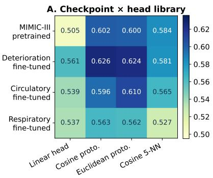

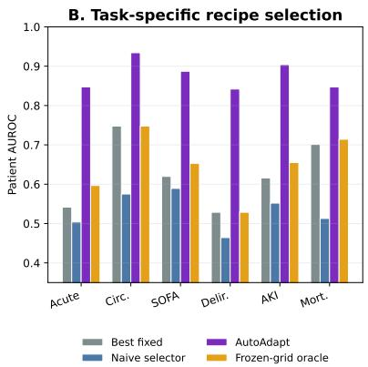

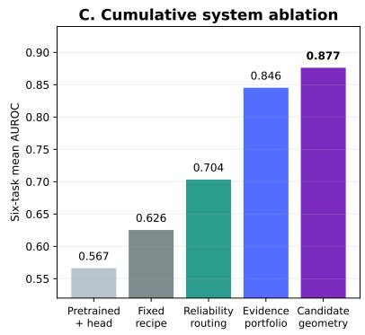

Figure 3: Checkpoint and recipe analysis on MIMIC-IV. Panel A tests source checkpoint and head pairings. Panel B compares a fixed recipe, naive adaptation-only selection, and the reliability-aware Automator. Panel C adds the Adapter and Automator components cumulatively.  
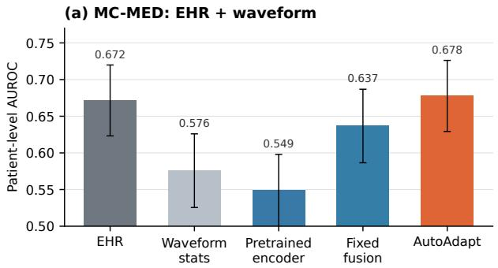  
(b) Diagnostic ECG: waveform only

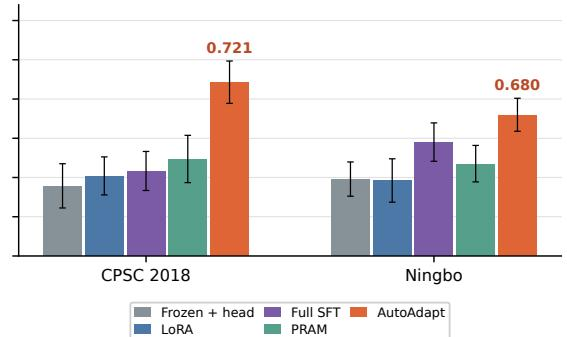  
Figure 4: Cross-dataset comparisons. Panel A reports MC-MED macro AUROC over four tasks with suficient patient support, comparing local EHR, waveform transfer, fixed fusion, and AutoAdapt. Panel B reports macro AUROC over five shared diagnostic ECG tasks in CPSC and Ningbo. Methods use the same target folds within each dataset. The reference line marks chance AUROC.

## 6.4 Checkpoint And Prediction-Head Analysis

A simpler system could choose a checkpoint and prediction head independently. Figure 3A tests this shortcut by pairing four source encoders with four frozen heads on the same target patients. Mean AUROC ranges from .505 to .626 across these pairs. The deterioration checkpoint with a cosine prototype is strongest on average, but the preferred pair changes across tasks. More importantly, the relative order of heads changes with the representation. This interaction rules out independent component ranking as an explanation for AutoAdapt and motivates selection over complete recipes.

## 6.5 Reliability-Aware Selection Analysis

Selecting the largest internal score is the most direct alternative to the Automator. We compare that rule with one strong fixed recipe and the complete reliability-aware selector while holding the candidate library and target patients constant in Figure 3B. Naive selection often overreacts to an unstable few-shot ranking and can be worse than keeping a fixed recipe. Task and shift priors narrow the plausible choices, while the reliability check rejects changes that lack patient-level support. Weighted combinations and target prediction geometry then preserve complementary candidates without trusting a single noisy winner. The central finding is therefore not that a larger search space is inherently better, but that reliability-aware evidence makes a diverse search space usable.

## 6.6 Adapter and Automator Ablation Study

Figure 3C presents the cumulative ablation and tests whether a larger library alone explains the result. The stages start with the general pretrained encoder, add the strongest fixed recipe, introduce task and shift routing, and finally apply complete recipe selection with the reliability gate. Each component produces a cumulative improvement, but expanding the Adapter alone explains only the first gain. The larger improvement appears when the Automator routes among those alternatives using reliability and shift evidence. Keeping checkpoint, update-method, and data-policy evidence separate prevents one strong signal from being diluted, while candidate-level target geometry distinguishes redundant predictions from complementary ones. The ablation therefore supports the intended division of labor: the Adapter supplies useful alternatives, and the Automator decides when and how to use them.

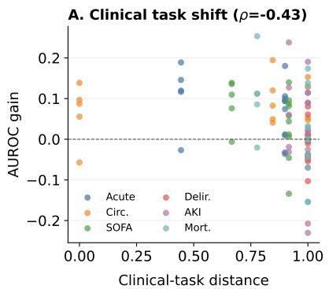

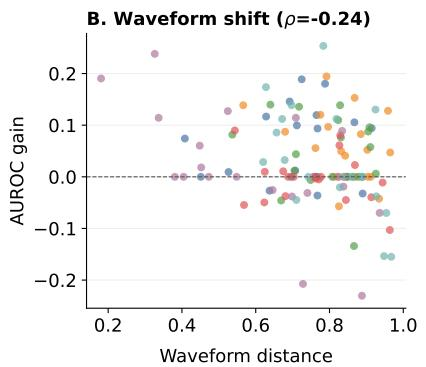

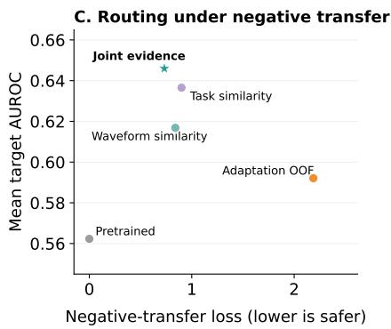  
Figure 5: Checkpoint routing under distribution shift. Panels A and B show how transfer gain changes with task distance and waveform distance. Panel C compares routing rules. Every point uses the same target patients. Evaluation labels measure transfer gain but do not select a checkpoint.

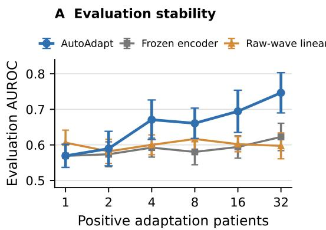

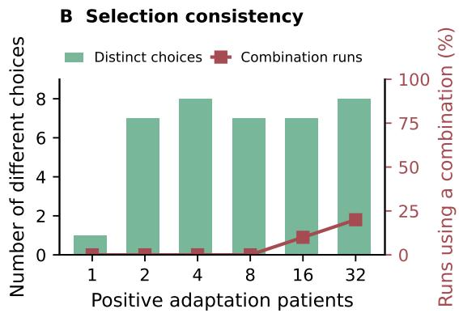  
Figure 6: Stability on ALOTT new-pressor prediction as the adaptation panel grows from one to 32 positive patients, with an equal number of negative patients. Panel A reports evaluation AUROC over ten repeated panels against two fixed baselines. Panel B reports the number of distinct selections and the fraction using a recipe combination.

## 6.7 Clinical-Task And Waveform-Shift Analysis

The prior assumes that clinical relation and signal compatibility describe diferent parts of transfer. We test this assumption with a fixed target head and data policy so that Figure 5 isolates source checkpoint routing. Clinical task distance correlates at −.43 with specialist transfer gain, while waveform distance correlates at −.24. Each association is informative but incomplete. Combining both signals with adaptation evidence raises mean AUROC from .562 to .646 and reduces harmful transfer by $6 7 \%$ relative to adaptation-only routing. The task relation identifies source knowledge that could matter, while the target waveform reveals whether that knowledge remains compatible with the new acquisition distribution.

## 6.8 Checkpoint-Pool Composition Analysis

We grow the source pool from the general pretrained encoder to test whether checkpoint count alone helps. The deterioration specialist raises mean routing AUROC from .562 to .641, and the circulatory specialist raises it to .646. The respiratory specialist is never selected and adds no gain. The library therefore benefits from complementary physiological knowledge, not from accumulating redundant checkpoints.

## 6.9 Adaptation-Patient Budget And Stability Analysis

To test the MIMIC-IV failure mode directly, we vary positive-patient support rather than total window count. Ten balanced ALOTT adaptation panels are drawn at each budget from one to 32 positives while evaluation remains fixed (Figure 6). With one positive patient, the support rule always retains the pretrained default. From four positives onward, AutoAdapt exceeds both fixed baselines and reaches .747 mean AUROC at 32. Diferent panels still select diferent recipes, showing that more independent outcomes strengthen the gate without making the choice deterministic.

## 7 Conclusion

Adapting a clinical model with a few labeled patients is a decision problem as much as an optimization problem. The useful source checkpoint, update rule, data policy, and modality route change across tasks, while the cohort used to compare them may contain only a handful of positive outcomes. AutoAdapt addresses these two constraints with an extensible Adapter and a patient-reliability-aware Automator. The experiments show that this separation turns heterogeneous source models into useful task-specific predictors, while the predefined default limits unsupported transfer under larger shifts. Reliable recipe selection provides a practical path for reusing clinical models where target labels are scarce and no single adaptation rule is consistently appropriate.

## References

Ben-David, S., Blitzer, J., Crammer, K., Kulesza, A., Pereira, F., and Vaughan, J. W. A theory of learning from diferent domains. Machine Learning, 79:151–175, 2010. doi: 10.1007/s10994-009-5152-4. 2

Ely, E. W., Margolin, R., Francis, J., May, L., Truman, B., Dittus, R., Sperof, T., Gautam, S., Bernard, G. R., and Inouye, S. K. Evaluation of delirium in critically ill patients: validation of the confusion assessment method for the intensive care unit (CAM-ICU). Critical Care Medicine, 29(7):1370–1379, 2001. doi: 10.1097/00003246-200107000-00012. 13

Goldberger, A. L., Amaral, L. A., Glass, L., Hausdorf, J. M., Ivanov, P. C., Mark, R. G., Mietus, J. E., Moody, G. B., Peng, C.-K., and Stanley, H. E. Physiobank, physiotoolkit, and physionet: components of a new research resource for complex physiologic signals. circulation, 101(23):e215–e220, 2000. 5

Gopal, B., Han, R., Raghupathi, G., Ng, A., Tison, G., and Rajpurkar, P. 3KG: Contrastive learning of 12-lead electrocardiograms using physiologically-inspired augmentations. In Proceedings of Machine Learning for Health, volume 158 of Proceedings of Machine Learning Research, pp. 156–167. PMLR, 2021. URL https://proceedings.mlr.press/v158/gopal21a.html. 1, 2

Goswami, M., Szafer, K., Choudhry, A., Cai, Y., Li, S., and Dubrawski, A. MOMENT: A family of open time-series foundation models. In Proceedings of the 41st International Conference on Machine Learning, volume 235 of Proceedings of Machine Learning Research, pp. 16115–16152. PMLR, 2024. URL https://proceedings.mlr.press/v235/goswami24a.html. 2

Guo, L. L., Pfohl, S. R., Fries, J., Johnson, A. E. W., Posada, J., Aftandilian, C., Shah, N., and Sung, L. Evaluation of domain generalization and adaptation on improving model robustness to temporal dataset shift in clinical medicine. Scientific Reports, 12:2726, 2022. doi: 10.1038/s41598-022-06484-1. 2

Harutyunyan, H., Khachatrian, H., Kale, D. C., Ver Steeg, G., and Galstyan, A. Multitask learning and benchmarking with clinical time series data. Scientific Data, 6:96, 2019. doi: 10.1038/s41597-019-0103-9. URL https://doi.org/10.1038/s41597-019-0103-9. 2

Hu, E. J., Shen, Y., Wallis, P., Allen-Zhu, Z., Li, Y., Wang, S., Wang, L., and Chen, W. LoRA: Low-rank adaptation of large language models. In International Conference on Learning Representations, 2022. URL https://openreview.net/forum?id=nZeVKeeFYf9. 2, 6

Huang, C., Liu, Q., Lin, B. Y., Pang, T., Du, C., and Lin, M. LoraHub: Eficient cross-task generalization via dynamic LoRA composition. In First Conference on Language Modeling, 2024. URL https:// openreview.net/forum?id=lyRpY2bpBh. 6, 7

Huang, L.-K., Huang, J., Rong, Y., Yang, Q., and Wei, Y. Frustratingly easy transferability estimation. In Proceedings of the 39th International Conference on Machine Learning, volume 162 of Proceedings of Machine Learning Research, pp. 9201–9225. PMLR, 2022. URL https://proceedings.mlr.press/v162/ huang22d.html. 2

Jeong, I., Lee, T., Kim, B., Park, J.-H., Kim, Y., and Lee, H. Pram: Post-hoc retrieval augmentation for parameter-free domain adaptation of icu clinical prediction models. medRxiv, pp. 2026–04, 2026. 2, 6, 7

Johnson, A. E. W., Pollard, T. J., Shen, L., Lehman, L.-w. H., Feng, M., Ghassemi, M., Moody, B., Szolovits, P., Celi, L. A., and Mark, R. G. MIMIC-III, a freely accessible critical care database. Scientific Data, 3: 160035, 2016. doi: 10.1038/sdata.2016.35. 1, 5

Johnson, A. E. W., Bulgarelli, L., Shen, L., Gayles, A., Shammout, A., Horng, S., Pollard, T. J., Hao, S., Moody, B., Gow, B., Lehman, L.-w. H., Celi, L. A., and Mark, R. G. MIMIC-IV, a freely accessible electronic health record dataset. Scientific Data, 10:1, 2023. doi: 10.1038/s41597-022-01899-x. 1, 5

Kansal, A., Chen, E., Jin, T., Rajpurkar, P., Kim, D., et al. Multimodal clinical monitoring in the emergency department (mc-med). Published online March, 3, 2025. 5

Khwaja, A. KDIGO clinical practice guidelines for acute kidney injury. Nephron Clinical Practice, 120(4): c179–c184, 2012. doi: 10.1159/000339789. 13

Kiyasseh, D., Zhu, T., and Clifton, D. A. CLOCS: Contrastive learning of cardiac signals across space, time, and patients. In Proceedings of the 38th International Conference on Machine Learning, volume 139 of Proceedings ofMachine Learning Research, pp. 5606–5615. PMLR, 2021. URL https://proceedings. mlr.press/v139/kiyasseh21a.html. 1, 2

Lawrence, J., Rayo, M., and Huerta, T. ALarms, Outcomes Telemetry with Timing (ALOTT): a Bedside-EMR Database. PhysioNet, March 2025. doi: 10.13026/sbq5-dy17. URL https://doi.org/10.13026/ sbq5-dy17. Version 1.0.0. 5

Li, W., Ahmed, S., Park, Y. P., and Dao Duc, K. Transport-based transfer learning on electronic health records: application to detection of treatment disparities. Journal of the American Medical Informatics Association, 33(1):15–25, 2026. doi: 10.1093/jamia/ocaf134. 2, 6, 7

Liu, F., Liu, C., Zhao, L., Zhang, X., Wu, X., Xu, X., Liu, Y., Ma, C., Wei, S., He, Z., Li, J., and Kwee, E. N. Y. An open access database for evaluating the algorithms of electrocardiogram rhythm and morphology abnormality detection. Journal of Medical Imaging and Health Informatics, 8(7):1368–1373, 2018. doi: 10.1166/jmihi.2018.2442. 5

Moody, B., Hao, S., Gow, B., Pollard, T., Zong, W., and Mark, R. MIMIC-IV Waveform Database. PhysioNet, July 2022. doi: 10.13026/a2mw-f949. URL https://doi.org/10.13026/a2mw-f949. Version 0.1.0. 1, 5

Nguyen, C., Hassner, T., Seeger, M., and Archambeau, C. LEEP: A new measure to evaluate transferability of learned representations. In Proceedings of the 37th International Conference on Machine Learning, volume 119 of Proceedings ofMachine Learning Research, pp. 7294–7305. PMLR, 2020. URL https://proceedings.mlr.press/v119/nguyen20b.html. 2

Vincent, J.-L., Moreno, R., Takala, J., Willatts, S., De Mendonca, A., Bruining, H., Reinhart, K., Suter, P. M., and Thijs, L. G. The SOFA (sepsis-related organ failure assessment) score to describe organ dysfunction/failure. Intensive Care Medicine, 22:707–710, 1996. doi: 10.1007/BF01709751. 13

Vorster, C., Maniparambil, M., O’Connor, N., Murphy, N., and Molloy, D. Hold-one-shotout (HOSO) for validation-free few-shot CLIP adapters. In Proceedings of the IEEE/CVF Conference on Computer Vision and Pattern Recognition Findings, pp. 7820–7829, 2026. URL https://openaccess.thecvf.com/content/CVPR2026F/html/Vorster\_Hold-One-Shot-Out\_HOSO\_ for\_Validation-Free\_Few-Shot\_CLIP\_Adapters\_CVPRF\_2026\_paper.html. 6, 7

Yang, E., Wang, Z., Shen, L., Liu, S., Guo, G., Wang, X., and Tao, D. AdaMerging: Adaptive model merging for multi-task learning. In International Conference on Learning Representations, 2024. URL https://openreview.net/forum?id=nZP6NgD3QY. 6, 7

You, K., Liu, Y., Wang, J., and Long, M. LogME: Practical assessment of pre-trained models for transfer learning. In Proceedings of the 38th International Conference on Machine Learning, volume 139 of Proceedings of Machine Learning Research, pp. 12133–12143. PMLR, 2021. URL https://proceedings. mlr.press/v139/you21b.html. 2

Zhang, H., Dullerud, N., Seyyed-Kalantari, L., Morris, Q., Joshi, S., and Ghassemi, M. An empirical framework for domain generalization in clinical settings. In Proceedings of the Conference on Health, Inference, and Learning, pp. 279–290. ACM, 2021. doi: 10.1145/3450439.3451878. 2

Zhang, W., Chen, X., Li, X., Chen, K., Guan, W., and Nie, L. Unified transferability metrics for time series foundation models. In Belgrave, D., Zhang, C., Lin, H., Pascanu, R., Koniusz, P., Ghassemi, M., and Chen, N. (eds.), Advances in Neural Information Processing Systems, volume 38, pp. 41155–41178. Curran Associates, Inc., 2025. doi: 10.52202/085713-1374. URL https://proceedings.neurips.cc/ paper\_files/paper/2025/file/3adfe6e3d8da4a75d174f466e1efc039-Paper-Conference.pdf. 2

Zheng, J., Zhang, J., Danioko, S., Yao, H., Guo, H., and Rakovski, C. A 12-lead electrocardiogram database for arrhythmia research covering more than 10,000 patients. Scientific Data, 7:48, 2020. doi: 10.1038/s41597-020-0386-x. 5

Zhou, H., Wan, X., Vulić, I., and Korhonen, A. AutoPEFT: Automatic configuration search for parametereficient fine-tuning. Transactions of the Associationfor Computational Linguistics, 12:525–542, 2024. doi: 10.1162/tacl\_a\_00662. URL https://aclanthology.org/2024.tacl-1.29/. 2

## A Detailed Task And Data Contracts

Task labels are constructed from clinical events after the waveform cutof. In Table 4, O/G/H gives the observation period, blank period, and prediction horizon in hours. Acute deterioration combines new organ support with death. Circulatory deterioration uses new pressor initiation. SOFA requires a future component increase of at least two (Vincent et al., 1996). Delirium requires a new positive CAM record (Ely et al., 2001). AKI uses incident urine output KDIGO stage 2 or 3 (Khwaja, 2012). Dynamic mortality uses future in hospital death. Windows are masked when the future state cannot be observed.

The primary MIMIC-IV input is waveform only. Every interval is resampled to 125 Hz and mapped to the fixed 62 channel vocabulary. Missing channels are zero with an explicit presence mask. We corrected inconsistent aliases for respiration and aVR before running the reported comparison. Labels and patient partitions remain unchanged.

## B Reproducibility Details

Evaluation contract. Patient level AUROC is the primary metric. The MIMIC-IV table uses five executions recorded in a fixed manifest. Each execution assigns about 20% of patients to adaptation. The remaining patients are used for evaluation. Every MIMIC-IV analysis reuses these assignments and seeds. CPSC uses five native folds. Duplicate records remain in one fold, but patient disjointness cannot be established because identifiers are unavailable. Ningbo uses three participant disjoint folds with one ECG per participant. Their results are reported separately. The primary MIMIC-IV comparison uses waveform input. Structured EHR defines the outcome but does not enter the model. The multimodal analysis adds only features observed before the prediction cutof.

Model and optimization. The source input is the final five minutes of the observation window on 62 canonical physical channels at 125 Hz, giving x ∈ R62×37,500. Missing channels are zero-filled with a presence mask. A magnitude FFT companion uses 250 samples and expands the input to 124 internal channels. Raw physical units are retained in the time branch. Only FFT segments are standardized. Concatenating 25 samples from each internal channel yields 1,500 tokens. TF-dual contains eight Transformer blocks with width 512. It uses eight attention heads, rotary attention, and an MLP width of 2,048. Mean pooling produces a 512 dimensional embedding. The checkpoint contains 37.7M parameters. The active classification path uses 26.81M of them.

The source manifest contains 398,204 one hour MIMIC-III windows. The loader exposes 4,778,448 five minute segments without overlap. Pretraining uses 3,500 optimizer steps with global batch 512. The deterioration, respiratory, and circulatory source tasks use 484,667, 551,232, and 578,274 windows. Their patient counts are 5,693, 4,421, and 4,955 after validation holdout. Partial fine tuning updates the final two blocks, the final LayerNorm, and the target head. This exposes 6,306,305 parameters. Rank 8 LoRA updates the attention projections and target head, which exposes 197,121 parameters. Full tuning updates the 26.81M parameter classification path. Optimizer and schedule settings belong to the selected recipe.

All runs use the same four TF-dual source states. The library contains the general pretrained encoder and three specialized encoders. Those specialists were trained for deterioration, circulatory decline, and respiratory decline. A machine readable manifest records each object name, size, digest, and source commit. Result generation verifies the manifest before loading predictions.

The task distance prior uses the fixed concept sets in Table 9. Evaluation labels do not alter these tokens.

Patient aggregation. Every metric is computed after combining a patient’s windows into one risk. Each recipe fixes its aggregation rule before recipe combination. Candidate rules include the mean, maximum, upper quantile, and a bounded temporal summary. Bootstrap sampling operates on patients.

Compute and access. PhysioNet waveforms are read in WFDB form and resampled once into task manifests. Frozen methods reuse cached representations. Partial tuning, LoRA, and full tuning use GPU execution. Machine readable artifacts generate both the reported values and the figures.

Table 3: The fourteen ALOTT tasks not included in the six-task main panel. Values are patient-level AUROC on the same evaluation cohorts used for the main comparison.
<table><tr><td>Task</td><td>Prior reference</td><td>AUTOADAPT</td><td>Gain</td></tr><tr><td>AF vs sustained VT/VF alarm proxy</td><td>.727</td><td>.793</td><td>+.066</td></tr><tr><td>Critical rhythm vs short VT severity proxy</td><td>.612</td><td>.655</td><td>+.043</td></tr><tr><td>Critical rhythm vs ST-shift severity proxy</td><td>.663</td><td>.697</td><td>+.033</td></tr><tr><td>Critical rhythm vs VPC severity proxy</td><td>.597</td><td>.647</td><td>+.050</td></tr><tr><td>Critical vs noncritical electrical proxy</td><td>.569</td><td>.617</td><td> $+ . 0 4 7$ </td></tr><tr><td>Pause vs sustained VT/VF proxy</td><td>.595</td><td>.653</td><td>+.057</td></tr><tr><td>Short VT vs nonrun ectopy proxy</td><td>.593</td><td>.629</td><td>+.035</td></tr><tr><td>Short VT vs pause proxy</td><td>.639</td><td>.660</td><td>+.021</td></tr><tr><td>VPC vs pause proxy</td><td>.649</td><td>.704</td><td>+.056</td></tr><tr><td>VPC vs short VT proxy</td><td>.645</td><td>.659</td><td>+.014</td></tr><tr><td>VPC vs ST-shift proxy</td><td>.682</td><td>.733</td><td>+.051</td></tr><tr><td>VT family vs pause proxy</td><td>.641</td><td>.689</td><td> $+ . 0 4 8$ </td></tr><tr><td>Future VPC-burden escalation proxy</td><td>.659</td><td>.674</td><td> $+ . 0 1 5$ </td></tr><tr><td>Respiratory crisis proxy</td><td>.560</td><td>.612</td><td>+.052</td></tr></table>

Table 4: Independent patient support in the five MIMIC-IV runs. Ranges show variation across patient partitions. Evaluation counts include patients with a usable prediction. Waveform row counts are omitted because repeated measurements are not independent events.
<table><tr><td colspan="2"></td><td colspan="2">All eligible</td><td colspan="2">Adaptation/run</td><td colspan="2">Evaluation/run</td></tr><tr><td>Task</td><td>O/G/H (h)</td><td>Patients Positive</td><td></td><td>Patients Positive</td><td></td><td>Patients Positive</td><td></td></tr><tr><td>Acute</td><td>6/0/6</td><td>87</td><td>30</td><td>17-18</td><td>6</td><td>69-70</td><td>24</td></tr><tr><td>Circ.</td><td>6/0/6</td><td>139</td><td>26</td><td>27-29</td><td></td><td>5-6 110-112</td><td>20-21</td></tr><tr><td>SOFA</td><td>6/6/24</td><td>147-148</td><td>25-26</td><td>29-30</td><td></td><td>5 117-119</td><td>20-21</td></tr><tr><td>Delir.</td><td>6/3/9</td><td>91</td><td>22</td><td>17-19</td><td>4-5</td><td>72-74</td><td>17-18</td></tr><tr><td>AKI</td><td>6/1/23</td><td>46-47</td><td>19</td><td>9-10</td><td>4</td><td>36-37</td><td>15</td></tr><tr><td>Mort.</td><td>6/6/24</td><td>157-158</td><td>8</td><td>31-32</td><td></td><td>1-2 125-127</td><td>6-7</td></tr></table>

Table 5: Source checkpoint library. Specialized checkpoints start from the general pretrained model and receive supervised MIMIC-III training. A source classifier is reused only when its label matches the target contract.
<table><tr><td>Checkpoint</td><td>MIMIC-III training state</td><td>Saved model</td><td>Target use</td></tr><tr><td>Pretrained</td><td>Masked time and frequency pretraining at selected step 1,300</td><td>37,699,612</td><td>Encoder with target fitted head</td></tr><tr><td>Deterioration</td><td>Pretrained start with escalation or death supervision at epoch 8</td><td>37,700,125</td><td>Encoder with aligned acute source head</td></tr><tr><td>Circulatory</td><td>Pretrained start with five hemodynamic labels at epoch 5</td><td>37,702,177</td><td>Encoder with aligned pressor source head</td></tr><tr><td>Respiratory</td><td>Pretrained start with five respiratory labels at epoch 15</td><td>37,702,177</td><td>Encoder only for main targets</td></tr></table>

Table 6: Target datasets and evaluation scope. Support gives positive evaluation patients after waveform quality control for ALOTT and MC-MED. The MIMIC-IV entry gives the full eligible range.
<table><tr><td>Target</td><td>Setting and input</td><td>Positive support</td><td>Purpose</td></tr><tr><td>ALOTT</td><td>ICU with EHR and bedside waveforms</td><td>16-779</td><td>Primary 64-patient transfer</td></tr><tr><td>MIMIC-IV</td><td>ICU waveform with 8–30 EHR extension</td><td></td><td>Scarce label stress test</td></tr><tr><td>MC-MED</td><td>ED with EHR and bedside waveforms</td><td>23-162</td><td>Reliability of the default recipe</td></tr><tr><td>CPSC and Ningbo</td><td>Diagnostic 12 lead ECG</td><td>Native folds</td><td>Acquisition shift</td></tr></table>

Table 7: Target adaptation performed by each comparison. Candidate models and combination weights use labels from the declared adaptation patients.
<table><tr><td>Method</td><td></td><td>Target labels Encoder update</td><td>Target operation</td></tr><tr><td colspan="4">Traditional baselines</td></tr><tr><td>Source head</td><td>No</td><td>None</td><td>Reuse the original source classifier unchanged</td></tr><tr><td>Frozen + head</td><td>Yes</td><td>None</td><td>Fit a new logistic head on frozen embeddings</td></tr><tr><td>Frozen + cosine prototype</td><td>Yes</td><td>None</td><td>Compare with adaptation class centroids using cosine</td></tr><tr><td>Frozen + Euclidean</td><td>Yes</td><td>None</td><td>similarity Compare with adaptation class centroids using</td></tr><tr><td>prototype Frozen + cosine</td><td>Yes</td><td>None</td><td>Euclidean distance Vote among five nearby</td></tr><tr><td>5-NN Partial fine tuning</td><td>Yes</td><td>Last two blocks</td><td>adaptation examples Fit the final blocks and a new</td></tr><tr><td>LoRA</td><td>Yes</td><td>Rank 8 adapters</td><td>head Fit low rank attention updates</td></tr><tr><td>Full fine tuning</td><td>Yes</td><td>Active path</td><td>and a new head Update the classification path and new head</td></tr><tr><td colspan="4">Existing work baselines</td></tr><tr><td>PRAM</td><td>Yes</td><td>None</td><td>Mix predictions retrieved from adaptation patients</td></tr><tr><td>PRAM-MI</td><td>Yes</td><td>None</td><td>Use mutual-information-weighted</td></tr><tr><td>OTTEHR</td><td>Yes</td><td>None</td><td>Euclidean retrieval Transport frozen validation features toward the adaptation</td></tr><tr><td>LoraHub</td><td>Yes</td><td>None</td><td>reference Learn convex candidate weights from adaptation</td></tr><tr><td>AdaMerging</td><td>No</td><td>None</td><td>predictions Minimize prediction entropy</td></tr><tr><td>HOSO</td><td>Yes</td><td>None</td><td>on unlabeled target examples Select a source and target-updated prediction blend</td></tr><tr><td colspan="4">Ours AUTOADAPT Yes Recipe dependent</td></tr></table>

Table 8: Fixed Automator thresholds. Minimum support controls eligibility. A challenger below the preferred count also needs a favorable paired confidence bound. Complexity resolves task-utility diferences within $\delta _ { Q }$ . A source head is reused only for an aligned label.
<table><tr><td>D2 method</td><td></td><td></td><td></td><td>Min. pos. Preferred pos. Rank Updated params.</td></tr><tr><td>Aligned source head</td><td>0</td><td>0</td><td>0</td><td>0</td></tr><tr><td>Frozen + target head</td><td>4</td><td>4</td><td>1</td><td>head only</td></tr><tr><td>LoRA</td><td>4</td><td>8</td><td>2</td><td>197,121</td></tr><tr><td>Partial fine tuning</td><td>4</td><td>8</td><td>3</td><td>6,306,305</td></tr><tr><td>Full fine tuning</td><td>4</td><td>20</td><td>4</td><td>26.81M</td></tr></table>

For the binary tasks in this study, $\boldsymbol { S } _ { t }$ is AUROC, $\delta _ { Q } = . 0 1$ , and the paired safety margin is ϵQ = .02 AUROC. A .0 Brier margin provides the secondary calibration check. Recipe selection uses 5,000 patient bootstrap draws. Main shift analyses use 2,000 draws.

Table 9: Clinical concepts used for task distance. Tokens are fixed before analysis. The general pretrained encoder has no outcome specific concept prior, so its set is empty. It remains eligible through distribution and adaptation evidence.
<table><tr><td>Source or target</td><td>Concept set</td></tr><tr><td>Pretrained source</td><td>∅</td></tr><tr><td>Deterioration source</td><td>death, mortality, organ support, respiratory, circulatory, renal, ventilation, pressor, RRT</td></tr><tr><td>Circulatory source Respiratory source</td><td>circulatory, pressor, hypotension, MAP, lactate, shock respiratory, ventilation, intubation,  ${ \mathrm { F i O } } _ { 2 } ,$  PEEP, gas exchange</td></tr><tr><td>Acute target</td><td>death, organ support, ventilation, pressor, RRT</td></tr><tr><td>Circulatory target</td><td>circulatory, pressor, hypotension, MAP, lactate, shock</td></tr><tr><td>SOFA target</td><td>organ support, respiratory, circulatory, renal, neurologic,</td></tr><tr><td>Delirium target</td><td>coagulation, liver</td></tr><tr><td>AKI target</td><td>neurologic, delirium</td></tr><tr><td></td><td>renal, AKI, creatinine, urine output</td></tr><tr><td>Mortality target</td><td>death, mortality</td></tr></table>