TECHNICAL REPORT

Hi3D Team

hi3d.ai

A geometric twin is more than a look-alike.

Product https://www.hi3d.ai/ Project page https://mathmagic-official.github.io/twinkle3d/

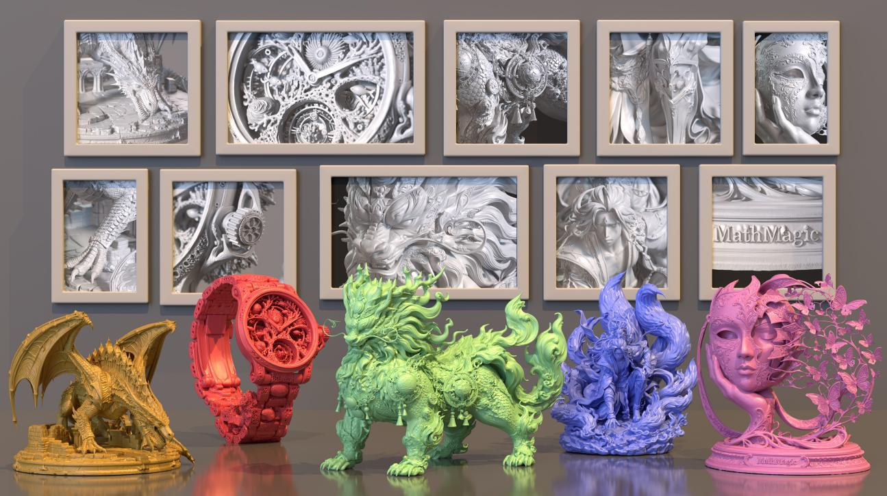  
Figure 1. Meshes generated by Hi3D 3.0 from single images. Framed on the wall: clay-shaded close-ups of the same meshes. ABSTRACT

Image-to-3D generation has become increasingly capable of producing objects that closely resemble the input image, and an outstanding challenge is to reproduce the depicted object itself, including the specific geometry that defines it. Inscriptions, brand marks, and repeated structures are frequently distorted or lost, despite being critical to object identity. We present Hi3D 3.0, an image-to-3D generation system targeting object-specific fidelity, with Twinkle3D as its geometry model for generating watertight triangle meshes at $\dot { 2 } 0 4 8 ^ { 3 }$ resolution. Twinkle3D advances high-fidelity geometry generation along four dimensions. First, while O-Voxel/FaithC offers high representational precision, it often suffers from poor surface quality and non-watertight geometry. We address both issues while retaining its $2 0 4 8 ^ { 3 } .$ -level precision, substantially improving surface quality and ensuring watertight mesh extraction. Second, we scale diffusion generation to sequences of up to 300K geometric tokens through a redesigned DiT architecture and large-scale distributed training optimizations, reducing training time per step from approximately ten minutes to ten seconds. Third, subsequent refinement cannot fully compensate for errors introduced during initial generation; we therefore strengthen both global shape and local detail in the initial generation stage, and the resulting single-stage model surpasses prior two-stage pipelines with $5 1 2 ^ { \frac { 5 } { 3 } }$ refinement. Finally, we introduce a fine-grained image– 3D cross-modal interaction mechanism that strengthens correspondence between visual evidence and geometric tokens, improving the recovery of object-specific structures. We evaluate geometric fidelity using alignment metrics derived from silhouettes and normal fields. Hi3D 3.0 outperforms four commercial systems across all reported metrics, recovering 82.1% of inscribed characters at 98.2% precision, compared with 21.7% recall for the strongest competitor.

Contents   
1 Introduction 2   
2 Related Work 3   
3 Experiments 4   
3.1 Setup 4   
3.2 Main Results 5   
3.3 Inscription Fidelity 5   
3.4 Human Evaluation 6   
3.5 Autoencoder Reconstruction 7   
3.6 One Stage vs. Two Stages . 8   
3.7 Qualitative Results 8   
3.8 Summary 12   
A Contributors 18

## 1 Introduction

Image-to-3D generation has become increasingly capable of producing objects that closely resemble the one depicted in a single input image. Early approaches lifted 2D diffusion priors through per-object optimization [49, 68]; these were followed by multi-view diffusion [41, 55, 42, 43, 32], feed-forward reconstruction [22, 31, 61, 78, 70], and native 3D latent diffusion on Transformer backbones [48, 92, 88, 89, 74], which recent systems have scaled to production quality [76, 36, 93, 28]. A parallel line of work generates artist-style meshes directly, either autoregressively over vertices and faces [46, 56, 4, 5, 7, 59, 72, 15] or in parallel with flow-based models [16, 35, 58, 79]. Geometric fidelity has advanced alongside generative capability: Sparc3D [37] (Hi3D 1.0) showed that an 8× compressed sparse latent need not sacrifice reconstruction accuracy, and TRELLIS 2.0 [77] removed the signed-distance-field intermediate whose interpolation rounds sharp creases at the sampling scale. Given one image, current systems reliably return a complete and coherent object whose overall shape and proportions match the input.

Beyond agreement in overall shape, the outstanding challenge is to reproduce the depicted object itself, including the specific geometry that defines it. This geometry is small in extent, and its correctness is largely discrete: a face whose interocular distance is altered by a few percent still resembles the input but depicts a different person, and an inscribed character missing a stroke reads as a different word or not at all. Such features, including inscriptions, brand marks, and repeated structures, barely affect the silhouette, and current systems frequently distort or lose them. We refer to agreement with the input object at every scale, from overall proportion to detail near the resolution limit, as object-specificfidelity. Silhouette-based measures are largely insensitive to it: on our benchmark, five current systems lie within four points of silhouette IoU but differ substantially in recovered fine structure (Sec. 3.2).

In this report we present Twinkle3D, the geometry model of Hi3D 3.0, the third generation of our image-to-3D series after Hi3D 1.0 (Sparc3D [37]) and Hi3D 2.1 [21]; comparisons with released systems in Sec. 3 are reported under the Hi3D 3.0 name. Given a single image, Twinkle3D generates a watertight triangle mesh at 20483 resolution (Figure 1) and advances high-fidelity geometry generation along four dimensions, each addressing a point in the pipeline at which object-specific fidelity is lost.

Representation and autoencoder. The representation and its autoencoder bound the detail available to the generator. A representation that encodes a single surface patch per cell cannot describe thin walls, closely spaced parts, or junctions at which several surface sheets meet, and repairing a mesh that is not closed introduces surface absent from the object. O-Voxel/FaithC [77, 44] admits several surface sheets per cell and thereby offers high representational precision; in practice, however, it often suffers from poor surface quality and non-watertight geometry. We address both issues while retaining its 20483-level precision, substantially improving surface quality and ensuring watertight mesh extraction without a repair step. Sec. 3.5 isolates this component through autoencoder reconstruction.

Scaling generation to 20483. A sample at 20483 contains up to 300K geometric tokens, a sequence length at which the full attention of a standard diffusion Transformer becomes prohibitive; recent work reduces this cost with sparse attention [75]. We redesign the DiT architecture to operate at this sequence length and introduce large-scale distributed training optimizations, reducing the time per training step at thousand-GPU scale from approximately ten minutes to ten seconds. This roughly 60× reduction shortens a 105-step schedule from close to two years to days.

Single-stage generation. High-resolution systems commonly adopt a coarse-to-fine factorization in which a refinement stage adds detail conditioned on the output of a first stage [76, 37, 77]. Refinement in these pipelines adds detail relative to the first-stage surface and does not revise its placement. First-stage errors consequently persist: a displacement comparable to the feature size remains after refinement, and two neighbouring surfaces whose displacement is comparable to their separation are merged. Subsequent refinement cannot fully compensate for errors introduced during initial generation; we therefore strengthen both global shape and local detail in the initial generation stage. On its own, this single stage exceeds the geometric accuracy of Sparc3D and TRELLIS 2.0 running a first stage followed by 5123 refinement (Sec. 3.6).

Image–3D cross-modal interaction. Object-specific features occupy a small area of the input image and are therefore represented by few image tokens; recovering them requires the generator to establish precise correspondence between this local visual evidence and the geometric tokens that realize it. We introduce a fine-grained image–3D cross-modal interaction mechanism that strengthens this correspondence and improves the recovery of inscriptions, marks, and repeated structures.

Evaluating object-specific fidelity presents a further difficulty. 3D generation lacks an established automatic metric analogous to FID [20] or CLIP score [19] in image generation. The common substitute, scoring rendered images with a vision-language model, conflates geometry with texture, material, and lighting; when geometric differences are subtle, appearance dominates the score. We therefore evaluate in the geometry domain (Sec. 3.1). Global alignment is measured by silhouette IoU under a fitted camera pose, and detail alignment by a multi-scale bandpass comparison of normal fields that penalizes spurious detail as heavily as missing detail. Vision-language scoring is confined to multi-view plausibility and shape aesthetics, and character-level fidelity is measured on an OCR-scored inscription benchmark. Under this protocol, Hi3D 3.0 outperforms four commercial systems on all four metrics (Table 1); the five systems span 0.04 in silhouette IoU but 0.11 in detail alignment and 0.12 in multi-view plausibility. On the inscription benchmark, Hi3D 3.0 recovers 82.1% of characters at 98.2% precision, compared with 21.7% recall and 62.0% precision for the strongest competitor (Sec. 3.3). In a blind pairwise study, it is rated equal to or better than each competitor in 78.0–89.8% of structure judgements and 88.1–95.5% of geometric-detail judgements (Sec. 3.4).

In summary, this report identifies object-specific fidelity as a distinct axis of image-to-3D quality that silhouette-based and appearance-based evaluation does not capture, presents Twinkle3D, the geometry model of Hi3D 3.0, which is designed for it, and introduces a geometry-domain evaluation protocol together with an OCR-scored inscription benchmark for measuring it. We hope that this framing will shift attention from producing an object that resembles the input to reproducing the object it depicts, and that the protocol will serve as a baseline for subsequent work.

## 2 Related Work

Native Mesh Generation. A line of work generates meshes directly as sequences of vertices and faces. PolyGen [46] generates vertices and then faces with autoregressive Transformers, and MeshGPT [56] generates sequences of learned triangle tokens with a decoder-only Transformer. Subsequent work scales this formulation to larger models, data, and face counts [4, 15, 82], conditions generation on an input shape [5, 7], and shortens or structures the token sequence through compressed, hierarchical, and locality-aware tokenizations [59, 72, 71, 39, 67, 57, 38, 65, 80]. Other work orders generation by level of detail [90, 29], accelerates decoding with interleaved linear and full attention or speculative decoding [64, 54], optimizes generation with reinforcement learning [91, 94], extends it to quadrilateral meshes, part-wise generation, and native UV charts [40, 84, 81], and represents meshes as plain text for a language model [69]. Non-autoregressive methods generate all faces in parallel, with discrete diffusion [1], continuous connectivity representations [53], or diffusion and flow matching [16, 35, 58, 66, 79]. These methods target compact, artist-like topology and controllable face budgets. Twinkle3D instead generates a dense surface at 20483 and extracts a watertight mesh from it. It addresses whether the extracted surface reproduces the input object; topology and face-budget control are outside the scope of this report.

3D native shape generation. Early image-to-3D methods lift 2D priors, through per-object optimization with a 2D diffusion model [49, 68], consistent multi-view synthesis [41, 55, 42, 43, 32], or feed-forward reconstruction [22, 31, 61, 78, 70]. Native methods instead learn a generative model directly over 3D shapes. Early native models generate point clouds or implicit functions [87, 47, 26]. 3DShape2VecSet [88] encodes a shape as a set of latent vectors decoded to a neural field, and diffusion over such latent sets underlies Michelangelo [92], CLAY [89], CraftsMan3D [33], TripoSG [36], Step1X-3D [34], and Hunyuan3D 2.0 and 2.1 [93, 60]; Dora [3] improves the reconstruction of their autoencoders at sharp edges, and MSVS-VAE [14] anchors the latent set at multiple scales. Other latent forms include triplanes [2, 74], wavelets [24, 52], local signed-distance grids [86], and primitives [8]. Sparse voxel structures raise the attainable resolution. XCube [50] generates sparse voxel hierarchies; TRELLIS [76] introduces structured latents with a coarse-to-fine factorization that later systems extend [28, 27, 63]; Direct3D-S2 [75] and SparseFlex [17] reach higher resolutions with sparse attention and sparse isosurface representations; Ultra3D [6] refines sparse-voxel latents with part attention; and LoG3D [83] partitions the volume into local blocks to model shapes at $2 0 \dot { 4 } 8 ^ { 3 }$ . Sparc3D [37] (Hi3D 1.0) shows that an 8× compressed sparse latent can preserve reconstruction accuracy, and TRELLIS 2.0 [77] removes the signed-distance intermediate to keep sharp features. Recent technical reports scale these designs to highfidelity, simulation-ready assets [12, 13, 25], and SAM 3D [51] recovers objects from real-world images. Other work encodes geometry and appearance in a single latent [73], aligns the generated object with the input view through pixel-aligned features or joint pose modeling [30, 23], or generates each part of an object separately [85, 10, 18]. Twinkle3D belongs to this line of 3D native generation. It targets two properties that resolution alone does not provide, cells crossed by several surface sheets and watertight extraction without repair, and it revisits how responsibility is divided between the first stage and refinement (Sec. 3.6).

## 3 Experiments

## 3.1 Setup

Benchmark. We evaluate on 33 single-image inputs drawn from production requests. We compare five systems: Hi3D 3.0, Hi3D 2.1 [21], Meshy 7 [45], Tripo 3.1 [62], and Rodin Gen 2.5 [9]. Each system runs at its highest available geometry resolution.

Metrics. We use four metrics, described next. We compute the first two from binary masks and normal fields, so no texture, material, or lighting choice can affect them. The last two use a vision-language judge, and only for questions such judges answer reliably.

Global alignment (silhouette IoU). All systems share one set of perspective intrinsics with a vertical field of view of 35◦. For each system we fit the camera pose by maximizing the intersection-over-union between the rasterized mesh silhouette and the foreground mask of the input. The score is the IoU at that pose. Fitting each system separately avoids penalizing a convention difference in scale or orientation. This metric measures projected occupancy only.

Detail alignment (normal bandpass). The reference is a monocular normal estimate of the input image. The prediction is a normal rendering of the mesh at the fitted pose. Both are restricted to the shared foreground and compared through a multi-scale bandpass decomposition in normal space, along two axes. “Richness” compares the energy in each band and penalizes departures in both directions: over-smoothing and injected detail are scored alike, so roughening a surface raises band energy without raising the score. “Envelope” compares where each band’s magnitude is concentrated rather than its signed values, which tolerates the sub-pixel registration error left by the pose fit. Because this metric depends on the pose fit, we compute it only on inputs whose fit is high-confidence. We note that this metric compares against a monocular normal estimate rather than ground truth, so it measures agreement with an estimator and inherits its biases. It ranks systems against a common reference and is not an absolute measure of geometric error. We also note that systems whose poses fit less reliably are partly excluded from it, and it is the metric that most separates the field (Sec. 3.2).

Multi-view plausibility (completeness). The two metrics above constrain only the visible side. A vision-language model scores Blender back-view renderings for whether the unseen side was completed, checking for holes, blank faces, and undifferentiated surface, and returns a value in [0, 1]. This is a presence-or-absence judgement rather than a graded preference.

Shape aesthetics (Q-Judger). We render front and back views of each result with a template built by professional artists, giving 328 images. We score them with Qwen-Image-Bench against a fixed three-level rubric: Fail → 0, Pass → 60, Excel → 100. This metric is appearance-dependent by design.

## 3.2 Main Results

Table 1. Main results on the 33-input benchmark. Hi3D 3.0 has the best value on all four metrics. Global alignment is silhouette IoU. Detail alignment is the appearance-independent normal bandpass score, computed on the high-confidence-pose subset. Multiview plausibility is the vision-language completeness score in [0, 1]. Shape aesthetics (Q-Judger) is the Qwen-Image-Bench score in [0, 100]. All systems run at their highest geometry resolution. Best per column in bold.
<table><tr><td>Model</td><td>Global Alignment ↑</td><td>Detail Alignment ↑</td><td>Multi-view Plausibility ↑</td><td>Shape Aesthetics (Q-Judger) ↑</td></tr><tr><td>Rodin Gen 2.5</td><td>0.8787</td><td>0.2645</td><td>0.663</td><td>46.67</td></tr><tr><td>Tripo 3.1</td><td>0.8953</td><td>0.2826</td><td>0.722</td><td>50.16</td></tr><tr><td>Meshy 7</td><td>0.9013</td><td>0.3694</td><td>0.638</td><td>50.00</td></tr><tr><td>Hi3D 2.1</td><td>0.9038</td><td>0.2813</td><td>0.636</td><td>50.30</td></tr><tr><td>Hi3D 3.0</td><td>0.9184</td><td>0.3782</td><td>0.757</td><td>50.91</td></tr></table>

Table 1 compares the five systems. All five run at their highest geometry resolution and are scored by the same protocol, so the differences can only be attributed to the generated geometry. Hi3D 3.0 obtains the best value on all four metrics. We have three observations from Table 1.

First, silhouettes are saturated but detail is not. Global alignment spans 0.879 to 0.918 across the five systems (4% of the column mean), but detail alignment spans 0.265 to 0.378 (36% of its mean). The field also splits on detail alignment rather than spreading evenly: Hi3D 3.0 (0.3782) and Meshy 7 (0.3694) sit together, and Tripo 3.1 (0.2826), Hi3D 2.1 (0.2813), and Rodin Gen 2.5 (0.2645) sit 0.087 to 0.114 below them. Because the metric penalizes excess band energy as heavily as deficit, this gap reflects fine structure that agrees with the input, not merely fine structure that is present.

Second, completeness is a separate axis. Multi-view plausibility varies independently of the two alignment metrics. Hi3D 3.0 and Meshy 7, the top two systems on detail alignment, differ by 0.119 on completeness. Hi3D 2.1 and Meshy 7 differ by 0.088 on detail alignment but by only 0.002 on completeness. We also note that completeness is far from its ceiling for every system, including ours at 0.757.

Last, aesthetics do not separate the field. Four of the five systems fall within one point of each other on shape aesthetics. We attribute this to the three-level rubric, which saturates once outputs reliably reach the middle level. We report this metric to cover the appearance dimension. The widest spreads come from detail alignment and completeness, the two metrics that measure geometry beyond projected occupancy.

## 3.3 Inscription Fidelity

Inscriptions give a discrete measure of fidelity. A character either reads back or it does not, and the judgement does not depend on rendering style. A model cannot score well by producing text-like relief.

Protocol. The test set covers Chinese and English inscriptions, engravings, and brand marks. We render each system’s output under clay shading and read it with PaddleOCR [11] against a shared scene-level ground truth of 526 characters, aligned character by character. We report recall (ground-truth characters recovered), precision (the share of everything OCR reads that was present), and their harmonic mean F1. We also report the miss rate (ground-truth characters OCR cannot locate, i.e., geometry below legibility) and the hallucination rate (invented characters as a share of ground truth plus extras).

Results. Table 2 shows the results. Hi3D 3.0 reads back 82.1% of ground-truth characters. The best peer system (Meshy 7) reaches 21.7%, and three of the four remain below 8%. Meshy 7 is also the closest competitor on detail alignment in Table 1. Hi3D 2.1 recovers none: 99.2% of its characters fall below legibility. This suggests that the inscription scale lies beneath that system’s effective resolution.

Table 2. Inscription fidelity. Hi3D 3.0 recovers 82.1% of the 526 ground-truth characters at 98.2% precision; the best peer system recovers 21.7%. Measured with PaddleOCR on clay-shaded renderings against a shared ground truth. Recall is the share of ground-truth characters recovered. Precision is correct/(correct + wrong + extra). F1 is their harmonic mean. Miss counts ground-truth characters OCR cannot locate, and Halluc. counts invented characters as a share of ground truth plus extras. Precision and F1 are derived from the counts in the last column. Peer systems run at their latest version and highest geometry resolution. Best per column in bold.
<table><tr><td>Model</td><td>Recall ↑</td><td>Precision ↑</td><td>F1↑</td><td>Miss ↓</td><td>Halluc. ↓</td><td>Missed / Wrong / Extra</td></tr><tr><td>Hi3D 2.1</td><td>0.0%</td><td>0.0%</td><td>0.0%</td><td>99.2%</td><td>4.5%</td><td>522 / 4 / 25</td></tr><tr><td>Rodin Gen 2.5</td><td>4.6%</td><td>21.8%</td><td>7.5%</td><td>88.0%</td><td>8.2%</td><td>463 / 39 / 47</td></tr><tr><td>Tripo 3.1</td><td>7.4%</td><td>9.8%</td><td>8.4%</td><td>71.3%</td><td>32.0%</td><td>375 / 112 / 247</td></tr><tr><td>Meshy 7</td><td>21.7%</td><td>62.0%</td><td>32.1%</td><td>76.0%</td><td>9.9%</td><td>400 / 12 / 58</td></tr><tr><td>Hi3D 3.0</td><td>82.1%</td><td>98.2%</td><td>89.4%</td><td>16.5%</td><td>0.2%</td><td>87 / 7 / 1</td></tr></table>

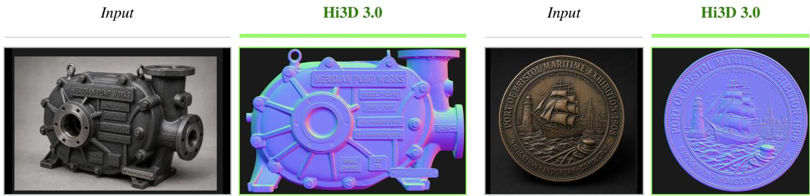  
Figure 2. Text-bearing objects. The specification plates and the rim lettering are reproduced as geometry. Each pair shows the input photograph and the Twinkle3D output under normal shading, so nothing in the comparison depends on texture or material. Left: an industrial pump with a model number, pressure and temperature ratings, serial and lot plates, and a cast flow arrow, alongside machined bolt bosses, the flange bore, and the lifting eye. Right: a commemorative medal with lettering curved along its rim over a low-relief scene.

Precision separates the systems further and distinguishes two failure modes. Of everything PaddleOCR reads from a Hi3D 3.0 result, 98.2% is a character that is present, vs. 62.0% for Meshy 7 and 9.8% for Tripo 3.1. A model that omits illegible text keeps precision high while losing recall. A model that invents text-like relief loses both. So Tripo 3.1 and Rodin Gen 2.5 land within a point of each other on F1 (8.4 vs. 7.5), although Tripo 3.1 recovers about 60% more characters. Across the whole benchmark, Hi3D 3.0 produces one invented character.

Figure 2 shows the same property outside the OCR setting, on two objects whose identity is carried by cast and engraved detail. These are the specification plates of an industrial pump (Figure 2, left) and the rim lettering of a medal (Figure 2, right). Both are normal-shaded. Figure 3 compares systems on two inscription-bearing inputs. In Figure 3(a), three systems return the plate without legible content, and Tripo 3.1 fills it with letter-like strokes that do not read as the word. This is the behaviour the hallucination column measures. In Figure 3(b), Meshy 7 recovers the carved characters with shallower strokes, consistent with its nontrivial character rate, and Tripo 3.1 again forms text-like relief that does not read as the input.

## 3.4 Human Evaluation

We ran a blind pairwise study comparing Hi3D 3.0 against each of the four peer systems. Raters judged two dimensions separately (overall structure and geometric detail quality) and returned one of three verdicts per comparison: Hi3D 3.0 better, the same, or Hi3D 3.0 inferior.

Table 3 reports the same-or-better share. Hi3D 3.0 is rated the same or better in 78.0–89.8% of structure judgements and 88.1–95.5% of detail judgements. Against every system the detail margin exceeds the structure margin, from 5.7 points (Rodin Gen 2.5 and Hi3D 2.1) to 13.1 points (Meshy 7). This agrees with Table 1 on two points: (i) the difference between systems lies in detail rather than in structure, and (ii) Meshy 7 is the closest competitor, on detai alignment there and on structure preference here.

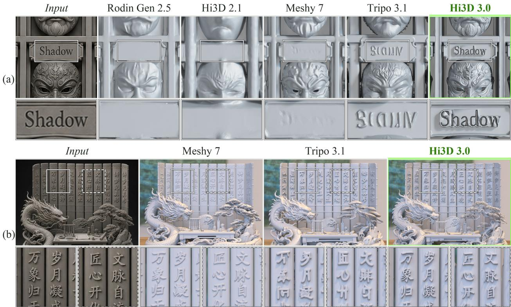  
Figure 3. Inscription recovery. The white boxes in each view are enlarged beneath it. (a) The engraved name plate “Shadow” on the mask cabinet, from one frame of a close-up camera path, the same frame for every system, under clay shading. Only Hi3D 3.0 reproduces the word. Tripo 3.1 forms garbled letter-like strokes, the hallucination mode counted in Table 2; Meshy 7 leaves faint marks; Rodin Gen 2.5 returns a blank plate; and Hi3D 2.1 forms only a plain bar. (b) Carved calligraphy on a scholar’s diorama, from the same turntable frame for each system. Rodin Gen 2.5 and Hi3D 2.1 were not rendered for this input. The solid and dashed boxes cover two pairs of columns, enlarged left and right. Hi3D 3.0 forms every enlarged character with sharp, deeply cut strokes Meshy 7 forms the same characters with shallower and softer strokes, and Tripo 3.1 forms pseudo-characters that do not read as th input. Outside the boxes, two characters in the Hi3D 3.0 result are malformed.

Table 3. Blind pairwise human study. Hi3D 3.0 is rated the same or better in 78.0–89.8% of structure judgements and 88.1– 95.5% of detail judgements. Each entry is the share of judgements in which Hi3D 3.0 was rated the same as, or better than, the comparison system.
<table><tr><td>Hi3D 3.0 vs.</td><td>Structure (same or better)</td><td>Geometric Detail (same or better)</td></tr><tr><td>Hi3D 2.1</td><td>89.0%</td><td>94.7%</td></tr><tr><td>Meshy 7</td><td>78.0%</td><td>91.1%</td></tr><tr><td>Rodin Gen 2.5</td><td>89.8%</td><td>95.5%</td></tr><tr><td>Tripo 3.1</td><td>79.5%</td><td>88.1%</td></tr></table>

## 3.5 Autoencoder Reconstruction

This experiment isolates the representation and its autoencoder (Sec. 1). Figure 4 compares reconstruction of the same input mesh through Sparc3D [37], TRELLIS 2.0 [77], and Twinkle3D on two objects whose identity is carried by fine structure.

The front grille in Figure 4a is a periodic array of thin, closely spaced elements: the multi-sheet-per-cell case. Sparc3D returns it as irregular perforation and loses the periodicity. TRELLIS 2.0 recovers the bar structure but not its spacing or thickness. Twinkle3D keeps the array periodic and in phase across the full width of the grille. All three outputs carry fine-scale content, but only one carries fine-scale content that matches the reference. This is the distinction that the richness term of the detail metric registers. Figure 4b shows a single thin element: the arrow’s barbs are a repeated profile along one shaft. Sparc3D tapers them into a cone, and TRELLIS 2.0 and Twinkle3D keep them separate.

Sparc3D  
TRELLIS 2.0  
Twinkle3D  
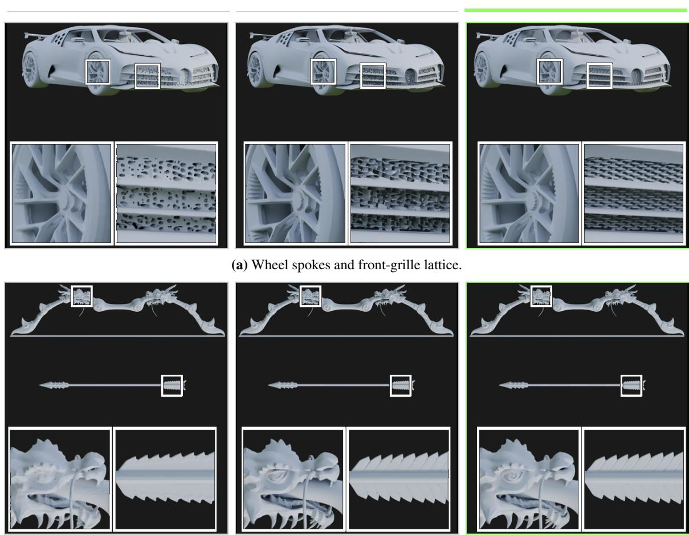  
(b) Skeletal bow and barbed arrow shaft.  
Figure 4. Autoencoder reconstruction. We pass the same input mesh through the autoencoders of Sparc3D [37], TREL-LIS 2.0 [77], and Twinkle3D. Only Twinkle3D keeps the grille periodic and in phase, and Sparc3D alone tapers the arrow barbs into a cone. Columns are as labelled at the top throughout. White boxes mark the regions enlarged beneath each column. Both cases require cells that carry more than one surface sheet (Sec. 1).

## 3.6 One Stage vs. Two Stages

This experiment tests the first-stage design of Sec. 1. We compare the standalone first stage of Twinkle3D against Sparc3D and TRELLIS 2.0 running a first stage plus 5123 refinement (Figure 5). Twinkle3D runs one stage; both baselines run two.

On all three inputs, the single stage recovers structure that the refined baselines do not. In Figure 5b, the perforated pattern of the robe, the separation between individual blades, and the layered scrollwork of the base appear as distinct surfaces rather than fused ones. The same holds for the cords and tassels in Figure 5a and the saddle and harness in Figure 5c. Fusion is the signature we expect from Sec. 1. When two nearby boundaries are each displaced by an amount comparable to the gap between them, refinement adds surface detail without correcting where the boundaries sit, and the gap closes.

## 3.7 Qualitative Results

Figure 6 compares all five systems on five inputs, with two regions of each enlarged. The five cases probe different failure modes. Figure 6(a) probes scene completeness: Rodin Gen 2.5 discards everything except the subject, and no detail metric registers this failure because the detail it does produce is unobjectionable. Figure 6(b) probes thin structure at close spacing. Figure 6(c) probes fine relief. The medal carries lettering, mid-scale relief, and fine rigging at once, so a system can succeed at one scale and fail at another within a single result. Figure 6(d) and (e) probe facial identity with high-frequency hair and fabric, where the input is a photograph of a known face.

Sparc3D stage 1 + stage 2 (5123)  
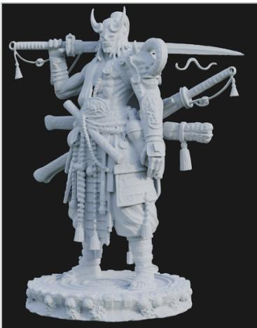

TRELLIS 2.0 stage 1 + stage 2 (5123)  
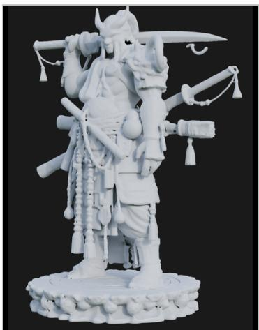  
Twinkle3D stage 1 only

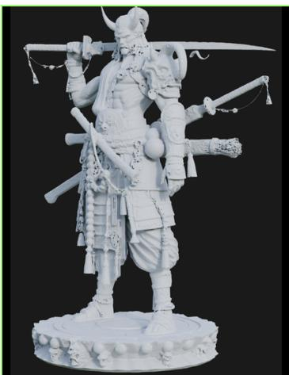

(a) Armoured figure: cords and tassels.  
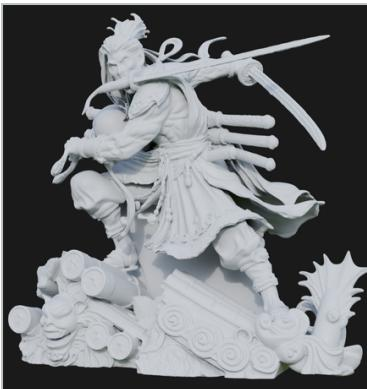

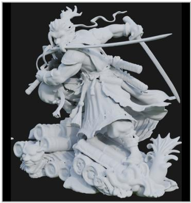

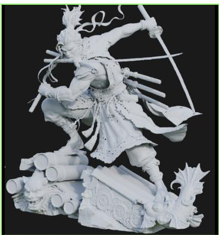  
(b) Swordsman: perforated robe and separate blades.

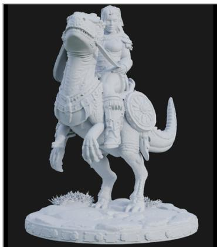

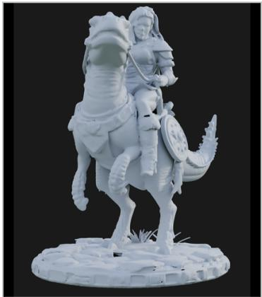  
(c) Mounted rider: saddle, reins and harness.

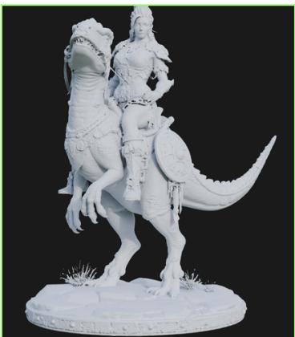  
Figure 5. One stage vs. two. We compare the standalone first stage of Twinkle3D with a first stage plus $5 1 2 ^ { 3 }$ refinement in Sparc3D [37] and TRELLIS 2.0 [77], on three inputs. Columns are as labelled at the top throughout. Twinkle3D runs one stage; both baselines run two. In every case the baselines fuse structures that should be separate, and the single-stage result keeps them distinct.

Input  
Rodin Gen 2.5  
Hi3D 2.1  
Meshy 7  
Tripo 3.1  
Hi3D 3.0  
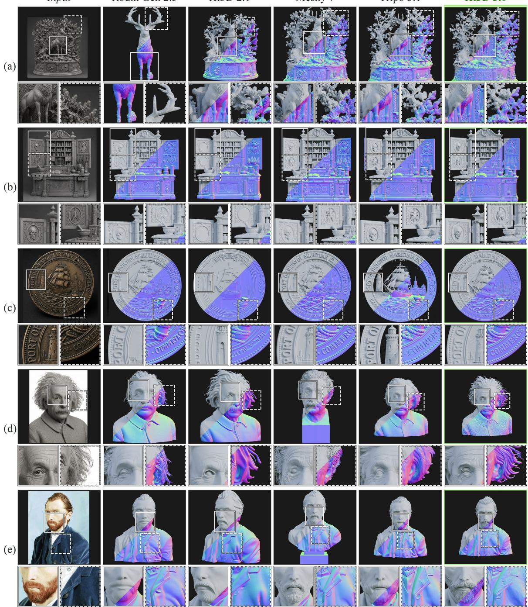  
Figure 6. Five-system comparison with two close-ups per input. Each result is split diagonally, clay shading above and normal shading below. Beneath each view, the left close-up enlarges the solid white box and the right close-up the dashed white box; each box marks the same part of the object in every column, and all close-ups share one source resolution. (a) Front legs; the right-hand tree. Rodin Gen 2.5 returns the stag alone, without the niche, foliage, or base, so its right close-up shows only an antler. Hi3D 3.0, Meshy 7, and Tripo 3.1 form separate leaves and cones on the tree, which Hi3D 2.1 merges into lumpy clusters. (b) Skull and ribcage medallions on the left door. Hi3D 2.1 leaves both medallions blank; Hi3D 3.0 carves the eye sockets and teeth of the skull and separate ribs along the spine. (c) The lighthouse with the rim lettering “PORT OF”; the rim lettering “COMMERCE”. Meshy 7 and Hi3D 3.0 form both words and a windowed lighthouse. Tripo 3.1 misshapes “COMMERCE” and cuts away the inner field of the medal, leaving the lighthouse free-standing. Rodin Gen 2.5 forms “PORT OF” but garbles “COMMERCE” and forms no lighthouse. Hi3D 2.1 forms illegible glyphs and a plain tower. (d) Eye and forehead; side hair. Hi3D 3.0 forms separate tapered strands and a carved iris, where the other systems form clumps, ribbons, or smooth sheets; Meshy 7 also truncates the bust at the neck. (e) Beard; collar and buttons. Hi3D 3.0 and Meshy 7 form beard strands and curls, and Rodin Gen 2.5 forms no beard; all five systems reproduce the collar and buttons. Meshy 7 adds a plinth that is not in the input to both busts.

Cropped input  
Rodin Gen 2.5  
Hi3D 2.1  
Meshy 7  
Tripo 3.1  
Hi3D 3.0  
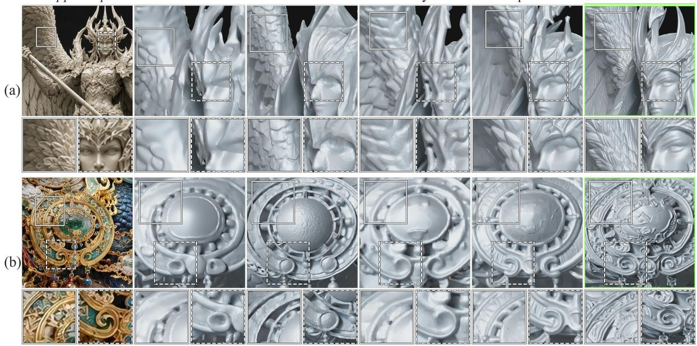  
Figure 7. Close-up comparison on ornament and relief. Left: the input image. Right: one frame of the same close-up camera path for each system, the same frame for every system, under clay shading. The solid and dashed white boxes are enlarged beneath, left and right. (a) Winged figure: the wing feathers and the face with its crown band. Hi3D 3.0 separates individual feathers and carves the eyelids and the edges of the crown band. Tripo 3.1 forms smooth feather lobes and a clean but soft face, Hi3D 2.1 faceted feather plates, Meshy 7 noisy ridges and a face fused with the crown, and Rodin Gen 2.5 a nearly smooth wing and a melted crown band. (b) Qilin: the filigree band of a medallion and the C-scroll volute on its lower edge. Hi3D 3.0 fills the band with scroll relief and forms a spiral volute with nested curls. Tripo 3.1 forms radial grooves and a single tube-profile scroll, Meshy 7 an empty band and a soft curl, and Rodin Gen 2.5 and Hi3D 2.1 no scroll.

Cropped input  
Rodin Gen 2.5  
Hi3D 2.1  
Meshy 7  
Tripo 3.1  
Hi3D 3.0  
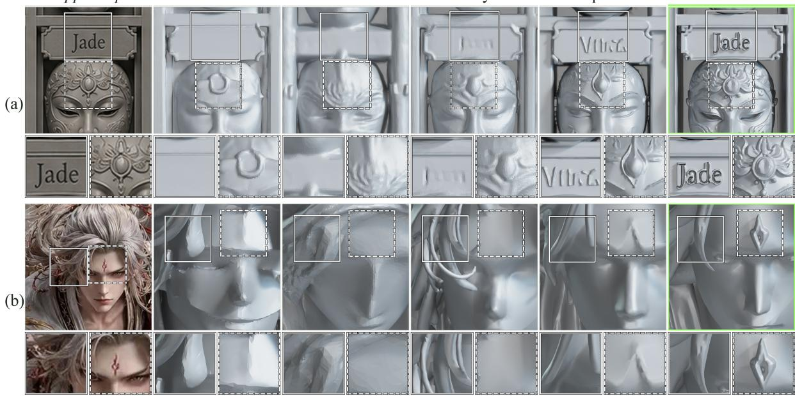  
Figure 8. Close-up comparison on inscriptions and identifying marks. Conventions as in Figure 7. (a) Mask cabinet: the “Jade” name plate and the forehead ornament of the mask beneath it. Only Hi3D 3.0 reproduces the engraved word, and it forms a crown of pointed petals around a jewel. Tripo 3.1 forms letter-like strokes that do not read as the word and a plain teardrop, Meshy 7 faint marks and a low bump, Rodin Gen 2.5 a blank plate and a single ring, and Hi3D 2.1 no plate and a ridge. (b) Fox immortal: a lock of hair over the temple and the forehead mark, which appears in the input as a small red mark. Hi3D 3.0 forms notched locks and recovers the mark as a raised diamond with a recessed centre. Tripo 3.1 forms smooth strands and a shallow crease, Meshy 7 tube-shaped strands and no mark, and Rodin Gen 2.5 and Hi3D 2.1 faceted hair and no mark.

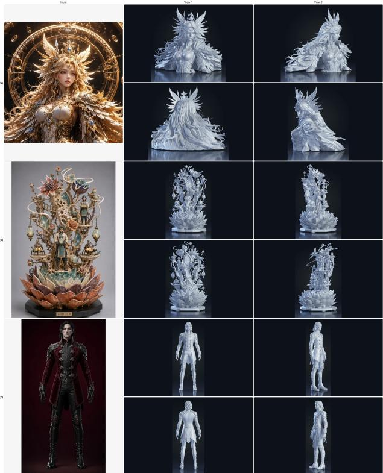  
(a) Ornate bust; multi-object diorama; full-body character.

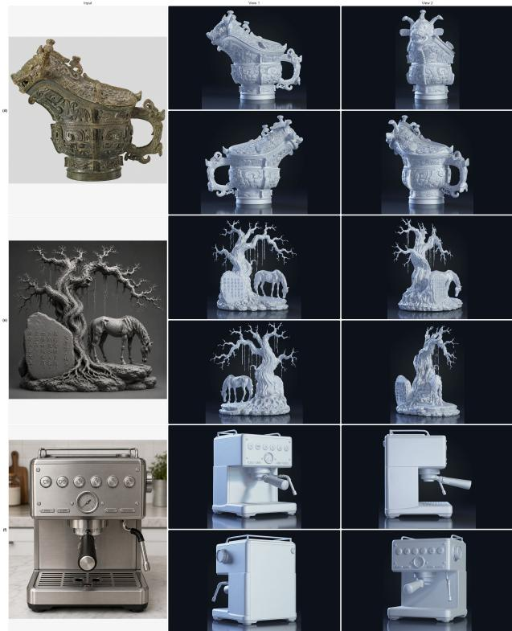  
(b) High-relief vessel; thin-structure scene; reflective mechanical object.  
Figure 9. Twinkle3D results across six input categories. In each case the left column is the input image and the 2 × 2 block shows clay-shaded renderings of the generated mesh from complementary viewpoints.

Figures 7 and 8 probe the same question at close range and at full render resolution. Each row shows one frame of a close-up camera path, the same frame for every system, with two regions enlarged beneath it. The four rows cover a winged figure, a gilded qilin, a cabinet of carved masks, and a fox immortal statue. They test wing feathers and a crown band, the filigree band and scroll of a medallion, an engraved name plate with the ornament beneath it, and a lock of hair with a forehead mark. At this scale the systems agree on the shape of the object and differ on the features that identify it.

Figures 9a and 9b show further Hi3D 3.0 results across six input categories: high-detail busts, multi-object scenes, full-body characters, high-relief vessels, thin-structure scenes, and reflective mechanical objects. Each case shows the input alongside clay-shaded renderings from complementary viewpoints.

## 3.8 Summary

In sum, Hi3D 3.0 obtains the best value on all four automatic metrics and on all five rate columns of the inscription benchmark. It is rated the same or better in the majority of judgements in every pairwise human comparison. We note three negative cases in the same results. First, at 0.757 on multi-view plausibility, close to a quarter of back-view completions fail a criterion that asks only whether the surface was completed. Second, a 16.5% miss rate means roughly one character in six falls below legibility, and seven characters were located but misread. The model omits rather than invents, but the capability is not saturated. Last, 33 inputs support the group separation on detail alignment in Table 1, where the gap between the two groups is at least 0.087. But they do not support orderings within a group. The 0.0088 between Hi3D 3.0 and Meshy 7 on detail alignment, and the one point spanning four systems on aesthetics, are within the range that per-input variance on a set this size can produce.

## References

[1] Antonio Alliegro, Yawar Siddiqui, Tatiana Tommasi, and Matthias Nießner. PolyDiff: Generating 3D polygonal meshes with diffusion models. arXiv preprint arXiv:2312.11417, 2023.

[2] Eric R. Chan, Connor Z. Lin, Matthew A. Chan, Koki Nagano, Boxiao Pan, Shalini De Mello, Orazio Gallo, Leonidas J. Guibas, Jonathan Tremblay, Sameh Khamis, Tero Karras, and Gordon Wetzstein. Efficient geometryaware 3D generative adversarial networks. In Proceedings ofthe IEEE/CVF Conference on Computer Vision and Pattern Recognition, pages 16123–16133, 2022.

[3] Rui Chen, Jianfeng Zhang, Yixun Liang, Guan Luo, Weiyu Li, Jiarui Liu, Xiu Li, Xiaoxiao Long, Jiashi Feng, and Ping Tan. Dora: Sampling and benchmarking for 3D shape variational auto-encoders. In Proceedings ofthe IEEE/CVF Conference on Computer Vision and Pattern Recognition (CVPR), pages 16251–16261, 2025.

[4] Sijin Chen, Xin Chen, Anqi Pang, Xianfang Zeng, Wei Cheng, Yijun Fu, Fukun Yin, Zhibin Wang, Jingyi Yu, Gang Yu, et al. MeshXL: Neural coordinate field for generative 3D foundation models. Advances in Neural Information Processing Systems, 37:97141–97166, 2024.

[5] Yiwen Chen, Tong He, Di Huang, Weicai Ye, Sijin Chen, Jiaxiang Tang, Zhongang Cai, Lei Yang, Gang Yu, Guosheng Lin, and Chi Zhang. MeshAnything: Artist-created mesh generation with autoregressive transformers. In International Conference on Learning Representations, 2025.

[6] Yiwen Chen, Zhihao Li, Yikai Wang, Hu Zhang, Qin Li, Chi Zhang, and Guosheng Lin. Ultra3D: Efficient and high-fidelity 3D generation with part attention. arXiv preprint arXiv:2507.17745, 2025.

[7] Yiwen Chen, Yikai Wang, Yihao Luo, Zhengyi Wang, Zilong Chen, Jun Zhu, Chi Zhang, and Guosheng Lin. MeshAnything V2: Artist-created mesh generation with adjacent mesh tokenization. In Proceedings of the IEEE/CVF International Conference on Computer Vision, pages 13922–13931, 2025.

[8] Zhaoxi Chen, Jiaxiang Tang, Yuhao Dong, Ziang Cao, Fangzhou Hong, Yushi Lan, Tengfei Wang, Haozhe Xie, Tong Wu, Shunsuke Saito, et al. 3DTopia-XL: Scaling high-quality 3D asset generation via primitive diffusion. In Proceedings ofthe IEEE/CVF Conference on Computer Vision and Pattern Recognition, pages 26576–26586, 2025.

[9] Deemos Technology. Rodin gen-2.5. https://hyper3d.ai, 2026. Released May 2026. Accessed September 2026.

[10] Lihe Ding, Shaocong Dong, Yaokun Li, Chenjian Gao, Xiao Chen, Rui Han, Yihao Kuang, Hong Zhang, Bo Huang, Zhanpeng Huang, Zibin Wang, Dan Xu, and Tianfan Xue. FullPart: Generating each 3D part at full resolution. In International Conference on Learning Representations (ICLR), 2026.

[11] Yuning Du, Chenxia Li, Ruoyu Guo, Xiaoting Yin, Weiwei Liu, Jun Zhou, Yifan Bai, Zilin Yu, Yehua Yang, Qingqing Dang, and Haoshuang Wang. PP-OCR: A practical ultra lightweight OCR system. arXiv preprint arXiv:2009.09941, 2020.

[12] Jiashi Feng, Xiu Li, Jing Lin, Jiahang Liu, Gaohong Liu, Weiqiang Lou, Su Ma, Guang Shi, Qinlong Wang, Jun Wang, et al. Seed3D 1.0: From images to high-fidelity simulation-ready 3D assets. arXiv preprint arXiv:2510.19944, 2025.

[13] Diandian Gu, Jing Lin, Gaohong Liu, Jiahang Liu, Su Ma, Guang Shi, Jun Wang, Qinlong Wang, Qianyi Wu, Zhongcong Xu, et al. Seed3D 2.0: Advancing high-fidelity simulation-ready 3D content generation. arXiv preprint arXiv:2605.13862, 2026.

[14] Dehao Hao, Kaiyi Zhang, Tanghui Jia, Xiangjun Gao, Dongyu Yan, Weikai Chen, Zeyu Hu, Lingting Zhu, Yingda Yin, Runze Zhang, Li Yuan, Xin Wang, and Long Quan. MSVS-VAE: Multi-scale anchored VecSet for high-fidelity 3D reconstruction. In European Conference on Computer Vision (ECCV), pages 332–349, 2026. doi:10.1007/978-3-032-37235-2\_20.

[15] Zekun Hao, David W. Romero, Tsung-Yi Lin, and Ming-Yu Liu. Meshtron: High-fidelity, artist-like 3D mesh generation at scale. arXiv preprint arXiv:2412.09548, 2024.

[16] Xianglong He, Junyi Chen, Di Huang, Zexiang Liu, Xiaoshui Huang, Wanli Ouyang, Chun Yuan, and Yangguang Li. MeshCraft: Exploring efficient and controllable mesh generation with flow-based DiTs. arXiv preprint arXiv:2503.23022, 2025.

[17] Xianglong He, Zi-Xin Zou, Chia-Hao Chen, Yuan-Chen Guo, Ding Liang, Chun Yuan, Wanli Ouyang, Yan-Pei Cao, and Yangguang Li. SparseFlex: High-resolution and arbitrary-topology 3D shape modeling. In Proceedings ofthe IEEE/CVF International Conference on Computer Vision, pages 14822–14833, 2025.

[18] Xufan He, Yushuang Wu, Xiaoyang Guo, Chongjie Ye, Jiaqing Zhou, Tianlei Hu, Xiaoguang Han, and Dong Du. UniPart: Part-level 3D generation with unified 3D geom-seg latents. In Proceedings of the IEEE/CVF Conference on Computer Vision and Pattern Recognition (CVPR), pages 34227–34236, 2026.

[19] Jack Hessel, Ari Holtzman, Maxwell Forbes, Ronan Le Bras, and Yejin Choi. CLIPScore: A reference-free evaluation metric for image captioning. In Proceedings of the Conference on Empirical Methods in Natural Language Processing (EMNLP), 2021.

[20] Martin Heusel, Hubert Ramsauer, Thomas Unterthiner, Bernhard Nessler, and Sepp Hochreiter. GANs trained by a two time-scale update rule converge to a local nash equilibrium. In Advances in Neural Information Processing Systems (NeurIPS), 2017.

[21] Hi3D Team. Hi3D 2.1. https://www.hi3d.ai/, 2026. Released May 2026. Accessed September 2026.

[22] Yicong Hong, Kai Zhang, Jiuxiang Gu, Sai Bi, Yang Zhou, Difan Liu, Feng Liu, Kalyan Sunkavalli, Trung Bui, and Hao Tan. LRM: Large reconstruction model for single image to 3D. In International Conference on Learning Representations (ICLR), 2024.

[23] Binbin Huang, Haobin Duan, Yiqun Zhao, Zibo Zhao, Yi Ma, and Shenghua Gao. CUPID: Generative 3D reconstruction via joint object and pose modeling. In Proceedings of the IEEE/CVF Conference on Computer Vision and Pattern Recognition (CVPR), pages 12741–12752, 2026.

[24] Ka-Hei Hui, Aditya Sanghi, Arianna Rampini, Kamal Rahimi Malekshan, Zhengzhe Liu, Hooman Shayani, and Chi-Wing Fu. Make-A-Shape: a ten-million-scale 3D shape model. In Proceedings of the 41st International Conference on Machine Learning, volume 235 of Proceedings of Machine Learning Research, pages 20660– 20681, 2024.

[25] Tanghui Jia, Dongyu Yan, Dehao Hao, Yang Li, Kaiyi Zhang, Xianyi He, Lanjiong Li, Yuhan Wang, Jinnan Chen, Lutao Jiang, Qishen Yin, Long Quan, Ying-Cong Chen, and Li Yuan. UltraShape 1.0: High-fidelity 3D shape generation via scalable geometric refinement. arXiv preprint arXiv:2512.21185, 2025.

[26] Heewoo Jun and Alex Nichol. Shap-E: Generating conditional 3D implicit functions. arXiv preprint arXiv:2305.02463, 2023.

[27] Zeqiang Lai, Yunfei Zhao, Haolin Liu, Zibo Zhao, Qingxiang Lin, Huiwen Shi, Xianghui Yang, Mingxin Yang, Shuhui Yang, Yifei Feng, et al. Hunyuan3D 2.5: Towards high-fidelity 3D assets generation with ultimate details. arXiv preprint arXiv:2506.16504, 2025.

[28] Zeqiang Lai, Yunfei Zhao, Zibo Zhao, Haolin Liu, Qingxiang Lin, Jingwei Huang, Chunchao Guo, and Xiangyu Yue. LATTICE: Democratize high-fidelity 3D generation at scale. In Proceedings ofthe IEEE/CVF Conference on Computer Vision and Pattern Recognition (CVPR), pages 19982–19992, 2026.

[29] Jiabao Lei, Kewei Shi, Zhihao Liang, and Kui Jia. ARMesh: Autoregressive mesh generation via next-level-ofdetail prediction. In Advances in Neural Information Processing Systems (NeurIPS), 2025.

[30] Dong-Yang Li, Wang Zhao, Yuxin Chen, Wenbo Hu, Meng-Hao Guo, Fang-Lue Zhang, Ying Shan, and Shi-Min Hu. Pixal3D: Pixel-aligned 3D generation from images. In SIGGRAPH 2026 Conference Papers, pages 1–12, 2026. doi:10.1145/3799902.3811175.

[31] Jiahao Li, Hao Tan, Kai Zhang, Zexiang Xu, Fujun Luan, Yinghao Xu, Yicong Hong, Kalyan Sunkavalli, Greg Shakhnarovich, and Sai Bi. Instant3D: Fast text-to-3D with sparse-view generation and large reconstruction model. In International Conference on Learning Representations (ICLR), 2024.

[32] Peng Li, Yuan Liu, Xiaoxiao Long, Feihu Zhang, Cheng Lin, Mengfei Li, Xingqun Qi, Shanghang Zhang, Wei Xue, Wenhan Luo, Ping Tan, Wenping Wang, Qifeng Liu, and Yike Guo. Era3D: High-resolution multiview diffusion using efficient row-wise attention. In Advances in Neural Information Processing Systems, 2024.

[33] Weiyu Li, Jiarui Liu, Hongyu Yan, Rui Chen, Yixun Liang, Xuelin Chen, Ping Tan, and Xiaoxiao Long. Crafts-Man3D: High-fidelity mesh generation with 3D native diffusion and interactive geometry refiner. In Proceedings ofthe IEEE/CVF Conference on Computer Vision and Pattern Recognition (CVPR), pages 5307–5317, 2025.

[34] Weiyu Li, Xuanyang Zhang, Zheng Sun, Di Qi, Hao Li, Wei Cheng, Weiwei Cai, Shihao Wu, Jiarui Liu, Zihao Wang, et al. Step1X-3D: Towards high-fidelity and controllable generation of textured 3D assets. arXiv preprint arXiv:2505.07747, 2025.

[35] Weiyu Li, Antoine Toisoul, Tom Monnier, Roman Shapovalov, Rakesh Ranjan, Ping Tan, and Andrea Vedaldi. MeshFlow: Efficient artistic mesh generation via MeshVAE and flow-based diffusion transformer. In Proceedings ofthe IEEE/CVF Conference on Computer Vision and Pattern Recognition (CVPR), pages 5849–5858, 2026.

[36] Yangguang Li, Zi-Xin Zou, Zexiang Liu, Dehu Wang, Yuan Liang, Zhipeng Yu, Xingchao Liu, Yuan-Chen Guo, Ding Liang, Wanli Ouyang, et al. TripoSG: High-fidelity 3D shape synthesis using large-scale rectified flow models. arXiv preprint arXiv:2502.06608, 2025.

[37] Zhihao Li, Yufei Wang, Heliang Zheng, Yihao Luo, and Bihan Wen. Sparc3D: Sparse representation and construction for high-resolution 3D shapes modeling. In Advances in Neural Information Processing Systems (NeurIPS), 2025.

[38] Junkai Lin, Hang Long, Huipeng Guo, Jielei Zhang, Jiayi Yang, Tianle Guo, Yang Yang, Jianwen Li, Wenxiao Zhang, Matthias Nießner, and Wei Yang. MeshRipple: Structured autoregressive generation of artist-meshes. In Proceedings of the IEEE/CVF Conference on Computer Vision and Pattern Recognition (CVPR), pages 12706– 12718, 2026.

[39] Stefan Lionar, Jiabin Liang, and Gim Hee Lee. TreeMeshGPT: Artistic mesh generation with autoregressive tree sequencing. In Proceedings of the IEEE/CVF Conference on Computer Vision and Pattern Recognition, pages 26608–26617, 2025.

[40] Jian Liu, Chunshi Wang, Song Guo, Haohan Weng, Zhen Zhou, Zhiqi Li, Jiaao Yu, Yiling Zhu, Jing Xu, Biwen Lei, Zhuo Chen, and Chunchao Guo. QuadGPT: Native quadrilateral mesh generation with autoregressive models. In International Conference on Learning Representations (ICLR), 2026.

[41] Ruoshi Liu, Rundi Wu, Basile Van Hoorick, Pavel Tokmakov, Sergey Zakharov, and Carl Vondrick. Zero-1-to-3: Zero-shot one image to 3D object. In Proceedings of the IEEE/CVF International Conference on Computer Vision, pages 9298–9309, 2023.

[42] Yuan Liu, Cheng Lin, Zijiao Zeng, Xiaoxiao Long, Lingjie Liu, Taku Komura, and Wenping Wang. Sync-Dreamer: Generating multiview-consistent images from a single-view image. In International Conference on Learning Representations, 2024.

[43] Xiaoxiao Long, Yuan-Chen Guo, Cheng Lin, Yuan Liu, Zhiyang Dou, Lingjie Liu, Yuexin Ma, Song-Hai Zhang, Marc Habermann, Christian Theobalt, and Wenping Wang. Wonder3D: Single image to 3D using cross-domain diffusion. In Proceedings of the IEEE/CVF Conference on Computer Vision and Pattern Recognition (CVPR), pages 9970–9980, 2024.

[44] Yihao Luo, Xianglong He, Chuanyu Pan, Yiwen Chen, Jiaqi Wu, Yangguang Li, Wanli Ouyang, Yuanming Hu, Guang Yang, and ChoonHwai Yap. Faithful contouring: Near-lossless 3D voxel representation free from isosurface. In Proceedings of the IEEE/CVF Conference on Computer Vision and Pattern Recognition (CVPR), pages 14408–14418, 2026.

[45] Meshy AI. Meshy 7. https://www.meshy.ai/blog/meshy-7-image-to-3d-geometry-alignment, 2026. Released August 2026. Accessed September 2026.

[46] Charlie Nash, Yaroslav Ganin, S. M. Ali Eslami, and Peter W. Battaglia. PolyGen: An autoregressive generative model of 3D meshes. In International Conference on Machine Learning, pages 7220–7229, 2020.

[47] Alex Nichol, Heewoo Jun, Prafulla Dhariwal, Pamela Mishkin, and Mark Chen. Point-E: A system for generating 3D point clouds from complex prompts. arXiv preprint arXiv:2212.08751, 2022.

[48] William Peebles and Saining Xie. Scalable diffusion models with transformers. In Proceedings of the IEEE/CVF International Conference on Computer Vision (ICCV), pages 4195–4205, 2023.

[49] Ben Poole, Ajay Jain, Jonathan T. Barron, and Ben Mildenhall. DreamFusion: Text-to-3D using 2D diffusion. In International Conference on Learning Representations (ICLR), 2023.

[50] Xuanchi Ren, Jiahui Huang, Xiaohui Zeng, Ken Museth, Sanja Fidler, and Francis Williams. XCube: Largescale 3D generative modeling using sparse voxel hierarchies. In Proceedings of the IEEE/CVF Conference on Computer Vision and Pattern Recognition (CVPR), pages 4209–4219, 2024.

[51] SAM 3D Team, Xingyu Chen, Fu-Jen Chu, Pierre Gleize, Kevin J. Liang, Alexander Sax, Hao Tang, Weiyao Wang, Michelle Guo, Thibaut Hardin, Xiang Li, et al. SAM 3D: 3Dfy anything in images. arXiv preprint arXiv:2511.16624, 2025.

[52] Aditya Sanghi, Aliasghar Khani, Pradyumna Reddy, Arianna Rampini, Derek Cheung, Kamal Rahimi Malekshan, Kanika Madan, and Hooman Shayani. Wavelet latent diffusion (WaLa): Billion-parameter 3D generative model with compact wavelet encodings. arXiv preprint arXiv:2411.08017, 2024.

[53] Tianchang Shen, Zhaoshuo Li, Marc Law, Matan Atzmon, Sanja Fidler, James Lucas, Jun Gao, and Nicholas Sharp. SpaceMesh: A continuous representation for learning manifold surface meshes. In SIGGRAPH Asia 2024 Conference Papers, 2024.

[54] Tingrui Shen, Yiheng Zhang, Chen Tang, Chuan Ping, Zixing Zhao, Le Wan, Yuwang Wang, Ronggang Wang, and Shengfeng He. FlashMesh: Faster and better autoregressive mesh synthesis via structured speculation. In Proceedings of the IEEE/CVF Conference on Computer Vision and Pattern Recognition (CVPR), pages 27052– 27061, 2026.

[55] Yichun Shi, Peng Wang, Jianglong Ye, Long Mai, Kejie Li, and Xiao Yang. MVDream: Multi-view diffusion for 3D generation. In International Conference on Learning Representations, 2024.

[56] Yawar Siddiqui, Antonio Alliegro, Alexey Artemov, Tatiana Tommasi, Daniele Sirigatti, Vladislav Rosov, Angela Dai, and Matthias Nießner. MeshGPT: Generating triangle meshes with decoder-only transformers. In Proceedings of the IEEE/CVF Conference on Computer Vision and Pattern Recognition, pages 19615–19625, 2024.

[57] Gaochao Song, Zibo Zhao, Haohan Weng, Jingbo Zeng, Rongfei Jia, and Shenghua Gao. Topology-preserved auto-regressive mesh generation in the manner of weaving silk. In International Conference on Learning Representations, 2026.

[58] Qi Sun, Kiyohiro Nakayama, Jing Nathan Yan, Qixing Huang, Alexander Rush, Leonidas Guibas, Gordon Wetzstein, Jing Liao, and Guandao Yang. MeshFlow: Mesh generation with equivariant flow matching. In SIG-GRAPH 2026 Conference Papers, pages 1–12, 2026. doi:10.1145/3799902.3811195.

[59] Jiaxiang Tang, Zhaoshuo Li, Zekun Hao, Xian Liu, Gang Zeng, Ming-Yu Liu, and Qinsheng Zhang. EdgeRunner: Auto-regressive auto-encoder for artistic mesh generation. In International Conference on Learning Representations, 2025.

[60] Team Hunyuan3D, Shuhui Yang, Mingxin Yang, Yifei Feng, Xin Huang, Sheng Zhang, Zebin He, Di Luo, Haolin Liu, Yunfei Zhao, et al. Hunyuan3D 2.1: From images to high-fidelity 3D assets with production-ready PBR material. arXiv preprint arXiv:2506.15442, 2025.

[61] Dmitry Tochilkin, David Pankratz, Zexiang Liu, Zixuan Huang, Adam Letts, Yangguang Li, Ding Liang, Christian Laforte, Varun Jampani, and Yan-Pei Cao. TripoSR: Fast 3D object reconstruction from a single image. arXiv preprint arXiv:2403.02151, 2024.

[62] Tripo AI. Tripo 3.1. https://www.tripo3d.ai/blog/introducing-hd-model-v3-1, 2026. Released as Tripo H3.1, March 2026. Accessed September 2026.

[63] Dilin Wang, Xiaoyu Xiang, Kihyuk Sohn, Tom Monnier, Yu-Ying Yeh, Thu Nguyen-Phuoc, Jiawen Zhang, Yuchen Fan, Antoine Toisoul, Hyunyoung Jung, et al. AssetGen: Deployable 3D asset generation at interactive speed. arXiv preprint arXiv:2605.26137, 2026.

[64] Hanxiao Wang, Biao Zhang, Weize Quan, Dong-Ming Yan, and Peter Wonka. iFlame: Interleaving full and linear attention for efficient mesh generation. arXiv preprint arXiv:2503.16653, 2025.

[65] Hanxiao Wang, Yuan-Chen Guo, Ying-Tian Liu, Zi-Xin Zou, Biao Zhang, Weize Quan, Ding Liang, Yan-Pei Cao, and Dong-Ming Yan. FACE: A face-based autoregressive representation for high-fidelity and efficient mesh generation. In Proceedings of the IEEE/CVF Conference on Computer Vision and Pattern Recognition (CVPR), pages 12719–12729, 2026.

[66] Hanxiao Wang, Ying-Tian Liu, Yuan-Chen Guo, Qi-Yuan Feng, Zi-Xin Zou, Ding Liang, Biao Zhang, and Yan-Pei Cao. Nexus: Native mesh generation with diffusion. ACM Transactions on Graphics, 45(4), 2026. doi:10.1145/3811344.

[67] Yuxuan Wang, Xuanyu Yi, Haohan Weng, Qingshan Xu, Xiaokang Wei, Xianghui Yang, Chunchao Guo, Long Chen, and Hanwang Zhang. Nautilus: Locality-aware autoencoder for scalable mesh generation. In Proceedings ofthe IEEE/CVF International Conference on Computer Vision, pages 10961–10970, 2025.

[68] Zhengyi Wang, Cheng Lu, Yikai Wang, Fan Bao, Chongxuan Li, Hang Su, and Jun Zhu. ProlificDreamer: Highfidelity and diverse text-to-3D generation with variational score distillation. In Advances in Neural Information Processing Systems, 2023.

[69] Zhengyi Wang, Jonathan Lorraine, Yikai Wang, Hang Su, Jun Zhu, Sanja Fidler, and Xiaohui Zeng. LLaMA-Mesh: Unifying 3D mesh generation with language models. arXiv preprint arXiv:2411.09595, 2024.

[70] Zhengyi Wang, Yikai Wang, Yifei Chen, Chendong Xiang, Shuo Chen, Dajiang Yu, Chongxuan Li, Hang Su, and Jun Zhu. CRM: Single image to 3D textured mesh with convolutional reconstruction model. In European Conference on Computer Vision, pages 57–74, 2024.

[71] Haohan Weng, Yikai Wang, Tong Zhang, C. L. Philip Chen, and Jun Zhu. PivotMesh: Generic 3D mesh generation via pivot vertices guidance. In International Conference on Learning Representations, pages 46180–46199, 2025.

[72] Haohan Weng, Zibo Zhao, Biwen Lei, Xianghui Yang, Jian Liu, Zeqiang Lai, Zhuo Chen, Yuhong Liu, Jie Jiang, Chunchao Guo, Tong Zhang, Shenghua Gao, and C. L. Philip Chen. Scaling mesh generation via compressive tokenization. In Proceedings of the IEEE/CVF Conference on Computer Vision and Pattern Recognition, pages 11093–11103, 2025.

[73] Guanjun Wu, Jiemin Fang, Chen Yang, Sikuang Li, Taoran Yi, Jia Lu, Zanwei Zhou, Jiazhong Cen, Lingxi Xie, Xiaopeng Zhang, Wei Wei, Wenyu Liu, Xinggang Wang, and Qi Tian. UniLat3D: Geometry-appearance unified latents for single-stage 3D generation. arXiv preprint arXiv:2509.25079, 2025.

[74] Shuang Wu, Youtian Lin, Yifei Zeng, Feihu Zhang, Jingxi Xu, Philip Torr, Xun Cao, and Yao Yao. Direct3D: Scalable image-to-3D generation via 3D latent diffusion transformer. In Advances in Neural Information Processing Systems (NeurIPS), 2024.

[75] Shuang Wu, Youtian Lin, Feihu Zhang, Yifei Zeng, Yikang Yang, Yajie Bao, Jiachen Qian, Siyu Zhu, Xun Cao, Philip Torr, and Yao Yao. Direct3D-S2: Gigascale 3D generation made easy with spatial sparse attention. In Advances in Neural Information Processing Systems (NeurIPS), 2025.

[76] Jianfeng Xiang, Zelong Lv, Sicheng Xu, Yu Deng, Ruicheng Wang, Bowen Zhang, Dong Chen, Xin Tong, and Jiaolong Yang. Structured 3D latents for scalable and versatile 3D generation. In Proceedings of the IEEE/CVF Conference on Computer Vision and Pattern Recognition (CVPR), pages 21469–21480, 2025.

[77] Jianfeng Xiang, Xiaoxue Chen, Sicheng Xu, Ruicheng Wang, Zelong Lv, Yu Deng, Hongyuan Zhu, Yue Dong, Hao Zhao, Nicholas Jing Yuan, and Jiaolong Yang. Native and compact structured latents for 3D generation. In Proceedings of the IEEE/CVF Conference on Computer Vision and Pattern Recognition (CVPR), pages 14419– 14429, 2026.

[78] Jiale Xu, Weihao Cheng, Yiming Gao, Xintao Wang, Shenghua Gao, and Ying Shan. InstantMesh: Efficient 3D mesh generation from a single image with sparse-view large reconstruction models. arXiv preprint arXiv:2404.07191, 2024.

[79] Jiale Xu, Rendong Liang, Yuhao Long, Siyuan Shen, Zangyueyang Xian, Xiaofei Wu, Zeyi Xu, and Yuanming Hu. Meshy T2: Fast native mesh generation with flow matching. arXiv preprint arXiv:2607.28675, 2026.

[80] Jiale Xu, Wang Zhao, and Ying Shan. MeshWeaver: Sparse-voxel-guided surface weaving for autoregressive mesh generation. In Proceedings of the IEEE/CVF Conference on Computer Vision and Pattern Recognition (CVPR), pages 5912–5922, 2026.

[81] Rui Xu, Dafei Qin, Kaichun Qiao, Qiujie Dong, Huaijin Pi, Qixuan Zhang, Longwen Zhang, Lan Xu, Jingyi Yu, Wenping Wang, and Taku Komura. Strips as tokens: Artist mesh generation with native UV segmentation. ACM Transactions on Graphics, 45(4), 2026. doi:10.1145/3811286.

[82] Rui Xu, Tianyang Xue, Qiujie Dong, Le Wan, Zhe Zhu, Peng Li, Zhiyang Dou, Cheng Lin, Shiqing Xin, Yuan Liu, Wenping Wang, and Taku Komura. MeshMosaic: Scaling artist mesh generation via local-to-global assembly. In Proceedings of the IEEE/CVF Conference on Computer Vision and Pattern Recognition (CVPR), pages 20003–20013, 2026.

[83] Xinran Yang, Shuichang Lai, Jiangjing Lyu, Hongjie Li, Bowen Pan, Yuanqi Li, Jie Guo, Zhengkang Zhou, and Yanwen Guo. LoG3D: Ultra-high-resolution 3D shape modeling via local-to-global partitioning. In Proceedings ofthe IEEE/CVF Conference on Computer Vision and Pattern Recognition (CVPR), pages 5945–5955, 2026.

[84] Yichen Yang, Hong Li, Haodong Zhu, Linin Yang, Guojun Lei, Sheng Xu, and Baochang Zhang. PartDiffuser: Part-wise 3D mesh generation via discrete diffusion. In Proceedings ofthe IEEE/CVF Conference on Computer Vision and Pattern Recognition (CVPR), pages 19940–19949, 2026.

[85] Yunhan Yang, Yufan Zhou, Yuan-Chen Guo, Zi-Xin Zou, Yukun Huang, Ying-Tian Liu, Hao Xu, Ding Liang, Yan-Pei Cao, and Xihui Liu. OmniPart: Part-aware 3D generation with semantic decoupling and structural cohesion. In SIGGRAPH Asia 2025 Conference Papers, pages 1–12, 2025. doi:10.1145/3757377.3763872.

[86] Lior Yariv, Omri Puny, Oran Gafni, and Yaron Lipman. Mosaic-SDF for 3D generative models. In Proceedings ofthe IEEE/CVF Conference on Computer Vision and Pattern Recognition, pages 4630–4639, 2024.

[87] Xiaohui Zeng, Arash Vahdat, Francis Williams, Zan Gojcic, Or Litany, Sanja Fidler, and Karsten Kreis. LION: Latent point diffusion models for 3D shape generation. In Advances in Neural Information Processing Systems, volume 35, pages 10021–10039, 2022.

[88] Biao Zhang, Jiapeng Tang, Matthias Niessner, and Peter Wonka. 3DShape2VecSet: A 3D shape representation for neural fields and generative diffusion models. ACM Transactions on Graphics (TOG), 42(4):1–16, 2023.

[89] Longwen Zhang, Ziyu Wang, Qixuan Zhang, Qiwei Qiu, Anqi Pang, Haoran Jiang, Wei Yang, Lan Xu, and Jingyi Yu. CLAY: A controllable large-scale generative model for creating high-quality 3D assets. ACM Transactions on Graphics (TOG), 43(4):1–20, 2024.

[90] Xiang Zhang, Yawar Siddiqui, Armen Avetisyan, Chris Xie, Jakob Engel, and Henry Howard-Jenkins. VertexRegen: Mesh generation with continuous level of detail. In Proceedings ofthe IEEE/CVF International Conference on Computer Vision (ICCV), pages 12570–12580, 2025.

[91] Ruowen Zhao, Junliang Ye, Zhengyi Wang, Guangce Liu, Yiwen Chen, Yikai Wang, and Jun Zhu. DeepMesh: Auto-regressive artist-mesh creation with reinforcement learning. In Proceedings of the IEEE/CVF International Conference on Computer Vision, pages 10612–10623, 2025.

[92] Zibo Zhao, Wen Liu, Xin Chen, Xianfang Zeng, Rui Wang, Pei Cheng, Bin Fu, Tao Chen, Gang Yu, and Shenghua Gao. Michelangelo: Conditional 3D shape generation based on shape-image-text aligned latent representation. In Advances in Neural Information Processing Systems (NeurIPS), 2023.

[93] Zibo Zhao, Zeqiang Lai, Qingxiang Lin, Yunfei Zhao, Haolin Liu, Shuhui Yang, Yifei Feng, Mingxin Yang, Sheng Zhang, Xianghui Yang, et al. Hunyuan3D 2.0: Scaling diffusion models for high resolution textured 3D assets generation. arXiv preprint arXiv:2501.12202, 2025.

[94] Zhen Zhou, Jian Liu, Biwen Lei, Jing Xu, Haohan Weng, Yiling Zhu, Zhuo Chen, Junfeng Fan, Yunkai Ma, Dazhao Du, Song Guo, Fengshui Jing, and Chunchao Guo. Mesh-Pro: Asynchronous advantage-guided ranking preference optimization for artist-style quadrilateral mesh generation. In Proceedings of the IEEE/CVF Conference on Computer Vision and Pattern Recognition (CVPR), pages 34248–34258, 2026.

## A Contributors

## Core Contributors

Ziying Li, Shengchu Zhao, Huiang He, Yiyang Chen.

## Contributors

Listed alphabetically by last name: Jianwen Huang, Bailin Li, Changhao Li, Jianhui Li, Jie Li, Ruiyang Liu, Yibo Luo, Tengjiao Sun, Pei Tang, Shiwen Wang, Jiaqi Wu, Kang Wu, Kaiqiao Yang, Zherui Yang, Hu Zhang, Xuezhi Zhao, Xinhe Zheng.

## Project Leader

Yukun Li, Heliang Zheng, Rongfei Jia.