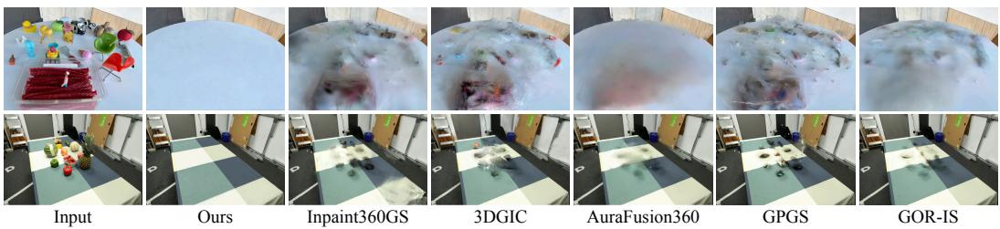
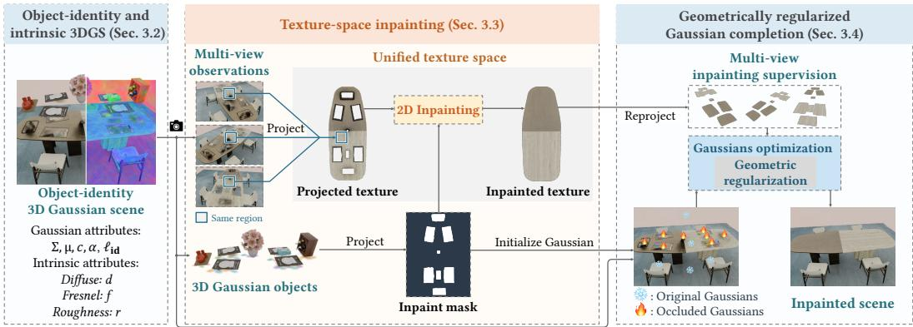
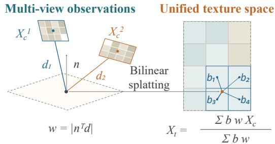
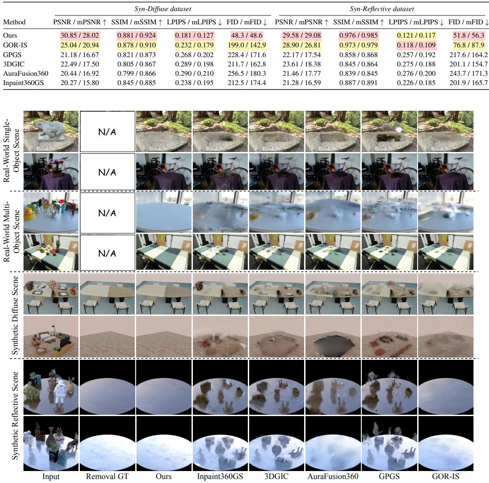
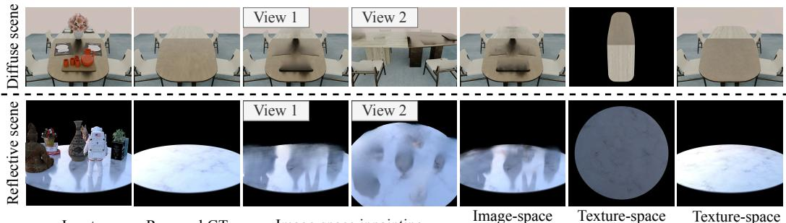
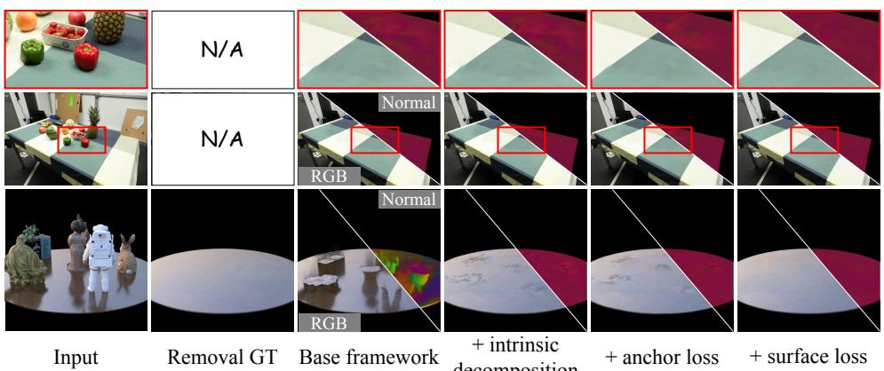
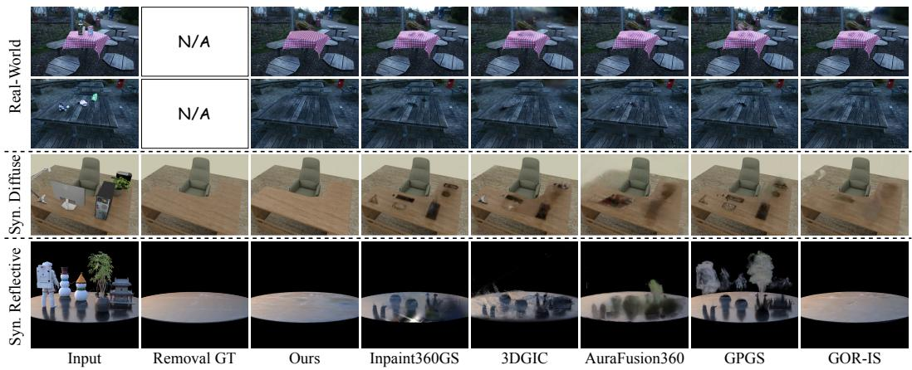
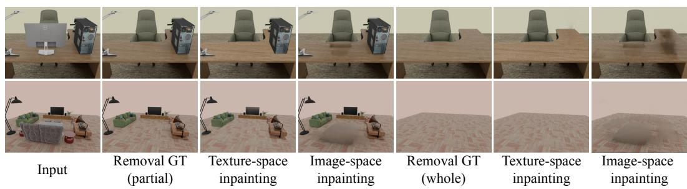

# 3DTEXMOR: 3D GAUSSIAN MULTI-OBJECT REMOVAL VIA TEXTURE-SPACE INPAINTING

Kunxin Guang1,\* Yonghao Zhao2,\* Jian Yang1 Beibei Wang1,†

1Nanjing University 2Nankai University

\*Equal contribution. †Corresponding author.

  
Figure 1: We propose 3DTexMOR, a novel framework for high-quality 3D multi-object removal. By performing inpainting in a unified texture space, 3DTexMOR recovers the regions occluded by the removed objects with consistent appearance and geometry. Compared with existing methods, 3DTexMOR produces more consistent completion scenes with fewer artifacts and less blurriness.

## ABSTRACT

3D object removal aims to remove target objects from reconstructed scenes while completing the geometry and appearance of the regions they occlude. Existing methods built on Neural Radiance Fields (NeRF) or 3D Gaussian Splatting (3DGS) typically inpaint 2D images and use the completed views to guide 3D scene completion. While these methods achieve promising results in scenes with few target objects, they often struggle with complex multi-object layouts, where individual views capture only part of the surrounding texture and structure needed to guide inpainting. These limited visual cues make 2D inpainting prone to artifacts. Moreover, appearance inconsistencies across inpainted views can introduce conflicting supervision for 3D scene completion, leading to blurry reconstructions. To address these challenges, we propose 3D Gaussian Multi-Object Removal via Texture-Space Inpainting (3DTexMOR). Our key idea is to perform inpainting in a unified texture space that combines complementary observations across views, providing richer visual information for recovering missing regions while promoting crossview appearance consistency. Specifically, we introduce a texture-space inpainting module that aggregates multi-view observations into texture maps and reprojects the completed maps into camera views to supervise 3D Gaussian scene completion. Since direct RGB aggregation is unreliable on glossy surfaces, we further decompose appearance and aggregate view-independent intrinsic attributes in texture space. Finally, because completed textures alone do not sufficiently constrain 3D structure, we introduce a geometrically regularized Gaussian completion module to encourage plausible geometry in the completed regions. Extensive experiments demonstrate that 3DTexMOR produces visually plausible scene completions and achieves state-of-the-art performance on multi-object removal, improving PSNR by 5.8 dB and reducing LPIPS by at least 22% compared with existing methods.

## 1 INTRODUCTION

Given multi-view images, 3D object removal aims to reconstruct a 3D scene, remove specified objects, and complete the regions they occlude with plausible geometry and appearance. This capability supports flexible scene editing for applications such as embodied intelligence and virtual reality. Recent advances in 3D scene representations, including Neural Radiance Fields (NeRF) (Mildenhall et al., 2021) and 3D Gaussian Splatting (3DGS) (Kerbl et al., 2023), have provided a foundation for reconstructing and editing such scenes. However, recovering the occluded regions remain challenging, as the completed content must be visually plausible and consistent across viewpoints.

Existing methods for 3D object removal typically rely on image-space inpainting, with different strategies for constructing multi-view supervision. One strategy directly inpaints multiple camera views and uses the completed images to optimize the 3D scene (Weder et al., 2023; Mirzaei et al., 2023; Weber et al., 2024; Chen et al., 2024; Wang et al., 2024; Seo et al., 2026). This provides completion supervision from multiple viewpoints, but the inpainted images may contain inconsistent appearances for the same scene regions. Another strategy completes a few reference views, in either RGB or intrinsic space, and propagates the results to other views through depth-based reprojection (Huang et al., 2025; Zhao et al., 2026). Sharing completed content across views helps reduce appearance inconsistencies, but the accuracy of the resulting supervision depends on the geometry used for reprojection, and errors in the completed regions can lead to incorrect supervision. Recent methods further exploit diffusion priors to improve the visual quality of image completion (Wu et al., 2025; Wang et al., 2026), while retaining their reliance on image-space inpainting. Despite these advances, two challenges remain in complex multi-object scenes. First, individual views often capture only part of the surrounding texture and structure needed to guide inpainting, leaving limited visual information for recovering the missing regions and making completion prone to artifacts. Second, maintaining appearance consistency across inpainted views remains difficult, and the resulting conflicting supervision can lead to blurry 3D reconstructions.

To address these challenges, we propose 3D Gaussian Multi-Object Removal via Texture-Space Inpainting (3DTexMOR). Our key idea is to perform inpainting in a unified texture space shared across camera views. By combining complementary observations from multiple views, this space brings together the visible texture and structure surrounding the missing regions, providing richer visual information for inpainting. Moreover, completing the missing regions in this shared space allows different views to receive supervision from the same completed texture maps, reducing appearance inconsistencies during 3D scene completion. Specifically, we propose a texture-space inpainting module that aggregates multi-view observations into texture maps for inpainting and reprojects the completed maps into camera views to provide shared supervision for 3D scene completion. To reduce aggregation errors caused by view-dependent appearance on glossy surfaces, the module operates on view-independent intrinsic attributes obtained through the appearance decomposition of GOR-IS (Zhao et al., 2026). We also propose a geometrically regularized Gaussian completion module to address the insufficient geometric constraints provided by completed textures alone. Experiments on synthetic and real-world scenes demonstrate that 3DTexMOR produces visually plausible scene completions under both single- and multi-object removal settings. On synthetic diffuse multi-object scenes, 3DTexMOR improves PSNR by over 5.8 dB and reduces LPIPS by at least 22% compared with the state-of-the-art baseline. Our main contributions are as follows:

• 3DTexMOR, a framework for 3D Gaussian multi-object removal that combines complementary observations across views through unified texture-space inpainting,

• a texture-space inpainting module that aggregates multi-view intrinsic images into texture maps for inpainting, providing shared supervision across views, and

• a geometrically regularized Gaussian completion module that complements texture supervi sion with geometric constraints to recover plausible 3D structure.

## 2 RELATED WORK

Object-level understanding and editing in 3D scenes. Understanding the object composition of a scene helps reliably separate individual objects. Promptable 2D segmentation and open-vocabulary perception models, such as SAM (Kirillov et al., 2023), have therefore been extended to 3D through feature distillation and multi-view mask propagation. LERF (Kerr et al., 2023) embeds language features into NeRF for open-ended 3D queries, while SA3D (Cen et al., 2023) propagates SAM prompts through NeRF for 3D object segmentation. Feature 3DGS (Zhou et al., 2024) and LangSplat (Qin et al., 2024) further distill high-dimensional semantic or language features into 3D Gaussians for efficient segmentation and querying. More closely related to editable Gaussian scenes, SAGA (Cen et al., 2025) and Gaussian Grouping (Ye et al., 2024) attach segmentation or object identity features to Gaussians, enabling object grouping, selection, and local editing.

3D inpainting and object removal. The key challenge of 3D object removal is to recover occluded regions with plausible appearance and geometry. Existing 2D inpainting methods (Suvorov et al., 2022; Lugmayr et al., 2022) provide strong image priors. However, when applied independently to different views, they may produce inconsistent appearances for the same regions. Building on NeRF and 3DGS, several methods extend 2D inpainting to 3D scenes. NeRF-based object removal methods (Weder et al., 2023; Mirzaei et al., 2023; Weber et al., 2024) combine multi-view masks, 2D inpainting supervision, and radiance-field optimization. 3DGS-based methods further improve the efficiency and quality of 3D scene inpainting. GaussianEditor (Chen et al., 2024) enables controllable Gaussian editing with diffusion guidance, while GScream (Wang et al., 2024) improves geometry and feature consistency for Gaussian object removal. Recent works further explore referenceguided Gaussian inpainting (Seo et al., 2026), depth-guided Gaussian inpainting (Dahaghin et al., 2026), 360-degree multi-object Gaussian inpainting (Wang et al., 2026), shadow-aware Gaussian completion (Zheng et al., 2026), and residual artifacts after object removal (Kocour et al., 2025). InstaInpaint (You et al., 2026) improves the efficiency of 3D scene inpainting using a feed-forward masked reconstruction model that generates an inpainted 3D scene from posed images, multi-view masks, and a reference proposal. GOR-IS (Zhao et al., 2026) improves physical consistency by decomposing scenes into intrinsic components, modeling light transport, and performing inpainting in intrinsic space. Nevertheless, most existing methods still rely on image-based inpainting and mainly focus on single-object removal, making it difficult to handle complex multi-object scenes while maintaining consistent geometry and appearance in the completed 3D scenes.

## 3 METHOD

## 3.1 OVERVIEW OF THE 3DTEXMOR FRAMEWORK

3DTexMOR removes specified objects from a reconstructed 3D Gaussian scene and completes the occluded regions with plausible geometry and appearance. As illustrated in Fig. 2, our framework builds on a Gaussian representation augmented with object identity features for selective removal and view-independent intrinsic attributes for multi-view aggregation (Sec. 3.2). Based on this representation, we introduce two modules. The texture-space inpainting module aggregates complementary multi-view intrinsic observations into a unified texture space, inpaints the missing regions, and reprojects the completed maps to the camera views as shared supervision for 3D scene completion (Sec. 3.3). The geometrically regularized Gaussian completion module completes the regions previously occluded by the removed objects, using the reprojected intrinsic supervision to recover their appearance and geometric constraints to encourage plausible geometry (Sec. 3.4).

## 3.2 OBJECT-IDENTITY AND INTRINSIC 3DGS

Our scene representation augments 3D Gaussians with object identity features and intrinsic appearance attributes. Object identity features support selective removal, while intrinsic attributes provide viewindependent appearance information for aggregation across views.

Object-identity representation. Given multi-view images, we reconstruct a scene represented by a set of 3D Gaussians G using 3DGS (Kerbl et al., 2023). We augment each Gaussian g with a learnable object identity feature $\ell _ { \mathbf { i d } }$ . These features are rendered into the training views and supervised using multi-object masks to encourage consistent object identities across views. Let $\mathcal { O } _ { \mathrm { r m } }$ denote the set of object labels selected for removal. We remove the Gaussians associated with these labels and retain the remaining set: $\mathcal { G } _ { \mathrm { k e e p } } = \{ g _ { i } \in \mathcal { G } \mid \ell _ { \mathbf { i d } } \notin \mathcal { O } _ { \mathrm { r m } } \}$ . Here, $\mathcal { G } _ { \mathrm { k e e p } }$ contains the original Gaussians representing the background and objects not selected for removal. The regions previously occluded by the removed objects require subsequent geometry and appearance completion.

Intrinsic decomposition. Directly aggregating multi-view RGB observations is unreliable on glossy surfaces because their appearance varies with viewing direction. Following GOR-IS (Zhao et al., 2026), we decompose scene appearance into a view-independent diffuse component D and a viewdependent glossy component G: $C ( \mathbf { x } , \omega _ { o } ) = D ( \mathbf { x } ) + G ( \mathbf { \bar { x } } , \omega _ { o } )$ . Here, x denotes a surface position and $\omega _ { o }$ denotes the outgoing viewing direction. Each Gaussian $g _ { i }$ carries diffuse radiance $\mathbf { d } _ { i } ,$ , Fresnel reflectance $\mathbf { f } _ { i } ,$ and roughness $r _ { i } .$ . These attributes are splatted into each camera view c to obtain the intrinsic maps $X _ { c } = \{ \mathrm { \bar { \it D } } _ { c } , F _ { c } , R _ { c } \}$ . The diffuse map $\dot { D _ { c } }$ provides the diffuse component, while the glossy component is computed through physically-based rendering using $F _ { c }$ and $\displaystyle { \cal R } _ { c } ,$ together with scene geometry and lighting. Further rendering details are provided in Appendix ${ \mathrm { A . 1 } }$ . The resulting intrinsic maps provide observations of the underlying view-independent attributes for subsequent aggregation and inpainting in the unified texture space (Sec. 3.3).

  
Figure 2: Overview of the 3DTexMOR framework. Our Gaussian scene representation incorporates object identity features and intrinsic appearance attributes. The texture-space inpainting module aggregates complementary multi-view intrinsic observations into a shared texture space, completes the masked regions, and reprojects the completed maps to provide shared supervision across camera views. The geometrically regularized Gaussian completion module lifts the completed textures into a 3D Gaussian representation on the estimated support plane and regularizes its geometry during optimization. The final scene combines the original Gaussians representing the unremoved scene content with the optimized completion Gaussians.

## 3.3 TEXTURE-SPACE INPAINTING

Individual camera views often reveal only part of the appearance information surrounding the missing regions. We therefore aggregate complementary multi-view intrinsic observations into a unified texture space before inpainting. Completing the missing regions in this shared space and reprojecting the results to the camera views provides supervision derived from the same completed textures, reducing cross-view appearance inconsistencies.

Texture space construction. We construct the texture space on an estimated support plane, assuming that the regions to be completed lie approximately on a common plane. We estimate this plane from background Gaussian centers using least-squares fitting and represent it as $\mathbf { n } ^ { \top } \mathbf { x } + d = 0$ , where n is the unit normal and d is the plane offset.

To parameterize the plane, we select a reference point o on it as the origin and a unit tangent vector $\mathbf { e } _ { u }$ orthogonal to n and define the second tangent axis as ${ \bf e } _ { v } = { \bf n } \times { \bf e } _ { u }$ The mapping from 3D positions to texture coordinates is: $T ( \mathbf { x } ) = \left[ ( \mathbf { x } - \mathbf { o } ) ^ { \top } \mathbf { e } _ { u } , ( \mathbf { x } - \mathbf { o } ) ^ { \top } \mathbf { e } _ { v } \right] ^ { \top }$ . This mapping assigns 3D locations to coordinates in the unified texture space. For each pixel $p$ in camera view $c ,$ we intersect its viewing ray with the estimated support plane to obtain the 3D point $\mathbf { x } _ { c } ( p )$ and texture coordinate $\mathbf { u } _ { c } ( p ) = T ( \mathbf { x } _ { c } ( p ) )$ . Observations occluded by retained scene content are excluded.

As shown in Fig. 3, we aggregate the multi-view intrinsic observations $X _ { c }$ into incomplete intrinsic texture maps $X _ { t }$ . Each observation is splatted onto the four neighboring texture pixels using bilinear weights. We additionally assign it a viewing-angle weight $w = | \mathbf { n } ^ { \top } \mathbf { d } |$ , where n is the plane normal and d is the view direction, giving larger weight to more frontal observations. For each contributing $X _ { c }$ , we multiply its bilinear and viewing-angle weights to obtain a combined weight. The final value at each texture pixel is the weighted average of the observations. In this way, observations of the same plane location are merged at shared texture coordinates, while different views contribute complementary appearance information around the missing regions.

Inpainting in texture space. We first construct a union inpainting mask $M _ { T }$ to indicate the regions to be completed in texture space. For each object label $o \in \mathcal { O } \mathrm { r m }$ , we select the corresponding Gaussian centers closest to the estimated plane and project them onto the texture grid to obtain the texture-space object mask $\bar { M } _ { \mathrm { o b j } } ^ { o } .$ We then combine the masks of all selected objects using elementwise logical OR to obtain mask $M _ { T } , \mathrm { i . e . , } M _ { T } = \bigvee _ { o \in \mathcal { O } \mathrm { r m } } M _ { \mathrm { o b j } } ^ { o }$ . Then, we use LaMA (Suvorov et al., 2022) as the 2D inpainting model Φ to complete the aggregated intrinsic textures. The diffuse radiance, Fresnel

  
Figure 3: Weighted aggregation of multi-view observations into a unified texture space.

reflectance, and roughness maps are inpainted independently using the same mask $M _ { T }$ . For each intrinsic attribute, Φ takes the incomplete texture map and $M _ { T }$ as input and predicts the missing regions, as: $\widehat { X _ { t } } = \left( 1 - M _ { T } \right) \odot X _ { t } + M _ { T } \odot \Phi ( X _ { t } , M _ { T } )$ , where ⊙ denotes elementwise multiplication. This formulation preserves the input texture values outside the mask and uses the inpainted value within the selected regions.

Reprojection to camera views. Using the camera-to-texture correspondence defined above, we sample the completed intrinsic textures to obtain supervision for each camera view:

$$
X _ { c } ^ { \prime } ( p ) = \widehat { X } _ { t } ( { \mathbf { u } } _ { c } ( p ) ) ,\tag{1}
$$

Here, $X _ { c } ^ { \prime }$ denotes the reprojected intrinsic maps for camera c. We also map the texture-space mask $M _ { T }$ to each camera view through the same correspondence to obtain the camera-view inpainting mask $M _ { c }$ . Camera pixels corresponding to the same plane location receive supervision from the same completed texture, reducing disagreement across views during subsequent Gaussian completion. Additional construction and sampling details are provided in Appendix A.2.

## 3.4 GEOMETRICALLY REGULARIZED GAUSSIAN COMPLETION

The reprojected intrinsic maps provide supervision for reconstructing the previously occluded regions. However, this supervision constrains rendered appearance without uniquely determining the positions and scales of the completion Gaussians. Direct optimization may therefore cause these Gaussians to drift away from the support surface or undergo excessive scale changes, resulting in implausible geometry. To address this issue, we first lift the completed intrinsic textures into a 3D Gaussian representation on the estimated support plane, establishing a geometric reference for the missing regions. We then introduce geometric regularization to penalize deviations from this reference during optimization, while allowing local adjustments guided by the intrinsic supervision.

Lifting to 3D. We construct completion Gaussians within the regions indicated by the texture-space inpainting mask $M _ { T }$ . Specifically, we sample texture coordinates $\mathbf { u } _ { i } ^ { 0 } = ( u _ { i } ^ { 0 } , v _ { i } ^ { 0 } ) ^ { \top }$ where $M _ { T } = 1$ and lift them onto the estimated support plane. The inverse parameterization of this plane and the initial Gaussian centers are given by: $\mathbf { \bar { x } } ( u , v ) = \mathbf { o } + u \mathbf e _ { u } + v \mathbf { \bar { e } } _ { v } , \mu _ { i } ^ { 0 } = \mathbf { x } ( u _ { i } ^ { 0 } , v _ { i } ^ { 0 } )$ , where $\mu _ { i } ^ { 0 }$ denotes the initial center of the i-th completion Gaussian. This construction associates each Gaussian with a location in the completed texture domain. The initial tangential scales are determined by the sampling spacing. We initialize the diffuse radiance, Fresnel reflectance, and roughness of each Gaussian by sampling the completed intrinsic textures $\widehat { X _ { t } }$ at ${ \bf u } _ { i } ^ { 0 }$ . The resulting set of $N _ { h }$ completion Gaussians, denoted by $\mathcal { G } _ { h }$ , provides an initial geometric configuration for the missing regions. Additional initialization details are provided in Appendix A.3.

Geometric regularization. We use the plane-based initialization as a geometric reference throughout optimization. Specifically, we introduce three soft regularization terms for the completion Gaussians:

$$
\mathcal { L } _ { \mathrm { s u r f } } = \sum _ { i = 1 } ^ { N _ { h } } \left| { \bf n } ^ { \top } { \pmb \mu } _ { i } + d \right| , \mathcal { L } _ { \mathrm { a n c h o r } } = \sum _ { i = 1 } ^ { N _ { h } } \left\| T ( { \pmb \mu } _ { i } ) - { \bf u } _ { i } ^ { 0 } \right\| _ { 1 } , \mathcal { L } _ { \mathrm { s c a l e } } = \sum _ { i = 1 } ^ { N _ { h } } \left\| { \bf s } _ { i } - { \bf s } _ { i } ^ { 0 } \right\| _ { 1 } .\tag{2}
$$

Here, $\pmb { \mu } _ { i }$ and $\mathbf { s } _ { i }$ denote the current center and scale vector of the i-th completion Gaussian, while ${ \bf u } _ { i } ^ { 0 }$ and $\mathbf { s } _ { i } ^ { 0 }$ denote its initial texture coordinate and scale vector, respectively. Since n is a unit normal, $\mathcal { L } _ { \mathrm { s u r f } }$ penalizes the distance of each Gaussian center from the estimated support plane. The anchoring term $\mathcal { L } _ { \mathrm { a n c h o r } }$ penalizes displacement from the initial texture coordinates, discouraging excessive drift along the plane. The scale term $\mathcal { L } _ { \mathrm { s c a l e } }$ discourages excessive expansion or shrinkage relative to the initial scales. Throughout completion, we keep $\mathcal { G } _ { \mathrm { k e e p } } .$ , the original Gaussians representing the background and objects not selected for removal, fixed and optimize only $\mathcal { G } _ { h }$ using the objective defined in Sec. 3.5. After optimization, the edited scene is $\mathcal { G } _ { \mathrm { e d i t } } = \mathcal { G } _ { \mathrm { k e e p } } \cup \mathcal { G } _ { h }$ , combining the fixed original Gaussians with the optimized completion Gaussians for the previously occluded regions.

## 3.5 LOSS FUNCTIONS

We optimize the completion Gaussians using intrinsic supervision to recover their appearance and geometric regularization to constrain their spatial structure. The overall objective is

$$
\mathcal { L } = \mathcal { L } _ { \mathrm { t e x } } + \lambda _ { \mathrm { s u r f } } \mathcal { L } _ { \mathrm { s u r f } } + \lambda _ { \mathrm { a n c h o r } } \mathcal { L } _ { \mathrm { a n c h o r } } + \lambda _ { \mathrm { s c a l e } } \mathcal { L } _ { \mathrm { s c a l e } } ,\tag{3}
$$

where $\mathcal { L } _ { \mathrm { t e x } }$ provides intrinsic supervision, and the remaining terms regularize the geometry.

Intrinsic supervision. For each training camera c, we render the combined scene $\mathcal G _ { \mathrm { k e e p } } \cup \mathcal G _ { h }$ to obtain intrinsic maps $X _ { r , c }$ . We supervise these maps using the reprojected targets $X _ { c } ^ { \prime }$ from Eq. 1 within the camera-view inpainting mask $M _ { c } \mathbf { . }$

$$
\mathcal { L } _ { \mathrm { t e x } } = \sum _ { c } \Vert M _ { c } \odot ( X _ { r , c } - X _ { c } ^ { \prime } ) \Vert _ { 1 } ,\tag{4}
$$

where ⊙ denotes elementwise multiplication, and the $L _ { 1 }$ norm sums absolute differences over pixels and intrinsic channels. Since the targets are reprojected from the same completed texture maps, they provide shared intrinsic supervision across views.

Geometric regularization. We use the three regularization terms defined in Eq. 2. The surface term $\mathcal { L } _ { \mathrm { s u r f } }$ penalizes deviations from the estimated support plane, the anchoring term $\mathcal { L } _ { \mathrm { a n c h o r } }$ penalizes displacement from the initial texture coordinates, and the scale term $\mathcal { L } _ { \mathrm { s c a l e } }$ penalizes changes from the initial Gaussian scales. Their weights $\lambda _ { \mathrm { s u r f } } , \lambda _ { \mathrm { a n c h o r } }$ , and $\lambda _ { \mathrm { s c a l e } }$ control the strength of each geometric constraint relative to the intrinsic supervision.

## 4 EXPERIMENTS

## 4.1 IMPLEMENTATION DETAILS

3DTexMOR takes multi-view images and their associated multi-object masks as input. We first optimize the initial 3DGS for 30k iterations. After removing the selected objects, we inpaint the intrinsic texture maps and optimize the completion Gaussians for 4k iterations. All experiments are conducted on an NVIDIA RTX 4090D GPU. Initial 3D Gaussian reconstruction takes approximately 40 minutes, increasing to about 2 hours when intrinsic decomposition is enabled. Gaussian segmentation requires an additional 10 minutes, while texture-space inpainting takes approximately 30 seconds. The subsequent Gaussian completion stage takes about 4 minutes. Additional implementation details are provided in the supplementary.

On Syn-Reflective, with approximately 30,000 Gaussians rendered at a resolution of $8 0 0 \times 8 0 0$ , full physically-based rendering achieves 40.0 FPS on the RTX 4090D GPU. For faster rendering, the SH distillation strategy proposed in GOR-IS (Zhao et al., 2026) can be further adopted, enabling efficient rendering with only a modest loss in rendering quality.

## 4.2 EXPERIMENTAL SETUP

Datasets. We evaluate 3DTexMOR on both synthetic and real-world scenes. The synthetic benchmark contains two datasets. Syn-Reflective consists of three reflective scenes from GOR-IS (Zhao et al., 2026). Syn-Diffuse contains three diffuse scenes with dense object layouts, providing a more challenging setting for multi-object removal. These scenes are generated using Blender. To evaluate generalization, we further construct two real-world datasets from public datasets (Kerr et al., 2023; Wang et al., 2026; Barron et al., 2022). Real-Single contains three single-object scenes, while Real-Multiple contains four multi-object scenes. For all scenes, we use SAM2 (Ravi et al., 2025) to obtain view-associated object masks. We quantitatively evaluate multi-object removal on synthetic scenes, reporting diffuse and reflective scenes separately. For real-world scenes, quantitative evaluation is unavailable due to the lack of ground truth.

Table 1: Quantitative comparison on the Syn-Diffuse and the Syn-Reflective datasets. We report full-image metrics and mask-domain metrics. Higher PSNR/SSIM and lower LPIPS/FID are better. Red highlights the best result and yellow highlights the second-best result in each group.  
  
Figure 4: Visual comparisons with prior works on real-world and synthetic scenes, showing 3DTex-MOR produces more consistent completion, with fewer artifacts and less blurriness.

Baselines. We compare 3DTexMOR with five recent 3DGS-based object removal methods: 3DGIC (Huang et al., 2025), AuraFusion360 (Wu et al., 2025), Inpaint360GS (Wang et al., 2026), GPGS (Lee & Cho, 2026), and GOR-IS (Zhao et al., 2026). We use the same inputs and train/test splits for all methods. Since some baselines support only single-object removal, we adapt their implementations to handle multi-object scenes by removing the target objects iteratively.

Metrics. We report PSNR, SSIM (Wang et al., 2004), LPIPS (Zhang et al., 2018), and FID (Heusel et al., 2017). PSNR and SSIM measure pixel-level fidelity, LPIPS measures perceptual similarity, and FID evaluates the distributional realism of rendered novel views. Since object removal mainly affects the regions originally occupied by the removed objects, we additionally report mask-domain metrics, denoted as mPSNR, mSSIM, mLPIPS, and mFID. These metrics are computed only over the pixels inside the masks of removed objects, providing a more focused evaluation of the completed regions.

rendering inpaint. (diffuse map) rendering  

## 4.3 COMPARISONS WITH PRIOR WORKS

We compare 3DTexMOR with several baselines on four datasets spanning real and synthetic scenes, single- and multi-object removal settings, and diffuse and specular surfaces. The visual comparisons in Fig. 4 show that the baselines produce noticeable artifacts, whereas 3DTexMOR yields fewer artifacts and more closely matches the GT appearance. The advantage is particularly clear in complex multi-object scenes, where individual views provide limited visual context for completing the occluded regions.

Table 1 reports quantitative results on the Syn-Diffuse and Syn-Reflective datasets. On diffuse scenes, 3DTexMOR achieves the best performance among the compared methods across all reported metrics. On reflective scenes, our method substantially outperforms 3DGIC, AuraFusion360, and Inpaint360GS, while remaining competitive with GOR-IS. Specifically, 3DTexMOR achieves higher PSNR and SSIM and lower FID than GOR-IS, although GOR-IS obtains slightly lower LPIPS. The relatively simple backgrounds and small completion regions in these reflective scenes may limit the benefits of aggregating complementary multi-view observations. Together, the visual and quantitative results demonstrate the effectiveness of 3DTexMOR across different scene types and removal settings.

## 4.4 ABLATION STUDIES

Texture-space inpainting. We evaluate the contribution of texture-space inpainting by replacing it with image-space inpainting, which applies LaMa independently to multiple camera views, while keeping all other components unchanged. We compare the two approaches on both the Syn-Diffuse and Syn-Reflective datasets. As shown in Fig. 5, image-space inpainting produces noticeable artifacts in previously occluded regions, which propagate to the rendered results. In contrast, our method performs inpainting in a unified texture space and reprojects the completed maps to provide shared supervision across views, producing cleaner and more consistent appearance in the completed regions. The quantitative results in Table 2 further demonstrate an improvement of approximately 7 dB in PSNR on the Syn-Diffuse and Syn-Reflective datasets over the image-space method. Additional qualitative results can be found in Fig. B.2.

Image-space inpainting

Input  
Removal GT  
Figure 5: Ablation of texture-space inpainting (inpaint.). We replace texture-space inpainting with image-space inpainting and compare the inpainted results and the renderings. Image-space inpainting has difficulty recovering occluded regions from limited observations, leading to more artifacts. Table 2: Quantitative comparison between image-space and texture-space inpainting on the synthetic datasets. All metrics are averaged over both Syn-Diffuse and Syn-Reflective. The visual comparison is shown in Fig. 5.
<table><tr><td>Variant</td><td>PSNR/mPSNR ↑</td><td>SSIM/mSSIM ↑</td><td>LPIPS/mLPIPS↓</td><td>FID/mFID ↓</td></tr><tr><td>image-space</td><td>23.49/19.17</td><td>0.823/0.882</td><td>0.266/0.205</td><td>185.1/124.8</td></tr><tr><td>texture-space</td><td>30.22/28.56</td><td>0.929/0.955</td><td>0.151/0.122</td><td>50.1/52.5</td></tr></table>

Intrinsic decomposition. Starting from a base framework with only texture-space inpainting enabled, we add view-independent intrinsic decomposition. On reflective scenes, this removes reflections of the deleted objects that otherwise remain in the completed regions. Fig. 6 shows the disappearance of these reflections in the RGB renderings and a reduction in the associated geometry artifacts in the normal maps. The improvement is less pronounced on diffuse scenes, where strong view-dependent reflections are absent. Table 3 further shows that intrinsic decomposition effectively overcomes the difficulties caused by glossy surfaces during multi-view aggregation and texture-space inpainting, leading to consistent improvements across all metrics.

  
+ intrinsic decomposition  
Figure 6: Ablation of intrinsic decomposition and geometric regularization. Starting from a base framework with only texture-space inpainting enabled, we gradually add intrinsic decomposition, the anchor loss, and the surface loss. Intrinsic decomposition provides view-independent attributes for reducing artifacts caused by glossy surfaces. The anchor and surface losses discourage Gaussian drift from the completed regions, encouraging plausible geometry.

Geometric Regularization. The anchor loss discourages completion Gaussians from drifting along the estimated plane by keeping their texture coordinates close to their initial positions. In Fig. 6, adding this loss reduces the area affected by geometric irregularities, which is particularly clear in the normal maps. The surface loss further penalizes the perpendicular distance between Gaussian centers and the estimated plane. Adding this term produces more uniform normals and visibly improves the RGB renderings, indicating flatter geometry in the completed regions. Together, the two terms constrain drift along and away from the plane. Table 3 further shows that the performance improves progressively as each component is introduced, with the full model achieving the best metrics.

Table 3: Component ablation with texture-space inpainting enabled, corresponding to Fig. 6. Components are added gradually to evaluate the effects of intrinsic decomposition and geometric regularization. Intrinsic decomposition reduces reflection artifacts on glossy surfaces, while the anchor and surface losses progressively improve the geometry of the completed regions.
<table><tr><td>Variant</td><td>PSNR/mPSNR ↑</td><td>SSIM/mSSIM ↑</td><td>LPIPS/mLPIPS ↓</td><td>FID/mFID ↓</td></tr><tr><td>Base framework</td><td>27.52/23.12</td><td>0.874/0.919</td><td>0.209/0.168</td><td>94.3/71.6</td></tr><tr><td>+ Intrinsic decomposition</td><td>28.15/27.68</td><td>0.902/0.925</td><td>0.172/0.142</td><td>64.7/60.0</td></tr><tr><td>+ Anchor loss</td><td>28.81/27.84</td><td>0.911/0.928</td><td>0.165/0.138</td><td>61.2/58.4</td></tr><tr><td>+ Surface loss</td><td>30.22/28.56</td><td>0.929/0.955</td><td>0.151/0.122</td><td>50.1/52.5</td></tr></table>

## 5 CONCLUSION

In this paper, we propose 3DTexMOR, a novel framework for high-quality 3D multi-object removal. By aggregating complementary multi-view observations in a unified texture space shared across camera views, 3DTexMOR provides richer visual information for recovering occluded regions while reducing appearance inconsistencies. We further introduce a geometrically regularized Gaussian completion module that complements texture supervision with geometric constraints to recover plausible 3D structure in the completed regions. Experiments on synthetic and real-world scenes demonstrate that 3DTexMOR outperforms recent Gaussian object removal methods.

Limitations andfuture work. 3DTexMOR currently assumes that the regions to be completed can be well approximated by a common plane. While this assumption enables a stable construction of the unified texture space, it limits the method on curved, deformable, or irregular surfaces, where planar mapping may introduce misalignment in the reprojected supervision. Extending the texture-space representation to more general surfaces is an important direction for future work.

## AI USE STATEMENT

Generative AI tools were used to assist with manuscript refinement and to review the clarity and consistency of the method description and mathematical notation. The authors are fully responsible for the final content of the paper, including its methods, experimental results, and claims.

## REFERENCES

Jonathan T Barron, Ben Mildenhall, Dor Verbin, Pratul P Srinivasan, and Peter Hedman. Mip-nerf 360: Unbounded anti-aliased neural radiance fields. In 2022 IEEE/CVF Conference on Computer Vision and Pattern Recognition (CVPR), pp. 5460–5469. IEEE, 2022.

Jiazhong Cen, Zanwei Zhou, Jiemin Fang, Wei Shen, Lingxi Xie, Dongsheng Jiang, Xiaopeng Zhang, Qi Tian, et al. Segment anything in 3d with nerfs. Advances in Neural Information Processing Systems, 36:25971–25990, 2023.

Jiazhong Cen, Jiemin Fang, Chen Yang, Lingxi Xie, Xiaopeng Zhang, Wei Shen, and Qi Tian. Segment any 3d gaussians. In Proceedings of the AAAI conference on artificial intelligence, volume 39, pp. 1971–1979, 2025.

Yiwen Chen, Zilong Chen, Chi Zhang, Feng Wang, Xiaofeng Yang, Yikai Wang, Zhongang Cai, Lei Yang, Huaping Liu, and Guosheng Lin. Gaussianeditor: Swift and controllable 3d editing with gaussian splatting. In 2024 IEEE/CVF Conference on Computer Vision and Pattern Recognition (CVPR), pp. 21476–21485. IEEE, 2024.

Mahtab Dahaghin, Milind G Padalkar, Matteo Toso, Alessio Del Bue, and Vittorio Murino. Splatfill: 3d scene inpainting via depth-guided gaussian splatting. In International Conference on Pattern Recognition, pp. 19–33. Springer, 2026.

Martin Heusel, Hubert Ramsauer, Thomas Unterthiner, Bernhard Nessler, and Sepp Hochreiter. Gans trained by a two time-scale update rule converge to a local nash equilibrium. Advances in neural information processing systems, 30, 2017.

Sheng-Yu Huang, Zi-Ting Chou, and Yu-Chiang Frank Wang. 3d gaussian inpainting with depthguided cross-view consistency. In 2025 IEEE/CVF Conference on Computer Vision and Pattern Recognition (CVPR), pp. 26704–26713. IEEE, 2025.

Bernhard Kerbl, Georgios Kopanas, Thomas Leimkuhler, George Drettakis, et al. 3d gaussian¨ splatting for real-time radiance field rendering. ACM Trans. Graph., 42(4):139–1, 2023.

Justin Kerr, Chung Min Kim, Ken Goldberg, Angjoo Kanazawa, and Matthew Tancik. Lerf: Language embedded radiance fields. In 2023 IEEE/CVF International Conference on Computer Vision (ICCV), pp. 19672–19682. IEEE, 2023.

Alexander Kirillov, Eric Mintun, Nikhila Ravi, Hanzi Mao, Chloe Rolland, Laura Gustafson, Tete Xiao, Spencer Whitehead, Alexander C Berg, Wan-Yen Lo, et al. Segment anything. In 2023 IEEE/CVF international conference on computer vision (ICCV), pp. 3992–4003. IEEE, 2023.

Simona Kocour, Assia Benbihi, and Torsten Sattler. Remove360: Benchmarking residuals after object removal in 3d gaussian splatting. arXiv preprint arXiv:2508.11431, 2025.

Yongjoon Lee and Donghyeon Cho. Gpgs: Consistent 3d object removal via geometry-aware 3d inpainting and projected image refinement in 3d gaussian splatting. In Proceedings of the AAAI Conference on Artificial Intelligence, volume 40, pp. 5927–5935, 2026.

Andreas Lugmayr, Martin Danelljan, Andres Romero, Fisher Yu, Radu Timofte, and Luc Van Gool. Repaint: Inpainting using denoising diffusion probabilistic models. In 2022 IEEE/CVF conference on computer vision and pattern recognition (CVPR), pp. 11451–11461. IEEE, 2022.

Ben Mildenhall, Pratul P Srinivasan, Matthew Tancik, Jonathan T Barron, Ravi Ramamoorthi, and Ren Ng. Nerf: Representing scenes as neural radiance fields for view synthesis. Communications ofthe ACM, 65(1):99–106, 2021.

Ashkan Mirzaei, Tristan Aumentado-Armstrong, Konstantinos G Derpanis, Jonathan Kelly, Marcus A Brubaker, Igor Gilitschenski, and Alex Levinshtein. Spin-nerf: Multiview segmentation and perceptual inpainting with neural radiance fields. In 2023 IEEE/CVF Conference on Computer Vision and Pattern Recognition (CVPR), pp. 20669–20679. IEEE, 2023.

Minghan Qin, Wanhua Li, Jiawei Zhou, Haoqian Wang, and Hanspeter Pfister. Langsplat: 3d language gaussian splatting. In 2024 IEEE/CVF Conference on Computer Vision and Pattern Recognition (CVPR), pp. 20051–20060. IEEE, 2024.

Nikhila Ravi, Valentin Gabeur, Yuan-Ting Hu, Ronghang Hu, Chaitanya Ryali, Tengyu Ma, Haitham Khedr, Roman Radle, Chloe Rolland, Laura Gustafson, et al. Sam 2: Segment anything in ¨ images and videos. In International Conference on Learning Representations, volume 2025, pp. 28085–28128, 2025.

Ji Hyun Seo, Byounhyun Yoo, and Gerard Jounghyun Kim. Reference-guided gaussian splatting for realistic and view-consistent 3d scene inpainting. Computational Visual Media, 2026.

Roman Suvorov, Elizaveta Logacheva, Anton Mashikhin, Anastasia Remizova, Arsenii Ashukha, Aleksei Silvestrov, Naejin Kong, Harshith Goka, Kiwoong Park, and Victor Lempitsky. Resolutionrobust large mask inpainting with fourier convolutions. In 2022 IEEE/CVF Winter Conference on Applications of Computer Vision (WACV), pp. 3172–3182. IEEE, 2022.

Shaoxiang Wang, Shihong Zhang, Christen Millerdurai, Rudiger Westermann, Didier Stricker, and ¨ Alain Pagani. Inpaint360gs: Efficient object-aware 3d inpainting via gaussian splatting for 360° scenes. In 2026 IEEE/CVF Winter Conference on Applications ofComputer Vision (WACV), pp. 117–127. IEEE, 2026.

Yuxin Wang, Qianyi Wu, Guofeng Zhang, and Dan Xu. Learning 3d geometry and feature consistent gaussian splatting for object removal. In European conference on computer vision, pp. 1–17. Springer, 2024.

Zhou Wang, Alan C Bovik, Hamid R Sheikh, and Eero P Simoncelli. Image quality assessment: from error visibility to structural similarity. IEEE transactions on image processing, 13(4):600–612, 2004.

Ethan Weber, Aleksander Holynski, Varun Jampani, Saurabh Saxena, Noah Snavely, Abhishek Kar, and Angjoo Kanazawa. Nerfiller: Completing scenes via generative 3d inpainting. In 2024 IEEE/CVF Conference on Computer Vision and Pattern Recognition (CVPR), pp. 20731–20741. IEEE, 2024.

Silvan Weder, Guillermo Garcia-Hernando, Aron Monszpart, Marc Pollefeys, Gabriel J Brostow, Michael Firman, and Sara Vicente. Removing objects from neural radiance fields. In Proceedings of the IEEE/CVF Conference on Computer Vision and Pattern Recognition, pp. 16528–16538, 2023.

Chung-Ho Wu, Yang-Jung Chen, Ying-Huan Chen, Jie-Ying Lee, Bo-Hsu Ke, Chun-Wei Tuan Mu, Yi-Chuan Huan, Chin-Yang Lin, Min-Hung Chen, Yen-Yu Lin, et al. Aurafusion360: Augmented unseen region alignment for reference-based 360 unbounded scene inpainting. In 2025 IEEE/CVF Conference on Computer Vision and Pattern Recognition (CVPR), pp. 16366–16376. IEEE, 2025.

Mingqiao Ye, Martin Danelljan, Fisher Yu, and Lei Ke. Gaussian grouping: Segment and edit anything in 3d scenes. In European conference on computer vision, pp. 162–179. Springer, 2024.

Junqi You, Chieh Lin, Weijie Lyu, Zhengbo Zhang, and Ming-Hsuan Yang. Instainpaint: Instant 3d-scene inpainting with masked large reconstruction model. Advances in Neural Information Processing Systems, 38:153574–153594, 2026.

Richard Zhang, Phillip Isola, Alexei A Efros, Eli Shechtman, and Oliver Wang. The unreasonable effectiveness of deep features as a perceptual metric. In 2018 IEEE/CVF conference on computer vision and pattern recognition, pp. 586–595. IEEE, 2018.

Yonghao Zhao, Yupeng Gao, Jian Yang, Jin Xie, and Beibei Wang. Gor-is: 3d gaussian object removal in the intrinsic space. In Proceedings of the IEEE/CVF Conference on Computer Vision and Pattern Recognition, pp. 40896–40906, 2026.

Wenxing Zheng, Yuqi Li, Jinghui Xiang, Xiaohao Peng, and Chong Wang. Gaucomp: 3d gaussian completion for associated shadow and object removal. In Computer Graphics Forum, pp. e70309. Wiley Online Library, 2026.

Shijie Zhou, Haoran Chang, Sicheng Jiang, Zhiwen Fan, Zehao Zhu, Dejia Xu, Pradyumna Chari, Suya You, Zhangyang Wang, and Achuta Kadambi. Feature 3dgs: Supercharging 3d gaussian splatting to enable distilled feature fields. In 2024 IEEE/CVF Conference on Computer Vision and Pattern Recognition (CVPR), pp. 21676–21685. IEEE, 2024.

## A TECHNICAL DETAILS

This appendix expands the representation and two completion modules in Secs. 3.2–3.4, together with the objective in Sec. 3.5. We first detail the intrinsic attributes and reflection renderer, then describe texture-space construction, inpainting, and reprojection. Finally, we specify Gaussian initialization and explain how intrinsic supervision and geometric regularization guide completion.

## A.1 INTRINSIC DECOMPOSITION AND REFLECTION RENDERING

Gaussian attributes and deferred maps. We use the reflection model of GOR-IS (Zhao et al., 2026) to separate the diffuse and glossy terms in Sec. 3.2. Each Gaussian carries diffuse radiance $\mathbf { d } _ { i } ,$ normal-incidence Fresnel reflectance $\mathbf { f } _ { i } .$ , and roughness $r _ { i } .$ . Deferred rasterization produces their per-view maps $D _ { c } , F _ { c } ,$ , and $R _ { c } ,$ , together with a normal map $N _ { c }$ from the geometry branch. The diffuse term is view-independent radiance under the fixed capture lighting and already includes diffuse illumination; it is not an estimate of unlit albedo. The remaining glossy component is evaluated from the viewing direction, surface geometry, intrinsic attributes, and incident radiance.

Reflected rays and incident radiance. At pixel $p ,$ let $\mathbf { n } _ { s }$ be the unit shading normal from $N _ { c } .$ . This local normal is distinct from the fitted plane normal n used to construct texture space. Let $\mathbf { d } _ { c , p }$ be the unit ray direction from camera c to the shading point at pixel $p .$ The reflected direction is

$$
\begin{array} { r } { \pmb { \omega } _ { r } = \mathbf { d } _ { c , p } - 2 ( \mathbf { d } _ { c , p } ^ { \top } \mathbf { n } _ { s } ) \mathbf { n } _ { s } , \qquad \pmb { \omega } _ { o } = - \mathbf { d } _ { c , p } . } \end{array}\tag{A.1}
$$

We trace a secondary ray from the shading point along $\omega _ { r }$ through the Gaussian scene to obtain the near-field radiance. An optimizable environment map provides the far-field contribution according to ray visibility. Together these contributions form the incident-radiance map $L _ { i , c } .$ Since the near-field term queries the scene itself, removing an object can change the reflected radiance at a different surface location.

Fresnel response and roughness. The renderer converts $F _ { c }$ into the angle-dependent Fresnel factor $\mathcal { F } _ { c }$ using Schlick’s approximation. It forms an ideal reflection map and applies a roughness-guided screen-space filter $\mathcal { H }$ to approximate glossy reflection:

$$
S _ { c } = \mathcal { F } _ { c } \odot L _ { i , c } , \qquad G _ { c } = \mathcal { H } ( S _ { c } , R _ { c } ) .\tag{A.2}
$$

The intrinsic Fresnel reflectance $F _ { c }$ represents a view-independent attribute, whereas $\mathcal { F } _ { c }$ depends on the viewing direction. Only the intrinsic attribute enters texture space; the angle-dependent factor is evaluated during reflection rendering.

Intrinsic maps as completion inputs. The decomposition separates the view-independent attributes in $X _ { c }$ from the view-dependent glossy component $G _ { c }$ . Texture-space inpainting operates on the former, so observations can be aggregated across views without directly combining their highlights and reflections. The glossy component is evaluated from the edited scene, as described in Appendix A.3.

## A.2 TEXTURE-SPACE INPAINTING DETAILS

Plane estimation. Let $\mathcal { P } _ { s } = \{ \mathbf { x } _ { i } \} _ { i = 1 } ^ { N _ { s } }$ contain the background Gaussian centers used to estimate the plane in Sec. 3.3. The least-squares fit minimizes their squared distances to a plane:

$$
\operatorname* { m i n } _ { \mathbf { n } , d } \sum _ { i = 1 } ^ { N _ { s } } ( \mathbf { n } ^ { \top } \mathbf { x } _ { i } + d ) ^ { 2 } , \qquad \| \mathbf { n } \| _ { 2 } = 1 .\tag{A.3}
$$

The unit-normal constraint makes $| \mathbf { n } ^ { \top } \mathbf { x } + d |$ the point-to-plane distance in world units. The fitted plane provides the common geometric reference for texture projection, object masks, Gaussian initialization, and surface regularization.

Plane coordinates and the texel grid. We choose an origin o on the fitted plane and two orthonormal tangent axes satisfying $\mathbf { e } _ { u } \times \mathbf { e } _ { v } = \mathbf { n }$ . The mapping in Sec. 3.3 assigns each 3D point two tangential coordinates. Its inverse parameterization in Sec. 3.4 lifts these coordinates onto the plane.

In particular, $T ( \mathbf { x } ( u , v ) ) = ( u , v ) ^ { \top }$ . For a point away from the plane, $T$ still gives its tangential coordinates; its normal displacement is measured separately by $\mathbf { n } ^ { \top } \mathbf { x } + d$ . This distinction is used by the two position penalties in Eq. (2).

The texture domain Ω covers the projected background observations and the footprints of all selected objects. We discretize Ω into a regular grid with texel spacings $\Delta _ { u }$ and $\Delta _ { v }$ , measured in world units along the tangent axes. To make the sampling convention explicit, let $\mathbf { t } _ { \mathrm { r e f } } = ( u _ { \mathrm { r e f } } , v _ { \mathrm { r e f } } )$ be the texture coordinate of the first texel center. The conversion to continuous grid indices is

$$
\gamma ( u , v ) = \left( \frac { u - u _ { \mathrm { r e f } } } { \Delta _ { u } } , \frac { v - v _ { \mathrm { r e f } } } { \Delta _ { v } } \right) ^ { \top } .\tag{A.4}
$$

Integer indices identify texel centers. The geometric mapping $T$ and the anchor loss use plane coordinates, while splatting, mask rasterization, and the sampling stride use grid coordinates. Thus, a stride of $s _ { T }$ texels corresponds to distances $s _ { T } \Delta _ { u }$ and $s _ { T } \Delta _ { v }$ on the surface.

Camera-to-texture correspondence. For pixel $p$ in camera $c ,$ the calibrated camera parameters define the world-space ray $\mathbf { c } _ { c } + t \mathbf { d } _ { c , p }$ , where $\mathbf { c } _ { c }$ is the camera center and $\mathbf { d } _ { c , p }$ is a unit direction pointing from the camera into the scene. Substituting the ray into the plane equation yields

$$
\begin{array} { r l } & { t _ { c } ( p ) = - \frac { \mathbf { n } ^ { \top } \mathbf { c } _ { c } + d } { \mathbf { n } ^ { \top } \mathbf { d } _ { c , p } } , } \\ & { \mathbf { x } _ { c } ( p ) = \mathbf { c } _ { c } + t _ { c } ( p ) \mathbf { d } _ { c , p } , \qquad \mathbf { u } _ { c } ( p ) = T ( \mathbf { x } _ { c } ( p ) ) . } \end{array}\tag{A.5}
$$

A geometric correspondence is valid only if the ray is not parallel to the plane, $t _ { c } ( p ) > 0$ , and ${ \mathbf { u } } _ { c } ( p ) \in \Omega$ . These conditions ensure a forward intersection inside the texture extent; they do not by themselves establish that the background is observed. For aggregation, we additionally require a visible background observation and exclude pixels occluded by retained objects. We denote the resulting set of camera–pixel pairs by V.

Multi-view observation aggregation. Let $X _ { c , q } ( p )$ denote attribute $q \in \mathcal { Q } = \{ D , F , R \}$ at pixel p in the intrinsic maps $X _ { c } = \bar { \{ D _ { c } , F _ { c } , R _ { c } \} }$ . We aggregate each attribute using the same camera-totexture correspondence. An observation at ${ \bf u } _ { c } ( p )$ contributes to its four neighboring texels by bilinear splatting. For a texel centered at plane coordinate z, its coefficient is

$$
b ( { \bf z , t } ) = \prod _ { k \in \{ u , v \} } \operatorname* { m a x } ( 0 , 1 - | \gamma _ { k } ( { \bf z } ) - \gamma _ { k } ( { \bf t } ) | ) .\tag{A.6}
$$

Only neighboring texels inside the grid are accumulated. We also weight each observation by $w _ { c , p } = | \mathbf { n } ^ { \top } \mathbf { d } _ { c , p } |$ . Because both vectors are normalized, this weight lies in [0, 1] and decreases for grazing views. The corresponding incomplete intrinsic texture is

$$
X _ { t , q } ( \mathbf { z } ) = \frac { \sum _ { ( c , p ) \in \mathcal { V } } b ( \mathbf { z } , \mathbf { u } _ { c } ( p ) ) w _ { c , p } X _ { c , q } ( p ) } { \sum _ { ( c , p ) \in \mathcal { V } } b ( \mathbf { z } , \mathbf { u } _ { c } ( p ) ) w _ { c , p } + \epsilon } ,\tag{A.7}
$$

where $\epsilon > 0$ stabilizes the denominator and the same scalar weights apply to each component of a vector-valued channel. The denominator measures accumulated observation support; adding ϵ does not turn a texel without observations into an observed surface sample. Equation (A.7) is applied separately to the three channels specified in Appendix ${ \mathrm { A . 1 } }$

Object footprints and the completion mask. We retain the target objects’ Gaussian centers before deleting their Gaussians from the scene. For object $o \in \mathcal { O } _ { \mathrm { r m } } .$ , let $\bar { \mathcal { P } } _ { o } = \{ \mathbf { x } _ { i } ^ { o } \}$ be these centers and $\delta _ { i } ^ { o } = \vert \mathbf { n } ^ { \intercal } \mathbf { x } _ { i } ^ { o } + d \vert$ their distances to the estimated plane. As in Sec. 3.3, we select the centers closest to the plane and project them using $T$ to obtain the object mask $M _ { \mathrm { o b j } } ^ { o }$ on the texture grid. Selecting centers by their point-to-plane distances associates the mask with the object’s footprint on the estimated plane.

The joint mask is the pixelwise union

$$
M _ { T } = \bigvee _ { o \in \mathcal { O } _ { \mathrm { r m } } } M _ { \mathrm { o b j } } ^ { o } .\tag{A.8}
$$

We use this footprint union directly as the completion mask. The observation-validity set V determines which values enter the texture, whereas $M _ { T }$ determines which texture values are regenerated. These two roles are distinct; observed texels are not subtracted from the footprint union.

Intrinsic aggregation and completion. After deleting the selected objects, we rasterize the retained scene to obtain $X _ { c }$ and aggregate these observations into the incomplete intrinsic textures $X _ { t } =$ $\{ X _ { t , D } , X _ { t , F } , X _ { t , R } \}$ using Eq. (A.7). We apply LaMA independently to the three textures with the same mask $M _ { T }$ , following the inpainting formulation in Sec. 3.3. This produces the completed maps $\widehat { X } _ { t , D } , \widehat { X } _ { t , F } ,$ , and $\widehat { X } _ { t , R }$ , collectively denoted by $\widehat { X _ { t } }$ in the main text. Generated values are retained inside $M _ { T } ,$ , and the aggregated input remains unchanged outside it. All three textures therefore refer to the same physical surface locations. Normals remain in the geometry branch and are not inpainted as texture values. The glossy term $G$ is also excluded from inpainting because it depends on the current scene and viewing direction.

Geometric reprojection. We reproject the completed intrinsic maps by sampling them at the camera-to-texture coordinates ${ \bf u } _ { c } ( p )$ , as in Eq. (1). Projection and reprojection use the same fitted plane and coordinate frame, so pixels corresponding to the same plane location share a completed texture value across views. For target construction, the completed surface must be in front of the camera, inside the texture domain, and unoccluded by retained content. Unlike an aggregation sample, such a target need not have an original background observation: it may lie in the previously hidden region.

Reprojected targets and the supervision mask. We convert the completed textures into per-view targets by sampling

$$
X _ { c , q } ^ { \prime } ( p ) = \widehat { X } _ { t , q } ( \mathbf { u } _ { c } ( p ) ) , \qquad q \in \mathcal { Q } .\tag{A.9}
$$

Let $v _ { c } ( p )$ indicate a valid plane intersection that is unoccluded by retained scene content. The completion-supervision mask can be written as

$$
M _ { c } ( p ) = \left\{ \begin{array} { l l } { M _ { T } ( \mathbf { u } _ { c } ( p ) ) , } & { v _ { c } ( p ) = 1 , } \\ { 0 , } & { v _ { c } ( p ) = 0 . } \end{array} \right.\tag{A.10}
$$

Thus, a retained foreground object does not receive a completed background target merely because its camera ray intersects the plane behind it.

## A.3 GAUSSIAN INITIALIZATION AND OPTIMIZATION DETAILS

Sampling the initialization region. We initialize completion Gaussians within the same mask $M _ { T }$ used for texture-space inpainting. Let $\boldsymbol { S _ { s _ { T } } }$ denote grid locations sampled with stride $s _ { T }$ texels and expressed in plane coordinates. We retain only samples inside $M _ { T }$

$$
\mathcal { U } _ { h } = \{ \mathbf { u } \in \mathcal { S } _ { s _ { T } } \mid M _ { T } ( \mathbf { u } ) = 1 \} = \{ \mathbf { u } _ { i } ^ { 0 } = ( u _ { i } ^ { 0 } , v _ { i } ^ { 0 } ) ^ { \top } \} _ { i = 1 } ^ { N _ { h } } .\tag{A.11}
$$

The superscript 0 denotes initialization. Each selected coordinate supplies both the initial center and the intrinsic attributes of a completion Gaussian.

Centers and scales. Each sampled location is lifted onto the estimated plane:

$$
\pmb { \mu } _ { i } ^ { 0 } = \mathbf { x } ( u _ { i } ^ { 0 } , v _ { i } ^ { 0 } ) = \mathbf { o } + u _ { i } ^ { 0 } \mathbf { e } _ { u } + v _ { i } ^ { 0 } \mathbf { e } _ { v } .\tag{A.12}
$$

It therefore satisfies $\mathbf { n } ^ { \top } \pmb { \mu } _ { i } ^ { 0 } + d = 0$ and $T ( \mu _ { i } ^ { 0 } ) = \mathbf { u } _ { i } ^ { 0 }$ at initialization. This correspondence also identifies the texture location from which its appearance is sampled.

As in Sec. 3.4, the initial tangential scales are determined by the sampling spacing. In the texture coordinates defined above, this spacing corresponds to $s _ { T } \Delta _ { u }$ and $s _ { T } \Delta _ { v }$ in world units. We denote the initial scale vector by ${ \bf s } _ { i } ^ { 0 }$ and retain it as the reference for the scale regularizer.

Intrinsic attributes. We query the completed texture maps at the same initial coordinate:

$$
\mathbf { d } _ { i } ^ { 0 } = \widehat { X } _ { t , D } ( \mathbf { u } _ { i } ^ { 0 } ) , \qquad \mathbf { f } _ { i } ^ { 0 } = \widehat { X } _ { t , F } ( \mathbf { u } _ { i } ^ { 0 } ) , \qquad r _ { i } ^ { 0 } = \widehat { X } _ { t , R } ( \mathbf { u } _ { i } ^ { 0 } ) .\tag{A.13}
$$

These attributes provide the initial appearance of $\mathcal { G } _ { h }$ . Combining the completion Gaussians with the retained scene gives $\mathcal { G } _ { \mathrm { k e e p } } \cup \mathcal { G } _ { h }$ , whose rendered intrinsic maps are supervised during completion.

Intrinsic supervision. The masked $L _ { 1 }$ loss in Eq. (4) compares the rendered intrinsic maps $X _ { r , c }$ with the fixed reprojected targets $X _ { c } ^ { \prime }$ inside the camera-view inpainting mask $M _ { c }$ . Writing the attribute channels explicitly gives

$$
\mathcal { L } _ { \mathrm { t e x } } = \sum _ { c } \sum _ { q \in \mathcal { Q } } \left. M _ { c } \odot \left( X _ { r , c , q } - X _ { c , q } ^ { \prime } \right) \right. _ { 1 } .\tag{A.14}
$$

Here, $X _ { r , c , q }$ denotes channel $q$ of the current rendered maps. As in the main text, the norm sums absolute differences over pixels and attribute components, with no additional channel-specific weights. Only the parameters $\theta$ of the completion Gaussians are optimized; the retained Gaussians remain fixed. The targets act as supervision, rather than as additional renderer inputs; gradients pass through the differentiable rasterizer to the completion Gaussians.

Geometric meaning of the soft constraints. The three penalties in $\operatorname { E q . } \left( 2 \right)$ constrain different degrees of freedom of the completion Gaussians. To see their roles, let $\delta \pmb { \mu } _ { i } = \pmb { \mu } _ { i } - \pmb { \mu } _ { i } ^ { 0 }$ . Because the initial center lies on the plane and the plane frame is orthonormal, its displacement decomposes as

$$
\begin{array} { c } { \delta { \pmb { \mu } } _ { i } = \delta u _ { i } { \bf e } _ { u } + \delta v _ { i } { \bf e } _ { v } + \delta h _ { i } { \bf n } , } \\ { ( \delta u _ { i } , \delta v _ { i } ) ^ { \top } = T ( { \pmb \mu } _ { i } ) - { \bf u } _ { i } ^ { 0 } , \qquad \delta h _ { i } = { \bf n } ^ { \top } { \pmb \mu } _ { i } + d . } \end{array}\tag{A.15}
$$

Thus, $\mathcal { L } _ { \mathrm { s u r f } }$ penalizes normal displacement $| \delta h _ { i } | .$ , while $\mathcal { L } _ { \mathrm { a n c h o r } }$ penalizes tangential displacement $\lvert \delta u _ { i } \rvert + \lvert \delta v _ { i } \rvert$ . The anchor is measured in plane coordinates with world units, rather than texel indices, so its geometric meaning does not depend on an index scaling. The fitted plane, initial coordinates, and initial scales serve as fixed references during completion optimization.

The surface penalty is a soft geometric constraint. It allows local departures from the recovered plane when supported by the reprojected intrinsic supervision, while penalizing excessive deviation. The anchor likewise permits local tangential adjustment while discouraging drift from the texture location that supplied the initial appearance. Neither loss prescribes the exact optimized center. The scale loss compares the current positive axis scales $\mathbf { s } _ { i }$ with ${ \bf s } _ { i } ^ { 0 } .$ , discouraging excessive expansion or collapse relative to the sampling footprint. The surface and anchor terms constrain Gaussian centers, while the scale term constrains axis lengths. In particular, the surface term measures center-to-plane distance; it does not directly penalize Gaussian orientation.

Completion optimization. We first build the completed textures and their per-view targets, then initialize $\mathcal { G } _ { h }$ with Eqs. (A.11)–(A.13). During optimization, we rasterize the current intrinsic attributes, evaluate the masked loss in Eq. (4), and evaluate the three geometry terms on the completion Gaussians. Their weighted sum is exactly the objective in Eq. (3). The retained Gaussians, completed textures, reprojected targets, and supervision masks remain fixed; only the new Gaussians are updated to fit these targets under the geometric penalties. The weights $\lambda _ { \mathrm { s u r f } } , \lambda _ { \mathrm { a n c h o r } }$ , and $\lambda _ { \mathrm { s c a l e } }$ control the three soft geometry penalties.

All three geometric terms act as soft penalties, allowing the completion Gaussians to adjust under intrinsic supervision while discouraging excessive changes from their geometric references.

Reflection rendering after the edit. We recompute incident radiance $L _ { i , c } ^ { \theta }$ by tracing rays through the current scene $\mathcal { G } _ { \mathrm { k e e p } } \cup \mathcal { G } _ { h }$ , where $\mathcal { G } _ { h }$ denotes the completion Gaussians. Using its current shading normals, Fresnel parameters, and roughness gives

$$
\begin{array} { r l } & { G _ { c } ^ { \theta } = \mathcal { H } \big ( \mathcal { F } _ { c } ^ { \theta } \odot L _ { i , c } ^ { \theta } , R _ { c } ^ { \theta } \big ) , } \\ & { C _ { c } ^ { \theta } = D _ { c } ^ { \theta } + G _ { c } ^ { \theta } . } \end{array}\tag{A.16}
$$

In particular, the incident radiance is not a fixed map cached from the unedited scene. Reflection changes can extend outside $M _ { T }$ , because a reflected ray from outside the footprint may previously have intersected a removed object. The footprint mask controls intrinsic completion supervision; it does not restrict where the renderer can update the reflected appearance.

## B SUPPLEMENTARY RESULTS

We provide supplementary comparisons for the texture-space inpainting ablation in the main text. Fig. B.2 compares screen-space and texture-space inpainting for single-object and multi-object removal, complementing the texture-space ablation in Fig. 5 and Table 2 in the main text.

  
Figure B.1: Visual comparison of multi-object removal.

  
Figure B.2: Texture-space and image-space inpainting for single-object and multi-object removal.