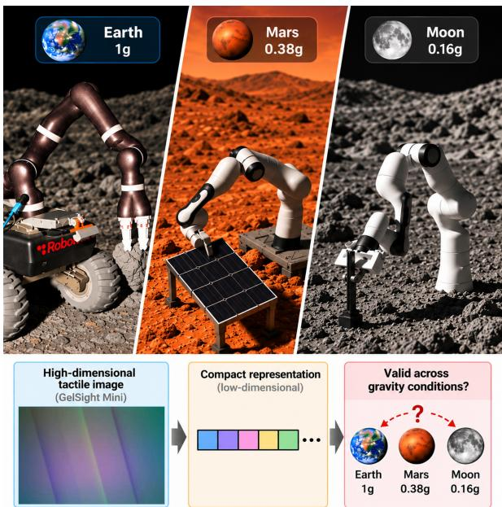
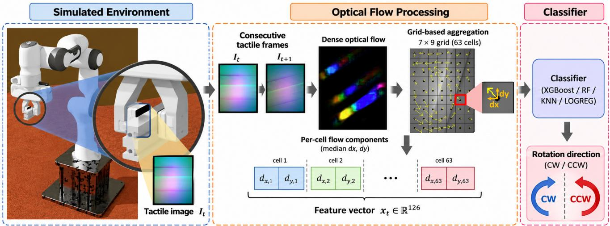
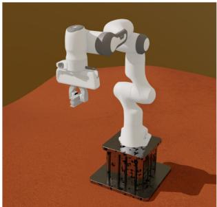
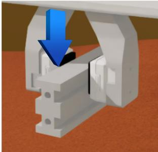
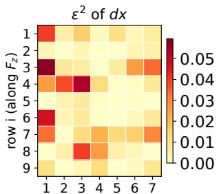
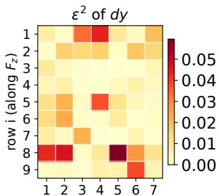
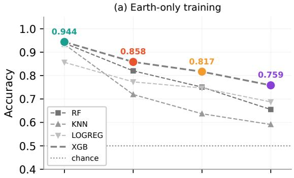
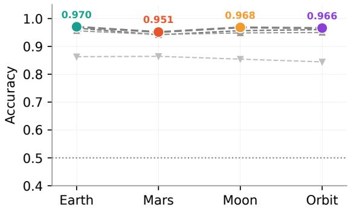
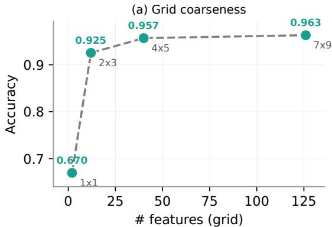
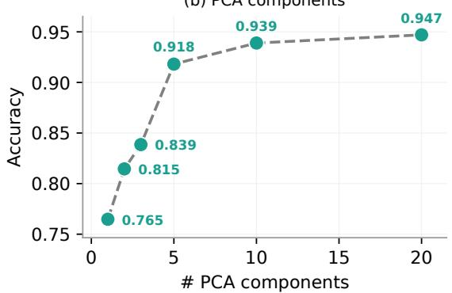

# A Minimal Optical-Flow Representation for Vision-Based Tactile Rotation Classification in Robotic Manipulation Across Gravity Domains

Oscar Martinez-Bernal1, Mario Cavero-Vidal1,2, Francesco Grella1 and Carol Martinez1

Abstract— Vision-based tactile sensors provide rich contact information, but processing high-resolution images can be costly for resource-constrained platforms such as space robots. This work investigates whether a compact representation of tactile motion can classify object rotation across different gravity conditions. Dense optical flow from a simulated GelSight Mini is aggregated over a 7 × 9 grid into 126 features and used to classify the direction of load-induced rotation under Earth, Mars, Moon, and orbital gravity. Gravity causes a small but significant shift in these features, accounting for 1.6% of their variance (R2 = 0.016). Despite its small magnitude, this shift affects models trained only on Earth data: XGBoost accuracy decreases from 94.4% on Earth to 75.9% in orbit. In contrast, a single model trained across all four gravity domains achieves 96.3% overall accuracy and 95.1–97.0% across individual domains, without using gravity as an input. The representation can also be reduced to 40 features while retaining 95.7% accuracy, with XGBoost requiring only 0.14 ms per inference. These findings show that Earth-gravity performance alone is insufficient to establish the transferability of tactile perception for space robotic manipulation, highlighting the need to account for gravity-induced domain shifts during training and validation.

Keywords: Vision-based tactile sensing, optical flow, space robotics, robotic manipulation

## I. INTRODUCTION

Contact-rich manipulation is essential for space robotic operations such as on-orbit servicing [1], in-space assembly, maintenance, inspection, and planetary sample collection [2]. These operations require robots to interpret local contact under limited sensing, uncertain object properties, and gravity conditions that differ from those on Earth. Reliable contact perception is therefore important for safe robotic manipulation [3]. Vision-based tactile sensors offer a promising solution by converting local contact interactions into highresolution images [4].

While these images provide rich contact information, processing them directly can be computationally expensive for resource-constrained platforms such as space robots. Compact representations can reduce this computational burden. In particular, optical flow captures tactile motion using a reduced set of features and has been used to estimate displacement, deformation, geometry, and force, as well as for lightweight classification tasks [5].

  
Fig. 1: Multi-gravity scenarios considered in this work and overview of the investigated transfer problem.

However, tactile perception methods are typically developed and validated under Earth gravity. Changes in gravity affect object dynamics and may therefore alter the tactile signals observed during manipulation. Consequently, a representation or classifier that performs well on Earth may not transfer directly to reduced-gravity environments. This is particularly relevant for space robotics, where tactile perception systems must operate under conditions that are difficult to reproduce and validate experimentally on Earth.

Therefore, this work investigates two questions: (1) whether a compact representation of tactile motion is sufficient to classify a manipulation event, and (2) whether its performance transfers across gravity conditions. These questions are studied in simulation using the load-induced rotation of a grasped object as a controlled interaction event. The direction of rotation describes how the object moves relative to the grasp and can provide information for corrective manipulation before grasp stability is compromised. Unlike a wrist-mounted force/torque sensor, tactile sensing observes this motion directly at the contact interface and preserves its local spatial structure.

The tactile response is represented by dense optical flow between consecutive frames of a simulated GelSight Mini. The flow field is spatially aggregated over a fixed grid and used as input to lightweight classifiers, without providing gravity as an input. The same interaction task and representation are evaluated under Earth, Mars, Moon, and orbital gravity. This controlled setup allows us to measure how gravity affects the tactile representation and whether this domain shift affects classification performance (Fig. 1).

The analysis first quantifies the effect of gravity on the optical-flow representation. Classifiers trained only under Earth gravity are then evaluated on unseen gravity domains to assess cross-gravity generalization. Finally, a single model is trained using data from all four gravity conditions, followed by an ablation study to determine how far the tactile representation can be reduced while preserving classification performance.

The main contributions are:

• A quantitative analysis of the gravity-induced domain shift in a compact tactile optical-flow representation, showing that classifiers trained only under Earth gravity lose accuracy under unseen reduced-gravity conditions.

• A cross-gravity classification approach based on a single model trained across Earth, Mars, Moon, and orbital gravity, achieving consistent performance across all four domains without requiring gravity as an input.

• A reduced optical-flow representation of 40 features that retains 95.7% accuracy, less than one percentage point below the full 126-feature representation.

Together, these contributions provide a basis for developing computationally efficient tactile perception methods that account for gravity-domain shifts in space robotic manipulation.

## II. RELATED WORK

## A. Vision-Based Tactile Sensing

Vision-based tactile sensors convert contact into images, either marker-based or intensity-based [6], and have become a primary route to high-resolution touch for manipulation [7]. Sensors of this type measure the deformation of a soft elastomer with a camera and infer geometry, force, and slip from it [4]. Force-oriented reviews show that marker tracking, optical flow, physical modelling, and learning-based methods are all used to estimate contact forces [8], and recent learned estimators regress force distributions or 3D forces directly from vision-based tactile images [9]. Optical flow in particular has been used to estimate contact shape and force in DelTact [10], force, geometry, and depth in GelFlow [5], and 3D contact point clouds [11]. In contrast, this work evaluates a compact optical-flow representation of consecutive markerless tactile images for classifying the direction of load-induced rotation and analyses its transferability across gravity conditions.

## B. Tactile Simulation

Tactile simulation enables controlled, reproducible datasets without real hardware. TACTO [12], Taxim [13], and TacSL [14] render vision-based tactile images from simulated contact, and SimTacLS extends the idea to largescale tactile skin [15]. Models trained on simulated tactile images do not transfer to real sensors by default, and the gap is addressed with physically accurate simulation [16] or domain adaptation [17]. The present study uses TacEx, which combines contact simulation with tactile rendering in Isaac Sim for GelSight Mini [18], and it treats gravity as the domain variable of interest rather than the sim-to-real gap. Only the grayscale version of the simulated images is used, in the PhysX rigid-body configuration.

## C. Tactile Sensing in Space Robotics

Space robotic manipulation involves contact-rich tasks such as capture, servicing, assembly, and sample collection, where contact dynamics and ground verification remain major challenges under microgravity and reduced gravity [2]. Tactile sensing has entered this domain primarily through hardware designed to survive the environment. Jahanshahi and Zhu review resistive, capacitive, piezoelectric, and optical technologies for orbital and planetary platforms [3], and the same authors review learning-based grasp control for space [19]. Fibre-optic tactile pads have been demonstrated on a gripper designed for the Astrobee free-flying robots [20], a sensor based on optical-fibre knots measures pressure, hardness, and texture for on-orbit servicing [21], and forcesensing grippers have been proposed for on-orbit capture [22]. Contact experiments have also flown, with geckoinspired adhesive grippers tested aboard the International Space Station [23]. That gravity changes the control of a grasp is documented in human studies, where the coordination of grip and load forces adapts differently under Mars, Moon, and microgravity during parabolic flight [24]. The effect of gravity on the tactile signal itself, on the features that a classifier consumes, has not been measured in any of these works. This study addresses that gap with one representation and one controlled task, so that the observed change can be attributed to gravity, and asks whether rotationdirection classification generalises across gravities without richer tactile images, marker displacement, reconstructed geometry, learned force maps, robot state, or a gravity input.

## III. TACTILE REPRESENTATION AND CLASSIFICATION

## A. Strategy Overview

The processing pipeline consists of three stages (Fig. 2). First, a simulated vision-based tactile sensor records the contact response while a load is applied to the grasped object under four gravity conditions. Second, consecutive tactile frames are converted to dense optical flow and spatially aggregated into a 126-feature representation. Finally, lightweight classifiers use this representation to predict the direction of load-induced rotation.

Two training regimes are considered. The first uses only Earth-gravity data to evaluate transfer to unseen gravity domains, while the second uses data from all four gravity conditions. A subsequent feature ablation evaluates how far the representation can be reduced while preserving classification performance. Gravity is not provided as an input to the classifiers.

  
Fig. 2: Processing pipeline from simulated tactile acquisition to rotation-direction classification. Consecutive tactile frames are converted to dense optical flow, spatially aggregated over a fixed grid, and used to classify load-induced rotation as clockwise (cw) or counterclockwise (ccw).

## B. Optical Flow Representation

The input consists of simulated tactile image sequences of one sensor, converted to grayscale. The relevant cue is the motion of the contact pattern between consecutive frames, which can be represented from image intensity alone.

For each pair of consecutive frames $I _ { t - 1 }$ and $I _ { t } ,$ dense optical flow is computed with the classical Farnebäck polynomial-expansion method [25] implemented in OpenCV 4.6.0:

$$
F _ { t } = \operatorname { F l o w } ( I _ { t - 1 } , I _ { t } ) .\tag{1}
$$

A fixed configuration is used throughout the experiments: pyramid scale 0.5, 3 levels, window size 25, 5 iterations, polynomial neighbourhood 5, polynomial sigma 1.2, and default flags.

The resulting dense field is spatially reduced to a fixed grid. Each 240 × 320 px image is divided into $R = 7$ rows and C = 9 columns, producing 63 cells. Within each cell, the median horizontal and vertical flow components are retained as dx and $d y$ , respectively. The resulting representation is

$$
\mathbf { x } _ { t } = \left[ d x _ { 1 } , \ldots , d x _ { 6 3 } , d y _ { 1 } , \ldots , d y _ { 6 3 } \right] \in \mathbb { R } ^ { 1 2 6 }\tag{2}
$$

## C. Rotation-Direction Target

The label of an event is the direction of rotation of its contact pattern, cw or ccw, and every flow field of the event carries that label. Because the two pads of the gripper face the object from opposite sides, the same load produces opposite rotation directions on the two sides (Table I). Each sensor is therefore treated as an independent sample, while data from both sensors are used to train the classifier.

TABLE I: Rotation-direction label as a function of load direction and sensor side.
<table><tr><td>Load</td><td>Left sensor</td><td>Right sensor</td></tr><tr><td>Downward  $F _ { z }$ </td><td>ccw</td><td>CW</td></tr><tr><td>Upward  $F _ { z }$ </td><td>CW</td><td>ccw</td></tr></table>

Only the optical-flow representation is provided to the classifier. Force magnitude, load position, gravity condition, repetition, sensor side, and frame index are not included as input features.

## D. Feature Selection

The 126-dimensional representation contains the horizontal and vertical flow medians of the 63 grid cells. Three feature configurations are evaluated. Configuration A uses the full representation. Configuration B uses PCA-guided selection: principal component analysis [26] identifies the components explaining 90% of the variance in the training data, and the original features are ranked according to their contribution to these components. Configuration C uses minimum redundancy maximum relevance (mRMR) [27], which ranks features by their relevance to the target while penalising redundancy with previously selected features. The ranking is truncated at its elbow.

Both selection methods retain subsets of the original flow features; they do not transform the classifier input. Feature selection is performed using the training set only. In addition, a grid-resolution ablation evaluates increasingly compact spatial representations and the contribution of the individual flow components.

## E. Classifiers and Training

Four lightweight classifiers are evaluated: XGBoost, random forest, k-nearest neighbours (KNN), and logistic regression. KNN uses standardised features, while logistic regression provides a linear reference. These models are suitable for compact hand-crafted tactile representations and have been used for related tactile classification tasks [28].

The dataset is divided into 80% training and 20% test data. Splitting is performed at the trial level and stratified by class, ensuring that events from the same trial remain in the same partition. This prevents information from the same trial from appearing in both training and test sets.

Two training regimes are evaluated. In the Earth regime, only Earth-gravity data are used for training, while the test data are separated by gravity to evaluate Earth performance and transfer to the unseen Mars, Moon, and orbital domains. In the All regime, training data include all four gravity conditions. Hyperparameters for XGBoost, random forest, and KNN are selected from the training set using grouped 3-fold cross-validation with Bayesian optimisation (Optuna, 12 trials, accuracy criterion). Logistic regression uses fixed hyperparameters. Each final model is fitted to the complete training set and evaluated once on the held-out test set. Accuracy per flow field is the primary metric. Balanced accuracy, macro-F1, ROC-AUC, and PR-AUC [29] are also reported.

## IV. EXPERIMENTAL SETUP

## A. Simulation and Load Application

The experiments are conducted in the Space Robotics Bench (SRB), built on Isaac Sim for the development and validation of robotic systems in space scenarios [30]. Visionbased tactile sensing is simulated through TacEx [18] using its PhysX rigid-body configuration. In this configuration, the gel pad is represented as a rigid body with compliant contacts. This configuration provides stable rendering of contactpattern rotation over the large number of trials required in this study, while avoiding additional deformation effects from a simulated soft gel (Section VI-D).

The simulated setup (Fig. 3) consists of a Franka arm with two vision-based tactile sensors mounted on a parallel gripper. A metallic profile is grasped horizontally at its centre between the two sensors. During each trial, the manipulator maintains a fixed grasp while an external vertical force $F _ { z }$ is applied to the profile at a distance d from the grasp, producing a torque about an axis parallel to the sensor optical axis.

Three force magnitudes (3, 4.5, and 6 N) are applied upward or downward for 2 s at 20 positions corresponding to moment arms from 75 to 100 mm. Varying force magnitude and moment arm exposes the classifier to a range of torques rather than a single loading condition. The complete experimental design comprises 3 force magnitudes × 2 directions × 20 positions × 4 repetitions × 4 gravity conditions: Earth, Mars, Moon, and orbital gravity (0g). The simulator is fully reset between trials.

## B. Dataset and Partitions

Each recording from one tactile sensor during one load application is treated as an event, giving two events per trial. A total of 3840 events were recorded. The recordings were reviewed to retain events with measurable contact-pattern rotation and a consistent rotation direction. Events dominated by linear slip, including cases in which the profile slid out of the grasp without rotating, were excluded because linear slip is outside the classification target.

  
(a)

  
(b)  
Fig. 3: The Space Robotics Bench simulation environment. (a) Gripper with integrated GelSight Mini in a Martian environment. (b) Applied force.

TABLE II: Partitions of the two training regimes: number of events and of flow fields in each set.
<table><tr><td>Regime</td><td>Set</td><td>Events</td><td>Flow fields</td></tr><tr><td>All</td><td>Train (four gravities)</td><td>1893</td><td>37199</td></tr><tr><td>All</td><td>Test set (four gravities)</td><td>473</td><td>9403</td></tr><tr><td>Earth</td><td>Train (Earth)</td><td>468</td><td>8935</td></tr><tr><td>Earth</td><td>Test, Earth</td><td>118</td><td>2469</td></tr><tr><td>Earth</td><td>Test, Mars</td><td>120</td><td>2336</td></tr><tr><td>Earth</td><td>Test, Moon</td><td>114</td><td>2242</td></tr><tr><td>Earth</td><td>Test, Orbit (0g)</td><td>123</td><td>2439</td></tr></table>

The resulting dataset contains 2366 events from 1245 trials, with 563–620 events per gravity condition. The two rotation classes are approximately balanced, with 1232 ccw and 1134 cw events. Optical-flow fields are extracted from the interval in which the contact pattern rotates, and each field inherits the label of its event. Table II summarizes the partitions used in the two training regimes.

## V. RESULTS

## A. Gravity-Domain Analysis

The first analysis tests whether gravity changes the opticalflow representation before considering classification performance. The PERMANOVA [31] measures the joint effect of gravity without assuming any distribution of the features, the Kruskal–Wallis tests [32] locate it feature by feature, and the False Discovery Rate (FDR) correction [33] accounts for the 126 comparisons.

The PERMANOVA shows a statistically significant but small effect of gravity $( R ^ { 2 } = 0 . 0 1 6 4$ , pseudo- $F = 1 3 . 1 2$ $p ~ = ~ 0 . 0 0 1$ , 999 permutations). Gravity therefore accounts for approximately 1.6% of the variance in the representation. Its effect is smaller than those of load position $( R ^ { 2 }$ = 0.591), sensor side (0.189), force magnitude (0.055), and load direction (0.043).

  
column j (along profile)

  
column j (along profile)  
Fig. 4: Gravity sensitivity per cell (Kruskal–Wallis effect size $\epsilon ^ { 2 } )$ for the dx and $d y$ components, in the world frame (columns along the profile, rows along $F _ { z } )$

Pairwise tests with FDR correction distinguish Earth from Mars, Moon, and orbit $( R ^ { 2 } = 0 . 0 1 7 - 0 . 0 2 0 , p = 0 . 0 0 2 )$ . Mars is also distinguishable from Moon and orbit $( R ^ { 2 } = 0 . 0 0 2 -$ 0.003, $p = 0 . 0 0 2 )$ , whereas Moon and orbit are not $( R ^ { 2 } =$ $0 . 0 0 0 8 , p = 0 . 5 3 )$ . At the feature level, the Kruskal–Wallis tests identify significant gravity effects in 78 of the 126 features, distributed between flow components and multiple grid cells (Fig. 4). The largest effect sizes are $\epsilon ^ { 2 } = 0 . 0 \bar { 5 } 9 5$ for $d y$ and 0.0579 for dx.

Overall, gravity introduces a small but measurable shift in the optical-flow representation. The following analysis evaluates whether this shift affects classifiers trained only under Earth gravity.

## B. Earth-Only Training

The Earth-only regime evaluates whether a classifier trained under Earth gravity transfers to unseen gravity domains. XGBoost achieves 0.944 accuracy on Earth but decreases to 0.858 on Mars, 0.817 on the Moon, and 0.759 in orbit (Table III and Fig. 5(a)). This corresponds to a maximum accuracy decrease of 0.185.

The same trend appears in all four classifiers. From Earth to orbit, random forest decreases from 0.938 to 0.655, KNN from 0.934 to 0.591, and logistic regression from 0.857 to 0.688. For every classifier, accuracy decreases progressively from Earth to Mars, Moon, and orbit. Balanced accuracy and macro-F1 show the same pattern, as do ROC-AUC and PR-AUC. These results show that the gravity-domain shift identified in the optical-flow features is accompanied by reduced classification performance when training is restricted to Earth-gravity data.

## C. All-Gravity Training

When training data from all four gravity domains are included, XGBoost achieves 0.963 accuracy on the held-out test set (Table IV). Random forest and KNN reach 0.955 and 0.949, respectively, while logistic regression reaches 0.857. XGBoost also achieves a ROC-AUC and PR-AUC of 0.996.

Performance remains similar across the individual gravity domains despite gravity not being provided as an input to the classifier (Table V and Fig. 5(b)). XGBoost accuracy ranges from 0.951 on Mars to 0.970 on Earth, with 0.968 on the Moon and 0.966 in orbit. Similar performance is also observed across load magnitudes, sensor sides, and rotation magnitudes.

(b) All-gravity training  
  
Fig. 5: Accuracy per flow field and gravity domain for the four classifiers (XGBoost highlighted). (a) Earth-only training, where Mars, Moon, and orbit are unseen domains. (b) All-gravity training.

Thus, representing all four gravity domains during training yields consistent classification performance across the conditions evaluated in this study.

## D. Minimal Representation

The ablation study evaluates how far the optical-flow representation can be reduced while preserving classification performance. XGBoost is evaluated with fixed hyperparameters and the same train/test partition while varying the flow components, grid resolution, and feature-selection strategy (Table VI and Fig. 6).

Reducing the spatial grid from $7 \times 9$ (126 features) to $4 \times 5$ (40 features) decreases accuracy only from 0.963 to 0.957. PCA-guided selection reaches the same accuracy with 74 features. More aggressive reductions produce larger losses: mRMR selection reaches 0.939 with 14 features, a $2 \times 3$ grid reaches 0.925 with 12 features, and a single-cell representation reaches 0.670 with two features. Using only one flow component also reduces accuracy, to 0.944 for dx and 0.947 for $d y$

The $4 \times 5$ grid therefore provides the most compact spatial representation evaluated here while remaining within one percentage point of the full 126-feature representation.

(b) PCA components  
TABLE III: Earth-only training: metrics per flow field on the Earth test events and on the three unseen gravity domains, per model, with the accuracy drop of each domain relative to Earth.
<table><tr><td>Metric</td><td colspan="4">XGB</td><td colspan="4">RF</td><td colspan="4">KNN</td><td colspan="4">LOGREG</td></tr><tr><td></td><td>Earth</td><td>Mars</td><td>Moon</td><td>Orbit</td><td>Earth</td><td>Mars</td><td>Moon</td><td>Orbit</td><td>Earth</td><td>Mars</td><td>Moon</td><td>Orbit</td><td>Earth</td><td>Mars</td><td>Moon</td><td>Orbit</td></tr><tr><td>Accuracy</td><td>0.944</td><td>0.858</td><td>0.817</td><td>0.759</td><td>0.938</td><td>0.820</td><td>0.751</td><td>0.655</td><td>0.934</td><td>0.719</td><td>0.637</td><td>0.591</td><td>0.857</td><td>0.773</td><td>0.747</td><td>0.688</td></tr><tr><td>Balanced acc.</td><td>0.944</td><td>0.858</td><td>0.817</td><td>0.760</td><td>0.939</td><td>0.822</td><td>0.759</td><td>0.665</td><td>0.933</td><td>0.720</td><td>0.644</td><td>0.596</td><td>0.856</td><td>0.772</td><td>0.746</td><td>0.688</td></tr><tr><td>Macro-F1</td><td>0.944</td><td>0.858</td><td>0.816</td><td>0.758</td><td>0.938</td><td>0.819</td><td>0.748</td><td>0.648</td><td>0.934</td><td>0.718</td><td>0.634</td><td>0.590</td><td>0.856</td><td>0.772</td><td>0.746</td><td>0.687</td></tr><tr><td>ROC-AUC PR-AUC</td><td>0.991 0.991</td><td>0.932</td><td>0.898</td><td>0.842</td><td>0.989</td><td>0.929</td><td>0.877</td><td>0.782</td><td>0.964</td><td>0.773</td><td>0.693</td><td>0.630</td><td>0.958</td><td>0.860</td><td>0.843</td><td>0.786</td></tr><tr><td></td><td></td><td>0.939</td><td>0.897</td><td>0.843</td><td>0.989</td><td>0.933</td><td>0.877</td><td>0.769</td><td>0.949</td><td>0.719</td><td>0.622</td><td>0.580</td><td>0.958</td><td>0.870</td><td>0.838</td><td>0.785</td></tr><tr><td>Accuracy drop vs. Earth</td><td></td><td>0.085</td><td>0.127</td><td>0.185</td><td></td><td>0.118</td><td>0.188</td><td>0.283</td><td></td><td>0.214</td><td>0.297</td><td>0.342</td><td></td><td>0.084</td><td>0.110</td><td>0.169</td></tr></table>

TABLE IV: All-gravity training: metrics per flow field of the four classifiers on the test set.
<table><tr><td>Model</td><td>Accuracy</td><td></td><td></td><td>Bal. acc. Macro-F1 ROC-AUC PR-AUC</td><td></td></tr><tr><td>XGB</td><td>0.963</td><td>0.963</td><td>0.963</td><td>0.996</td><td>0.996</td></tr><tr><td>RF</td><td>0.955</td><td>0.955</td><td>0.955</td><td>0.994</td><td>0.994</td></tr><tr><td>KNN</td><td>0.949</td><td>0.948</td><td>0.948</td><td>0.976</td><td>0.965</td></tr><tr><td>LOGREG</td><td>0.857</td><td>0.855</td><td>0.856</td><td>0.952</td><td>0.953</td></tr></table>

## E. Computational Cost

Runtime is measured on a single thread of an Intel Core Ultra 7 268V under Linux. The reported values are therefore machine-dependent and are intended to characterize the relative computational cost of the pipeline and classifiers.

Feature extraction dominates inference time. Farnebäck optical flow on a 320×240 frame requires 10.15 ms, followed by 1.43 ms for the $7 \times 9$ grid aggregation. In comparison, XGBoost classification requires only 0.14 ms per flow field (Table VII). Logistic regression requires 0.11 ms, KNN 2.19 ms, and random forest 33.62 ms.

XGBoost also provides the highest classification accuracy in both training regimes while requiring a 0.4 MB fitted model and 2.07 s for a single training fit. For this experimental configuration, classification therefore contributes little to the total processing time; dense optical-flow computation is the main computational bottleneck.

## VI. DISCUSSION

## A. Gravity-Induced Domain Shift

Gravity has a small effect on the overall variability of the optical-flow representation but a substantial impact on crossgravity classification. The PERMANOVA attributes only 1.6% of the feature variance to gravity, considerably less than to load position, sensor side, force magnitude, or load direction. Nevertheless, under Earth-only training, XGBoost accuracy decreases from 0.944 on Earth to 0.759 in orbit, with the same degradation trend observed across all four classifiers.

These results are not contradictory: a small contribution to the total feature variance can still affect the feature structure relevant to the classification boundary. Moreover, the degradation increases from Mars to Moon and orbit as gravity departs from Earth’s. The two analyses therefore provide complementary evidence: gravity produces a small but measurable shift in the tactile representation, and this shift is associated with substantial performance degradation when classifiers trained on Earth are transferred to reducedgravity domains.

  
Fig. 6: Minimal representation: Accuracy versus feature count for grid resolution (a) and PCA (b).

## B. Generalisation Across Gravity Domains

Including all four gravity domains in training results in consistent performance across them. XGBoost achieves 0.963 overall accuracy, with per-gravity accuracy ranging from 0.951 to 0.970, despite gravity not being provided as an input. This shows that a single classifier can operate across the four evaluated gravity domains when they are represented during training.

The Earth-only results also show that sensitivity to the domain shift depends on the classifier. The maximum accuracy loss ranges from 0.169 for logistic regression to 0.342 for KNN, while XGBoost combines the highest accuracy with greater robustness to the shift. These results indicate that cross-gravity performance depends on both the tactile representation and the classifier used to interpret it.

TABLE V: All-gravity training, XGBoost breakdowns by the factors excluded from the input: metrics per flow field on the test set.
<table><tr><td>Metric</td><td colspan="4">By gravity</td><td colspan="3">By load magnitude</td><td colspan="2">By sensor side</td><td colspan="3">By rotation magnitude</td></tr><tr><td></td><td>Earth</td><td>Mars</td><td>Moon</td><td>Orbit</td><td>3.0 N</td><td>4.5N</td><td>6.0 N</td><td> $\mathrm { L e f t }$ </td><td>Right</td><td> $< 5 ^ { \circ }$ </td><td> $5 ~ \mathrm { t o } ~ 1 5 ^ { \circ }$ </td><td> $> 1 5 ^ { \circ }$ </td></tr><tr><td>Accuracy</td><td>0.970</td><td>0.951</td><td>0.968</td><td>0.966</td><td>0.968</td><td>0.955</td><td>0.975</td><td>0.967</td><td>0.959</td><td>0.960</td><td>0.960</td><td>0.974</td></tr><tr><td>Balanced acc.</td><td>0.970</td><td>0.952</td><td>0.968</td><td>0.966</td><td>0.968</td><td>0.955</td><td>0.975</td><td>0.957</td><td>0.953</td><td>0.962</td><td>0.968</td><td>0.974</td></tr><tr><td>Macro-F1</td><td>0.970</td><td>0.951</td><td>0.968</td><td>0.966</td><td>0.967</td><td>0.955</td><td>0.975</td><td>0.962</td><td>0.956</td><td>0.958</td><td>0.940</td><td>0.974</td></tr><tr><td>ROC-AUC</td><td>0.997</td><td>0.994</td><td>0.997</td><td>0.996</td><td>0.997</td><td>0.994</td><td>0.998</td><td>0.995</td><td>0.995</td><td>0.995</td><td>0.996</td><td>0.998</td></tr><tr><td>PR-AUC</td><td>0.997</td><td>0.993</td><td>0.996</td><td>0.996</td><td>0.996</td><td>0.994</td><td>0.998</td><td>0.991</td><td>0.997</td><td>0.997</td><td>0.984</td><td>0.998</td></tr></table>

TABLE VI: Minimal representation (XGBoost, fixed hyperparameters): metrics per flow field on the test set against the number of features.
<table><tr><td>Representation</td><td># features</td><td>Accuracy</td><td>Balanced acc.</td><td>Macro-F1</td><td>ROC-AUC</td><td>PR-AUC</td></tr><tr><td>dx only</td><td>63</td><td>0.944</td><td>0.944</td><td>0.944</td><td>0.991</td><td>0.991</td></tr><tr><td>dy only</td><td>63</td><td>0.947</td><td>0.947</td><td>0.947</td><td>0.991</td><td>0.991</td></tr><tr><td> $d x + { \dot { d y } } \ ( { \mathrm { f u l l } } )$ </td><td>126</td><td>0.963</td><td>0.963</td><td>0.963</td><td>0.996</td><td>0.996</td></tr><tr><td>Grid 1×1</td><td>2</td><td>0.670</td><td>0.669</td><td>0.668</td><td>0.727</td><td>0.729</td></tr><tr><td>Grid  $2 \times 3$ </td><td>12</td><td>0.925</td><td>0.925</td><td>0.925</td><td>0.982</td><td>0.982</td></tr><tr><td>Grid  $4 \times 5$ </td><td>40</td><td>0.957</td><td>0.957</td><td>0.957</td><td>0.994</td><td>0.994</td></tr><tr><td>Grid  $7 \times 9$ </td><td>126</td><td>0.963</td><td>0.963</td><td>0.963</td><td>0.996</td><td>0.996</td></tr><tr><td>PCA-guided 90% (B)</td><td>74</td><td>0.957</td><td>0.957</td><td>0.957</td><td>0.994</td><td>0.994</td></tr><tr><td>mRMR elbow (C)</td><td>14</td><td>0.939</td><td>0.939</td><td>0.939</td><td>0.988</td><td>0.988</td></tr></table>

TABLE VII: Classifier cost on one CPU thread: training time (median of 5 fits), inference time per flow field (median of 200 runs), and model size.
<table><tr><td>Model</td><td></td><td></td><td>Training (s) Inference (ms) Model size (MB)</td></tr><tr><td>XGB</td><td>2.07</td><td>0.14</td><td>0.4</td></tr><tr><td>RF</td><td>144</td><td>33.62</td><td>58.9</td></tr><tr><td>KNN</td><td>0.03</td><td>2.19</td><td>19.1</td></tr><tr><td>LOGREG</td><td>0.21</td><td>0.11</td><td>0.005</td></tr></table>

## C. Minimal Representation and Cost

The representation can be substantially reduced with little loss in accuracy. A 4×5 grid reduces the feature set from 126 to 40 while decreasing accuracy only from 0.963 to 0.957. More aggressive compression produces a clearer trade-off: mRMR retains 0.939 accuracy with 14 features, whereas a single-cell representation falls to 0.670.

The main computational cost, however, remains in feature extraction. Farnebäck optical flow and grid aggregation require approximately 11.6 ms per frame pair, compared with only 0.14 ms for XGBoost inference. A coarser grid therefore reduces the representation size, but further runtime improvements would require reducing the cost of the opticalflow computation itself.

## D. Limitations

Two limitations bound these findings. First, the study is simulation-based and uses a rigid gel model. A deformable gel may produce different optical-flow responses, so validation with a real tactile sensor is needed. Second, the classifier is sensitive to sensor orientation. Deployment with different orientations would therefore require a consistent image reference frame or orientation-diverse training data.

## VII. CONCLUSION AND FUTURE WORK

This simulation study investigated whether a compact optical-flow representation can classify load-induced rotation and transfer across gravity domains. The 126-feature representation achieves 0.963 accuracy, while a reduced 40- feature grid retains 0.957. Although gravity accounts for only 1.6% of the feature variance, classifiers trained only on Earth data degrade under reduced gravity, with XGBoost accuracy decreasing from 0.944 on Earth to 0.759 in orbit. In contrast, a single model trained across all four gravity domains achieves consistent performance in each domain without using gravity as an input. XGBoost inference requires only 0.14 ms, with dense optical-flow computation remaining the main computational cost.

These results show that Earth-gravity performance alone is insufficient to establish the transferability of tactile perception for space robotic manipulation. They also show that a compact representation can preserve most of the classification performance across the evaluated gravity conditions. Future work will focus on real-sensor validation, transfer to unseen gravity conditions, and extension to a broader range of contact events, loading conditions, and object geometries.

## VIII. ACKNOWLEDGMENTS

This work was supported by the Luxembourg National Research Fund (AFR grant No. 19479896), in partnership with the SpaceR research group at SnT, University of Luxembourg, and by the Catalan Government through ACCIO-Eurecat (Traça-SESAM project). The views expressed are solely those of the authors and do not necessarily reflect those of the funding institutions.

## REFERENCES

[1] M. Alizadeh and Z. H. Zhu, “A Comprehensive Survey of Space Robotic Manipulators for On-Orbit Servicing,” Frontiers in Robotics and AI, vol. 11, p. 1470950, 2024.

[2] E. Papadopoulos, F. Aghili, O. Ma, and R. Lampariello, “Robotic Manipulation and Capture in Space: A Survey,” Frontiers in Robotics and AI, vol. 8, p. 686723, 2021.

[3] H. Jahanshahi and Z. H. Zhu, “A comprehensive review of tactile sensing technologies in space robotics,” Chinese Journal of Aeronautics, vol. 38, no. 7, p. 103423, 2025.

[4] W. Yuan, S. Dong, and E. Adelson, “GelSight: High-Resolution Robot Tactile Sensors for Estimating Geometry and Force,” Sensors, vol. 17, no. 12, p. 2762, 2017.

[5] Z. Zhang, H. Yang, and Z. Yin, “GelFlow: Self-Supervised Learning of Optical Flow for Vision-Based Tactile Sensor Displacement Measurement,” in Intelligent Robotics and Applications (ICIRA 2023), Lecture Notes in Computer Science. Singapore: Springer, 2023, pp. 26–37.

[6] H. Li, Y. Lin, C. Lu, M. Yang, E. Psomopoulou, and N. F. Lepora, “Classification of Vision-Based Tactile Sensors: A Review,” IEEE Sensors Journal, vol. 25, no. 19, pp. 35 672–35 686, 2025.

[7] A. Yamaguchi and C. G. Atkeson, “Recent progress in tactile sensing and sensors for robotic manipulation: can we turn tactile sensing into vision?” Advanced Robotics, vol. 33, no. 14, pp. 661–673, 2019.

[8] B. Fang, J. Zhao, N. Liu, Y. Sun, S. Zhang, F. Sun, J. Shan, and Y. Yang, “Force Measurement Technology of Vision-Based Tactile Sensor,” Advanced Intelligent Systems, vol. 7, no. 1, p. 2400290, 2025.

[9] E. Helmut, L. Dziarski, N. Funk, B. Belousov, and J. Peters, “Learning Force Distribution Estimation for the GelSight Mini Optical Tactile Sensor Based on Finite Element Analysis,” in 2025 IEEE/RSJ International Conference on Intelligent Robots and Systems (IROS), 2025, pp. 8553–8560.

[10] G. Zhang, Y. Du, H. Yu, and M. Y. Wang, “DelTact: A Vision-Based Tactile Sensor Using a Dense Color Pattern,” IEEE Robotics and Automation Letters, vol. 7, no. 4, pp. 10 778–10 785, 2022.

[11] Y. Du, G. Zhang, and M. Y. Wang, “3D Contact Point Cloud Reconstruction From Vision-Based Tactile Flow,” IEEE Robotics and Automation Letters, vol. 7, no. 4, pp. 12 177–12 184, 2022.

[12] S. Wang, M. Lambeta, P.-W. Chou, and R. Calandra, “TACTO: A Fast, Flexible, and Open-Source Simulator for High-Resolution Vision-Based Tactile Sensors,” IEEE Robotics and Automation Letters, vol. 7, no. 2, pp. 3930–3937, 2022.

[13] Z. Si and W. Yuan, “Taxim: An Example-Based Simulation Model for GelSight Tactile Sensors,” IEEE Robotics and Automation Letters, vol. 7, no. 2, pp. 2361–2368, 2022.

[14] I. Akinola, J. Xu, J. Carius, D. Fox, and Y. Narang, “TacSL: A Library for Visuotactile Sensor Simulation and Learning,” IEEE Transactions on Robotics, vol. 41, pp. 2645–2661, 2025.

[15] Q. K. Luu, N. H. Nguyen, and V. A. Ho, “Simulation, Learning, and Application of Vision-Based Tactile Sensing at Large Scale,” IEEE Transactions on Robotics, vol. 39, no. 3, pp. 2003–2019, 2023.

[16] C. Sferrazza, T. Bi, and R. D’Andrea, “Learning the sense of touch in simulation: a sim-to-real strategy for vision-based tactile sensing,” in 2020 IEEE/RSJ International Conference on Intelligent Robots and Systems (IROS), 2020, pp. 4389–4396.

[17] X. Jing, K. Qian, T. Jianu, and S. Luo, “Unsupervised Adversarial Domain Adaptation for Sim-to-Real Transfer of Tactile Images,” IEEE Transactions on Instrumentation and Measurement, vol. 72, pp. 1–11, 2023, Art. no. 7503011.

[18] D. H. Nguyen, T. Schneider, G. Duret, A. Kshirsagar, B. Belousov, and J. Peters, “TacEx: GelSight Tactile Simulation in Isaac Sim – Combining Soft-Body and Visuotactile Simulators,” arXiv preprint arXiv:2411.04776, 2024.

[19] H. Jahanshahi and Z. H. Zhu, “Review of Machine Learning in Robotic Grasping Control in Space Application,” Acta Astronautica, vol. 220, pp. 37–61, 2024.

[20] S. Frishman, J. Di, Z. Karachiwalla, R. J. Black, K. Moslehi, T. Smith, B. Coltin, B. Moslehi, and M. R. Cutkosky, “A Multi-Axis FBG-Based Tactile Sensor for Gripping in Space,” in 2021 IEEE/RSJ International Conference on Intelligent Robots and Systems (IROS), 2021, pp. 1794– 1799.

[21] L. Yu, X. Wang, S. Gao, W. Chen, W. Du, Q. Wang, and N. Li, “Optum: A Three-in-One Multimodal Tactile Sensor Based on Optical Fiber Knots for On-Orbit Service,” IEEE Sensors Letters, vol. 7, no. 11, pp. 1–4, 2023, Art. no. 6008204.

[22] Q. Wu, Y. Zhang, W. Xu, and H. Yuan, “An Adaptive Gripper for On-Orbit Grasping with Rapid Capture and Force Sensing Capabilities,” Actuators, vol. 14, no. 11, p. 543, 2025.

[23] T. G. Chen, A. Cauligi, S. A. Suresh, M. Pavone, and M. R. Cutkosky, “Testing Gecko-Inspired Adhesives with Astrobee Aboard the International Space Station: Readying the Technology for Space,” IEEE Robotics & Automation Magazine, vol. 29, no. 3, pp. 24–33, 2022.

[24] L. Opsomer, V. Théate, P. Lefèvre, and J.-L. Thonnard, “Dexterous Manipulation During Rhythmic Arm Movements in Mars, Moon, and Micro-Gravity,” Frontiers in Physiology, vol. 9, p. 938, 2018.

[25] G. Farnebäck, “Two-Frame Motion Estimation Based on Polynomial Expansion,” in Image Analysis (SCIA 2003), ser. Lecture Notes in Computer Science, vol. 2749. Berlin, Heidelberg: Springer, 2003, pp. 363–370.

[26] I. T. Jolliffe, Principal Component Analysis, 2nd ed., ser. Springer Series in Statistics. New York: Springer, 2002.

[27] H. Peng, F. Long, and C. Ding, “Feature Selection Based on Mutual Information: Criteria of Max-Dependency, Max-Relevance, and Min-Redundancy,” IEEE Transactions on Pattern Analysis and Machine Intelligence, vol. 27, no. 8, pp. 1226–1238, 2005.

[28] N. Elijah, K. Nazari, M. Esfandiari, and A. Ghalamzan-E, “Advancing Slip Classification in Robotic Manipulation Through Tactile Data Representation and Model Selection,” IEEE Sensors Journal, vol. 25, no. 17, pp. 33 265–33 276, 2025.

[29] J. Davis and M. Goadrich, “The Relationship Between Precision-Recall and ROC Curves,” in Proceedings of the 23rd International Conference on Machine Learning (ICML), 2006, pp. 233–240.

[30] A. Orsula, M. Geist, M. Olivares-Mendez, and C. Martinez, “Space Robotics Bench: Robot Learning Beyond Earth,” arXiv preprint arXiv:2509.23328, 2025.

[31] M. J. Anderson, “A New Method for Non-Parametric Multivariate Analysis of Variance,” Austral Ecology, vol. 26, no. 1, pp. 32–46, 2001.

[32] W. H. Kruskal and W. A. Wallis, “Use of Ranks in One-Criterion Variance Analysis,” Journal of the American Statistical Association, vol. 47, no. 260, pp. 583–621, 1952.

[33] Y. Benjamini and Y. Hochberg, “Controlling the False Discovery Rate: A Practical and Powerful Approach to Multiple Testing,” Journal of the Royal Statistical Society, Series B (Methodological), vol. 57, no. 1, pp. 289–300, 1995.