# ATTRIBUTING HOW, NOT JUST WHICH: COUNTER-FACTUAL RESPONSE TRAJECTORIES FOR DIFFUSION MODELS

Haoqian Zhang1 Ziyuan Yang1 Zerui Shao1 Yi Zhang1 1Sichuan University

## ABSTRACT

Diffusion models have achieved remarkable success in image generation, yet tracing their outputs to individual training examples remains challenging. Existing attribution methods often compress factor-specific effects into scalar responses, making distinct internal changes indistinguishable. This is particularly limiting for diffusion models, where semantic factors emerge through evolving representation dynamics during denoising. We therefore reformulate diffusion data attribution as attributing factor-induced internal response trajectories. In this paper, we propose a novel Concept Attribution method through Dynamic Trajectories(CADT). We argue that attribution should therefore ask not only which examples matter, but also how their influence unfolds during generation. Specifically, we construct matched counterfactual pairs at identical noisy states to isolate factor-specific representation displacements, and model their directional and magnitude evolution across denoising as dynamic attribution signatures. For each training example and generated query, CADT extracts stage-wise feature vectors and integrates them along the denoising process to form a trajectory descriptor. Applying the same construction across the training set yields a bank of factor-specific trajectory descriptors. The covariance statistics of this bank are then used to construct a covariance-aware positive-semidefinite kernel. CADT uses this kernel to calibrate the query and training representations, and compares the calibrated query trajectory with each training trajectory to produce the final training-sample attribution scores. Experiments on multiple public datasets show consistent improvements over existing diffusion attribution baselines across hierarchical, compositional, and style attribution.

## 1 INTRODUCTION

Diffusion models have emerged as a powerful class of generative models, achieving remarkable progress in high-quality image synthesis and enabling flexible control over generated content (Ho et al., 2020; Nichol & Dhariwal, 2021). As their behavior is shaped by large training collections, understanding which training examples contribute to a generated output is important for interpreting model behavior, tracing data provenance, and diagnosing memorization (Somepalli et al., 2023; Carlini et al., 2023). This motivates data attribution for diffusion models, which aims to trace a generated output back to the training examples that contributed to its formation.

Recent diffusion attribution methods extend influence- and gradient-based attribution to generative models through diffusion-specific objectives, and sampling procedures (Dai & Gifford, 2023; Georgiev et al., 2023; Park et al., 2023; Zheng et al., 2024; Xie et al., 2024; Mlodozeniec et al., 2024; Lin et al., 2025). Most, however, ultimately summarize influence through a scalar response associated with the generated image. This is restrictive for factor-specific attribution. Distinct internal responses can collapse to similar scalar values, even when they emerge at different denoising stages or evolve in different directions. Moreover, image-level responses can mix multiple semantic factors.

We therefore argue that factor-specific attribution should characterize not only how much a training example affects a target factor, but also how the corresponding internal response evolves during generation. Two training examples can receive similar scalar attribution scores while supporting the target factor through qualitatively different generative processes: one may contribute primarily during early denoising, another during later refinement, and their internal responses may evolve along different representation directions. More importantly, these differences can correspond to different semantic roles. For a generated watercolor dog, for example, one training image may primarily support object identity whereas another supports artistic style, even if their aggregated scalar responses are similar. Collapsing such trajectories into a single value therefore obscures not only when influence arises, but also what aspect of the generated content that influence supports.

This motivates two requirements for factor-specific diffusion attribution. First, attribution should preserve how the relevant response evolves throughout denoising rather than collapsing it into a single scalar. Second, this response should isolate the target factor from other semantic variations entangled in the same internal representations. We introduce Concept Attribution through Dynamic Trajectories (CADT) to jointly satisfy these requirements. At each selected denoising stage, CADT evaluates the target condition and a matched reference condition at the same noisy latent, and takes their representation difference as a counterfactual response. By holding the diffusion state fixed, this comparison suppresses variations shared by the two conditions and isolates the response associated with the target factor. CADT then traces how this factor-specific response evolves across denoising stages, capturing both its magnitude and directional evolution. Finally, the stage-wise responses are integrated into a trajectory descriptor that characterizes how the target factor progressively emerges during generation, for both training examples and generated queries.

Directly comparing these descriptors, however, can still be dominated by variations that are broadly shared across the training set and are therefore less informative for attribution. CADT consequently uses the training descriptor bank to adapt the comparison geometry itself. Specifically, it constructs a covariance-aware positive-semidefinite kernel $\bar { K _ { \lambda } }$ that accounts for shared trajectory variation and emphasizes more discriminative directions. Query and training descriptors are compared under this bank-adaptive metric, and the resulting similarities are converted into attribution scores that identify the training examples most closely associated with the factor-specific generative trajectory. The resulting kernel further admits both a ridge-reconstruction interpretation and a representation-level leave-one-descriptor-out interpretation. We evaluate our proposed CADT on multiple public datasets, covering compositional, hierarchical, corrupted-source, style, and object–style attribution settings. Across these settings, CADT consistently improves factor-specific attribution over existing diffusion attribution baselines. Our contributions are summarized as follows:

• We reformulate factor-specific diffusion attribution in terms of internal response trajectories, preserving denoising dynamics that are lost under scalar attribution responses.

• We construct matched counterfactual responses at identical noisy states to isolate factor-induced internal changes, and model their response magnitude and directional evolution across denoising as dynamic attribution signatures.

• We integrate these dynamics into trajectory descriptors for training examples and generated queries, and compare them through a training-bank-adaptive covariance-aware kernel to obtain attribution scores across diverse factor-specific attribution settings.

## 2 RELATED WORK

Training-data attribution. Training-data attribution studies how individual training examples affect model behavior. Classical approaches include leave-one-out retraining, influence functions, representer-based explanations and data valuation (Koh & Liang, 2017; Ghorbani & Zou, 2019; Yeh et al., 2018). More scalable methods such as TracIn, datamodels, and TRAK approximate training-example influence using optimization trajectories, subset models, or projected gradients (Pruthi et al., 2020; Ilyas et al., 2022; Park et al., 2023).

Attribution for diffusion models. Recent work extends training-data attribution to generative and diffusion models. Diffusion-specific methods estimate influence using denoising-loss gradients, projected features, sampling trajectories, or predictive-distribution changes (Dai & Gifford, 2023; Georgiev et al., 2023; Zheng et al., 2024; Xie et al., 2024; Mlodozeniec et al., 2024; Lin et al., 2025). These approaches adapt scalable attribution to the iterative denoising structure of diffusion models.

Concept-level and localized explanations. Beyond whole-image attribution, recent work studies more fine-grained explanations of diffusion models. Concept-TRAK introduces concept-aware utility functions for concept-level training-data attribution (Park et al., 2026), while DAAM analyzes tokenlevel conditioning through cross-attention (Tang et al., 2023). Other approaches investigate spatially localized training-data influence within generated images (Nguyen et al., 2025).

## 3 PRELIMINARIES

## 3.1 DIFFUSION MODELS

Diffusion models synthesize data by reversing a predefined noise-corruption process (Sohl-Dickstein et al., 2015; Ho et al., 2020; Song et al., 2021b). Given a clean sample $\mathbf { x } _ { \mathrm { 0 } }$ , the forward process gradually adds Gaussian noise over $T$ timesteps. Let $\beta _ { t } \in ( 0 , 1 )$ denote the variance schedule, $\alpha _ { t } = 1 - \beta _ { t }$ , and $\textstyle { \bar { \alpha } } _ { t } = \prod _ { s = 1 } ^ { t } \alpha _ { s }$ . The noised state at timestep t can be sampled directly as:

$$
\mathbf { x } _ { t } = \sqrt { \bar { \alpha } _ { t } } \mathbf { x } _ { 0 } + \sqrt { 1 - \bar { \alpha } _ { t } } \epsilon , \qquad \epsilon \sim \mathcal { N } ( \mathbf { 0 } , \mathbf { I } ) .\tag{1}
$$

A conditional denoiser $\epsilon _ { \theta } ( \mathbf { x } _ { t } , t , \mathbf { c } )$ predicts the injected noise under an optional condition c. In the common noise-prediction parameterization, the model minimizes:

$$
\begin{array} { r } { \mathcal { L } _ { \mathrm { s i m p l e } } = \mathbb { E } _ { \mathbf { x } _ { 0 } , t , \epsilon } \left[ \left\| \epsilon - \epsilon _ { \theta } ( \mathbf { x } _ { t } , t , \mathbf { c } ) \right\| _ { 2 } ^ { 2 } \right] . } \end{array}\tag{2}
$$

At inference time, generation is initialized from $\mathbf { x } _ { T } \sim \mathcal { N } ( \mathbf { 0 } , \mathbf { I } )$ and proceeds through successive reverse denoising transitions to $\mathbf { x } _ { 0 } .$ . Deterministic non-Markovian samplers provide an alternative sampling trajectory (Song et al., 2021a), while latent diffusion performs the same process in the latent space of a pretrained autoencoder (Rombach et al., 2022).

## 3.2 DATA ATTRIBUTION

Given a training set $\mathcal { D } = \{ x ^ { i } \} _ { i = 1 } ^ { N }$ and model parameters $\theta _ { \mathcal { D } }$ trained on it, data attribution quantifies the contribution of each training example to a model behavior of interest. Let $\mathcal { V } ( x _ { \mathrm { t e s t } } ; \theta )$ denote a scalar utility. A direct counterfactual definition is the leave-one-out effect:

$$
\Delta _ { i } ( x _ { \mathrm { t e s t } } ) = \mathcal { V } ( x _ { \mathrm { t e s t } } ; \theta _ { \mathcal { D } \setminus i } ) - \mathcal { V } ( x _ { \mathrm { t e s t } } ; \theta _ { \mathcal { D } } ) ,\tag{3}
$$

where $\theta _ { \mathcal { D } \backslash i }$ denotes the model retrained after removing $x ^ { i }$ . Repeating this procedure for every training example is computationally prohibitive.

Influence functions approximate this effect through a first-order parameter perturbation (Koh & Liang, 2017). Let $g _ { i } = \mathrm { \bar { V } } _ { \theta } \mathcal { L } ( x ^ { i } ; \theta _ { \mathcal { D } } ) , g _ { \mathcal { V } } = \nabla _ { \theta } \mathcal { V } ( \bar { x _ { \mathrm { t e s t } } } ; \theta _ { \mathcal { D } } )$ , and $\dot { H ^ { } } = \nabla _ { \theta } ^ { 2 } \mathcal { L } ( \dot { \mathcal { D } } ; \theta _ { \mathcal { D } } )$ . Up to sign and dataset-size conventions, the influence score is:

$$
\begin{array} { r } { \mathcal { I } ( x ^ { i } , x _ { \mathrm { t e s t } } ) = g _ { \mathcal { V } } ^ { \top } H ^ { - 1 } g _ { i } . } \end{array}\tag{4}
$$

Here, $H ^ { - 1 } g _ { i }$ approximates the parameter change induced by reweighting the training example, while $g _ { \mathcal { V } }$ measures the effect of that change on the target utility.

For diffusion models, the target behavior is produced through a sequence of denoising states, making the generation process inherently trajectory-dependent. Consequently, training-data relevance may vary across diffusion time and internal network representations. Diffusion data attribution therefore seeks to identify the training examples associated with a generated output while accounting for the structured, multi-step nature of the generation process.

## 4 METHOD

## 4.1 OVERVIEW

We introduce Concept Attribution through Dynamic Trajectories (CADT), a trajectory-aware framework for factor-specific data attribution in diffusion models. Let $f _ { \theta }$ denote a diffusion model trained on $\mathcal { D } = \{ ( x _ { i } , y _ { i } ) \} _ { i = 1 } ^ { N }$ and fixed during attribution. Given a generated query q and a target factor $c ,$ our goal is to rank training examples according to their relevance to the occurrence of c in q. Specifically, CADT proceeds in three stages. First, it constructs factor-specific counterfactual responses by comparing target and reference conditions at matched noisy states. Second, stage-wise dynamic features are extracted from these responses and concatenated over selected denoising timesteps into trajectory representations. Finally, local descriptor blocks are calibrated using the training bank and compared through a covariance-aware positive-semidefinite kernel.

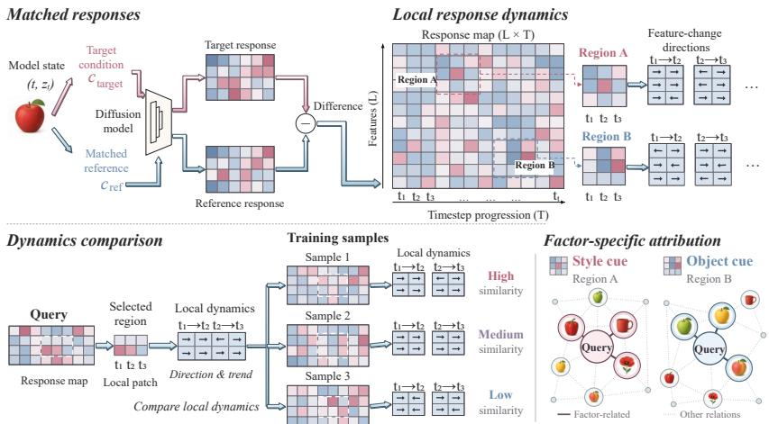  
Figure 1: The overview of our proposed CADT. Throughout the experiments, the term "style" denotes either color or image style.

## 4.2 FACTOR-SPECIFIC COUNTERFACTUAL RESPONSE

Let $y _ { c }$ denote the conditioning input associated with the target factor $c .$ We define $y _ { \mathrm { r e f } ( c ) }$ as its matched counterfactual reference, obtained by replacing the target factor c with a predefined reference value while keeping all other conditioning information unchanged. Let $\{ t _ { j } \} _ { j = 0 } ^ { T - 1 }$ denote the recorded diffusion timesteps, where $t _ { j }$ is the j-th step and $T$ is the total number of recorded steps, $s \in$ $\{ 1 , \ldots , S \}$ index repeated analysis probes, and $\ell \in \mathcal { T } _ { \mathrm { l a y e r } }$ index the selected network stages. For sample $x ,$ let $x _ { t _ { j } } ^ { ( s ) }$ denote the corresponding noisy state under probe $s .$ Given a noisy state $x _ { t _ { j } } ^ { ( s ) }$ timestep $t _ { j } .$ , and conditioning input $y _ { c } ,$ , we perform a standard denoiser forward pass and expose the intermediate representations at the selected network stages as:

$$
\bigg ( \hat { \epsilon } _ { \theta } ( x _ { t _ { j } } ^ { ( s ) } , t _ { j } , y _ { c } ) , \Big \{ H _ { \ell } ( x _ { t _ { j } } ^ { ( s ) } , t _ { j } , y _ { c } ) \Big \} _ { \ell \in \mathcal { T } _ { \mathrm { l a y e r } } } \bigg ) = f _ { \theta } ^ { \mathrm { f e a t } } ( x _ { t _ { j } } ^ { ( s ) } , t _ { j } , y _ { c } ) ,\tag{5}
$$

where $f _ { \theta } ^ { \mathrm { f e a t } }$ denotes the original denoiser with access to selected intermediate features. Each activation is extracted as $H _ { \ell } ( x _ { t _ { j } } ^ { ( s ) } , t _ { j } , y _ { c } ) \in \mathbb { R } ^ { P _ { \ell } \times C _ { \ell } }$ , where $P _ { \ell }$ and $C _ { \ell }$ denote the token and channel dimensions, respectively.

At each recorded state, we evaluate this representation under the target condition $y _ { c }$ and the matched reference condition $y _ { \mathrm { r e f } ( c ) }$ while keeping the noisy state fixed. We define the factor-specific counterfactual response as:

$$
\mathcal { R } _ { c , s } ^ { \ell } ( \boldsymbol { x } , t _ { j } ) = H _ { \ell } ( x _ { t _ { j } } ^ { ( s ) } , t _ { j } , y _ { c } ) - H _ { \ell } ( x _ { t _ { j } } ^ { ( s ) } , t _ { j } , y _ { \mathrm { r e f } ( c ) } ) .\tag{6}
$$

Both evaluations share the same protocol, only the conditioning signal changes. Their difference therefore provides a local counterfactual response associated with the target factor while controlling for the underlying diffusion state. Repeating this matched intervention over the recorded timesteps, selected layers, and analysis probes yields the factor-specific response sequence $\{ \mathcal { R } _ { c , s } ^ { \ell } ( x , t _ { j } ) \} _ { s , \ell , j } .$ from which we construct the dynamic trajectory representation.

## 4.3 DYNAMIC TRAJECTORY CONSTRUCTION

Given the counterfactual responses obtained above, we construct two complementary dynamic components directly from the response sequence. For each layer ℓ and timestep $t _ { j }$ , the responsestrength component is computed from the counterfactual responses at the endpoint state as:

$$
\psi _ { \ell , t _ { j } } ^ { E } ( \boldsymbol { x } ) = \mathcal { E } \Big ( \big \{ \mathcal { R } _ { c , s } ^ { \ell } ( \boldsymbol { x } , t _ { j } ) \big \} _ { s = 1 } ^ { S } \Big ) ,\tag{7}
$$

while the directional component is computed from the evolution of the counterfactual responses across the interval as:

$$
\psi _ { \ell , t _ { j } , k } ^ { V } ( x ) = \mathcal { V } _ { k } \Big ( \big \{ \mathcal { R } _ { c , s } ^ { \ell } ( x , t _ { j } ) , \mathcal { R } _ { c , s } ^ { \ell } ( x , t _ { j + 1 } ) \big \} _ { s = 1 } ^ { S } \Big ) ,\tag{8}
$$

where $\mathcal { E }$ extracts response strength and $\nu _ { k }$ extracts the first-order directional evolution of channel k. Let $\pmb { \tau } = ( \tau _ { 1 } , \tau _ { 2 } , \dots , \tau _ { M } )$ denote the ordered sequence of selected timesteps along the denoising trajectory, where M is the number of selected stages. For layer ℓ and selected timestep $\tau _ { m }$ , we construct the stage-wise dynamic feature as:

$$
\psi _ { \ell , \tau _ { m } } ( x ) = \mathrm { C o n c a t } \left( \psi _ { \ell , \tau _ { m } } ^ { E } ( x ) , \psi _ { \ell , \tau _ { m , 1 } } ^ { V } ( x ) , \ldots , \psi _ { \ell , \tau _ { m , } , C _ { \ell } } ^ { V } ( x ) \right) ,\tag{9}
$$

where $\psi _ { \ell , \tau _ { m } } ^ { E } ( x ) \in \mathbb { R } ^ { C _ { \ell } }$ denotes the response-strength feature at timestep $\tau _ { m }$ , and $\psi _ { \ell , \tau _ { m } , k } ^ { V } ( x ) \in \mathbb { R } ^ { P _ { \ell } }$ denotes the directional feature for channel k over the corresponding denoising transition. The complete definitions of these components, including their temporal differences, multi-probe stability, and second-order reliability, are provided in Appendix A.

The stage-wise features are then concatenated following the denoising order to form the layer-specific trajectory descriptor as:

$$
z _ { \ell } ( x ) = \mathrm { C o n c a t } \left( \psi _ { \ell , \tau _ { 1 } } ( x ) , \psi _ { \ell , \tau _ { 2 } } ( x ) , \dots , \psi _ { \ell , \tau _ { M } } ( x ) \right) .\tag{10}
$$

Similarly, let $\boldsymbol { \ell } = ( \ell _ { 1 } , \ell _ { 2 } , \dots , \ell _ { L } )$ denote the ordered sequence of selected layers. The corresponding multi-layer trajectory representation is defined as:

$$
\Phi _ { c } ( x ) = \mathrm { C o n c a t } \left( z _ { \ell _ { 1 } } ( x ) , z _ { \ell _ { 2 } } ( x ) , \dots , z _ { \ell _ { L } } ( x ) \right) .\tag{11}
$$

This construction preserves the ordering of dynamic information across denoising stages rather than averaging it over time, and is applied identically to training examples and generated queries.

## 4.4 TRAINING-BANK ADAPTIVE COMPARISON

Direct comparison of the complete trajectory representations can be dominated by variations broadly expressed across the training set. We therefore calibrate local feature blocks using statistics estimated from the training bank. Let $B = B _ { E } \cup B _ { V }$ denote the set of kernel blocks, where $\boldsymbol { B } _ { E }$ contains response-strength blocks and $B _ { V }$ contains directional blocks. Specifically, an energy block contains the channel-wise feature $\psi _ { \ell , t _ { j } } ^ { E } ( x )$ for a fixed layer and state, whereas a directional block contains $\psi _ { \ell , t _ { j } , k } ^ { V } ( x )$ for a fixed layer, timestep, and channel.

For $b \in B$ , let $\Pi _ { b }$ denote the coordinate-selection operator that extracts the corresponding raw block from $\Phi _ { c } ( x )$ , which can be formulated as $\xi _ { b } ( x ) = \bar { \Pi _ { b } } \Phi _ { c } ( x )$ . We use $\Pi _ { b }$ rather than $P _ { b }$ to distinguish this operator from the spatial dimension $P _ { \ell }$

Each block is centered and standardized using statistics computed exclusively from the training examples. Let $\boldsymbol { S _ { b } }$ denote this frozen standardization operator, including the removal of coordinates with negligible training variance, and define $h _ { b } ( x ) = \bar { \mathcal { S } } _ { b } ( \xi _ { b } ( x ) ) \in \mathbb { R } ^ { d _ { b } }$ , where $d _ { b }$ is the number of retained coordinates in block b.

The standardized training bank for this block can be formulated as:

$$
Z _ { b } = \left[ \begin{array} { c } { h _ { b } ( x _ { 1 } ) ^ { \top } } \\ { \vdots } \\ { h _ { b } ( x _ { N } ) ^ { \top } } \end{array} \right] \in \mathbb { R } ^ { N \times d _ { b } } .\tag{12}
$$

Because $h _ { b }$ is centered using training-bank statistics, $\begin{array} { r } { \frac { 1 } { N } Z _ { b } ^ { \top } Z _ { b } } \end{array}$ corresponds to the empirical covariance of the standardized block features. We define the regularized inverse:

$$
G _ { b } = \left( Z _ { b } ^ { \top } Z _ { b } + \lambda I _ { d _ { b } } \right) ^ { - 1 } , \qquad \lambda > 0 ,\tag{13}
$$

where $I _ { d _ { b } }$ is the $d _ { b }$ -dimensional identity matrix and λ controls regularization.

The final attribution score between query q and training example $x _ { i }$ is:

$$
\boxed { K _ { \lambda } ( \boldsymbol { q } , \boldsymbol { x } _ { i } ) = \sum _ { b \in \mathcal { B } } w _ { b } h _ { b } ( \boldsymbol { q } ) ^ { \top } G _ { b } h _ { b } ( \boldsymbol { x } _ { i } ) } , \qquad w _ { b } \geq 0 .\tag{14}
$$

Here, w denotes a fixed block weight used to balance contributions from different dynamic components and blocks. In the full method, the response- strength and directional feature families receive equal total weight; the exact weighting scheme is given in Appendix A.

$G _ { b }$ calibrates each local component against the variation observed in the corresponding training block, and the resulting blockwise interactions are aggregated to rank the training examples. All training-bank statistics, standardization operators, and $G _ { b }$ are fitted once on the training set and remain fixed during query attribution.

## 4.5 REPRESENTATION-LEVEL REMOVAL INTERPRETATION

Because each training example contributes a descriptor to every block bank, the attribution score also admits a deletion-based interpretation. While deletion and retraining provide a model-level counterfactual (Appendix I), here we ask how removing $x _ { i }$ affects query reconstruction in the fixed representation space.

For block b, consider the ridge reconstruction objective:

$$
E _ { b } ( q ) = \operatorname* { m i n } _ { a _ { b } \in \mathbb { R } ^ { N } } \| h _ { b } ( q ) - Z _ { b } ^ { \top } a _ { b } \| _ { 2 } ^ { 2 } + \lambda \| a _ { b } \| _ { 2 } ^ { 2 } ,\tag{15}
$$

where $a _ { b }$ contains the reconstruction coefficients. If $a _ { b } ^ { \star }$ is the minimizer, its i-th entry is:

$$
a _ { i b } ^ { \star } = h _ { b } ( q ) ^ { \top } G _ { b } h _ { b } ( x _ { i } ) ,\tag{16}
$$

which is exactly the blockwise interaction underlying $K _ { \lambda }$

Removing $x _ { i }$ from each block bank changes the optimal reconstruction objective by:

$$
\Delta _ { i } ^ { \mathrm { d y n } } ( q ) = \lambda \sum _ { b \in \mathcal { B } } w _ { b } \frac { \left[ h _ { b } ( q ) ^ { \top } G _ { b } h _ { b } ( x _ { i } ) \right] ^ { 2 } } { 1 - h _ { b } ( x _ { i } ) ^ { \top } G _ { b } h _ { b } ( x _ { i } ) } .\tag{17}
$$

Thus, the interactions used by $K _ { \lambda }$ also determine an exact leave-one-descriptor-out effect, distinct from deleting a training example and retraining the diffusion model. The full derivation is provided in Appendix B.

## 5 EXPERIMENTS

## 5.1 EVALUATION PROTOCOL AND SCOPE

We evaluate CADT on controlled synthetic data, CIFAR-100, and ArtBench, and compare against Concept-TRAK (Park et al., 2026), TRAK (Park et al., 2023), D-TRAK (Zheng et al., 2024), DAS (Lin et al., 2025), and Journey-TRAK (Georgiev et al., 2023). Within each experiment, all methods use the same checkpoint, candidate pool, queries, relevance targets, and validity mask; baseline settings follow disjoint validation data or published protocols. We report P@K, the

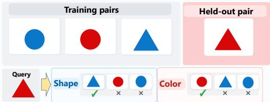  
Figure 2: Synthetic setup for shape and color attribution.

fraction of top-K candidates matching the target factor. The implementation details are provided in Appendix E.

## 5.2 CONTROLLED EXPERIMENTS ON SYNTHETIC DATA

This synthetic experiment tests whether attribution can separate the influence of different semantic factors within a compositional query. We train a conditional diffusion U-Net on blue triangles, blue circles, and red circles, while holding out red triangles. Because shape and color are factorized, each factor can be changed while keeping the other fixed. In each matched target–reference pair, effects associated with the preserved factor are shared and largely cancel, leaving a response dominated by the changed factor. This yields distinct shape- and color-specific attribution signals, and Figure 2 illustrates the setup and corresponding attribution targets. The details are provided in Appendix E.

Table 1: Synthetic held-out OOD precision (%).
<table><tr><td></td><td colspan="3">Shape</td><td colspan="3">Color</td><td colspan="3">Avg.</td></tr><tr><td>Method</td><td>P@1</td><td>P@5</td><td>P@10</td><td>P@1</td><td>P@5</td><td>P@10</td><td>P@1</td><td>P@5</td><td>P@10</td></tr><tr><td>TRAK</td><td>71.20</td><td>41.10</td><td>33.64</td><td>26.20</td><td>47.54</td><td>50.96</td><td>48.70</td><td>44.32</td><td>42.30</td></tr><tr><td>D-TRAK</td><td>0.30</td><td>0.68</td><td>1.00</td><td>99.70</td><td>99.32</td><td>99.00</td><td>50.00</td><td>50.00</td><td>50.00</td></tr><tr><td>DAS</td><td>65.30</td><td>43.44</td><td>37.27</td><td></td><td>34.7053.70</td><td></td><td></td><td>50.52 50.0048.57</td><td>43.90</td></tr><tr><td>CADT</td><td>91.20</td><td>91.36</td><td>92.01</td><td></td><td>90.80 93.88</td><td>93.65</td><td>91.00</td><td>92.62</td><td>92.83</td></tr></table>

gled attribution.

Query Positive train Negative traiFigure 3 shows that positive training examples d0d1maintain stronger and more consistent direc-d2e d3m0ptional agreement with the query across layers m0m1ha u0Shand timesteps, whereas negative examples exhibit u1u2u3weaker or frequently opposing responses. This 0000000000 0000000000 00000000000908070605040302010 00908070605040302010 009080706050403020distinction indicates that attribution evidence is 2111111111 2111111111 211111111Timestep t Timestep t Timestep tcarried not only by the presence of a response, but also by whether its direction remains compatible with the query throughout denoising. By explicd0d1itly modeling this directional evolution, CADT d2d3r d3m0locan preserve the temporal consistency of factorm1ol u0u1Cspecific responses and better separate supportiv u1u2u3training examples from conflicting ones.

Table 1 shows that CADT achieves consistently high precision for both shape and color, whereas whole-image baselines exhibit strong factor imbalance. D-TRAK nearly perfectly retrieves color but fails on shape, while TRAK and DAS are substantially more shape-biased. This indicates that a single attribution ranking can be dominated by one factor, whereas factor-specific contrasts provide more balanced and disentan-

20191817161514131211 20191817161514131211 2019181716151413122111111111 2111111111 211111111We further find that factor-specific evidence is dis-Timestep t Timestep t Timestep ttributed across both network depth and denoising time, rather than localized to a single representation. Figure 4 reveals distinct layer-wise support patterns for color and shape, while Figure 5 identifies the denoising interval from (t=300) to (t=100) as the strongest temporal region for both. After obtaining a factor-specific response at each denoising stage, CADT organizes these stage-wise responses into an ordered trajectory within each layer. It then models how their magnitude and direction evolve between successive timesteps, converting isolated local responses into a dynamic signature that spans the denoising process.

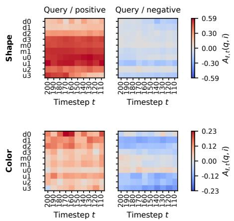  
Figure 3: Signed alignment of the query with positive and negative training examples.

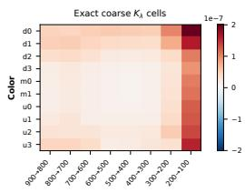

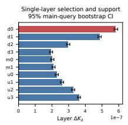

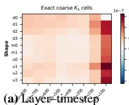

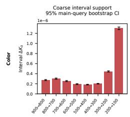

(a) Layer–timestep 600 500 400 300 200 support  
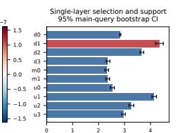  
Layer ΔKλ 1e−7(b) Single-layer supportLaye

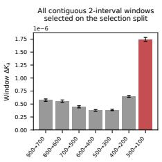

Figure 4: Layer-wise attribution support of $K _ { \lambda }$ for color and shape. (a) Coarse layer–timestep contributions. (b) Aggregated single-layer support with bootstrap confidence timestep.  
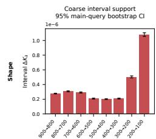  
(a) Interval support

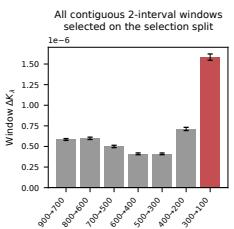  
(b) Window support  
Figure 5: Temporal attribution support of $K _ { \lambda }$ for color and shape. (a) Support over individual coarse diffusion timestep. (b) Support over contiguous two-timestep windows.

## 5.3 HIERARCHICAL CONCEPT ATTRIBUTION

Beyond the controlled synthetic setting, we further evaluate CADT on the more complex and realistic CIFAR-100 benchmark (Krizhevsky, 2009). We train the diffusion model using only coarse-grained labels and evaluate attribution retrieval at both the mid-level superclass and fine-class levels, testing whether meaningful hierarchical attribution can emerge beyond the supervision granularity seen during training. We use a fixed candidate bank with

Table 2: CIFAR-100 P@5 (%).
<table><tr><td>Method</td><td>Mid-level</td><td>Fine class</td></tr><tr><td>D-TRAK</td><td>45.30</td><td>18.54</td></tr><tr><td>TRAK</td><td>41.35</td><td>15.30</td></tr><tr><td>DAS</td><td>11.95</td><td>1.62</td></tr><tr><td>Journey-TRAK</td><td>10.76</td><td>1.95</td></tr><tr><td>CADT</td><td>50.59</td><td>21.68</td></tr></table>

disjoint query and validation banks. Further architecture and extraction details are provided in Appendix E.

Table 2 compares CADT with published baselines on the same queries. CADT achieves the strongest retrieval at both hierarchy levels, with a larger margin at the superclass level, where semantically related subclasses share more coherent response dynamics. Fine-class attribution is more challenging because it requires distinguishing samples within the same coarse training category, yet CADT retains a clear advantage despite the absence of fine-grained supervision during diffusion training. This suggests that the factor-conditioned trajectories capture hierarchical structure beyond the training labels, while the bank-adaptive comparison helps preserve the more discriminative dynamic variations needed for finer attribution.

## 5.4 COUNTERFACTUAL LABEL-SOURCE RECOVERY

Having evaluated hierarchical attribution under clean supervision, we next stress-test whether the retrieved sources remain meaningful when training labels conflict with visual content. We relabel a subset of animal images as plant and ask whether a plant-conditioned generation can be attributed not only to genuine plant examples but also to the deliberately mislabeled animal sources. This setting distinguishes label-driven attribution from attribution that reflects the actual training influence encoded in the model.

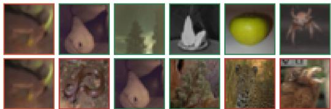  
Figure 6: Label-corruption retrieval for the same query, showing top-five training examples. Red: corrupted animals; green: genuine plants. Top: D-TRAK; bottom: CADT.

Relevance is defined by the original group before corruption.

Table 3 shows that CADT maintains strong recovery for both source types under corrupted supervision. It achieves high precision on genuine plants while recovering substantially more flipped animal sources than most baselines, leading to the strongest overall balance across the two groups. This indicates that the attribution signal is not determined solely by the observed plant label: the internal denoising response trajectories clearly reflect the underlying source identity even when the observed label conflicts with the original source. CADT directly exploits this property by modeling these response trajectories for attribution.

Figure 6 provides a qualitative view of the same behavior. For a single plant-conditioned query, CADT retrieves both genuine plant examples and animals deliberately relabeled as plant. The retrieved mixture illustrates how the dynamic attribution signal can trace both the observed conditioning association and the corrupted label.

Table 3: CIFAR-100 20% label-flip source recovery (%). Values within each cell are P@1/5/10/50.
<table><tr><td>Method</td><td>Avg.</td><td>Flipped animal → plant</td><td>Genuine plant</td></tr><tr><td>TRAK</td><td>56.22 / 52.00 / 50.14 / 44.27</td><td>23.24 / 21.95 / 20.00 / 16.40</td><td>89.19 / 82.05 / 80.27 / 72.14</td></tr><tr><td>D-TRAK</td><td>63.78 / 59.89 / 57.68 / 49.12</td><td>40.54 / 35.68 / 33.51 / 26.30</td><td>87.03 / 84.11 / 81.84 / 71.94</td></tr><tr><td>DAS</td><td>24.05 / 21.46 / 19.89 / 22.28</td><td>1.08 / 0.76 / 1.03 / 4.17</td><td>47.03 / 42.16 / 38.76 / 40.39</td></tr><tr><td>Journey-TRAK</td><td>1.35 / 6.59 / 22.57 / 21.75</td><td>1.08 / 1.51 / 13.51 / 9.01</td><td>1.62 / 11.68 / 31.62 / 34.49</td></tr><tr><td>CADT</td><td>67.57 / 66.86 / 66.51 / 64.48</td><td>37.84 / 38.27 / 37.51 / 34.42</td><td>97.30 / 95.46 / 95.51 / 94.53</td></tr></table>

## 5.5 STYLE AND OBJECT–STYLE ATTRIBUTION

We further evaluate CADT on ArtBench (Liao et al., 2022), extending the study to a more complex textconditioned diffusion setting with two- and five-style subsets. We consider both pure-style and object–style attribution, testing whether the method remains effective when multiple semantic factors coexist in the same generation. The quantitative results are reported in Tables 4 and 5. It can be seen that CADT nearly saturates generated-query style retrieval on both subsets and also achieves strong performance in the more challenging object–style setting, including the more diverse five-style split. This advantage is consistent

Table 4: Generated-query ArtBench style precision (%).
<table><tr><td>Dataset</td><td>Method</td><td>P@1</td><td>P@5</td><td>P@10</td><td>P@50</td></tr><tr><td rowspan="5">ArtBench2</td><td>TRAK</td><td>98.54</td><td>97.49</td><td>96.58</td><td>89.15</td></tr><tr><td>D-TRAK</td><td>97.80</td><td>97.72</td><td>96.99</td><td>94.50</td></tr><tr><td>Journey-TRAK</td><td>98.01</td><td>96.76</td><td>95.91</td><td>89.07</td></tr><tr><td>DAS</td><td>99.37</td><td>99.46</td><td>99.32</td><td>99.03</td></tr><tr><td>CADT</td><td>100.00</td><td>100.00</td><td>100.00</td><td>100.00</td></tr><tr><td rowspan="5">ArtBench5</td><td>TRAK</td><td>90.01</td><td>87.18</td><td>84.36</td><td>70.36</td></tr><tr><td>D-TRAK</td><td>63.00</td><td>62.96</td><td>62.57</td><td>58.32</td></tr><tr><td>Journey-TRAK</td><td>89.19</td><td>83.59</td><td>78.92</td><td>62.32</td></tr><tr><td>DAS</td><td>96.43</td><td>95.49</td><td>94.52</td><td>91.28</td></tr><tr><td>CADT</td><td>100.00</td><td>100.00</td><td>100.00</td><td>99.94</td></tr></table>

with the target-specific response trajectories of CADT, which separate style-directed and objectdirected evidence instead of forcing multiple factors into a single whole-image ranking.

Table 5: ArtBench composition precision (%) for style- and object-specific attribution.
<table><tr><td></td><td colspan="6">ArtBench2</td><td colspan="6">ArtBench5</td></tr><tr><td></td><td colspan="3">Style</td><td colspan="3">Object</td><td colspan="3">Style</td><td colspan="3">Object</td></tr><tr><td>Method</td><td>P@1</td><td>P@5</td><td>P@10</td><td>P@1</td><td>P@5</td><td>P@10</td><td>P@1</td><td>P@5</td><td>P@10</td><td>P@1</td><td>P@5</td><td>P@10</td></tr><tr><td>TRAK</td><td>90.91</td><td>90.91</td><td>88.18</td><td>0.00</td><td>3.64</td><td>3.64</td><td>23.33</td><td>20.00</td><td>19.67</td><td>0.00</td><td>0.00</td><td>1.67</td></tr><tr><td>D-TRAK</td><td>100.00</td><td>90.91</td><td>84.55</td><td>0.00</td><td>0.00</td><td>1.82</td><td>10.00</td><td>25.33</td><td>21.33</td><td>0.00</td><td>0.00</td><td>0.00</td></tr><tr><td>Journey-TRAK</td><td>90.91</td><td>92.73</td><td>94.55</td><td>0.00</td><td>0.00</td><td>0.91</td><td>23.33</td><td>16.67</td><td>16.67</td><td>0.00</td><td>2.00</td><td>3.00</td></tr><tr><td>DAS</td><td>72.73</td><td>83.64</td><td>85.45</td><td>0.00</td><td>0.00</td><td>3.64</td><td>10.00</td><td>18.67</td><td>20.33</td><td>0.00</td><td>0.67</td><td>0.67</td></tr><tr><td>CADT</td><td>100.00</td><td>100.00</td><td>100.00</td><td>9.09</td><td>9.09</td><td>6.36</td><td>90.00</td><td>90.67</td><td>88.67</td><td>30.00</td><td>18.67</td><td>14.67</td></tr></table>

## 5.6 ABLATION STUDY

We ablate the dynamic descriptor and temporal support of CADT on CIFAR-100 while keeping the evaluation protocol and $K _ { \lambda }$ fixed. Energy captures where the factor-specific response is strong, while velocity complements it by describing how that response changes across adjacent denoising stages. Their combination therefore preserves both response magnitude and temporal evolution, which explains the large gain from adding velocity. Second-order reliability and multi-seed stability further suppress transient or noise-sensitive responses, yielding more consistent trajectory evidence. The full CADT performs best, supporting the benefit of jointly modeling response dynamics and their stability.

Table 6: Ablation of descriptor components and temporal support on CIFAR-100 at P@5.
<table><tr><td>Variant</td><td>Mid-level</td><td>Fine class</td></tr><tr><td>Energy only</td><td>13.73</td><td>2.65</td></tr><tr><td>Energy + velocity</td><td>31.57</td><td>7.68</td></tr><tr><td>+ Second-order reliability</td><td>34.22</td><td>8.86</td></tr><tr><td>+ Multi-seed stability</td><td>35.24</td><td>9.24</td></tr><tr><td>Full CADT</td><td>50.59</td><td>21.68</td></tr></table>

## 6 CONCLUSION

We identify a key limitation of diffusion data attribution: a single scalar score can obscure both which semantic factor is being supported and how that influence evolves during generation. We introduced CADT, which addresses this by isolating factor-specific counterfactual responses and tracing their evolution across the denoising trajectory. Its effectiveness comes from controlling shared variation through matched target–reference comparisons while preserving informative changes in response strength and direction. More broadly, our results suggest that training influence in generative models is better viewed as a dynamic process rather than a static association. Attribution should therefore ask not only which examples matter, but also how their influence unfolds during generation. Future work will explore automatically discovered factors and references, broader generative architectures, and stronger causal validation of trajectory-based attribution.

## AI USE STATEMENT

In this work, we used generative AI tools for proofreading the manuscript and improving its readability and clarity. All research ideas, methodological and theoretical developments, experiments, and method implementations were developed and conducted by the authors. We have reviewed all AIassisted work. We take responsibility for the final content of this work, including text, claims or artifacts produced with the aid of generative AI.

## REFERENCES

Shuai Bai, Yuxuan Cai, Ruizhe Chen, Keqin Chen, Xionghui Chen, Zesen Cheng, Lianghao Deng, Wei Ding, Chang Gao, Chunjiang Ge, Wenbin Ge, Zhifang Guo, Qidong Huang, Jie Huang, Fei Huang, Binyuan Hui, Shutong Jiang, Zhaohai Li, Mingsheng Li, Mei Li, Kaixin Li, Zicheng Lin, Junyang Lin, Xuejing Liu, Jiawei Liu, Chenglong Liu, Yang Liu, Dayiheng Liu, Shixuan Liu, Dunjie Lu, Ruilin Luo, Chenxu Lv, Rui Men, Lingchen Meng, Xuancheng Ren, Xingzhang Ren, Sibo Song, Yuchong Sun, Jun Tang, Jianhong Tu, Jianqiang Wan, Peng Wang, Pengfei Wang, Qiuyue Wang, Yuxuan Wang, Tianbao Xie, Yiheng Xu, Haiyang Xu, Jin Xu, Zhibo Yang, Mingkun Yang, Jianxin Yang, An Yang, Bowen Yu, Fei Zhang, Hang Zhang, Xi Zhang, Bo Zheng, Humen Zhong, Jingren Zhou, Fan Zhou, Jing Zhou, Yuanzhi Zhu, and Ke Zhu. Qwen3-vl technical report. arXiv preprint arXiv:2511.21631, 2025.

Nicholas Carlini, Jamie Hayes, Milad Nasr, Matthew Jagielski, Vikash Sehwag, Florian Tramèr, Borja Balle, Daphne Ippolito, and Eric Wallace. Extracting training data from diffusion models. In 32nd USENIX Security Symposium, pp. 5253–5270. USENIX Association, 2023.

Zheng Dai and David K. Gifford. Training data attribution for diffusion models. arXiv preprint arXiv:2306.02174, 2023.

Kristian Georgiev, Joshua Vendrow, Hadi Salman, Sung Min Park, and Aleksander Madry. The journey, not the destination: How data guides diffusion models. In ICML Workshop on Challenges in Deployable Generative AI, 2023.

Amirata Ghorbani and James Zou. Data shapley: Equitable valuation of data for machine learning. In Proceedings of the 36th International Conference on Machine Learning, volume 97 of Proceedings of Machine Learning Research, pp. 2242–2251. PMLR, 2019.

Jonathan Ho, Ajay Jain, and Pieter Abbeel. Denoising diffusion probabilistic models. In Advances in Neural Information Processing Systems, volume 33, pp. 6840–6851, 2020.

Edward J. Hu, Yelong Shen, Phillip Wallis, Zeyuan Allen-Zhu, Yuanzhi Li, Shean Wang, Lu Wang, and Weizhu Chen. LoRA: Low-rank adaptation of large language models. In International Conference on Learning Representations, 2022.

Andrew Ilyas, Sung Min Park, Logan Engstrom, Guillaume Leclerc, and Aleksander Madry. Datamodels: Understanding predictions with data and data with predictions. In Proceedings ofthe 39th International Conference on Machine Learning, volume 162 of Proceedings of Machine Learning Research, pp. 9525–9587. PMLR, 2022.

Pang Wei Koh and Percy Liang. Understanding black-box predictions via influence functions. In Proceedings ofthe 34th International Conference on Machine Learning, volume 70 of Proceedings ofMachine Learning Research, pp. 1885–1894. PMLR, 2017.

Alex Krizhevsky. Learning multiple layers of features from tiny images. Technical report, University of Toronto, 2009.

Peiyuan Liao, Xiuyu Li, Xihui Liu, and Kurt Keutzer. The artbench dataset: Benchmarking generative models with artworks. arXiv preprint arXiv:2206.11404, 2022.

Jinxu Lin, Linwei Tao, Minjing Dong, and Chang Xu. Diffusion attribution score: Evaluating training data influence in diffusion models. In International Conference on Learning Representations, 2025.

Bruno Mlodozeniec, Runa Eschenhagen, Juhan Bae, Alexander Immer, David Krueger, and Richard E. Turner. Influence functions for scalable data attribution in diffusion models. arXiv preprint arXiv:2410.13850, 2024.

Trong Bang Nguyen, Phi Le Nguyen, Simon Lucey, and Minh Hoai. Region-level data attribution for text-to-image generative models. In Proceedings ofthe IEEE/CVF International Conference on Computer Vision, pp. 18825–18833, 2025.

Alexander Quinn Nichol and Prafulla Dhariwal. Improved denoising diffusion probabilistic models. In Proceedings ofthe 38th International Conference on Machine Learning, volume 139 of Proceedings ofMachine Learning Research, pp. 8162–8171. PMLR, 2021.

Sung Min Park, Kristian Georgiev, Andrew Ilyas, Guillaume Leclerc, and Aleksander Madry. TRAK: Attributing model behavior at scale. In Proceedings of the 40th International Conference on Machine Learning, volume 202 of Proceedings ofMachine Learning Research, pp. 27074–27113. PMLR, 2023.

Yonghyun Park, Chieh-Hsin Lai, Satoshi Hayakawa, Yuhta Takida, Naoki Murata, Wei-Hsiang Liao, Woosung Choi, Kin Wai Cheuk, Junghyun Koo, and Yuki Mitsufuji. Concept-TRAK: Understanding how diffusion models learn concepts through concept-level attribution. In International Conference on Learning Representations, 2026. URL https://arxiv.org/abs/2507.06547.

Garima Pruthi, Frederick Liu, Satyen Kale, and Mukund Sundararajan. Estimating training data influence by tracing gradient descent. In Advances in Neural Information Processing Systems, volume 33, pp. 19920–19930, 2020.

Robin Rombach, Andreas Blattmann, Dominik Lorenz, Patrick Esser, and Bjorn Ommer. Highresolution image synthesis with latent diffusion models. In Proceedings of the IEEE/CVF Conference on Computer Vision and Pattern Recognition, pp. 10684–10695, 2022. doi: 10.1109/CVPR52688.2022.01042.

Jascha Sohl-Dickstein, Eric Weiss, Niru Maheswaranathan, and Surya Ganguli. Deep unsupervised learning using nonequilibrium thermodynamics. In Proceedings ofthe 32nd International Conference on Machine Learning, volume 37 of Proceedings of Machine Learning Research, pp. 2256–2265. PMLR, 2015.

Gowthami Somepalli, Vasu Singla, Micah Goldblum, Jonas Geiping, and Tom Goldstein. Diffusion art or digital forgery? investigating data replication in diffusion models. In Proceedings of the IEEE/CVF Conference on Computer Vision and Pattern Recognition, pp. 6048–6058, 2023.

Jiaming Song, Chenlin Meng, and Stefano Ermon. Denoising diffusion implicit models. In International Conference on Learning Representations, 2021a.

Yang Song, Jascha Sohl-Dickstein, Diederik P. Kingma, Abhishek Kumar, Stefano Ermon, and Ben Poole. Score-based generative modeling through stochastic differential equations. In International Conference on Learning Representations, 2021b.

Raphael Tang, Linqing Liu, Akshat Pandey, Zhiying Jiang, Gefei Yang, Karun Kumar, Pontus Stenetorp, Jimmy Lin, and Ferhan Ture. What the DAAM: Interpreting stable diffusion using cross attention. In Proceedings of the 61st Annual Meeting of the Association for Computational Linguistics, pp. 5644–5659. Association for Computational Linguistics, 2023. doi: 10.18653/v1/ 2023.acl-long.310.

Tong Xie, Haoyu Li, Andrew Bai, and Cho-Jui Hsieh. Data attribution for diffusion models: Timestepinduced bias in influence estimation. arXiv preprint arXiv:2401.09031, 2024.

Chih-Kuan Yeh, Joon Sik Kim, Ian E. H. Yen, and Pradeep Ravikumar. Representer point selection for explaining deep neural networks. In Advances in Neural Information Processing Systems, volume 31, 2018.

Xiaosen Zheng, Tianyu Pang, Chao Du, Jing Jiang, and Min Lin. Intriguing properties of data attribution on diffusion models. In International Conference on Learning Representations, 2024.

## APPENDIX

## A DYNAMIC ATTRIBUTION SIGNATURE

This section provides the mathematical definitions of the dynamic features used to construct the trajectory representation in Section 4.3. These features characterize complementary aspects of the factor-specific counterfactual response, including response strength, first-order directional evolution, and trajectory reliability.

For convenience, we denote the counterfactual response at layer ℓ, timestep $t _ { j }$ , and analysis probe s as:

$$
R _ { s , \ell , t _ { j } } ( \boldsymbol { x } ) = \mathcal { R } _ { c , s } ^ { \ell } ( \boldsymbol { x } , t _ { j } ) \in \mathbb { R } ^ { P _ { \ell } \times C _ { \ell } } ,\tag{A1}
$$

where $P _ { \ell }$ and $C _ { \ell }$ denote the token and channel dimensions, respectively.

Response Energy. The response energy measures the strength of the condition-induced activation. For channel k, we compute the spatial RMS magnitude as:

$$
E _ { s , \ell , t _ { j } , k } ( x ) = \log \left( \sqrt { \frac { 1 } { P _ { \ell } } \sum _ { p = 1 } ^ { P _ { \ell } } R _ { s , \ell , t _ { j } , p , k } ( x ) ^ { 2 } } + \epsilon \right) .\tag{A2}
$$

This quantity captures how strongly the target factor affects each channel at a given layer and diffusion state. Energy features are standardized using statistics estimated exclusively from the training bank.

First-Order Directional Dynamics. Let $u _ { j } = \log \mathrm { S N R } ( t _ { j } )$ . We define the first-order response velocity between adjacent recorded states as:

$$
V _ { s , \ell , t _ { j } } ( x ) = \frac { R _ { s , \ell , t _ { j + 1 } } ( x ) - R _ { s , \ell , t _ { j } } ( x ) } { u _ { j + 1 } - u _ { j } } .\tag{A3}
$$

Unlike response energy, which describes activation strength, $V _ { s , \ell , t _ { j } }$ characterizes how the factorspecific response evolves along the denoising trajectory. For each channel, we normalize the spatial velocity and retain its direction:

$$
d _ { s , \ell , t _ { j } , k } ( x ) = \frac { V _ { s , \ell , t _ { j } , : , k } ( x ) } { \| V _ { s , \ell , t _ { j } , : , k } ( x ) \| _ { 2 } + \epsilon } ,\tag{A4}
$$

where $V _ { s , \ell , t _ { j } , : , k }$ denotes the velocity vector of channel k over all token positions.

Multi-Probe Directional Stability. Repeated probes are used to determine whether the observed dynamic direction is stable under different analysis noise realizations. Let

$$
m _ { \ell , t _ { j } , k } ^ { V } ( x ) = \frac { 1 } { S } \sum _ { s = 1 } ^ { S } d _ { s , \ell , t _ { j } , k } ( x ) .\tag{A5}
$$

We define the directional coherence as:

$$
\begin{array} { r } { \rho _ { \ell , t _ { j } , k } ( x ) = \mathrm { c l i p } _ { [ 0 , 1 ] } \left( \| m _ { \ell , t _ { j } , k } ^ { V } ( x ) \| _ { 2 } \right) , } \end{array}\tag{A6}
$$

and the corresponding mean direction as:

$$
D _ { \ell , t _ { j } , k } ( x ) = \frac { m _ { \ell , t _ { j } , k } ^ { V } ( x ) } { \| m _ { \ell , t _ { j } , k } ^ { V } ( x ) \| _ { 2 } + \epsilon } .\tag{A7}
$$

A large $\rho _ { \ell , t _ { j } , k }$ indicates that the response evolves consistently across probes, whereas a small value indicates unstable or conflicting directions.

Energy Stability. We similarly measure whether the response-strength pattern is consistent across repeated probes. Let $\widetilde { E } _ { s , \ell , t _ { j } } ( \boldsymbol { x } )$ denote the standardized channel-wise energy vector. Its cross-probe agreement is

$$
r _ { \ell , t _ { j } } ^ { E } ( x ) = \mathrm { c l i p } _ { [ 0 , 1 ] } \left[ \frac { 2 } { S ( S - 1 ) } \sum _ { s < s ^ { \prime } } \cos \left( \widetilde { E } _ { s , \ell , t _ { j } } ( x ) , \widetilde { E } _ { s ^ { \prime } , \ell , t _ { j } } ( x ) \right) \right] .\tag{A8}
$$

The reliability-weighted energy representation is therefore:

$$
\psi _ { \ell , t _ { j } } ^ { E } ( x ) = r _ { \ell , t _ { j } } ^ { E } ( x ) \overline { { E } } _ { \ell , t _ { j } } ( x ) ,\tag{A9}
$$

where $\overline { { E } } _ { \ell , t _ { j } }$ denotes the energy vector averaged across probes.

Second-Order Reliability. Second-order dynamics are used only to assess the reliability of firstorder evolution. We define:

$$
A _ { s , \ell , t _ { j } , k } ( x ) = \frac { 2 \left( V _ { s , \ell , t _ { j + 1 } , : , k } ( x ) - V _ { s , \ell , t _ { j } , : , k } ( x ) \right) } { u _ { j + 2 } - u _ { j } } .\tag{A10}
$$

Let $\overline { { A } } _ { \ell , t _ { i } , k }$ denote its mean across probes. The corresponding second-order reliability is

$$
\begin{array} { r } { r _ { \ell , t _ { j } , k } ^ { A } ( x ) = \mathrm { c l i p } _ { [ 0 , 1 ] } \left[ \left( 1 + \frac { \frac { 1 } { S } \sum _ { s } \| A _ { s , \ell , t _ { j } , k } ( x ) - \overline { { A } } _ { \ell , t _ { j } , k } ( x ) \| _ { 2 } ^ { 2 } } { \| \overline { { A } } _ { \ell , t _ { j } , k } ( x ) \| _ { 2 } ^ { 2 } + \epsilon } \right) ^ { - 1 } \right] . } \end{array}\tag{A11}
$$

A high value indicates consistent local acceleration across probes, while a low value suppresses first-order directions whose local evolution is unstable.

Combining directional coherence and second-order reliability gives

$$
\psi _ { \ell , t _ { j } , k } ^ { V } ( x ) = \sqrt { \rho _ { \ell , t _ { j } , k } ( x ) \widetilde { r } _ { \ell , t _ { j } , k } ^ { A } ( x ) } D _ { \ell , t _ { j } , k } ( x ) ,\tag{A12}
$$

where $\widetilde { r } _ { \ell , t _ { j } , k } ^ { A }$ denotes the second-order reliability aligned with velocity interval $t _ { j }$

## B THEORETICAL ANALYSIS

All results in this section concern the frozen dynamic representation used during attribution. Our analysis instead asks a representation-level question: once the dynamic descriptors and training-bank statistics have been fixed, what is the mathematical meaning of the bank-adaptive interaction used by CADT? We show that this interaction is exactly a ridge-reconstruction coefficient and that it governs an exact leave-one-descriptor-out quantity.

For completeness, since $Z _ { b } ^ { \top } Z _ { b } + \lambda I \succ 0$ for $\lambda > 0$ and $w _ { b } \geq 0$ , the kernel $K _ { \lambda }$ in Eq. (14) is positive semidefinite.

## B.1 RIDGE RECONSTRUCTION INTERPRETATION

Consider a dense descriptor bank:

$$
Z = \left[ \begin{array} { l } { z _ { 1 } ^ { \top } \mathbf { \overline { { \mathbf { \Gamma } } } } } \\ { \vdots } \\ { z _ { N } ^ { \top } } \end{array} \right] \in \mathbb { R } ^ { N \times d } ,\tag{A13}
$$

and define $A = Z ^ { \top } Z + \lambda I _ { d }$ with $\lambda > 0$

We first show that the bank-adaptive interaction has a direct reconstruction interpretation.

Proposition 1 (Ridge reconstruction coefficient). Consider the regularized reconstruction problem:

$$
\boldsymbol { a } ^ { \star } = \arg \operatorname* { m i n } _ { \boldsymbol { a } \in \mathbb { R } ^ { N } } \| \boldsymbol { z } _ { \boldsymbol { q } } - \boldsymbol { Z } ^ { \top } \boldsymbol { a } \| _ { 2 } ^ { 2 } + \lambda \| \boldsymbol { a } \| _ { 2 } ^ { 2 } .\tag{A14}
$$

Then:

$$
\begin{array} { r } { \boldsymbol { a } ^ { \star } = ( Z Z ^ { \top } + \lambda I _ { N } ) ^ { - 1 } Z z _ { q } = Z ( Z ^ { \top } Z + \lambda I _ { d } ) ^ { - 1 } z _ { q } . } \end{array}\tag{A15}
$$

Consequently, the coefficient associated with training descriptor $z _ { i }$ is:

$$
\boxed { \boldsymbol { a } _ { i } ^ { \star } = \boldsymbol { z } _ { q } ^ { \top } \boldsymbol { A } ^ { - 1 } \boldsymbol { z } _ { i } } .\tag{A16}
$$

Proof. The normal equations of Eq. (A14) give $( Z Z ^ { \top } + \lambda I _ { N } ) a ^ { \star } = Z z _ { q }$ . Moreover, $( Z Z ^ { \top } +$ $\lambda I _ { N } ) Z = Z ( Z ^ { \top } Z + \lambda I _ { d } )$ , and therefore $( Z Z ^ { \top } + \lambda I _ { N } ) ^ { - 1 } Z = Z ( Z ^ { \top } Z \dot { + } \lambda I _ { d } ) ^ { - 1 }$ . Substitution yields Eq. (A15), whose i-th entry gives Eq. (A16). □

Thus, the interaction used by CADT is not merely a covariance-adjusted similarity. In the dense representation, it is exactly the coefficient assigned to a training descriptor when reconstructing the query under ridge regularization.

## B.2 EXACT REPRESENTATION-LEVEL COUNTERFACTUAL REMOVAL

The reconstruction interpretation above also yields an exact representation-level counterfactual quantity. We ask how much the optimal ridge reconstruction deteriorates when one training descriptor is removed while the descriptor map and all fitted transformations remain fixed.

Define the optimal reconstruction objective as:

$$
E _ { Z } ( z _ { q } ) = \operatorname* { m i n } _ { a } \| z _ { q } - Z ^ { \top } a \| _ { 2 } ^ { 2 } + \lambda \| a \| _ { 2 } ^ { 2 } .\tag{A17}
$$

Theorem 1 (Exact leave-one-descriptor-out effect). Let $A = Z ^ { \top } Z + \lambda I .$ . Then:

$$
E _ { Z } ( z _ { q } ) = \lambda z _ { q } ^ { \top } A ^ { - 1 } z _ { q } .\tag{A18}
$$

For training descriptor $z _ { i } ,$ , define $h _ { i } = z _ { i } ^ { \top } A ^ { - 1 } z _ { i }$ and $k _ { i } ( z _ { q } ) = z _ { q } ^ { \top } A ^ { - 1 } z _ { i }$ . Then $0 \leq h _ { i } < 1$ , and removing $z _ { i }$ increases the optimal reconstruction objective by:

$$
\boxed { E _ { Z _ { - i } } ( z _ { q } ) - E _ { Z } ( z _ { q } ) = \lambda \frac { k _ { i } ( z _ { q } ) ^ { 2 } } { 1 - h _ { i } } } \ge 0 .\tag{A19}
$$

Proof. Let $C = Z _ { - i } ^ { \top } Z _ { - i } + \lambda I \succ 0$ , so that $A = C + z _ { i } z _ { i } ^ { \top }$

Writing $t = z _ { i } ^ { \top } C ^ { - 1 } z _ { i } \geq 0$ , the Sherman–Morrison identity gives:

$$
A ^ { - 1 } = C ^ { - 1 } - \frac { C ^ { - 1 } z _ { i } z _ { i } ^ { \top } C ^ { - 1 } } { 1 + t } .\tag{A20}
$$

Hence $h _ { i } = t / ( 1 + t ) < 1$

Equivalently, the rank-one downdate is:

$$
C ^ { - 1 } = A ^ { - 1 } + \frac { A ^ { - 1 } z _ { i } z _ { i } ^ { \top } A ^ { - 1 } } { 1 - h _ { i } } .\tag{A21}
$$

Using Eq. (A18):

$$
E _ { Z _ { - i } } ( z _ { q } ) - E _ { Z } ( z _ { q } ) = \lambda z _ { q } ^ { \top } ( C ^ { - 1 } - A ^ { - 1 } ) z _ { q }\tag{A22}
$$

$$
= \lambda \frac { \left( z _ { q } ^ { \top } A ^ { - 1 } z _ { i } \right) ^ { 2 } } { 1 - h _ { i } } ,\tag{A23}
$$

which proves Eq. (A19).

The theorem identifies $k _ { i } ( z _ { q } ) = z _ { q } ^ { \top } A ^ { - 1 } z _ { i }$ as the primitive cross-interaction governing exact descriptor removal. The leave-one-descriptor-out effect is unsigned because it depends on $k _ { i } ( z _ { q } ) ^ { 2 }$ together with the leverage correction $( 1 - h _ { i } ) ^ { - 1 }$

For factor-specific attribution, however, the sign of the interaction is informative: positive and negative values distinguish aligned from opposing dynamic responses in the bank-adaptive geometry. We therefore use the signed interaction for ranking and reserve the unsigned removal magnitude for counterfactual interpretation.The theorem therefore provides a counterfactual interpretation of the interaction underlying the attribution score, while the score itself remains distinct from the leave-one-descriptor-out quantity.

Importantly, this counterfactual is defined entirely in the frozen descriptor space. It does not imply that descriptor removal is equivalent to deleting the corresponding training example and retraining the diffusion model.

## B.3 BLOCKWISE EXTENSION

The implemented CADT geometry uses multiple local descriptor blocks rather than a single dense concatenated representation. We therefore define the corresponding block-separable reconstruction objective:

$$
E _ { \mathrm { b l k } } ( q ) = \sum _ { b } w _ { b } \operatorname* { m i n } _ { a _ { b } \in \mathbb { R } ^ { N } } \left[ \| h _ { b } ( q ) - Z _ { b } ^ { \top } a _ { b } \| _ { 2 } ^ { 2 } + \lambda \| a _ { b } \| _ { 2 } ^ { 2 } \right] .\tag{A24}
$$

For each block, recall $G _ { b } = ( Z _ { b } ^ { \top } Z _ { b } + \lambda I ) ^ { - 1 }$ , and define $h _ { i b } = h _ { b } ( x _ { i } ) ^ { \top } G _ { b } h _ { b } ( x _ { i } )$ and $k _ { i b } ( q ) =$ $h _ { b } ( q ) ^ { \top } G _ { b } h _ { b } ( x _ { i } )$

Applying Theorem 1 independently to each block gives:

$$
\boxed { E _ { \mathrm { b l k } , - i } ( q ) - E _ { \mathrm { b l k } } ( q ) = \lambda \sum _ { b } w _ { b } \frac { k _ { i b } ( q ) ^ { 2 } } { 1 - h _ { i b } } } \ge 0 .\tag{A25}
$$

The blockwise removal quantity is not obtained by squaring the final score $K _ { \lambda } ( q , x _ { i } )$ , since each block receives its own leverage correction before aggregation. Nevertheless, both quantities are constructed from the same signed bank-adaptive interactions $k _ { i b } ( q )$ . The theoretical connection is therefore at the level of these local cross-interactions.

As in the dense case, this result concerns only the frozen representation space and should not be interpreted as model-retraining influence.

## B.4 STABILITY OF THE TRAINING-BANK GEOMETRY

Finally, we examine the sensitivity of the fitted inverse geometry while holding query and candidate descriptors fixed. This result concerns perturbations of the empirical second-order structure of the training bank; it does not characterize perturbations of the diffusion model or of the descriptor extraction process.

Theorem 2 (Training-bank geometry stability). Let $A = C + \lambda I$ and $\widetilde { A } = C + E + \lambda I$ , where $C \succeq 0 , E = E ^ { \top }$ , and $\delta = \| \check { E } \| _ { 2 } < \dot { \lambda } .$ Then,forfixed descriptors $z , z ^ { \prime } { : }$

$$
\left| z ^ { \top } A ^ { - 1 } z ^ { \prime } - z ^ { \top } { \widetilde A } ^ { - 1 } z ^ { \prime } \right| \leq \| z \| _ { 2 } \| z ^ { \prime } \| _ { 2 } \frac { \delta } { \lambda ( \lambda - \delta ) } .\tag{A26}
$$

Proof. Since $C \succeq 0 , \| A ^ { - 1 } \| _ { 2 } \leq 1 / \lambda$ . By Weyl’s inequality, $\lambda _ { \operatorname* { m i n } } ( \widetilde { A } ) \geq \lambda - \delta .$ , and therefore $\| \widetilde { A } ^ { - 1 } \| _ { 2 } \le 1 / ( \lambda - \delta )$

Using the resolvent identity $\widetilde { A } ^ { - 1 } - A ^ { - 1 } = - A ^ { - 1 } E \widetilde { A } ^ { - 1 }$ , we obtain:

$$
\lVert \widetilde { A } ^ { - 1 } - A ^ { - 1 } \rVert _ { 2 } \leq \frac { \delta } { \lambda ( \lambda - \delta ) } .
$$

Finally, $| z ^ { \top } B z ^ { \prime } | \leq \| z \| _ { 2 } \| B \| _ { 2 } \| z ^ { \prime } \| _ { 2 }$ gives Eq. (A26).

Thus, within the frozen-descriptor setting, the ridge parameter controls the sensitivity of the bankadaptive interaction to perturbations of the estimated second-order training-bank structure.

## C COMPUTATIONAL COMPLEXITY

Let $\begin{array} { r } { D \ = \ \sum _ { b } d _ { b } } \end{array}$ denote the total descriptor dimension. The blockwise formulation requires $O ( N \sum _ { b } d _ { b } ^ { 2 } + \sum _ { b } d _ { b } ^ { 3 } )$ preprocessing time and $O ( \sum _ { b } d _ { b } ^ { 2 } )$ factor memory, compared with $O ( N D ^ { 2 } +$ $D ^ { 3 } )$ time and $O ( D ^ { 2 } )$ memory for a dense geometry over the concatenated descriptor. Once the descriptors and block factorizations are cached, scoring $Q$ queries against $N$ training examples costs $O ( Q { \dot { N } } D )$

## D LIMITATIONS AND FUTURE WORK

A central limitation of CADT is that its attribution signal is defined in the space of internal trajectory representations rather than directly through training-induced parameter updates. Although our reconstruction analysis provides an exact counterfactual interpretation in the frozen descriptor space, descriptor removal is not equivalent to removing a training example and retraining the diffusion model. A promising direction is therefore to connect multi-order trajectory dynamics with parameter gradients or local training perturbations, providing a tighter link between dynamic representations and model-level counterfactual influence.

Our ArtBench setting introduces an additional limitation. Stable Diffusion v1.4 is adapted with LoRA (Hu et al., 2022) on a relatively small style-oriented dataset, and object-level attribution is generally weaker than style attribution. This may reflect both the strong object semantics already encoded during pretraining and the limited frequency of individual objects in the fine-tuning data. Future work could better separate attribution to pretrained knowledge from attribution introduced during downstream adaptation.

## E IMPLEMENTATION AND EVALUATION DETAILS

## E.1 WHY NOT LDS?

Linear Datamodeling Score (LDS) measures whether additive attribution scores predict changes in a scalar utility across models trained on random data subsets (Park et al., 2023). This is informative when the target is an image-level utility, but our evaluation asks which training examples support a specified factor in a generated image. As also noted by Concept-TRAK (Park et al., 2026), the standard subset construction can obscure this signal when the factor is common: a reduced training set may still contain enough positive examples to preserve the concept, so utility changes remain small until the available support crosses a threshold. Such behavior is poorly summarized by a linear per-example response and can understate the relevance of concept-bearing samples.

LDS additionally requires training many subset models, which is particularly costly for text-to-image diffusion. We instead use retrieval precision with controlled factor labels or a frozen presence judge, directly testing whether the highest-ranked candidates contain the requested factor under shared query masks and candidate order. This is a task-specific choice: LDS remains appropriate for scalar-utility questions, while model-level subset retraining would provide a useful complementary validation. Our exact removal result in Theorem 1 concerns the frozen descriptor surrogate and is not presented as a replacement for such retraining.

Synthetic. Synthetic contains 11,024 32 × 32 RGB images combining two shapes (circle and triangle) and two colors (red and blue), split into 10,000/512/512 training/validation/test images. Training and validation include blue triangles, blue circles, and red circles, with red triangles held out as compositional OOD. The temporal-support study uses an additional 500-query selection split and a disjoint 2,000-query main split, balanced between red triangles and blue circles and filtered by frozen shape and color classifiers. It evaluates eight 100-timestep intervals on the coarse 900→100 grid, all seven contiguous two-timestep windows, and all ten single-layer candidates.

CIFAR-100. We retain 59 fine classes (45 animal and 14 plant) and their original superclasses from 32×32 CIFAR-100. A fixed shuffle divides the 29,500 eligible training-split images into 26,500 attribution candidates and 3,000 validation images. The main bank contains 370 generated queries; an independently generated 171-query bank selects baseline regularization. A frozen multi-head Wide-ResNet-50-2 retains a query only when its animal/plant prediction matches the requested condition and its kingdom, superclass, and fine-class confidences all exceed 0.8. The predicted superclass and fine class provide the hierarchical evaluation labels, and all methods share the accepted images and order.

ArtBench. ArtBench2 contains ukiyo-e and post-impressionism; ArtBench5 adds romanticism, Renaissance, and Baroque. After center-cropping to 256×256, the fixed subsets contain 6,000/13,500 real images: 5,000/12,500 for training and 1,000 for validation. The full-data LoRA generates 1,000 pure-style queries (500/200 per style), of which a frozen Qwen3-VL-8B-Instruct judge (Bai et al.,

2025) accepts 956/981. The object–style protocol generates 32/80 cat-or-dog queries (eight seeds per object–style pair), retaining 11/30 that contain both requested factors. Official metadata supplies style relevance; Qwen supplies query style/object validity and training-image object relevance. CADT uses the bank-adaptive kernel $K _ { \lambda }$ with $\lambda \stackrel { \cdot } { = } 0 . 0 1 N$ on both subsets. For DAS, λ is selected by mean generated-query LDS on the first 64 official 50% subsets from 27 candidates spanning $1 0 ^ { - 2 } \mathrm { t o } \mathrm { \dot { 5 } } { \times } 1 0 ^ { 6 }$ neither P@K nor composition labels enter this selection.

## F ALTERNATIVE SCORE DESIGNS

CADT ranks training examples with the signed bank-adaptive kernel $K _ { \lambda }$ . The implementation also exposes two diagnostic alternatives using the same fixed standardized block descriptors, with $h ( x ) = \dot { \bigoplus } _ { b } \sqrt { w _ { b } } h _ { b } ( \bar { x } )$

$$
K _ { \lambda } ( x , x ^ { \prime } ) = \sum _ { b } w _ { b } h _ { b } ( x ) ^ { \top } G _ { b } h _ { b } ( x ^ { \prime } ) ,
$$

$$
\mathrm { C A D T \ b a n k \mathrm { - } a d a p t i v e \ k e r n e l } ,\tag{A27}
$$

$$
C ( \boldsymbol { x } , \boldsymbol { x } ^ { \prime } ) = \frac { \boldsymbol { h } ( \boldsymbol { x } ) ^ { \top } \boldsymbol { h } ( \boldsymbol { x } ^ { \prime } ) } { \| \boldsymbol { h } ( \boldsymbol { x } ) \| _ { 2 } \| \boldsymbol { h } ( \boldsymbol { x } ^ { \prime } ) \| _ { 2 } } ,
$$

ordinary-cosine variant,

$$
S _ { \lambda } ( x , x ^ { \prime } ) = \frac { K _ { \lambda } ( x , x ^ { \prime } ) } { \sqrt { K _ { \lambda } ( x , x ) K _ { \lambda } ( x ^ { \prime } , x ^ { \prime } ) } } ,\tag{A28}
$$

normalized ridge variant.

(A29)

Cosine ignores the covariance structure of the training bank. $K _ { \lambda }$ retains the signed ridge-whitened magnitude–direction interaction and, in the dense single-block case, corresponds directly to the interaction term arising from the reconstruction and descriptor-removal analysis. $S _ { \lambda }$ uses the same bank-adaptive geometry but normalizes the ridge-whitened norms. We use $K _ { \lambda }$ as the attribution score of CADT throughout the main paper, while reporting $S _ { \lambda }$ and ordinary cosine as exploratory score variants. Table A1 compares the three scores using the identical full late-support descriptor, query bank, and candidate order; only the scoring function changes.

Table A1: Exploratory score-design comparison for CIFAR-100 label-flip recovery. Values are P@ $1 / 5 / 1 0 / 5 0$ . All rows use the identical full late-support descriptor, query bank, and candidate order; only the scoring function changes.
<table><tr><td>Score</td><td>Macro</td><td>Flipped animal → plant</td><td>Genuine plant</td></tr><tr><td>CADT  $( K _ { \lambda } )$ </td><td>67.57 / 66.86 / 66.51 / 64.48</td><td>37.84 / 38.27 / 37.51 / 34.42</td><td>97.30 / 95.46 / 95.51 / 94.53</td></tr><tr><td>Normalized variant  $( S _ { \lambda } )$ </td><td>70.54 / 68.27 / 67.35 / 65.32</td><td>44.32 / 40.86 / 39.78 / 36.08</td><td>96.76 / 95.68 / 94.92 / 94.56</td></tr><tr><td>Ordinary cosine</td><td>74.59 / 73.41 / 72.19 / 70.58</td><td>53.51 / 52.54 / 50.70 / 48.04</td><td>95.68 / 94.27 / 93.68 / 93.11</td></tr></table>

## G LAYER–TIMESTEP DIAGNOSTICS

The main experiments show that CADT benefits from modeling factor-specific response trajectories. Here, we further examine where this attribution evidence arises within the network and how it evolves over denoising time. After the factor-specific response is obtained at each denoising stage, CADT preserves these responses in temporal order and characterizes their evolution through direction and energy. Direction captures signed agreement in response evolution, whereas energy reflects response magnitude. We first analyze these quantities in the selected low-noise region and then extend the analysis over the full from (t=900) to (t=100) trajectory.

Figure A1 provides a local view of the dynamic signals used by CADT. Positive examples show consistently stronger directional agreement with the query across layers and timesteps, whereas negative examples exhibit weaker or opposing responses. Energy captures a different aspect of the same trajectories by describing how strongly the factor-specific response is expressed. These complementary patterns explain why the dynamic descriptor benefits from retaining both the evolution direction and response magnitude rather than reducing each example to a single static feature.

Figure A2 examines how these local dynamic components relate to the final bank-adaptive interaction. For color, the direction margin closely follows the $K _ { \lambda }$ margin across the layer–timestep grid, while energy exhibits a distinct pattern. Shape shows a weaker but still structured correspondence. This indicates that $K _ { \lambda }$ does not rely on response magnitude alone: directional evolution provides a strong discriminative signal, while energy contributes complementary information about where the response is expressed.

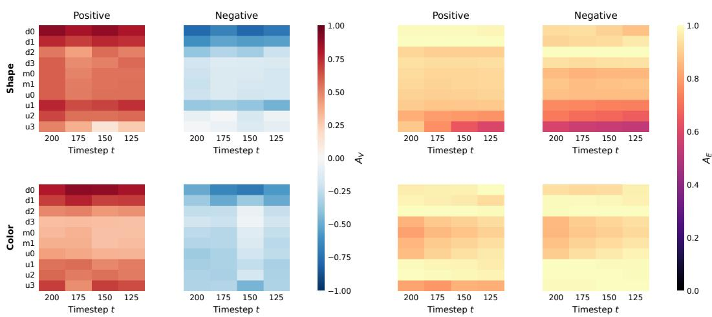  
Figure A1: Fine-grained direction and energy patterns in the selected low-noise region. Representative positive and negative pairs are selected according to their separation under $K _ { \lambda }$

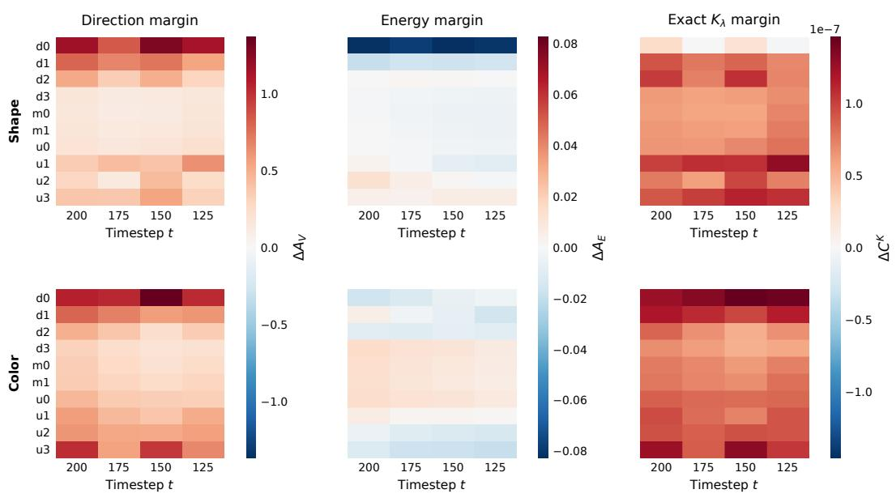  
Figure A2: Matched-minus-mismatched direction, energy, and $K _ { \lambda }$ cell margins in the fine-grained 200→100 analysis.

We next extend the analysis to the full from (t=900) to (t=100) trajectory. Because the same factorspecific response is extracted at successive denoising stages, these local responses can be organized into an ordered trajectory rather than treated as independent timestep features. We aggregate layer– timestep contributions into non-overlapping 100-timestep intervals to examine where the resulting attribution support is concentrated across network depth and time. A held-out selection split is used to identify representative layers and temporal windows, while a disjoint main split is used for the final comparison.

Table $_ { \textrm { A 2 } }$ confirms that directional evolution remains strongly associated with $K _ { \lambda }$ support over the full trajectory, especially for color, whereas energy shows little monotone correspondence. The strongest layer also depends on the target factor, with d1 selected for shape and d0 for color, showing that factor-specific evidence is not localized to a common network depth. In contrast, both factors concentrate their strongest temporal support in the from (t=300) to (t=100)region. Together, these results show that CADT benefits from tracing the same factor-specific response across denoising stages and aggregating the informative portions of its layer–time trajectory.

Table A2: Full-range layer–time analysis under $K _ { \lambda }$ . Correlations summarize the correspondence of direction and energy with $K _ { \lambda } ,$ while the final columns report the selected layer and temporal window together with their separation from the strongest alternative.
<table><tr><td>Target</td><td>Direction-  $- K _ { \lambda } \rho$ </td><td>Energy-  $- K _ { \lambda } \rho$ </td><td>Selected layer: gap [95% CI] (10−8)</td><td>Selected window: gap [95% CI] (10−6)</td></tr><tr><td>Shape</td><td>0.728</td><td>-0.109</td><td>d1: 2.01 [1.36, 2.65]</td><td>300 → 100: 0.871 [0.852, 0.890]</td></tr><tr><td>Color</td><td>0.972</td><td>0.025</td><td>d0: 9.80 [9.69, 9.91]</td><td>300 → 100: 1.097 [1.078, 1.117]</td></tr></table>

## H ARTBENCH DETAILS AND VISUALIZATIONS

ArtBench provides style labels but no ground-truth object annotations. We therefore freeze a vision– language judge to determine object presence once and apply the same valid-query mask to every method, preventing evaluation differences from being introduced by query selection. Figure A3 shows representative samples from the fixed ArtBench5 query bank, while Figure A4 visualizes the complete cat–style composition bank before validity filtering and documents the queries entering the composition evaluation. Figure A5 further provides representative style-retrieval results on ArtBench2 and ArtBench5, illustrating the training examples returned for generated queries under the corresponding target styles.

  
Figure A3: Examples from the fixed generated-query bank for ArtBench5. The ArtBench2 setting uses a subset of the styles included in ArtBench5, and is therefore covered by the examples shown here. Query validity is judged once and the same mask is shared by every method.

## I DATA DELETION AND RETRAINING ON ARTBENCH2

A central question in data attribution is whether the identified training support corresponds to actual changes in the learned model when that support is removed. We examine this question on ArtBench2 through deletion and retraining at two levels. We first test whether removing a semantically coherent subset of training data induces factor-specific changes in denoising behavior beyond those caused by an equal-size random deletion. We then ask whether removing samples identified as important by CADT produces systematic changes in the retraining dynamics and final model distribution. Together, these experiments connect the response dynamics used by CADT to observable consequences of training-data removal.

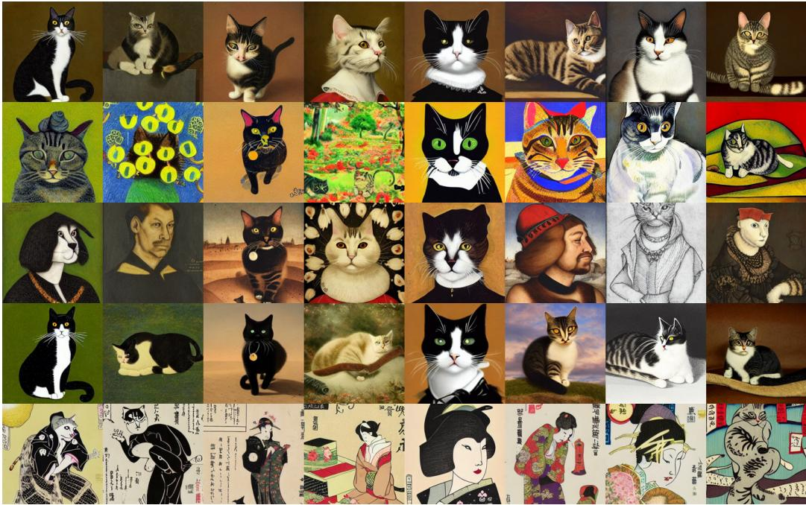  
Figure A4: All 40 ArtBench5 cat–style composition generations before the shared validity mask (five styles, eight seeds each). This grid documents query coverage; only queries judged to contain both the requested object and style enter Table 5.

  
(a)

  
(b)  
Figure A5: Representative style retrieval results produced by CADT. (a) ArtBench2, postimpressionism. (b) ArtBench5, baroque. Blue denotes the generated query and green denotes style-relevant retrieved training examples.

## I.1 STYLE-SPECIFIC CHANGES IN DENOISING ERROR

We first test whether removing coherent training support produces a corresponding change in the model’s internal denoising behavior. We use a balanced ArtBench2 subset containing ukiyo-e and post-impressionism images and compare two interventions: deleting all examples of one style and balanced random deletion of the same size. Models under all conditions are retrained with the same backbone and training protocol, so the comparison isolates the composition of the removed data rather than the deletion magnitude.

We evaluate the retrained models on held-out queries from both styles. To separate retraining effects from sampling variation, all model conditions are evaluated at matched noisy query states, denoising timesteps, and noise realizations. Differences in noise-prediction error therefore reflect changes in the learned denoising response induced by the training-data intervention.

Let $D _ { c }$ denote deletion of style c, R the corresponding size-matched random-deletion control, and $Q _ { c }$ and $Q _ { \lnot c }$ the query sets from the removed and remaining styles, respectively. We summarize the

style-specific effect using

$$
\Delta _ { c } = \left[ \bar { L } ^ { D _ { c } } ( Q _ { c } ) - \bar { L } ^ { R } ( Q _ { c } ) \right] - \left[ \bar { L } ^ { D _ { c } } ( Q _ { \neg c } ) - \bar { L } ^ { R } ( Q _ { \neg c } ) \right] ,\tag{A30}
$$

where $\bar { L } ^ { A } ( Q )$ denotes the average denoising MSE of model condition A on query set $Q .$ A positive $\Delta _ { c }$ indicates that removing style c affects queries from that style more strongly than queries from the remaining style after controlling for the reduction in training-set size.

Style deletion produces a clear style-specific change in denoising behavior. The contrasts are positive in both directions, with $\dot { \Delta _ { c } } = \dot { 1 } . 2 6 9 \times 1 0 ^ { - 3 }$ for ukiyo-e and $\Delta _ { c } = 1 . 4 5 8 \times 1 0 ^ { - 3 }$ for post-impressionism. Thus, removing coherent style support changes the denoising response of corresponding queries more than an equal-size random deletion, showing that the effect depends on which training support is removed rather than only on how much data is removed.

Figure A6 further shows that the deletion effect is not uniform over the denoising process. Although random deletion also perturbs prediction error, removing coherent style support produces stronger and temporally structured changes for queries from the corresponding style. This observation is directly relevant to CADT: the influence of training support is expressed through changes in internal denoising responses at particular stages, motivating attribution based on response trajectories rather than a single static representation.

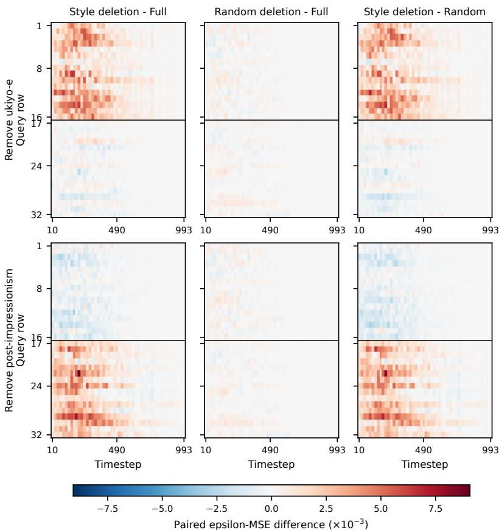  
Figure A6: Changes in denoising error after style-specific and size-matched random deletion. Rows correspond to held-out queries and columns to denoising timesteps. The right panels show the styleminus-random contrast, revealing stronger and temporally structured changes for queries associated with the removed training style.

This experiment does not evaluate an attribution ranking directly. Instead, it establishes that semantically coherent changes in the training set induce corresponding and temporally structured changes in the model’s denoising behavior, providing a model-level basis for tracing training influence through internal response dynamics.

## I.2 CHANGES IN THE DISTRIBUTION OF RETRAINED MODELS

The preceding analysis establishes that coherent training-data removal produces structured querylevel changes in denoising behavior. We next ask a stronger attribution question: do the samples assigned high importance by CADT correspond to training support whose removal also changes the retrained model itself? If the response trajectories captured by CADT reflect meaningful training support, removing highly attributed samples should produce a more systematic model-level change than removing the same number of random samples.

We therefore conduct repeated retraining experiments on ArtBench2 under two deletion strategies: (1) removing samples with the highest attribution scores assigned by CADT, and (2) balanced random deletion with the same deletion ratio. The random condition controls for the generic effect of reducing the training set, allowing differences between the two conditions to reflect the composition of the removed samples.

Figure A7 examines the resulting retraining behavior from several complementary views. The centered loss profiles characterize how the local training objective changes under the two deletion strategies, the projected optimization paths show how retraining evolves from the shared initialization, and the final distributions summarize where the independently retrained models converge.

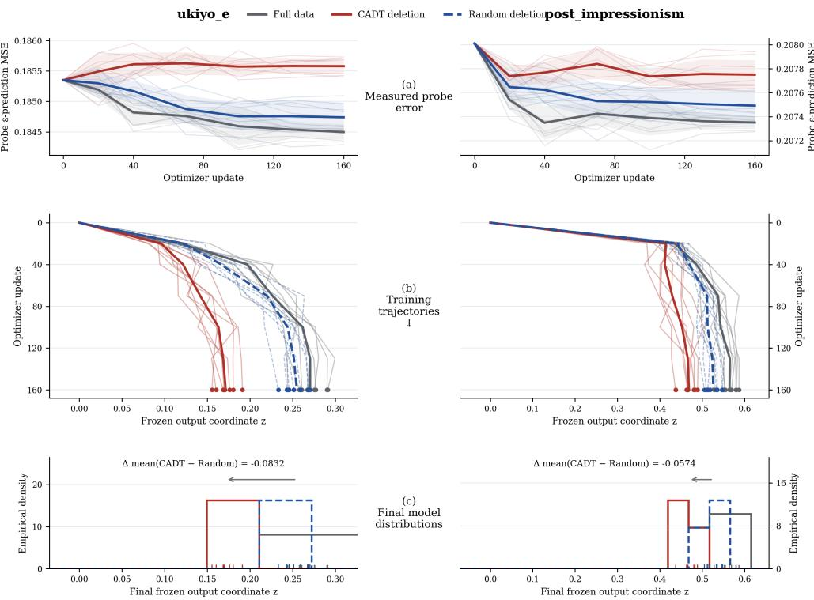  
Figure A7: CADT deletion changes distribution of retrained ArtBench2 models.

Figure A7 shows a consistent distinction between CADT-selected and random deletion. Removing highly attributed samples produces a larger and more coherent displacement of the optimization trajectory and shifts the distribution of converged models, whereas random deletion leads to smaller and less structured changes under the same deletion budget. This behavior is consistent with the role of the response trajectories in CADT: samples receiving high attribution scores provide coherent support for the target-dependent denoising responses, so removing them produces a systematic change in the learned model rather than only stochastic retraining variation.

Together, the two deletion experiments provide complementary evidence for the attribution mechanism of CADT. Style-level deletion shows that coherent training support produces factor-specific and temporally structured changes in denoising behavior, while attribution-guided deletion shows that the samples identified by CADT also induce measurable changes in retraining dynamics and the final model distribution. These results connect the internal response trajectories used for attribution to actual consequences of modifying the training data.

## J SIMILAR CONCEPT-TRAK SCORES WITH DIFFERENT DENOISING STRUCTURE

A scalar attribution score summarizes the overall contribution of a training example, but does not explicitly preserve how that contribution is distributed throughout denoising. We therefore ask whether training examples receiving nearly identical Concept-TRAK scores can nevertheless exhibit different temporal contribution patterns and internal denoising responses. This provides a direct test of whether the dynamic information modeled by CADT contains structure beyond a final scalar attribution value. We study this question on the CIFAR-100 fine class butterfly.

We compute Concept-TRAK (Park et al., 2026) using its training-example and concept-utility gradients. For each generated query, we select same-class training examples with closely matched positive attribution scores. Pair selection depends only on the final Concept-TRAK score and does not use temporal contributions, internal responses, or image appearance. This procedure produces 12 disjoint scalar-matched pairs.

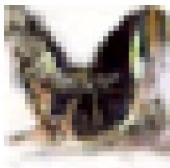  
(a)

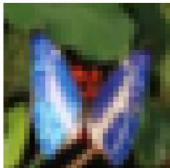  
(b)

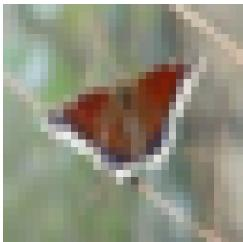  
(c)  
Figure A8: Scalar-matched examples for fine-class attribution on CIFAR-100. (a) A generated butterfly query. (b) and (c) Two butterfly training examples with nearly equal estimated Concept-TRAK scores. The pair is selected by score proximity under a fixed utility-time sample.

Figure A8 shows one representative scalar-matched pair. Although the two training examples receive nearly identical Concept-TRAK scores for the same query, equality of the final score does not imply that the underlying attribution evidence is accumulated in the same way. We next examine how these similar totals are formed over denoising time.

To expose the temporal structure hidden by the scalar aggregation, we decompose each Concept-TRAK score into query- and training-timestep contributions. Using the same projected-gradient comparison as Concept-TRAK, the scalar score can be written as

$$
s _ { q } ( i ) = \sum _ { t \in \mathcal { T } _ { q } } \sum _ { u \in \mathcal { T } _ { i } } C _ { i } ( t , u ) ,\tag{A31}
$$

where $C _ { i } ( t , u )$ denotes the contribution associated with query timestep t and training timestep u.

Figure A9 shows that nearly identical scalar scores can arise from substantially different allocations of contribution across query and training timesteps. Thus, the final sum preserves overall attribution strength but discards when that evidence is expressed during denoising.

Aggregating the contribution maps over training timesteps produces the query-time profiles in Figure A10. The two scalar-matched examples again exhibit different temporal profiles, making clear that the same total score can summarize distinct patterns of attribution support along the denoising process.

We next ask whether this temporal difference is also reflected in the actual generation dynamics rather than only in the decomposition of the attribution score.

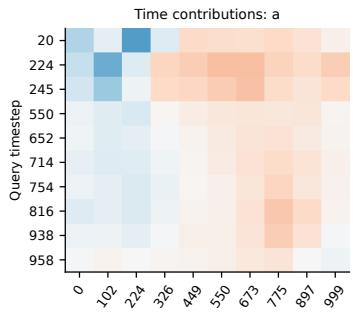  
Training-image timestep

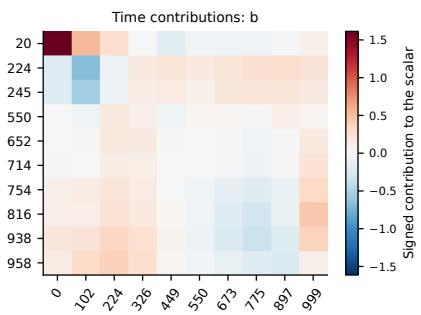  
Training-image timestep

Figure A9: Query-time by training-time contributions to the Concept-TRAK score. The two maps have nearly equal total sums but exhibit different temporal structure.  
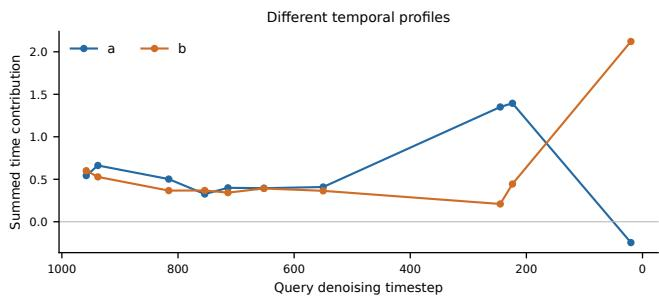  
Figure A10: Query-time attribution profiles obtained by aggregating the contribution maps over training timesteps. Similar scalar scores can arise from different distributions of attribution across denoising.

Figure A11 shows that the two examples follow different reconstruction progressions despite their similar final attribution scores. This suggests that scalar agreement does not imply identical behavior throughout the denoising trajectory.

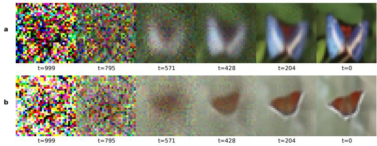  
Figure A11: Predicted clean images along the reconstruction trajectories of two scalar-matched training examples. The examples exhibit different denoising progressions despite their similar Concept-TRAK scores.

We further examine the model’s internal responses. At each noisy state, we contrast the fine-class and null conditions using the same input, obtaining a local condition-specific response. Recording these responses across U-Net blocks and timesteps yields a layer–time description of how the target concept is expressed internally.

Figure A12 reveals distinct internal response patterns across both network depth and denoising time. These differences are precisely the type of information retained by CADT: instead of collapsing the interaction into a single value, the factor-specific responses are organized along the denoising trajectory and their evolution is explicitly modeled.

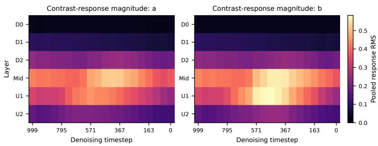  
Figure A12: Layer–time magnitudes of the fine-class versus null-conditioned response for the two scalar-matched examples. Responses are evaluated at identical noisy states within each example.

To verify that the observed differences are not explained only by stochastic noise, we compare normalized response distances between scalar-matched examples with within-example variation under different noise realizations. For the displayed pair, the between-example distance is 0.587, compared with 0.452 for the within-example reference. Across all 12 matched pairs, the corresponding median distances are 0.656 and 0.451, respectively. The larger between-example distances indicate that scalar-matched examples retain systematic differences in their internal denoising responses beyond ordinary noise-induced variation.

Overall, these results show that similar Concept-TRAK scores can summarize substantially different temporal contributions, reconstruction progressions, and internal response trajectories. The scalar score remains useful as an overall measure of attribution strength, but its aggregation removes information about when and how the training example interacts with the denoising process. This distinction motivates the dynamic representation in CADT, which retains the evolution of factorspecific responses rather than reducing them to a single scalar interaction.