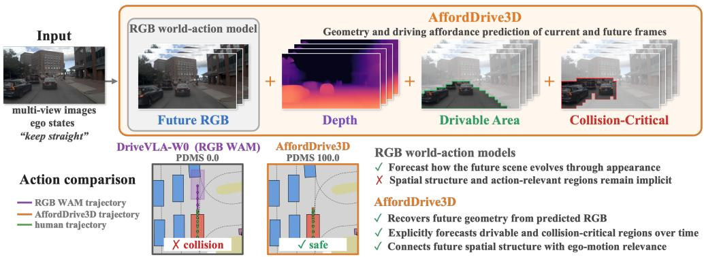
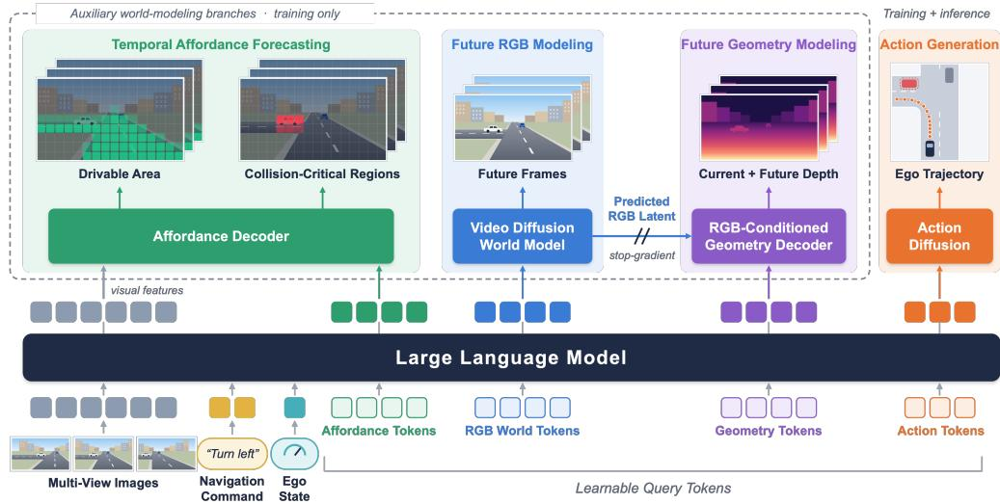
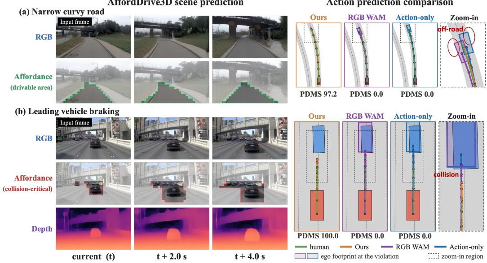
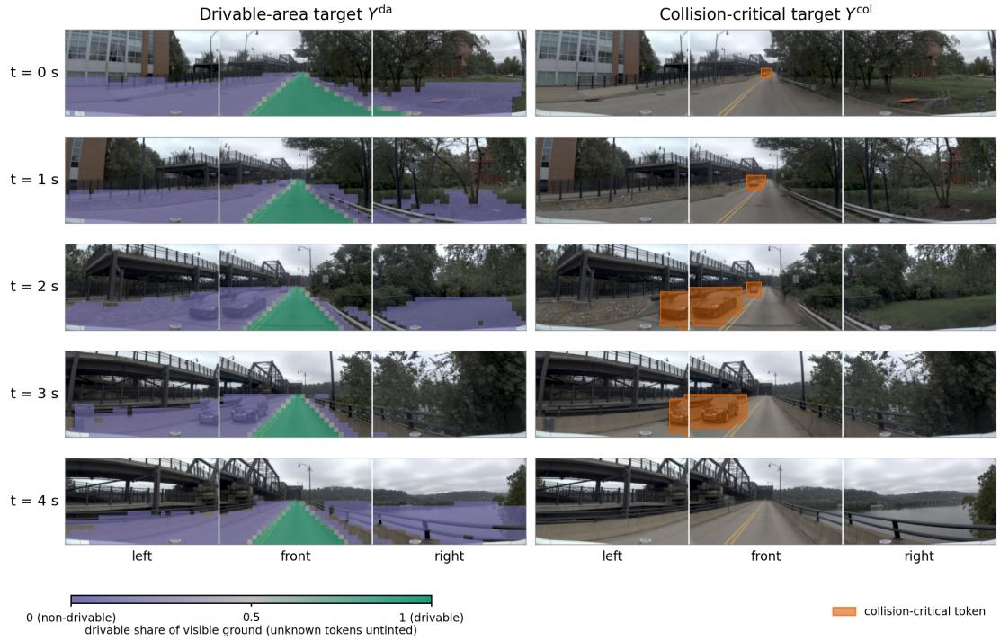
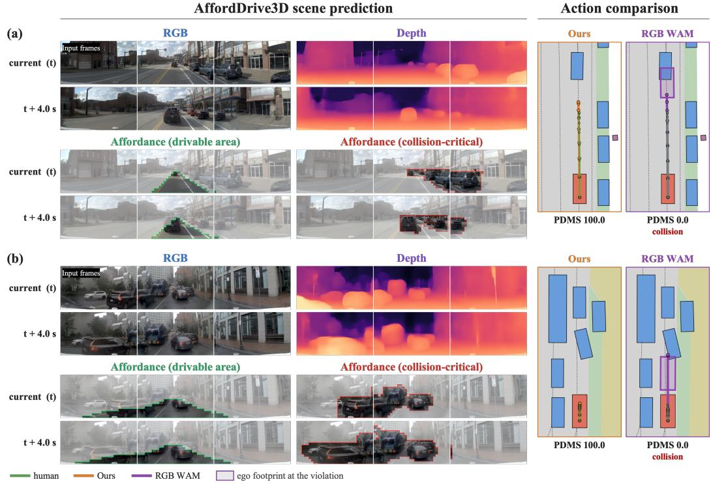
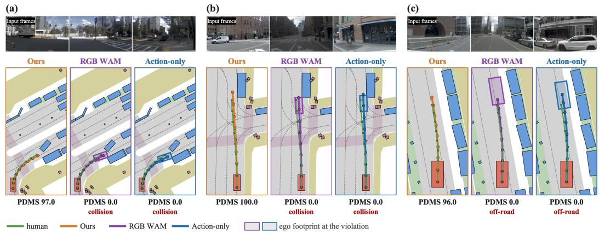

# AffordDrive3D: Affordance-Aware World-Action Modeling with Spatial Understanding

Tianhui Cai1∗‡ Xinglong Sun2∗ Chao Fang3 Zhenxin Li4 Rui Song1 Jose M. Alvarez2 Yunxiang Mao2 Jiaqi Ma1 Langechuan Liu2†

1University of California, Los Angeles 2NVIDIA 342dot by Hyundai 4Fudan University

## ABSTRACT

World-action models have recently improved autonomous driving by jointly learning future scene prediction and trajectory generation. Most existing approaches model the future primarily through RGB appearance, and recent works have begun to incorporate geometric prediction to improve spatial understanding. However, dense geometry describes the spatial layout of the entire scene without indicating which parts are most relevant to the ego vehicle’s action. For driving, the model must also identify and anticipate where it can safely move and which regions may pose collision risks. Jointly modeling action-relevant regions and future geometry can provide the policy with both driving-relevant cues and their corresponding spatial structure. We therefore propose AffordDrive3D, an affordanceand geometry-aware world-action model that jointly learns future action-relevant regions and spatial structure. In order to capture the scene semantics and driving context needed for driving affordance prediction, we build AffordDrive3D on a VLM backbone to forecast drivable areas and collision-critical regions that directly affect ego motion, while predicting future geometry from RGB worldmodel latents. On NAVSIM, AffordDrive3D achieves state-of-the-art performance with 91.3 PDMS and 89.9 EPDMS, demonstrating the effectiveness of jointly modeling future affordances and geometry for trajectory planning.

## 1 INTRODUCTION

Autonomous driving has increasingly shifted toward end-to-end models that directly map sensor observations to future trajectories, allowing scene representations and driving policies to be jointly optimized for motion planning (Hu et al., 2023; Jiang et al., 2023; Liao et al., 2025; Li et al., 2025d;c; Yao et al., 2026b; Li et al., 2026c). More recently, advances in vision-language models (VLMs) have demonstrated strong semantic understanding and reasoning capabilities for complex driving scenes. Vision-language-action (VLA) models further incorporate action prediction into this framework, enabling a unified model to interpret the driving scene, reason about its context, and generate future ego actions (Zhou et al., 2025; 2026a; Renz et al., 2025; Fu et al., 2025).

However, driving decisions depend not only on understanding the current observation, but also on anticipating how the environment may evolve. Motivated by this need, world-action models (WAMs) further couple action learning with future-scene prediction, allowing a shared representation to jointly model how the environment evolves and how the ego vehicle should act (Zhang et al., 2026a; Li et al., 2025b; Hong et al., 2026). One line of work extends VLA models with explicit world modeling, introducing future prediction as additional supervision for action learning (Li et al., 2026b; Wang et al., 2026a; Liu et al., 2026). Another line builds on pretrained video foundation models, adapting either learned temporal representations or generative video priors for joint future prediction and action learning (Shi et al., 2026; Zhao et al., 2026b; Wang et al., 2026d). By supervising the model with future observations in addition to expert trajectories, WAMs encourage the policy to capture scene dynamics that are relevant to future decision making.

Most existing WAMs model the future primarily through RGB appearance or visual features (Wang et al., 2024; Zhao et al., 2026a; Chen et al., 2025; Li et al., 2025a). While such prediction provides rich supervision for scene evolution, appearance alone does not explicitly represent the spatial structure needed for driving. Compared with RGB appearance, geometry provides a more direct representation of scene structure, explicitly capturing relative distance and spatial layout that must otherwise be inferred from visual appearance. Recent approaches have therefore begun to incorporate geometric prediction into future modeling, such as depth (Sheng et al., 2026; Zhang et al., 2026b), point cloud (Lu et al., 2026) and 3D occupancy (Yang et al., 2025; Cheng et al., 2026). However, geometric future modeling remains relatively underexplored in VLA-based driving frameworks (Sheng et al., 2026).

  
Figure 1: AffordDrive3D vs. RGB-based world-action models. Existing RGB-based world-action models primarily capture future scene evolution through appearance prediction. AffordDrive3D additionally predicts future geometry to model how spatial structure evolves, alongside driving affordances that identify spatial regions critical to the ego vehicle’s motion. Together, these predictions align future world state modeling more closely with planning objectives and improve trajectory prediction.

Geometric future modeling provides explicit spatial structure that is missing from appearance-based prediction, yet a key challenge remains: how to use future spatial information to improve policy learning and action prediction. In autonomous driving, this requires identifying which regions of the future scene are relevant to ego motion, such as drivable areas and regions that may pose collision risks. Without capturing their relevance to action, future world state prediction remains insufficiently aligned with the planning objective.

Therefore, we propose AffordDrive3D, an affordance- and geometry-aware world-action model that jointly learns future action-relevant regions and spatial structure as shown in Fig. 1. For geometric modeling, we condition depth prediction on the future RGB latents produced by the world model. Because these latents already encode how the scene changes over time, the geometry branch does not need to independently predict future dynamics and can instead focus on recovering the corresponding 3D structure, while keeping the RGB and geometric predictions grounded in the same future scene. Beyond spatial structure, we further model which regions of the scene are important for driving. We refer to these action-relevant regions as driving affordances, including drivable areas and collision-critical regions, and introduce temporal affordance forecasting to predict them at both current and future frames. To provide the contextual scene understanding needed for affordance prediction, we adopt a VLM backbone and leverage its strong semantic understanding and reasoning capabilities. We jointly learn affordance prediction, future RGB and depth modeling, and trajectory generation through a shared representation. Compared with ExploreVLA (Sheng et al., 2026), which also incorporates future depth prediction, AffordDrive3D improves PDMS by 0.9 points and EPDMS by 1.1 points on the NAVSIM benchmark (Dauner et al., 2024), achieving new state-of-the-art (SOTA) scores of 91.3 PDMS and 89.9 EPDMS.

Our main contributions are:

• We propose AffordDrive3D, an affordance- and geometry-aware WAM built on a VLA framework, which extends future world modeling beyond visual appearance to better align it with the planning objective.

• We jointly model future geometry and temporal driving affordances: RGB-conditioned future depth captures the spatial structure of the predicted scene, while affordance forecasting identifies drivable areas and collision-critical regions, connecting future spatial information to ego motion.

• We achieve new SOTA performance with 91.3 PDMS and 89.9 EPDMS on the NAVSIM benchmark. Ablation studies further demonstrate the effectiveness of temporal affordance forecasting and future geometry modeling for trajectory planning.

## 2 RELATED WORK

## 2.1 VLA AND WAM FOR AUTONOMOUS DRIVING

VLMs have increasingly been adopted for autonomous driving to integrate perception, reasoning, and decision-making. DriveLM (Sima et al., 2024) introduces graph-structured visual question answering, while DriveVLM (Tian et al., 2024) integrates multimodal reasoning with planning. Recent VLA frameworks, including AutoVLA (Zhou et al., 2025), HybridDriveVLA (Bassole et al., 2026), and ColaVLA (Peng et al., 2026), further connect multimodal reasoning with trajectory generation through action tokenization or visual or latent reasoning. However, reasoning over observed scenes alone does not explicitly model how the environment evolves over time.

World models address this limitation by predicting future observations or structured scene states. Drive-WM (Wang et al., 2024) explores action-conditioned video generation, while Drive-OccWorld (Yang et al., 2025) predicts future occupancy and flow. More recently, WAMs jointly model future dynamics and actions: DriveWAM (Shi et al., 2026) adapts video generative priors to joint video-action generation, WA-JEPA (Wang et al., 2026d) learns latent dynamics with ego trajectories, and SimWAM (Zhao et al., 2026b) as well as SV-WAM (Wang et al., 2026b) use video prediction as training-time supervision. These approaches improve predictive action learning, but often rely on RGB, latent, or generic geometric dynamics without explicitly structuring future states around action-relevant spatial constraints.

## 2.2 GEOMETRY-AWARE DRIVING POLICIES

Explicit geometry provides spatial information complementary to images. Drive-OccWorld (Yang et al., 2025) models future occupancy and flow, GenieDrive (Yang et al., 2026) uses 4D occupancy to guide video generation, and SpaceDrive (Li et al., 2026a) incorporates depth-derived 3D information into VLM-based driving. ExploreVLA (Sheng et al., 2026) predicts future RGB and depth in parallel for trajectory planning.

Recent work also explores geometric dynamics directly within world-action modeling. In particular, GeoWAM (Lu et al., 2026) directly forecasts future point-cloud geometry for action learning. In contrast, our model predicts future depth conditioned on RGB latents from the diffusion world model and jointly learns RGB, depth, affordance, and trajectory objectives, coupling anticipated appearance with geometric structure. Still, geometry alone does not explicitly indicate which regions are drivable or collision-critical for ego motion.

## 2.3 AFFORDANCE-AWARE PLANNING

Affordances provide a task-relevant abstraction between perception and action by emphasizing regions and interactions that directly influence control. In robotics, VLAs use task-conditioned or structured affordances to bridge perception and action (Wang et al., 2026c; Yu et al., 2026). Affordance-aware learning remains less explored in autonomous driving. Recent methods incorporate structured future priors or drivable-area constraints for planning (Zeng et al., 2026; Wang et al., 2026b). Rather than relying on future visual reasoning, structured scene priors, or trajectory-level constraints, we explicitly forecast current and future drivable and collision-critical regions, which provides temporally structured supervision for how action-relevant space evolves over time.

  
Figure 2: Framework of AffordDrive3D. Multi-view images, the navigation command, and the ego state are encoded by a shared VLM backbone together with learnable affordance, RGB world, geometry, and action tokens. The auxiliary branches (dashed box) forecast driving affordances, future RGB, and RGB-conditioned depth to shape the shared representation during training, while only the action branch is used at inference.

## 3 METHOD

## 3.1 OVERVIEW

As shown in Fig. 2, given the current multi-view observations $\mathcal { T } _ { t } = \{ I _ { t } ^ { c } \} _ { c = 1 } ^ { C }$ , a navigation command $^ { g , }$ and the ego state $s ,$ AffordDrive3D predicts a future ego trajectory $\hat { \tau } _ { t : t + K }$ while jointly modeling driving affordances, scene appearance, and geometry across the current and future scene. We use a shared causal VLM backbone to encode the inputs together with four groups of learnable tokens: affordance tokens $\mathbf { Q } ^ { \mathrm { { a f f } } }$ , RGB world tokens $\mathbf { Q } ^ { \mathrm { r g \hat { b } } }$ , geometry tokens $\mathbf { Q } ^ { \mathrm { g e o } }$ , and action tokens $\mathbf { Q } ^ { \mathrm { a c t } }$ $\mathbf { Q } ^ { \mathrm { { a f f } } }$ model current and future drivable and collision-critical regions, $\mathbf { Q } ^ { \mathrm { r g b } }$ condition the diffusion world model to forecast future visual appearance, and $\mathbf { Q } ^ { \mathrm { g e o } }$ predict current and future scene geometry with guidance from the predicted RGB latent. Finally, the action tokens $\mathbf { Q } ^ { \mathrm { a c t } }$ condition an action diffusion model to generate the future ego trajectory.

All components are optimized jointly through the shared backbone, allowing affordance forecasting, visual prediction, and geometry modeling to shape the representation used for planning. During inference, only the action branch is required to generate the ego trajectory. The auxiliary affordance, RGB, and depth outputs do not need to be decoded.

## 3.2 RGB-CONDITIONED FUTURE GEOMETRY MODELING

Future RGB modeling. The RGB world tokens $\mathbf { Q } ^ { \mathrm { r g b } }$ produce hidden states ${ \bf H } ^ { \mathrm { r g b } }$ after the shared causal backbone, which condition a video diffusion model to predict future scene appearance in latent space. We encode the current and future RGB frames using a video VAE, obtaining a sequence of $T$ temporal latent groups ${ \bf Z } ^ { \mathrm { r g b } } = [ { \bf Z } _ { 0 } ^ { \mathrm { r g b } } , \ldots , { \bf Z } _ { T - 1 } ^ { \mathrm { r g b } } ]$ after temporal compression, where ${ \bf Z } _ { 0 } ^ { \mathrm { r g b } }$ corresponds to the current-frame anchor and ${ \bf Z } _ { 1 : T - 1 } ^ { \mathrm { r g b } }$ represents the future sequence.

Following flow-matching, we perturb the full video latent, including the anchor group, as

$$
{ \bf Z } _ { \sigma } ^ { \mathrm { r g b } } = ( 1 - \sigma ) { \bf Z } ^ { \mathrm { r g b } } + \sigma \epsilon ,\tag{1}
$$

where $\epsilon$ is sampled noise and $\sigma$ denotes the noise level. The video diffusion model is set up as an inpainting model, where the current visual observation is additionally encoded as a conditioning signal $\mathbf { C } _ { 0 }$ . The model predicts the velocity field as

$$
{ \bf v } _ { \theta } = { \mathcal W } _ { \mathrm { r g b } } \left( { \bf Z } _ { \sigma } ^ { \mathrm { r g b } } , \sigma ; { \bf H } ^ { \mathrm { r g b } } , { \bf C } _ { 0 } \right) ,\tag{2}
$$

where ${ \bf H } ^ { \mathrm { r g b } }$ provides the VLM context for future generation, while $\mathbf { C } _ { 0 }$ provides the observed current-frame appearance. The RGB world model is trained with the flow-matching objective

$$
\mathcal { L } _ { \mathrm { r g b } } = \left. \mathbf { v } _ { \theta } - \left( \boldsymbol { \epsilon } - \mathbf { Z } ^ { \mathrm { r g b } } \right) \right. _ { 2 } ^ { 2 } .\tag{3}
$$

From the predicted velocity, we recover the predicted clean RGB latent as

$$
\hat { \mathbf { Z } } ^ { \mathrm { r g b } } = \mathbf { Z } _ { \sigma } ^ { \mathrm { r g b } } - \sigma \mathbf { v } _ { \theta } ,\tag{4}
$$

which is subsequently used as future-scene context for geometry prediction.

RGB-conditioned geometry prediction. The RGB world model already predicts how the visual scene evolves over future frames. We use the denoised RGB latent $\hat { \mathbf { Z } } ^ { \mathrm { r g b } }$ as future-scene context for geometry prediction (Liang et al., 2025), allowing the geometry branch to focus on recovering the 3D structure associated with the predicted visual evolution.

We first map the geometry-token hidden states $\mathbf { H } ^ { \mathrm { g e o } }$ to a coarse temporal-spatial feature grid $\mathbf { G } ^ { \mathrm { g e o } } \in$ $\mathbb { R } ^ { \tilde { T } _ { g } \times H _ { g } \times W _ { g } \times D }$ , where $\dot { T } _ { g } , H _ { g } ,$ and $W _ { g }$ denote the temporal, height, and width dimensions of the grid, respectively, with $T _ { g } \mathsf { \tilde { H } } _ { g } W _ { g } = \mathsf { \tilde { | Q } ^ { g e o } | }$ . We then use trilinear interpolation to upsample the coarse geometry feature grid $\bf G ^ { \mathrm { { g e o } } }$ to the same temporal-spatial resolution $( T , H , \dot { W } )$ as the predicted RGB latent $\hat { \mathbf { Z } } ^ { \mathrm { r g b } }$ , yielding $\tilde { \mathbf { G } } ^ { \mathrm { g e o } } \in \mathbb { R } ^ { T \times H \times W \times D }$

To condition geometry prediction on the predicted future scene, we apply a 3D convolution $\phi _ { \mathrm { r g b } }$ to $\hat { \mathbf { Z } } ^ { \mathrm { r g b } }$ to map its feature channels to dimension $D$ while preserving its temporal-spatial resolution. The resulting RGB features are fused with $\tilde { \bf G } ^ { \mathrm { g e o } }$ at corresponding temporal-spatial locations:

$$
\mathbf { F } ^ { \mathrm { g e o } } = \mathcal { R } _ { \mathrm { 3 D } } \left( \phi _ { \mathrm { f u s e } } \left( \left[ \tilde { \mathbf { G } } ^ { \mathrm { g e o } } ; \phi _ { \mathrm { r g b } } \left( \mathrm { s g } \left( \hat { \mathbf { Z } } ^ { \mathrm { r g b } } \right) \right) \right] \right) \right) ,\tag{5}
$$

where $\phi _ { \mathrm { f u s e } }$ denotes a $1 \times 1 \times 1 \ : 3 \mathrm { D }$ convolution that fuses RGB and geometry features, and $\mathcal { R } _ { \mathrm { 3 D } }$ denotes a stack of 3D residual blocks for further feature refinement. The stop-gradient operator $\operatorname { s g } ( \cdot )$ prevents the geometry loss from back-propagating through the RGB prediction branch.

The fused representation $\mathbf { F } ^ { \mathrm { g e o } }$ retains the anchor–future temporal organization of the RGB latent space. Its anchor component $\mathbf { F } _ { 0 } ^ { \mathrm { g e o } }$ is formed with RGB context grounded in the observed current frame, whereas the future components $\mathbf { F } _ { 1 : T - 1 } ^ { \mathrm { g e o } }$ are formed with RGB context predicted by the RGB diffusion model. This yields two distinct geometry prediction settings: recovering current geometry from observation-grounded RGB context and predicting future geometry from predicted RGB context. We therefore use separate decoders for the anchor and future depth latents:

$$
\begin{array} { r } { \hat { \mathbf { Z } } _ { 0 } ^ { \mathrm { d e p } } = \mathcal { D } _ { \mathrm { a n c } } \left( \mathbf { F } _ { 0 } ^ { \mathrm { g e o } } \right) , \qquad \hat { \mathbf { Z } } _ { 1 : T - 1 } ^ { \mathrm { d e p } } = \mathcal { D } _ { \mathrm { f u t } } \left( \mathbf { F } _ { 1 : T - 1 } ^ { \mathrm { g e o } } \right) . } \end{array}\tag{6}
$$

We encode the pseudo-ground-truth depth from Depth Anything 3 (Lin et al., 2025) with the video VAE to obtain the target depth latent $\mathbf { Z } ^ { \mathrm { d e p } }$ , and supervise the predicted depth latent $\hat { \mathbf { Z } } ^ { \mathrm { d e p } }$ with an $\mathcal { L } _ { 1 }$ loss:

$$
\begin{array} { r } { \mathcal { L } _ { \mathrm { g e o } } = \lambda _ { \mathrm { a n c } } \mathcal { L } _ { 1 } \left( \hat { \mathbf { Z } } _ { 0 } ^ { \mathrm { d e p } } , \mathbf { Z } _ { 0 } ^ { \mathrm { d e p } } \right) + \mathcal { L } _ { 1 } \left( \hat { \mathbf { Z } } _ { 1 : T - 1 } ^ { \mathrm { d e p } } , \mathbf { Z } _ { 1 : T - 1 } ^ { \mathrm { d e p } } \right) , } \end{array}\tag{7}
$$

where $\lambda _ { \mathrm { a n c } }$ controls the relative weight of the anchor-depth loss.

## 3.3 TEMPORAL AFFORDANCE FORECASTING

We index the affordance tokens by prediction horizon and camera view, such that $\mathbf { Q } ^ { \mathrm { a f f } } = \{ \mathbf { q } _ { k , c } ^ { \mathrm { a f f } } \}$ where $k \in \{ 0 , \ldots , K \}$ denotes the future timestamp for prediction and $c \in \{ 1 , \ldots , C \}$ denotes the camera view. After processing by the shared causal backbone, these tokens produce the corresponding hidden states $\mathbf { H } ^ { \mathrm { a f f } } = \{ \mathbf { h } _ { k , c } ^ { \mathrm { a f f } } \}$

Dense affordance prediction. Each affordance state $\mathbf { h } _ { k , c } ^ { \mathrm { a f f } }$ is decoded into two spatial predictions: a drivable-area map $\hat { \mathbf Y } _ { k , c } ^ { \mathrm { d a } }$ and a collision-critical map $\hat { \textbf { Y } } _ { k , c } ^ { \mathrm { c o l } }$ . Both maps are defined over the visualtoken grid of camera $c ,$ so each map value corresponds to one local patch of the image.

Let $\mathbf { v } _ { c , n }$ denote the hidden state of the $n \cdot$ -th visual token from camera $c .$ For each affordance type m $\in \{ \mathrm { d a } , \mathrm { c o l } \}$ , we compute

$$
z _ { k , c , n } ^ { m } = \frac { \Bigl \langle f ^ { m } ( \mathbf { h } _ { k , c } ^ { \mathrm { a f f } } ) , g ^ { m } ( \mathbf { v } _ { c , n } ) \Bigr \rangle } { \sqrt { d } } + \mathrm { b i a s } ^ { m } ,\tag{8}
$$

where $f ^ { m }$ and $g ^ { m }$ are learnable projections that map the affordance and visual features into a $d -$ dimensional embedding space. The predicted affordance probability at each visual-token location is then given by $\hat { Y } _ { k , c , n } ^ { m } = \mathrm { s i g m o i d } ( z _ { k , c , n } ^ { m } )$ . The visual features provide current-scene context, while the frame-specific affordance states determine how the affordance predictions evolve over time.

Affordance supervision. We construct drivable-area and collision-critical targets that are directly relevant to ego planning, focusing on reachable road regions and objects that may collide with the ego vehicle. The drivable-area target $Y _ { k , c , n } ^ { \mathrm { d a } } \in [ 0 , 1 ]$ measures the fraction of verifiable ground within a visual-token region that belongs to the road surface reachable by the ego vehicle, with intermediate values capturing road boundaries. To construct the collision-critical target $Y _ { k , c , n } ^ { \mathrm { c o l } } \in \{ 0 , 1 \}$ , we select plausible ego trajectories from a predefined trajectory set (Li et al., 2024) and roll them out in the scene. If any selected trajectory results in a collision with an agent or object, the visual-token region containing the collided agent or object is marked as collision-critical. We provide details of the label construction in Appendix $\mathbf { A } .$

For drivable-area prediction, we use weighted soft binary cross-entropy,

$$
\begin{array} { r } { \mathcal { L } _ { \mathrm { d a } } ^ { k } = \mathrm { W B C E } \left( \mathbf { z } _ { k } ^ { \mathrm { d a } } , \mathbf { Y } _ { k } ^ { \mathrm { d a } } ; \mathbf { w } _ { k } ^ { \mathrm { d a } } \right) , } \end{array}\tag{9}
$$

where $\mathbf { w } _ { k } ^ { \mathrm { d a } }$ down-weights tokens with limited ground evidence, such as those dominated by sky or buildings, and gives higher weight to tokens that contain drivable-area boundaries. In this way, the loss focuses more on reliable ground regions while preserving the fine-grained boundary information encoded by the soft targets.

For collision-critical prediction, we combine class-normalized BCE to address the class imbalance between positive and negative tokens with Dice loss to encourage spatial overlap between the predicted and ground-truth critical regions,

$$
\begin{array} { r } { \mathscr { L } _ { \mathrm { c o l } } ^ { k } = \mathrm { B C E } \left( \mathbf { z } _ { k } ^ { \mathrm { c o l } } , \mathbf { Y } _ { k } ^ { \mathrm { c o l } } \right) + \lambda _ { \mathrm { d i c e } } \mathrm { D i c e } \left( \hat { \mathbf { Y } } _ { k } ^ { \mathrm { c o l } } , \mathbf { Y } _ { k } ^ { \mathrm { c o l } } \right) . } \end{array}\tag{10}
$$

Similar to geometry prediction, we separate the affordance of the observed current frame from that of the forecast future frames and aggregate the losses as

$$
\mathcal { L } _ { \mathrm { a f f } } = \lambda _ { \mathrm { a n c } } \left( \mathcal { L } _ { \mathrm { d a } } ^ { 0 } + \mathcal { L } _ { \mathrm { c o l } } ^ { 0 } \right) + \frac { 1 } { K } \sum _ { k = 1 } ^ { K } \left( \mathcal { L } _ { \mathrm { d a } } ^ { k } + \mathcal { L } _ { \mathrm { c o l } } ^ { k } \right) .\tag{11}
$$

## 3.4 ACTION GENERATION AND JOINT LEARNING

We use the hidden states of the action tokens $\mathbf { H } ^ { \mathrm { a c t } }$ to condition a DiT for future trajectory generation. The DiT is trained with a flow-matching objective $\mathcal { L } _ { \mathrm { a c t } }$ to predict the velocity field between Gaussian noise and the ground-truth trajectory.

To encourage the RGB and geometry tokens to preserve action-relevant information while modeling future appearance and spatial structure, we additionally apply trajectory supervision to both the RGB and geometry tokens. Specifically, ${ \bf H } ^ { \mathrm { r g b } }$ and $\mathbf { H } ^ { \mathrm { g e o } }$ are separately processed by lightweight GRUbased trajectory heads to predict the future ego trajectory. We supervise these predictions with the ground-truth trajectory using an $\mathcal { L } _ { 1 }$ loss, denoted as $\mathcal { L } _ { \mathrm { r g b - a c t } }$ and $\mathcal { L } _ { \mathrm { g e o - a c t } }$ , respectively.

The complete framework is trained end-to-end with

$$
\mathcal { L } = \lambda _ { \mathrm { a f f } } \mathcal { L } _ { \mathrm { a f f } } + \lambda _ { \mathrm { r g b } } \mathcal { L } _ { \mathrm { r g b } } + \lambda _ { \mathrm { g e o } } \mathcal { L } _ { \mathrm { g e o } } + \lambda _ { \mathrm { a c t } } \mathcal { L } _ { \mathrm { a c t } } + \lambda _ { \mathrm { r g b - a c t } } \mathcal { L } _ { \mathrm { r g b - a c t } } + \lambda _ { \mathrm { g e o - a c t } } \mathcal { L } _ { \mathrm { g e o - a c t } } ,\tag{12}
$$

where λ denotes the loss weights.

## 4 EXPERIMENTS

## 4.1 EXPERIMENTAL SETUP

Dataset and Metrics. We train and evaluate AffordDrive3D on the NAVSIM benchmark (Dauner et al., 2024), which is built on OpenScene and provides approximately 103K training samples in navtrain and 12K evaluation samples in navtest. We report both the PDM Score (PDMS) from NAVSIM v1 and the Extended PDM Score (EPDMS) from NAVSIM v2. NAVSIM v1 PDMS combines No At-Fault Collisions (NC), Drivable Area Compliance (DAC), Ego Progress (EP), Time-to-Collision (TTC), and Comfort (Comf.). NAVSIM v2 EPDMS further includes Driving Direction Compliance (DDC), Traffic Light Compliance (TLC), Lane Keeping (LK), History Comfort (HC), and Extended Comfort (EC). We follow the official NAVSIM evaluation protocol for both metrics.

For temporal affordance prediction, we additionally report average precision (AP). For drivable-area prediction, regions with a ground-truth drivable ratio greater than 0.5 are treated as drivable. Further details on the AP computation are provided in Appendix D.

Training and Implementation Details. We use Qwen3-VL-2B (Bai et al., 2025) as the VLM backbone and instantiate the RGB diffusion world model with Wan2.1-Fun-1.3B-InP (Wan et al., 2025). We use C = 3 camera views and set $K = 8 \mathrm { a t } 2 \mathrm { H z } ,$ corresponding to a 4 s prediction horizon and $T = 3$ latent groups after VAE encoding. We use $| { \bf Q } ^ { \mathrm { a f f } } | = \bar { C } ( K + \bar { 1 } ) = 2 7$ affordance tokens, $| { \bf Q } ^ { \mathrm { r g b } } | = 6 4$ RGB world tokens, $| \mathbf { Q } ^ { \mathrm { g e o } } | = \bar { 6 } 4$ geometry tokens, and $| \mathbf { Q } ^ { \mathrm { { a c t } } } | = 8$ action tokens. We set $\lambda _ { \mathrm { a c t } } = \lambda _ { \mathrm { r g b } } = \lambda _ { \mathrm { r g b - a c t } } = \lambda _ { \mathrm { g e o - a c t } } = 1 . 0 ,$ , and $\lambda _ { \mathrm { g e o } } = \lambda _ { \mathrm { a f f } } = 0 . 1$ , with $\lambda _ { \mathrm { a n c } } = 1 . 0$ for both the geometry and affordance losses and $\lambda _ { \mathrm { d i c e } } = 1 . 0$

For supervised fine-tuning (SFT), we optimize the model for 14,140 steps with a global batch size of 256 using AdamW, a peak learning rate of $5 \times 1 0 ^ { - 5 }$ , 404 warmup steps, and cosine decay. Following SFT, we further optimize the action diffusion model through reinforcement learning (RL) with GRPO (Shao et al., 2024) for 4,500 steps with a learning rate of $\mathrm { { \bar { 3 } } \times 1 0 ^ { - 6 } }$ after 50 warmup steps, while keeping the rest of the model frozen. Detailed hyperparameters and training configurations for both SFT and RL, including the RL reward and rollout settings, are provided in Appendix B.

## 4.2 MAIN RESULTS

NAVSIM v1 Results. We evaluate AffordDrive3D on the NAVSIM v1 benchmark against endto-end, VLA and WAM baselines (Yuan et al., 2024; Li et al., 2024; Liao et al., 2025; Zhou et al., 2025; Xiong et al., 2026; Li et al., 2025b; Zhang et al., 2026a; Chen et al., 2025; Zhang et al., 2025; Zhao et al., 2026a; Li et al., 2026b; Zhou et al., 2026b; Zeng et al., 2026; Sheng et al., 2026; Cheng et al., 2026). In Table 1, AffordDrive3D achieves a PDMS of 91.3, outperforming all baselines in the comparison. In particular, it improves over ExploreVLA (Sheng et al., 2026), which also leverages RGB and depth supervision, by 0.9 PDMS. AffordDrive3D also achieves a strong DAC score of 99.0, together with NC and TTC scores of 98.6 and 96.3, while maintaining an EP score of 84.7. These results suggest that jointly modeling future driving affordances and geometric structure provides useful action-relevant spatial supervision for trajectory planning.

NAVSIM v2 Results. We further compare AffordDrive3D with baseline methods (Zou et al., 2025; Yao et al., 2026a; Li et al., 2026b; Zhou et al., 2026b; Sheng et al., 2026) on NAVSIM v2, which extends the evaluation to a broader set of driving metrics. As shown in Table 2, Afford-Drive3D achieves the highest EPDMS of 89.9, improving over ExploreVLA (Sheng et al., 2026) and DriveDreamer-Policy (Zhou et al., 2026b) by 1.1 and 1.2 points, respectively. These results further demonstrate the strong planning performance of AffordDrive3D and the effectiveness of jointly modeling future driving affordances and geometric structure.

Qualitative Results. Figure 3 visualizes the current and future RGB, affordance, and depth predictions of AffordDrive3D, together with trajectory predictions from an action-only baseline and the RGB-based world-action model DriveVLA-W0 (Li et al., 2026b). In the narrow curvy-road example in Fig. 3(a), both baselines deviate from the drivable region and go off-road, whereas AffordDrive3D remains near the lane center. The predicted drivable-area maps consistently capture the narrow drivable road structure over time, illustrating how explicit affordance forecasting can provide important cues about where the ego vehicle can safely move. In the leading-vehicle braking example in Fig. 3(b), the two baselines collide with the vehicle ahead, while AffordDrive3D maintains a safe distance. Its collision-critical prediction correctly highlights the leading vehicle across future horizons, while the depth prediction, consistent with the predicted RGB, captures the leading vehicle’s relative distance and surrounding scene geometry. These examples illustrate how jointly modeling driving affordances and geometry can provide action-relevant spatial information for challenging planning scenarios. Additional qualitative comparisons and visualizations are provided in Appendix C.

Table 1: Comparison with baselines on the NAVSIM v1 benchmark. Best results are bolded.
<table><tr><td>Method</td><td>World Sup.</td><td>NC↑</td><td>DAC ↑</td><td>TTC ↑</td><td>Comf. ↑</td><td>EP↑</td><td>PDMS ↑</td></tr><tr><td>DRAMA</td><td></td><td>98.0</td><td>93.1</td><td>94.8</td><td>100.0</td><td>80.1</td><td>85.5</td></tr><tr><td>Hydra-MDP</td><td></td><td>98.3</td><td>96.0</td><td>94.6</td><td>100.0</td><td>78.7</td><td>86.5</td></tr><tr><td>DiffusionDrive</td><td></td><td>98.2</td><td>96.2</td><td>94.7</td><td>100.0</td><td>82.2</td><td>88.1</td></tr><tr><td>AutoVLA</td><td>-</td><td>98.4</td><td>95.6</td><td>98.0</td><td>99.9</td><td>81.9</td><td>89.1</td></tr><tr><td>ReCogDrive</td><td></td><td>97.9</td><td>97.3</td><td>94.9</td><td>100.0</td><td>87.3</td><td>90.8</td></tr><tr><td>WoTE</td><td>BEV</td><td>98.5</td><td>96.8</td><td>94.9</td><td>99.9</td><td>81.9</td><td>88.3</td></tr><tr><td>ResWorld</td><td>BEV</td><td>98.9</td><td>96.5</td><td>95.6</td><td>100.0</td><td>83.1</td><td>89.0</td></tr><tr><td>DrivingGPT</td><td>RGB</td><td>98.9</td><td>90.7</td><td>94.9</td><td>95.6</td><td>79.7</td><td>82.4</td></tr><tr><td>Epona</td><td>RGB</td><td>97.9</td><td>95.1</td><td>93.8</td><td>99.9</td><td>80.4</td><td>86.2</td></tr><tr><td>PWM</td><td>RGB</td><td>98.6</td><td>95.9</td><td>95.4</td><td>100.0</td><td>81.8</td><td>88.1</td></tr><tr><td>DriveVLA-W0</td><td>RGB</td><td>98.7</td><td>99.1</td><td>95.3</td><td>99.3</td><td>83.3</td><td>90.2</td></tr><tr><td>DriveDreamer-Policy</td><td>RGB + Current Depth</td><td>98.4</td><td>97.1</td><td>95.1</td><td>100.0</td><td>83.5</td><td>89.2</td></tr><tr><td>FSDrive</td><td>RGB + CoT</td><td>98.2</td><td>93.8</td><td>93.3</td><td>99.9</td><td>80.1</td><td>85.1</td></tr><tr><td>ExploreVLA</td><td>RGB + Depth</td><td>98.8</td><td>98.4</td><td>96.5</td><td>99.9</td><td>83.5</td><td>90.4</td></tr><tr><td>OWMDrive</td><td>3D Occupancy</td><td>98.2</td><td>97.6</td><td>94.6</td><td>99.8</td><td>87.3</td><td>90.8</td></tr><tr><td>Ours</td><td>Aff + RGB + Depth</td><td>98.6</td><td>99.0</td><td>96.3</td><td>100.0</td><td>84.7</td><td>91.3</td></tr></table>

Table 2: Comparison with baselines on NAVSIM v2 with extended metrics. Best results are bolded.
<table><tr><td>Model</td><td>NC↑</td><td>DAC ↑</td><td>DDC↑</td><td>TLC↑</td><td>EP↑</td><td>TTC↑</td><td>LK↑</td><td>HC↑</td><td>EC↑</td><td>EPDMS ↑</td></tr><tr><td>DiffusionDriveV2</td><td>97.7</td><td>96.6</td><td>99.2</td><td>99.8</td><td>88.9</td><td>97.2</td><td>96.0</td><td>97.8</td><td>91.0</td><td>85.5</td></tr><tr><td>DriveSuprim</td><td>98.4</td><td>98.6</td><td>99.6</td><td>99.8</td><td>90.5</td><td>97.8</td><td>97.0</td><td>98.3</td><td>78.6</td><td>87.1</td></tr><tr><td>DriveVLA-W0</td><td>98.5</td><td>99.1</td><td>98.0</td><td>99.7</td><td>86.4</td><td>98.1</td><td>93.2</td><td>97.9</td><td>58.9</td><td>86.1</td></tr><tr><td>DriveDreamer-Policy</td><td>98.4</td><td>97.1</td><td>99.5</td><td>99.9</td><td>87.9</td><td>97.7</td><td>97.6</td><td>98.3</td><td>79.4</td><td>88.7</td></tr><tr><td>ExploreVLA</td><td>98.8</td><td>96.2</td><td>99.6</td><td>99.8</td><td>87.1</td><td>98.2</td><td>97.8</td><td>98.3</td><td>86.8</td><td>88.8</td></tr><tr><td>Ours</td><td>98.4</td><td>98.2</td><td>99.7</td><td>99.9</td><td>87.9</td><td>97.8</td><td>97.4</td><td>98.3</td><td>80.4</td><td>89.9</td></tr></table>

## 4.3 ABLATION STUDIES

Ablation of Affordance and World Modeling. We perform an ablation study to understand how affordance, RGB, and geometry modeling affect planning performance in Table 3. Since our depth prediction is conditioned on the denoised RGB latents, the geometry-only setting still retains RGB prediction to provide the required latent input. However, we stop the RGB diffusion gradients from propagating back to the shared backbone, so the RGB branch only provides the latent context required by the geometry branch and does not directly affect the shared representation used for action prediction. Compared to the action-only baseline at 88.1 PDMS, adding affordance, RGB, or geometry improves performance to 89.2, 88.9, and 89.1 PDMS, respectively. The full model achieves the best performance of 89.6 PDMS, with the highest NC, DAC, and EP, demonstrating the effectiveness of jointly modeling RGB, geometry, and affordance.

Temporal Affordance Evaluation. We evaluate the predicted driving affordances across different future horizons in Table 4. We report AP averaged over the near-term prediction horizons (0.5, 1.0, 1.5, and 2.0 s) and the longer-term prediction horizons (2.5, 3.0, 3.5, and 4.0 s). AffordDrive3D achieves strong current-frame prediction, with an AP of 0.918 for collision-critical regions and 0.986 for drivable areas. Drivable-area prediction remains highly stable over time, reaching 0.983 AP over the near-term horizon and 0.971 over the longer-term horizon. Compared with drivable-area prediction, collision prediction degrades more noticeably at longer horizons, with AP decreasing from 0.846 to 0.732. This is expected because drivable areas are largely determined by relatively stable road structure, whereas future collision-critical regions depend on anticipating the motion of dynamic agents such as vehicles and pedestrians. Overall, the results show that AffordDrive3D can reliably forecast both where the ego vehicle can safely move and where potential collision risks may emerge over time.

AffordDrive3D scene prediction  
Table 3: Ablation study of affordance, RGB, and geometry future modeling. For the + Geometry setting, the RGB branch provides latent context for depth prediction, but its gradients are stopped from propagating to the shared backbone. Results are reported without RL training.
<table><tr><td>Setting</td><td>Aff.</td><td>RGB</td><td>Geo.</td><td>NC↑</td><td>DAC ↑</td><td>TTC ↑</td><td>Comf. ↑</td><td>EP↑</td><td>PDMS ↑</td></tr><tr><td>Action only</td><td>一</td><td>一</td><td></td><td>97.9</td><td>96.4</td><td>94.3</td><td>100.0</td><td>82.6</td><td>88.1</td></tr><tr><td>+ Affordance</td><td>√</td><td></td><td></td><td>98.3</td><td>97.1</td><td>95.1</td><td>100.0</td><td>83.5</td><td>89.2</td></tr><tr><td>+RGB</td><td>1</td><td>√</td><td>一</td><td>98.3</td><td>96.8</td><td>95.3</td><td>100.0</td><td>83.0</td><td>88.9</td></tr><tr><td>+ Geometry</td><td>一</td><td>一</td><td>√</td><td>98.2</td><td>97.1</td><td>95.2</td><td>100.0</td><td>83.2</td><td>89.1</td></tr><tr><td>Full model</td><td>√</td><td>√</td><td>√</td><td>98.4</td><td>97.6</td><td>95.2</td><td>100.0</td><td>83.7</td><td>89.6</td></tr></table>

  
Figure 3: Qualitative results of AffordDrive3D in two challenging scenarios. (a) The narrow curvy-road scenario: AffordDrive3D forecasts the road structure and remains on-road, while both baselines deviate from the lane. (b) The leading-vehicle braking scenario: AffordDrive3D captures the potential collision risk from the leading vehicle together with RGB-consistent future geometry, maintaining a safe trajectory while both baselines collide. In all BEV visualizations, highlighted boxes show the ego footprint at the violation state obtained from the NAVSIM rollout, while otheragent boxes show their positions at t = 0.

Affordance Information in the VLM Representation. We adopt a VLM backbone to provide the contextual scene understanding needed for affordance prediction. To assess whether the original VLM representation already contains information useful for identifying regions relevant to ego motion, we remove all world-modeling and action components and attach two lightweight MLP heads directly to the VLM visual tokens to predict current-frame drivable-area and collision-critical maps. We compare a frozen setting, where only the prediction heads are trained, with an unfrozen setting, where the VLM backbone is jointly optimized with the affordance objectives. As shown in Table 5, the frozen setting achieves APs of 0.782 and 0.931 for collision-critical and drivable-area prediction,

Table 4: Affordance prediction across horizons.
<table><tr><td>t</td><td> $\mathrm { A P _ { C o l l i s i o n } }$ </td><td> $\mathrm { A P _ { D i v a b l e A r e a } }$ </td></tr><tr><td>Current</td><td>0.918</td><td>0.986</td></tr><tr><td> $0 . 5 { - } 2 \mathrm { ~ s ~ } ( \mathbf { a v } \mathbf { g } . )$ </td><td>0.846</td><td>0.983</td></tr><tr><td> $2 . 5 { \mathrm { - } } 4 \ \mathrm { s } \ ( \mathrm { a v } \mathbf { g } . )$ </td><td>0.732</td><td>0.971</td></tr></table>

Table 5: Current-frame affordance prediction using frozen and unfrozen VLM.
<table><tr><td></td><td> $\mathrm { A P _ { C o l l i s i o n } }$ </td><td> $\mathrm { A P _ { D r i v a b l e A r e a } }$ </td></tr><tr><td>Frozen VLM</td><td>0.782</td><td>0.931</td></tr><tr><td>Unfrozen VLM</td><td>0.912</td><td>0.985</td></tr></table>

respectively. In the unfrozen setting, the APs increase to 0.912 and 0.985, with a particularly large gain for collision-critical prediction. These results indicate that the original VLM representation already contains useful information for identifying driving-relevant regions, while explicit affordance supervision further enriches the backbone with affordance-relevant information.

## 5 CONCLUSION

We presented AffordDrive3D, an affordance- and geometry-aware world-action model for autonomous driving. Beyond RGB-based future prediction, AffordDrive3D models future geometry to provide explicit spatial structure and forecasts temporal driving affordances, including drivable and collision-critical regions, to support trajectory planning. By jointly learning future appearance, geometry, affordance, and action within a shared VLM backbone, AffordDrive3D more closely aligns future world modeling with the planning objective. AffordDrive3D achieves 91.3 PDMS and 89.9 EPDMS on NAVSIM, while ablation and qualitative results demonstrate the effectiveness of future geometry modeling and temporal affordance forecasting for trajectory planning.

## REFERENCES

Shuai Bai, Yuxuan Cai, Ruizhe Chen, Keqin Chen, Xionghui Chen, Zesen Cheng, Lianghao Deng, Wei Ding, Chang Gao, Chunjiang Ge, et al. Qwen3-vl technical report. arXiv preprint arXiv:2511.21631, 2025.

Yipene Cedric Francois Bassole, Sungwoo Kim, Jiwoo Jung, and Yunsick Sung. Hybriddrivevla: Vision-language-action model with visual cot reasoning and tot evaluation for autonomous driving. In Proceedings of the IEEE/CVF Conference on Computer Vision and Pattern Recognition, pp. 32421–32430, 2026.

Yuntao Chen, Yuqi Wang, and Zhaoxiang Zhang. Drivinggpt: Unifying driving world modeling and planning with multi-modal autoregressive transformers. In 2025 IEEE/CVF International Conference on Computer Vision (ICCV), pp. 26890–26900. IEEE, 2025.

Junjie Cheng, Ruiqi Song, Ye Wu, Nanxing Zeng, Ximiao Li, and Yunfeng Ai. Owmdrive: Causality-aware end-to-end autonomous driving via 4d occupancy world model. arXiv preprint arXiv:2606.30421, 2026.

Daniel Dauner, Marcel Hallgarten, Tianyu Li, Xinshuo Weng, Zhiyu Huang, Zetong Yang, Hongyang Li, Igor Gilitschenski, Boris Ivanovic, Marco Pavone, et al. Navsim: Data-driven non-reactive autonomous vehicle simulation and benchmarking. Advances in Neural Information Processing Systems, 37:28706–28719, 2024.

Haoyu Fu, Diankun Zhang, Zongchuang Zhao, Jianfeng Cui, Dingkang Liang, Chong Zhang, Dingyuan Zhang, Hongwei Xie, Bing Wang, and Xiang Bai. Orion: A holistic end-to-end autonomous driving framework by vision-language instructed action generation. In 2025 IEEE/CVF International Conference on Computer Vision (ICCV), pp. 24823–24834. IEEE, 2025.

Yufeng Hong, Xiaotian Zhou, Yingyan Li, Xiangpo Zhou, Lin Liu, Yadan Luo, Shaoqing Xu, Lei Yang, and Ziying Song. Drivefuture: Future-aware latent world models for autonomous driving. arXiv preprint arXiv:2605.09701, 2026.

Yihan Hu, Jiazhi Yang, Li Chen, Keyu Li, Chonghao Sima, Xizhou Zhu, Siqi Chai, Senyao Du, Tianwei Lin, Wenhai Wang, et al. Planning-oriented autonomous driving. In 2023 IEEE/CVF Conference on Computer Vision and Pattern Recognition (CVPR), pp. 17853–17862. IEEE, 2023.

Bo Jiang, Shaoyu Chen, Qing Xu, Bencheng Liao, Jiajie Chen, Helong Zhou, Qian Zhang, Wenyu Liu, Chang Huang, and Xinggang Wang. Vad: Vectorized scene representation for efficient autonomous driving. In 2023 IEEE/CVF International Conference on Computer Vision (ICCV), pp. 8306–8316. IEEE, 2023.

Peizheng Li, Zhenghao Zhang, David Holtz, Hang Yu, Yutong Yang, Yuzhi Lai, Rui Song, Andreas Geiger, and Andreas Zell. Spacedrive: Infusing spatial awareness into vlm-based autonomous driving. In Proceedings of the IEEE/CVF Conference on Computer Vision and Pattern Recognition, pp. 40096–40107, 2026a.

Yingyan Li, Lue Fan, Jiawei He, Yuqi Wang, Yuntao Chen, Zhaoxiang Zhang, and Tieniu Tan. Enhancing end-to-end autonomous driving with latent world model. In International Conference on Learning Representations, volume 2025, pp. 42942–42959, 2025a.

Yingyan Li, Yuqi Wang, Yang Liu, Jiawei He, Lue Fan, and Zhaoxiang Zhang. End-to-end driving with online trajectory evaluation via bev world model. In 2025 IEEE/CVF International Conference on Computer Vision (ICCV), pp. 27137–27146. IEEE, 2025b.

Yingyan Li, Shuyao Shang, Weisong Liu, Bing Zhan, Haochen Wang, Yuqi Wang, Yuntao Chen, Xiaoman Wang, Yasong An, Chufeng Tang, et al. Drivevla-w0: World models amplify data scaling law in autonomous driving. In International Conference on Learning Representations, volume 2026, pp. 7890–7911, 2026b.

Zhenxin Li, Kailin Li, Shihao Wang, Shiyi Lan, Zhiding Yu, Yishen Ji, Zhiqi Li, Ziyue Zhu, Jan Kautz, Zuxuan Wu, et al. Hydra-mdp: End-to-end multimodal planning with multi-target hydradistillation. arXiv preprint arXiv:2406.06978, 2024.

Zhenxin Li, Wenhao Yao, Zi Wang, Xinglong Sun, Jingde Chen, Nadine Chang, Maying Shen, Jingyu Song, Zuxuan Wu, Shiyi Lan, et al. Ztrs: Zero-imitation end-to-end autonomous driving with trajectory scoring. arXiv preprint arXiv:2510.24108, 2025c.

Zhenxin Li, Wenhao Yao, Zi Wang, Xinglong Sun, Joshua Chen, Nadine Chang, Maying Shen, Zuxuan Wu, Shiyi Lan, and Jose M Alvarez. Generalized trajectory scoring for end-to-end mul timodal planning. arXiv preprint arXiv:2506.06664, 2025d.

Zhenxin Li, Nadine Chang, Xinglong Sun, Jingde Chen, Wenhao Yao, Zi Wang, Maying Shen, Yu-Gang Jiang, Zuxuan Wu, Shiyi Lan, et al. Large discrete policy: Advancing explicit behavior modeling with stochastic iterative scoring. arXiv preprint arXiv:2609.07049, 2026c.

Dingkang Liang, Dingyuan Zhang, Xin Zhou, Sifan Tu, Tianrui Feng, Xiaofan Li, Yumeng Zhang, Mingyang Du, Xiao Tan, and Xiang Bai. Unifuture: A 4d driving world model for future generation and perception. arXiv preprint arXiv:2503.13587, 2025.

Bencheng Liao, Shaoyu Chen, Haoran Yin, Bo Jiang, Cheng Wang, Sixu Yan, Xinbang Zhang, Xiangyu Li, Ying Zhang, Qian Zhang, et al. Diffusiondrive: Truncated diffusion model for endto-end autonomous driving. In 2025 IEEE/CVF Conference on Computer Vision and Pattern Recognition (CVPR), pp. 12037–12047. IEEE, 2025.

Haotong Lin, Sili Chen, Jun Hao Liew, Donny Y. Chen, Zhenyu Li, Guang Shi, Jiashi Feng, and Bingyi Kang. Depth anything 3: Recovering the visual space from any views. arXiv preprint arXiv:2511.10647, 2025.

Lin Liu, Ziying Song, Caiyan Jia, Hangjun Ye, Xiaoshuai Hao, Long Chen, et al. Driveworld-vla: Unified latent-space world modeling with vision-language-action for autonomous driving. arXiv preprint arXiv:2602.06521, 2026.

Yiren Lu, Xin Ye, Jiaming Liu, Philip Jacobson, Jin Yao, Yi-chung Chen, Liam Merino, Dhruva Dixith Kurra, Min Cai, Tom Lampo, et al. Geowam: Visual geometry world action models for autonomous driving. arXiv preprint arXiv:2608.23486, 2026.

Qihang Peng, Xuesong Chen, Chenye Yang, Shaoshuai Shi, and Hongsheng Li. Colavla: Leveraging cognitive latent reasoning for hierarchical parallel trajectory planning in autonomous driving. In Proceedings of the IEEE/CVF Conference on Computer Vision and Pattern Recognition, pp. 17809–17819, 2026.

Katrin Renz, Long Chen, Elahe Arani, and Oleg Sinavski. Simlingo: Vision-only closed-loop autonomous driving with language-action alignment. In 2025 IEEE/CVF Conference on Computer Vision and Pattern Recognition (CVPR), pp. 11993–12003. IEEE, 2025.

Zhihong Shao, Peiyi Wang, Qihao Zhu, Runxin Xu, Junxiao Song, Xiao Bi, Haowei Zhang, Mingchuan Zhang, YK Li, Yang Wu, et al. Deepseekmath: Pushing the limits of mathematical reasoning in open language models. arXiv preprint arXiv:2402.03300, 2024.

Zihao Sheng, Xin Ye, Jingru Luo, Sikai Chen, and Liu Ren. Explorevla: Dense world modeling and exploration for end-to-end autonomous driving. In European Conference on Computer Vision, pp. 266–284. Springer, 2026.

Chen Shi, Jinrui Xu, Shaoshuai Shi, Kehua Sheng, Bo Zhang, and Li Jiang. Drivewam: Video generative priors enable scalable world-action modeling for autonomous driving. arXiv preprint arXiv:2605.28544, 2026.

Chonghao Sima, Katrin Renz, Kashyap Chitta, Li Chen, Hanxue Zhang, Chengen Xie, Jens Beißwenger, Ping Luo, Andreas Geiger, and Hongyang Li. Drivelm: Driving with graph visual question answering. In European conference on computer vision, pp. 256–274. Springer, 2024.

Xiaoyu Tian, Junru Gu, Bailin Li, Yicheng Liu, Yang Wang, Zhiyong Zhao, Kun Zhan, Peng Jia, XianPeng Lang, and Hang Zhao. DriveVLM: The convergence of autonomous driving and large vision-language models. In 8th Annual Conference on Robot Learning, 2024. URL https: //openreview.net/forum?id=928V4Umlys.

Team Wan, Ang Wang, Baole Ai, Bin Wen, Chaojie Mao, Chen-Wei Xie, Di Chen, Feiwu Yu, Haiming Zhao, Jianxiao Yang, Jianyuan Zeng, Jiayu Wang, Jingfeng Zhang, Jingren Zhou, Jinkai Wang, Jixuan Chen, Kai Zhu, Kang Zhao, Keyu Yan, Lianghua Huang, Mengyang Feng, Ningyi Zhang, Pandeng Li, Pingyu Wu, Ruihang Chu, Ruili Feng, Shiwei Zhang, Siyang Sun, Tao Fang, Tianxing Wang, Tianyi Gui, Tingyu Weng, Tong Shen, Wei Lin, Wei Wang, Wei Wang, Wenmeng Zhou, Wente Wang, Wenting Shen, Wenyuan Yu, Xianzhong Shi, Xiaoming Huang, Xin Xu, Yan Kou, Yangyu Lv, Yifei Li, Yijing Liu, Yiming Wang, Yingya Zhang, Yitong Huang, Yong Li, You Wu, Yu Liu, Yulin Pan, Yun Zheng, Yuntao Hong, Yupeng Shi, Yutong Feng, Zeyinzi Jiang, Zhen Han, Zhi-Fan Wu, and Ziyu Liu. Wan: Open and advanced large-scale video generative models. arXiv preprint arXiv:2503.20314, 2025.

Guoqing Wang, Pin Tang, Xiangxuan Ren, Guodongfang Zhao, Bailan Feng, and Chao Ma. Learning vision-language-action world models for autonomous driving. arXiv preprint arXiv:2604.09059, 2026a.

Jinyang Wang, Shiwei Li, Junjian Wang, Zhiqiang Deng, Jianbin Gao, Yihang Zhao, Liu Liu, Yongjia Zhao, Jinlong Chen, Huirui Xu, et al. Sv-wam: An efficient surround-view world-action model for end-to-end autonomous driving. arXiv preprint arXiv:2609.03602, 2026b.

Runze Wang, Yuqian Fu, Yu Li, Tao Lin, Tianwen Qian, Mohamed Elhoseiny, Bo Zhao, Yanwei Fu, Yu-Gang Jiang, and Xiangyang Xue. Afford-vla: Action-aligned visual planning via internalized affordance. arXiv preprint arXiv:2605.24203, 2026c.

Xinlin Wang, Yujiao Xiang, Yuheng Zhou, Jingqi Wang, Minqing Huang, Jiajie Huang, Dongxu Wei, Tingguang Zhou, Xiyang Wang, Gong Chen, et al. Wa-jepa: Rethinking the video jepa paradigm for world-action modeling in autonomous driving. arXiv preprint arXiv:2608.20974, 2026d.

Yuqi Wang, Jiawei He, Lue Fan, Hongxin Li, Yuntao Chen, and Zhaoxiang Zhang. Driving into the future: Multiview visual forecasting and planning with world model for autonomous driving. In 2024 IEEE/CVF Conference on Computer Vision and Pattern Recognition (CVPR), pp. 14749– 14759. IEEE, 2024.

Kaixin Xiong, Xiangyu Guo, Fang Li, Sixu Yan, Gangwei Xu, Lijun Zhou, Long Chen, Haiyang Sun, Bing Wang, Kun Ma, et al. Recogdrive: A reinforced cognitive framework for end-to-end autonomous driving. In International Conference on Learning Representations, volume 2026, pp. 157518–157556, 2026.

Yu Yang, Jianbiao Mei, Yukai Ma, Siliang Du, Wenqing Chen, Yijie Qian, Yuxiang Feng, and Yong Liu. Driving in the occupancy world: Vision-centric 4d occupancy forecasting and planning via world models for autonomous driving. In Proceedings of the AAAI Conference on Artificial Intelligence, volume 39, pp. 9327–9335, 2025.

Zhenya Yang, Zhe Liu, Yuxiang Lu, Liping Hou, Chenxuan Miao, Siyi Peng, Bailan Feng, Xiang Bai, and Hengshuang Zhao. Geniedrive: Towards physics-aware driving world model with 4d occupancy guided video generation. In Proceedings of the IEEE/CVF Conference on Computer Vision and Pattern Recognition, pp. 35680–35690, 2026.

Wenhao Yao, Zhenxin Li, Shiyi Lan, Zi Wang, Xinglong Sun, Jose M Alvarez, and Zuxuan Wu. Drivesuprim: Towards precise trajectory selection for end-to-end planning. In Proceedings of the AAAI Conference on Artificial Intelligence, volume 40, pp. 11910–11918, 2026a.

Wenhao Yao, Xinglong Sun, Zhenxin Li, Shiyi Lan, Zi Wang, Jose M Alvarez, and Zuxuan Wu. Had: Combining hierarchical diffusion with metric-decoupled rl for end-to-end driving. arXiv preprint arXiv:2604.03581, 2026b.

Qize Yu, Jiadi You, Yuran Wang, Jiaqi Liang, Bowen Ping, Yang Tian, Yue Chen, Minghong Cai, Zeying Gong, Ruihai Wu, et al. Affordancevla: A vision-language-action model empowering action generation through affordance-aware understanding. arXiv preprint arXiv:2606.06155, 2026.

Chengran Yuan, Zhanqi Zhang, Jiawei Sun, Shuo Sun, Zefan Huang, Christina Dao Wen Lee, Dongen Li, Yuhang Han, Anthony Wong, Keng Peng Tee, et al. Drama: An efficient end-to-end motion planner for autonomous driving with mamba. arXiv preprint arXiv:2408.03601, 2024.

Shuang Zeng, Xinyuan Chang, Mengwei Xie, Xinran Liu, Yifan Bai, Zheng Pan, Mu Xu, and Xing Wei. Futuresightdrive: Thinking visually with spatio-temporal cot for autonomous driving. Advances in Neural Information Processing Systems, 38:67299–67318, 2026.

Jinqing Zhang, Zehua Fu, Zelin Xu, Wenying Dai, Qingjie Liu, and Yunhong Wang. Resworld: Temporal residual world model for end-to-end autonomous driving. arXiv preprint arXiv:2602.10884, 2026a.

Kaiwen Zhang, Zhenyu Tang, Xiaotao Hu, Xingang Pan, Xiaoyang Guo, Yuan Liu, Jingwei Huang, Li Yuan, Qian Zhang, Xiao-Xiao Long, et al. Epona: Autoregressive diffusion world model for autonomous driving. In 2025 IEEE/CVF International Conference on Computer Vision (ICCV), pp. 27220–27230. IEEE, 2025.

Songyan Zhang, Jinyuan Tian, Hanbing Li, Daqi Liu, Hao Chen, Wenhui Huang, Fang Li, Guang Chen, Hangjun Ye, Long Chen, et al. Geoworldad: Geometry world action model for autonomou driving. arXiv preprint arXiv:2607.17521, 2026b.

Zhida Zhao, Talas Fu, Yifan Wang, Lijun Wang, and Huchuan Lu. From forecasting to planning: Policy world model for collaborative state-action prediction. Advances in Neural Information Processing Systems, 38:134585–134611, 2026a.

Zongchuang Zhao, Xin Zhou, Tianyang Xu, Zhengyang Sun, Kaixuan Zhou, Honglin Li, Dingkang Liang, and Xiang Bai. Simwam: A simple world action model for end-to-end autonomous driving. arXiv preprint arXiv:2608.07468, 2026b.

Xingcheng Zhou, Xuyuan Han, Feng Yang, Yunpu Ma, Volker Tresp, and Alois Knoll. Opendrivevla: Towards end-to-end autonomous driving with large vision language action model. In Proceedings of the AAAI Conference on Artificial Intelligence, volume 40, pp. 13782–13790, 2026a.

Yang Zhou, Xiaofeng Wang, Hao Shao, Letian Wang, Guosheng Zhao, Jiangnan Shao, Jiagang Zhu, Tingdong Yu, Zheng Zhu, Guan Huang, et al. Drivedreamer-policy: A geometry-grounded worldaction model for unified generation and planning. arXiv preprint arXiv:2604.01765, 2026b.

Zewei Zhou, Tianhui Cai, Seth Z. Zhao, Yun Zhang, Zhiyu Huang, Bolei Zhou, and Jiaqi Ma. Autovla: A vision-language-action model for end-to-end autonomous driving with adaptive reasoning and reinforcement fine-tuning. Advances in Neural Information Processing Systems (NeurIPS), 2025.

Jialv Zou, Shaoyu Chen, Bencheng Liao, Zhiyu Zheng, Yuehao Song, Lefei Zhang, Qian Zhang, Wenyu Liu, and Xinggang Wang. Diffusiondrivev2: Reinforcement learning-constrained truncated diffusion modeling in end-to-end autonomous driving. arXiv preprint arXiv:2512.07745, 2025.

## APPENDIX

## A AFFORDANCE LABEL CONSTRUCTION

We construct both labels directly on the visual-token grid used by the affordance heads. Each of the C = 3 camera images is resized to $1 0 2 4 \times 5 7 6$ and represented by an 18 × 32 grid of merged Qwen3-VL tokens, where each token corresponds to a $3 2 \times 3 2$ pixel patch. We generate labels at $t _ { k } = 0 . 5 k \mathrm { s }$ for $k = 0 , \ldots , 8$ . Figure 4 shows an example of affordance labels.

Drivable area. For each timestamp, we first identify the road surface that is lawfully reachable from the ego vehicle. We seed the NAVSIM roadblock graph with the roadblocks containing the ground-truth ego pose, follow directed outgoing connections for up to six hops, and retain roadblock polygons within 80 m in front of the ego vehicle. The resulting region includes all lanes in the ego vehicle’s direction of travel and all lawful branches it can take at intersections, while excluding sidewalks and lanes for oncoming traffic.

We then determine which image pixels provide reliable evidence about the ground. Using the camera calibration, each pixel ray is intersected with the estimated ground plane and retained only if the intersection is within 80 m. Depth Anything 3 (Lin et al., 2025) is then used to determine whether the ray is actually observing the ground. If the predicted depth is less than 70% of the groundintersection distance, the pixel is treated as a non-ground observation; otherwise, it is retained as ground evidence. The ground-plane height is estimated independently for each frame from the predicted depth. Ground behind annotated vehicles is retained so that the drivable-area label describes the underlying road surface rather than the temporary occupancy of that surface.

The drivable-area target $Y _ { k , c , n } ^ { \mathrm { d a } }$ is the fraction of the retained ground pixels in token n that project inside the reachable road region. It is 1 when all retained ground evidence lies within the reachable road, 0 for verified non-drivable ground, and a soft value between 0 and 1 for tokens crossing a road boundary. Tokens for which fewer than 15% of the pixels provide ground evidence, typically corresponding to sky, buildings, or other non-ground regions, are treated as unknown: their training target is set to 0, and their contribution to the loss is reduced. Tokens receive full loss weight when ground evidence covers at least 30% of their pixels. Below this threshold, the weight decreases linearly with the ground-evidence fraction but is clipped to a minimum of 0.1. The weight is further multiplied by 3 for boundary tokens with $0 < Y _ { k , c , n } ^ { \mathrm { d a } } < 1$ . Frames for which no reachable road polygon can be constructed receive zero weight.

Collision-critical regions. The collision-critical label identifies objects that could cause a collision under a plausible ego motion, rather than marking every object in the scene. We begin with the predefined vocabulary of 16,384 ego trajectories from Hydra-MDP (Li et al., 2024), each spanning 4 s at 10 Hz. A trajectory is considered geometrically plausible only if all 40 poses remain inside the route-lane corridor expanded by 0.25 m and its heading stays within 60◦ of the nearest routelane direction. We then retain trajectories with NAVSIM Driving Direction Compliance (DDC) equal to 1. In the rare case that geometrically plausible trajectories exist but none satisfies this DDC condition, we use the geometrically plausible set as a fallback; scenes with no geometrically plausible trajectory simply have no positive collision-critical label.

Each retained trajectory is evaluated using the NAVSIM v1 simulator, which applies an LQR controller and a kinematic bicycle model to the ego vehicle while other agents replay their logged motion (Dauner et al., 2024). We define an object as collision-relevant if at least one retained trajectory incurs an at-fault collision with it under the NAVSIM v1 rules: a frontal collision, a collision with a stationary object, or a lateral collision occurring while the ego vehicle is outside its lane. The set of collision-relevant objects is determined once from rollouts initialized at $t _ { 0 }$ and then tracked throughout the prediction horizon.

  
Figure 4: Example of ground-truth affordance targets at $t = 0 { - } 4 \ : \mathrm { s }$

At each timestamp $t _ { k }$ , we retrieve the annotated 3D bounding box of every collision-relevant object present in that frame, clip the box against the camera near plane, and project it into each camera view. A token receives $\dot { Y } _ { k , c , n } ^ { \mathrm { c o l } } = 1$ if its image patch overlaps at least one projected bounding box of a collision-relevant object, and 0 otherwise. If a collision-relevant object is not annotated in a particular frame, it contributes no positive tokens at that timestamp. If the rollouts contain at-fault collisions but none of the corresponding collision-relevant objects is visible in any camera at $t _ { 0 } ,$ , the current-frame label is treated as unknown. Future timestamps at which no collision-relevant object is visible are likewise excluded from the loss and AP evaluation.

## B TRAINING DETAILS

Supervised fine-tuning. We train for 14,140 steps (35 epochs) with a per-device batch size of 2 on 128 NVIDIA H100 GPUs, giving a global batch size of 256. We use AdamW with gradient clipping at 1.0, DeepSpeed ZeRO-2, and bf16 mixed precision. A single peak learning rate of $5 \times 1 0 ^ { - 5 }$ is shared by all trainable parameter groups, with 404 warmup steps and cosine decay to $2 . 5 \times 1 0 ^ { - 7 }$ The video VAE and the CLIP image encoder of Wan2.1-Fun-1.3B-InP (Wan et al., 2025), as well as the vision encoder of the VLM backbone, remain frozen.

Reinforcement learning setup. After SFT we optimize only the action DiT with GRPO (Shao et al., 2024) and keep the VLM, the world model, the learnable tokens, and all auxiliary heads frozen.

We construct the RL reward following the official NAVSIM scoring metrics, using the NAVSIM simulator to score each sampled trajectory on navtrain. For NAVSIM v1, we directly use PDMS as the reward. For NAVSIM v2, the Extended Comfort (EC) term in EPDMS depends on two consecutive frames and cannot be evaluated for an isolated trajectory. We therefore define

$$
r = { \mathrm { N C } } \cdot { \mathrm { D A C } } \cdot { \mathrm { D D C } } \cdot { \mathrm { T L C } } \cdot { \frac { 5 { \mathrm { E P } } + 5 { \mathrm { T T C } } + 2 { \mathrm { L K } } + 2 { \mathrm { H C } } } { 1 4 } } - \lambda _ { \mathrm { e c } } 1 [ { \mathrm { E C } } { \mathrm { ~ v i o l a t e d } } ] ,\tag{13}
$$

with $\lambda _ { \mathrm { e c } } = 0 . 2$ , where the EC flag is evaluated against the deterministic trajectory that the current policy produces for the preceding frame.

At each step, we sample 128 scenes and $G = 1 6$ trajectories per scene, yielding 2,048 trajectories. We use a drift-corrected SDE flow-matching sampler with noise scale $\gamma _ { j } ~ = ~ \eta \sqrt { 1 - u _ { j } }$ , which preserves the deterministic sampler’s marginals. We adapt $\eta$ online (initialized at 0.3 and clipped to [0.1, 0.6]) to maintain useful reward variation. Advantages are mean-centered per scene and clipped to ±5 without standard-deviation normalization; groups with a reward range below 0.02 are skipped. We optimize the clipped policy-gradient loss $( \epsilon _ { \mathrm { c l i p } } = 0 . 2 )$ with a KL penalty to the frozen SFT policy $( \beta = 0 . 0 1 )$ ). We set gradient clipping at 1.0, and a learning rate of $3 \times 1 0 ^ { - 6 }$ after 50 warmup steps. For each reward, we train for 4,500 steps on 8 NVIDIA H100 GPUs.

## C MORE VISUALIZATION RESULTS

We provide additional qualitative results in Figs. 5 and 6. Figure 5 visualizes the worldmodeling outputs of AffordDrive3D, including predicted future RGB, current and future depth, and drivable-area and collision-critical masks overlaid on the corresponding RGB views. Following DriveDreamer-Policy (Zhou et al., 2026b), the left, front, and right camera views are spatially concatenated and modeled jointly, allowing scene content to transition consistently across views over time. Figure 6 provides additional planning comparisons among AffordDrive3D, the RGB-based DriveVLA-W0 (Li et al., 2026b), and the action-only VLA baseline. For all BEV comparisons, the eight predicted ego poses are converted into simulated states at 10 Hz using the NAVSIM LQR tracker and kinematic bicycle model. The highlighted ego footprint is drawn at the violation state, whereas surrounding agents are rendered from their $t = 0$ annotations only for visual context.

## D AFFORDANCE AP COMPUTATION

AP is computed independently for the collision-critical and drivable-area heads at each timestamp $t _ { k }$ on navtest, where $t _ { 0 }$ denotes the current frame. For each head and timestamp, we pool the predicted probabilities of all visual tokens across scenes and the $C \ = \ 3$ cameras and compute standard non-interpolated AP directly from the ranked probabilities, without applying a prediction threshold.

For collision-critical prediction, scene–timestamp pairs with unknown labels are excluded, and all tokens from the remaining pairs use their binary targets. For drivable-area prediction, all tokens are included, and the soft target is binarized as positive when $Y ^ { \mathrm { d a } } > 0 . 5$ . Tokens with less than 15% ground evidence remain negative during evaluation, consistent with their training targets.

  
Figure 5: Additional world-modeling and planning visualizations. For each scenario, we show AffordDrive3D’s predicted future RGB, current and future depth, and current and future drivablearea and collision-critical masks overlaid on the corresponding RGB views. The left, front, and right camera views are spatially concatenated, and the right panels compare the planned trajectories of AffordDrive3D and the RGB-based DriveVLA-W0 (Li et al., 2026b).

  
Figure 6: Additional planning comparisons. Each example shows the three input camera views and the BEV trajectories predicted by AffordDrive3D, the RGB-based DriveVLA-W0 (Li et al., 2026b), and the action-only VLA baseline.