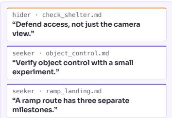  
3 New strategies appear

# AgentGarten: Code Worlds for Evolving Agents

MirroS Technical Report

## Abstract

Interactive virtual worlds allow agents to learn through exploration and interaction. What agents can learn is bounded by the environments they practice in, which must be faithful, with consistent state, rules, and dynamics, and realistic, with observations that follow the real-world visual distributions. Achieving both across diverse worlds remains a bottleneck. We introduce AgentGarten, a framework that couples simulators and game engines with a shared neural renderer to build real-time interactive environments. Its simulation backends maintain persistent world state and execute program-defined interaction rules, while the renderer generates visual observations from structured conditions exported through a common interface. To build the neural renderer, we adapt a pretrained video model to geometry conditions, distill it with our proposed Adversarial Forcing, and optimize inference for real-time interaction. Adversarial Forcing makes history prefilling diferentiable through exact replay, so that losses on later predictions update how the renderer encodes prior observations, and adds real-data adversarial supervision to improve its visual quality. In AgentGarten, agents perceive the world through visual observations, interact with it in real time, and improve by distilling each round of experience into playbooks that subsequent agents inherit and refine. Our empirical study demonstrates a substantial gain in learning eficiency, with agents learning from just 4 rounds compared with millions for a conventional reinforcement learning counterpart. As new worlds can be written as code and rendered through the same interface, environments can scale in both number and dificulty alongside their agents, a step toward agents that keep evolving through interactive experience.

Date: October 8, 2026

Blog: https://mirros.ai/blog/worlds-for-evolving-agents

Code: https://github.com/MirroS-Lab/AgentGarten

Project Page: https://mirros-lab.github.io/agent-garten

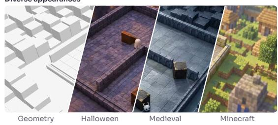


  
Manipulation


  
Multi-agent racing, from each player's camera  
Evolving agents


  
Figure 1 Code worlds for evolving agents. Top: Diverse environments spanning distinct geometries, visual appearances, and interactive tasks. Bottom: Agents continuously evolve through environmental interactions, developing increasingly sophisticated strategies such as shelter-building and ramp-crossing.

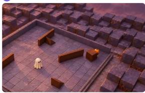  
4 rounds before hiders build shelters

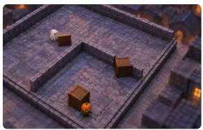  
10 rounds before seekers use ramps

## 1 Introduction

Agents learn from trajectories of actions and observations. Developing scalable, generalizable agent capabilities requires environments that not only faithfully preserve the consequences of past actions over extended interactions, but also support flexible variation in layouts, objects, and task rules. Across navigation, manipulation, and multi-agent interaction, scaling these environments therefore requires both controllable, inspectable dynamics and diverse visual observations.

However, existing approaches face a fundamental trade-of. Simulators and game engines support agent learning through explicit state and programmable interaction rules [1–3]. Yet expanding their visual diversity entails substantial 3D asset creation and complex rendering pipelines, making new environments costly to build and customize. Conversely, video world models synthesize rich, interactive visual observations from data [4–7]. In these models, however, task-relevant state and physical transition rules remain implicit within generated histories and learned representations, precluding direct inspection, editing, and testing of the environment’s behavior.

We introduce AgentGarten, a framework for building code worlds that combines programmable dynamics with a shared, real-time neural renderer (Figure 2). In AgentGarten, each scene program runs in a simulator or game engine that maintains persistent state and executes explicit interaction rules. A shared neural renderer synthesizes the agent’s visual observations from structured conditions exported by the engine through a unified interface. This separation preserves rigorous control over state and rules while allowing compatible engines to share a single renderer. New environments can thus be authored by coding agents from text or image inputs, then edited and extended entirely in code without creating bespoke visual assets for every scene.

Operating a video model as an interactive neural renderer requires it to strictly follow updated engine conditions, maintain visual consistency across extended rollouts, and synthesize observations in fine grained, short blocks so that agents receive immediate feedback after brief actions. We adapt a pretrained bidirectional video model to structured conditions, convert it to block-causal generation, and distill it into a real-time renderer on a single GPU with Adversarial Forcing, which trains the renderer on its own rollouts via distribution matching [8–10] and introduces two key advances. First, to allow later losses to update the history-encoding computation without the memory cost of a fully diferentiable rollout, we adopt two-pass training [11] and introduce exact replay: a block-by-block execution schedule that eliminates numerical divergence between sampling and recomputation and achieves bitwise-identical recomputation of the rollout trajectory. Second, to prevent the visual degradation that score distillation alone exhibits over long rollouts, we incorporate a real-data adversarial objective [10, 12] and derive an exact R1/R2 regularization scheme for a discriminator with a frozen backbone, entirely avoiding doublebackward passes through fused attention kernels.

Code worlds provide rich environments for agents to practice and evolve. We evaluate pretrained foundation-model agents across rounds of interaction, where they perceive the world strictly through rendered observations, diagnose failures, and distill key insights into written playbooks inherited by subsequent rounds. In hide-and-seek [13], agents rapidly grounded abstract spatial knowledge into closed-loop physical execution, with ramp use and shelter construction emerging within a handful of games. The same reflective loop improved performance across rounds in several additional, diverse environments (Section 5).

## Our contributions are:

• A framework for code worlds that couples persistent, editable environment state to a shared real-time neural renderer through structured conditions, enabling programmable interaction and diverse visual observations across compatible engines without per-scene visual asset authoring.

• Adversarial Forcing, a distillation method for a few-step, block-causal neural renderer. It combines distribution matching on self-rollouts with exact bitwise replay for history gradients, alongside a real-data adversarial objective whose exact R1/R2 regularization avoids double-backward through fused attention.

• An empirical study of evolving agents. Pretrained agents observing exclusively through neural rendering rapidly ground semantic tool knowledge and improve outcomes across rounds through written playbooks in hide-and-seek and several further distinct worlds.

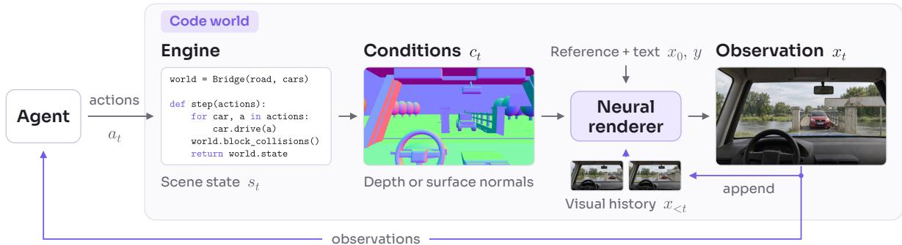  
Figure 2 Interaction and rendering in a code world (Eqs. 1 and 2). The agent submits actions and receives generated observations. The engine maintains scene state and exports structured conditions, here surface normals; the neura renderer combines them with an appearance reference, text, and cached visual history. New observations return to the agent and join the history.

## 2 Code Worlds

## 2.1 Formulation

A code world combines a scene program �, an engine that executes ${ \mathrm { i t } } ,$ and a neural renderer $R _ { \theta } .$ The program specifies the scene and interaction rules. Let $s _ { t }$ denote the scene state, including object poses, articulations, and task variables; $\pi _ { t }$ the observing camera pose; and $a _ { t }$ the actions of one or more agents. The engine updates the state and captures a structured condition $c _ { t }$ from the camera:

$$
( s _ { t + 1 } , \pi _ { t + 1 } ) = f _ { p } ( s _ { t } , \pi _ { t } , a _ { t } ) , \qquad c _ { t } = h _ { p } ( s _ { t } , \pi _ { t } ) ,\tag{1}
$$

where $f _ { p }$ implements the state transition and $h _ { p }$ renders the visible geometry. Given an appearance reference $x _ { 0 }$ and a text description $y ,$ the neural renderer generates subsequent observations from visual history $x _ { < t } \colon$

$$
x _ { t } = R _ { \theta } ( x _ { < t } , c _ { \leq t } , x _ { 0 } , y ) , \qquad t \geq 1 .\tag{2}
$$

The agent receives $x _ { t }$ and selects $a _ { t } .$ , which determines the next state and condition through Eq. (1).

Unlike a video world model, whose state resides in generated history, the transition $f _ { p }$ takes no rendered observation as input: the renderer influences the state only through the actions that agents select, so rendering errors cannot accumulate in the state. A recorded state trajectory can consequently be rendered again under a diferent appearance reference or camera without altering the underlying events. Conversely, the renderer observes the state only through $c _ { \leq t } ;$ attributes that the conditions leave undetermined, such as color and material, are specified by $x _ { 0 }$ and � and carried by the visual history. The renderer consumes conditions and visual history in blocks, as described in Section 3.

## 2.2 Structured conditions

We use colorized depth or surface normals as structured conditions. Both can be estimated from video or rendered by an engine, and their three-channel representation allows us to reuse the pretrained video encoder and Transformer. For real videos, we obtain depth with ViPE [14], using Depth Anything 3 [15] as its depth backend, and normals with NormalCrafter [16]. Simulated scenes supply these maps directly from geometry, without requiring detailed materials or textures. During training, each sample uses one randomly chosen modality (Section 3.2).

We encode depth with the Vision Banana mapping [17] and camera-space unit normals as $( n + 1 ) / 2$ , using consistent coordinate and orientation conventions across estimated and rendered maps (Appendix A.2).

## 2.3 Building code worlds

A coding agent constructs a code world from either a single image or a text description, producing an executable scene program along with an appearance reference $x _ { 0 } .$ . Because appearance is delegated to the neural renderer, the scene program does not require detailed materials or leaf-level assets; it only needs coarse geometry that faithfully conveys layout, silhouettes, occlusion, and motion dynamics.

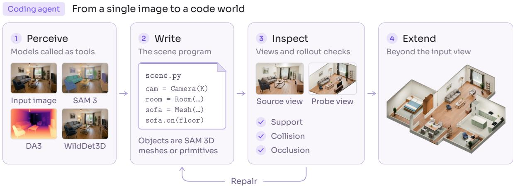  
Figure 3 A coding agent builds a code world from a single image. A living-room example. The agent calls perception and generation models as tools, writes a scene program from their outputs, and repairs it after inspecting rendered views and rollout checks. The expanded scene keeps the observed room and adds connected rooms beyond the input view as authored extensions. The input image supplies the appearance reference $x _ { 0 }$

From an image. The input image serves simultaneously as $x _ { 0 }$ and the reference layout (Figure 3). Perception and generation models lift the visible content into instance masks [18], monocular depth and camera intrinsics [15], 3D bounding boxes [19], and extracted object meshes [20]. A coding agent fits these assets to the estimated geometry, completes unobserved regions as plausible spatial extensions, and binds physical properties and interaction rules.

From text and agentic refinement. When building from text, the agent writes the scene program directly using geometric primitives and engine assets. An initial render is transformed into $x _ { 0 }$ via an image editing model while preserving scene layout. In both modalities, the agent refines the scene through an interactive feedback loop: it evaluates test rollouts from multiple probe cameras, inspects engine verification queries (contact, collision clearance, and occlusion), and iteratively repairs faulty poses, unsupported structures, or ambiguous motions before deployment.

## 3 A Real-Time Neural Renderer

We train a geometry-conditioned autoregressive video model to implement the renderer in Section 2.1. Starting from a pretrained bidirectional backbone, training proceeds through geometry conditioning, teacher-forcing adaptation, and Adversarial Forcing. The final stage combines distribution matching on the model’s own rollouts with exact history-gradient replay and real-data adversarial training. A bounded key–value cache and streaming decoding support continuous inference within the interaction loop in Figure 2.

## 3.1 Backbone

We initialize from Cosmos 3-Nano [21] and separate its understanding (UND) and generation (GEN) towers. The frozen UND tower encodes the caption � into per-layer keys and values consumed by GEN. This separation allows independent compilation and distributed execution of the two towers; during distillation, the student, teacher, and fake-score networks share one UND tower and reuse its outputs for the same caption.

A frozen Wan video autoencoder [22] maps RGB and geometry videos to latents. The appearance reference $x _ { 0 }$ uses the backbone’s native clean-frame representation: it receives no difusion timestep and is never denoised. Architecture sizes and training configurations are given in Appendix A.1.

## 3.2 Geometry conditioning

Condition tokens. Depth and normals use the three-channel encodings of Section 2.2. Spatial average pooling reduces the condition encoder’s input size and the number of tokens processed during training and inference. For an encoded condition frame indexed by �, we form

$$
G _ { t } = W _ { \mathrm { i n } } \mathcal { P } ( [ E ( S ( c ) ) ] _ { t } ) + e _ { \mathrm { g e o } } ,\tag{3}
$$

where $S$ pools the condition video spatially, $E$ is the frozen video encoder, and $\mathcal { P }$ groups latent patches. We reuse the pretrained RGB input projection $W _ { \mathrm { i n } }$ and add a zero-initialized modality embedding $e _ { \mathrm { g e o } } .$ Condition tokens receive no difusion timestep.

Joint atention. We concatenate geometry and RGB tokens along the sequence dimension and process them with the same Transformer layers. We use neither channel concatenation [23] nor control branches [24, 25], to avoid imposing a pixel-aligned inductive bias. Writing $R _ { t }$ for RGB latent tokens, the visual sequence is

$$
[ G _ { 0 } , G _ { 1 } , \dots ] [ R _ { 0 } , R _ { 1 } , \dots ] ,\tag{4}
$$

with $R _ { 0 }$ encoding $x _ { 0 }$ and text keys and values integrated via cross-attention. Geometry and RGB share temporal rotary coordinates; spatial coordinates map both grids to the same image extent. This preserves geometric alignment while allowing cross-token interactions. Only noisy RGB tokens produce velocity predictions.

Robust conditions. Geometry estimated from natural video difers from engine-rendered geometry in texture leakage, alignment, and missing observations. To reduce dependence on estimator-specific cues, we randomly retain depth or normals, with occasional dropout of both modalities; dropped inputs are black. We suppress fine texture by down- and upsampling, perturb alignment with a smooth spatial warp anchored to the first frame, and add noise to condition latents. Preprocessing and augmentation settings appear in Appendix A.2.

## 3.3 Teacher-forcing adaptation

Stage 2 adapts the geometry-conditioned model to blockwise autoregressive generation. We partition the latents after the reference into fixed-length blocks. Each block is generated from its aligned geometry and previously completed blocks, without access to future blocks.

Parallel teacher forcing. Training uses two copies of each block inside one Transformer: a clean copy $P _ { j }$ that represents history and a noisy copy $Q _ { j }$ that is denoised. Each copy carries its own aligned condition tokens. With $A _ { 0 }$ the reference, the attention mask permits

$$
P _ { j } \longrightarrow A _ { 0 } \cup P _ { \le j } , \qquad Q _ { j } \longrightarrow A _ { 0 } \cup P _ { < j } \cup Q _ { j } ,\tag{5}
$$

where an arrow points from a query to the tokens it may read; text is visible to both (Figure 4). The noisy copy of a block therefore sees clean earlier blocks and attends bidirectionally within itself, but never its own clean target. This lets all target blocks be trained in parallel with independently sampled flow times. With $z _ { j }$ the clean latent block and $\mathcal { C } = ( x _ { 0 } , y , c )$ the reference, text, and conditions,

$$
\begin{array} { r l r } & { \displaystyle \boldsymbol { z } _ { j , t _ { j } } = \left( 1 - t _ { j } \right) \boldsymbol { z } _ { j } + t _ { j } \boldsymbol { \epsilon } _ { j } , } & { \boldsymbol { \epsilon } _ { j } \sim \mathcal { N } ( 0 , I ) , } \\ & { \displaystyle \boldsymbol { \mathcal { L } } _ { \mathrm { T F } } = { \bf E } \left[ \frac { 1 } { M } \sum _ { j = 1 } ^ { M } \left\| \boldsymbol { v } _ { \boldsymbol { \theta } } ( \boldsymbol { z } _ { j , t _ { j } } , t _ { j } \mid \boldsymbol { z } _ { < j } , \boldsymbol { \mathcal { C } } ) - ( \boldsymbol { \epsilon } _ { j } - \boldsymbol { z } _ { j } ) \right\| _ { 2 } ^ { 2 } \right] , } \end{array}\tag{6}
$$

where $M$ is the number of target blocks and conditioning on $z _ { < j }$ is implemented by the clean copies and the mask.

## 3.4 Adversarial Forcing

Stage 3, Adversarial Forcing, distills the teacher-forced model into a few-step renderer that is trained on its own rollouts. It has three components: distribution matching against the bidirectional teacher, exact replay of each rollout so that gradients reach the history it wrote, and a real-data adversarial objective with exact R1/R2 regularization.

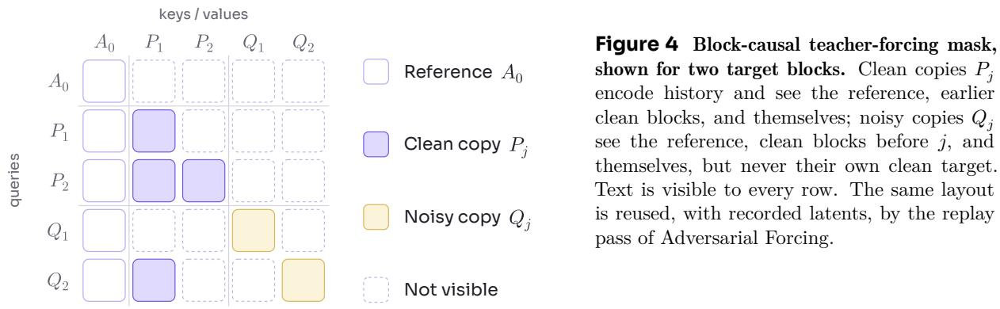

## 3.4.1 Distribution matching

We match autoregressive student rollouts to the bidirectional teacher through distribution matching distillation (DMD) in the manner of Self Forcing [8–10]. The student starts from stage 2 and generates each block in a few denoising steps, conditioning on its own preceding outputs. The frozen stage-1 teacher scores the resulting clip jointly. An auxiliary fake-score model, initialized from the teacher, learns the student’s distribution.

For a student prediction $\tilde { z } _ { \theta }$ corrupted to $y _ { \tau } = ( 1 - \tau ) \tilde { z } _ { \theta } + \tau \epsilon$ , let $f _ { \mathrm { T } }$ and $f _ { \psi }$ denote clean estimates from the teacher and fake-score model. The student objective is

$$
g = \frac { f _ { \psi } ( y _ { \tau } , \tau \mid \mathcal { C } ) - f _ { \mathrm { T } } ( y _ { \tau } , \tau \mid \mathcal { C } ) } { a } , \qquad \mathcal { L } _ { \mathrm { D M D } } = \mathbf { E } \left[ \frac { 1 } { 2 N } \lVert \tilde { z } _ { \theta } - \mathrm { s g } ( \tilde { z } _ { \theta } - g ) \rVert _ { 2 } ^ { 2 } \right] ,\tag{7}
$$

where � is a per-video normalization, � the number of latent elements, and sg stops gradients. The fake-score model is trained by flow matching on detached student samples. Sampling schedules, guidance, and update ratios are specified in Appendix A.4.

The other two components extend this objective: replay restores gradients through history encoding, and an adversarial loss supplies supervision from real videos.

## 3.4.2 Exact replay

In standard Self Forcing, completed blocks are encoded into a detached KV cache. Subsequent losses therefore supervise prediction from that cache, but not the history-prefill computation that produced its keys and values. Keeping this computation diferentiable in a single serial rollout would retain the recursively connected cache-formation graphs across blocks, with substantial memory cost.

Similar to Self Gradient Forcing (SGF) [11], we decouple rollout and gradient propagation using two passes. A no-gradient rollout records each block’s input � at the final denoising time �<sup>∗</sup> and its clean output �. A diferentiable replay then recomputes both history and predictions with the visibility pattern of Eq. (5). For block �,

$$
{ \widetilde z } _ { \theta , j } = \mathrm { s g } ( U _ { j } ) - t ^ { * } v _ { \theta } \big ( \mathrm { s g } ( U _ { j } ) , t ^ { * } \mid \mathrm { s g } ( Z _ { < j } ) , { \mathcal C } ; { \mathcal M } _ { \mathrm { T F } } \big ) .\tag{8}
$$

The recorded latents stay detached, but their history encodings are recomputed inside the graph. Later losses thus update the parameters that write history into the cache, without diferentiating through the sampling trajectory. Both DMD and generator adversarial losses use this replayed prediction.

SGF implements its second pass with full-sequence FlexAttention [26]. Although the attention mask matches cached generation, the kernel, tensor shapes, and reduction order difer; in finite precision, replay can consequently diverge from the sampled trajectory. We preserve the rollout’s execution structure: attention runs block by block with scaled dot-product attention (SDPA), using the same key–value order and call shapes. Projections and feed-forward layers use the same block grouping as well. The history keys and values are recomputed and assembled diferentiably, so the matching execution retains the history-gradient path (Figure 5). Section 4.2 evaluates numerical agreement and cost.

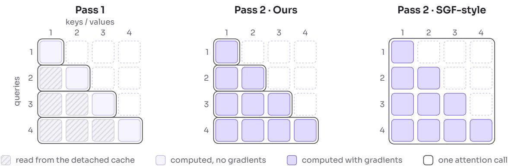  
Figure 5 Exact replay, drawn as block-level attention masks. Row � holds block �’s queries, and the columns are the key/value blocks it reads. The rollout runs one attention call per block and reads earlier blocks from a detached cache. Our replay runs the same calls but computes the history keys and values with gradients, preserving the rollout’s execution structure. An SGF-style replay computes the same mask in one full-sequence call, which changes numerical execution. Table 1 evaluates the diference. In the implementation each block issues two calls, one for its noisy queries and one for the clean publication that later blocks read.

## 3.4.3 Adversarial training

Distribution matching uses teacher and fake-score estimates on generated samples, without directly contrasting them with real videos. Following DMD2 [10], we add an adversarial objective. A trainable head $h _ { \phi }$ aggregates intermediate features from the frozen teacher backbone � into a discriminator logit. Conditioning the backbone on geometry and the reference lets the discriminator assess appearance together with geometric consistency. Section 4.1 compares the resulting renderer with one trained by Self Forcing alone.

Relativistic objective. We use the relativistic pairing of R3GAN [12]. With � and � the logits of a real clip and of the student’s prediction, corrupted with the same noise and timestep under the same conditions,

$$
{ \mathcal { L } } _ { \mathrm { G } } = { \bf E } [ \mathrm { s o f t p l u s } ( \mathrm { s g } ( r ) - f ) ] , \qquad { \mathcal { L } } _ { \mathrm { r e l } } = { \bf E } [ \mathrm { s o f t p l u s } ( f - r ) ] ,\tag{9}
$$

and the student minimizes $\mathcal { L } _ { \mathrm { D M D } } + \lambda _ { \mathrm { G } } \mathcal { L } _ { \mathrm { G } }$ . The generator-side gradient is injected into the second-pass graph through a linear surrogate, so both objectives act on Eq. (8).

Exact R1/R2 without double backward. R3GAN regularizes the discriminator with R1 and R2, the squared input-gradient norms on real and generated samples:

$$
\begin{array} { r } { D _ { \phi } ( \boldsymbol { x } ) = h _ { \phi } ( B ( \boldsymbol { x } ) ) , \qquad R _ { 1 } = \mathbf { E } _ { \boldsymbol { x } \sim p _ { \mathrm { d a t a } } } \| \nabla _ { \boldsymbol { x } } D _ { \phi } ( \boldsymbol { x } ) \| _ { 2 } ^ { 2 } , \qquad R _ { 2 } = \mathbf { E } _ { \boldsymbol { x } \sim p _ { \phi } } \| \nabla _ { \boldsymbol { x } } D _ { \phi } ( \boldsymbol { x } ) \| _ { 2 } ^ { 2 } . } \end{array}\tag{10}
$$

Their parameter gradients normally require diferentiating through a backward pass. The fused attention kernels in our backbone, such as FlashAttention [27], do not support this double backward. APT [28] sidesteps the problem with a random-perturbation approximation of R1. We compute the exact penalty and its exact head-parameter gradient instead, using the fact that the backbone is frozen.

Consider one sample and write $z = B ( x ) , A = J _ { B } ( x )$ and $u = \nabla _ { z } h _ { \phi } ( z )$ . Then

$$
\begin{array} { r } { g = A ^ { \top } u , \qquad R = g ^ { \top } g , \qquad v = A g , } \end{array}\tag{11}
$$

where � is obtained by one vector–Jacobian product (a backward pass through the head, with its parameters frozen, and then through the backbone) and � by one Jacobian–vector product that carries � forward through the frozen backbone without a gradient graph. Neither step materializes �. Because � and � do not depend on �,

$$
\nabla _ { \phi } R = 2 \left( \frac { \partial u } { \partial \phi } \right) ^ { \top } \boldsymbol { v } = \nabla _ { \phi } \big [ 2 J _ { z } h _ { \phi } ( z ) \ : \mathrm { s g } ( \boldsymbol { v } ) \big ] .\tag{12}
$$

The right-hand side is the gradient of a directional derivative of the head alone, which we compute by writing the head’s Jacobian–vector product with ordinary diferentiable operations (Appendix B). With $s = 2 J _ { z } h _ { \phi } ( z ) \ : \mathrm { s g } ( v )$ , the surrogate

$$
\widetilde { R } = \mathrm { s g } ( \| g \| _ { 2 } ^ { 2 } ) + s - \mathrm { s g } ( s )\tag{13}
$$

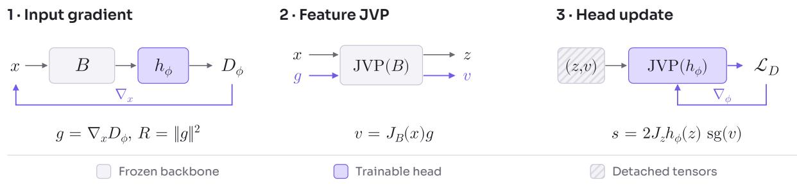  
Figure 6 Exact R1/R2 with a frozen backbone � and a trainable head $h _ { \phi } .$ (1) Diferentiate with respect to � only to obtain � and �. (2) Evaluate the backbone JVP to obtain features � and directions �. (3) Evaluate the explicit head JVP on detached (�, �), returning both the logit and its directional derivative, which supplies �. An ordinary backward pass with respect to � updates the head using the full discriminator objective.

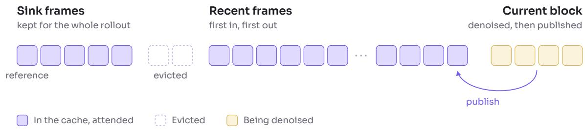  
Figure 7 The inference cache. It retains a sink prefix, which begins with the reference, and recent frames, with configurable capacities; older frames are evicted. The current block attends to every cached frame and to the text. After denoising, the clean block joins the recent window.

has the value of the true penalty and its exact first derivative with respect to �. The discriminator then minimizes $\lambda _ { \mathrm { D } } \big ( \mathcal { L } _ { \mathrm { r e l } } + \frac { \gamma } { 2 } ( \widetilde { R } _ { 1 } + \widetilde { R } _ { 2 } ) \big )$ ) with weights $\lambda _ { \mathrm { D } }$ and $\gamma .$ . A single head forward on the detached features � and directions � of the real and generated samples produces both the relativistic logits and the directional terms, and one ordinary backward pass updates the head (Figure 6). No step diferentiates through a backward kernel, and no finite diference or random direction is involved.

## 3.5 Streaming inference

The renderer prefills the reference and text, denoises incoming blocks, and commits clean predictions into a bounded KV cache. The cache maintains a permanent sink prefix (including $x _ { 0 } )$ and a sliding window of recent history (Figure 7). For rollouts exceeding the training horizon, we apply top-aligned rotary position remapping: the active block is clamped at the horizon boundary while recent history is shifted to precede it and re-rotated, preserving relative temporal distances while geometry tracks the true simulation timeline (Appendix C).

Low-latency execution and deployment. Transformer execution over short blocks is primarily bounded by memory bandwidth and kernel launch overhead. Rather than relying on torch.compile [29], which incurs minutes-long cold-start compilation delays, we implement custom Triton kernels [30] to fuse elementwise operations around attention (RMSNorm, RoPE rotation, and gated activations) without intermediate memory round-trips. CUDA graph capture and replay further eliminate host-side launch overhead for fixed-shape blocks. To bypass the heavy latent decoding bottleneck during real-time serving, we optionally replace the standard VAE decoder with a distilled tiny decoder [31], which reconstructs pixel frames in under 10 ms (Table 2). In interactive deployments, the engine pushes conditions to a GPU worker, and decoded frames are streamed to the agent or browser over WebRTC with bounded queuing latency (Section 4.3).

<table><tr><td>Measure</td><td></td><td>SGF-style (FlexAttention) Ours (block-by-block SDPA)</td><td>Change</td></tr><tr><td>Replay error (relative  $L _ { 2 } )$ </td><td>3.99%</td><td>0 (bitwise)</td><td></td></tr><tr><td>Forward time</td><td>2.95s</td><td>2.79 s</td><td>-5.4%</td></tr><tr><td>Peak allocated memory</td><td>50.83 GiB</td><td>50.92 GiB</td><td>+0.2%</td></tr></table>

Table 1 Replay accuracy and cost. Relative $L _ { 2 }$ error between rollout and replay, measured on one H100 with 36 layers, 480 × 832 resolution, 61 latent frames, and BF16. Times are medians of three warmed-up runs of the replay forward pass and exclude backward and optimizer updates.

<table><tr><td>One served block of 16 frames (one H100, BF16)</td><td>Time</td></tr><tr><td>Condition encoding</td><td>10.6 ms</td></tr><tr><td>Transformer: four denoising steps and cache publication</td><td>414.4ms</td></tr><tr><td>Tiny decoder and host transfer</td><td>8.8 ms</td></tr><tr><td>Total wall time</td><td>438.8 ms</td></tr><tr><td>Throughput</td><td>36.5 frames/s</td></tr></table>

Table 2 Inference cost at steady state. Measured with five sink and 44 recent latent frames in the cache and four current latent frames, using the hand-written kernels, CUDA graph capture, and the tiny decoder. Stage times are median GPU times; the total is the mean wall time per block and also covers work outside the three stages.

## 4 Experiments

We examine visual quality in long rollouts, replay accuracy, and inference throughput. Performance measurements use one NVIDIA H100 GPU, BF16 computation, 480 × 832 output, blocks of four latent frames, and the four-step sampler unless stated otherwise.

## 4.1 Self Forcing vs. Adversarial Forcing

Figure 8 compares 30-second rollouts from renderers trained with Self Forcing and with Adversarial Forcing on the same condition trajectories. With Self Forcing, rollouts develop repetitive surface patterns and lose scene detail as they grow longer. Adversarial Forcing retains natural textures and fine detail throughout.

## 4.2 Replay accuracy

Table 1 measures recomputation error and cost with only the attention execution changed. Full-sequence FlexAttention replay difers from the cached rollout by 3.99% relative $L _ { 2 }$ error; block-by-block SDPA replay is bitwise identical. Forward time decreases by 5.4%, while total peak memory changes by 0.2%.

## 4.3 Inference throughput

With the hand-written kernels, CUDA graph capture, and the tiny decoder (Section 3.5), the renderer generates 480 × 832 video at over 35 frames per second on one NVIDIA H100 GPU, including condition encoding, four denoising steps, decoding, and host transfer. Table 2 breaks one served block of sixteen frames into its parts. The cache keeps five sink and 44 recent latent frames, one of the history windows used in distillation (Appendix C), so each four-frame block attends to 49 frames of history. The block is measured at steady state with the cache full: blocks 17 to 48 of a 48-block, 769-frame rollout, averaged over two rollouts. Attention is dense and the tiny decoder runs in FP16.

## 5 Agents in Code Worlds

Code worlds give agents many places to act, and a world that answers every action is also a place to practice. This section presents environments built on the shared renderer, revisits hide-and-seek with agents that perceive the world only through rendered observations, describes the round-by-round

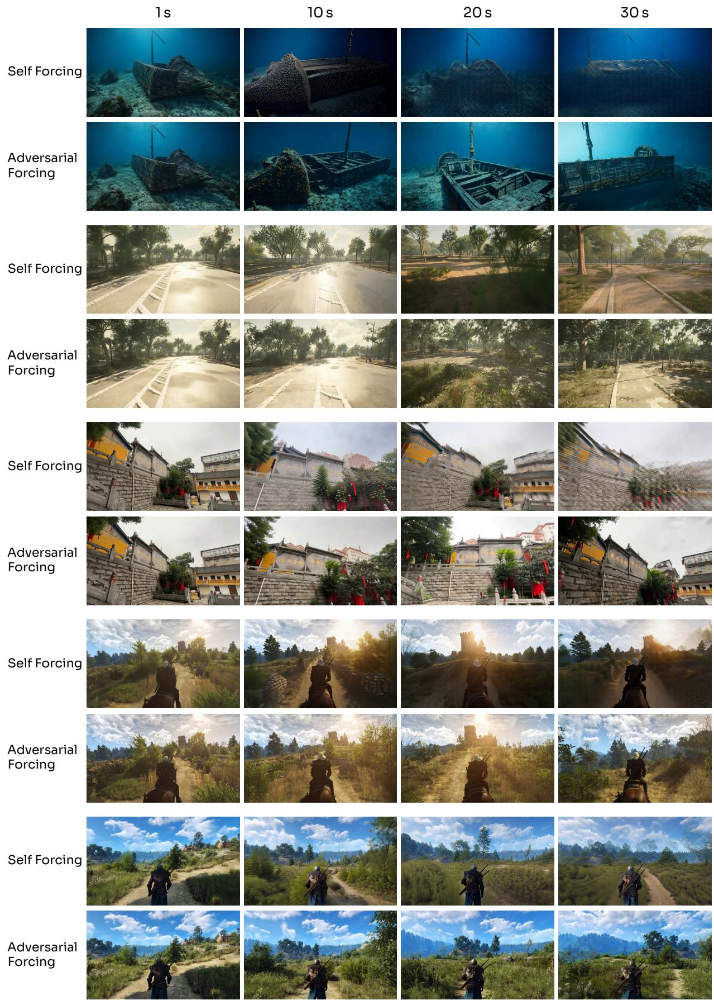  
Figure 8 Qualitative comparison with Self Forcing. Each pair shows the same 30-second condition trajectory at four moments.

procedure through which they improve, and applies it to four further worlds.

## 5.1 A library of environments

Diferent scene programs and compatible engines form code worlds with a shared renderer (Figure 9). The examples include navigation, manipulation, tool use, and multi-agent interaction. Our interactive deployment adds browser games whose rules live entirely in code, including bowling, a penalty shootout, and a crate-vault puzzle; a player’s keyboard, mouse, or gamepad input advances the code world, and the rendered stream is the only view of it. Because state evolution is explicit, it can also be replayed and rendered again: a recorded rollout can be re-shot in a diferent visual style, or from a diferent camera, without changing what happened.

## 5.2 Hide-and-seek, revisited

In OpenAI’s hide-and-seek study [13], agents trained with self-play and reinforcement learning developed strategies such as building shelters, using ramps, and defending against those tools. The study reports shelter construction after roughly 25 million episodes, followed by seeker ramp use after another 75 million; the environment made a sequence of increasingly sophisticated strategies possible through repeated competition. Those agents observed object state. We revisit the setting with a pretrained agent [32] that can reason about what happened and revise how it acts, and that perceives the world only through our renderer.

Seting. We use a sequential one-hider, one-seeker variant of the physics environment. The hider prepares the scene and then hands control to the seeker. Each agent receives first-person observations generated by the neural renderer from the environment’s structured conditions. It acts by submitting short Python programs for movement and object interaction, and then observes the resulting changes through the renderer. It never receives object coordinates, hidden world state, or the opponent’s private observations.

Each role keeps its own playbook, organized as a library of short skill files, Markdown notes that may contain code, with one lesson per file. The recorded run begins with empty playbooks and contains several rounds of five games each, over sampled layouts and seeds. After each round, each role reviews its own action programs and the visual evidence it was permitted to see, identifies failures, and adds skill files to its playbook. In the next round, the agents receive the accumulated skills, interpret the current scene, and determine which prior experience is relevant. Both successful and unsuccessful attempts contribute to subsequent revisions.

Emergent behaviors. Figure 10 highlights three characteristic behaviors that emerged during the interaction: a hider builds cover by moving a barrier panel to block an entrance; a seeker transports a ramp to an inner wall and climbs over it; and, after an initial leap falls short, a seeker repositions the ramp closer to the wall and tries again. These maneuvers demonstrate the agents’ ability to acquire and refine multi-step physical tool-use strategies purely from neural-rendered first-person observations.

These emergent strategies mirror the hallmark milestones of the 2019 study, providing a reference point for physical tool use and counter-strategies in this domain (Table 3). There, shelter construction and ramp usage emerged after roughly 25 million and 100 million training episodes of self-play reinforcement learning, respectively. In our setting, the hiders used panels to build a shelter by round 4, and the seekers used a ramp to cross walls by round 10.

Crucially, these numbers reflect two fundamentally diferent learning paradigms rather than a direct sample-eficiency ratio. The 2019 agents learned physical dynamics and competitive coordination from scratch with random weights, operating directly on ground-truth coordinate state. In contrast, foundation model agents already possess abstract knowledge of objects, tools, and geometry from web-scale pretraining. Their primary challenge is not discovering concepts from nothing, but grounding abstract knowledge into closed-loop sensorimotor action, diagnosing spatial execution failures purely from syn thesized visual observations without state access, and refining tactical execution across rounds. This comparison illustrates how combining a rich neural renderer with reflective playbooks enables agents with general priors to bypass tabula rasa exploration and rapidly converge on efective tool-use strategies in physical environments.

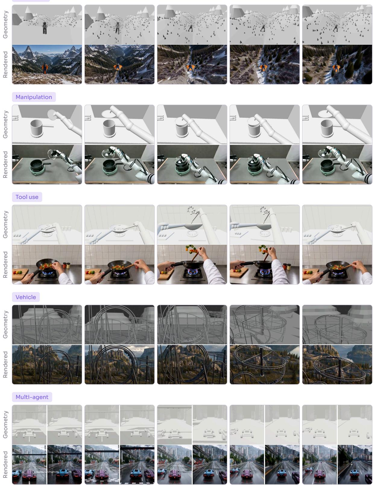  
Figure 9 Five code worlds, each at five moments of one rollout. In every column, the untextured scene geometry (top) conditions the generated observation (bottom). Racing frames contain first-person views from two agents sharing one world state. The scene programs specify coarse geometry; the renderer supplies appearance from the initial image, text, and visual history.

<table><tr><td></td><td>Self-play RL (Baker et al.)</td><td colspan="3">Ours Pretrained agents in a world model</td></tr><tr><td>Agent</td><td>Policy network Trained from scratch</td><td colspan="3">Pretrained agent Brings general knowledge of objects and tools</td></tr><tr><td>Sees</td><td>Object state Positions and velocities from the physics simulator</td><td>First-person frames The code world, shown through the neural renderer</td><td>Hider&#x27;s view</td><td>Seeker&#x27;s view</td></tr><tr><td>Acts</td><td>One action per step Move and grab commands</td><td>Short Python programs Then looks again before the next one</td><td colspan="2">def policy(): step(turn=-1, steps=2) pull(1)</td></tr><tr><td>Keeps experience in</td><td>Policy weights PPO updates from rewards and trajectories</td><td>A playbook Skill files, written when each role reviews a round</td><td colspan="2">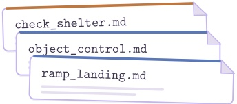</td></tr></table>

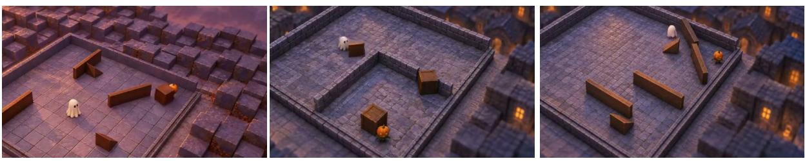  
a seeker carries a ramp over the wall  
a seeker moves the ramp closer and retries  
Figure 10 Hide-and-seek in two settings. Top: self-play reinforcement learning trains a policy network on object state and rewards. Our pretrained agents see first-person frames rendered by the neural renderer, act through short Python programs, and keep what they learn in a playbook of skill files. Bottom: three games from the run, seen from an overhead camera.

## 5.3 Rounds of practice

Hide-and-seek is one instance of a general procedure (Figure 11). Practice runs in rounds. A round begins with a task file that states the goal, the available actions, and the limits, but no solution. One or more agents then play in parallel, each within a fixed budget of steps or simulated time. They see the world only through camera frames synthesized by the neural renderer: no coordinates, no map, and no score until the episode ends. Afterwards each agent writes a playbook that records what it tried, what it observed, what it still doubts, and what to test next. Playbooks are archived, and the next round’s agents, started in fresh conversations, receive the task file and the playbooks of earlier rounds.

## 5.4 Beyond hide-and-seek

We ran the same procedure in four more worlds (Figure 12); only the world and its task file change. In the companion-dog world an agent has a 60-second session to keep a dog willingly engaged by ofering a hand, petting, and playing with a ball. On the one-lane bridge, two cars, each driven by its own agent from a windshield view, must swap ends of a bridge that fits one car, as quickly as possible. In herding, two dogs seeing only from their own eye height guide four sheep into a pen and hold them there for five seconds. In the quarry, a wheel loader must push two rocks onto staging pads, deliver one to a bunker behind a wall, and park, within 360 seconds. Each world has its own actions, time limit, and score, described to the agent only in its task file (Appendix D), and each ran for four rounds. In all four worlds, the agents <sub>fi</sub>act directly on first-person observations synthesized in real time by the neural renderer, without access to internal simulation state or raw engine geometry bufers. Figure 12 shows representative frames from

<table><tr><td>Strategy</td><td>Self-play RL [13] training episodes</td><td>Pretrained visual agents rounds played</td></tr><tr><td>Build shelters</td><td>≈ 25 million</td><td>4</td></tr><tr><td>Use ramps to enter shelters</td><td>≈ 100 million</td><td>10</td></tr></table>

Table 3 Milestones of physical tool use in hide-and-seek under two distinct paradigms. Self-play RL [13] trains tabula rasa policies over privileged object state across millions of episodes. In contrast, our study evaluates how pretrained agents, perceiving exclusively through the real-time neural renderer, ground general commonsense priors into closed-loop physical execution and adapt their strategies through written playbooks within a handful of games.

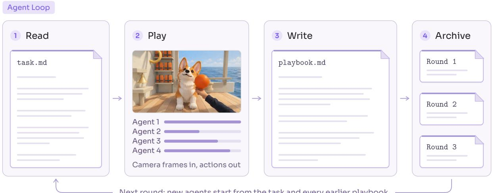  
Figure 11 One round of practice. Agents read the task file, which states the goal, the actions, and the limits but no solution; play in parallel within a fixed budget, seeing only camera frames; and write a playbook. Playbooks are archived, and the next round’s agents start in fresh conversations from the task file and every earlier playbook.

the recorded runs.

Table 4 lists the outcome of every round. In the companion-dog world, the engagement score rose from 13 to 19. On the bridge, both cars arrived in every round, and the time they needed fell from 71 to 41 seconds. The herding pair timed out in round 1 with three of four sheep penned, and penned all four in every later round. The loader cleared the rocks in round 1 and got no further, scored nothing in round 2, and in round 4 cleared the rocks, delivered one, and parked, in 329 of its 360 seconds.

## 6 Related Work

Executable environments and code worlds. Simulated environments have long been the substrate of embodied learning. Habitat 2.0 supports household rearrangement by simulated robots, while ManiSkill2 provides a benchmark for diverse manipulation skills [1, 2]. ProcTHOR generates interactive houses procedurally at scale [3], and the hide-and-seek study of Baker et al. [13] shows how a simple physics environment with movable objects can support a sequence of increasingly sophisticated strategies. Language models now automate environment construction: Holodeck translates language into assets and spatial constraints, SceneCraft synthesizes scene code with visual feedback, and LLMR generates and revises interactive Unity experiences [33–35]. Code2Worlds and SimWorld Studio extend this to dynamic scenes and to environments with standard interfaces for embodied learning [36, 37]. A related line uses code to recover dynamics rather than author them: WorldCoder infers transition and reward functions from interaction, code world models translate the rules and trajectories of a game into a program that a planner can search, and Code as Worlds constructs and tests executable hypotheses from multimodal observations [38–40]. All of these share an explicit representation that can be executed, inspected, and revised; their observations, however, are rendered by conventional graphics pipelines and inherit the fidelity of the available assets.

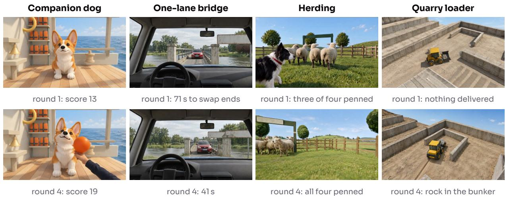  
Figure 12 The same loop in four further worlds. A frame from round 1 (top) and round 4 (bottom) of each run, with the world’s own measure. Table 4 lists every round.

<table><tr><td>World</td><td>Measure</td><td>Round 1</td><td>2</td><td>3</td><td>4</td></tr><tr><td>Companion dog</td><td>engagement score</td><td>13</td><td>14</td><td>19</td><td>19</td></tr><tr><td>One-lane bridge</td><td>seconds until both cars arrive</td><td>71</td><td>68</td><td>45</td><td>41</td></tr><tr><td>Herding</td><td>score out of 100</td><td>60</td><td>90.1</td><td>87.6</td><td>88.3</td></tr><tr><td></td><td>sheep penned, of four</td><td>3</td><td>4</td><td>4</td><td>4</td></tr><tr><td>Quarry loader</td><td>score out of 100</td><td>30</td><td>0</td><td>30</td><td>90.9</td></tr></table>

Table 4 Outcome of every round in the four additional worlds. Each row is the world’s own terminal measure, one episode per round. For the bridge, lower is better.

Explicit state behind a video model. Recent work also keeps the state of the world outside the video mode and uses the model to render it. The state may be learned jointly with the frames [41–43], advanced by an engine [23, 44–46], or written as code by an agent [40, 47–49]. These systems and ours share the separation of world evolution from appearance. Our interface is depth or surface normals, which any simulator with a 3D scene exports and which can be estimated from real videos; our renderer is causal and runs in short blocks in real time, so new actions enter throughout a rollout; and the state is a complete executable environment in which pretrained agents act and improve over repeated rounds.

Rendering from coarse or intermediate representations also relates to neural and generative rendering: from graphics bufers [50–52] and from coarse 3D simulations of crowds [53].

Interactive video world models. Video generation ofers a learned route to interactive environments. Genie learns latent actions from unlabeled video, and GameNGen simulates DOOM from action–observation trajectories [4, 54]. Later systems address control and memory over longer interactions: Matrix-Game 2.0 generates in real time from mouse and keyboard inputs, WorldPlay combines action and camera conditioning with retrieved spatial context, Matrix-Game 3.0 adds error-aware rollout training and camera-aware retrieval, and SolarWM and Astronex-World scale data and training for long-horizon, real-time interaction [5, 6, 55–57]. Genie 3 adds world events triggered by text, Wonder improves camera control and memory for real-time exploration, and ActWorld keeps the frames in which an interaction happened so that changed objects stay changed [58–60]. LingBot-World places pilot and director agents around a video world model to steer actions and events [7]. In these systems the world is represented by generated history and learned memory. In ours, actions first advance an executable environment, and the renderer is responsible only for appearance; visual continuity is still learned, and generated frames need not perfectly realize the supplied state.

Autoregressive video generation and distillation. CausVid adapts a bidirectional video difusion model into a causal student with asymmetric distribution matching [61]. Self Forcing trains an autoregressive student on its own rollouts rather than on ground-truth prefixes [8], and LongLive extends this to long sequences [62]. Causal Forcing, Causal-rCM, and Mask Forcing refine the initialization and rollout of self-forcing distillation [63–65]. These methods train the student with score distillation [9]; DMD2 adds a GAN loss on real data [10]. Self Gradient Forcing [11] similarly introduces a second pass to diferentiate history; our formulation introduces exact replay, eliminating numerical divergence and matching the rollout bitwise. Adversarial post-training is also a route to few-step generation in its own right [28, 66]; its approximate R1 regularizer motivates our exact alternative. With few sampling steps, decoding becomes a large share of the remaining cost; tiny autoencoders distilled from a video VAE reduce it [31].

Agents that learn from writen experience. Pretrained language models can improve at a task by keeping what they learn in text. Reflexion has an agent reflect in words on a failed attempt and carry the reflection into the next one [67]; ExpeL extracts reusable insights from a pool of past trajectories [68]; and Voyager grows a library of executable skills while exploring Minecraft through a text interface to the game’s state [69]. Our playbooks belong to this family. What difers is the setting: the agents perceive the world through camera frames, in hide-and-seek through the neural renderer alone, the task file gives no solution, and playbooks pass between independent agents in fresh conversations, so each lesson has to be stated well enough for another reader to check it. Emergent strategy in hide-and-seek was first shown with self-play reinforcement learning from random initialization [13]; we ask what the same environment yields when the players start from a pretrained model and a handful of games.

Gradient penalties and higher-order derivatives. R1 and R2 penalize the discriminator’s input-gradient norm on real and generated samples [70]; R3GAN combines them with a relativistic loss into a stable modern baseline [12, 71]. Computing their parameter gradients requires diferentiating an input gradient, which fused attention kernels such as FlashAttention do not support [27]. Forward-over-reverse products [72] and fused attention JVP kernels [73] provide the ingredients we combine for an exact penalty with a frozen discriminator backbone.

## 7 Future Work

More compact and complete conditions. Depth and surface normals provide a practical conditioning interface, but dense geometry videos are redundant: once an object’s shape is known, its rigid motion is described by a few pose parameters, while a condition video repeats the resulting surfaces across many pixels and frames. Spatial downsampling reduces this cost but can remove thin structures, narrow gaps, and small contact changes needed for precise control. Geometry alone also leaves some of the world’s state unspecified. A rotationally symmetric object can spin without changing its depth or normals even as a painted marking rotates, and material, color, and object identity are not determined by geometry. Visual history can preserve these attributes, but may lose them after long occlusions or revisits beyond the memory window. Future conditioning interfaces could use more abstract and compact representations of the state the code world already maintains, such as structured text describing object attributes and interaction states, or high-dimensional latent features. Structured text could, for example, specify the orientation and angular velocity of a bullet spinning about its long axis even when its depth and norma maps do not change. Aligning such representations with the code world’s state, and adapting pretrained video models to use them, remain open problems.

Scaling environments. The interface also decides which worlds can be shown at all. A renderer that receives only geometry cannot tell a spinning wheel from a still one, so tasks that depend on such state are out of reach today. A richer interface widens the range of possible worlds, but someone still has to write them. We built the worlds in this report one at a time. Since a world is a program, the next step is to let coding agents write and revise worlds [40, 47], with the shared renderer supplying appearance. Generating a world is the easy part. The harder question is whether it deserves an agent’s time: whether the task can be solved from what the agent sees, whether a careless strategy fails, and whether there is something to learn that carries into the next round. We want these checks to run automatically, before any agent practices in a new world.

Scaling experience. More worlds change how experience has to be kept. Here each playbook belongs to one world and is short enough to read in full. Across many worlds, agents must decide which lessons to keep, merge, or drop, and find the few that apply to the scene in front of them. Code worlds help: a world can be reset and replayed exactly, so a lesson can be tested before it is passed on. Lessons that hold in several worlds, such as how to confirm that a grasp held or which visual cues mislead, become general

knowledge about acting in physical scenes, and unseen worlds can measure it. The two grow together: where agents fail tells us which worlds to write next, and each new world tests what they wrote down before.

## 8 Conclusion

What an agent can learn is bounded by the environment it practices in. AgentGarten builds environments that are both faithful and realistic by dividing the work: a simulator or game engine maintains persistent state and executes the rules of each world, and a shared neural renderer, trained with Adversarial Forcing, turns the geometry it exports into observations in real time. An agent can therefore act, see the consequence, and act again, in a world whose state it can rely on. In these environments, pretrained agents improve from their own experience: they play, review each round, and write playbooks that later agents inherit and build upon. In hide-and-seek, seen only through rendered observations, shelters appeared by round 4 and ramp crossings by round 10, and the same procedure improved outcomes in four further worlds. Because a new world is written as code and rendered through the same interface, environments can grow in number and dificulty alongside the agents that practice in them. We expect agents that keep evolving through interaction to come from that loop.

## Authors

Jiawei Chi, Shangchen Miao, Zhiyuan Shi, Kailu Wu, Hanyang Wang, Weiliang Chen, Qiyu Dai, Jinshan Ren, Jun Gao, Mingsheng Long, Yueqi Duan, Jiangran Lyu, Jialong Wu<sup>†</sup>, Fangfu Liu<sup>†</sup>

## Afiliations

MirroS, Tsinghua University, Peking University

## References

[1] A. Szot, A. Clegg, E. Undersander, E. Wijmans, Y. Zhao, J. Turner, et al. “Habitat 2.0: Training Home Assistants to Rearrange their Habitat”. In: Advances in Neural Information Processing Systems. 2021.

[2] J. Gu, F. Xiang, X. Li, Z. Ling, X. Liu, T. Mu, et al. “ManiSkill2: A Unified Benchmark for Generalizable Manipulation Skills”. In: International Conference on Learning Representations. 2023.

[3] M. Deitke et al. “ProcTHOR: Large-Scale Embodied AI Using Procedural Generation”. In: Advances in Neural Information Processing Systems. 2022.

[4] J. Bruce, M. Dennis, A. Edwards, J. Parker-Holder, Y. Shi, E. Hughes, et al. “Genie: Generative Interactive Environments”. In: arXiv preprint arXiv:2402.15391 (2024).

[5] W. Sun, H. Zhang, H. Wang, J. Wu, Z. Wang, Z. Wang, et al. “WorldPlay: Towards Long-Term Geometric Consistency for Real-Time Interactive World Modeling”. In: arXiv preprint arXiv:2512.14614 (2025).

[6] Z. Wang, Z. Liu, J. Li, K. Huang, B. Xu, F. Kang, et al. “Matrix-Game 3.0: Real-Time and Streaming Interactive World Model with Long-Horizon Memory”. In: arXiv preprint arXiv:2604.08995 (2026).

[7] Z. Gao, Q. Wang, J. Zhu, J. Chen, Z. Liu, Q. Bai, et al. “Infinite Worlds with Versatile Interactions”. In: arXiv preprint arXiv:2607.07534 (2026).

[8] X. Huang, Z. Li, G. He, M. Zhou, and E. Shechtman. “Self Forcing: Bridging the Train-Test Gap in Autoregressive Video Difusion”. In: arXiv preprint arXiv:2506.08009 (2025).

[9] T. Yin, M. Gharbi, R. Zhang, E. Shechtman, F. Durand, W. T. Freeman, and T. Park. “One-step Difusion with Distribution Matching Distillation”. In: arXiv preprint arXiv:2311.18828 (2023).

[10] T. Yin, M. Gharbi, T. Park, R. Zhang, E. Shechtman, F. Durand, and W. T. Freeman. “Improved Distribution Matching Distillation for Fast Image Synthesis”. In: arXiv preprint arXiv:2405.14867 (2024).

[11] J. Zhuang, S. Zhang, Y. Bian, Y. Li, Y. Luo, Y. Liu, et al. “Self Gradient Forcing: Native Long Video Extrapolation”. In: arXiv preprint arXiv:2607.20368 (2026).

[12] Y. Huang, A. Gokaslan, V. Kuleshov, and J. Tompkin. “The GAN is dead; long live the GAN! A Modern GAN Baseline”. In: Advances in Neural Information Processing Systems. 2024.

[13] B. Baker, I. Kanitscheider, T. Markov, Y. Wu, G. Powell, B. McGrew, and I. Mordatch. “Emergent Tool Use From Multi-Agent Autocurricula”. In: International Conference on Learning Representations. 2020.

[14] J. Huang, Q. Zhou, H. Rabeti, A. Korovko, H. Ling, X. Ren, et al. “ViPE: Video Pose Engine for 3D Geometric Perception”. In: arXiv preprint arXiv:2508.10934 (2025).

[15] H. Lin, S. Chen, J. H. Liew, D. Y. Chen, Z. Li, G. Shi, J. Feng, and B. Kang. “Depth Anything 3: Recovering the Visual Space from Any Views”. In: arXiv preprint arXiv:2511.10647 (2025).

[16] Y. Bin et al. “NormalCrafter: Learning Temporally Consistent Normals from Video Difusion Priors”. In: International Conference on Computer Vision. 2025.

[17] V. Gabeur, S. Long, S. Peng, P. Voigtlaender, S. Sun, Y. Bao, et al. “Image Generators are Generalist Vision Learners”. In: arXiv preprint arXiv:2604.20329 (2026).

[18] N. Carion et al. “SAM 3: Segment Anything with Concepts”. In: arXiv preprint arXiv:2511.16719 (2025).

[19] WildDet3D. Citation to be completed. 2026.

[20] SAM 3D Team, X. Chen, F.-J. Chu, P. Gleize, K. J. Liang, A. Sax, et al. “SAM 3D: 3Dfy Anything in Images”. In: (2025). arXiv: 2511.16624 [cs.CV].

[21] NVIDIA. “Cosmos 3: Omnimodal World Models for Physical AI”. In: arXiv preprint arXiv:2606.02800 (2026).

[22] Wan Team. “Wan: Open and Advanced Large-Scale Video Generative Models”. In: arXiv preprint arXiv:2503.20314 (2025).

[23] NVIDIA, A. Basant, A. Kar, D. Paschalidou, F. Wei, F. Ferroni, et al. “NVIDIA OmniDreams: Real-Time Generative World Model for Closed-Loop Autonomous Vehicle Simulation”. In: arXiv preprint arXiv:2606.03159 (2026).

[24] L. Zhang, A. Rao, and M. Agrawala. “Adding Conditional Control to Text-to-Image Difusion Models”. In: Proceedings of the IEEE/CVF International Conference on Computer Vision. 2023.

[25] NVIDIA. “World Simulation with Video Foundation Models for Physical AI”. In: arXiv preprint arXiv:2511.00062 (2025).

[26] D. Guessous, Y. Liang, J. Dong, and H. He. FlexAttention: The Flexibility of PyTorch with the Performance of FlashAttention. PyTorch blog. 2024.

[27] T. Dao, D. Y. Fu, S. Ermon, A. Rudra, and C. Ré. “FlashAttention: Fast and Memory-Eficient Exact Attention with IO-Awareness”. In: Advances in Neural Information Processing Systems. 2022.

[28] S. Lin et al. “Difusion Adversarial Post-Training for One-Step Video Generation”. In: arXiv preprint arXiv:2501.08316 (2025).

[29] J. Ansel, E. Yang, H. He, N. Gimelshein, A. Jain, M. Voznesensky, et al. “PyTorch 2: Faster Machine Learning Through Dynamic Python Bytecode Transformation and Graph Compilation”. In: Proceedings of the 29th ACM International Conference on Architectural Support for Programming Languages and Operating Systems. 2024.

[30] P. Tillet, H. T. Kung, and D. Cox. “Triton: An Intermediate Language and Compiler for Tiled Neural Network Computations”. In: Proceedings of the 3rd ACM SIGPLAN International Workshop on Machine Learning and Programming Languages. 2019.

[31] O. B. Bohan. TAEHV: Tiny AutoEncoder for Hunyuan Video (and other video models). GitHub repository. 2025.

[32] OpenAI. GPT-6 Astra. Model documentation. 2026.

[33] Y. Yang, F.-Y. Sun, L. Weihs, E. VanderBilt, A. Herrasti, W. Han, et al. “Holodeck: Language-Guided Generation of 3D Embodied AI Environments”. In: arXiv preprint arXiv:2312.09067 (2023).

[34] Z. Hu, A. Iscen, A. Jain, T. Kipf, Y. Yue, D. A. Ross, C. Schmid, and A. Fathi. “SceneCraft: An LLM Agent for Synthesizing 3D Scenes as Blender Code”. In: arXiv preprint arXiv:2403.01248 (2024).

[35] F. De La Torre, C. M. Fang, H. Huang, A. Banburski-Fahey, J. Amores Fernandez, and J. Lanier. “LLMR: Real-Time Prompting of Interactive Worlds Using Large Language Models”. In: arXiv preprint arXiv:2309.12276 (2023).

[36] Y. Zhang, Y. Wang, Z. Zhang, and H. Tang. “Code2Worlds: Empowering Coding LLMs for 4D World Genera tion”. In: arXiv preprint arXiv:2602.11757 (2026).

[37] H. Kang, X. Ye, Y. Liu, S. H. Mantri, L. Mao, J. Fleming, D. Regmi, and L. Qin. “SimWorld Studio: Automatic Environment Generation with Evolving Coding Agent for Embodied Agent Learning”. In: arXiv preprint arXiv:2605.09423 (2026).

[38] H. Tang, D. Key, and K. Ellis. “WorldCoder, a Model-Based LLM Agent: Building World Models by Writing Code and Interacting with the Environment”. In: arXiv preprint arXiv:2402.12275 (2024).

[39] W. Lehrach, D. Hennes, M. Lazaro-Gredilla, X. Lou, C. Wendelken, Z. Li, et al. “Code World Models for General Game Playing”. In: International Conference on Learning Representations. 2026.

[40] H. Wang, Y. Cai, W. Chen, J. Chi, H. Sun, Q. Dai, et al. “Code as Worlds: Agentic Discovery of Executable World Representations for Physical Reasoning”. In: arXiv preprint arXiv:2608.27549 (2026).

[41] Z. Lin, Z. Wang, C. Tan, B. Wen, and Y. Jin. “StatePlay: State-Aware Game World Models for Mechanics-Consistent Generation”. In: arXiv preprint arXiv:2607.26754 (2026).

[42] Z. Cai, S. Yang, Y. Wang, Z. Gao, Y. Liu, S. Weng, E. Wu, K. Zhang, and B. Shi. “MASS: Multiplayer World Models with Authoritative Shared State”. In: arXiv preprint arXiv:2608.06257 (2026).

[43] Z. Meng, Z. Li, C. Li, Q. Li, and K. Zhang. “Marionette: Predicting World States, Rendering Geometry, Painting Appearance”. In: arXiv preprint arXiv:2608.14530 (2026).

[44] X. Zhan, X. Wang, X. Zhang, H. Zhu, T. Sun, P. Fang, J. Yu, Y. Guo, and D. Fu. “Magpie: Real-Time World Renderer for Interactive Games”. In: arXiv preprint arXiv:2608.27168 (2026).

[45] Y. Chen, X. Chen, Y. Zhu, L. Tan, Z. Wan, Y. Xiong, et al. “World Narrative Model for Highly Controllable Video Generation: A Paradigm Shift from Pixel Sampling to Physical World Orchestration”. In: arXiv preprint arXiv:2606.31946 (2026).

[46] Z. Lin, Z. Deng, Y. Wu, B. Wen, and Y. Jin. “GameDirector: Decoupling Gameplay Logic from Rendering for Player-Configurable Game World Models”. In: arXiv preprint arXiv:2609.25652 (2026).

[47] Y. Chen, G. Lin, and C. Zhang. “Code World Model: Coding Agent as World Brain”. In: arXiv preprint arXiv:2608.25927 (2026).

[48] Z.-H. Huang, G. Lin, J. Lin, Y.-C. Huang, R. Yu, M. Niu, et al. “Programmable World Model”. In: arXiv preprint arXiv:2609.10540 (2026).

[49] X. Yang, B. Li, L. Lee, Z. Yin, S. Zhang, Z. Song, et al. “Oneira: From Open-Ended Generation to Open-World Interaction in Video World Models”. In: arXiv preprint arXiv:2610.01614 (2026).

[50] S. Cai, D. Ceylan, M. Gadelha, C.-H. P. Huang, T. Y. Wang, and G. Wetzstein. “Generative Rendering: Controllable 4D-Guided Video Generation with 2D Difusion Models”. In: arXiv preprint arXiv:2312.01409 (2023).

[51] R. Liang, Z. Gojcic, H. Ling, J. Munkberg, J. Hasselgren, Z.-H. Lin, et al. “DifusionRenderer: Neural Inverse and Forward Rendering with Video Difusion Models”. In: arXiv preprint arXiv:2501.18590 (2025).

[52] Z.-H. Huang, Z. Wang, J. Tan, R. Yu, Y. Zhang, B. Zheng, Y.-L. Liu, Y.-Y. Chuang, and K. Zhang. “Generative World Renderer”. In: arXiv preprint arXiv:2604.02329 (2026).

[53] G. Gomez-Nogales, Y. Hong, C. Ge, P. Zhuang, M. Comino-Trinidad, D. Casas, and Y. Zhou. “Coarse-to-Real: Generative Rendering for Populated Dynamic Scenes”. In: arXiv preprint arXiv:2601.22301 (2026).

[54] D. Valevski, Y. Leviathan, M. Arar, and S. Fruchter. “Difusion Models Are Real-Time Game Engines”. In: arXiv preprint arXiv:2408.14837 (2024).

[55] X. He, C. Peng, Z. Liu, B. Wang, Y. Zhang, Q. Cui, et al. “Matrix-Game 2.0: An Open-Source, Real-Time, and Streaming Interactive World Model”. In: arXiv preprint arXiv:2508.13009 (2025).

[56] Huang et al. “SolarWM: Open Data and Scalable Training for Long-Horizon Video World Models”. In: arXiv preprint arXiv:2609.02886 (2026).

[57] Zhou and Miao. “Astronex-World 1.0: Real-Time Interactive World Model Foundation”. In: arXiv preprint arXiv:2609.20034 (2026).

[58] J. Parker-Holder, S. Fruchter, et al. Genie 3: A New Frontier for World Models. Google DeepMind Blog. 2025.

[59] J. Xu, H. Jiang, Z. Shu, K. Sunkavalli, V. M. Patel, and Y. Mei. “Wonder: Video World Model Done Better”. In: arXiv preprint arXiv:2607.26037 (2026).

[60] Z. Xiong, Y. Song, H. Kang, Q. Yan, L. Jiang, J. Yang, et al. “ActWorld: From Explorable to Interactive World Model via Action-Aware Memory”. In: arXiv preprint arXiv:2606.17730 (2026).

[61] T. Yin, Q. Zhang, R. Zhang, W. T. Freeman, F. Durand, E. Shechtman, and X. Huang. “From Slow Bidirectional to Fast Autoregressive Video Difusion Models”. In: Proceedings of the IEEE/CVF Conference on Computer Vision and Pattern Recognition. 2025.

[62] S. Yang, W. Huang, R. Chu, Y. Xiao, Y. Zhao, X. Wang, et al. “LongLive: Real-time Interactive Long Video Generation”. In: arXiv preprint arXiv:2509.22622 (2025).

[63] H. Zhu, M. Zhao, G. He, H. Su, C. Li, and J. Zhu. “Causal Forcing: Autoregressive Difusion Distillation Done Right for High-Quality Real-Time Interactive Video Generation”. In: arXiv preprint arXiv:2602.02214 (2026).

[64] K. Zheng, G. He, M. Zhao, J. Zhang, H. Chen, J. Chen, et al. “Causal-rCM: A Unified Teacher-Forcing and Self-Forcing Open Recipe for Autoregressive Difusion Distillation in Streaming Video Generation and Interactive World Models”. In: arXiv preprint arXiv:2606.25473 (2026).

[65] Zhao et al. “Mask Forcing: Improving Autoregressive Video Difusion Distillation via Dual-Noise Masking Rollout”. In: arXiv preprint arXiv:2609.09123 (2026).

[66] S. Lin, C. Yang, H. He, J. Jiang, Y. Ren, X. Xia, Y. Zhao, X. Xiao, and L. Jiang. “Autoregressive Adversarial Post-Training for Real-Time Interactive Video Generation”. In: Advances in Neural Information Processing Systems. 2025.

[67] N. Shinn, F. Cassano, A. Gopinath, K. Narasimhan, and S. Yao. “Reflexion: Language Agents with Verbal Reinforcement Learning”. In: Advances in Neural Information Processing Systems. Vol. 36. 2023.

[68] A. Zhao, D. Huang, Q. Xu, M. Lin, Y.-J. Liu, and G. Huang. “ExpeL: LLM Agents Are Experiential Learners”. In: AAAI Conference on Artificial Intelligence. 2024.

[69] G. Wang, Y. Xie, Y. Jiang, A. Mandlekar, C. Xiao, Y. Zhu, L. Fan, and A. Anandkumar. “Voyager: An Open-Ended Embodied Agent with Large Language Models”. In: arXiv preprint arXiv:2305.16291 (2023).

[70] L. Mescheder, A. Geiger, and S. Nowozin. “Which Training Methods for GANs Do Actually Converge?” In: Proceedings of the 35th International Conference on Machine Learning. 2018, pp. 3481–3490.

[71] A. Jolicoeur-Martineau. “The Relativistic Discriminator: A Key Element Missing from Standard GAN”. In: International Conference on Learning Representations. 2019.

[72] B. A. Pearlmutter. “Fast Exact Multiplication by the Hessian”. In: Neural Computation 6.1 (1994), pp. 147–160.

[73] K. Zheng et al. Large Scale Difusion Distillation via Score-Regularized Continuous-Time Consistency. rCM; FlashAttention JVP implementation. 2025.

[74] L. Ling, Y. Sheng, Z. Tu, W. Zhao, C. Xin, K. Wan, et al. “DL3DV-10K: A Large-Scale Scene Dataset for Deep Learning-Based 3D Vision”. In: Proceedings of the IEEE/CVF Conference on Computer Vision and Pattern Recognition. 2024, pp. 22160–22169.

[75] J. Yang, S. Gao, Y. Qiu, L. Chen, T. Li, B. Dai, et al. “Generalized Predictive Model for Autonomous Driving”. In: Proceedings of the IEEE/CVF Conference on Computer Vision and Pattern Recognition. 2024, pp. 14662– 14672.

## Appendix

## A Implementation Details

## A.1 Backbone, data, and training stages

The renderer uses the video stream of Cosmos 3-Nano [21]: 36 Transformer layers with hidden width 4096, 32 query heads, and 8 key–value heads. The text stream and the Wan video autoencoder [22] stay frozen; text encoding and video encoding are computed online. The autoencoder compresses time by four and space by sixteen, and a $2 \times 2$ patch embedding produces 390 tokens per latent frame at $4 8 0 \times 8 3 2$ The model’s temporal grid is treated as 16 frames per second. Five-second training windows contain 81 frames (a reference and 20 latent frames, five target blocks); fifteen-second windows contain 241 frames (a reference and 60 latent frames, fifteen target blocks).

Training clips pair RGB video with a text description and with depth and normals, estimated as described in Section 2.2. The mixture contains scene captures from DL3DV-10K [74], driving videos from OpenDV [75], and internet videos of gameplay, navigation, and robot interaction, supplemented by a small set of rendered synthetic scenes, whose conditions are exported by the renderer instead of estimated.

Table 5 summarizes the training stages. All stages run on 32 NVIDIA H100 GPUs with fully sharded data parallelism, one clip per GPU, and two gradient-accumulation steps, for 64 clips per optimizer update. Computation uses BF16 with FP32 gradient reductions; the discriminator head uses FP32 parameters. All optimizers are AdamW with zero weight decay. Adaptation stages use 100-update linear warmup from 10% of the listed rate; distillation uses constant rates without warmup.
<table><tr><td>Stage</td><td>Updated parameters</td><td>Initialization</td><td>LR</td><td>Adam  $( \beta _ { 1 } , \beta _ { 2 } )$ </td></tr><tr><td>1. Geometry conditioning</td><td>self-attention projections and  $\mathrm { { q / k } }$  norms; condition embedding</td><td>Cosmos 3-Nano</td><td> $3 \times 1 0 ^ { - 5 }$ </td><td>(0.9,0.99)</td></tr><tr><td>2. Causal adaptation</td><td>same as stage 1</td><td>stage 1</td><td> $3 \times 1 0 ^ { - 5 }$ </td><td>(0.9,0.99)</td></tr><tr><td>3. Distillation: student</td><td>complete video stream</td><td>stage 2</td><td> $2 \times 1 0 ^ { - 6 }$ </td><td>(0,0.999)</td></tr><tr><td>fake score</td><td>complete video stream</td><td>stage 1</td><td> $4 \times 1 0 ^ { - 7 }$ </td><td>(0,0.999)</td></tr><tr><td>discriminator</td><td>head only; backbone is the frozen teacher</td><td>fresh</td><td> $2 \times 1 0 ^ { - 7 }$ </td><td>(0,0.999)</td></tr></table>

Table 5 Training stages. Stages 1 and 2 train first on five-second and then on fifteen-second windows; each distillation run uses the teacher and fake score of the matching window length. The teacher is the stage-1 model and stays frozen. The text stream and the video autoencoder are frozen throughout.

## A.2 Geometry preprocessing

Following Vision Banana [17], valid depth $d > 0$ is mapped to

$$
u ( d ) = 1 - \left( 1 + \frac { \alpha d } { 1 0 } \right) ^ { - 2 } .\tag{14}
$$

The scale � is shared across the clip. Metric depth uses $\alpha = 1 ;$ for depth with an unknown scale, the reader estimates the median � of valid depth samples across the clip and sets $\alpha = 1 0 ( \sqrt { 2 } - 1 ) / m$ , placing that median at $u = 0 . 5$ . Training can jitter this scale for non-metric clips. The coordinate $u \in [ 0 , 1 )$ traverses seven equal segments of the RGB cube: black, red, yellow, green, cyan, blue, magenta, and white, with linear interpolation within each segment. Invalid depths are mapped to black.

Normals are kept in [−1, 1] at the autoencoder input, corresponding to the display encoding $( n + 1 ) / 2$ in RGB; estimated normals are canonicalized by negating the � component of the NormalCrafter prediction, and rendered normals are converted to the same camera-frame orientation. When a modality is dropped, its video is set to the value that becomes −1 (black) at the autoencoder input.

The condition is average-pooled by four along each spatial axis and placed on the condition canvas with a piecewise-bilinear stretch. At 480 × 832 output resolution this gives 28 condition tokens per latent frame, compared with 390 RGB tokens. For spatial rotary positions, a condition-grid coordinate � maps to $( u + \textstyle \frac { 1 } { 2 } ) ( N _ { \mathrm { r g b } } / N _ { \mathrm { g e o } } ) - \frac { 1 } { 2 }$ along each axis, where $N _ { \mathrm { r g b } }$ and $N _ { \mathrm { g e o } }$ are the respective grid sizes. Texture suppression (probability 0.5) downsamples by a factor drawn from [1.5, 3]. Spatial augmentation (probability 0.5) applies a smooth warp anchored to the first frame, with scale at most 1.15, that decays over the clip. A per-sample choice keeps depth or normals, and with probability 0.1 both are dropped. After encoding, Gaussian latent noise with standard deviation 0.4 is added to pooled conditions.

## A.3 Causal blocks and history perturbation

The reference is a standalone clean prefix. It is never assigned a difusion timestep, never included in the loss, and never republished after the cache is initialized. Each subsequent block contains four latent frames. For every target block, the clean and noisy copies carry separate condition tokens and follow Eq. (5); flow times are sampled independently for each target block, and the clean copy is evaluated at the clean-context timestep. Each visible history frame independently receives one of four equally likely perturbations: contrast and exposure scaling about its channel mean with a factor from [0.3, 1.7], Gaussian noise mixing with strength from $[ 0 , 1 / 3 ]$ , bilinear down- and upsampling with scale from [0.9, 1], or no change. The reference frame is never perturbed.

## A.4 Distillation

For the four-step renderer, the sampling trajectory has endpoints in normalized flow time

$$
\mathcal { E } = ( 1 6 0 0 / 1 6 0 1 , 1 5 / 1 6 , 5 / 6 , 5 / 8 , 0 ) .\tag{15}
$$

All blocks in a rollout use the same trajectory, and the replay recomputes its final step. The teacher uses classifier-free guidance scale 6, score times follow a shifted uniform distribution with shift 5, and the fake-score model takes five updates per student update. Clean estimates are obtained from velocity predictions as $f ( y _ { \tau } , \tau ) = y _ { \tau } - \tau v ( y _ { \tau } , \tau )$ , and the normalization in Eq. (7) is

$$
\begin{array} { r } { a = \operatorname* { m a x } \{ \operatorname* { m e a n } ( \vert \tilde { z } _ { \theta } - f _ { \mathrm { T } } ( y _ { \tau } , \tau \mid \mathcal { C } ) \vert ) , 1 0 ^ { - 5 } \} , } \end{array}\tag{16}
$$

with the mean over all latent elements of each video. The score estimates, normalization, and regression target all use the second-pass prediction of Eq. (8); the recorded first-pass output supplies context but is not substituted for the prediction. The DMD loss carries a factor 0.5, included in the $1 / ( 2 N )$ coeficient of Eq. (7).

Exact replay. The replay recomputes the clean-history keys and values within the diferentiable graph; it never reads detached cache values from the rollout. Attention is computed one block at a time, as in the cached rollout: once for the block’s noisy queries and once for its clean publication, each call with the same visible context, key–value order, and tensor shapes. Projections and feed-forward layers are grouped the same way: the reference first, then, for each block, its condition tokens followed by its RGB tokens. Grouping matters because a projection applied to a whole packed sequence can round diferently from the same projection applied block by block, and such diferences amplify through a trained network. The grouping loop runs outside the compiled region while the per-group tensor operations stay compiled, so changes in history length or caption length do not recompile an unrolled layer.

Adversarial term. The discriminator reads the frozen teacher’s features after layers 11, 23, and 35. Each branch aggregates its layer’s tokens with a learned query followed by a residual multilayer perceptron, and the concatenated branch outputs give one logit. With the critic parameters fixed, let $h = \partial \mathcal { L } _ { \mathrm { G } } / \partial \tilde { z } _ { \theta }$ be the generator-side gradient; it enters the student graph through the linear surrogate $\left. \tilde { z } _ { \theta } , \mathrm { s g } ( h ) \right.$ , so that the adversarial and DMD objectives both act through the replay without retaining the rollout graph.

## B Exact R1/R2

Why freezing the backbone maters. Section 3.4.3 writes $\boldsymbol { z } = \boldsymbol { B } ( \boldsymbol { x } ) , \boldsymbol { A } = \boldsymbol { J } _ { B } ( \boldsymbol { x } ) , \boldsymbol { u } = \nabla _ { z } h _ { \phi } ( z )$ , and obtains $g = A ^ { \top } u$ by a VJP and $v = A g$ by a JVP. Because the backbone is frozen, � and � are independent of �, and diferentiating $R = g ^ { \intercal } g$ gives Eq. (12); the factor of two accounts for the two copies of $g .$ The direction � is recomputed at the current parameters on every update and then detached. A nonlinear backbone is fully compatible with the identity: its Jacobian depends on � but not on $\phi .$ Updating the backbone as well would introduce derivatives of its features and Jacobian that the detached construction does not supply. Freezing alone does not remove the head’s own second-order derivatives; the explicit head JVP below changes how they are computed.

Why JVPs are simpler to implement. Backward-over-backward diferentiates the computation that produced the input gradient. For a fused attention kernel this requires a diferentiable backward or a separate implementation of its derivatives, with correct gradient paths through saved intermediates and incoming gradients. A JVP instead follows the forward computation, carrying each activation together with one tangent [72]. Each operator needs only a local directional rule: a linear layer propagates ${ \dot { y } } = W { \dot { x } }$ , and a residual addition adds the two tangents. These rules compose in the order of the original network and can be checked operator by operator. For attention $Y = P V$ with $P = \operatorname { s o f t m a x } ( S )$ and $S = Q K ^ { \top } / \sqrt { d } .$

$$
\begin{array} { r l } & { \dot { S } = ( \dot { Q } K ^ { \top } + Q \dot { K } ^ { \top } ) / \sqrt { d } , } \\ & { \dot { P } = P \odot \Big ( \dot { S } - \sum _ { \mathrm { k e y s } } P \odot \dot { S } \Big ) , } \\ & { \dot { Y } = \dot { P } V + P \dot { V } , } \end{array}\tag{17}
$$

where the sum runs over keys within each query row. The frozen backbone needs only the resulting tangent values, so its replay runs without a gradient graph, using a fused attention-JVP kernel anchored at the activations recorded by the original forward pass; the fixed history, conditions, and text have zero tangent. The trainable head, whose cross-attention branches each have a single query token, expresses the same rules with ordinary matrix products, softmax, and elementwise operations; its attention maps grow only linearly with the number of feature tokens, so the dense diferentiable implementation is prac tical. An ordinary backward through the directional score � then supplies the required mixed derivative. Mathematically this is still a second-order derivative of the head; computationally, no FlashAttention backward kernel is ever diferentiated. rCM’s FlashAttention JVP kernel [73] computes attention and its tangent in one fused forward pass; our backbone needs only such values, whereas our head also needs gradients through the JVP with respect to its parameters, which the explicit head JVP preserves.

The surrogate. The surrogate $\widetilde { R }$ in $\operatorname { E q } .$ . (13) reports the full squared input-gradient norm while routing the head gradient through �. It matches the penalty and its first derivative with respect to � at the current update; it is not a replacement graph for arbitrary higher-order derivatives. R1 and R2 apply the construction to real and generated inputs, with generated inputs detached during the discriminator update, and the discriminator minimizes $\lambda _ { \mathrm { D } } ( \mathcal { L } _ { \mathrm { r e l } } + \frac { \gamma } { 2 } ( \widetilde { R } _ { 1 } + \widetilde { R } _ { 2 } ) )$ . In code, the real and generated prepa rations run sequentially, so only one backbone graph exists at a time, and one head forward returns the pair logits and both directional scores.

## C Streaming Cache

Cache policy. Every query attends to the text, the current block, and all cached history. The cache is bounded by a number of sink latent frames, which include the reference, and a number of most recent latent frames. During distillation, each rollout draws its history window from three such settings: no sink and 48 recent frames, one sink and 48 recent frames, or five sink and 44 recent frames. The served configuration retains five sink and 44 recent frames, the last of these settings; Table 2 reports its throughput. Eviction removes a frame’s RGB and condition keys and values together.

Top-aligned rotary positions. Let � be the training horizon in latent frames, � the block length, and � the next block’s start on the simulation timeline. Its rotary start is $\operatorname* { m i n } ( s , H - b )$ , so positions remain within the training range. Recent history occupies consecutive positions immediately before that block, while the sink prefix keeps its original positions. We re-rotate retained history keys from their previous to their new coordinates using the backbone’s native rotary templates, including its frame-rate and modality ofsets. Values are moved without rotation. Condition contents are indexed by the simulation timeline, independently of this position remapping. The implementation uses $H = 6 1$ and $b = 4$ for the fifteen-second model.

## D Task Files

A task file is all an agent is told about its world before it plays: the goal, the available actions, and the limits (Section 5). The listings below reproduce the task files of the four additional worlds verbatim, as given to one agent in round 1; long lines are wrapped. In the bridge and herding worlds the second agent receives the same file for its own color.

```markdown
task.md Companion dog
# Companion dog
Keep this individual dog comfortable and willingly engaged throughout the
60-second session. Learn which combinations and repetitions work from
the RGB observations. This is a synthetic game, not real animal-care advice.
## Actions and time
| Action | Fixed duration | Meaning |
--- | ---: | --- |
`wait` | 1 s | Hands absent; allow the dog time. |
`offer` | 3 s | Extend an open hand for sniffing. |
`pet_chest` | 3 s | Gently stroke under the chin and on the chest. |
`pet_head` | 3 s | Gently stroke the head. |
`play` | 3 s | Move the held orange ball; do not throw it. |
`withdraw` | 2 s | Remove the hand/toy and allow space. |
The listed durations include reaching/withdrawal transitions, not guaranteed
contact time. Repeating an activity continues it without restarting its gesture.
`lookX` and `lookY` optionally range from -1 to 1 (default 0): positive X turns
right and positive Y looks up. Looking does not move your hand or touch the dog.
The world pauses while you think. Actions in a batch execute in order without
intermediate decisions; the blocking response contains observations for each.
The episode time limit can truncate the final action and skip the rest of a batch.
## Reading the dog
Taking small steps toward you and staying nearby is a positive engagement cue.
Turning aside and stepping away indicates refusal or discomfort.
Returning to the usual resting spot indicates recovery, not necessarily enjoyment.
A movement may take time to finish; inspect consecutive observations.
Looking at a toy alone does not establish enjoyment.
Do not assume a requested touch appeared: inspect the actual rendered frames.
Your task is to discover preferences and pacing; no optimal sequence is supplied.
## Evaluation and experience
The terminal score reflects accumulated comfortable engagement and avoidance
over the full session, not just the final pose. No numeric mood, hidden preference,
intermediate reward, renderer prompt or privileged evaluator data is provided.
Observation appearance may be imperfect; distinguish uncertain visual evidence
from conclusions. Record evidence IDs, failures and hypotheses in your playbook.
An inherited playbook is another attempt's claims, not ground truth.
task.md One-lane bridge · blue car
# Narrow bridge FPV cooperation
You drive the blue car from inside its cockpit. Your RGB observation is a
first-person windshield view: the dashboard and dark windscreen frame are
stable body geometry, and the other car, bridge walls and refuge area are
visible only when they fall in front of your camera. You do not receive a
global map, coordinates, depth, normal, or the other driver's private action.
The operator review page may show global views, but they are not agent inputs.
Together exchange ends of a continuous one-car-wide bridge within 120
simulation seconds. Both cars must finish simultaneously on opposite goals.
The bridge fits only ONE car across; the wider paved areas on both banks have
white-outlined pullouts where cars can pass. Grass and water are not drivable.
```

Your destination is the disk matching your own car color at the opposite end:   
red on the east bank, blue on the west bank. You start on the other car's disk.   
You must both occupy your respective destinations to finish; a car that arrives   
does not disappear and can still obstruct traffic. The bridge position/length   
varies between episodes. Road markings and signs are public visual cues.   
\`forward\` and \`backward\` move at fixed low speed during their two-second atomic   
duration. \`turn\_left\` and \`turn\_right\` steer at a fixed gentle rate for one   
second, in place (this is simplified vehicle control, not an Ackermann steering   
simulator). \`wait\` holds position for one second. These durations cannot be supplied   
by the agent. Continuous paths are integrated every world tick, not snapped to   
cells. If a move would collide with or cross the other car, BOTH moves are   
blocked and time still passes. The whole vehicle footprint must stay inside   
the road, and collisions are checked along movement, not just at endpoints.   
Feedback distinguishes a road-edge stop from contact with the other car.   
No movement itself earns reward.   
| Action | Fixed duration | Meaning |   
| --- | ---: | --- |   
| \`wait\` | 1 s | Hold the steering wheel and remain still for one second. |   
| \`forward\` | 2 s | Drive forward at a fixed low speed for two seconds. |   
| \`backward\` | 2 s | Reverse at a fixed low speed for two seconds. |   
| \`turn\_left\` | 1 s | Steer left at a fixed gentle rate for one second. |   
| \`turn\_right\` | 1 s | Steer right at a fixed gentle rate for one second. |   
Success requires both goals at the same time. The terminal score measures only   
arrived cars, with a small time bonus on full success. Repeated goal visits   
cannot farm score. Thinking freezes the shared world; both drivers must submit   
before a tick advances. Batches are open-loop, so inspect the next windshield   
frame before committing a long batch. Use the playbook for tested observations   
and uncertainties, not invented map coordinates.

task.md Herding · blue dog   
# Cooperative shepherding — first-person 3D   
You control the blue dog through a low, first-person eye-height camera. Together, guide all   
4 cream sheep into the fenced pen and keep all of them inside for five   
continuous simulation seconds. The limit is 180 seconds. The other dog   
is a moving guide object and the sheep are target objects; they are visible   
only when they fall in front of your camera.   
The raw RGB frame is a diagnostic first-person view: green pasture and a brown   
fence establish ground and scale, the large gate opening is the target, and the 4   
cream sheep are the animals to guide. There is no vehicle or dashboard in this   
dog-eye view. The same camera exports \`normal\` and \`depth\`   
PNG files for operator diagnosis; those files are not additional policy input.   
Your observations do not include numeric coordinates or the other dog's action.   
Sheep continuously move away from nearby dogs, weakly gather while pressured,   
and separate more strongly under very close pressure. Their behavior is   
deterministic. Dogs cannot pass the pen fence except through its opening, and   
the sheep can leave the pen again. Turning changes facing only; pressure depends   
on dog position. Waiting and turning still advance world time, while thinking   
does not.   
| Action | Fixed duration | Meaning |   
| --- | ---: | --- |   
| \`wait\` | 1 s | Hold position for one second. |   
| \`forward\` | 1 s | Walk forward at a fixed low speed for one second. |   
| \`backward\` | 1 s | Walk backward at a fixed low speed for one second. |   
| \`turn\_left\` | 1 s | Turn left at a fixed gentle rate for one second. |   
| \`turn\_right\` | 1 s | Turn right at a fixed gentle rate for one second. |   
Both dogs submit before the shared clock advances. A batch is open-loop, so use   
the next camera frame before committing to several actions. The terminal   
score is based on the fraction currently inside, with a time bonus only after   
the five-second hold; repeated entries cannot farm score. Use playbooks for   
tested visual cues and uncertainties, not invented coordinates.

task.md Quarry loader   
# Quarry work route: clear, deliver, park   
You control the yellow wheel loader, seen from an elevated third-person camera. The camera follows   
position but keeps a fixed world orientation: the vehicle visibly turns within the image. Complete   
these   
three jobs IN ORDER in 360 simulation seconds, without resetting:   
1. Put BOTH rocks fully inside the two broad side staging pads, one per pad,   
at the same time. Each pad has a large dark stone surface and pale rectangular perimeter.   
The middle lane should be empty. Once achieved, this milestone is retained.   
2. Retrieve EITHER rock. Push or carry it around the OPEN END of the tall   
cross-wall and into the three-sided collection bunker in the rear yard.   
The other rock may remain where you left it. You may push rather than carry the rock off the ground.   
Bucket height and pitch still affect ground contact and steering.   
3. Leave the delivered rock fully inside that bunker. Drive through the tall   
parking arch alongside it and stop with the entire chassis inside the bay.   
Any heading is acceptable; brake/wait to settle. The scoop need not fit inside   
the parking footprint, but it still collides with walls.   
No object attaches magnetically, disappears or teleports. Contact, friction and   
gravity move rocks. The physics stays fixed; the opening side and starting rock   
poses vary across seeds. Reversing, repositioning and pushing from a different   
direction are allowed. turn\_left/turn\_right move along a very slow forward arc, not an in-place   
pivot. The scoop extends well beyond the chassis and can catch on the ground   
or walls. Your image contains no text or score overlay.   
| Action | Fixed duration | Meaning |   
| --- | ---: | --- |   
| \`forward\` | 1 s | Drive forward for one second; force-limited contact with obstacles. |   
\`backward\` | 1 s | Reverse for one second. |   
\`turn\_left\` | 1 s | Slow forward left arc for one second; not an in-place pivot. |   
\`turn\_right\` | 1 s | Slow forward right arc for one second; not an in-place pivot. |   
\`raise\` | 1 s | Raise the bucket slowly for one second; hold the vehicle. |   
\`lower\` | 1 s | Lower the bucket slowly for one second; hold the vehicle. |   
\`curl\` | 1 s | Curl the bucket back for one second. |   
| \`tip\` | 1 s | Tip the bucket forward for one second. |   
| \`wait\` | 1 s | Brake for one second; gravity and contact continue. |   
| \`reverse\_left\` | 1 s | Reverse along a very slow arc while rotating the vehicle NOSE to its left for   
one second. Not an in-place pivot. |   
| \`reverse\_right\` | 1 s | Reverse along a very slow arc while rotating the vehicle NOSE to its right   
for one second. Not an in-place pivot. |   
Each action lasts exactly one second. Thinking and observing freeze the world.   
Batch actions only if you want to commit without intermediate decisions. There   
is no live score. At termination, clearing awards 30 points, delivery 35 and   
parking 25, plus up to 10 for finishing early. Milestones cannot be farmed by   
repeated placement. Keep tested transferable lessons and uncertainties in your   
playbook; do not mistake a guess about an unseen area for an observation.   
This control profile uses tight, low-speed steering arcs. Turning still uses finite physical force:   
contact can block it. Straight forward/backward speeds are unchanged.