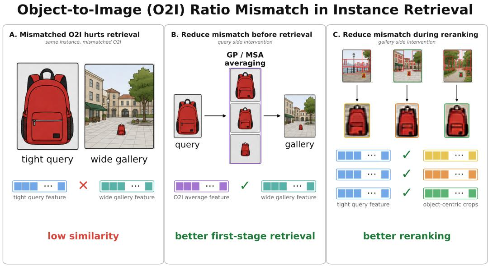
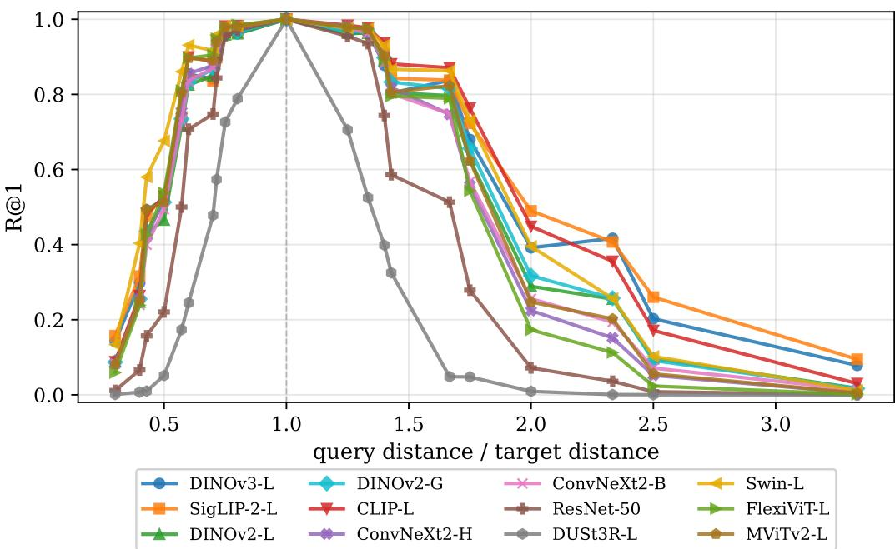
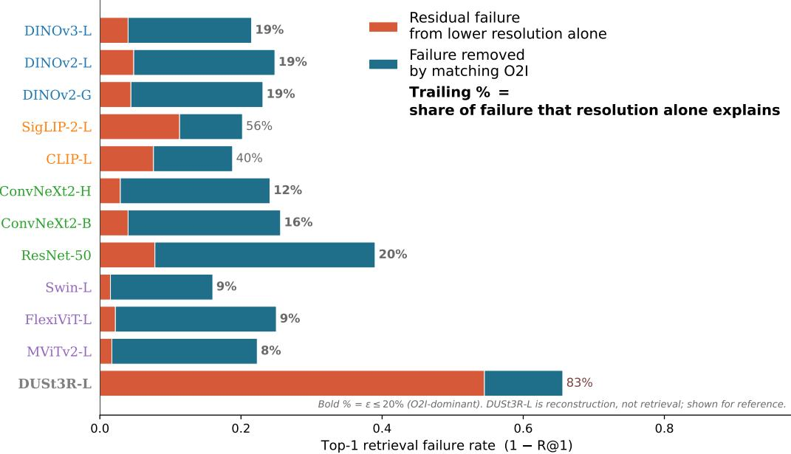
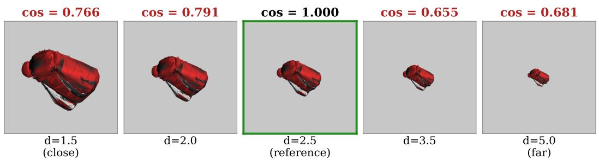
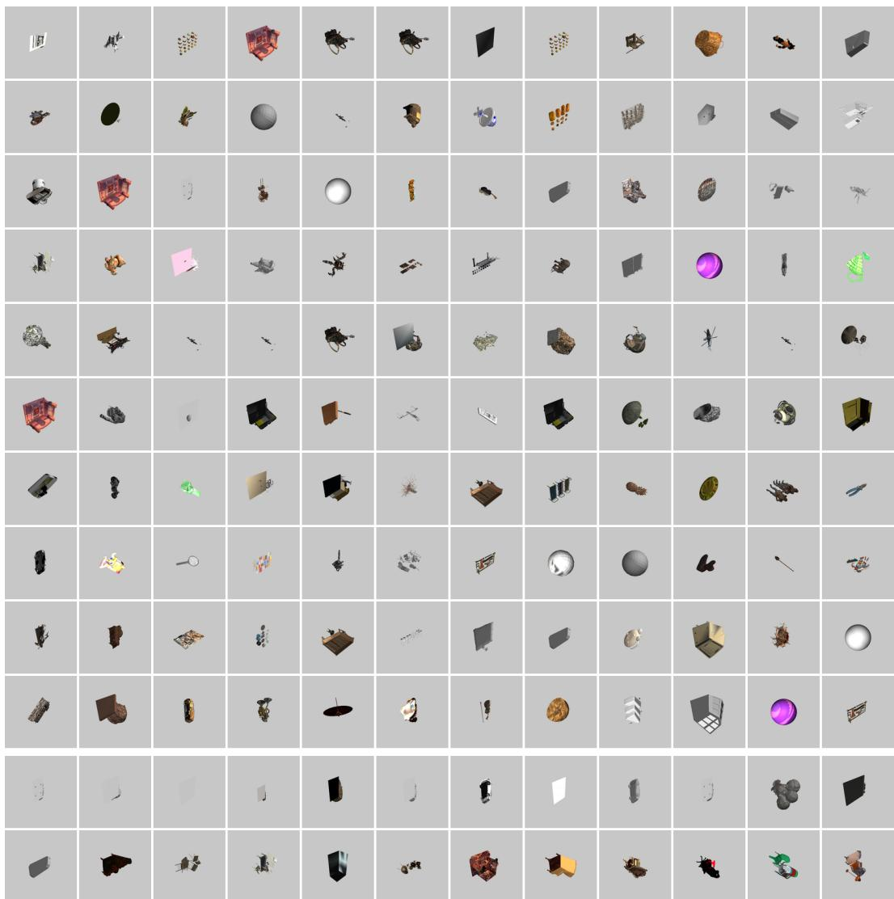
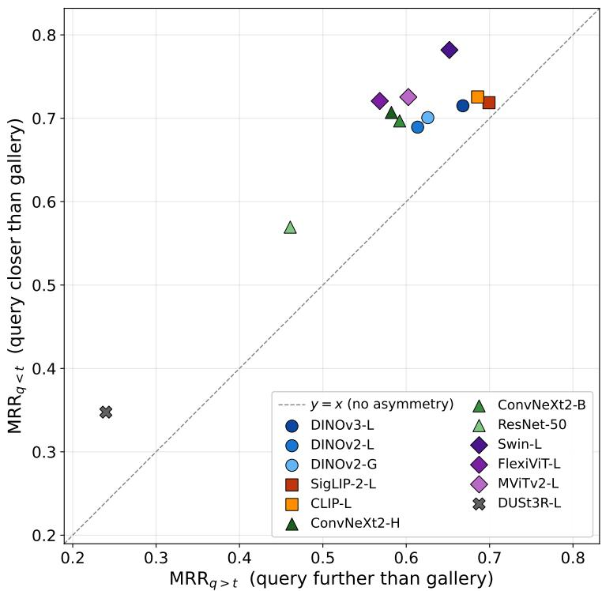
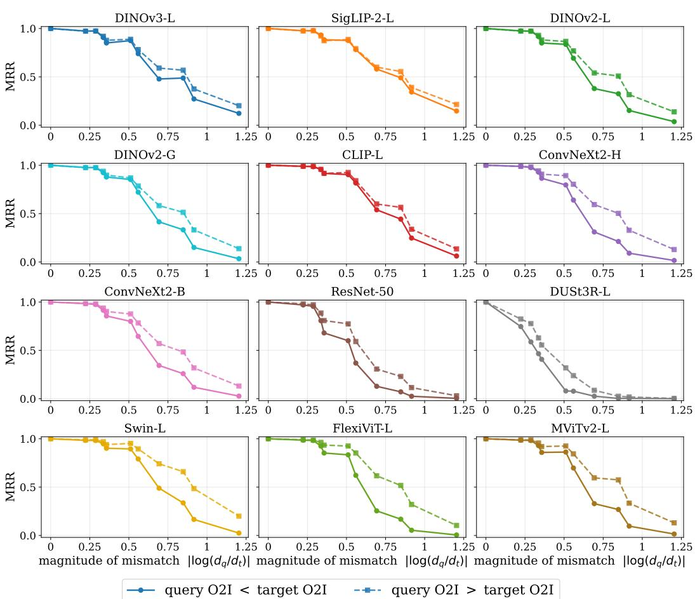

# BEYOND RESOLUTION: OBJECT-TO-IMAGE RATIO MISMATCH IN INSTANCE RE-TRIEVAL

Boaz Meivar∗   
Tel Aviv University   
boazmeivar@mail.tau.ac.il

Ofir Kedem∗ Tel Aviv University ofirk@mail.tau.ac.il

Amit Edenzon∗   
Bar-Ilan University   
amit.edenzon@live.biu.ac.il   
Gal Chechik   
Bar-Ilan University   
gal.chechik@biu.ac.il

Shai Avidan Tel Aviv University avidan@eng.tau.ac.il

## ABSTRACT

Visual instance retrieval often fails when the same object appears at different apparent sizes in the query and gallery. We show that the dominant cause is usually not resolution loss but object-to-image (O2I) ratio mismatch: the object occupies different fractions of the two images. On a controlled benchmark of 3,021 Objaverse objects rendered at five camera distances, more than 80% of the crossdistance degradation is attributable to O2I mismatch rather than resolution for 9 of 12 pretrained backbones; multi-scale architectures cut the resolution-only effect to single digits yet remain equally susceptible. The failure is also asymmetric: tight queries retrieve more reliably against wide gallery images than the reverse. Guided by this analysis, query-side scale augmentation and an OWLv2 crop reranker reach state of the art on ILIAS 100M (29.2 mAP@1000 before reranking, 42.0 after) without training or modifying the precomputed gallery index, and a LoRA fine-tune matches the query-side gains at a single forward pass, showing that O2I robustness is learnable.

## 1 INTRODUCTION

Visual instance retrieval asks whether a gallery image contains the same physical object as a query (Kordopatis-Zilos et al., 2025; Radenovic et al., 2018; Weyand et al., 2020). A common´ modern pipeline encodes each image with a pretrained vision backbone, normalizes the resulting global descriptor, and ranks gallery images by some predefined metric like cosine similarity. This formulation is simple and effective, but its failures are difficult to interpret: image pairs vary simultaneously in viewpoint, illumination, occlusion, background, pose, framing, and camera distance. Overall retrieval scores therefore reveal that a model fails, but not which visual factor caused the failure.

A long-standing difficulty in image retrieval is the small target: an object that occupies a small fraction of the image is hard to find, a problem documented from classification (Pawlowski et al., 2019) to instance retrieval (Green et al., 2025; Choi et al., 2026). The failure is commonly attributed to properties of the image itself: surrounding clutter, limited object resolution, or lost detail. This view motivates many standard responses to scale variation: multi-scale features (He et al., 2015; Lin et al., 2017), local descriptors (Tolias et al., 2016), or architectures designed to preserve spatial detail (Liu et al., 2021; Beyer et al., 2023; Li et al., 2022).

  
Figure 1: We study how object-to-image (O2I) ratio mismatch degrades feature similarity (panel A). Motivated by the analysis results, we apply query-side (panel B) and gallery-side (panel C) interventions to reduce the O2I mismatch between query and gallery, and observe a significant improvement in retrieval outcome, reaching state of the art on the ILIAS 100M benchmark.

We show that a major cause of this failure in image retrieval is the mismatch between the fractions the object occupies in the query and in the gallery image. The effect requires neither clutter nor resolution loss: with an identical object view, a neutral background, and matched resolution (Section 4.3), the global feature vector itself changes considerably when only the occupied fraction changes. A small query object that is matched by a small target retrieves reliably, while an identical object that is mismatched does not.

Two factors co-vary under scale change: when an image is zoomed out, the object simultaneously becomes smaller relative to the frame (a lower object-to-image ratio, O2I (Pawlowski et al., 2019)) and loses pixel density (lower effective resolution). One might infer that targeting either factor is sufficient, since the two are linearly coupled. However, we show in Section 4 below that addressing resolution alone (e.g., with multi-scale architectures) does not fix O2I-related retrieval failures. Directly addressing O2I, without improving resolution, successfully mitigates the failure mode (Section 5). We refer to the dominant effect as object-to-image mismatch (O2I mismatch). Unlike resolution loss, object-to-image mismatch changes the image support from which the descriptor is formed. A tightly framed object produces a descriptor whose input is mostly the target object, whereas a wide image produces a descriptor in which the same object is only a small part of the input. Thus, retrieval may fail not because the object is visually unrecoverable, but because the same instance is compared under incompatible image support. These two mechanisms are usually conflated under “scale mismatch” but imply different interventions: resolution loss calls for preserving or recovering object detail, whereas object-to-image mismatch calls for comparing objects at compatible fractions of the input image.

We test this distinction with a controlled synthetic benchmark of 3,021 Objaverse objects rendered at five camera distances with fixed viewpoint and neutral background. Because only camera distance changes, we can construct matched comparisons that isolate pixel resolution from object-to-image mismatch. Across twelve backbones spanning self-supervised, vision-language, supervised, multiscale, and reconstruction-based training paradigms, we find that the intuitive resolution explanation is not the dominant factor. For 9 of 12 backbones tested, more than 80% of the cross-distance retrieval degradation is attributable to object-to-image mismatch rather than resolution loss. Multi-scale architectures reduce the resolution-only effect, but remain equally susceptible to object-to-image mismatch: used as global descriptors, scale-specific architectures deliver resolution invariance, but not invariance to the fraction of the input the object occupies. We additionally observe that the failure is asymmetric: tight queries retrieve more reliably against wide gallery images than wide queries retrieve against tight gallery images.

Motivated by these findings, we apply simple interventions targeting object-to-image mismatch on ILIAS 100M, including query-side scale augmentation and an OWLv2 crop reranker. These methods compare objects at more compatible fractions of the input image and reach state-of-the-art performance without training a new backbone or modifying the precomputed gallery index. We also show that object-to-image robustness is learnable: a LoRA fine-tune of DINOv3-L achieves similar gains to query-side test-time interventions while requiring only a single forward pass per image.

## Contributions.

• We isolate the failure mode. We construct a controlled benchmark (3,021 objects, five camera distances, fixed viewpoint) in which only the O2I ratio varies, and show that all 12 evaluated backbones degrade sharply under O2I mismatch, including architectures designed for multi-scale processing (Swin, FlexiViT, MViTv2).

• We attribute it: resolution is generally not the bottleneck. Equalizing the object-to-image ratio between query and gallery recovers more than 80% of the cross-distance failure on 9 of 12 backbones tested; the residual is attributable to resolution loss, since all other factors are controlled by construction.

• We identify its direction. The failure is asymmetric: tight queries retrieve more reliably against wide gallery images than the reverse, revealing a directional property of how global descriptors encode object support.

• We correct it at web scale, training-free. Query-side scale augmentation reaches 29.2 mAP@1000 in first-stage retrieval and an OWLv2 crop reranker 42.0 after reranking, on ILIAS 100M, without training or modifying the precomputed gallery index.

• We show it is learnable. A LoRA fine-tune of DINOv3-L matches the test-time interventions at single-forward-pass cost, suggesting O2I invariance can be built into the representation by pretraining.

## 2 RELATED WORK

Instance retrieval benchmarks. Instance retrieval has traditionally been evaluated on landmarkcentric benchmarks such as Oxford and Paris (Philbin et al., 2007; 2008), later revised to reduce label noise and saturation (Radenovic et al., 2018). Google Landmarks (Weyand et al., 2020) scaled´ evaluation to millions of images and broader visual diversity, while ILIAS (Kordopatis-Zilos et al., 2025) targets instance-level retrieval at scale with curated positives, hard distractors, and unsaturated performance for modern foundation models. These benchmarks are indispensable for measuring realworld retrieval, but they entangle many nuisance factors at once, including viewpoint, background, occlusion, and framing. As a result, they are not well suited to answering a narrower scientific question: how much of the failure comes specifically from query–gallery O2I mismatch?

Controlled robustness and distribution shift. A broad literature studies robustness under distribution shift, but typically through classification rather than retrieval. ImageNet-C (Hendrycks & Dietterich, 2019) measures sensitivity to corruptions such as blur, noise, and weather, while ObjectNet (Barbu et al., 2019) highlights the importance of controlled evaluation under changes in viewpoint, background, and pose. Related work on shortcut learning argues that modern models often exploit spurious or context-heavy cues that fail under shift (Geirhos et al., 2020). In parallel, recent analyses of Vision Transformers show that high-norm or artifact tokens can arise in low-information background regions, indicating that global representations need not be purely object-centric (Darcet et al., 2024). These results motivate studying apparent object size as a distinct factor: when the object becomes small, the representation may devote a larger fraction of its capacity to surrounding content. However, this issue has rarely been isolated in instance retrieval.

Scale-aware representations. Multi-scale designs from spatial pyramid pooling and feature pyramids (He et al., 2015; Lin et al., 2017) to scale-equivariant networks (Worrall & Welling, 2019; Sosnovik et al., 2020; Rahman & Yeh, 2023) and scale-aware transformers (Lin et al., 2023) treat scale as a structural property to be modeled directly. They are typically evaluated on classification or detection, not image-to-image retrieval under controlled O2I mismatch. Detection and localization have addressed scale explicitly for decades, from scale-invariant interest points (Lowe, 2004) and image pyramids to objectness scoring and open-vocabulary detectors (Minderer et al., 2023; Liu et al., 2024). This machinery relies on localized readout, which web-scale first-stage retrieval cannot afford per gallery image; we leverage it where it is affordable, at the reranking stage (Section 5.5).

Retrieval-time multi-scale inference and recent work. Regional/part-based representations (Tolias et al., 2016) and query expansion/reranking (Chum et al., 2007; Arandjelovic & Zisserman, 2012)´ operate on local structure or refine global rankings. Recent work on patch-wise retrieval (Choi et al., 2026) decomposes gallery images into multi-scale grid patches and max-pools their similarities, empirically finding that local matching helps most for small and off-center objects (they also evaluate a Grounding-DINO (Liu et al., 2024) region-proposal variant as an upper-bound baseline). We identify the shared phenomenon these methods exploit: O2I mismatch between query and gallery. Any intervention that equalizes it yields consistent gains, including Patchify (Choi et al., 2026), the query-side scale augmentation of Section 5, and the OWLv2 crop reranker of Section 5.5.

## 3 CONTROLLED O2I BENCHMARK

Real-world retrieval benchmarks (Radenovic et al., 2018; Kordopatis-Zilos et al., 2025) vary O2I´ alongside viewpoint, lighting, background, and partial occlusion, so a backbone’s failure on any given query cannot be attributed to O2I specifically. To measure O2I’s isolated effect on the representation, we construct a synthetic benchmark in which only the O2I ratio varies and every other factor is held fixed by construction: the same object, the same viewpoint, the same lighting, the same (neutral) background, across a range of camera distances (up to the mild perspective foreshortening that accompanies a distance change under a perspective camera).

## 3.1 DATASET CONSTRUCTION

We render 3,021 objects from the Objaverse dataset (Deitke et al., 2023), drawn from 120 categories. Each object is rendered at five camera distances $d \in \{ 1 . 5 , 2 . 0 , 2 . 5 , 3 . 5 , 5 . 0 \}$ from a single canonical isometric viewpoint (azimuth 45◦, elevation $3 5 . 3 ^ { \circ } )$ using a perspective camera with a $4 5 ^ { \circ }$ vertical field of view, producing 15,105 images at $5 1 2 \times 5 1 2$ resolution. The reference distance $d { = } 2 . 5$ is chosen so that a nominal object fills roughly half the frame; the five distances span a 3.3× range in apparent object size. Each mesh is centered at the origin and normalized to unit maximum boundingbox extent before rendering, so the range of O2I ratios across the five distances is identical for every object—a distance change corresponds to the same apparent-size change regardless of the object’s original mesh scale.

Rendering uses GPU rasterization via Kaolin (Jatavallabhula et al., 2019) with three-point lighting and a neutral gray background, ensuring that the dominant variation across images of the same object is the fraction of the image it occupies (residual perspective foreshortening aside). This design isolates the O2I ratio from viewpoint, lighting, and background—confounds that are unavoidable in real-world benchmarks. Example renderings of one Objaverse object across the five distances appear in Section A.

## 3.2 CROSS-DISTANCE RETRIEVAL PROTOCOL

For each ordered pair of distances $\left( d _ { q } , d _ { t } \right)$ with $d _ { q } \neq d _ { t }$ , each of the 3,021 objects serves as a query (rendered at $d _ { q } )$ . The gallery is 15,101 items: the same object at $d _ { t }$ plus all other objects at all five distances. The query object’s renderings at the four remaining distances are masked to prevent trivial self-matches.

This yields N ranks per pair, from which we compute R@1, R@5, R@10, and mean reciprocal rank (MRR). We aggregate across the 20 off-diagonal pairs by the directional O2I ratio $\mathrm { O 2 } \dot { \mathrm { I } } _ { q } / \mathrm { O 2 } \mathrm { I } _ { t } =$ $( d _ { t } / d _ { q } ) ^ { 2 }$ (values >1 when the query is closer/larger than the target, <1 when farther/smaller).

  
Figure 2: A comparison of retrieval performance of twelve backbones as the O2I ratio changes. The y-axis is cross-distance R@1; the x-axis is the camera-distance ratio $d _ { q } / d _ { t }$ (ratio = 1 is selfretrieval). All backbones degrade with O2I mismatch, including those built for scale invariance (Swin-L, FlexiViT-L, MViTv2-L). Performance degrades for both directions, losing 0.5–0.9 R@1 at the extremes.

## 3.3 BACKBONES EVALUATED

We cover twelve backbones spanning five training paradigms: self-supervised (DINOv2-L, DINOv2- G (Oquab et al., 2024), DINOv3-L (Siméoni et al., 2025)), vision-language contrastive (CLIP-L (Radford et al., 2021), SigLIP-2-L (Tschannen et al., 2025)), supervised classification (ConvNeXt V2-H, ConvNeXt V2-B (Woo et al., 2023), ResNet-50 (He et al., 2016)), hierarchical/multi-scale architectures designed to handle scale variation (Swin-L (Liu et al., 2021), FlexiViT-L (Beyer et al., 2023), MViTv2-L (Li et al., 2022)), and 3D reconstruction (DUSt3R-L (Wang et al., 2024)). Including the hierarchical family lets us test whether architectures built for scale robustness also confer robustness to O2I mismatch. Implementation details are listed in Section Q.

## 4 O2I ROBUSTNESS ANALYSIS

We now ask what the isolated effect of O2I mismatch is on current retrieval backbones. We first show that every backbone degrades with cross-distance mismatch, then disentangle the contribution of O2I from that of pixel-resolution loss (Section 4.2), and finally surface a directional asymmetry of the failure (Section 4.4).

## 4.1 ALL MODELS DEGRADE UNDER O2I MISMATCH

We first establish the cross-distance failure curve. Figure 2 shows that retrieval peaks at selfdistance and degrades as the camera-distance ratio diverges in either direction. At the most extreme ratio (3.3× camera-distance change) even the strongest backbone (SigLIP-2-L) retains only 0.126 R@1. Crucially, architectures designed explicitly for multi-scale processing (Swin-L, FlexiViT-L, MViTv2-L) degrade along the same curve as standard ViTs. Per-backbone breakdowns and a detailed comparison appear in Section G.

## 4.2 DISENTANGLING O2I FROM RESOLUTION

A plausible explanation for the curves in Figure 2 is resolution loss: at larger camera distances, fewer pixels cover the object. In our controlled renders, however, distance changes both object resolution and object-to-image ratio (O2I). We disentangle these factors by comparing raw crossdistance retrieval to retrieval after O2I matching. For each backbone, we evaluate all 20 ordered cross-distance pairs in two conditions: α, the raw R@1 where query and gallery differ in both O2I and resolution, and β, the R@1 after tight-cropping both images to the object bounding box and bilinearly upsampling each crop to the backbone’s native input size, so that the object fills the frame in both images. Both conditions are evaluated against a single-distance gallery, the 3,021 objects rendered at the target distance $d _ { t } \colon$ tight crops of the same object at different distances collapse to near-identical images, so a multi-distance gallery is not meaningful under $\beta ,$ and evaluating α on the same gallery keeps the two conditions commensurable. Absolute R@1 is therefore higher than in Figure 2, which uses the 15,101-item multi-distance gallery; the decomposition compares α and $\beta$ under one fixed protocol. Because viewpoint, lighting, background, and centering are fixed by construction, cropping makes the O2I of query and gallery identical, while the resolution gap between them persists in full: the far crop is magnified from roughly 3× fewer captured pixels than the near one and remains commensurately blurrier, since upsampling adds no information. Within $\beta$ the two images of a pair therefore differ only in resolution, and the failure that survives is attributable to resolution alone. We define the remaining failure after O2I matching, $\delta = 1 - \beta$ , as the resolution-only residual in this controlled setting, and the raw failure, $\gamma = 1 - \alpha$ , as the combined effect of O2I mismatch and resolution loss; the resolution share $\varepsilon = \delta / \gamma$ is the fraction of cross-distance failure explained by resolution alone. Patch-level pooling probes that complement this analysis appear in Section L.1.

Figure 3 reports the decomposition across 11 retrieval backbones plus DUSt3R-L (reconstruction, included for reference) on 3,021 Objaverse objects, each evaluated at its native input resolution; per-backbone numbers are in Table 2 (Section C). For 9 of 12 backbones tested, resolution accounts for at most 20% of the total cross-distance degradation. For DINOv3-L, for instance, the total drop is 0.215 while the resolution-only residual is only 0.040 (19% of the total); the remaining 81% vanishe once O2I is matched. The two outliers are vision-language models (SigLIP-2-L at 56%, CLIP-L at 41%), suggesting that contrastive image-text training leaves these backbones more sensitive to local pixel information than self-supervised ViTs of the same size. DUSt3R-L shows the opposite pattern (83% resolution share), consistent with a reconstruction backbone’s reliance on pixel detail.

Hierarchical/multi-scale architectures provide an informative control: designed for multi-scale processing, they cut the resolution-only residual to 0.015–0.022 (Swin-L, FlexiViT-L, MViTv2-L— resolution accounts for 8–9% of their total drop). Yet their total drop remains large (0.160–0.250), so they are still equally susceptible to O2I mismatch. Architectural resolution invariance does not transfer to O2I invariance, reinforcing that the two failure modes are mechanistically distinct. The fixed-pixel experiment of Section 4.3 complements the decomposition: it moves O2I while the object’s pixels are frozen exactly.

## 4.3 DECOUPLING O2I FROM RESOLUTION WITH FIXED PIXELS

The decomposition above matches O2I by cropping and upsampling, which alters the input pixels. To move O2I while holding resolution literally fixed, we take a tight object crop of each object (mask bounding box at the closest render distance, resized once so its longest side is 256 px) and paste the identical, unresized pixels at the center of gray canvases of growing size (256 to 1536 px), lowering the O2I ratio from 1 to 1/36 while the object’s pixels remain byte-identical in every condition. DINOv3-L processes each canvas at its native size. Table 3 reports the mean cosine similarity between the features of the identical crop on different canvases. The identical object drifts from itself as the O2I gap widens: at the largest gap, self-similarity falls to 0.77. Nothing about the object’s pixels differs; only the fraction of the image it occupies does. The two factors are colinear at acquisition, and conflated under “scale change”, but they are separate properties of the representation.

## 4.4 CROSS-DISTANCE RETRIEVAL IS ASYMMETRIC IN O2I

Beyond magnitude, the cross-distance failure has a directional component. Figure 6 plots, per backbone, the mean MRR with a wide query against a tight gallery $( \mathbf { M R R } _ { q > t }$ , x-axis) versus the reverse direction $( \mathbf { M } \mathbf { R } \mathbf { R } _ { q < t } , \mathbf { y } \mathbf { - a } \mathbf { x } \mathbf { i } \mathbf { s } )$ , aggregated over the 10 ordered cross-distance pairs in each direction. Every backbone sits above the $y = x$ diagonal: a query whose object is larger than the gallery’s matches more reliably than the reverse, with ∆ ranging from +0.020 (SigLIP-2-L) to +0.153 (FlexiViT-L). The effect holds across self-supervised, vision-language, supervised, and hierarchical/multi-scale families—consistent with a representation-level rather than family-specific cause. The scatter is shown in Figure 6 (Section E); per-backbone numbers are in Table 4 (Section E); per-pair MRR curves are in Section F.

  
Figure 3: Disentangling O2I from resolution across backbones. X-axis: cross-distance Top-1 failure rate $( 1 - \mathbb { R } \mathbb { Q } 1 )$ on 3,021 Objaverse objects. We tight-crop both query and gallery to the object bbox to match O2I. The teal segment is the failure recovered by this matching. The orange segment remains, attributable to resolution alone. Trailing % is orange’s share of the total. For 9 of 12 backbones tested it is less than 20%: O2I mismatch dominates. Multi-scale backbones have small resolution shares yet remain equally susceptible to O2I. Per-backbone numbers: Table 2 (Section C).

## 5 CONFIRMING THE DIAGNOSIS ON ILIAS 100M

If O2I mismatch is the operative cause of cross-distance retrieval failure, an intervention that equalizes it should help on real benchmarks. We test this on ILIAS 100M (Table 1) and ROxford/RParis (Section H); the results confirm the prediction and, as a side effect, achieve state of the art on ILIAS 100M without training or gallery modification.

Setup. We evaluate on ILIAS (Kordopatis-Zilos et al., 2025) with DINOv3-L, a top-performing model on its leaderboard: 1,232 queries, 4,715 positives, 100M YFCC distractors, official DINOv3- L/16 gallery features (768 px), extracted once without augmentation.

## 5.1 APPROACH

Gray-pad averaging (GP). For each scale $s \in \{ 1 . 0 , 0 . 7 5 , 0 . 5 , 0 . 3 3 , 0 . 2 5 \}$ , we resize the query to $( s W , s H )$ , center it on a neutral gray canvas (RGB (128, 128, 128)) of the original size, extract the backbone’s CLS feature, average the per-scale features, and ℓ2-normalize, producing a single query vector of unchanged dimension: index storage and search cost are identical to the baseline, and the only overhead is the extra query-side forward passes. This presents the query at multiple apparent sizes, spanning a 4× range.

Table 1: Simple query- and gallery-side object-to-image matching interventions achieve state of the art on ILIAS 100M. DINOv3-L backbone, 1,232 queries, ∼100M gallery. Oracle = upper bound for any reranker on the DINOv3-L top-1000 shortlist. Full table with query/gallery-side cost breakdown and paired t-test p-values: Table 13 (Section N).
<table><tr><td>Method</td><td>mAP@1000</td></tr><tr><td>Pre-reranking (first-stage retrieval)</td><td></td></tr><tr><td>DINOv3-L (baseline)</td><td>26.5</td></tr><tr><td>DINOv3-L + GP (query-side scale averaging)</td><td>28.3</td></tr><tr><td>DINOv3-L + MSA (query-side, masked)</td><td>29.2</td></tr><tr><td>Reranking over top-1000 shortlist</td><td></td></tr><tr><td>Leaderboard best: PE-L (adapt.) + AMES (Šuma et al., 2024)</td><td>39.4</td></tr><tr><td>+ OWLv2 crop rerank (gallery-side)</td><td>42.0</td></tr><tr><td>Oracle ceiling (perfect rerank over top-1000)</td><td>50.9</td></tr></table>

Masked Scale Augmentation (MSA). At s=0.25 most patches in the input are gray, yet the CLS token still attends to them. MSA uses a sparser scale set {1.0, 0.5, 0.25} and, at each scale, adds an additive attention mask of −∞ on every gray patch key (applied before softmax in every transformer layer), forcing the CLS token to attend only to object-bearing patches. Cost is 3× query-time FLOPs; the mask itself is negligible. MSA relies on DINOv3’s register tokens (Siméoni et al., 2025; Darcet et al., 2024) to absorb displaced attention.

## 5.2 RESULTS

Table 1 presents pre-reranking results. GP improves R@1 from 0.550 to 0.582 (+5.8% relative), and MSA improves it further to 0.592 (+7.7%); MSA also lifts R@5 from 0.625 to 0.683 (+9.3%) and mAP@1000 from 0.265 to 0.292 (+10.2%). All improvements over the baseline are statistically significant (p < 0.001); paired-test p-values for mAP@1000 are in Table 13 (Section N); the full testing methodology, including McNemar tests for the recall metrics, is in Section O. A simple training-free intervention motivated by the diagnostic findings yields a +2.7 pp absolute mAP improvement (10% relative) on the current leaderboard model, supporting the conclusion that O2I mismatch is a practically addressable bottleneck. The computational overhead is 3× query-time FLOPs, and the gains are additive to any downstream reranking since they raise the oracle ceiling.

Cross-dataset generalization. MSA generalizes beyond ILIAS: on the Revisited Oxford5K (Radenovic et al., 2018) and Paris6K benchmarks, it improves mAP on both Medium ( ´ +0.8 pp Oxford, +0.7 pp Paris) and Hard (+1.6 pp Oxford, +1.3 pp Paris) protocols, with the largest gains where query–gallery O2I mismatch is most severe (Section H). ILIAS remains the primary benchmark because both its queries and gallery positives carry box annotations, so the query–gallery O2I mismatch is directly measurable; ROxford/RParis annotate only the queries, and therefore serve as a reference.

## 5.3 GAINS ARE CONCENTRATED WHERE O2I MISMATCH EXISTS

Stratifying ILIAS queries by their query-vs-positive O2I ratio (median 3.25×; 93% of queries are tighter than their positives), Table 14 shows MSA gains concentrate where they should: the reversedirection bin (<1×) is slightly degraded, moderate mismatches gain most (+4.4 to +5.5 pp R@1), and extreme ratios (> 10×) gain less because the scale grid bottoms out at 0.25×. The pattern confirms the intervention is O2I-specific rather than generic ensembling (Section P).

Scale is not generic test-time augmentation. At equal 5-view cost, GP yields +3.2 pp R@1 while the best non-scale augmentation ensemble yields only +0.8 pp (Section K.1); alternative scale-pooling strategies are near-equivalent to GP and all dominated by MSA (Section K.2).

Comparison with query expansion. αQE (Chum et al., 2007), the standard query-side enhancement, lifts mAP (26.5 to 29.1) but degrades R@5/R@10 and cannot fix a wrong top match; our interventions improve every metric, and the two stack to 31.4 mAP@1000 (Table 8, Section I).

Mirroring the augmentations onto the gallery side instead hurts retrieval, exactly as the O2I analysis predicts, while an oracle gallery-side zoom helps strongly (Section J).

## 5.4 LEARNABLE ALTERNATIVE: LORA FINE-TUNE

GP and MSA address O2I at test time. We additionally test whether training can build O2I robustness directly into the backbone: rank-8 LoRA adapters (Hu et al., 2022) on every DINOv3-L attention layer, trained to match the frozen baseline’s CLS on the canonical view while the student sees a gray-padded, attention-masked, lower-O2I view (full recipe in Section M). On the full ILIAS 100M index, the adapted backbone reaches R@1 = 60.2 and mAP@1000 = 29.7, matching or exceeding the test-time interventions (MSA: 59.2/29.2) with a single forward pass per image (training details and proxy-gallery ablations in Section M). The training-time result confirms the diagnosis from a third angle: O2I robustness can be learned rather than imposed at query time.

## 5.5 RERANKING-STAGE CONFIRMATION: OBJECT-CENTRIC CROPS

The diagnosis makes the same prediction at the reranking stage: localizing the object in each top-k candidate and re-encoding it at a canonical scale removes the O2I mismatch by construction, so reranking should improve (recent work reports the same pattern with a Grounding-DINO (Liu et al., 2024) region-proposal variant (Choi et al., 2026)).

Approach. Given the top-1000 first-stage candidates from DINOv3-L, we use OWLv2 (Minderer et al., 2023) in class-agnostic objectness mode (no text query; objectness above 0.02, top-50 boxes per image) to localize candidate regions in each gallery image. Each region is cropped, padded to a square, and re-encoded by frozen DINOv3-L, giving a query-independent per-region feature database computed once per gallery image. The reranking score of a (query, gallery) pair is the maximum cosine similarity between the query’s original feature and any region feature; the first-stage score is unused. No training; gallery-side detection and crop encoding are amortized across all queries.

Results. The reranking rows of Table 1 report rerank metrics on ILIAS 100M. OWLv2 crop reranking improves mAP@1000 from 26.5 (DINOv3-L first stage) to 42.0, an absolute gain of +15.5 pp (+58% relative). R@1 improves from 55.0 to 76.0 (+21.0 pp). This sets a new state of the art for ILIAS 100M reranking, exceeding the best reported leaderboard result (PE-L with linear adaptation + AMES reranking (Šuma et al., 2024), 39.4 mAP@1000) by +2.6 pp mAP. The oracle ceiling for any top-1000 reranker on this shortlist is 50.9 mAP, indicating substantial remaining headroom for shortlist-aware methods. A mechanism-level probe (Section L) uses an attention-mask intervention that removes outside-bbox context without changing any pixels; it attributes at least 51% of the crop-rerank gain on ILIAS and 65% on INSTRE to O2I normalization itself, with the rest due to outside-bbox context.

## 6 DISCUSSION AND CONCLUSION

We analyzed O2I mismatch as an isolated failure mode of visual instance retrieval: equalizing O2I removes most of the cross-distance failure, the failure is asymmetric in direction, and scaleinvariant architectures do not transfer that invariance to O2I. The training-free interventions on ILIAS 100M achieve state of the art (29.2 pre-rerank, 42.0 post-rerank), corroborating the analysis, and a lightweight LoRA fine-tune (Section 5.4) matches them at single-forward-pass cost. Scaling this to full pretraining is the natural next step toward retrieval backbones that are O2I-invariant by construction.

## REPRODUCIBILITY STATEMENT

The synthetic benchmark is fully specified in Section 3 (Objaverse object set, five camera distances, fixed isometric viewpoint, Kaolin rasterization); backbone checkpoints and input resolutions are listed in Section Q. ILIAS experiments use the official queries, gallery, and released DINOv3-L/16 gallery features; the GP and MSA interventions are defined by their scale sets and attention masks in Section 5, the LoRA recipe in Section M, and the reranker protocol, with its objectness threshold and box cap, in Section 5.5. Significance testing methodology is described in Section O. Rendering, evaluation, and intervention code will be released, together with the exact Objaverse object identifiers and the category-selection procedure.

## AI USE STATEMENT

In this work, we used generative AI tools as general-purpose aids for drafting and polishing parts of the paper, for identifying related work, and for writing and editing code, including the implementation of evaluation code (implement methods). We have reviewed all AI-assisted work and take responsibility for the final content of this work, including text, claims, and artifacts produced with the aid of generative AI.

## REFERENCES

R. Arandjelovic and A. Zisserman. Three things everyone should know to improve object retrieval.´ In CVPR, 2012.

A. Barbu, D. Mayo, J. Alverio, W. Luo, C. Wang, D. Gutfreund, J. Tenenbaum, and B. Katz. ObjectNet: A large-scale bias-controlled dataset for pushing the limits of object recognition models. In NeurIPS, 2019.

L. Beyer, P. Izmailov, A. Kolesnikov, M. Caron, S. Kornblith, X. Zhai, M. Minderer, M. Tschannen, I. Alabdulmohsin, and F. Pavetic. FlexiViT: One model for all patch sizes. In CVPR, 2023.

W. Choi, S. Lim, N. Hyeon-Woo, M. Ye-Bin, D.-J. Jeong, J. Hwang, and T.-H. Oh. Patch-wise retrieval: A bag of practical techniques for instance-level matching. In WACV, 2026.

O. Chum, J. Philbin, J. Sivic, M. Isard, and A. Zisserman. Total recall: Automatic query expansion with a generative feature model for object retrieval. In ICCV, 2007.

T. Darcet, M. Oquab, J. Mairal, and P. Bojanowski. Vision transformers need registers. In ICLR, 2024.

M. Deitke, D. Schwenk, J. Salvador, L. Weihs, O. Michel, E. VanderBilt, L. Schmidt, K. Ehsani, A. Kembhavi, and A. Farhadi. Objaverse: A universe of annotated 3D objects. In CVPR, 2023.

R. Geirhos, J.-H. Jacobsen, C. Michaelis, R. Zemel, W. Brendel, M. Bethge, and F. A. Wichmann. Shortcut learning in deep neural networks. Nature Machine Intelligence, 2(11):665–673, 2020.

M. Green, M. Levy, I. Tzachor, D. Samuel, N. Darshan, and R. Ben-Ari. Find your needle: Small object image retrieval via multi-object attention optimization. In NeurIPS, 2025.

K. He, X. Zhang, S. Ren, and J. Sun. Spatial pyramid pooling in deep convolutional networks for visual recognition. IEEE TPAMI, 37(9):1904–1916, 2015.

K. He, X. Zhang, S. Ren, and J. Sun. Deep residual learning for image recognition. In CVPR, 2016.

D. Hendrycks and T. Dietterich. Benchmarking neural network robustness to common corruptions and perturbations. In ICLR, 2019.

E. J. Hu, Y. Shen, P. Wallis, Z. Allen-Zhu, Y. Li, S. Wang, L. Wang, and W. Chen. LoRA: Low-rank adaptation of large language models. In ICLR, 2022.

K. M. Jatavallabhula, E. Smith, J.-F. Lafleche, C. Fuji Tsang, A. Rozantsev, W. Chen, T. Xiang, R. Lebaredian, and S. Fidler. Kaolin: A PyTorch library for accelerating 3D deep learning research. arXiv preprint arXiv:1911.05063, 2019.

G. Kordopatis-Zilos, V. Stojnic, A. Manko, P. Šuma, N.-A. Ypsilantis, N. Efthymiadis, Z. Laskar,´ J. Matas, O. Chum, and G. Tolias. ILIAS: Instance-level image retrieval at scale. In CVPR, 2025.

Y. Li, C.-Y. Wu, H. Fan, K. Mangalam, B. Xiong, J. Malik, and C. Feichtenhofer. MViTv2: Improved multiscale vision transformers for classification and detection. In CVPR, 2022.

T.-Y. Lin, P. Dollár, R. Girshick, K. He, B. Hariharan, and S. Belongie. Feature pyramid networks for object detection. In CVPR, 2017.

W. Lin, Z. Wu, J. Chen, J. Huang, and L. Jin. Scale-aware modulation meet transformer. In ICCV, 2023.

S. Liu, Z. Zeng, T. Ren, F. Li, H. Zhang, J. Yang, Q. Jiang, C. Li, J. Yang, H. Su, J. Zhu, and L. Zhang. Grounding DINO: Marrying DINO with grounded pre-training for open-set object detection. In ECCV, 2024.

Z. Liu, Y. Lin, Y. Cao, H. Hu, Y. Wei, Z. Zhang, S. Lin, and B. Guo. Swin Transformer: Hierarchical vision transformer using shifted windows. In ICCV, 2021.

D. G. Lowe. Distinctive image features from scale-invariant keypoints. IJCV, 60(2):91–110, 2004.

M. Minderer, A. Gritsenko, and N. Houlsby. Scaling open-vocabulary object detection. In NeurIPS, 2023.

M. Oquab, T. Darcet, T. Moutakanni, H. Vo, M. Szafraniec, V. Khalidov, P. Fernandez, D. Haziza, F. Massa, A. El-Nouby, et al. DINOv2: Learning robust visual features without supervision. TMLR, 2024.

N. Pawlowski, S. Bhooshan, N. Ballas, F. Ciompi, B. Glocker, and M. Drozdzal. Needles in haystacks: On classifying tiny objects in large images. arXiv preprint arXiv:1908.06037, 2019.

J. Philbin, O. Chum, M. Isard, J. Sivic, and A. Zisserman. Object retrieval with large vocabularies and fast spatial matching. In CVPR, 2007.

J. Philbin, O. Chum, M. Isard, J. Sivic, and A. Zisserman. Lost in quantization: Improving particular object retrieval in large scale image databases. In CVPR, 2008.

F. Radenovic, A. Iscen, G. Tolias, Y. Avrithis, and O. Chum. Revisiting Oxford and Paris: Large-scale´ image retrieval benchmarking. In CVPR, 2018.

A. Radford, J. W. Kim, C. Hallacy, A. Ramesh, G. Goh, S. Agarwal, G. Sastry, A. Askell, P. Mishkin, J. Clark, et al. Learning transferable visual models from natural language supervision. In ICML, 2021.

M. A. Rahman and R. A. Yeh. Truly scale-equivariant deep nets with Fourier layers. In NeurIPS, 2023.

O. Siméoni, H. V. Vo, M. Seitzer, F. Baldassarre, M. Oquab, C. Jose, V. Khalidov, M. Szafraniec, S. Yi, M. Ramamonjisoa, F. Massa, D. Haziza, L. Wehrstedt, J. Wang, T. Darcet, T. Moutakanni, L. Sentana, C. Roberts, A. Vedaldi, J. Tolan, J. Brandt, C. Couprie, J. Mairal, H. Jégou, P. Labatut, and P. Bojanowski. DINOv3. arXiv preprint arXiv:2508.10104, 2025.

I. Sosnovik, M. Szmaja, and A. W. M. Smeulders. Scale-equivariant steerable networks. In ICLR, 2020.

P. Šuma, G. Kordopatis-Zilos, A. Iscen, and G. Tolias. AMES: Asymmetric and memory-efficient similarity estimation for instance-level retrieval. In ECCV, 2024.

G. Tolias, R. Sicre, and H. Jégou. Particular object retrieval with integral max-pooling of CNN activations. In ICLR, 2016.

M. Tschannen, A. Gritsenko, X. Wang, M. F. Naeem, I. Alabdulmohsin, N. Parthasarathy, T. Evans, L. Beyer, Y. Xia, B. Mustafa, O. Hénaff, J. Harmsen, A. Steiner, and X. Zhai. SigLIP 2: Multilingual vision-language encoders with improved semantic understanding, localization, and dense features. arXiv preprint arXiv:2502.14786, 2025.

S. Wang, V. Leroy, Y. Cabon, B. Chidlovskii, and J. Revaud. DUSt3R: Geometric 3D vision made easy. In CVPR, 2024.

T. Weyand, A. Araujo, B. Cao, and J. Sim. Google Landmarks dataset v2 – a large-scale benchmark for instance-level recognition and retrieval. In CVPR, 2020.

S. Woo, S. Debnath, R. Hu, X. Chen, Z. Liu, I. S. Kweon, and S. Xie. ConvNeXt V2: Co-designing and scaling convnets with masked autoencoders. In CVPR, 2023.

D. E. Worrall and M. Welling. Deep scale-spaces: Equivariance over scale. In NeurIPS, 2019.

## SUPPLEMENTARY MATERIAL

## A SYNTHETIC BENCHMARK: EXAMPLE RENDERINGS

Figure 4 shows a representative object from our controlled benchmark, rendered at the five camera distances described in Section 3 of the main paper. Across distances the object identity, viewpoint, lighting, and background are held fixed; only the fraction of the image the object occupies (its O2I ratio) varies. The cosine similarity of the per-distance feature to the reference rendering (d=2.5) drops below 0.8 at every off-reference distance for DINOv3-L, illustrating the cross-distance similarity decay analyzed in Section 4.

  
Figure 4: Example renderings from the controlled benchmark. The same backpack rendered from the same viewpoint at five camera distances; each label shows the DINOv3-L cosine similarity to the reference image (green border, d=2.5). Cosine drops below 0.8 at every off-reference distance, despite the object and viewpoint being identical—changing only the object’s fraction of the frame is enough to break feature similarity.

## B DATASET DIVERSITY: CATEGORIES AND INSTANCES

Figure 5 shows the diversity of the benchmark: one instance from each of the 120 categories (top block) and multiple instances of two example categories (bottom rows), all rendered at the reference distance d=2.5. The benchmark contains 3,021 objects across 120 categories, ∼25 instances per category.

## C DISENTANGLE DECOMPOSITION: PER-BACKBONE NUMBERS

Figure 3 of the main paper visualizes the disentangle decomposition. Table 2 below reports the full per-backbone numerical breakdown.

## D FIXED-PIXEL CANVAS EXPERIMENT: COSINE MATRIX

Table 3 reports the full cosine-similarity matrix for the fixed-pixel canvas experiment of Section 4.3 in the main paper.

## E PER-BACKBONE ASYMMETRY NUMBERS

Table 4 reports the per-backbone mean MRR underlying Figure 6 of the main paper.

## F PER-BACKBONE SYMMETRY CURVES

Table 4 in the main paper summarises the cross-distance asymmetry as a single mean-MRR per direction per backbone. Figure 7 shows the same data disaggregated by mismatch magnitude: each panel overlays both directions of mismatch for one backbone, with MRR on the y-axis and the magnitude of mismatch $| \log ( d _ { q } / d _ { t } ) |$ on the x-axis; dashed curves are query O2I > target O2I (tight query, $d _ { q } < d _ { t } )$ and solid curves are the reverse, so pairs at the same x have identical mismatch magnitude. The dashed curve sits clearly above the solid one across the entire range for every retrieval backbone, confirming that the asymmetry is not an artefact of averaging over magnitudes.

  
Figure 5: Benchmark diversity. Top block: one instance from each of the 120 categories. Bottom two rows: instances of two example categories, illustrating within-category variety. All images are the reference-distance (d=2.5) renders.

## G ADDITIONAL BACKBONE-COMPARISON RESULTS

Tables 5 and 6 report the per-backbone breakdown underlying the summary discussion in Section 4 of the main paper. No single factor—architecture, model size, or training objective—fully predicts O2I robustness, but several patterns emerge:

• Hierarchical/multi-scale models. Swin-L achieves the highest overall mean R@1 (0.677) and leads at moderate gaps $( | \Delta d | { = } 1 . 0 { - } 2 . 5 )$ , showing that hierarchical processing provides a genuine advantage. However, FlexiViT-L (0.604) and MViTv2-L (0.623) are no better than standard ViTs, and all three collapse at extreme gaps $( | \Delta d | { = } 3 . 5 ;$ Swin 0.073, MViTv2 0.044, FlexiViT 0.030). Multi-scale architecture mitigates but does not solve O2I mismatch.

Table 2: Disentangling O2I from resolution across backbones (3,021 Objaverse objects, mean cross-distance R@1 over 20 ordered distance pairs; both conditions evaluated against single-distance galleries of 3,021 items as described in Section 4.2, so absolute values are higher than the multidistance-gallery numbers of Table 5). α: standard retrieval (query and gallery differ in both objectto-image fraction, O2I, and pixel resolution). β: same retrieval after both query and gallery are tight-cropped to the object bbox and bilinearly upsampled to the backbone’s native input size, so only resolution differs. Derived columns $( \gamma , \delta , \varepsilon )$ are computed per the formulas in the header; the O2I share is $1 - \varepsilon .$ . For 9 of the 12 evaluated backbones (9 of 11 retrieval backbones), resolution accounts for ≤20% of the cross-distance failure. Hierarchical/multi-scale models (Swin-L, FlexiViT-L, MViTv2-L) have the smallest resolution-only residual, yet their O2I-only drops are comparable to standard ViTs of similar size—architectural scale invariance does not transfer to O2I invariance. DUSt3R-L is included as a reference (reconstruction, not retrieval); its failure is dominated by resolution loss, the opposite of the dominant retrieval pattern.
<table><tr><td>Backbone</td><td>Input</td><td>α Raw cross-dist. R@1</td><td>β R@1 after O2I matching</td><td> $\gamma = 1 - \alpha$  Total</td><td> $\delta = 1 - \beta$  Resolution-only residual</td><td> $\varepsilon = \delta / \gamma$  Resolution</td></tr><tr><td></td><td>px</td><td></td><td></td><td>drop</td><td></td><td>share</td></tr><tr><td>Self-supervised DINOv3-L</td><td>224</td><td>0.785</td><td>0.960</td><td>0.215</td><td>0.040</td><td>19%</td></tr><tr><td>DINOv2-L</td><td>224</td><td>0.752</td><td>0.952</td><td>0.248</td><td>0.048</td><td>19%</td></tr><tr><td>DINOv2-G</td><td>224</td><td>0.769</td><td>0.956</td><td>0.231</td><td>0.044</td><td>19%</td></tr><tr><td>Vision-language</td><td></td><td></td><td></td><td></td><td></td><td></td></tr><tr><td>SigLIP-2-L</td><td>384</td><td>0.798</td><td>0.887</td><td>0.202</td><td>0.113</td><td>56%</td></tr><tr><td>CLIP-L</td><td>336</td><td>0.812</td><td>0.924</td><td>0.188</td><td>0.076</td><td>40%</td></tr><tr><td>Supervised</td><td></td><td></td><td></td><td></td><td></td><td></td></tr><tr><td>ConvNeXt2-H</td><td>512</td><td>0.759</td><td>0.971</td><td>0.241</td><td>0.029</td><td>12%</td></tr><tr><td>ConvNeXt2-B</td><td>224</td><td>0.744</td><td>0.960</td><td>0.256</td><td>0.040</td><td>16%</td></tr><tr><td>ResNet-50</td><td>224</td><td>0.610</td><td>0.922</td><td>0.390</td><td>0.078</td><td>20%</td></tr><tr><td>Hierarchical/multi-scale</td><td></td><td></td><td></td><td></td><td></td><td></td></tr><tr><td>Swin-L</td><td>384</td><td>0.840</td><td>0.985</td><td>0.160</td><td>0.015</td><td>9%</td></tr><tr><td>FlexiViT-L</td><td>240</td><td>0.750</td><td>0.978</td><td>0.250</td><td>0.022</td><td>9%</td></tr><tr><td>MViTv2-L</td><td>224</td><td>0.777</td><td>0.983</td><td>0.223</td><td>0.017</td><td>8%</td></tr><tr><td>Reconstruction</td><td></td><td></td><td></td><td></td><td></td><td></td></tr><tr><td>DUSt3R-L</td><td>512</td><td>0.344</td><td>0.455</td><td>0.656</td><td>0.545</td><td>83%</td></tr><tr><td></td><td></td><td></td><td></td><td></td><td></td><td></td></tr></table>

Table 3: O2I moves, resolution frozen. Mean cosine similarity between DINOv3-L features of the identical object crop pasted on gray canvases of different sizes (3,021 objects; bootstrap 95% CIs within ±0.003). Only the fraction of the image occupied by the object changes across canvases; the object’s pixels are byte-identical.
<table><tr><td>Cosine</td><td>c@256</td><td>c@512</td><td>c@1024</td><td>c@1536</td></tr><tr><td>c@256</td><td>1.00</td><td>0.96</td><td>0.87</td><td>0.77</td></tr><tr><td>c@512</td><td>0.96</td><td>1.00</td><td>0.94</td><td>0.83</td></tr><tr><td>c@1024</td><td>0.87</td><td>0.94</td><td>1.00</td><td>0.94</td></tr><tr><td>c@1536</td><td>0.77</td><td>0.83</td><td>0.94</td><td>1.00</td></tr></table>

• Vision-language models (CLIP-L, SigLIP-2-L) are the most robust at extreme gaps. CLIP-L leads at small gaps; SigLIP-2-L is superior at $| \Delta d | \ge 2 . 5$ . We hypothesize that web-scale image-text training, where the same concept appears at widely varying apparent sizes, encourages scaletolerant representations—though differences in training data, objectives, and input resolution make this difficult to isolate cleanly.

• Model size is not decisive. DINOv3-L outperforms DINOv2-G (1.1B params) despite being $3 . 6 \times$ smaller; ConvNeXt2-H (657M) and ConvNeXt2-B (128M) perform nearly identically.

• Reconstruction features (DUSt3R-L) collapse to near-zero R@1 at large gaps (≤ 0.030 for $| \Delta d | \geq 2 . 0 )$ , confirming that dense stereo features are unsuitable for retrieval across varying O2I ratios.

  
Figure 6: Cross-distance retrieval is asymmetric in O2I. Each axis reports mean MRR over the 10 ordered cross-distance pairs on our synthetic Objaverse benchmark. The x-axis is the direction in which the query is farther from the object than the gallery $( \operatorname { M R R } _ { q > t } ) ;$ ; the y-axis is the reverse direction $( \mathbf { M R R } _ { q < t }$ , query closer than the gallery). The dashed diagonal is $y = x$ (no asymmetry). Each marker is one backbone; marker shape encodes the family, color shade the specific backbone within the family. Every backbone sits above the diagonal: a tight query against a wide gallery matches more reliably than the reverse.

## H CROSS-DATASET VALIDATION: ROXFORD5K AND RPARIS6K

To verify that the gains are not specific to ILIAS, we evaluate on the Revisited Oxford (Radenovic´ et al., 2018) and Paris benchmarks using the same DINOv3-L model and the standard revisited protocol. Queries in these benchmarks are bounding-box crops of architectural details (median area 27% for Oxford, 41% for Paris), while gallery images show full building views—a natural O2I mismatch.

MSA improves Medium mAP on both benchmarks (+0.8 on Oxford, +0.7 on Paris) and provides the largest gains on the Hard protocol (+1.6 on Oxford, +1.3 on Paris), where queries depict small architectural details that must be matched against full-scene gallery images. Plain GP slightly hurts on Oxford Easy (−2.4 pp) because easy queries already have moderate O2I overlap; attention masking in MSA largely mitigates this (−0.4 pp).

## I QUERY EXPANSION COMPARISON: FULL TABLE

Table 8 reports the full comparison between query-side O2I matching and αQE on ILIAS 100M. αQE (best setting, k=1) improves mAP but degrades R@5 and R@10 and does not improve R@1: it reorders results that were already retrieved, and cannot recover a query whose top match is wrong. GP and MSA act on the query representation before retrieval and improve every metric. The two are orthogonal and stack: MSA + αQE reaches 31.4 mAP@1000, the best first-stage result.

Table 4: Cross-distance retrieval is asymmetric in O2I. Mean MRR per backbone over the ten ordered $( d _ { q } , d _ { t } )$ cross-distance pairs in each direction. $\mathrm { M R R } _ { q < t }$ (“tight query”): query closer than target, query O2I > target O2I. $\mathrm { M R R } _ { q > t }$ (“wide query”): query farther than target, query O2I < target O2I. $\Delta = \mathbf { M } \mathbf { R } \mathbf { R } _ { q < t } - \mathbf { M } \mathbf { R } \mathbf { R } _ { q > t }$ is positive for every backbone: a tight query against a wide gallery matches more reliably than the reverse.
<table><tr><td>Family</td><td>Backbone</td><td> $\mathrm { M R R } _ { q < t }$  tight query</td><td> $\mathrm { M R R } _ { q > t }$  wide query</td><td> $\Delta$ </td></tr><tr><td>Self-supervised</td><td>DINOv3-L</td><td>0.715</td><td>0.668</td><td>+0.047</td></tr><tr><td></td><td>DINOv2-L</td><td>0.689</td><td>0.614</td><td>+0.075</td></tr><tr><td></td><td>DINOv2-G</td><td>0.701</td><td>0.626</td><td>+0.075</td></tr><tr><td>Vision-language</td><td>SigLIP-2-L</td><td>0.719</td><td>0.699</td><td>+0.020</td></tr><tr><td></td><td>CLIP-L</td><td>0.726</td><td>0.686</td><td>+0.040</td></tr><tr><td>Supervised</td><td>ConvNeXt2-H</td><td>0.707</td><td>0.582</td><td>+0.125</td></tr><tr><td></td><td>ConvNeXt2-B</td><td>0.697</td><td>0.592</td><td>+0.105</td></tr><tr><td></td><td>ResNet-50</td><td>0.569</td><td>0.461</td><td>+0.108</td></tr><tr><td>Hierarchical</td><td>Swin-L</td><td>0.782</td><td>0.652</td><td>+0.130</td></tr><tr><td></td><td>FlexiViT-L</td><td>0.721</td><td>0.568</td><td>+0.153</td></tr><tr><td></td><td>MViTv2-L</td><td>0.725</td><td>0.602</td><td>+0.123</td></tr><tr><td>Reconstruction</td><td>DUSt3R-L</td><td>0.348</td><td>0.240</td><td>+0.108</td></tr></table>

Table 5: O2I robustness: overall retrieval metrics. Mean over all 20 cross-distance pairs (3,021 objects, 15,101 gallery items). Best per column in bold.
<table><tr><td>Model</td><td>R@1↑</td><td>R@5↑</td><td>R@10↑</td><td>MRR↑</td></tr><tr><td>Self-supervised</td><td></td><td></td><td></td><td></td></tr><tr><td>DINOv3-L</td><td>0.645</td><td>0.744</td><td>0.784</td><td>0.691</td></tr><tr><td>DINOv2-L</td><td>0.608</td><td>0.700</td><td>0.740</td><td>0.652</td></tr><tr><td>DINOv2-G</td><td>0.620</td><td>0.712</td><td>0.753</td><td>0.663</td></tr><tr><td>Vision-language</td><td></td><td></td><td></td><td></td></tr><tr><td>SigLIP-2-L</td><td>0.662</td><td>0.763</td><td>0.804</td><td>0.709</td></tr><tr><td>CLIP-L</td><td>0.664</td><td>0.752</td><td>0.790</td><td>0.706</td></tr><tr><td>Supervised</td><td></td><td></td><td></td><td></td></tr><tr><td>ConvNeXt2-H</td><td>0.603</td><td>0.691</td><td>0.729</td><td>0.645</td></tr><tr><td>ConvNeXt2-B</td><td>0.600</td><td>0.693</td><td>0.734</td><td>0.644</td></tr><tr><td>ResNet-50</td><td>0.466</td><td>0.567</td><td>0.611</td><td>0.515</td></tr><tr><td colspan="5">Hierarchical/multi-scale</td></tr><tr><td>Swin-L</td><td>0.677</td><td>0.764</td><td>0.799</td><td>0.717</td></tr><tr><td>FlexiViT-L</td><td>0.604</td><td>0.689</td><td>0.726</td><td>0.644</td></tr><tr><td>MViTv2-L</td><td>0.623</td><td>0.710</td><td>0.748</td><td>0.664</td></tr><tr><td>Reconstruction</td><td></td><td></td><td></td><td></td></tr><tr><td>DUSt3R-L</td><td>0.256</td><td>0.332</td><td>0.366</td><td>0.294</td></tr></table>

## J GALLERY-SIDE AUGMENTATION

The main-paper interventions act on the query only. We test the same augmentations applied to the gallery side, on an 856K proxy gallery (the union of the vanilla DINOv3-L top-1000 shortlists across all 1,232 queries). Applying GP-5 or MSA-3 to every gallery image lowers R@1 by 12–13 pp and mAP by about 7 pp: gallery objects are already smaller than the query objects, so shrinking them further pushes the O2I ratio in the wrong direction. Zooming instead toward the object in each gallery image—using its ground-truth box for positives (an oracle unavailable in a realistic retrieval setting) and a center crop for distractors—improves retrieval substantially: R@1 rises from 0.55 to 0.75 and mAP from 0.26 to 0.45. Both directions confirm the diagnosis: retrieval improves exactly when the query–gallery O2I gap shrinks, and degrades when it grows. Because gallery-side augmentation must touch every gallery image, the practical gallery-side intervention remains detector-guided reranking on the shortlist (Section 5.5 of the main paper).

MRR symmetry on log axis: left vs right halves overlaid (3021 objects, 15101 gallery)  
  
Figure 7: Cross-distance retrieval asymmetry, per-pair MRR curves. Each panel: one backbone. Y-axis: MRR. X-axis: $| \log ( d _ { q } / d _ { t } )$ |. Dashed: tight query $( d _ { q } < d _ { t } ) ;$ ; solid: wide query $( d _ { q } > d _ { t } )$

## K ALTERNATIVE QUERY-SIDE STRATEGIES

## K.1 SCALE AUGMENTATION VS. GENERIC TEST-TIME AUGMENTATION

Multi-view averaging is a well-known technique that can improve any retrieval system. To verify that scale augmentation provides a benefit beyond generic ensembling, we compare GP (5 scale views) against non-scale augmentations of equal computational cost (5 views each) on the full ILIAS 100M benchmark (Table 9). Horizontal flip, color jitter, random crops, and a mixed non-scale augmentation all provide modest improvements (0.3–1.0 pp R@1), but GP provides 3.2 pp—roughly three times the gain of the best non-scale alternative at the same cost. This confirms that the improvement is predominantly O2I-specific rather than a generic ensembling effect.

## K.2 ABLATION: ALTERNATIVE QUERY-SIDE STRATEGIES

Table 10 compares MSA against alternative query-side interventions on the full ILIAS 100M benchmark (DINOv3-L, 768 px). All methods modify only the query representation; the gallery is unchanged.

Simple averaging (GP) provides a strong gain (+3.2 pp R@1); no alternative pooling strategy (median, consistency weighting) significantly improves upon it. Cropping to the object bounding box and filling the frame performs comparably to GP but requires a bounding box. Multi-resolution inference (each scale obtained by downsampling then upsampling back to 768 px, so every forward pass uses the same input grid) yields a small improvement over the baseline (+0.7 pp R@1, +0.5 pp mAP) but is clearly weaker than GP/MSA: augmenting resolution loss without changing O2I is much less effective. MSA achieves the best results on all metrics by preventing gray patches from contaminating the representation, rather than attempting to remove their effect post-hoc.

Table 6: O2I robustness: R@1 by camera distance gap. Cross-distance retrieval over 3,021 objects at 5 camera distances. $| \Delta d |$ is the absolute gap between query and target camera distances. The O2I mismatch ratio $\mathrm { O 2 I } _ { q } / \dot { \mathrm { O 2 I } _ { t } } \dot { = } ( d _ { t } / d _ { q } ) ^ { 2 }$ is not monotone in $| \Delta d |$ on this discrete grid (e.g., $| \Delta d | { = } 2 . 5$ corresponds to $\textbf { a } 4 \times$ ratio, smaller than the 5.44× at $| \Delta \dot { d } | { = } 2 . 0 ) ;$ accordingly, R@1 at $| \Delta d | { = } 2 . 5$ exceeds R@1 at $| \Delta d | { = } 2 . 0$ for most backbones, consistent with the paper’s claim that O2I drives the failure. Gallery: target at $d _ { \mathrm { t a r g e t } } +$ all other objects at all distances (15,101 items). Best per column in bold.
<table><tr><td>Model</td><td> $| \Delta d | { = } 0 . 5$ </td><td> $| \Delta d | { = } 1 . 0$ </td><td> $| \Delta d | { = } 1 . 5$ </td><td> $| \Delta d | { = } 2 . 0$ </td><td> $| \Delta d | { = } 2 . 5$ </td><td> $| \Delta d | { = } 3 . 0$ </td><td> $| \Delta d | { = } 3 . 5$ </td><td>Mean</td></tr><tr><td colspan="7">Self-supervised</td><td></td><td></td></tr><tr><td>DINOv3-L</td><td>0.962</td><td>0.866</td><td>0.764</td><td>0.454</td><td>0.456</td><td>0.250</td><td>0.110</td><td>0.645</td></tr><tr><td>DINOv2-L</td><td>0.962</td><td>0.854</td><td>0.749</td><td>0.343</td><td>0.377</td><td>0.172</td><td>0.053</td><td>0.608</td></tr><tr><td>DINOv2-G</td><td>0.966</td><td>0.866</td><td>0.773</td><td>0.346</td><td>0.415</td><td>0.173</td><td>0.052</td><td>0.620</td></tr><tr><td colspan="7">Vision-language</td><td></td><td></td></tr><tr><td>SigLIP-2-L</td><td>0.967</td><td>0.874</td><td>0.785</td><td>0.442</td><td>0.510</td><td>0.288</td><td>0.126</td><td>0.662</td></tr><tr><td>CLIP-L</td><td>0.982</td><td>0.913</td><td>0.833</td><td>0.419</td><td>0.488</td><td>0.218</td><td>0.059</td><td>0.664</td></tr><tr><td>Supervised</td><td></td><td></td><td></td><td></td><td></td><td></td><td></td><td></td></tr><tr><td>ConvNeXt2-H</td><td>0.975</td><td>0.857</td><td>0.752</td><td>0.287</td><td>0.372</td><td>0.153</td><td>0.044</td><td>0.603</td></tr><tr><td>ConvNeXt2-B</td><td>0.972</td><td>0.846</td><td>0.743</td><td>0.297</td><td>0.375</td><td>0.155</td><td>0.048</td><td>0.600</td></tr><tr><td>ResNet-50</td><td>0.954</td><td>0.702</td><td>0.528</td><td>0.096</td><td>0.146</td><td>0.037</td><td>0.006</td><td>0.466</td></tr><tr><td colspan="3">Hierarchical/multi-scale</td><td></td><td></td><td></td><td></td><td></td><td></td></tr><tr><td>Swin-L</td><td>0.979</td><td>0.921</td><td>0.844</td><td>0.418</td><td>0.536</td><td>0.253</td><td>0.073</td><td>0.677</td></tr><tr><td>FlexiViT-L</td><td>0.979</td><td>0.882</td><td>0.763</td><td>0.269</td><td>0.355</td><td>0.131</td><td>0.030</td><td>0.604</td></tr><tr><td>MViTv2-L</td><td>0.978</td><td>0.891</td><td>0.781</td><td>0.348</td><td>0.380</td><td>0.154</td><td>0.044</td><td>0.623</td></tr><tr><td>Reconstruction</td><td></td><td></td><td></td><td></td><td></td><td></td><td></td><td></td></tr><tr><td>DUSt3R-L</td><td>0.686</td><td>0.316</td><td>0.256</td><td>0.005</td><td>0.030</td><td>0.004</td><td>0.000</td><td>0.256</td></tr></table>

Table 7: ROxford5K and RParis6K (DINOv3-L, 768 px). MSA improves mAP across both benchmarks, with the largest gains on the Hard protocol where O2I mismatch is most severe.
<table><tr><td></td><td colspan="3">ROxford5K</td><td colspan="3">RParis6K</td></tr><tr><td>Method</td><td>Easy</td><td>Med</td><td>Hard</td><td>Easy</td><td>Med</td><td>Hard</td></tr><tr><td>Original</td><td>93.5</td><td>81.5</td><td>64.2</td><td>95.3</td><td>91.6</td><td>82.2</td></tr><tr><td>GP (5 scales)</td><td>91.1</td><td>81.1</td><td>64.8</td><td>95.3</td><td>91.9</td><td>83.0</td></tr><tr><td>MSA</td><td>93.1</td><td>82.3</td><td>65.8</td><td>95.6</td><td>92.3</td><td>83.5</td></tr></table>

Table 8: Query-side O2I matching vs. query expansion on ILIAS 100M (DINOv3-L). αQE lifts mAP but cannot fix a wrong top match; O2I matching improves every metric, and the two stack.
<table><tr><td>Method</td><td>R@1</td><td>R@5</td><td>R@10</td><td>mAP@1000</td></tr><tr><td>Original (baseline)</td><td>55.0</td><td>62.5</td><td>66.8</td><td>26.5</td></tr><tr><td>GP-5</td><td>57.9</td><td>66.6</td><td>69.6</td><td>28.3</td></tr><tr><td>MSA-3</td><td>59.2</td><td>68.3</td><td>70.5</td><td>29.2</td></tr><tr><td> $\mathrm { O r i g i n a l } + \alpha \mathrm { O E }$ </td><td>55.0</td><td>55.8</td><td>57.1</td><td>29.1</td></tr><tr><td> $\mathbf { G P - } 5 + \alpha \mathbf { Q E }$ </td><td>57.9</td><td>59.4</td><td>60.6</td><td>30.7</td></tr><tr><td> $\mathrm { M S A } { - } 3 + \alpha \mathrm { Q E }$ </td><td>59.2</td><td>60.8</td><td>62.1</td><td>31.4</td></tr></table>

## L SELECTIVE PATCH POOLING AND ATTENTION-MASK ANALYSIS

This appendix contains two mechanism-level probes that support the analysis in the main paper. Section L.1 examines which spatial patches contribute to the global descriptor on the synthetic bench-

Table 9: Scale vs. generic augmentation on ILIAS 100M (DINOv3-L). GP provides 3× the R@1 gain of non-scale augmentations at equal query-time cost (5 views).
<table><tr><td>Method</td><td>Views</td><td>R@1</td><td>R@5</td><td>mAP</td></tr><tr><td>Original</td><td>1</td><td>55.0</td><td>62.5</td><td>26.5</td></tr><tr><td>Horizontal flip</td><td>2</td><td>55.9</td><td>63.2</td><td>26.9</td></tr><tr><td>Color jitter</td><td>5</td><td>55.3</td><td>63.0</td><td>26.7</td></tr><tr><td>Random crops</td><td>5</td><td>55.5</td><td>62.7</td><td>26.4</td></tr><tr><td>Mixed non-scale</td><td>5</td><td>55.8</td><td>63.5</td><td>27.0</td></tr><tr><td>GP (scale)</td><td>5</td><td>58.2</td><td>65.9</td><td>28.3</td></tr></table>

Table 10: Ablation of query-side strategies on ILIAS 100M (DINOv3-L, 768 px gallery). All methods are training-free and query-only. MSA achieves the best results on all metrics.
<table><tr><td>Method</td><td>R@1</td><td>R@5</td><td>R@10</td><td>mAP</td></tr><tr><td>Original (baseline)</td><td>55.0</td><td>62.5</td><td>66.8</td><td>26.5</td></tr><tr><td>Scale averaging variants</td><td></td><td></td><td></td><td></td></tr><tr><td>GP avg (5 scales)</td><td>58.2</td><td>65.9</td><td>69.1</td><td>28.3</td></tr><tr><td>Median across scales</td><td>57.4</td><td>65.4</td><td>68.8</td><td>28.2</td></tr><tr><td>Consistency-weighted mean</td><td>58.2</td><td>65.9</td><td>69.1</td><td>28.3</td></tr><tr><td>Object localization (requires bbox) Crop→fill + GP avg</td><td>58.0</td><td>66.1</td><td>68.9</td><td>28.3</td></tr><tr><td>Multi-resolution (no gray padding) Multi-res {768, 518, 336, 224}</td><td>55.7</td><td></td><td></td><td></td></tr><tr><td>Attention masking (DINOv3 only)</td><td></td><td>63.8</td><td>67.9</td><td>27.0</td></tr><tr><td>MSA (3 scales + mask)</td><td>59.2</td><td>68.3</td><td>70.5</td><td>29.2</td></tr></table>

mark; Section L.2 decomposes the OWLv2 crop-rerank gain (Section 5.5) into an O2I component and an outside-bbox-context component using a pixel-preserving attention-mask intervention.

## L.1 SELECTIVE PATCH POOLING ON THE SYNTHETIC BENCHMARK

Pooling only the patch tokens within the object bounding box (identified by background detection on the synthetic renders) yields R@1 = 0.793, compared to 0.845 for the CLS token and 0.617 for all-patch mean pooling. Notably, background-only patches still achieve 0.583—far above chance— and this increases to 0.620 when boundary-adjacent patches are excluded (2-patch erosion), ruling out silhouette leakage and confirming that background tokens carry substantial object information via long-range cross-attention. The CLS token outperforms both, indicating that its learned attention already performs effective (though imperfect) selective pooling. These results suggest that O2I sensitivity is coupled with the model’s object encoding: changing the object-to-background ratio does not merely add noise but shifts the operating point of the attention-mediated representation, though the precise mechanism likely involves multiple interacting factors beyond token-ratio effects alone.

Attention masking during gray-pad. Blocking attention to known-uninformative gray patches during gray-pad augmentation (described in Section 5) improves mean R@1 from 0.920 to 0.931 on the synthetic benchmark, with the largest gain on the hardest asymmetric pair (d=5.0 → d=1.5: +14.5 pp). This suggests that even when background tokens are uninformative, the model allocates attention to them, and preventing this recovers discriminative power.

## L.2 DECOMPOSING OWLV2 CROP-RERANK GAINS: O2I VS OUTSIDE-BBOX CONTEXT

OWLv2 crop reranking (Section 5.5) conflates two distinct changes to the gallery representation: (i) the CLS token no longer attends to any patches outside the object bounding box, removing all outside-bbox context—distractor objects, background statistics, scene layout, illumination cues; and (ii) the object is resized to fill the frame, resetting the object-to-image ratio to ∼100%. To attribute the gain we isolate these factors with a mechanism-level probe that does not alter any pixels.

Table 11: O2I vs outside-bbox context ablation on INSTRE and ILIAS core (4,715-positive gallery, no 100M distractors; DINOv3-L 768 px, GP queries). BBox attention masking removes outside-bbox information without changing the O2I ratio. The residual gap between the masked and cropped rows isolates the O2I contribution.
<table><tr><td colspan="3"></td><td colspan="2">mAP</td></tr><tr><td>Condition</td><td>O2I</td><td>Outside-bbox</td><td>INSTRE</td><td>ILIAS</td></tr><tr><td>Full image (baseline)</td><td>unchanged</td><td>attended</td><td>0.854</td><td>0.628</td></tr><tr><td>BBox attention mask</td><td>unchanged</td><td>masked</td><td>0.886</td><td>0.747</td></tr><tr><td>GT-bbox crop (oracle)</td><td>100%</td><td>removed</td><td>0.944</td><td>0.873</td></tr><tr><td>Total gain</td><td></td><td></td><td>+9.0 pp</td><td>+24.5 pp</td></tr><tr><td>from outside-bbox</td><td></td><td>(mask − full)</td><td>+3.2pp</td><td>+11.9pp</td></tr><tr><td>from O2I</td><td></td><td>(crop − mask)</td><td>+5.8 pp</td><td>+12.6pp</td></tr><tr><td>O2I share</td><td></td><td></td><td>65%</td><td>51%</td></tr></table>

Attention-mask probe. For each gallery image we pre-compute which DINOv3-L patches overlap the ground-truth object bbox, assemble an additive attention mask that sets −∞ on every outside-bbox key, and register a forward pre-hook that injects this mask into every transformer layer. The CLS token therefore cannot integrate information from any outside-bbox patch, yet the image, patch positions, O2I ratio, and pixel content remain untouched. We compare this to two anchors: the full-image baseline (everything attended, O2I unchanged) and a GT-bbox crop oracle (outside-bbox removed, O2I = 100%).

Results. Table 11 decomposes the crop-oracle gain on both datasets. On INSTRE, blocking attention to outside-bbox tokens recovers +3.2 mAP out of the +9.0 mAP total—35% of the gap— while the remaining 65% requires changing the O2I ratio by actually resizing the object to fill the frame. On ILIAS, with its substantially larger query-gallery O2I mismatch (median 42 pp), the absolute gain is +24.5 mAP and the split is close to even (49% outside-bbox, 51% O2I). Outsidebbox information contributes more on ILIAS because its galleries contain more scene clutter and photometric variation; O2I mismatch, however, remains the dominant single factor on both datasets. Critically, the attention-mask probe changes no pixels and keeps patch positions fixed, so its effect cannot be attributed to pixel-masking artefacts or to a shifted spatial prior—it directly isolates the information the CLS token aggregates through attention.

Implication. The fact that a pure attention-space intervention recovers at most one-half of the crop-oracle gain establishes a non-trivial lower bound on the contribution of O2I normalization to object-centric retrieval. This supports the paper’s central claim: mitigating O2I mismatch—either by reducing the query’s effective O2I (GP/MSA on the query side) or by raising the gallery’s effective O2I (object-centric crop encoding)—is the principal driver of the observed gains, and outside-bbox context, while helpful, is a secondary effect.

## M O2I-ROBUST LORA FINE-TUNING

The query-side interventions in the main paper are training-free. We additionally test whether a lightweight, O2I-aware fine-tune of the backbone itself can build O2I invariance into the representation, removing the need for query-time gray-pad averaging.

Approach. We attach LoRA adapters (Hu et al., 2022) of rank 8 to the q\_proj and v\_proj matrices in every self-attention layer of DINOv3-L, leaving all other parameters frozen (lora\_alpha=16, lora\_dropout=0.1). Training uses a self-distillation objective: the frozen DINOv3-L processes the original image at 512 × 512 and produces a target CLS token; the LoRAadapted student processes the same image after gray-pad rescaling at a random gray-pad fraction s ∼ U(0.1, 0.3) (which lowers the object’s O2I ratio in the input) and is trained with an InfoNCE objective in which positive pairs are (student, teacher) for the same image and negatives are the other images in the batch, using cosine similarity scaled by temperature $\tau = 0 . 0 7$ . During the student forward pass, attention to the gray-padded patches is masked at every layer (the same mechanism as the MSA query-side intervention); the teacher receives the original image unmasked. This amounts to telling the model: “a lower-O2I view of the same object, with attention restricted to the visible content, should produce the same global descriptor as the canonical $\mathrm { \ v i e w { . } } ^ { \ \mathrm { 3 } }$ Training data is 25,000 unlabeled COCO images for a single epoch (∼55 minutes on one RTX A5000), with AdamW (weight decay 0.01), batch size 24, learning rate $2 \times 1 0 ^ { - 4 }$ , and a ReduceLROnPlateau scheduler (factor 0.5, patience 3). Training is performed at $\mathrm { 5 1 2 p x }$ to fit a larger batch on a single RTX A5000; inference uses the ILIAS protocol of 768 px largest side, matching the encoding used for vanilla DINOv3-L on the same gallery. At test time the LoRA student does a single forward pass per image with no query-side averaging or attention masking; the intervention lives entirely in the adapted weights.

Evaluation protocol. The main result re-encodes the queries and the full ILIAS 100M gallery with the adapted backbone and evaluates on the complete index, reaching $\ R @ 1 \ = \ 6 0 . 2$ and $\mathrm { m A P @ 1 0 0 0 } \stackrel { \mathrm { = } } { = } 2 9 . 7$ with a single forward pass per image (Section 5.4 of the main paper). During development we additionally use an 856,089-image proxy gallery for ablations: the union, across all 1,232 ILIAS queries, of the top-1,000 nearest neighbors retrieved from the full 100M index using the official ILIAS DINOv3-L feature dump (4,715 ILIAS positives plus 851,374 unique distractors). For evaluation we re-encode this proxy gallery (and the queries) under our own pipeline—HuggingFace AutoModel with the ILIAS protocol (768 px largest side, bf16, ℓ -normalized CLS)—and use the same encoder for the vanilla and LoRA rows, so the within-gallery comparison is consistent. Two effects prevent a direct equation with the full 100M numbers: (i) our re-encoding pipeline differs slightly from the official feature dump, which produces vanilla numbers ∼0.7 pp below the ILIAS leaderboard; (ii) any image our pipeline would have ranked into the top-1,000 of full 100M but the official pipeline did not is missing from the proxy. We therefore report this proxy strictly as a within-pipeline comparison of vanilla vs. LoRA vs. MSA/GP on a shared $\mathrm { \bar { \sim } 1 0 ^ { 6 } } .$ -scale gallery; absolute mAP@1000 should not be compared against the leaderboard cell.

Proxy-gallery ablations. On the 856K proxy gallery the LoRA fine-tune attains $\operatorname { R } @ 1 = 5 8 . 1$ R@5 = 66.2 and mAP@1000 = 27.9 with a single forward pass per image, against vanilla DINOv3-L at $\mathbf { R } @ 1 = 5 4 . 6 , \mathbf { m A P @ 1 0 0 0 } = 2 5 . 8$ on the same gallery (Table 12)—a gain of +3.5 pp R@1 and +2.1 pp mAP@1000. For reference we also score the two query-side test-time interventions reported in the main paper on the same gallery: GP (5-scale gray-pad averaging) reaches mAP@ $1 0 0 0 = 2 7 . 2 $ and MSA (3-scale gray-pad with attention masking) reaches mAP@ $\bar { 1 } 0 0 0 = 2 7 . 9$ , indistinguishable from LoRA on mAP. LoRA exceeds GP at one-fifth the query-time cost, and matches MSA at one-third—without any test-time augmentation. This shows that O2I robustness can be learned during training rather than imposed at query time: the representation itself becomes O2I-invariant. LoRA and MSA are complementary directions—LoRA modifies what the representation is, MSA modifies how it is queried—and a combination is a natural next step.
<table><tr><td rowspan="2"></td><td rowspan="2">Q-enc</td><td rowspan="2"></td><td rowspan="2">G-enc FwdPass R@1</td><td rowspan="2"></td><td rowspan="2">R@5</td><td rowspan="2">MRR</td><td colspan="2">mAP@1000</td></tr><tr><td>856K proxy</td><td>full 100M</td></tr><tr><td>Vanilla DINOv3-L</td><td></td><td>vanilla vanilla</td><td>1</td><td>54.6</td><td>62.1</td><td>58.4</td><td>25.8</td><td>26.5</td></tr><tr><td>+ GP (5 scales)</td><td>vanilla</td><td>vanilla</td><td>5</td><td>56.3</td><td>65.1</td><td>60.4</td><td>27.2</td><td>28.3</td></tr><tr><td>+ MSA (3 scales + mask)</td><td>vanilla</td><td>vanilla</td><td>3</td><td>57.9</td><td>65.9</td><td>61.7</td><td>27.9</td><td>29.2</td></tr><tr><td>+ LoRA (rank 8, q,v)</td><td>LoRA</td><td>LoRA</td><td>1</td><td>58.1</td><td>66.2</td><td>61.9</td><td>27.9</td><td>29.7</td></tr></table>

Table 12: O2I-aware interventions on the 856,089-image ILIAS top-1,000 proxy gallery (1,232 queries, 4,715 positives, 851,374 distractors). Q-enc / G-enc indicate the encoder used for the query and gallery, respectively; FwdPass is the number of query-side forward passes per image. GP and MSA are query-side test-time interventions against the vanilla gallery; the LoRA row re-encodes both query and gallery with the LoRA-adapted weights. Replacing the LoRA gallery with the vanilla one (cross setting) drops the LoRA row to $\operatorname* { m A P } @ 1 0 0 0 = 2 4 . 4$ , confirming that the adapter shifts the embedding space and the gallery must be re-encoded to capture the gain. Thefull 100M column reports the same backbone runs evaluated on the complete ILIAS 100M gallery (Table 1); the proxy underestimates absolute mAP by 0.7–1.3 pp but preserves relative ordering.

Table 13: Full ILIAS 100M results. DINOv3-L backbone, 1,232 queries, ∼100M gallery. p-values are from a paired t-test on per-query mAP@1000 against the DINOv3-L baseline. “Cost (query)” is the online per-query cost; “Cost (gallery)” is the one-time per-image cost amortized over all queries; both in units of one DINOv3-L forward pass at 768 px (1,657 GFLOPs). MSA uses 3 scales with attention masking; GP uses 5 scales without masking. OWLv2 crop reranking uses ∼31 detections per image on average (one DINOv3-L crop encoding each, applied once per gallery image and cached); the query-side cost remains a single DINOv3-L forward.
<table><tr><td>Method</td><td>mAP@1000</td><td>Cost (query)</td><td>Cost (gallery)</td></tr><tr><td>Pre-reranking (first-stage retrieval)</td><td></td><td></td><td></td></tr><tr><td>DINOv3-L (baseline)</td><td>26.5</td><td>1×</td><td>1×</td></tr><tr><td>DINOv3-L + GP (5 scales)</td><td>28.3</td><td>5×</td><td>1×</td></tr><tr><td>p-value vs. baseline</td><td>&lt;0.001</td><td></td><td></td></tr><tr><td>DINOv3-L + MSA p-value vs. baseline</td><td>29.2</td><td>3×</td><td>1×</td></tr><tr><td></td><td>&lt;0.0001</td><td></td><td></td></tr><tr><td>Reranking over top-1000 shortlist</td><td></td><td></td><td></td></tr><tr><td>Leaderboard best: PE-L (adapt.) + AMES (Šuma et al., 2024)</td><td>39.4</td><td></td><td></td></tr><tr><td>+ OWLv2 crop rerank</td><td>42.0</td><td>1×</td><td>~32×</td></tr><tr><td>Oracle ceiling (perfect rerank over top-1000)</td><td>50.9</td><td></td><td></td></tr></table>

N ILIAS 100M RESULTS: FULL TABLE WITH COST BREAKDOWN AND p-VALUES

Table 13 reports the full version of Table 1 of the main paper, broken down into query-side and gallery-side costs and including per-method McNemar p-values against the DINOv3-L baseline.

## O SIGNIFICANCE TESTING METHODOLOGY

Significance is assessed with McNemar’s test for binary recall metrics (R@k) and a paired t-test for mAP@1000 (computed per-query as average-precision-at-1000, then aggregated across queries).

## P QUERY-POSITIVE PAIR STRATIFICATION

Table 14: O2I-conditioned gains on ILIAS 100M. MSA improvement over baseline (absolute pp), stratified by query-to-gallery object O2I ratio. Gains are concentrated where the query object is larger than the gallery’s; the small reverse-direction bin (< 1×, query smaller) is slightly degraded.
<table><tr><td rowspan="2">O2I ratio</td><td rowspan="2"></td><td colspan="2">Baseline</td><td colspan="3">MSA∆</td></tr><tr><td>R@1</td><td>mAP</td><td>∆R@1</td><td>∆R@5</td><td>∆mAP</td></tr><tr><td>&lt; 1× (query smaller)</td><td>85</td><td>74.1</td><td>34.6</td><td>-2.4</td><td>-2.4</td><td>-0.7</td></tr><tr><td>1-3×</td><td>479</td><td>62.8</td><td>33.7</td><td>+4.4</td><td>+5.4</td><td>+2.5</td></tr><tr><td>3-10×</td><td>543</td><td>52.3</td><td>22.5</td><td>+5.5</td><td>+7.4</td><td>+3.6</td></tr><tr><td>&gt;10×</td><td>125</td><td>23.2</td><td>10.9</td><td>+2.4</td><td>+5.6</td><td>+1.8</td></tr><tr><td>All</td><td>1232</td><td>55.0</td><td>26.5</td><td>+4.2</td><td>+5.8</td><td>+2.7</td></tr></table>

The O2I stratification in Table 14 of the main paper buckets each query by the ratio of the query object’s bounding-box area to the mean bounding-box area of its positive gallery set. This aggregates over a query’s positive set (on average ∼5 images per query on ILIAS), which smooths out withinquery variability in positive-image framing. A stricter query-positive-pair stratification—bucketing each individual (query, positive) pair by its own area ratio—would refine the analysis further and is a natural extension.

## Q BACKBONE IMPLEMENTATION DETAILS

All models run in bfloat16 precision on a single NVIDIA RTX A5000. Table 15 lists architecture, parameter count, and pooling mode for each backbone.

Table 15: Backbone implementation details. Pooling modes: CLS = final-layer class token; pooled = model’s pooled vision-tower output; timm CLS = pre-logit CLS embedding via timm; mean = mean over all patch tokens from the encoder.
<table><tr><td>Paradigm</td><td>Model</td><td>HF / timm name</td><td>Params</td><td>Pooling</td></tr><tr><td rowspan="3">Self-supervised</td><td>DINOv2-L</td><td>facebook/dinov2-large</td><td>303M</td><td>CLS</td></tr><tr><td>DINOv2-G</td><td>facebook/dinov2-giant</td><td>1.1B</td><td>CLS</td></tr><tr><td>DINOv3-L</td><td>facebook/dinov3-vitl16-pretrain-lvd1689m</td><td>303M</td><td>CLS</td></tr><tr><td rowspan="2">Vision-language</td><td>CLIP-L (@336)</td><td>openai/clip-vit-large-patch14-336</td><td>304M</td><td>pooled</td></tr><tr><td>SigLIP-2-L (@384)</td><td>google/siglip2-large-patch16-384</td><td>316M</td><td>pooled</td></tr><tr><td rowspan="3">Supervised</td><td>ConvNeXt V2-H</td><td>facebook/convnextv2-huge-22k-512</td><td>657M</td><td>pooled</td></tr><tr><td>ConvNeXt V2-B</td><td>facebook/convnextv2-base-22k-224</td><td>128M</td><td>pooled</td></tr><tr><td>ResNet-50</td><td>torchvision IMAGENET1K_V2</td><td>25M</td><td>avg-pool</td></tr><tr><td rowspan="3">Hierarchical/multi-scale</td><td>Swin-L</td><td>swin_large_patch4_window12_384.ms_in22k</td><td>197M</td><td>timm CLS</td></tr><tr><td>FlexiViT-L</td><td>hf-hub:timm/flexivit_large.600ep_in1k</td><td>304M</td><td>timm CLS</td></tr><tr><td>MViTv2-L</td><td>hf-hub:timm/mvitv2_large_cls.fb_inw21k</td><td>218M</td><td>timm CLS</td></tr><tr><td>Reconstruction</td><td>DUSt3R-L</td><td>naver/DUSt3R_ViTLarge_BaseDecoder_512_dpt</td><td>303M</td><td>mean</td></tr></table>

Notes. Hierarchical/multi-scale architectures were included specifically to test whether designs aimed at scale robustness (Swin-L: shifted-window attention over hierarchical stages (Liu et al., 2021); FlexiViT-L: random patch-size training for patch-resolution invariance (Beyer et al., 2023); MViTv2-L: progressive pooling attention (Li et al., 2022)) also confer O2I robustness.