# Beyond Visual Enhancement: Adaptive Multi-Context Steering to Mitigate LVLM Hallucinations

Shuran Ma1, JiaLe Li2, Yuxin Dong3, Shan Zheng3, Qingyun Jiang1, Xiang Chen4, Qi Zhu5, Deyi Ji5, Yifan Yang1, Jianfeng Pan, Yu Tian6,†, Xue Yang1,B

1Shanghai Jiao Tong University, 2Peking University, 3Beijing University of Chemical Technology, 4Nanjing University of Aeronautics and Astronautics, 5University of Science and Technology of China, 6Tsinghua University

†Project Lead, BCorresponding Author

## Abstract

Hallucination remains a significant challenge in Large Vision-Language Models (LVLMs). Existing training-free methods generally mitigate hallucinations through contrastive decoding or visual enhancement, often increasing the relative influence of visual evidence during generation. This raises a fundamental question: Can LVLMs dynamically regulate the contributions of different context sources to suppress hallucinations? In this work, we investigate and quantify how LVLMs coordinate multiple context sources during decoding and examine how this intrinsic behavior can guide hallucination mitigation. We find that LVLMs exhibit an intrinsic vision-attending tendency that can guide adaptive visual steering, while textual contexts can also contribute to hallucination mitigation. Motivated by these findings, we propose AIMS (Adaptive Information Multi-source Steering), a lightweight training-free framework that adaptively coordinates visual, prefilled textual, and generated contexts during decoding. Specifically, AIMS constructs compact prototypes for the three context domains and estimates their afinities with the current query to determine head-wise steering weights. The resulting multi-source steering direction is applied to the query representation, enabling adaptive context integration without additional model training or auxiliary forward passes. Extensive experiments across multiple LVLMs and decoding strategies demonstrate that AIMS efectively mitigates object hallucination while maintaining competitive general-purpose multimodal capabilities.

Date: October 9, 2026   
Code: https://github.com/VisionXLab/AIMS   
Hugging Face: https://huggingface.co/datasets/VisionXLab/AIMS\_Benchmarks

## 1 Introduction

Recent advances in Large Vision-Language Models (LVLMs) [4, 22, 25, 38–40] have enabled remarkable progress in bridging visual perception and language reasoning. By integrating powerful vision encoders with large language models (LLMs), LVLMs demonstrate strong capabilities in tasks such as image understanding [18], visual question answering [16, 30], and multimodal reasoning [8, 31, 34].

Despite their remarkable capabilities, LVLMs still sufer from hallucination [7, 20], generating content inconsistent with visual inputs, such as non-existent objects, incorrect attributes, or erroneous relationships. Unlike hallucination in text-only LLMs [11, 27], LVLM hallucination is inherently tied to the interaction between visual evidence and language generation, posing a critical challenge to model reliability.

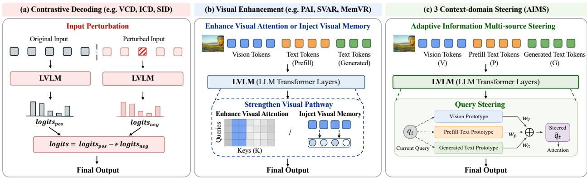  
Figure 1 Comparison of training-free hallucination mitigation methods for LVLMs. From left to right: contrastive decoding, visual enhancement, and our method that dynamically steers the query toward three context branches during generation.

As illustrated in Fig.1, existing training-free methods mainly mitigate hallucinations through contrastive decoding [13, 17, 33] or visual enhancement [14, 24, 41]. However, they largely overlook the dynamic utilization of contextual information during generation and focus predominantly on visual evidence, leaving textual prompts and generation history underexplored. This raises a fundamental question: Can LVLMs dynamically regulate different context sources to suppress hallucinations?

To better explore this issue, we design a series of preliminary experiments to quantify how LVLMs coordinate multiple context sources during autoregressive generation and examine how this intrinsic behavior can guide hallucination mitigation. Our analysis yields three observations. First, LVLMs exhibit a stage-dependent vision-attending tendency, with visual attention peaking during object grounding and decreasing as generation shifts toward semantic summarization. Second, directly exploiting this intrinsic tendency through queryadaptive steering mitigates hallucination more efectively than uniformly amplifying visual information. Third, prefilled text and generation history also provide corrective signals beyond visual evidence. Together, these findings highlight the need to adaptively coordinate multiple context sources rather than uniformly enhancing visual information.

Building on these observations, we propose Adaptive Information Multi-source Steering (AIMS), a lightweight training-free framework that adaptively coordinates visual context (V), prefilled text context (P), and previously generated context (G). Specifically, AIMS constructs semantic prototypes for the three contextual sources and estimates their query-dependent afinities at each decoding step. The afinity-weighted prototypes are aggregated to steer the current query representation, enabling dynamic multi-source coordination according to the generation state. Extensive experiments on four benchmarks demonstrate the efectiveness of AIMS, achieving up to a 27.1% relative reduction in CHAIR CS across diferent LVLMs and decoding strategies, while preserving general multimodal capabilities. Our main contributions are summarized as follows:

• We investigate the contextual utilization behavior of LVLMs during autoregressive generation and reveal that visual reliance dynamically changes across generation stages. Our analysis further shows that hallucination mitigation requires considering multiple contextual sources beyond visual information alone.

• We propose Adaptive Information Multi-source Steering (AIMS), a training-free framework that dynamically coordinates vision, prefilled text, and generated contexts through query-context afinity. Unlike existing methods that rely on fixed amplification of a single information source, AIMS adaptively integrates evidence during generation.

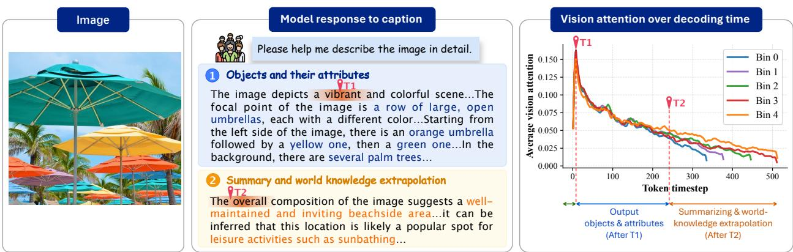

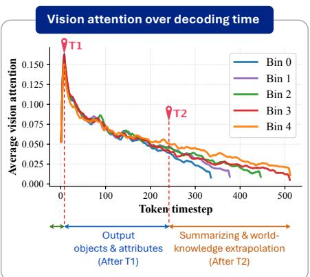  
Figure 2 Visual attention dynamics during decoding. Results on 500 MSCOCO examples using Qwen2.5-VL-3B, grouped into five sequence-length bins. T1 and T2 mark the onset of visual description and semantic summarization, respectively.

• We conduct extensive experiments on multiple representative LVLMs, including LLaVA-1.5, Qwen2.5-VL, and Qwen3.5, across four widely used benchmarks. The results demonstrate that AIMS consistently reduces hallucination while efectively preserving overall generation quality compared with existing training-free approaches.

## 2 Related Work

## 2.1 LARGE VISION-LANGUAGE MODELS

Modern Large Vision-Language Models (LVLMs) have evolved rapidly through the scaling of architectural connections and language backbones. Early paradigms utilized LLaMA [28, 29] as the linguistic foundation, employing simple MLPs or Q-Formers to project visual tokens, as exemplified by LLaVA [21, 22] and MiniGPT series [3, 40]. To handle denser multimodal semantics, subsequent architectures transitioned to highly optimized backbones; the Qwen-VL series [1, 2] introduced VIT-perceiver to internalize fine-grained visual features, while the InternLM-XComposer series [36, 37] and InternVL [5, 6] scaled up the LLM bases and integrated dynamic high-resolution vision-language interaction. Despite their superior multimodal capabilities, contemporary LVLMs still sufer from severe object hallucination problems [26]. Efectively mitigating these hallucinations during inference remains a critical challenge, motivating our training-free dynamic steering framework.

## 2.2 MITIGATING HALLUCINATIONS IN LVLMS

In LVLMs, object hallucination remains the most prevalent form of hallucination, typically manifesting as errors in object category, attribute, and inter-object relation descriptions. To mitigate this issue, existing methods can be broadly divided into several lines. Early studies focused on improving fine-grained vision-language alignment and reducing co-occurrence bias in captioning models [26]. More recent approaches leverage hallucinationoriented supervision, such as dedicated fine-tuning datasets and RLHF-based optimization [10, 35]. Another important direction is training-free inference-time intervention. Attentional intervention methods [12, 14, 24] suppress hallucinations by modifying attention behaviors during decoding, but often incur extra inference overhead. In parallel, contrastive-decoding-based methods, such as SID [13] and VCD [17], steer the decoding distribution by contrasting diferent visual or textual conditions, though their efectiveness may be unstable due to the additional noise introduced in the contrastive process.

(b) Multi-context Steering

## 3 Preliminary Study

We conduct preliminary experiments on the CHAIR benchmark using 500 MSCOCO examples with Qwen2.5- VL-3B. We examine the temporal dynamics of visual attention during generation, compare fixed and query-adaptive visual steering, and investigate the contributions of diferent context sources to hallucination mitigation. These analyses yield three key observations.

Table 1 Preliminary analysis of adaptive and multi-context steering. (a) Comparison of fixed and adaptive query steering toward the vision prototype. (b) Impact of diferent context branches under fixed-strength steering. $C _ { S }$ and $C _ { I }$ denote $\mathrm { C H A I R } _ { S }$ and CHAIRI, respectively.
<table><tr><td>Method</td><td>Cs↓</td><td>CI↓</td><td>Recall↑</td><td>F1↑</td><td>Length↑</td></tr><tr><td>Baseline</td><td>56.0</td><td>9.96</td><td>74.05</td><td>74.10</td><td>404.19</td></tr><tr><td>Fixed  $\cdot \mathrm { V } _ { \alpha = 0 . 0 5 }$ </td><td>51.6</td><td>9.48</td><td>74.11</td><td>74.99</td><td>350.88</td></tr><tr><td>Fixed-V  $\alpha { = } 0 . 1 5$ </td><td>39.0</td><td>9.30</td><td>70.18</td><td>75.29</td><td>199.70</td></tr><tr><td>Adaptive-V</td><td>40.2</td><td>8.33</td><td>71.53</td><td>75.08</td><td>292.41</td></tr></table>

<table><tr><td>Method</td><td>Cs↓</td><td>CI↓</td><td>Recall↑</td><td>F1↑</td><td>Length↑</td></tr><tr><td>Fixed-V</td><td>51.60</td><td>9.48</td><td>74.11</td><td>74.99</td><td>350.88</td></tr><tr><td>Fixed-V-G</td><td>47.80</td><td>8.95</td><td>73.10</td><td>75.15</td><td>345.88</td></tr><tr><td>Fixed-P-G</td><td>47.62</td><td>9.35</td><td>73.54</td><td>74.68</td><td>382.81</td></tr><tr><td>Fixed-G</td><td>50.61</td><td>8.80</td><td>74.68</td><td>75.40</td><td>385.38</td></tr><tr><td> $\mathrm { F i x e d - V - P - G }$ </td><td>46.00</td><td>8.94</td><td>73.35</td><td>75.61</td><td>317.33</td></tr></table>

Observation 1. Vision attention naturally peaks when object grounding is required. To examine how visual reliance evolves throughout generation, we evenly divide the generated sequences into five length bins according to the number of samples and measure the average attention from the query to visual tokens at each generation timestep. As shown in Fig. 2, despite substantial diferences in sequence length, visual attention consistently peaks around $T 1 \in \{ 4 , 5 \}$ , when generation moves beyond generic openings (e.g. “The image depicts a $\cdots ^ { \mathfrak { N } } )$ and begins grounding concrete objects and attributes. It then gradually declines as generation shifts toward summarization and world-knowledge extrapolation at T2, where less direct visual evidence is required. This pattern aligns with human intuition: during summarization and extrapolation, generation can rely on previously established context rather than direct visual evidence.

Observation 2. Adaptive visual steering achieves a better hallucination-generation trade-off than fixed amplification. Table 1 (a) compares fixed visual steering with query–vision afinity-based adaptive steering. Strong fixed steering $( \alpha = 0 . 1 5 )$ reduces $C _ { S }$ to 39.0 but sharply shortens responses to 199.70 tokens. In contrast, Adaptive-V achieves a comparable $C _ { S }$ of 40.2 while retaining 292.41 tokens and reducing $C _ { I }$ to 8.33, suggesting that visual evidence should be reinforced according to the model’s intrinsic vision-attending tendency rather than uniformly amplified.

Observation 3. Hallucination mitigation benefits from multiple context branches beyond vision. As shown in Table 1 (b), textual contexts also provide useful corrective signals: $P + G$ reduces $C _ { S }$ from 56.00 to 47.62 without visual reinforcement, while G alone achieves a $C _ { I }$ of 8.80. Combining V, P, and G further yields the lowest $C _ { S }$ of 46.00 among the branch combinations, motivating multi-source coordination rather than vision-only enhancement.

## 4 method

The above observations reveal a phenomenon overlooked by existing methods: LVLMs inherently exhibit a semantically meaningful vision-attending tendency aligned with their evolving generation needs, suggesting that hallucination mitigation can benefit from reinforcing, rather than overriding, this intrinsic tendency. Moreover, enhancing prefilled and generated contexts can also mitigate hallucinations, indicating that useful corrective signals extend beyond visual evidence. Motivated by these findings, we propose AIMS (Adaptive Information Multi-source Steering), a lightweight training-free framework that adaptively coordinates three context sources inherent to autoregressive generation: vision tokens (V) for perceptual evidence, prefilled text tokens (P) for task intent, and previously generated tokens (G) for contextual coherence. By estimating their query-dependent afinities, AIMS dynamically determines which contextual information should guide each decoding step, rather than relying on fixed or vision-centric steering.

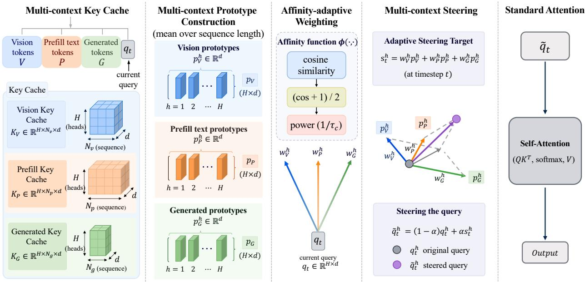  
Figure 3 Overview of AIMS. Given vision, prefilled text, and generated-token key caches, AIMS constructs head-wise multi-context prototypes and adaptively weights them according to their afinity with the current query. The weighted prototypes form a dynamic steering target that adjusts the query representation before standard self-attention.

Multi-context prototype construction. In Transformer attention, the relevance of contextual information to the current generation state is naturally captured through query–key matching. We therefore leverage the existing key cache to construct compact prototypes for each context source. Specifically, we identify vision tokens (V), prefilled text tokens (P), and previously generated tokens (G) by their token indices and mean-pool their key representations within each source. For attention head $h ,$ the prototype of context source i is defined as

$$
{ \bf p } _ { i } ^ { h } = \frac { 1 } { N _ { i } } \sum _ { j = 1 } ^ { N _ { i } } { \bf k } _ { i , j } ^ { h } , \qquad i \in \{ V , P , G \} ,\tag{1}
$$

where $\mathbf { k } _ { i , j } ^ { h }$ denotes the key representation of the j-th token in context source $i ,$ and $N _ { i }$ is the number of tokens in that source. The resulting prototypes $\mathbf { p } _ { V } ^ { h } , \mathbf { p } _ { P } ^ { h }$ , and $\mathbf { p } _ { G } ^ { h }$ provide compact summaries of the three context sources in the model’s native query–key representation space, allowing their relevance to the current query to be measured in a unified manner. Since the prototypes are constructed directly from the existing key cache, this process requires no additional encoding or auxiliary forward passes and introduces only lightweight computational overhead.

Afinity-adaptive weighting. Observation 2 suggests that efective intervention should follow, rather than override, the model’s intrinsic information-attending tendency. Since the current query encodes the generation state at timestep t, its compatibility with diferent context prototypes provides a natural internal signal of which information sources are currently relevant. We therefore use query–context afinity to adaptively determine the contribution of each context source.

Specifically, for context source $c \in \{ V , P , G \}$ and attention head h, we measure the afinity between the current query $\mathbf { q } _ { t } ^ { h }$ and the corresponding prototype $\mathbf { p } _ { c , t } ^ { h }$ using cosine similarity and map it to [0, 1]. The adaptive weight is defined as

$$
w _ { c , t } ^ { h } = \left( \frac { \cos ( \mathbf { q } _ { t } ^ { h } , \mathbf { p } _ { c , t } ^ { h } ) + 1 } { 2 } \right) ^ { 1 / \tau _ { c } } , \qquad c \in \{ V , P , G \} ,\tag{2}
$$

where $\tau _ { c }$ controls the sensitivity of source c to its query–context afinity. Consequently, the resulting weights are simultaneously source-, head-, and timestep-adaptive, allowing AIMS to capture fine-grained variations in contextual demand throughout autoregressive generation.

For notational simplicity, we use $\mathbf { p } _ { c , t } ^ { h }$ to denote the prototype available at timestep t. The visual and prefilled contexts remain unchanged during decoding, and thus $\mathbf { p } _ { V , t } ^ { h } = \mathbf { p } _ { V } ^ { h }$ and $\mathbf { p } _ { P , t } ^ { h } = \mathbf { p } _ { P } ^ { h }$ are fixed. In contrast, the generated context grows autoregressively. Instead of repeatedly pooling an increasingly long generation history, we use the key representation of the latest generated token as $\mathbf { p } _ { G , t } ^ { h } .$ As this representation has already contextualized the preceding tokens through causal self-attention, it provides a naturally updated and lightweight summary of the generation history.

Multi-context steering. Rather than separately reweighting the attention logits of the V, P, and G branches, AIMS first integrates their afinity-weighted prototypes into a unified steering target and uses it to update the current query. The updated query then interacts with all cached keys through the original attention operation, allowing the three context sources to jointly influence the attention assigned to individual tokens. Specifically, we construct a head-wise steering target by integrating the context prototypes according to their adaptive afinities:

$$
\mathbf { s } _ { t } ^ { h } = \sum _ { c \in \{ V , P , G \} } w _ { c , t } ^ { h } \mathbf { p } _ { c , t } ^ { h } .\tag{3}
$$

The current query is then updated as

$$
\widetilde { \mathbf { q } } _ { t } ^ { h } = ( 1 - \alpha ) \mathbf { q } _ { t } ^ { h } + \alpha \mathbf { s } _ { t } ^ { h } ,\tag{4}
$$

where α controls the overall steering strength. The modified query is subsequently passed to the original attention operation:

$$
\mathbf { o _ { h } ^ { t } } = \mathrm { S o f t m a x } \left( \frac { \widetilde { \mathbf { q } } _ { t } ^ { h } ( \mathbf { K } ^ { h } ) ^ { \top } } { \sqrt { d _ { h } } } \right) \mathbf { V ^ { h } } .\tag{5}
$$

AIMS modifies only the current query representation while leaving the key-value cache and the original attention computation unchanged, without requiring an additional model forward pass.

## 5 experiment

## 5.1 EXPERIMENTAL SETTINGS

Models and Baselines. We evaluate AIMS on three representative LVLMs, including LLaVA-1.5-7B [22], Qwen2.5- VL-3B [2], and Qwen3.5-9B. Since AIMS is a training-free framework, we compare it with representative hallucination mitigation methods, including VCD [17], SID [13], VTI [23], OPERA [12], MemVR [41] and Baseline.

For decoding strategies, we evaluate AIMS under three generation settings: greedy decoding, beam search with 5 beams, and nucleus sampling with temperature=1, top-p=0.9, and top-k=50. For comparison methods, we follow the decoding strategies supported in their original papers.

Datasets. CHAIR [26] evaluates object hallucination in image captioning. Following previous works, we randomly sample 500 MSCOCO [19] images and report CHAIR (C ), CHAIR (C ), Recall (R), F1, and generation length (Len). AMBER-G [32] evaluates object, attribute, and relation hallucinations in free-form descriptions. We follow the oficial protocol and report CHAIR, Cover, Hal, and Cog. FaithScore [15] evaluates free-form hallucinations through atomic-fact verification. We evaluate on LLaVA-1k and report FaithScore and Sentence-FaithScore. MME [9] evaluates perception and cognition across 14 subtasks. We report perception (Per), cognition (Cog), and total (Sum) scores.

Implementation details. We mainly consider $( \tau _ { V } , \tau _ { P } , \tau _ { G } ) \in \{ ( 1 . 0 , 1 . 0 , 1 . 0 ) , ( 1 . 5 , 1 . 2 , 1 . 1 ) \}$ for the domain-specific sensitivity parameters in Eq. 2. The steering strength α in Eq. 4 is set to 0.05 or 0.08 for LLaVA-1.5 and Qwen2.5-VL, and to 0.3 or 0.4 for Qwen3.5. All experiments are conducted on NVIDIA GPUs for consistent hardware evaluation.

Table 2 Evaluation results of diferent methods on CHAIR.
<table><tr><td rowspan="3">Method</td><td colspan="10">LLaVA-1.5-7B</td><td colspan="5"></td></tr><tr><td colspan="5">Greedy</td><td colspan="5">Beam Search</td><td colspan="5">Nucleus</td></tr><tr><td>Cs↓</td><td>CI↓</td><td>R↑</td><td>F1↑</td><td>Len↑</td><td>Cs↓</td><td>CI↓</td><td>R↑</td><td>F1↑</td><td>Len↑</td><td>Cs↓</td><td>CI↓</td><td>R↑</td><td>F1↑</td><td>Len↑</td></tr><tr><td>Baseline</td><td>51.4</td><td>14.70</td><td>79.42</td><td>76.80</td><td>97.9</td><td>55.2</td><td>14.93</td><td>80.34</td><td>77.10</td><td>103.5</td><td>50.0</td><td>15.31</td><td>74.05</td><td>73.19</td><td>101.5</td></tr><tr><td>MemVR</td><td>49.8</td><td>14.20</td><td>78.64</td><td>76.81</td><td>93.8</td><td>53.0</td><td>14.30</td><td>79.54</td><td>77.53</td><td>95.7</td><td>52.6</td><td>15.80</td><td>72.91</td><td>72.73</td><td>93.6</td></tr><tr><td>OPERA</td><td></td><td></td><td></td><td></td><td></td><td>44.6</td><td>12.72</td><td>79.25</td><td>78.40</td><td>92.7</td><td></td><td></td><td></td><td></td><td></td></tr><tr><td>VCD</td><td></td><td></td><td></td><td></td><td></td><td></td><td></td><td></td><td></td><td></td><td>49.9</td><td>15.72</td><td>75.24</td><td>74.00</td><td>94.6</td></tr><tr><td>VTI</td><td>48.8</td><td>13.89</td><td>78.43</td><td>77.06</td><td>94.1</td><td>48.8</td><td>12.87</td><td>79.57</td><td>78.74</td><td>97.9</td><td>49.2</td><td>14.98</td><td>73.86</td><td>73.85</td><td>95.8</td></tr><tr><td>SID</td><td>47.6</td><td>14.43</td><td>76.93</td><td>76.76</td><td>94.7</td><td></td><td></td><td></td><td></td><td></td><td>52.0</td><td>15.51</td><td>75.38</td><td>74.60</td><td>95.5</td></tr><tr><td>AIMS</td><td>43.6</td><td>13.17</td><td>76.84</td><td>77.96</td><td>89.9</td><td>43.6</td><td>12.02</td><td>76.46</td><td>77.24</td><td>93.5</td><td>47.1</td><td>15.23</td><td>71.50</td><td>72.91</td><td>85.6</td></tr><tr><td rowspan="3">Method</td><td colspan="5"></td><td colspan="5">Qwen2.5-VL-3B</td><td colspan="5">Nucleus</td></tr><tr><td></td><td colspan="3">Greedy R↑</td><td></td><td></td><td colspan="3">Beam Search</td><td></td><td colspan="5"></td></tr><tr><td>Cs↓</td><td>CI↓</td><td></td><td>F1↑</td><td>Len↑</td><td>Cs↓</td><td>CI↓</td><td>R↑</td><td>F1↑</td><td>Len↑</td><td>Cs↓</td><td>CI↓</td><td>R↑</td><td>F1↑</td><td>Len↑</td></tr><tr><td>Baseline</td><td>56.0</td><td>9.96</td><td>74.05</td><td>74.10</td><td>404.2</td><td>45.1</td><td>8.93</td><td>73.41</td><td>76.19</td><td>367.3</td><td>56.6</td><td>11.39</td><td>72.96</td><td>72.50</td><td>441.3</td></tr><tr><td>MemVR OPERA</td><td>51.8</td><td>9.62</td><td>73.90</td><td>74.18</td><td>412.5</td><td>43.2</td><td>8.30</td><td>73.41</td><td>76.70</td><td>368.0</td><td>57.6</td><td>10.66</td><td>72.78</td><td>72.53</td><td>445.5</td></tr><tr><td>VCD</td><td></td><td></td><td></td><td></td><td></td><td>45.2</td><td>8.15</td><td>71.70</td><td>74.93</td><td>361.6</td><td>57.8</td><td></td><td></td><td></td><td>477.0</td></tr><tr><td>VTI</td><td>43.2</td><td>8.02</td><td></td><td></td><td></td><td></td><td></td><td></td><td></td><td></td><td></td><td>9.99</td><td>73.86</td><td>73.00</td><td></td></tr><tr><td></td><td></td><td>12.13</td><td>70.88 74.78</td><td>75.02</td><td>338.2</td><td>41.8</td><td>8.47</td><td>72.53</td><td>76.10</td><td>358.6</td><td>52.4</td><td>9.78</td><td>71.51</td><td>73.00</td><td>430.0</td></tr><tr><td>SID AIMS</td><td>50.3 40.8</td><td>9.07</td><td>71.69</td><td>75.08</td><td>207.8</td><td></td><td></td><td></td><td></td><td></td><td>50.6 44.8</td><td>10.15</td><td>73.35</td><td>74.25</td><td>386.4</td></tr><tr><td></td><td></td><td></td><td></td><td>74.66</td><td>284.2</td><td>38.2</td><td>7.67</td><td>71.84</td><td>76.27</td><td>325.2</td><td>9.33</td><td>70.56</td><td></td><td>73.62</td><td>327.6</td></tr><tr><td rowspan="3">Method</td><td colspan="5"></td><td colspan="5">Qwen3.5-9B Beam Search</td><td colspan="5"></td></tr><tr><td></td><td>CI↓</td><td>Greedy R↑</td><td></td><td></td><td></td><td>C1↓</td><td>R↑</td><td></td><td></td><td></td><td></td><td>Nucleus</td><td></td><td></td></tr><tr><td></td><td>Cs↓</td><td></td><td>F1↑</td><td></td><td>Len↑</td><td>Cs↓</td><td></td><td>F1↑</td><td>Len↑</td><td>Cs↓</td><td>CI↓</td><td>R↑</td><td>F1↑</td><td>Len↑</td></tr><tr><td>Baseline MemVR</td><td>47.4</td><td>11.07</td><td>74.11</td><td>75.87</td><td>224.3</td><td>50.0</td><td>10.82</td><td>75.19</td><td>76.08</td><td>234.0</td><td>51.0</td><td>12.03</td><td>73.86</td><td>74.74</td><td>227.1 403.2</td></tr><tr><td>VCD</td><td>61.0</td><td>11.39</td><td>78.11</td><td>74.67</td><td>403.2</td><td>60.4</td><td>11.60</td><td>73.41</td><td>76.70</td><td>368.0</td><td>57.6 55.2</td><td>10.66</td><td>78.11 74.79</td><td>74.67 73.98</td><td>302.7</td></tr><tr><td>VTI</td><td>47.6</td><td>9.14</td><td>69.23</td><td>72.98</td><td>355.6</td><td>46.0</td><td>8.22</td><td></td><td></td><td>356.8</td><td>50.6</td><td>12.61 9.82</td><td>68.78</td><td>71.95</td><td>357.9</td></tr><tr><td>SID</td><td>59.6</td><td>11.74</td><td>77.48</td><td>74.36</td><td>402.9</td><td></td><td></td><td>68.59</td><td>72.99</td><td></td><td>57.8</td><td>11.29</td><td>78.10</td><td>74.76</td><td>404.5</td></tr><tr><td>AIMS</td><td>40.0</td><td>9.91</td><td>67.05</td><td>73.38</td><td>249.9</td><td>42.6</td><td>9.45</td><td>69.52</td><td>74.52</td><td>270.9</td><td>47.0</td><td>10.62</td><td>69.56</td><td>72.57</td><td>256.8</td></tr><tr><td></td><td></td><td></td><td></td><td></td></table>

Table 3 Evaluation results of diferent methods on AMBER-G.
<table><tr><td rowspan="3">Method</td><td colspan="10">Qwen2.5-VL-3B</td></tr><tr><td colspan="3">Greedy</td><td colspan="4">Beam Search</td><td colspan="4">Nucleus</td></tr><tr><td>CHAIR↓</td><td>Cover↑</td><td>Hal↓</td><td>Cog↓</td><td>CHAIR↓</td><td>Cover↑</td><td>Hal↓ Cog↓</td><td>CHAIR↓</td><td>Cover↑</td><td>Hal↓</td><td>Cog↓</td></tr><tr><td>Baseline</td><td>8.2</td><td>69.6</td><td>52.7</td><td>5.7</td><td>6.8</td><td>68.3 44.7</td><td>4.9</td><td>9.9</td><td>70.3</td><td>63.7</td><td>7.4</td></tr><tr><td>VTI</td><td>6.9</td><td>65.0</td><td>43.8 4.3</td><td>5.8</td><td>63.8</td><td>35.1</td><td>3.9</td><td>8.5</td><td>65.9</td><td>51.6</td><td>5.4</td></tr><tr><td>AIMS</td><td>6.6</td><td>64.8 39.7</td><td>3.8</td><td>5.2</td><td>64.0</td><td>33.2</td><td>3.1</td><td>7.8</td><td>65.2</td><td>47.9</td><td>4.2</td></tr><tr><td rowspan="3">Method</td><td colspan="3"></td><td colspan="4">Qwen3.5-9B</td><td colspan="4"></td></tr><tr><td colspan="3">Greedy</td><td></td><td colspan="3">Beam Search</td><td colspan="4">Nucleus</td></tr><tr><td>CHAIR↓</td><td>Cover↑</td><td>Hal↓</td><td>Cog↓</td><td>CHAIR↓ 9.6</td><td>Cover↑</td><td>Hal↓</td><td>Cog↓</td><td>CHAIR↓</td><td>Cover↑ Hal↓</td><td>Cog↓</td></tr><tr><td>Baseline</td><td>10.4</td><td>75.7</td><td>71.8</td><td>5.5</td><td>76.4</td><td>69.3</td><td>5.3</td><td>10.2</td><td>75.6</td><td>70.5</td><td>5.0</td></tr><tr><td>VTI</td><td>9.6</td><td>75.2</td><td>69.1</td><td>5.4</td><td>9.3</td><td>75.6 69.4</td><td>5.3</td><td>10.0</td><td>75.4</td><td>71.8</td><td>5.8</td></tr><tr><td>AIMS</td><td>9.4</td><td>75.3</td><td>68.9</td><td>5.7</td><td>9.1</td><td>75.9</td><td>65.8 5.6</td><td>9.4</td><td>74.8</td><td>65.9</td><td>5.4</td></tr></table>

## 5.2 EXPERIMENTAL RESULTS

Results on CHAIR. As shown in Table 2, AIMS achieves the lowest CS in all nine model-decoding settings, consistently outperforming the baseline and existing training-free methods. Notably, AIMS maintains a consistent advantage over VTI across all three LVLMs and decoding strategies. While VTI applies precomputed intervention directions consistently across queries, AIMS adapts its steering to the current generation state. This query-dependent coordination may explain its stable advantage across diferent decoding dynamics. Compared with contrastive decoding methods such as VCD and SID, AIMS also achieves stronger hallucination reduction without constructing additional contrastive inputs or auxiliary forward passes.

Results on AMBER-G. As shown in Table 3, AIMS consistently achieves lower Hal than VTI across all six model-decoding settings, indicating fewer hallucinated responses, while maintaining comparable Cover scores and thus similar object coverage. This suggests that its hallucination reduction does not simply result from mentioning fewer objects present in the image. Beyond this general trend, AIMS also reduces Cog across all decoding strategies on Qwen2.5-VL-3B, indicating a lower tendency to generate the human-cognitionassociated hallucinated objects captured by AMBER. Together with the consistently lower CHAIR scores, these results show that AIMS improves hallucination control at both the object and response levels without a substantial coverage trade-of.

Table 4 FaithScore evaluation results on Qwen2.5-VL-3B. FS and S-FS denote FaithScore and sentence-level Faith-Score, respectively.
<table><tr><td>Method</td><td>Decoding</td><td>FS↑</td><td>S-FS↑</td></tr><tr><td>Baseline VTI</td><td>Greedy</td><td>0.944 0.942</td><td>0.786 0.787</td></tr><tr><td>AIMS Baseline VTI</td><td>Beam</td><td>0.945 0.942 0.947</td><td>0.791 0.780 0.793</td></tr><tr><td>AIMS Baseline</td><td></td><td>0.948 0.925</td><td>0.854 0.745</td></tr><tr><td>VTI</td><td>Nucleus</td><td>0.927</td><td>0.746</td></tr><tr><td>AIMS</td><td></td><td>0.929</td><td>0.789</td></tr></table>

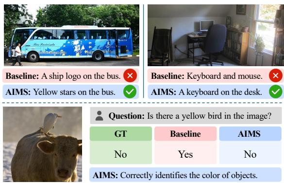  
Figure 4 Qualitative comparison between the baseline and AIMS.

Table 5 Evaluation results of diferent methods on MME.
<table><tr><td rowspan="3">Method</td><td colspan="8">Qwen2.5-VL-3B</td></tr><tr><td colspan="3">Greedy</td><td colspan="3">Beam Search</td><td colspan="2">Nucleus</td></tr><tr><td>Per↑</td><td>Cog↑</td><td>Sum↑</td><td>Per↑</td><td>Cog↑</td><td>Sum↑</td><td>Per↑ Cog↑</td><td>Sum↑</td></tr><tr><td>Baseline</td><td>1591.38</td><td>612.86</td><td>2204.24</td><td>1558.17</td><td>537.14 2095.31</td><td>1466.52</td><td>513.93</td><td>1980.45</td></tr><tr><td>MemVR</td><td>1591.93</td><td>626.42</td><td>2218.36</td><td>1538.66</td><td>544.64 2083.30</td><td>1425.96</td><td>523.92</td><td>1949.88</td></tr><tr><td>VCD</td><td></td><td></td><td></td><td></td><td></td><td>1485.20</td><td>521.78</td><td>2006.98</td></tr><tr><td>VTI</td><td>1472.86</td><td>522.50</td><td>1995.36</td><td>1520.20</td><td>480.35 2000.55</td><td>1448.89</td><td>518.57</td><td>1967.46</td></tr><tr><td>SID</td><td>1590.13</td><td>606.78</td><td>2196.91</td><td></td><td></td><td></td><td>1450.47 557.14</td><td>2007.61</td></tr><tr><td>AIMS</td><td>1591.23</td><td>630.35</td><td>2221.58</td><td>1550.71</td><td>540.00 2090.71</td><td>1492.41</td><td>487.82</td><td>1980.23</td></tr><tr><td rowspan="3">Method</td><td colspan="9">Qwen3.5-9B</td></tr><tr><td colspan="3">Greedy</td><td colspan="3">Beam Search</td><td colspan="3">Nucleus</td></tr><tr><td>Per↑</td><td>Cog↑</td><td>Sum↑</td><td>Per↑</td><td>Cog↑</td><td>Sum↑</td><td>Per↑ Cog↑</td><td></td><td>Sum↑</td></tr><tr><td>Baseline</td><td>1714.86</td><td>678.57</td><td>2393.43</td><td>1722.59</td><td>584.64</td><td>2307.23</td><td>1587.53 567.85</td><td>2155.38</td></tr><tr><td>MemVR</td><td>1707.45</td><td>671.07</td><td>2378.52</td><td>1709.63</td><td>574.72 2284.35</td><td>1580.36</td><td>569.08</td><td>2149.44</td></tr><tr><td>VCD</td><td></td><td></td><td></td><td></td><td></td><td>1603.84</td><td>589.21</td><td>2193.05</td></tr><tr><td>VTI</td><td>1631.79</td><td>592.14</td><td>2223.93</td><td>1652.71</td><td>508.21 2160.92</td><td>1501.74</td><td>535.00</td><td>2036.74</td></tr><tr><td>SID</td><td>1693.31</td><td>656.07</td><td>2349.38</td><td></td><td></td><td></td><td>1620.75 593.92</td><td>2214.67</td></tr><tr><td>AIMS</td><td>1699.97</td><td>653.92</td><td>2353.90</td><td>1710.11</td><td>598.21</td><td>2308.32</td><td>1625.41 591.78</td><td>2217.20</td></tr></table>

Results on FaithScore. As shown in Table 4, AIMS achieves the highest FS and S-FS across all three decoding strategies, with particularly pronounced sentence-level gains under beam search and nucleus sampling. Unlike object-centric metrics, FaithScore evaluates descriptive content by decomposing it into atomic facts and verifying their consistency with the image. The improvements therefore provide complementary evidence that AIMS extends beyond reducing hallucinated objects to improving the faithfulness of fine-grained visual facts in free-form responses.

Results on General-purpose Benchmark. Together with Tables 2–4, Table 5 shows that AIMS largely preserves the general-purpose multimodal capabilities of the original models while substantially reducing hallucinations. VTI achieves efective hallucination mitigation but exhibits noticeable MME degradation on the two Qwen models, whereas MemVR better preserves general capabilities but provides more limited hallucination reduction. Overall, AIMS achieves a better balance between hallucination mitigation and general-purpose capability preservation.

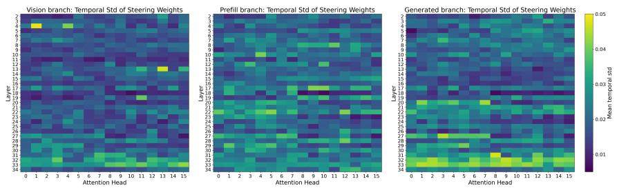

Table 6 Ablation of diferent afinity weighting functions on Qwen2.5-VL-3B.
<table><tr><td rowspan="2">Method</td><td colspan="5">Greedy</td><td colspan="5">Beam Search</td><td colspan="5">Nucleus</td></tr><tr><td> $\overline { { C _ { S } \downarrow } }$ </td><td> $\overline { { C _ { I } \downarrow } }$ </td><td>R↑</td><td>F1↑</td><td>Len↑</td><td> $\overline { { C _ { S } \downarrow } }$ </td><td> $C _ { I \downarrow }$ </td><td>R↑</td><td>F1↑</td><td>Len↑</td><td> $\overline { { C _ { S } \downarrow } }$ </td><td> $\overline { { C _ { I } \downarrow } }$ </td><td>R↑</td><td>F1↑</td><td>Len↑</td></tr><tr><td>AIMSRBF</td><td>42.8</td><td>8.85</td><td>71.51</td><td>75.31</td><td>301.5</td><td>38.4</td><td>7.87</td><td>73.67</td><td>77.40</td><td>311.2</td><td>51.0</td><td>9.74</td><td>70.56</td><td>72.94</td><td>339.9</td></tr><tr><td>AIMSNCS</td><td>40.2</td><td>8.33</td><td>71.53</td><td>75.08</td><td>292.4</td><td>38.4</td><td>7.84</td><td>72.84</td><td>77.02</td><td>325.9</td><td>45.6</td><td>9.64</td><td>70.75</td><td>73.74</td><td>335.3</td></tr><tr><td> $\mathrm { A I M S } _ { K L }$ </td><td>46.9</td><td>8.48</td><td>71.40</td><td>74.27</td><td>344.7</td><td>36.2</td><td>7.57</td><td>72.84</td><td>77.41</td><td>314.7</td><td>51.8</td><td>9.43</td><td>71.83</td><td>72.54</td><td>399.6</td></tr><tr><td>AIMS</td><td>40.8</td><td>9.07</td><td>71.69</td><td>74.66</td><td>284.2</td><td>38.2</td><td>7.67</td><td>71.84</td><td>76.27</td><td>325.2</td><td>44.8</td><td>9.33</td><td>70.56</td><td>73.62</td><td>327.6</td></tr></table>

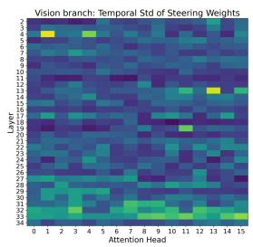

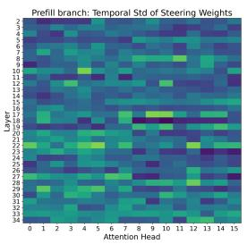

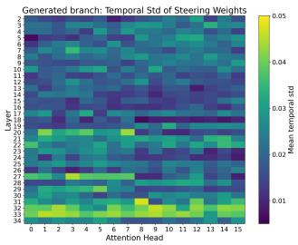

Table 7 Fixed vs. Afinity-adaptive weighting.
<table><tr><td>Method</td><td>Cs↓ CI↓</td><td>F1 ↑</td></tr><tr><td>Baseline</td><td>56.0 9.96</td><td>74.10</td></tr><tr><td>Fixed  $( \alpha = 0 . 1 )$ </td><td>8.0 4.64</td><td>56.90</td></tr><tr><td>Fixed  $( \alpha = 0 . 0 1 )$ </td><td>54.0 10.11</td><td>74.45</td></tr><tr><td>AIMS  $( \alpha = 0 . 0 8 )$ </td><td>40.8 9.07</td><td>74.66</td></tr></table>

Figure 6 Temporal variability of afinity-adaptive weights across diferent contextual branches. From left to right: $V , P ,$ and G.

## 5.3 ABLATION AND ANALYSIS

Ablation on steering configurations. We further examine the steering configurations of AIMS on Qwen2.5-VL-3B using CHAIR under greedy decoding, including the choice of context branches, adaptive weighting, and key hyperparameters. For qualitative illustration, Figure 4 presents several examples, with additional case studies provided in Appendix B.2.

Context Branches. Figure 5 investigates the contributions of context branches in AIMS. Combining the visual branch with either prefilled text context $( V + P )$ or generation history $( V + G )$ exhibits trade-ofs across the evaluation metrics. In contrast, jointly incorporating all three branches $( V + P + G )$ achieves the best performance on $C H A I R$ and $F 1$ . This demonstrates the complementary roles of diferent contextual sources and supports the use of multi-source steering in AIMS.

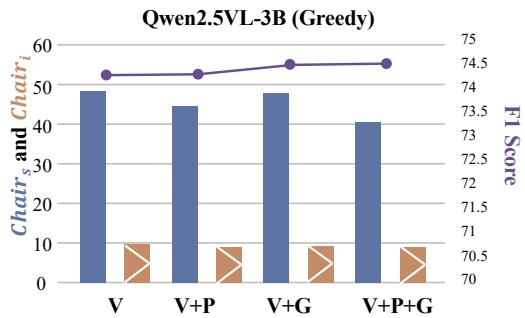

Ablation on adaptive weighting functions. As shown in Table $6 ,$ AIMS reduces hallucination with diferent afinity functions, showing its robustness to the weighting function (see $\mathrm { A p \mathrm { - } }$ pendix B.1 for function details).

Figure 5 Ablation study of diferent context branches in AIMS.

steering with the afinity-adaptive weighting used in AIMS.

While strong fixed steering $( \alpha = 0 . 1 )$ substantially reduces hallucination, it severely degrades F1, indicating excessive intervention in generation. More importantly, under comparable F1 scores (the last two rows), AIMS achieves substantially lower $C _ { S }$ and $C _ { I }$ , demonstrating a better trade-of between hallucination mitigation and response quality.

α and τ . Table 8 further studies the sensitivity to the steering strength α and the branch-specific temperatures τ, where a larger $\tau$ indicates a broader sensitivity bandwidth to the corresponding context branch. Across diferent configurations of both α and $\tau ,$ AIMS consistently reduces hallucination compared with the original baseline while maintaining competitive F1 scores, demonstrating its robustness to these hyperparameter choices.

Table 8 Ablation of α and τ.
<table><tr><td>Method</td><td>α</td><td>(τV, TP, TG)</td><td>Cs ↓ CI↓</td><td>F1 ↑</td></tr><tr><td rowspan="3">AIMS</td><td>0.08</td><td>(1.5, 1.2, 1.1)</td><td>40.8 9.07</td><td>74.66</td></tr><tr><td>0.05</td><td>(1.5, 1.2, 1.1)</td><td>49.8 8.95</td><td>75.51</td></tr><tr><td>0.08</td><td>3 (1.0, 1.0, 1.0)</td><td>44.4 7.59</td><td>75.22</td></tr></table>

Temporal Adaptivity of Steering Weights. We measure the temporal variability of steering weights using their standard deviation across decoding timesteps. As shown in Figure 6, the three branches exhibit distinct layerand head-specific patterns. For V, large variations are sparsely concentrated in individual heads at earlier layers (e.g., Layers 4, 13, and 19), but become broadly distributed across heads in Layers 31–33. P shows more dispersed variations across middle and deep layers, whereas G exhibits stronger layer-wise structures around Layers 20, 27, and 31–33. These distinct pat

Overhead Analysis. Table 9 reports the overhead measured on a fixed subset of 10 CHAIR images. AIMS introduces nearly no additional peak memory over the baseline and achieves the second-lowest inference latency, closely approaching MemVR, demonstrating a favorable trade-of between efectiveness and computational eficiency.

Table 9 Comparison of computational overhead on Qwen2.5-VL-3B.
<table><tr><td>Method</td><td>Peak Mem. (MB) ↓ Time</td></tr><tr><td>Baseline</td><td>7235.87</td></tr><tr><td>MemVR</td><td>7239.53 0.0698</td></tr><tr><td>VCD</td><td>0.0905</td></tr><tr><td>VTI</td><td>0.2424</td></tr><tr><td>SID</td><td>0.1075</td></tr><tr><td>AIMS</td><td>7236.11</td></tr></table>

terns suggest diferent dynamic utilization of contextual sources during decoding, motivating fine-grained afinity-adaptive multi-source steering across timesteps.

## 6 Conclusion

In this work, we revisit object hallucination in LVLMs from the perspective of multi-context interaction. Our analysis systematically reveals an intrinsic vision-attending tendency during generation and shows that complementary contextual information beyond visual evidence can also contribute to hallucination mitigation. Motivated by these findings, we propose AIMS, a training-free method that constructs compact context prototypes and dynamically coordinates their contributions during decoding. Extensive experiments across diferent LVLM architectures and decoding strategies demonstrate that AIMS consistently reduces object hallucination while preserving strong general-purpose multimodal capabilities. We hope our findings encourage a shift from visual-centric intervention toward adaptive multi-context coordination for hallucination mitigation.

## References

[1] Jinze Bai, Shuai Bai, Shusheng Yang, Shijie Wang, Sinan Tan, Peng Wang, Junyang Lin, Chang Zhou, and Jingren Zhou. Qwen-vl: A versatile vision-language model for understanding, localization, text reading, and beyond, 2023. URL https://arxiv.org/abs/2308.12966.

[2] Shuai Bai, Keqin Chen, Xuejing Liu, Jialin Wang, Wenbin Ge, Sibo Song, Kai Dang, Peng Wang, Shijie Wang, Jun Tang, Humen Zhong, Yuanzhi Zhu, Mingkun Yang, Zhaohai Li, Jianqiang Wan, Pengfei Wang, Wei Ding, Zheren Fu, Yiheng Xu, Jiabo Ye, Xi Zhang, Tianbao Xie, Zesen Cheng, Hang Zhang, Zhibo Yang, Haiyang Xu, and Junyang Lin. Qwen2.5-vl technical report, 2025. URL https://arxiv.org/abs/2502.13923.

[3] Jun Chen, Deyao Zhu, Xiaoqian Shen, Xiang Li, Zechun Liu, Pengchuan Zhang, Raghuraman Krishnamoorthi, Vikas Chandra, Yunyang Xiong, and Mohamed Elhoseiny. Minigpt-v2: large language model as a unified interface for vision-language multi-task learning, 2023. URL https://arxiv.org/abs/2310.09478.

[4] Keqin Chen, Zhao Zhang, Weili Zeng, Richong Zhang, Feng Zhu, and Rui Zhao. Shikra: Unleashing multimodal llm’s referential dialogue magic. arXiv preprint arXiv:2306.15195, 2023.

[5] Zhe Chen, Jiannan Wu, Wenhai Wang, Weijie Su, Guo Chen, Sen Xing, Muyan Zhong, Qinglong Zhang, Xizhou Zhu, Lewei Lu, Bin Li, Ping Luo, Tong Lu, Yu Qiao, and Jifeng Dai. Internvl: Scaling up vision foundation models and aligning for generic visual-linguistic tasks. In Proceedings of the IEEE/CVF Conference on Computer Vision and Pattern Recognition (CVPR), pages 24185–24198, June 2024.

[6] Zhe Chen, Weiyun Wang, Yue Cao, Yangzhou Liu, Zhangwei Gao, Erfei Cui, Jinguo Zhu, Shenglong Ye, Hao Tian, Zhaoyang Liu, Lixin Gu, Xuehui Wang, Qingyun Li, Yiming Ren, Zixuan Chen, Jiapeng Luo, Jiahao Wang, Tan Jiang, Bo Wang, Conghui He, Botian Shi, Xingcheng Zhang, Han Lv, Yi Wang, Wenqi Shao, Pei Chu, Zhongying Tu, Tong He, Zhiyong Wu, Huipeng Deng, Jiaye Ge, Kai Chen, Kaipeng Zhang, Limin Wang, Min Dou, Lewei Lu, Xizhou Zhu, Tong Lu, Dahua Lin, Yu Qiao, Jifeng Dai, and Wenhai Wang. Expanding performance boundaries of open-source multimodal models with model, data, and test-time scaling, 2025. URL https://arxiv.org/abs/2412.05271.

[7] Ailin Deng, Zhirui Chen, and Bryan Hooi. Seeing is believing: Mitigating hallucination in large vision-language models via clip-guided decoding. arXiv preprint arXiv:2402.15300, 2024.

[8] Yihe Deng, Hritik Bansal, Fan Yin, Nanyun Peng, Wei Wang, and Kai-Wei Chang. Openvlthinker: Complex vision-language reasoning via iterative sft-rl cycles. Advances in Neural Information Processing Systems, 38: 123817–123846, 2026.

[9] Chaoyou Fu, Peixian Chen, Yunhang Shen, Yulei Qin, Mengdan Zhang, Xu Lin, Jinrui Yang, Xiawu Zheng, Ke Li, Xing Sun, Yunsheng Wu, Rongrong Ji, Caifeng Shan, and Ran He. Mme: A comprehensive evaluation benchmark for multimodal large language models. In Advances in Neural Information Processing Systems, volume 38, Main Conference. Curran Associates, Inc., 2025.

[10] Anisha Gunjal, Jihan Yin, and Erhan Bas. Detecting and preventing hallucinations in large vision language models. In Proceedings of the AAAI Conference on Artificial Intelligence, volume 38, pages 18135–18143, 2024.

[11] Lei Huang, Weijiang Yu, Weitao Ma, Weihong Zhong, Zhangyin Feng, Haotian Wang, Qianglong Chen, Weihua Peng, Xiaocheng Feng, Bing Qin, et al. A survey on hallucination in large language models: Principles, taxonomy, challenges, and open questions. ACM transactions on information systems, 43(2):1–55, 2025.

[12] Qidong Huang, Xiaoyi Dong, Pan Zhang, Bin Wang, Conghui He, Jiaqi Wang, Dahua Lin, Weiming Zhang, and Nenghai Yu. Opera: Alleviating hallucination in multi-modal large language models via over-trust penalty and retrospection-allocation. In Proceedings of the IEEE/CVF Conference on Computer Vision and Pattern Recognition, pages 13418–13427, 2024.

[13] Fushuo Huo, Wenchao Xu, Zhong Zhang, Haozhao Wang, Zhicheng Chen, and Peilin Zhao. Self-introspective decoding: Alleviating hallucinations for large vision-language models. In International Conference on Learning Representations, volume 2025, pages 24272–24295, 2025.

[14] Zhangqi Jiang, Junkai Chen, Beier Zhu, Tingjin Luo, Yankun Shen, and Xu Yang. Devils in middle layers of large vision-language models: Interpreting, detecting and mitigating object hallucinations via attention lens. In 2025 IEEE/CVF Conference on Computer Vision and Pattern Recognition (CVPR), pages 25004–25014. IEEE, 2025.

[15] Liqiang Jing, Ruosen Li, Yunmo Chen, and Xinya Du. Faithscore: Fine-grained evaluations of hallucinations in large vision-language models. In Findings of the Association for Computational Linguistics: EMNLP 2024, pages 5042–5063, 2024.

[16] Jusung Lee, Sungguk Cha, Younghyun Lee, and Cheoljong Yang. Visual question answering instruction: Unlocking multimodal large language model to domain-specific visual multitasks. arXiv preprint arXiv:2402.08360, 2024.

[17] Sicong Leng, Hang Zhang, Guanzheng Chen, Xin Li, Shijian Lu, Chunyan Miao, and Lidong Bing. Mitigating object hallucinations in large vision-language models through visual contrastive decoding. In Proceedings of the IEEE/CVF Conference on Computer Vision and Pattern Recognition, pages 13872–13882, 2024.

[18] Junnan Li, Dongxu Li, Silvio Savarese, and Steven Hoi. Blip-2: Bootstrapping language-image pre-training with frozen image encoders and large language models. In International conference on machine learning, pages 19730–19742. PmLR, 2023.

[19] Tsung-Yi Lin, Michael Maire, Serge Belongie, James Hays, Pietro Perona, Deva Ramanan, Piotr Doll´ar, and C Lawrence Zitnick. Microsoft coco: Common objects in context. In European conference on computer vision, pages 740–755. Springer, 2014.

[20] Hanchao Liu, Wenyuan Xue, Yifei Chen, Dapeng Chen, Xiutian Zhao, Ke Wang, Liping Hou, Rongjun Li, and Wei Peng. A survey on hallucination in large vision-language models. arXiv preprint arXiv:2402.00253, 2024.

[21] Haotian Liu, Chunyuan Li, Qingyang Wu, and Yong Jae Lee. Visual instruction tuning, 2023. URL https: //arxiv.org/abs/2304.08485.

[22] Haotian Liu, Chunyuan Li, Yuheng Li, and Yong Jae Lee. Improved baselines with visual instruction tuning. In Proceedings of the IEEE/CVF Conference on Computer Vision and Pattern Recognition (CVPR), pages 26296–26306, June 2024.

[23] Sheng Liu, Haotian Ye, and James Y Zou. Reducing hallucinations in large vision-language models via latent space steering. In International Conference on Learning Representations, volume 2025, pages 72402–72419, 2025.

[24] Shi Liu, Kecheng Zheng, and Wei Chen. Paying more attention to image: A training-free method for alleviating hallucination in lvlms. In European Conference on Computer Vision, pages 125–140. Springer, 2024.

[25] Yingzhe Peng, Gongrui Zhang, Miaosen Zhang, Zhiyuan You, Jie Liu, Qipeng Zhu, Kai Yang, Xingzhong Xu, Xin Geng, and Xu Yang. Lmm-r1: Empowering 3b lmms with strong reasoning abilities through two-stage rule-based rl. arXiv preprint arXiv:2503.07536, 2025.

[26] Anna Rohrbach, Lisa Anne Hendricks, Kaylee Burns, Trevor Darrell, and Kate Saenko. Object hallucination in image captioning. In Ellen Rilof, David Chiang, Julia Hockenmaier, and Jun’ichi Tsujii, editors, Proceedings of the 2018 Conference on Empirical Methods in Natural Language Processing, pages 4035–4045, Brussels, Belgium, October-November 2018. Association for Computational Linguistics. doi: 10.18653/v1/D18-1437. URL https://aclanthology.org/D18-1437/.

[27] Weijia Shi, Xiaochuang Han, Mike Lewis, Yulia Tsvetkov, Luke Zettlemoyer, and Wen-tau Yih. Trusting your evidence: Hallucinate less with context-aware decoding. In Proceedings of the 2024 Conference of the North American Chapter of the Association for Computational Linguistics: Human Language Technologies (Volume 2: Short Papers), pages 783–791, 2024.

[28] Hugo Touvron, Thibaut Lavril, Gautier Izacard, Xavier Martinet, Marie-Anne Lachaux, Timoth´ee Lacroix, Baptiste Rozi\`ere, Naman Goyal, Eric Hambro, Faisal Azhar, Aurelien Rodriguez, Armand Joulin, Edouard Grave, and Guillaume Lample. Llama: Open and eficient foundation language models, 2023. URL https: //arxiv.org/abs/2302.13971.

[29] Hugo Touvron, Louis Martin, Kevin Stone, Peter Albert, Amjad Almahairi, Yasmine Babaei, Nikolay Bashlykov, Soumya Batra, Prajjwal Bhargava, Shruti Bhosale, Dan Bikel, Lukas Blecher, Cristian Canton Ferrer, Moya Chen, Guillem Cucurull, David Esiobu, Jude Fernandes, Jeremy Fu, Wenyin Fu, Brian Fuller, Cynthia Gao, Vedanuj Goswami, Naman Goyal, Anthony Hartshorn, Saghar Hosseini, Rui Hou, Hakan Inan, Marcin Kardas, Viktor Kerkez, Madian Khabsa, Isabel Kloumann, Artem Korenev, Punit Singh Koura, Marie-Anne Lachaux, Thibaut Lavril, Jenya Lee, Diana Liskovich, Yinghai Lu, Yuning Mao, Xavier Martinet, Todor Mihaylov, Pushkar Mishra, Igor Molybog, Yixin Nie, Andrew Poulton, Jeremy Reizenstein, Rashi Rungta, Kalyan Saladi, Alan Schelten, Ruan Silva, Eric Michael Smith, Ranjan Subramanian, Xiaoqing Ellen Tan, Binh Tang, Ross Taylor, Adina Williams, Jian Xiang Kuan, Puxin Xu, Zheng Yan, Iliyan Zarov, Yuchen Zhang, Angela Fan, Melanie Kambadur, Sharan Narang, Aurelien Rodriguez, Robert Stojnic, Sergey Edunov, and Thomas Scialom. Llama 2: Open foundation and fine-tuned chat models, 2023. URL https://arxiv.org/abs/2307.09288.

[30] Haibo Wang, Chenghang Lai, Yixuan Sun, and Weifeng Ge. Weakly supervised gaussian contrastive grounding with large multimodal models for video question answering. In Proceedings of the 32nd ACM International Conference on Multimedia, pages 5289–5298, 2024.

[31] Haozhe Wang, Chao Qu, Zuming Huang, Wei Chu, Fangzhen Lin, and Wenhu Chen. Vl-rethinker: Incentivizing self-reflection of vision-language models with reinforcement learning. Advances in Neural Information Processing Systems, 38:30865–30891, 2026.

[32] Junyang Wang, Yuhang Wang, Guohai Xu, Jing Zhang, Yukai Gu, Haitao Jia, Jiaqi Wang, Haiyang Xu, Ming Yan, Ji Zhang, et al. Amber: An llm-free multi-dimensional benchmark for mllms hallucination evaluation. arXiv preprint arXiv:2311.07397, 2023.

[33] Xintong Wang, Jingheng Pan, Liang Ding, and Chris Biemann. Mitigating hallucinations in large vision-language models with instruction contrastive decoding. In Findings of the association for computational linguistics: ACL 2024, pages 15840–15853, 2024.

[34] Yi Yang, Xiaoxuan He, Hongkun Pan, Xiyan Jiang, Yan Deng, Xingtao Yang, Haoyu Lu, Dacheng Yin, Fengyun Rao, Minfeng Zhu, et al. R1-onevision: Advancing generalized multimodal reasoning through cross-modal formalization. In 2025 IEEE/CVF International Conference on Computer Vision (ICCV), pages 2376–2385. IEEE, 2025.

[35] Tianyu Yu, Yuan Yao, Haoye Zhang, Taiwen He, Yifeng Han, Ganqu Cui, Jinyi Hu, Zhiyuan Liu, Hai-Tao Zheng, Maosong Sun, et al. Rlhf-v: Towards trustworthy mllms via behavior alignment from fine-grained correctional human feedback. In Proceedings of the IEEE/CVF Conference on Computer Vision and Pattern Recognition, pages 13807–13816, 2024.

[36] Pan Zhang, Xiaoyi Dong, Bin Wang, Yuhang Cao, Chao Xu, Linke Ouyang, Zhiyuan Zhao, Haodong Duan, Songyang Zhang, Shuangrui Ding, Wenwei Zhang, Hang Yan, Xinyue Zhang, Wei Li, Jingwen Li, Kai Chen, Conghui He, Xingcheng Zhang, Yu Qiao, Dahua Lin, and Jiaqi Wang. Internlm-xcomposer: A vision-language large model for advanced text-image comprehension and composition, 2023. URL https://arxiv.org/abs/2309.15112

[37] Pan Zhang, Xiaoyi Dong, Yuhang Zang, Yuhang Cao, Rui Qian, Lin Chen, Qipeng Guo, Haodong Duan, Bin Wang, Linke Ouyang, Songyang Zhang, Wenwei Zhang, Yining Li, Yang Gao, Peng Sun, Xinyue Zhang, Wei Li, Jingwen Li, Wenhai Wang, Hang Yan, Conghui He, Xingcheng Zhang, Kai Chen, Jifeng Dai, Yu Qiao, Dahua Lin, and Jiaqi Wang. Internlm-xcomposer-2.5: A versatile large vision language model supporting long-contextual input and output, 2024. URL https://arxiv.org/abs/2407.03320.

[38] Yi-Kai Zhang, Shiyin Lu, Yang Li, Yanqing Ma, Qing-Guo Chen, Zhao Xu, Weihua Luo, Kaifu Zhang, De-Chuan Zhan, and Han-Jia Ye. Wings: Learning multimodal llms without text-only forgetting. In Advances in Neural Information Processing Systems, volume 37, pages 31828–31853. Curran Associates, Inc., 2024. doi: 10.52202/079017-1001.

[39] Zhen Zhao, Jingqun Tang, Binghong Wu, Chunhui Lin, Shu Wei, Hao Liu, Xin Tan, Zhizhong Zhang, Can Huang, and Yuan Xie. Harmonizing visual text comprehension and generation. In Advances in Neural Information Processing Systems, volume 37, pages 97499–97522. Curran Associates, Inc., 2024. doi: 10.52202/079017-3093.

[40] Deyao Zhu, jun chen, Xiaoqian Shen, Xiang Li, and Mohamed Elhoseiny. Minigpt-4: Enhancing visionlanguage understanding with advanced large language models. In B. Kim, Y. Yue, S. Chaudhuri, K. Fragkiadaki, M. Khan, and Y. Sun, editors, International Conference on Learning Representations, volume 2024, pages 18378–18394, 2024. URL https://proceedings.iclr.cc/paper\_files/paper/2024/file/ 50623630a2372839c078474efa6c0cb8-Paper-Conference.pdf.

[41] Xin Zou, Yizhou Wang, Yibo Yan, Yuanhuiyi lyu, Kening Zheng, Sirui Huang, Junkai Chen, Peijie Jiang, Jia Liu, Chang Tang, and Xuming Hu. Look twice before you answer: memory-space visual retracing for hallucination mitigation in multimodal large language models. In Proceedings of the 42nd International Conference on Machine Learning, ICML’25. JMLR.org, 2025.

## Appendix

## B Appendix

## B.1 Alternative Affinity Weighting Functions

We evaluate three alternative afinity weighting functions in addition to our default formulation, with results reported in Table 6. Here, $\mathbf { q } _ { t } ^ { h } , \mathbf { p } _ { c , t } ^ { h }$ , and $\tau _ { c }$ follow the notation in Sec. 4.

RBF. The RBF-based weighting measures the Euclidean distance between the query and contextual prototype, assigning larger weights to closer representations:

$$
w _ { c , t } ^ { h } = \exp \left( - \frac { \left\| \mathbf { q } _ { t } ^ { h } - \mathbf { p } _ { c , t } ^ { h } \right\| _ { 2 } ^ { 2 } } { 2 \tau _ { c } ^ { 2 } d _ { h } } \right) , \qquad c \in \{ V , P , G \} ,\tag{6}
$$

where $d _ { h }$ denotes the dimensionality of each attention head.

NCS. The nonlinear cosine similarity (NCS) first computes the normalized inner product between the query and contextual prototype, followed by softplus and sigmoid transformations:

$$
w _ { c , t } ^ { h } = \mathrm { s i g m o i d } \left( \mathrm { s o f t p l u s } \left( \frac { \cos ( \mathbf { q } _ { t } ^ { h } , \mathbf { p } _ { c , t } ^ { h } ) } { \tau _ { c } } \right) \right) , \qquad c \in \{ V , P , G \} .\tag{7}
$$

KL. For KL-based weighting, we first transform the query and contextual prototype into probability distributions:

$$
\begin{array} { r } { \pi _ { q , t } ^ { h } = \mathrm { s o f t m a x } \left( \frac { \mathbf { q } _ { t } ^ { h } } { \tau _ { c } } \right) , \qquad \pi _ { c , t } ^ { h } = \mathrm { s o f t m a x } \left( \frac { \mathbf { p } _ { c , t } ^ { h } } { \tau _ { c } } \right) . } \end{array}\tag{8}
$$

The steering weight is then determined by their KL divergence:

$$
w _ { c , t } ^ { h } = \exp \left( - D _ { \mathrm { K L } } \left( \pi _ { q , t } ^ { h } \parallel \pi _ { c , t } ^ { h } \right) \right) , \qquad c \in \{ V , P , G \} .\tag{9}
$$

## B.2 Case Studies

We provide qualitative comparisons between Baseline and AIMS across diferent LVLMs and benchmarks. Figures 7–10 present examples on CHAIR using Qwen3.5-9B and Qwen2.5-VL-3B, while Figure 11 provides an example on AMBER-G. Figure 12 presents examples on MME using Qwen3.5-9B with nucleus sampling. These cases qualitatively illustrate the diferences between Baseline and AIMS outputs.

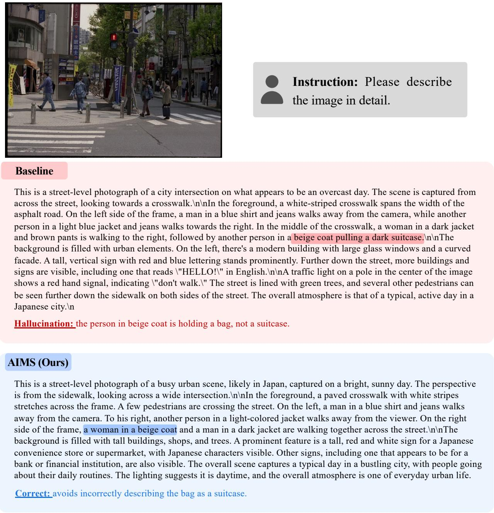  
Figure 7 Case study 1 on the CHAIR benchmark using Qwen3.5-9B with greedy decoding.

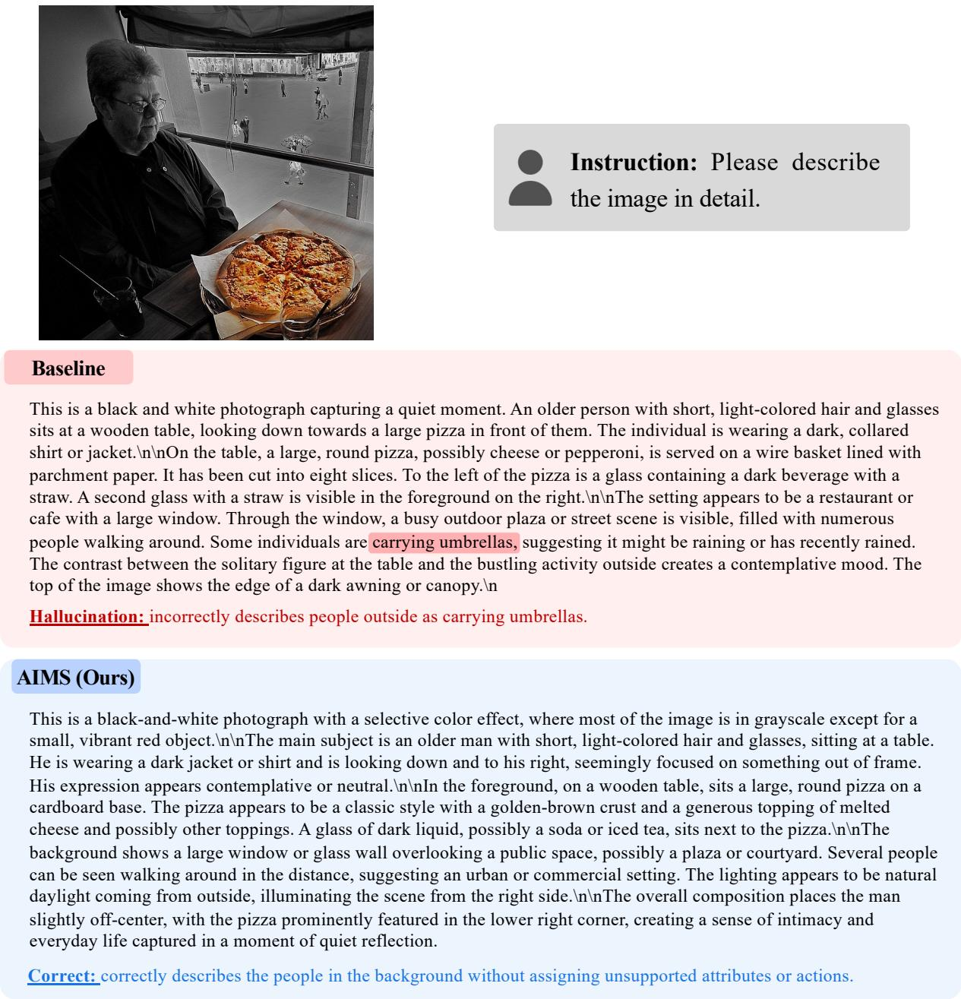  
Figure 8 Case study 2 on the CHAIR benchmark using Qwen3.5-9B with greedy decoding.

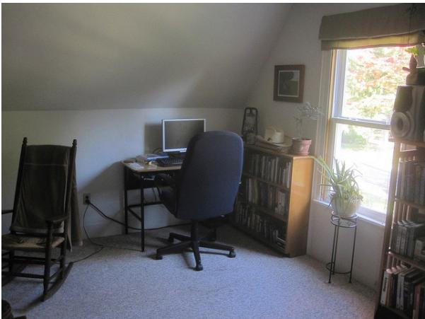

Instruction: Please describe the image in detail.

## Baseline

The image depicts a small, cozy room that appears to be an attic or loft space. The room is well-lit by natural light streaming through a window on the right side of the image. The window has a wooden frame and is covered with a beige curtain that allows some sunlight to filter into the room.\n\nIn the center of the room, there is a desk with a computer setup. The desk is black and has a simple design. On the desk, there is a desktop computer monitor, a keyboard, and a mouse. Next to the monitor, there is a small white object that looks like a speaker or possibly a decorative item. The desk also has a few other items, including what appears to be a stack of books or magazines and a small plant in a pot.\n\nTo the left of the desk, there is a rocking chair with a dark wooden frame and a cushioned seat. The chair is positioned against the wall and seems to be made for comfort and relaxation.\n\nOn the right side of the desk, there is a bookshelf filled with various books. The bookshelf is wooden and has multiple shelves, each holding different books. Some books are stacked vertically, while others are placed horizontally. The top shelf contains a few decorative items, including a small potted plant and a framed picture or artwork.\n\nThe floor of the room is carpeted in a light color, which adds to the warm and inviting atmosphere of the space. The walls are painted in a light color, likely white or a very light shade, which helps to brighten up the room further.\n\nOverall, the room appears to be a comfortable and functional workspace, combining elements of both work and relaxation. The presence of the rocking chair suggests that this space might also serve as a reading or contemplation area. The natural light from the window enhances the room's ambiance, making it feel more open and airy.

Hallucination: incorrectly claims that there is a mouse on the desk, likely driven by the common keyboard–mouse cooccurrence prior.

## AIMS (Ours)

The image depicts a cozy, well-organized attic or loft space. The room is characterized by its high ceiling and ample natural light streaming through a large window on the right side of the image. The window allows for a view of trees outside, suggesting that the room is located in a suburban area.\n\n\*\*Room Layout and Furniture:\*\*\n1. \*\*Desk Area:\*\* In the center-left of the image, there is a small desk with a computer monitor placed on it. The desk appears to be made of wood and has a few items on it, including what looks like a keyboard and possibly some papers or a notebook.\n2. \*\*Office Chair:\*\* Positioned directly in front of the desk is an office chair with a blue cushion. This chair seems to be ergonomically designed, providing comfort and support for someone working at the desk.\n3. \*\*Bookshelf:\*\* To the right of the desk, there is a tall bookshelf filled with various books. The books appear to be arranged neatly, indicating that this space is used for reading and studying.\n4. \*\*Side Table:\*\* Next to the bookshelf, there is a small side table with a potted plant on it. The plant adds a touch of greenery to the room, creating a more inviting atmosphere.\n5. \*\*Rocker Chair:\*\* On the left side of the image, there is a rocking chair with a dark wooden frame. The chair is positioned near the desk, offering an additional seating option in the room.\n6. \*\*Additional Furniture:\*\* There is another piece of furniture visible in the image, which appears to be a small table or stand with a plant on it. This adds to the room's decor and provides extra storage or display space.\n\n\*\*Lighting and Ambiance:\*\*\nThe room is well-lit, primarily due to the natural light coming from the large window. The lighting creates a warm and inviting atmosphere, making the space feel cozy and comfortable.\n\n\*\*Decorations and Personal Items:\*\*\n1. \*\*Wall Decorations:\*\* On the wall above the desk, there is a framed picture or artwork, adding a personal touch to the room.\n2. \*\*Personal Items:\*\* Various personal items and decorations are scattered throughout the room, contributing to its lived-in and personalized feel.\n\n\*\*Conclusion:\*\*\nThis attic or loft space is well-organized and features a variety of furniture and decor items. The room is equipped with a desk, office chair, bookshelf, rocking chair, and side table, all of which contribute to a comfortable and inviting living or working environment.

Correct: Remains grounded in the visual evidence without introducing the co-occurring but absent object.

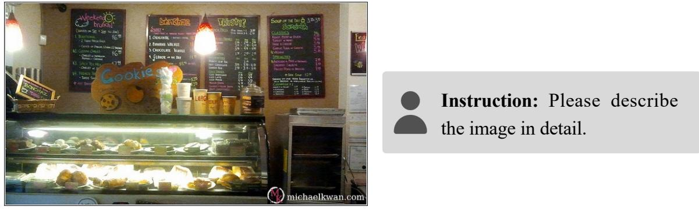

## Baseline

The image depicts the interior of a bakery or café, showcasing a well-organized display case filled with an assortment of baked goods and pastries. The display case is illuminated by bright lights, making the items inside clearly visible to customers. \n\n\*\*Objects Present in the Image:\*\*\n\n1. \*\*Bakery Display Case:\*\*\n - The display case is made of glass and has multiple shelves.\n - The top shelf contains various types of pastries, including what appears to be croissants, muffins, and possibly some cakes or tarts.\n - The middle shelf holds more pastries, such as cookies, donuts, and other sweet treats.\n - The bottom shelf displays additional baked goods like bread rolls, bagels, and possibly some sandwiches or pastries.\n\n2. \*\*Menu Boards:\*\*\n - There are several chalkboard menus on the wall behind the display case.\n - The leftmost menu board lists \"Weekend Brunch\" offerings, which include items like \"Baked Eggs,\" \"Breakfast Burrito,\" and \"Chocolate Muffin.\"\n - The central menu board features \"Breakfast\" options, such as \"Baked Eggs,\" \"Breakfast Burrito,\" and \"Chocolate Muffin.\"\n - The rightmost menu board provides \"Soup of the Day\" choices, including \"Chicken Noodle Soup,\" \"Beef Stew,\" and \"Vegetable Soup.\"\n\n3. \*\*Decorative Elements:\*\*\n - A large, decorative pumpkin is placed prominently in front of the display case, adding a festive touch to the setting.\n - The pumpkin is painted with the word \"Cookie\" written on it, suggesting that the bakery specializes in cookies.\n\n4. \*\*Lighting:\*\*\n - The lighting in the bakery is bright, ensuring that all items are well-lit and easily visible to customers.\n\n5. \*\*Additional Items:\*\*\n - There are several small containers of condiments or toppings placed near the display case, likely for customers to add to their pastries.\n - A small sign indicating \"LARGE\" is visible, possibly referring to the size of certain items available for purchase.\n\n6. \*\*Wall Decorations:\*\*\n - The walls are adorned with colorful chalkboards displaying the menu items, contributing to a vibrant and inviting atmosphere.\n\n7. \*\*Other Details:\*\*\n - The bakery seems to have a casual and welcoming ambiance, with a focus on fresh and delicious baked goods.

Hallucination: incorrectly identifies several paper cups as containers for condiments or toppings.

## AIMS (Ours)

The image depicts a section of a bakery or café, showcasing various items and signs. The main focus is on a display case filled with an assortment of baked goods. The display case has multiple shelves, each containing different types of pastries and breads.\n\nOn the top shelf, there are several types of pastries neatly arranged. These include:\n- Round pastries with a golden-brown crust.\n- Square pastries with a similar golden-brown crust.\n- Some pastries appear to be filled or have a different texture.\n\nOn the middle shelf, there are more pastries, including:\n- A few pastries that look like they might be filled with cream or some other filling.\n- Some pastries that appear to be topped with fruit or nuts.\n\nOn the bottom shelf, there are more pastries, including:\n- Some pastries that look like they might be filled with cream or some other filling.\n- Some pastries that appear to be topped with fruit or nuts.\n\nIn front of the display case, there is a counter with various items displayed. On the left side of the counter, there is a box labeled \"Bouquet\" which appears to contain some kind of gift or product. Next to it, there is a small sign that reads \"Cookie's.\"\n\nBehind the counter, there is a chalkboard menu. The menu is divided into sections, each with its own color-coded writing. The top part of the menu lists various items such as \"Breakfast,\" \"Lunch,\" \"Dinner,\" and \"Specials.\" Each section has a list of items along with their prices. For example, under \"Breakfast,\" there are items listed such as \"Eggs,\" \"Muffins,\" \"Bagels,\" and others.\n\nTo the right of the menu, there is another chalkboard sign. This sign appears to be advertising a special offer or promotion, although the specific details are not clearly visible in the image.\n\nAbove the counter, there is a large window or glass panel, allowing natural light to illuminate the display case and counter area. The lighting inside the bakery is bright, making the pastries and other items easily visible.\n\nOverall, the image captures a wellstocked bakery or café with a variety of baked goods on display, along with a detailed menu board. The setting suggests a welcoming and inviting atmosphere for customers to enjoy their treats.

Correct: avoids assigning unsupported functions to the paper cups.

Figure 10 Case study 2 on the CHAIR benchmark using Qwen2.5-VL-3B with greedy decoding.18

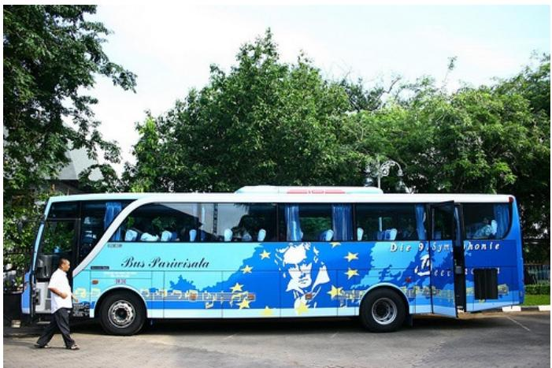

Instruction: Describe this image.

## Baseline

The image depicts a large blue bus parked in what appears to be an outdoor parking area, possibly near a park or a public transportation hub. The bus is predominantly blue with white and yellow accents. The side of the bus features a design that includes a cartoon-like depiction of a person's face, which seems to be a stylized representation of a famous person, possibly a sports figure given the context of the design elements.\n\nThe bus has multiple windows along its length, and the windows are tinted. The front of the bus displays the text \"Bus Parivizala\" on the lower part of the front door, indicating it might be a public transportation bus serving a specific route or service. The bus also has several advertisements and logos on its body, including a logo that resembles a ship, suggesting it might be associated with maritime services or tourism.\n\nIn the background, there are trees and greenery, indicating that the location is likely in a suburban or urban park area. The sky is clear, suggesting good weather conditions at the time the photo was taken. There is no visible traffic or other vehicles around the bus, making it the primary focus of the image.\n\nGiven the design and context, the bus could be used for tourism or public transportation within a coastal or maritime region. The presence of the cartoon-like face and the ship logo suggests that the bus might be promoting travel or tourism services related to the sea.\n\nTo summarize:\n- \*\*Bus Type\*\*: Large blue bus.\n- \*\*Design\*\*: Cartoon-like face, ship logo, advertisements.\n- \*\*Text\*\*: \"Bus Parivizala\".\n- \*\*Location\*\*: Outdoor parking area, possibly near a park or public transportation hub.\n- \*\*Background\*\*: Trees and greenery, clear sky.\n- \*\*Purpose\*\*: Likely tourism or public transportation related to maritime services.\n\nThis detailed description should provide a comprehensive understanding of the image, allowing a pure text model to answer any related questions effectively.

Hallucination: incorrectly describes a ship logo and infers a maritime/sea-related context.

## AIMS (Ours)

The image depicts a large blue bus parked on what appears to be a paved surface, possibly a parking lot or a street. The bus is predominantly blue with white accents and features various graphics and text on its side. \n\n### Description of the Bus:\n1. \*\*Color and Design\*\*: The bus is primarily blue with white accents. The design includes a series of yellow stars scattered across the side of the bus.\n2. \*\*Graphics and Text\*\*: There are several graphics and texts on the side of the bus. Notably, there is a large graphic of a person's face in the center, which appears to be a caricature or stylized portrait. Surrounding this central figure are numerous yellow stars, adding a dynamic and colorful element to the bus's appearance.\n3. \*\*Text and Branding\*\*: Below the central graphic, there is text that reads \"Bus Parivizala,\" indicating the name or brand of the bus. Additionally, there are other smaller texts and logos, but they are not clearly legible from the image provided.\n\n### Environment:\n1. \*\*Surroundings\*\*: The bus is parked in an area with trees in the background, suggesting it might be in a park, a residential area, or a public space.\n2. \*\*Background Elements\*\*: There are no visible people or vehicles around the bus, giving the impression that the bus is either parked temporarily or waiting for passengers.\n\n### Additional Observations:\n1. \*\*Windows and Doors\*\*: The bus has multiple windows along its length, allowing passengers to see outside. The front door of the bus is visible, and it appears to be a standard entry door.\n2. \*\*License Plate\*\*: Although not clearly visible, the bus likely has a license plate at the back, which is common for buses.\n\n### Analysis:\n- \*\*Purpose\*\*: Given the design and the text \"Bus Parivizala,\" it can be inferred that this bus is used for public transportation, likely serving routes within a city or town.\n- \*\*Functionality\*\*: The presence of multiple windows suggests that the bus is designed to accommodate a significant number of passengers, making it suitable for urban commuting.\n- \*\*Design Elements\*\*: The use of blue and yellow colors, along with the star graphics, could be indicative of a specific branding or a particular route associated with the bus company.\n\n### Conclusion:\nThis image shows a blue bus with white accents and star graphics, parked in an area with trees in the background. The bus is branded as \"Bus Parivizala\" and features a central graphic of a person's face

Correct: accurately describes the visible elements (e.g. yellow stars) without hallucinated content.

Figure 11 Case study on the AMBER-G benchmark using Qwen2.5-VL-3B with greedy decoding.

Question: Is there a yellow bird in the image? Please answer yes or no.GT Baseline AIMS (Ours)

<table><tr><td rowspan=1 colspan=1>GT</td><td rowspan=1 colspan=1>Baseline</td><td rowspan=1 colspan=1>AIMS (Ours)</td></tr><tr><td rowspan=1 colspan=1>No</td><td rowspan=1 colspan=1>Yes</td><td rowspan=1 colspan=1>No</td></tr></table>

AIMS: Correctly identifies the color of objects.

Question: Is this a picture ofe image? Please answer yes or no. Former Tainan Assembly Hall? Please answer yes or no. T Baseline

<table><tr><td rowspan=1 colspan=1>GT</td><td rowspan=1 colspan=1>Baseline</td><td rowspan=1 colspan=1>AIMS (Ours)</td></tr><tr><td rowspan=1 colspan=1>No</td><td rowspan=1 colspan=1>Yes</td><td rowspan=1 colspan=1>No</td></tr></table>

AIMS: Correctly recognizes the landmark.

Question: Is this artwork createdQuestion: Is the actor inside Question: Is the answer to tby Antoniazzo Romano? Pleasered bounding box named Ch Question: Is arithmetic queanswer yes or no.Please answer GT Base

<table><tr><td rowspan=1 colspan=1>GT</td><td rowspan=1 colspan=1>Baseline</td><td rowspan=1 colspan=1>AIMS (Ours)</td></tr><tr><td rowspan=1 colspan=1>Yes</td><td rowspan=1 colspan=1>No</td><td rowspan=1 colspan=1>Yes</td></tr></table>

AIMS: Correctly verifies the artwork’s attribution.AIMS: Correctly verifies the actor’s name.

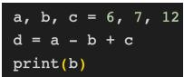  
GT Baseline AIMS (Ours)No Yes NoAIMS: Correctly performs code reasoning.

Question: The image shows a pythonof pizza in this image? Please Question: Is the actor inside thecode. Is the output of the code '11'?answer yes or no. Please answer yes or no.T Baseline

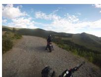

S: Correctly performs code reasoningQuestion: Is there a backpack indescribe a place of pantry? PleaseFormer Tainan Assembly Hall? uestion: The image shows a python this image? Ple s ans er yes or no.answer yes or no.

<table><tr><td rowspan=1 colspan=1>GT</td><td rowspan=1 colspan=1>Baseline</td><td rowspan=1 colspan=1>AIMS (Ours)</td></tr><tr><td rowspan=1 colspan=1>Yes</td><td rowspan=1 colspan=1>No</td><td rowspan=1 colspan=1>Yes</td></tr></table>

  
AIMS: Correctly translates the text.  
AIMS: Correctly recognizes the backpack.

Question: Is it appropriate to translate the Chinese in the image into English 'waiting for a long time' in the picture? Please answer yes or no.GT Baseline

Question: Is the word in the logo "excharge hotel"? Please answer yes or no.

Question: Is it a good time to drive a car through the road in the picture? Please answer yes or no.

<table><tr><td rowspan=1 colspan=1>GT</td><td rowspan=1 colspan=1>Baseline</td><td rowspan=1 colspan=1>AIMS (Ours)</td></tr><tr><td rowspan=1 colspan=1>No</td><td rowspan=1 colspan=1>Yes</td><td rowspan=1 colspan=1>No</td></tr></table>

<table><tr><td rowspan=1 colspan=1>GT</td><td rowspan=1 colspan=1>Baseline</td><td rowspan=1 colspan=1>AIMS (Ours)</td></tr><tr><td rowspan=1 colspan=1>No</td><td rowspan=1 colspan=1>Yes</td><td rowspan=1 colspan=1>No</td></tr></table>

  
AIMS: Correctly recognizes the logo text.  
AIMS: Correctly interprets the traffic signal.

Question: Is this movie directed byby Antoniazzo Romano? Please jonathan liebesman? Please answeranswer yes or no. yes or no.

<table><tr><td rowspan=1 colspan=1>GT</td><td rowspan=1 colspan=1>Baseline</td><td rowspan=1 colspan=1>AIMS (Ours)</td></tr><tr><td rowspan=1 colspan=1>Yes</td><td rowspan=1 colspan=1>No</td><td rowspan=1 colspan=1>Yes</td></tr></table>

AIMS: Correctly identifies the movie director.  
Yes No YesAIMS: Correctly verifies the actor’s name.

<table><tr><td rowspan=1 colspan=1>GT</td><td rowspan=1 colspan=1>Baseline</td><td rowspan=1 colspan=1>AIMS (Ours)</td></tr><tr><td rowspan=1 colspan=1>Yes</td><td rowspan=1 colspan=1>No</td><td rowspan=1 colspan=1>Yes</td></tr></table>

Question: Is there only one piecejonathan liebesman? Please answerFormer Tainan Assembly Hall? of pizza in this image? Pleaseyes or no.Please answer yes or no. answer yes or no.

Question: Is the actor inside thea car through the road in the picture? Question: Does this imagered bounding box named Cher?Please answer yes or no. Question: Is there a describe a place of p nPlease answer yes or no.

<table><tr><td rowspan=1 colspan=1>GT</td><td rowspan=1 colspan=1>Baseline</td><td rowspan=1 colspan=1>AIMS (Ours)</td></tr><tr><td rowspan=1 colspan=1>No</td><td rowspan=1 colspan=1>Yes</td><td rowspan=1 colspan=1>No</td></tr></table>

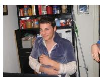  
AIMS: Correctly counts the pizza pieces.

S: Correctly performs code reasoninQuestion: Does this imageFormer Tainan Assembly Hall?arithmetic question in the image 56 Question: Is there a backpack idescribe a place of pantry? Please this image? Pleaanswer yes or no.

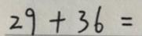

<table><tr><td rowspan=1 colspan=1>GT</td><td rowspan=1 colspan=1>Baseline</td><td rowspan=1 colspan=1>AIMS (Ours)</td></tr><tr><td rowspan=1 colspan=1>Yes</td><td rowspan=1 colspan=1>No</td><td rowspan=1 colspan=1>Yes</td></tr></table>

AIMS: Correctly recognizes the scene.

Question: Is the answer to theQuestion: Is the word in the logo Question: Is it appropriate to translatarithmetic question in the image 56?"excharge hotel"? Please answer the Chinese in the image Please answer yes or no.yes or o.

<table><tr><td rowspan=1 colspan=1>GT</td><td rowspan=1 colspan=1>Baseline</td><td rowspan=1 colspan=1>AIMS (Ours)</td></tr><tr><td rowspan=1 colspan=1>No</td><td rowspan=1 colspan=1>Yes</td><td rowspan=1 colspan=1>No</td></tr></table>

Yes No YesYes No YesAIMS: Correctly solves the arithmetic problem.

Question: Is the word in the logmiddle of potted plants in the image? "excharge hotel"? PlPlease answer yes or no.

<table><tr><td rowspan=1 colspan=1>GT</td><td rowspan=1 colspan=1>Baseline</td><td rowspan=1 colspan=1>AIMS (Ours)</td></tr><tr><td rowspan=1 colspan=1>Yes</td><td rowspan=1 colspan=1>No</td><td rowspan=1 colspan=1>Yes</td></tr></table>

AIMS: Correctly recognizes the spatial relationship.