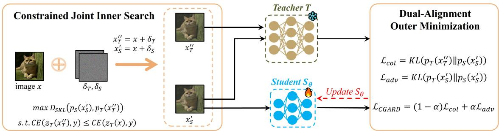

# COLLABORATIVELY GUIDED ADVERSARIAL ROBUST DISTILLATION WITH TEACHER-FAVORABLE EXAMPLES

Zhi Li1, Haowei Liu1, Hongchen Yang1, Xiaoxuan Wang2, Song Gao1∗, Shaowen Yao1, Wei Zhou1

1Engineering Research Center of Cyberspace and School of Software and AI,

Yunnan University, Kunming, China

2School of Information Science and Technology, Yunnan Normal University, Kunming, China

## ABSTRACT

Adversarial distillation transfers robustness from high-capacit teachers to compact students. Existing adversarial distillation methods mainly use teacher predictions on clean or adversarial examples to supervise student learning. However, teacher-favorable supervision within the perturbation neighborhood remains underexplored in adversarial distillation. We therefore propose Collaboratively Guided Adversarial Robust Distillation (CGARD), which jointly optimizes distinct student-adversarial and teacher-collaborative examples within the same perturbation neighborhood. The teachercollaborative example is constrained to incur no greater cross-entropy loss under the teacher than the clean input. CGARD combines collaborative teacher guidance with adversarial teacher supervision to improve robust knowledge transfer. Experiments on CIFAR-10 and CIFAR-100, including white-box evaluation and additional black-box transfer evaluation, demonstrate consistent robustness improvements over strong adversarial distillation baselines.

Index Terms— Adversarial Distillation, Adversarial Robustness, Knowledge Distillation, Adversarial Training

## 1. INTRODUCTION

Lightweight networks enable deployment on platforms with limited resources, but remain vulnerable to adversarial perturbations [1, 2, 3]. Adversarial training (AT) improves robustness by incorporating adversarial examples into model optimization [4, 5, 6], while several methods further improve the trade-off between clean and robust accuracy [7, 8, 9]. However, the limited capacity of lightweight models can constrain the effectiveness of AT, motivating adversarial distillation (AD) to transfer robustness from high-capacity robust teachers to compact students [10].

Adversarial distillation transfers robustness from a robust teacher to a compact student through teacher supervision [11]. RSLAD [12] exploits robust soft labels, while IAD [13] uses student introspection to regulate potentially unreliable teacher guidance. AdaAD [14] adaptively searches a shared perturbed example by maximizing the prediction discrepancy between the teacher and student predictions. PeerAiD [15] introduces a specialized peer tutor to provide robustness supervision to the student.

Across these approaches, teacher supervision is usually obtained from the clean input or from an adversarial input generated to challenge the student. Consequently, teacherfavorable inputs within the same perturbation neighborhood remain largely unused. ST [16] provides a useful precedent in adversarial training by jointly constructing adversarial and low-loss collaborative examples with a single model. Applying this principle to adversarial distillation, however, is nontrivial because it involves a trainable student and a fixed robust teacher. A straightforward adaptation would first construct a teacher-collaborative example and then search for a student-adversarial example using the resulting fixed teacher prediction. Because the teacher-collaborative example remains fixed during the second search, this sequential strategy cannot adapt it to the evolving student-adversarial prediction. We therefore propose Collaboratively Guided Adversarial Robust Distillation (CGARD), as illustrated in Fig. 1. CGARD jointly optimizes the student-adversarial and teacher-collaborative examples as separate variables within the same perturbation neighborhood. The joint search maximizes the discrepancy between the student prediction on the adversarial example and the teacher prediction on the collaborative example. Meanwhile, the teacher-collaborative example is constrained to incur no greater cross-entropy loss under the teacher than the clean input. A dual-alignment objective then supervises the student’s adversarial prediction using teacher predictions on both examples. This use of separate search variables distinguishes CGARD from AdaAD [14], which maximizes teacher-student discrepancy on a single perturbed input shared by both models.

Our main contributions are:

• We introduce a constrained example construction for adversarial distillation, jointly optimizing studentadversarial and teacher-collaborative examples through the discrepancy between teacher and student predic-

  
Fig. 1. Overview of CGARD. The joint inner search optimizes student-adversarial and teacher-collaborative examples through the discrepancy between teacher and student predictions, while dual alignment uses teacher supervision from both examples.

tions.

• We design a dual-alignment objective to combine teacher predictions on the teacher-collaborative and student-adversarial examples for robust knowledge transfer.

• Experiments on CIFAR-10 and CIFAR-100 demonstrate consistent robustness improvements over strong adversarial distillation baselines, including up to 0.72 percentage points higher AutoAttack accuracy.

## 2. METHODOLOGY

## 2.1. Motivation for Teacher-Collaborative Examples

We motivate teacher-collaborative examples through the relationship between teacher cross-entropy and the logit margin. Let $z _ { T } ( x ) = [ z _ { T , 1 } ( x ) , \ldots , z _ { T , C } ( x ) ] \in \mathbb { R } ^ { C }$ denote the logits of the fixed robust teacher. For a correctly classified example $( x , y )$ , we define the logit margin as

$$
\gamma ( x ) = z _ { T , y } ( x ) - \operatorname* { m a x } _ { c \neq y } z _ { T , c } ( x ) .\tag{1}
$$

The cross-entropy loss satisfies

$$
\begin{array} { l } { \displaystyle \mathrm { C E } ( z _ { T } ( x ) , y ) = \log \left( 1 + \sum _ { c \neq y } e ^ { z _ { T , c } ( x ) - z _ { T , y } ( x ) } \right) } \\ { \geq \log \left( 1 + e ^ { - \gamma ( x ) } \right) , } \end{array}\tag{2}
$$

which implies

$$
\gamma ( x ) \geq - \log \left( e ^ { \operatorname { C E } ( z _ { T } ( x ) , y ) } - 1 \right) .\tag{3}
$$

We further relate the logit margin to the perturbation required to change the teacher prediction. Assume that the teacher logit mapping is L-Lipschitz under $\ell _ { \infty } \colon$

$$
\| z _ { T } ( x ) - z _ { T } ( x ^ { \prime } ) \| _ { \infty } \leq L \| x - x ^ { \prime } \| _ { \infty } .\tag{4}
$$

For any perturbation δ that changes the predicted label, there exists a class $c \neq y$ such that $z _ { T , c } ( x + \delta ) \geq z _ { T , y } ( x + \delta )$ Therefore,

$$
\begin{array} { r l r } {  { \gamma ( x ) \leq [ z _ { T , y } ( x ) - z _ { T , c } ( x ) ] - [ z _ { T , y } ( x + \delta ) - z _ { T , c } ( x + \delta ) ] } } \\ & { } & { \leq 2 \| z _ { T } ( x ) - z _ { T } ( x + \delta ) \| _ { \infty } } \\ & { } & { \leq 2 L \| \delta \| _ { \infty } . } \end{array}
$$

Combining this inequality with Eq. (3) yields

$$
\| \delta \| _ { \infty } \geq \frac { \gamma ( x ) } { 2 L } \geq \frac { - \log \left( e ^ { \operatorname { C E } ( z _ { T } ( x ) , y ) } - 1 \right) } { 2 L } .\tag{6}
$$

When the right-hand side is positive, Eq. (6) provides a lower bound on the perturbation magnitude required to change the teacher prediction. Under a common Lipschitz bound for the fixed robust teacher, reducing cross-entropy increases this lower bound on the perturbation required to change the teacher prediction. This motivates searching for teacher-collaborative examples with lower cross-entropy to provide additional teacher supervision during distillation.

## 2.2. Constrained Joint Inner Search

Let $S _ { \theta }$ and T denote the student and fixed robust teacher, with logits $z _ { S } ( x )$ and $z _ { T } ( x )$ . Their predictive distributions are $p _ { S } ( x ) = \mathrm { s o f t m a x } ( z _ { S } ( x ) ) , p _ { T } ( x ) = \mathrm { s o f t m a x } ( z _ { T } ( x ) )$ The perturbation neighborhood is defined as

$$
\begin{array} { r } { B _ { \varepsilon } ( x ) = \{ x ^ { \prime } : \| x ^ { \prime } - x \| _ { \infty } \leq \varepsilon \} . } \end{array}\tag{7}
$$

For each training example $( x , y )$ , CGARD searches for a student-adversarial example $x _ { S } ^ { \prime }$ and a teacher-collaborative example $x _ { T } ^ { \prime \prime }$ within $B _ { \varepsilon } ( x )$ . The two examples are treated as separate optimization variables, while their updates are jointly determined by the following discrepancy between teacher and student predictions:

$$
\begin{array} { r l r } & { \underset { x _ { S } ^ { \prime } , x _ { T } ^ { \prime \prime } \in \mathcal { B } _ { \varepsilon } ( x ) } { \operatorname* { m a x } } } & { D _ { \mathrm { S K L } } \left( p _ { S } ( x _ { S } ^ { \prime } ) , p _ { T } ( x _ { T } ^ { \prime \prime } ) \right) } \\ & { \mathrm { s . t . } } & { \mathrm { C E } \left( z _ { T } ( x _ { T } ^ { \prime \prime } ) , y \right) \leq \mathrm { C E } \left( z _ { T } ( x ) , y \right) , } \end{array}\tag{8}
$$

where

$$
D _ { \mathrm { S K L } } ( p , q ) = \frac 1 2 \left[ \mathrm { K L } ( p \| q ) + \mathrm { K L } ( q \| p ) \right] .\tag{9}
$$

In particular, the update of $x _ { T } ^ { \prime \prime }$ depends on the current student prediction at $x _ { S } ^ { \prime }$ . The constraint $\mathrm { C E } ( z _ { T } ( x _ { T } ^ { \prime \prime } ) , y ) \ \leq$ $\mathrm { C E } ( z _ { T } ( x ) , y )$ requires the teacher to retain at least the same confidence in the ground-truth class at $x _ { T } ^ { \prime \prime }$ as on the clean example x.

Both search examples are initialized from the x with standard Gaussian perturbations scaled by 0.001. We approximately optimize Eq. (8) using iterative gradient ascent. After each update, both examples are projected onto the perturbation neighborhood and clipped to the valid pixel range, while the teacher cross-entropy constraint is enforced by the feasibility check described below.

$$
\begin{array} { r l } & { x _ { S } ^ { \prime k + 1 } = \Pi _ { \mathcal { B } _ { \varepsilon } ( x ) } \left( x _ { S } ^ { \prime k } + \eta \mathrm { \ s i g n } \nabla _ { x _ { S } ^ { \prime } } D _ { \mathrm { S K L } } \right) , } \\ & { \widetilde { x } _ { T } ^ { \prime \prime k + 1 } = \Pi _ { \mathcal { B } _ { \varepsilon } ( x ) } \left( x _ { T } ^ { \prime \prime k } + \eta \mathrm { \ s i g n } \nabla _ { x _ { T } ^ { \prime \prime } } D _ { \mathrm { S K L } } \right) . } \end{array}\tag{10}
$$

The teacher parameters remain fixed throughout the search, and the gradients with respect to $x _ { T } ^ { \prime \prime }$ are used only to update the teacher-collaborative example. For each training example, the updated candidate in the teacher branch is retained only when

$$
\mathrm { C E } \left( z _ { T } ( \widetilde { x } _ { T } ^ { \prime \prime k + 1 } ) , y \right) \leq \mathrm { C E } ( z _ { T } ( x ) , y ) .\tag{11}
$$

Otherwise, the candidate is reset to the clean example before the next update.

## 2.3. Dual-Alignment Outer Minimization

Given the generated examples $x _ { S } ^ { \prime }$ and $x _ { T } ^ { \prime \prime }$ , CGARD keeps the teacher fixed and trains the student with a collaborative alignment term and an adversarial alignment term:

$$
\begin{array} { r } { \mathcal { L } _ { \mathrm { c o l } } = \mathrm { K L } \left( p _ { T } ( x _ { T } ^ { \prime \prime } ) \Vert p _ { S } ( x _ { S } ^ { \prime } ) \right) , } \\ { \mathcal { L } _ { \mathrm { a d v } } = \mathrm { K L } \left( p _ { T } ( x _ { S } ^ { \prime } ) \Vert p _ { S } ( x _ { S } ^ { \prime } ) \right) . } \end{array}\tag{12}
$$

The collaborative alignment term $\mathcal { L } _ { \mathrm { c o l } }$ aligns the student’s prediction on $x _ { S } ^ { \prime }$ with the teacher’s prediction on $x _ { T } ^ { \prime \prime }$ . The adversarial alignment term $\mathcal { L } _ { \mathrm { a d v } }$ aligns the teacher and student predictions on the same student-adversarial example $x _ { S } ^ { \prime } .$ Thus, the two terms provide teacher supervision from different examples for the same student prediction on $x _ { S } ^ { \prime }$

$$
\mathcal { L } _ { \mathrm { C G A R D } } = ( 1 - \alpha ) \mathcal { L } _ { \mathrm { c o l } } + \alpha \mathcal { L } _ { \mathrm { a d v } } ,\tag{13}
$$

Here, $\alpha \in [ 0 , 1 ]$ balances the two alignment terms. At each training iteration, the constrained joint inner search regenerates $x _ { S } ^ { \prime }$ and $x _ { T } ^ { \prime \prime }$ , followed by minimization of $\mathcal { L } _ { \mathrm { C G A R D } }$ with respect to the student parameters.

## 3. EXPERIMENTS

## 3.1. Experimental Setup

We evaluate CGARD on CIFAR-10 and CIFAR-100 [17]. We use WideResNet-34-10 (WRN) [18] pretrained with ST [16] as the fixed robust teacher. ResNet-18 (RN-18) [19] and MobileNet-V2 (MN-V2) [20] are used as students. We compare CGARD with PGD-AT [4], TRADES [7], ST [16], ARD [11], RSLAD [12], IAD [13], AdaAD [14], and PeerAiD [15]. All baseline results are obtained from our reproductions.

We report clean, PGD [4], $\mathrm { C W } _ { \infty } \left[ 2 1 \right]$ , and standard AutoAttack (AA) [2] accuracy, with FGSM [22] additionally used for ablation studies. All attacks use an $\ell _ { \infty }$ perturbation budget of $\varepsilon = 8 / 2 5 5$ ; PGD and $\mathrm { C W } _ { \infty }$ use 20 iterations with a step size of 2/255.

CGARD students are trained for 300 epochs using SGD with momentum 0.9, weight decay $2 \times 1 0 ^ { - 4 }$ , and a batch size of 128. The initial learning rate is 0.1 and is divided by 10 at epochs 215, 260, and 285. The inner search uses $K = 1 0$ iterations with step size 2/255, and $\alpha = 0 . 7$

## 3.2. White-Box Robustness

Table 1 reports clean and white-box robust accuracy on CIFAR-10 and CIFAR-100. CGARD achieves the highest PGD, $\mathrm { C W } _ { \infty }$ , and AA accuracy among the evaluated student methods in all four dataset–architecture settings. On CIFAR-10, its AA accuracies are 52.46% for RN-18 and 50.86% for MN-V2, exceeding the strongest corresponding AA baselines by 0.44 and 0.58 percentage points. On CIFAR-100, the corresponding accuracies are 28.49% and 27.66%, with gains of 0.49 and 0.72 percentage points. Compared to these strongest AA baselines, the clean accuracy decreases by 1.32 and 0.92 percentage points on CIFAR-10, respectively, while it is maintained or improved on CIFAR-100. These results indicate consistent robustness gains across the evaluated settings, while changes in clean accuracy vary across datasets.

## 3.3. Black-Box Transfer Robustness

We evaluate transfer-based black-box robustness on CIFAR-10 using WRN, VGG-19, and MN-V2 as surrogate architectures and RN-18 as the target student architecture. Table 2 reports robust accuracy against transferred PGD and $\mathrm { C W } _ { \infty }$ attacks. CGARD shows competitive transfer robustness across the evaluated surrogate models and attacks. These results complement the white-box evaluation across different surrogate architectures.

## 3.4. Ablation Studies

Table 3 compares two strategies for example generation. The sequential strategy first follows ST [16] to generate both teacher-collaborative and teacher-adversarial examples, fixes the teacher prediction on $x _ { T } ^ { \prime \prime }$ , and then generates $x _ { S } ^ { \prime }$ by maximizing its KL divergence from the fixed teacher prediction. CGARD instead jointly optimizes $x _ { S } ^ { \prime }$ and $x _ { T } ^ { \prime \prime }$ through $D _ { \mathrm { S K I } }$ under the teacher cross-entropy constraint. Compared to the sequential strategy, the proposed joint search strategy improves PGD, $\mathrm { C W } _ { \infty } .$ , and AA accuracy by 1.55, 1.33, and 1.45 percentage points, respectively, while clean accuracy decreases by 1.29 percentage points.

Table 1. White-box robustness comparison (%) on CIFAR-10 and CIFAR-100 under $\ell _ { \infty }$ attacks with $\varepsilon = 8 / 2 5 5$ . Best and second-best student results are shown in bold and underlined, respectively.
<table><tr><td rowspan="2">Arch.</td><td rowspan="2">Method</td><td colspan="4">CIFAR-10</td><td colspan="4">CIFAR-100</td></tr><tr><td></td><td>Clean</td><td>PGD</td><td> $\overline { { \mathbf { C } \mathbf { W } _ { \infty } } }$ </td><td>AA</td><td>Clean</td><td>PGD</td><td> $\overline { { \mathbf { C } \mathbf { W } _ { \infty } } }$ </td><td>AA</td></tr><tr><td>Type Teacher</td><td>WRN</td><td>ST [16] Natural</td><td>84.75</td><td>57.83</td><td>55.49</td><td>54.33</td><td>59.40</td><td>33.71</td><td>30.30</td><td>29.19</td></tr><tr><td rowspan="12">RN-18 Student</td><td rowspan="12"></td><td>95.28</td><td>0.01</td><td></td><td>0.01</td><td>0.00</td><td>77.72</td><td>0.00</td><td>0.00</td><td>0.00</td></tr><tr><td>PGD-AT [4]</td><td>82.50</td><td>51.53</td><td>50.57</td><td>48.04</td><td>57.52</td><td>28.50</td><td>27.12</td><td>24.68</td></tr><tr><td>TRADES [7]</td><td>82.78</td><td>50.83</td><td>49.37</td><td>47.63</td><td>56.32</td><td>26.95</td><td>23.77</td><td>22.69</td></tr><tr><td>ST [16]</td><td>83.43</td><td>53.72</td><td>51.66</td><td>50.01</td><td>55.75</td><td>30.92</td><td>26.89</td><td>26.04</td></tr><tr><td>ARD [11]</td><td>83.29</td><td>53.65</td><td>51.63</td><td>50.01</td><td>58.44</td><td>31.54</td><td>28.47</td><td>26.42</td></tr><tr><td>RSLAD [12]</td><td>82.98</td><td>55.61</td><td>53.00</td><td>51.49</td><td>56.55</td><td>32.85</td><td>29.34</td><td>28.00</td></tr><tr><td>IAD [13]</td><td>82.84</td><td>54.13</td><td>51.72</td><td>50.10</td><td>57.82</td><td>31.94</td><td>28.32</td><td>26.80</td></tr><tr><td>AdaAD [14]</td><td>84.28</td><td>56.17</td><td>53.36</td><td>52.02</td><td>58.91</td><td>32.57</td><td>29.00</td><td>27.80</td></tr><tr><td>PeerAiD [15] CGARD</td><td>82.63</td><td>54.21</td><td>52.24</td><td>50.25</td><td>56.76</td><td>32.99</td><td>29.66</td><td>27.97</td></tr><tr><td></td><td></td><td>82.96 56.47</td><td>53.69</td><td>52.46</td><td></td><td>56.93</td><td>33.28</td><td>29.83 28.49</td></tr><tr><td rowspan="7"></td><td>Natural</td><td>91.82</td><td>0.00</td><td>0.00</td><td>0.00</td><td>71.92</td><td>0.00</td><td>0.00</td><td>0.00</td></tr><tr><td>PGD-AT [4]</td><td>79.99</td><td>49.23</td><td>47.70</td><td>45.11</td><td>56.00</td><td>27.73</td><td>25.84</td><td>23.25</td></tr><tr><td>TRADES [7]</td><td>80.98</td><td>49.97</td><td>47.76</td><td>46.51</td><td>56.82</td><td>28.22</td><td>24.16</td><td>23.18</td></tr><tr><td>ST [16]</td><td>80.05</td><td>51.97</td><td>48.14</td><td>47.12</td><td>54.53</td><td>30.10</td><td>25.41</td><td>24.64</td></tr><tr><td>ARD [11]</td><td>81.80</td><td>52.50</td><td>50.22</td><td>48.67</td><td>57.25</td><td>31.00</td><td>27.90</td><td>26.02</td></tr><tr><td>RSLAD [12]</td><td>83.11</td><td>54.24</td><td>51.68</td><td>50.28</td><td>56.78</td><td>32.11</td><td>28.43</td><td>26.94</td></tr><tr><td>IAD [13]</td><td>81.44</td><td>52.47</td><td>50.15</td><td>48.06</td><td>57.41</td><td>31.59</td><td>28.09</td><td>26.36</td></tr><tr><td></td><td>AdaAD [14]</td><td>83.86</td><td>54.06</td><td>51.41</td><td>49.95</td><td>57.95</td><td>30.92</td><td>27.00</td><td>25.55</td></tr><tr><td></td><td>PeerAiD [15]</td><td>82.12</td><td>53.70</td><td>50.76</td><td>48.76</td><td>56.67</td><td>31.47</td><td>28.82</td><td>26.92</td></tr><tr><td></td><td>CGARD</td><td>82.19</td><td>54.96</td><td>52.12</td><td>50.86</td><td>56.79</td><td>32.95</td><td>29.00</td><td>27.66</td></tr></table>

Table 2. Black-box transfer robustness (%) on CIFAR-10 with robust WRN, VGG-19, and MN-V2 surrogates and an RN-18 target. Best and second-best results are shown in bold and underlined.
<table><tr><td rowspan="2">Surrogate Model Method</td><td>WRN</td><td>VGG-19</td><td></td><td>MN-V2</td></tr><tr><td>PGD  $\mathbf { C W } _ { \infty }$ </td><td>PGD</td><td> $\mathbf { C W } _ { \infty }$ </td><td>PGD</td><td> $\mathbf { C W } _ { \infty }$ </td></tr><tr><td>PGD-AT [4]</td><td>65.21</td><td>65.21</td><td>63.84 63.12</td><td>63.25</td><td>62.41</td></tr><tr><td>TRADES [7]</td><td>65.64</td><td>65.26</td><td>63.89</td><td>62.96 63.00</td><td>62.26</td></tr><tr><td>ST [16]</td><td>66.92</td><td>66.54</td><td>66.41 65.70</td><td>66.10</td><td>65.49</td></tr><tr><td>ARD [11]</td><td>66.25</td><td>66.06</td><td>65.57 64.76</td><td>64.85</td><td>64.19</td></tr><tr><td>RSLAD [12]</td><td>66.70</td><td>66.66</td><td>66.28 65.69</td><td>65.82</td><td>65.16</td></tr><tr><td>IAD [13]</td><td>66.59</td><td>66.33</td><td>65.86 64.95</td><td>65.31</td><td>64.52</td></tr><tr><td>AdaAD [14]</td><td>66.80</td><td>66.53</td><td>66.59 65.88</td><td>66.15</td><td>65.42</td></tr><tr><td>PeerAiD [15]</td><td>66.64</td><td>66.62</td><td>66.19 65.51</td><td>65.03</td><td>64.65</td></tr><tr><td>CGARD</td><td>66.94</td><td>66.69</td><td>66.60 66.06</td><td>66.19</td><td>65.52</td></tr></table>

Table 4 keeps the constrained joint inner search fixed. Using $\mathcal { L } _ { \mathrm { c o l } }$ or $\mathcal { L } _ { \mathrm { a d v } }$ alone yields AA accuracies of 51.84% and 51.83%, compared with 52.46% when both terms are used.

Table 3. Comparison of sequential search and constrained joint inner search on CIFAR-10 with WRN as the teacher and RN-18 as the student. Best results are shown in bold.
<table><tr><td>Configuration</td><td>Clean</td><td>FGSM</td><td>PGD</td><td> $\overline { { \mathbf { C } \mathbf { W } _ { \infty } } }$ </td><td>AA</td></tr><tr><td>Sequential Search</td><td>84.25</td><td>60.97</td><td>54.92</td><td>52.36</td><td>51.01</td></tr><tr><td>Joint Search (CGARD)</td><td>82.96</td><td>61.12</td><td>56.47</td><td>53.69</td><td>52.46</td></tr></table>

Table 4. Ablation study of the dual-alignment objective on CIFAR-10 with WRN as the teacher and RN-18 as the student. Best results are shown in bold.
<table><tr><td> ${ \mathcal { L } } _ { \mathbf { c o l } }$ </td><td> $\pmb { \mathcal { L } } _ { \mathbf { a d v } }$ </td><td>Clean</td><td>FGSM</td><td>PGD</td><td> $\mathbf { C W } _ { \infty }$ </td><td>AA</td></tr><tr><td>√</td><td></td><td>82.64</td><td>60.65</td><td>56.06</td><td>53.21</td><td>51.84</td></tr><tr><td></td><td>√</td><td>83.13</td><td>60.71</td><td>55.95</td><td>53.07</td><td>51.83</td></tr><tr><td>√</td><td> $\checkmark$ </td><td>82.96</td><td>61.12</td><td>56.47</td><td>53.69</td><td>52.46</td></tr></table>

## 4. CONCLUSION

We proposed CGARD, which jointly optimizes separate student-adversarial and teacher-collaborative examples under a teacher cross-entropy constraint and trains the student through dual alignment. Across CIFAR-10 and CIFAR-100 with two student architectures, CGARD achieves the highest AA accuracy among the evaluated student methods and competitive black-box transfer robustness. The comparison of search strategies and the ablations of the outer objective support the constrained joint search and the combined use of the two alignment terms, respectively.

## 5. ACKNOWLEDGMENT

This work is supported by the Yunnan Research Project (Grant Nos. 202505AF350053, 202503AG380006, 202401AT-070474, 202501AU070059, 202403AP140021, and 202601CI-070131), and the National Natural Science Foundation of China (Grant Nos. 62562061, 62502422, and 62462067).

## 6. REFERENCES

[1] J. Cui, S. Gao, T. Lv, J. Ji, S. Yao, and W. Zhou, “Dual-label guided unrestricted target attack with diffusion model,” Neurocomputing, vol. 665, pp. 132185, 2026.

[2] F. Croce and M. Hein, “Reliable evaluation of adversarial robustness with an ensemble of diverse parameterfree attacks,” in Proc. Int. Conf. Machine Learning (ICML), 2020, pp. 2206–2216.

[3] S.-M. Moosavi-Dezfooli, A. Fawzi, and P. Frossard, “Deepfool: A simple and accurate method to fool deep neural networks,” in Proc. IEEE Conf. Computer Vision and Pattern Recognition (CVPR), 2016, pp. 2574–2582.

[4] A. Madry, A. Makelov, L. Schmidt, D. Tsipras, and A. Vladu, “Towards deep learning models resistant to adversarial attacks,” in Proc. Int. Conf. Learning Representations (ICLR), 2018.

[5] J. Dong, S.-M. Moosavi-Dezfooli, J. Lai, and X. Xie, “The enemy of my enemy is my friend: Exploring inverse adversaries for improving adversarial training,” in Proc. IEEE/CVF Conf. Computer Vision and Pattern Recognition (CVPR), 2023, pp. 24678–24687.

[6] D. Wu, S.-T. Xia, and Y. Wang, “Adversarial weight perturbation helps robust generalization,” in Proc. Adv. Neural Information Processing Systems (NeurIPS), 2020, pp. 2958–2969.

[7] H. Zhang, Y. Yu, J. Jiao, E. P. Xing, L. El Ghaoui, and M. I. Jordan, “Theoretically principled trade-off between robustness and accuracy,” in Proc. Int. Conf. Machine Learning (ICML), 2019, pp. 7472–7482.

[8] F. K. Waseda, C.-C. Chang, and I. Echizen, “Rethinking invariance regularization in adversarial training to improve robustness-accuracy trade-off,” in Proc. Int. Conf. Learning Representations (ICLR), 2025.

[9] J. Cui, S. Liu, L. Wang, and J. Jia, “Learnable boundary guided adversarial training,” in Proc. IEEE/CVF Int. Conf. Computer Vision (ICCV), 2021, pp. 15721–15730.

[10] S. Zhao, J. Yu, Z. Sun, B. Zhang, and X. Wei, “Enhanced accuracy and robustness via multi-teacher adversarial distillation,” in Proc. European Conf. Computer Vision (ECCV), 2022, pp. 585–602.

[11] M. Goldblum, L. Fowl, S. Feizi, and T. Goldstein, “Adversarially robust distillation,” in Proc. AAAI Conf. Artificial Intelligence (AAAI), 2020, pp. 3996–4003.

[12] B. Zi, S. Zhao, X. Ma, and Y.-G. Jiang, “Revisiting adversarial robustness distillation: Robust soft labels make student better,” in Proc. IEEE/CVF Int. Conf. Computer Vision (ICCV), 2021, pp. 16443–16452.

[13] J. Zhu et al., “Reliable adversarial distillation with unreliable teachers,” in Proc. Int. Conf. Learning Representations (ICLR), 2022.

[14] B. Huang, M. Chen, Y. Wang, J. Lu, M. Cheng, and W. Wang, “Boosting accuracy and robustness of student models via adaptive adversarial distillation,” in Proc. IEEE/CVF Conf. Computer Vision and Pattern Recognition (CVPR), 2023, pp. 24668–24677.

[15] J. Jung, H. Jang, J. Song, and J. Lee, “Peeraid: Improving adversarial distillation from a specialized peer tutor,” in Proc. IEEE/CVF Conf. Computer Vision and Pattern Recognition (CVPR), 2024, pp. 24482–24491.

[16] Q. Li, Y. Guo, W. Zuo, and H. Chen, “Squeeze training for adversarial robustness,” in Proc. Int. Conf. Learning Representations (ICLR), 2023.

[17] A. Krizhevsky, “Learning multiple layers of features from tiny images,” Tech. Rep., University of Toronto, 2009.

[18] S. Zagoruyko and N. Komodakis, “Wide residual networks,” in Proc. British Machine Vision Conf. (BMVC), 2016, pp. 87.1–87.12.

[19] K. He, X. Zhang, S. Ren, and J. Sun, “Deep residual learning for image recognition,” in Proc. IEEE Conf. Computer Vision and Pattern Recognition (CVPR), 2016, pp. 770–778.

[20] M. Sandler, A. Howard, M. Zhu, A. Zhmoginov, and L.- C. Chen, “Mobilenetv2: Inverted residuals and linear bottlenecks,” in Proc. IEEE Conf. Computer Vision and Pattern Recognition (CVPR), 2018, pp. 4510–4520.

[21] N. Carlini and D. Wagner, “Towards evaluating the robustness of neural networks,” in Proc. IEEE Symp. Security and Privacy (S&P), 2017, pp. 39–57.

[22] I. J. Goodfellow, J. Shlens, and C. Szegedy, “Explaining and harnessing adversarial examples,” in Proc. Int. Conf. Learning Representations (ICLR), 2015.