# CONNECTED SELF FORCING: BEYOND LOCAL LEARNING IN VIDEO AUTOREGRESSION

Dongbin Zhang1 Chaoda Zheng1∗ Kangjie Chen1 Xiangyu Li1 Shijia Chen1 Jinhao Deng1 Yuqi Zhang1 Guangfeng Jiang1 Hongbin Lin2 Choo Sin Wai3 Minqi Wang2 Puyi Wang Jingye Zhang3 Yu Zhang1 Xianming Liu1 Boyang Wang1†   
1XPeng 2The Chinese University of Hong Kong 3Tsinghua University

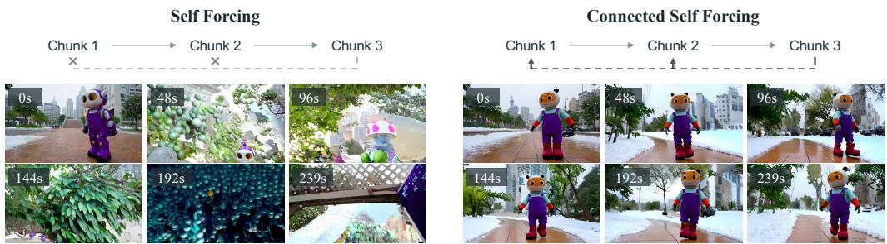  
Figure 1: Connected Self Forcing restores gradient flow from later chunks to earlier ones, helping maintain visual consistency in long videos.

## ABSTRACT

To stream long videos while maintaining visual quality and temporal consistency, Self Forcing mitigates exposure bias through self-rollout training on selfgenerated histories with key-value (KV) caching. To keep memory manageable, it detaches historical caches, preserving forward dependencies between chunks but severing the backward gradient paths. We introduce Connected Self Forcing, a training framework that reconnects gradient paths across autoregressive chunks, allowing feedback from later predictions to guide how earlier context is generated. These connections go beyond historical KV-writing: gradients pass through generated latents into the computations that produced them, linking the generation of earlier context to its use in later predictions. To make this connected training memory-efficient, we develop shortcut gradient replay, which recovers cross-chunk gradients without retaining the full rollout computation graph. Integrated with distribution matching distillation, Connected Self Forcing trains historical chunks according to both their direct supervision and their contribution to subsequent generation. Experiments on autoregressive video generation show improvements in long-horizon visual quality and temporal consistency, without changing the inference procedure. Additional materials on the project page.

## 1 INTRODUCTION

Recent video generation has advanced rapidly in visual fidelity, motion realism, and text–video alignment (Team et al., 2025; Seedance et al., 2026; MiniMax, 2026), with growing applications (Liang et al., 2025; Zhang et al., 2026a; Jiang et al., 2025). Yet many high-quality models still rely on finite-window bidirectional processing, making them less suitable for streaming, interactive, and long-horizon generation. Causal autoregressive generation offers a natural alternative by generating frames or chunks sequentially from previously generated context, and has therefore been increasingly explored for long-form video generation and interactive world modeling (Yin et al., 2025; Valevski et al., 2025; Huang et al., 2025b; Zheng et al., 2026).

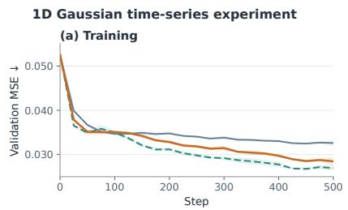

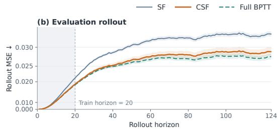  
Figure 2: A controlled 1D Gaussian time-series toy experiment. We compare Self Forcing (SF), Connected Self Forcing (CSF), and Full BPTT under matched autoregressive training conditions. Given the initial context and known external inputs at each step, the target trajectory is deterministic, allowing MSE evaluation against ground truth. (a) Validation MSE. (b) Evaluation rollout MSE.

Training causal video generators, however, faces a mismatch between training and inference: teacher forcing relies on ground-truth history, while Diffusion Forcing improves robustness by exposing the model to noisy histories (Chen et al., 2024a). Self Forcing (Huang et al., 2025c) goes further by directly training on the model’s own autoregressive rollouts, better aligning training with inference. To keep such sequential self-rollout tractable, however, previously generated history is detached when reused by later chunks.

Each generated chunk in an autoregressive rollout serves as both an output and causal context for later predictions. Self Forcing applies a video-level DMD objective to the generated rollout, giving every chunk a direct output gradient (Yin et al., 2024b;a). However, detaching reused history blocks gradients from later predictions through historical KV states to the computation that generated earlier chunks. The forward dependency remains, but this backward path is absent (Fig. 1). To isolate this effect, we use a simplified 1D Gaussian autoregressive toy experiment (Fig. 2). Although far simpler than video generation, it shows SF’s long-horizon validation error leveling off while CSF continues improving toward Full BPTT. CSF also approaches Full BPTT’s final rollout accuracy beyond the training horizon. These observations motivate the use of future-to-history gradients without retaining the full rollout graph.

Motivated by these observations, we introduce Connected Self Forcing (CSF), which restores futureto-history gradient flow without retaining the full autoregressive computation graph. CSF retains the detached self-rollout of Self Forcing and introduces Shortcut Gradient Replay. CSF recovers selected cross-chunk derivative paths rather than the full-sequence gradient. Specifically, a later chunk is replayed with its historical KV states treated as differentiable, allowing the downstream gradient to propagate through the KV-writing process and back to the earlier chunk that produced those states. By replaying only the required computations rather than backpropagating through the entire rollout, CSF trades recomputation for substantially lower activation memory. Importantly, CSF adds no model parameters and leaves inference unchanged.

Experiments show that CSF improves long-horizon visual quality and temporal consistency. The improvements are reflected in better imaging quality and stronger background and subject consistency, while qualitative results show reduced subject and scene drift over extended rollouts (Fig. 1).

Our contributions are as follows: 1) We identify a forward–backward gap in Self Forcing: generated chunks affect future predictions in the forward rollout, while detachment blocks gradient paths from later generation computations into earlier context generation. 2) We propose Connected Self Forcing (CSF) with Shortcut Gradient Replay, reconnecting cross-chunk gradient paths beyond the direct output gradients of DMD, without retaining the full computation graph or changing inference. 3) We demonstrate improved long-horizon generation across 60- and 240-second evaluations, with stronger visual quality and temporal consistency.

## 2 RELATED WORK

Bidirectional video generation. Video generation has evolved from early diffusion extensions of image models to large-scale foundation models (Ho et al., 2022b; Blattmann et al., 2023b; Polyak et al., 2024; Team et al., 2025). VideoLDM (Blattmann et al., 2023b) extends pretrained latent diffusion with temporal modeling for video generation. Other early works explore image–video priors, motion modules, and decomposed noise modeling (Ho et al., 2022b; Singer et al., 2022; Guo et al., 2023; Luo et al., 2023), while hierarchical and cascaded designs extend temporal range and spatial resolution (Ho et al., 2022a; He et al., 2022; Wang et al., 2025; Zhang et al., 2025a). Lumiere (Bar-Tal et al., 2024) instead generates the full temporal duration in a single Space-Time U-Net pass. More recent systems explore improved conditioning, transformer architectures, and large-scale data and model scaling (Chen et al., 2023; 2024b; Blattmann et al., 2023a; Ma et al., 2024; Gupta et al., 2024; Zheng et al., 2024; Yang et al., 2025; Kong et al., 2024; Polyak et al., 2024; Team et al., 2025). Such bidirectional computation remains less suitable for low-latency streaming (Yin et al., 2025).

Autoregressive video generation. Autoregressive models generate frames or chunks from prior generated content (Huang et al., 2025c; Teng et al., 2025; Yang et al., 2026). Earlier approaches model tokenized video with transformers (Yan et al., 2021; Ge et al., 2022; Hong et al., 2022); VideoPoet (Kondratyuk et al., 2023) extends decoder-only autoregression to multimodal generation, while Phenaki (Villegas et al., 2022) combines a causal tokenizer with masked-token predic tion. Diffusion Forcing (Chen et al., 2024a) generalizes causal sequence modeling to independently noised continuous tokens. Recent approaches use increasing per-chunk noise (Teng et al., 2025), Diffusion Forcing (Chen et al., 2025a), or temporal-pyramid history compression (Jin et al., 2025). Few-step generation builds on progressive distillation, consistency models, and distribution matching (Salimans & Ho, 2022; Song et al., 2023; Yin et al., 2024b;a); CausVid (Yin et al., 2025) extends distribution matching to few-step causal video generation.

Train–test mismatch has motivated scheduled sampling and Professor Forcing (Bengio et al., 2015; Lamb et al., 2016). Self Forcing (Huang et al., 2025c) directly trains on self-generated history with a video-level objective, while gradient truncation keeps training tractable. Subsequent works improve few-step causal initialization (Zhu et al., 2026; Zhao et al., 2026a) and long-horizon training (Liu et al., 2026; Cui et al., 2026).

Concurrent with our work, Self Gradient Forcing (Zhuang et al., 2026) uses future losses to train context KV memory writing while keeping generated context stop-gradient, whereas Vidu S2’s Self-Replay Forcing (Zhang et al., 2026b) enables cross-block gradients within a differentiable replay of re-noised self-generated trajectories. Our method instead reconnects cross-chunk gradient paths through historical KV writing and earlier-chunk generation via Shortcut Gradient Replay.

History modeling for long video generation. Long-video generation also requires useful history under bounded context. Training-free extensions use temporal co-denoising, noise rescheduling with windowed attention, and global/local spectral blending (Wang et al., 2023; Qiu et al., 2024; Lu et al., 2024). FIFO-Diffusion (Kim et al., 2024) performs diagonal queue-based denoising, RIFLEx (Zhao et al., 2025) adjusts positional-embedding frequency to suppress repetition, and Ouroboros-Diffusion (Chen et al., 2025b) combines cross-frame attention and recurrent guidance.

Memory mechanisms preserve or retrieve context through previous-chunk attention, frame sinks with KV recaching, importance-based allocation, and long-context teacher supervision (Henschel et al., 2025; Yang et al., 2026; Zhang et al., 2025b; Chen et al., 2026). More structured designs include geometry-indexed memory, role-based memory decomposition, distant-history retrieval, and gated recall (Huang et al., 2025a; Zhao et al., 2026b; Xue et al., 2026; Meng et al., 2026). Ring Forcing (Xue et al., 2026) enforces distant-history retrieval via ring training and scales memory with compression and sparse RoPE.

Other methods modify temporal supervision and guidance. History-Guided Video Diffusion (Song et al., 2025) supports flexible history conditioning; LongVie (Gao et al., 2025a) improves cross-clip control and consistency, with LongVie 2 (Gao et al., 2025b) adding history-context guidance. Video-Mirai (Yu et al., 2026) distills future-aware features from a frozen non-causal foresight encoder into causal states, whereas Next Forcing (Xu et al., 2026) adds predictors over multiple future horizons. CSF instead propagates gradients from later-chunk losses into earlier context generation.

## 3 METHOD

In this section, we present Connected Self Forcing (CSF), illustrated in Fig. 3. We first review Self Forcing in Sec. 3.1 and formulate the cross-chunk gradient assignment problem under detached au

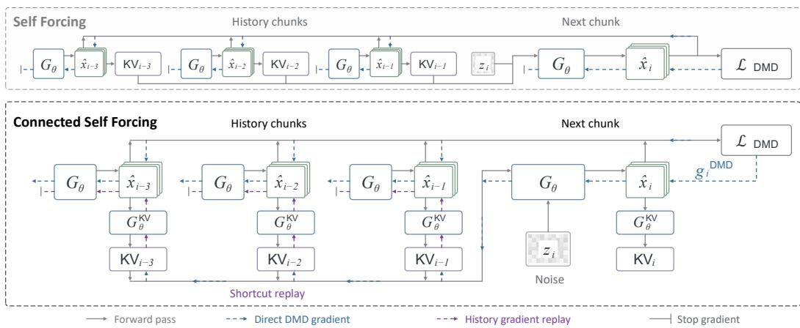  
Figure 3: Overview of Connected Self Forcing. Self Forcing uses detached autoregressive rollouts, where each generated chunk $\hat { x } _ { i }$ receives only direct DMD supervision. Connected Self Forcing restores cross-chunk feedback through Shortcut Gradient Replay: gradients from a later prediction are replayed to historical KV states $\mathrm { \check { K } V } _ { j }$ , then propagated through the KV writer $G _ { \theta } ^ { \mathrm { K V } }$ and generator $G _ { \theta } ,$ which share parameters θ. Replay stops at earlier generated history to avoid recursive backpropagation through the earlier generation branches. This trains each chunk both for its own generation quality and as context for subsequent generation, without adding parameters or changing inference.

toregressive training in Sec. 3.2. We then introduce Shortcut Gradient Replay (Sec. 3.3), our mechanism for recovering this missing training signal, and finally describe the complete CSF training procedure (Sec. 3.4), summarized in Algorithm 1.

## 3.1 AUTOREGRESSIVE VIDEO GENERATION WITH SELF FORCING

In autoregressive video generation, each chunk is generated conditioned on previously generated history. Self Forcing (Huang et al., 2025c) matches this inference-time conditioning during training by rolling out on the model’s own generated history. Let $G _ { \theta }$ generate chunk $i ,$ and let $G _ { \theta } ^ { \mathrm { K V } }$ denote the KV-writing computation of the same generator:

$$
\begin{array} { r l } & { \hat { \mathbf { x } } _ { i } = G _ { \theta } ( \mathbf { z } _ { i } ; \mathrm { s g } ( \mathcal { C } _ { < i } ) , \mathbf { c } ) , } \\ & { \mathcal { C } _ { i } = G _ { \theta } ^ { \mathrm { K V } } ( \hat { \mathbf { x } } _ { i } ; \mathrm { s g } ( \mathcal { C } _ { < i } ) , \mathbf { c } ) . } \end{array}\tag{1}
$$

Here, $\mathbf { z } _ { i }$ is the noisy latent, c the text condition, and $\ { \mathcal { C } } _ { < i }$ the KV cache from preceding generated chunks. The second line re-encodes $\hat { \mathbf { x } } _ { i }$ at the clean context timestep to update the causal cache, yielding the causal rollout $\hat { \mathbf { x } } _ { 1 } \to \mathcal { C } _ { 1 } \to \hat { \mathbf { x } } _ { 2 } \to \mathcal { C } _ { 2 } \to \cdot \cdot \cdot$ . To keep the sequential rollout tractable, reused history and its KV cache are detached, so only each chunk’s local computation graph is retained.

Following prior autoregressive distillation methods (Yin et al., 2025; Huang et al., 2025c), the self-generated rollout $\hat { \textbf { X } } = ~ [ \hat { \mathbf { x } } _ { 1 } , \dots , \hat { \mathbf { x } } _ { N } ]$ is optimized with Distribution Matching Distillation (DMD) (Yin et al., 2024b;a). DMD evaluates re-noised generated samples using a pretrained realscore model and an online fake-score model that tracks the generator distribution, yielding the direct output gradient

$$
\mathbf { g } ^ { \mathrm { D M D } } = \frac { \partial \mathcal { L } _ { \mathrm { D M D } } } { \partial \hat { \mathbf { X } } } .\tag{2}
$$

Thus, every generated chunk receives direct DMD supervision, while the limitation we study arises from the detached dependencies between chunks.

## 3.2 CROSS-CHUNK GRADIENT ASSIGNMENT

In autoregressive generation, each historical chunk plays two roles: it is both a generated output and part of the causal context for subsequent predictions. Distribution matching directly supervises the former by providing a gradient to every generated chunk. However, once a generated chunk is reused as detached history, its downstream influence on later predictions no longer contributes to its own supervision. This creates an asymmetry: the dependency is present during the forward rollout, but absent from the backward learning signal.

Consider a historical chunk $\hat { \mathbf { x } } _ { j }$ and a later chunk $\hat { \mathbf { x } } _ { i } ,$ , where $j < i .$ . When a causal path exists, their computational dependency is

$$
\begin{array} { r } { \hat { \mathbf { x } } _ { j } \xrightarrow { \mathcal { P } _ { j  i } } \hat { \mathbf { x } } _ { i } , } \end{array}\tag{3}
$$

where $\mathcal { P } _ { j  i }$ collectively represents all differentiable causal paths from $\hat { \mathbf { x } } _ { j }$ to $\hat { \mathbf { x } } _ { i }$ . These paths may involve intermediate generated chunks, direct access to historical representations, or successive updates of a persistent memory state. This formulation does not assume a particular history representation or propagation mechanism.

Although $\hat { \mathbf { x } } _ { j }$ already receives its direct DMD gradient, gradient truncation removes the additional supervision induced by its effect on later predictions. We refer to this missing backward dependency as the cross-chunk gradient gap. With model parameters and rollout randomness held fixed, the total Jacobian over these paths before cross-chunk gradient truncation and the resulting cross-chunk gradient are

$$
\begin{array} { r l } & { \mathbf { J } _ { \mathcal { P } _ { j  i } } \triangleq \frac { \mathrm { d } \hat { \mathbf { x } } _ { i } } { \mathrm { d } \hat { \mathbf { x } } _ { j } } , } \\ & { \mathbf { g } _ { i  j } ^ { \mathrm { c r o s s } } = \mathbf { J } _ { \mathcal { P } _ { j  i } } ^ { \top } \mathbf { g } _ { i } ^ { \mathrm { D M D } } . } \end{array}\tag{4}
$$

This term assigns later supervision to an earlier generated chunk according to its downstream influence. It is a retrospective training signal defined on the same self-generated rollout: later predictions only determine how gradient is assigned to earlier generated context. Consequently, historical chunks should be optimized both for their own generation quality and for their role as causal context for subsequent predictions.

## 3.3 SHORTCUT GRADIENT REPLAY

A straightforward way to obtain the cross-chunk gradient in Sec. 3.2 is to keep the autoregressive computation graph connected across the entire self-rollout and directly backpropagate through it. However, each chunk involves multiple denoising and context-writing forwards of a large video generator. Retaining all intermediate activations across a long rollout therefore incurs prohibitive memory cost. We instead trade activation memory for recomputation through gradient replay. During the forward rollout, we discard the serial computation graph and retain only the states required to reproduce each chunk.

A natural replay strategy is to propagate the future gradient backward one chunk at a time along the autoregressive dependencies: each chunk is replayed to obtain a gradient for its preceding history, which is then recursively relayed toward earlier chunks. While this avoids retaining the full graph, the number of replayed transitions grows with the gradient distance. Moreover, long-range gradient is repeatedly transformed by the Jacobians of intervening chunks, making the resulting signal increasingly dependent on the intermediate dynamics.

Our key observation is that the causal attention structure already provides a direct dependency to retained historical KV states: a later chunk directly reads the cached keys and values written by preceding chunks. We therefore recover selected path contributions to Eq. (4) through retained historical KV states, bypassing intervening generation transitions without backpropagating through the full rollout graph. Specifically, we replay chunk i while treating the selected historical cache $\bar { \boldsymbol { C } } _ { j }$ as a differentiable leaf and keeping the remaining history detached. Given the direct DMD gradient $\mathbf { g } _ { i } ^ { \mathrm { { D M D } } }$ , this replay yields

$$
\mathbf { g } _ { \mathcal { C } _ { j } } = \left( \frac { \partial \hat { \mathbf { x } } _ { i } } { \partial \mathcal { C } _ { j } } \right) ^ { \top } \mathbf { g } _ { i } ^ { \mathrm { D M D } } .\tag{5}
$$

This establishes a direct shortcut from the later prediction to the historical KV state without propagating the gradient through the intervening chunks. The resulting gradient on $\mathcal { C } _ { j }$ is then backpropagated through the context-writing computation of chunk j. This replay both updates the context-

writing parameters and produces a gradient on the recorded historical output,

$$
\mathbf { g } _ { \hat { \mathbf { x } } _ { j } } ^ { \mathrm { c r o s s } } = \left( \frac { \partial \mathcal { C } _ { j } } { \partial \hat { \mathbf { x } } _ { j } } \right) ^ { \top } \mathbf { g } _ { \mathcal { C } _ { j } } .\tag{6}
$$

We then replay the primary generation of chunk $j$ using $\mathbf { g } _ { \hat { \mathbf { x } } _ { j } } ^ { \mathrm { c r o s s } }$ as its output gradient, allowing the cross-chunk feedback to update the computation that produced the historical chunk. This generation feedback terminates at the targeted chunk: earlier generated outputs are not recursively replayed through their generation branches. In parallel, the KV-writing replay can propagate its incoming KV gradient to earlier KV writers while keeping each writer’s generated-latent input detached, preventing this writer-only feedback from re-entering earlier generation branches. We call this procedure Shortcut Gradient Replay, as it directly connects later predictions to selected historical chunks without recursively replaying the intervening generation trajectory.

## 3.4 TRAINING

During training, the gradient assigned to each historical chunk $j$ combines its direct DMD gradient with cross-chunk feedback from later chunks influenced by its KV state:

$$
\widetilde { \mathbf g } _ { j } = \mathbf g _ { j } ^ { \mathrm { D M D } } + \lambda _ { \mathrm { c r o s s } } \sum _ { i \in \mathcal { F } ( j ) } \widehat { \mathbf g } _ { i  j } ^ { \mathrm { c r o s s } } ,
$$

where $\widehat { \mathbf { g } } _ { i  j } ^ { \mathrm { c r o s s } }$ denotes the contribution of chunk i to the replayed output gradient in Eq. (6), $\mathcal F ( j )$ contains later chunks that directly read $\mathcal { C } _ { j }$ within the considered history range, and $\bar { \lambda _ { \mathrm { c r o s s } } } = 1$ by default scales added feedback to both KV-writing and historical-generation parameter gradients.

(7)

Algorithm 1 summarizes the resulting procedure. For each generator update, we first perform a detached autoregressive self-rollout and record the states required for replay. The generated video is then evaluated with the standard DMD objective to obtain chunk-wise out-

Algorithm 1: Connected Self Forcing Training Procedure   
Require: $G _ { \theta } , G _ { \theta } ^ { \mathrm { K V } } , S _ { \mathrm { r e a l } } , S _ { \mathrm { f a k e , \phi } } , \lambda _ { \mathrm { c r o s s } }$   
1: for $i = 1 , \ldots , N$ do ▷ detached self-rollout   
2: Generate xˆi via standard denoising with sg $( { \mathcal { C } } _ { < i } )$   
3: Write $\mathcal { C } _ { i } \gets G _ { \theta } ^ { \mathrm { K V } } ( \hat { \mathbf { x } } _ { i } ; \mathrm { s g } ( \mathcal { C } _ { < i } ) , \mathbf { c } )$ and save replay states   
4: end for   
5: Compute $\mathbf { g } ^ { \mathrm { D M D } } = \partial \mathcal { L } _ { \mathrm { D M D } } / \partial \hat { \mathbf { X } }$ and obtain $\{ \mathbf { g } _ { i } ^ { \mathrm { { D M D } } } \} _ { i = 1 } ^ { N }$   
6: Initialize $\mathbf { g } c _ { j } \gets 0$   
7: for $i = N , \bar { \ldots } , 1$ do ▷ reverse replay   
8: Replay chunk i with historical KV states differentiable   
9: Backpropagate $\mathbf { g } _ { i } ^ { \mathrm { D M D } }$ and collect   
10: ${ \bf g } _ { c _ { j } } \ : + = \lambda _ { \mathrm { c r o s s } } \left( \frac { \partial \hat { \bf x } _ { i } } { \partial \mathcal { C } _ { j } } \right) ^ { \top } { \bf g } _ { i } ^ { \mathrm { D M D } } , \quad i \in \mathcal { F } ( j )$   
11: $ { \mathbf { i f } }  { \mathbf { g } } _ { c _ { i } } \neq 0$ then   
12: Replay $G _ { \theta } ^ { \mathrm { K V } }$ and earlier KV writers   
with earlier generated outputs detached   
13: $\mathbf { g } _ { \hat { \mathbf { x } } _ { i } } ^ { \mathrm { c r o s s } } = \left( \frac { \partial \mathcal { C } _ { i } } { \partial \hat { \mathbf { x } } _ { i } } \right) ^ { \top } \mathbf { g } c _ { i }$   
14: Replay chunk i with detached history using $\mathbf { g } _ { \hat { \mathbf { x } } _ { i } } ^ { \mathrm { c r o s s } }$   
15: end if   
16: end for   
17: Update θ with accumulated gradients; update ϕ with the standard   
fake-score objective

put gradients. Shortcut Gradient Replay reconstructs the corresponding cross-chunk feedback, which is accumulated together with the direct DMD gradients on the shared generator parameters before a single optimizer update. We use DMD here; CSF’s replay can also use output gradients from other differentiable losses.

Connected Self Forcing modifies only the generator-side gradient propagation during training. The real-score model remains fixed, while the fake-score model is updated with the standard DMD denoising objective and does not require gradient replay. The method introduces no additional model parameters. At inference time, all replay operations are removed, and the generator follows the same causal autoregressive rollout and KV-cache mechanism as the original Self Forcing model.

## 4 EXPERIMENTS

## 4.1 EXPERIMENTAL SETUP

Training Details. We perform text-to-video DMD post-training using the released filtered and extended VidProM prompt set (Wang & Yang, 2024), without loading additional real videos during this stage. Our main experiments use Wan2.1-T2V-1.3B (Team et al., 2025) as the causal generator. Following Self Forcing (Huang et al., 2025c), we optimize the generator with DMD (Yin et al., 2024b;a), using a frozen Wan2.1-T2V-14B real-score model and a trainable Wan2.1-T2V-1.3B fakescore model. We use four denoising steps and primarily study chunk-wise generation, where each

Table 1: 60-second chunk-wise generation on VBench-Long. Avg.(6) averages Aesthetic, Background, Imaging, Motion Smoothness, Subject Consistency, and Flickering; Dynamic Degree is reported separately. Best and second-best values are highlighted except for Dynamic Degree.
<table><tr><td rowspan="2">Metric</td><td colspan="3">Causal CD Init</td><td colspan="3">TF Init</td><td colspan="3">Causal ODE Init</td></tr><tr><td>SF</td><td>SGF</td><td>CSF (Ours)</td><td>SF</td><td>SGF</td><td>CSF (Ours)</td><td>SF</td><td>SGF</td><td>CSF (Ours)</td></tr><tr><td>Aesthetic</td><td>0.5473</td><td>0.5592</td><td>0.5659</td><td>0.5990</td><td>0.5917</td><td>0.6152</td><td>0.5264</td><td>0.5772</td><td>0.5804</td></tr><tr><td>Background</td><td>0.9567</td><td>0.9583</td><td>0.9597</td><td>0.9601</td><td>0.9543</td><td>0.9721</td><td>0.9533</td><td>0.9625</td><td>0.9647</td></tr><tr><td>Imaging</td><td>0.6939</td><td>0.7031</td><td>0.7085</td><td>0.7046</td><td>0.7152</td><td>0.7286</td><td>0.7123</td><td>0.7224</td><td>0.7191</td></tr><tr><td>Motion</td><td>0.9884</td><td>0.9849</td><td>0.9848</td><td>0.9846</td><td>0.9764</td><td>0.9906</td><td>0.9817</td><td>0.9874</td><td>0.9896</td></tr><tr><td>Subject</td><td>0.9656</td><td>0.9665</td><td>0.9707</td><td>0.9695</td><td>0.9671</td><td>0.9821</td><td>0.9563</td><td>0.9733</td><td>0.9727</td></tr><tr><td>Flickering</td><td>0.9704</td><td>0.9657</td><td>0.9637</td><td>0.9702</td><td>0.9442</td><td>0.9791</td><td>0.9611</td><td>0.9729</td><td>0.9733</td></tr><tr><td>Dynamic</td><td>0.4435</td><td>0.6113</td><td>0.5976</td><td>0.6992</td><td>0.8653</td><td>0.4960</td><td>0.5742</td><td>0.5565</td><td>0.4427</td></tr><tr><td>Avg.(6)</td><td>0.8537</td><td>0.8563</td><td>0.8589</td><td>0.8647</td><td>0.8582</td><td>0.8780</td><td>0.8485</td><td>0.8660</td><td>0.8666</td></tr></table>

Table 2: 240-second chunk-wise generation on the fixed 128-prompt MovieGen Video Bench subset. Metrics and formatting follow Table 1.
<table><tr><td rowspan="2">Metric</td><td colspan="3">Causal CD Init</td><td colspan="3">TF Init</td><td colspan="3">Causal ODE Init</td></tr><tr><td>SF</td><td>SGF</td><td>CSF (Ours)</td><td>SF</td><td>SGF</td><td>CSF (Ours)</td><td>SF</td><td>SGF</td><td>CSF (Ours)</td></tr><tr><td>Aesthetic</td><td>0.5138</td><td>0.5220</td><td>0.5449</td><td>0.5639</td><td>0.5626</td><td>0.5948</td><td>0.5059</td><td>0.5357</td><td>0.5260</td></tr><tr><td>Background</td><td>0.9524</td><td>0.9539</td><td>0.9563</td><td>0.9554</td><td>0.9512</td><td>0.9673</td><td>0.9536</td><td>0.9559</td><td>0.9607</td></tr><tr><td>Imaging</td><td>0.6700</td><td>0.6607</td><td>0.6938</td><td>0.6937</td><td>0.7030</td><td>0.7161</td><td>0.6907</td><td>0.6965</td><td>0.7004</td></tr><tr><td>Motion</td><td>0.9887</td><td>0.9845</td><td>0.9850</td><td>0.9835</td><td>0.9761</td><td>0.9893</td><td>0.9838</td><td>0.9847</td><td>0.9895</td></tr><tr><td>Subject</td><td>0.9582</td><td>0.9581</td><td>0.9666</td><td>0.9647</td><td>0.9619</td><td>0.9786</td><td>0.9598</td><td>0.9658</td><td>0.9688</td></tr><tr><td>Flickering</td><td>0.9691</td><td>0.9645</td><td>0.9656</td><td>0.9659</td><td>0.9421</td><td>0.9747</td><td>0.9651</td><td>0.9690</td><td>0.9734</td></tr><tr><td>Dynamic</td><td>0.4126</td><td>0.7056</td><td>0.6899</td><td>0.7131</td><td>0.9200</td><td>0.5539</td><td>0.5506</td><td>0.6306</td><td>0.5003</td></tr><tr><td>Avg.(6)</td><td>0.8420</td><td>0.8406</td><td>0.8520</td><td>0.8545</td><td>0.8495</td><td>0.8701</td><td>0.8431</td><td>0.8513</td><td>0.8531</td></tr></table>

21-latent-frame training sequence is divided into seven chunks. Training uses AdamW with a global batch size of 8 for 1,200 iterations.

Baselines. We primarily compare Connected Self Forcing (CSF) with Self Forcing (SF) (Huang et al., 2025c) and the concurrent Self Gradient Forcing (SGF) (Zhuang et al., 2026). For paired comparison, we train both baselines following their released implementations and training recipes. Within each controlled comparison, methods use matched backbones, causal initialization, training prompts, training budgets, and inference configurations. This allows us to focus the comparison on how self-generated history is optimized during autoregressive training.

Evaluation Protocol. For long-horizon evaluation, we generate approximately 60-second videos from 40 VBench-Long prompts (Huang et al., 2025d) and approximately 240-second videos from a fixed 128-prompt subset of Movie Gen Video Bench (Polyak et al., 2024). We evaluate the EMA generator checkpoints with matched four-step causal sampling, inference seeds, resolution, and KVcache configurations. Following VBench-Long (Huang et al., 2025d), we report seven quality and temporal dimensions: aesthetic quality, background consistency, dynamic degree, imaging qual ity, motion smoothness, subject consistency, and temporal flickering. Further implementation and evaluation details are provided in the supplementary material.

## 4.2 QUANTITATIVE RESULTS

Tables 1 and 2 report long-horizon chunk-wise generation results at 60 and 240 seconds. We report Avg.(6), our mean of six quality and consistency metrics, excluding Dynamic Degree.

CSF achieves the highest Avg.(6) point estimate in all six chunk-wise settings. At 240 seconds, paired bootstrap intervals lie above zero against SF under all three initializations, and against SGF under Causal CD and TF (Appendix D.5). Because prompt sets differ, we compare methods within each duration rather than scores across durations.

The component metrics further show where the improvements arise. At 60 seconds, CSF achieves the best Aesthetic Quality and Background Consistency under all three initializations. At 240 seconds, CSF ranks first in Background Consistency, Imaging Quality, and Subject Consistency under all three initializations. These improvements are particularly relevant to long-horizon autoregressive generation, where subject and scene drift can accumulate throughout the rollout, and are consistent with the goal of propagating downstream supervision back to historical generation.

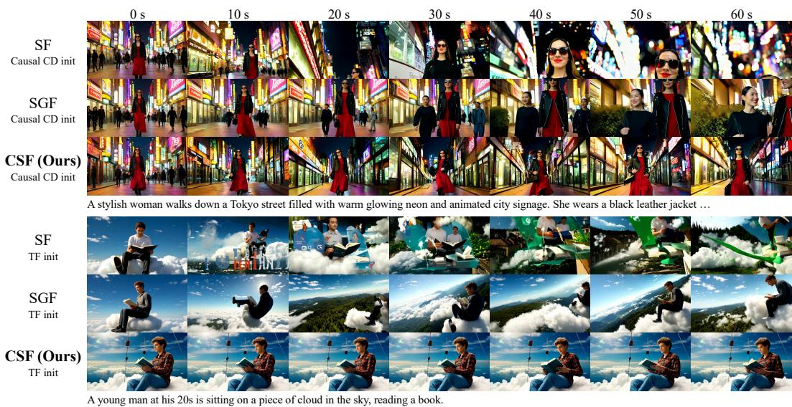  
Figure 4: Qualitative comparison of 60-second chunk-wise autoregressive generation: SF, SGF, and CSF on VBench-Long prompts under Causal CD and TF initialization. CSF more consistently preserves subject appearance and scene composition throughout the rollout across both settings.

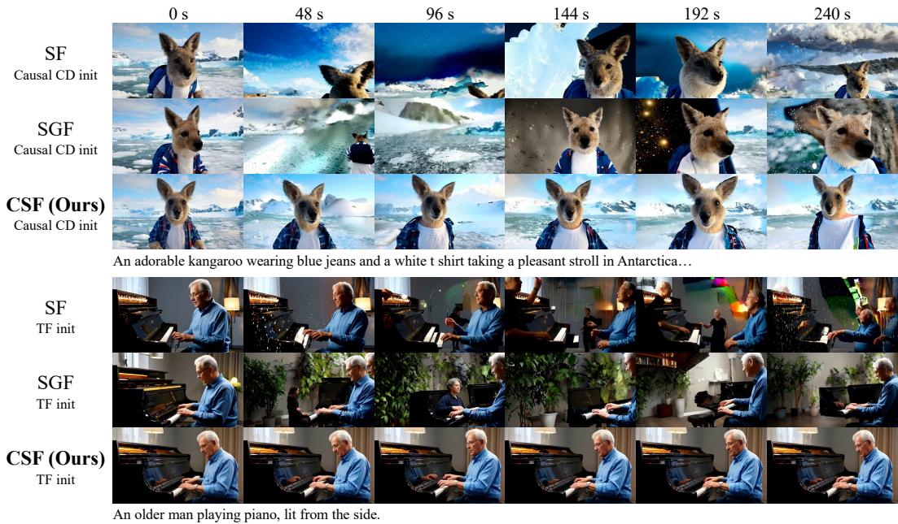  
Figure 5: Qualitative comparison of 240-second chunk-wise autoregressive generation. We compare SF, SGF, and CSF on MovieGen-128 prompts under Causal CD and TF initialization. Over fourminute rollouts, CSF better preserves subject identity and scene semantics, with less accumulated drift in both the kangaroo and pianist examples.

CSF’s balance of quality, consistency, and dynamics depends on initialization: under Causal CD, it improves Avg.(6) with Dynamic Degree near SGF and above SF at both horizons; under TF and

Table 3: Ablation study on 60-second chunk-wise generation with Causal CD initialization. Avg.(6) and highlighting conventions follow Table 1.
<table><tr><td>Method</td><td>Aes.↑</td><td>Back.↑</td><td>Imag.↑</td><td>Mot.↑</td><td>Subj.↑</td><td>Flick.↑</td><td>Dyn.</td><td>Avg.(6)↑</td></tr><tr><td>Full BPTT</td><td>0.5597</td><td>0.9562</td><td>0.6808</td><td>0.9857</td><td>0.9661</td><td>0.9688</td><td>0.5742</td><td>0.8529</td></tr><tr><td>Serial recursion</td><td>0.5432</td><td>0.9628</td><td>0.6907</td><td>0.9887</td><td>0.9753</td><td>0.9726</td><td>0.4032</td><td>0.8556</td></tr><tr><td>CSF (λ = 0.5)</td><td>0.5471</td><td>0.9498</td><td>0.6852</td><td>0.9769</td><td>0.9486</td><td>0.9497</td><td>0.8484</td><td>0.8429</td></tr><tr><td>CSF (Ours)</td><td>0.5659</td><td>0.9597</td><td>0.7085</td><td>0.9848</td><td>0.9707</td><td>0.9637</td><td>0.5976</td><td>0.8589</td></tr></table>

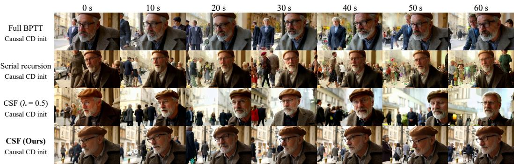  
An extreme close-up of an gray-haired man with a beard in his 60s, he is deep in thought…

Figure 6: Qualitative ablation on 60-second chunk-wise generation with Causal CD initialization.

Causal ODE, dynamics are below both baselines. Thus, we interpret Avg.(6) alongside Dynamic Degree without claiming uniform improvement. Efficiency and memory are reported in Appendix D.1.

## 4.3 QUALITATIVE COMPARISON

We further compare long-horizon visual consistency by tracking how subjects and scenes evolve throughout autoregressive rollouts. Figures 4 and 5 show uniformly spaced snapshots from 60- second and 240-second generations, respectively.

For the 60-second examples, CSF shows relatively stable subject appearance and scene composition under both Causal CD and TF initialization. In the Tokyo-street example, SF gradually shifts toward closer views of the subject, while SGF shows changes in both the subject and background. CSF retains a similar subject appearance and neon-street setting across the sampled timestamps. In the cloud-reading example, SF and SGF show larger changes in the surrounding scene over time, whereas the CSF sample remains closer to the initial subject and cloud setting.

Likewise, in the 240-second Antarctica example, SF and SGF change subject scale, appearance, and background; CSF stays closer to the initial kangaroo and snowy setting. For the pianist, CSF keeps subject, piano, and indoor composition similar across sampled timestamps; SF and SGF show larger scene and appearance changes. In both long rollouts, CSF shows less visible subject and scene drift, consistent with the motivation to reconnect downstream supervision to historical generation.

## 4.4 ABLATION STUDY

We ablate cross-chunk gradient propagation in the 60-second chunk-wise Causal CD setting. Serial recursion recursively propagates accumulated future gradients backward, one adjacent chunk at a time. Full BPTT replays the selected denoising exit with a connected graph across the autoregressive history. CSF (Ours) instead uses shortcut replay and terminates feedback at the targeted historical chunk. We also evaluate CSF (λ = 0.5), halving the added cross-chunk feedback.

As shown in Table 3, Serial recursion remains close to CSF in quality and consistency metrics, but yields substantially lower Dynamic Degree. Reducing λ to 0.5 substantially increases Dynamic Degree, while degrading several quality and consistency metrics. Here, Full BPTT does not outperform CSF on Avg.(6) or Dynamic Degree. CSF shows a favorable balance of long-horizon quality, consistency, and motion in this setting. The qualitative comparison in Fig. 6 shows a similar pattern over the rollout.

## 5 CONCLUSION

We introduced Connected Self Forcing (CSF) to address missing future-to-history gradient flow in autoregressive self-rollout training. Its Shortcut Gradient Replay reconnects downstream supervision to historical generation without retaining the full autoregressive computation graph or changing inference. Across several initializations, CSF consistently improves long-horizon visual quality and temporal consistency in 60- and 240-second autoregressive videos. By extending gradient flow beyond detached chunk boundaries, CSF highlights the potential of future-aware training for autore gressive video generation.

## REFERENCES

Omer Bar-Tal, Hila Chefer, Omer Tov, Charles Herrmann, Roni Paiss, Shiran Zada, Ariel Ephrat, Junhwa Hur, Guanghui Liu, Amit Raj, et al. Lumiere: A space-time diffusion model for video generation. In SIGGRAPH Asia 2024 conference papers, pp. 1–11, 2024.

Samy Bengio, Oriol Vinyals, Navdeep Jaitly, and Noam Shazeer. Scheduled sampling for sequence prediction with recurrent neural networks. Advances in neural information processing systems, 28, 2015.

Andreas Blattmann, Tim Dockhorn, Sumith Kulal, Daniel Mendelevitch, Maciej Kilian, Dominik Lorenz, Yam Levi, Zion English, Vikram Voleti, Adam Letts, et al. Stable video diffusion: Scaling latent video diffusion models to large datasets. arXiv preprint arXiv:2311.15127, 2023a.

Andreas Blattmann, Robin Rombach, Huan Ling, Tim Dockhorn, Seung Wook Kim, Sanja Fidler, and Karsten Kreis. Align your latents: High-resolution video synthesis with latent diffusion models. In 2023 IEEE/CVF Conference on Computer Vision and Pattern Recognition (CVPR), pp. 22563–22575. IEEE, 2023b.

Boyuan Chen, Diego Mart´ı Monso, Yilun Du, Max Simchowitz, Russ Tedrake, and Vincent Sitz-´ mann. Diffusion forcing: Next-token prediction meets full-sequence diffusion. Advances in Neural Information Processing Systems, 37:24081–24125, 2024a.

Guibin Chen, Dixuan Lin, Jiangping Yang, Chunze Lin, Junchen Zhu, Mingyuan Fan, Hao Zhang, Sheng Chen, Zheng Chen, Chengcheng Ma, et al. Skyreels-v2: Infinite-length film generative model. arXiv preprint arXiv:2504.13074, 2025a.

Haoxin Chen, Menghan Xia, Yingqing He, Yong Zhang, Xiaodong Cun, Shaoshu Yang, Jinbo Xing, Yaofang Liu, Qifeng Chen, Xintao Wang, et al. Videocrafter1: Open diffusion models for highquality video generation. arXiv preprint arXiv:2310.19512, 2023.

Haoxin Chen, Yong Zhang, Xiaodong Cun, Menghan Xia, Xintao Wang, Chao Weng, and Ying Shan. Videocrafter2: Overcoming data limitations for high-quality video diffusion models. In 2024 IEEE/CVF Conference on Computer Vision and Pattern Recognition (CVPR), pp. 7310– 7320. IEEE, 2024b.

Jingyuan Chen, Fuchen Long, Jie An, Zhaofan Qiu, Ting Yao, Jiebo Luo, and Tao Mei. Ouroborosdiffusion: Exploring consistent content generation in tuning-free long video diffusion. In Proceedings of the AAAI Conference on Artificial Intelligence, volume 39, pp. 2079–2087, 2025b.

Shuo Chen, Cong Wei, Sun Sun, Ping Nie, Kai Zhou, Ge Zhang, Ming-Hsuan Yang, and Wenhu Chen. Context forcing: Consistent autoregressive video generation with long context. arXiv preprint arXiv:2602.06028, 2026.

Jiaxing Cui, Jie Wu, Ming Li, Tao Yang, Xiaojie Li, Rui Wang, Andrew Bai, Yuanhao Ban, and Cho-Jui Hsieh. Self-forcing++: Towards minute-scale high-quality video generation. In International Conference on Learning Representations, volume 2026, pp. 85802–85822, 2026.

Jianxiong Gao, Zhaoxi Chen, Xian Liu, Jianfeng Feng, Chenyang Si, Yanwei Fu, Yu Qiao, and Ziwei Liu. Longvie: Multimodal-guided controllable ultra-long video generation. arXiv preprint arXiv:2508.03694, 2025a.

Jianxiong Gao, Zhaoxi Chen, Xian Liu, Junhao Zhuang, Chengming Xu, Jianfeng Feng, Yu Qiao, Yanwei Fu, Chenyang Si, and Ziwei Liu. Longvie 2: Multimodal controllable ultra-long video world model. arXiv preprint arXiv:2512.13604, 2025b.

Songwei Ge, Thomas Hayes, Harry Yang, Xi Yin, Guan Pang, David Jacobs, Jia-Bin Huang, and Devi Parikh. Long video generation with time-agnostic vqgan and time-sensitive transformer. In European conference on computer vision, pp. 102–118. Springer, 2022.

Yuwei Guo, Ceyuan Yang, Anyi Rao, Zhengyang Liang, Yaohui Wang, Yu Qiao, Maneesh Agrawala, Dahua Lin, and Bo Dai. Animatediff: Animate your personalized text-to-image diffusion models without specific tuning. arXiv preprint arXiv:2307.04725, 2023.

Agrim Gupta, Lijun Yu, Kihyuk Sohn, Xiuye Gu, Meera Hahn, Fei-Fei Li, Irfan Essa, Lu Jiang, and Jose Lezama. Photorealistic video generation with diffusion models. In´ European Conference on Computer Vision, pp. 393–411. Springer, 2024.

Yingqing He, Tianyu Yang, Yong Zhang, Ying Shan, and Qifeng Chen. Latent video diffusion models for high-fidelity long video generation. arXiv preprint arXiv:2211.13221, 2022.

Roberto Henschel, Levon Khachatryan, Hayk Poghosyan, Daniil Hayrapetyan, Vahram Tadevosyan, Zhangyang Wang, Shant Navasardyan, and Humphrey Shi. Streamingt2v: Consistent, dynamic, and extendable long video generation from text. In 2025 IEEE/CVF Conference on Computer Vision and Pattern Recognition (CVPR), pp. 2568–2577. IEEE, 2025.

Jonathan Ho, William Chan, Chitwan Saharia, Jay Whang, Ruiqi Gao, Alexey Gritsenko, Diederik P Kingma, Ben Poole, Mohammad Norouzi, David J Fleet, et al. Imagen video: High definition video generation with diffusion models. arXiv preprint arXiv:2210.02303, 2022a.

Jonathan Ho, Tim Salimans, Alexey Gritsenko, William Chan, Mohammad Norouzi, and David J Fleet. Video diffusion models. Advances in neural information processing systems, 35:8633– 8646, 2022b.

Wenyi Hong, Ming Ding, Wendi Zheng, Xinghan Liu, and Jie Tang. Cogvideo: Large-scale pretraining for text-to-video generation via transformers. arXiv preprint arXiv:2205.15868, 2022.

Junchao Huang, Xinting Hu, Boyao Han, Shaoshuai Shi, Zhuotao Tian, Tianyu He, and Li Jiang. Memory forcing: Spatio-temporal memory for consistent scene generation on minecraft. arXiv preprint arXiv:2510.03198, 2025a.

Siqiao Huang, Jialong Wu, Qixing Zhou, Shangchen Miao, and Mingsheng Long. Vid2world: Crafting video diffusion models to interactive world models. arXiv preprint arXiv:2505.14357, 2025b.

Xun Huang, Zhengqi Li, Guande He, Mingyuan Zhou, and Eli Shechtman. Self forcing: Bridging the train-test gap in autoregressive video diffusion. In D. Belgrave, C. Zhang, H. Lin, R. Pascanu, P. Koniusz, M. Ghassemi, and N. Chen (eds.), Advances in Neural Information Processing Systems, volume 38, Main Conference, pp. 167283–167308. Curran Associates, Inc., 2025c. doi: 10.52202/085713-5576. URL https://proceedings.neurips.cc/paper\_files/paper/2025/file/ f4823f831af67a3ef15e41a85434422a-Paper-Conference.pdf.

Ziqi Huang, Yinan He, Jiashuo Yu, Fan Zhang, Chenyang Si, Yuming Jiang, Yuanhan Zhang, Tianxing Wu, Qingyang Jin, Nattapol Chanpaisit, et al. Vbench: Comprehensive benchmark suite for video generative models. In 2024 IEEE/CVF Conference on Computer Vision and Pattern Recognition (CVPR), pp. 21807–21818. IEEE, 2024.

Ziqi Huang, Fan Zhang, Xiaojie Xu, Yinan He, Jiashuo Yu, Ziyue Dong, Qianli Ma, Nattapol Chanpaisit, Chenyang Si, Yuming Jiang, et al. Vbench++: Comprehensive and versatile benchmark suite for video generative models. IEEE Transactions on Pattern Analysis and Machine Intelli gence, 2025d.

Zeyinzi Jiang, Zhen Han, Chaojie Mao, Jingfeng Zhang, Yulin Pan, and Yu Liu. Vace: All-in-one video creation and editing. In 2025 IEEE/CVF International Conference on Computer Vision (ICCV), pp. 17191–17202. IEEE, 2025.

Yang Jin, Zhicheng Sun, Ningyuan Li, Kun Xu, Hao Jiang, Nan Zhuang, Quzhe Huang, Yang Song, Yadong Mu, and Zhouchen Lin. Pyramidal flow matching for efficient video generative modeling. In International Conference on Learning Representations, volume 2025, pp. 23378–23402, 2025.

Jihwan Kim, Junoh Kang, Jinyoung Choi, and Bohyung Han. Fifo-diffusion: Generating infinite videos from text without training. Advances in Neural Information Processing Systems, 37: 89834–89868, 2024.

Dan Kondratyuk, Lijun Yu, Xiuye Gu, Jose Lezama, Jonathan Huang, Grant Schindler, Rachel´ Hornung, Vighnesh Birodkar, Jimmy Yan, Ming-Chang Chiu, et al. Videopoet: A large language model for zero-shot video generation. arXiv preprint arXiv:2312.14125, 2023.

Weijie Kong, Qi Tian, Zijian Zhang, Rox Min, Zuozhuo Dai, Jin Zhou, Jiangfeng Xiong, Xin Li, Bo Wu, Jianwei Zhang, et al. Hunyuanvideo: A systematic framework for large video generative models. arXiv preprint arXiv:2412.03603, 2024.

Alex M Lamb, Anirudh Goyal Alias Parth Goyal, Ying Zhang, Saizheng Zhang, Aaron C Courville, and Yoshua Bengio. Professor forcing: A new algorithm for training recurrent networks. Advances in neural information processing systems, 29, 2016.

Junbang Liang, Pavel Tokmakov, Ruoshi Liu, Sruthi Sudhakar, Paarth Shah, Rares Ambrus, and Carl Vondrick. Video generators are robot policies. arXiv preprint arXiv:2508.00795, 2025.

Kunhao Liu, Wenbo Hu, Jiale Xu, Ying Shan, and Shijian Lu. Rolling forcing: Autoregressive long video diffusion in real time. In International Conference on Learning Representations, volume 2026, pp. 91177–91196, 2026.

Yu Lu, Yuanzhi Liang, Linchao Zhu, and Yi Yang. Freelong: Training-free long video generation with spectralblend temporal attention. Advances in Neural Information Processing Systems, 37: 131434–131455, 2024.

Zhengxiong Luo, Dayou Chen, Yingya Zhang, Yan Huang, Liang Wang, Yujun Shen, Deli Zhao, Jingren Zhou, and Tieniu Tan. Videofusion: Decomposed diffusion models for high-quality video generation. arXiv preprint arXiv:2303.08320, 2023.

Xin Ma, Yaohui Wang, Xinyuan Chen, Gengyun Jia, Ziwei Liu, Yuan-Fang Li, Cunjian Chen, and Yu Qiao. Latte: Latent diffusion transformer for video generation. arXiv preprint arXiv:2401.03048, 2024.

Yu Meng, Xiangyang Luo, Letian Li, Wenyuan Jiang, Chen Gao, Xinlei Chen, Yong Li, and Xiao-Ping Zhang. Tethercache: Stabilizing autoregressive long-form video generation with gated recall and trusted alignment. arXiv preprint arXiv:2606.13035, 2026.

MiniMax. Minimax h3. https://github.com/MiniMax-AI/MiniMax-H3, 2026. Openweight omni-modal audio-video generation model. Accessed: 2026-09-15.

Adam Polyak, Amit Zohar, Andrew Brown, Andros Tjandra, Animesh Sinha, Ann Lee, Apoorv Vyas, Bowen Shi, Chih-Yao Ma, Ching-Yao Chuang, et al. Movie gen: A cast of media founda tion models. arXiv preprint arXiv:2410.13720, 2024.

Haonan Qiu, Menghan Xia, Yong Zhang, Yingqing He, Xintao Wang, Ying Shan, and Ziwei Liu. Freenoise: Tuning-free longer video diffusion via noise rescheduling. In International Conference on Learning Representations, volume 2024, pp. 5260–5274, 2024.

Tim Salimans and Jonathan Ho. Progressive distillation for fast sampling of diffusion models. arXiv preprint arXiv:2202.00512, 2022.

Team Seedance, De Chen, Liyang Chen, Xin Chen, Ying Chen, Zhuo Chen, Zhuowei Chen, Feng Cheng, Tianheng Cheng, Yufeng Cheng, et al. Seedance 2.0: Advancing video generation for world complexity. arXiv preprint arXiv:2604.14148, 2026.

Uriel Singer, Adam Polyak, Thomas Hayes, Xi Yin, Jie An, Songyang Zhang, Qiyuan Hu, Harry Yang, Oron Ashual, Oran Gafni, et al. Make-a-video: Text-to-video generation without text-video data. arXiv preprint arXiv:2209.14792, 2022.

Kiwhan Song, Boyuan Chen, Max Simchowitz, Yilun Du, Russ Tedrake, and Vincent Sitzmann. History-guided video diffusion. arXiv preprint arXiv:2502.06764, 2025.

Yang Song, Prafulla Dhariwal, Mark Chen, and Ilya Sutskever. Consistency models. arXiv preprint arXiv:2303.01469, 2023.

Wan Team, Ang Wang, Baole Ai, Bin Wen, Chaojie Mao, et al. Wan: Open and advanced large-scale video generative models. arXiv preprint arXiv:2503.20314, 2025.

Hansi Teng, Hongyu Jia, Lei Sun, Lingzhi Li, Maolin Li, Mingqiu Tang, Shuai Han, Tianning Zhang, WQ Zhang, Weifeng Luo, et al. Magi-1: Autoregressive video generation at scale. arXiv preprint arXiv:2505.13211, 2025.

Dani Valevski, Yaniv Leviathan, Moab Arar, and Shlomi Fruchter. Diffusion models are realtime game engines. In International Conference on Learning Representations, volume 2025, pp. 73754–73776, 2025.

Ruben Villegas, Mohammad Babaeizadeh, Pieter-Jan Kindermans, Hernan Moraldo, Han Zhang, Mohammad Taghi Saffar, Santiago Castro, Julius Kunze, and Dumitru Erhan. Phenaki: Variable length video generation from open domain textual description. arXiv preprint arXiv:2210.02399, 2022.

Fu-Yun Wang, Wenshuo Chen, Guanglu Song, Han-Jia Ye, Yu Liu, and Hongsheng Li. Gen-l-video: Multi-text to long video generation via temporal co-denoising. arXiv preprint arXiv:2305.18264, 2023.

Wenhao Wang and Yi Yang. Vidprom: A million-scale real prompt-gallery dataset for text-to-video diffusion models. Advances in Neural Information Processing Systems, 37:65618–65642, 2024.

Yaohui Wang, Xinyuan Chen, Xin Ma, Shangchen Zhou, Ziqi Huang, Yi Wang, Ceyuan Yang, Yinan He, Jiashuo Yu, Peiqing Yang, et al. Lavie: High-quality video generation with cascaded latent diffusion models. International Journal ofComputer Vision, 133(5):3059–3078, 2025.

Gangwei Xu, Qihang Zhang, Jiaming Zhou, Xing Zhu, Yujun Shen, Xin Yang, and Yinghao Xu. Next forcing: Causal world modeling with multi-chunk prediction. arXiv preprint arXiv:2606.11187, 2026.

Bowen Xue, Brandon Y. Feng, Chenguo Lin, Yuchen Lin, Yujia Zeng, Lvmin Zhang, Maneesh Agrawala, Honglei Yan, and Panwang Pan. Ring forcing: Towards precise long-term memory for autoregressive video diffusion. In European Conference on Computer Vision (ECCV), 2026.

Wilson Yan, Yunzhi Zhang, Pieter Abbeel, and Aravind Srinivas. Videogpt: Video generation using vq-vae and transformers. arXiv preprint arXiv:2104.10157, 2021.

Shuai Yang, Wei Huang, Ruihang Chu, Yicheng Xiao, Yuyang Zhao, Xianbang Wang, Muyang Li, Enze Xie, Yingcong Chen, Yao Lu, et al. Longlive: Real-time interactive long video generation. In ICLR, 2026.

Zhuoyi Yang, Jiayan Teng, Wendi Zheng, Ming Ding, Shiyu Huang, Jiazheng Xu, Yuanming Yang, Wenyi Hong, Xiaohan Zhang, Guanyu Feng, et al. Cogvideox: Text-to-video diffusion models with an expert transformer. In International Conference on Learning Representations, volume 2025, pp. 83048–83077, 2025.

Tianwei Yin, Michael Gharbi, Taesung Park, Richard Zhang, Eli Shechtman, Fredo Durand, and ¨ William T Freeman. Improved distribution matching distillation for fast image synthesis. Advances in neural information processing systems, 37:47455–47487, 2024a.

Tianwei Yin, Michael Gharbi, Richard Zhang, Eli Shechtman, Fredo Durand, William T Freeman, ¨ and Taesung Park. One-step diffusion with distribution matching distillation. In 2024 IEEE/CVF Conference on Computer Vision and Pattern Recognition (CVPR), pp. 6613–6623. IEEE, 2024b.

Tianwei Yin, Qiang Zhang, Richard Zhang, William T Freeman, Fredo Durand, Eli Shechtman, and Xun Huang. From slow bidirectional to fast autoregressive video diffusion models. In 2025 IEEE/CVF Conference on Computer Vision and Pattern Recognition (CVPR), pp. 22963–22974. IEEE, 2025.

Yonghao Yu, Lang Huang, Runyi Li, Zerun Wang, and Toshihiko Yamasaki. Video-mirai: Autoregressive video diffusion models need foresight. arXiv preprint arXiv:2606.03971, 2026.

David Junhao Zhang, Jay Zhangjie Wu, Jia-Wei Liu, Rui Zhao, Lingmin Ran, Yuchao Gu, Difei Gao, and Mike Zheng Shou. Show-1: Marrying pixel and latent diffusion models for text-tovideo generation. International Journal of Computer Vision, 133(4):1879–1893, 2025a.

Dongbin Zhang, Hao Liu, Binquan Dai, Kangjie Chen, Chuming Wang, Chen Li, Jing Lyu, and Haoqian Wang. Emosh: Expressive motion and shape disentanglement for human animation. In European Conference on Computer Vision, pp. 21–39. Springer, 2026a.

Jintao Zhang, Kai Jiang, Jintao Chen, Xu Wang, Deyuan Liu, Jungang Li, Dechuang Chen, Ming Lin, Jingjiang Zhou, Haopeng Jin, et al. Vidu s2: Real-time interactive, editable, and spatial video generation. arXiv preprint arXiv:2609.11638, 2026b.

Lvmin Zhang, Shengqu Cai, Muyang Li, Gordon Wetzstein, and Maneesh Agrawala. Frame context packing and drift prevention in next-frame-prediction video diffusion models. In D. Belgrave, C. Zhang, H. Lin, R. Pascanu, P. Koniusz, M. Ghassemi, and N. Chen (eds.), Advances in Neural Information Processing Systems, volume 38, Main Conference, pp. 30546–30566. Curran Associates, Inc., 2025b. doi: 10.52202/ 085713-1024. URL https://proceedings.neurips.cc/paper\_files/paper/ 2025/file/2bde8fef08f7ebe42b584266cbcfc909-Paper-Conference.pdf.

Min Zhao, Guande He, Yixiao Chen, Hongzhou Zhu, Chongxuan Li, and Jun Zhu. Riflex: A free lunch for length extrapolation in video diffusion transformers. arXiv preprint arXiv:2502.15894, 2025.

Min Zhao, Hongzhou Zhu, Kaiwen Zheng, Zihan Zhou, Bokai Yan, Xinyuan Li, Xiao Yang, Chongxuan Li, and Jun Zhu. Causal forcing++: Scalable few-step autoregressive diffusion distillation for real-time interactive video generation. arXiv preprint arXiv:2605.15141, 2026a.

Zengqun Zhao, Yanzuo Lu, Ziquan Liu, Jifei Song, Jiankang Deng, and Ioannis Patras. Relax forcing: Relaxed kv-memory for consistent long video generation. arXiv preprint arXiv:2603.21366, 2026b.

Chaoda Zheng, Sean Li, Jinhao Deng, Zhennan Wang, Shijia Chen, Liqiang Xiao, Ziheng Chi, Hongbin Lin, Kangjie Chen, Boyang Wang, et al. X-world: Controllable ego-centric multicamera world models for scalable end-to-end driving. arXiv preprint arXiv:2603.19979, 2026.

Zangwei Zheng, Xiangyu Peng, Tianji Yang, Chenhui Shen, Shenggui Li, Hongxin Liu, Yukun Zhou, Tianyi Li, and Yang You. Open-sora: Democratizing efficient video production for all. arXiv preprint arXiv:2412.20404, 2024.

Hongzhou Zhu, Min Zhao, Guande He, Hang Su, Chongxuan Li, and Jun Zhu. Causal forcing: Autoregressive diffusion distillation done right for high-quality real-time interactive video generation. arXiv preprint arXiv:2602.02214, 2026.

Junhao Zhuang, Shiyi Zhang, Yuxuan Bian, Yaowei Li, Yawen Luo, Yijun Liu, Weiyang Jin, Songchun Zhang, Xianglong He, Xuying Zhang, et al. Self gradient forcing: Native long video extrapolation. arXiv preprint arXiv:2607.20368, 2026.

# Supplementary Material for Connected Self Forcing

## OVERVIEW

This supplementary material provides additional details, experiments, qualitative results, and discussion that complement the main paper. It is organized as follows:

• A supplementary video demo, with long-horizon chunk-wise and frame-wise comparisons, in Appendix A.

• Additional implementation and training details in Appendix B.

• A controlled Gaussian time-series toy experiment providing additional details and analysis for the motivating study in Appendix C.

• Further experiments, including training efficiency and memory, short-horizon chunk-wise evaluation, additional qualitative results, frame-wise experiments, paired bootstrap uncertainty analysis, and gradient-conflict analysis, in Appendix D.

• Limitations and further discussion in Appendix E.

## A VIDEO DEMO

We encourage readers to watch the supplementary video demo, which complements the sampled frames in the paper with synchronized excerpts from 60- and 240-second autoregressive generations. The demo compares Connected Self Forcing (CSF) with Self Forcing (SF) (Huang et al., 2025c) and Self Gradient Forcing (SGF) (Zhuang et al., 2026) under matched prompts and inference settings, covering both chunk-wise and frame-wise generation. Side-by-side clips illustrate how subject appearance, scene composition, and motion evolve over time, while source-time indicators explicitly mark the temporal locations of the selected excerpts. The video also includes a brief four-way qualitative ablation of cross-chunk gradient propagation under Causal CD initialization. These moving comparisons provide temporal information that is difficult to capture from isolated frames alone.

## B ADDITIONAL IMPLEMENTATION DETAILS

## B.1 TRAINING CONFIGURATION

We use the same filtered and extended VidProM-derived prompt set used by SGF (Zhuang et al., 2026), containing approximately 250K prompts, for all post-training experiments. For chunk-wise training, the 21 latent frames are divided into seven three-frame chunks. We use a bounded causal context consisting of a three-latent-frame persistent sink and the six most recent latent frames, corresponding to one sink chunk and two recent chunks.

Following SGF (Zhuang et al., 2026), we adopt a stochastic exit strategy: one of the four denoising steps is sampled independently for each training video and shared across all autoregressive chunks in the rollout. The prediction at the sampled exit, rather than the final clean prediction, is used to construct the causal history.

We use AdamW with generator and fake-score learning rates of $2 \times 1 0 ^ { - 6 }$ and $4 \times 1 0 ^ { - 7 }$ , respectively, $\beta = ( 0 , 0 . 9 9 9 )$ , and weight decay 0.01. The fake-score model is updated every iteration, while the generator is updated once every five iterations. We maintain an EMA of the generator with decay 0.99 and use the EMA weights for evaluation. Chunk-wise experiments are trained for 1,200 iterations with a nominal training seed of 42. These are 1,200 fake-score and 239 generator optimizer steps; the first iteration updates only the fake-score model. Quality comparisons use matched update budgets, not matched GPU time.

## B.2 INFERENCE CONFIGURATION

All reported results are generated using the EMA checkpoints with the same four-step causal sampling procedure across SF, SGF, and CSF. CSF does not perform Shortcut Gradient Replay at inference and introduces no additional inference-time network or forward pass. Videos are generated at 832 × 480 resolution and 16 fps. We use 21, 243, and 963 latent frames for the approximately 5-second, 60-second, and 240-second settings, respectively, which decode to 81, 969, and 3,849 video frames.

For long-video generation, we use a bounded streaming KV cache and keep the temporal positions within the 21-latent-frame range used during training. In the chunk-wise setting, the cache contains a three-frame persistent sink, six recent historical latent frames, and the current three-frame chunk, for a maximum of 12 latent frames. Temporal positions are assigned using the top-aligned cache layout. All compared methods use identical cache geometry and generation seeds. We use a base seed of 42 and assign each generated sample a deterministic seed according to its prompt/sample ordinal.

## B.3 EVALUATION PROTOCOL

Short-video evaluation. For approximately 5-second generation, we use the standard VBench evaluation pipeline (Huang et al., 2024). We generate five samples for each of the 944 unique prompts in the official metadata, resulting in 4,720 videos. A frozen manifest explicitly maps each generated video back to the corresponding VBench metadata entry, resolving duplicated prompts and filename ambiguity without modifying the underlying VBench scorers. For consistency with our long-horizon evaluation, we primarily report the same seven dimensions used for 60-second and 240-second videos.

Long-video evaluation. For approximately 60-second and 240-second generation, we use the VBench-Long implementation in VBench++ (Huang et al., 2025d) under a controlled custom-input protocol. We disable semantic scene splitting and divide every generated video into fixed 2-second clips. We report seven dimensions: aesthetic quality, background consistency, dynamic degree, imaging quality, motion smoothness, subject consistency, and temporal flickering. Temporal flickering is evaluated over all clips without static filtering. An explicit manifest maps every clip to its source video, and clip-level scores are aggregated within each source video before averaging across videos, following the VBench-Long aggregation. Subject and background consistency retain the VBench-Long cross-clip comparisons and fuse them with within-clip scores by source video.

The 60-second evaluation uses the official 40 VBench-Long prompts, with one video generated per prompt. For the 240-second evaluation, we use a fixed set of 128 prompts sampled without replacement from the 1,003 Movie Gen Video Bench prompts using a fixed random seed of 42; the sampled prompts are then restored to their original dataset order. The same frozen prompt sets, generation settings, clip assignments, and aggregation rules are used for all compared methods.

## B.4 INITIALIZATIONS AND BASELINE REPRODUCTION

To reduce dependence on a particular initialization, we evaluate three initialization schemes: teacher forcing (TF init), causal consistency distillation (Causal CD) (Zhao et al., 2026a), and Causal ODE (Zhu et al., 2026). These settings cover different causal starting points and allow us to examine whether the gains of CSF persist across initialization schemes.

We retrain SF (Huang et al., 2025c) and SGF (Zhuang et al., 2026) based on their released implementations. Within each initialization setting, SF, SGF, and CSF are independently trained from the same initialization checkpoint, using the same training prompt set, nominal seed, training budget, and inference configuration. We otherwise preserve the method-specific training procedure of each baseline. The chunk-wise 60-second and 240-second comparisons constitute our main results.

## B.5 SHORTCUT GRADIENT REPLAY IMPLEMENTATION

We further detail the practical implementation of Shortcut Gradient Replay beyond the algorithmic description in the main paper. During the detached self-rollout, we store only the states required to reconstruct the local generation and KV-writing computations, including the sampled exit input and timestep, generated latent, and corresponding causal cache states. The DMD output gradients are computed once after the rollout and reused throughout replay; the recorded stochastic-exit states are also reused rather than resampled.

Replay is implemented as a single reverse traversal over the autoregressive chunks. When processing chunk i, gradients contributed by later chunks to its KV state have already been accumulated. The required generation and KV-writing VJPs are evaluated through separate forward–backward calls, with each temporary computation graph released immediately after gradient accumulation. Thus, CSF reconstructs only the required local gradient paths without materializing the full autoregressive computation graph.

## C CONTROLLED GAUSSIAN TIME-SERIES TOY EXPERIMENT

We present a simple toy experiment to motivate our study of cross-step gradient propagation. This simplified setting provides intuition about its potential benefits, but the observed behavior need not carry over to real-world video generation. We compare SF, CSF, and Full BPTT under matched architectures, initialization, sampling, and neural DMD training, varying the backward paths through generated history.

Task. For independent external inputs $u _ { j } \sim \mathcal { N } ( 0 , 1 )$ , we generate

$$
h _ { j } ^ { \mathrm { f } } = 0 . 7 2 h _ { j - 1 } ^ { \mathrm { f } } + u _ { j } , \quad h _ { j } ^ { \mathrm { s } } = 0 . 9 7 h _ { j - 1 } ^ { \mathrm { s } } + u _ { j } , \quad x _ { j } = 0 . 6 5 h _ { j } ^ { \mathrm { f } } + 0 . 3 5 h _ { j } ^ { \mathrm { s } } .\tag{8}
$$

States start at zero, followed by a 96-step burn-in. We retain 2,400 training sequences of length 128 and standardize observations using statistics from their first 24 positions. Each rollout starts from four observed positions and their external inputs. At step j, the generator receives the current u , generated history, and fresh sampling noise, without future target observations or later external inputs. Given the observed context and subsequent external inputs, the target continuation is deterministic, making paired rollout MSE a direct prediction-error metric.

Training. Training proceeds in four stages. We first pretrain a bidirectional flow-matching teacher for 12,000 updates and freeze it. We initialize the causal generator with 5,000 updates of teacherforcing flow matching using ground-truth history. With the generator fixed, we warm up a bidirectional fake model for 3,000 updates on generated samples. From these shared states, SF, CSF, and Full BPTT each receive 500 neural DMD generator updates, each preceded by five fake-model updates; MSE is reserved for evaluation.

The generator shares parameters between velocity prediction and clean KV writing, using one denoising step per autoregressive position in training and inference. To reduce gradient variance from random re-noising, we average the DMD update signal over eight independent re-noising draws of the same generated sequence. SF detaches generated history; CSF reconnects selected history paths through shortcut replay; Full BPTT backpropagates through all 20 autoregressive positions. All methods detach the observed context. We evaluate every endpoint checkpoint across ten paired seeds with shared minibatch and noise streams. Table 4 lists the configuration.

Table 4: Shared toy configuration. Budgets denote update counts.
<table><tr><td>Setting</td><td>Value</td></tr><tr><td>Layers / width / heads / history window</td><td>2/32/4 /4</td></tr><tr><td>Context / training rollout / evaluation rollout</td><td>4 / 20 / 124 positions</td></tr><tr><td>Generator updates / fake updates per generator update</td><td>500 / 5</td></tr><tr><td>Batch size / precision</td><td>64 / float32</td></tr><tr><td>Generator / fake learning rate</td><td> $5 \times 1 0 ^ { - 7 } / 8 \times 1 0 ^ { - 7 }$ </td></tr><tr><td>AdamW betas / weight decay / gradient clipping DMD noise time</td><td> $\left( 0 , 0 . 9 9 9 \right) / \ 0 . 0 1 / 5$  U(0.02, 0.98)</td></tr></table>

Evaluation. In Fig. 2, panel (a) tracks validation MSE averaged over positions 21–124 every 25 generator updates on 256 fixed conditions. Panel (b) reports per-position rollout MSE at update 500 on 8,192 held-out conditions. The larger evaluation followed a sample-size diagnostic, without retraining or checkpoint selection. Both use two shared sampling-noise draws. MSE first averages over conditions and draws, then across ten paired seeds; bands are pointwise 95% Student-t intervals over seed means, conditional on shared data and initialization. The unsmoothed curve uses a quadratic y-axis: vertical position is proportional to MSE squared, with ticks labeled in MSE units; gray shading marks positions 1–20.

Table 5: Training efficiency and peak single-GPU memory (GiB). Device denotes sampled NVML usage; Allocated and Reserved denote PyTorch peaks. Time is normalized to SF separately within each setting. Full BPTT’s frame-wise OOM has no completed-run peaks or time.
<table><tr><td>Setting</td><td>Method</td><td>Device</td><td>Allocated</td><td>Reserved</td><td>Time (× SF)</td></tr><tr><td rowspan="3">Chunk-wise</td><td>SF</td><td>103.65</td><td>70.64</td><td>98.46</td><td>1.00×</td></tr><tr><td>Full BPTT</td><td>148.65</td><td>118.70</td><td>143.45</td><td>1.15×</td></tr><tr><td>CSF</td><td>88.46</td><td>59.02</td><td>83.26</td><td>1.27×</td></tr><tr><td rowspan="3">Frame-wise</td><td>SF</td><td>184.48</td><td>149.44</td><td>179.28</td><td>1.00×</td></tr><tr><td>Full BPTT</td><td>OOM</td><td></td><td></td><td></td></tr><tr><td>CSF</td><td>88.42</td><td>59.01</td><td>83.22</td><td>1.41×</td></tr></table>

Table 6: Full 16-dimensional VBench results for 5-second chunk-wise generation under three causal initializations. Avg.(6) is the unweighted mean of Aesthetic Quality, Background Consistency, Imaging Quality, Motion Smoothness, Subject Consistency, and Flickering, excluding Dynamic Degree. Except for Dynamic Degree, best and second-best results within each initialization are shown in bold and underlined, respectively.
<table><tr><td rowspan="2">Metric</td><td colspan="3">Causal CD</td><td colspan="3">TF</td><td colspan="3">Causal ODE</td></tr><tr><td>SF</td><td>SGF</td><td>CSF (Ours)</td><td>SF</td><td>SGF</td><td>CSF (Ours)</td><td>SF</td><td>SGF</td><td>CSF (Ours)</td></tr><tr><td>Aesthetic</td><td>0.6430</td><td>0.6393</td><td>0.6515</td><td>0.6593</td><td>0.6527</td><td>0.6726</td><td>0.6566</td><td>0.6496</td><td>0.6490</td></tr><tr><td>Appear.</td><td>0.1890</td><td>0.1871</td><td>0.1902</td><td>0.1895</td><td>0.1916</td><td>0.1886</td><td>0.1939</td><td>0.1951</td><td>0.1963</td></tr><tr><td>Background</td><td>0.9554</td><td>0.9551</td><td>0.9591</td><td>0.9457</td><td>0.9349</td><td>0.9739</td><td>0.9679</td><td>0.9327</td><td>0.9612</td></tr><tr><td>Color</td><td>0.9327</td><td>0.9099</td><td>0.8963</td><td>0.8876</td><td>0.9021</td><td>0.8987</td><td>0.9034</td><td>0.8908</td><td>0.9090</td></tr><tr><td>Action</td><td>0.7180</td><td>0.7500</td><td>0.7300</td><td>0.7460</td><td>0.7540</td><td>0.7620</td><td>0.7520</td><td>0.7640</td><td>0.7660</td></tr><tr><td>Imaging</td><td>0.7130</td><td>0.7088</td><td>0.7117</td><td>0.7053</td><td>0.7184</td><td>0.7116</td><td>0.7156</td><td>0.7128</td><td>0.7196</td></tr><tr><td>Motion</td><td>0.9878</td><td>0.9821</td><td>0.9853</td><td>0.9863</td><td>0.9710</td><td>0.9886</td><td>0.9879</td><td>0.9881</td><td>0.9900</td></tr><tr><td>Multi-Obj</td><td>0.6466</td><td>0.5590</td><td>0.6352</td><td>0.6991</td><td>0.6591</td><td>0.6630</td><td>0.6951</td><td>0.6899</td><td>0.6309</td></tr><tr><td>Object</td><td>0.8062</td><td>0.7962</td><td>0.8027</td><td>0.8392</td><td>0.8201</td><td>0.8593</td><td>0.8418</td><td>0.8400</td><td>0.8203</td></tr><tr><td>Overall</td><td>0.2382</td><td>0.2341</td><td>0.2398</td><td>0.2455</td><td>0.2377</td><td>0.2413</td><td>0.2463</td><td>0.2474</td><td>0.2388</td></tr><tr><td>Scene</td><td>0.2738</td><td>0.2320</td><td>0.2749</td><td>0.3126</td><td>0.2631</td><td>0.3097</td><td>0.3060</td><td>0.3047</td><td>0.2728</td></tr><tr><td>Spatial</td><td>0.8005</td><td>0.7234</td><td>0.7767</td><td>0.8391</td><td>0.7917</td><td>0.8227</td><td>0.8013</td><td>0.8185</td><td>0.7683</td></tr><tr><td>Subject</td><td>0.9748</td><td>0.9640</td><td>0.9703</td><td>0.9645</td><td>0.9534</td><td>0.9782</td><td>0.9765</td><td>0.9725</td><td>0.9772</td></tr><tr><td>Flickering</td><td>0.9900</td><td>0.9877</td><td>0.9900</td><td>0.9910</td><td>0.9540</td><td>0.9954</td><td>0.9901</td><td>0.9909</td><td>0.9931</td></tr><tr><td>Temp.Style</td><td>0.2359</td><td>0.2328</td><td>0.2347</td><td>0.2315</td><td>0.2318</td><td>0.2319</td><td>0.2419</td><td>0.2385</td><td>0.2332</td></tr><tr><td>Dynamic</td><td>0.4944</td><td>0.7194</td><td>0.6028</td><td>0.6250</td><td>0.9583</td><td>0.5111</td><td>0.4389</td><td>0.5667</td><td>0.4944</td></tr><tr><td>Avg.(6)</td><td>0.8773</td><td>0.8728</td><td>0.8780</td><td>0.8753</td><td>0.8641</td><td>0.8867</td><td>0.8824</td><td>0.8744</td><td>0.8817</td></tr></table>

Results. As shown in Fig. 2, CSF improves prediction beyond the training horizon. Over positions 21–124, mean MSE is 0.03088 for SF, 0.02709 for CSF, and 0.02625 for Full BPTT. CSF reduces MSE by 12.27% relative to SF, improving in all ten paired seeds, while remaining 3.21% above Full BPTT. These results provide intuition within this simplified setting; whether the same behavior holds in real-world video generation requires separate evaluation.

## D FURTHER EXPERIMENTS

## D.1 TRAINING EFFICIENCY AND MEMORY

We profile SF, replay-based full backpropagation through the autoregressive rollout (Full BPTT), and CSF. Each uses eight processes (one GPU and batch size one per process), BF16, hybrid-full FSDP, gradient checkpointing, and matched allocator and cache-release settings. The chunk-wise test follows our main rollout configuration; the frame-wise stress test uses 21 autoregressive latent steps with a nine-latent local history.

For a controlled comparison, all methods execute the complete four-step denoising rollout. For each video on each GPU, we independently sample one denoising step as the gradient-enabled exit step and use the same exit step for all autoregressive units in that video; the remaining denoising steps do not contribute generator gradients. For Full BPTT, we first record the complete rollout without autograd, and then replay the selected denoising step together with the KV-writing transition for

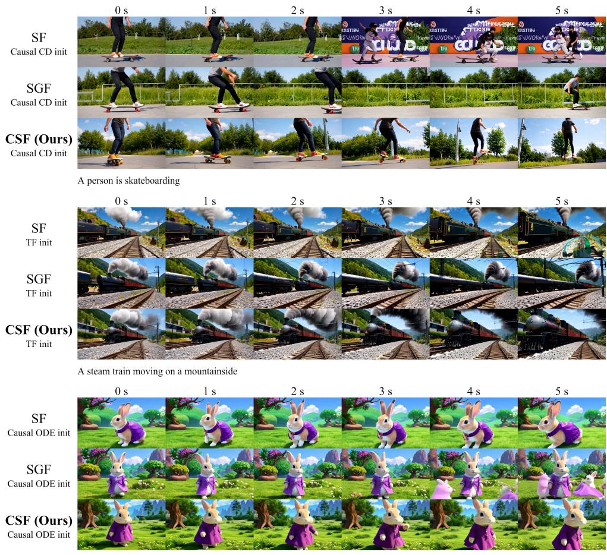  
A fat rabbit wearing a purple robe walking through a fantasy landscape

Figure 7: Additional qualitative comparison of 5-second chunk-wise generation. We compare SF, SGF, and CSF under Causal CD, TF, and Causal ODE initialization using uniformly spaced snapshots.

each autoregressive unit under autograd, while retaining the full historical computation graph across the rollout. This allows the gradient signals from later autoregressive units to propagate through the connected historical KV states in a single backward pass.

For completed runs, peak device memory is the maximum sampled device-wide NVML memory.used on any GPU across all 50 iterations; allocated and reserved are maxima of perstep PyTorch peaks. Time is the slowest rank’s elapsed time from the end of iteration 5 through the end of iteration 50, divided by nine. Each five-iteration unit includes one generator and five fake-score updates. Table 5 reports the resulting single-GPU memory and per-five-iteration time, normalized to SF within each setting.

In the chunk-wise setting, replay-based Full BPTT reaches 1.43× the SF peak device memory. CSF uses 0.85× the measured SF peak at 1.27× the time. In the frame-wise stress test, Full BPTT runs out of memory on its first generator update; CSF completes 50 iterations at 0.48× the measured SF peak and 1.41× the time. The reported memory and time ratios are specific to the standardized full-four-step profiling configuration.

Full BPTT reconstructs and retains the connected computation graph across the autoregressive history. CSF instead replays selected paths and releases each local graph after backward. CSF’s lower measured peak memory is consistent with its replay schedule and early release of local graphs. It does not imply that adding cross-chunk gradients intrinsically reduces memory.

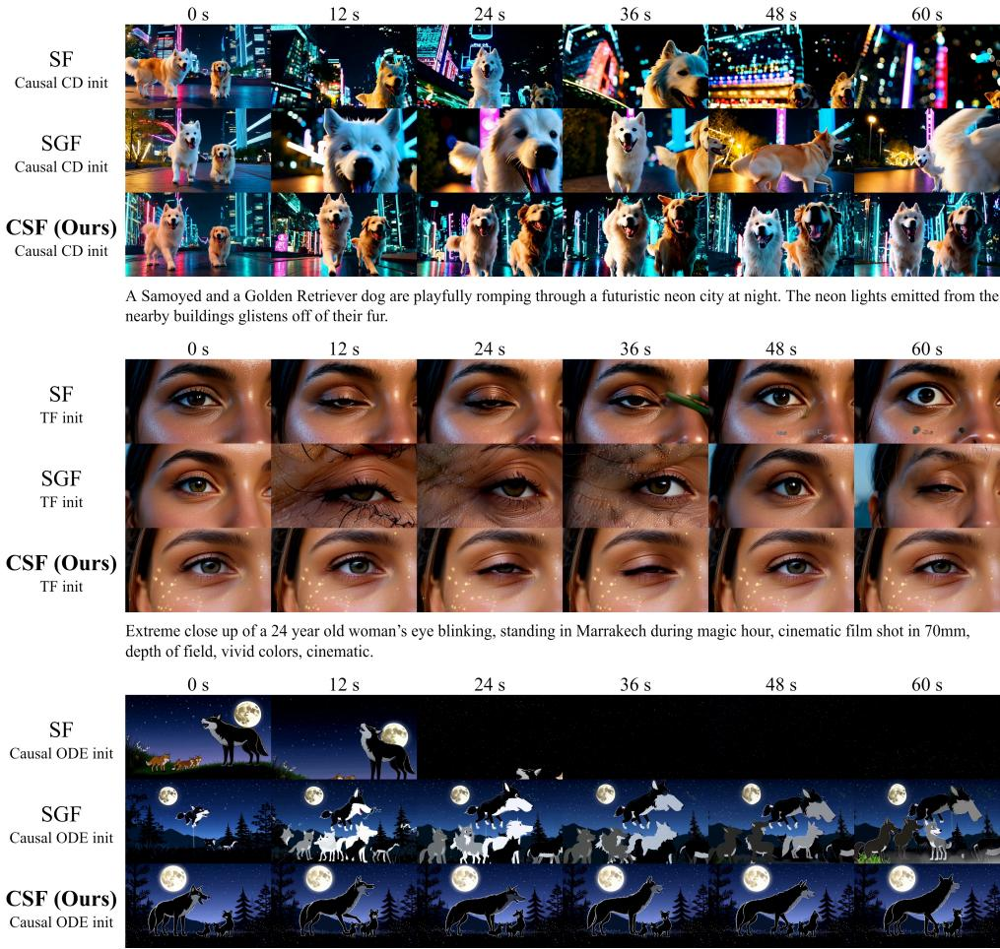  
A beautiful silhouette animation shows a wolf howling at the moon, feeling lonely, until it finds its pack

Figure 8: Additional qualitative comparison of 60-second chunk-wise generation. We compare SF, SGF, and CSF under Causal CD, TF, and Causal ODE initialization using uniformly spaced snapshots throughout the rollout.

In a separate chunk-wise diagnostic, direct Full BPTT with autograd enabled throughout the forward rollout reached 192.50 GiB. We therefore use replay-based Full BPTT as the more memory-efficient control in Table 5: it shares the detached four-step rollout and selected-exit reconstruction with the other methods, yet retains all reconstructed historical connections until a single backward pass. The explicit replay cost is included in the reported time; gradient checkpointing is applied separately to all methods.

## D.2 SHORT-HORIZON CHUNK-WISE EVALUATION

To complement the long-horizon evaluations in the main paper, we further provide the full 16- dimensional VBench results (Table 6) for approximately 5-second chunk-wise generation under the same three initialization settings: Causal CD, TF, and Causal ODE. We additionally report Avg.(6), defined as the unweighted average of Aesthetic Quality, Background Consistency, Imaging Quality, Motion Smoothness, Subject Consistency, and Flickering.

Overall, SF, SGF, and CSF remain broadly comparable at this short horizon. CSF achieves the highest Avg.(6) under Causal CD and TF. Under Causal ODE, CSF remains closely matched with SF in Avg.(6). The individual VBench dimensions exhibit mixed rankings across methods rather than a uniform advantage for any single method. The six-metric average remains broadly comparable at short horizons, while individual semantic and compositional dimensions show setting-dependent trade-offs.

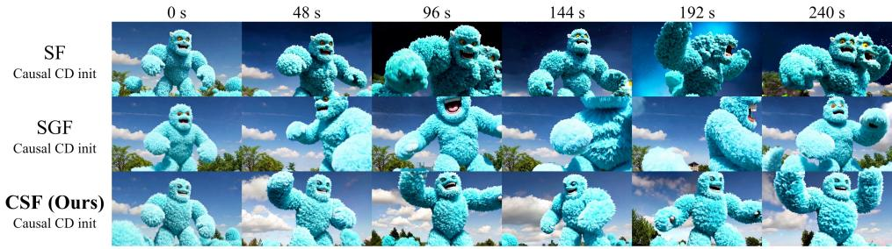

A giant humanoid, made of fluffy blue cotton candy, stomping on the ground, and roaring to the sky, clear blue sky behind them  
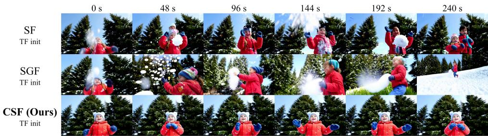

A low-angle shot of a child reaching out to catch falling snowflakes, with a backdrop of tall evergreen trees.  
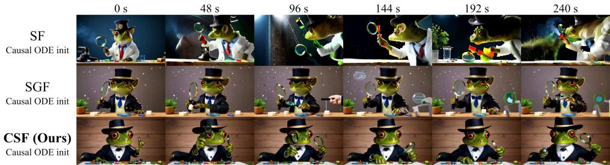  
A frog wearing a detective's trench coat and hat, examining clues with a magnifying glass  
Figure 9: Additional qualitative comparison of 240-second chunk-wise generation. We compare SF, SGF, and CSF under Causal CD, TF, and Causal ODE initialization using uniformly spaced snapshots over the four-minute rollout.

## D.3 ADDITIONAL CHUNK-WISE QUALITATIVE RESULTS

We provide additional qualitative comparisons for chunk-wise autoregressive generation at 5, 60, and 240 seconds. These examples complement the quantitative results in the main paper and the short-horizon evaluation above, covering both standard short-video generation and substantially longer autoregressive rollouts. We use the same initialization settings and evaluation prompts as in the corresponding quantitative experiments

Figures 7–9 present additional comparisons among SF, SGF, and CSF. At 5 seconds, the three methods generally produce comparable visual quality, with only modest variations in subject appearance and local scene details. As the rollout extends to 60 seconds, longer-term drift becomes easier to observe: the appearance and composition of the subjects may gradually change, and in some cases the generated content departs more noticeably from the earlier part of the sequence. At 240 seconds, these effects become more apparent in examples involving articulated characters, human subjects, and animals, where subject identity, scale, and surrounding scene structure can evolve over time. In the examples shown, CSF tends to preserve the defining visual characteristics of the subject and the overall composition more steadily across the rollout. These qualitative results are intended to complement the long-horizon quantitative evaluation in the main paper.

Table 7: Frame-wise long-horizon quantitative comparison at 60 and 240 seconds. We compare SF, SGF, and CSF under Causal CD and TF initialization using the same evaluation protocol as the chunk-wise experiments. Avg.(6) and highlighting conventions follow Table 6.
<table><tr><td colspan="2">Horizon Init.</td><td>Method</td><td>Aes.↑</td><td>Back.↑</td><td>Imag.↑</td><td>Mot.↑</td><td>Subj.↑</td><td>Flick.↑</td><td>Dyn.</td><td>Avg.(6)↑</td></tr><tr><td rowspan="4">60 s</td><td rowspan="3">Causal CD</td><td>SF</td><td>0.5159</td><td>0.9453</td><td>0.6366</td><td>0.9614</td><td>0.9366</td><td>0.9376</td><td>0.9411</td><td>0.8222</td></tr><tr><td>SGF</td><td>0.5103</td><td>0.9517</td><td>0.6408</td><td>0.9834</td><td>0.9475</td><td>0.9659</td><td>0.7234</td><td>0.8333</td></tr><tr><td>CSF (Ours)</td><td>0.5170</td><td>0.9586</td><td>0.6805</td><td>0.9861</td><td>0.9671</td><td>0.9699</td><td>0.6589</td><td>0.8465</td></tr><tr><td>TF</td><td>SF SGF</td><td>0.6013 0.5866</td><td>0.9601</td><td>0.7380</td><td>0.9777</td><td>0.9705</td><td>0.9629</td><td>0.7927</td><td>0.8684</td></tr><tr><td rowspan="5">240 s</td><td rowspan="2"></td><td>CSF (Ours)</td><td>0.5871</td><td>0.9533 0.9634</td><td>0.7234 0.7328</td><td>0.9773 0.9869</td><td>0.9632 0.9763</td><td>0.9478 0.9723</td><td>0.8782 0.6516</td><td>0.8586 0.8698</td></tr><tr><td>SF</td><td>0.4833</td><td>0.9437</td><td>0.6056</td><td>0.9711</td><td>0.9318</td><td>0.9470</td><td>0.9461</td><td>0.8137</td></tr><tr><td rowspan="2">Causal CD SGF</td><td></td><td>0.4406</td><td>0.9484</td><td>0.5505</td><td>0.9856</td><td>0.9404</td><td>0.9712</td><td>0.6890</td><td>0.8061</td></tr><tr><td>CSF (Ours)</td><td>0.4490</td><td>0.9535</td><td>0.5960</td><td>0.9879</td><td>0.9566</td><td>0.9737</td><td>0.6047</td><td>0.8194</td></tr><tr><td rowspan="3">TF</td><td>SF</td><td>0.5868</td><td>0.9583</td><td>0.7228</td><td>0.9792</td><td>0.9696</td><td>0.9658</td><td>0.7771</td><td>0.8638</td></tr><tr><td rowspan="2">SGF</td><td></td><td>0.5586 0.9533</td><td>0.7000</td><td>0.9771</td><td></td><td>0.9620 0.9512</td><td>0.9162</td><td></td><td>0.8504</td></tr><tr><td>CSF (Ours)</td><td>0.5701</td><td>0.9632</td><td>0.7116</td><td>0.9853</td><td>0.9744</td><td>0.9707</td><td>0.7357</td><td>0.8626</td></tr></table>

## D.4 FRAME-WISE EXPERIMENTS

To further evaluate CSF beyond chunk-wise autoregressive generation, we conduct additional framewise experiments. All methods are trained and evaluated with a matched nine-latent history window, consisting of three sink and six recent latents, comparable in scale to the chunk-wise setting. Training lasts 1,500 iterations, corresponding to 1,500 fake-score and 299 generator optimizer steps. The results therefore reflect this matched-cache setting rather than each baseline’s native configuration. All other settings follow the corresponding chunk-wise experiments unless otherwise specified.

Table 7 reports the 60- and 240-second results under Causal CD and TF initialization. Under Causal CD, CSF achieves the highest Avg.(6) at both horizons. Under TF, CSF slightly improves over SF at 60 seconds and remains closely matched at 240 seconds; the paired bootstrap intervals include zero at both horizons (Appendix D.5). Overall, these results support the applicability of CSF to finer-grained frame-wise autoregression, while indicating that the gains depend on the initialization setting.

Figures 10 and 11 provide additional qualitative comparisons at 60 and 240 seconds. As the autoregressive rollout becomes longer, variations in subject appearance, composition, and scene content become increasingly visible in some examples. In the examples shown, CSF tends to maintain the key visual characteristics of the subject and the overall scene structure more steadily over time, complementing the quantitative results above.

## D.5 PAIRED BOOTSTRAP ANALYSIS

We assess evaluation-sample uncertainty in Avg.(6) for the chunk-wise and frame-wise long-video settings reported above. The resampling unit is a matched prompt and its original full-length video; clip-level scores are first aggregated within that video, and its six dimension scores are averaged to obtain Avg.(6). Within each initialization and duration, we resample the same video identities for CSF and each baseline with replacement 20,000 times (N = 40 at 60 seconds and N = 128 at 240 seconds). We report CSF-minus-baseline mean differences with 95% percentile intervals from the 2.5th and 97.5th bootstrap percentiles. These comparison-wise intervals describe evaluation-sample uncertainty conditional on fixed checkpoints, not variation across training seeds.

## D.6 EXPLORING GRADIENT CONFLICT

CSF combines the direct DMD gradient $g _ { \mathrm { D M D } }$ with cross-chunk gradient feedback $g _ { \mathrm { c r o s s } }$ propagated from future blocks. In practice, $g _ { \mathrm { c r o s s } }$ can contain components that are negatively aligned with

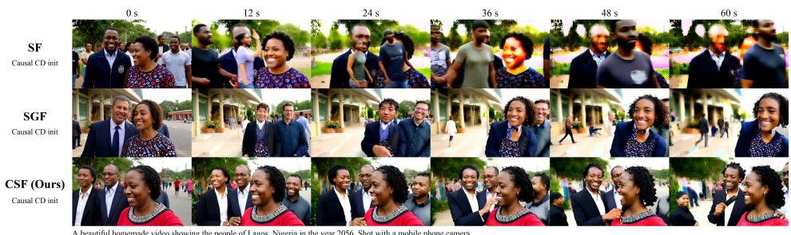

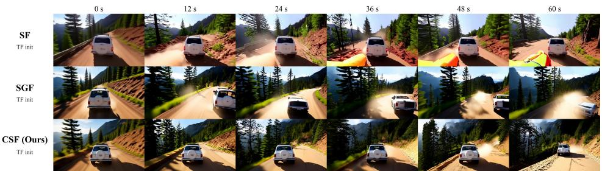  
The camera follows behind a white vintage SUV with a black roof rack as it speeds up a steep dirt road surrounded by pine trees on a steep mountain slope, dust kicks up from it's tires, the sunlight shines on the SUV as it speeds along the dirt road, casting a warm glow over the scene. The dirt road curves gently into the distance, with no other cars or vehicles in sight. The trees on either side of the road are redwoods, with patches of greenery scattered throughout. The car is seen from the rear following the curve with ease, making it seem as if it is on a rugged drive through the rugged terrain. The dirt road itself is surrounded by steep hills and mountains, with a clear blue sky above with wispy clouds

Figure 10: Additional qualitative comparison of 60-second frame-wise generation. We compare SF, SGF, and CSF under Causal CD and TF initialization using uniformly spaced snapshots throughout the rollout.  
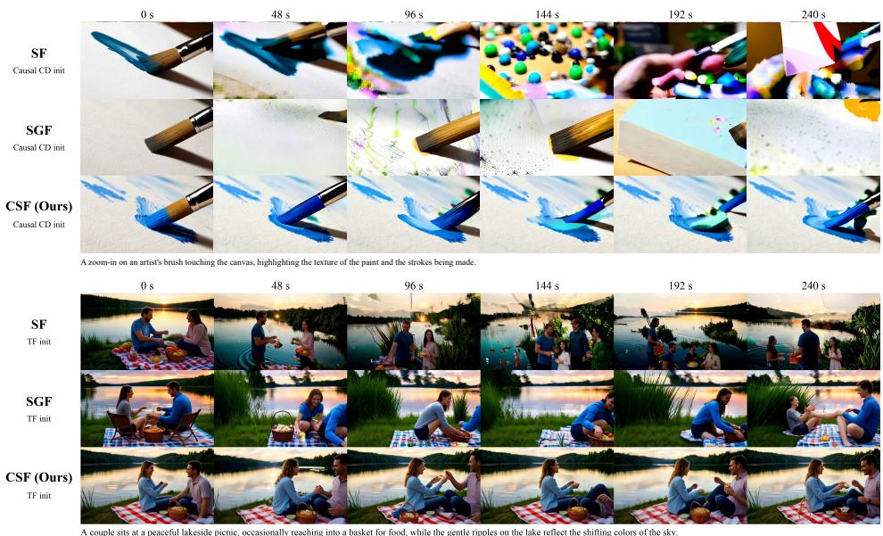  
Figure 11: Additional qualitative comparison of 240-second frame-wise generation. We compare SF, SGF, and CSF under Causal CD and TF initialization using uniformly spaced snapshots over the four-minute rollout.

g . To examine whether such conflicts should be explicitly suppressed, we consider a simple conflict-aware variant that projects out the opposing component whenever $g _ { \mathrm { c r o s s } } ^ { \top } g _ { \mathrm { D M D } } < 0 { : }$

$$
g _ { \mathrm { c r o s s } } ^ { \mathrm { p r o j } } = g _ { \mathrm { c r o s s } } - \frac { \operatorname* { m i n } ( g _ { \mathrm { c r o s s } } ^ { \top } g _ { \mathrm { D M D } } , 0 ) } { \| g _ { \mathrm { D M D } } \| _ { 2 } ^ { 2 } + \epsilon } g _ { \mathrm { D M D } } .\tag{9}
$$

This variant is used only for analysis and is not part of the default CSF formulation.

Table 8: Paired bootstrap differences in Avg.(6) for the reported long-video settings. Each entry is the difference computed from unrounded per-video scores with its 95% percentile interval, multiplied by 100 (score points). Positive values favor CSF; intervals are not adjusted for multiple comparisons.
<table><tr><td>Initialization</td><td>Duration</td><td>N</td><td>CSF-SF</td><td></td><td>CSF-SGF</td><td></td></tr><tr><td colspan="7">(a) Chunk-wise</td></tr><tr><td>Causal CD</td><td>60 s</td><td>40</td><td>+0.519</td><td>[−0.228, +1.250]</td><td></td><td>+0.261 [−0.350, +0.826]</td></tr><tr><td></td><td>240 s</td><td>128</td><td>+1.000</td><td>[+0.657, +1.328]</td><td>+1.144</td><td>[+0.870, +1.426]</td></tr><tr><td>TF</td><td>60 s</td><td>40</td><td>+1.326</td><td>[+0.798, +1.861]</td><td>+1.977</td><td>[+1.424, +2.540]</td></tr><tr><td></td><td>240 s</td><td>128</td><td>+1.560</td><td>[+1.287, +1.829]</td><td>+2.065</td><td>[+1.739, +2.395]</td></tr><tr><td>Causal ODE</td><td>60 s</td><td>40</td><td>+1.813</td><td>[+1.278, +2.390]</td><td>+0.068</td><td>[-0.385, +0.528]</td></tr><tr><td></td><td>240 s</td><td>128</td><td>+1.000</td><td>[+0.688, +1.323]</td><td>+0.186</td><td>[−0.128, +0.493]</td></tr><tr><td colspan="7">(b) Frame-wise</td></tr><tr><td>Causal CD</td><td>60 s</td><td>40</td><td>+2.433</td><td>[+1.247, +3.659]</td><td></td><td>+1.330 [+0.534, +2.126]</td></tr><tr><td></td><td>240 s</td><td>128</td><td>+0.570</td><td>[+0.022, +1.116]</td><td>+1.332</td><td>[+0.846, +1.820]</td></tr><tr><td>TF</td><td>60 s</td><td>40</td><td>+0.138</td><td>[-0.300, +0.595]</td><td>+1.119</td><td> $\left[ + 0 . 6 7 3 , + 1 . 6 0 9 \right]$ </td></tr><tr><td></td><td>240 s</td><td>128</td><td>-0.119</td><td>[−0.403, +0.164]</td><td></td><td>+1.219 [+0.944, +1.498]</td></tr></table>

Table 9: Effect of conflict-aware gradient projection on CSF under Causal CD at 5, 60, and 240 seconds. GradProj removes the component of $g _ { \mathrm { c r o s s } }$ that is negatively aligned with gDMD.
<table><tr><td>Duration Method</td><td></td><td>Aes.↑</td><td>Back.↑</td><td>Imag.↑</td><td>Mot.↑</td><td>Subj.↑</td><td>Flick.↑</td><td>Dyn.</td><td>Avg.(6)↑</td></tr><tr><td rowspan="2">5 s</td><td>CSF</td><td>0.6515</td><td>0.9591</td><td>0.7117</td><td>0.9853</td><td>0.9703</td><td>0.9900</td><td>0.6028</td><td>0.8780</td></tr><tr><td>+ GradProj</td><td>0.6365</td><td>0.9471</td><td>0.7075</td><td>0.9822</td><td>0.9606</td><td>0.9775</td><td>0.7083</td><td>0.8686</td></tr><tr><td rowspan="2">60 s</td><td>CSF</td><td>0.5659</td><td>0.9597</td><td>0.7085</td><td>0.9848</td><td>0.9707</td><td>0.9637</td><td>0.5976</td><td>0.8589</td></tr><tr><td>+ GradProj</td><td>0.5436</td><td>0.9543</td><td>0.7175</td><td>0.9835</td><td>0.9617</td><td>0.9614</td><td>0.7605</td><td>0.8537</td></tr><tr><td rowspan="2">240 s</td><td>CSF</td><td>0.5449</td><td>0.9563</td><td>0.6938</td><td>0.9850</td><td>0.9666</td><td>0.9656</td><td>0.6899</td><td>0.8520</td></tr><tr><td>+ GradProj</td><td>0.5254</td><td>0.9527</td><td>0.6795</td><td>0.9832</td><td>0.9598</td><td>0.9630</td><td>0.7997</td><td>0.8439</td></tr></table>

Table 9 compares the default CSF with this projected variant at 5, 60, and 240 seconds. Removing the negatively aligned component consistently increases Dynamic Degree, while Avg.(6) decreases slightly across all three horizons. This suggests that gradient components opposing the direct DMD objective are not necessarily purely detrimental. One possible interpretation is that part of the negative-direction feedback from $g _ { \mathrm { c r o s s } }$ acts as a damping signal, encouraging more conservative temporal evolution and thereby reducing motion dynamics. Removing this component shifts the generation toward stronger temporal activity, but does not yield a consistent improvement in visual quality or long-term consistency. We therefore retain the original, unprojected cross-chunk gradient feedback in the default CSF formulation.

## E DISCUSSION AND LIMITATIONS

CSF restores future-to-history gradient feedback without retaining the full autoregressive computation graph, but it does not aim to reproduce exact full-sequence backpropagation. In particular, Shortcut Gradient Replay selectively reconstructs paths to historical chunks, whereas Full BPTT connects the replayed computation across the autoregressive history. Its additional paths may give early chunks too much future feedback relative to direct DMD supervision. This suggests that the goal is not necessarily to propagate gradients through as much history as possible, but rather to provide useful future feedback while preserving a sufficiently strong local learning signal. This controlled comparison does not establish that full-history backpropagation is generally worse; further study is needed to understand when it helps. How to determine which historical states should receive gradient feedback, and from which future states, remains an open question.

CSF trades memory consumption for additional computation through replay. Although the resulting training overhead remains practical in our post-training setting, replay becomes more expensive as the number of replayed historical states or writer dependencies grows. This may become more relevant for larger models or substantially longer autoregressive sequences. A natural direction is therefore to make historical gradient propagation more selective, for example through selective replay or sparse historical gradient assignment, so that gradients are propagated only through historical states that are most relevant to future generation. Such mechanisms could potentially retain the benefit of future-to-history feedback while reducing unnecessary recomputation and gradient interference.

Our experiments also suggest a possible interaction between long-term consistency and temporal dynamics. In particular, removing components of the cross-chunk gradient that oppose the direct DMD gradient increases Dynamic Degree, while slightly reducing the aggregated quality and consistency metrics. This indicates that some future-to-history feedback may encourage more conservative temporal evolution rather than simply acting as harmful gradient conflict. Although CSF does not always achieve the highest Dynamic Degree in the current unconstrained generation setting, this trade-off may become less limiting in controllable generation or world-model settings, where motion and scene evolution are driven more explicitly by control signals, actions, or other external conditions. In such settings, CSF may be particularly useful for further reducing autoregressive error accumulation and preserving visual or state consistency over long horizons, while the desired dynamics are governed by the control input itself. Better understanding how future-to-history feedback should interact with controllable dynamics is therefore an interesting direction for future work.