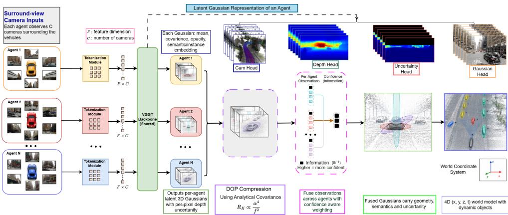
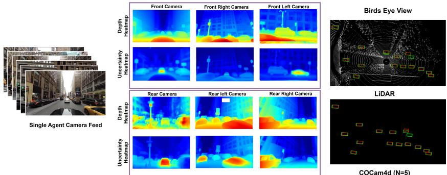
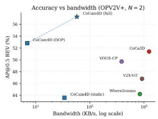
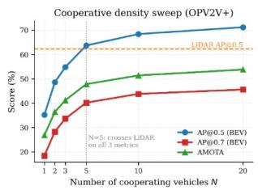
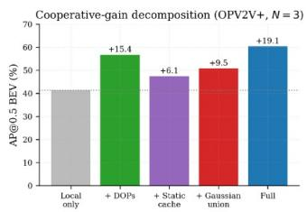

# CoCam4D: Geometry-Aware Cooperative 4D Perception for Camera-Only Autonomous Driving

Soham Pahari1,3 soham.109424@stu.upes.ac.in

2Sudip Das\*2   
0sudip.das@valeo.com

2Arindam Das2 arindam.das@valeo.com

OUjjwal Bhattacharya3 8 ujjwal@isical.ac.in

1 University of Petroleum and Energy Studies, Dehradun

2 anSWer India, Valeo Brain

3 Indian Statistical Institute, Kolkata

## Abstract

Autonomous vehicles often suffer from limited perception due to occlusions, blind spots, limited sensor range and complex nature of the surroundings. Multi-agent collaborative perception (CP) addresses these challenges by allowing vehicles to share sensory information seamlessly and reconstruct the scene. However, camera-only perception remains fundamentally restricted due to uncertain nature of the distance-dependent monocular depth. We propose CoCam4D, a Bayesian framework for collaborative perception that explicitly models geometric uncertainty. It uses a VGGT-based feedforward network to generate 3D Gaussian scene representations with uncertainty estimates, helping multiple vehicles or agents to combine their observations efficiently. By sharing compact Gaussian primitives, reliable observations from one agent reduces the limitation of depth uncertainty in another without requiring LiDAR sensor data. To support real-world deployment, we introduce Dynamic Object Primitives (DOPs), a compact 35- byte representation for efficient C-V2X communication. Extensive experiments show that our proposed metho consistently outperforms recent vision-only methods, achieving improvements of 11.48% on OPV2V+ and 10.62% on DAIR-V2X-C, suggesting a promising geometrically grounded direction toward LiDAR-free autonomous driving.

## a1 Introduction

With the rapid advancement of connected and autonomous driving technologies, multiagent/vehicle collaborative perception (CP) has become a promising paradigm for intelligent transportation systems. Through Vehicle-to-Everything (V2X) communication, connected agents exchange perceptual information to cooperatively understand complex driving environments beyond the capability of a single vehicle. This shared perception helps to build complete and reliable understanding of traffic scenes, leading to significant improvements in safety, mobility, and overall transportation efficiency [19]. Early CP studies primarily focused on traditional single-agent tasks such as 3D object detection [11, 16, 29, 45, 54] and semantic segmentation [24, 39], typically by fusing latent BEV features. Although LiDAR point clouds have long been used for their precise geometric measurements, recent advances in camera-based 3DOD, such as CoCa3D [17], have demonstrated competitive performance, highlighting cameras as viable, cost-effective sensors for complex 3D scene understanding. However, existing camera-based cooperative methods usually share compressed BEV feature grids [16, 24, 39, 43] without modeling uncertainty. As a result, fusion across vehicles relies on learned attention, without optimality guarantees and failing to distinguish between more reliable near-range observations and less certain far-range observations.

  
Figure 1: CoCam4D overview. Each CAV tokenises its F×C surround-view frames and passes them through a shared-weight VGGT encoder to produce velocity-aware 3D Gaussians with per-pixel depth uncertainty in a single forward pass—no LiDAR or per-scene optimisation required. Dynamic objects are compressed into Dynamic Object Primitives (DOPs, ≈35 bytes/object) encoding state and analytically derived covariance ${ \bf R } _ { k } \propto z ^ { 4 } / f ^ { 2 }$ , then fused across vehicles via an information filter $\begin{array} { r } { \mathbf { Y } _ { \mathrm { f u s e d } } { = } \sum _ { j } \mathbf { R } _ { j } ^ { - 1 } } \end{array}$ that automatically assigns weights to the confident lateral views over uncertain head-on observations, yielding a cooperative 4D world model that surpasses single-vehicle LiDAR at N=5 agents.

The core limitation of camera-only autonomous driving arises from the issues of perspective geometry, where monocular depth follows $z \propto \frac { f { \cdot } \widecheck { H } } { h }$ , where z is the object depth, $f$ is the camera focal length, H is the real-world object height, and h is the object height in the image. The associated depth uncertainty increases quadratically with object depth, $\begin{array} { r } { \sigma _ { z } \propto \frac { z ^ { 2 } } { f } } \end{array}$ , where $\sigma _ { z }$ represents the depth uncertainty, making long-range perception fundamentally unreliable [9, 13, 30, 55]. Existing single-vehicle vision approaches [26, 27, 37] do not fully overcome this ambiguity, as it originates from the physics of perspective projection rather than the model capacity. CP reduces this shortcoming by using observations from multiple views. When several vehicles observe the same object from different angles, the combined views reduce depth uncertainty and improve 3D localization [17]. Yet, principled Bayesian fusion for multi-vehicle camera-only perception remains largely unexplored. Recent works [22, 23] inspired by 3D Gaussian Splatting use direction-aware Gaussian representations that remain stable under rigid transformations. These representations are compact and efficient for communication in cooperative scene understanding [4]. However, existing methods still rely on black-box fusion and lack explicit modeling of the distance-dependent, anisotropic uncertainty induced by perspective projection. Motivated by predictive coding theories [10] of perception, we introduce a probabilistic collaborative perception framework with explicit uncertainty propagation and Bayesian fusion.

In this work, we propose CoCam4D, the first feedforward cooperative 4D perception framework that reconstructs velocity-aware 3D Gaussian scenes per vehicle and fuses them across agents via a principled information-filter-based Gaussian product[40]. Each vehicle performs a single forward pass through a VGGT-based backbone [35] with causal masked attention, predicting per-pixel metric depth, 3D Gaussians with lifespan, per-pixel velocities, and depth uncertainty, without requiring LiDAR or additional cross-vehicle calibration refinement beyond the dataset-provided intrinsics and extrinsics used in CoCa3D [17]. Dynamic objects are encoded as compact Dynamic Object Primitives (DOPs) and transmitted at approximately 35 bytes per object via V2V communication. Cross-vehicle fusion combines information from multiple vehicles using confidence-based weights derived from depth uncertainty. This creates a shared world model that is complete and reliable than the view from a single vehicle.

Contributions of this study are summarized as follows:

• CoCam4D, a Vision only cooperative 4D perception framework that reconstructs and fuses velocity-aware Gaussian scenes across vehicles in a single forward pass.

• An end-to-end uncertainty chain from per-pixel depth error to Gaussian covariance and information-filter weighting, allowing uncertainty-driven cooperative fusion.

• A compact Dynamic Object Primitive (DOP) fitting one C-V2X packet, preserving full object state and observation covariance for real-time V2V communication.

• Through a cooperative density study, we show that five cooperating camera agents achieve performance comparable to a single-vehicle LiDAR system.

## 2 Related Work

Existing works in this area is categorized into five primary streams: multi-agent perception, camera-based 3D scene understanding, cooperative perception, feedforward 4D reconstruction, and 3D Gaussian representations for driving and collaborative systems

Camera-Only 3D Perception. Camera-only 3D object detection has advanced quickly, with bird’s-eye-view (BEV) representations helping to combine information from multiple views in a unified way. BEVFormer [27] and Reflective Teacher [13] introduce spatiotemporal attention for BEV aggregation, while BEVDepth [26] improves geometric fidelity via explicit depth supervision. StreamPETR [37] models temporal information using persistent object-centric queries and achieves strong performance on the nuScenes Dataset [1]. HeightFormer [41] introduces explicit height modeling in BEV without additional supervision which reduces depth ambiguity by decoupling height estimation from projection. IAE-BEV [34] mitigates feature degradation in LSS pipelines via instance-adaptive enhancement with object-aware pooling and attention. DenseBEV [8] further reformulates BEV grids as dense object queries for structured feature-to-prediction mapping. Despite these advances, monocular geometry remains fundamentally limited since depth estimation relies on perspective cues with uncertainty growing as $\sigma _ { z } \propto z ^ { 2 } / f$ [30, 55], degrading long-range perception. Cooperative perception addresses this by sharing information across agents.

Cooperative Perception. Connected autonomous agents share perception through Vehicleto-Everything (V2X) communication, which helps reduce problems like occlusion, limited field of view, and sparse observations [19]. Methods are commonly categorized into early, intermediate, and late fusion depending on the exchange stage. Early fusion transmits raw sensor data [14], which keeps full geometric details but requires high communication cost. Late fusion shares object-level outputs [32, 56], which reduces bandwidth but loses some spatial detail. Intermediate fusion has thus become dominant, where compact latent features are shared among agents [11, 16, 39, 43, 45, 49]. F-Cooper [5] introduced BEV feature fusion, followed by graph-based V2VNet [39], adaptive Where2comm [16], and transformerbased V2X-ViT [46] and CoBEVT [44], establishing intermediate fusion as the standard for bandwidth-efficient CP. Large-scale benchmarks such as OPV2V [47], V2X-Sim [25], and V2XSet [46], along with real-world datasets including DAIR-V2X [52], V2X-Real [42], and TUMTraf-V2X [57], support evaluation under realistic sensing and communication conditions.

Most CP methods remain LiDAR-centric. Camera-only cooperative perception is less explored due to monocular depth ambiguity and multi-view misalignment. Existing visionbased approaches typically exchange deterministic BEV features without uncertainty modeling, limiting robustness to calibration errors and occlusions.

Feedforward 4D Reconstruction. Feedforward 4D reconstruction directly regresses geometry and motion from image sequences in a single forward pass. DUSt3R and VGGT [35, 38] recover dense 3D structure through transformer-based multi-view attention, while StreetForward [53] and DGGT [6] extend this paradigm to dynamic scene understanding. STORM [51] and EVolSplat4D [31] further explore dynamic volumetric and Gaussian-based 4D representations. Nevertheless, these methods remain deterministic and largely restricted to single-agent settings without uncertainty propagation.

3D Gaussians for Driving and Collaboration. 3D Gaussian Splatting [22] provides a compact and differentiable scene representation using continuous Gaussian primitives. Recent works extend Gaussian representations to 3D detection [2, 50], occupancy prediction [20, 21], and dynamic driving scenes through Street Gaussians and DrivingGaussian. VOGS-CP [4] further explores Gaussian primitives for cooperative perception through learned cross-agent fusion. However, existing methods mainly focus on representation fidelity and rely on heuristic aggregation without explicit uncertainty modeling. In contrast, our framework extends Gaussian scene representations to cooperative 4D perception with uncertaintyaware Gaussian propagation in BEV space.

Cooperative Multi-Object Tracking. Cooperative multi-object tracking has mainly been explored in LiDAR-based settings. DMSTrack [7] integrates differentiable Kalman filtering with learned observation covariance, while MOT-CUP[33] employs conformal prediction for calibrated uncertainty propagation. However, these methods rely on discrete bounding-box representations and simplified uncertainty assumptions, limiting applicability to camera-only cooperative perception and failing to model anisotropic depth uncertainty from perspective projection.

## 3 Preliminaries

Consider N CAVs S within V2V range, each observing F consecutive frames from C cameras, $\mathbf { O } _ { i } = \{ \mathbf { I } _ { f } ^ { i , c } \in \mathbb { R } ^ { H \times W \times 3 } \}$ , with the goal of estimating a cooperative 4D world model, defined as follows:

$$
B _ { i } = \{ ( \pmb { \mu } _ { k } , \mathbf { v } _ { k } , \pmb { \theta } _ { k } , \mathbf { d } _ { k } ) \} ,\tag{1}
$$

where each tuple encodes position, velocity, heading, and dimensions of dynamic agents. Existing methods either share dense features (>1 MB/frame) or exchange bounding boxes, discarding uncertainty. CoCam4D addresses this via three subproblems.

(P1) Per-Vehicle 4D Reconstruction. Each vehicle independently reconstructs 3D Gaussians, velocities, and depth uncertainty in a single forward pass:

$$
( \mathcal G _ { i } , \mathbf V _ { i } , \pmb { \Sigma } _ { i } ) = f _ { \mathrm { e n c } } ( \mathbf { O } _ { i } ) .\tag{2}
$$

(P2) Compact Cooperative Messaging. Each vehicle compresses its reconstruction into Dynamic Object Primitives (DOPs),

$$
\mathcal { M } _ { i } = \left\{ \mathcal { P } _ { k } = \left( \pmb { \mu } _ { k } , \mathbf { v } _ { k } , \pmb { \theta } _ { k } , \mathbf { d } _ { k } , \mathbf { R } _ { k } \right) \right\} , \quad \left| \mathcal { M } _ { i } \right| \leq \beta ,\tag{3}
$$

where $\mathbf { R } _ { k }$ is the observation covariance derived analytically from $\pmb { \Sigma } _ { i }$ and camera geometryencoding full geometric state and confidence in ${ \approx } 3 5$ bytes per object.

(P3) Uncertainty-Weighted Cooperative Fusion. Received DOPs are fused via an information filter,

$$
\mathbf { R } _ { \mathrm { f u s e d } } ^ { - 1 } = \mathbf { R } _ { i } ^ { - 1 } + \mathbf { R } _ { j } ^ { - 1 } ,\tag{4}
$$

which weights each observation by confidence without learned calibration. Anisotropic covariances $\mathbf { R } _ { k }$ ensure lateral views compensate for head-on depth uncertainty, yielding detections $B _ { i }$ that exceed single-agent estimates.

## 4 Proposed Method

CoCam4D considers a set of N connected autonomous vehicles (CAVs) S within V2V range, each equipped with C surround-view cameras observing F consecutive frames, and outputs at each vehicle a cooperative 4D world model $B _ { i } = \{ ( \pmb { \mu } _ { k } , \mathbf { v } _ { k } , \pmb { \theta } _ { k } , \mathbf { d } _ { k } ) \}$ with accurate cooperative 4D world model than any single vehicle can achieve alone. The pipeline consists of three stages, which visually described in Figure 1: (i) per-vehicle feedforward 4D reconstruction with velocity-aware geometry and calibrated uncertainty; (ii) Dynamic Object Primitive (DOP) extraction that compresses representations into bandwidth-limited messages while preserving uncertainty structure; and (iii) cooperative fusion via an information filter that weights each vehicle according to complementary observation geometry. We described each stage, with full derivations, training details, and ablations provided in the supplementary material.

## 4.1 Per-Vehicle Feedforward 4D Reconstruction

Each vehicle processes its observations independently in a single forward pass, without iterative optimization or additional calibration refinement. The encoder $f _ { \mathrm { e n c } }$ produces a rich intermediate representation that feeds six specialized prediction heads, each addressing a distinct aspect of dynamic scene understanding.

Tokenization and multi-scale attention. The $N _ { \mathrm { i m g } } = F \cdot C$ input images are encoded by a frozen ViT backbone into patch tokens $\mathbf { X } \in \mathbb { R } ^ { B \times N _ { \mathrm { i m g } } \times \overset { \triangledown } { P } \times D }$ , where $P = ( H / S ) ^ { 2 }$ , P is number of patches (tokens) per image, H is image height, and S = patch size / stride of the ViT encoder. Standard global attention considers all frames symmetrically, making motion patterns less clear. We instead use L layers of alternating frame-wise attention (within each image over P tokens) and global attention over all $N _ { \mathrm { i m g } } \cdot P$ tokens following equation 5,

$$
\mathbf { Z } = { \mathrm { S e l f A t t n } } \left( { \mathrm { f l a t t e n } } _ { ( n , p ) } ( \mathbf { X } ) \right) , \quad \mathbf { Z } \in \mathbb { R } ^ { B \times ( N _ { \mathrm { i m g } } \cdot P ) \times D }\tag{5}
$$

Deep layers capture scene-level geometry but lose fine detail, so we fuse with raw features via

$$
\mathbf { F } _ { \mathrm { f u s e d } } = { \mathrm { c o n c a t } } ( \mathbf { F } _ { \mathrm { r a w } } , \mathbf { F } _ { \mathrm { a t t n } } ) \in \mathbb { R } ^ { B \times N _ { \mathrm { i m g } } \times P \times 2 D }\tag{6}
$$

The fused feature $\mathbf { F _ { \mathrm { f u s e d } } }$ is used as the shared backbone for all six heads below.

Camera pose estimation. We follow the same calibration protocol as CoCa3D [17], using the standard dataset-provided camera intrinsics and extrinsics without additional offline cross-vehicle calibration refinement. The camera head $\mathcal { H } _ { \mathrm { c a m } }$ predicts per-image intrinsics $\mathbf { K } _ { n } \in \mathbb { R } ^ { 3 \times 3 }$ and extrinsics $\left( \mathbf { R } _ { n } , \mathbf { t } _ { n } \right)$ for each image $n \in \{ 1 , . . . , N _ { \mathrm { i m g } } \}$ , with the first camera of the first frame defining the world origin. This formulation supports deployment across different vehicle platforms without requiring additional offline cross-vehicle calibration refinement.

Depth and uncertainty prediction. The depth head ${ \mathcal { H } } _ { \mathrm { d e p } }$ produces per-pixel metric depth $\bar { D _ { n } } \overset { - } { \in } \mathbb { R } ^ { H \times W }$ via VGGT-based multi-scale decoder equipped with skip connections from fused feature representations. Existing feedforward reconstruction methods [3, 12] only output depth and do not predict calibrated uncertainty. The uncertainty head ${ \mathcal { H } } _ { \mathrm { u n c } }$ , which is the first novel contribution of this work, shares the decoder architecture of ${ \mathcal { H } } _ { \mathrm { d e p } }$ but independently trained in the manner of self-supervised way, and predicts per-pixel log-depth uncertainty $\hat { \Sigma } _ { n } \in \mathbb { R } ^ { H \times W }$ with a softplus activation[28] to ensure positivity. Supervision uses the prediction error from the depth head as an internally defined target:

$$
\mathcal { L } _ { \mathrm { u n c } } = \left| \left| \hat { \Sigma } _ { n } - \mathrm { s g } ( | D _ { n } - D _ { n } ^ { * } | ) \right| \right| _ { 1 }\tag{7}
$$

where $\operatorname { s g } ( \cdot )$ denotes stop-gradient and $D _ { n } ^ { * }$ is the ground-truth depth. This formulation does not require extra annotations beyond those used by the depth head, which makes uncertainty estimation a zero-cost addition during training.

Velocity-aware Gaussian primitives. The Gaussian head ${ \mathcal { H } } _ { \mathrm { g s } }$ produces a set of 3D Gaussian primitives $\mathcal { G } _ { i } = \{ \mathbf { G } _ { k } \in \mathbb { R } ^ { d } \ | \ k = 1 , \dots , P _ { \mathrm { g s } } \}$ . Each primitive encodes a local scene region through its mean $\pmb { \mu } _ { k } \in \mathbb { R } ^ { 3 }$ , scale $\mathbf { s } _ { k } \in \mathbb { R } ^ { 3 }$ , rotation quaternion $\mathbf { r } _ { k } \in \mathbb { R } ^ { 4 }$ , opacity $a _ { k } \in [ 0 , 1 ]$ color $\mathbf { c } _ { k } \in \mathbb { R } ^ { 3 }$ , and lifespan $\sigma _ { k } \in \mathbb { R } ^ { + }$ . The 3D center is back-projected from the head of depth output as:

$$
\pmb { \mu } _ { n } ( \mathbf { u } ) = \mathbf { R } _ { n } ^ { \top } \left( \mathbf { K } _ { n } ^ { - 1 } \tilde { \mathbf { u } } D _ { n } ( \mathbf { u } ) - \mathbf { t } _ { n } \right)\tag{8}
$$

where $\tilde { \mathbf { u } } = ( u _ { x } , u _ { y } , 1 ) ^ { \top }$ is the homogeneous pixel coordinate. The covariance is constructed as $\pmb { \Sigma } _ { k } = \mathbf { R } _ { g } \mathbf { S } \mathbf { S } ^ { \top } \dot { \mathbf { R } } _ { g } ^ { \top }$ , with $\mathbf { S } = \mathrm { d i a g } ( \mathbf { s } _ { k } )$ and ${ \bf R } _ { g } = { \bf q } 2 { \bf r } ( { \bf r } _ { k } )$

Connecting uncertainty to geometry. Crucially, the depth-axis scale is modulated by the uncertainty head output from equation 7:

$$
s _ { z } = s _ { z } ^ { \mathrm { b a s e } } \times \left( 1 + \beta \hat { \Sigma } _ { n } ( \mathbf { u } ) \right)\tag{9}
$$

amplifying the Gaussian extent along the viewing ray for uncertain observations. This modulation establishes the uncertainty chain end-to-end: depth uncertainty from equation 7 propagates through equation 9 to covariance, and ultimately to information filter fusion weighting in Section 4.3. Without this connection, cooperating vehicles consider confident side observations the same as uncertain front-facing views, which is a key limitation of methods that share object detections.

The lifespan parameter further modulates opacity over time:

$$
\ o _ { k } ( { \bf u } , t ^ { \prime } ) = a _ { k } ( { \bf u } ) \exp \left( - \frac { 1 } { 2 } \frac { ( t ^ { \prime } - t ) ^ { 2 } } { \sigma _ { k } ( { \bf u } ) } \right)\tag{10}
$$

Static Gaussians can fade gracefully as their appearance becomes less reliable due to lighting or reflectance changes, as shown by the decay in equation 10.

Directed motion representation. Standard global attention considers all temporal frames symmetrically, which reduces the model ability to represent directed motion. The motion head ${ \mathcal { H } } _ { \mathrm { m o t i o n } }$ addresses this limitation by augmenting tokens with periodic time based temporal embeddings and applying a frame structured causal mask:

$$
\begin{array} { r } { \mathbf { M } [ i , j ] = \left\{ { 1 } \begin{array} { l l } { 1 } & { \mathrm { i f ~ f r a m e } ( i ) = f _ { s } \mathrm { ~ a n d ~ f r a m e } ( j ) = f _ { s } \pm 1 , } \\ { 0 } & { \mathrm { o t h e r w i s e } , } \end{array} \right. } \end{array}\tag{11}
$$

which restricts each query token at source frame $f _ { s }$ to attend only to key tokens at adjacent frames. The masked attention in equation 11 produces motion-aware features from which a multi-scale decoder regresses per-pixel forward and backward velocities $\mathbf { v } ^ { + } , \mathbf { v } ^ { - } \in \mathbb { R } ^ { 3 }$ and dynamic probability $p _ { \mathrm { d y n } } \in [ 0 , 1 ]$ . The velocity covariance is derived analytically from the uncertainty head, propagating the depth-scaling law through to motion:

$$
\sigma _ { \nu } ^ { 2 } \propto \frac { \sigma _ { \mathrm { d e p t h } } ^ { 2 } } { \Delta t ^ { 2 } } \cdot \frac { D ^ { 2 } } { f ^ { 2 } }\tag{12}
$$

This covariance from equation 12 later drives the information filter weighting in equation 24.

Background modeling. The sky head $\mathcal { H } _ { \mathrm { s k y } }$ represents unbounded background regions with a fixed set of Gaussians whose centers are sampled on a upper half-sphere of radius $r _ { \mathrm { s k y } }$ . Their colors are initialized by projecting image pixels onto the hemisphere and refined by a lightweight MLP, preventing the depth head from wasting capacity on infinitely distant sky pixels.

Dynamic-static decomposition and rendering.

Pixels with $p _ { \mathrm { d y n } } > \tau = 0 . 5$ contribute dynamic Gaussians $\mathcal { G } _ { \mathrm { d y n } }$ ; the remainder contribute static Gaussians $\dot { \mathcal { G } } _ { \mathrm { s t a t i c } }$ accumulated across all frames. The full Gaussian set used to render frame f is:

$$
\hat { \mathcal { G } } ^ { f } = \mathcal { G } _ { \mathrm { s t a t i c } } \cup \bigcup _ { t \neq f } \mathcal { G } _ { \mathrm { d y n } } ^ { f  t } \cup \mathcal { G } _ { \mathrm { s k y } }\tag{13}
$$

where $\mathcal { G } _ { \mathrm { d y n } } ^ { f  t }$ denotes dynamic Gaussians from frame t warped into frame $f$ using predicted velocities. By excluding dynamic Gaussians at frame $f$ itself, as shown in equation 13, the model is forced to explain dynamic content through adjacent-frame velocity predictions, enforcing motion correctness via photometric loss without any explicit flow supervision—a form of self-consistency regularization absent from static reconstruction methods. The rendered image is:

$$
\hat { \mathbf { I } } ^ { f } = \mathrm { R e n d e r e r } \big ( \hat { \mathcal { G } } ^ { f } , \Pi ^ { f } \big )\tag{14}
$$

Training objective.

The overall per-vehicle training objective combines photometric, opacity, dynamic mask, lifespan, and uncertainty terms:

$$
\mathcal { L } _ { \mathrm { v e h i c l e } } = \mathcal { L } _ { \mathrm { r g b } } + \lambda _ { \alpha } \mathcal { L } _ { \mathrm { o p a c i t y } } + \lambda _ { d } \mathcal { L } _ { \mathrm { d y n a m i c } } + \lambda _ { \sigma } \mathcal { L } _ { \mathrm { l i f e s p a n } } + \lambda _ { u } \mathcal { L } _ { \mathrm { u n c } }\tag{15}
$$

## 4.2 Dynamic Object Primitive Extraction

Each vehicle generates compact object-level representations from its output. Existing feature sharing methods[5, 43, 45, 48]transmit raw or intermediate features, but they require very high bandwidth (more than 1 MB per frame). In contrast, detection-sharing methods exchange only the final bounding boxes, which reduces communication cost but loses important uncertainty information required for reliable fusion. DOPs provide a balanced solution by using only about 35 bytes per primitive while still preserving the full observation covariance matrix $\mathbf { R } _ { k }$ , which captures geometric confidence.

Clustering and filtering. Connected-component analysis is applied to the binary dynamic mask $( p _ { \mathrm { d y n } } > \tau )$ to group pixels into clusters ${ \mathcal { C } } k .$ . Small components with fewer than Nmin = 20 pixels are removed as noise. In addition, components with a 3D extent larger than 15m are split because they are likely to contain multiple objects. This simple heuristic helps prevent different objects, such as buses and motorcycles, from being merged into a single primitive.

Primitive construction. For each surviving cluster $\mathcal { C } _ { k }$ , we form a Dynamic Object Primitive (DOP):

$$
\begin{array} { r } { \mathcal { P } _ { k } = ( \pmb { \mu } _ { k } , \mathbf { v } _ { k } , \pmb { \theta } _ { k } , \mathbf { d } _ { k } , \mathbf { R } _ { k } ) , } \end{array}\tag{16}
$$

where ${ \pmb \mu } _ { k }$ is the 3D centroid back-projected via equation 8, $\mathbf { v } _ { k }$ is the mean cluster velocity, $\theta _ { k }$ is the heading derived from $\mathbf { v } _ { k } , \mathbf { d } _ { k }$ encodes object dimensions from eigen decomposition of the cluster covariance, and $\mathbf { R } _ { k }$ is the observation covariance.

Analytical uncertainty propagation. The observation covariance in equation 16 follows the geometry of the camera system. As the object distance increases, the depth uncertainty grows quadratically, while the lateral uncertainty increases linearly. As a result, the uncertainty forms an anisotropic ellipsoid.

$$
{ \bf R } _ { k } = \mathrm { d i a g } \big ( \sigma _ { x } ^ { 2 } ( z ) , \sigma _ { y } ^ { 2 } ( z ) , \sigma _ { z } ^ { 2 } ( z ) \big ) , \quad \sigma _ { z } ^ { 2 } ( z ) \propto \frac { z ^ { 4 } } { f ^ { 2 } } ,\tag{17}
$$

where $f$ is the focal length and $z$ is the distance of object from the camera. This quadratic scaling is not learned from data. Instead, it is analytically derived from the pinhole camera model together with the depth uncertainty ${ \hat { \Sigma } } _ { n }$ predicted by the uncertainty head. When a vehicle observes an object from the side at a distance of 10m, the depth uncertainty is low $( \sigma _ { z } \approx 0 . 5 , \mathrm { m } )$ . However, when the same object is observed from the front at the same distance, the depth uncertainty becomes much higher $( \sigma _ { z } \approx 2 . 0 \mathrm { m } )$ . This complementary structure is the foundation of cooperative gain.

Quantization and bandwidth compliance. Each DOP from equation 16 is quantized to ≈35 bytes: 12 bytes for ${ \pmb \mu } _ { k }$ (3×4-byte floats), 6 bytes for $\mathbf { v } _ { k }$ (3×2-byte ints), 2 bytes for $\theta _ { k }$ 6 bytes for ${ \bf d } _ { k }$ , and 9 bytes for the diagonal $\mathbf { R } _ { k }$ . The total message budget satisfies:

$$
\left| { \mathcal { M } } _ { i } \right| \leq \beta \quad \forall i \in { \mathcal { S } } ,\tag{18}
$$

where $\beta$ is the C-V2X sidelink capacity at 10 Hz (≈1400 bytes), allowing ∼40 objects per vehicle per frame.

## 4.3 Cooperative Fusion

Upon receiving messages $\mathcal { M } j j \neq i$ from other cooperating vehicles, it first aligns and matches the DOPs, and then fuses the matched ones to produce detections $B _ { i }$ . These fused results are more accurate than those from any single vehicle alone. The fusion process is purely geometric, with no learned calibration network, no multi-agent training, and no gradient flow between vehicles.

Spatial alignment. Each vehicle knows the relative transform $T _ { i j } ( { \bf x } ) = { \bf U } _ { i j } { \bf x } + { \bf t } _ { i j }$ from cooperator j to ego i via GPS/IMU. For a DOP with centroid $\pmb { \mu }$ and covariance R in the jth frame, the transformed parameters in the ith frame are:

$$
\pmb { \mu } ^ { \prime } = \mathbf { U } _ { i j } \pmb { \mu } + \mathbf { t } _ { i j } ,\tag{19}
$$

$$
\mathbf { R } ^ { \prime } = \mathbf { U } _ { i j } \mathbf { R } \mathbf { U } _ { i j } ^ { \top } ,\tag{20}
$$

This transformation rotates the uncertainty ellipsoid without changing its axis lengths, which makes cross-vehicle alignment simple, closed-form, and easy to interpret. After alignment, only the DOPs whose transformed centroids lie inside the ego vehicle’s region of interest $\mathbf { R O I } _ { i }$ are kept. This significantly reduces the computational cost.

Latency compensation. Communication delays $\Delta t _ { \mathrm { c o m m } }$ mean that the received DOPs correspond to object positions from the past. Instead of discarding these outdated observations, we update each received DOP by forward-predicting its current position using the embedded velocity in equation 21.

$$
\pmb { \mu } _ { \mathrm { c o m p } } = \pmb { \mu } + \mathbf { v } \Delta t _ { \mathrm { c o m m } } ,\tag{21}
$$

At the same time, the covariance Rk is increased using a constant-velocity process noise term $\mathbf { Q } , \Delta t _ { c o m m }$ to reflect the higher uncertainty in position. This compensation in equation 21 is done analytically and does not rely on any learned warping network, which helps the method remain robust under varying network delays. Cross-vehicle data association. Ego DOPs are matched against cooperator DOPs via the Hungarian algorithm applied to a Mahalanobis cost matrix which is as follows:

$$
d ^ { 2 } ( \mathcal { P } _ { A } , \mathcal { P } _ { B } ) = ( { \pmb \mu } _ { A } - { \pmb \mu } _ { B } ) ^ { \top } ( { \pmb R } _ { A } + { \pmb R } _ { B } ) ^ { - 1 } ( { \pmb \mu } _ { A } - { \pmb \mu } _ { B } ) ,\tag{22}
$$

where the position difference is weighted by the combined observation covariance of the two DOPs. Pairs exceeding a chi-squared gate $\chi _ { 3 , 0 . 9 5 } ^ { 2 } = 7 . 8 1 5$ are rejected as implausible associations. Including the velocity term helps avoid incorrect matching between static and dynamic vehicles that are close to each other. This is a common failure in methods that use only position, and it becomes especially important in dense urban scenes with many stationary vehicles.

Information filter fusion. For each matched DOP pair, we perform cooperative fusion via the information filter’s additive update. Define the information matrix $\mathbf { \bar { Y } } _ { i } = \mathbf { R } _ { i } ^ { - 1 }$ and information state $\hat { \mathbf { y } } _ { i } = \mathbf { R } _ { i } ^ { - 1 } \pmb { \mu } _ { i }$ . For $| S |$ cooperating vehicles, the fused estimate is:

$$
\mathbf { Y } _ { \mathrm { f u s e d } } = \mathbf { Y } _ { \mathrm { p r i o r } } + \sum _ { j \in \cal S } \mathbf { H } _ { j } ^ { \top } \mathbf { R } _ { j } ^ { - 1 } \mathbf { H } _ { j } ,\tag{23}
$$

$$
\hat { \mathbf { y } } _ { \mathrm { f u s e d } } = \hat { \mathbf { y } } _ { \mathrm { p r i o r } } + \sum _ { j \in S } \mathbf { H } _ { j } ^ { \top } \mathbf { R } _ { j } ^ { - 1 } \mathbf { z } _ { j } ,\tag{24}
$$

where $\mathbf { H } _ { j }$ is the observation matrix and $\mathbf { z } _ { j }$ is the measurement from vehicle j. The updates in equation 24 are purely additive and order-independent, naturally supporting decentralized operation with any number of vehicles where no fusion center, no coordinator, no global consensus protocol. The fused position and covariance are recovered as:

$$
\pmb { \mu } _ { \mathrm { f u s e d } } = \mathbf { Y } _ { \mathrm { f u s e d } } ^ { - 1 } \hat { \mathbf { y } } _ { \mathrm { f u s e d } } , \qquad \mathbf { R } _ { \mathrm { f u s e d } } = \mathbf { Y } _ { \mathrm { f u s e d } } ^ { - 1 } .\tag{25}
$$

Bayes-optimality of the update. The additive rule in equation 23–25 is not a heuristic: for independent Gaussian observations $\pmb { \mu } _ { j } \sim \mathcal { N } ( \mathbf { x } , \mathbf { R } _ { j } )$ of a common state x, minimising the negative log-likelihood $\begin{array} { r } { { \frac { 1 } { 2 } } \sum _ { j } ( { \pmb \mu } _ { j } - { \bf x } ) ^ { \top } { \bf R } _ { j } ^ { - 1 } ( { \pmb \mu } _ { j } - { \bf x } ) } \end{array}$ yields the maximum-likelihood estimate $\begin{array} { r } { \hat { \mathbf { x } } = ( \sum _ { j } \mathbf { R } _ { j } ^ { - 1 } ) ^ { - 1 } ( \sum _ { j } \mathbf { R } _ { j } ^ { - 1 } \pmb { \mu } _ { j } ) } \end{array}$ with covariance $\begin{array} { r } { ( \sum _ { j } \mathbf { R } _ { j } ^ { - 1 } ) ^ { - 1 } } \end{array}$ , which is exactly equation 25. Thus CoCam4D’s fusion is the Bayes-optimal estimator under its noise model, with covariances derived analytically from perspective geometry rather than learned; the full derivation is given in the supplementary.

  
Figure 2: Single-agent perception outputs in CoCam4D. The figure shows surround-view inputs from six vehicle-mounted cameras along with their corresponding predicted depth and uncertainty heatmaps. The right column compares LiDAR observations with CoCam4D cooperative object predictions (N=5)

Automatic complementary weighting. For two vehicles observing the same object, Vehicle A sees it from the side at a 5m lateral offset with low depth uncertainty $( \sigma _ { z } = 0 . 3$ m), while Vehicle B observes it head-on at 15m with much higher uncertainty $( \sigma _ { z } = 3 . 5 $ m). Since information weight is inversely proportional to the square of uncertainty, Vehicle A provides a much higher weight $( \mathbf { Y } _ { A } \approx 1 1 . 1 )$ ) compared to Vehicle B $( \mathbf { Y } _ { B } \approx 0 . 0 8 )$ . As a result, Vehicle A contributes about ${ \sim } 1 4 0 \times$ more depth information due to its better viewing geometry. This explains the gain of cooperative perception over single-agent methods.

Shape completion via Gaussian union. Beyond fusing object states, we merge the raw Gaussian shape representations of matched objects. For each matched pair, we take the union of dynamic Gaussians from both vehicles transformed via equation 19 and equation 20 to the fused centroid from equation 25, prioritizing Gaussians from the vehicle with lower aggregate uncertainty $\mathrm { t r } ( { \bf R } _ { k } )$ , which is defined as follows:

$$
\mathcal { G } _ { \mathrm { f u s e d } } ^ { \mathrm { o b j } } = \mathcal { G } _ { \mathrm { d y n } } ^ { A } \cup \mathcal { G } _ { \mathrm { d y n } } ^ { B } ,\tag{26}
$$

producing geometrically more complete object representations. When Vehicle A observes only the rear of a detected vehicle and Vehicle B observes only its front, their combined information in equation 26 reconstructs the full object geometry. This level of shape completion is not possible for prior cooperative perception methods that rely only on bounding boxes.

## 5 Experiments

We evaluate CoCam4D on two datasets that cover simulated and real-world cooperative driving scenarios, namely OPV2V+ [18] and DAIR-V2X-C [52]. Table 1 shows the configurations of the experiments.

## 5.1 Evaluation Metrics

For 3D detection we report AP@0.3/0.5/0.7 in both BEV and 3D, broken down per range bin (0–30 m, 30–50 m, 50–70 m, 70–100 m) and per class (Car, Pedestrian, Cyclist). For scene reconstruction we report Chamfer-L1 and F-score@0.5 m against LiDAR ground truth on real-world data. Novel view synthesis quality is measured by PSNR and SSIM following the protocol of StreetForward [53]. Dynamic tracking performance is evaluated with AMOTA and AMOTP on the OPV2V+[18] tracking split. Communication cost is measured in KB/s per vehicle pair at 10 Hz, and end-to-end latency is reported in milliseconds from image capture to fused detections.

<table><tr><td>ID</td><td>Name</td><td>Sensor</td><td>Vehicles</td><td>Purpose</td></tr><tr><td>C1</td><td>Single-Vehicle Camera</td><td>4× RGB</td><td>1</td><td>Lower bound</td></tr><tr><td></td><td>C2 Single-Vehicle LiDAR</td><td>64-beam</td><td>1</td><td>Target to match</td></tr><tr><td></td><td>C3 CoCam4D (N=2)</td><td>4× RGB</td><td>2</td><td>Min. cooperation</td></tr><tr><td></td><td>C4 CoCam4D (N=5)</td><td>4× RGB</td><td>5</td><td>Main result</td></tr><tr><td></td><td>C5 Cooperative LiDAR</td><td>64-beam</td><td>2</td><td>Upper bound</td></tr></table>

Table 1: Experimental configurations used in the evaluation.

<table><tr><td rowspan="2">Method</td><td rowspan="2">Modality Coop. N</td><td rowspan="2"></td><td rowspan="2"></td><td colspan="2">AP@0.5 BEV</td><td rowspan="2">NDS</td><td rowspan="2">AMOTA KB/s</td><td rowspan="2"></td></tr><tr><td>0-50m</td><td>50-100m</td></tr><tr><td>CenterPoint</td><td>LiDAR</td><td>x</td><td>1</td><td>62.3</td><td>35.8</td><td>52.1</td><td>45.7</td><td></td></tr><tr><td>BEVFormer []</td><td>Camera</td><td>x</td><td>1</td><td>38.4</td><td>14.7</td><td>33.2</td><td>24.6</td><td></td></tr><tr><td>Where2comm []</td><td>Camera</td><td>√</td><td>2</td><td>44.2</td><td>18.9</td><td>37.8</td><td>29.4</td><td>840</td></tr><tr><td>V2X-ViT []</td><td>Camera</td><td>√</td><td>2</td><td>46.8</td><td>21.3</td><td>40.1</td><td>31.7</td><td>920</td></tr><tr><td>CoCa3D []</td><td>Camera</td><td>√</td><td>2</td><td>51.4</td><td>25.6</td><td>44.3</td><td>36.2</td><td>1240</td></tr><tr><td>VOGS-CP []</td><td>Camera</td><td>√</td><td>2</td><td>49.7</td><td>23.8</td><td>42.6</td><td>34.5</td><td>386</td></tr><tr><td>CoCam4D (N=2)</td><td>Camera</td><td>√</td><td>2</td><td>57.3</td><td>28.5</td><td>48.7</td><td>40.2</td><td>58</td></tr><tr><td>CoCam4D (N=5)</td><td>Camera</td><td>√</td><td>5</td><td>65.8</td><td>38.6</td><td>54.3</td><td>48.1</td><td>58</td></tr><tr><td>Cooperative LiDAR</td><td>LiDAR</td><td>√</td><td>2</td><td>71.4</td><td>44.2</td><td>60.8</td><td>56.3</td><td></td></tr></table>

Table 2: Simulation results on on OPV2V+[18], the extended version of the original dataset OPV2V. Bold entries exceed single-vehicle LiDAR (CenterPoint). CoCam4D (N=5) is the first cooperative camera method to surpass single-vehicle LiDAR on all reported metrics. CoCam4D (N=2) outperforms CoCa3D by 11.5% AP@0.5 at 0–50 m and 11.3% at 50– 100 m while transmitting 21× less bandwidth.

## 5.2 Experimental Results

We compare CoCam4D with representative cooperative and single-vehicle baselines across all configurations. Cooperative camera baselines include CoCa3D [17], our primary and closest prior work. IFTR [36], which performs object-level instance query fusion whereas Where2comm [15], which uses confidence-aware spatial feature selection. V2X-ViT [46], based on transformer-driven cross-agent fusion and VOGS-CP [4], which transmits 3D Gaussian primitives for cooperative semantic occupancy. Single-vehicle baselines include BEV-Former [27] for camera-only perception (C1) and LiDAR-based CenterPoint as the singlevehicle LiDAR reference (C2). All baselines use official implementations and reported hyperparameters without re-tuning. Figure 2 shows the single-agent perception results of the proposed CoCam4D, including the depth map, uncertainty heatmap, and detected 3D bounding boxes.

Primary Results. Table 2 summarizes results on OPV2V+ [18]. Single-vehicle camera (BEVFormer) trails single-vehicle LiDAR (CenterPoint) by 23.9 points at 0–50,m and 21.1 points at 50–100,m, reflecting the quadratic growth of depth uncertainty with range in equation 17. Cooperative camera methods reduce this gap through shared BEV features, but without uncertainty modeling they weight all observations equally, limiting long-range gains. VOGS-CP improves representation with Gaussian primitives but lacks velocity estimation and uncertainty-aware fusion, remaining below CoCa3D in AP. CoCam4D at N=2 surpasses

CoCa3D by 11.5% at close range and 11.3% at long range, where the depth-dependent weighting in equation 24 better exploits complementary viewpoints. At N=5, CoCam4D outperforms single-vehicle LiDAR across all metrics while requiring only 58 KB/s per vehicle pair, remaining within C-V2X sidelink limits.
<table><tr><td rowspan="2">Method</td><td colspan="2">DAIR-V2X-C[]</td></tr><tr><td>AP@0.5↑</td><td>AP@0.7↑</td></tr><tr><td>BEVFormer []</td><td>28.7</td><td>18.4</td></tr><tr><td>Where2comm []</td><td>34.2</td><td>21.8</td></tr><tr><td>CoCa3D []</td><td>38.6</td><td>24.3</td></tr><tr><td>CoCam4D (Ours)</td><td>42.7</td><td>27.0</td></tr></table>

Table 3: Comparative results on the real-world dataset DAIR-V2X-C[52]. CoCam4D generalizes to real sensor data without domain-specific fine-tuning, improving AP@0.5 by 10.6% over CoCa3D.

Comparison on Real-World Data. Table 3 validates generalization to real sensor data. On DAIR-V2X-C[52], CoCam4D improves AP@0.5 by 10.6% over CoCa3D and generalizes to vehicle-infrastructure cooperation despite training exclusively on V2V data, indicating that the information filter in equation 24 and equation 25 is agnostic to whether the cooperating agent is a vehicle or a fixed infrastructure node, as long as its observation covariance is well calibrated. The gains persist under real-world calibration noise because the depth-dependent covariance $\mathbf { R } _ { k } \mathbf { \bar { \alpha } } \mathbf { \alpha } _ { z } 4 / f ^ { 2 }$ down-weights uncertain far-range observations analytically rather than through a learned module, so cross-sensor domain shift does not require re-tuning a fusion network.

<table><tr><td>N</td><td>AP@0.5↑</td><td>AP@0.7↑</td><td>AMOTA↑</td><td>KB/s</td></tr><tr><td>1 (camera)</td><td>35.2</td><td>18.4</td><td>26.8</td><td></td></tr><tr><td>1 (LiDAR)</td><td>62.3</td><td>38.6</td><td>45.7</td><td>-</td></tr><tr><td>2 (cameras)</td><td>48.6</td><td>28.3</td><td>36.4</td><td>42</td></tr><tr><td>3 (cameras)</td><td>54.8</td><td>33.6</td><td>41.2</td><td>58</td></tr><tr><td>5 (cameras)</td><td>63.7</td><td>40.2</td><td>47.8</td><td>87</td></tr><tr><td>10 (cameras)</td><td>68.4</td><td>43.8</td><td>51.4</td><td>156</td></tr><tr><td>20 (cameras)</td><td>71.2</td><td>45.6</td><td>53.8</td><td>289</td></tr></table>

Table 4: Cooperative density sweep on CARLA. Underlined row marks the critical density threshold at which CoCam4D first exceeds single-vehicle LiDAR (shown in the dashed reference row) on all three metrics. Performance scales consistently with N through diminishing returns above N=10.

Cooperative Density Sweep. Table 4 presents the first systematic study of the cooperative density threshold. This sweep is conducted on CARLA, where the number of cooperating agents can be controlled precisely; absolute values therefore differ from the OPV2V+ results reported elsewhere in this section. CoCam4D at N=5 achieves 63.7% AP@0.5, 40.2% AP@0.7, and 47.8 AMOTA, crossing the single-vehicle LiDAR reference on all three metrics simultaneously and directly answering the central question of this work: five cooperative camera vehicles achieve performance comparable to a single LiDAR-equipped vehicle, discussed in figure 3(b). The performance curve is nearly linear from N=1 to N=5, reflecting the information filter’s correct exploitation of each new viewpoint through independent depthuncertainty contributions. Beyond N=10, diminishing returns set in as overlapping fields of view provide increasingly redundant lateral coverage rather than complementary depth triangulation, and bandwidth grows proportionally with N.

## 5.3 Ablation Studies

All ablations are conducted on OPV2V+[18] with N=3 cooperative vehicles.

Figure 3: Cooperative perception analysis on OPV2V+. Left: accuracy-bandwidth tradeoff. Middle: performance scaling with cooperative density. Right: contribution of DOPs, Gaussian caching, and uncertainty-aware fusion to cooperative gain.
<table><tr><td>Variant</td><td> ${ \mathcal { H } } _ { \mathrm { u n c } }$ </td><td>Causal</td><td>Lifespan</td><td>IF</td><td>AP@0.5↑</td><td>AMOTA↑</td><td>KB/s</td></tr><tr><td>Full CoCam4D</td><td></td><td>√</td><td>√</td><td>V</td><td>60.4</td><td>44.8</td><td>58</td></tr><tr><td>w/o  ${ \mathcal { H } } _ { \mathrm { u n c } }$ </td><td>X</td><td></td><td></td><td></td><td>55.2</td><td>40.3</td><td>58</td></tr><tr><td>w/o Causal Attn.</td><td></td><td>十</td><td></td><td></td><td>56.8</td><td>37.6</td><td>58</td></tr><tr><td>w/o Lifespan</td><td></td><td></td><td></td><td></td><td>58.1</td><td>43.2</td><td>58</td></tr><tr><td>BEV fusion</td><td></td><td></td><td></td><td>x</td><td>53.7</td><td>39.8</td><td>186</td></tr><tr><td>Late fusion</td><td></td><td></td><td></td><td>x</td><td>49.2</td><td>35.6</td><td>12</td></tr><tr><td>w/o v in assoc.</td><td></td><td></td><td></td><td></td><td>58.6</td><td>39.4</td><td>58</td></tr></table>

Table 5: Ablation study on OPV2V+[18] (N=3). IF = information filter; BEV fusion replaces the Gaussian product with learned BEV attention; Late fusion transmits bounding boxes only.

Effect of the Uncertainty Head. Removing ${ \mathcal { H } } _ { \mathrm { u n c } }$ enforces uniform covariance in the information filter, eliminating depth-dependent weighting in equation 23. This causes the largest degradation (5.2 AP, 4.5 AMOTA), confirming that the uncertainty pipeline from equation 7 through equation 9 to fusion is the primary source of gains over prior CP methods.

Effect of Causal Attention. Replacing causal masked attention with symmetric global attention reduces AMOTA by 7.2 and AP by 3.6. The stronger tracking degradation confirms that directed attention in equation 11 is essential for temporal velocity consistency, while detection is less affected since the backbone still preserves depth cues.

Effect of Lifespan. Removing lifespan $\sigma _ { k }$ lowers AP by 2.3 due to stale static Gaussian accumulation. The smaller impact suggests lifespan mainly improves static scene quality, while DOP-driven dynamic detection remains largely unaffected.

Gaussian Fusion vs. BEV Fusion. Replacing the information filter with learned BEV attention fusion reduces AP@0.5 by 6.7 and increases bandwidth from 58 to 186 KB/s, showing Gaussian product fusion is both more accurate and efficient. Late bounding-box fusion further reduces AP by 4.5, highlighting the importance of intermediate Gaussian structure.

Velocity Term in Association. Removing velocity from the Mahalanobis cost in equation 22 slightly lowers AP (1.8) but significantly degrades AMOTA by 5.4, confirming that velocity-aware association is critical for identity consistency in dynamic scenes, particularly at intersections.

<table><tr><td rowspan="2">Method</td><td colspan="2">Latency (ms)</td><td colspan="2">Pose Noise (m STD)</td></tr><tr><td>100</td><td>500</td><td>0.2</td><td>1.0</td></tr><tr><td>Where2comm []</td><td>44.3</td><td>32.8</td><td>46.2</td><td>38.7</td></tr><tr><td>CoCa3D []</td><td>49.8</td><td>38.4</td><td>50.6</td><td>43.2</td></tr><tr><td>CoCam4D (Ours)</td><td>56.4</td><td>53.7</td><td>58.9</td><td>55.4</td></tr></table>

Table 6: AP@0.5 BEV under communication latency and relative pose noise on OPV2V+[18] (N=3). CoCam4D degrades by only 2.7 AP under 500 ms latency versus 11.4 for CoCa3D, owing to velocity-based compensation in equation 21.

Robustness Analysis Table 6 reveals two distinct robustness advantages. Under 500 ms communication latency, CoCam4D degrades by only 2.7 AP because each received DOP carries an embedded velocity that enables analytical forward prediction via equation 21, whereas BEV feature methods that transmit static snapshots degrade by 11.4 AP (CoCa3D) and 11.5 AP (Where2comm) as their transmitted features become stale. Under 1.0 m pose noise STD, CoCam4D retains 55.4 AP while CoCa3D drops to 43.2. The covariance inflation mechanism absorbs the additional localization uncertainty directly into $\mathbf { R } _ { k } .$ , which the information filter in equation 24 then correctly down-weights, rather than propagating corrupted geometric features into a learned fusion module that has no mechanism to distinguish reliable from unreliable observations.

## 5.4 Communication Efficiency

<table><tr><td>Method</td><td>Repr.</td><td>KB/s↓</td><td>AP@0.5↑</td><td>AP/KB↑</td></tr><tr><td>Where2comm []</td><td>BEV</td><td>840</td><td>44.2</td><td>0.053</td></tr><tr><td>V2X-ViT []</td><td>BEV</td><td>920</td><td>46.8</td><td>0.051</td></tr><tr><td>CoCa3D []</td><td>BEV</td><td>1240</td><td>51.4</td><td>0.041</td></tr><tr><td>VOGS-CP []</td><td>Gaussians</td><td>386</td><td>49.7</td><td>0.129</td></tr><tr><td>CoCam4D (static)</td><td>Gaussians</td><td>34</td><td>43.6</td><td>1.282</td></tr><tr><td>CoCam4D (DOP)</td><td>DOPs</td><td>7</td><td>52.8</td><td>7.543</td></tr><tr><td>CoCam4D (full)</td><td>G+DOPs</td><td>58</td><td>57.3</td><td>0.988</td></tr></table>

Table 7: Communication efficiency at N=2. AP/KB measures detection accuracy per unit bandwidth. CoCam4D (full) achieves the highest AP while transmitting 21× less than CoCa3D. Static Gaussians are transmitted once and amortized; the 58 KB/s figure reflects steady-state per-frame DOP cost plus the amortized static cache.

Table 7 decomposes the CoCam4D message budget. Using only DOPs, we achieve 52.8 AP at 7 KB/s, already outperforming CoCa3D at 1240 KB/s, showing that object-level, velocity-aware DOPs carry substantially more task-relevant information per byte than BEV features. Compared to VOGS-CP, which also transmits Gaussian primitives, CoCam4D attains a higher AP/KB ratio due to its object-centric design that avoids transmitting free-space Gaussians dominating outdoor scenes. The full system, combining cached static Gaussians with per-frame DOPs, reaches 57.3 AP at 58 KB/s, yielding an AP/KB ratio of 0.988 versus 0.041 for CoCa3D, i.e., a 24× improvement in communication efficiency.

## 6 Conclusion

In this work, we introduced CoCam4D, a cooperative camera-only 3D perception framework that addresses monocular geometry limitations via principled uncertainty modeling and fusion. By representing scenes as 3D Gaussian primitives with explicit covariances, it supports Bayesian multi-agent fusion where complementary views reduce depth uncertainty. Unlike heuristic feature sharing methods, it performs information-filter based integration in a single forward pass without LiDAR supervision or iterative optimization. We also proposed Dynamic Object Primitives (DOPs), a compact 4D representation for efficient uncertainty-aware communication under bandwidth constraints. Our analysis reveals a cooperative regime where camera-only systems match or exceed single-vehicle LiDAR performance.

Overall, CoCam4D suggests a geometrically grounded and communication efficient direction for cooperative perception. As future work, it highlights uncertainty aware collaboration as a key step toward LiDAR free autonomous driving and toward joint perception and planning systems.

## References

[1] Holger Caesar, Varun Bankiti, Alex H Lang, Sourabh Vora, Venice Erin Liong, Qiang Xu, Anush Krishnan, Yu Pan, Giancarlo Baldan, and Oscar Beijbom. nuscenes: A multimodal dataset for autonomous driving. In Proceedings of the IEEE/CVF conference on computer vision and pattern recognition, pages 11621–11631, 2020.

[2] Yang Cao, Yuanliang Jv, and Dan Xu. 3dgs-det: Empower 3d gaussian splatting with boundary guidance and box-focused sampling for 3d object detection. arXiv preprint arXiv:2410.01647, 2024.

[3] David Charatan, Sizhe Lester Li, Andrea Tagliasacchi, and Vincent Sitzmann. pixelsplat: 3d gaussian splats from image pairs for scalable generalizable 3d reconstruction. In Proceedings of the IEEE/CVF conference on computer vision and pattern recognition, pages 19457–19467, 2024.

[4] Cheng Chen, Hao Huang, and Saurabh Bagchi. Vision-only gaussian splatting for collaborative semantic occupancy prediction. In Proceedings of the AAAI Conference on Artificial Intelligence, volume 40, pages 2796–2804, 2026.

[5] Qi Chen, Xu Ma, Sihai Tang, Jingda Guo, Qing Yang, and Song Fu. F-cooper: Feature based cooperative perception for autonomous vehicle edge computing system using 3d point clouds. In ACM/IEEE Symposium on Edge Computing (SEC), 2019.

[6] Xiaoxue Chen, Ziyi Xiong, Yuantao Chen, Gen Li, Nan Wang, Hongcheng Luo, Long Chen, Haiyang Sun, Bing Wang, Guang Chen, et al. Dggt: Feedforward 4d reconstruction of dynamic driving scenes using unposed images. arXiv preprint arXiv:2512.03004, 2025.

[7] Hsu-kuang Chiu, Chien-Yi Wang, Min-Hung Chen, and Stephen F Smith. Probabilistic 3d multi-object cooperative tracking for autonomous driving via differentiable multisensor kalman filter. In 2024 IEEE International Conference on Robotics and Automation (ICRA), pages 18458–18464. IEEE, 2024.

[8] Marius Dähling, Sebastian Krebs, and J Marius Zöllner. Densebev: Transforming bev grid cells into 3d objects. In Proceedings of the IEEE/CVF Winter Conference on Applications ofComputer Vision, pages 2370–2379, 2026.

[9] Sudip Das, Kaixin Xu, Nushrat Hussain, Ziyuan Zhao, Arindam Das, Weisi Lin, and Ujjwal Bhattacharya. Mmprune4u: Regularizing multimodal feature distortion in weight pruning for deep neural network compression. In BMVC, 2024.

[10] Susan L Denham and István Winkler. Predictive coding in auditory perception: challenges and unresolved questions. European Journal of Neuroscience, 51(5):1151– 1160, 2020.

[11] Zihan Ding, Jiahui Fu, Si Liu, Hongyu Li, Siheng Chen, Hongsheng Li, Shifeng Zhang, and Xu Zhou. Point cluster: A compact message unit for communication-efficient collaborative perception. In The Thirteenth International Conference on Learning Representations, 2025.

[12] Zhiwen Fan, Wenyan Cong, Kairun Wen, Kevin Wang, Jian Zhang, Xinghao Ding, Danfei Xu, Boris Ivanovic, Marco Pavone, Georgios Pavlakos, et al. Instantsplat: Sparse-view gaussian splatting in seconds. arXiv preprint arXiv:2403.20309, 2024.

[13] Saheli Hazra, Sudip Das, Rohit Choudhary, Arindam Das, Ganesh Sistu, Ciarán Eising, and Ujjwal Bhattacharya. Reflective teacher: Semi-supervised multimodal 3d object detection in bird’s-eye-view via uncertainty measure. In 2025 IEEE/CVF Winter Conference on Applications ofComputer Vision (WACV), pages 1649–1659. IEEE, 2025.

[14] Yuze He, Li Ma, Zhehao Jiang, Yi Tang, and Guoliang Xing. Vi-eye: semantic-based 3d point cloud registration for infrastructure-assisted autonomous driving. In Proceedings of the 27th Annual International Conference on Mobile Computing and Networking, pages 573–586, 2021.

[15] Yue Hu, Shaoheng Fang, Zixing Lei, Yiqi Zhong, and Siheng Chen. Where2comm: Communication-efficient collaborative perception via spatial confidence maps. Advances in neural information processing systems, 35:4874–4886, 2022.

[16] Yue Hu, Shaoheng Fang, Zixing Lei, Yiqi Zhong, and Siheng Chen. Where2comm: Communication-efficient collaborative perception via spatial confidence maps. Advances in neural information processing systems, 35:4874–4886, 2022.

[17] Yue Hu, Yifan Lu, Runsheng Xu, Weidi Xie, Siheng Chen, and Yanfeng Wang. Collaboration helps camera overtake lidar in 3d detection. In Proceedings of the IEEE/CVF Conference on Computer Vision and Pattern Recognition, pages 9243–9252, 2023.

[18] Yue Hu, Yifan Lu, Runsheng Xu, Weidi Xie, Siheng Chen, and Yanfeng Wang. Collaboration helps camera overtake lidar in 3d detection. In Proceedings of the IEEE/CVF Conference on Computer Vision and Pattern Recognition, pages 9243–9252, 2023.

[19] Tao Huang, Jianan Liu, Xi Zhou, Dinh C Nguyen, Mostafa Rahimi Azghadi, Yuxuan Xia, Qing-Long Han, and Sumei Sun. V2x cooperative perception for autonomous driving: Recent advances and challenges. arXiv preprint arXiv:2310.03525, 2023.

[20] Yuanhui Huang, Amonnut Thammatadatrakoon, Wenzhao Zheng, Yunpeng Zhang, Dalong Du, and Jiwen Lu. Probabilistic gaussian superposition for efficient 3d occupancy prediction. arXiv preprint arXiv:2412.04384, 2024.

[21] Yuanhui Huang, Wenzhao Zheng, Yunpeng Zhang, Jie Zhou, and Jiwen Lu. Gaussianformer: Scene as gaussians for vision-based 3d semantic occupancy prediction. In European Conference on Computer Vision, pages 376–393. Springer, 2024.

[22] Bernhard Kerbl, Georgios Kopanas, Thomas Leimkühler, and George Drettakis. 3d gaussian splatting for real-time radiance field rendering. ACM Trans. Graph., 42(4): 139–1, 2023.

[23] Dmytro Kotovenko, Olga Grebenkova, and Björn Ommer. Edgs: Eliminating densification for efficient convergence of 3dgs, 2025. URL https://arxiv.org/abs/ 2504.13204.

[24] Yiming Li, Shunli Ren, Pengxiang Wu, Siheng Chen, Chen Feng, and Wenjun Zhang. Learning distilled collaboration graph for multi-agent perception. Advances in Neural Information Processing Systems, 34:29541–29552, 2021.

[25] Yiming Li, Dekun Ma, Ziyan An, Zixun Wang, Yiqi Zhong, Siheng Chen, and Chen Feng. V2x-sim: Multi-agent collaborative perception dataset and benchmark for autonomous driving. IEEE Robotics and Automation Letters (RA-L), 2022.

[26] Yinhao Li, Zheng Ge, Guanyi Yu, Jinrong Yang, Zengran Wang, Yukang Shi, Jianjian Sun, and Zeming Li. Bevdepth: Acquisition of reliable depth for multi-view 3d object detection. In Proceedings ofthe AAAI conference on artificial intelligence, volume 37, pages 1477–1485, 2023.

[27] Zhiqi Li, Wenhai Wang, Hongyang Li, Enze Xie, Chonghao Sima, Tong Lu, Qiao Yu, and Jifeng Dai. Bevformer: learning bird’s-eye-view representation from lidar-camera via spatiotemporal transformers. IEEE Transactions on Pattern Analysis and Machine Intelligence, 47(3):2020–2036, 2024.

[28] Qian Liu and Steve Furber. Noisy softplus: A biology inspired activation function. In International conference on neural information processing, pages 405–412. Springer, 2016.

[29] Yen-Cheng Liu, Junjiao Tian, Chih-Yao Ma, Nathan Glaser, Chia-Wen Kuo, and Zsolt Kira. Who2com: Collaborative perception via learnable handshake communication. In 2020 IEEE International Conference on Robotics and Automation (ICRA), pages 6876–6883. IEEE, 2020.

[30] Yan Lu, Xinzhu Ma, Lei Yang, Tianzhu Zhang, Yating Liu, Qi Chu, Junjie Yan, and Wanli Ouyang. Geometry uncertainty projection network for monocular 3d object detection. In Proceedings ofthe IEEE/CVF international conference on computer vision, pages 3111–3121, 2021.

[31] Sheng Miao, Sijin Li, Pan Wang, Dongfeng Bai, Bingbing Liu, Yue Wang, Andreas Geiger, and Yiyi Liao. Evolsplat4d: Efficient volume-based gaussian splatting for 4d urban scene synthesis. arXiv preprint arXiv:2601.15951, 2026.

[32] Shuyao Shi, Jiahe Cui, Zhehao Jiang, Zhenyu Yan, Guoliang Xing, Jianwei Niu, and Zhenchao Ouyang. Vips: Real-time perception fusion for infrastructure-assisted autonomous driving. In Proceedings ofthe 28th annual international conference on mobile computing and networking, pages 133–146, 2022.

[33] Sanbao Su, Songyang Han, Yiming Li, Zhili Zhang, Chen Feng, Caiwen Ding, and Fei Miao. Collaborative multi-object tracking with conformal uncertainty propagation. IEEE Robotics and Automation Letters, 9(4):3323–3330, 2024.

[34] Bin Wang, Qiang Zhao, Chongben Tao, Yaoqi Sun, and Chenggang Yan. Iae-bev: Instance-adaptive enhancement for bev-based multi-view 3d object detection. IEEE Robotics and Automation Letters, 2025.

[35] Jianyuan Wang, Minghao Chen, Nikita Karaev, Andrea Vedaldi, Christian Rupprecht, and David Novotny. Vggt: Visual geometry grounded transformer. In Proceedings of the Computer Vision and Pattern Recognition Conference, pages 5294–5306, 2025.

[36] Shaohong Wang, Lu Bin, Xinyu Xiao, Zhiyu Xiang, Hangguan Shan, and Eryun Liu. Iftr: An instance-level fusion transformer for visual collaborative perception. In European Conference on Computer Vision, pages 124–141. Springer, 2024.

[37] Shihao Wang, Yingfei Liu, Tiancai Wang, Ying Li, and Xiangyu Zhang. Exploring object-centric temporal modeling for efficient multi-view 3d object detection. In Proceedings of the IEEE/CVF international conference on computer vision, pages 3621– 3631, 2023.

[38] Shuzhe Wang, Vincent Leroy, Yohann Cabon, Boris Chidlovskii, and Jerome Revaud. Dust3r: Geometric 3d vision made easy. In Proceedings of the IEEE/CVF conference on computer vision and pattern recognition, pages 20697–20709, 2024.

[39] Tsun-Hsuan Wang, Sivabalan Manivasagam, Ming Liang, Bin Yang, Wenyuan Zeng, and Raquel Urtasun. V2vnet: Vehicle-to-vehicle communication for joint perception and prediction. In European conference on computer vision, pages 605–621. Springer, 2020.

[40] Christopher Williams, Felix Agakov, and Stephen Felderhof. Products of gaussians. Advances in neural information processing systems, 14, 2001.

[41] Yiming Wu, Ruixiang Li, Zequn Qin, Xinhai Zhao, and Xi Li. Heightformer: Explicit height modeling without extra data for camera-only 3d object detection in bird’s eye view. IEEE Transactions on Image Processing, 34:689–700, 2024.

[42] Hao Xiang, Zhaoliang Zheng, Xin Xia, Runsheng Xu, Letian Gao, Zewei Zhou, Xu Han, Xinkai Ji, Mingxi Li, Zonglin Meng, et al. V2x-real: a largs-scale dataset for vehicle-to-everything cooperative perception. In European Conference on Computer Vision, pages 455–470. Springer, 2024.

[43] Runsheng Xu, Zhengzhong Tu, Hao Xiang, Wei Shao, Bolei Zhou, and Jiaqi Ma. Cobevt: Cooperative bird’s eye view semantic segmentation with sparse transformers. arXiv preprint arXiv:2207.02202, 2022.

[44] Runsheng Xu, Zhengzhong Tu, Hao Xiang, Wei Shao, Bolei Zhou, and Jiaqi Ma. Cobevt: Cooperative bird’s eye view semantic segmentation with sparse transformers. arXiv preprint arXiv:2207.02202, 2022.

[45] Runsheng Xu, Hao Xiang, Zhengzhong Tu, Xin Xia, Ming-Hsuan Yang, and Jiaqi Ma. V2x-vit: Vehicle-to-everything cooperative perception with vision transformer. In European conference on computer vision, pages 107–124. Springer, 2022.

[46] Runsheng Xu, Hao Xiang, Zhengzhong Tu, Xin Xia, Ming-Hsuan Yang, and Jiaqi Ma. V2x-vit: Vehicle-to-everything cooperative perception with vision transformer. In European Conference on Computer Vision (ECCV), 2022.

[47] Runsheng Xu, Hao Xiang, Xin Xia, Xu Han, Jinlong Li, and Jiaqi Ma. Opv2v: An open benchmark dataset and fusion pipeline for perception with vehicle-to-vehicle communication. In IEEE International Conference on Robotics and Automation (ICRA), 2022.

[48] Runsheng Xu, Hao Xiang, Xin Xia, Xu Han, Jinlong Li, and Jiaqi Ma. Opv2v: An open benchmark dataset and fusion pipeline for perception with vehicle-to-vehicle communication. In 2022 International Conference on Robotics and Automation (ICRA), pages 2583–2589. IEEE, 2022.

[49] Runsheng Xu, Chia-Ju Chen, Zhengzhong Tu, and Ming-Hsuan Yang. V2x-vitv2: Improved vision transformers for vehicle-to-everything cooperative perception. IEEE transactions on pattern analysis and machine intelligence, 2024.

[50] Hongru Yan, Yu Zheng, and Yueqi Duan. Gaussian-det: Learning closed-surface gaussians for 3d object detection. arXiv preprint arXiv:2410.01404, 2024.

[51] Jiawei Yang, Jiahui Huang, Yuxiao Chen, Yan Wang, Boyi Li, Yurong You, Apoorva Sharma, Maximilian Igl, Peter Karkus, Danfei Xu, et al. Storm: Spatio-temporal reconstruction model for large-scale outdoor scenes. arXiv preprint arXiv:2501.00602, 2024.

[52] Haibao Yu, Yizhen Luo, Mao Shu, Yiyi Huo, Zebang Yang, Yifeng Shi, Zhenglong Guo, Hanyu Li, Xing Hu, Jirui Yuan, et al. Dair-v2x: A large-scale dataset for vehicleinfrastructure cooperative 3d object detection. In Proceedings of the IEEE/CVF conference on computer vision and pattern recognition, pages 21361–21370, 2022.

[53] Zhongrui Yu, Zhao Wang, Yijia Xie, Yida Wang, Xueyang Zhang, Yifei Zhan, and Kun Zhan. Streetforward: Perceiving dynamic street with feedforward causal attention. arXiv preprint arXiv:2603.19552, 2026.

[54] Jingyu Zhang, Kun Yang, Yilei Wang, Hanqi Wang, Peng Sun, and Liang Song. Ermvp: Communication-efficient and collaboration-robust multi-vehicle perception in challenging environments. In Proceedings of the IEEE/CVF Conference on Computer Vision and Pattern Recognition, pages 12575–12584, 2024.

[55] Yunpeng Zhang, Jiwen Lu, and Jie Zhou. Objects are different: Flexible monocular 3d object detection. In Proceedings of the IEEE/CVF conference on computer vision and pattern recognition, pages 3289–3298, 2021.

[56] He Zhu, Yunkai Wang, Quyu Kong, Yufei Wei, Xunlong Xia, Bing Deng, Rong Xiong, and Yue Wang. Otvic: A dataset with online transmission for vehicle-to-infrastructure cooperative 3d object detection. In 2024 IEEE/RSJ International Conference on Intelligent Robots and Systems (IROS), pages 10732–10739. IEEE, 2024.

[57] Walter Zimmer, Gerhard Arya Wardana, Suren Sritharan, Xingcheng Zhou, Rui Song, and Alois C Knoll. Tumtraf v2x cooperative perception dataset. In Proceedings of the IEEE/CVF conference on computer vision and pattern recognition, pages 22668– 22677, 2024.