# ContiLNN: Mitigating Slice Sampling Discontinuity with Liquid Neural Networks for Medical Image Restoration

Jialei Hea,b,1, Enhe Liua,b,1, Sifan Songb, Pengfei Jinc, Jionglong Sub, Hongbin Wanga, Zhixiang Lub, Yanhao Huanga,b, Anteng Caia,b, Zhengyong Jiangb, Jiaman Dinga,∗, S. Kevin Zhoud,∗, Jinfeng Wanga,∗

aFaculty ofInformation Engineering and Automation, Kunming University ofScience and Technology, Kunming, Yunnan, 650504, China bAcademy of Artificial Intelligence and Advanced Technology, Xi’an Jiaotong-Liverpool University, Suzhou, Jiangsu, 215123, China cDepartment of Radiology, Massachusetts General Hospital and Harvard Medical School, Boston, Massachusetts, 02115, United States dSchool of BME & Suzhou Institute for Advanced Research, Center for Medical Imaging, Robotics, Analytic Computing & Learning (MIRACLE), University of Science and Technology ofChina, Suzhou, Jiangsu, 215000, China

## Abstract

Anatomical continuity provides complementary information for medical image restoration, yet exploiting neighboring slices re-2 quires accounting for both local anatomy and variations in slice sampling. We introduce ContiLNN, which augments two-t dimensional restoration networks with bidirectional closed-form continuous-time (Bi-CfC) modules to model cross-slice context through liquid neural dynamics while retaining in-plane feature extraction. Slice-index intervals modulate gates determined by local features and hidden states, allowing propagation to respond to sampling variations and anatomical context. Closed-form updates8 avoid iterative numerical integration. Alongside reconstruction supervision, cross-slice consistency aligns first- and second-order intensity diferences with high-quality references to preserve anatomical variation. Distillation from a frozen two-dimensional backbone helps retain in-plane fidelity. Across five training seeds, ContiLNN improves mean peak signal-to-noise ratio (PSNR) by 0.1907, 1.0176 and 1.2482 dB over the two-dimensional baseline for CT denoising, MRI super-resolution and reduced-count PET restoration, respectively, while reducing root mean squared error in all three tasks. On the held-out CT patient, PSNR improvess consistently, with a standard deviation of 0.0026 dB across seeds; gains are greater for MRI and PET. PET ablations support ordered[ propagation beyond additional pointwise capacity. Under contiguous training, Bi-CfC achieves higher fidelity than a bidirectional gated recurrent unit (Bi-GRU) with similar parameter counts and arithmetic costs across all tested sampling conditions, with lower measured latency and memory use. We also investigate the performance of both operators under sparse and irregular context using mixed-gap training. Experiments with fewer training patients and a second backbone further support data eficiency and backbone3 compatibility.3

Keywords: Medical image restoration, 2.5D restoration, Liquid neural networks, Slice-axis modeling

## 1. Introduction6

Medical image restoration seeks to recover anatomical information from acquisitions constrained by radiation dose, scan duration or signal availability. Lower-dose CT reduces radiation exposure at the cost of increased noise (McCollough et al.,r 2017; Moen et al., 2021). In MRI, higher spatial resolution competes with acquisition time and signal-to-noise ratio, motivating super-resolution methods that recover structural detail from lower-resolution observations (Chatterjee et al., 2024). In PET, lower administered tracer activity can reduce radiation exposure, and shorter acquisitions can reduce scan burden; both reduce detected counts, increasing noise and making local uptake diferences harder to distinguish (Jang et al., 2024; Luo et al., 2022). These tasks estimate high-quality (HQ) images from low-quality (LQ) inputs. Advances in convolutional,

Transformer and state-space networks have substantially improved in-plane recovery, providing eficient backbones for a range of medical restoration tasks (Zamir et al., 2022; Yang et al., 2026a; Chan et al., 2026; Yang et al., 2024; Chen et al., 2026; Yang et al., 2026b).

The anatomical evidence in a volume extends beyond any individual slice. Adjacent images sample structures that evolve along the slice axis, yet independent two-dimensional (2D) processing does not explicitly retain this ordered relationship (Fig. 1A). The imbalance between in-plane and through-plane information is a recognized challenge in volumetric medical image modeling (Dong et al., 2022).

A relevant clinical application arises when only a subset of slices from an existing image series is available for retrospective restoration. The available slices may be regularly or irreg ularly spaced in the original index sequence, so adjacent inputs need not correspond to consecutive slices in the source series. Their original indices preserve this distinction. This setting motivates cross-slice feature propagation that uses neighboring anatomy while accounting for the index gaps between available observations, with a restored output retained at each supplied position.

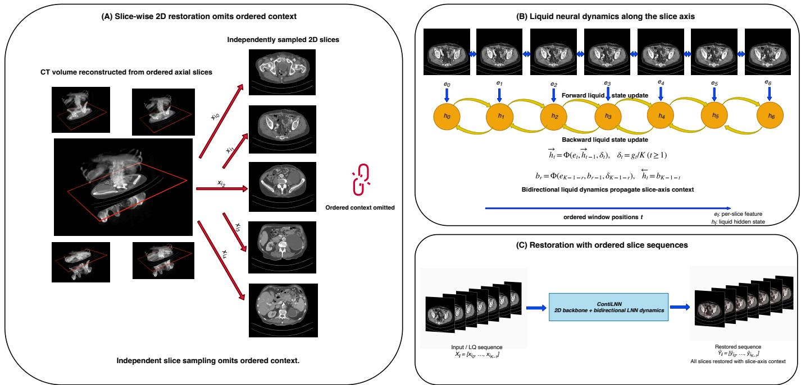  
Figure 1: Ordered-slice restoration with ContiLNN. (A) Independent 2D processing. (B) Bidirectional liquid propagation. (C) One restored output per observed slice. Original slice indices it identify the K inputs xi and outputs byi ; t denotes window position. The direction-specific closed-form continuous-time (CfC) update Φ propagates states ht using features et and normalized intervals δt derived from gaps gt. The backward traversal state br is realigned to the original order; interval conventions and alignment are defined in Eqs. 4 and 10.

Local 2.5D modeling combines in-plane feature extraction with information from neighboring slices. Three-dimensional (3D) restoration networks instead model context through volumetric feature maps, as in convolutional models for MRI superresolution (Chatterjee et al., 2024) and Spach Transformer for PET denoising (Jang et al., 2024). Storage for these feature maps scales with their spatial extent and channel width. Neighboring CT slices have also been incorporated into convolutional encoder–decoders (Shan et al., 2018). Adjacentslice supervision and multi-view inference provide further ways to use through-plane information (Zhang et al., 2021; Chen et al., 2025). These approaches establish several roles for local anatomical context. ContiLNN represents this context as an evolving sequence of feature states, with an explicit slice-index interval and a restored output at every supplied position.

Liquid neural networks provide a continuous-time model of input-dependent state evolution (Hasani et al., 2021). Closedform continuous-time networks (CfCs) approximate this evolution through interval-dependent updates without repeated numerical integration (Hasani et al., 2022). Their explicit interval input is particularly relevant when the separation between observations varies. For medical image restoration, we propagate states in slice order and condition each update on a normalized slice-index interval. Forward and backward states then communicate information between preceding and following observations (Fig. 1B). This links the anatomical ordering of the input to the dynamics used to refine its features.

Here we introduce ContiLNN, which augments 2D restoration backbones with bidirectional liquid dynamics along the slice axis. Each local sequence retains the correspondence between its input slices and restored outputs (Fig. 1C). Bidirectional CfC (Bi-CfC) modules propagate context at selected levels of the feature hierarchy, while two complementary regularizers guide the resulting images: cross-slice consistency preserves first- and second-order intensity changes in the HQ sequence, and distillation from a frozen 2D backbone retains agreement with its in-plane estimates. We develop this design on Restore-RWKV (Yang et al., 2026a) and apply it to DAS-Mamba (Chan et al., 2026) to examine compatibility with a second backbone.

Our contributions are threefold:

1. Liquid dynamics for medical image restoration. We introduce ContiLNN to propagate anatomical information across ordered slices through bidirectional liquid dynamics. Slice-index intervals condition the closed-form updates, allowing state propagation to respond to sampling changes.

2. Augmentation of 2D restoration backbones. Bi-CfC modules refine selected feature pathways while retaining the backbone’s in-plane blocks. Cross-slice intensity consistency and 2D backbone distillation jointly preserve reference anatomical variation and in-plane fidelity.

3. Evaluation across modalities and sampling settings. CT, MRI and PET experiments assess restoration quality. Case-level analyses, comparisons of two operators under regular, sparse and irregular sampling, limited-patient training, backbone studies and ablations assess sampling adaptation, data eficiency and backbone compatibility.

## 2. Related work

## 2.1. Medical image restoration

Learning-based restoration has progressed from local residual prediction to eficient modeling of long-range image structure. Convolutional restoration networks learn local image priors from paired images or neighboring observations (Shan et al., 2018; Zhang et al., 2021). Transformer models extend the spatial reach of these representations through attention, improving the recovery of fine structures and long-range dependencies (Liang et al., 2021; Zamir et al., 2022). RWKV combines recurrent inference with parallelizable training, and its visual adaptations provide another route to eficient spatial modeling (Peng et al., 2023; Duan et al., 2025). MambaIR, DenoMamba, CT-Mamba, Restore-RWKV and DASMamba apply state-space or recurrent-style representations to natural and medical image restoration (Gu and Dao, 2024; Guo et al., 2025; Öztürk et al., 2026; Li et al., 2025; Yang et al., 2026a; Chan et al., 2026). These methods supply the in-plane feature hierarchies on which ContiLNN builds. Whereas our previous work FedFTN (Zhou et al., 2023) addresses institutional heterogeneity through personalized federated learning for low-count PET denoising, ContiLNN models cross-slice anatomical context through interval-conditioned bidirectional liquid dynamics for CT, MRI, and PET restoration.

## 2.2. Slice-axis context

The choice of spatial representation determines how neighboring slices contribute to a prediction. Slice-wise networks are compatible with high-resolution images, whereas volumetric networks directly couple in-plane and through-plane structure. Anisotropic sampling complicates this balance because a fixed number of neighboring slices can span substantially different anatomical extents (Dong et al., 2022). Consequently, slice count alone does not describe the context available to a model; the sampling intervals also matter.

Restoration methods use through-plane information in several distinct ways. Hybrid 2D/3D convolution can aggregate neighboring CT slices for center-slice denoising (Shan et al., 2018), while volumetric MRI networks learn features across all three spatial axes for super-resolution (Chatterjee et al., 2024). Other approaches use adjacent slices as training supervision or combine predictions from multiple views (Zhang et al., 2021; Chen et al., 2025). Slice-based reconstruction addresses a related problem by recovering volumes or anatomical surfaces from sparse observations (Xu et al., 2023; Xiao et al., 2025). ContiLNN maintains an ordered feature sequence and restores every supplied slice. Its interval inputs are derived from the original index gaps between selected observations, allowing feature updates to respond to both local image content and the sampling of neighboring context.

## 2.3. Liquid neural dynamics

Continuous-time models describe how a hidden representation evolves between observations. Neural ordinary diferential equations (ODEs) express this evolution through a learned vector field (Chen et al., 2018), while latent ODE models provide continuous-time latent representations for irregularly observed sequences (Rubanova et al., 2019). Liquid time-constant networks introduce input-dependent dynamics, allowing the effective transition to vary with the observation (Hasani et al., 2021). CfCs approximate these dynamics with closed-form updates that retain an explicit dependence on the supplied interval (Hasani et al., 2022).

This dependence ofers a useful connection between continuous-time modeling and slice sampling. An update can respond to a larger index gap without treating it as the same transition as two consecutive slices. ContiLNN applies this principle to dense features at corresponding in-plane locations, with two directions of propagation supplying complementary anatomical context. We evaluate Bi-CfC across sparse and irregular neighboring contexts after contiguous training, and investigate mixed-gap training separately as a way to broaden exposure to sampling variations.

## 2.4. Consistency and distillation

Consistency regularization encourages agreement under input or model perturbations (Tarvainen and Valpola, 2017; Laine and Aila, 2017), while knowledge distillation transfers information through predictions from a reference model (Hinton et al., 2015). In restoration, these constraints complement direct fidelity to the reference image. For an ordered slice sequence, neighboring reference images need not have identical intensities: anatomical boundaries and uptake patterns can change substantially with position. We therefore match the first- and second-order diferences of restored and reference sequences. A separate 2D backbone distillation term encourages agreement with predictions from a frozen, pretrained 2D backbone. These two forms of regularization preserve useful in-plane estimates while learning the additional information supplied by neighboring slices.

## 3. Method

## 3.1. Ordered-slice restoration

ContiLNN restores a local sequence of observed slices while preserving their positional correspondence. Let $X = \{ x _ { i } \} _ { i = 1 } ^ { N }$ denote an LQ volume with N ordered slices and $Y = \{ y _ { i } \} _ { i = 1 } ^ { N }$ its HQ reference. A local window contains $K \leq T$ slices, where T is the maximum window length. Its increasing original indices are $\pmb { i } = ( i _ { 0 } , \dots , i _ { K - 1 } )$ , and its paired input and reference sequences are

$$
\begin{array} { l } { X _ { i } = [ x _ { i _ { 0 } } , \dots , x _ { i _ { K - 1 } } ] , } \\ { Y _ { i } = [ y _ { i _ { 0 } } , \dots , y _ { i _ { K - 1 } } ] . } \end{array}\tag{1}
$$

The model learns ${ \mathcal { F } } _ { \theta } : X _ { i } \mapsto { \widehat { Y } } _ { i }$ , where θ denotes its trainable parameters and $\widehat { Y } _ { i } = [ \widehat { y _ { i _ { 0 } } } , \ldots , \widehat { y _ { i _ { K - 1 } } } ]$ contains one restored image for each input position. Every output receives direct supervision from the corresponding HQ slice.

The slice-index gap specifies the sampling interval between consecutive observations in the window:

$$
g _ { t } = i _ { t } - i _ { t - 1 } , \qquad t = 1 , \dots , K - 1 .\tag{2}
$$

Fixed gaps of one, two and three select consecutive slices, every second slice and every third slice, respectively. Indices are retained from the source series before slice selection rather than reassigned consecutively afterwards. For example, available slices with indices [1 3 5 7] have successive gaps (2 2 2), whereas indices [1 2 3 5 6] give gaps (1 1 2 1). These gaps describe the separation between available observations in the original index sequence. ContiLNN restores each supplied slice at its corresponding position.

## 3.2. Bidirectional liquid dynamics

The bidirectional closed-form continuous-time module, denoted Bi-CfC, is the slice-axis operator of ContiLNN (Fig. 2B). Its hidden state propagates over ordered slice features, with an explicit interval input associated with each observation. The continuous-time formulation motivating this operator represents state evolution as

$$
\frac { \mathrm { d } h ^ { l } ( q ) } { \mathrm { d } q } = G _ { \theta } ^ { l } ( h ^ { l } ( q ) , e ^ { l } ( q ) ) ,\tag{3}
$$

where $q$ is a continuous evolution coordinate, l indexes a feature level, $h ^ { l }$ is its hidden state, $e ^ { l }$ is the input feature and $G _ { \theta } ^ { l }$ is a learned vector field. CfC develops interval-dependent neural transitions from an approximate closed-form treatment of liquid dynamics (Hasani et al., 2022). Based on this approximation, we use the default gated CfC parameterization to evaluate the state directly from the current feature, incoming state and supplied interval, without a numerical ODE solver.

We distinguish position within a window from the interval supplied to the dynamics. The index gaps are normalized by the actual number of observations K to obtain the interval inputs defined below. For $K > 1$ , the within-window position and interval input are

$$
p _ { t } = \frac { t } { K - 1 } , \qquad \delta _ { t } = \left\{ g _ { 1 } / K , \quad t = 0 , \right. \qquad\tag{4}
$$

The normalization uses the actual number of observations $K ,$ including short windows. Under fixed-gap sampling, every observation receives $g / K ;$ ; contiguous input gives $1 / K .$ . The position $p _ { t }$ specifies relative order, whereas $\delta _ { t }$ supplies the slice-index interval attached to the current observation. Both branches preserve this feature–interval pairing. The single-slice boundary convention is specified in Supplementary Section A.

At each in-plane location, let $f _ { t } ^ { l } \in \mathbb { R } ^ { C _ { l } }$ be the channel vector of slice $i _ { t } ,$ where $C _ { l }$ is the feature width. A learned afine position projection $P _ { \mathrm { p o s } } ^ { l }$ gives

$$
e _ { t } ^ { l } = f _ { t } ^ { l } + P _ { \mathrm { p o s } } ^ { l } ( p _ { t } ) .\tag{5}
$$

The embedded feature $e _ { t } ^ { l }$ retains the original observation’s within-window position in both traversal directions. The resulting feature and interval are supplied together to the directional cell.

The cell first forms a joint representation of the current feature and incoming state. For one feature level and direction, suppress the superscripts and write $C = C _ { l }$ and $M = M _ { l }$ , where $M _ { l }$ is the width of the cell’s internal feature network. With $e _ { t } , h _ { t - 1 } \in \mathbb { R } ^ { C }$ , the joint representation and candidate states are

$$
\begin{array} { r l r } & { \ z _ { t } = \rho ( W _ { z } [ e _ { t } ; h _ { t - 1 } ] + \nu _ { z } ) , } & \\ & { \ C _ { t } ^ { ( j ) } = \operatorname { t a n h } ( W _ { j } z _ { t } + \nu _ { j } ) , \quad } & { j \in \{ 1 , 2 \} . } \end{array}\tag{6}
$$

Here $[ \cdot ; \cdot ]$ denotes channel concatenation, $W _ { z } ~ \in ~ \mathbb { R } ^ { M \times 2 C }$ and $\nu _ { z } \in \mathbb { R } ^ { M }$ are learned parameters, and $\rho$ is the scaled hyperbolictangent activation specified in Supplementary Section A. Thus, $z _ { t } ~ \in ~ \mathbb { R } ^ { M }$ combines present image content with the recurrent context. Each candidate head has weights $W _ { j } \in \mathbb { R } ^ { C \times M }$ and bias $\nu _ { j } \in \mathbb { R } ^ { C }$ , producing $c _ { t } ^ { ( j ) } \in ( - 1 , 1 ) ^ { C }$ . The internal width M is distinct from the recurrent-state width $C .$

Two further afine heads determine how the supplied interval modulates the mixture:

$$
\begin{array} { r l } & { { \eta _ { t } } = Q _ { a } ( z _ { t } ) = W _ { a } z _ { t } + \nu _ { a } , } \\ & { { \xi _ { t } } = Q _ { b } ( z _ { t } ) = W _ { b } z _ { t } + \nu _ { b } , } \\ & { { \alpha _ { t } } = \sigma ( \delta _ { t } \eta _ { t } + \xi _ { t } ) . } \end{array}\tag{7}
$$

The matrices $W _ { a } , W _ { b } \in \mathbb { R } ^ { C \times M }$ and biases $\nu _ { a } , \nu _ { b } \in \mathbb { R } ^ { C }$ are learned independently of the candidate heads. The vectors $\eta _ { t }$ and $\xi _ { t }$ are the interval coeficient and intercept, respectively; the scalar $\delta _ { t }$ is broadcast across channels. The elementwise sigmoid $\sigma$ yields $\alpha _ { t } \in ( 0 , 1 ) ^ { C }$ . Because the afine coeficient $\eta _ { t }$ can take either sign, diferent feature channels can respond diferently to a larger interval.

The updated state is a channelwise convex combination of the two candidates:

$$
\begin{array} { r } { h _ { t } = ( 1 - \alpha _ { t } ) \odot c _ { t } ^ { ( 1 ) } + \alpha _ { t } \odot c _ { t } ^ { ( 2 ) } } \\ { = c _ { t } ^ { ( 1 ) } + \alpha _ { t } \odot ( c _ { t } ^ { ( 2 ) } - c _ { t } ^ { ( 1 ) } ) . } \end{array}\tag{8}
$$

Here ⊙ denotes the elementwise product. Each state channel lies between its two candidate values, keeping the directional hidden state in $( - 1 , 1 ) ^ { C }$ before the subsequent afine feature projection. We denote the complete transition in Eqs. 6–8 by $\Phi _ { \theta } ( e _ { t } , h _ { t - 1 } , \delta _ { t } )$ . Both candidates depend on $h _ { t - 1 }$ , allowing the update to retain information from previously visited observations.

The gate provides an explicit, content-dependent response to sampling. Holding the incoming feature $e _ { t }$ and state $h _ { t - 1 }$ fixed gives

$$
\begin{array} { r l r } & { \displaystyle \frac { \partial h _ { t } } { \partial \delta _ { t } } = \alpha _ { t } \odot ( 1 - \alpha _ { t } ) \odot \eta _ { t } \odot ( c _ { t } ^ { ( 2 ) } - c _ { t } ^ { ( 1 ) } ) , } & \\ & { \displaystyle \left| \frac { \partial h _ { t } } { \partial \delta _ { t } } \right| \le \frac { 1 } { 4 } | \eta _ { t } | \odot \big | c _ { t } ^ { ( 2 ) } - c _ { t } ^ { ( 1 ) } \big | . } & \end{array}\tag{9}
$$

Absolute values and the inequality are elementwise. The derivative isolates the direct response to the interval from changes carried through the recurrent state: its sign and magnitude depend on the learned coeficient, gate and candidate separation. The model therefore adapts its state update to the supplied sampling interval and local features while retaining algebraic evaluation of each transition.

Independent forward and backward cells apply this transition to the ordered sequence. Let $r = 0 , \ldots , K - 1$ index backward traversal, and let $b _ { r } ^ { l }$ be its recurrent state. The recurrences and alignment to the original positions are

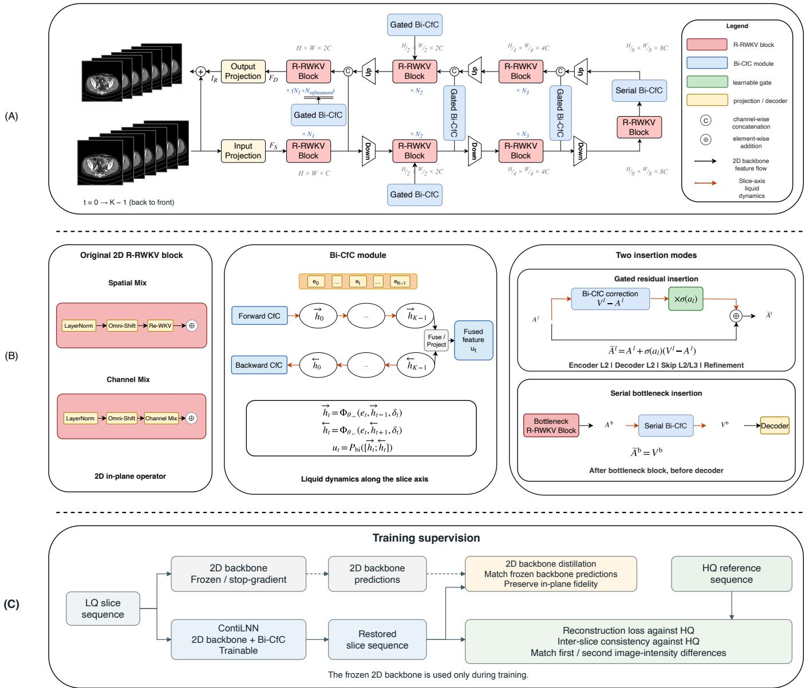  
Figure 2: ContiLNN architecture based on Restore-RWKV (Yang et al., 2026a). (A) Bi-CfC modules augment selected feature pathways; the paired CT sequences show the same seven observed positions, ordered back to front. (B) Backbone blocks, the bidirectional liquid operator, and gated residual or serial insertion. Reverse traversal preserves feature–interval pairing $( \mathrm { E q . }$ 10). (C) Training supervision. High-quality references supervise reconstruction and first- and second-order interslice intensity diferences. A frozen 2D backbone supplies single-slice predictions for distillation during training; the ContiLNN backbone and Bi-CfC modules remain trainable.

$$
\begin{array} { r l } & { \overrightarrow { h } _ { t } ^ { l } = \Phi _ { \theta _ { - } } ^ { l } ( e _ { t } ^ { l } , \overrightarrow { h } _ { t - 1 } ^ { l } , \delta _ { t } ) , } \\ & { b _ { r } ^ { l } = \Phi _ { \theta _ { - } } ^ { l } ( e _ { K - 1 - r } ^ { l } , b _ { r - 1 } ^ { l } , \delta _ { K - 1 - r } ) , } \\ & { \overleftarrow { h } _ { t } ^ { l } = b _ { K - 1 - t } ^ { l } . } \end{array}
$$

Here $\theta _ { - }$ and $\theta _ {  }$ are separate parameter sets for the same cell architecture, with initial states ${ \vec { h } } _ { - 1 } ^ { l } = b _ { - 1 } ^ { l } = 0$ . Reversing the feature–interval pairs preserves $e _ { t } ^ { l }$ and $\delta _ { t }$ at original position t. For irregular inputs, $\delta _ { t }$ is a sampling descriptor associated with observation $t ;$ the index separation to position $t + 1$ would instead correspond to $\delta _ { t + 1 }$ . The implemented backward branch retains the observation-specific descriptor. An example of this pairing is provided in Supplementary Section A.

An afine projection fuses the two states aligned at each original position:

(10)

$$
\begin{array} { r l } & { u _ { t } ^ { l } = P _ { \mathrm { b i } } ^ { l } ( [ \overrightarrow { h } _ { t } ^ { l } ; \overleftarrow { h } _ { t } ^ { l } ] ) } \\ & { \quad = W _ { \mathrm { b i } } ^ { l } [ \overrightarrow { h } _ { t } ^ { l } ; \overleftarrow { h } _ { t } ^ { l } ] + \nu _ { \mathrm { b i } } ^ { l } . } \end{array}\tag{11}
$$

The learned weights $W _ { \mathrm { b i } } ^ { l } \in \mathbb { R } ^ { C _ { l } \times 2 C _ { l } }$ and bias $\nu _ { \mathrm { b i } } ^ { l } \in \mathbb { R } ^ { C _ { l } }$ return a refined vector $u _ { t } ^ { l } \in \mathbb { R } ^ { \breve { C } _ { l } }$ . Each output thus combines preceding and following observations at the same slice position before being returned to the backbone’s feature layout.

## 3.3. Backbone augmentation

Bi-CfC acts on slice sequences extracted from an otherwise two-dimensional feature hierarchy. The R-RWKV block is the original in-plane building block of Restore-RWKV: its omnidirectional token shift (Omni-Shift) aggregates local spatial information, and its recurrent WKV attention (Re-WKV) models longer-range dependencies across in-plane scan directions (Yang et al., 2026a). ContiLNN retains these operations and adds Bi-CfC at selected feature pathways (Fig. 2A,B). For a batch of B windows, let $A ^ { l }$ be the backbone feature tensor with spatial dimensions $H _ { l } \times W _ { l }$ . A rearrangement $\mathcal { R } _ { l }$ exposes the ordered channel vectors at each spatial location:

$$
\begin{array} { r l r } {  { A ^ { l } \in \mathbb { R } ^ { B K \times C _ { l } \times H _ { l } \times W _ { l } } \xrightarrow { \mathcal { R } _ { l } } F ^ { l } \in \mathbb { R } ^ { B H _ { l } W _ { l } \times K \times C _ { l } } , } } \\ & { } & { \quad U ^ { l } = \Psi _ { l } ( F ^ { l } , \delta ) , \qquad V ^ { l } = \mathcal { R } _ { l } ^ { - 1 } ( U ^ { l } ) . } \end{array}\tag{12}
$$

Here $U ^ { l }$ is the processed feature sequence and $V ^ { l }$ its restored 2D layout. The rearrangement separates the batch and slice dimensions before grouping the batch and spatial locations. The operator $\Psi _ { l }$ applies the position embedding, bidirectional updates and fusion in Eqs. 5–11; δ contains the K interval inputs. The same operator is shared across in-plane locations, and $\mathcal { R } _ { l } ^ { - 1 }$ restores the original tensor layout.

The two insertion modes have complementary roles. ${ \mathrm { S e } } { \mathrm { - } }$ rial insertion introduces sequence information at the bottleneck before decoding; gated residual insertion learns the correction strength along the remaining selected pathways (Fig. 2B):

$$
\widetilde { A } ^ { l } = \left\{ \begin{array} { l l } { V ^ { l } , } & { l \in S _ { \mathrm { b } } , } \\ { A ^ { l } + \sigma ( a _ { l } ) ( V ^ { l } - A ^ { l } ) , } & { l \in S _ { \mathrm { g } } , } \\ { A ^ { l } , } & { l \notin S _ { \mathrm { b } } \cup S _ { \mathrm { g } } . } \end{array} \right.\tag{13}
$$

Here $S _ { \mathrm { b } }$ and $S _ { \mathrm { g } }$ identify the bottleneck and gated pathways, a is a learnable scalar gate logit, and $\sigma$ is the sigmoid function. Subsequent backbone blocks process $\widetilde { A } ^ { l }$ in their original 2D layout.

Restore-RWKV supplies the principal backbone, with Bi-CfC augmenting its intermediate encoder and decoder blocks, selected skips, bottleneck and late refinement pathway. The same insertion roles are applied to DASMamba to examine backbone compatibility. Supplementary Section A reports the representative Restore-RWKV topology and module settings. This design enables slice-axis modeling within existing feature hierarchies while keeping sequence propagation local to one patient or scan.

The selected pathways address diferent stages of restoration. Intermediate encoder and decoder features provide reducedresolution representations that retain local structure for crossslice exchange. Skip-path modules carry this context from encoding to decoding, while serial bottleneck processing makes the deepest representation sequence-aware before upsampling. The late refinement pathway supplies a final contextual correction. Gates regulate the contribution of the transformed sequence features along the remaining pathways, allowing their strength to be learned jointly with the in-plane backbone.

## 3.4. Training objective

The training objective combines reconstruction, cross-slice consistency and 2D backbone distillation (Fig. 2C). ContiLNN restores each input sequence, while a frozen copy of the pretrained 2D backbone processes the same slices independently to provide distillation targets. Paired HQ images supervise reconstruction and cross-slice intensity diferences; the frozen backbone predictions guide preservation of in-plane fidelity. Gradients update the ContiLNN backbone and Bi-CfC modules, but do not pass through the frozen backbone, which is used only during training. The resulting objective is

$$
\begin{array} { r } { \mathcal { L } = \mathcal { L } _ { \mathrm { r e c } } + \lambda _ { \mathrm { c o n s } } \mathcal { L } _ { \mathrm { c o n s } } + \lambda _ { \mathrm { K D } } \mathcal { L } _ { \mathrm { K D } } , } \end{array}\tag{14}
$$

where $\lambda _ { \mathrm { c o n s } }$ and $\lambda _ { \mathrm { K D } }$ weight cross-slice consistency and 2D backbone distillation. For the Restore-RWKV backbone,

$$
\begin{array} { l } { \displaystyle \mathcal { L } _ { \mathrm { r e c } } = \frac { 1 } { K } \sum _ { t = 0 } ^ { K - 1 } \| \widehat { y } _ { i _ { t } } - y _ { i _ { t } } \| _ { 1 } , } \\ { \displaystyle \mathcal { L } _ { \mathrm { K D } } = \frac { 1 } { K } \sum _ { t = 0 } ^ { K - 1 } \| \widehat { y } _ { i _ { t } } - \overline { { y } } _ { i _ { t } } \| _ { 1 } , } \end{array}\tag{15}
$$

where $\Vert \cdot \Vert _ { 1 }$ denotes mean absolute error over image pixels and $\overline { { y } } _ { i _ { t } }$ is the prediction of the frozen 2D backbone for $x _ { i _ { t } }$ . The ContiLNN backbone and Bi-CfC parameters remain trainable. For DASMamba, its native reconstruction penalties are retained within $\mathcal { L } _ { \mathrm { r e c } }$ , while the remaining workflow follows ContiLNN-RWKV.

Cross-slice consistency follows anatomical change in the reference sequence. Define the first and second finite diferences as

$$
\begin{array} { l } { { D _ { 1 } y _ { t } = y _ { i _ { t + 1 } } - y _ { i _ { t } } , } } \\ { { D _ { 2 } y _ { t } = y _ { i _ { t + 1 } } - 2 y _ { i _ { t } } + y _ { i _ { t - 1 } } , } } \end{array}\tag{16}
$$

with identical definitions for predictions. The consistency objective is

$$
\begin{array} { r l } & { \mathcal { L } _ { \mathrm { c o n s } } = \mathcal { L } _ { \mathrm { c o n s } } ^ { ( 1 ) } + \beta _ { 2 } \mathcal { L } _ { \mathrm { c o n s } } ^ { ( 2 ) } , } \\ & { \mathcal { L } _ { \mathrm { c o n s } } ^ { ( 1 ) } = \displaystyle \frac { 1 } { K - 1 } \sum _ { t = 0 } ^ { K - 2 } \| D _ { 1 } \widehat { y _ { t } } - D _ { 1 } y _ { t } \| _ { 1 } , } \\ & { \mathcal { L } _ { \mathrm { c o n s } } ^ { ( 2 ) } = \displaystyle \frac { 1 } { K - 2 } \sum _ { t = 1 } ^ { K - 2 } \| D _ { 2 } \widehat { y _ { t } } - D _ { 2 } y _ { t } \| _ { 1 } , } \end{array}\tag{17}
$$

where $\beta _ { 2 }$ weights second-order changes. The corresponding term is zero when a short window contains too few slices to evaluate its diference. These are finite diferences over the observed sequence, including any index gaps. The first-order term matches the intensity change between successive observations; the second-order term matches how this change varies across the local sequence. Equivalently, defining the restoration error as $r _ { t } = \widehat { y } _ { i _ { t } } - y _ { i _ { t } }$ gives

$$
\begin{array} { r } { D _ { 1 } \widehat { y _ { t } } - D _ { 1 } y _ { t } = D _ { 1 } r _ { t } , } \\ { D _ { 2 } \widehat { y _ { t } } - D _ { 2 } y _ { t } = D _ { 2 } r _ { t } . } \end{array}\tag{18}
$$

The penalties thus constrain inter-slice variation in restoration error while retaining the anatomical changes encoded by the reference. Reconstruction anchors the absolute intensity of each output, and distillation retains agreement with the pretrained in-plane estimate. Numerical weights are listed in Supplementary Section A.

## 3.5. Inference

Restoration covers the full set of observed slices through local, case-specific windows. Training retains short terminal windows, and inference combines predictions from overlapping window tilings. For slice i, let $\mathcal { W } ( i )$ be the set of windows that contain it and $\widehat { y } _ { i } ^ { ( w ) }$ the prediction from window w. The fused output is

$$
\widehat { y _ { i } } = \frac { 1 } { \vert \mathcal { W } ( i ) \vert } \sum _ { w \in \mathcal { W } ( i ) } \widehat { y } _ { i } ^ { ( w ) } .\tag{19}
$$

Here $| \mathcal { W } ( i ) |$ is the number of windows covering slice i. Outputs are returned to their original slice order. The tilings retain every eligible real slice, and each hidden state is initialized within its own window. The window length and tiling ofsets are specified in Supplementary Section A. Sparse and irregular context use the same position-aligned output principle, allowing the sampling experiments to change contextual support while retaining the evaluated images.

## 4. Experiments

## 4.1. Datasets

We evaluate anatomical restoration across three modalities with distinct degradations: CT denoising, MRI super-resolution and reduced-count PET restoration. The case-disjoint partitions and preprocessing follow the established restoration benchmarks (Yang et al., 2026a; Chan et al., 2026). Low-quality (LQ) and high-quality (HQ) images denote the degraded input and paired reference, respectively.

The CT benchmark derives from the ten-patient training set released for the American Association of Physicists in Medicine (AAPM) Low Dose CT Grand Challenge, which provides paired quarter-dose and normal-dose images (McCollough et al., 2017). The training, validation and test partitions contain eight, one and one patients, respectively, with 2,039, 128 and 211 slices. Quarter-dose images serve as inputs and normal-dose images as references.

For MRI, we use T2-weighted images from IXI (IXI Project, n.d.). The source allocation is 405/59/114 subjects for training/validation/testing, yielding 40,500/5,828/11,400 available slices; the validation reader supplies 58 readable subjects, as detailed in Supplementary Section A. LQ images are reconstructed after retaining the central 6.25% of two-dimensional k-space, corresponding to four-fold degradation along each inplane axis. The slice-axis sampling is retained in this superresolution task.

The PET cohort comprises 159 scans acquired with a PolarStar m660 system, originating from the dataset described by Yang et al. (2024). The training, validation and test partitions contain 120, ten and 29 scans, respectively. After exclusion of air-only slices, these partitions contain 8,350/684/2,044 paired images. Reduced-count inputs are generated from list-mode data with a reduction factor of 12. Modality-specific intensity normalization and evaluation windows are specified in Supplementary Section A.

## 4.2. Experimental setup

We reproduce the 2D backbones using their released training procedures and initialize ContiLNN from the checkpoint with the highest validation score. A frozen copy of the corresponding backbone supplies predictions for 2D backbone distillation, while the ContiLNN backbone and Bi-CfC modules are trained jointly. As illustrated in Fig. 2, the architecture augments inplane feature extraction with slice-axis propagation and uses the frozen backbone only to guide training. Contiguous slice windows are used for the principal restoration results in Table 1 and the operator comparisons in Tables 2 and 5; mixed-gap training is investigated separately in Supplementary Section H. The representative ContiLNN-RWKV optimization settings, window configurations and loss weights are collected in Supplementary Section A, together with the common workflow used for DAS-Mamba.

Restoration quality is measured using peak signal-to-noise ratio (PSNR), the structural similarity index measure (SSIM) (Wang et al., 2004), and root mean squared error (RMSE). Metrics are calculated in the modality’s restored intensity scale, averaged within each patient or scan, and then averaged across cases with equal weight. ContiLNN estimates in Table 1 are means and sample standard deviations (SDs) across five training seeds. Case-level statistical analyses are presented separately below. CT results describe the single held-out patient in its benchmark partition.

## 4.3. Quantitative results

Ordered slice-axis modeling improves fidelity across the three evaluated restoration tasks (Table 1). Relative to Restore-RWKV, mean PSNR increases by 0.1907, 1.0176 and 1.2482 dB on CT, MRI and PET, respectively, accompanied by higher SSIM and lower RMSE. The agreement across these metrics connects the use of neighboring anatomy with improved intensity accuracy and structural fidelity. On the held-out CT patient, the improvement is consistent across training seeds, with a PSNR SD of 0.0026 dB.

The improvements persist across the observed seed variation. Every ContiLNN-RWKV training seed yields higher PSNR and SSIM and lower RMSE than the baseline in each modality. At one SD below the mean, PSNR remains 0.19, 0.99 and 1.15 dB above the baseline for CT, MRI and PET, respectively. This separation indicates that the benefit of neighboring anatomical context is maintained across the evaluated initializations.

Integration with DASMamba supports the use of slice-axis dynamics with a second in-plane representation. Mean PSNR increases by 0.1934, 0.3604 and 1.1264 dB on CT, MRI and PET, respectively, with corresponding RMSE reductions of 0.1817, 1.0886 and 0.0095 (Table 1). PET also improves in SSIM, while the CT and MRI SSIM estimates are lower than those of their DASMamba baselines by 0.0051 and 0.0050, respectively. The consistent PSNR and RMSE improvements across both backbones support architectural compatibility, with the accompanying SSIM diferences retained in the paired results.

Table 1: Restoration results for MRI super-resolution, CT denoising and reduced-count PET restoration. Published reference results in the upper and lower blocks follow the Restore-RWKV and DASMamba studies, respectively (Yang et al., 2026a; Chan et al., 2026); the upper published block uses joint training across the three modalities. In the lower published block, ∗ marks methods re-implemented by the DASMamba authors. Each block ends with the corresponding backbone reproduced separately for each modality and its ContiLNN counterpart. The reproduced backbones use single-slice (2D) input, whereas ContiLNN uses local ordered-slice (2.5D) input. ContiLNN values are mean±sample standard deviation across five training seeds. Bold values indicate improvements over the corresponding reproduced backbone within each block. PSNR is reported in dB.
<table><tr><td rowspan="2">Method</td><td colspan="3">MRI super-resolution</td><td colspan="3">CT denoising</td><td colspan="3">PET restoration</td></tr><tr><td>PSNR ↑</td><td>SSIM↑</td><td>RMSE↓</td><td>PSNR ↑</td><td>SSIM ↑</td><td>RMSE↓</td><td>PSNR ↑</td><td>SSIM ↑</td><td>RMSE↓</td></tr><tr><td>Published reference results: Restore-RWKV study</td><td></td><td></td><td></td><td></td><td></td><td></td><td></td><td></td><td></td></tr><tr><td>ARGAN (Luo et al., 2022)</td><td>30.0800</td><td>0.9083</td><td>35.7999</td><td>32.9200</td><td>0.9111</td><td>9.2110</td><td>36.7500</td><td>0.9389</td><td>0.0907</td></tr><tr><td>DenoMamba (Öztürk et al., 2026)</td><td>30.3200</td><td>0.9091</td><td>34.6972</td><td>33.1800</td><td>0.9115</td><td>8.9512</td><td>36.8100</td><td>0.9367</td><td>0.0895</td></tr><tr><td>MambaIR (Guo et al., 2025)</td><td>31.3100</td><td>0.9305</td><td>31.3150</td><td>33.5000</td><td>0.9165</td><td>8.6345</td><td>37.1700</td><td>0.9458</td><td>0.0864</td></tr><tr><td>AirNet (Li et al., 2022)</td><td>31.3900</td><td>0.9316</td><td>31.1141</td><td>33.6200</td><td>0.9176</td><td>8.5226</td><td>37.1700</td><td>0.9451</td><td>0.0864</td></tr><tr><td>DRMC (Yang et al., 2023)</td><td>29.5500</td><td>0.9032</td><td>38.1691</td><td>33.2800</td><td>0.9153</td><td>8.8674</td><td>36.1900</td><td>0.9376</td><td>0.0960</td></tr><tr><td>AMIR (Yang et al., 2024)</td><td>32.0300</td><td>0.9396</td><td>29.0988</td><td>33.7000</td><td>0.9182</td><td>8.4520</td><td>37.1200</td><td>0.9475</td><td>0.0876</td></tr><tr><td>Restore-RWKV routing (Yang et al., 2026a)</td><td>32.1000</td><td>0.9408</td><td>28.9507</td><td>33.7400</td><td>0.9189</td><td>8.4148</td><td>37.3200</td><td>0.9479</td><td>0.0852</td></tr><tr><td>Restore-RWKV (reproduced) (Yang et al., 2026a)</td><td>32.0650</td><td>0.9403</td><td>29.0337</td><td>33.7642</td><td>0.9189</td><td>8.3950</td><td>37.2722</td><td>0.9474</td><td>0.0860</td></tr><tr><td>ContiLNN-RWKV (ours)</td><td colspan="9">33.0826±0.0261 0.9485±0.0003 25.9882±0.0809 33.9549±0.0026 0.9208±0.0003 8.2132±0.0030 38.5204±0.0938 0.9535±0.0013 0.0752±0.0009</td></tr><tr><td>Published reference results: DASMamba study</td><td></td><td></td><td></td><td></td><td></td><td></td><td></td><td></td><td></td></tr><tr><td>NAFNet* (Chen et al., 2022)</td><td>31.9078</td><td>0.9376</td><td>29.5394</td><td>33.7848</td><td>0.9200</td><td>8.3742</td><td>37.2672</td><td>0.9453</td><td>0.0859</td></tr><tr><td>CODEFormer* (Zhou et al., 2022)</td><td>31.8879</td><td>0.9371</td><td>29.5584</td><td>33.8066</td><td>0.9203</td><td>8.3532</td><td>37.2846</td><td>0.9448</td><td>0.0856</td></tr><tr><td>XFormer* (Zhang et al., 2024)</td><td>31.9122</td><td>0.9373</td><td>29.4700</td><td>33.7610</td><td>0.9200</td><td>8.3947</td><td>37.2542</td><td>0.9450</td><td>0.0859</td></tr><tr><td>Histoformer* (Sun et al., 2025)</td><td>31.9210</td><td>0.9378</td><td>29.4177</td><td>33.8115</td><td>0.9206</td><td>8.3480</td><td>37.3628</td><td>0.9472</td><td>0.0850</td></tr><tr><td>VmambaIR* (Shi et al., 2025) DASMamba-S (Chan et al., 2026)</td><td>31.9277</td><td>0.9380</td><td>29.3439</td><td>33.7627 33.7948</td><td>0.9203</td><td>8.3943</td><td>37.3673</td><td>0.9468</td><td>0.0847</td></tr><tr><td></td><td>31.7919</td><td>0.9355</td><td>29.8132</td><td></td><td>0.9202</td><td>8.3646</td><td>37.2895</td><td>0.9460</td><td>0.0857</td></tr><tr><td>DASMamba (reproduced) (Chan et al., 2026) ContiLNN-DASMamba (ours)</td><td>32.1426</td><td>0.9450 32.5030±0.0438 0.9400±0.0016 27.5955±0.1229</td><td>28.6841</td><td>33.8374 34.0308±0.0163 0.9219±0.00038.1445±0.0142 38.4796±0.1090 0.9519±0.0014 0.0754±0.0007</td><td>0.9270</td><td>8.3262</td><td>37.3532</td><td>0.9395</td><td>0.0849</td></tr></table>

Table 2: Bi-CfC and Bi-GRU under contiguous training on the 29-case PET test cohort. Both variants use the same insertion sites, objective and training budget. The slice-index gap g specifies the separation between neighboring observations; irregular windows mix $g \in \{ 1 , 2 , 3 \}$ . All settings evaluate the same original target slices with diferent neighboring context. Bold indicates the better operator within each test condition.
<table><tr><td>Test context</td><td>Slice-axis operator</td><td>PSNR ↑</td><td>SSIM ↑</td><td>RMSE↓</td></tr><tr><td rowspan="2"> $\operatorname { G a p } g = 1$ </td><td>Bi-GRU</td><td>38.5176</td><td>0.9538</td><td>0.0753</td></tr><tr><td>Bi-CfC</td><td>38.5868</td><td>0.9546</td><td>0.0744</td></tr><tr><td rowspan="2"> $\operatorname { G a p } g = 2$ </td><td>Bi-GRU</td><td>37.6217</td><td>0.9462</td><td>0.0826</td></tr><tr><td>Bi-CfC</td><td>37.7136</td><td>0.9476</td><td>0.0817</td></tr><tr><td rowspan="2">Gap g = 3</td><td>Bi-GRU</td><td>36.5295</td><td>0.9366</td><td>0.0940</td></tr><tr><td>Bi-CfC</td><td>36.6652</td><td>0.9393</td><td>0.0927</td></tr><tr><td rowspan="2">Irregular gaps {1, 2, 3}</td><td>Bi-GRU</td><td>37.8544</td><td>0.9465</td><td>0.0802</td></tr><tr><td>Bi-CfC</td><td>37.9494</td><td>0.9479</td><td>0.0793</td></tr></table>

## 4.4. Sampling robustness

Bi-CfC is evaluated against Bi-GRU to examine restoration when neighboring slices are sparsely or irregularly available (Table 2). Both variants are trained on contiguous windows, retaining the same backbone initialization, insertion sites, full objective and training budget. At test time, sampling changes the neighboring context while preserving the original images, slice indices and evaluated target slices.

Uniform gaps $g \ = \ 1 , 2 , 3$ select consecutive, every second and every third slices, respectively. For full seven-slice irregular windows, the six transitions comprise two occurrences of each gap. Sparse evaluation uses interleaved slice sequences, whereas irregular evaluation combines overlapping windows; both protocols retain the same eligible targets across the 29 test cases.

Under contiguous training, Bi-CfC achieves higher PSNR and SSIM and lower RMSE than Bi-GRU in all four test contexts (Table 2; Supplementary Fig. S6A). Its PSNR advantage increases from 0.0693 dB at $g \ = \ 1$ to 0.1357 dB at $g \ = \ 3$ Relative to each operator’s $g \ : = \ : 1$ result, PSNR decreases by 1.9216 dB for Bi-CfC and 1.9881 dB for Bi-GRU at $g \ = \ 3 ,$ indicating modestly smaller degradation as neighboring observations become more widely separated. Bi-CfC also has lower measured latency and peak allocated memory than Bi-GRU under the common profiling workload (Table 4; Supplementary Fig. S6B).

An additional mixed-gap study examines whether exposure to varied sampling gaps improves restoration under altered neighboring context. Both operators benefit under sparse and irregular conditions, with no uniform ranking across metrics and contexts after mixed-gap training (Supplementary Section H).

## 4.5. Data eficiency

Limited paired cohorts provide a second test of the information contributed by neighboring anatomy. We train PET models using nested subsets of six and 12 patients, corresponding to 5% and 10% of the training cohort, while retaining the full validation and test partitions (Table 3). Budget-matched training assigns the same total number of target-slice presentations to Restore-RWKV and ContiLNN. Full refinement additionally trains the sequence model from the corresponding 2D checkpoint; both strategies use the same patients. Exposure budgets and schedules are detailed in Supplementary Section A.

Under the matched target-slice exposure budget, ContiLNN improves PSNR by 0.5914 and 0.5889 dB at the 5% and 10% patient fractions, respectively, with higher SSIM and lower RMSE. Full refinement uses additional optimization on the same patient subsets and yields further PSNR and RMSE improvements. Its SSIM decreases at 5% and increases at 10% relative to matched-budget ContiLNN. The matched-budget results support improved use of limited paired data, while the separate refinement results describe the efect of additional optimization.

## 4.6. Qualitative results

ContiLNN preserves local structure across the three modalities. The CT examples retain clearer soft-tissue interfaces and small high-contrast structures (Fig. 3A). MRI contours follow the HQ reference more closely (Fig. 3B), while PET uptake patterns show clearer local contrast (Fig. 3C). The matched regions of interest and error maps locate these improvements.

Orthogonal MRI views extend this assessment beyond individual in-plane slices (Supplementary Section G, Figs. S4 and S5). The enlarged regions highlight narrow tissue interfaces and branching boundaries in both the H–W and D-axis views; ContiLNN follows their HQ appearance more closely than Restore-RWKV in these selected regions. The D–W and D–H reformats retain all 100 processed slices, allowing these local structures to be examined across the available slice sequence.

Boundary regions provide a focused assessment of crossslice continuity: as anatomy varies along the slice axis, the relative contributions of neighboring tissues within a fixed local region change, producing intensity transitions that a restoration model should preserve. We examine three locations (P1–P3) in each modality (Fig. 4). In CT, P1 and P3 lie near posterior paraspinal soft-tissue boundaries, while P2 lies beside the vertebral body at a soft-tissue interface. In MRI, P1 and P3 sample soft-tissue interfaces near the skull base, and P2 samples a tissue–air interface in the nasal region. In PET, P1–P3 sample pelvic, abdominal and lateral body regions with distinct uptake contrasts. The profiles thus probe both relatively stable local intensities and more pronounced changes as structures pass through the sampled region.

Agreement with the reference involves preserving the level and shape of these intensity changes. At CT P2, ContiLNN reduces the intensity deviation across all seven positions, including the terminal drop in the baseline profile. At MRI P2, it follows the reference peak at relative position −1 and trough at +1, retaining the sharp transition. At PET P3, it more closely follows the rise and subsequent decline in reference uptake. For these three displayed profiles, the mean absolute deviation from the reference over seven positions decreases from 0.290 to 0.135, from 0.150 to 0.066 and from 0.257 to 0.085, respectively, on the normalized intensity scale defined in the caption. Together, these examples link the visible boundary regions to reduced local intensity error and better preservation of reference variation along the slice axis.

Additional refinement is visible along the lung-facing margins of central thoracic soft tissue and near posterior structures beside the vertebral body (Fig. 5, lower row). Across slices 202–208, the highlighted regions remain associated with these interfaces as their contours change. Relative to the LQ input, Restore-RWKV reduces error across broader soft-tissue regions (upper row), with further reductions near anatomical boundaries after ContiLNN refinement (lower row). The recurring reductions at corresponding interfaces complement the intensity variations at the selected locations in Fig. 4, providing spatial and local profile evidence of restoration along the slice sequence. This pattern is consistent with neighboring anatomical information contributing to local boundary refinement.

## 4.7. Case-level analysis

Restoration gains extend across the held-out MRI and PET cohorts. We analyze paired case-level diferences from complete saved output volumes, defining positive diferences as higher PSNR or SSIM and lower RMSE. Significance is evaluated with paired two-sided Wilcoxon signed-rank tests (Wilcoxon, 1945) and Holm adjustment across the six modality–metric tests (Holm, 1979). Median diferences are accompanied by 95% case-bootstrap confidence intervals (Efron, 1979); the evaluation settings are given in Supplementary Section A.

All 114 MRI subjects and all 29 PET scans improve in PSNR, SSIM and RMSE (Fig. 6A–D). Median PSNR gains are 1.0443 dB for MRI and 1.1711 dB for PET, with 95% confidence intervals of [1.0154, 1.0681] and [1.0636, 1.3666] dB, respectively (Fig. 6E). Median SSIM increases are 0.0084 and 0.0060, and median absolute RMSE reductions are 2.0425 and 0.0104. All six adjusted p values are below $1 . 2 \times 1 0 ^ { - 8 }$ . The distributions therefore associate the aggregate improvement with consistent case-level benefits throughout these two test cohorts.

## 4.8. Ablation studies

Computational cost. Selective insertion adds 6.56 million parameters and 22.88 billion multiply–accumulate operations (GMACs) per slice to Restore-RWKV (Table 4). For a matched seven-image workload, the median forward time per slice increases by 8.97 ms, from 16.72 to 25.69 ms, while peak allocated inference memory changes from 987.00 to 995.03 MB. Per-slice time is amortized over one seven-slice forward pass; data loading and overlapping-window fusion are outside this measurement. Profiling uses the same device, precision and image dimensions, specified in Supplementary Section A.

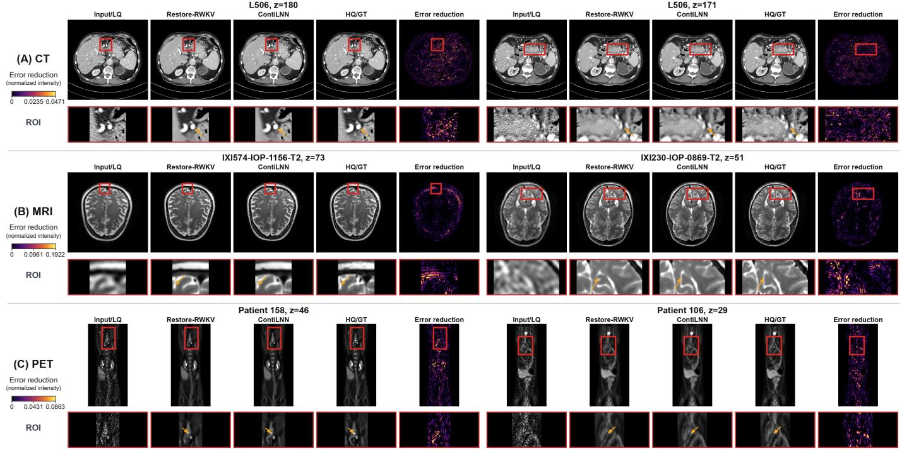  
Figure 3: Restoration examples for (A) CT, (B) MRI and (C) PET, with two examples per modality. Columns contain LQ inputs, Restore-RWKV and ContiLNN outputs, HQ references (ground truth, GT), and error-reduction maps. Boxed regions are enlarged below; orange arrows identify corresponding local structures and intensity transitions. Brighter colors indicate larger positive reductions in absolute error relative to Restore-RWKV, measured in normalized display intensity. Error increases are clipped to zero. Each modality shares one color scale; display masking and saturation settings are given in Supplementary Section A.

HQ  
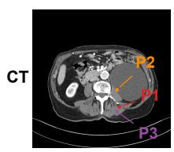

P1  
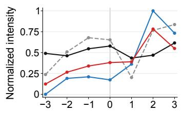

P2  
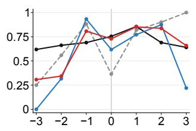

P3  
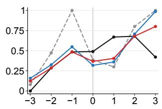

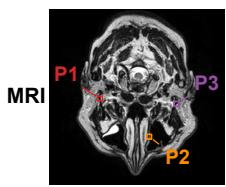

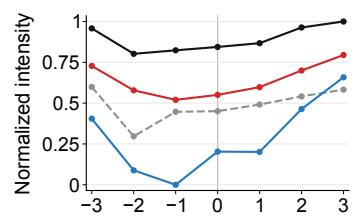

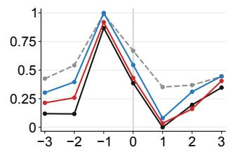

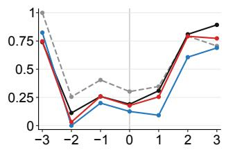

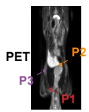

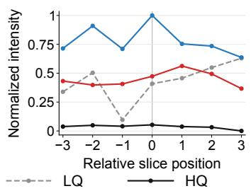

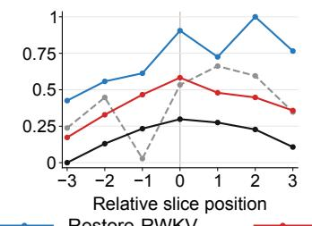

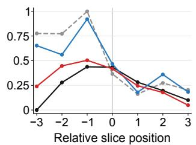  
Figure 4: Intensity profiles across seven ordered CT, MRI and PET slices. P1–P3 mark tissue interfaces or uptake transitions. Each profile averages a $7 \times 7$ region centered at the marked location and is normalized using the joint range of the LQ, HQ, Restore-RWKV and ContiLNN profiles at that location. The horizontal axis gives relative slice position; colors and line styles identify the four image sequences.

Table 3: PET restoration with 5% and 10% of the training patients. Patient subsets are nested, with the validation and test cohorts unchanged. Budget-matched training uses the same number of slice presentations as Restore-RWKV; full refinement adds optimization on the same patient subset. Bold highlights the ContiLNN results.
<table><tr><td>Patient budget</td><td>Training strategy</td><td>PSNR ↑</td><td>SSIM ↑</td><td>RMSE↓</td></tr><tr><td>5%</td><td>Restore-RWKV</td><td>36.2923</td><td>0.9372</td><td>0.0973</td></tr><tr><td>5%</td><td>Budget-matched ContiLNN</td><td>36.8837</td><td>0.9390</td><td>0.0911</td></tr><tr><td>5%</td><td>Full-refinement ContiLNN</td><td>37.2385</td><td>0.9343</td><td>0.0875</td></tr><tr><td>10%</td><td>Restore-RWKV</td><td>36.5217</td><td>0.9389</td><td>0.0947</td></tr><tr><td>10%</td><td>Budget-matched ContiLNN</td><td>37.1106</td><td>0.9408</td><td>0.0886</td></tr><tr><td>10%</td><td>Full-refinement ContiLNN</td><td>37.2121</td><td>0.9430</td><td>0.0875</td></tr></table>

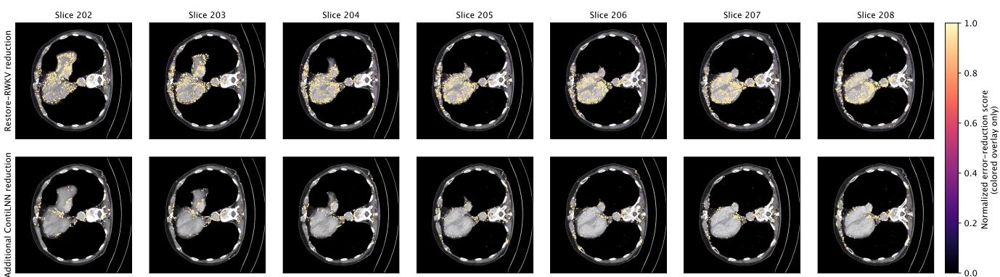  
Figure 5: Spatial error reduction across seven adjacent CT slices: Restore-RWKV relative to LQ (top), and ContiLNN relative to Restore-RWKV (bottom). Colored overlays indicate positive reductions in absolute error against HQ; each row shares one color scale.

Table 4: Computational cost and PET restoration gains. Profiling uses 128 × 128 images, 32-bit precision and one NVIDIA A800 GPU: seven independent slices for Restore-RWKV (B = 7), or one seven-slice window for each ContiLNN-RWKV variant. MLP and Bi-GRU denote multilayer perceptron and bidirectional gated recurrent unit. M denotes 106 parameters; GMAC denotes $1 0 ^ { 9 }$ multiply–accumulate operations. Latency is median forward time per slice; memory is peak allocated GPU memory. Each ∆ is the model’s result minus the reproduced Restore-RWKV result in Table 5 (37.2722 dB PSNR, 0.9474 SSIM, 0.0860 RMSE). Positive PSNR/SSIM and negative RMSE diferences indicate improvement. Profiling details are in Supplementary Section A.
<table><tr><td></td><td colspan="5">Computational cost</td><td colspan="3">PET metric differences</td></tr><tr><td>Model</td><td>Params. (M)</td><td>GMAC/ slice</td><td>GMAC/ window</td><td>Latency/ slice (ms)</td><td>Memory (MB)</td><td>∆PSNR↑ (dB)</td><td>∆SSIM↑</td><td>∆RMSE↓</td></tr><tr><td>Restore-RWKV</td><td>28.37</td><td>37.46</td><td>262.21</td><td>16.72</td><td>987.00</td><td>0.0000</td><td>0.0000</td><td>0.0000</td></tr><tr><td>ContiLNN-RWKV, MLP</td><td>34.92</td><td>60.32</td><td>422.26</td><td>21.23</td><td>1835.22</td><td>-0.3039</td><td>-0.0039</td><td>+0.0031</td></tr><tr><td>ContiLNN-RWKV, Bi-GRU</td><td>34.91</td><td>60.50</td><td>423.51</td><td>54.42</td><td>2315.80</td><td>+1.2454</td><td>+0.0064</td><td>-0.0107</td></tr><tr><td>ContiLNN-RWKV, Bi-CfC</td><td>34.93</td><td>60.34</td><td>422.39</td><td>25.69</td><td>995.03</td><td>+1.3146</td><td>+0.0072</td><td>-0.0116</td></tr></table>

Table 5: PET ablation on the 29-case test cohort. ContiLNN variants share the pretrained backbone initialization, insertion locations, training budget and evaluation procedure. The MLP processes slices independently; Bi-GRU and Bi-CfC use the same bidirectional slice context. ${ \mathcal L } _ { \mathrm { f u l l } }$ denotes the full training objective. Bold indicates the highest PSNR and SSIM and the lowest RMSE.
<table><tr><td>ID Setting</td><td></td><td>Slice-axis operator</td><td>Objective</td><td>PSNR ↑</td><td>SSIM ↑</td><td>RMSE↓</td></tr><tr><td>A</td><td>Restore-RWKV</td><td>None</td><td> $\mathcal { L } _ { \mathrm { r e c } }$ </td><td>37.2722</td><td>0.9474</td><td>0.0860</td></tr><tr><td>B</td><td>ContiLNN, reconstruction only</td><td>Bi-CfC</td><td> $\mathcal { L } _ { \mathrm { r e c } }$ </td><td>38.4166</td><td>0.9533</td><td>0.0760</td></tr><tr><td>C</td><td>ContiLNN, pointwise MLP</td><td>Slice-independent MLP</td><td> $\mathcal { L } _ { \mathrm { f u l l } }$ </td><td>36.9683</td><td>0.9435</td><td>0.0891</td></tr><tr><td>D</td><td>ContiLNN, recurrent alternative</td><td>Bi-GRU</td><td> $\mathcal { L } _ { \mathrm { f u l l } }$ </td><td>38.5176</td><td>0.9538</td><td>0.0753</td></tr><tr><td>E</td><td>ContiLNN, full objective</td><td>Bi-CfC</td><td> ${ \mathcal { L } } _ { \mathrm { f u l l } }$ </td><td>38.5868</td><td>0.9546</td><td>0.0744</td></tr></table>

A slice-independent multilayer perceptron (MLP) inserted at the same pathways has nearly identical model size and arithmetic cost to Bi-CfC. Its latency is lower, at 21.23 ms per slice, but its peak allocated memory is higher, at 1,835.22 MB. This resource profile enables an ablation of ordered propagation against a pointwise operator with closely matched capacity and computation.

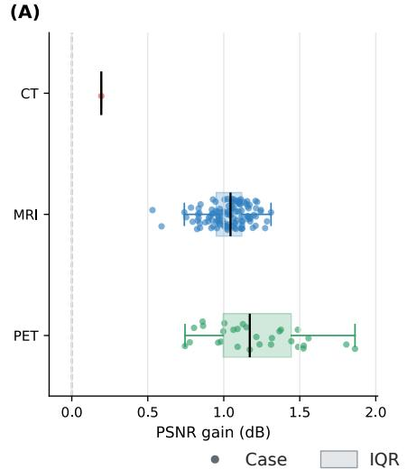

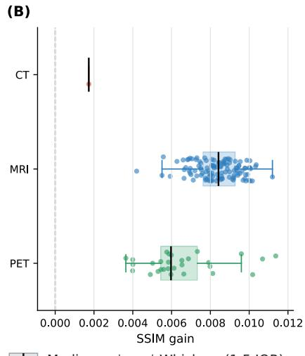

(C)  
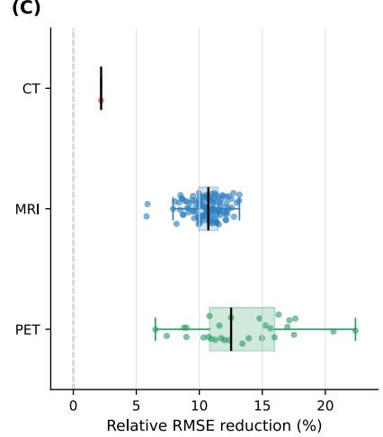

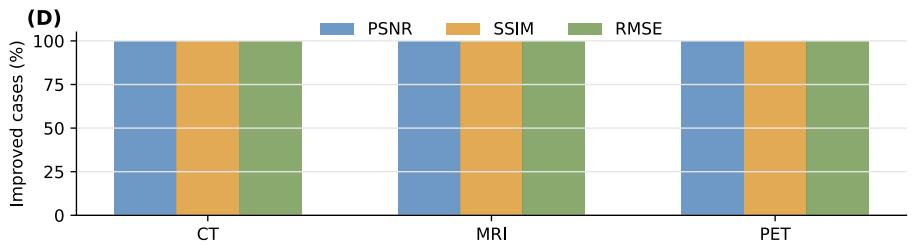

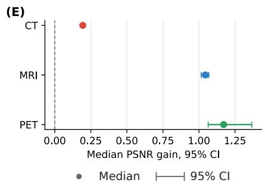  
Figure 6: Case-level improvements over Restore-RWKV. (A)–(C) PSNR gain, SSIM gain and relative RMSE reduction; positive values favor ContiLNN. Points show all cases. Boxes span the interquartile range (IQR), with median lines and whiskers ending at the most extreme observations within 1.5 IQR of the box. Dashed lines mark zero. (D) Percentage of improved cases. (E) Median PSNR gains with 95% percentile confidence intervals from 10,000 case-bootstrap resamples for MRI and PET. CT has one test case and is descriptive, without a confidence interval.

A bidirectional gated recurrent unit (Bi-GRU) alternative is evaluated under the same profiling conditions. Bi-GRU and Bi-CfC closely match in parameter count (34.91 versus 34.93 million) and arithmetic cost (423.51 versus 422.39 GMACs per window). Bi-CfC reduces median window latency from 380.92 to 179.85 ms (52.8%) and peak allocated memory from 2,315.80 to 995.03 MB (57.0%), showing that matched capacity and arithmetic cost do not imply matched execution cost.

Architecture and objective. The PET ablations examine pointwise capacity, ordered-operator choice and training regularization (Table 5). Reconstruction-only Bi-CfC improves PSNR by 1.1444 dB over the 2D backbone. With the full objective, it exceeds the slice-independent MLP by 1.6185 dB in PSNR and 0.0111 in SSIM, with RMSE reduced by 0.0147, supporting propagation beyond pointwise capacity. Bi-GRU retains the same bidirectional context, full objective, initialization, insertion sites and training budget. Relative to this recurrent alternative, Bi-CfC improves PSNR by 0.0693 dB and SSIM by 0.0008, reduces RMSE by 0.0009, and has lower measured latency and memory use (Table 4). Together with the sampling comparison in Table 2 and the resource measurements in Table 4, these results support Bi-CfC as the preferred sequence operator for ContiLNN under the evaluated conditions.

Consistency and distillation provide a further improvement to Bi-CfC: the full objective adds 0.1702 dB in PSNR and 0.0013 in SSIM, while reducing RMSE by 0.0016. The broader architecture study supports selective insertion at intermediate and bottleneck features, with gated updates along the remaining pathways (Supplementary Section B). Component-wise loss analysis is provided in Section C, and sequence length is examined in Section D. The completed 2D training trajectory in Supplementary Section F documents the initialization used for refinement.

We assess local anatomy by varying context around a fixed PET center image, using the same trained ContiLNN-RWKV checkpoint (Fig. 7A). Ordered local context is the default con dition. Reversal retains the local images in the opposite order; center repetition removes distinct neighboring observations; nonlocal same-case sampling retains patient-specific appearance while replacing local anatomy. Each condition is evaluated at the same ten center positions per scan across all 29 test scans.

As shown in Fig. 7B and the results in Table 6, reversing the local sequence reduces PSNR by 0.2565 dB. Preceding and following content remains available to the bidirectional operator, while its positional arrangement changes. Center repetition and nonlocal same-case sampling reduce PSNR by 2.6151 and 6.3511 dB, respectively. These changes associate restoration quality with both the locality and ordering of the supplied observations, with the larger deterioration following the removal of distinct local neighbors. Supplementary Section E describes the paired analysis, and Supplementary Table S6 supplies the per-case absolute metrics and changes relative to ordered context.

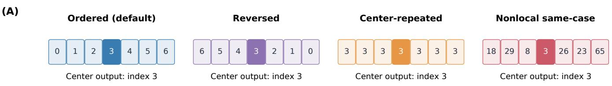

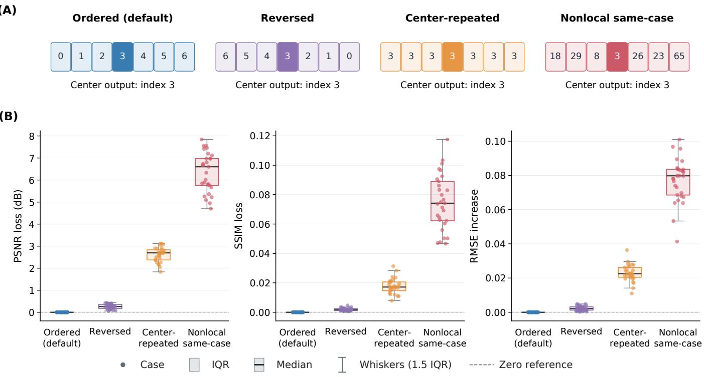  
Figure 7: PET context perturbations. (A) Ordered, reversed, center-repeated and nonlocal same-case inputs, illustrated using Patient 10 at center index 3; every condition retains the evaluated center image. (B) PSNR loss, SSIM loss and RMSE increase for 29 test scans using the same trained checkpoint. Points show all cases; box-plot conventions follow Fig. 6A–C. Diferences are relative to ordered context, whose zero value is marked by dashed lines.

Table 6: PET restoration under the context perturbations illustrated in Fig. 7. The same trained ContiLNN-RWKV checkpoint is held fixed across all four conditions. Ten center slices are evaluated in each of the 29 test cases. Metrics are averaged over centers within each case and then across cases; ∆PSNR is relative to ordered context. Bold indicates the best PSNR, SSIM and RMSE across these conditions
<table><tr><td>Context</td><td>Cases</td><td>Centers</td><td>PSNR ↑</td><td>∆PSNR</td><td>SSIM ↑</td><td>RMSE↓</td></tr><tr><td>Ordered (default)</td><td>29</td><td>290</td><td>38.719844</td><td>0.000000</td><td>0.954441</td><td>0.073956</td></tr><tr><td>Reversed</td><td>29</td><td>290</td><td>38.463333</td><td>-0.256511</td><td>0.952564</td><td>0.076172</td></tr><tr><td>Center-repeated</td><td>29</td><td>290</td><td>36.104738</td><td>-2.615106</td><td>0.936650</td><td>0.096815</td></tr><tr><td>Nonlocal same-case</td><td>29</td><td>290</td><td>32.368766</td><td>-6.351078</td><td>0.879486</td><td>0.150989</td></tr></table>

## 5. Discussion

## 5.1. Anatomical context and restoration

Earlier restoration studies established complementary uses of adjacent slices through volumetric feature extraction and neighboring-slice supervision (Shan et al., 2018; Zhang et al., 2021). ContiLNN builds on this anatomical information through ordered feature propagation within a 2D restoration hierarchy. The PET ablations distinguish additional pointwise capacity from cross-slice propagation and compare two operators with the same bidirectional context. Context perturbations further show larger losses when distinct local neighbors are removed or replaced than when their order is reversed (Table 6). This pattern suggests that local anatomical content supplies an important source of information, with its ordering making an additional contribution to restoration fidelity.

The two regularizers address diferent aspects of using this information. Reference-based diferences encourage predictions to follow the intensity changes of the anatomical sequence, including transitions at tissue interfaces. Knowledge distillation transfers information through reference predictions (Hinton et al., 2015); here, 2D backbone distillation uses a frozen, pretrained backbone to provide an in-plane reference as ContiLNN incorporates neighboring observations. Their complementary role is supported by the loss-component analysis in

Supplementary Section C. The resulting design combines access to neighboring anatomy with supervision of how the restored sequence should vary.

Across CT, MRI and PET, this combination improves fidelity under diferent degradation processes. Local image examples, orthogonal MRI views and intensity profiles relate the gains to anatomical interfaces and uptake transitions, while the MRI and PET case-level analyses show how those gains extend across the evaluated cohorts. Together, these results support local anatomical continuity as a useful source of complementary information for restoration.

## 5.2. Sampling and eficiency

Restoration from incomplete image series requires using neighboring observations whose separation may vary along the slice axis. Retaining the original indices distinguishes consecutive slices from observations separated by omitted positions. CfC incorporates the resulting normalized index gaps into its closed-form state updates without iterative numerical integration (Hasani et al., 2022). Under the principal contiguoustraining protocol, Bi-CfC maintains higher restoration fidelity than Bi-GRU across the tested sparse and irregular contexts. The mixed-gap study shows that broader sampling exposure benefits both operators, with closely matched performance under that training strategy. Together with lower measured latency and peak allocated memory than Bi-GRU, these findings support Bi-CfC as the preferred slice-axis operator for ContiLNN in the evaluated setting.

The limited-patient PET experiments examine the value of the same context under constrained training data. Improvements at matched target-slice exposure indicate more efective use of the available observations. Additional refinement addresses a complementary setting by allocating further optimization to models trained on the same patients. The two settings connect sequence modeling with data eficiency while distinguishing the contribution obtained at a matched exposure budget from that obtained through continued training.

Integration with Restore-RWKV and DASMamba (Yang et al., 2026a; Chan et al., 2026) separates in-plane representation learning from cross-slice information exchange. PSNR and RMSE gains with both backbones support this division of roles across the two tested architectures. Operator choice also afects the resources required for this exchange. Under the matched seven-slice, 32-bit NVIDIA A800 profiling conditions, Bi-CfC reduces median window latency by 52.8% and peak allocated memory by 57.0% relative to Bi-GRU, despite closely matched parameter counts and arithmetic costs (Table 4). The limitedpatient and operator studies therefore identify complementary benefits in the use of training data and inference resources.

## 5.3. Limitations

The current evidence is based on fixed restoration benchmarks and local slice windows. Physical slice-spacing metadata are unavailable in the preprocessed data used here, so the experiments assess index-defined sampling rather than adaptation to calibrated anatomical distances. Window length and index gaps jointly determine the anatomical extent of the available context.

The CT test partition contains one patient; the small variation across training seeds characterizes training repeatability on that patient rather than between-patient robustness. Generalization across acquisition protocols has not yet been evaluated. Adding slice-axis propagation also increases the parameter count and arithmetic cost relative to the original 2D backbone.

## 5.4. Future directions

Physical slice coordinates derived from Digital Imaging and Communications in Medicine (DICOM) metadata could connect the updates more directly to anatomical distance and acqui sition geometry. Adaptive context lengths and selective prop agation across feature levels could further match contextual exchange to sampling density and local anatomical variation. Comparisons with slice-axis convolution and attention under matched budgets would help characterize these choices. Evaluation across centers and acquisition protocols, together with downstream tasks and reader studies, would extend the assessment of restoration quality to broader imaging workflows. By improving the quality of available slices while preserving their original positions, ContiLNN may help recover useful anatomical information from incomplete image series in retrospective clinical workflows.

## 6. Conclusion

ContiLNN augments two-dimensional medical image restoration with bidirectional liquid dynamics over ordered slice positions. Slice-index intervals condition state propagation on the supplied sampling, while joint restoration preserves an output for every observed slice. Experiments across CT, MRI and PET demonstrate improved fidelity. Experiments with limited paired training cohorts (5% and 10% of PET training patients) and a second restoration backbone (DASMamba) support data eficiency and architectural compatibility, while the PET ablations support ordered propagation and complementary regularization. Under contiguous training, Bi-CfC achieves higher fidelity than Bi-GRU across the tested sampling conditions, alongside lower measured inference latency and peak allocated memory. Additional mixed-gap experiments show that broader sampling exposure can improve both operators. These findings support Bi-CfC as the preferred operator in the evaluated ContiLNN framework and liquid dynamics as a practical approach to incorporating anatomical continuity into 2D restoration networks.

## Data availability

The CT data derive from the ten-patient training set of the AAPM Low Dose CT Grand Challenge (McCollough et al., 2017), and the MRI data from the IXI project (IXI Project, n.d.). The PolarStar m660 PET cohort is described in the original AMIR study (Yang et al., 2024). The preprocessed benchmark datasets used in this study were obtained from the Restore-RWKV repository (https://github.com/Yaziwel/Restore-R WKV); their source cohorts and preprocessing are described in

Section 4.1. Access and reuse are subject to the terms of the respective source data providers. No new clinical imaging data were collected.

## Code availability

The source code, experiment configurations, and evaluation scripts are publicly available at https://github.com/Noah-hjl/C ontiLNN.

Declaration of generative AI and AI-assisted technologies in the manuscript preparation process

During the preparation of this manuscript, the authors used ChatGPT and Codex (OpenAI) for language editing, manuscript organization, LaTeX preparation, literature checking, and assistance with plotting and layout code. The authors reviewed and verified the resulting text, references, and relevant code outputs, edited the material as needed, and take full responsibility for the content of the published article. Medical images presented as evidence originate from research data and model outputs, not generative AI.

## Ethics statement

This work involved secondary analysis of pre-existing data released for research use and included no new participant recruitment or imaging acquisition. The source cohorts and acquisition protocols are described in the cited dataset publications.

## Declaration of competing interest

Given his role as Associate Editor of Medical Image Analysis, S. Kevin Zhou had no involvement in the peer review of this article and had no access to information regarding its peer review. Full responsibility for the editorial process for this article was delegated to another journal editor.

## Funding

This research received no specific grant from any funding agency in the public, commercial, or not-for-profit sectors.

## Acknowledgements

The authors acknowledge the High-Performance Computing Platform of Xi’an Jiaotong-Liverpool University for providing the computational resources used in this study.

## References

Chan, S.C.K., Shi, L., Huang, B., Wong, T.T.W., 2026. Directional adaptive shufle-based visual state-space models for medical image restoration, in: Medical Image Computing and Computer Assisted Intervention – MICCAI 2025, Springer, Cham. pp. 160–170. doi:10 .1007/978-3-032-05169-1\_16.

Chatterjee, S., Sciarra, A., Dünnwald, M., Ashoka, A.B.T., Vasudeva, M.G.C., Saravanan, S., Sambandham, V.T., Tummala, P., Oeltze-Jafra, S., Speck, O., Nürnberger, A., 2024. Beyond nyquist: A comparative analysis of 3D deep learning models enhancing MRI resolution. J. Imaging 10, 207. doi:10.3390/jimaging10090207.

Chen, H., Yang, Z., Hou, H., Zhang, H., Wei, B., Zhou, G., Xu, Y., 2026. All-in-one medical image restoration with latent difusionenhanced vector-quantized codebook prior, in: Medical Image Computing and Computer Assisted Intervention – MICCAI 2025, Springer, Cham. pp. 67–77. doi:10.1007/978-3-032-05325-1 \_7.

Chen, L., Chu, X., Zhang, X., Sun, J., 2022. Simple baselines for image restoration, in: Computer Vision – ECCV 2022, Springer, Cham. pp. 17–33. doi:10.1007/978-3-031-20071-7\_2.

Chen, R.T.Q., Rubanova, Y., Bettencourt, J., Duvenaud, D.K., 2018. Neural ordinary diferential equations, in: Advances in Neural Information Processing Systems. URL: https://proceedings.neurips. cc/paper/2018/hash/69386f6bb1dfed68692a24c8686939b9-Abstr act.html.

Chen, T., Hou, J., Zhou, Y., Xie, H., Chen, X., Liu, Q., Guo, X., Xia, M., Duncan, J.S., Liu, C., Zhou, B., 2025. 2.5D multiview averaging difusion model for 3D medical image translation: Application to low-count PET reconstruction with CT-less attenuation correction. IEEE Trans. Med. Imaging 44, 4239–4250. doi:10.1109/TMI.2025.3570342.

Dong, Z., He, Y., Qi, X., Chen, Y., Shu, H., Coatrieux, J.L., Yang, G., Li, S., 2022. MNet: Rethinking 2D/3D networks for anisotropic medical image segmentation, in: International Joint Conference on Artificial Intelligence, pp. 870–876. doi:10.24963/ijcai.2022/ 122.

Duan, Y., Wang, W., Chen, Z., Zhu, X., Lu, L., Lu, T., Qiao, Y., Li, H., Dai, J., Wang, W., 2025. Vision-RWKV: Eficient and scalable visual perception with RWKV-like architectures, in: International Conference on Learning Representations. URL: https://proceeding s.iclr.cc/paper\_files/paper/2025/hash/ce65173b994cf7c925c71b4 82ee14a8d-Abstract-Conference.html.

Efron, B., 1979. Bootstrap methods: Another look at the jackknife. Ann. Stat. 7, 1–26. doi:10.1214/aos/1176344552.

Gu, A., Dao, T., 2024. Mamba: Linear-time sequence modeling with selective state spaces, in: First Conference on Language Modeling. URL: https://openreview.net/forum?id=tEYskw1VY2.

Guo, H., Li, J., Dai, T., Ouyang, Z., Ren, X., Xia, S.T., 2025. MambaIR: A simple baseline for image restoration with state-space model, in: Computer Vision – ECCV 2024, Springer, Cham. pp. 222–241. doi:10.1007/978-3-031-72649-1\_13.

Hasani, R., Lechner, M., Amini, A., Liebenwein, L., Ray, A., Tschaikowski, M., Teschl, G., Rus, D., 2022. Closed-form continuous-time neural networks. Nat. Mach. Intell. 4, 992–1003. doi:10.1038/s42256-022-00556-7.

Hasani, R., Lechner, M., Amini, A., Rus, D., Grosu, R., 2021. Liquid time-constant networks, in: Proceedings of the AAAI Conference on Artificial Intelligence, pp. 7657–7666. doi:10.1609/aaai.v35 i9.16936.

Hinton, G., Vinyals, O., Dean, J., 2015. Distilling the knowledge in a neural network, in: NIPS Deep Learning and Representation Learn-

ing Workshop. URL: https://research.google/pubs/distilling-the-k nowledge-in-a-neural-network/.

Holm, S., 1979. A simple sequentially rejective multiple test procedure. Scand. J. Stat. 6, 65–70. URL: https://www.jstor.org/stable/4 615733.

[dataset] IXI Project, n.d. IXI dataset. Information eXtraction from Images, EPSRC project GR/S21533/02. URL: https://brain-devel opment.org/ixi-dataset/. accessed 5 September 2026.

Jang, S.I., Pan, T., Li, Y., Heidari, P., Chen, J., Li, Q., Gong, K., 2024. Spach transformer: Spatial and channel-wise transformer based on local and global self-attentions for PET image denoising. IEEE Trans. Med. Imaging 43, 2036–2049. doi:10.1109/TMI.2023 .3336237.

Laine, S., Aila, T., 2017. Temporal ensembling for semi-supervised learning, in: International Conference on Learning Representations. URL: https://openreview.net/forum?id=BJ6oOfqge.

Li, B., Liu, X., Hu, P., Wu, Z., Lv, J., Peng, X., 2022. All-in-one image restoration for unknown corruption, in: Proceedings of the IEEE/CVF Conference on Computer Vision and Pattern Recognition, pp. 17452–17462. URL: https://openaccess.thecvf.com/cont ent/CVPR2022/html/Li\_All-in-One\_Image\_Restoration\_for\_Unk nown\_Corruption\_CVPR\_2022\_paper.html.

Li, L., Wei, W., Yang, L., Zhang, W., Dong, J., Liu, Y., Huang, H., Zhao, W., 2025. CT-Mamba: A hybrid convolutional state space model for low-dose CT denoising. Comput. Med. Imaging Graph. 124, 102595. doi:10.1016/j.compmedimag.2025.102595.

Liang, J., Cao, J., Sun, G., Zhang, K., Van Gool, L., Timofte, R., 2021. SwinIR: Image restoration using swin transformer, in: IEEE/CVF International Conference on Computer Vision Workshops, pp. 1833–1844. doi:10.1109/ICCVW54120.2021.00210.

Luo, Y., Zhou, L., Zhan, B., Fei, Y., Zhou, J., Wang, Y., Shen, D., 2022. Adaptive rectification based adversarial network with spectrum constraint for high-quality PET image synthesis. Med. Image Anal. 77, 102335. doi:10.1016/j.media.2021.102335.

McCollough, C.H., Bartley, A.C., Carter, R.E., Chen, B., Drees, T.A., Edwards, P., Holmes, III, D.R., Huang, A.E., Khan, F., Leng, S., McMillan, K.L., Michalak, G.J., Nunez, K.M., Yu, L., Fletcher, J.G., 2017. Low-dose CT for the detection and classification of metastatic liver lesions: Results of the 2016 low dose CT grand challenge. Med. Phys. 44, e339–e352. doi:10.1002/mp.12345.

Moen, T.R., Chen, B., Holmes, III, D.R., Duan, X., Yu, Z., Yu, L., Leng, S., Fletcher, J.G., McCollough, C.H., 2021. Low-dose CT image and projection dataset. Med. Phys. 48, 902–911. doi:10.1 002/mp.14594.

Öztürk, ¸S., Duran, O.C., Çukur, T., 2026. DenoMamba: A fused statespace model for low-dose CT denoising. IEEE J. Biomed. Health Inform. 30, 5353–5366. doi:10.1109/JBHI.2025.3629034.

Peng, B., Alcaide, E., Anthony, Q., Albalak, A., Arcadinho, S., Biderman, S., Cao, H., Cheng, X., Chung, M., Derczynski, L., Du, X., Grella, M., Gv, K., He, X., Hou, H., Kazienko, P., Kocon, J., Kong, J., Koptyra, B., Lau, H., Lin, J., Mantri, K.S.I., Mom, F., Saito, A., Song, G., Tang, X., Wind, J., Wo´zniak, S., Zhang, Z., Zhou, Q., Zhu, J., Zhu, R.J., 2023. RWKV: Reinventing RNNs for the transformer era, in: Findings of the Association for Computational Linguistics: EMNLP 2023, Association for Computational Linguistics, Singapore. pp. 14048–14077. URL: https://aclanthology.org/2023.findings- emnlp.936/, doi:10.18653/v1/2023.findings-emnlp.936.

Rubanova, Y., Chen, R.T.Q., Duvenaud, D.K., 2019. Latent ordinary diferential equations for irregularly-sampled time series, in: Advances in Neural Information Processing Systems. URL: https: //proceedings.neurips.cc/paper/2019/hash/42a6845a557bef704ad

8ac9cb4461d43-Abstract.html.

Shan, H., Zhang, Y., Yang, Q., Kruger, U., Kalra, M.K., Sun, L., Cong, W., Wang, G., 2018. 3-d convolutional encoder-decoder network for low-dose CT via transfer learning from a 2-d trained network. IEEE Trans. Med. Imaging 37, 1522–1534. doi:10.1109/TMI.2018.2 832217.

Shi, Y., Xia, B., Jin, X., Wang, X., Zhao, T., Xia, X., Xiao, X., Yang, W., 2025. VmambaIR: Visual state space model for image restoration. IEEE Trans. Circuits Syst. Video Technol. 35, 5560– 5574. URL: https://ieeexplore.ieee.org/document/10843251/, doi:10.1109/TCSVT.2025.3530090.

Sun, S., Ren, W., Gao, X., Wang, R., Cao, X., 2025. Restoring images in adverse weather conditions via histogram transformer, in: Computer Vision – ECCV 2024, Springer, Cham. pp. 111–129. doi:10.1007/978-3-031-72670-5\_7.

Tarvainen, A., Valpola, H., 2017. Mean teachers are better role models: Weight-averaged consistency targets improve semi-supervised deep learning results, in: Advances in Neural Information Processing Systems. URL: https://proceedings.neurips.cc/paper/2017/hash /68053af2923e00204c3ca7c6a3150cf7-Abstract.html.

Wang, Z., Bovik, A.C., Sheikh, H.R., Simoncelli, E.P., 2004. Image quality assessment: From error visibility to structural similarity. IEEE Trans. Image Process. 13, 600–612. doi:10.1109/TIP.2003 .819861.

Wilcoxon, F., 1945. Individual comparisons by ranking methods. Biom. Bull. 1, 80–83. doi:10.2307/3001968.

Xiao, J., Zheng, W., Wang, W., Xia, Q., Yan, Z., Guo, Q., Wang, X., Nie, S., Zhang, S., 2025. Slice2Mesh: 3D surface reconstruction from sparse slices of images for the left ventricle. IEEE Trans. Med. Imaging 44, 1541–1555. doi:10.1109/TMI.2024.3514869.

Xu, J., Moyer, D., Gagoski, B., Iglesias, J.E., Grant, P.E., Golland, P., Adalsteinsson, E., 2023. NeSVoR: Implicit neural representation for slice-to-volume reconstruction in MRI. IEEE Trans. Med. Imaging 42, 1707–1719. doi:10.1109/TMI.2023.3236216.

Yang, Z., Chen, H., Qian, Z., Yi, Y., Zhang, H., Zhao, D., Wei, B., Xu, Y., 2024. All-in-one medical image restoration via task-adaptive routing, in: Medical Image Computing and Computer Assisted Intervention – MICCAI 2024, Springer, Cham. pp. 67–77. URL: https://papers.miccai.org/miccai-2024/paper/0787\_paper.pdf, doi:10.1007/978-3-031-72104-5\_7.

Yang, Z., Li, J., Zhang, H., Zhao, D., Wei, B., Xu, Y., 2026a. Restore-RWKV: Eficient and efective medical image restoration with RWKV. IEEE J. Biomed. Health Inform. 30, 513–526. doi:10.1109/JBHI.2025.3588555.

Yang, Z., Zhang, J., Yi, Y., Liang, J., Wei, B., Xu, Y., 2026b. TAT: Task-adaptive transformer for all-in-one medical image restoration, in: Medical Image Computing and Computer Assisted Intervention – MICCAI 2025, Springer, Cham. pp. 565–575. doi:10.1007/97 8-3-032-05325-1\_54.

Yang, Z., Zhou, Y., Zhang, H., Wei, B., Fan, Y., Xu, Y., 2023. DRMC: A generalist model with dynamic routing for multi-center PET image synthesis, in: Medical Image Computing and Computer Assisted Intervention – MICCAI 2023, Springer, Cham. pp. 36–46. doi:10.1007/978-3-031-43898-1\_4.

Zamir, S.W., Arora, A., Khan, S., Hayat, M., Khan, F.S., Yang, M.H., 2022. Restormer: Eficient transformer for high-resolution image restoration, in: IEEE/CVF Conference on Computer Vision and Pattern Recognition, pp. 5718–5729. URL: https://openaccess.thecvf. com/content/CVPR2022/html/Zamir\_Restormer\_Efficient\_Trans former\_for\_High-Resolution\_Image\_Restoration\_CVPR\_2022\_pa per.html, doi:10.1109/CVPR52688.2022.00564.

Zhang, J., Zhang, Y., Gu, J., Dong, J., Kong, L., Yang, X., 2024.

Xformer: Hybrid x-shaped transformer for image denoising, in: International Conference on Learning Representations. URL: https: //proceedings.iclr.cc/paper\_files/paper/2024/hash/393367b4ccf1d 56e51276243d5cb85c4-Abstract-Conference.html.

Zhang, Z., Liang, X., Zhao, W., Xing, L., 2021. Noise2Context: Context-assisted learning 3D thin-layer for low-dose CT. Med. Phys. 48, 5794–5803. doi:10.1002/mp.15119.

Zhou, B., Xie, H., Liu, Q., Chen, X., Guo, X., Feng, Z., Hou, J., Zhou, S.K., Li, B., Rominger, A., Shi, K., Duncan, J.S., Liu, C., 2023. FedFTN: Personalized federated learning with deep feature trans-

formation network for multi-institutional low-count PET denoising. Medical Image Analysis 90, 102993. doi:10.1016/j.media.20 23.102993.

Zhou, S., Chan, K.C.K., Li, C., Loy, C.C., 2022. Towards robust blind face restoration with codebook lookup transformer, in: Advances in Neural Information Processing Systems, pp. 30599–30611. URL: https://proceedings.neurips.cc/paper\_files/paper/2022/hash/c57 3258c38d0a3919d8c1364053c45df-Abstract-Conference.html, doi:10.52202/068431-2218.

# Supplementary Material for ContiLNN

Jialei He, Enhe Liu, Sifan Song, Pengfei Jin, Jionglong Su, Hongbin Wang, Zhixiang Lu, Yanhao Huang, Anteng Cai, Zhengyong Jiang, Jiaman Ding\*, S. Kevin Zhou\*, and Jinfeng Wang\*

\* Corresponding authors.

## A Implementation details

## A.1 Slice windows and liquid modules

We use ordered windows of at most $T = 7$ slices and retain short terminal windows. Under the default contiguous strategy, training partitions each case into non-overlapping windows and shufles their order between epochs. For a window containing $K \leq T$ observations with a constant slice-index gap $^ { g , }$ the interval supplied to the liquid cell is $\delta = g / K$ . Thus, consecutive slices use $g = 1$ and $\delta = 1 / K$ . The separate within-window position encoding is linearly spaced from 0 to 1 when $K > 1$ , and is 0 for a single-slice window. Normalization uses the actual $K$ , including terminal windows. A fixed-gap single-slice window receives $\delta _ { 0 } = g$ . Interval inputs are not clipped to [0, 1]. Position encoding specifies relative order, while each interval records the gap associated with that observation in the original forward order.

For irregular sampling, the first gap is repeated to supply an interval for the initial observation. Features and their associated intervals are reversed together for the backward branch. For example, indices [0, 1, 3, 6, 7, 9, 12] give

$$
\delta = \frac { 1 } { 7 } [ 1 , 1 , 2 , 3 , 1 , 2 , 3 ] , \qquad \delta ^ { \mathrm { r e v } } = \frac { 1 } { 7 } [ 3 , 2 , 1 , 3 , 2 , 1 , 1 ] ,\tag{1}
$$

where $\delta ^ { \mathrm { r e v } }$ lists the interval inputs in backward traversal order. This convention preserves the sampling information paired with each feature; it does not recompute intervals from reverse-direction transitions between slice positions.

The Restore-RWKV configuration uses a base width of 48, encoder-stage block counts of [4, 6, 6, 8], and four refinement blocks. Six bidirectional closed-form continuous-time (Bi-CfC) modules follow the six encoder-L2 blocks, and six follow the decoder-L2 blocks. One module is placed on each of the L2 and L3 skip pathways, one at the bottleneck before decoding, and one after the refinement pathway. These placements give 16 Bi-CfC modules and 15 external gates. The bottleneck uses serial insertion; all other selected pathways use gated residual insertion. Gate logits initialize at 0, except for the final refinement gate, which initializes at −4.

Each directional CfC cell uses the default gated update, with one internal feed-forward layer of width $M _ { l } = 2 5 6$ no dropout and no sparsity mask. The scaled hyperbolic-tangent activation in the joint feature map is $\rho ( a )$ 1.7159 tanh(0.666a), applied elementwise. The two candidate heads use ordinary hyperbolic-tangent activations; the interval coeficient and gate intercept are unrestricted afine outputs. The implemented gate is $\sigma ( \delta _ { t } \eta _ { t } + \xi _ { t } )$ , and the state is $( 1 - \alpha _ { t } ) \odot c _ { t } ^ { ( 1 ) } + \alpha _ { t } \odot c _ { t } ^ { ( 2 ) }$ , following the default CfC parameterization described in the main manuscript. The internal width $M _ { l }$ is distinct from the recurrent-state width $C _ { l }$ , which equals the feature-channel count at pathway l. Forward and backward cells have separate parameters. The position projection maps one scalar to $C _ { l }$ channels, and the bidirectional fusion maps $2 C _ { l }$ channels to $C _ { l } ;$ both afine projections include a learned bias. The source-code names ff1, ff2, time\_a and time\_b correspond to the two candidate heads, interval coeficient and gate intercept in the main formulation, respectively.

At inference, two window tilings begin at ofsets 0 and 3 in the case’s slice sequence. Each tiling retains its terminal window, and predictions at positions covered by both tilings are averaged. The original slice order is restored after fusion. All windows are formed within individual cases.

## A.2 Restore-RWKV training

The 2D Restore-RWKV baseline is trained for 300,000 optimizer updates using Adam, a batch size of four slices, and an $L _ { 1 }$ reconstruction loss. Cosine decay reduces the learning rate from $2 \times 1 0 ^ { - 4 } \ \mathrm { t o } \ 1 0 ^ { - 6 }$ . The checkpoint with the highest validation peak signal-to-noise ratio (PSNR) initializes ContiLNN and supplies predictions from a frozen copy of the 2D backbone for distillation.

ContiLNN training uses 128 × 128 patches and three NVIDIA A800 GPUs, with one sequence per GPU. AdamW optimizes the complete model with zero weight decay. The initial learning rates are $2 \times 1 0 ^ { - 4 }$ for the 2D backbone and Bi-CfC parameters and $5 \times 1 0 ^ { - 4 }$ for the external gates, with cosine decay to $1 0 ^ { - 6 }$ . Training uses automatic mixed precision and gradient clipping at a norm of 1.0. CT and PET have a 60-epoch cap; MRI has a 100-epoch cap. Early stopping is enabled after 15 epochs, with patience 10 and a minimum validation-PSNR improvement of 0.0005 dB. The five-seed results in main Table 1 use seeds 42, 2026, 3407, 777, and 12345.

The full Restore-RWKV objective uses $\lambda _ { \mathrm { c o n s } } ~ = ~ 0 . 3 0 , ~ \beta _ { 2 } ~ = ~ 2 . 0 .$ and $\lambda _ { \mathrm { K D } } ~ = ~ 0 . 0 5 .$ , with unit reconstruction weight. The first- and second-order consistency terms use finite diferences between the selected observations. In the reconstruction-only PET ablation, both $\lambda _ { \mathrm { c o n s } }$ and λKD are zero. The multilayer perceptron (MLP) and bidirectional gated recurrent unit (Bi-GRU) ablations use the full objective. Bi-GRU replaces Bi-CfC while retaining its insertion sites, initialization, training budget and evaluation workflow. The reference 2D backbone is frozen, while the ContiLNN backbone and added modules remain trainable.

The MRI source split allocates 405, 59, and 114 cases to training, validation, and testing. The implemented validation reader supplies 58 readable cases, and validation scores are calculated over those 58 cases. CT, MRI, and PET use their respective data readers and case-grouping rules.

## A.3 DASMamba integration

ContiLNN-DASMamba follows the same backbone-initialization, ordered-window training, 2D backbone distillation and evaluation workflow as ContiLNN-RWKV. Its native spatial and Fourier-domain reconstruction terms are retained alongside the cross-slice consistency and distillation objectives. Detailed hyperparameters are reported for ContiLNN-RWKV as the representative implementation.

## A.4 Sampling robustness

The PET sampling study compares Bi-CfC and Bi-GRU under contiguous and mixed-gap training. For each operator, the mixed-gap configuration retains the backbone initialization, insertion sites, objective, optimization settings and training budget of its contiguous-training counterpart. Each mixed-gap training window uses a constant gap selected from {1, 2, 3}. The three gaps contribute approximately equal numbers of windows, while the total windows and optimizer updates per epoch match contiguous training. A seven-observation window spans 7, 13, or 19 original slice positions for gaps 1, 2, or 3, respectively. Validation uses consecutive slices with the original two-tiling fusion. Sparse testing uses interleaved slice sequences, and irregular testing combines overlapping windows. All eligible original target slices are retained for evaluation across sampling conditions, with case-level metrics computed over the same test cohort. Mixed-gap training uses 16-bit mixed precision with a fixed loss scale of 128 and gradient clipping at 1.0. Complete results for both training strategies are reported in Section H.

## A.5 Data eficiency

The PET data-eficiency experiments use training seed 42 and nested subsets of 6 and 12 patients, corresponding to 5% and 10% of the 120 training patients. The validation and test cohorts remain fixed. A slice presentation is counted whenever one target slice contributes to training; this makes the exposure budget comparable between independent-slice and sequence training.

Restore-RWKV receives 1.2 million slice presentations from random initialization. Budget-matched ContiLNN uses 0.6 million presentations for the 2D pathway, then activates Bi-CfC for a further 0.6 million presentations. The transition uses the checkpoint at that fixed exposure, with a frozen copy supplying the distillation targets during sequence training. Full refinement starts from the ratio-matched Restore-RWKV checkpoint after its 1.2-millionpresentation schedule and adds a sequence-training budget derived from the full-data refinement schedule.

Both sequence-training strategies use AdamW, a global batch of three sequences, and peak learning rates of $2 \times 1 0 ^ { - 4 }$ for backbone and Bi-CfC parameters and $5 \times 1 0 ^ { - 4 }$ for gates. The learning rates warm up over the first 5% of the sequence-training exposure and then decay to $1 0 ^ { - 6 }$ . Consistency and distillation weights increase linearly over the first 10% to 0.30 and 0.05, respectively; the second-order consistency weight is 2.0. The complete ContiLNN model remains trainable. Training uses a fixed mixed-precision loss scale of 128, gradient clipping at 1.0, and no early stopping. These schedules are indexed by slice exposure rather than epoch count.

## A.6 Intensity processing

Training uses intensity ranges of [−1024, 3072] Hounsfield units (HU) for CT, [0, 4095] for MRI and [0, 20] for PET. Random $1 2 8 \times 1 2 8$ crops, rotations and flips are applied consistently across the slices in each training window. Evaluation follows inverse normalization and truncation to [−160, 240] HU for CT, [0, 4095] for MRI and [0, 20] for PET.

For the error-reduction maps in main Figure 3, I denotes displayed grayscale intensity normalized to [0, 1]. The plotted quantity is

$$
E ^ { + } = \operatorname* { m a x } ( { | I _ { \mathrm { R W K V } } - I _ { \mathrm { H Q } } | } - { | I _ { \mathrm { C o n t i L N N } } - I _ { \mathrm { H Q } } | } , 0 ) .\tag{2}
$$

The subscripts identify the two predictions and the HQ reference. Values are displayed where $0 . 0 3 5 < I _ { \mathrm { H Q } } < 0 . 9 8 5$ with pixels outside this mask set to zero. Inside the mask, zero includes unchanged error and error increases clipped to zero. The two examples within each modality share one color scale, which saturates at the 99th percentile of their pooled positive ROI values. These display settings do not change the reconstruction metrics.

## A.7 Computational profiling

Inference is profiled on an NVIDIA A800 GPU using 32-bit floating-point precision and 128×128 images. The baseline processes a batch of seven independent slices, while the Bi-CfC, MLP and Bi-GRU variants each process one window of seven slices. Timing is measured after 20 warm-up passes and summarized by the median of 100 repetitions, with GPU synchronization around each repetition. Per-slice latency and arithmetic cost are obtained by dividing the window totals by seven. These latencies measure an amortized model forward pass; they exclude data loading, window assembly and the overlapping-tiling fusion used for full-volume restoration. Peak allocated memory is recorded after warm-up; memory values labelled MB use $2 ^ { 2 0 }$ bytes. One GMAC denotes $1 0 ^ { 9 }$ multiply–accumulate operations. Peak reserved memory is 1,168 MB for Bi-CfC, 2,692 MB for the pointwise MLP and 3,000 MB for Bi-GRU; the main table reports allocated memory for all models. The Bi-GRU and Bi-CfC variants contain 34.50 and 34.52 million trainable parameters, respectively, of which 6.54 and 6.55 million belong to their ordered operators. Their median seven-slice window latencies are 380.92 and 179.85 ms, respectively.

## A.8 Evaluation and statistical settings

The structural similarity index measure (SSIM) uses an 11 × 11 Gaussian window with standard deviation 1.5. The dynamic range used in the image-quality metrics is determined from the corresponding target slice. Slice-level metrics are averaged within each case before aggregation across cases. Multi-seed estimates report the mean and sample standard deviation across the five training seeds.

Paired case analyses use the models trained with seed 2026 for CT and MRI and seed 3407 for PET. Casebootstrap intervals use 10,000 resamples and random seed 20260708. The statistical significance level is 0.05; the paired Wilcoxon tests, Holm adjustment, and confidence-interval interpretation are specified in the main manuscript. The CT test cohort contains one case, for which the reported measurements describe that case.

## B Architecture ablation

The architecture study examines propagation direction and recurrent cell (Fig. S1A), bottleneck and refinement placement (B), encoder and decoder depth (C, D), insertion mode (E), and skip pathways (F). The complete CT results are provided in Table S1. The grouped PSNR diferences connect each family of alternatives to its insertion-path decision; H8 is the selected topology.

Intermediate encoder and decoder pathways provide more efective insertion sites than extending liquid modules across all feature levels. Fully serial integration also yields lower fidelity than the selected combination of serial bottleneck processing and gated feature updates. Within the skip-path variants, gated insertion at L2 and L3 gives the highest PSNR and lowest RMSE, supporting the H8 topology.

Table S1: CT architecture ablation. Results use the same Restore-RWKV reference and evaluation protocol; ∆PSNR is relative to this reference. The selected configuration is marked in bold.
<table><tr><td>Group</td><td>ID</td><td>Configuration</td><td>PSNR ↑</td><td>SSIM ↑</td><td>RMSE↓</td><td>∆PSNR</td></tr><tr><td>Baseline</td><td>A-CT</td><td>Restore-RWKV, no slice-axis module</td><td>33.7642</td><td>0.9189</td><td>8.3950</td><td>0.0000</td></tr><tr><td>Direction/core</td><td>C1</td><td>One-direction CfC</td><td>33.7907</td><td>0.9193</td><td>8.3676</td><td>+0.0265</td></tr><tr><td></td><td>C2</td><td>One-direction LTC</td><td>33.7643</td><td>0.9187</td><td>8.3928</td><td>+0.0001</td></tr><tr><td></td><td>C3</td><td>Bidirectional CfC</td><td>33.8150</td><td>0.9193</td><td>8.3446</td><td>+0.0508</td></tr><tr><td></td><td>C4</td><td>Bidirectional LTC</td><td>33.7694</td><td>0.9187</td><td>8.3889</td><td>+0.0052</td></tr><tr><td>Bottleneck/ refinement</td><td>C5</td><td>Strict encoder insertion with bottleneck CfC</td><td>33.9058</td><td>0.9204</td><td>8.2586</td><td>+0.1416</td></tr><tr><td></td><td>C7</td><td>Encoder, bottleneck, and gated refinement CfC</td><td>33.9034</td><td>0.9203</td><td>8.2606</td><td>+0.1392</td></tr><tr><td></td><td>C8</td><td>Parallel refinement CfC only</td><td>33.8255</td><td>0.9196</td><td>8.3355</td><td>+0.0613</td></tr><tr><td>Encoder depth</td><td>D1</td><td>Encoder L1 only</td><td>33.7963</td><td>0.9187</td><td>8.3639</td><td>+0.0321</td></tr><tr><td></td><td>D2</td><td>Encoder L2 only</td><td>33.8975</td><td>0.9203</td><td>8.2672</td><td>+0.1333</td></tr><tr><td></td><td>D3</td><td>Encoder L3 only</td><td>33.8681</td><td>0.9199</td><td>8.2937</td><td>+0.1039</td></tr><tr><td></td><td>D4</td><td>Encoder L1+L2+L3</td><td>33.8854</td><td>0.9198</td><td>8.2777</td><td>+0.1212</td></tr><tr><td>Decoder depth</td><td>E1</td><td>Decoder L1 only</td><td>33.8195</td><td>0.9195</td><td>8.3414</td><td>+0.0553</td></tr><tr><td></td><td>E2</td><td>Decoder L2 only</td><td>33.8660</td><td>0.9200</td><td>8.2967</td><td>+0.1018</td></tr><tr><td></td><td>E3</td><td>Decoder L3 only</td><td>33.8617</td><td>0.9199</td><td>8.3001</td><td>+0.0975</td></tr><tr><td>Path combina-</td><td>E4</td><td>Decoder L1+L2+L3</td><td>33.8271</td><td>0.9193</td><td>8.3330</td><td>+0.0629</td></tr><tr><td>tion</td><td>F1</td><td>Encoder L2 + bottleneck + decoder L2 + gated refinement</td><td>33.9071</td><td>0.9205</td><td>8.2582</td><td>+0.1429</td></tr><tr><td></td><td>F2</td><td>Encoder L2 + bottleneck + decoder L2, no refinement</td><td>33.9045</td><td>0.9204</td><td>8.2604</td><td>+0.1403</td></tr><tr><td></td><td>F3</td><td>Encoder L2/L3 + bottleneck + decoder L2/L3 + gated refinement</td><td>33.8365</td><td>0.9195</td><td>8.3242</td><td>+0.0723</td></tr><tr><td></td><td>F4</td><td>Encoder L2/L3 + bottleneck + decoder L2/L3, no refinement</td><td>33.8557</td><td>0.9199</td><td>8.3062</td><td>+0.0915</td></tr><tr><td></td><td>F5</td><td>Encoder L2 + bottleneck + decoder L2 + serial refinement</td><td>33.9062</td><td>0.9205</td><td>8.2588</td><td>+0.1420</td></tr><tr><td></td><td>F6</td><td>F5 with serial CfC on skip L2</td><td>33.8979</td><td>0.9203</td><td>8.2663</td><td>+0.1337</td></tr><tr><td></td><td>G1</td><td>Fully serial encoder L2 + bottleneck + de- coder L2 + refinement</td><td>33.8471</td><td>0.9200</td><td>8.3123</td><td>+0.0829</td></tr><tr><td></td><td>G2</td><td>Fully serial encoder L2 + bottleneck + de- coder L2, no refinement</td><td>33.5083</td><td>0.9158</td><td>8.6396</td><td>-0.2559</td></tr><tr><td></td><td>G3</td><td>Fully serial encoder L2/L3 + bottleneck + decoder L2/L3 + refinement</td><td>33.7892</td><td>0.9192</td><td>8.3691</td><td>+0.0250</td></tr><tr><td></td><td>G4</td><td>Fully serial encoder L2/L3 + bottleneck + decoder L2/L3, no refinement</td><td>33.5101</td><td>0.9157</td><td>8.6380</td><td>-0.2541</td></tr><tr><td>Skip pathway</td><td>H1</td><td>Gated skip L1 on the F1 backbone</td><td>33.9017</td><td>0.9205</td><td>8.2630</td><td>+0.1375</td></tr><tr><td></td><td>H2</td><td>Gated skip L2 on the F1 backbone</td><td>33.9017</td><td>0.9204</td><td>8.2631</td><td>+0.1375</td></tr><tr><td></td><td>H3</td><td>Gated skip L3 on the F1 backbone</td><td>33.9075</td><td>0.9205</td><td>8.2576</td><td>+0.1433</td></tr><tr><td></td><td>H4</td><td>Serial skip L1 on the F1 backbone</td><td>33.8811</td><td>0.9201</td><td>8.2821</td><td>+0.1169</td></tr><tr><td></td><td>H5</td><td>Serial skip L3 on the F1 backbone</td><td>33.9078</td><td>0.9205</td><td>8.2577</td><td>+0.1436</td></tr><tr><td></td><td>H6</td><td>Gated skip  $_ { \mathrm { L 1 + L 2 + L 3 } }$  on the F1 backbone</td><td>33.9031</td><td>0.9204</td><td>8.2615</td><td>+0.1389</td></tr><tr><td></td><td>H7 H8</td><td>Serial skip L1+L2+L3 on the F1 backbone Gated skip L2+L3 on the F1 backbone</td><td>33.8914</td><td>0.9203</td><td>8.2732</td><td>+0.1272</td></tr><tr><td></td><td></td><td>(selected)</td><td>33.9095</td><td>0.9205</td><td>8.2560</td><td>+0.1453</td></tr><tr><td></td><td>H9</td><td>Serial skip L2+L3 on the F1 backbone</td><td>33.9085</td><td>0.9204</td><td>8.2568</td><td>+0.1443</td></tr></table>

(F) Skip pathway

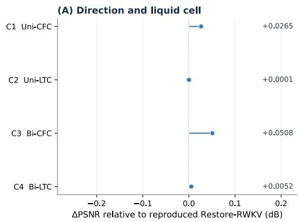  
(C) Encoder depth

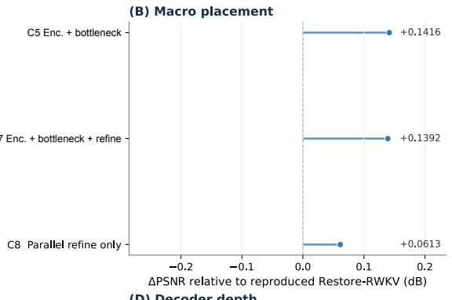  
(D) Decoder depth

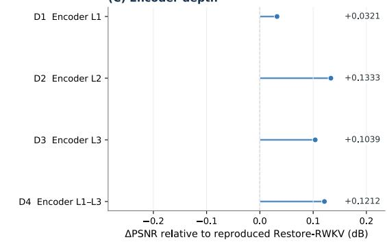  
(E) Path combination

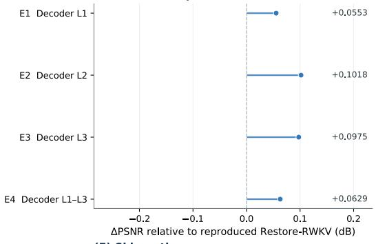

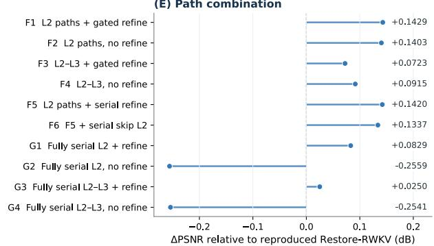

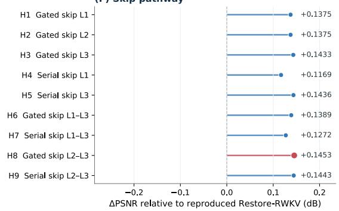  
Figure S1: CT architecture ablation, expressed as PSNR diferences from Restore-RWKV. (A) Propagation direction and cell type. (B) Bottleneck and refinement placement. (C, D) Encoder and decoder depth. (E) Pathway combinations. (F) Skip pathways. H8 denotes the selected topology.

## C Objective decomposition

The component-wise CT ablation isolates the contribution of each supervision term under the selected architecture. Each setting in Table S2 removes one term while preserving the remaining model, initialization, and training set-

tings. Removing cross-slice consistency causes the largest PSNR reduction. The second-order term and 2D backbone distillation each provide further improvement, supporting their complementary roles under the selected architecture.

Table S2: CT loss-component ablation under the selected architecture, seed 42. Components are removed from the full objective one at a time. Bold indicates the best value in each metric column.
<table><tr><td>Setting</td><td>PSNR ↑</td><td>SSIM ↑</td><td>RMSE↓</td></tr><tr><td>Full objective</td><td>33.954120</td><td>0.921013</td><td>8.213643</td></tr><tr><td>Without distillation</td><td>33.923577</td><td>0.920509</td><td>8.241692</td></tr><tr><td>Without cross-slice consistency</td><td>33.874285</td><td>0.919479</td><td>8.290462</td></tr><tr><td>Without second-order consistency</td><td>33.910046</td><td>0.920077</td><td>8.256208</td></tr></table>

## D Sequence length

The CT sequence-length study evaluates $T \in \{ 5 , 7 , 9 , 1 1 \}$ using training seed 42 and a 10-epoch budget. Validation PSNR at epochs 3, 5, and 10, the highest validation PSNR, and the test metrics are reported in Table S3. Seven slices achieved the highest validation PSNR. The validation trajectories and their highest observed values are displayed in panels A and B of Fig. S2, respectively.

Table S3: CT sequence-length analysis with training seed 42 and a 10-epoch budget. Validation and test each use one case. Bold marks the selected seven-slice window.
<table><tr><td>T</td><td>Val. epoch 3</td><td>Val. epoch 5</td><td>Val. epoch 10</td><td>Best val. (epoch)</td><td>Test PSNR</td><td>Test SSIM</td><td>Test RMSE</td></tr><tr><td>5</td><td>31.7210</td><td>31.7450</td><td>31.7619</td><td>31.7619 (10)</td><td>33.8825</td><td>0.9202</td><td>8.2806</td></tr><tr><td>7</td><td>31.7079</td><td>31.7542</td><td>31.7705</td><td>31.7719 (8)</td><td>33.8941</td><td>0.9201</td><td>8.2697</td></tr><tr><td>9</td><td>31.7047</td><td>31.7393</td><td>31.7574</td><td>31.7574 (10)</td><td>33.8760</td><td>0.9200</td><td>8.2865</td></tr><tr><td>11</td><td>31.7032</td><td>31.7311</td><td>31.7490</td><td>31.7528 (9)</td><td>33.8528</td><td>0.9194</td><td>8.3079</td></tr></table>

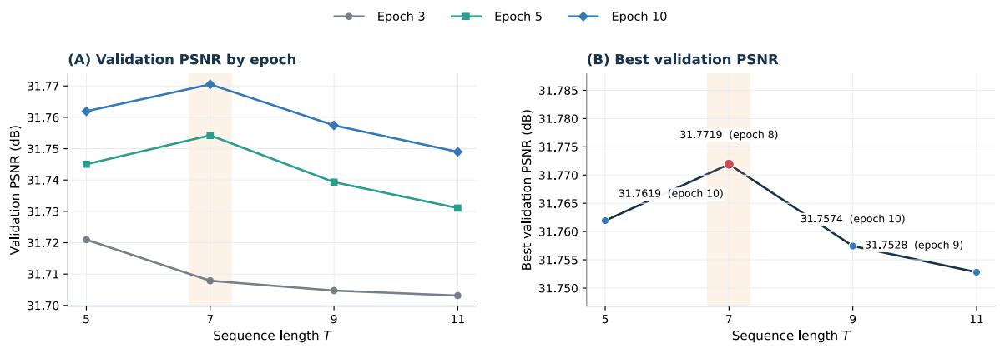  
Figure S2: CT sequence-length analysis. (A) Validation PSNR at epochs 3, 5, and 10. (B) Highest validation PSNR, with the corresponding epoch annotated. Shading identifies the selected seven-slice window.

## E Context perturbations

The PET context study evaluates ordered context (default), reversed local order, center repetition and nonlocal samecase sampling using the same trained ContiLNN-RWKV checkpoint. The target center image and the ten evaluated center positions within each of the 29 test scans remain fixed. Table S4 reports mean changes relative to ordered context with 95% case-bootstrap confidence intervals. Table S6 provides the 116 case–condition records, including absolute PSNR, SSIM and RMSE and signed diferences from the ordered result for the same case. For these signed diferences, negative PSNR or SSIM values and positive RMSE values indicate deterioration; the loss convention used in Table S4 is stated in its caption.

Table S4: PET case-level changes relative to the common ordered-context reference. The same trained checkpoint is used in all conditions. Values are means with 95% percentile confidence intervals from 10,000 case-bootstrap resamples. Positive value denote PSNR or SSIM loss, or RMSE increase. Per-case absolute metrics and signed changes are reported in Table S6.
<table><tr><td>Perturbation</td><td>PSNR loss (dB)</td><td>SSIM loss</td><td>RMSE increase</td></tr><tr><td>Reversed</td><td>0.2565 [0.2160, 0.2962]</td><td>0.0019 [0.0015, 0.0022]</td><td>0.0022 [0.0017, 0.0027]</td></tr><tr><td>Center-repeated</td><td>2.6151 [2.4952, 2.7333]</td><td>0.0178 [0.0160, 0.0197]</td><td>0.0229 [0.0211, 0.0246]</td></tr><tr><td>Nonlocal same-case</td><td>6.3511 [6.0307, 6.6710]</td><td>0.0750 [0.0681, 0.0820]</td><td>0.0770 [0.0725, 0.0816]</td></tr></table>

## F PET Stage-A trajectory

The PET Restore-RWKV baseline completed 300,000 optimizer updates, with validation every 1,000 updates. The complete validation trajectory is provided in Fig. S3. PSNR reached its highest value of 38.1207 dB at update 87,000, with SSIM 0.9541 and root mean squared error (RMSE) 0.0813. The remaining 213 validation evaluations did not exceed that PSNR, and the checkpoint at update 87,000 was retained for subsequent refinement.

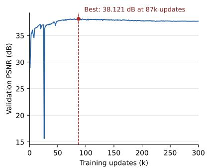

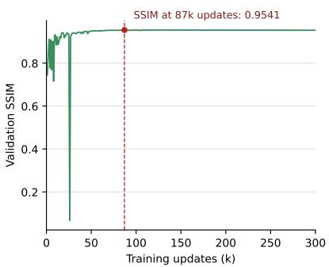

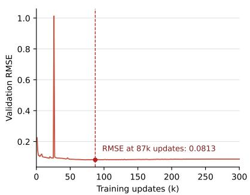  
Figure S3: PET Stage-A validation trajectory across 300,000 optimizer updates. The dashed line marks the highest validation PSNR at update 87,000. All 300 recorded values are displayed for PSNR, SSIM, and RMSE.

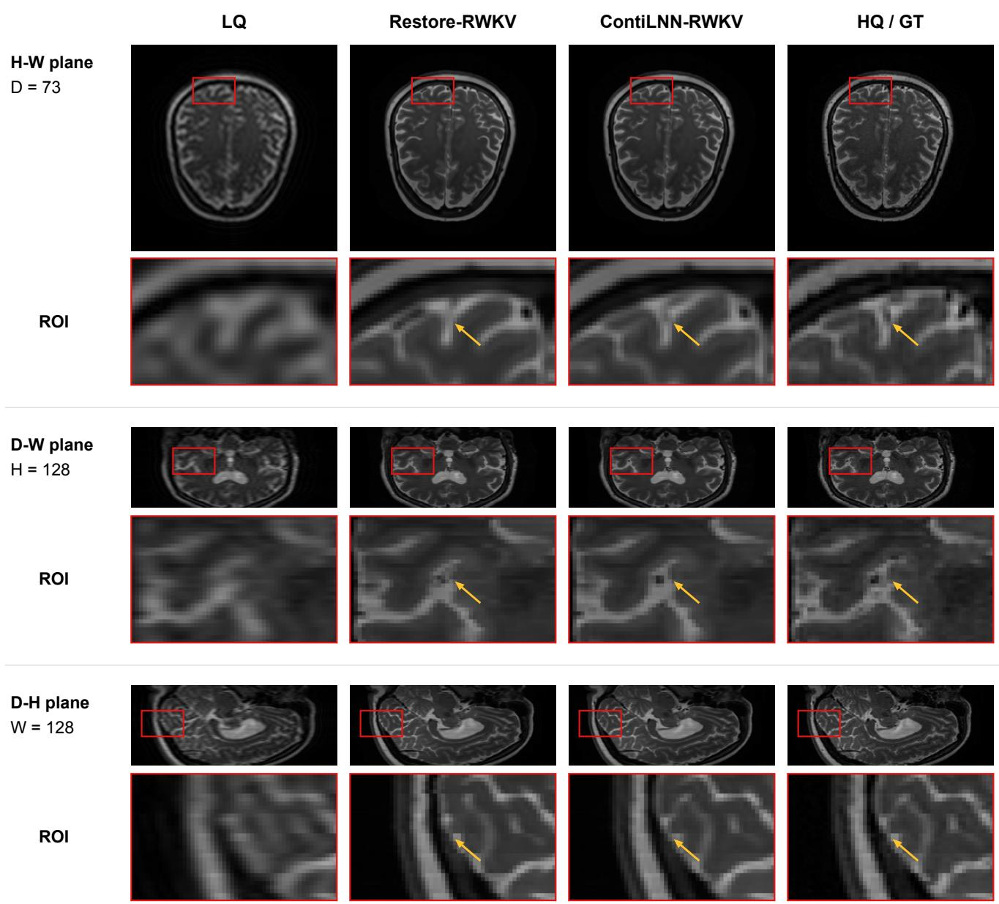  
Figure S4: MRI restoration in three orthogonal index-space planes for IXI574-IOP-1156-T2. Columns show LQ, Restore-RWKV, ContiLNN-RWKV and HQ images. Red boxes mark matched regions of interest, enlarged below; yellow arrows indicate corresponding local structures. D, H and W denote slice index, row and column, respectively (zero-based). The full planes retain the complete available field of view across the 100 processed slices. All panels share the display range [0, 4095] and use index-space aspect ratios; physical spacing is unavailable in the processed data.

Restore-RWKV  
LQ  
ContiLNN-RWKV  
HQ / GT  
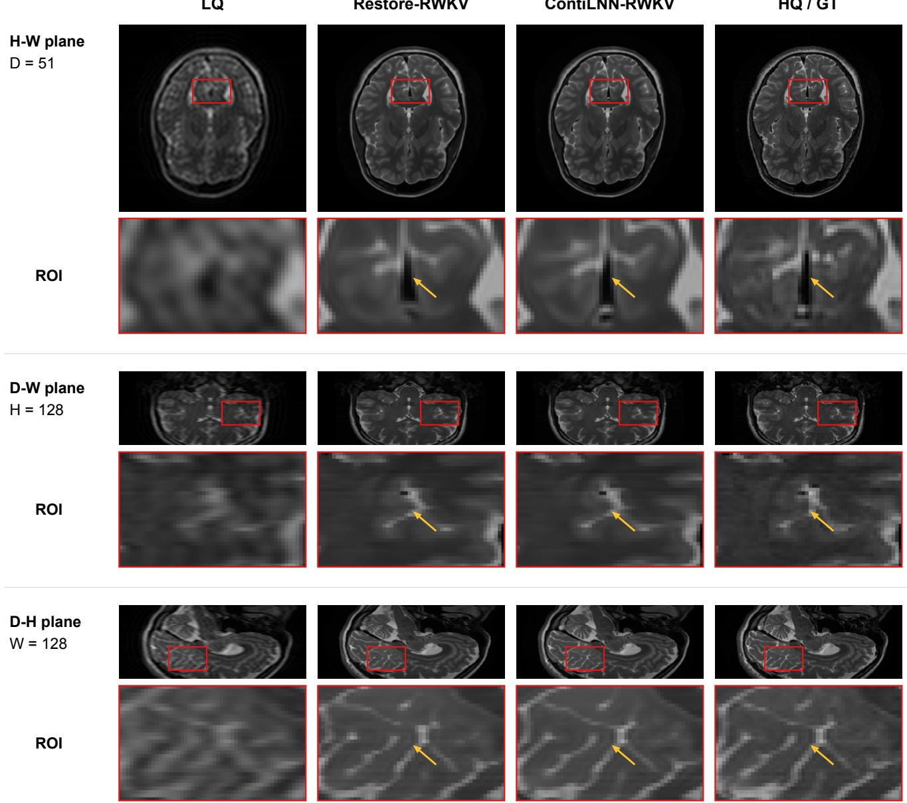  
Figure S5: MRI restoration in three orthogonal index-space planes for IXI230-IOP-0869-T2. Red-boxed regions are enlarged below each full plane, with yellow arrows marking corresponding local structures. The four columns use identical coordinates and display settings. As in Fig. S4, D, H and W denote zero-based slice, row and column indices; all 100 processed slices are retained in the D-axis reformats. The display range is [0, 4095], and aspect ratios follow array indices rather than physical distances.

## H Additional mixed-gap training study

Mixed-gap training examines whether exposure to varied slice-index gaps improves restoration when neighboring context becomes sparse or irregular (Table S5). Relative to contiguous training, Bi-CfC gains 0.5525, 1.3300 and 0.4032 dB in PSNR at $g = 2 , g = 3$ and irregular sampling, respectively. The corresponding gains for Bi-GRU are 0.6530, 1.4685 and 0.4535 dB. Both operators also improve in SSIM and RMSE in these three settings.

At g = 1, contiguous training retains PSNR advantages of 0.1568 dB for Bi-CfC and 0.0635 dB for Bi-GRU. After mixed-gap training, Bi-GRU achieves marginally higher PSNR at the three uniform gaps, whereas Bi-CfC retains higher SSIM across all four contexts and performs better in all three metrics under irregular sampling.

These results identify mixed-gap training as a complementary strategy for restoration with partially available neighboring context. The benefit extends to both sequence operators, indicating that exposure to varied training gaps contributes to the observed adaptation.

Table S5: Additional PET sampling experiments on the 29-case test cohort. Both operators are evaluated after contiguous and mixed-gap training at uniform gaps g = 1, 2, 3 and irregular combinations of these gaps. Mixed-gap training uses a constant gap within each window and varies the gap across windows. Bold indicates the better training strategy for each operator and test context.
<table><tr><td>Operator</td><td>Test context</td><td>Training</td><td>PSNR ↑</td><td>SSIM ↑</td><td>RMSE↓</td></tr><tr><td>Bi-GRU</td><td>g = 1</td><td>Contiguous</td><td>38.5176</td><td>0.9538</td><td>0.0753</td></tr><tr><td></td><td></td><td>Mixed-gap</td><td>38.4541</td><td>0.9522</td><td>0.0757</td></tr><tr><td></td><td>g = 2</td><td>Contiguous Mixed-gap</td><td>37.6217 38.2747</td><td>0.9462 0.9517</td><td>0.0826 0.0772</td></tr><tr><td></td><td>g = 3</td><td>Contiguous</td><td>36.5295</td><td>0.9366</td><td>0.0940</td></tr><tr><td></td><td></td><td>Mixed-gap</td><td>37.9980</td><td>0.9504</td><td>0.0796</td></tr><tr><td></td><td>Irregular</td><td>Contiguous</td><td>37.8544</td><td>0.9465</td><td>0.0802</td></tr><tr><td>Bi-CfC</td><td></td><td>Mixed-gap</td><td>38.3080</td><td>0.9518</td><td>0.0768</td></tr><tr><td></td><td>g = 1</td><td>Contiguous</td><td>38.5868</td><td>0.9546</td><td>0.0744</td></tr><tr><td></td><td></td><td>Mixed-gap</td><td>38.4301</td><td>0.9527</td><td>0.0759</td></tr><tr><td></td><td>g = 2</td><td>Contiguous</td><td>37.7136</td><td></td><td></td></tr><tr><td></td><td></td><td>Mixed-gap</td><td>38.2661</td><td>0.9476 0.9521</td><td>0.0817 0.0772</td></tr><tr><td></td><td>g = 3</td><td></td><td></td><td></td><td></td></tr><tr><td></td><td></td><td>Contiguous Mixed-gap</td><td>36.6652 37.9952</td><td>0.9393</td><td>0.0927</td></tr><tr><td></td><td></td><td></td><td></td><td>0.9510</td><td>0.0796</td></tr><tr><td></td><td>Irregular</td><td>Contiguous</td><td>37.9494</td><td>0.9479</td><td>0.0793</td></tr><tr><td></td><td></td><td>Mixed-gap</td><td>38.3527</td><td>0.9522</td><td>0.0764</td></tr></table>

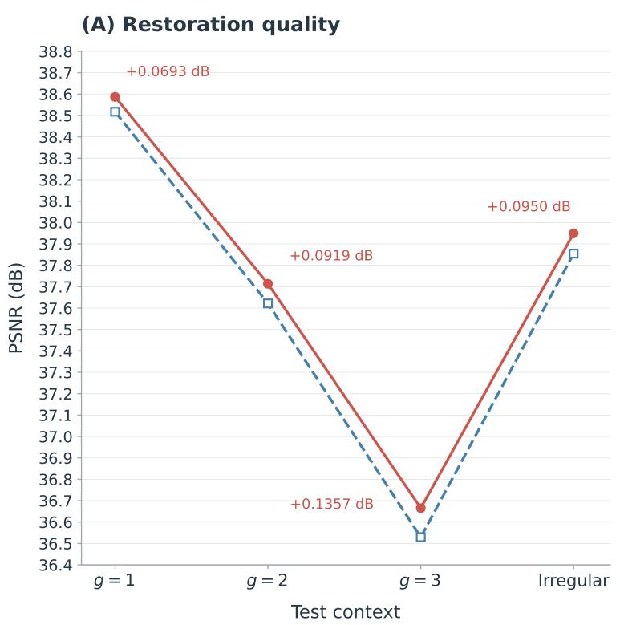

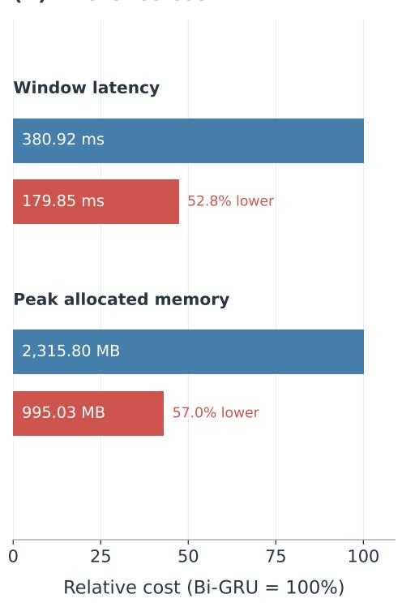  
Figure S6: Bi-CfC and Bi-GRU trained on contiguous slices. (A) Mean PET PSNR across 29 test cases under four sampling conditions (main Table 2); annotations show Bi-CfC minus Bi-GRU. Lines connect categorical conditions for visual comparison. (B) Seven-slice window latency and peak allocated GPU memory under the main Table 4 profiling conditions, normalized to Bi-GRU; labels report absolute values and relative reductions.

Table S6: PET context-perturbation results for all 29 test cases under four conditions (116 records). Each metric is the mean over the same ten evaluated center slices within a case. ∆ denotes the condition result minus the ordered-context result for the same case; negative PSNR or SSIM changes and positive RMSE changes indicate deterioration. PSNR and its change are in dB; SSIM is dimensionless and RMSE retains the original evaluation units. Metrics and diferences are rounded independently to six decimal places.
<table><tr><td></td><td rowspan=1 colspan=10>Case        Context                 PSNR  ∆PSNR    SSIM   ∆SSIM   RMSE∆RMSE</td></tr><tr><td></td><td rowspan=1 colspan=4>Patient 10  Ordered (default)</td><td rowspan=1 colspan=1>36.761593</td><td rowspan=1 colspan=1>0.000000</td><td rowspan=1 colspan=1>0.948692</td><td rowspan=1 colspan=1>0.000000</td><td rowspan=1 colspan=1>0.073840</td><td rowspan=1 colspan=1>0.000000</td></tr><tr><td></td><td rowspan=1 colspan=1>Patient</td><td rowspan=1 colspan=1>10</td><td rowspan=1 colspan=1>Reversed</td><td rowspan=1 colspan=1></td><td rowspan=1 colspan=1>36.449061</td><td rowspan=1 colspan=1>-0.312532</td><td rowspan=1 colspan=1>0.946832</td><td rowspan=1 colspan=1>-0.001860</td><td rowspan=1 colspan=1>0.077593</td><td rowspan=1 colspan=1>0.003753</td></tr><tr><td></td><td rowspan=1 colspan=1>Patient</td><td rowspan=1 colspan=1>10</td><td rowspan=1 colspan=1>Center-re</td><td rowspan=1 colspan=1>peated</td><td rowspan=1 colspan=1>34.391667</td><td rowspan=1 colspan=1>-2.369926</td><td rowspan=1 colspan=1>0.928067</td><td rowspan=1 colspan=1>-0.020624</td><td rowspan=1 colspan=1>0.094301</td><td rowspan=1 colspan=1>0.020461</td></tr><tr><td></td><td rowspan=1 colspan=1>Patient</td><td rowspan=1 colspan=1>10</td><td rowspan=1 colspan=1>Nonlocal</td><td rowspan=1 colspan=1>same-case</td><td rowspan=1 colspan=1>31.008852</td><td rowspan=1 colspan=1>-5.752742</td><td rowspan=1 colspan=1>0.859689</td><td rowspan=1 colspan=1>-0.089003</td><td rowspan=1 colspan=1>0.142358</td><td rowspan=1 colspan=1>0.068518</td></tr><tr><td></td><td rowspan=1 colspan=1>Patient</td><td rowspan=1 colspan=1>101</td><td rowspan=1 colspan=1>Ordered (d</td><td rowspan=1 colspan=1>efault)</td><td rowspan=1 colspan=1>38.906556</td><td rowspan=1 colspan=1>0.000000</td><td rowspan=1 colspan=1>0.952976</td><td rowspan=1 colspan=1>0.000000</td><td rowspan=1 colspan=1>0.062351</td><td rowspan=1 colspan=1>0.000000</td></tr><tr><td></td><td rowspan=1 colspan=1>Patient</td><td rowspan=1 colspan=1>101</td><td rowspan=1 colspan=1>Reversed</td><td rowspan=1 colspan=1></td><td rowspan=1 colspan=1>38.850965</td><td rowspan=1 colspan=1>-0.055590</td><td rowspan=1 colspan=1>0.952068</td><td rowspan=1 colspan=1>-0.000908</td><td rowspan=1 colspan=1>0.062559</td><td rowspan=1 colspan=1>0.000207</td></tr><tr><td></td><td rowspan=1 colspan=1>Patient</td><td rowspan=1 colspan=1>101</td><td rowspan=1 colspan=1>Center-re</td><td rowspan=1 colspan=1>peated</td><td rowspan=1 colspan=1>36.193087</td><td rowspan=1 colspan=1>-2.713469</td><td rowspan=1 colspan=1>0.935912</td><td rowspan=1 colspan=1>-0.017064</td><td rowspan=1 colspan=1>0.081845</td><td rowspan=1 colspan=1>0.019493</td></tr><tr><td></td><td rowspan=1 colspan=1>Patient</td><td rowspan=1 colspan=1>101</td><td rowspan=1 colspan=1>Nonlocal</td><td rowspan=1 colspan=1>same-case</td><td rowspan=1 colspan=1>33.117327</td><td rowspan=1 colspan=1>-5.789229</td><td rowspan=1 colspan=1>0.888393</td><td rowspan=1 colspan=1>-0.064584</td><td rowspan=1 colspan=1>0.115678</td><td rowspan=1 colspan=1>0.053326</td></tr><tr><td></td><td rowspan=1 colspan=1>Patient</td><td rowspan=1 colspan=1>103</td><td rowspan=1 colspan=1>Ordered (d</td><td rowspan=1 colspan=1>efault)</td><td rowspan=1 colspan=1>39.423093</td><td rowspan=1 colspan=1>0.000000</td><td rowspan=1 colspan=1>0.958721</td><td rowspan=1 colspan=1>0.000000</td><td rowspan=1 colspan=1>0.061477</td><td rowspan=1 colspan=1>0.000000</td></tr><tr><td></td><td rowspan=1 colspan=1>Patient</td><td rowspan=1 colspan=1>103</td><td rowspan=1 colspan=1>Reversed</td><td rowspan=1 colspan=1></td><td rowspan=1 colspan=1>39.186257</td><td rowspan=1 colspan=1>-0.236837</td><td rowspan=1 colspan=1>0.957317</td><td rowspan=1 colspan=1>-0.001405</td><td rowspan=1 colspan=1>0.063164</td><td rowspan=1 colspan=1>0.001687</td></tr><tr><td></td><td rowspan=1 colspan=1>Patient</td><td rowspan=1 colspan=1>103</td><td rowspan=1 colspan=1>Center-re</td><td rowspan=1 colspan=1>peated</td><td rowspan=1 colspan=1>36.511077</td><td rowspan=1 colspan=1>-2.912017</td><td rowspan=1 colspan=1>0.941561</td><td rowspan=1 colspan=1>-0.017161</td><td rowspan=1 colspan=1>0.083987</td><td rowspan=1 colspan=1>0.022510</td></tr><tr><td></td><td rowspan=1 colspan=1>Patient</td><td rowspan=1 colspan=1>103</td><td rowspan=1 colspan=1>Nonlocal</td><td rowspan=1 colspan=1>same-case</td><td rowspan=1 colspan=1>31.880395</td><td rowspan=1 colspan=1>-7.542698</td><td rowspan=1 colspan=1>0.887479</td><td rowspan=1 colspan=1>-0.071242</td><td rowspan=1 colspan=1>0.149856</td><td rowspan=1 colspan=1>0.088379</td></tr><tr><td></td><td rowspan=1 colspan=1>Patient</td><td rowspan=1 colspan=1>106</td><td rowspan=1 colspan=1>Ordered (d</td><td rowspan=1 colspan=1>efault)</td><td rowspan=1 colspan=1>38.440922</td><td rowspan=1 colspan=1>0.000000</td><td rowspan=1 colspan=1>0.957367</td><td rowspan=1 colspan=1>0.000000</td><td rowspan=1 colspan=1>0.084605</td><td rowspan=1 colspan=1>0.000000</td></tr><tr><td></td><td rowspan=1 colspan=1>Patient</td><td rowspan=1 colspan=1>106</td><td rowspan=1 colspan=1>Reversed</td><td rowspan=1 colspan=1></td><td rowspan=1 colspan=1>38.069264</td><td rowspan=1 colspan=1>-0.371658</td><td rowspan=1 colspan=1>0.954919</td><td rowspan=1 colspan=1>-0.002448</td><td rowspan=1 colspan=1>0.087901</td><td rowspan=1 colspan=1>0.003296</td></tr><tr><td></td><td rowspan=1 colspan=1>Patient</td><td rowspan=1 colspan=1>106</td><td rowspan=1 colspan=1>Center-re</td><td rowspan=1 colspan=1>peated</td><td rowspan=1 colspan=1>35.742716</td><td rowspan=1 colspan=1>-2.698206</td><td rowspan=1 colspan=1>0.939603</td><td rowspan=1 colspan=1>-0.017764</td><td rowspan=1 colspan=1>0.106971</td><td rowspan=1 colspan=1>0.022366</td></tr><tr><td></td><td rowspan=1 colspan=1>Patient</td><td rowspan=1 colspan=1>106</td><td rowspan=1 colspan=1>Nonlocal</td><td rowspan=1 colspan=1>same-case</td><td rowspan=1 colspan=1>31.840640</td><td rowspan=1 colspan=1>-6.600282</td><td rowspan=1 colspan=1>0.877543</td><td rowspan=1 colspan=1>-0.079823</td><td rowspan=1 colspan=1>0.168198</td><td rowspan=1 colspan=1>0.083593</td></tr><tr><td></td><td rowspan=1 colspan=1>Patient</td><td rowspan=1 colspan=1>112</td><td rowspan=1 colspan=1>Ordered (d</td><td rowspan=1 colspan=1>efault)</td><td rowspan=1 colspan=1>37.647933</td><td rowspan=1 colspan=1>0.000000</td><td rowspan=1 colspan=1>0.949370</td><td rowspan=1 colspan=1>0.000000</td><td rowspan=1 colspan=1>0.079394</td><td rowspan=1 colspan=1>0.000000</td></tr><tr><td></td><td rowspan=1 colspan=1>Patient</td><td rowspan=1 colspan=1>112</td><td rowspan=1 colspan=1>Reversed</td><td rowspan=1 colspan=1></td><td rowspan=1 colspan=1>37.213270</td><td rowspan=1 colspan=1>-0.434663</td><td rowspan=1 colspan=1>0.947025</td><td rowspan=1 colspan=1>-0.002346</td><td rowspan=1 colspan=1>0.084175</td><td rowspan=1 colspan=1>0.004781</td></tr><tr><td></td><td rowspan=1 colspan=1>Patient</td><td rowspan=1 colspan=1>112</td><td rowspan=1 colspan=1>Center-re</td><td rowspan=1 colspan=1>peated</td><td rowspan=1 colspan=1>34.939279</td><td rowspan=1 colspan=1>-2.708655</td><td rowspan=1 colspan=1>0.930451</td><td rowspan=1 colspan=1>-0.018919</td><td rowspan=1 colspan=1>0.104146</td><td rowspan=1 colspan=1>0.024752</td></tr><tr><td></td><td rowspan=1 colspan=1>Patient</td><td rowspan=1 colspan=1>112</td><td rowspan=1 colspan=1>Nonlocal</td><td rowspan=1 colspan=1>same-case</td><td rowspan=1 colspan=1>30.240319</td><td rowspan=1 colspan=1>-7.407614</td><td rowspan=1 colspan=1>0.845936</td><td rowspan=1 colspan=1>-0.103434</td><td rowspan=1 colspan=1>0.174975</td><td rowspan=1 colspan=1>0.095581</td></tr><tr><td></td><td rowspan=1 colspan=1>Patient</td><td rowspan=1 colspan=1>124</td><td rowspan=1 colspan=1>Ordered (d</td><td rowspan=1 colspan=1>efault)</td><td rowspan=1 colspan=1>35.552508</td><td rowspan=1 colspan=1>0.000000</td><td rowspan=1 colspan=1>0.930709</td><td rowspan=1 colspan=1>0.000000</td><td rowspan=1 colspan=1>0.082582</td><td rowspan=1 colspan=1>0.000000</td></tr><tr><td></td><td rowspan=1 colspan=1>Patient</td><td rowspan=1 colspan=1>124</td><td rowspan=1 colspan=1>Reversed</td><td rowspan=1 colspan=1></td><td rowspan=1 colspan=1>35.216282</td><td rowspan=1 colspan=1>-0.336226</td><td rowspan=1 colspan=1>0.927213</td><td rowspan=1 colspan=1>-0.003497</td><td rowspan=1 colspan=1>0.085478</td><td rowspan=1 colspan=1>0.002896</td></tr><tr><td></td><td rowspan=1 colspan=1>Patient</td><td rowspan=1 colspan=1>124</td><td rowspan=1 colspan=1>Center-re</td><td rowspan=1 colspan=1>peated</td><td rowspan=1 colspan=1>33.083976</td><td rowspan=1 colspan=1>-2.468532</td><td rowspan=1 colspan=1>0.907105</td><td rowspan=1 colspan=1>-0.023605</td><td rowspan=1 colspan=1>0.105432</td><td rowspan=1 colspan=1>0.022850</td></tr><tr><td></td><td rowspan=1 colspan=1>Patient</td><td rowspan=1 colspan=1>124</td><td rowspan=1 colspan=1>Nonlocal</td><td rowspan=1 colspan=1>same-case</td><td rowspan=1 colspan=1>29.728979</td><td rowspan=1 colspan=1>-5.823529</td><td rowspan=1 colspan=1>0.834091</td><td rowspan=1 colspan=1>-0.096619</td><td rowspan=1 colspan=1>0.162336</td><td rowspan=1 colspan=1>0.079753</td></tr><tr><td></td><td rowspan=1 colspan=1>Patient</td><td rowspan=1 colspan=1>125</td><td rowspan=1 colspan=1>Ordered (d</td><td rowspan=1 colspan=1>efault)</td><td rowspan=1 colspan=1>34.246244</td><td rowspan=1 colspan=1>0.000000</td><td rowspan=1 colspan=1>0.920016</td><td rowspan=1 colspan=1>0.000000</td><td rowspan=1 colspan=1>0.051651</td><td rowspan=1 colspan=1>0.000000</td></tr><tr><td></td><td rowspan=1 colspan=1>Patient</td><td rowspan=1 colspan=1>125</td><td rowspan=1 colspan=1>Reversed</td><td rowspan=1 colspan=1></td><td rowspan=1 colspan=1>33.987126</td><td rowspan=1 colspan=1>-0.259118</td><td rowspan=1 colspan=1>0.916571</td><td rowspan=1 colspan=1>-0.003445</td><td rowspan=1 colspan=1>0.053259</td><td rowspan=1 colspan=1>0.001608</td></tr><tr><td></td><td rowspan=1 colspan=1>Patient</td><td rowspan=1 colspan=1>125</td><td rowspan=1 colspan=1>Center-re</td><td rowspan=1 colspan=1>peated</td><td rowspan=1 colspan=1>32.412747</td><td rowspan=1 colspan=1>-1.833497</td><td rowspan=1 colspan=1>0.903842</td><td rowspan=1 colspan=1>-0.016174</td><td rowspan=1 colspan=1>0.062665</td><td rowspan=1 colspan=1>0.011014</td></tr><tr><td></td><td rowspan=1 colspan=1>Patient</td><td rowspan=1 colspan=1>125</td><td rowspan=1 colspan=1>Nonlocal</td><td rowspan=1 colspan=1>same-case</td><td rowspan=1 colspan=1>29.153594</td><td rowspan=1 colspan=1>-5.092650</td><td rowspan=1 colspan=1>0.833906</td><td rowspan=1 colspan=1>-0.086110</td><td rowspan=1 colspan=1>0.092980</td><td rowspan=1 colspan=1>0.041330</td></tr><tr><td></td><td rowspan=1 colspan=1>Patient</td><td rowspan=1 colspan=1>126</td><td rowspan=1 colspan=1>Ordered (d</td><td rowspan=1 colspan=1>efault)</td><td rowspan=1 colspan=1>34.311084</td><td rowspan=1 colspan=1>0.000000</td><td rowspan=1 colspan=1>0.927582</td><td rowspan=1 colspan=1>0.000000</td><td rowspan=1 colspan=1>0.096870</td><td rowspan=1 colspan=1>0.000000</td></tr><tr><td></td><td rowspan=1 colspan=1>Patient</td><td rowspan=1 colspan=1>126</td><td rowspan=1 colspan=1>Reversed</td><td rowspan=1 colspan=1></td><td rowspan=1 colspan=1>34.131184</td><td rowspan=1 colspan=1>-0.179900</td><td rowspan=1 colspan=1>0.924329</td><td rowspan=1 colspan=1>-0.003253</td><td rowspan=1 colspan=1>0.099125</td><td rowspan=1 colspan=1>0.002254</td></tr><tr><td></td><td rowspan=1 colspan=1>Patient</td><td rowspan=1 colspan=1>126</td><td rowspan=1 colspan=1>Center-re</td><td rowspan=1 colspan=1>peated</td><td rowspan=1 colspan=1>32.056365</td><td rowspan=1 colspan=1>-2.254719</td><td rowspan=1 colspan=1>0.899263</td><td rowspan=1 colspan=1>-0.028319</td><td rowspan=1 colspan=1>0.123565</td><td rowspan=1 colspan=1>0.026695</td></tr><tr><td></td><td rowspan=1 colspan=1>Patient</td><td rowspan=1 colspan=1>126</td><td rowspan=1 colspan=1>Nonlocal</td><td rowspan=1 colspan=1>same-case</td><td rowspan=1 colspan=1>29.613399</td><td rowspan=1 colspan=1>-4.697686</td><td rowspan=1 colspan=1>0.810051</td><td rowspan=1 colspan=1>-0.117531</td><td rowspan=1 colspan=1>0.166570</td><td rowspan=1 colspan=1>0.069699</td></tr><tr><td></td><td rowspan=1 colspan=1>Patient</td><td rowspan=1 colspan=1>129</td><td rowspan=1 colspan=1>Ordered (d</td><td rowspan=1 colspan=1>efault)</td><td rowspan=1 colspan=1>35.778501</td><td rowspan=1 colspan=1>0.000000</td><td rowspan=1 colspan=1>0.937247</td><td rowspan=1 colspan=1>0.000000</td><td rowspan=1 colspan=1>0.079079</td><td rowspan=1 colspan=1>0.000000</td></tr><tr><td></td><td rowspan=1 colspan=1>Patient</td><td rowspan=1 colspan=1>129</td><td rowspan=1 colspan=1>Reversed</td><td rowspan=1 colspan=1></td><td rowspan=1 colspan=1>35.400782</td><td rowspan=1 colspan=1>-0.377718</td><td rowspan=1 colspan=1>0.934703</td><td rowspan=1 colspan=1>-0.002544</td><td rowspan=1 colspan=1>0.083189</td><td rowspan=1 colspan=1>0.004110</td></tr><tr><td></td><td rowspan=1 colspan=1>Patient</td><td rowspan=1 colspan=1>129</td><td rowspan=1 colspan=1>Center-re</td><td rowspan=1 colspan=1>peated</td><td rowspan=1 colspan=1>33.405693</td><td rowspan=1 colspan=1>-2.372808</td><td rowspan=1 colspan=1>0.916115</td><td rowspan=1 colspan=1>-0.021132</td><td rowspan=1 colspan=1>0.100654</td><td rowspan=1 colspan=1>0.021576</td></tr><tr><td></td><td rowspan=1 colspan=1>Patient</td><td rowspan=1 colspan=1>129</td><td rowspan=1 colspan=1>Nonlocal</td><td rowspan=1 colspan=1>same-case</td><td rowspan=1 colspan=1>30.415584</td><td rowspan=1 colspan=1>-5.362917</td><td rowspan=1 colspan=1>0.836156</td><td rowspan=1 colspan=1>-0.101091</td><td rowspan=1 colspan=1>0.146956</td><td rowspan=1 colspan=1>0.067877</td></tr><tr><td></td><td rowspan=1 colspan=1>Patient</td><td rowspan=1 colspan=1>142</td><td rowspan=1 colspan=1>Ordered (d</td><td rowspan=1 colspan=1>efault)</td><td rowspan=1 colspan=1>35.583863</td><td rowspan=1 colspan=1>0.000000</td><td rowspan=1 colspan=1>0.937662</td><td rowspan=1 colspan=1>0.000000</td><td rowspan=1 colspan=1>0.077916</td><td rowspan=1 colspan=1>0.000000</td></tr><tr><td></td><td rowspan=1 colspan=1>Patient</td><td rowspan=1 colspan=1>142</td><td rowspan=1 colspan=1>Reversed</td><td rowspan=1 colspan=1></td><td rowspan=1 colspan=1>35.191704</td><td rowspan=1 colspan=1>-0.392158</td><td rowspan=1 colspan=1>0.934590</td><td rowspan=1 colspan=1>-0.003072</td><td rowspan=1 colspan=1>0.081630</td><td rowspan=1 colspan=1>0.003714</td></tr><tr><td></td><td rowspan=1 colspan=1>Patient</td><td rowspan=1 colspan=1>142</td><td rowspan=1 colspan=1>Center-re</td><td rowspan=1 colspan=1>peated</td><td rowspan=1 colspan=1>33.089205</td><td rowspan=1 colspan=1>-2.494658</td><td rowspan=1 colspan=1>0.913623</td><td rowspan=1 colspan=1>-0.024039</td><td rowspan=1 colspan=1>0.100648</td><td rowspan=1 colspan=1>0.022732</td></tr><tr><td></td><td rowspan=1 colspan=1>Patient</td><td rowspan=1 colspan=1>142</td><td rowspan=1 colspan=1>Nonlocal</td><td rowspan=1 colspan=1>same-case</td><td rowspan=1 colspan=1>30.329091</td><td rowspan=1 colspan=1>-5.254772</td><td rowspan=1 colspan=1>0.847152</td><td rowspan=1 colspan=1>-0.090510</td><td rowspan=1 colspan=1>0.143359</td><td rowspan=1 colspan=1>0.065443</td></tr><tr><td></td><td rowspan=1 colspan=1>Patient</td><td rowspan=1 colspan=1>145</td><td rowspan=1 colspan=1>Ordered (d</td><td rowspan=1 colspan=1>efault)</td><td rowspan=1 colspan=1>38.446787</td><td rowspan=1 colspan=1>0.000000</td><td rowspan=1 colspan=1>0.959709</td><td rowspan=1 colspan=1>0.000000</td><td rowspan=1 colspan=1>0.075416</td><td rowspan=1 colspan=1>0.000000</td></tr><tr><td rowspan=1 colspan=1>P</td><td rowspan=1 colspan=1>atient</td><td rowspan=1 colspan=1>145</td><td rowspan=1 colspan=1>Reversed</td><td rowspan=1 colspan=1></td><td rowspan=1 colspan=1>38.160992</td><td rowspan=1 colspan=1>-0.285794</td><td rowspan=1 colspan=1>0.957976</td><td rowspan=1 colspan=1>-0.001733</td><td rowspan=1 colspan=1>0.078248</td><td rowspan=1 colspan=1>0.002832</td></tr><tr><td rowspan=1 colspan=1>P</td><td rowspan=1 colspan=1>atient</td><td rowspan=1 colspan=1>145</td><td rowspan=1 colspan=1>Center-re</td><td rowspan=1 colspan=1>peated</td><td rowspan=1 colspan=1>35.758012</td><td rowspan=1 colspan=1>-2.688774</td><td rowspan=1 colspan=1>0.942517</td><td rowspan=1 colspan=1>-0.017193</td><td rowspan=1 colspan=1>0.099953</td><td rowspan=1 colspan=1>0.024537</td></tr><tr><td rowspan=1 colspan=1>P</td><td rowspan=1 colspan=1>atient</td><td rowspan=1 colspan=1>145</td><td rowspan=1 colspan=1>Nonlocal</td><td rowspan=1 colspan=1>same-case</td><td rowspan=1 colspan=1>31.776824</td><td rowspan=1 colspan=1>-6.669962</td><td rowspan=1 colspan=1>0.867212</td><td rowspan=1 colspan=1>-0.092497</td><td rowspan=1 colspan=1>0.158932</td><td rowspan=1 colspan=1>0.083515</td></tr><tr><td rowspan=1 colspan=1>P</td><td rowspan=1 colspan=1>atient</td><td rowspan=1 colspan=1>146</td><td rowspan=1 colspan=1>Ordered (d</td><td rowspan=1 colspan=1>efault)</td><td rowspan=1 colspan=1>37.617776</td><td rowspan=1 colspan=1>0.000000</td><td rowspan=1 colspan=1>0.951471</td><td rowspan=1 colspan=1>0.000000</td><td rowspan=1 colspan=1>0.098457</td><td rowspan=1 colspan=1>0.000000</td></tr><tr><td rowspan=1 colspan=1>P</td><td rowspan=1 colspan=1>atient</td><td rowspan=1 colspan=1>146</td><td rowspan=1 colspan=1>Reversed</td><td rowspan=1 colspan=1></td><td rowspan=1 colspan=1>37.203507</td><td rowspan=1 colspan=1>-0.414269</td><td rowspan=1 colspan=1>0.949493</td><td rowspan=1 colspan=1>-0.001978</td><td rowspan=1 colspan=1>0.103322</td><td rowspan=1 colspan=1>0.004865</td></tr><tr><td rowspan=1 colspan=1>P</td><td rowspan=1 colspan=1>atient</td><td rowspan=1 colspan=1>146</td><td rowspan=1 colspan=1>Center-re</td><td rowspan=1 colspan=1>peated</td><td rowspan=1 colspan=1>35.446814</td><td rowspan=1 colspan=1>-2.170962</td><td rowspan=1 colspan=1>0.934857</td><td rowspan=1 colspan=1>-0.016614</td><td rowspan=1 colspan=1>0.121174</td><td rowspan=1 colspan=1>0.022717</td></tr><tr><td rowspan=1 colspan=1>P</td><td rowspan=1 colspan=1>atient</td><td rowspan=1 colspan=1>146</td><td rowspan=1 colspan=1>Nonlocal</td><td rowspan=1 colspan=1>same-case</td><td rowspan=1 colspan=1>32.671686</td><td rowspan=1 colspan=1>-4.946090</td><td rowspan=1 colspan=1>0.888647</td><td rowspan=1 colspan=1>-0.062825</td><td rowspan=1 colspan=1>0.165737</td><td rowspan=1 colspan=1>0.067280</td></tr><tr><td rowspan=1 colspan=1>P</td><td rowspan=1 colspan=1>atient</td><td rowspan=1 colspan=1>15</td><td rowspan=1 colspan=1>Ordered (d</td><td rowspan=1 colspan=1>efault)</td><td rowspan=1 colspan=1>40.962795</td><td rowspan=1 colspan=1>0.000000</td><td rowspan=1 colspan=1>0.971458</td><td rowspan=1 colspan=1>0.000000</td><td rowspan=1 colspan=1>0.075801</td><td rowspan=1 colspan=1>0.000000</td></tr><tr><td rowspan=1 colspan=1>P</td><td rowspan=1 colspan=1>atient</td><td rowspan=1 colspan=1>15</td><td rowspan=1 colspan=1>Reversed</td><td rowspan=1 colspan=1></td><td rowspan=1 colspan=1>40.712937</td><td rowspan=1 colspan=1>-0.249859</td><td rowspan=1 colspan=1>0.969814</td><td rowspan=1 colspan=1>-0.001644</td><td rowspan=1 colspan=1>0.078246</td><td rowspan=1 colspan=1>0.002445</td></tr><tr><td rowspan=1 colspan=1>P</td><td rowspan=1 colspan=1>atient</td><td rowspan=1 colspan=1>15</td><td rowspan=1 colspan=1>Center-re</td><td rowspan=1 colspan=1>peated</td><td rowspan=1 colspan=1>38.253667</td><td rowspan=1 colspan=1>-2.709128</td><td rowspan=1 colspan=1>0.956811</td><td rowspan=1 colspan=1>-0.014647</td><td rowspan=1 colspan=1>0.103506</td><td rowspan=1 colspan=1>0.027705</td></tr><tr><td rowspan=1 colspan=1>P</td><td rowspan=1 colspan=1>atient</td><td rowspan=1 colspan=1>15</td><td rowspan=1 colspan=1>Nonlocal</td><td rowspan=1 colspan=1>same-case</td><td rowspan=1 colspan=1>34.631902</td><td rowspan=1 colspan=1>-6.330893</td><td rowspan=1 colspan=1>0.923857</td><td rowspan=1 colspan=1>-0.047601</td><td rowspan=1 colspan=1>0.158798</td><td rowspan=1 colspan=1>0.082997</td></tr><tr><td rowspan=1 colspan=1>P</td><td rowspan=1 colspan=1>atient 1</td><td rowspan=1 colspan=1>50</td><td rowspan=1 colspan=1>Ordered (d</td><td rowspan=1 colspan=1>efault)</td><td rowspan=1 colspan=1>38.129044</td><td rowspan=1 colspan=1>0.000000</td><td rowspan=1 colspan=1>0.955725</td><td rowspan=1 colspan=1>0.000000</td><td rowspan=1 colspan=1>0.077390</td><td rowspan=1 colspan=1>0.000000</td></tr><tr><td rowspan=1 colspan=1>P</td><td rowspan=1 colspan=1>atient</td><td rowspan=1 colspan=1>150</td><td rowspan=1 colspan=1>Reversed</td><td rowspan=1 colspan=1></td><td rowspan=1 colspan=1>37.880455</td><td rowspan=1 colspan=1>-0.248589</td><td rowspan=1 colspan=1>0.953694</td><td rowspan=1 colspan=1>-0.002030</td><td rowspan=1 colspan=1>0.078965</td><td rowspan=1 colspan=1>0.001575</td></tr><tr><td rowspan=1 colspan=1>P</td><td rowspan=1 colspan=1>atient</td><td rowspan=1 colspan=1>150</td><td rowspan=1 colspan=1>Center-re</td><td rowspan=1 colspan=1>peated</td><td rowspan=1 colspan=1>35.868792</td><td rowspan=1 colspan=1>-2.260253</td><td rowspan=1 colspan=1>0.936367</td><td rowspan=1 colspan=1>-0.019358</td><td rowspan=1 colspan=1>0.095018</td><td rowspan=1 colspan=1>0.017628</td></tr><tr><td rowspan=1 colspan=1>P</td><td rowspan=1 colspan=1>atient</td><td rowspan=1 colspan=1>150</td><td rowspan=1 colspan=1>Nonlocal</td><td rowspan=1 colspan=1>same-case</td><td rowspan=1 colspan=1>32.463270</td><td rowspan=1 colspan=1>-5.665774</td><td rowspan=1 colspan=1>0.872491</td><td rowspan=1 colspan=1>-0.083234</td><td rowspan=1 colspan=1>0.141190</td><td rowspan=1 colspan=1>0.063800</td></tr></table>

Continued on the next page

Table S6 continued
<table><tr><td rowspan=1 colspan=9>Case        Context                 PSNR  ∆PSNR    SSIM   ∆SSIM   RMSE ∆RMSE</td></tr><tr><td rowspan=1 colspan=3>Patient 158 Ordered (default)</td><td rowspan=1 colspan=1>35.070730</td><td rowspan=1 colspan=1>0.000000</td><td rowspan=1 colspan=1>0.931075</td><td rowspan=1 colspan=1>0.000000</td><td rowspan=1 colspan=1>0.103789</td><td rowspan=1 colspan=1>0.000000</td></tr><tr><td rowspan=1 colspan=1>Patient 158</td><td rowspan=1 colspan=2>Reversed</td><td rowspan=1 colspan=1>34.668173</td><td rowspan=1 colspan=1>-0.402558</td><td rowspan=1 colspan=1>0.926429</td><td rowspan=1 colspan=1>-0.004646</td><td rowspan=1 colspan=1>0.107839</td><td rowspan=1 colspan=1>0.004050</td></tr><tr><td rowspan=1 colspan=1>Patient 158</td><td rowspan=1 colspan=2>Center-repeated</td><td rowspan=1 colspan=1>32.009709</td><td rowspan=1 colspan=1>-3.061022</td><td rowspan=1 colspan=1>0.899749</td><td rowspan=1 colspan=1>-0.031326</td><td rowspan=1 colspan=1>0.140108</td><td rowspan=1 colspan=1>0.036318</td></tr><tr><td rowspan=1 colspan=1>Patient 158</td><td rowspan=1 colspan=2>Nonlocal same-case</td><td rowspan=1 colspan=1>29.852387</td><td rowspan=1 colspan=1>-5.218343</td><td rowspan=1 colspan=1>0.833674</td><td rowspan=1 colspan=1>-0.097401</td><td rowspan=1 colspan=1>0.188120</td><td rowspan=1 colspan=1>0.084331</td></tr><tr><td rowspan=1 colspan=1>Patient 20</td><td rowspan=1 colspan=1>Ordered (</td><td rowspan=1 colspan=1>default)</td><td rowspan=1 colspan=1>39.811874</td><td rowspan=1 colspan=1>0.000000</td><td rowspan=1 colspan=1>0.971265</td><td rowspan=1 colspan=1>0.000000</td><td rowspan=1 colspan=1>0.092518</td><td rowspan=1 colspan=1>0.000000</td></tr><tr><td rowspan=1 colspan=1>Patient 20</td><td rowspan=1 colspan=1>Reversed</td><td rowspan=1 colspan=1></td><td rowspan=1 colspan=1>39.621685</td><td rowspan=1 colspan=1>-0.190189</td><td rowspan=1 colspan=1>0.970323</td><td rowspan=1 colspan=1>-0.000942</td><td rowspan=1 colspan=1>0.093760</td><td rowspan=1 colspan=1>0.001242</td></tr><tr><td rowspan=1 colspan=1>Patient 20</td><td rowspan=1 colspan=1>Center-re</td><td rowspan=1 colspan=1>peated</td><td rowspan=1 colspan=1>37.181179</td><td rowspan=1 colspan=1>-2.630695</td><td rowspan=1 colspan=1>0.960268</td><td rowspan=1 colspan=1>-0.010997</td><td rowspan=1 colspan=1>0.122151</td><td rowspan=1 colspan=1>0.029633</td></tr><tr><td rowspan=1 colspan=1>Patient 20</td><td rowspan=1 colspan=1>Nonlocal</td><td rowspan=1 colspan=1>same-case</td><td rowspan=1 colspan=1>33.928895</td><td rowspan=1 colspan=1>-5.882979</td><td rowspan=1 colspan=1>0.924185</td><td rowspan=1 colspan=1>-0.047080</td><td rowspan=1 colspan=1>0.176277</td><td rowspan=1 colspan=1>0.083759</td></tr><tr><td rowspan=1 colspan=1>Patient 3</td><td rowspan=1 colspan=1>Ordered (</td><td rowspan=1 colspan=1>default)</td><td rowspan=1 colspan=1>41.752468</td><td rowspan=1 colspan=1>0.000000</td><td rowspan=1 colspan=1>0.977102</td><td rowspan=1 colspan=1>0.000000</td><td rowspan=1 colspan=1>0.064732</td><td rowspan=1 colspan=1>0.000000</td></tr><tr><td rowspan=1 colspan=1>Patient 3</td><td rowspan=1 colspan=1>Reversed</td><td rowspan=1 colspan=1></td><td rowspan=1 colspan=1>41.638737</td><td rowspan=1 colspan=1>-0.113731</td><td rowspan=1 colspan=1>0.976417</td><td rowspan=1 colspan=1>-0.000685</td><td rowspan=1 colspan=1>0.065159</td><td rowspan=1 colspan=1>0.000428</td></tr><tr><td rowspan=1 colspan=1>Patient 3</td><td rowspan=1 colspan=1>Center-re</td><td rowspan=1 colspan=1>peated</td><td rowspan=1 colspan=1>39.191530</td><td rowspan=1 colspan=1>-2.560938</td><td rowspan=1 colspan=1>0.966135</td><td rowspan=1 colspan=1>-0.010968</td><td rowspan=1 colspan=1>0.086218</td><td rowspan=1 colspan=1>0.021486</td></tr><tr><td rowspan=1 colspan=1>Patient 3</td><td rowspan=1 colspan=1>Nonlocal</td><td rowspan=1 colspan=1>same-case</td><td rowspan=1 colspan=1>34.790951</td><td rowspan=1 colspan=1>-6.961518</td><td rowspan=1 colspan=1>0.914884</td><td rowspan=1 colspan=1>-0.062218</td><td rowspan=1 colspan=1>0.142699</td><td rowspan=1 colspan=1>0.077967</td></tr><tr><td rowspan=1 colspan=1>Patient 34</td><td rowspan=1 colspan=1>Ordered (d</td><td rowspan=1 colspan=1>efault)</td><td rowspan=1 colspan=1>42.556716</td><td rowspan=1 colspan=1>0.000000</td><td rowspan=1 colspan=1>0.978345</td><td rowspan=1 colspan=1>0.000000</td><td rowspan=1 colspan=1>0.070179</td><td rowspan=1 colspan=1>0.000000</td></tr><tr><td rowspan=1 colspan=1>Patient 34</td><td rowspan=1 colspan=1>Reversed</td><td rowspan=1 colspan=1></td><td rowspan=1 colspan=1>42.264116</td><td rowspan=1 colspan=1>-0.292600</td><td rowspan=1 colspan=1>0.977177</td><td rowspan=1 colspan=1>-0.001167</td><td rowspan=1 colspan=1>0.072261</td><td rowspan=1 colspan=1>0.002082</td></tr><tr><td rowspan=1 colspan=1>Patient 34</td><td rowspan=1 colspan=1>Center-re</td><td rowspan=1 colspan=1>peated</td><td rowspan=1 colspan=1>39.723645</td><td rowspan=1 colspan=1>-2.833071</td><td rowspan=1 colspan=1>0.970473</td><td rowspan=1 colspan=1>-0.007872</td><td rowspan=1 colspan=1>0.096387</td><td rowspan=1 colspan=1>0.026208</td></tr><tr><td rowspan=1 colspan=1>Patient 34</td><td rowspan=1 colspan=1>Nonlocal</td><td rowspan=1 colspan=1>same-case</td><td rowspan=1 colspan=1>35.095562</td><td rowspan=1 colspan=1>-7.461154</td><td rowspan=1 colspan=1>0.928046</td><td rowspan=1 colspan=1>-0.050299</td><td rowspan=1 colspan=1>0.166897</td><td rowspan=1 colspan=1>0.096718</td></tr><tr><td rowspan=1 colspan=1>Patient 36</td><td rowspan=1 colspan=1>Ordered (</td><td rowspan=1 colspan=1>default)</td><td rowspan=1 colspan=1>39.139292</td><td rowspan=1 colspan=1>0.000000</td><td rowspan=1 colspan=1>0.949931</td><td rowspan=1 colspan=1>0.000000</td><td rowspan=1 colspan=1>0.068756</td><td rowspan=1 colspan=1>0.000000</td></tr><tr><td rowspan=1 colspan=1>Patient 36</td><td rowspan=1 colspan=1>Reversed</td><td rowspan=1 colspan=1></td><td rowspan=1 colspan=1>39.024307</td><td rowspan=1 colspan=1>-0.114985</td><td rowspan=1 colspan=1>0.949092</td><td rowspan=1 colspan=1>-0.000839</td><td rowspan=1 colspan=1>0.069624</td><td rowspan=1 colspan=1>0.000868</td></tr><tr><td rowspan=1 colspan=1>Patient 36</td><td rowspan=1 colspan=1>Center-re</td><td rowspan=1 colspan=1>peated</td><td rowspan=1 colspan=1>37.091457</td><td rowspan=1 colspan=1>-2.047835</td><td rowspan=1 colspan=1>0.937786</td><td rowspan=1 colspan=1>-0.012145</td><td rowspan=1 colspan=1>0.085815</td><td rowspan=1 colspan=1>0.017059</td></tr><tr><td rowspan=1 colspan=1>Patient 36</td><td rowspan=1 colspan=1>Nonlocal</td><td rowspan=1 colspan=1>same-case</td><td rowspan=1 colspan=1>31.942837</td><td rowspan=1 colspan=1>-7.196455</td><td rowspan=1 colspan=1>0.884026</td><td rowspan=1 colspan=1>-0.065905</td><td rowspan=1 colspan=1>0.158198</td><td rowspan=1 colspan=1>0.089442</td></tr><tr><td rowspan=1 colspan=1>Patient 41</td><td rowspan=1 colspan=1>Ordered (</td><td rowspan=1 colspan=1>default)</td><td rowspan=1 colspan=1>38.679674</td><td rowspan=1 colspan=1>0.000000</td><td rowspan=1 colspan=1>0.960796</td><td rowspan=1 colspan=1>0.000000</td><td rowspan=1 colspan=1>0.064076</td><td rowspan=1 colspan=1>0.000000</td></tr><tr><td rowspan=1 colspan=1>Patient 41</td><td rowspan=1 colspan=1>Reversed</td><td rowspan=1 colspan=1></td><td rowspan=1 colspan=1>38.537203</td><td rowspan=1 colspan=1>-0.142472</td><td rowspan=1 colspan=1>0.959681</td><td rowspan=1 colspan=1>-0.001115</td><td rowspan=1 colspan=1>0.065132</td><td rowspan=1 colspan=1>0.001057</td></tr><tr><td rowspan=1 colspan=1>Patient 41</td><td rowspan=1 colspan=1>Center-re</td><td rowspan=1 colspan=1>peated</td><td rowspan=1 colspan=1>36.102895</td><td rowspan=1 colspan=1>-2.576779</td><td rowspan=1 colspan=1>0.944291</td><td rowspan=1 colspan=1>-0.016505</td><td rowspan=1 colspan=1>0.083653</td><td rowspan=1 colspan=1>0.019577</td></tr><tr><td rowspan=1 colspan=1>Patient 41</td><td rowspan=1 colspan=1>Nonlocal</td><td rowspan=1 colspan=1>same-case</td><td rowspan=1 colspan=1>32.834068</td><td rowspan=1 colspan=1>-5.845606</td><td rowspan=1 colspan=1>0.900435</td><td rowspan=1 colspan=1>-0.060361</td><td rowspan=1 colspan=1>0.127958</td><td rowspan=1 colspan=1>0.063882</td></tr><tr><td rowspan=1 colspan=1>Patient 65</td><td rowspan=1 colspan=1>Ordered (d</td><td rowspan=1 colspan=1>efault)</td><td rowspan=1 colspan=1>41.390868</td><td rowspan=1 colspan=1>0.000000</td><td rowspan=1 colspan=1>0.969749</td><td rowspan=1 colspan=1>0.000000</td><td rowspan=1 colspan=1>0.070523</td><td rowspan=1 colspan=1>0.000000</td></tr><tr><td rowspan=1 colspan=1>Patient 65</td><td rowspan=1 colspan=1>Reversed</td><td rowspan=1 colspan=1></td><td rowspan=1 colspan=1>41.104567</td><td rowspan=1 colspan=1>-0.286300</td><td rowspan=1 colspan=1>0.968606</td><td rowspan=1 colspan=1>-0.001143</td><td rowspan=1 colspan=1>0.072962</td><td rowspan=1 colspan=1>0.002439</td></tr><tr><td rowspan=1 colspan=1>Patient 65</td><td rowspan=1 colspan=1>Center-re</td><td rowspan=1 colspan=1>peated</td><td rowspan=1 colspan=1>38.271384</td><td rowspan=1 colspan=1>-3.119483</td><td rowspan=1 colspan=1>0.953104</td><td rowspan=1 colspan=1>-0.016645</td><td rowspan=1 colspan=1>0.097286</td><td rowspan=1 colspan=1>0.026763</td></tr><tr><td rowspan=1 colspan=1>Patient 65</td><td rowspan=1 colspan=1>Nonlocal</td><td rowspan=1 colspan=1>same-case</td><td rowspan=1 colspan=1>33.550288</td><td rowspan=1 colspan=1>-7.840580</td><td rowspan=1 colspan=1>0.893146</td><td rowspan=1 colspan=1>-0.076603</td><td rowspan=1 colspan=1>0.171536</td><td rowspan=1 colspan=1>0.101013</td></tr><tr><td rowspan=1 colspan=1>Patient 68</td><td rowspan=1 colspan=1>Ordered (d</td><td rowspan=1 colspan=1>efault)</td><td rowspan=1 colspan=1>43.532892</td><td rowspan=1 colspan=1>0.000000</td><td rowspan=1 colspan=1>0.976940</td><td rowspan=1 colspan=1>0.000000</td><td rowspan=1 colspan=1>0.071733</td><td rowspan=1 colspan=1>0.000000</td></tr><tr><td rowspan=1 colspan=1>Patient 68</td><td rowspan=1 colspan=1>Reversed</td><td rowspan=1 colspan=1></td><td rowspan=1 colspan=1>43.363515</td><td rowspan=1 colspan=1>-0.169377</td><td rowspan=1 colspan=1>0.976288</td><td rowspan=1 colspan=1>-0.000652</td><td rowspan=1 colspan=1>0.073002</td><td rowspan=1 colspan=1>0.001269</td></tr><tr><td rowspan=1 colspan=1>Patient 68</td><td rowspan=1 colspan=1>Center-re</td><td rowspan=1 colspan=1>peated</td><td rowspan=1 colspan=1>40.414518</td><td rowspan=1 colspan=1>-3.118374</td><td rowspan=1 colspan=1>0.964177</td><td rowspan=1 colspan=1>-0.012763</td><td rowspan=1 colspan=1>0.099909</td><td rowspan=1 colspan=1>0.028176</td></tr><tr><td rowspan=1 colspan=1>Patient 68</td><td rowspan=1 colspan=1>Nonlocal</td><td rowspan=1 colspan=1>same-case</td><td rowspan=1 colspan=1>36.863854</td><td rowspan=1 colspan=1>-6.669038</td><td rowspan=1 colspan=1>0.926691</td><td rowspan=1 colspan=1>-0.050249</td><td rowspan=1 colspan=1>0.153561</td><td rowspan=1 colspan=1>0.081828</td></tr><tr><td rowspan=1 colspan=1>Patient 78</td><td rowspan=1 colspan=1>Ordered (d</td><td rowspan=1 colspan=1>efault)</td><td rowspan=1 colspan=1>40.748344</td><td rowspan=1 colspan=1>0.000000</td><td rowspan=1 colspan=1>0.965842</td><td rowspan=1 colspan=1>0.000000</td><td rowspan=1 colspan=1>0.077276</td><td rowspan=1 colspan=1>0.000000</td></tr><tr><td rowspan=1 colspan=1>Patient 78</td><td rowspan=1 colspan=1>Reversed</td><td rowspan=1 colspan=1></td><td rowspan=1 colspan=1>40.389416</td><td rowspan=1 colspan=1>-0.358928</td><td rowspan=1 colspan=1>0.963137</td><td rowspan=1 colspan=1>-0.002705</td><td rowspan=1 colspan=1>0.080435</td><td rowspan=1 colspan=1>0.003159</td></tr><tr><td rowspan=1 colspan=1>Patient 78</td><td rowspan=1 colspan=1>Center-re</td><td rowspan=1 colspan=1>peated</td><td rowspan=1 colspan=1>37.941662</td><td rowspan=1 colspan=1>-2.806682</td><td rowspan=1 colspan=1>0.943516</td><td rowspan=1 colspan=1>-0.022327</td><td rowspan=1 colspan=1>0.105228</td><td rowspan=1 colspan=1>0.027951</td></tr><tr><td rowspan=1 colspan=1>Patient 78</td><td rowspan=1 colspan=1>Nonlocal</td><td rowspan=1 colspan=1>same-case</td><td rowspan=1 colspan=1>34.737163</td><td rowspan=1 colspan=1>-6.011181</td><td rowspan=1 colspan=1>0.919173</td><td rowspan=1 colspan=1>-0.046669</td><td rowspan=1 colspan=1>0.159874</td><td rowspan=1 colspan=1>0.082597</td></tr><tr><td rowspan=1 colspan=1>Patient 88</td><td rowspan=1 colspan=1>Ordered (d</td><td rowspan=1 colspan=1>efault)</td><td rowspan=1 colspan=1>37.900479</td><td rowspan=1 colspan=1>0.000000</td><td rowspan=1 colspan=1>0.945639</td><td rowspan=1 colspan=1>0.000000</td><td rowspan=1 colspan=1>0.067376</td><td rowspan=1 colspan=1>0.000000</td></tr><tr><td rowspan=1 colspan=1>Patient 88</td><td rowspan=1 colspan=1>Reversed</td><td rowspan=1 colspan=1></td><td rowspan=1 colspan=1>37.785339</td><td rowspan=1 colspan=1>-0.115139</td><td rowspan=1 colspan=1>0.944122</td><td rowspan=1 colspan=1>-0.001518</td><td rowspan=1 colspan=1>0.067898</td><td rowspan=1 colspan=1>0.000522</td></tr><tr><td rowspan=1 colspan=1>Patient 88</td><td rowspan=1 colspan=1>Center-re</td><td rowspan=1 colspan=1>peated</td><td rowspan=1 colspan=1>35.205895</td><td rowspan=1 colspan=1>-2.694584</td><td rowspan=1 colspan=1>0.924304</td><td rowspan=1 colspan=1>-0.021335</td><td rowspan=1 colspan=1>0.087426</td><td rowspan=1 colspan=1>0.020050</td></tr><tr><td rowspan=1 colspan=1>Patient 88</td><td rowspan=1 colspan=1>Nonlocal</td><td rowspan=1 colspan=1>same-case</td><td rowspan=1 colspan=1>31.105505</td><td rowspan=1 colspan=1>-6.794974</td><td rowspan=1 colspan=1>0.871470</td><td rowspan=1 colspan=1>-0.074169</td><td rowspan=1 colspan=1>0.147157</td><td rowspan=1 colspan=1>0.079781</td></tr><tr><td rowspan=1 colspan=1>Patient 90</td><td rowspan=1 colspan=1>Ordered (</td><td rowspan=1 colspan=1>default)</td><td rowspan=1 colspan=1>40.654854</td><td rowspan=1 colspan=1>0.000000</td><td rowspan=1 colspan=1>0.955710</td><td rowspan=1 colspan=1>0.000000</td><td rowspan=1 colspan=1>0.061844</td><td rowspan=1 colspan=1>0.000000</td></tr><tr><td rowspan=1 colspan=1>Patient 90</td><td rowspan=1 colspan=1>Reversed</td><td rowspan=1 colspan=1></td><td rowspan=1 colspan=1>40.265983</td><td rowspan=1 colspan=1>-0.388872</td><td rowspan=1 colspan=1>0.953713</td><td rowspan=1 colspan=1>-0.001997</td><td rowspan=1 colspan=1>0.064289</td><td rowspan=1 colspan=1>0.002445</td></tr><tr><td rowspan=1 colspan=1>Patient 90</td><td rowspan=1 colspan=1>Center-re</td><td rowspan=1 colspan=1>peated</td><td rowspan=1 colspan=1>37.573345</td><td rowspan=1 colspan=1>-3.081509</td><td rowspan=1 colspan=1>0.939819</td><td rowspan=1 colspan=1>-0.015891</td><td rowspan=1 colspan=1>0.083660</td><td rowspan=1 colspan=1>0.021817</td></tr><tr><td rowspan=1 colspan=1>Patient 90</td><td rowspan=1 colspan=1>Nonlocal</td><td rowspan=1 colspan=1>same-case</td><td rowspan=1 colspan=1>33.090787</td><td rowspan=1 colspan=1>-7.564067</td><td rowspan=1 colspan=1>0.880834</td><td rowspan=1 colspan=1>-0.074876</td><td rowspan=1 colspan=1>0.138461</td><td rowspan=1 colspan=1>0.076617</td></tr><tr><td rowspan=1 colspan=1>Patient 94</td><td rowspan=1 colspan=1>Ordered (d</td><td rowspan=1 colspan=1>efault)</td><td rowspan=1 colspan=1>41.247117</td><td rowspan=1 colspan=1>0.000000</td><td rowspan=1 colspan=1>0.962865</td><td rowspan=1 colspan=1>0.000000</td><td rowspan=1 colspan=1>0.064122</td><td rowspan=1 colspan=1>0.000000</td></tr><tr><td rowspan=1 colspan=1>Patient 94</td><td rowspan=1 colspan=1>Reversed</td><td rowspan=1 colspan=1></td><td rowspan=1 colspan=1>40.966248</td><td rowspan=1 colspan=1>-0.280869</td><td rowspan=1 colspan=1>0.961544</td><td rowspan=1 colspan=1>-0.001321</td><td rowspan=1 colspan=1>0.066236</td><td rowspan=1 colspan=1>0.002114</td></tr><tr><td rowspan=1 colspan=1>Patient 94</td><td rowspan=1 colspan=1>Center-re</td><td rowspan=1 colspan=1>peated</td><td rowspan=1 colspan=1>38.533897</td><td rowspan=1 colspan=1>-2.713220</td><td rowspan=1 colspan=1>0.950953</td><td rowspan=1 colspan=1>-0.011912</td><td rowspan=1 colspan=1>0.085782</td><td rowspan=1 colspan=1>0.021661</td></tr><tr><td rowspan=1 colspan=1>Patient 94</td><td rowspan=1 colspan=1>Nonlocal</td><td rowspan=1 colspan=1>same-case</td><td rowspan=1 colspan=1>34.509461</td><td rowspan=1 colspan=1>-6.737656</td><td rowspan=1 colspan=1>0.906964</td><td rowspan=1 colspan=1>-0.055901</td><td rowspan=1 colspan=1>0.142272</td><td rowspan=1 colspan=1>0.078150</td></tr><tr><td rowspan=1 colspan=1>Patient 95</td><td rowspan=1 colspan=1>Ordered (</td><td rowspan=1 colspan=1>default)</td><td rowspan=1 colspan=1>38.715439</td><td rowspan=1 colspan=1>0.000000</td><td rowspan=1 colspan=1>0.953354</td><td rowspan=1 colspan=1>0.000000</td><td rowspan=1 colspan=1>0.068347</td><td rowspan=1 colspan=1>0.000000</td></tr><tr><td rowspan=1 colspan=1>Patient 95</td><td rowspan=1 colspan=2>Reversed</td><td rowspan=1 colspan=1>38.610673</td><td rowspan=1 colspan=1>-0.104766</td><td rowspan=1 colspan=1>0.952163</td><td rowspan=1 colspan=1>-0.001192</td><td rowspan=1 colspan=1>0.069059</td><td rowspan=1 colspan=1>0.000712</td></tr><tr><td rowspan=1 colspan=1>Patient 95</td><td rowspan=1 colspan=2>Center-repeated</td><td rowspan=1 colspan=1>35.812634</td><td rowspan=1 colspan=1>-2.902805</td><td rowspan=1 colspan=1>0.932745</td><td rowspan=1 colspan=1>-0.020610</td><td rowspan=1 colspan=1>0.092550</td><td rowspan=1 colspan=1>0.024203</td></tr><tr><td rowspan=1 colspan=1>Patient 95</td><td rowspan=1 colspan=2>Nonlocal same-case</td><td rowspan=1 colspan=1>31.746436</td><td rowspan=1 colspan=1>-6.969003</td><td rowspan=1 colspan=1>0.870358</td><td rowspan=1 colspan=1>-0.082997</td><td rowspan=1 colspan=1>0.148146</td><td rowspan=1 colspan=1>0.079799</td></tr><tr><td rowspan=1 colspan=1>Patient 96</td><td rowspan=1 colspan=1>Ordered (d</td><td rowspan=1 colspan=1>efault)</td><td rowspan=1 colspan=1>39.941632</td><td rowspan=1 colspan=1>0.000000</td><td rowspan=1 colspan=1>0.965331</td><td rowspan=1 colspan=1>0.000000</td><td rowspan=1 colspan=1>0.059480</td><td rowspan=1 colspan=1>0.000000</td></tr><tr><td rowspan=1 colspan=1>Patient 96</td><td rowspan=1 colspan=1>Reversed</td><td rowspan=1 colspan=1></td><td rowspan=1 colspan=1>39.860771</td><td rowspan=1 colspan=1>-0.080861</td><td rowspan=1 colspan=1>0.964630</td><td rowspan=1 colspan=1>-0.000701</td><td rowspan=1 colspan=1>0.059839</td><td rowspan=1 colspan=1>0.000360</td></tr><tr><td rowspan=1 colspan=1>Patient 96</td><td rowspan=1 colspan=2>Center-repeated</td><td rowspan=1 colspan=1>37.788493</td><td rowspan=1 colspan=1>-2.153139</td><td rowspan=1 colspan=1>0.951008</td><td rowspan=1 colspan=1>-0.014322</td><td rowspan=1 colspan=1>0.073622</td><td rowspan=1 colspan=1>0.014142</td></tr><tr><td rowspan=1 colspan=1>Patient 96</td><td rowspan=1 colspan=2>Nonlocal same-case</td><td rowspan=1 colspan=1>32.825961</td><td rowspan=1 colspan=1>-7.115670</td><td rowspan=1 colspan=1>0.891644</td><td rowspan=1 colspan=1>-0.073686</td><td rowspan=1 colspan=1>0.132477</td><td rowspan=1 colspan=1>0.072998</td></tr><tr><td rowspan=1 colspan=1>Patient 98</td><td rowspan=1 colspan=2>Ordered (default)</td><td rowspan=1 colspan=1>39.924393</td><td rowspan=1 colspan=1>0.000000</td><td rowspan=1 colspan=1>0.956135</td><td rowspan=1 colspan=1>0.000000</td><td rowspan=1 colspan=1>0.063137</td><td rowspan=1 colspan=1>0.000000</td></tr><tr><td rowspan=1 colspan=1>Patient 98</td><td rowspan=1 colspan=2>Reversed</td><td rowspan=1 colspan=1>39.682137</td><td rowspan=1 colspan=1>-0.242256</td><td rowspan=1 colspan=1>0.954499</td><td rowspan=1 colspan=1>-0.001636</td><td rowspan=1 colspan=1>0.064639</td><td rowspan=1 colspan=1>0.001502</td></tr><tr><td rowspan=1 colspan=1>Patient 98</td><td rowspan=1 colspan=2>Center-repeated</td><td rowspan=1 colspan=1>37.042061</td><td rowspan=1 colspan=1>-2.882332</td><td rowspan=1 colspan=1>0.938419</td><td rowspan=1 colspan=1>-0.017716</td><td rowspan=1 colspan=1>0.083982</td><td rowspan=1 colspan=1>0.020845</td></tr><tr><td rowspan=1 colspan=1>Patient 98</td><td rowspan=1 colspan=2>Nonlocal same-case</td><td rowspan=1 colspan=1>32.948196</td><td rowspan=1 colspan=1>-6.976197</td><td rowspan=1 colspan=1>0.886951</td><td rowspan=1 colspan=1>-0.069183</td><td rowspan=1 colspan=1>0.137132</td><td rowspan=1 colspan=1>0.073995</td></tr></table>