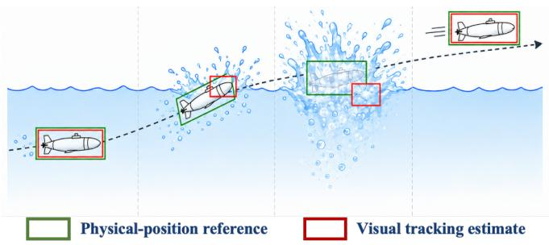
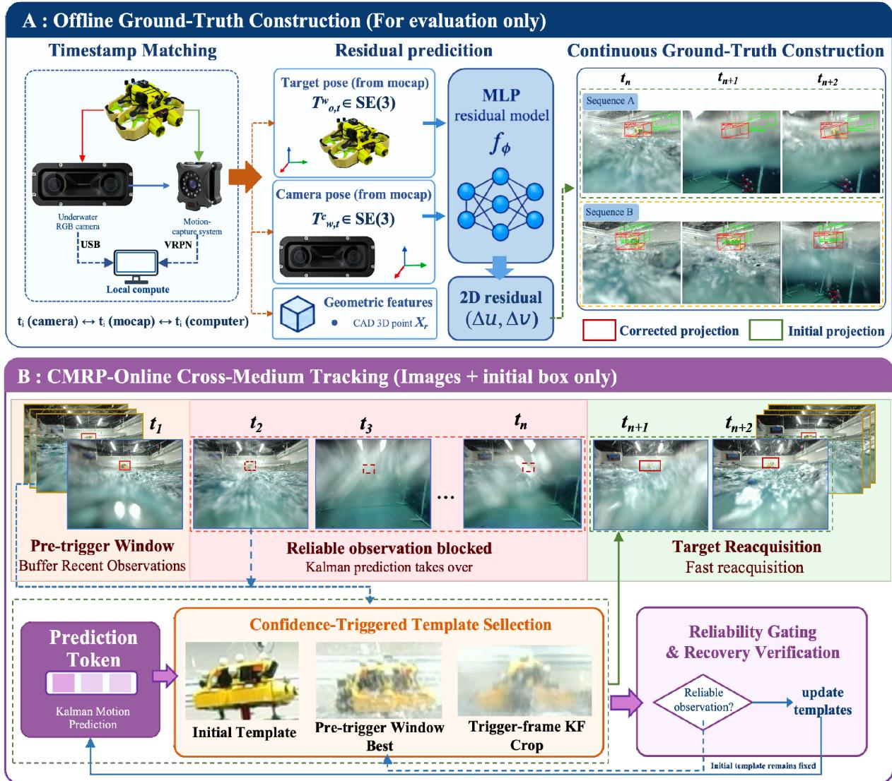
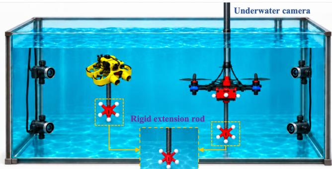
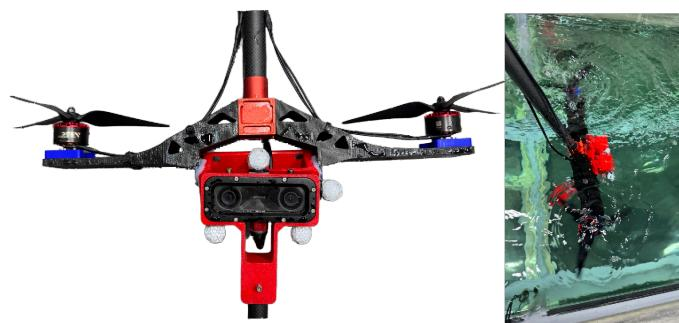
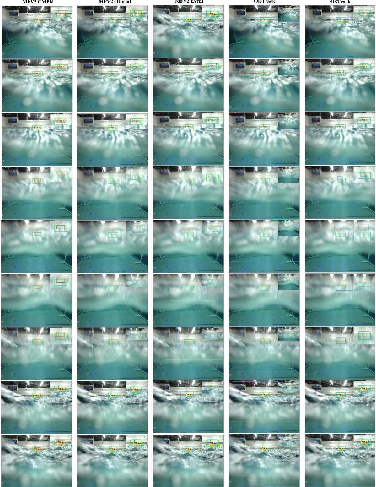
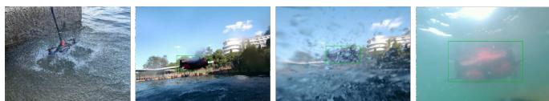

# Continuous Ground-Truth Construction and a Recovery Policy for Air–Water Robotic Tracking

Jiangong Xiao1,2, Zhe Sun1,2,∗, Kanzhong Yao2, Yuanbo Bi2, Haofei Zhao2, Ruixuan Hu2, Guan Huang1, and Xuelong Li2

Abstract— Visual tracking across the air–water interface is challenged by splashes, bubbles, refraction, reflections, and abrupt appearance changes that can temporarily invalidate observations. This setting poses two coupled difficulties: 1) for evaluation, image-only annotation cannot reliably describe the target’s physical location during visual blindness; 2) for online tracking, corrupted observations can contaminate motion estimates and appearance templates. We address the first difficulty with a construction pipeline that synchronizes camera frames with motion-capture poses, projects known target geometry, corrects underwater projection with a medium-gated residual, and subjects the annotations to manual review. This yields an evaluation-only cross-medium test set of 22,346 frames. We further introduce a Cross-Medium Recovery Policy (CMRP) centered on confidence-triggered template selection. It supplies MixFormerV2 with the fixed initial template, a windowbest pre-trigger template, and a trigger-frame Kalman-guided image crop, together with their associated weights, without retraining the visual backbone. In the accuracy evaluation, CMRP achieves 49.90 Macro Success AUC, 2.95 points above MixFormerV2 Official.On selected cross-medium transition and occlusion–recovery intervals, CMRP increases MixFormerV2 tracking coverage from 47.91% to 50.43% relative to Official updating, while mean loss-to-recovery latency over successfully recovered videos decreases from 55.3 to 49.3 frames.

Index Terms—cross-medium object tracking, air–water robotics, motion capture, ground-truth construction, target recovery, template management.

## I. INTRODUCTION

Amphibious air–water robots offer opportunities for environmental monitoring, search and rescue, and operations spanning both media [1]–[3]. In collaborative applications, one platform may need to continuously observe another target while it approaches, crosses, or leaves the water surface. At the interface, splashes, bubbles, reflections, exposure changes, and refraction can abruptly distort the target or make it entirely invisible for several frames. As illustrated in Fig. 1, the target remains physically present and continues to move even when interface-induced disturbances temporarily invalidate visual observations.

This setting first creates an evaluation problem. When the target is only partially visible, manual annotation can be ambiguous; when splashes or bubbles fully obscure it, the image alone may not reliably reveal its physical position. Excluding these frames from localization evaluation leaves the interval in which drift accumulates unmeasured. Cross-medium evaluation therefore benefits from a reference location that remains defined independently of instantaneous visibility. A natural question arises: is this process measurable?

  
Fig. 1. Schematic of tracking during water exit. Green boxes indicate the physical-position reference used only for offline evaluation; red boxes illustrate visual tracking estimates. Splashes and partial visibility can cause localization errors even as the target continues moving, motivating recovery from image observations alone.

To answer this, we use motion capture during offline ground-truth construction. Since the target itself is not directly observable to the motion-capture system throughout the crossing, we rigidly attach an extended marker structure to the target and track its pose instead. Camera frames and target poses are synchronized by a shared timestamp, and a calibrated transformation chain projects a three-dimensional reference point and known target geometry into the image. A medium-gated residual corrects systematic underwater displacement, after which every generated sequence is manually inspected and corrected. This procedure yields an evaluationonly test set of 22,346 frames with continuous physicalposition boxes. This procedure yields an evaluation-only test set of 22,346 frames with continuous physical-position boxes.1

The same visual degradation also creates a tracking problem. Unreliable visual observations can corrupt online template updates and propagate tracking errors [4]–[6]. Near the interface, a mistaken target response can move the next search region and overwrite useful appearance information. Earlier clear observations preserve identity but may poorly represent the changing appearance, whereas repeated updates during severe degradation risk contamination. This motivates selecting recent references at the onset of low confidence while retaining a fixed identity anchor.

For online tracking, we propose a Cross-Medium Recovery Policy (CMRP) built on MixFormerV2 [7] without retraining its visual backbone. At the onset of low confidence, it selects the highest-confidence template from the preceding window and an image crop at the trigger-frame Kalman prediction, while preserving the initial template. The selected references are retained during sustained low confidence, with motion prediction and recovery search providing position support. Fig. 2 summarizes the offline ground-truth construction and online tracking framework.

Our main contributions are as follows:

1) We introduce a motion-capture-based procedure for constructing continuous air–water tracking ground truth. Synchronized pose projection, medium-gated residual correction, known target geometry, and manual review provide boxes even when the image observation is unreliable.

2) We establish an 18-video, 22,346-frame evaluationonly cross-medium test set and define protocols for standard tracking accuracy, frame-level tracking coverage, and video-level recovery latency.

3) We propose CMRP, a confidence-triggered template policy combining a fixed identity reference, a pretrigger window-best template, and a trigger-frame Kalman-guided crop. Experiments evaluate its crossmedium accuracy and recovery behavior.

## II. RELATED WORK

## A. Cross-Medium Robotic Tracking

Aerial–aquatic robots demonstrate several approaches to crossing the interface [8]–[10]. AquaMAV and Dipper use reconfigurable wings for air–water transitions [1], [11]; flapping-wing robots combine aerial and aquatic locomotion with water-exit mechanisms [2], [12]; and Li et al. demonstrate a self-contained platform with morphing propellers and surface adhesion [3]. Recent work has also explored useroriented multimodal FPV drone systems for aquatic-aerial operation [13]. These studies address mobility and physical transition constraints. Our work complements them by constructing continuous target annotations and evaluating visual tracking through interface-induced observation degradation.

## B. Visual Object Tracking

Transformer-based single-object trackers have substantially improved the modeling of target-template and searchregion interactions. OSTrack [14] unifies feature extraction and target-search relation modeling in a one-stream Transformer. MixFormer [15] uses mixed attention to exchange information between the template and search region. MixFormerV2 [7] further reduces computational complexity through prediction tokens and model distillation. ODTrack [16] associates target information across consecutive frames by propagating temporal tokens online.

Template adaptation is also well studied. UpdateNet learns to combine initial, accumulated, and current appearances [4]; local trusted templates select reliable history within a sliding window [5]; and SAMURAI combines Kalman motion prediction with memory selection [6]. Long-term tracking research studies target disappearance, re-detection, and update control [17]–[19]. Our focus is the effectiveness of a low-confidence-triggered policy for cross-medium tracking: selecting pre-trigger appearance and a trigger-frame motionguided crop, then retaining them during sustained low confidence.

## C. Underwater Perception and Cross-Medium Tracking Data

Underwater imaging is affected by wavelength-dependent attenuation, backscatter, and range-dependent color changes [20]. Cross-medium sequences additionally contain splashes, reflections, bubbles, partial entry, and abrupt exposure changes near the interface. Conventional benchmarks such as LaSOT [21] and UAV123 [22] provide standard tracking evaluations. Underwaterspecific benchmarks such as UTB180 and WebUOT-1M evaluate visual tracking under underwater appearance degradation [23], [24]. Here, however, a continuous physical-position reference is needed to evaluate localization even when the target is obscured. We therefore use synchronized motion-capture projection to construct labels independently of the online tracker.

## III. PROBLEM FORMULATION AND EVALUATION

Given an image sequence $\{ I _ { t } \} _ { t = 1 } ^ { T }$ and the initial target box $B _ { 1 } ,$ , an online tracker predicts a box $B _ { t }$ in each frame, and $q _ { t }$ is the confidence directly output by the model. The offline construction branch provides a ground-truth box $B _ { t } ^ { * }$ even when splashes or bubbles obscure the target. The online CMRP branch receives only the initial box and image stream; it has no access to motion-capture poses, medium labels, or future frames.

## A. Standard Tracking Accuracy

Following standard tracking evaluation [25], the success rate $S _ { s } ( \tau )$ for sequence s is the fraction of frames whose IoU reaches threshold τ. Success AUC summarizes this curve over $\tau \in \ [ 0 , 1 ] ;$ its continuous integral equals sequence mean IoU, whereas a sampled curve gives a discrete approximation. We average sequence-level AUC values with equal weight and denote the result as Macro Success AUC. Precision, normalized precision, and overlap precision at IoU thresholds 0.50 and 0.75 are retained as complementary metrics.

## B. Tracking Coverage and Recovery

Tracking coverage is evaluated on 9,166 frames from selected cross-medium transition and occlusion–recovery intervals in the test set. It is defined as the percentage of these frames satisfying $\mathrm { I o U } ( B _ { t } , B _ { t } ^ { * } ) > 0 . 5$

Recovery latency is evaluated on the corresponding videos, with one recovery outcome per video. All ground-truth comparisons are used only for offline evaluation. For video s, timing starts at the first frame $t _ { s } ^ { \mathrm { l o s t } }$ satisfying

$$
\mathrm { I o U } ( B _ { t } , B _ { t } ^ { \ast } ) < 0 . 1 5 .\tag{1}
$$

  
Fig. 2. Offline annotation and online tracking. The offline branch constructs continuous labels from synchronized motion capture. The online branch uses confidence-triggered template selection and motion guidance, without access to motion-capture measurements.

Stable recovery requires five consecutive frames in which both the predicted-box overlap and the tracker-reported confidence satisfy

$$
\mathrm { I o U } ( B _ { t } , B _ { t } ^ { * } ) > 0 . 5 , \qquad q _ { t } > 0 . 5 .\tag{2}
$$

After this run is confirmed, $t _ { s } ^ { \mathrm { r e c } }$ is assigned to its first frame. We use the first qualifying run after $t _ { s } ^ { \mathrm { l o s t } }$ and record $L _ { s } = t _ { s } ^ { \mathrm { r e c } } - t _ { s } ^ { \mathrm { l o s t } }$ ; later recoveries in the same video are not additional trials. Let R contain the successfully recovered videos. Mean recovery latency is $\begin{array} { r } { \overline { { L } } = \frac { 1 } { \left. \mathcal { R } \right. } \sum _ { s \in \mathcal { R } } \dot { L } _ { s } } \end{array}$ . Videos without recovery are excluded from the latency mean. Timing starts at tracking loss and can include part of the invisible interval.

## IV. CONTINUOUS GROUND TRUTH AND TEST-SET CONSTRUCTION

Our objective is to retain a physically grounded target location when image observations are unreliable. Motion capture is used only as an offline measurement instrument for label construction and is never available to the evaluated trackers. Motion capture provides independent pose ground truth in robotic benchmarks [26]. Prior datasets address temporal alignment [27] and marker-to-camera calibration [28]. EV-IMO combines tracked poses with scanned geometry to generate depth and segmentation labels [29].

## A. Acquisition Setup and Pose Measurement

To continuously measure camera and target poses during air–water transitions, we rigidly mount an extension rod carrying a motion-capture marker cluster beneath the camera platform and another beneath the target vehicle. Both marker clusters remain within the underwater motion-capture system’s observable volume throughout the transitions. Known fixed extrinsic transformations map the measured markerbody poses to the poses of the camera optical frame and target body frame, respectively. These poses are synchronized with the recorded images to support continuous ground-truth construction for the 22,346-frame cross-medium test set.

  
Fig. 3. Underwater motion-capture setup for continuous camera and target pose measurement during air–water transitions.

## B. Temporal Synchronization and Coordinate Projection

Let $\mathcal { F } _ { w } , \mathcal { F } _ { c } , \mathcal { F } _ { o } ,$ , and $\mathcal { F } _ { g }$ denote the motion-capture world frame, camera optical frame, target rigid-body frame, and target geometry frame, respectively. Camera images and motion-capture poses are recorded with the same monotonic clock and associated by nearest timestamp. A reference point $p _ { r } ^ { g }$ and geometry vertices $q _ { j } ^ { g }$ are transformed into the camera frame as

$$
p _ { r , t } ^ { c } = T _ { w , t } ^ { c } T _ { o , t } ^ { w } T _ { g } ^ { o } p _ { r } ^ { g } , \quad q _ { j , t } ^ { c } = T _ { w , t } ^ { c } T _ { o , t } ^ { w } T _ { g } ^ { o } q _ { j } ^ { g } .\tag{3}
$$

The transforms act on homogeneous point coordinates [30]. The calibrated camera model π(·) gives the initial referencepoint projection $\tilde { u } _ { r , t } ~ = ~ \pi ( p _ { r , t } ^ { c } )$ and the initial image projections of the target geometry. This chain transfers the measured six-degree-of-freedom pose into the image without using target appearance.

## C. Medium-Gated Residual and Geometry-Based Box

A standard pinhole projection does not fully describe the systematic shift introduced by the practical underwater imaging chain. We therefore use a lightweight model $f _ { \phi }$ to predict a two-dimensional reference-point residual:

$$
\begin{array} { r } { u _ { r , t } = \tilde { u } _ { r , t } + g _ { t } f _ { \phi } ( z _ { r , t } ) , } \end{array}\tag{4}
$$

where $g _ { t } = 1$ when the reference point is underwater and $g _ { t } ~ = ~ 0$ in air. The feature vector $z _ { r , t }$ contains only calibrated geometric variables, including the three-dimensional coordinates and initial projection; it contains no target crop or tracking result. Consequently, the residual model corrects the imaging geometry rather than detecting the target.

Projecting the geometry vertices produces an initial box $\tilde { B } _ { t } ~ = ~ ( x _ { \operatorname* { m i n } } , y _ { \operatorname* { m i n } } , x _ { \operatorname* { m a x } } , y _ { \operatorname* { m a x } } )$ . The gated residual $( \Delta u _ { t } , \Delta v _ { t } ) \ : = \ : g _ { t } f _ { \phi } ( z _ { r , t } )$ translates the entire box to form an annotation candidate:

$$
\hat { B } _ { t } = \tilde { B } _ { t } + [ \Delta u _ { t } , \Delta v _ { t } , \Delta u _ { t } , \Delta v _ { t } ] .\tag{5}
$$

Thus, the learned model corrects candidate position only; width and height remain determined by known geometry and measured pose. This shared-translation approximation does not explicitly model differential refractive displacement across the target. The final box $B _ { t } ^ { * }$ is obtained after manual review.

## D. Manual Review and Evaluation Set

The projected boxes are treated as annotation candidates rather than accepted automatically. Reviewers inspect the synchronized image, projected box, target trajectory, and frame-to-frame consistency, then correct misalignment and flag invalid measurements. The final data retain the camera images, continuous two-dimensional boxes, synchronized pose provenance, and quality-control records.

The resulting evaluation-only cross-medium test set contains 18 videos with 22,346 frames recorded at 60 FPS, focusing on the stages surrounding air–water transitions. It is not used to train or fine-tune any tracker. All compared methods receive the same image sequences and first-frame target boxes; their predictions are evaluated against the same reviewed annotations. The set supports analysis of localization, drift during interface-induced degradation, and stable recovery following tracking loss.

## V. CMRP: RECOVERY-ORIENTED TRACKING

CMRP is an inference-time strategy for multi-template trackers, described here using MixFormerV2 without backbone retraining. Given image $I _ { t }$ and the current appearance reference, the tracker produces a visual box $B _ { t } ^ { v }$ and confidence $q _ { t } ^ { v }$ . Confidence-triggered template selection is the central design; motion feedback, search adaptation, and recovery verification provide supporting control.

## A. Reliability-Gated Motion Feedback

We use an eight-dimensional constant-velocity Kalman filter [31] to represent target center, scale, and velocity:

$$
\begin{array} { r } { \boldsymbol { x } _ { t } = [ c _ { x } , c _ { y } , w , h , \dot { c } _ { x } , \dot { c } _ { y } , \dot { w } , \dot { h } ] ^ { \top } . } \end{array}\tag{6}
$$

The prediction step produces a motion box $B _ { t } ^ { m }$ and covariance $P _ { t } ^ { - }$ . For the visual measurement $z _ { t } ^ { v }$ , we compute the innovation and its Mahalanobis distance,

$$
d _ { t } ^ { 2 } = ( z _ { t } ^ { v } - H x _ { t } ^ { - } ) ^ { \top } ( H P _ { t } ^ { - } H ^ { \top } + R _ { t } ) ^ { - 1 } ( z _ { t } ^ { v } - H x _ { t } ^ { - } ) .\tag{7}
$$

where H maps the motion state to the box measurement and $R _ { t }$ denotes visual measurement uncertainty. A visual result is accepted only when its model confidence, innovation distance, normalized center displacement, and logarithmic scale change jointly pass their gates. Writing this decision as $a _ { t } \in \{ 0 , 1 \}$ , the posterior is

$$
x _ { t } = \left\{ \begin{array} { l l } { \mathrm { K F U p d a t e } ( x _ { t } ^ { - } , z _ { t } ^ { v } ) , } & { a _ { t } = 1 , } \\ { x _ { t } ^ { - } , } & { a _ { t } = 0 . } \end{array} \right.\tag{8}
$$

The confidence gate tests appearance evidence, while the remaining gates check temporal consistency.

## B. Uncertainty-Adaptive Search

Search is centered on the motion prediction. Its factor increases with position uncertainty and the duration $\ell _ { t }$ of unreliable tracking:

$$
s _ { t } = \mathrm { c l i p } \left( s _ { 0 } + \lambda _ { p } \frac { \sqrt { P _ { c _ { x } c _ { x } } ^ { - } + P _ { c _ { y } c _ { y } } ^ { - } } } { \sqrt { w _ { t } ^ { - } h _ { t } ^ { - } } } + \lambda _ { \ell } \ell _ { t } , s _ { \mathrm { m i n } } , s _ { \mathrm { m a x } } \right)\tag{9}
$$

The bounds limit search expansion during prolonged unreliable tracking.

If local search remains unreliable, a wider redetection stage ranks candidates $b _ { i }$ using visual confidence $q _ { i }$ , motion consistency $m _ { i }$ , and similarity $h _ { i }$ to the retained appearance references:

$$
r _ { i } = \alpha q _ { i } + \beta m _ { i } + \gamma h _ { i } , \qquad \alpha + \beta + \gamma = 1 .\tag{10}
$$

The highest-ranked candidate must remain reliable for multiple consecutive frames before stable tracking is restored. This localization check does not promote the candidate into a new template.

## C. Confidence-Triggered Template Update

At the first low-confidence frame $t _ { e }$ , where $q _ { t _ { e } } ^ { v } < \theta _ { \mathrm { l o w } }$ , we select a window-best historical template from the preceding W-frame window $\mathcal { W } _ { e }$ , excluding $t _ { e } \mathrm { : }$

$$
j _ { e } = \arg \operatorname* { m a x } _ { j \in \mathcal { W } _ { e } } q _ { j } ^ { v } .\tag{11}
$$

Let $\mathcal { C } ( I , B )$ denote the template crop from image I at box $B ,$ and let $B _ { t _ { e } } ^ { m }$ be the Kalman-predicted box for the trigger frame. The three template sources are

$$
\begin{array} { r } { Z _ { 0 } = \mathcal { C } ( I _ { 1 } , B _ { 1 } ) , \phantom { Z Z Z } } \\ { Z _ { \mathrm { s a f e } } ^ { ( e ) } = \mathcal { C } ( I _ { j _ { e } } , B _ { j _ { e } } ^ { v } ) , } \\ { Z _ { \mathrm { K F } } ^ { ( e ) } = \mathcal { C } ( I _ { t _ { e } } , B _ { t _ { e } } ^ { m } ) . } \end{array}\tag{12}
$$

The initial template anchors target identity, and the windowbest historical template provides a pre-trigger appearance reference. The KF template provides an auxiliary observation of the predicted target region under the occlusion and degradation present at the trigger frame; it is not assumed to be a clean target view. The template policy sets the three template inputs and their associated weights for the underlying tracker. The templates selected at $t _ { e }$ are used starting from frame $t _ { e } + 1$ . The initial template remains fixed throughout the sequence. During the same low-confidence episode, the two selected templates are retained while Kalman prediction continues to provide position guidance.

## D. Scale Stability

Medium transitions can also produce implausible boxscale jumps. We apply a weak soft scale constraint:

$$
( w _ { t } , h _ { t } ) \gets ( 1 - \rho ) ( w _ { t } ^ { v } , h _ { t } ^ { v } ) + \rho ( \bar { w } _ { t } , \bar { h } _ { t } ) , \quad \rho = 0 . 0 7 ,\tag{13}
$$

where $( \bar { w } _ { t } , \bar { h } _ { t } )$ is estimated from recent reliable tracking history. The small weight suppresses abnormal feedback while retaining legitimate scale variation.The final output $B _ { t }$ follows the visual estimate when reliable and falls back to the Kalman-predicted box $B _ { t } ^ { m }$ when visual confidence remains insufficient.

## VI. EXPERIMENTS

Our experiments examine projection accuracy for label construction, cross-medium tracking accuracy and recovery, and the effect of CMRP on conventional tracking benchmarks. No motion-capture measurement is available to any tracker during these experiments.

TABLE I  
MOTION-CAPTURE PROJECTION ERROR (PX).
<table><tr><td>Method</td><td>Mean</td><td>Median</td><td>P95</td><td>Max</td></tr><tr><td>Geometric projection</td><td>39.68</td><td>27.81</td><td>115.04</td><td>204.84</td></tr><tr><td>Geometric + fixed offset</td><td>39.68</td><td>30.96</td><td>111.64</td><td>210.47</td></tr><tr><td>Geometric + linear residual</td><td>20.20</td><td>17.03</td><td>46.83</td><td>96.29</td></tr><tr><td>Planar-refraction diagnostic</td><td>110.68</td><td>93.39</td><td>258.65</td><td>709.66</td></tr><tr><td>Geometric + MLP residual</td><td>3.00</td><td>2.33</td><td>7.67</td><td>47.55</td></tr></table>

## A. Experimental Setup and Metrics

The projection study uses 14,984 physically valid ChArUco control points from 722 fixed validation images. MixFormerV2 comparisons use a fixed MixFormerV2-Base checkpoint and common first-frame initialization. Static performs no online replacement; Official selects the highestconfidence candidate within each update window; Fixed replaces a template periodically without gating; and Event commits the first qualified candidate after a cooldown interval. Event denotes this baseline, not the proposed lowconfidence-triggered policy. MixFormerV2 is abbreviated as MFV2 in the tables. The same CMRP module and strategy are applied to MixFormerV2 and ODTrack. OSTrack is evaluated without CMRP because the implementation used here does not support multiple templates.The same core CMRP parameters are used for the accuracy and recovery evaluations.

Standard tracking accuracy is evaluated on all 18 crossmedium videos (22,346 frames) at the original image resolution. We report Macro Success AUC as the primary standard metric, together with precision, normalized precision, OP50, and OP75 when available. Macro Success AUC is the equalweight mean of the sequence-level Success AUC values, preventing longer recordings from dominating the result. Tracking coverage is evaluated on the same 9,166 selected frames for all methods, while recovery latency follows the protocol in Section III. The LaSOT test set contains 280 sequences and 685,360 frames, and UAV123 contains 123 sequences and 112,578 frames. The cross-medium set is not used for training or fine-tuning.

## B. Projection Accuracy of Label Construction

All projection variants use the same valid threedimensional control points and independent two-dimensional image detections. Because the fixed validation set is also used to select the stored MLP checkpoint, this result verifies the construction mechanism rather than claiming generalization to an independent projection test set.

Relative to direct geometric projection, the medium-gated MLP residual reduces median error by 91.6% and P95 error by 93.3%. A linear residual explains part of the systematic displacement but retains a pronounced long tail. The current planar-refraction model reaches its parameter boundary and is retained only as a diagnostic baseline. The corrected projection supplies annotation candidates for final manual review.

  
Fig. 4. Controllable cross-medium image acquisition platform with an underwater camera and two independently driven propellers for generating bubbles, splashes, and water-surface disturbances.

TABLE II  
SUCCESS AUC OF TEMPLATE-UPDATE STRATEGIES ACROSS DATA DOMAINS.
<table><tr><td>Strategy</td><td>LaSOT</td><td>UAV123 Cross-medium</td></tr><tr><td>Static</td><td>68.95</td><td>69.72</td></tr><tr><td>Official</td><td>70.26</td><td>47.31 69.60 46.95</td></tr><tr><td>Fixed</td><td>67.49</td><td>68.70 44.90 46.04</td></tr><tr><td>Event</td><td>68.36</td><td>69.25</td></tr></table>

## C. Controllable Cross-Medium Image Acquisition Platform

To reproduce visual disturbances associated with water takeoff and entry under controlled conditions, we built a platform with an underwater camera and two independently driven propellers (Fig. 4). The camera is rigidly mounted at the lower end of a carbon-fiber support rod, with the propellers above it. Both the camera platform and the target move during recording, simulating tracking from a camera mounted on a cross-medium vehicle. When operated near the surface, the propellers generate bubbles, splashes, and surface fluctuations that occlude the target and distort its appearance. Adjusting their operating conditions varies disturbance intensity, from mild interference to severe occlusion. This controllable setup supports efficient data collection and the study of tracking and recovery under interface-induced disturbances.

The motion-capture setup is described in Section IV-A.

## D. Template-Update Behavior Across Domains

Before evaluating CMRP, we examine whether ordinary template-update rules transfer across data domains. All entries use the same MixFormerV2 backbone and a common inference protocol.

Fixed updating yields the lowest AUC in all three domains. Official updating improves LaSOT AUC by 1.31 points over Static, but decreases cross-medium AUC by 0.36 points. These results motivate adapting template-update timing to degraded observations.

## E. Standard Cross-Medium Tracking Accuracy

Table III compares OSTrack [14], ODTrack [16], Mix-FormerV2 Official, and the policy-augmented variants on the complete cross-medium test set.

TABLE III  
STANDARD TRACKING METRICS ON THE COMPLETE CROSS-MEDIUM TEST SET.
<table><tr><td>Method</td><td>Macro AUC</td><td>Prec.</td><td>Norm. Prec.</td><td>OP50 OP75</td></tr><tr><td>OSTrack</td><td>39.03</td><td>41.18</td><td>54.28</td><td>48.20 14.10</td></tr><tr><td>ODTrack</td><td>29.77</td><td>27.18</td><td>36.36</td><td>32.51 11.64</td></tr><tr><td>ODTrack + CMRP</td><td>31.29</td><td>27.18</td><td>39.54</td><td>39.51 16.51</td></tr><tr><td>MFV2 Official</td><td>46.95</td><td>53.19</td><td>68.41</td><td>59.27 13.24</td></tr><tr><td> $\mathbf { M F V } 2 + \mathbf { C M R P }$ </td><td>49.90</td><td>53.30</td><td>68.40</td><td>67.40 15.10</td></tr></table>

TABLE IV

TRACKING COVERAGE ON 9,166 SELECTED FRAMES AND RECOVERY LATENCY.
<table><tr><td>Method</td><td>Tracked frames ↑</td><td>Mean frames ↓</td><td>Latency reduction</td></tr><tr><td>OSTrack</td><td>3725/9166 (40.64%)</td><td>63.0</td><td>21.7%</td></tr><tr><td>ODTrack</td><td>1730/9166 (18.87%)</td><td>159.0</td><td>69.0%</td></tr><tr><td>ODTrack + CMRP</td><td>1918/9166 (20.93%)</td><td>112.0</td><td>56.0%</td></tr><tr><td>MFV2 Static</td><td>4478/9166 (48.85%)</td><td>54.8</td><td>10.0%</td></tr><tr><td>MFV2 Official</td><td>4391/9166 (47.91%)</td><td>55.3</td><td>10.8%</td></tr><tr><td>MFV2 Event</td><td>4294/9166 (46.85%)</td><td>59.6</td><td>17.3%</td></tr><tr><td>MFV2 Fixed</td><td>3798/9166 (41.44%)</td><td>65.0</td><td>24.2%</td></tr><tr><td> $\mathbf { M F V } 2 + \mathbf { C M R P }$ </td><td>4622/9166 (50.43%)</td><td>49.3</td><td>Ref.</td></tr></table>

MixFormerV2 with CMRP achieves 49.90 Macro Success AUC, improving over Official updating by 2.95 points and over Static in Table II by 2.59 points. OP50 increases from 59.27 to 67.40, while center-based precision remains nearly unchanged, indicating that the gains are more evident in overlap-based metrics. The ODTrack policy variant improves AUC from 29.77 to 31.29. Fig. 5 provides a qualitative comparison.

## F. Tracking Coverage and Recovery

Table IV reports the number and percentage of successfully tracked frames over the selected intervals, together with mean video-level recovery latency following Section III. The last column reports the latency reduction of MixFormerV2 + CMRP relative to each row method.

With CMRP, MixFormerV2 increases the number of successfully tracked frames from 4,391 to 4,622 (47.91% to 50.43% coverage), compared with Official updating. Mean loss-to-recovery latency over each method’s successfully recovered videos decreases from 55.3 to 49.3 frames (10.8%). For ODTrack, CMRP increases the tracked-frame count from 1,730 to 1,918 (18.87% to 20.93% coverage) and reduces mean recovery latency from 159 to 112 frames (29.6%).

## G. Stability on Conventional Tracking Data

Finally, Table V evaluates the policy on LaSOT and UAV123 to characterize its effect on conventional tracking.

On LaSOT and UAV123, the policy decreases AUC by 0.35 and 0.42 points, respectively, indicating a small conventional-tracking trade-off.

MFV2 CMPR  
MFV2 Official  
MFV2 Event  
ODTrack  
OSTrack  
  
Fig. 5. Qualitative comparison on representative frames from the cross-medium test set. From left to right: MixFormerV2 + CMRP (ours), MixFormerV2 with the Event template-update policy, MixFormerV2 with the Official template-update policy, ODTrack, and OSTrack. Green boxes indicate the ground truth (GT); the other colored boxes indicate tracker predictions.

## H. Towards Robotic Deployment

To support future vision-based formation control of two air–water vehicles, we conducted preliminary outdoor experiments using the controllable image acquisition platform described in Section VI-C. The platform reproduced the visual conditions encountered by an observing vehicle during air–water transitions while recording a target vehicle entering and leaving the water. Fig. 6 shows the outdoor acquisition setup and representative qualitative tracking results obtained by offline evaluation of the unannotated recordings. Detailed qualitative tracking results are provided in the accompanying supplementary video.

TABLE V  
TRACKING PERFORMANCE ON CONVENTIONAL BENCHMARKS.
<table><tr><td>Dataset</td><td>Method</td><td>AUC</td><td>Prec.</td><td>Norm. Prec.</td><td>OP50</td><td>OP75</td></tr><tr><td>LaSOT</td><td>MFV2 Official</td><td>70.26</td><td>75.83</td><td>80.09</td><td>82.05</td><td>69.13</td></tr><tr><td>LaSOT</td><td> $\mathbf { M F V } 2 + \mathbf { C M R P }$ </td><td>69.91</td><td>75.41</td><td>79.63</td><td>81.58</td><td>68.72</td></tr><tr><td>UAV123</td><td> $\mathbf { M F V } 2 { \mathrm { ~ O f f i c i a l } }$ </td><td>69.60</td><td>90.71</td><td>85.23</td><td>85.28</td><td>63.09</td></tr><tr><td>UAV123</td><td> $\mathbf { M F V } 2 + \mathbf { C M R P }$ </td><td>69.18</td><td>90.16</td><td>84.81</td><td>84.74</td><td>62.61</td></tr></table>

  
Fig. 6. Outdoor acquisition setup and qualitative tracking results.

The complete MixFormerV2-based tracker with CMRP was deployed on an NVIDIA Jetson Orin NX, processing recorded video at over 27 FPS. This result supports the feasibility of embedded visual tracking for future air–water robotic applications.

## VII. CONCLUSION

We presented a framework for continuous evaluation and recovery-oriented air–water tracking. Motion-capturebased ground-truth construction provides an evaluation-only test set of 18 videos and 22,346 frames with continuous physical-position references. Without backbone retraining, CMRP combines confidence-triggered template selection with motion guidance, improving MixFormerV2 Macro Success AUC by 2.95 points over Official updating. Mean lossto-recovery latency decreases from 55.3 to 49.3 frames, computed over each method’s successfully recovered videos. These gains involve small AUC decreases on LaSOT and UAV123.

Offline outdoor tests further illustrate tracking capability, while recorded-video processing at over 27 FPS on a Jetson Orin NX supports embedded implementation. Future work will broaden evaluation across targets and environments and validate closed-loop visual formation control of two air– water vehicles.

## REFERENCES

[1] R. Siddall, A. Ortega Ancel, and M. Kovac, “Wind and water tunnelˇ testing of a morphing aquatic micro air vehicle,” Interface Focus, vol. 7, no. 1, p. 20160085, 2017.

[2] Y. Chen, H. Wang, E. F. Helbling, N. T. Jafferis, R. Zufferey, A. Ong et al., “A biologically inspired, flapping-wing, hybrid aerial-aquatic microrobot,” Sci. Robot., vol. 2, no. 11, p. eaao5619, 2017.

[3] L. Li, S. Wang, Y. Zhang, S. Song, C. Wang, S. Tan et al., “Aerialaquatic robots capable of crossing the air-water boundary and hitchhiking on surfaces,” Sci. Robot., vol. 7, no. 66, p. eabm6695, 2022.

[4] L. Zhang, A. Gonzalez-Garcia, J. van de Weijer, M. Danelljan, and F. S. Khan, “Learning the model update for Siamese trackers,” in Proc. IEEE/CVF ICCV, 2019, pp. 4010–4019.

[5] Z. An, G. Chen, X. Zhang, Z. Wang, Q. Xie, and B. Zhang, “Learning the model update with local trusted templates for visual tracking,” IET Image Process., vol. 17, no. 2, pp. 544–557, 2023.

[6] C.-Y. Yang, H.-W. Huang, W. Chai, Z. Jiang, and J.-N. Hwang, “SAMURAI: Motion-aware memory for training-free visual object tracking with SAM 2,” IEEE Trans. Image Process., vol. 35, pp. 970– 982, 2026.

[7] Y. Cui, T. Song, G. Wu, and L. Wang, “MixFormerV2: Efficient fully transformer tracking,” in Proc. NeurIPS, 2023, pp. 58 736–58 751.

[8] H. Alzu’bi, I. Mansour, and O. Rawashdeh, “Loon Copter: Implementation of a hybrid unmanned aquatic–aerial quadcopter with active buoyancy control,” J. Field Robot., vol. 35, no. 5, pp. 764–778, 2018.

[9] D. Mercado, M. Maia, and F. J. Diez, “Aerial-underwater systems, a new paradigm in unmanned vehicles,” J. Intell. Robot. Syst., vol. 95, no. 1, pp. 229–238, 2019.

[10] R. Zufferey, A. Ortega Ancel, A. Farinha, R. Siddall, S. F. Armanini, M. Nasr et al., “Consecutive aquatic jump-gliding with water-reactive fuel,” Sci. Robot., vol. 4, no. 34, p. eaax7330, 2019.

[11] F. M. Rockenbauer, S. L. Jeger, L. Beltran, M. A. Berger, M. Harms, N. Kaufmann et al., “Dipper: A dynamically transitioning aerialaquatic unmanned vehicle,” in Proc. Robot.: Sci. Syst. (RSS), 2021.

[12] R. Zufferey, S. L. Jeger, M. Hüsser, F. Ruiz, A. Lapsansky, A. Ijspeert et al., “Leaping out of the water: Aerial-aquatic locomotion with flapping wings,” Science, vol. 393, no. 6807, pp. 207–211, 2026.

[13] Y. Bi, Y. Wang, Y. Chen, K. Yao, Z. Peng, J. Wang et al., “A useroriented multimodal FPV drone system: Design and implementation for aquatic-aerial operation,” in Proc. OCEANS, 2026, pp. 1–9.

[14] B. Ye, H. Chang, B. Ma, S. Shan, and X. Chen, “Joint feature learning and relation modeling for tracking: A one-stream framework,” in Proc. ECCV, 2022, pp. 341–357.

[15] Y. Cui, C. Jiang, L. Wang, and G. Wu, “MixFormer: End-to-end tracking with iterative mixed attention,” in Proc. IEEE/CVF CVPR, 2022, pp. 13 608–13 618.

[16] Y. Zheng, B. Zhong, Q. Liang, Z. Mo, S. Zhang, and X. Li, “ODTrack: Online dense temporal token learning for visual tracking,” in Proc. AAAI, 2024, pp. 7588–7596.

[17] J. Valmadre, L. Bertinetto, J. F. Henriques, R. Tao, A. Vedaldi, A. W. M. Smeulders et al., “Long-term tracking in the wild: A benchmark,” in Proc. ECCV, 2018, pp. 692–707.

[18] A. Lukežic, L.ˇ Cehovin Zajc, T. Vojíˇ ˇr, J. Matas, and M. Kristan, “Performance evaluation methodology for long-term single-object tracking,” IEEE Trans. Cybern., vol. 51, no. 12, pp. 6305–6318, 2021.

[19] K. Dai, Y. Zhang, D. Wang, J. Li, H. Lu, and X. Yang, “High-performance long-term tracking with meta-updater,” in Proc. IEEE/CVF CVPR, 2020, pp. 6298–6307.

[20] D. Akkaynak and T. Treibitz, “Sea-thru: A method for removing water from underwater images,” in Proc. IEEE/CVF CVPR, 2019, pp. 1682– 1691.

[21] H. Fan, L. Lin, F. Yang, P. Chu, G. Deng, S. Yu et al., “LaSOT: A high-quality benchmark for large-scale single object tracking,” in Proc. IEEE/CVF CVPR, 2019, pp. 5374–5383.

[22] M. Mueller, N. Smith, and B. Ghanem, “A benchmark and simulator for UAV tracking,” in Proc. ECCV, 2016, pp. 445–461.

[23] B. Alawode, Y. Guo, M. Ummar, N. Werghi, J. Dias, A. Mian et al., “UTB180: A high-quality benchmark for underwater tracking,” in Proc. ACCV, 2023, pp. 442–458.

[24] C. Zhang, L. Liu, G. Huang, H. Wen, X. Zhou, and Y. Wang, “WebUOT-1M: Advancing deep underwater object tracking with a million-scale benchmark,” in Proc. NeurIPS, 2024, pp. 50 152–50 167.

[25] Y. Wu, J. Lim, and M.-H. Yang, “Online object tracking: A benchmark,” in Proc. IEEE CVPR, 2013, pp. 2411–2418.

[26] M. Burri, J. Nikolic, P. Gohl, T. Schneider, J. Rehder, S. Omari et al., “The EuRoC micro aerial vehicle datasets,” Int. J. Robot. Res., vol. 35, no. 10, pp. 1157–1163, 2016.

[27] D. Schubert, T. Goll, N. Demmel, V. Usenko, J. Stückler, and D. Cremers, “The TUM VI benchmark for evaluating visual-inertial odometry,” in Proc. IEEE/RSJ IROS, 2018, pp. 1680–1687.

[28] E. Mueggler, H. Rebecq, G. Gallego, T. Delbruck, and D. Scaramuzza, “The event-camera dataset and simulator: Event-based data for pose estimation, visual odometry, and SLAM,” Int. J. Robot. Res., vol. 36, no. 2, pp. 142–149, 2017.

[29] A. Mitrokhin, C. Ye, C. Fermüller, Y. Aloimonos, and T. Delbruck, “EV-IMO: Motion segmentation dataset and learning pipeline for event cameras,” in Proc. IEEE/RSJ IROS, 2019, pp. 6105–6112.

[30] R. Hartley and A. Zisserman, Multiple View Geometry in Computer Vision, 2nd ed. Cambridge Univ. Press, 2004.

[31] R. E. Kalman, “A new approach to linear filtering and prediction problems,” J. Basic Eng., vol. 82, no. 1, pp. 35–45, 1960.