# DINO FORCING FLOW MODELS: DO NOT DENOISE WHAT YOU CAN PREDICT

Arijit Ghosh ∗,1,2, Lucas Degeorge ∗,1,2,4, Paul Couairon Alexei A. Efros 3, Vicky Kalogeiton †,2, David Picard †,1

Equal Contribution, † Equal Supervision

1 ENPC, IP Paris, 2 Ecole Polytechnique, IP Paris, 3 UC Berkeley, 4 AMIAD

## ABSTRACT

Co-denoising pretrained representations such as DINO can substantially improve the training speed and quality of flow matching models, but it introduces a second denoising trajectory and requires carefully designed schedules. We propose a simpler alternative: predict the pretrained representation directly, then condition the model on its own prediction. This removes the need for a second ODE and any representation-specific denoising schedules, while retaining the benefits of representation guidance. Our approach converges substantially faster and achieves better generation quality as measured by FID score. On ImageNet, it outperforms the state of the art in latent space at 2× fewer epochs than prior methods; in pixel space, it improves FID over comparable prior methods by more than 20%. These results support a simple principle: do not denoise what you can predict. Our code is openly available in https://github.com/arijit-hub/dino\_forcing.

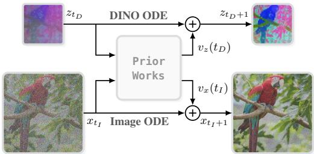

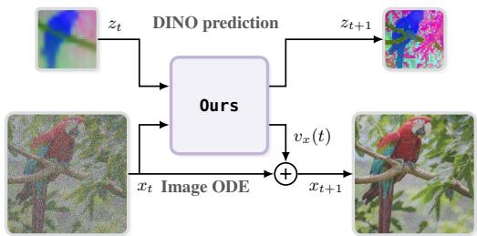

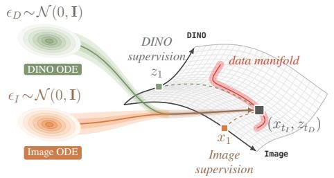

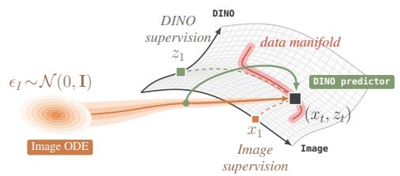  
Figure 1: Left: Prior co-denoising methods generate both the image and the pretrained representation from noise by jointly solving their individual ODEs through iterative modification during sampling. The model predicts the velocity for both modalities at different time schedules (top) which leads to 2 trajectories starting from independent noise samples and arriving at the same pair (bottom). Right: Our proposed Dino Forcing (DF) method keeps the ODE only for the image generation since the representation is deterministically tied to the image. The model predicts the target representation in addition to the image velocity (top), providing a self-condition to guide the image ODE (bottom).

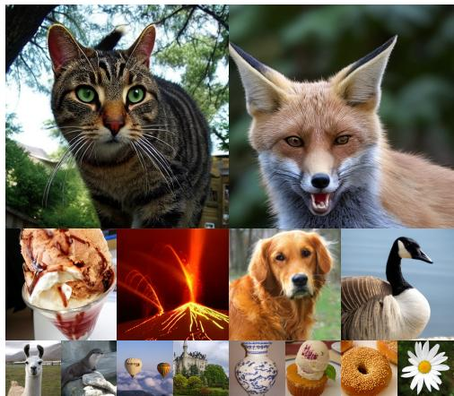

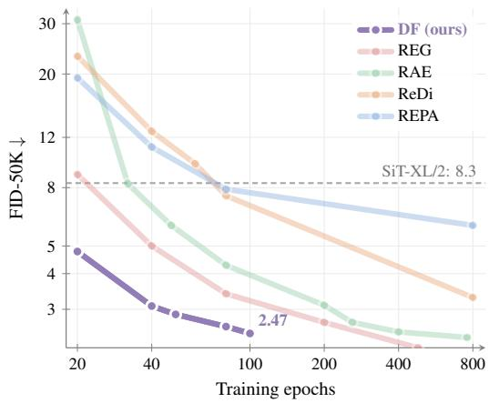  
Figure 2: Left: Qualitative samples. More examples are given in Figures 8 to 13. Right: Convergence speed-up (FID-50K vs. training epochs).

## 1 INTRODUCTION

Pretrained representations should help a model generate better images, not strain it by learning one more diffusion trajectory! Yet recent flow matching methods that leverage pretrained representations, such as DINO, typically diffuse and denoise the representation alongside the image. In fact, a trend started by (Bao et al., 2023; Xu et al., 2023) and recently popularized by (Kouzelis et al., 2025; Baade et al., 2026) is to jointly denoise images and DINO embeddings, followed by (Wu et al., 2025; Pan et al., 2026; Petsangourakis et al., 2026; Lin et al., 2026) that extend this with <cls> token, dual-stream or auxiliary networks. This joint co-denoising speeds up training compared to the standard denoising as the model can leverage the additional information of the frozen representations.

However, in this work, we claim that this co-denoising comes with two paradoxes: First, the extra information introduced to guide the image generation problem is now completely hidden in the noise such that the model has to untangle the informative bits of that modality. Second, the learning problem is made artificially harder than it should be1 because it consists of matching pairs of independent noise samples $( \epsilon _ { I } , \epsilon _ { D }$ from Fig. 1, bottom left) to a coupled pair (image x, $\mathrm { D I N O } z = \phi ( x ) )$ ) that does not require the extra noise since the link between the image and its representation is deterministic.

In this work, we remove these paradoxes with one simple idea: pretrained representations should constrain generation, not become another generation target. The pretrained representation is not an independent quantity that needs its own generative trajectory; it is a property of the image that the model can progressively infer as the image emerges. Our key idea is therefore simple: rather than denoising a second representation, we ask the model to predict the representation it needs (Fig. 1 top right). This keeps the search entirely in the image space, recovering the simple one-to-one mapping problem (Fig. 1 bottom right) while benefiting from the guidance of the pretrained representation.

This principle leads directly to our proposed DINO Forcing (DF), a method with two ouputs, one from image ODE and one for predicting DINO features that are used as self-conditioning. During training, a first look-ahead pass predicts the DINO representation associated with the current noisy image; a second pass conditions on this prediction to learn the image velocity. The predicted representation is aligned with a frozen DINO encoder (Fig. 3, right). At inference, the same prediction is simply rolled forward from one solver step to the next (Fig. 4). Thus, the pretrained representation is produced by the generator itself and evolves together with the image.

In latent space, DF reaches an FID of 2.47 after only 100 epochs, surpassing prior methods trained for substantially longer (Fig. 2, right). At the same training budget, our B model outperforms XL baseline models, showing that the gain does not come from scale. In pixel space, DF improves over Latent Forcing (Baade et al., 2026) from 7.20 to 5.53 FID at comparable model size and training budget. These results support our claim that explicitly co-denoising is unnecessary: predicting the pretrained representation is not only simpler, but leads to substantially faster convergence.

Our contrbutions are: (1) we show that directly predicting DINO representations is sufficiently informative to guide generation, without needing to explicitly denoise it. (2) we propose DINO Forcing: a schedule-free self-conditioning mechanism that predicts, rather than denoise, the pretrained representation used to guide generation. (3) DF achieves strong performance in substantially fewer training epochs for both latent and pixel space flow matching frameworks.

## 2 RELATED WORK

Representation alignment in image generation. Diffusion (Sohl-Dickstein et al., 2015; Ho et al., 2020) and flow matching (Lipman et al., 2023) models are trained with denoising objectives that favour fine-grained, reconstruction-oriented representations over high-level semantic ones (Yu et al., 2025), which slows convergence: state-of-the-art generators typically need over 500 epochs (DiT: Peebles & Xie, 2023; SiT: Ma et al., 2024; JiT: Li & He, 2026; fv-loss: Degeorge et al., 2026; TREAD: Krause et al., 2025). Aligning internal features with external pretrained representations accelerates training (REPA: Yu et al., 2025; iREPA: Singh et al., 2026a; HASTE: Wang et al., 2025b; REED: Wang et al., 2025a; DDT: Wang et al., 2026; PixelDiT: Yu et al., 2026a; PixelREPA: Shin et al., 2026; DeCo: Ma et al., 2026a; PixelGen: Ma et al., 2026b). But at sampling time the model runs unguided: the signal lacks when it is most needed. A complementary line performs flow matching directly in a pre-aligned latent space (RAE: Zheng et al., 2026; DINO-SAE: Chang et al., 2026), so the representation is present throughout sampling. But this requires training a new decoder and architectural changes. A more comprehensive comparison is given in Appendix D.

Co-denoising for image generation. Jointly denoising multiple modalities (Bao et al., 2023; Xu et al., 2023) offers an appealing alternative: it implicitly aligns pretrained representations while preserving them throughout generation, including at inference. This accelerates training convergence, both in a latent (ReDi: Kouzelis et al., 2025; CoReDi: Kouzelis et al., 2026; REG: Wu et al., 2025; SFD: Pan et al., 2026; REGLUE: Petsangourakis et al., 2026) and directly in pixel space (LatentForcing: Baade et al., 2026; V-Co: Lin et al., 2026; CoReDi: Kouzelis et al., 2026). The cost is a second noise scheduler that must be hand-crafted: SFD (Pan et al., 2026) and LatentForcing (Baade et al., 2026) both find that denoising the representation to a low noise level before starting the image yields the fastest convergence, a schedule that likely needs re-tuning for different modalities. A more direct approach is to condition the generator on pretrained representations rather than denoise them from scratch (RCG: Li et al., 2024; PixelDiT2: Yu et al., 2026b). Inspired by self-conditioning (Jabri et al., 2023; Chen et al., 2023), we condition the model on its own predicted representation at each denoising step. Unlike prior self-conditioning work, we align these predictions with an external pretrained feature space, i.e. DINO. The representation is then available throughout generation with no handcrafted schedule, while still training faster.

## 3 DINO-FORCING

Here, we first give an overview of DF, then detail its two-pass training procedure (Section 3.1), and how image and representation tokens are fused, and finally its sampling (Section 3.2).

Overview DINO-Forcing (DF) generates images by relying on a simple idea: rather than denoising a separate pretrained representation in parallel, it predicts the pretrained representation it needs (i.e. DINO) and conditions itself on that prediction throughout generation.

Concretely, at each training step, DF produces a look-ahead estimate of the pretrained representation, zˆ, associated with the image, x, being denoised (see Fig. 3; Pass-1). Then, it uses that estimate as a conditioning signal for a forward-backward update pass (see Fig. 3; Pass-2). At sampling time, these DINO representations are predicted and are rolled out across denoising steps, providing a continuously updated, model-generated guide (see Fig. 4).

## 3.1 SELF-CONDITIONING ON PREDICTED REPRESENTATIONS

The core idea of our proposed DF is a two-pass training procedure, illustrated in Fig. 3 and detailed as follows. For the remainder of this section, for simplicity, we omit referring to additional conditions, such as class or text; however, in our experiments we do include them.

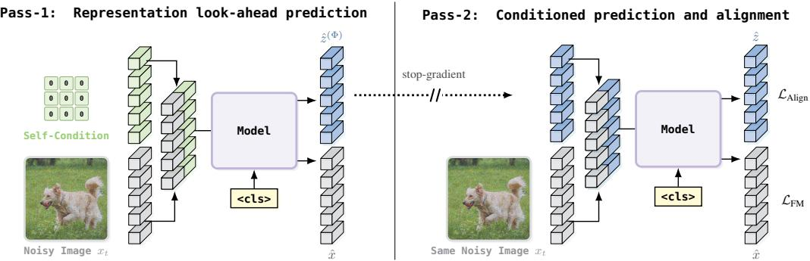  
Figure 3: Overview of our proposed training framework. A first forward pass produces a representation look-ahead (no gradient), which is then used to condition a second pass that optimizes both the flow matching and representation alignment objectives.

Pass 1: Representation look-ahead prediction. We perform a forward pass with $x _ { t }$ as the image input and a zeros tensor, 0, as placeholder for the representation conditioning. This produces a preliminary representation prediction, zˆ(Φ), which serves as a look-ahead estimate of the content in the current denoising trajectory (similar to Jabri et al. (2023); Chen et al. (2023); Dufour et al. (2024); left part of Fig. 3). This pass runs without gradients: it provides the conditioning for Pass 2.

Pass 2: Conditioned prediction and alignment. The look-ahead prediction $\hat { z } ^ { ( \Phi ) }$ is then used as the conditioning input in a second forward pass. This pass produces two outputs: (i) the flow matching velocity prediction $v _ { \theta } ( x _ { t } | \hat { z } ^ { ( \Phi ) }$ , t) for image generation, and (ii) a refined representation prediction zˆ that is supervised against an external pretrained feature space, ϕ(x) (contrary to prior methods Jabri et al. (2023); Chen et al. (2023); Dufour et al. (2024) who leave this added condition unsupervised). As such, the final training objective is formulated as:

$$
\mathcal { L } _ { \mathrm { t o t a l } } = \mathcal { L } _ { \mathrm { F M } } + \lambda \cdot \mathcal { L } _ { \mathrm { A l i g n } } ,\tag{1}
$$

with λ a scalar balancing the two objectives: $\mathcal { L } _ { \mathrm { F M } } = \| v _ { \theta } - ( x - \epsilon ) \| ^ { 2 }$ is the standard flow matching velocity loss (Lipman et al., 2023), and ${ \mathcal { L } } _ { \mathrm { A l i g n } }$ is the loss between the predicted and frozen representation. In this work, we follow REPA formulation (Yu et al., 2025) and define ${ \mathcal { L } } _ { \mathrm { A l i g n } }$ as a cosine similarity loss between zˆ and target representations ϕ(x) extracted from the clean image x. This is given as follows:

$$
\mathcal { L } _ { \mathrm { A l i g n } } = - \left. \frac { \hat { z } } { \| \hat { z } \| } , \frac { \phi ( x ) } { \| \phi ( x ) \| } \right.\tag{2}
$$

In this work, $\phi ( x )$ denotes DINO features, following (Kouzelis et al., 2025; Baade et al., 2026). Note that the formulation is not tied to this choice: any other comparative loss could be used instead.

With this two-pass design, the model learns two things jointly: generating images and predicting accurate representations. These predictions are fed back as conditioning in the same training step.

Fusing Image and Frozen Representations. DF takes as input merged image and pretrained representation (i.e. DINO) tokens. For merging, we concatenate them along the channel dimension (see Fig. 3), keeping the token count identical to the standard image-only model, which makes our work compatible with existing flow models. More details in Appendix B, and a discussion of other fusion strategies in Lin et al. (2026).

## 3.2 SAMPLING

At inference, we replicate the structure of training through a representation roll-out across denoising steps, illustrated in Fig. 4 (similar to Jabri et al. (2023); Dufour et al. (2024)).

We initialize the image input with pure noise $x _ { 0 } \sim \mathcal { N } ( 0 , I )$ and set the starting representation to a zero tensor 0, mirroring Pass 1 at training time (see Section 3.1). At each denoising step t, the model produces both a velocity estimate, used to update $x _ { t }$ via the ODE solver, and a representation

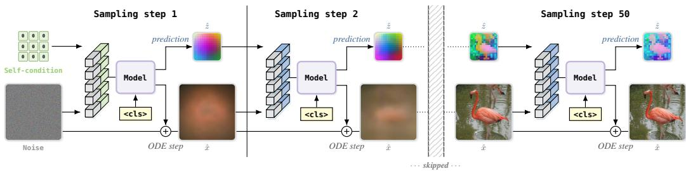  
Figure 4: Overview of our sampling framework. At each step the model outputs a ODE step, and a prediction zˆ used as the self-condition at the next step. Note that zˆ is not a denoised feature map but the model’s prediction of the DINO features of the denoised image xˆ.

prediction zˆ. This prediction is then passed as the conditioning input for the next denoising step, replacing the zeros placeholder. The roll-out continues for all steps of the solver.

The result is a sampling procedure in which the representation conditioning signal grows progressively more coherent as the image takes shape (see Fig. 5 and Fig. 14), providing structured guidance precisely when it is most useful, without any modification to the standard denoising schedule.

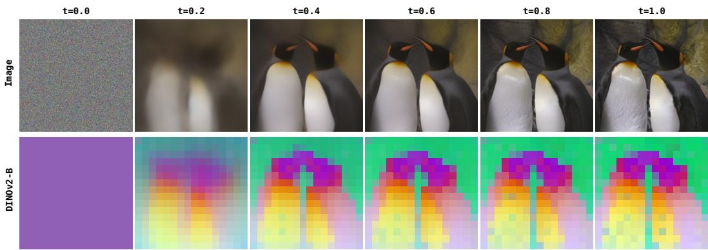  
Figure 5: Evolution of the image and the PCA of the predicted DINO features throughout sampling.

## 4 PREDICTION VS CO-DENOISING

As motivated in Section 2, most recent image generation approaches either remove pretrained representation information at inference time, or require extra decoders and hand-crafted denoising schedules to preserve it.

We focus on co-denoising, as it keeps an estimate of the pretrained representation during the denoising process, and try to directly address the limitations of these approaches. Co-denoising methods (Bao et al., 2023; Kouzelis et al., 2025; Baade et al., 2026) come with notable performance gains, mainly due to sharing one network between two tasks: denoising the image x and denoising an additional pretrained representation ϕ(x), which can be text as in (Bao et al., 2023) or DINOv2 as in (Kouzelis et al., 2025; Baade et al., 2026). Even though this results in faster convergence than image-only denoising baselines, it requires an additional ODE trajectory for the pretrained representations (and thereby handcrafted schedules).

Specifically, with independent noises $\epsilon _ { I } , \epsilon _ { D }$ and two time variables, the co-denoising model fits

$$
v _ { \theta } \left( x _ { t _ { I } } , \phi ( x ) _ { t _ { D } } , t _ { I } , t _ { D } \right) , \qquad ( t _ { I } , t _ { D } ) \in [ 0 , 1 ] ^ { 2 } \quad ,
$$

so it must be accurate over the whole square of noise-level pairs (Fig. 1, bottom left).

Instead, we claim that this additional trajectory can be omitted. Since $\phi$ is deterministic, the pair (x, ϕ(x)) never fills the product space, but it lies on

$$
\{ ( x , \phi ( x ) ) : x \in \mathcal { X } \} \subset \mathbb { R } ^ { d _ { I } } \times \mathbb { R } ^ { d _ { D } } \quad ,
$$

and the pretrained representation coordinate adds no degrees of freedom to the distribution being modeled: given a clean image there is no distribution over ϕ(x) to sample from. Given a noisy $x _ { t }$ , the best estimate of the pretrained representation is $\hat { z } = \mathbb { E } [ \phi ( x ) \mid x _ { t } ]$ , which depends on x only with no noise level of its own. A forward pass of the network is enough to predict it, and needs no schedule. As such, in DINO Forcing asks the model to simply predict the pretrained representation it needs and condition itself on that prediction throughout generation (Fig. 4).

This results in us keeping the shared network and its two tasks, but it removes the quadratic search of two ODE trajectories (the time domain collapses from $[ 0 , 1 ] ^ { 2 }$ back to [0, 1]) (Fig. 1, right) and the corresponding handcrafted schedules.

## 5 EXPERIMENTS

We evaluate our method on the ImageNet class-conditional benchmark, in both latent space (Section 5.1) and pixel space (Section 5.2). We then analyse what the representation prediction branch learns by inverting its predictions back to images (Section 5.3), and study generation driven by the predicted features alone (Section 5.4). We ablate the components of our method in Section 5.5. Qualitative samples are shown in Fig. 2 left, with more uncurated samples in Appendix E.

Evaluation Metrics We compare DF against latent space state-of-the-art methods using the ADM (Dhariwal & Nichol, 2021) evaluation suite and its reference statistics. We generate 50K samples and report Fréchet Inception Distance (FID) (Heusel et al., 2017), Inception Score (IS) (Sali mans et al., 2016), Precision (P) and Recall (R) (Kynkäänniemi et al., 2019). For pixel space, we report FID against the JiT reference statistics. Since JiT does not release the images needed for the remaining metrics, IS, P and R are computed with the ADM suite.

## 5.1 LATENT SPACE SETTING

Setup In the latent space setting, we follow the implementations of SiT (Ma et al., 2024) with the only exception of having extra input and output projections for the pretrained representation features. We train our model in the sd-vae-ft-ema (Rombach et al., 2022) latent space. We follow prior works (Yu et al., 2025; Baade et al., 2026; Kouzelis et al., 2025) and use DINOv2-B (Oquab et al., 2024) features. We weight our frozen representation loss (λ in Eq. (1)) with a value of 0.5, similar to prior work (Yu et al., 2025). Consistent with previous works (Ma et al., 2024), we use the Adam (Kingma & Ba, 2014) optimizer without any weight decay and a constant learning rate of 1e−4. In contrast to previous methods, we sample using a simple Euler ODE solver in 50 steps instead of using SDE solvers. We train using the null condition 10% of the time for classifier-free guidance (Ho & Salimans, 2021). For the pretrained representation condition, 10% of the time we do optimization on just the 1st forward pass to make the model learn a better prediction when the conditions are all zeros. We also set the pretrained representation prediction condition to the original DINOv2 features 5% of the time to make the model more stable when it has already reached the required feature. For XL models, we use a dropout of 0.1 on the middle third of the SiT blocks (both for attention and the feedforward layers). Implementation details are given in Table 8.

Results without guidance We first compare DF against the baseline SiT models in the unguided setting (Table 1). All three sizes improve substantially: B, L and XL all fall below 5 FID within 400K training steps (or 80 epochs), with XL reaching 2.61.

When compared with state-of-the-art works at a similar parameter count (Figure 2), DF reaches 2.61 at 80 epochs, better than or on par with methods trained substantially longer: REPA at 800 epochs (5.78), CoReDi at 400 epochs (3.30), REG at 200 epochs (2.70) and REGLUE at 200 epochs (2.50). When further trained for 20 more epochs DF shows a 2× reduction in training budget over REGLUE (see Table 2), the previous best method at a comparable parameter count in the same latent space: 2.47 after 100 epochs against 2.50 after 200 epochs. We must note that the excellent work, TREAD (Krause et al., 2025), remains competitive without using external pretrained model. Since the two approaches are orthogonal, combining DF with TREAD should yield further gains.

Results with guidance Like RAE (Zheng et al., 2026), we found guidance non-trivial to implement for our latent space model. As such, following RAE we also use Autoguidance (Karras et al., 2024)

Table 1: Model-size ablation with DINO as the frozen representation.
<table><tr><td colspan="4">Latent space</td></tr><tr><td>Model</td><td>#Params</td><td>Steps</td><td>Batch Size</td><td>FID↓</td></tr><tr><td>SiT-B/2</td><td>130M</td><td>400K</td><td>256</td><td>33.00</td></tr><tr><td>→ DF</td><td>138M</td><td>400K</td><td>256</td><td>4.51</td></tr><tr><td>SiT-L/2</td><td>458M</td><td>400K</td><td>256</td><td>18.80</td></tr><tr><td>→ DF</td><td>466M</td><td>400K</td><td>256</td><td>3.04</td></tr><tr><td>SiT-XL/2</td><td>675M</td><td>400K</td><td>256</td><td>17.20</td></tr><tr><td> $1  \mathsf { \pmb { v } } F$ </td><td>684M</td><td>400K</td><td>256</td><td>2.61</td></tr></table>

<table><tr><td colspan="4">Pixel space</td></tr><tr><td>Model</td><td>#Params</td><td>Steps</td><td>Batch Size</td><td>FID↓</td></tr><tr><td>JiT-B/16</td><td>131M</td><td>100K</td><td>1024</td><td>48.61</td></tr><tr><td>→ DF</td><td>139M</td><td>100K</td><td>1024</td><td>13.37</td></tr><tr><td>JiT-L/16</td><td>459M</td><td>100K</td><td>1024</td><td>26.64</td></tr><tr><td>→ DF</td><td>468M</td><td>100K</td><td>1024</td><td>6.80</td></tr><tr><td>JiT-XL/16</td><td>676M</td><td>100K</td><td>1024</td><td>23.03</td></tr><tr><td>→ DF</td><td>686M</td><td>100K</td><td>1024</td><td>5.45</td></tr></table>

Table 2: State-of-the-art comparison of latent space models on ImageNet $2 5 6 ^ { 2 }$ . Bold is best, underline is second best, grayed methods use more than 200 epochs and are not considered for the comparison.
<table><tr><td>Model</td><td></td><td></td><td></td><td colspan="4">w/o CFG</td><td colspan="4">w/CFG</td></tr><tr><td></td><td>DINO use</td><td>#Params</td><td>Epochs</td><td>FID↓</td><td>IS↑</td><td>P↑</td><td>R↑</td><td>FID↓</td><td>IS↑</td><td>P↑</td><td>R↑</td></tr><tr><td>DiT</td><td>None</td><td>675M</td><td>1400</td><td>9.62</td><td>121.5</td><td>0.67</td><td>0.67</td><td>2.27</td><td>278.2</td><td>0.83</td><td>0.57</td></tr><tr><td>SiT</td><td>None</td><td>675M</td><td>1400</td><td>8.61</td><td>131.7</td><td>0.68</td><td>0.67</td><td>2.06</td><td>270.3</td><td>0.82</td><td>0.59</td></tr><tr><td>REPA</td><td>Alignment</td><td>675M</td><td>800</td><td>5.78</td><td>158.3</td><td>0.70</td><td>0.68</td><td>1.42</td><td>305.7</td><td>0.80</td><td>0.65</td></tr><tr><td>RAE-DiTDH-XL</td><td>Rep. space</td><td>839M</td><td>800</td><td>1.51</td><td>242.9</td><td>0.79</td><td>0.63</td><td>1.13</td><td>262.6</td><td>0.78</td><td>0.67</td></tr><tr><td>RAE-DiT-XL</td><td>Rep. space</td><td>676M</td><td>800</td><td>1.87</td><td>209.7</td><td>0.80</td><td>0.63</td><td>1.41</td><td>309.4</td><td>0.80</td><td>0.63</td></tr><tr><td>ReDi</td><td>Joint gen.</td><td>675M</td><td>800</td><td></td><td></td><td></td><td></td><td>1.61</td><td>295.1</td><td>0.78</td><td>0.64</td></tr><tr><td>REG</td><td>Joint gen.</td><td>677M</td><td>800</td><td>1.80</td><td>一</td><td>一</td><td>一</td><td>1.36</td><td>299.4</td><td>0.77</td><td>0.66</td></tr><tr><td>DiT + TREAD</td><td>None</td><td>675M</td><td>680</td><td>3.93</td><td>211.4</td><td>0.76</td><td>0.60</td><td></td><td></td><td></td><td></td></tr><tr><td>HASTE</td><td>Alignment</td><td>675M</td><td>500</td><td></td><td></td><td></td><td></td><td>1.42</td><td>299.5</td><td>0.80</td><td>0.65</td></tr><tr><td>DDT</td><td>Alignment</td><td>675M</td><td>400</td><td>6.27</td><td>154.7</td><td>0.68</td><td>0.69</td><td>1.26</td><td>310.6</td><td>0.79</td><td>0.65</td></tr><tr><td>CoReDi</td><td>Joint gen.</td><td>675M</td><td>400</td><td>3.30</td><td>176.8</td><td>0.74</td><td>0.66</td><td>1.58</td><td>297.2</td><td>0.63</td><td>0.78</td></tr><tr><td>REED</td><td>Alignment</td><td>675M</td><td>200</td><td>4.70</td><td>一</td><td>一</td><td></td><td>1.80</td><td>267.5</td><td>0.81</td><td>0.61</td></tr><tr><td>REG</td><td>Joint gen.</td><td>677M</td><td>200</td><td>2.70</td><td></td><td></td><td></td><td></td><td></td><td></td><td></td></tr><tr><td>SFD+LDiT/1</td><td>Joint gen.</td><td>675M</td><td>200</td><td>2.54</td><td>191.7</td><td>0.75</td><td>0.67</td><td>1.06</td><td>267.0</td><td>0.78</td><td>0.67</td></tr><tr><td>REGLUE</td><td>Joint gen.</td><td>677M</td><td>200</td><td>2.50</td><td>188.6</td><td>0.76</td><td>0.65</td><td></td><td>一</td><td>一</td><td>1</td></tr><tr><td>iREPA</td><td>Alignment</td><td>675M</td><td>80</td><td>7.13</td><td>132.9</td><td>0.71</td><td>0.66</td><td>1.89</td><td>272.4</td><td>0.80</td><td>0.60</td></tr><tr><td>DF</td><td>Forcing</td><td>684M</td><td>100</td><td>2.47</td><td>250.1</td><td>0.84</td><td>0.68</td><td>2.35</td><td>266.1</td><td>0.85</td><td>0.68</td></tr></table>

and use an L model’s checkpoint at 150K steps to act as the weaker model. This leads to a guided FID score of 2.35 (see Table 2;). It reflects an improvement; however its not as drastic as prior works, which are trained for at least 2× more than our setup. We agree that the guided scores are still a bit underwhelming and more work must be done to improve on it. Interesting ideas like Internal Guidance (Zhou et al., 2026) with intermediate outputs can be an interesting avenue to explore to improve upon the guidance, and we leave this as future work to further improve upon our core idea.

High resolution We next evaluate at 512 × 512 resolution in the unguided setting (Table 4). DF reaches an FID of 3.11 at 80 epochs, against 11.05 for REPA and 20.45 for the SiT-XL/2 baseline. The Inception Score improves from 116.2 to 274.5. Precision is unchanged (0.65), but recall drops from 0.73 to 0.63, indicating the predicted representation condition concentrates the sample distribution: it acts on the trajectory much as guidance would, consistent with the large unguided FID gap.

## 5.2 PIXEL SPACE SETTING

Setup For pixel space, we closely follow the implementations of JiT (Li & He, 2026) and we use DINOv2-B as the pretrained representation. We observe that v-loss in pixel-space is 13× lower than in latent space so we lower λ = 0.03 in Eq. (1). We use Adam optimizer without any weight decay, with a constant learning rate of 2e − 4 after a warmup for 5 epochs. For pixel space experiments, we follow Heun Sampler (Heun et al., 1900) with 50 sampling steps. Similar to the latent space setting, we use the null condition 10% of the training, optimize on the first forward pass 10% of the training, use the original DINOv2-B features for 5% of the training, and we use a dropout rate of 0.1 for our bigger XL models. Additional implementation details are further provided in Table 8.

Table 3: State-of-the-art comparison of pixel-space models on ImageNet $2 5 6 ^ { 2 }$ . Bold is best, underline is second best, grayed methods use more than 200 epochs and are not considered for the comparison.
<table><tr><td>Model</td><td></td><td></td><td></td><td colspan="4">w/o CFG</td><td colspan="4">w/CFG</td></tr><tr><td></td><td>DINO use</td><td>#Params</td><td>Epochs</td><td>FID↓</td><td>IS↑</td><td>P↑</td><td>R↑</td><td>FID↓</td><td>IS↑</td><td>P↑</td><td>R↑</td></tr><tr><td>JiT-G</td><td>None</td><td>2B</td><td>600</td><td></td><td></td><td></td><td></td><td>1.82</td><td>292.6</td><td></td><td></td></tr><tr><td>JiT-XL + fv-loss</td><td>None</td><td>676M</td><td>600</td><td>11.5</td><td>118.5</td><td></td><td></td><td>2.13</td><td>290.3</td><td></td><td></td></tr><tr><td>DeCo-XL</td><td>Alignment</td><td>682M</td><td>600</td><td></td><td></td><td></td><td></td><td>1.69</td><td>304.0</td><td>0.79</td><td>0.63</td></tr><tr><td>PixelREPA</td><td>Alignment</td><td>953M</td><td>600</td><td></td><td></td><td></td><td></td><td>1.81</td><td>317.2</td><td></td><td></td></tr><tr><td>PixelDiT2-H</td><td>Grounding</td><td>1B</td><td>480</td><td></td><td></td><td></td><td></td><td>1.48</td><td>299.1</td><td></td><td></td></tr><tr><td>PixelDiT-XL</td><td>Alignment</td><td>797M</td><td>320</td><td></td><td></td><td></td><td></td><td>1.61</td><td>292.7</td><td>0.78</td><td>0.64</td></tr><tr><td>V-Co</td><td>Joint gen.</td><td>1.9B</td><td>300</td><td></td><td></td><td></td><td></td><td>1.71</td><td>263.3</td><td></td><td></td></tr><tr><td>JiT-L</td><td>None</td><td>459M</td><td>200</td><td>17.19</td><td>85.4</td><td>0.70</td><td>0.73</td><td>3.06</td><td>271.5</td><td>0.85</td><td>0.66</td></tr><tr><td>JiT-XL</td><td>None</td><td>676M</td><td>200</td><td>12.71</td><td>101.7</td><td>0.74</td><td>0.73</td><td>2.89</td><td>272.1</td><td>0.85</td><td>0.66</td></tr><tr><td>LatentForcing-L</td><td>Joint gen.</td><td>465M</td><td>200</td><td>7.20</td><td></td><td>一</td><td></td><td>2.48</td><td></td><td></td><td></td></tr><tr><td>PixelDiT2-L</td><td>Grounding</td><td>503M</td><td>200</td><td></td><td></td><td></td><td></td><td>2.35</td><td>270.1</td><td></td><td></td></tr><tr><td>PixelGen-XL</td><td>Percept.+Align.</td><td>676M</td><td>160</td><td></td><td></td><td></td><td>一</td><td>1.83</td><td>293.6</td><td>0.79</td><td>0.63</td></tr><tr><td>DF-L (ours)</td><td>Forcing</td><td>468M</td><td>200</td><td>5.53</td><td>163.6</td><td>0.79</td><td>0.72</td><td>2.26</td><td>309.9</td><td>0.84</td><td>0.70</td></tr><tr><td>DF-XL (ours)</td><td>Forcing</td><td>686M</td><td>200</td><td>4.56</td><td>179.6</td><td>0.79</td><td>0.73</td><td>2.13</td><td>310.0</td><td>0.83</td><td>0.71</td></tr></table>

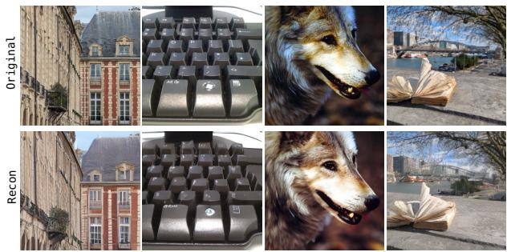

Table 4: Comparison on ImageNet $5 1 2 ^ { 2 }$ without classifier-free guidance.
<table><tr><td>Model</td><td>FID↓ IS↑ P↑ R↑</td></tr><tr><td>SiT-XL/2</td><td>20.45 75.1 0.66 0.68</td></tr><tr><td>REPA DF (ours)</td><td>11.05 116.2 0.65 0.73 3.11 274.5 0.65 0.63</td></tr></table>

Table 5: DINO inversion quality.  
Figure 6: Reconstructions from inverted DINOv2-B features. Top row: originals; bottom row: reconstructions.
<table><tr><td>Model</td><td>PSNR↑</td><td>SSIM↑</td></tr><tr><td>DF-SiT-XL</td><td>16.86</td><td>0.48</td></tr><tr><td>DF-JiT-XL</td><td>14.33</td><td>0.44</td></tr></table>

Results without guidance The improvements observed with SiT carry over to JiT (see Table 1): all model sizes improve with XL reaching an unguided FID of 5.45. We compare DF againt Latent Forcing (Baade et al., 2026) in Table 3. At 200 epochs, DF reaches 5.53 with an L-sized model, against 7.20. We attribute this gap to how the pretrained representation signal is produced: Latent Forcing commits to a single schedule, fixed at training time and shared across the dataset, that dictates when pretrained representation information is revealed relative to pixels. DF instead derives the conditioning from the sample being generated, so the pretrained representation signal adapts to each trajectory rather than following a common ordering.

Results with guidance Prior co-denoising works in pixel space, like Latent Forcing (Baade et al., 2026), require a split scheme, applying AutoGuidance (Karras et al., 2024) on pixel timesteps and CFG interval (Kynkäänniemi et al., 2024) on representation timesteps, because the two modalities advance on separate schedules. Having a single trajectory, we need no such split: the default interval guidance setting works well without method-specific tuning (Table 3). At L size we reach 2.26, surpassing Latent Forcing (2.48) as well as PixelDiT-2 (2.35). At XL size we reach 2.13, against 2.89 for JiT-XL under the same setting. We remain behind PixelGen-XL, which reaches 1.83 at 160 epochs in a similar parameter range; we attribute this to its use of frozen VGG (Simonyan & Zisserman, 2014) supervision alongside DINO, and leave the combination of the two signals to future work.

Table 6: Unconditional generation on ImageNet 2562. (no CFG, 80 epochs).
<table><tr><td>Model</td><td>#Params</td><td>Steps FID↓</td></tr><tr><td>SiT-L/2</td><td>458M</td><td>400K 49.51</td></tr><tr><td>→ DF</td><td>466M</td><td>400K 9.14</td></tr><tr><td>JiT-L/16</td><td>459M</td><td>100K 53.97</td></tr><tr><td>→ LatentForcing</td><td>465M</td><td>100K 20.44</td></tr><tr><td>→ DF</td><td>468M</td><td>100K 15.19</td></tr></table>

Table 7: Effect of the DF supervision target on SiT-L/2 at 80 epochs.
<table><tr><td>Model</td><td>#Params</td><td>FID↓</td></tr><tr><td>SiT-L/2</td><td>458M</td><td>18.80</td></tr><tr><td>→ DF-∅</td><td>466M</td><td>12.96</td></tr><tr><td>→ DF-image</td><td>466M</td><td>11.93</td></tr><tr><td>→ DF-MAE</td><td>466M</td><td>7.97</td></tr><tr><td>→ DF-DINO supervision</td><td>466M</td><td>3.04</td></tr></table>

## 5.3 DINO INVERSION

Our method assumes the branch produces something semantically meaningful, not only an arbitrary code that happens to help the velocity prediction. We visualise the PCA of the predicted features across the trajectory in Fig. 5 and Fig. 14): their structures are spatially coherent and separates object from background before the image itself is resolved, and it sharpens as denoising progresses.

Furthermore, as the representation-conditioning branch processes representation features, we can bypass the prediction at inference and feed real DINOv2 features instead. This turns the model into a DINOv2 inverter: given the features of an image and a null class, it reconstructs the image itself. Figure 6 shows reconstructions from inverted DINOv2. Table 5 reports SSIM and PSNR for SiT (16.86 dB / 0.48 SSIM) and JiT (14.33 dB / 0.44 SSIM), showing that the interaction of the DINOv2 condition provides very good local information for reconstruction.

## 5.4 GENERATION WITHOUT CLASS CONDITION

The predicted DINOv2 from the representation-conditioning branch can be seen as a standalone condition. To test this, we train with the class token set to null for the entire run, so the model has no conditioning signal other than the one it predicts for itself. We compare this setup with unconditional SiT and JiT and with Latent Forcing (Baade et al., 2026) in Table 6. In latent space, DF reaches an FID of 9.14 against 49.51 for SiT-L/2. In pixel space it reaches 15.19, against 53.97 for JiT-L/16 and 20.44 for Latent Forcing. This setting isolates the main difference with Latent Forcing: when all of the conditioning comes from the pretrained representation branch, predicting it outperforms denoising it on a fixed schedule.

## 5.5 ABLATION

We ablate design choices of DF; more ablations in Appendix C. Unless stated otherwise, every ablation is run on SiT-L and reported in the unguided setting, so that all numbers are directly comparable.

Does the pretrained representation target matter? The improvement from DF could come from the conditioning mechanism, or from the pretrained representation content of the target. To separate the two, we train four variants with identical architectures that differ only in what the representation branch is asked to predict (Table 7). DF-∅ leaves the predicted features unsupervised. DF-image supervises the branch to predict the image itself, a well-defined but low-level target. DF-MAE uses Masked Autoencoder (MAE-B) (He et al., 2022) features, a strong reconstruction-based self-supervised target. DF-DINO supervision uses DINOv2 features, as in our full method. The conditioning mechanism helps on its own: without any supervision, FID drops from 18.80 to 12.96. Supervising with the raw image adds little (11.93). So a reconstruction target is not what drives the gain. MAE features show much broader improvement (more than a 10-point improvement over baseline). However, with DINOv2 features, FID reaches 3.04, 6× below the baseline. The conditioning mechanism is necessary but not sufficient; the pretrained representation content of the target is what produces most of the improvement.

## 6 CONCLUSION

We introduced DINO-Forcing, a simple alternative to co-denoising pretrained representations in flow-matching models. Instead of assigning the representation its own noisy trajectory, we predict it from the current image state and immediately reuse it as conditioning. This removes the second ODE and representation-specific denoising schedule, while preserving the benefits of representation guidance. Despite its simplicity, this change substantially improves both convergence and generation quality, surpassing methods trained for substantially longer both in latent and pixel space. More broadly, our results suggest that auxiliary representations need not always be generated alongside the primary modality: when they can be inferred from the evolving sample, prediction may be enough.

## ACKNOWLEDGEMENT

First and foremost, the authors would like to thank Nicolas Dufour, for all the productive discussions and arguments in the lab, in David’s office, in pubs, and in Slack! The authors would also like to thank Felix Krause from LMU, for discussing and sharing checkpoints of his amazing work, TREAD (Krause et al., 2025). It played a tremendous role in helping the authors find a good and easy solution to the problem at hand, even though the final paper did diverge quite far from what TREAD proposed. The authors would like to thank Zeynep Sonat Baltacı, Gatien Chenu, Fei Meng and Julie Mordacq for taking a look at the first draft of the paper (with some even doing this during their amazing trip in the mountains), proofreading like Sherlock, and also providing cool feedback! The authors would also like to thank Yohann Perron, Alexandros Benetatos, Loic Landrieu, Tristan Quétin, Tom Ravaud, Louis Geist and Lucas Ventura for many insightful discussions at many different times while working on this paper! Finally, the authors would like to thank the city of Paris and its beautiful summer this year (skipping the heatwaves) for being highly motivating during the preparation of this paper.

Funding and Compute This work was supported by a Hi!Paris grant, two Hi!Paris chairs for A.A.Efros and V.Kalogeiton, ANR/France 2030 program (ANR-23-IACL-0005) and ANR project sharp ANR-23-PEIA-0008 in the context of the PEPR IA. Regarding compute, the paper was granted access to the HPC resources of IDRIS under the allocations 2025-A0181016194, 2025-AD011015436, 2026-A0201017545 and 2026-AD011015594R2 made by GENCI.

## AI USE STATEMENT

In this work, we used generative AI tools to design or provide feedback on research methodology or experiments. We have not used generative AI tools to help develop theoretical models or conceptual frameworks, and the rest of the required disclosure tasks (generate synthetic data sets, formulate mathematical claims, provide critical ingredients for proving mathematical claims, assist in the writing of proofs, propose or refine hypotheses, implement methods, assist with translation, clean and reformat dataset, support qualitative and thematic data analysis, interpret results) are not applicable to this work.

Additionally, we used generative AI tools to create or modify scientific figures or images, creation of artifacts, draft parts of a research paper, brainstorming, sourcing/searching for information, edit a research paper to improve readability, identify relevant literature, and format references.

We have reviewed all AI-assisted work. We checked LLM-generated code, LLM-generated suggestions have been tested and backed-up by experimental results. We take responsibility for the final content of this work, including text, claims or artifacts produced with the aid of generative AI.

## REFERENCES

Alan Baade, Eric Ryan Chan, Kyle Sargent, Changan Chen, Justin Johnson, Ehsan Adeli, and Li Fei Fei. Latent forcing: Reordering the diffusion trajectory for pixel-space image generation. In ICML, 2026.

Fan Bao, Shen Nie, Kaiwen Xue, Chongxuan Li, Shi Pu, Yaole Wang, Gang Yue, Yue Cao, Hang Su, and Jun Zhu. One transformer fits all distributions in multi-modal diffusion at scale. In ICML, 2023.

Hun Chang, Byunghee Cha, and Jong Chul Ye. Dino-sae: Dino spherical autoencoder for high-fidelity image reconstruction and generation. arXiv, 2026.

Ting Chen, Ruixiang ZHANG, and Geoffrey Hinton. Analog bits: Generating discrete data using diffusion models with self-conditioning. In ICLR, 2023.

Lucas Degeorge, Paul Couairon, Arijit Ghosh, Alexei A Efros, David Picard, and Vicky Kalogeiton. Balancing frequencies and pixels in flow matching. arXiv, 2026.

Prafulla Dhariwal and Alexander Nichol. Diffusion models beat gans on image synthesis. In NeurIPS, 2021.

Nicolas Dufour, Victor Besnier, Vicky Kalogeiton, and David Picard. Don’t drop your samples! coherence-aware training benefits conditional diffusion. In CVPR, 2024.

Kaiming He, Xinlei Chen, Saining Xie, Yanghao Li, Piotr Dollár, and Ross Girshick. Masked autoencoders are scalable vision learners. In CVPR, 2022.

Karl Heun et al. Neue methoden zur approximativen integration der differentialgleichungen einer unabhängigen veränderlichen. Z. Math. Phys, 1900.

Martin Heusel, Hubert Ramsauer, Thomas Unterthiner, Bernhard Nessler, and Sepp Hochreiter. Gans trained by a two time-scale update rule converge to a local nash equilibrium. In NeurIPS, 2017.

Jonathan Ho and Tim Salimans. Classifier-free diffusion guidance. In NeurIPS 2021 Workshop on Deep Generative Models and Downstream Applications, 2021.

Jonathan Ho, Ajay Jain, and Pieter Abbeel. Denoising diffusion probabilistic models. In NeurIPS, 2020.

Allan Jabri, David J Fleet, and Ting Chen. Scalable adaptive computation for iterative generation. In ICML, 2023.

Tero Karras, Miika Aittala, Tuomas Kynkäänniemi, Jaakko Lehtinen, Timo Aila, and Samuli Laine. Guiding a diffusion model with a bad version of itself. In NeurIPS, 2024.

Diederik P Kingma and Jimmy Ba. Adam: A method for stochastic optimization. arXiv, 2014.

Theodoros Kouzelis, Efstathios Karypidis, Ioannis Kakogeorgiou, Spyridon Gidaris, and Nikos Komodakis. Boosting generative image modeling via joint image-feature synthesis. In NeurIPS, 2025.

Theodoros Kouzelis, Spyros Gidaris, and Nikos Komodakis. Coevolving representations in joint image-feature diffusion. In ECCV, 2026.

Felix Krause, Timy Phan, Ming Gui, Stefan Andreas Baumann, Vincent Tao Hu, and Björn Ommer. Tread: Token routing for efficient architecture-agnostic diffusion training. In ICCV, 2025.

Tuomas Kynkäänniemi, Tero Karras, Samuli Laine, Jaakko Lehtinen, and Timo Aila. Improved precision and recall metric for assessing generative models. In NeurIPS, 2019.

Tuomas Kynkäänniemi, Miika Aittala, Tero Karras, Samuli Laine, Timo Aila, and Jaakko Lehtinen. Applying guidance in a limited interval improves sample and distribution quality in diffusion models. In NeurIPS, 2024.

Tianhong Li and Kaiming He. Back to basics: Let denoising generative models denoise. In CVPR, 2026.

Tianhong Li, Dina Katabi, and Kaiming He. Return of unconditional generation: A self-supervised representation generation method. In NeurIPS, 2024.

Han Lin, Xichen Pan, Zun Wang, Yue Zhang, Chu Wang, Jaemin Cho, and Mohit Bansal. V-co: A closer look at visual representation alignment via co-denoising. arXiv, 2026.

Yaron Lipman, Ricky T. Q. Chen, Heli Ben-Hamu, Maximilian Nickel, and Matthew Le. Flow matching for generative modeling. In ICLR, 2023.

Nanye Ma, Mark Goldstein, Michael S Albergo, Nicholas M Boffi, Eric Vanden-Eijnden, and Saining Xie. Sit: Exploring flow and diffusion-based generative models with scalable interpolant transformers. In ECCV, 2024.

Zehong Ma, Longhui Wei, Shuai Wang, Shiliang Zhang, and Qi Tian. Deco: Frequency-decoupled pixel diffusion for end-to-end image generation. In CVPR, 2026a.

Zehong Ma, Ruihan Xu, and Shiliang Zhang. Pixelgen: Improving pixel diffusion with perceptual supervision. arXiv, 2026b.

Maxime Oquab, Timothée Darcet, Théo Moutakanni, Huy V. Vo, Marc Szafraniec, Vasil Khalidov, Pierre Fernandez, Daniel HAZIZA, Francisco Massa, Alaaeldin El-Nouby, Mido Assran, Nicolas Ballas, Wojciech Galuba, Russell Howes, Po-Yao Huang, Shang-Wen Li, Ishan Misra, Michael Rabbat, Vasu Sharma, Gabriel Synnaeve, Hu Xu, Herve Jegou, Julien Mairal, Patrick Labatut, Armand Joulin, and Piotr Bojanowski. DINOv2: Learning robust visual features without supervision. TMLR, 2024.

Yueming Pan, Ruoyu Feng, Qi Dai, Yuqi Wang, Wenfeng Lin, Mingyu Guo, Chong Luo, and Nanning Zheng. Semantics lead the way: Harmonizing semantic and texture modeling with asynchronous latent diffusion. In CVPR, 2026.

William Peebles and Saining Xie. Scalable diffusion models with transformers. In ICCV, 2023.

Giorgos Petsangourakis, Christos Sgouropoulos, Bill Psomas, Theodoros Giannakopoulos, Giorgos Sfikas, and Ioannis Kakogeorgiou. Reglue your latents with global and local semantics for entangled diffusion. In ECCV, 2026.

Robin Rombach, Andreas Blattmann, Dominik Lorenz, Patrick Esser, and Björn Ommer. Highresolution image synthesis with latent diffusion models. In CVPR, 2022.

Tim Salimans, Ian Goodfellow, Wojciech Zaremba, Vicki Cheung, Alec Radford, and Xi Chen. Improved techniques for training gans. In NeurIPS, 2016.

Jaeyo Shin, Jiwook Kim, and Hyunjung Shim. Representation alignment for just image transformers is not easier than you think. In ECCV, 2026.

Karen Simonyan and Andrew Zisserman. Very deep convolutional networks for large-scale image recognition. arXiv, 2014.

Jaskirat Singh, Xingjian Leng, Zongze Wu, Liang Zheng, Richard Zhang, Eli Shechtman, and Saining Xie. What matters for representation alignment: Global information or spatial structure? In ICLR, 2026a.

Jaskirat Singh, Boyang Zheng, Zongze Wu, Richard Zhang, Eli Shechtman, and Saining Xie. Improved baselines with representation autoencoders. arXiv, 2026b.

Jascha Sohl-Dickstein, Eric Weiss, Niru Maheswaranathan, and Surya Ganguli. Deep unsupervised learning using nonequilibrium thermodynamics. In ICML, 2015.

Chenyu Wang, Cai Zhou, Sharut Gupta, Zongyu Lin, Stefanie Jegelka, Stephen Bates, and Tommi Jaakkola. Learning diffusion models with flexible representation guidance. In NeurIPS, 2025a.

Shuai Wang, Zhi Tian, Weilin Huang, and Limin Wang. Ddt: Decoupled diffusion transformer. In CVPR, 2026.

Ziqiao Wang, Wangbo Zhao, Yuhao Zhou, Zekai Li, Zhiyuan Liang, Mingjia Shi, Xuanlei Zhao, Pengfei Zhou, Kaipeng Zhang, Zhangyang Wang, Kai Wang, and Yang You. REPA works until it doesn’t: Early-stopped, holistic alignment supercharges diffusion training. In NeurIPS, 2025b.

Ge Wu, Shen Zhang, Ruijing Shi, Shanghua Gao, Zhenyuan Chen, Lei Wang, Zhaowei Chen, Hongcheng Gao, Yao Tang, jian Yang, Ming-Ming Cheng, and Xiang Li. Representation entanglement for generation: Training diffusion transformers is much easier than you think. In NeurIPS, 2025.

Xingqian Xu, Zhangyang Wang, Gong Zhang, Kai Wang, and Humphrey Shi. Versatile diffusion: Text, images and variations all in one diffusion model. In CVPR, 2023.

Sihyun Yu, Sangkyung Kwak, Huiwon Jang, Jongheon Jeong, Jonathan Huang, Jinwoo Shin, and Saining Xie. Representation alignment for generation: Training diffusion transformers is easier than you think. In ICLR, 2025.

Yongsheng Yu, Wei Xiong, Weili Nie, Yichen Sheng, Shiqiu Liu, and Jiebo Luo. Pixeldit: Pixel diffusion transformers for image generation. In CVPR, 2026a.

Yongsheng Yu, Wei Xiong, Yichen Sheng, Shiqiu Liu, and Jiebo Luo. Pixeldit2: Representationgrounded pixel diffusion transformers. arXiv, 2026b.

Boyang Zheng, Nanye Ma, Shengbang Tong, and Saining Xie. Diffusion transformers with representation autoencoders. In ICLR, 2026

Xingyu Zhou, Qifan Li, Xiaobin Hu, Hai Chen, and Shuhang Gu. Guiding a diffusion transformer with the internal dynamics of itself. In CVPR, 2026.

## APPENDIX

## A IMPLEMENTATION DETAILS

Table 8: Training and sampling configuration of DF in latent and pixel space on ImageNet.
<table><tr><td></td><td>Latent space</td><td>Pixel space</td></tr><tr><td colspan="3">Backbone</td></tr><tr><td>Base implementation</td><td>SiT (Ma et al., 2024)</td><td>JiT (Li &amp; He, 2026)</td></tr><tr><td>Input space</td><td>sd-vae-ft-ema latents</td><td>RGB pixels</td></tr><tr><td>Resolution</td><td>256 × 256, 512 × 512</td><td>256 × 256</td></tr><tr><td>Patch size</td><td>2</td><td>16</td></tr><tr><td>Dropout (XL only)</td><td>0.1, middle third of blocks</td><td>0.1, middle third of blocks</td></tr><tr><td colspan="3">Representation Branch</td></tr><tr><td>Target encoder φ</td><td>DIN0v2-B</td><td>DIN0v2-B</td></tr><tr><td>Representation dim. D&#x27;</td><td>768</td><td>768</td></tr><tr><td>Fusion</td><td>channel concat. + linear</td><td>channel concat. + linear</td></tr><tr><td>Prediction block index Prediction block type</td><td>last</td><td>last</td></tr><tr><td></td><td>REPA MLP</td><td>REPA MLP</td></tr><tr><td> $\mathcal { L } _ { \mathrm { F R } }$ </td><td>cosine similarity</td><td>cosine similarity</td></tr><tr><td>Loss weight λ</td><td>0.5</td><td>0.03</td></tr><tr><td colspan="3">Optimization</td></tr><tr><td>Optimizer</td><td>Adam</td><td>Adam</td></tr><tr><td>Learning rate</td><td> $1 \times 1 0 ^ { - 4 } \left( \mathrm { c o n s t a n t } \right)$ </td><td> $2 \times 1 0 ^ { - 4 } \left( \mathrm { c o n s t a n t } \right)$ </td></tr><tr><td>Warmup</td><td>一</td><td>5 epochs</td></tr><tr><td>Weight decay</td><td>0</td><td>0</td></tr><tr><td>Batch size</td><td>256</td><td>1024</td></tr><tr><td>EMA decay</td><td>0.9999</td><td>0.9999</td></tr><tr><td>Training epochs</td><td>80 (B, L) / 100 (XL)</td><td>80 (B) / 200 (L, XL)</td></tr><tr><td colspan="3">Conditioning Dropout</td></tr><tr><td>Null class (CFG)</td><td>10%</td><td>10%</td></tr><tr><td>Pass 1 only (p)</td><td>10%</td><td>10%</td></tr><tr><td>Ground-truth φ(x) as condition</td><td>5%</td><td>5%</td></tr><tr><td colspan="3">Sampling</td></tr><tr><td>Solver</td><td>Euler (ODE)</td><td>Heun (ODE)</td></tr><tr><td>Steps</td><td>50</td><td>50</td></tr><tr><td>Guidance</td><td>AutoGuidance (L @ 150K)</td><td>CFG + interval (0.1,1)</td></tr><tr><td>CFG sweep range</td><td>(1.0, 4.0)</td><td>(1.0, 4.0)</td></tr><tr><td>CFG sweep range interval</td><td>0.1</td><td>0.1</td></tr></table>

## B EXPLANATION BEHIND OUR FUSING IMAGE AND FROZEN REPRESENTATIONS MECHANISM

One particularly interesting question that arises from Figure 3 is how we merge the image and the frozen representations. Given we use DiT based transformer architecture, we use same number of tokens as in the image. As such, any token-wise merge operation suffices. However, for our experiments, we fuse our image and representation tokens by concatenating them via the channel dimension. Given an image (or its feature), x, we extract patch tokens of shape (B,T,D) via standard patchification. We set our starting representation token dimension to $( \mathsf { B } , \mathsf { T } , \mathsf { D } ^ { \prime } )$ matching the dimension of frozen pretrained encoder (e.g., DINOv2 (Oquab et al., 2024)). The two token sequences are thereafter spatially aligned and concatenated along the channel dimension, yielding a fused representation of shape (B,T,D+D’), which is then projected to the transformer’s hidden dimension via a lightweight linear layer. This keeps the token count identical to a standard image-only model and requires no spatial resampling, making it directly compatible with existing flow matching architectures. Our fusion strategy is similar in spirit to concurrent work (Kouzelis et al., 2025), but simpler by virtue of requiring no upsampling. There are many other ways we can fuse the tokens, and we urge the readers to follow the excellent V-Co (Lin et al., 2026) paper, which does a deep dive into different fusion techniques. Here, we stick to the channel concatenation strategy just for proper comparison and leave the exploration of other types of fusion strategies for future work.

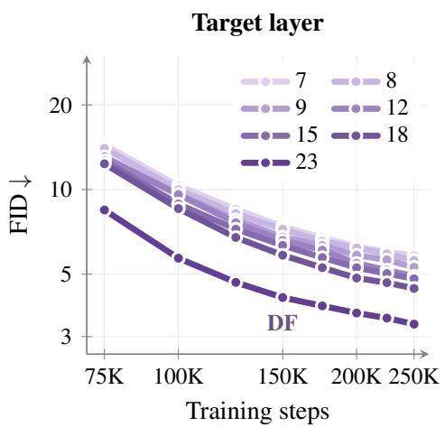

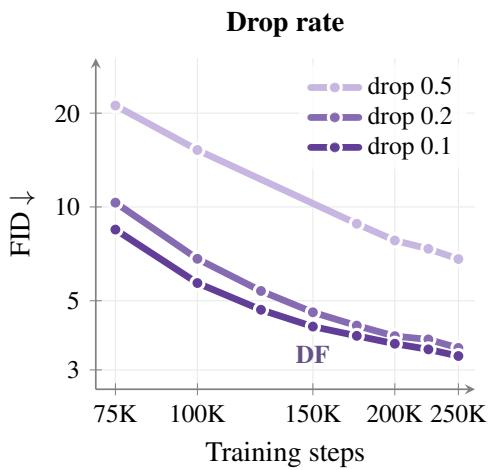  
Figure 7: Layer index and dropping probability ablation on SiT-L model.

## C ABLATION

We now ablate the main design choices of our method. Unless stated otherwise, every ablation is run on SiT-L and reported in the unguided setting, so that all numbers are directly comparable.

Where should the pretrained representation live? We sweep the block at which the pretrained representation prediction is attached and plot the resulting FID trajectories in Figure 7 (left). Deeper is consistently better throughout training: the final block (Layer 23, zero-indexed) reaches 3.32 against roughly 5.84 for Layer 7 at 250K steps. This is consistent with the branch requiring the abstract, high-level features that emerge only deep in the network, which are also the features that align with the DINOv2 target. We attach the branch at the deepest block in all main experiments.

How often should we train on Pass 1 alone? Pass 1 carries a specific burden: at sampling time it is the first step the model takes and its look-ahead must orient the trajectory before any real conditioning exists. Pass 1 is optimized alone with probability p, We sweep it in Figure 7 (right) this probability. p = 0.1 works best (3.32) compared to p = 0.2 (3.53) and p = 0.5 (6.81) at 250K steps. We use p = 0.1 throughout.

## D EXTENDED RELATED WORK

Representation alignment in image generation. Diffusion models (Sohl-Dickstein et al., 2015; Ho et al., 2020) and flow matching models (Lipman et al., 2023) are trained with denoising objectives that predominantly encourage fine-grained, reconstruction-oriented internal representations rather than high-level semantic ones (Yu et al., 2025). This lack of semantic structure slows training convergence with state-of-the-art image generation models typically requiring over 500 training epochs to reach strong performance (DiT: Peebles & Xie, 2023; SiT: Ma et al., 2024; JiT: Li & He, 2026; fv-loss: Degeorge et al., 2026; TREAD: Krause et al., 2025). Recent works (REPA: Yu et al., 2025; iREPA: Singh et al., 2026a; HASTE: Wang et al., 2025b; REED: Wang et al., 2025a; DDT: Wang et al., 2026; PixelDiT: Yu et al., 2026a; PixelREPA: Shin et al., 2026; DeCo: Ma et al., 2026a; PixelGen: Ma et al., 2026b) have shown that explicitly aligning a model’s internal features with external pretrained representations substantially accelerates convergence. A complementary line of work takes this further by performing flow matching directly in a pre-aligned representation latent space (RAE: Zheng et al., 2026; RAEv2: Singh et al., 2026b; DINO-SAE: Chang et al., 2026), yielding additional convergence speedups. Despite their promise, both approaches have their own limitations when applied to image generation. Feature alignment methods inject pretrained information only during training; at sampling time, the model operates without any explicit guidance, effectively discarding the alignment signal precisely when it is needed. Pre-aligned latent approaches sidestep this by embedding pretrained information into the generation space itself, but at the cost of training a new decoder and introducing non-trivial architectural modifications. A natural middle ground is to jointly denoise both pretrained representation and image, which we discuss next.

Co-denoising for image generation. Jointly denoising multiple modalities (Bao et al., 2023; Xu et al., 2023) offers an appealing alternative: it implicitly aligns pretrained representations while preserving them throughout the entire generation process, including at inference. Applied to image generation, this strategy accelerates training convergence, training both in a latent image feature space (ReDi: Kouzelis et al., 2025; CoReDi: Kouzelis et al., 2026; REG: Wu et al., 2025; SFD: Pan et al., 2026 REGLUE: Petsangourakis et al., 2026) or directly in pixel space (LatentForcing: Baade et al., 2026; V-Co: Lin et al., 2026; CoReDi: Kouzelis et al., 2026). However, co-denoising introduces its own complexity: the optimal noise schedule for the pretrained representation is nontrivial to determine and must be carefully hand-crafted. For instance, SFD (Pan et al., 2026) and LatentForcing (Baade et al., 2026) found that denoising the pretrained representation branch (e.g., DINO features) to a low noise level before beginning image denoising yields the best convergence speed, a schedule that likely needs to be re-tuned for different modalities, making the approach brittle to apply in general.

The limitations above share a common structure: they all stem from either the absence of pretrained information during image generation, or the need for additional models and carefully designed schedules to introduce it. One principled way to address this is to condition the image generation model directly on pretrained representations, bypassing the need to denoise them from scratch (RCG: Li et al., 2024; PixelDiT2: Yu et al., 2026b). Inspired by self-conditioning techniques (Jabri et al., 2023; Chen et al., 2023), we propose to condition the model on its own predicted representation at each denoising step. Crucially, unlike prior self-conditioning works, we explicitly make these predicted self-conditions to align with an external pretrained feature space, encouraging the model to predict its own representation in a meaningful, structured sense. This design simultaneously resolves the key failure modes of existing approaches: pretrained information is available throughout image generation without requiring a separate decoder, no architectural modifications, or handcrafted denoising schedules, while still achieving faster training convergence.

## E ADDITIONAL QUALITATIVE RESULTS

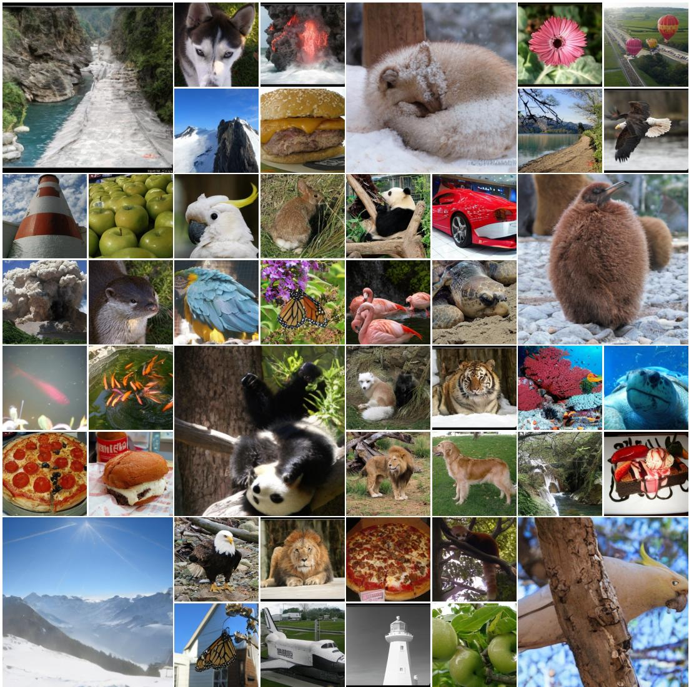  
Figure 8: Uncurated samples from DF-SiT-XL/2 on ImageNet 256×256, without guidance.

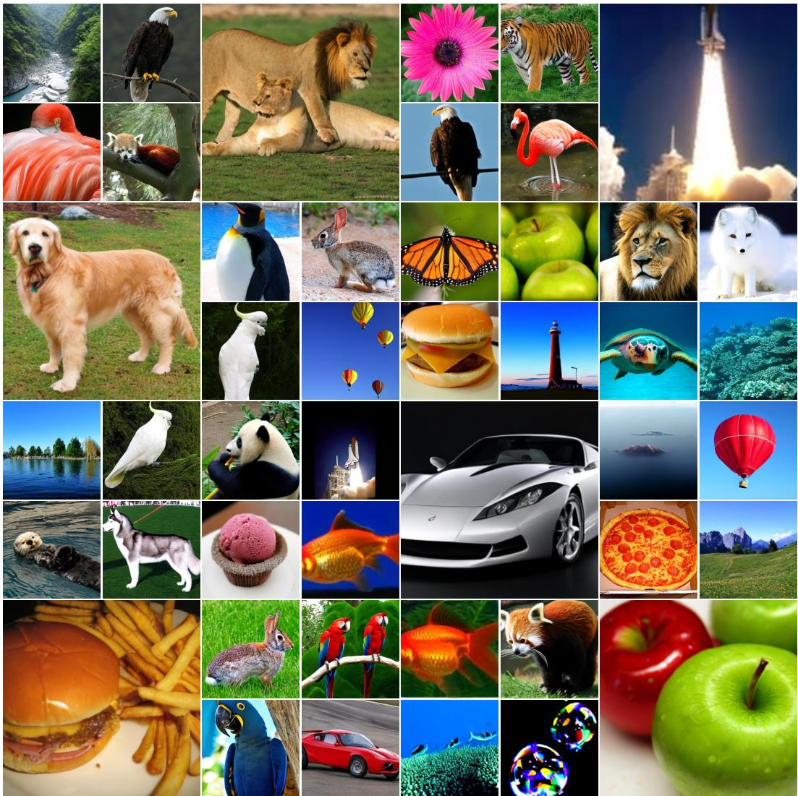  
Figure 9: Uncurated samples from DF-SiT-XL/2 on ImageNet 256×256, with cfg=4.0.

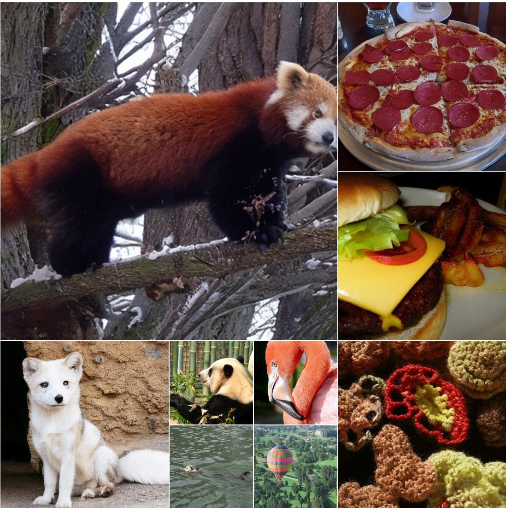  
Figure 10: Uncurated samples from DF-SiT-XL/2 on ImageNet 512×512 without guidance.

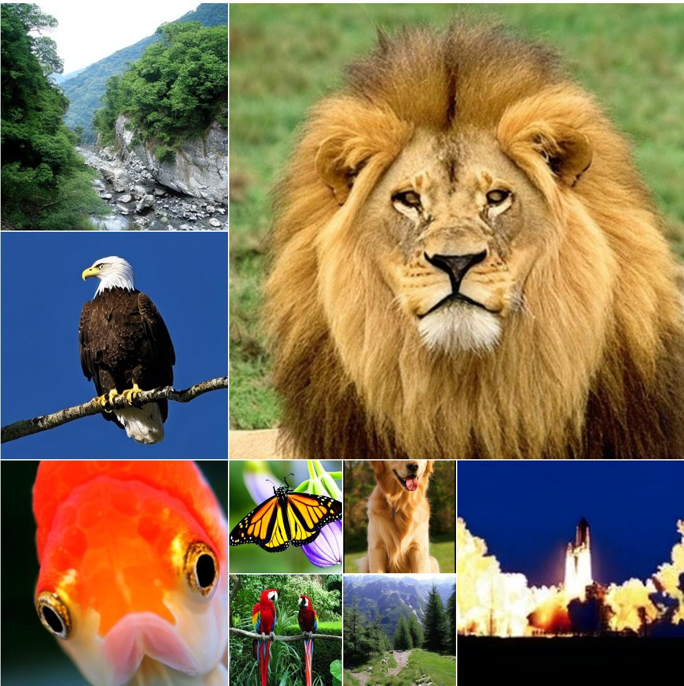  
Figure 11: Uncurated samples from DF-SiT-XL/2 on ImageNet 512×512, with cfg=4.0.

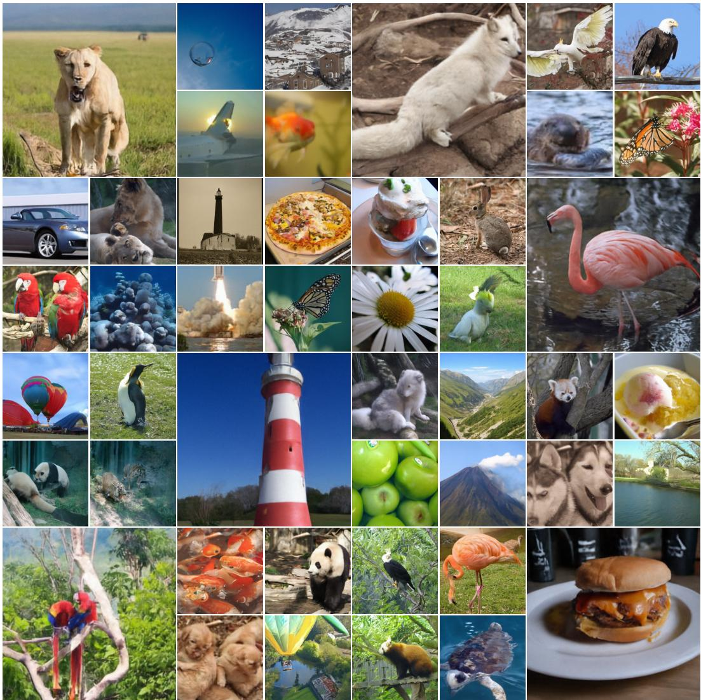  
Figure 12: Uncurated samples from DF-JiT-XL/16 on ImageNet 256×256 without guidance.

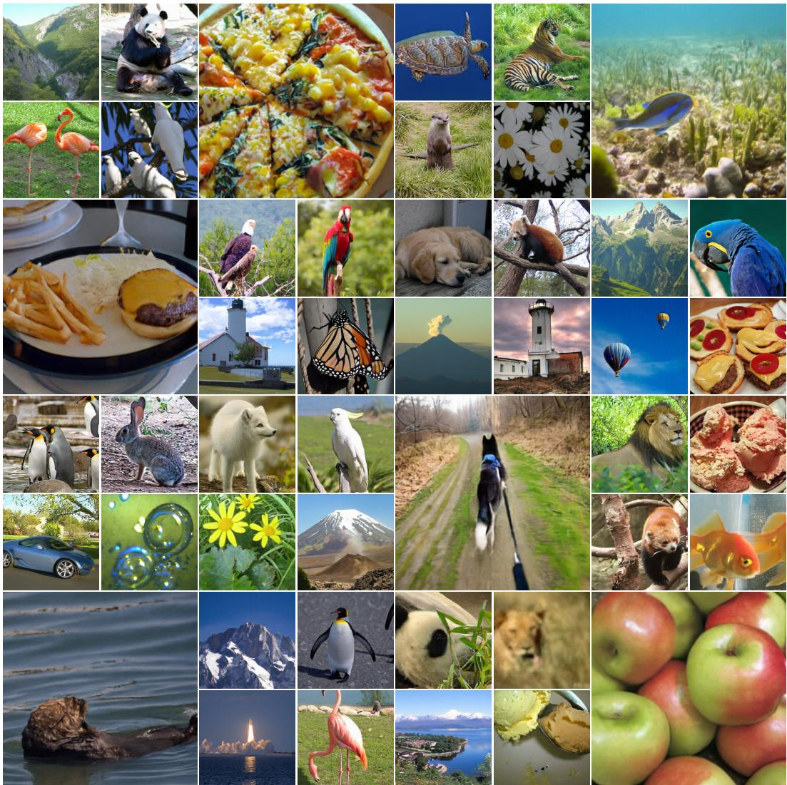  
Figure 13: Uncurated samples from DF-JiT-XL/16 on ImageNet 256×256 with cfg=4.0.

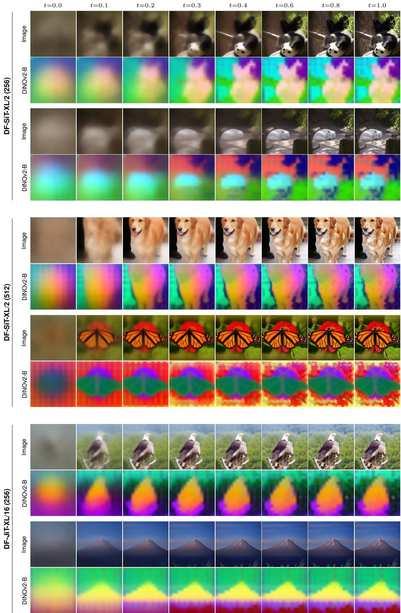  
Figure 14: Evolution of the image and the PCA of the predicted DINO features throughout sampling (t=0: noise, t=1: data), for DF-SiT-XL/2 at 256×256 and 512×512 and DF-JiT at $2 5 6 \times 2 5 6$ . The PCA projection is fit once per sample on the final features and reused for all timesteps.