# DO NOT TRAIN AWAY UNCERTAINTY: EARLY UNCER-TAINTY ANCHORED CALIBRATION

Yutong Xie1, Jiawei Tang2, Zhenglin Hua2, Yuxiang Ma1, Si Qin2, Yaxin Hou2, Hui Liu4, Junhui Hou5, Yuheng Jia2,3,4∗

1School of Software Engineering, Southeast University, Nanjing, China 2School of Computer Science and Engineering, Southeast University, Nanjing, China 3Key Laboratory of New Generation Artificial Intelligence Technology and Its Interdisciplinary Applications (Southeast University), Ministry of Education, China 4School of Computing Information Sciences, Saint Francis University, Hong Kong, China 5Department of Computer Science, City University of Hong Kong, Hong Kong, China {xyt,jw tang,220252358,220256453,siqin,yaxin,yhjia}@seu.edu.cn h2liu@sfu.edu.hk, jh.hou@cityu.edu.hk

## ABSTRACT

Deep neural networks, including large language models, have achieved remarkable performance across various tasks. However, they are prone to overconfidence during training or fine-tuning. In this work, we observe a consistent phenomenon across different models that the early model is better calibrated, while later training or fine-tuning yields marginal accuracy gains but substantially increases calibration errors. Our analysis suggests that the early model retains uncertainty awareness in both its predictions and features, which is gradually lost with continued training. To avoid training away this uncertainty awareness, we propose EUA-Cal, a novel method that exploits the Early model as an Uncertainty Anchor for Calibration. EUA-Cal introduces early prediction regularization to preserve early predictive uncertainty and prototype structure regularization to exploit uncertainty reflected in the early feature space, jointly mitigating overconfidence. Extensive experiments on image classification and multiple-choice question answering across eight diverse models demonstrate that EUA-Cal outperforms stateof-the-art calibration methods.

## 1 INTRODUCTION

In recent years, deep neural networks (DNNs), including large language models (LLMs), have achieved significant progress in image classification (Zagoruyko & Komodakis, 2016), object segmentation (Kirillov et al., 2023), and natural language processing (Vaswani et al., 2017). Despite their remarkable performance, these models are prone to overconfidence during training or finetuning, with the predicted confidence exceeding the actual accuracy (Guo et al., 2017; Jiang et al., 2021). This overconfidence reflects an underestimate of the uncertainty in their predictions and can reduce their reliability, particularly in high-risk applications such as autonomous driving (Zhang et al., 2025) and medical diagnosis (Huang et al., 2025b).

To calibrate model confidence, various calibration techniques have been proposed, including posthoc calibration (Guo et al., 2017; Pan et al., 2020), loss function and regularization designs (Szegedy et al., 2016; Mukhoti et al., 2020; Liu et al., 2022; Ni et al., 2025), mixup-based methods (Thulasidasan et al., 2019; Bouniot et al., 2025), uncertainty-aware methods (Sensoy et al., 2018; Li et al., 2025), etc. Expected Calibration Error (ECE) (Guo et al., 2017) is a commonly used metric for evaluating the calibration performance of these methods, which measures the discrepancy between predicted confidence and empirical accuracy across confidence bins. A lower value of ECE indicates better calibration performance, i.e., the model is aware of how uncertain its predictions are.

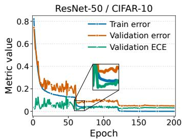

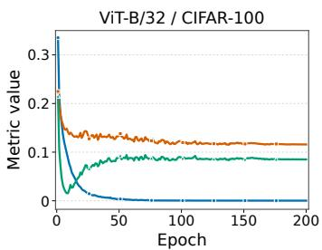  
(a)

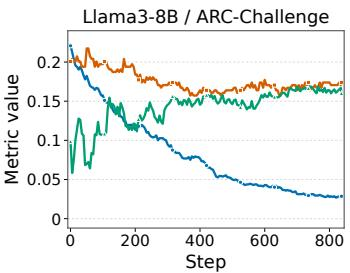

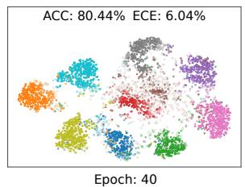

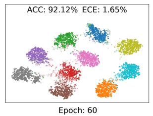  
(b)

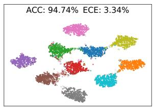  
Figure 1: (a) Training and validation classification errors and validation ECE for ResNet-50 on CIFAR-10, ViT-B/32 on CIFAR-100, and Llama3-8B on ARC-Challenge. (b): t-SNE visualizations of features from ResNet-50 on CIFAR-10 at epochs 40, 60, and 200. Lighter shades indicate features associated with lower confidence. More examples are provided in Appendix B.

Some studies (Guo et al., 2017; Mukhoti et al., 2020) have shown that DNNs tend to produce overconfident predictions with continued training. We observe a similar pattern across various models, where the early model is better calibrated but its calibration worsens as training continues. Figure 1(a) illustrates the classification errors of three different models on the train and validation sets, along with the ECE on the validation set. On all three models, we observe that ECE reaches its min imum at an early stage of training or fine-tuning, but then increases in later stages, while accuracy improves only marginally. This indicates that there exists an early model that achieves the lowest ECE and exhibits the greatest uncertainty awareness in its predictions. However, this awareness is gradually lost during subsequent training, resulting in worse calibration performance.

Beyond predictions of the early model, we observe that it also exhibits uncertainty awareness in feature structure. Figure 1(b) visualizes the feature structure and the corresponding calibration performance of ResNet-50 at different training epochs. We find that features with low confidence (shown in lighter shades) are crucial for calibration. At epoch 40, many features have low confidence, but their cluster structure remains poorly defined. The model exhibits the lowest accuracy and the highest ECE. At epoch 60, corresponding to the early model in Figure 1(a), clearer clusters emerge while features with low confidence remain near their boundaries. At this stage, accuracy improves and ECE reaches its minimum. By epoch 200, the model achieves the highest accuracy with the most compact clusters. However, features with low confidence almost disappear, while the ECE increases. These observations suggest that the early model with the best ECE forms a clear feature structure while retaining some low confidence features, demonstrating the best uncertainty awareness in its features. However, this uncertainty awareness also fades as training continues.

To avoid training away this uncertainty awareness in predictions and features, we propose EUA-Cal, a novel method that exploits the Early model as an Uncertainty Anchor for Calibration. Specifically, in the pre-learning stage, we obtain the early model by stopping training at a specific epoch, which is selected on validation sets. We then introduce Early Prediction Regularization (EPR) to preserve early predictive uncertainty and Prototype Structure Regularization (PSR) to exploit uncertainty awareness in features of the early model. Finally, we combine EPR and PSR to formulate the overall EUA-Cal objective, aiming to preserve uncertainty and mitigate overconfidence.

Our contributions are summarized as follows:

• We identify a general phenomenon in training or fine-tuning where the early model is better calibrated. Our analysis further shows that the early model preserves uncertainty awareness in both the predictions and the feature structure. However, this uncertainty is gradually lost as training continues, resulting in overconfidence.

• We propose EUA-Cal, a novel method that exploits the uncertainty awareness retained by the early model as an anchor. Our method is achieved through regularization terms that EPR aligns current predictions with early predictions and PSR derives probability distributions from early feature structures, jointly mitigating overconfidence.

• Our method achieves superior performance in calibration across diverse network architectures, including deep neural networks such as ResNet and DenseNet, as well as Transformer-based models such as ViT, Llama, and Qwen. Extensive experiments on eight models and six datasets demonstrate that EUA-Cal outperforms state-of-the-art methods.

## 2 RELATED WORK

Calibration for DNNs. Calibration aims to ensure that predicted confidence is indicative of the actual likelihood of correctness (Zhang et al., 2023). Post-hoc methods learn a calibration function on a validation set (Kull et al., 2017; Guo et al., 2017; Pan et al., 2020). Among them, Temperature Scaling (Guo et al., 2017) is a widely used method that learns a single temperature to adjust the output logits. Despite their simplicity and effectiveness, post-hoc methods perform poorly under distribution shifts (Ovadia et al., 2019). Loss function and regularization designs reduce overconfidence by implicitly or explicitly maximizing the entropy of predictive distributions. Label Smoothing (LS) (Szegedy et al., 2016) softens one-hot labels, while Focal Loss (FL) (Mukhoti et al., 2020) implicitly increases the entropy of the predicted distribution. MbLS (Liu et al., 2022) controls the margin on logit distances to prevent the model from non-informative predictions. BalCAL (Ni et al., 2025) combines a fixed ETF classifier with a standard linear classifier to adjust confidence. Mixup-based methods were originally proposed to improve generalization and have been proven effective for calibration (Thulasidasan et al., 2019; Noh et al., 2023; Bouniot et al., 2025). Wang et al. (2023) note that the confidence penalty of Mixup would harm calibration and propose MIT to avoid the negative impact of the confidence penalty. Several methods propose calibration methods for specific network structures (Jordahn & Olmos, 2024; Wang & Zhang, 2024; Ni et al., 2026), but their generalizability across different structures remains unclear.

Calibration for Fine-tuned LLMs. Recent studies have focused on fine-tuned LLM calibration (Jiang et al., 2021; Yang et al., 2024). Traditional methods, such as MC-Dropout (Gal & Ghahramani, 2016) and Deep Ensemble (Lakshminarayanan et al., 2017) provide uncertainty information but require multiple inferences when applied to fine-tuned LLMs. Several methods originally developed for the calibration of DNNs, such as Mixup and LS, have also been shown to effectively calibrate LLMs during fine-tuning (Park & Caragea, 2022; Huang et al., 2025a). Compared with these methods, our method is also applicable to fine-tuned LLMs and achieves superior performance. Distillation (Guo et al., 2021) improves calibration by knowledge distillation from calibrated model ensembles. However, this approach relies on an ensemble of multiple models and an additional validation set for calibration. IB-EDL (Li et al., 2025) introduces an information bottleneck into the EDL (Sensoy et al., 2018) framework to suppress spurious and excessive evidence, thus mitigating overconfidence in fine-tuned LLMs.

## 3 METHODOLOGY

In this section, we first provide the problem statement of model calibration in Sec. 3.1 and then introduce the proposed method, regarding details of early prediction regularization, prototype structure regularization, and the overall EUA-Cal objective in Sec. 3.2. The overview of our method is shown in Figure 2.

## 3.1 PROBLEM STATEMENT

We consider a K-class classification problem with a training set $\mathcal { D } = \{ ( \boldsymbol { x } _ { i } , y _ { i } ) \} _ { i = 1 } ^ { N }$ , where $\pmb { x } _ { i } \in \mathcal { X }$ is a training sample, $y _ { i } \in \mathcal { V }$ is its corresponding label and N denotes the total number of samples.

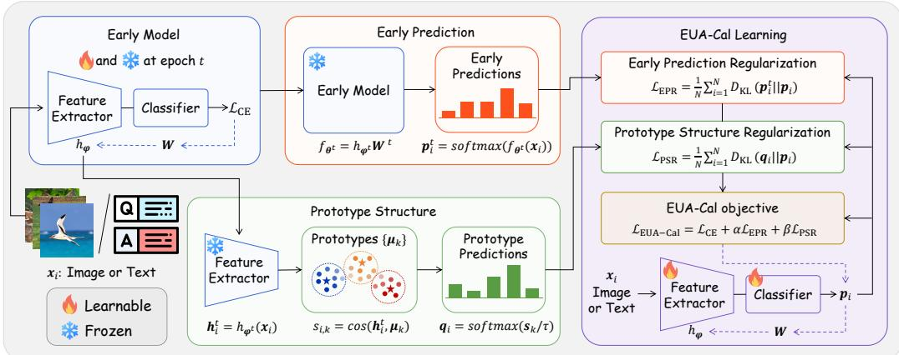  
Figure 2: An illustration of the proposed EUA-Cal approach for calibration. In the pre-learning stage, we freeze the early model as an uncertainty anchor at the selected training epoch. Its predictions are used for EPR, while confidence-weighted class prototypes constructed from early features provide structural targets for PSR. The overall objective guides training or fine-tuning to preserve uncertainty and mitigate overconfidence.

Let $f _ { \theta }$ be a model parameterized by θ that produces a logit $z _ { i } = f _ { \pmb \theta } ( \pmb x _ { i } ) \in \mathbb { R } ^ { K }$ , and the class probabilities are defined as $\pmb { p _ { i } } = \{ p _ { i , k } \} _ { k = 1 } ^ { K } = s o f t m a x ( z _ { i } )$ , where $p _ { i , k }$ is the predicted probability for class k. Based on these probabilities, the predicted label and confidence are defined as $\hat { y } _ { i } =$ arg maxk $p _ { i , k }$ and $\hat { p } _ { i } = \operatorname* { m a x } _ { k } p _ { i , k }$ , respectively. We further separate the model $f _ { \theta }$ into a feature extractor $h _ { \varphi } : \mathcal { X } \to \mathbb { R } ^ { d }$ and a linear classifier $W \in \mathbb { R } ^ { d \times K }$ , such that $f _ { \pmb \theta } ( \pmb x _ { i } ) \ = \ h _ { \varphi } ( \pmb x _ { i } ) \pmb { W }$ During training, we denote the parameters obtained at the t-th epoch by $\pmb { \theta } ^ { t } = \dot { \{ \varphi ^ { t } , W ^ { t } \} }$ , and the corresponding model is $f _ { \theta ^ { t } } ( \cdot ) \stackrel { - } { = } h _ { \varphi ^ { t } } ( \cdot ) W ^ { t }$

A model is well-calibrated if the predicted confidence $\hat { p } _ { i }$ reflects the actual probability of correctness, i.e., $\mathbb { P } ( \hat { y } _ { i } = y _ { i } | \hat { p } _ { i } = p ) = p$ for all $p \in [ 0 , 1 ]$ . However, DNNs trained or LLMs fine-tuned with CE loss tend to be overconfident, producing higher confidence than its accuracy. Confidence calibration aims to align predicted confidence with actual accuracy, thereby producing more reliable predictions.

## 3.2 EARLY UNCERTAINTY ANCHORED CALIBRATION

Based on previous analysis, we propose EUA-Cal, a novel method that exploits uncertainty awareness retained by the early model for calibration.

Early Prediction Regularization. As analyzed in Sec. 1, prediction of the early model is better calibrated and retains reliable uncertainty awareness for samples. Motivated by this insight, we introduce Early Prediction Regularization (EPR) to preserve the specific uncertainty of samples captured at the early training stage. Formally, given the parameters $\pmb { \theta } ^ { t }$ from the selected training iteration t, we freeze the corresponding model $f _ { \pmb { \theta } ^ { t } }$ . The $\mathrm { E P R }$ loss is defined as the Kullback-Leibler (KL) divergence between the early and current prediction distributions, i.e.,

$$
\mathcal { L } _ { \mathrm { E P R } } = \frac { 1 } { N } \sum _ { i = 1 } ^ { N } D _ { \mathrm { K L } } ( \pmb { p } _ { i } ^ { t } | | \pmb { p } _ { i } ) = \frac { 1 } { N } \sum _ { i = 1 } ^ { N } \sum _ { k = 1 } ^ { K } p _ { i , k } ^ { t } \log \left( \frac { p _ { i , k } ^ { t } } { p _ { i , k } } \right) ,\tag{1}
$$

where $\pmb { p } _ { i } ^ { t } = \{ p _ { i , k } ^ { t } \} _ { k = 1 } ^ { K } = \mathrm { s o f t m a x } ( f _ { \pmb { \theta } ^ { t } } ( \pmb { x } _ { i } ) )$ is the early prediction distribution of sample $\mathbf { \Delta } _ { \mathbf { \mathcal { X } } _ { i } }$ from the frozen early model. The traditional CE loss with hard label continuously pushes all samples toward one-hot prediction, regardless of the sample specific uncertainty. In contrast, early predictions retain sample uncertainty before the overconfidence emerges. EPR utilizes them as reliable references to constrain excessive confidence growth on uncertain samples, while preserving confident predictions for certain samples.

To verify the role of uncertainty awareness in early predictions, we divide the samples into certain and uncertain groups according to the confidence of the selected early model (e.g., epoch 60 on ResNet-50). Figure 3(a) illustrates the average confidence of CIFAR-10 samples. For certain samples, confidence remains high throughout training. However, samples identified as uncertain at the early stage gradually become highly confident under vanilla CE training, and their confidence eventually approaches that of certain samples. In contrast, our method leverages the uncertainty awareness captured by early predictions to prevent overconfident predictions on uncertain samples.

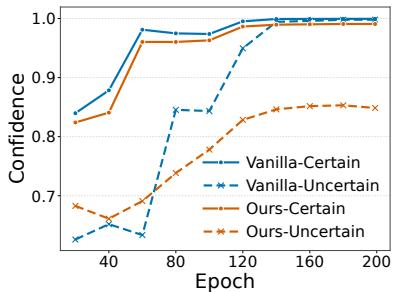  
(a)

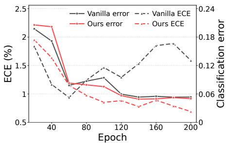  
(b)  
Figure 3: (a) Confidence of certain and uncertain samples under the vanilla CE model and our method. Samples are divided according to the confidence of the selected early model. (b) Classification errors and ECE of the prototype predictions on the validation set using prototypes constructed from different training epochs.

Prototype Structure Regularization. Beyond early predictions, the feature structure of the early model also preserves uncertainty awareness. We further introduce Prototype Structure Regularization (PSR) to exploit this uncertainty awareness of the early feature structure. Specifically, given the feature extractor $h _ { \varphi ^ { t } }$ of the frozen early model, we first construct the prototype for each class. For a sample ${ \mathbf { x } } _ { i } ,$ we extract its feature $\boldsymbol { h } _ { i } ^ { t }$ from the frozen early model, i.e., $\pmb { h } _ { i } ^ { t } = h _ { \pmb { \varphi } ^ { t } } ( \pmb { x } _ { i } ) \in \mathbb { R } ^ { d }$ . Given the uncertainty awareness in early predictions, we utilize the probability assigned by the early model to the true class of each sample as a reliability weight, i.e., $w _ { i } = p _ { i , y _ { i } } ^ { t }$ . Accordingly, the prototype $\pmb { \mu } _ { k }$ is constructed using normalized confidence-weighted averaging over the early features of class $k ,$ i.e.,

$$
\mu _ { k } = \frac { \sum _ { i = 1 } ^ { N } \mathbb { I } ( y _ { i } = k ) w _ { i } \overline { { h } } _ { i } ^ { t } } { \sum _ { i = 1 } ^ { N } \mathbb { I } ( y _ { i } = k ) w _ { i } } ,\tag{2}
$$

where $\mathbb { I } ( \cdot )$ is the indicator function and $\overline { { { h } } } _ { i } ^ { t } = h _ { i } ^ { t } / | | h _ { i } ^ { t } | | _ { 2 }$ is the normalized feature. Given the set of prototypes $\mathcal { M } = \{ \mu _ { k } \} _ { k = 1 } ^ { K } ,$ , the similarity between the feature of the sample $\mathbf { \Delta } _ { \mathbf { \mathcal { X } } _ { i } }$ in the early model and the prototype of class k is

$$
s _ { i , k } = \cos ( h _ { i } ^ { t } , \mu _ { k } ) = \frac { ( h _ { i } ^ { t } ) ^ { \top } \mu _ { k } } { | | h _ { i } ^ { t } | | _ { 2 } | | \mu _ { k } | | _ { 2 } } .\tag{3}
$$

As observed in Figure 1(b), features near cluster boundaries tend to have lower confidence, whereas those closer to cluster centers tend to have higher confidence. This suggests that similarities to cluster centers, i.e., class prototypes, can reflect the early model’s uncertainty awareness in its features. Accordingly, we convert the similarity into a probability distribution over classes for the sample $\mathbf { \Delta } _ { \mathbf { \mathcal { X } } _ { i } }$ using the softmax function, i.e.,

$$
\pmb { q } _ { i } = \{ q _ { i , k } \} _ { k = 1 } ^ { K } = \mathrm { s o f t m a x } \left( \frac { \pmb { s } _ { i } } { \tau } \right) , \quad q _ { i , k } = \frac { \exp ( s _ { i , k } / \tau ) } { \sum _ { j = 1 } ^ { K } \exp ( s _ { i , j } / \tau ) } ,\tag{4}
$$

where $\pmb { q } _ { i }$ is defined as the prototype prediction of the sample $\pmb { x } _ { i } , \pmb { s } _ { i } = [ s _ { i , 1 } , s _ { i , 2 } , . . . , s _ { i , K } ]$ is the similarity vector between the feature of the sample $\mathbf { \Delta } _ { \mathbf { \mathcal { X } } _ { i } }$ and the prototypes, and $\tau > 0$ is the scaling factor. The PSR loss is defined as the KL divergence between the prototype prediction distributions and the current prediction distributions, i.e.,

$$
\mathcal { L } _ { \mathrm { P S R } } = \frac { 1 } { N } \sum _ { i = 1 } ^ { N } D _ { \mathrm { K L } } ( \boldsymbol { q } _ { i } | | \boldsymbol { p } _ { i } ) = \frac { 1 } { N } \sum _ { i = 1 } ^ { N } \sum _ { k = 1 } ^ { K } q _ { i , k } \log \left( \frac { q _ { i , k } } { p _ { i , k } } \right) .\tag{5}
$$

Algorithm 1 EUA-Cal   
Input: Training set $\boldsymbol { \mathcal { D } } = \{ ( \boldsymbol { x } _ { i } , y _ { i } ) \} _ { i = 1 } ^ { N }$ , initial model $f _ { \theta } = h _ { \varphi } W$ , selected epoch $t ,$ parameters α   
and $\beta ,$ scaling factor $\tau ,$ and total number of epochs $T .$   
Output: Calibrated model $f _ { \pmb { \theta } ^ { T } }$   
1: Pre-learn $f _ { \theta }$ with $\mathcal { L } _ { \mathrm { C E } }$ until epoch t to obtain the early model $f _ { \pmb { \theta } ^ { t } }$   
2: Compute $p _ { i } ^ { t } =$ softmax $( f _ { \pmb { \theta } ^ { t } } ( \pmb { x } _ { i } ) ) , \overline { { \pmb { h } } } _ { i } ^ { t } = { \pmb { h } } _ { i } ^ { t } / \| { \pmb { h } } _ { i } ^ { t } \| _ { 2 }$ , and $w _ { i } = p _ { i , y _ { i } } ^ { t }$ for all $( \pmb { x } _ { i } , y _ { i } ) \in \mathcal { D } .$   
3: Construct the class prototypes $\{ \mu _ { k } \} _ { k = 1 } ^ { K }$ according to Eq. (2).   
4: Compute the prototype similarities and distributions $\pmb q _ { i }$ according to Eq. (3) and Eq. (4).   
5: for epoch from 1 to $\dot { T }$ do   
6: for each training batch sampled from D do   
7: Compute LEPR and $\mathcal { L } _ { 1 }$ PSR according to Eq. (1) and Eq. (5).   
8: Update $\pmb { \theta }$ by minimizing $\mathcal { L } _ { \mathrm { E U A - C a l } }$ in Eq. (6).   
9: end for   
10: end for

Note that the prototypes $\{ \mu _ { k } \} _ { k = 1 } ^ { K }$ are constructed from the frozen early model, preventing them from drifting during training. Figure 3(b) shows the classification errors and ECE of the prototype predictions for ResNet-50 on CIFAR-10. The ECE of prototype predictions from the vanilla model reaches its minimum at epoch 60 and increases in later stages. In contrast, the ECE of our prototype predictions continues to decrease, demonstrating better uncertainty awareness of the feature structure. The PSR loss leverages this awareness of uncertainty to further improve the calibration performance.

The overall objective of our method is:

$$
\operatorname* { m i n } _ { \theta } \mathcal { L } _ { \mathrm { E U A - C a l } } = \operatorname* { m i n } _ { \theta } \mathcal { L } _ { \mathrm { C E } } + \alpha \mathcal { L } _ { \mathrm { E P R } } + \beta \mathcal { L } _ { \mathrm { P S R } } ,\tag{6}
$$

where $\alpha$ and $\beta$ are hyperparameters that control the strengths of EPR loss and PSR loss, respectively.   
The pseudo-code of our EUA-Cal method is summarized in Algorithm 1.

## 4 EXPERIMENTS

## 4.1 EXPERIMENTAL SETUP

Datasets and Models. We evaluate our method on both image classification and multiple-choice question answering. For image classification, we conduct experiments on CIFAR-10, CIFAR-100 (Krizhevsky & Hinton, 2009), and Tiny-ImageNet (Deng et al., 2009) datasets with different network architectures, including ResNet-50, ResNet-101 (He et al., 2016), Wide-ResNet-26-10 (Zagoruyko & Komodakis, 2016), DenseNet-121 (Huang et al., 2017), and ViT-B/32 (Dosovitskiy et al., 2021). For multiple-choice question answering, we consider SciQ (Welbl et al., 2017), ARC-Challenge (ARC-C) and ARC-Easy (ARC-E) (Clark et al., 2018), and CommonsenseQA (CSQA) (Talmor et al., 2019) datasets. We fine-tune Llama3-8B, Llama3.1-8B (Grattafiori et al., 2024), and Qwen3- 8B-Base (Yang et al., 2025) using LoRA (Hu et al., 2022).

Baselines and Metrics. For image classification, we compare EUA-Cal with various calibration methods: (i) the vanilla model trained with CE; (ii) implicit or explicit regularization, including LS (Szegedy et al., 2016), FL (Mukhoti et al., 2020), CRL (Moon et al., 2020), Distillation (Guo et al., 2021), MbLS (Liu et al., 2022), BalCAL (Ni et al., 2025), and CSAM (Tan et al., 2026); (iii) data augmentation, including Mixup (Thulasidasan et al., 2019) and MIT (Wang et al., 2023); (iv) architecture-specific methods, including PLP (Wang & Zhang, 2024) and MaC-Cal (Ni et al., 2026). For multiple-choice question answering with fine-tuned LLMs, we evaluate all methods above except BalCAL, PLP, and MaC-Cal since they rely on specific components. We further include (v) uncertainty-aware methods, including EDL (Sensoy et al., 2018) and IB-EDL (Li et al., 2025). Calibration is evaluated using ACC, ECE (Guo et al., 2017), and adaptive ECE (AECE) (Nixon et al., 2019). For out-of-distribution (OOD) detection, we adopt AUROC and FPR95 as metrics.

More implementation details including dataset splitting, training policies, hyperparameters, and evaluation protocols are provided in Appendix A.

Table 1: Performance comparison between different methods with ResNet-50 on CIFAR-10, CIFAR-100, and Tiny-ImageNet datasets. Results are reported as mean ± standard deviation (%). The best and second best results are shown in bold and underlined, respectively.
<table><tr><td rowspan="2">Method</td><td colspan="3">CIFAR-10</td><td colspan="3">CIFAR-100</td><td colspan="3">Tiny-ImageNet</td><td rowspan="2">Avg. Rank</td></tr><tr><td>ECE↓</td><td>AECE↓</td><td>ACC↑</td><td>ECE↓</td><td>AECE↓</td><td>ACC ↑</td><td>ECE↓</td><td>ÀECE↓</td><td>ACC↑</td></tr><tr><td>Vanilla</td><td>3.36±0.17</td><td>3.31±0.19</td><td>94.57±0.15</td><td>9.19±0.16</td><td>9.07±0.26</td><td>76.75±0.62</td><td>5.54±0.44</td><td>5.52±0.43</td><td>64.45±0.45</td><td>10.11</td></tr><tr><td>LS</td><td>3.74±0.24</td><td>3.93±0.33</td><td>94.78±0.13</td><td>3.96±0.22</td><td>3.99±0.24</td><td>76.77±0.13</td><td>3.78±0.27</td><td>3.70±0.36</td><td>63.58±0.67</td><td>8.78</td></tr><tr><td>FL</td><td>1.81±0.31</td><td>1.58±0.27</td><td>94.40±0.28</td><td>1.77±0.31</td><td>1.71±0.33</td><td>75.88±0.35</td><td>1.57±0.11</td><td>1.48±0.18</td><td>62.94±0.33</td><td>6.67</td></tr><tr><td>CRL</td><td>0.86±0.09</td><td>0.61±0.03</td><td>93.94±0.22</td><td>5.81±0.30</td><td>5.74±0.27</td><td>76.87±0.39</td><td>2.99±0.31</td><td>3.04±0.33</td><td>63.43±0.33</td><td>7.67</td></tr><tr><td>Distillation</td><td>3.22±0.52</td><td>3.27±0.49</td><td>94.10±0.67</td><td>7.51±0.20</td><td>7.40±0.16</td><td>76.64±0.12</td><td>6.04±0.24</td><td>6.01±0.19</td><td>65.21±0.20</td><td>10.22</td></tr><tr><td>MbLS</td><td>3.51±0.23</td><td>3.48±0.21</td><td>94.54±0.35</td><td>8.62±0.38</td><td>8.52±0.37</td><td>77.41±0.49</td><td>1.42±0.05</td><td>1.34±0.22</td><td>64.44±0.48</td><td>8.00</td></tr><tr><td>BalCAL</td><td>2.46±0.12</td><td>2.39±0.11</td><td>94.38±0.13</td><td>4.03±0.27</td><td>3.93±0.28</td><td>77.33±0.31</td><td>1.48±0.14</td><td>1.52±0.13</td><td>65.26±0.12</td><td>6.56</td></tr><tr><td>CSAM</td><td>1.04±0.15</td><td>0.90±0.19</td><td>95.36±0.20</td><td>1.40±0.39</td><td>1.30±0.50</td><td>78.82±0.88</td><td>6.10±0.13</td><td>6.12±0.13</td><td>66.54±0.40</td><td>4.67</td></tr><tr><td>Mixup</td><td>1.74±0.38</td><td>2.25±0.29</td><td>95.01±0.37</td><td>5.40±0.62</td><td>5.34±0.55</td><td>77.78±0.58</td><td>3.30±0.23</td><td>3.20±0.15</td><td>63.58±0.74</td><td>6.78</td></tr><tr><td>MIT-A</td><td>1.64±0.06</td><td>1.54±0.05</td><td>95.57±0.03</td><td>1.95±0.11</td><td>1.87±0.30</td><td>78.46±0.48</td><td>3.66±0.82</td><td>3.77±0.76</td><td>64.34±0.89</td><td>5.22</td></tr><tr><td>PLP</td><td>2.35±0.12</td><td>2.31±0.13</td><td>94.24±0.19</td><td>4.66±0.38</td><td>4.64±0.36</td><td>74.60±0.68</td><td>2.07±0.51</td><td>2.02±0.51</td><td>60.85±1.68</td><td>9.00</td></tr><tr><td>MaC-Cal</td><td>0.83±0.15</td><td>0.82±0.11</td><td>94.81±0.05</td><td>3.32±0.14</td><td>3.14±0.21</td><td>76.07±0.10</td><td>1.44±0.12</td><td>1.33±0.23</td><td>61.34±0.20</td><td>5.22</td></tr><tr><td>EUA-Cal</td><td>0.54±0.12</td><td>0.50±0.09</td><td>94.63±0.05</td><td>1.28±0.11</td><td>1.18±0.21</td><td>77.66±0.32</td><td>1.38±0.17</td><td>1.29±0.11</td><td>65.31±0.47</td><td>2.00</td></tr></table>

Table 2: Performance comparison between different methods with Llama3-8B on ARC-C, ARC-E, and SciQ datasets. Results are reported as mean ± standard deviation (%). The best and second best results are shown in bold and underlined, respectively.
<table><tr><td rowspan="2">Method</td><td colspan="3">ARC-C</td><td colspan="3">ARC-E</td><td colspan="3">SciQ</td><td rowspan="2">Avg. Rank</td></tr><tr><td>ECE↓</td><td>AECE↓</td><td>ACC↑</td><td>ECE↓</td><td>AECE↓</td><td>ACC ↑</td><td>ECE↓</td><td>AECE↓</td><td>ACC ↑</td></tr><tr><td>Vanilla</td><td>17.24±0.25</td><td>17.12±0.31</td><td>81.31±0.64</td><td>6.54±0.03</td><td>6.48±0.03</td><td>92.81±0.12</td><td>6.42±0.38</td><td>6.10±0.41</td><td>93.40±0.52</td><td>8.56</td></tr><tr><td>LS</td><td>15.23±0.96</td><td>15.54±1.26</td><td>79.81±0.96</td><td>3.83±0.17</td><td>5.44±0.78</td><td>91.91±0.16</td><td>3.16±0.35</td><td>5.61±0.44</td><td>92.83±0.21</td><td>8.11</td></tr><tr><td>FL</td><td>12.97±1.31</td><td>12.85±0.93</td><td>80.94±0.81</td><td>4.34±0.24</td><td>4.91±0.24</td><td>91.93±0.10</td><td>4.49±0.12</td><td>4.78±0.22</td><td>93.63±0.06</td><td>5.89</td></tr><tr><td>CRL</td><td>18.17±0.62</td><td>18.04±0.55</td><td>80.46±1.19</td><td>6.98±0.84</td><td>6.88±0.86</td><td>91.83±0.87</td><td>6.21±0.22</td><td>5.99±0.27</td><td>93.27±0.38</td><td>10.67</td></tr><tr><td>Distillation</td><td>11.99±0.76</td><td>12.26±0.69</td><td>81.77±0.50</td><td>3.79±0.27</td><td>4.69±0.45</td><td>93.00±0.45</td><td>3.90±0.13</td><td>5.03±0.22</td><td>93.57±0.12</td><td>4.00</td></tr><tr><td>MbLS</td><td>12.17±10.50</td><td>13.39±8.18</td><td>80.97±0.82</td><td>7.62±0.40</td><td>7.60±0.40</td><td>91.98±0.32</td><td>6.73±0.09</td><td>6.71±0.10</td><td>93.07±0.12</td><td>9.89</td></tr><tr><td>CSAM</td><td>13.17±0.34</td><td>13.08±0.45</td><td>82.19±0.69</td><td>5.13±0.63</td><td>5.22±0.43</td><td>93.23±0.65</td><td>5.26±0.07</td><td>5.03±0.05</td><td>93.63±0.06</td><td>5.00</td></tr><tr><td>Mixup</td><td>10.53±0.68</td><td>10.86±0.29</td><td>79.61±0.48</td><td>6.16±0.24</td><td>6.32±0.25</td><td>91.88±0.28</td><td>5.84±0.34</td><td>5.76±0.30</td><td>93.67±0.25</td><td>7.56</td></tr><tr><td>MIT-A</td><td>6.52±0.39</td><td>7.10±0.66</td><td>81.31±0.53</td><td>5.87±0.07</td><td>5.80±0.08</td><td>92.75±0.21</td><td>4.47±0.14</td><td>4.33±0.27</td><td>94.73±0.35</td><td>4.00</td></tr><tr><td>EDL</td><td>11.25±0.59</td><td>13.25±0.66</td><td>80.23±0.34</td><td>2.60±0.17</td><td>5.75±0.16</td><td>92.51±0.15</td><td>2.86±0.05</td><td>6.22±0.19</td><td>93.47±0.15</td><td>6.67</td></tr><tr><td>IB-EDL</td><td>3.98±0.50</td><td>9.98±1.20</td><td>81.03±0.47</td><td>2.53±0.54</td><td>5.82±0.57</td><td>92.65±0.19</td><td>2.31±0.26</td><td>5.91±0.59</td><td>93.30±0.30</td><td>5.00</td></tr><tr><td>EUA-Cal</td><td>3.60±0.34</td><td>4.17±0.60</td><td>80.94±0.47</td><td>1.67±0.19</td><td>1.79±0.29</td><td>92.72±0.19</td><td>2.19±0.24</td><td>2.57±0.49</td><td>93.90±0.28</td><td>2.22</td></tr></table>

## 4.2 CALIBRATION RESULTS

We provide comprehensive comparisons of our method against state-of-the-art methods for model calibration on both image classification and multiple-choice question answering. Table 1 report the calibration performance of our method with ResNet-50 on CIFAR-10, CIFAR-100, and Tiny-ImageNet. Compared with other calibration methods, our method significantly improves calibration performance across all datasets and achieves the best average rank among all methods. Several methods improve calibration at the cost of accuracy, such as the FL and PLP methods. In contrast, our EUA-Cal method obtains the lowest ECE and AECE on all three datasets while maintaining competitive accuracy. These results support the use of uncertainty information retained by the early model for calibration.

Table 2 reports the calibration results of Llama3-8B on SciQ, ARC-C, and ARC-E. Our method also achieves the best average rank and the lowest ECE and AECE on all three datasets. Compared with the second best method on each dataset, our method reduces ECE and AECE by 16.24% and 47.92% on average, respectively. Additional results on ResNet-101, Wide-ResNet-26-10, DenseNet-121, ViT-B/32, Llama3.1-8B, and Qwen3-8B-Base are provided in Appendix C.1. The consistent improvements across these models further demonstrate the effectiveness and generalizability of EUA-Cal across diverse architectures.

## 4.3 CALIBRATION UNDER DISTRIBUTION SHIFT

Maintaining reliable confidence estimates under distribution shift is particularly important in safetycritical applications such as autonomous driving, where systems must make safe decisions even in adverse weather. To evaluate the calibration robustness of our EUA-Cal method in this setting, we first train ResNet-50 on CIFAR-10 and CIFAR-100 and then evaluate on their corrupted versions, CIFAR-10-C and CIFAR-100-C (Hendrycks & Dietterich, 2019), respectively. These corruptions include noise, blur, compression artifacts, and changes in brightness. Figure 4 illustrates the cali bration performance of various methods with different shift levels. Across both datasets and all shift levels, our EUA-Cal method achieves lower ECE than most methods. This indicates that our EUA-Cal method maintains robust calibration performance under distribution shifts. In addition, we also present the OOD detection results in Table 4. Across all settings, our EUA-Cal method consistently outperforms the vanilla model, improving AUROC by an average of 1.31% and reducing FPR95 by 1.79%. These results demonstrate that EUA-Cal maintains reliable uncertainty awareness under distribution shift.

Table 3: Calibration performance of various methods under distribution shift. Llama3-8B is finetuned on ARC-E and evaluated on ARC-C, SciQ, and CSQA. Results are reported as mean ± standard deviation (%). The best and second best results are shown in bold and underlined, respectively.
<table><tr><td rowspan="2">Method</td><td colspan="3">ARC-C</td><td colspan="3">SciQ</td><td colspan="3">CSQA</td><td rowspan="2">Avg. Rank</td></tr><tr><td>ECE↓</td><td>AECE↓</td><td>ACC↑</td><td>ECE↓</td><td>AECE↓</td><td>ACC ↑</td><td>ECE↓</td><td>AECE↓</td><td>ACC ↑</td></tr><tr><td>Vanilla</td><td>18.25±0.24</td><td>18.03±0.12</td><td>79.81±0.05</td><td>6.72±0.39</td><td>6.64±0.42</td><td>92.43±0.35</td><td>25.42±0.94</td><td>25.39±0.99</td><td>72.07±0.98</td><td>7.56</td></tr><tr><td>LS</td><td>18.69±0.26</td><td>18.80±0.43</td><td>76.17±0.32</td><td>4.98±0.82</td><td>7.65±0.20</td><td>90.90±0.90</td><td>21.82±1.55</td><td>21.66±1.60</td><td>72.24±1.44</td><td>8.11</td></tr><tr><td>FL</td><td>16.26±1.39</td><td>16.29±1.33</td><td>76.99±1.45</td><td>5.47±1.19</td><td>6.16±1.10</td><td>90.97±1.32</td><td>19.49±1.33</td><td>19.38±1.33</td><td>72.89±0.57</td><td>5.67</td></tr><tr><td>CRL</td><td>21.47±1.05</td><td>21.41±0.99</td><td>75.81±0.91</td><td>8.07±1.00</td><td>7.77±1.18</td><td>91.20±1.13</td><td>25.01±0.26</td><td>25.01±0.26</td><td>72.48±0.12</td><td>10.00</td></tr><tr><td>Distillation</td><td>16.55±0.78</td><td>16.53±0.65</td><td>77.87±1.04</td><td>5.17±0.62</td><td>6.03±0.78</td><td>92.00±0.95</td><td>21.84±0.49</td><td>21.78±0.56</td><td>72.67±0.58</td><td>5.78</td></tr><tr><td>MbLS</td><td>23.50±1.08</td><td>23.33±1.11</td><td>75.65±1.41</td><td>8.32±0.79</td><td>8.18±0.84</td><td>91.37±1.03</td><td>27.86±1.63</td><td>27.82±1.67</td><td>70.98±1.77</td><td>11.67</td></tr><tr><td>CSAM</td><td>20.80±0.43</td><td>20.63±0.53</td><td>77.93±0.75</td><td>7.21±0.32</td><td>6.98±0.29</td><td>92.37±0.40</td><td>25.33±1.06</td><td>25.20±1.09</td><td>73.46±0.90</td><td>7.78</td></tr><tr><td>Mixup</td><td>17.85±0.76</td><td>17.72±0.69</td><td>78.50±0.70</td><td>6.14±0.26</td><td>6.20±0.39</td><td>91.87±0.47</td><td>23.78±0.65</td><td>23.72±0.64</td><td>71.14±0.34</td><td>7.33</td></tr><tr><td>MIT-A</td><td>16.81±0.31</td><td>16.52±0.68</td><td>79.72±0.50</td><td>6.64±0.28</td><td>6.50±0.25</td><td>91.57±0.06</td><td>21.83±0.54</td><td>21.60±0.69</td><td>73.41±0.29</td><td>5.56</td></tr><tr><td>EDL</td><td>13.27±0.87</td><td>13.69±0.77</td><td>79.66±0.21</td><td>2.32±0.83</td><td>5.48±0.10</td><td>92.73±0.42</td><td>18.40±0.63</td><td>18.07±0.72</td><td>72.54±0.71</td><td>2.89</td></tr><tr><td>IB-EDL</td><td>11.14±0.12</td><td>12.02±0.35</td><td>79.80±0.49</td><td>3.17±0.94</td><td>5.79±0.59</td><td>92.43±0.15</td><td>16.05±1.22</td><td>16.55±1.02</td><td>72.18±1.02</td><td>3.00</td></tr><tr><td>EUA-Cal</td><td>9.25±0.50</td><td>9.11±0.42</td><td>77.59±0.47</td><td>2.50±0.36</td><td>3.12±0.34</td><td>92.17±0.45</td><td>12.48±0.96</td><td>12.26±0.88</td><td>73.11±0.45</td><td>2.56</td></tr></table>

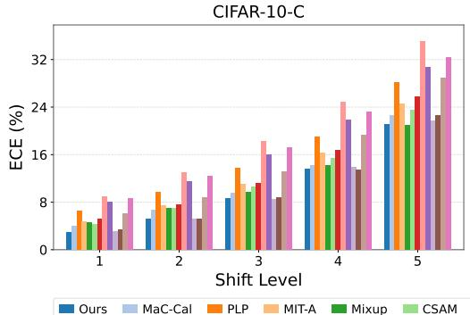

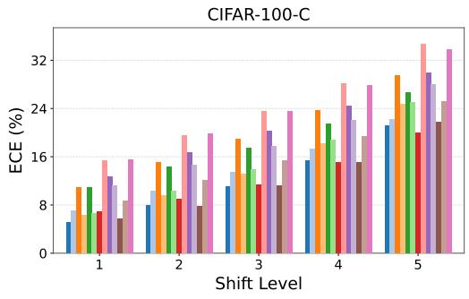  
Figure 4: Calibration performance of various methods under distribution shift on CIFAR-10-C and CIFAR-100-C. The horizontal axis denotes the shift level from weakest to strongest and the vertical axis reports ECE (lower is better).

Practical deployment of LLMs requires them to generalize beyond the domains covered by their fine-tuning data. To evaluate calibration under such distribution shifts, we fine-tune Llama3-8B on ARC-E and then evaluate on ARC-C, SciQ, and CSQA, as reported in Table 3. Our method achieves the best average rank and the lowest AECE on all three datasets. It also achieves the lowest ECE on ARC-C and CSQA and ranks second on SciQ. Compared with the second best method on each dataset, our method reduces AECE by 30.94% on average. These results demonstrate that EUA-Cal maintains effective calibration performance when fine-tuning LLMs under distribution shift.

## 4.4 FURTHER ANALYSIS

Ablation Study. As shown in Table 5, we evaluate several variants of our EUA-Cal method on ResNet-50 and Llama3-8B to investigate the effectiveness of EPR, PSR, and the selection of the anchor model. We find that the EPR variant reduces the ECE across all six datasets, while the PSR variant also improves calibration on most datasets. The complete EUA-Cal, which combines the two regularization terms, achieved the lowest ECE on each dataset, suggesting that predictions and feature structures of the early model provide complementary uncertainty awareness for calibration. For anchor model selection, we compare the early model with a late model that has higher validation accuracy but also higher validation ECE. Although the late model leads to slightly higher accuracy in most settings, its calibration is substantially worse. More analysis on the impact of model selection is provided in Appendix C.2

Table 4: OOD detection results (%). The best and second best results are shown in bold and underlined, respectively.
<table><tr><td rowspan="3">ID DATASET OOD DATASET</td><td colspan="4">CIFAR-10</td><td colspan="4">Tiny-ImageNet</td></tr><tr><td colspan="2">Tiny-ImageNet</td><td colspan="2">CIFAR-100</td><td colspan="2">CIFAR-10</td><td colspan="2">CIFAR-100</td></tr><tr><td>AUROC↑</td><td>FPR95↓</td><td>AUROC↑</td><td>FPR95↓</td><td>AUROC↑</td><td>FPR95↓</td><td>AUROC↑</td><td>FPR95↓</td></tr><tr><td>Vanilla</td><td>88.41</td><td>58.30</td><td>87.41</td><td>60.91</td><td>85.01</td><td>67.25</td><td>83.61</td><td>68.40</td></tr><tr><td>MbLS</td><td>88.97</td><td>58.91</td><td>87.37</td><td>63.08</td><td>81.57</td><td>74.82</td><td>80.16</td><td>75.47</td></tr><tr><td>BalCAL</td><td>87.43</td><td>56.97</td><td>86.67</td><td>60.71</td><td>83.34</td><td>71.71</td><td>82.32</td><td>71.60</td></tr><tr><td>PLP</td><td>88.95</td><td>60.63</td><td>88.24</td><td>63.56</td><td>80.94</td><td>81.21</td><td>80.37</td><td>79.44</td></tr><tr><td>MaC-Cal</td><td>89.02</td><td>55.78</td><td>88.56</td><td>57.30</td><td>83.27</td><td>74.60</td><td>82.29</td><td>74.24</td></tr><tr><td>EUA-Cal</td><td>89.32</td><td>56.09</td><td>89.16</td><td>59.85</td><td>86.45</td><td>64.83</td><td>84.75</td><td>66.94</td></tr></table>

Table 5: Ablation study of EPR, PSR, and the anchor model. The best and second best results are shown in bold and underlined, respectively.
<table><tr><td rowspan="2">EPR PSR</td><td rowspan="2"></td><td rowspan="2">Anchor Model</td><td colspan="6">ResNet-50</td><td colspan="6">Llama3-8B</td></tr><tr><td colspan="2">CIFAR-10</td><td colspan="2">CIFAR-100</td><td colspan="2">Tiny-ImageNet</td><td colspan="2">ARC-C</td><td colspan="2">ARC-E</td><td colspan="2">SciQ</td></tr><tr><td></td><td></td><td>ECE↓</td><td>ACC ↑</td><td></td><td>ECE↓ ACC ↑</td><td></td><td>ECE↓ ACC ↑</td><td></td><td>ECE↓ ACC ↑</td><td></td><td>ECE↓ ACC ↑</td><td></td><td>ECE↓ ACC ↑</td><td></td></tr><tr><td>×</td><td>×</td><td></td><td>3.36</td><td>94.57</td><td>9.19</td><td>76.75</td><td>5.54</td><td>64.45</td><td>17.24</td><td>81.31</td><td>6.54</td><td>92.81</td><td>6.42</td><td>93.40</td></tr><tr><td>√</td><td>X</td><td>Early</td><td>0.75</td><td>94.69</td><td>3.30</td><td>77.57</td><td>2.50</td><td>65.48</td><td>7.47</td><td>81.10</td><td>2.67</td><td>91.25</td><td>4.21</td><td>93.30</td></tr><tr><td>×</td><td>√</td><td>Early</td><td>0.83</td><td>94.67</td><td>2.23</td><td>77.37</td><td>6.62</td><td>64.41</td><td>7.79</td><td>81.07</td><td>4.67</td><td>91.33</td><td>2.44</td><td>93.10</td></tr><tr><td>√</td><td>√</td><td>Late</td><td>2.14</td><td>94.78</td><td>6.24</td><td>78.11</td><td>3.63</td><td>66.15</td><td>9.71</td><td>80.12</td><td>6.64</td><td>92.85</td><td>5.11</td><td>94.30</td></tr><tr><td>√</td><td>√</td><td>Early</td><td>0.54</td><td>94.63</td><td>1.28</td><td>77.66</td><td>1.38</td><td>65.31</td><td>3.60</td><td>80.94</td><td>1.67</td><td>92.72</td><td>2.19</td><td>93.90</td></tr></table>

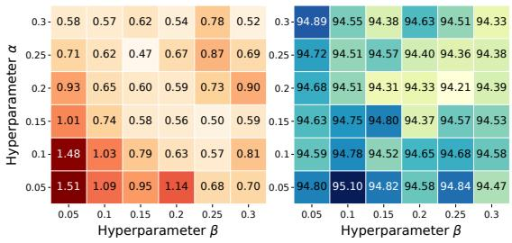  
(a) ResNet-50 on CIFAR-10

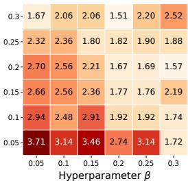

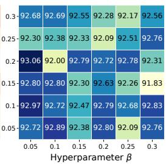  
(b) Llama3-8B on ARC-E  
Figure 5: Sensitivity to α and $\beta$ of EUA-Cal. ECE (↓) is shown in warmer colors, and ACC (↑) is shown in cooler colors.

Impact of Hyperparameters. We explore the impact of hyperparameters α, β and τ on ResNet-50 and Llama3-8B. α and β control the strengths of EPR loss and PSR loss, respectively. We recommend setting them within the range of [0.1, 0.3]. As shown in Figure 5, our EUA-Cal method consistently improves the calibration performance within this range. Figure 9 shows the performance of EUA-Cal under different values of τ, where τ∗ is obtained by minimizing NLL on the training set. Our EUA-Cal method maintains relatively stable accuracy and competitive calibration performance under different τ settings. We recommend determining τ through minimizing NLL on the training set, avoiding a separate hyperparameter search. For more detailed analyses, see Appendix C.3.

## 5 CONCLUSION

In this work, we observe a consistent phenomenon across different models that the early model is better calibrated, while continued training often yields modest accuracy gains while worsening calibration. Motivated by this observation, we proposed EUA-Cal, a novel method that exploits the early model as an uncertainty anchor for calibration. Our method is achieved through the regularization terms EPR and PSR to leverage the uncertainty awareness of the early model for calibration. Extensive experiments on image classification and multiple-choice question answering on eight models indicate that our EUA-Cal method consistently improves calibration performance while maintaining competitive accuracy across different models and tasks.

## AI USE STATEMENT

In this work, we used generative AI tools solely to assist with grammar, spelling, and sentence clarity. We have reviewed all AI-assisted work and assume full responsibility for all content generated by the LLM. The generative AI contributed in no other way to this work. The research idea, experiment design, and all other content were developed and completed by ourselves.

## ETHICS STATEMENT

We confirm that our work adheres to the ICLR Code of Ethics. The research utilizes publicly avail able datasets that contain no personally identifiable information. As a strictly technical contribution, we foresee no ethical issues or potential misuse.

## REPRODUCIBILITY STATEMENT

The complete code for our proposed method is provided in the Supplementary Material to facilitate the reproduction of our results. Our experimental implementation is also described in Appendix A.

## REFERENCES

Quentin Bouniot, Pavlo Mozharovskyi, and Florence d’Alche-Buc. Tailoring mixup to data for´ calibration. In The Thirteenth International Conference on Learning Representations, 2025.

Peter Clark, Isaac Cowhey, Oren Etzioni, Tushar Khot, Ashish Sabharwal, Carissa Schoenick, and Oyvind Tafjord. Think you have solved question answering? try arc, the ai2 reasoning challenge, 2018.

Jia Deng, Wei Dong, Richard Socher, Li-Jia Li, Kai Li, and Li Fei-Fei. Imagenet: A large-scale hierarchical image database. In Proceedings of the IEEE/CVF Conference on Computer Vision and Pattern Recognition, pp. 248–255, 2009.

Alexey Dosovitskiy, Lucas Beyer, Alexander Kolesnikov, Dirk Weissenborn, Xiaohua Zhai, Thomas Unterthiner, Mostafa Dehghani, Matthias Minderer, Georg Heigold, Sylvain Gelly, Jakob Uszkoreit, and Neil Houlsby. An image is worth 16x16 words: Transformers for image recognition at scale. In The Ninth International Conference on Learning Representations, 2021.

Yarin Gal and Zoubin Ghahramani. Dropout as a bayesian approximation: Representing model uncertainty in deep learning. In Proceedings of The 33rd International Conference on Machine Learning, volume 48, pp. 1050–1059, 2016.

Aaron Grattafiori, Abhimanyu Dubey, Abhinav Jauhri, Abhinav Pandey, Abhishek Kadian, Ahmad Al-Dahle, Aiesha Letman, Akhil Mathur, Alan Schelten, Alex Vaughan, et al. The llama 3 herd of models, 2024.

Chuan Guo, Geoff Pleiss, Yu Sun, and Kilian Q. Weinberger. On calibration of modern neural networks. In Proceedings ofthe 34th International Conference on Machine Learning, volume 70, pp. 1321–1330, 2017.

Han Guo, Ramakanth Pasunuru, and Mohit Bansal. An overview of uncertainty calibration for text classification and the role of distillation. In Proceedings of the 6th Workshop on Representation Learning for NLP, pp. 289–306, 2021.

Kaiming He, Xiangyu Zhang, Shaoqing Ren, and Jian Sun. Deep residual learning for image recognition. In Proceedings of the IEEE/CVF Conference on Computer Vision and Pattern Recognition, pp. 770–778, 2016.

Dan Hendrycks and Thomas Dietterich. Benchmarking neural network robustness to common corruptions and perturbations. In The Seventh International Conference on Learning Representations, 2019.

Edward J. Hu, Yelong Shen, Phillip Wallis, Zeyuan Allen-Zhu, Yuanzhi Li, Shean Wang, Lu Wang, and Weizhu Chen. Lora: Low-rank adaptation of large language models. In The Tenth International Conference on Learning Representations, 2022.

Gao Huang, Zhuang Liu, Laurens Van Der Maaten, and Kilian Q. Weinberger. Densely connected convolutional networks. In Proceedings of the IEEE/CVF Conference on Computer Vision and Pattern Recognition, pp. 2261–2269, 2017.

Jerry Huang, Peng Lu, and Qiuhao Zeng. Calibrated language models and how to find them with label smoothing. In Proceedings of the 42nd International Conference on Machine Learning, volume 267, pp. 25593–25612, 2025a.

Xijie Huang, Xinyuan Wang, Hantao Zhang, Yinghao Zhu, Jiawen Xi, Jingkun An, Hao Wang, Hao Liang, and Chengwei Pan. Medical mllm is vulnerable: cross-modality jailbreak and mismatched attacks on medical multimodal large language models. In Proceedings of the Thirty-Ninth AAAI Conference on Artificial Intelligence, pp. 3797–3805, 2025b.

Zhengbao Jiang, Jun Araki, Haibo Ding, and Graham Neubig. How can we know when language models know? on the calibration of language models for question answering. Transactions of the Associationfor Computational Linguistics, 9:962–977, 2021.

Mikkel Jordahn and Pablo M. Olmos. Decoupling feature extraction and classification layers for calibrated neural networks. In Proceedings of the 41st International Conference on Machine Learning, volume 235, pp. 22530–22550, 2024.

Alexander Kirillov, Eric Mintun, Nikhila Ravi, Hanzi Mao, Chloe Rolland, Laura Gustafson, Tete´ Xiao, Spencer Whitehead, Alexander C. Berg, Wan-Yen Lo, Piotr Dollar, and Ross B. Girshick.´ Segment anything. In Proceedings of the IEEE/CVF International Conference on Computer Vi sion, pp. 3992–4003, 2023.

Alex Krizhevsky and Geoffrey Hinton. Learning multiple layers of features from tiny images. Technical report, 2009.

Meelis Kull, Telmo de Menezes e Silva Filho, and Peter A. Flach. Beta calibration: a well-founded and easily implemented improvement on logistic calibration for binary classifiers. In Proceedings ofthe 20th International Conference on Artificial Intelligence and Statistics, volume 54, pp. 623– 631, 2017.

Balaji Lakshminarayanan, Alexander Pritzel, and Charles Blundell. Simple and scalable predictive uncertainty estimation using deep ensembles. In Advances in Neural Information Processing Systems, volume 30, pp. 6402–6413, 2017.

Yawei Li, David Rugamer, Bernd Bischl, and Mina Rezaei. Calibrating llms with information-¨ theoretic evidential deep learning. In The Thirteenth International Conference on Learning Representations, 2025.

Bingyuan Liu, Ismail Ben Ayed, Adrian Galdran, and Jose Dolz. The devil is in the margin: Marginbased label smoothing for network calibration. In Proceedings of the IEEE/CVF Conference on Computer Vision and Pattern Recognition, pp. 80–88, 2022.

Jooyoung Moon, Jihyo Kim, Younghak Shin, and Sangheum Hwang. Confidence-aware learning for deep neural networks. In Proceedings of the 37th International Conference on Machine Learning, volume 119, pp. 7034–7044, 2020.

Jishnu Mukhoti, Viveka Kulharia, Amartya Sanyal, Stuart Golodetz, Philip Torr, and Puneet Dokania. Calibrating deep neural networks using focal loss. In Advances in Neural Information Processing Systems, volume 33, pp. 15288–15299, 2020.

Jiani Ni, He Zhao, Jintong Gao, Dandan Guo, and Hongyuan Zha. Balancing two classifiers via a simplex etf structure for model calibration. In Proceedings of the IEEE/CVF Conference on Computer Vision and Pattern Recognition, pp. 30712–30721, 2025.

Jiani Ni, He Zhao, Yibo Yang, and Dandan Guo. Deep neural network calibration by reducing classifier shift with stochastic masking. Pattern Recognit., 177:113217, 2026.

Jeremy Nixon, Michael W. Dusenberry, Linchuan Zhang, Ghassen Jerfel, and Dustin Tran. Measuring calibration in deep learning. In Proceedings of the IEEE/CVF Conference on Computer Vision and Pattern Recognition Workshops, pp. 38–41, 2019.

Jongyoun Noh, Hyekang Park, Junghyup Lee, and Bumsub Ham. Rankmixup: Ranking-based mixup training for network calibration. In Proceedings ofthe IEEE/CVF International Conference on Computer Vision, pp. 1358–1368, 2023.

Yaniv Ovadia, Emily Fertig, Jie Ren, Zachary Nado, D. Sculley, Sebastian Nowozin, Joshua Dillon, Balaji Lakshminarayanan, and Jasper Snoek. Can you trust your model's uncertainty? evaluating predictive uncertainty under dataset shift. In Advances in Neural Information Processing Systems, volume 32, pp. 13969–13980, 2019.

Feiyang Pan, Xiang Ao, Pingzhong Tang, Min Lu, Dapeng Liu, Lei Xiao, and Qing He. Field-aware calibration: A simple and empirically strong method for reliable probabilistic predictions. In Proceedings ofThe Web Conference, pp. 729–739, 2020.

Seo Yeon Park and Cornelia Caragea. On the calibration of pre-trained language models using mixup guided by area under the margin and saliency. In Proceedings of the 60th Annual Meeting of the Association for Computational Linguistics, pp. 5364–5374, May 2022.

Murat Sensoy, Lance M. Kaplan, and Melih Kandemir. Evidential deep learning to quantify classification uncertainty. In Advances in Neural Information Processing Systems, pp. 3183–3193, 2018.

Christian Szegedy, Vincent Vanhoucke, Sergey Ioffe, Jon Shlens, and Zbigniew Wojna. Rethinking the inception architecture for computer vision. In Proceedings of the IEEE/CVF Conference on Computer Vision and Pattern Recognition, pp. 2818–2826, 2016.

Alon Talmor, Jonathan Herzig, Nicholas Lourie, and Jonathan Berant. CommonsenseQA: A question answering challenge targeting commonsense knowledge. In Proceedings of the 2019 Conference ofthe North American Chapter ofthe Associationfor Computational Linguistics: Human Language Technologies, Volume 1 (Long and Short Papers), pp. 4149–4158, 2019.

Chengli Tan, Yubo Zhou, Haishan Ye, Guang Dai, Junmin Liu, Zengjie Song, Jiangshe Zhang, Zixiang Zhao, Yunda Hao, and Yong Xu. Towards understanding the calibration benefits of sharpnessaware minimization. In The Fourteenth International Conference on Learning Representations, 2026.

Sunil Thulasidasan, Gopinath Chennupati, Jeff A Bilmes, Tanmoy Bhattacharya, and Sarah Michalak. On mixup training: Improved calibration and predictive uncertainty for deep neural networks. In Advances in Neural Information Processing Systems, volume 32, pp. 13888–13899, 2019.

Ashish Vaswani, Noam Shazeer, Niki Parmar, Jakob Uszkoreit, Llion Jones, Aidan N. Gomez, Lukasz Kaiser, and Illia Polosukhin. Attention is all you need. In Advances in Neural Information Processing Systems, volume 30, pp. 5998–6008, 2017.

Deng-Bao Wang and Min-Ling Zhang. Calibration bottleneck: Over-compressed representations are less calibratable. In Proceedings of the 41st International Conference on Machine Learning, volume 235, pp. 52156–52170, 2024.

Deng-Bao Wang, Lanqing Li, Peilin Zhao, Pheng-Ann Heng, and Min-Ling Zhang. On the pitfall of mixup for uncertainty calibration. In Proceedings of the IEEE/CVF Conference on Computer Vision and Pattern Recognition, pp. 7609–7618, 2023.

Johannes Welbl, Nelson F. Liu, and Matt Gardner. Crowdsourcing multiple choice science questions. In Proceedings ofthe 3rd Workshop on Noisy User-generated Text, pp. 94–106, 2017.

Adam X. Yang, Maxime Robeyns, Xi Wang, and Laurence Aitchison. Bayesian low-rank adaptation for large language models. In The Twelfth International Conference on Learning Representations, 2024.

An Yang, Anfeng Li, Baosong Yang, Beichen Zhang, Binyuan Hui, Bo Zheng, Bowen Yu, Chang Gao, Chengen Huang, Chenxu Lv, Chujie Zheng, Dayiheng Liu, Fan Zhou, Fei Huang, Feng Hu, Hao Ge, Haoran Wei, Huan Lin, Jialong Tang, Jian Yang, Jianhong Tu, Jianwei Zhang, Jianxin Yang, Jiaxi Yang, Jing Zhou, Jingren Zhou, Junyang Lin, Kai Dang, Keqin Bao, Kexin Yang, Le Yu, Lianghao Deng, Mei Li, Mingfeng Xue, Mingze Li, Pei Zhang, Peng Wang, Qin Zhu, Rui Men, Ruize Gao, Shixuan Liu, Shuang Luo, Tianhao Li, Tianyi Tang, Wenbiao Yin, Xingzhang Ren, Xinyu Wang, Xinyu Zhang, Xuancheng Ren, Yang Fan, Yang Su, Yichang Zhang, Yinger Zhang, Yu Wan, Yuqiong Liu, Zekun Wang, Zeyu Cui, Zhenru Zhang, Zhipeng Zhou, and Zihan Qiu. Qwen3 technical report, 2025.

Sergey Zagoruyko and Nikos Komodakis. Wide residual networks. In Proceedings of the British Machine Vision Conference, 2016.

Ruifei Zhang, Wei Zhang, Xiao Tan, Sibei Yang, Xiang Wan, Xiaonan Luo, and Guanbin Li. Vldrive: Vision-augmented lightweight mllms for efficient language-grounded autonomous driving. In Proceedings of the IEEE/CVF International Conference on Computer Vision, pp. 5923– 5933, 2025.

Xu-Yao Zhang, Guo-Sen Xie, Xiuli Li, Tao Mei, and Cheng-Lin Liu. A survey on learning to reject. Proceedings ofthe IEEE, 111(2):185–215, 2023.

## A IMPLEMENTATION DETAILS

## A.1 DATASETS

To comprehensively evaluate the effectiveness of our method, we adopt CIFAR-10, CIFAR-100 (Krizhevsky & Hinton, 2009), and Tiny-ImageNet (Deng et al., 2009) for image classification, and SciQ (Welbl et al., 2017), ARC-C and ARC-E (Clark et al., 2018), and CommonsenseQA (CSQA) (Talmor et al., 2019) for multiple-choice question answering.

CIFAR-10 and CIFAR-100 each contain 60,000 RGB images of size $3 2 \times 3 2$ , covering 10 and 100 classes, respectively. For each dataset, we divide the original 50,000 training images into 45,000 training and 5,000 validation images, and retain the 10,000 test images.

Tiny-ImageNet contains 200 classes of natural images at $6 4 \times 6 4$ resolution. We divide its 100,000 training images into 90,000 for training and 10,000 for validation, and evaluate on the labeled test set of 10,000 images.

SciQ contains 13,679 four-choice science questions that cover physics, chemistry, biology, and related subjects. We use the official training/validation/test splits of 11,679/1,000/1,000 examples. During fine-tuning, each question and its answer choices are provided as input, while the correct answer serves as the supervision label.

ARC-C and ARC-E consist of grade-school science examination questions. Specifically, ARC-C contains challenging questions that retrieval-based and word co-occurrence baselines fail to answer, while ARC-E contains the remaining questions. We follow the official training/validation/test splits of 1,119/299/1,172 for ARC-C and 2,251/570/2,376 for ARC-E.

CommonsenseQA contains 12,102 five-choice questions requiring common sense knowledge about everyday situations. Its official training/development/test splits contain 9,741/1,221/1,140 examples. Since test labels are unavailable, we use the labeled development set for evaluation.

## A.2 TRAINING DETAILS

For image classification, we conduct experiments on five models including ResNet-50, ResNet-101, Wide-ResNet-26-10, DenseNet-121, and ViT-B/32. To learn these models, we use SGD as the optimizer with a momentum of 0.9 and a weight decay of $5 \times 1 0 ^ { - 4 }$ and an initial learning rate of 0.1 unless otherwise specified. On CIFAR-10 and CIFAR-100, models are trained for 200 epochs with a batch size of 128. The learning rate is divided by 5 at epochs 60, 120, and 160. On Tiny-ImageNet, models are trained for 100 epochs with a batch size of 64. The learning rate is divided by 10 at epochs 40 and 60. We initialize ViT-B/32 from ImageNet-1K pretrained weights and fine-tune all its parameters using $2 2 4 \times 2 2 4$ inputs. For ViT-B/32 on CIFAR, we use a batch size of 64, an initial learning rate of 0.01 with cosine decay, no weight decay, and a gradient clipping norm of 1.

For Multiple-choice question answering, we fine-tune Llama3-8B, Llama3.1-8B, and Qwen3-8B-Base using LoRA. Following (Li et al., 2025), we define the label space Y as the tokens corresponding to the possible options (A/B/C/D). The adapters are applied to the query, key, value, and output projections, with rank $^ { 8 , }$ scaling factor 16, and dropout 0.1. The learning rate is set to $5 \times 1 0 ^ { - 5 }$ and annealed using a cosine schedule. The maximum token length is limited to 256 for all other datasets. The training is conducted with bfloat16 precision.

## A.3 HYPERPARAMETER SETTINGS

We compare our EUA-Cal method with various calibration methods and provide hyperparameter settings of these baseline methods as follows. (a) LS (Szegedy et al., 2016): We use a smoothing factor of $\alpha = 0 . 0 5$ . (b) FL (Mukhoti et al., 2020): We set the focusing parameter to $\gamma = 2 .$ . (c) CRL (Moon et al., 2020): We set the coefficient of the confidence ranking loss to 1.0. (d) Distillation (Guo et al., 2021): We use two teachers and set the distillation loss weight to 1.0. The distillation temperature is determined by minimizing the validation Brier score. (e) MbLS (Liu et al., 2022): We use a margin of $m = 1 0$ and a regularization coefficient of 0.1. (f) BalCAL (Ni et al., 2025): We set $\beta = 1 , \delta \stackrel { - } { = } 0 . 9 5$ with a dynamic $\gamma . ~ ( \mathrm { g } )$ CSAM (Tan et al., 2026): We use a perturbation radius $\rho \in [ 0 . 0 5 , 0 . 2 ]$ and $\gamma \in [ 0 . 5 , 2 . 0 ]$ . (h) Mixup (Thulasidasan et al., 2019): We use $\alpha = 0 . 2 . ~ ( \mathrm { i } )$ MIT (Wang et al., 2023): We adopt MIT-A with $\alpha = 0 . 5$ and $\Delta \lambda > 1 / 2 .$ . (j) PLP(Wang & Zhang, 2024): We set the hyperparameter γ to 1.0.(k) MaC-Cal (Ni et al., 2026): We set the weighting factor γ to 0.7. (l) EDL (Sensoy et al., 2018): We limit the annealing coefficient to 1.0. (m) IB-EDL (Li et al., 2025): We use K = 20 samples and $\beta \in [ 5 \times 1 0 ^ { - 7 } , 9 \times \mathbf { \bar { 1 } } 0 ^ { - 5 } ]$ , depending on the dataset.

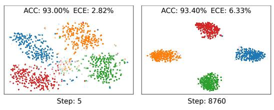  
(a) Llama3-8B on SciQ

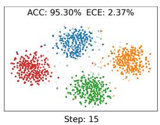

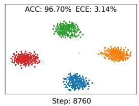  
(b) Qwen3-8B-Base on SciQ  
Figure 6: t-SNE visualizations of features from Llama3-8B and Qwen3-8B-Base on SciQ at different fine-tuning steps. Lighter shades indicate features associated with lower confidence.

Table 6: Performance comparison between different methods with ResNet-101 on CIFAR-10, CIFAR-100, and Tiny-ImageNet datasets. Results are reported as mean ± standard deviation (%). The best and second best results are shown in bold and underlined, respectively.
<table><tr><td rowspan="2">Method</td><td colspan="3">CIFAR-10</td><td colspan="3">CIFAR-100</td><td colspan="3">Tiny-ImageNet</td><td rowspan="2">Avg. Rank</td></tr><tr><td>ECE↓</td><td>AECE↓</td><td>ACC↑</td><td>ECE↓</td><td>AECE↓</td><td>ACC ↑</td><td>ECE↓</td><td>AECE↓</td><td>ACC↑</td></tr><tr><td>Vanilla</td><td>3.26±0.13</td><td>3.21±0.12</td><td>94.81±0.16</td><td>8.97±0.28</td><td>8.94±0.27</td><td>78.21±0.67</td><td>5.95±0.39</td><td>5.99±0.36</td><td>65.74±0.26</td><td>9.78</td></tr><tr><td>LS</td><td>4.05±0.27</td><td>4.21±0.18</td><td>94.72±0.38</td><td>3.81±0.47</td><td>4.01±0.40</td><td>77.57±0.48</td><td>1.90±0.05</td><td>1.69±0.17</td><td>66.22±0.38</td><td>8.33</td></tr><tr><td>FL</td><td>1.63±0.14</td><td>1.42±0.09</td><td>94.68±0.26</td><td>1.57±0.26</td><td>1.61±0.19</td><td>77.03±0.61</td><td>1.38±0.08</td><td>1.29±0.19</td><td>63.68±0.29</td><td>6.11</td></tr><tr><td>CRL</td><td>0.83±0.13</td><td>0.67±0.05</td><td>94.10±0.15</td><td>5.91±0.24</td><td>5.78±0.06</td><td>77.36±0.50</td><td>3.57±0.19</td><td>3.49±0.24</td><td>64.73±0.28</td><td>8.33</td></tr><tr><td>Distillation</td><td>2.87±0.15</td><td>2.95±0.14</td><td>94.86±0.04</td><td>7.17±0.39</td><td>7.12±0.35</td><td>77.93±0.26</td><td>7.36±0.14</td><td>7.36±0.13</td><td>66.04±0.15</td><td>9.33</td></tr><tr><td>MbLS</td><td>3.57±0.08</td><td>3.58±0.10</td><td>94.71±0.02</td><td>9.21±0.53</td><td>9.18±0.48</td><td>77.84±0.53</td><td>1.49±0.30</td><td>1.34±0.16</td><td>65.68±0.56</td><td>9.44</td></tr><tr><td>BalCAL</td><td>2.23±0.20</td><td>2.08±0.18</td><td>94.75±0.07</td><td>3.56±0.13</td><td>3.40±0.09</td><td>78.17±0.35</td><td>1.32±0.22</td><td>1.44±0.23</td><td>66.59±0.50</td><td>5.44</td></tr><tr><td>CSAM</td><td>1.36±0.08</td><td>1.28±0.07</td><td>95.53±0.14</td><td>1.64±0.26</td><td>1.70±0.25</td><td>79.60±0.06</td><td>5.72±0.26</td><td>5.70±0.30</td><td>67.12±0.42</td><td>4.44</td></tr><tr><td>Mixup</td><td>1.61±0.41</td><td>2.21±0.06</td><td>95.47±0.20</td><td>4.93±0.83</td><td>4.88±0.85</td><td>78.52±0.49</td><td>1.89±0.54</td><td>1.79±0.70</td><td>65.19±0.84</td><td>6.44</td></tr><tr><td>MIT-A</td><td>1.66±0.19</td><td>1.60±0.18</td><td>95.87±0.19</td><td>2.07±0.57</td><td>2.05±0.54</td><td>79.13±0.46</td><td>2.84±0.73</td><td>2.76±0.76</td><td>65.31±0.42</td><td>5.56</td></tr><tr><td>PLP</td><td>2.25±0.17</td><td>2.22±0.17</td><td>94.04±0.37</td><td>8.76±0.34</td><td>8.75±0.34</td><td>75.74±0.45</td><td>2.23±0.36</td><td>2.06±0.47</td><td>59.49±2.05</td><td>10.56</td></tr><tr><td>MaC-Cal</td><td>1.18±0.11</td><td>1.25±0.14</td><td>94.94±0.03</td><td>3.97±0.18</td><td>3.80±0.20</td><td>78.31±0.07</td><td>1.27±0.26</td><td>1.30±0.16</td><td>63.22±0.27</td><td>5.00</td></tr><tr><td>EUA-Cal</td><td>0.52±0.10</td><td>0.49±0.09</td><td>94.74±0.14</td><td>1.07±0.27</td><td>1.03±0.28</td><td>78.58±0.19</td><td>1.07±0.10</td><td>1.11±0.14</td><td>66.24±0.08</td><td>2.22</td></tr></table>

For our EUA-Cal experiments, we choose α and β from [0.1, 0.3] and determine τ by minimizing the NLL of prototype predictions on training samples. The anchor is selected at epoch 60 for CIFAR-10 and CIFAR-100 and epoch 40 for Tiny-ImageNet, except for ViT-B/32, which uses epoch 5. In LLM experiments, we use either the pretrained model or a model obtained after 5-15 fine-tuning steps as the anchor, depending on the model and dataset.

## A.4 EVALUATION PROTOCOLS

We report expected calibration error (ECE) and adaptive expected calibration error (AECE) to evaluate confidence calibration. ECE measures the difference between accuracy and confidence in expectation, i. $\mathrm { . e . , } \mathbb { E } [ | P ( \hat { y } _ { i } = y _ { i } | \hat { p } _ { i } ) - \hat { p } _ { i } | ]$ ]. Dividing the confidence interval [0, 1] into M equally spaced bins $\{ B _ { m } \} _ { m = 1 } ^ { M ^ { \ast } }$ , ECE is defined as the weighted average of the difference between accuracy and confidence in each bin, i.e.,

$$
\mathrm { E C E } = \sum _ { m = 1 } ^ { M } \frac { | B _ { m } | } { N } \left| \operatorname { a c c } ( B _ { m } ) - \operatorname { c o n f } ( B _ { m } ) \right| ,\tag{7}
$$

where N is the total number of samples, $| B _ { m } |$ is the number of samples in bin m, acc $( B _ { m } )$ and $\operatorname { c o n f } ( B _ { m } )$ denote the accuracy and the average confidence of the samples in this bin, respectively. Unlike ECE, AECE adaptively divides the confidence interval with the same sample size. Lower ECE and AECE indicate better calibration performance. In our experiments, we set the number of bins as 20 for both ECE and AECE. The results are reported as the mean and standard deviation over three random seeds.

Table 7: Performance comparison between different methods with Wide-ResNet-26-10 on CIFAR-10 and CIFAR-100. Results are reported as mean ± standard deviation (%). The best and second best results are shown in bold and underlined, respectively.
<table><tr><td rowspan="2">Method</td><td colspan="3">CIFAR-10</td><td colspan="3">CIFAR-100</td></tr><tr><td>ECE↓</td><td>AECE↓</td><td>ACC ↑</td><td>ECE↓</td><td>AECE↓</td><td>ACC ↑</td></tr><tr><td>Vanilla</td><td>2.52±0.07</td><td>2.43±0.05</td><td>95.84±0.08</td><td>5.41±0.12</td><td>5.26±0.17</td><td> $7 9 . 6 4 \pm 0 . 1 9$ </td></tr><tr><td>MbLS</td><td> $2 . 7 9 2 0 . 1 0$ </td><td> $2 . 7 5 { \pm } 0 . 1 2$ </td><td> $9 5 . 6 4 { \pm } 0 . 1 1 $ </td><td>7.48±0.11</td><td>7.32±0.09</td><td> $7 9 . 6 6 { \pm } 0 . 1 5$ </td></tr><tr><td>BalCAL</td><td> $2 . 5 7 { \pm } 0 . 2 4$ </td><td> $2 . 4 0 { \pm } 0 . 1 2$ </td><td> $9 5 . 6 9 { \pm } 0 . 0 7$ </td><td>4.76±0.20</td><td> $4 . 5 3 { \pm } 0 . 3 3$ </td><td> $7 8 . 3 9 { \pm } 0 . 5 8 $ </td></tr><tr><td>CSAM</td><td> $0 . 7 0 { \pm } 0 . 0 7$ </td><td> $\mathbf { 0 . 5 4 \pm 0 . 0 7 }$ </td><td> $9 6 . 5 2 { \pm } 0 . 0 8 $ </td><td>1.95±0.16</td><td> $\underline { { 1 . 8 4 \pm 0 . 1 6 } }$ </td><td> $\mathbf { 8 1 . 7 0 { \pm } 0 . 1 3 }$ </td></tr><tr><td>MIT-A</td><td> $1 . 3 0 { \pm } 0 . 1 1$ </td><td> $1 . 2 8 { \pm } 0 . 1 0 $ </td><td>96.70±0.12</td><td>2.98±0.15</td><td> $2 . 8 9 { \pm } 0 . 2 0 $ </td><td> $\underline { { 8 1 . 3 0 { \pm } 0 . 1 2 } }$ </td></tr><tr><td>MaC-Cal</td><td> $1 . 1 8 { \pm } 0 . 1 6$ </td><td> $1 . 2 5 { \pm } 0 . 0 3 $ </td><td> $9 5 . 9 3 { \scriptstyle \pm 0 . 0 4 }$ </td><td>2.70±0.10</td><td> $2 . 5 5 { \pm } 0 . 0 3$ </td><td> $7 8 . 8 7 { \pm } 0 . 1 1 $ </td></tr><tr><td>EUA-Cal</td><td> ${ \bf 0 . 5 9 } \pm { \bf 0 . 1 2 }$  </td><td> $\underline { { 0 . 5 8 \pm 0 . 1 4 } }$  </td><td> $9 5 . 7 9 2 0 . 0 7$ </td><td>1.72±0.12</td><td> ${ \bf 1 . 6 1 { \pm } 0 . 1 5 }$  </td><td> $8 0 . 9 5 { \scriptstyle \pm 0 . 0 4 }$ </td></tr></table>

Table 8: Performance comparison between different methods with DenseNet-121 on CIFAR-10 and CIFAR-100. Results are reported as mean ± standard deviation (%). The best and second best results are shown in bold and underlined, respectively.
<table><tr><td rowspan="2">Method</td><td colspan="3">CIFAR-10</td><td colspan="3">CIFAR-100</td></tr><tr><td>ECE↓</td><td>AECE↓</td><td>ACC ↑</td><td>ECE↓</td><td>AECE↓</td><td>ACC ↑</td></tr><tr><td>Vanilla</td><td>2.92±0.18</td><td>2.87±0.18</td><td>94.69±0.19</td><td>8.38±0.26</td><td>8.34±0.25</td><td>76.11±0.25</td></tr><tr><td>MbLS</td><td>2.96±0.04</td><td>2.92±0.07</td><td>94.25±0.20</td><td>2.38±0.33</td><td>2.12±0.33</td><td>75.95±0.44</td></tr><tr><td>BalCAL</td><td>1.07±0.02</td><td>0.99±0.08</td><td>93.96±0.41</td><td>7.93±0.49</td><td>7.93±0.49</td><td>74.41±0.52</td></tr><tr><td>CSAM</td><td>4.33±0.12</td><td>4.32±0.10</td><td>94.50±0.07</td><td>4.42±0.31</td><td>4.40±0.31</td><td>77.26±0.21</td></tr><tr><td>MIT-A</td><td>0.90±0.04</td><td>0.78±0.01</td><td>95.87±0.12</td><td>2.77±0.10</td><td>2.40±0.22</td><td>78.57±0.31</td></tr><tr><td>MaC-Cal</td><td>0.83±0.07</td><td>0.70±0.03</td><td>94.28±0.07</td><td>1.41±0.07</td><td>1.25±0.06</td><td>70.92±0.62</td></tr><tr><td>EUA-Cal</td><td>0.55±0.11</td><td>0.40±0.08</td><td>94.34±0.09</td><td>1.13±0.21</td><td>1.03±0.26</td><td>76.27±0.18</td></tr></table>

## B VISUALIZATIONS

Figure 6 illustrates a similar pattern during LLM fine-tuning. For both models, the later features form more distinct class clusters, while the number of the low-confidence samples visible at the early steps decreases. Accuracy increases from 93.00% to 93.40% for Llama3-8B and from 95.30% to 96.70% for Qwen3-8B-Base, but ECE also rises from 2.82% to 6.33% and from 2.37% to 3.14%, respectively. This indicates that the uncertainty awareness of the features preserved by the early model is lost in the later training stage.

## C MORE EXPERIMENTAL RESULTS

## C.1 CALIBRATION ON ADDITIONAL MODEL ARCHITECTURE

Tables 6–9 report additional image classification results on ResNet-101, Wide-ResNet-26-10, DenseNet-121, and ViT-B/32. Our EUA-Cal method achieves the lowest ECE on every dataset for all four models and the lowest AECE in eight of the nine cases while maintaining competitive accuracy. In particular, on ViT-B/32, it reduces ECE from 1.92% to 0.48% on CIFAR-10 and from 9.56% to 0.89% on CIFAR-100 compared with the vanilla model. Table 10 and Table 11 present multiple-choice question answering results on Llama3.1-8B and Qwen3-8B-Base, respectively. Our EUA-Cal method achieves the best average rank on both models, with the lowest AECE in five of six settings. These results further demonstrate its effectiveness across diverse models and tasks.

## C.2 IMPACT OF ANCHOR MODEL SELECTION

Figure 7 illustrates how the selection of anchor affects EUA-Cal. On CIFAR-10 and CIFAR-100, the model at epoch 60 yields the lowest ECE. Selecting the model at epoch 40 results in lower accuracy, whereas later models substantially increase the ECE with marginal accuracy gain. For ARC-C and ARC-E, using the pretrained Llama3-8B as the anchor model yields the lowest ECE. Later models increase the ECE, while the accuracy changes only slightly. These results indicate that the selection of the anchor model should consider the balance between classification performance and calibration performance, rather than simply selecting the earliest model.

Table 9: Performance comparison between different methods with ViT-B/32 on CIFAR-10 and CIFAR-100. Results are reported as mean ± standard deviation (%). The best and second best results are shown in bold and underlined, respectively.
<table><tr><td rowspan="2">Method</td><td colspan="3">CIFAR-10</td><td colspan="2">CIFAR-100</td></tr><tr><td>ECE↓</td><td> $\operatorname { A E C E } \downarrow$ </td><td>ACC↑ ECE↓</td><td> $\operatorname { A E C E } \downarrow$ </td><td> $\mathbf { A C C \uparrow }$ </td></tr><tr><td>Vanilla</td><td> $1 . 9 2 { \pm } 0 . 1 0 $ </td><td> $1 . 9 0 { \pm } 0 . 1 0 \ $ </td><td> $9 7 . 7 8 { \pm } 0 . 1 0 $   $9 . 5 6 { \pm } 0 . 0 6$ </td><td> $9 . 5 4 \pm 0 . 0 7$ </td><td> $8 7 . 6 1 { \pm } 0 . 0 7$ </td></tr><tr><td>MbLS</td><td> $1 . 8 0 { \pm } 0 . 0 9$ </td><td> $1 . 7 7 { \pm } 0 . 1 1$   $9 7 . 9 0 { \pm } 0 . 1 0 $ </td><td> $8 . 6 5 { \pm } 0 . 1 9$ </td><td> $8 . 5 8 { \pm } 0 . 1 9$ </td><td> $8 7 . 7 1 { \pm } 0 . 1 6 $ </td></tr><tr><td>BalCAL</td><td> $3 . 8 8 { \pm } 0 . 0 8$ </td><td> $4 . 0 5 { \pm } 0 . 1 4$   $9 7 . 6 7 { \pm } 0 . 0 7$ </td><td> $4 . 8 3 { \pm } 0 . 1 6$ </td><td> $5 . 6 0 { \pm } 0 . 2 1 $ </td><td> $8 7 . 4 9 { \pm } 0 . 1 9$ </td></tr><tr><td> $\mathbf { C S A M }$ </td><td> $1 . 5 2 { \pm } 0 . 0 6$ </td><td> $1 . 4 9 { \pm } 0 . 0 5$   $9 7 . 5 6 { \pm } 0 . 0 2 $ </td><td> $5 . 3 2 { \pm } 0 . 0 3$ </td><td> $5 . 2 8 { \pm } 0 . 0 4$ </td><td> $8 7 . 2 6 { \pm } 0 . 0 1 $ </td></tr><tr><td> ${ \mathrm { M T } } { \mathrm { T } } { \mathrm { L } }$ </td><td> $1 . 2 0 { \pm } 0 . 0 2 $ </td><td> $1 . 1 3 { \pm } 0 . 0 4 $   $\mathbf { 9 8 . 1 3 { \pm } 0 . 0 5 }$ </td><td> $6 . 6 7 { \pm } 0 . 0 6$ </td><td> $6 . 6 5 { \pm } 0 . 0 5$ </td><td> $\mathbf { 8 7 . 9 4 } \pm \mathbf { 0 . 1 3 }$ </td></tr><tr><td> $\bf M a C { - } \bf C a l$ </td><td> $\underline { { 0 . 6 0 { \pm } 0 . 0 3 } }$ </td><td> $0 . 8 1 { \pm } 0 . 0 1 $   $9 7 . 8 0 { \pm } 0 . 0 1 $ </td><td> $3 . 8 5 { \pm } 0 . 2 6 $ </td><td> $3 . 7 7 { \scriptstyle \pm 0 . 3 4 }$ </td><td> $8 7 . 0 3 { \pm } 0 . 1 3 $ </td></tr><tr><td> $\mathbf { E U A  – C a l }$ </td><td> $\mathbf { 0 . 4 8 { \pm } 0 . 0 8 }$  </td><td> $\mathbf { 0 . 2 0 { \overset { . } { = } } 0 . 0 3 }$   $9 7 . 4 3 { \pm } 0 . 0 1 $ </td><td> ${ \bf 0 . 8 9 } \pm { \bf 0 . 0 7 }$ </td><td> $\mathbf { 0 . 8 4 \pm 0 . 1 3 }$ </td><td> $8 7 . 5 4 { \pm } 0 . 1 2 $ </td></tr></table>

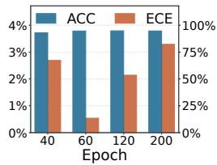  
(a) CIFAR-10

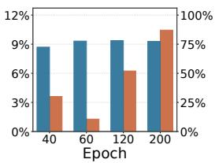  
(b) CIFAR-100

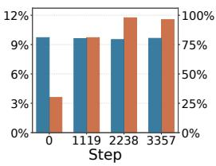  
(c) ARC-C

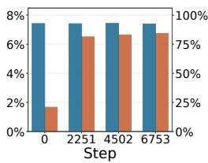  
(d) ARC-E

Figure 7: Impact of anchor model selection. The horizontal axis indicates the epoch at which the anchor model is selected for ResNet-50 on CIFAR-10 and CIFAR-100, or the optimization step for Llama3-8B on ARC-C and ARC-E.  
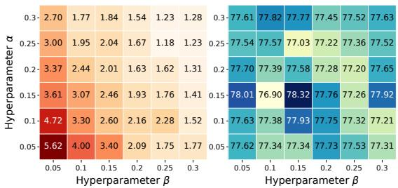  
(a) ResNet-50 on CIFAR-100

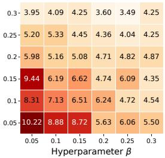

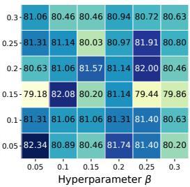  
(b) Llama3-8B on ARC-C  
Figure 8: Sensitivity to α and $\beta$ of EUA-Cal. ECE (↓) is shown in warmer colors, and ACC (↑) is shown in cooler colors.

## C.3 IMPACT OF HYPERPARAMETERS

Sensitivity to α and $\beta .$ Figure 8 illustrates that our EUA-Cal method improves calibration performance for most settings of α and β on both CIFAR-100 and ARC-C, while ACC remains relatively stable. This indicates that the calibration improvement of our method is not restricted to a particular choice of α and $\beta ,$ suggesting that EUA-Cal is robust to these hyperparameters.

Sensitivity to τ . Figure 9 reports the ACC and ECE of our EUA-Cal method under different values of τ on CIFAR-10, CIFAR-100, ARC-C, and ARC-E. As τ varies, ACC remains relatively stable, while ECE varies more. Despite this variation, selecting $\tau ^ { * }$ by minimizing training-set NLL achieves competitive ECE on all four datasets without a separate search over τ .

Table 10: Performance comparison between different methods with Llama3.1-8B on ARC-C, ARC-E, and SciQ datasets. Results are reported as mean ± standard deviation (%). The best and second best results are shown in bold and underlined, respectively.
<table><tr><td rowspan="2">Method</td><td colspan="3">ARC-C</td><td colspan="3">ARC-E</td><td colspan="3">SciQ</td><td rowspan="2">Avg. Rank</td></tr><tr><td>ECE↓</td><td>AECE↓</td><td>ACC ↑</td><td>ECE↓</td><td>AECE↓</td><td>ACC ↑</td><td>ECE↓</td><td>AECE↓</td><td>ACC ↑</td></tr><tr><td>Vanilla</td><td>17.36±0.59</td><td>17.29±0.53</td><td>81.54±0.38</td><td>6.75±0.11</td><td>6.73±0.07</td><td>92.76±0.11</td><td>5.83±0.10</td><td>5.72±0.13</td><td>94.03±0.12</td><td>10.00</td></tr><tr><td>LS</td><td>14.30±0.27</td><td>14.67±0.35</td><td>80.66±0.34</td><td>3.01±0.08</td><td>5.11±0.23</td><td>92.55±0.11</td><td>1.79±0.32</td><td>4.57±0.29</td><td>94.43±0.31</td><td>5.56</td></tr><tr><td>FL</td><td>12.40±2.18</td><td>12.74±1.64</td><td>80.97±0.12</td><td>4.05±0.25</td><td>4.03±0.08</td><td>92.92±0.09</td><td>3.50±0.17</td><td>4.21±0.17</td><td>94.27±0.31</td><td>4.56</td></tr><tr><td>CRL</td><td>16.26±1.29</td><td>16.01±1.38</td><td>82.30±0.18</td><td>5.80±0.09</td><td>5.71±0.03</td><td>93.10±0.11</td><td>5.23±0.15</td><td>4.94±0.22</td><td>94.37±0.15</td><td>6.67</td></tr><tr><td>Distillation</td><td>9.12±0.90</td><td>10.41±0.58</td><td>81.48±0.64</td><td>3.03±0.10</td><td>4.06±0.14</td><td>92.80±0.15</td><td>3.81±0.18</td><td>4.97±0.22</td><td>94.10±0.10</td><td>5.00</td></tr><tr><td>MbLS</td><td>18.41±1.20</td><td>18.33±1.17</td><td>80.69±1.16</td><td>6.73±0.03</td><td>6.64±0.08</td><td>92.87±0.09</td><td>5.63±0.28</td><td>5.51±0.33</td><td>94.23±0.29</td><td>9.56</td></tr><tr><td>CSAM</td><td>15.25±0.42</td><td>15.24±0.42</td><td>83.22±0.43</td><td>4.85±0.21</td><td>4.77±0.15</td><td>92.42±0.11</td><td>3.87±0.10</td><td>3.73±0.08</td><td>94.53±0.15</td><td>5.56</td></tr><tr><td>Mixup</td><td>12.76±0.57</td><td>12.96±0.57</td><td>80.20±0.30</td><td>6.07±0.28</td><td>6.07±0.26</td><td>92.17±0.15</td><td>4.52±0.38</td><td>4.54±0.40</td><td>95.00±0.46</td><td>7.78</td></tr><tr><td>MIT-A</td><td>7.87±0.45</td><td>7.79±0.45</td><td>80.57±0.30</td><td>5.80±0.22</td><td>5.73±0.15</td><td>92.66±0.28</td><td>4.55±0.30</td><td>4.40±0.42</td><td>94.77±0.31</td><td>5.78</td></tr><tr><td>EDL</td><td>11.15±0.19</td><td>12.07±0.63</td><td>80.69±0.40</td><td>4.26±0.53</td><td>5.29±0.48</td><td>92.45±0.25</td><td>1.88±0.36</td><td>5.42±0.46</td><td>94.37±0.38</td><td>6.00</td></tr><tr><td>IB-EDL</td><td>4.86±0.29</td><td> $9 . 8 2 { \pm } 0 . 3 2$ </td><td>80.77±0.21</td><td>6.30±0.26</td><td>6.34±0.20</td><td>92.35±0.06</td><td>1.97±0.18</td><td>5.82±0.20</td><td>94.10±0.10</td><td>7.44</td></tr><tr><td>EUA-Cal</td><td>3.82±0.49</td><td>3.95±0.30</td><td>82.42±0.39</td><td>3.38±0.05</td><td>3.34±0.19</td><td>92.35±0.11</td><td>1.86±0.14</td><td>1.83±0.25</td><td>94.10±0.17</td><td>3.33</td></tr></table>

Table 11: Performance comparison between different methods with Qwen3-8B-Base on ARC-C, ARC-E, and SciQ datasets. Results are reported as mean ± standard deviation (%). The best and second best results are shown in bold and underlined, respectively.
<table><tr><td rowspan="2">Method</td><td colspan="3">ARC-C</td><td colspan="3">ARC-E</td><td colspan="3">SciQ</td><td rowspan="2">Avg. Rank</td></tr><tr><td>ECE↓</td><td>AECE↓</td><td>ACC ↑</td><td>ECE↓</td><td>AECE↓</td><td>ACC↑</td><td>ECE↓</td><td>AECE↓</td><td>ACC↑</td></tr><tr><td>Vanilla</td><td>8.10±0.71</td><td>7.89±0.70</td><td>91.50±0.56</td><td>2.41±0.02</td><td>2.32±0.07</td><td>97.31±0.08</td><td>3.64±0.15</td><td>3.51±0.15</td><td>96.27±0.12</td><td>10.22</td></tr><tr><td>LS</td><td>3.53±0.03</td><td>5.62±0.25</td><td>91.75±0.27</td><td>3.86±0.18</td><td>3.94±0.10</td><td>97.40±0.10</td><td>2.75±0.39</td><td>4.42±0.09</td><td>96.53±0.23</td><td>8.22</td></tr><tr><td>FL</td><td>3.33±0.23</td><td>3.60±0.25</td><td>91.70±0.05</td><td>1.21±0.14</td><td>1.01±0.04</td><td>97.45±0.07</td><td>1.67±0.39</td><td>2.31±0.44</td><td>96.20±0.40</td><td>4.44</td></tr><tr><td>CRL</td><td>5.00±0.11</td><td>5.14±0.06</td><td>91.70±0.05</td><td>1.36±0.08</td><td>1.37±0.10</td><td>97.46±0.09</td><td>3.07±0.13</td><td>2.87±0.42</td><td>96.10±0.36</td><td>7.33</td></tr><tr><td>Distillation</td><td>3.77±0.11</td><td>4.57±0.26</td><td>91.87±0.20</td><td>1.47±0.03</td><td>1.46±0.02</td><td>96.97±0.00</td><td>2.60±0.31</td><td>3.74±0.19</td><td>96.07±0.06</td><td>7.44</td></tr><tr><td>MbLS</td><td>6.93±0.19</td><td>6.67±0.08</td><td>92.18±0.13</td><td>2.25±0.04</td><td>2.25±0.08</td><td>97.38±0.09</td><td>3.28±0.07</td><td>2.96±0.08</td><td>96.77±0.12</td><td>7.78</td></tr><tr><td>CSAM</td><td>4.02±0.20</td><td>3.62±0.08</td><td>92.28±0.06</td><td>1.27±0.07</td><td>1.15±0.05</td><td>97.66±0.05</td><td>2.01±0.22</td><td>1.52±0.09</td><td>97.13±0.06</td><td>3.00</td></tr><tr><td>Mixup</td><td>4.41±0.23</td><td>4.93±0.18</td><td>92.09±0.10</td><td>1.33±0.15</td><td>1.76±0.13</td><td>97.53±0.13</td><td>2.91±0.03</td><td>2.89±0.03</td><td>96.63±0.06</td><td>5.89</td></tr><tr><td>MIT-A</td><td>3.71±0.64</td><td>3.48±0.28</td><td>92.89±0.21</td><td>1.56±0.11</td><td>1.44±0.05</td><td>97.97±0.02</td><td>2.61±0.14</td><td>2.30±0.23</td><td>97.07±0.21</td><td>3.44</td></tr><tr><td>EDL</td><td>5.48±0.30</td><td>5.91±0.63</td><td>92.35±0.32</td><td>3.02±0.19</td><td>3.69±0.32</td><td>97.35±0.18</td><td>1.80±0.37</td><td>3.97±0.10</td><td>96.67±0.06</td><td>7.56</td></tr><tr><td>IB-EDL</td><td>8.32±0.14</td><td>10.97±0.09</td><td>92.18±0.05</td><td>3.87±0.24</td><td>4.67±0.16</td><td>97.57±0.16</td><td>2.96±0.67</td><td>4.80±0.16</td><td>96.43±0.25</td><td>9.33</td></tr><tr><td>EUA-Cal</td><td>2.04±0.46</td><td>2.68±0.10</td><td>91.72±0.26</td><td>1.33±0.08</td><td>1.11±0.06</td><td>97.49±0.13</td><td>1.55±0.42</td><td>1.25±0.12</td><td>96.77±0.15</td><td>2.89</td></tr></table>

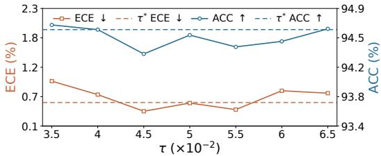  
(a) ResNet-50 on CIFAR-10

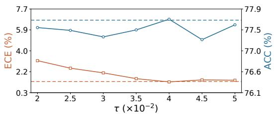  
(b) ResNet-50 on CIFAR-100

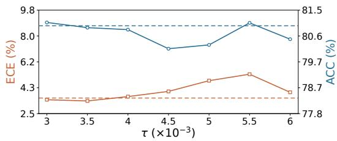  
(c) Llama3-8B on ARC-C

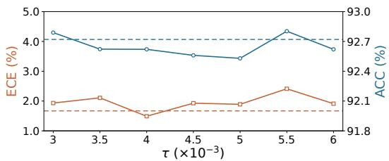  
(d) Llama3-8B on ARC-E  
Figure 9: Sensitivity to τ of EUA-Cal. ECE (↓) is shown in warmer colors, and ACC (↑) is shown in cooler colors.