# DVD: Dynamic Vector Decoding for Efficient MLLM-based Perception

Jinghua Hou , Zhe Liu∗, Hengshuang Zhao†

The University of Hong Kong https://almoonysl.github.io/projects/DVD

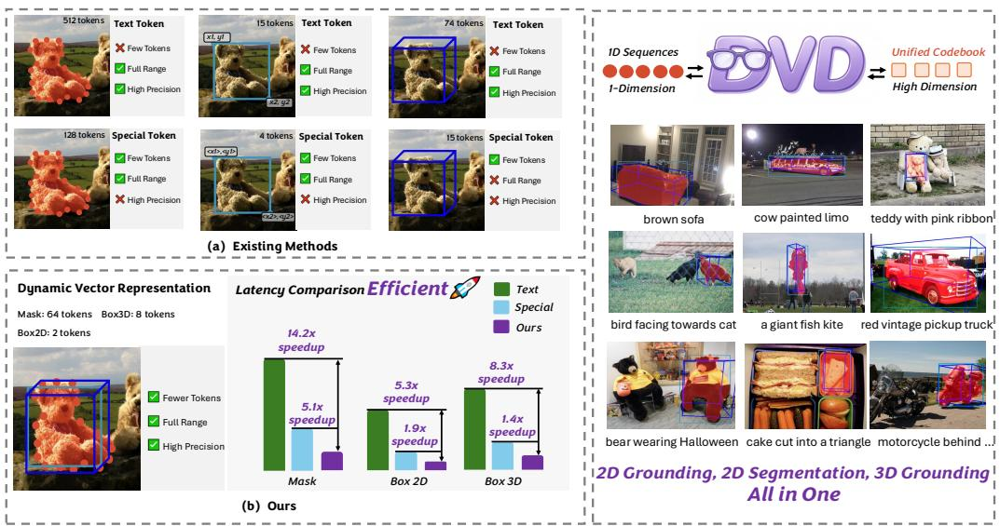  
Figure 1: Comparison of MLLM perception paradigms. Existing methods either use text tokens (high token count, e.g., 512 tokens for masks) or special coordinate tokens (limited range and precision) to encode perception outputs. Our dynamic vector representation unifies diverse perception representations by converting them into 1D sequences and learning a unified codebook in highdimensional space. This yields compact and high precision representations with fewer tokens, delivering consistent latency reduction across 2D and 3D tasks.

## Abstract

Multimodal large language models have made remarkable progress in bridging vision and language, facilitating various perception tasks essential for humanmachine interaction, robotics, and autonomous driving. However, existing MLLMbased perception methods predominantly rely on text-based coordinate representation, which suffers from excessive token overhead, or fixed-range quantization, which suffers from range and precision constraints, especially for 3D domains with unbounded spatial range and high localization accuracy requirements. To address these challenges, we propose a dynamic vector decoding method named DVD, which unifies the representation of 2D and 3D perception tasks. Specifically, we first transform diverse perceptual representation (i.e., 2D bounding boxes, 2D masks, and 3D bounding boxes) into 1D vector sequences, which are then mapped

to compact discrete tokens in the high-dimensional space. Then, a lightweight de-tokenizer enables seamless integration with MLLMs by decoding output tokens back to original 2D and 3D perceptual representations. Extensive experiments on 2D and 3D perception benchmarks including RefCOCO series, SUN-RGBD, KITTI, Hypersim, nuScenes demonstrate that DVD achieves superior performance in 2D and 3D tasks and reduces significantly the token overhead and inference latency. DVD provides an efficient and general framework for integrating perception capabilities into MLLMs, overcoming the inherent limitations of existing methods.

## 1 Introduction

Multimodal large language models (MLLMs) [2, 4, 3, 46, 52, 9, 10, 16, 32, 59] have achieved breakthroughs in bridging vision and language, enabling a wide range of perception tasks that are critical for human-machine interaction, robotics, and autonomous driving. Many previous works [4, 3, 24, 55, 35, 13, 40, 21, 27, 28, 36, 58, 47] integrate 2D or 3D perception capabilities into MLLMs to achieve more general perceptual understanding benefited from the powerful general understanding and reasoning capabilities of MLLMs, yet existing approaches still face fundamental limitations in representation and quantization that hinder their scalability and performance, especially in 3D domains.

As shown in Figure 1, current methods [3, 4, 16, 35, 40, 49, 18, 39] for MLLM-based perception tasks predominantly rely on text-based representation of regression coordinates. Although these text-based methods can achieve unlimited range and high precision without a minimum quantization unit, they generate an excessive number of tokens, imposing substantial computational overhead in MLLMs. Moreover, these methods make the visual-language learning process more difficult, as the model must learn to identify the structure of floating-point numbers. To alleviate the learning difficulty of continuous coordinate values, a common solution [21] is to normalize these coordinates into a fixed integer range (e.g., 0 to 1000) and convert continuous spatial information into discrete special tokens that LLMs can process. Although this strategy suffers from two obvious limitations especially from 2D to 3D domains. The quantization of continuous coordinates into a fixed integer range encounters numerical range and precision constraints. In 2D scenes, the finite spatial scope of images partially alleviates these issues, but in 3D scenes, where spatial range is theoretically unbounded and requires precise localization of objects in 3D space [29, 17, 6]. Due to the limitation of inference efficiency, fixed-range quantization either fails to capture the full spatial information of 3D environments or sacrifices precision due to the limitations of the minimum quantization unit, leading to these methods struggling to achieve full range and high precision of complex 3D scenarios. This raises the question: Can we achieve 2D and 3D perception representations with unlimited range and high precision using a small number oftokens?

To address these fundamental limitations, we draw inspiration from Vector Quantized Variational Autoencoders (VQ-VAE) [23, 45], a framework that has proven effective in learning compact and discrete representations of continuous data by mapping inputs to a learnable codebook of limited discrete tokens. We argue that compact representations of low-dimensional spaces can be achieved in high-dimensional spaces. Building on this insight, we propose dynamic vector decoding (DVD) for MLLMs that can seamlessly unify the representation of 2D and 3D perception tasks, effectively overcoming the token inefficiency of text-based coordinate representation and the range and precision constraints of fixed-range quantization. In this paper, our core innovation lies in transforming diverse perception representations (2D boxes, 2D masks, and 3D boxes) into a 1D vector sequence and projecting the sequence into discrete tokens in high-dimensional space, reducing learning difficulty and inference cost for both 2D and 3D tasks. Although some previous works [51, 41, 20] have explored the integration of VQ-VAE [45] into MLLMs, we are the first to introduce a unified highdimensional codebook for MLLM-based perception, unifying heterogeneous 2D and 3D perceptual representations in high-dimensional space. We also introduce geometric loss to enable the unified codebook to faithfully capture the geometric structures of heterogeneous perception tasks.

Moreover, to learn meaningful discrete representations of these 1D sequences, we design a 1D encoder-decoder architecture, which supports joint training for multiple perception tasks in a unified manner. During training, the encoder maps the 1D vector sequences to a latent space, and the decoder reconstructs the original 1D sequences from this latent representation. Through this process, we learn a unified codebook that maps continuous 1D vector sequences into compact, discrete tokens.

This codebook not only enables spatial representation of adaptive quantization for 2D and 3D tasks without fixed range constraints, but also provides inherent compression capabilities, significantly reducing the computational overhead of MLLMs compared to text-based coordinate representation methods. Moreover, a key advantage of our framework is its seamless integration with MLLMs in the decoding process. Because we only need an additional de-tokenizer to decode the tokens belonging to the perception task from the MLLMs output tokens back to their original 2D and 3D representations.

To validate the effectiveness and generality of our proposed method we conduct extensive experiments across 2D and 3D benchmarks for 2D grounding, referring expression segmentation (RES) and 3D grounding tasks. For 3D grounding, we evaluate our method on four widely used datasets: SUN-RGBD [38], KITTI [15], Hypersim [37], and nuScenes [7], covering diverse indoor and outdoor 3D scenarios. For 2D grounding and RES, we validate our method on the RefCOCO [26], RefCOCO+ [26], and RefCOCOg [33] datasets. Experimental results demonstrate that our method outperforms existing state-of-the-art methods in terms of 3D and 2D grounding accuracy, while maintaining competitive performance in 2D referring segmentation and achieving significant reductions in token overhead and inference latency, demonstrating its superiority in both performance and efficiency within a unified framework.

Overall, our contributions are summarized as:

• We propose a dynamic vector decoding (DVD) that converts 3D boxes, 2D boxes, and 2D masks into 1D vector sequences and learn a unified codebook by projecting these 1D sequences into the high-dimensional space. The proposed method can significantly improve the inference efficiency and provide inherent compression capability.

• To enable the unified codebook to faithfully capture the geometric structures of heterogeneous perception tasks, we introduce a task-agnostic geometric loss, which supervises the decoded representations in terms of geometry rather than sequence parameterization and provides unified geometric supervision for both 2D and 3D tasks.

• We validate our method on 2D and 3D perception benchmarks, demonstrating superior performance across 3D grounding task, 2D grounding task, and 2D referring segmentation, while significantly reducing token overhead and inference latency.

## 2 Related Work

Multimodal Large Language Models. With the rapid development of LLMs in NLP field, MLLMs have become an indispensable part of LLM research, enabling more general intelligent perception and reasoning with the rich visual information. Early MLLMs [2, 4, 3, 46, 52, 16, 43, 9, 59, 48, 42, 10] adopt a paradigm of combining vision encoders with pre-trained LLMs via projectors with image-text alignment training. Recent works [50, 53, 11] have focused on building native MLLMs to unleash stronger general multimodal capabilities. Meanwhile, more and more models such as Qwen3-VL [3] and SEED1.5-VL [16] continuously expand the capabilities of MLLMs by introducing co-training on a large number of different tasks (e.g., Coding, Agent, and Perception), thereby enhancing the versatility of MLLMs. Despite these advancements, most existing MLLMs still face the challenge of how to fully unleash the potential of MLLMs for diverse perception tasks.

MLLM-based Perception. For MLLM-based perception, existing works can mainly be divided into two paradigms. Some works [24, 55, 35, 13, 58, 57, 34, 8, 30] focus on utilizing additional task-specific decoders. These methods retain the pre-trained MLLM backbone and introduce decoders tailored to specific perceptual tasks (e.g., 2D mask decoding, 3D box regression), leveraging the MLLM’s strong semantic reasoning ability to guide the decoder in generating perceptual outputs. Other works [4, 3, 40, 14, 21, 54, 27, 43, 54] directly convert all perception tasks into text format. These methods adopt language to describe perceptual prediction (such as 2D/3D coordinate values), allowing the MLLM to process perception tasks in a unified text-generation manner without additional decoders. However, both paradigms have limitations: task-specific decoders lack generality and cannot simultaneously handle different perception tasks, while text-format methods suffer from the inefficiency of text-based coordinate representation that are more obvious in 3D scenes where spatial dimensions are unbounded and precision requirements are higher.

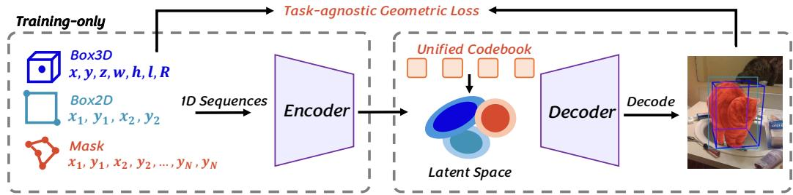  
Figure 2: The illustration of the dynamic vector representation learning. We first use the 1D sequence as 2D and 3D perceptual representation. Then, we use an encoder to map these sequences to high-dimensional space to adaptively quantize and compress these 1D information. Moreover, we introduce the task-agnostic geometric loss to improve the heterogeneous perception representation learning capacity. Finally, we use a decoder to recover discrete tokens to original representation.

Perceptual Representation in MLLMs. Designing perceptual representation is critical for the performance and efficiency of MLLM-based perception tasks. Most existing methods [4, 3, 16, 48] rely on text-based representation of regression coordinates. These methods face the difficulty of learning continuous coordinates and need a lot of tokens to process coordinates. To mitigate the difficulty of learning continuous coordinates, some methods normalize coordinates into a fixed integer range (e.g., 0 to 1000) and convert them into discrete textual tokens. For instance, Rex-Omni [21] propose next-point prediction for different 2D grounding tasks by introducing special tokens for quantized coordinates (0 to 999) in the LLM vocabulary. However, due to the boundless nature of 3D space, this method is not suitable for complex 3D scenes. Additionally, fixed-range quantization has inherent precision constraints, which are more important for accurate localization in 3D scenes.

To address these problems, we propose a dynamic decoding method that unifies 2D and 3D perceptual representations into 1D vector sequences. Our method effectively overcomes limitations of existing methods by learning a unified codebook for adaptive compression and quantization.

## 3 Method

## 3.1 Overview

In this paper, we propose a simple and effective MLLM-based perception framework named dynamic vector decoding (DVD), which can unify the representation of 2D and 3D perception tasks and seamlessly integrate into current MLLMs. Specifically, we first convert 2D and 3D perceptual representation into 1D vector sequence. Then we design a 1D encoder-decoder architecture that adaptively maps these different sequences into latent space and generates corresponding discrete tokens by learning unified limited codebook with reconstruction of multiple perception tasks. In the inference, we only need an additional detokenizer to decode the decode the tokens belonging to the perception task from the MLLMs output tokens back to their original 2D/3D representations.

## 3.2 Perceptual Representation

To unify the input format of diverse 2D and 3D perception tasks, we convert all perceptual representation including 2D bounding boxes, 2D masks, and 3D bounding boxes into 1D vector sequences. For 2D boxes, we select left-top and right-down corner points and flatten them $( x _ { 1 } , y _ { 1 } , x _ { 2 } , y _ { 2 } )$ . For 2D masks, we sample fixed points $( x _ { 1 } , y _ { 1 } , x _ { 2 } , y _ { 2 } , . . . , x _ { N } , y _ { N } )$ uniformly along the edge of the mask, starting from the top left point in the clockwise direction. We further normalize these points by the width and height of the input image, ensuring that the vector sequence is invariant to image resolution. For 3D boxes, we use the standard structures of 3D boxes $( x , y , z , w , h , l , R )$ , where $( x , y , z )$ is the 3D center, $w , h , l$ is the scale, and $R \in \mathbb { R } ^ { 3 \times 3 }$ is the rotation matrix of the 3D box, respectively. Due to the unbounded nature of 3D scenes, we directly use the original numerical values to ensure the precise localization.

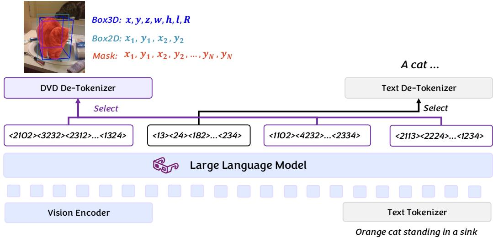  
Figure 3: Overview of DVD. We extend the MLLM vocabulary with learned unified tokens and train the model following standard LLM paradigms without modifications. At inference, we select tokens belonging to perception tasks and use a lightweight de-tokenizer reconstructs the original perceptual outputs from the discrete tokens with minimal overhead, drastically reducing sequence length and improving efficiency.

## 3.3 Dynamic Vector Representation Learning

Architecture. As shown in Figure 2, the unified vector autoencoder converts 1D vectors to discrete tokens, consisting of a 1D encoder, a learnable codebook, and a 1D decoder. We train the autoencoder end-to-end with reconstruction and multiple perception tasks. Specifically, given the input vector sequences s $\mathbf { \Psi } _ { \cdot } \in \mathbb { R } ^ { B \times L \times 1 }$ . For sequences whose length is not divisible by 2, we pad the end of the sequence with zeros. Then we encode input vector sequences into latent space by the 1D encoder, generating latent vectors $\mathbf { z } \in \mathbb { R } ^ { B \times \frac { L } { K } \times C }$ , where K and C are the downsampling factor and feature dimension of vectors, respectively. Next, we compute euclidean distances between flattened z and embedding vectors to select the closest quantized latent vectors. The symmetric 1D decoder upsamples quantized latent vectors to reconstruct the original 1D sequence. By learning the data distribution after converting the data into a 1D sequence, the vector autoencoder possesses the ability to adapt to different 2D and 3D perception tasks without task-specific modifications. The unified codebook learned from multiple tasks enables the autoencoder to handle variable-length vector sequences from different tasks.

Geometric Training Loss. Beyond the standard reconstruction and VQ losses, our unified vector autoencoder requires geometric constraints to faithfully recover the original perceptual representations. This is because the L1 reconstruction loss only measures per-dimension numerical differences of the flattened sequence, which is sensitive to point ordering and parameterization rather than the underlying geometry: two sequences encoding identical shapes with different starting points incur a large penalty, while geometrically distorted outputs may only yield small errors. Meanwhile, the VQ loss constrains the embeddings only in the latent space, providing no guarantee that the decoded outputs preserve geometric structures (e.g., corners, edges, and shapes) in the original representation space. To address these limitations, we introduce a geometric loss based on the bidirectional chamfer distance, which is permutation-invariant and task-agnostic, thus providing a unified geometric supervision for both 2D and 3D perception tasks.

Specifically, our autoencoder is trained with a combined loss function, which includes the reconstruction loss, VQ loss, and geometric loss. The reconstruction loss measures the difference between the original 1D vector sequence s and the reconstructed sequence ˆs, using the L1 loss. The reconstruction loss and VQ loss are formulated as:

$$
\mathcal { L } _ { \mathrm { L 1 } } = \mathbb { E } \left. \mathbf { s } - \hat { \mathbf { s } } \right. _ { 1 }\tag{1}
$$

$$
\mathcal { L } _ { \mathrm { V Q } } = \mathbb { E } \left. \mathbf { z } _ { q } - \mathbf { z } _ { \mathrm { d e t a c h } } \right. _ { 2 } ^ { 2 } + \beta \cdot \mathbb { E } \left. \mathbf { z } _ { q _ { \mathrm { d e t a c h } } } - \mathbf { z } \right. _ { 2 } ^ { 2 } ,\tag{2}
$$

where z is the latent vector output by the 1D encoder, $\mathbf { z } _ { q }$ is the quantized latent vector, $\cdot _ { \mathrm { d e t a c h } }$ denotes the stop-gradient operation, and $\beta$ is a hyperparameter. Beyond the reconstruction loss and VQ loss, we need a geometry guidance to achieve a better learning of inherent geometric characteristic for different perception tasks. Therefore, we apply the geometric loss to enhance geometric learning. For 3D tasks, it computes the average minimum L1 distance between predicted and target 3D box vertices. For 2D tasks, it computes the average minimum L1 distance between predicted and target set of 2D points. The loss is defined as:

$$
\mathcal { L } _ { \mathrm { g e o } } = \frac { 1 } { m } \sum _ { x _ { i } \in X } \operatorname* { m i n } _ { y _ { j } \in Y } \Vert x _ { i } - y _ { j } \Vert _ { 1 } + \frac { 1 } { n } \sum _ { y _ { j } \in Y } \operatorname* { m i n } _ { x _ { i } \in X } \Vert y _ { j } - x _ { i } \Vert _ { 1 } ,\tag{3}
$$

where X and Y are the predicted and target point set, respectively. The m and n denote the number of predicted and target points. The total loss is defined as:

$$
\mathcal { L } _ { \mathrm { t o t a l } } = \lambda _ { 1 } \cdot \mathcal { L } _ { \mathrm { L 1 } } + \lambda _ { 2 } \cdot \mathcal { L } _ { \mathrm { V Q } } + \lambda _ { 3 } \cdot \mathcal { L } _ { \mathrm { g e o } } ,\tag{4}
$$

where $\lambda _ { 1 } , \lambda _ { 2 } , \lambda _ { 3 }$ is the weight of the reconstruction loss, VQ loss, and geometric loss.

## 3.4 Dynamic Vector Decoding

To integrate the unified vector autoencoder with MLLMs, we first extend the vocabulary of the MLLM by adding M new tokens, corresponding to the M code vectors in the codebook. During the training of the MLLM with our autoencoder, we use the standard training paradigm as the same as MLLMs. This integration is lightweight and does not require modifying the MLLM backbone, ensuring compatibility with various pre-trained MLLMs. In the inference, we use the decoder of our vector autoencoder as the de-tokenizer for converting the discrete tokens output by the MLLM back into the 1D vector sequence, which is then converted into the original 2D/3D perceptual representation. Specifically, we first use the de-tokenizer to map each discrete token belonging to perception tasks output by the MLLM to its corresponding code vector in the pre-trained codebook. Then the de-tokenizer uses the pre-trained 1D decoder to reconstruct the 1D vector sequence from the code vector. Notably, the dynamic vector decoding process introduces minimal computational overhead compared to text-based methods. Since each perceptual representation is mapped to a small number of discrete tokens and the sequence length fed into the MLLM is significantly reduced, improving inference efficiency. Additionally, the de-tokenizer is a lightweight module (reusing the pre-trained decoder), avoiding the need for complex task-specific decoders and maintaining the generality of the framework.

## 4 Experiments

## 4.1 Datasets

For 3D grounding, we use four benchmarks covering indoor and outdoor scenarios: SUN-RGBD [38], Hypersim [37], KITTI [15], and nuScenes [7]. SUN-RGBD [38] is a 3D indoor dataset with RGB-D images and 3D bounding box annotations. Hypersim [37] is a photorealistic synthetic indoor dataset, providing 3D bounding boxes and semantic labels for generalization validation. KITTI [15] is an outdoor autonomous driving dataset, annotated with 3D bounding boxes for traffic objects. nuScenes [7] is a comprehensive outdoor benchmark with 1000 scenes and high-precision 3D bounding boxes. For 2D grounding and referring segmentation tasks, we use RefCOCO [26], RefCOCO+ [26], and RefCOCOg [33] as benchmarks. RefCOCO [26] is built on the COCO [26] dataset with additional referring expressions. RefCOCO+ [26] excludes location-reliant expressions. RefCOCOg [33] further features complex expressions.

## 4.2 Implementation Details

To train our unified vector autoencoder, we collect approximately 1.98M 3D boxes, 2.31M 2D boxes, and 1.52M 2D masks in a 1:1:1 data ratio during training. The downsampling scale K is set to 2. The codebook size and latent hidden channel is set to 4096 and $^ { 1 6 , }$ respectively. The $\lambda _ { 1 } , \lambda _ { 2 } ,$ , and $\lambda _ { 3 }$ are set to 1. We train the autoencoder with the learning rate of $1 0 ^ { - 3 }$ for 24 epochs. For MLLM, we use the Qwen3-VL [3], consisting of SigLIP2 [44], vision encoder MLP-based projector, and Qwen3 LLM [52]. as our pretrained model. For training, we use a batch size of 64 with AdamW [31] optimizer and a data packing strategy to accelerate the training on. The base learning rate is to $5 ^ { ^ { \cdot } } \times 1 0 ^ { - 5 }$ and the learning rate of vision encoder is to $5 \times 1 0 ^ { - 6 } .$ . We fully finetune the MLLM for 264K iterations with 2.0M training QAs curated from mixed 2D and 3D perception annotations of 2D and 3D datasets. All experiments are conducted on 8 NVIDIA A100 GPUs.

Table 1: Performance comparison of 2D and 3D perception.
<table><tr><td rowspan=1 colspan=1>Method</td><td rowspan=1 colspan=3>3D GroundingSUN-RGBD |Hypersim |nuScenes</td><td rowspan=1 colspan=3>2D GroundingRefCOCO||RefCOCO+RefCOCOg</td><td rowspan=1 colspan=3>2D RESRefCOCO|RefCOCO+|RefCOCOg</td></tr><tr><td rowspan=3 colspan=1>GroundingDINO [27]VistaLLM-7B [35]LISA-7B [24]</td><td rowspan=1 colspan=1></td><td rowspan=1 colspan=1></td><td rowspan=1 colspan=1></td><td rowspan=1 colspan=1>90.6</td><td rowspan=1 colspan=1>88.2</td><td rowspan=1 colspan=1>86.1</td><td rowspan=1 colspan=1>一</td><td rowspan=1 colspan=1></td><td rowspan=1 colspan=1></td></tr><tr><td rowspan=1 colspan=1></td><td rowspan=1 colspan=1></td><td rowspan=1 colspan=1></td><td rowspan=1 colspan=1>88.1</td><td rowspan=1 colspan=1>82.9</td><td rowspan=1 colspan=1>83.6</td><td rowspan=1 colspan=1>74.5</td><td rowspan=1 colspan=1>69.1</td><td rowspan=1 colspan=1>69.0</td></tr><tr><td rowspan=1 colspan=1></td><td rowspan=1 colspan=1></td><td rowspan=1 colspan=1></td><td rowspan=1 colspan=1></td><td rowspan=1 colspan=1>一</td><td rowspan=1 colspan=1>1</td><td rowspan=1 colspan=1>74.9</td><td rowspan=1 colspan=1>65.1</td><td rowspan=1 colspan=1>67.9</td></tr><tr><td rowspan=1 colspan=1>Text4Seg [25]</td><td rowspan=1 colspan=1></td><td rowspan=1 colspan=1></td><td rowspan=1 colspan=1></td><td rowspan=1 colspan=1>88.3</td><td rowspan=1 colspan=1>83.5</td><td rowspan=1 colspan=1>82.4</td><td rowspan=1 colspan=1>74.7</td><td rowspan=1 colspan=1>68.5</td><td rowspan=1 colspan=1>70.7</td></tr><tr><td rowspan=5 colspan=1>Qwen2.5-VL-3B [4]Qwen2.5-VL-7B [4]Rex-Omni [21]Seed1.5-VL [16]Qwen3-VL-2B [3]</td><td rowspan=1 colspan=1></td><td rowspan=1 colspan=1></td><td rowspan=1 colspan=1></td><td rowspan=1 colspan=1>89.1</td><td rowspan=1 colspan=1>82.4</td><td rowspan=1 colspan=1>85.2</td><td rowspan=1 colspan=1></td><td rowspan=1 colspan=1></td><td rowspan=1 colspan=1></td></tr><tr><td rowspan=1 colspan=1></td><td rowspan=1 colspan=1></td><td rowspan=1 colspan=1></td><td rowspan=1 colspan=1>90.0</td><td rowspan=1 colspan=1>84.2</td><td rowspan=1 colspan=1>87.2</td><td rowspan=1 colspan=1></td><td rowspan=1 colspan=1></td><td rowspan=1 colspan=1></td></tr><tr><td rowspan=2 colspan=1>33.5</td><td rowspan=1 colspan=1></td><td rowspan=1 colspan=1></td><td rowspan=1 colspan=1>一</td><td rowspan=1 colspan=1></td><td rowspan=1 colspan=1>86.6</td><td rowspan=1 colspan=1></td><td rowspan=1 colspan=1></td><td rowspan=1 colspan=1></td></tr><tr><td rowspan=1 colspan=1></td><td rowspan=1 colspan=1></td><td rowspan=1 colspan=1></td><td rowspan=1 colspan=1>一</td><td rowspan=1 colspan=1></td><td rowspan=2 colspan=1></td><td rowspan=2 colspan=1></td><td rowspan=2 colspan=1></td></tr><tr><td rowspan=1 colspan=1>33.8</td><td rowspan=1 colspan=1>12.0</td><td rowspan=1 colspan=1></td><td rowspan=1 colspan=1>89.2</td><td rowspan=1 colspan=1>80.4</td><td rowspan=1 colspan=1>84.0</td></tr><tr><td rowspan=1 colspan=1>Qwen3-VL-8B [3]</td><td rowspan=1 colspan=1>36.2</td><td rowspan=1 colspan=1>12.7</td><td rowspan=1 colspan=1></td><td rowspan=1 colspan=1>91.6</td><td rowspan=1 colspan=1>86.1</td><td rowspan=1 colspan=1>87.7</td><td rowspan=1 colspan=1></td><td rowspan=1 colspan=1></td><td rowspan=1 colspan=1></td></tr><tr><td rowspan=1 colspan=1>VST-3B [54]</td><td rowspan=1 colspan=1>37.3</td><td rowspan=1 colspan=1>一</td><td rowspan=1 colspan=1></td><td rowspan=1 colspan=1>一</td><td rowspan=1 colspan=1></td><td rowspan=1 colspan=1>一</td><td rowspan=1 colspan=1></td><td rowspan=1 colspan=1>一</td><td rowspan=1 colspan=1>一</td></tr><tr><td rowspan=2 colspan=1>DVD-2BDVD-8B</td><td rowspan=1 colspan=1>40.0</td><td rowspan=1 colspan=1>15.7</td><td rowspan=1 colspan=1>19.8</td><td rowspan=1 colspan=1>93.5</td><td rowspan=1 colspan=1>87.7</td><td rowspan=1 colspan=1>89.9</td><td rowspan=1 colspan=1>69.9</td><td rowspan=1 colspan=1>64.2</td><td rowspan=2 colspan=1>70.473.4</td></tr><tr><td rowspan=1 colspan=1>40.3</td><td rowspan=1 colspan=1>18.4</td><td rowspan=1 colspan=1>24.4</td><td rowspan=1 colspan=1>93.0</td><td rowspan=1 colspan=1>87.7</td><td rowspan=1 colspan=1>88.7</td><td rowspan=1 colspan=1>75.4</td><td rowspan=1 colspan=1>70.1</td></tr></table>

Table 2: Performance comparison of 3D grounding on both indoor and outdoor datasets.
<table><tr><td>Method</td><td>SUN-RGBD</td><td>Hypersim</td><td>ARKitScenes</td><td>KITTI</td><td>nuScenes</td></tr><tr><td>Gemini 2.0 Pro [42]</td><td>32.5</td><td>一</td><td></td><td></td><td></td></tr><tr><td>Gemini 2.5 Pro [10]</td><td>29.7</td><td>一</td><td></td><td></td><td></td></tr><tr><td>Seed1.5-VL [16]</td><td>33.5</td><td>1</td><td></td><td></td><td></td></tr><tr><td>Qwen3-VL-2B [3]</td><td>33.8</td><td>12.0</td><td></td><td></td><td></td></tr><tr><td>Qwen3-VL-8B [3]</td><td>36.2</td><td>12.7</td><td></td><td></td><td></td></tr><tr><td>VST-3B [54]</td><td>37.3</td><td>1</td><td>51.7</td><td></td><td>一</td></tr><tr><td>DVD-2B</td><td>40.0</td><td>15.7</td><td>62.4</td><td>31.4</td><td>19.8</td></tr><tr><td>DVD-8B</td><td>40.3</td><td>18.4</td><td>62.1</td><td>28.7</td><td>24.4</td></tr></table>

## 4.3 Overall Performance

We follow previous MLLM-based perception methods and evaluate our method on the 3D grounding, 2D grounding, and 2D referring segmentation tasks. For 3D grounding, we use the AP3D@15 defined by Omni3D [6] as the metric. For 2D grounding and referring segmentation, we use Precision@0.5 and cIoU as metrics. Note that we use the same trained model to validate the performance of all tasks.

MLLM-based Perception Comparison. Table 1 compares DVD with representative MLLM-based perception methods on all three tasks. Benefiting from dynamic vector decoding, which overcomes the limitations of text-based coordinate representation and fixed-range quantization, DVD-2B surpasses SOTA methods on 3D grounding with 40.0%, 15.7%, and 19.8% AP3D on SUN-RGBD [38], Hypersim [37], and nuScenes [7], and achieves 89.9% Precision and 70.4% cIoU on RefCOCOg val [22]. With a larger backbone, DVD-8B further reaches 40.3%, 18.4%, and 24.4% AP3D on the three 3D datasets, and 88.7% Precision and 73.4% cIoU on RefCOCOg val. These results demonstrate the effectiveness of dynamic vector decoding in enhancing the perception capabilities of MLLMs.

3D Grounding. We further compare with MLLM-based 3D perception methods on SUN-RGBD [38], Hypersim [37], ARKitScenes [5], KITTI [15], and nuScenes [7] (Table 2), covering both indoor and outdoor scenes, with annotations and metrics from Omni3D [6]. DVD-2B outperform VST-3B [54] by 2.7% and 10.7% AP3D on SUN-RGBD and ARKitScenes, while DVD-8B achieves 40.3% and 24.4% AP3D on SUN-RGBD and nuScenes.

2D Grounding. As shown in Table 3, we compare DVD with representative grounding methods (e.g., GroundingDINO [27], Qwen series [4, 3], Rex-Omni [21]). Although designed to unify 2D and 3D perception tasks, DVD still outperforms advanced 2D grounding methods: DVD-2B achieves 90.0% Precision on RefCOCOg test, surpassing Rex-Omni [21] by 3.2%.

Referring Expression Segmentation. Table 4 reports 2D referring expression segmentation (RES) results. Despite having far fewer parameters and being a unified model, DVD-2B remains competitive with VistaLLM-7B [35] on RefCOCOg test [22] with lower latency thanks to the reduced token overhead. With a larger backbone, DVD-8B further achieves 73.4% and 76.6% cIoU on RefCOCOg val and test. This shows that dynamic vector decoding generalizes beyond box-based grounding to fine-grained segmentation.

Table 3: Performance comparison of 2D grounding on the RefCOCO series.
<table><tr><td rowspan=1 colspan=1>Method</td><td rowspan=1 colspan=5>RefCOCOval     testA    testB</td><td rowspan=1 colspan=3>RefCOCO+val     testA     testB</td><td rowspan=1 colspan=2>RefCOCOgval     test</td></tr><tr><td rowspan=5 colspan=1>GroundingDINO [27]Qwen2.5-VL-7B [4]Rex-Omni [21]Seed1.5-VL [16]InternVL3.5-8B [48]UFO-8B [40]Qwen3-VL-8B [3]</td><td rowspan=2 colspan=1>90.690.0</td><td rowspan=1 colspan=2>93.2</td><td rowspan=1 colspan=2>88.2</td><td rowspan=1 colspan=1>88.2</td><td rowspan=1 colspan=1>89.0</td><td rowspan=1 colspan=1>75.9</td><td rowspan=1 colspan=1>86.1</td><td rowspan=1 colspan=1>87.0</td></tr><tr><td rowspan=1 colspan=1></td><td rowspan=1 colspan=2>85.4</td><td rowspan=1 colspan=1></td><td rowspan=1 colspan=1>84.2</td><td rowspan=1 colspan=1>89.1</td><td rowspan=1 colspan=1>76.9</td><td rowspan=1 colspan=1>87.2</td><td rowspan=1 colspan=1>87.2</td></tr><tr><td rowspan=3 colspan=1>一一92.491.891.6</td><td rowspan=3 colspan=2>一一94.794.393.1</td><td rowspan=3 colspan=2>一一88.787.588.7</td><td rowspan=1 colspan=1>一一87.9</td><td rowspan=1 colspan=1>1一92.4</td><td rowspan=1 colspan=1>一一82.4</td><td rowspan=1 colspan=1>86.684.789.6</td><td rowspan=1 colspan=1>86.885.289.4</td></tr><tr><td rowspan=2 colspan=1>86.986.1</td><td rowspan=1 colspan=1>91.3</td><td rowspan=2 colspan=1>80.680.0</td><td rowspan=2 colspan=1>87.987.7</td><td rowspan=2 colspan=1>88.688.4</td></tr><tr><td rowspan=1 colspan=1>91.1</td></tr><tr><td rowspan=1 colspan=1>DVD-2BDVD-8B</td><td rowspan=1 colspan=1>93.593.0</td><td rowspan=1 colspan=2>95.595.2</td><td rowspan=1 colspan=2>90.789.7</td><td rowspan=1 colspan=1>87.787.7</td><td rowspan=1 colspan=1>92.992.9</td><td rowspan=1 colspan=1>82.482.7</td><td rowspan=1 colspan=1>89.988.7</td><td rowspan=1 colspan=1>90.089.8</td></tr></table>

Table 4: Performance comparison of 2D referring expression segmentation on the RefCOCO series.
<table><tr><td rowspan="2">Method</td><td colspan="3">RefCOCO</td><td colspan="3">RefCOCO+</td><td colspan="2">RefCOCOg</td></tr><tr><td>val</td><td>testA</td><td>testB</td><td>val</td><td>testA</td><td>testB</td><td>val</td><td>test</td></tr><tr><td>VLT [12]</td><td>67.5</td><td>70.5</td><td>65.2</td><td>56.3</td><td>61.0</td><td>50.1</td><td>55.0</td><td>57.7</td></tr><tr><td>LAVT [56]</td><td>72.7</td><td>75.8</td><td>68.8</td><td>62.1</td><td>68.4</td><td>55.1</td><td>61.2</td><td>62.1</td></tr><tr><td>VistaLLM-7B [35]</td><td>74.5</td><td>76.0</td><td>72.7</td><td>69.1</td><td>73.7</td><td>64.0</td><td>69.0</td><td>70.9</td></tr><tr><td>LISA-7B [24]</td><td>74.9</td><td>79.1</td><td>72.3</td><td>65.1</td><td>70.8</td><td>58.1</td><td>67.9</td><td>70.6</td></tr><tr><td>M2SA [19]</td><td>74.0</td><td>76.8</td><td>69.7</td><td>63.1</td><td>67.2</td><td>56.1</td><td>67.0</td><td>68.3</td></tr><tr><td>PixelLM-7B [36]</td><td>73.0</td><td>76.5</td><td>68.2</td><td>66.3</td><td>71.7</td><td>58.3</td><td>69.3</td><td>70.5</td></tr><tr><td>Text4Seg [25]</td><td>74.7</td><td>77.4</td><td>71.6</td><td>68.5</td><td>73.6</td><td>62.9</td><td>70.7</td><td>71.6</td></tr><tr><td>PerceptionGPT-7B [34]</td><td>75.1</td><td>78.6</td><td>71.7</td><td>68.5</td><td>73.9</td><td>61.3</td><td>70.3</td><td>71.7</td></tr><tr><td>DVD-2B</td><td>69.9</td><td>70.7</td><td>69.7</td><td>64.2</td><td>68.2</td><td>61.8</td><td>70.4</td><td>71.0</td></tr><tr><td>DVD-8B</td><td>75.4</td><td>76.9</td><td>74.6</td><td>70.1</td><td>74.7</td><td>65.9</td><td>73.4</td><td>76.6</td></tr></table>

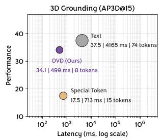

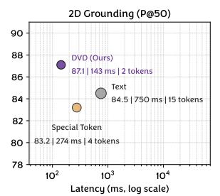

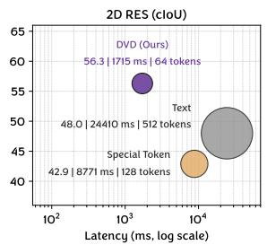  
Figure 4: Computation cost and performance comparison of different representations. Bubble area indicates the token count generated for per object of the representation.

Vector Reconstruction Performance. The quality of 1D vector reconstruction directly affects the performance of subsequent perception tasks. Therefore, we evaluate the reconstruction performance of our unified vector autoencoder by using perception metrics between the ground truth and the decoded sequences from the quantized tokens. Our autoencoder achieves negligible reconstruction error (90.8% AP3D, 100.0% Precision, and 84.8% cIoU for 3D grounding, 2D grounding, and 2D RES task), demonstrating its ability to preserve spatial information.

## 4.4 Ablation Study

In this section, we adopt ablation study to illustrate the effectiveness of our method. For convenience, we train our model with 30% of the full training iterations for faster validation, and all ablation experiments are conducted on the DVD-2B. More ablations and visualization results are illustrated in the appendix.

Table 5: The effect of codebook size.
<table><tr><td rowspan=1 colspan=1>Codebook</td><td rowspan=1 colspan=1>3D GroundingAP3D@15 avg.</td><td rowspan=1 colspan=1>2D GroundingP@50 avg.</td><td rowspan=1 colspan=1>2D REScIoU avg.</td></tr><tr><td rowspan=1 colspan=1>2048</td><td rowspan=1 colspan=1>88.9</td><td rowspan=1 colspan=1>84.5</td><td rowspan=1 colspan=1>81.6</td></tr><tr><td rowspan=1 colspan=1>4096</td><td rowspan=1 colspan=1>90.8</td><td rowspan=1 colspan=1>100.0</td><td rowspan=1 colspan=1>84.8</td></tr><tr><td rowspan=1 colspan=1>8192</td><td rowspan=1 colspan=1>85.1</td><td rowspan=1 colspan=1>99.6</td><td rowspan=1 colspan=1>76.8</td></tr></table>

Table 6: The effect of geometric loss.
<table><tr><td rowspan=1 colspan=1>Geo. Loss</td><td rowspan=1 colspan=1>3D GroundingAP3D@15 avg.</td><td rowspan=1 colspan=1>2D GroundingP@50 avg.</td><td rowspan=1 colspan=1>2D REScIoU avg.</td></tr><tr><td rowspan=1 colspan=1></td><td rowspan=1 colspan=1>80.7</td><td rowspan=1 colspan=1>99.1</td><td rowspan=1 colspan=1>74.8</td></tr><tr><td rowspan=1 colspan=1></td><td rowspan=1 colspan=1>90.8</td><td rowspan=1 colspan=1>100.0</td><td rowspan=1 colspan=1>84.8</td></tr></table>

Table 7: The effect of downsampling scale.
<table><tr><td rowspan=1 colspan=1>Scale</td><td rowspan=1 colspan=1>3D GroundingAP3D@15 avg.</td><td rowspan=1 colspan=1>2D GroundingP@50 avg.</td><td rowspan=1 colspan=1>2D REScIoU avg.</td></tr><tr><td rowspan=1 colspan=1>1</td><td rowspan=1 colspan=1>89.3</td><td rowspan=1 colspan=1>100.0</td><td rowspan=1 colspan=1>92.7</td></tr><tr><td rowspan=1 colspan=1>2</td><td rowspan=1 colspan=1>90.8</td><td rowspan=1 colspan=1>100.0</td><td rowspan=1 colspan=1>84.8</td></tr><tr><td rowspan=1 colspan=1>4</td><td rowspan=1 colspan=1>83.7</td><td rowspan=1 colspan=1>31.5</td><td rowspan=1 colspan=1>60.4</td></tr></table>

Table 8: The effect of latent hidden size.
<table><tr><td rowspan=1 colspan=1>Z</td><td rowspan=1 colspan=1>3D GroundingAP3D@15 avg.</td><td rowspan=1 colspan=1>2D GroundingP@50 avg.</td><td rowspan=1 colspan=1>2D REScIoU avg.</td></tr><tr><td rowspan=1 colspan=1>8</td><td rowspan=1 colspan=1>83.0</td><td rowspan=1 colspan=1>100.0</td><td rowspan=1 colspan=1>83.7</td></tr><tr><td rowspan=1 colspan=1>16</td><td rowspan=1 colspan=1>90.8</td><td rowspan=1 colspan=1>100.0</td><td rowspan=1 colspan=1>84.8</td></tr><tr><td rowspan=1 colspan=1>32</td><td rowspan=1 colspan=1>88.4</td><td rowspan=1 colspan=1>100.0</td><td rowspan=1 colspan=1>85.3</td></tr></table>

Table 9: Reconstruction Performance comparison of multi-task training.
<table><tr><td>3D Grounding</td><td>2D Grounding</td><td>1 2D RES</td><td>AP3D@15 avg.</td><td>P@50 avg.</td><td>cIoU avg.</td></tr><tr><td rowspan="3"></td><td></td><td></td><td>84.0</td><td></td><td>一</td></tr><tr><td>L</td><td></td><td></td><td>100.0</td><td></td></tr><tr><td></td><td></td><td></td><td></td><td>80.3</td></tr><tr><td></td><td>V</td><td></td><td>90.8</td><td>100.0</td><td>84.8</td></tr></table>

Comparison of different representations. To demonstrate the efficiency of DVD, we compare the average number of tokens generated for per object, latency, and performance of different representations in Figure 4, using identical training settings and computation resources for a fair comparison. For the special token representation, we follow the coordinate tokenization of Rex-Omni [21] and extend the vocabulary with 4000 special tokens shared across all coordinates: 2D box and mask coordinates are normalized to [0, 1] by image size, while 3D centers, sizes, and rotation entries are scaled into [−1, 1] and linearly mapped to [0, 1], then uniformly quantized into 4000 bins.

We report the average tokens generated per object and the inference latency on SUN-RGBD [38] and RefCOCOg [22]. Text-based coordinates generate excessive tokens (512 and 74 for mask and 3D box), incurring high latency. Since text preserves the raw coordinate values with unlimited range and precision, it retains a slight accuracy advantage on 3D grounding 37.5% vs. 34.1% AP3D). However, this marginal gain comes with 9× more tokens and 8.3× higher latency (4165 ms vs. 499 ms per object). Special tokens reduce the cost but suffer severe degradation (17.5% AP3D) due to limited range and precision. In contrast, DVD matches text-level precision on 2D tasks, largely closes the 3D gap, and achieves significant 3D gains the special-token representation, delivering the best accuracy efficiency trade-off.

Codebook Size. Table 5 illustrates the effect of the codebook size. A small codebook (2048) limits the representational capacity of the discrete latent space, failing to cover diverse geometric patterns (88.9% AP3D and 84.5% Precision). On the other hand, an overly large codebook (8192) increases the difficulty of quantization and codebook learning, leading to under-trained entries and degraded reconstruction (85.1% AP3D and 76.8% cIoU). The codebook size of 4096 achieves the best performance across all three tasks and is thus adopted as our default setting.

Geometric Loss. Table 6 validates the effect of the geometric loss. Incorporating geometric guidance consistently improves the reconstruction performance across all tasks, with particularly notable gains on 3D grounding (+10.1% AP3D) and 2D RES (+10.0% cIoU). This indicates that geometric supervision plays a critical role when fine-grained spatial fidelity is required. For example, depth estimation in 3D scenes and boundary delineation in segmentation are both highly sensitive to small coordinate deviations. Therefore, the vanilla reconstruction objective alone fails to penalize. In contrast, the improvement on 2D grounding is relatively marginal (+0.9% Precision), since coarse box localization in 2D images is less sensitive to minor geometric errors and its performance is already near saturation. These observations confirm that the geometric loss is not merely a regularizer but an essential component for learning a unified vector representation. By explicitly constraining the decoded vectors to preserve the underlying spatial structure, it enables a single codebook to serve both 2D and 3D box-based grounding and mask-based segmentation without task-specific designs.

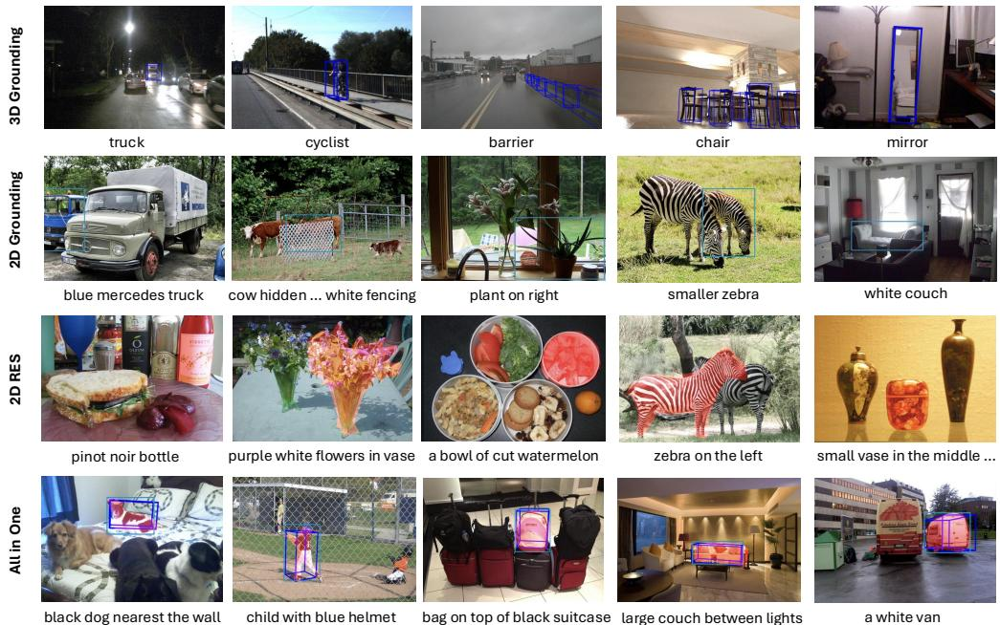  
Figure 5: The qualitative visualization of DVD on the 2D and 3D perception tasks. The first row is the results of 3D grounding task. The second row is the result of 2D grounding task. The third row is the results of 2D RES task. The fourth row is the results of unified perception.

We further investigate the effect of different settings of the DVD autoencoder on the vector reconstruction performance, including the downsampling scale K, latent hidden size z, and multi-task learning in the vector representation learning.

Downsampling Scale. As shown in Table 7, we ablate the effect of the downsampling scale K. Compared with the uncompressed representation (K=1), setting K=2 reduces the token count by half while maintaining competitive performance (90.8% AP3D and 100.0% Precision for 3D and 2D grounding, respectively), and even slightly improves the 3D grounding accuracy. However, an excessively large scale (K=4) leads to severe information loss during compression, resulting in significant performance degradation, especially on the 2D grounding task (31.5% Precision). These results demonstrate that K=2 achieves the best trade-off between reconstruction precision and token cost, verifying that our learned codebook retains spatial semantics while reducing sequence length.

Latent Hidden Size. As shown in Table 8, we ablate the latent hidden size z. A narrow latent bottleneck (z=8) constrains the encoded spatial information, causing a notable drop on the 3D grounding task (83.0% AP3D). In contrast, enlarging z to 32 brings no consistent gains and even slightly degrades the 3D reconstruction quality (88.4% AP3D), as a higher-dimensional latent space is harder to quantize effectively. Setting z=16 provides sufficient capacity with stable quantization, achieving the best overall performance.

Multi-task Training in DVD. Our proposed DVD supports 2D and 3D perception tasks with unified 1D vector representation. We validate the effect of multi-task training by comparing the performance of the autoencoder trained on single task and multi-task training in Table 9. Experimental results show that joint multi-task training improve performance on both 3D grounding task and 2D RES task. Moreover, the performance of 2D grounding remains stable without obvious degradation. These results demonstrate the learning capability for dynamic vector representation of our method without sacrificing the performance of individual tasks.

## 4.5 Visualization.

We provide qualitative visualization results to illustrate the perception capability of DVD. As shown in Figure 5, we visualize the qualitative results of DVD on the 3D grounding, 2D grounding, and 2D RES tasks. As shown in the first row, DVD can achieve satisfactory results even in dark and complex

3D scenes. In the second and third row, DVD achieves precise 2D localization and segmentation capabilities in different objects and different scenes. In the fourth row, DVD can simultaneously achieves 2D and 3D perception tasks, demonstrating the superior perception capability of DVD.

## 5 Conclusion

Existing MLLM-based perception methods struggle with excessive token overhead from text-based coordinate representation and precision and range constraints from fixed-range quantization, especially in 3D domains. To address the key limitation, we propose DVD that unifies 2D and 3D perception task representations for efficient integration with MLLMs. By transforming heterogeneous perceptual outputs into 1D vector sequences and mapping them to compact discrete tokens, DVD eliminates the excessive token overhead and the precision limitations. Extensive experiments on 2D and 3D benchmarks show that DVD achieves superior performance while significantly reducing token count and inference latency, offering an efficient and general framework for equipping MLLMs with perception capabilities.

## References

[1] Adel Ahmadyan, Liangkai Zhang, Artsiom Ablavatski, Jianing Wei, and Matthias Grundmann. Objectron: A large scale dataset of object-centric videos in the wild with pose annotations. In CVPR, 2021.

[2] Jinze Bai, Shuai Bai, Yunfei Chu, Zeyu Cui, Kai Dang, Xiaodong Deng, Yang Fan, Wenbin Ge, Yu Han, Fei Huang, et al. Qwen technical report. arXiv preprint arXiv:2309.16609, 2023.

[3] Shuai Bai, Yuxuan Cai, Ruizhe Chen, Keqin Chen, Xionghui Chen, Zesen Cheng, Lianghao Deng, Wei Ding, Chang Gao, Chunjiang Ge, et al. Qwen3-vl technical report, 2025. arXiv preprint arXiv:2511.21631, 2025.

[4] Shuai Bai, Keqin Chen, Xuejing Liu, Jialin Wang, Wenbin Ge, Sibo Song, Kai Dang, Peng Wang, Shijie Wang, Jun Tang, et al. Qwen2.5-vl technical report, 2025. arXiv preprint arXiv:2502.13923, 2025.

[5] Gilad Baruch, Zhuoyuan Chen, Afshin Dehghan, Tal Dimry, Yuri Feigin, Peter Fu, Thomas Gebauer, Brandon Joffe, Daniel Kurz, Arik Schwartz, et al. Arkitscenes: A diverse real-world dataset for 3d indoor scene understanding using mobile rgb-d data. arXiv preprint arXiv:2111.08897, 2021.

[6] Garrick Brazil, Abhinav Kumar, Julian Straub, Nikhila Ravi, Justin Johnson, and Georgia Gkioxari. Omni3d: A large benchmark and model for 3d object detection in the wild. In CVPR, 2023.

[7] Holger Caesar, Varun Bankiti, Alex H Lang, Sourabh Vora, Venice Erin Liong, Qiang Xu, Anush Krishnan, Yu Pan, Giancarlo Baldan, and Oscar Beijbom. nuscenes: A multimodal dataset for autonomous driving. In CVPR, 2020.

[8] Keqin Chen, Zhao Zhang, Weili Zeng, Richong Zhang, Feng Zhu, and Rui Zhao. Shikra: Unleashing multimodal llm’s referential dialogue magic. arXiv preprint arXiv:2306.15195, 2023.

[9] Zhe Chen, Jiannan Wu, Wenhai Wang, Weijie Su, Guo Chen, Sen Xing, Muyan Zhong, Qinglong Zhang, Xizhou Zhu, Lewei Lu, et al. Internvl: Scaling up vision foundation models and aligning for generic visual-linguistic tasks. In CVPR, 2024.

[10] Gheorghe Comanici, Eric Bieber, Mike Schaekermann, Ice Pasupat, Noveen Sachdeva, Inderjit Dhillon, Marcel Blistein, Ori Ram, Dan Zhang, Evan Rosen, et al. Gemini 2.5: Pushing the frontier with advanced reasoning, multimodality, long context, and next generation agentic capabilities. arXiv preprint arXiv:2507.06261, 2025.

[11] Haiwen Diao, Yufeng Cui, Xiaotong Li, Yueze Wang, Huchuan Lu, and Xinlong Wang. Unveiling encoder-free vision-language models. In NeurIPS, 2024.

[12] Henghui Ding, Chang Liu, Suchen Wang, and Xudong Jiang. Vision-language transformer and query generation for referring segmentation. In ICCV, 2021.

[13] Hao Fei, Shengqiong Wu, Hanwang Zhang, Tat-Seng Chua, and Shuicheng Yan. Vitron: A unified pixel-level vision llm for understanding, generating, segmenting, editing. In NeurIPS, 2024.

[14] Shenghao Fu, Yukun Su, Fengyun Rao, Jing Lyu, Xiaohua Xie, and Wei-Shi Zheng. Wedetect: Fast open-vocabulary object detection as retrieval. arXiv preprint arXiv:2512.12309, 2025.

[15] Andreas Geiger, Philip Lenz, and Raquel Urtasun. Are we ready for autonomous driving? the kitti vision benchmark suite. In CVPR, 2012.

[16] Dong Guo, Faming Wu, Feida Zhu, Fuxing Leng, Guang Shi, Haobin Chen, Haoqi Fan, Jian Wang, Jianyu Jiang, Jiawei Wang, et al. Seed1.5-vl technical report. arXiv preprint arXiv:2505.07062, 2025.

[17] Jinghua Hou, Tong Wang, Xiaoqing Ye, Zhe Liu, Shi Gong, Xiao Tan, Errui Ding, Jingdong Wang, and Xiang Bai. Open: Object-wise position embedding for multi-view 3d object detection. In ECCV, 2024.

[18] Wenxuan Huang, Bohan Jia, Zijie Zhai, Shaosheng Cao, Zheyu Ye, Fei Zhao, Zhe Xu, Xu Tang, Yao Hu, and Shaohui Lin. Vision-r1: Incentivizing reasoning capability in multimodal large language models. arXiv preprint arXiv:2503.06749, 2025.

[19] Donggon Jang, Yucheol Cho, Suin Lee, Taehyeon Kim, and Dae Shik Kim. Mmr: A large-scale benchmark dataset for multi-target and multi-granularity reasoning segmentation. In ICLR, 2025.

[20] Biao Jiang, Xin Chen, Wen Liu, Jingyi Yu, Gang Yu, and Tao Chen. Motiongpt: Human motion as a foreign language. In NeurIPS, 2023.

[21] Qing Jiang, Junan Huo, Xingyu Chen, Yuda Xiong, Zhaoyang Zeng, Yihao Chen, Tianhe Ren, Junzhi Yu, and Lei Zhang. Detect anything via next point prediction. In CVPR, 2026.

[22] Sahar Kazemzadeh, Vicente Ordonez, Mark Matten, and Tamara Berg. Referitgame: Referring to objects in photographs of natural scenes. In EMNLP, 2014.

[23] Diederik P Kingma and Max Welling. Auto-encoding variational bayes. arXiv preprint arXiv:1312.6114, 2013.

[24] Xin Lai, Zhuotao Tian, Yukang Chen, Yanwei Li, Yuhui Yuan, Shu Liu, and Jiaya Jia. Lisa: Reasoning segmentation via large language model. In CVPR, 2024.

[25] Mengcheng Lan, Chaofeng Chen, Yue Zhou, Jiaxing Xu, Yiping Ke, Xinjiang Wang, Litong Feng, and Wei Zhang. Text4seg: Reimagining image segmentation as text generation. In ICLR, 2025.

[26] Tsung-Yi Lin, Michael Maire, Serge Belongie, James Hays, Pietro Perona, Deva Ramanan, Piotr Dollár, and C Lawrence Zitnick. Microsoft coco: Common objects in context. In ECCV, 2014.

[27] Shilong Liu, Zhaoyang Zeng, Tianhe Ren, Feng Li, Hao Zhang, Jie Yang, Qing Jiang, Chunyuan Li, Jianwei Yang, Hang Su, et al. Grounding dino: Marrying dino with grounded pre-training for open-set object detection. In ECCV, 2024.

[28] Yuqi Liu, Bohao Peng, Zhisheng Zhong, Zihao Yue, Fanbin Lu, Bei Yu, and Jiaya Jia. Seg-zero: Reasoningchain guided segmentation via cognitive reinforcement. arXiv preprint arXiv:2503.06520, 2025.

[29] Zhe Liu, Jinghua Hou, Xinyu Wang, Xiaoqing Ye, Jingdong Wang, Hengshuang Zhao, and Xiang Bai. Lion: Linear group rnn for 3d object detection in point clouds. In NeurIPS, 2024.

[30] Zhe Liu, Runhui Huang, Rui Yang, Siming Yan, Zining Wang, Lu Hou, Di Lin, Xiang Bai, and Hengshuang Zhao. Drivepi: Spatial-aware 4d mllm for unified autonomous driving understanding, perception, prediction and planning. In CVPR, 2026.

[31] Ilya Loshchilov and Frank Hutter. Decoupled weight decay regularization. arXiv preprint arXiv:1711.05101, 2017.

[32] Haoyu Lu, Wen Liu, Bo Zhang, Bingxuan Wang, Kai Dong, Bo Liu, Jingxiang Sun, Tongzheng Ren, Zhuoshu Li, Hao Yang, et al. Deepseek-vl: towards real-world vision-language understanding. arXiv preprint arXiv:2403.05525, 2024.

[33] Junhua Mao, Jonathan Huang, Alexander Toshev, Oana Camburu, Alan L Yuille, and Kevin Murphy. Generation and comprehension of unambiguous object descriptions. In CVPR, 2016.

[34] Renjie Pi, Lewei Yao, Jiahui Gao, Jipeng Zhang, and Tong Zhang. Perceptiongpt: Effectively fusing visual perception into llm. In CVPR, 2024.

[35] Shraman Pramanick, Guangxing Han, Rui Hou, Sayan Nag, Ser-Nam Lim, Nicolas Ballas, Qifan Wang, Rama Chellappa, and Amjad Almahairi. Jack of all tasks master of many: Designing general-purpose coarse-to-fine vision-language model. In CVPR, 2024.

[36] Zhongwei Ren, Zhicheng Huang, Yunchao Wei, Yao Zhao, Dongmei Fu, Jiashi Feng, and Xiaojie Jin. Pixellm: Pixel reasoning with large multimodal model. In CVPR, 2024.

[37] Mike Roberts, Jason Ramapuram, Anurag Ranjan, Atulit Kumar, Miguel Angel Bautista, Nathan Paczan, Russ Webb, and Joshua M Susskind. Hypersim: A photorealistic synthetic dataset for holistic indoor scene understanding. In ICCV, 2021.

[38] Shuran Song, Samuel P Lichtenberg, and Jianxiong Xiao. Sun rgb-d: A rgb-d scene understanding benchmark suite. In CVPR, 2015.

[39] Tianhui Song, Haoyu Lu, Hao Yang, Lin Sui, Haoning Wu, Zaida Zhou, Zhiqi Huang, Yiping Bao, Y Charles, Xinyu Zhou, et al. Towards pixel-level vlm perception via simple points prediction. arXiv preprint arXiv:2601.19228, 2026.

[40] Hao Tang, Chenwei Xie, Haiyang Wang, Xiaoyi Bao, Tingyu Weng, Pandeng Li, Yun Zheng, and Liwei Wang. Ufo: A unified approach to fine-grained visual perception via open-ended language interface. In NeurIPS, 2025.

[41] Chameleon Team. Chameleon: Mixed-modal early-fusion foundation models. arXiv preprint arXiv:2405.09818, 2024.

[42] Gemini Team, Petko Georgiev, Ving Ian Lei, Ryan Burnell, Libin Bai, Anmol Gulati, Garrett Tanzer, Damien Vincent, Zhufeng Pan, Shibo Wang, et al. Gemini 1.5: Unlocking multimodal understanding across millions of tokens of context. arXiv preprint arXiv:2403.05530, 2024.

[43] Kimi Team, Tongtong Bai, Yifan Bai, Yiping Bao, SH Cai, Yuan Cao, Y Charles, HS Che, Cheng Chen, Guanduo Chen, et al. Kimi k2. 5: Visual agentic intelligence. arXiv preprint arXiv:2602.02276, 2026.

[44] Michael Tschannen, Alexey Gritsenko, Xiao Wang, Muhammad Ferjad Naeem, Ibrahim Alabdulmohsin, Nikhil Parthasarathy, Talfan Evans, Lucas Beyer, Ye Xia, Basil Mustafa, et al. Siglip 2: Multilingual vision-language encoders with improved semantic understanding, localization, and dense features. arXiv preprint arXiv:2502.14786, 2025.

[45] Aaron Van Den Oord, Oriol Vinyals, et al. Neural discrete representation learning. In NeurIPS, 2017.

[46] Peng Wang, Shuai Bai, Sinan Tan, Shijie Wang, Zhihao Fan, Jinze Bai, Keqin Chen, Xuejing Liu, Jialin Wang, Wenbin Ge, et al. Qwen2-vl: Enhancing vision-language model’s perception of the world at any resolution. arXiv preprint arXiv:2409.12191, 2024.

[47] Tao Wang, Changxu Cheng, Lingfeng Wang, Senda Chen, and Wuyue Zhao. Himtok: Learning hierarchical mask tokens for image segmentation with large multimodal model. In ICCV, 2025.

[48] Weiyun Wang, Zhangwei Gao, Lixin Gu, Hengjun Pu, Long Cui, Xingguang Wei, Zhaoyang Liu, Linglin Jing, Shenglong Ye, Jie Shao, et al. Internvl3.5: Advancing open-source multimodal models in versatility, reasoning, and efficiency. arXiv preprint arXiv:2508.18265, 2025.

[49] Wenhai Wang, Zhe Chen, Xiaokang Chen, Jiannan Wu, Xizhou Zhu, Gang Zeng, Ping Luo, Tong Lu, Jie Zhou, Yu Qiao, et al. Visionllm: Large language model is also an open-ended decoder for vision-centric tasks. In NeurIPS, 2023.

[50] Xinlong Wang, Xiaosong Zhang, Zhengxiong Luo, Quan Sun, Yufeng Cui, Jinsheng Wang, Fan Zhang, Yueze Wang, Zhen Li, Qiying Yu, et al. Emu3: Next-token prediction is all you need. arXiv preprint arXiv:2409.18869, 2024.

[51] Junfeng Wu, Yi Jiang, Chuofan Ma, Yuliang Liu, Hengshuang Zhao, Zehuan Yuan, Song Bai, and Xiang Bai. Liquid: Language models are scalable and unified multi-modal generators. IJCV, 2026.

[52] An Yang, Anfeng Li, Baosong Yang, Beichen Zhang, Binyuan Hui, Bo Zheng, Bowen Yu, Chang Gao, Chengen Huang, Chenxu Lv, et al. Qwen3 technical report. arXiv preprint arXiv:2505.09388, 2025.

[53] Rui Yang, Lin Song, Yicheng Xiao, Runhui Huang, Yixiao Ge, Ying Shan, and Hengshuang Zhao. Haplovl: A single-transformer baseline for multi-modal understanding. In ICML, 2025.

[54] Rui Yang, Ziyu Zhu, Yanwei Li, Jingjia Huang, Shen Yan, Siyuan Zhou, Zhe Liu, Xiangtai Li, Shuangye Li, Wenqian Wang, et al. Visual spatial tuning. arXiv preprint arXiv:2511.05491, 2025.

[55] Senqiao Yang, Tianyuan Qu, Xin Lai, Zhuotao Tian, Bohao Peng, Shu Liu, and Jiaya Jia. Lisa++: An improved baseline for reasoning segmentation with large language model. arXiv preprint arXiv:2312.17240, 2023.

[56] Zhao Yang, Jiaqi Wang, Yansong Tang, Kai Chen, Hengshuang Zhao, and Philip HS Torr. Lavt: Languageaware vision transformer for referring image segmentation. In CVPR, 2022.

[57] Tao Zhang, Xiangtai Li, Hao Fei, Haobo Yuan, Shengqiong Wu, Shunping Ji, Chen Change Loy, and Shuicheng Yan. Omg-llava: Bridging image-level, object-level, pixel-level reasoning and understanding. In NeurIPS, 2024.

[58] Zheng Zhang, Yeyao Ma, Enming Zhang, and Xiang Bai. Psalm: Pixelwise segmentation with large multi-modal model. In ECCV, 2024.

[59] Jinguo Zhu, Weiyun Wang, Zhe Chen, Zhaoyang Liu, Shenglong Ye, Lixin Gu, Hao Tian, Yuchen Duan, Weijie Su, Jie Shao, et al. Internvl3: Exploring advanced training and test-time recipes for open-source multimodal models. arXiv preprint arXiv:2504.10479, 2025.

## A Technical Appendices

Our technical appendices provide additional information, including implementation details of the proposed unified vector autoencoder, dataset details, more ablation studies, and visualization results.

## B Implementation Details

In this section, we provide the architecture details of our unified autoencoder. The 1D encoder is designed with a multi-stage downsampling architecture, stacked with 1D resnet blocks and 1D attention blocks. It takes 1D vector sequences as input, and extracts feature representations through successive layers and downsampling operations. A 1 × 1 convolutional layer is appended to the encoder output to project the latent features into the embedding dimension of the codebook.

The vector quantization module adopts the VectorQuantizer [45], which maintains a fixed-size learnable discrete codebook. This module computes the Euclidean distance between the projected latent features and each codebook embedding, assigns each feature to the nearest codebook entry, and adopts straight-through gradient estimation to ensure gradient consistency. The codebook serves as the core of the unified representation, mapping continuous 1D vector sequences into compact discrete tokens that can be efficiently processed by MLLMs. Symmetric to the encoder, the 1D decoder adopts a multi-stage upsampling architecture, also composed of 1D resnet blocks and 1D attention blocks. A 1 × 1 convolutional layer is placed at the decoder input to project the quantized discrete tokens back to the latent dimension. The decoder then reconstructs the original 1D vector sequences from the quantized tokens through successive layers and upsampling operations. The latent dimension and codebook is set to 16 and 4096, respectively.

## C Dataset Details

Table 10: Dataset Details.
<table><tr><td>Task</td><td>Datasets</td><td>QAs</td></tr><tr><td>3D Grounding</td><td>SUN-RGBD [38], Hypersim [37], ARKitScenes [5], Objectron [1], KITTI [15], nuScenes [7]</td><td>489K</td></tr><tr><td>2D Grounding</td><td>RefCOCO [26], RefCOCO+ [26], RefCOCOg [33] SUN-RGBD [38], Hypersim [37], ARKitScenes [5], Objectron [1], KITTI [15],</td><td>810K</td></tr><tr><td>2D RES</td><td>nuScenes [7] RefCOCO [26], RefCOCO+ [26], RefCOCOg [33], RefCLEF [22], ReasonSeg [24], COCO [26]</td><td>774K</td></tr></table>

To comprehensively evaluate the effectiveness, generality, and robustness of DVD across 2D and 3D perception tasks, we conduct experiments on a diverse set of benchmark datasets covering indoor and outdoor scenes. These datasets are carefully curated from existing public datasets, covering the core scenarios of 3D grounding, 2D grounding, and 2D RES. Detailed statistics of the datasets are summarized in Table 10. For 3D grounding, we select six representative datasets to cover both indoor and outdoor 3D scenarios. SUN-RGBD [38] and ARKitScenes [5] focus on indoor environments with diverse household objects. Hypersim [37] provides photorealistic synthetic scenes. Objectron [1] focuses on single real-world 3D object. KITTI [15] and nuScenes [7] are outdoor autonomous driving datasets with complex traffic scenes and dynamic objects. These datasets provide 489K 3D grounding QAs. For 2D grounding, we combine two types of datasets: three standard 2D referring datasets (RefCOCO [26], RefCOCO+ [26], RefCOCOg [33]) with rich instructions and diverse 2D scenes, and the 2D projections of the six 3D datasets mentioned above. This combination ensures a total of 810K 2D grounding QAs, allowing DVD to achieve better generalization across 2D and 3D scenarios. For 2D RES, we use six datasets (RefCOCO [26], RefCOCO+ [26], RefCOCOg [33], RefCLEF [22], ReasonSeg [24], COCO [26]) that cover diverse objects, scenes, and instruction granularity. With 774K QAs, these datasets enable DVD to achieve fine-grained perceptual capability.

Table 11: Computation cost and performance comparison of different representations.
<table><tr><td rowspan="2">Method</td><td colspan="3">3D Grounding</td><td colspan="3">2D Grounding</td><td colspan="3">2D RES</td></tr><tr><td>tokens</td><td>latency (ms)</td><td>AP3D@15</td><td>tokens</td><td>latency (ms)</td><td>P@50</td><td>tokens</td><td>latency (ms)</td><td>cIoU</td></tr><tr><td>Text</td><td>74</td><td>4165</td><td>37.5</td><td>15</td><td>750</td><td>84.5</td><td>512</td><td>24410</td><td>48.0</td></tr><tr><td>Special Token</td><td>15</td><td>713</td><td>17.5</td><td>4</td><td>274</td><td>83.2</td><td>128</td><td>8771</td><td>42.9</td></tr><tr><td>DVD</td><td>8</td><td>499</td><td>34.1</td><td>2</td><td>143</td><td>87.1</td><td>64</td><td>1715</td><td>56.3</td></tr></table>

Table 12: The Codebook Utilization.
<table><tr><td>Task</td><td>Tokens</td><td>Active Tokens</td></tr><tr><td>2D boxes</td><td>0.11M</td><td>2957/4096 (72.19%)</td></tr><tr><td>3D boxes</td><td>2.27M</td><td>4095/4096 (99.98%)</td></tr><tr><td>2D masks</td><td>4.26M</td><td>3940/4096 (96.19%)</td></tr><tr><td>Overall</td><td>6.65M</td><td>4095/4096 (99.98%)</td></tr></table>

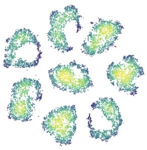  
(a) Box 3D

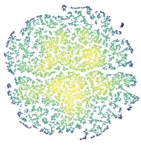  
(b) Box 2D

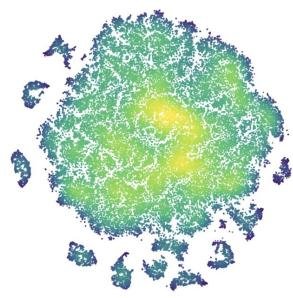  
(c) Mask  
Figure 6: The visualization of latent space in DVD with t-SNE. (a) The vector latent space of 3D boxes. (b) The vector latent space of 3D boxes. (c) The vector latent space of 2D masks.

## D More Ablation Studies

## D.1 Comparison of different representations

As shown in Table 11, we report the detailed results of average number of tokens generated per object and the average inference latency across 3D grounding, 2D grounding, and 2D referring segmentation tasks on SUN-RGBD [38] and RefCOCOg [22] datasets. Existing MLLM-based methods rely on textbased coordinate representation, which generates excessive tokens (512 and 74 tokens for mask and 3D bounding box, respectively) and thus increases inference latency. In contrast, our DVD leverages the unified codebook to map 1D vector sequences into compact discrete tokens, achieving significant reductions in token count, leading to much faster inference speed. Although special token achieves obvious computation cost reduction, this representation brings significant performance degradation because it struggle with the limited range and precision. Compared to special token, DVD achieves a significant performance improvement in the 3D scene, illustrating the superiority of our method in precise localization capabilities. These results demonstrate that our dynamic vector decoding method not only maintains strong performance on perception tasks but also achieves remarkable efficiency.

## D.2 Vector Latent Distribution

We provide visualization of the learned vector latent space of discrete tokens in DVD. As shown in Figure 6, the results show that there are obvious clusters for distributions of different perception tasks. For example, we use 8 tokens to represent one 3D box and there are 8 clusters in the vector latent space. These results demonstrate that DVD effectively learn high-quality latent representations for 1D vector representation.

We also visualize the distribution in the high-dimensional space of different perception vector representations to demonstrate the effectiveness of DVD in unifying 2D and 3D perception tasks. As shown in Figure 7, DVD produces there latent clusters in high-dimensional space for 2D and 3D perception tasks.

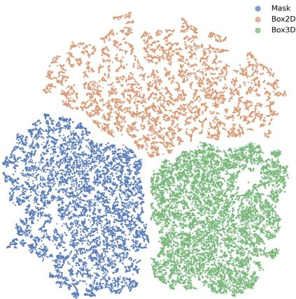  
Figure 7: The visualization of latent space in DVD with t-SNE for unifying 2D and 3D perception tasks. There are there obvious clusters, illustrating the effectiveness of our dynamic vector representation learning process.

## D.3 The Codebook Utilization

We additionally provide the codebook utilization on the validation set to investigate the learning quality of latent space. As shown in Table 12, the codebook is healthy and near-saturated (99.98% active codes overall) with no sign of codebook collapse. Consistent with the task-aware clusters in Figure 6 and Figure 7, each task occupies its own subset of codes. The simplest representation 2D box (only 2 tokens per box) achieves activate fewer codes (72.2%), while fine-grained masks spread over more codes with the highest usage uniformity.

## E Visualization

We further present more detailed visualization results to fully demonstrate the superior perception capabilities of DVD across both 2D and 3D perception tasks. As shown in Figure 8, we present qualitative visualization results of DVD on the 3D grounding task, covering both indoor and outdoor scenarios. Notably, even under challenging conditions (e.g., rainy weather, cluttered 3D scenes with dense objects) DVD consistently achieves precise 3D localization.

In Figure 9, we showcase the results of DVD on the 2D grounding task. DVD accurately follows instructions and outputs tightly aligned 2D bounding boxes, without misalignment, highlighting its exceptional ability to visual localization.

Additionally, Figure 10 includes visualizations of segmentation masks generated by DVD for diverse objects under various instruction prompts. DVD precisely segments target objects of arbitrary shapes, even in cases with ambiguous boundaries or overlapping objects, further verifying its fine-grained perceptual capability.

## F Limitations and Future Works

## F.1 Limitations

Despite the advantages of our Dynamic Vector Decoding (DVD) framework in unifying 2D and 3D perception for MLLMs, it has some limitations. The reconstruction performance of our dynamic vector representation learning can still be improved to achieve better performance even with a larger downsampling factor. Moreover, the DVD de-tokenizer for codebook learning, while effective, is designed as a separate component from the MLLM. This decoupling may lead to suboptimal alignment between the learned discrete tokens and the semantic understanding of MLLM.

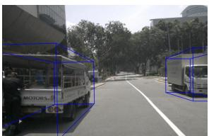  
truck

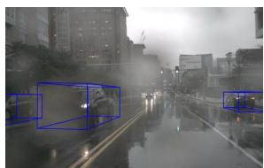  
car

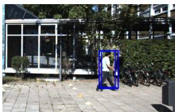  
pedestrian

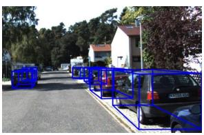  
car

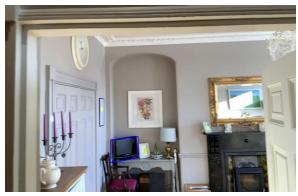

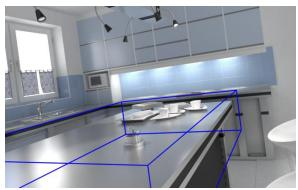

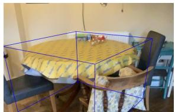  
TV  
table  
table

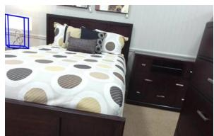  
lamp

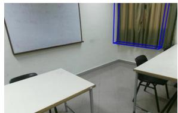  
curtain

Figure 8: The qualitative visualization of DVD on the 3D grounding task.  
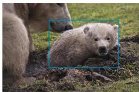  
baby bear

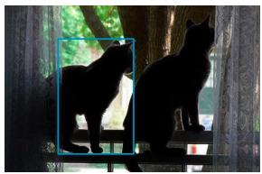  
shorter cat on left side

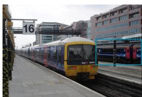  
train in the background

  
boat to the right of the pole

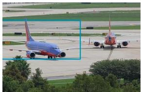  
aircraft heading … runway

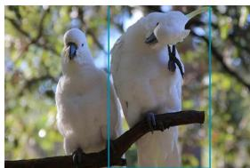  
cockatoo scratching head

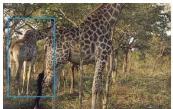  
giraffe in back

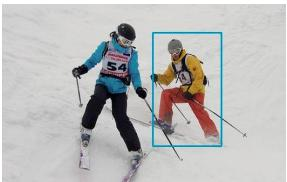  
skier in red pants

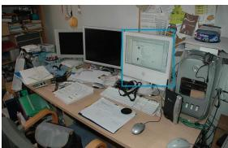  
apple desktop computer

Figure 9: The qualitative visualization of DVD on the 2D grounding task.

  
black dog outside

  
blue dock with bikes

  
naval boat parked far

  
carrot touching potatoes

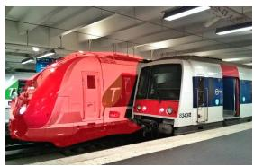  
train with green T

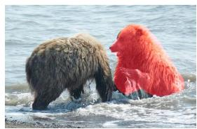  
bear on right

  
Boat with rx60

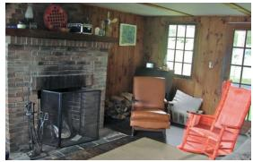  
wicker rocking chair

  
a green vw van

Figure 10: The qualitative visualization of DVD on the 2D RES task.

## F.2 Future Works

Our method can support more representations of more perception tasks. Future work will further optimize the dynamic vector representation learning process, extend the codebook to diverse tasks, and explore end-to-end training of the encoder-decoder and MLLM.

## G Broader Impacts

Our DVD framework provides a new generalizable paradigm for efficient MLLM-based perception. On the one hand, it benefits autonomous driving and robotics by reducing overhead and unifying 2D and 3D perception tasks. On the other hand, it reduces the difficulty of deploying large models on the edge by significantly reducing computational overhead, and lowers the research threshold to promote innovation for MLLMs.

However, due to its powerful perception capabilities, our research could be misused in closed-circuit television surveillance systems and affect personal privacy.